<div style="color:#16b0ff;font-size:50px;font-weight: 900;text-shadow: 5px 5px 10px var(--theme-color);font-family: 'Comic Sans MS';">Algorithm</div>

<span style="color:#16b0ff;font-size:20px;font-weight: 900;font-family: 'Comic Sans MS';">Introduction</span>：收纳技术相关的 `Data Structure`、`Algorithm`、`Design Pattern`等总结！

[TOC]

# Data Structure

## 位运算

- **左移( << )**：操作数的非0位左移n位，低位补0

- **右移( >> )**：操作数的非0位右移n位，高位补0

- **无符号右移( >>> )**：正数右移，高位用0补，负数右移，高位用1补，当负数使用无符号右移时，用0进行补位

- **位非( ~ )**：操作数为1则为0，否则为1

- **位与( & )**：第一个数和第二个数，都为1则为1，否则为0

- **位或( | )**：第一个数和第二个数，有一个为1则为1，否则为0

- **位异或( ^ )**：第一个数和第二个数，有一个不相同则为1，否则为0

  ```java
  a^a=0; 		 // 自己和自己异或等于0
  a^0=a; 		 // 任何数字和0异或还等于他自己
  a^b^c=a^c^b; // 异或运算具有交换律
  ```

  


### 左移( << )

案例如下：

`5<<2=20`

首先会将5转为2进制表示形式(java中，整数默认就是int类型,也就是32位):
0000 0000 0000 0000 0000 0000 0000 0`101`           然后左移2位后，低位补0：
0000 0000 0000 0000 0000 0000 000`101` `00`           换算成10进制为20


### 右移( >> ) 

案例如下：

`5>>2=1`

还是先将5转为2进制表示形式：

0000 0000 0000 0000 0000 0000 0000 0`101` 然后右移2位，高位补0

`00`00 0000 0000 0000 0000 0000 0000 000`1`


### 无符号右移( >>> ) 

我们知道在Java中int类型占32位，可以表示一个正数，也可以表示一个负数。正数换算成二进制后的最高位为0，负数的二进制最高为为1。**正数右移，高位用0补，负数右移，高位用1补，当负数使用无符号右移时，用0进行补位**。

案例如下：

`5>>3=1`

`-5>>-1`

`-5>>>536870911`

我们来看看它的移位过程(可以通过其结果换算成二进制进行对比)：

5换算成二进制： 0000 0000 0000 0000 0000 0000 0000 0101

5右移3位后结果为0，0的二进制为： 0000 0000 0000 0000 0000 0000 0000 0000        // (用0进行补位)

-5换算成二进制： 1111 1111 1111 1111 1111 1111 1111 1011

-5右移3位后结果为-1，-1的二进制为：  1111 1111 1111 1111 1111 1111 1111 1111   // (用1进行补位)

-5无符号右移3位后的结果 536870911 换算成二进制：  0001 1111 1111 1111 1111 1111 1111 1111   // (用0进行补位)


### 位非( ~ )

操作数的第n位为1，那么结果的第n位为0，反之。

案例如下：

`~5=-6`

5转换为二进制：0000 0000 0000 0000 0000 0000 0000 0101

-6转换为二进制：1111 1111 1111 1111 1111 1111 1111 1010


### 位与( & ) 

**都为1则为1，否则为0**。第一个操作数的第n位于第二个操作数的第n位如果都是1，那么结果的第n为也为1，否则为0。

案例如下：

`5&3=1`

将2个操作数和结果都转换为二进制进行比较：
5转换为二进制：0000 0000 0000 0000 0000 0000 0000 0`101`

3转换为二进制：0000 0000 0000 0000 0000 0000 0000 0`011`

1转换为二进制：0000 0000 0000 0000 0000 0000 0000 0`001`

### 位或( | )

第一个操作数的的第n位于第二个操作数的第n位 只要有一个是1，那么结果的第n为也为1，否则为0。

案例如下：

`5|3=7`

5转换为二进制：0000 0000 0000 0000 0000 0000 0000 0101

3转换为二进制：0000 0000 0000 0000 0000 0000 0000 0011

7转换为二进制：0000 0000 0000 0000 0000 0000 0000 0111


### 位异或( ^ )

第一个操作数的的第n位于第二个操作数的第n位 相反，那么结果的第n为也为1，否则为0。

`a^0=a`

案例如下：

`5^3=6`

5转换为二进制：0000 0000 0000 0000 0000 0000 0000 0101

3转换为二进制：0000 0000 0000 0000 0000 0000 0000 0011

6转换为二进制：0000 0000 0000 0000 0000 0000 0000 0110


### 衍生

由位运算操作符衍生而来的有：

`&=` 按位与赋值

`|=` 按位或赋值

`^=` 按位非赋值

`>>=` 右移赋值

`>>=` 无符号右移赋值

`<<=` 赋值左移

和 += 一个概念而已。


## 常用数据结构

### 数组(Array)

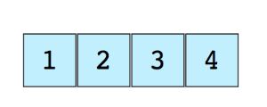

**优点**

- 构建非常简单
- 能在 O(1) 的时间里根据数组的下标（index）查询某个元素

**缺点**

- 构建时必须分配一段连续的空间
- 查询某个元素是否存在时需要遍历整个数组，耗费 O(n) 的时间（其中，n 是元素的个数）
- 删除和添加某个元素时，同样需要耗费 O(n) 的时间

**基本操作**

- **insert**：在某个索引处插入元素
- **get**：读取某个索引处的元素
- **delete**：删除某个索引处的元素
- **size**：获取数组的长度


**案例一：翻转字符串“algorithm”**


**解法**：用两个指针，一个指向字符串的第一个字符 a，一个指向它的最后一个字符 m，然后互相交换。交换之后，两个指针向中央一步步地靠拢并相互交换字符，直到两个指针相遇。这是一种比较快速和直观的方法。

**案例二：给定两个字符串s和t，编写一个函数来判断t是否是s的字母异位词。**

说明：你可以假设字符串只包含小写字母。

**解题思路**：字母异位词，也就是两个字符串中的相同字符的数量要对应相等。

- 可以利用两个长度都为 26 的字符数组来统计每个字符串中小写字母出现的次数，然后再对比是否相等
- 可以只利用一个长度为 26 的字符数组，将出现在字符串 s 里的字符个数加 1，而出现在字符串 t 里的字符个数减 1，最后判断每个小写字母的个数是否都为 0


### 链表(Linked List)

链表（Linked List）是一种常见的基础数据结构，是一种线性表，但是并不会按线性的顺序存储数据，而是在每一个节点里存到下一个节点的指针（Pointer）。

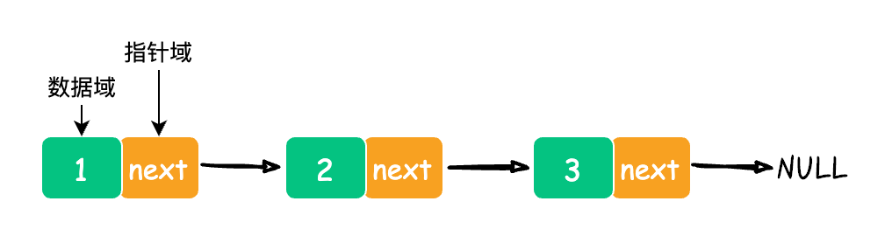

**优点**

- 链表能灵活地分配内存空间
- 能在 O(1) 时间内删除或者添加元素

**缺点**

- 不像数组能通过下标迅速读取元素，每次都要从链表头开始一个一个读取
- 查询第 k 个元素需要 O(k) 时间

**基本操作**

- **insertAtEnd**：在链表结尾插入元素
- **insertAtHead**：在链表开头插入元素
- **delete** ：删除链表的指定元素
- **deleteAtHead** ：删除链表第一个元素
- **search**：在链表中查询指定元素
- **isEmpty**：查询链表是否为空

**应用场景**

- 如果要解决的问题里面**需要很多快速查询**，链表可能并不适合
- 如果遇到的问题中，数据的元素个数不确定，而且需要**经常进行数据的添加和删除**，那么链表会比较合适
- 如果数据元素大小确定，**删除和插入的操作并不多**，那么数组可能更适合


**链表实现数据结构**

**① 用链表实现队列**

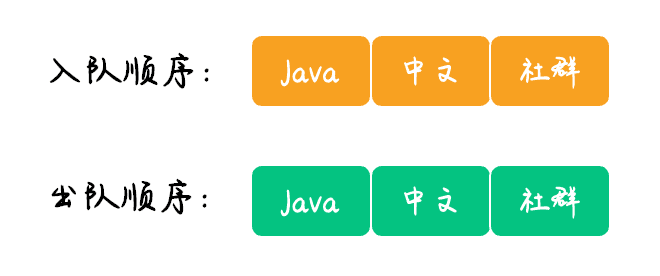

**② 用链表实现栈**

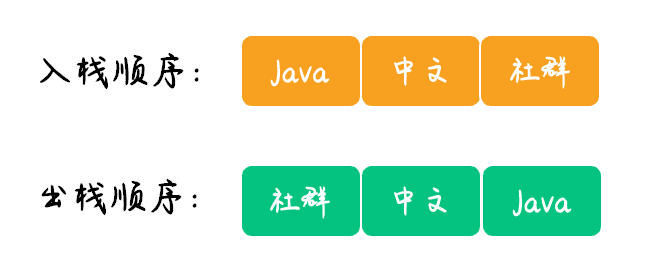


**链表翻转算法**

**① 递归翻转**

```java
/**
 * 链表递归翻转模板
 */
public Node reverseLinkedList(参数0) {
    // Step1：终止条件
    if (终止条件) {
        return;
    }
    
    // Step2：逻辑处理：可能有，也可能没有，具体问题具体分析
    // Step3：递归调用
    Node reverse = reverseLinkedList(参数1);
    // Step4：逻辑处理：可能有，也可能没有，具体问题具体分析
}

/**
 * 链表递归翻转算法
 */
public Node reverseLinkedList(Node head) {
        // Step1：终止条件
        if (head == null || head.next == null) {
        	return head;
        }
    
        // Step2：保存当前节点的下一个结点
        Node next = head.next;
        // Step3：从当前节点的下一个结点开始递归调用
        Node reverse = reverseLinkedList(next);
        // Step4：head挂到next节点的后面就完成了链表的反转
        next.next = head;
        // 这里head相当于变成了尾结点，尾结点都是为空的，否则会构成环
        head.next = null;
        return reverse;
}
```

**② 三指针翻转**

```java
public static Node reverseLinkedList(Node head) {
    // 单链表为空或只有一个节点，直接返回原单链表
    if (head == null || head.getNext() == null) {
        return head;
    }
    
    // 前一个节点指针
    Node preNode = null;
    // 当前节点指针
    Node curNode = head;
    // 下一个节点指针
    Node nextNode = null;
    while (curNode != null) {
        // nextNode 指向下一个节点
        nextNode = curNode.getNext();
        // 将当前节点next域指向前一个节点
        curNode.setNext(preNode);
        // preNode 指针向后移动
        preNode = curNode;
        // curNode指针向后移动
        curNode = nextNode;
    }
    
    return preNode;
}
```

**③ 利用栈翻转**

```java
public Node reverseLinkedList(Node node) {
    Stack<Node> nodeStack = new Stack<>();
    // 存入栈中，模拟递归开始的栈状态
    while (node != null) {
        nodeStack.push(node);
        node = node.getNode();
    }
    
    // 特殊处理第一个栈顶元素：反转前的最后一个元素，因为它位于最后，不需要反转
    Node head = null;
    if ((!nodeStack.isEmpty())) {
        head = nodeStack.pop();
    }
    
    // 排除以后就可以快乐的循环
    while (!nodeStack.isEmpty()) {
        Node tempNode = nodeStack.pop();
        tempNode.getNode().setNode(tempNode);
        tempNode.setNode(null);
    }
    
    return head;
}
```


#### 单向链表

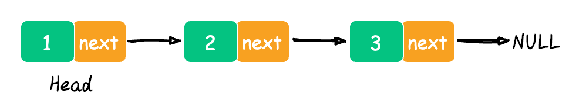

单向链表包含两个域：

- **一个数据域**：用于存储数据
- **一个指针域**：用于指向下一个节点（最后一个节点则指向一个空值）：

单链表的遍历方向单一，只能从链头一直遍历到链尾。它的缺点是当要查询某一个节点的前一个节点时，只能再次从头进行遍历查询，因此效率比较低，而双向链表的出现恰好解决了这个问题。单向链表代码如下：

```java
public class Node<E> {
   private Eitem;
   private Node<E> next;
}
```


#### 双向链表

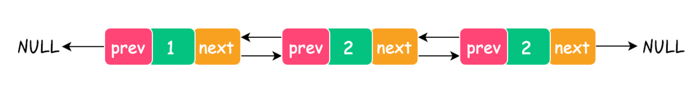

双向链表的每个节点由三部分组成：

- **prev指针**：指向前置节点
- **item节点**：数据信息
- **next指针**：指向后置节点

双向链表代码如下：

```kotlin
public class Node<E> {
   private E item;
   private Node<E> next;
   private Node<E> prev;
}
```


#### 循环链表

循环链表又分为单循环链表和双循环链表，也就是将单向链表或双向链表的首尾节点进行连接。

- **单循环链表**

  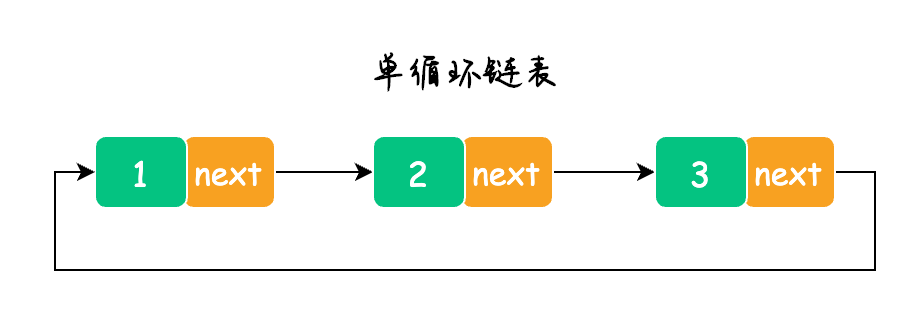

- **双循环链表**

  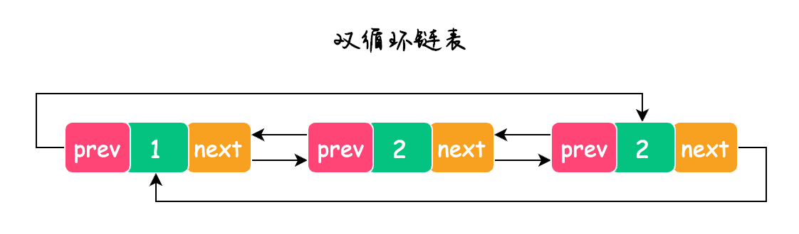


### 栈(Stack)

栈是一种**先进后出**（`FILO`，First in last out）或**后进先出**（`LIFO`，Last in first out）的数据结构。

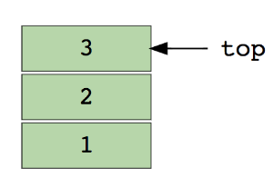

- **单向链表**：可以利用一个单链表来实现栈的数据结构。而且，因为我们都只针对栈顶元素进行操作，所以借用单链表的头就能让所有栈的操作在 O(1) 的时间内完成。
- **Stack**：是Vector的子类，比Vector多了几个方法

```java
public class Stack<E> extends Vector<E> {
        // 把元素压入栈顶
        public E push(E item) {
            addElement(item);
            return item;
        }
    
        // 弹出栈顶元素
        public synchronized E pop() {
            E obj;
            int len = size();
            obj = peek();
            removeElementAt(len - 1);
            return obj;
        }
    
        // 访问当前栈顶元素，但是不拿走栈顶元素
        public synchronized E peek() {
            int len = size();
            if (len == 0)
                throw new EmptyStackException();
            return elementAt(len - 1);
        }
    
	// 测试堆栈是否为空
        public boolean empty() {
            return size() == 0;
        }
        
        // 返回对象在堆栈中的位置，以1为基数
        public synchronized int search(Object o) {
            int i = lastIndexOf(o);
            if (i >= 0) {
                return size() - i;
            }
            return -1;
        }
}
```

**基本操作**（失败时：add/remove/element为抛异常，offer/poll/peek为返回false或null）

- `E push(E)`：把元素压入栈
- `E pop()`：把栈顶的元素弹出
- `E peek()`：取栈顶元素但不弹出
- `boolean empty()`：堆栈是否为空测试
- `int search(o)`：返回对象在堆栈中的位置，以 1 为基数

**应用场景**

在解决某个问题的时候，只要求关心最近一次的操作，并且在操作完成了之后，需要向前查找到更前一次的操作。

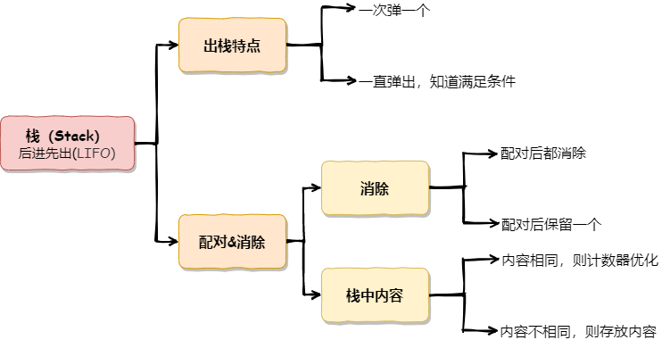


**案例一：判断字符串是否有效**

给定一个只包括 '('，')'，'{'，'}'，'['，']' 的字符串，判断字符串是否有效。有效字符串需满足：

- 左括号必须用相同类型的右括号闭合
- 左括号必须以正确的顺序闭合
- 空字符串可被认为是有效字符串

**解题思路**：利用一个栈，不断地往里压左括号，一旦遇上了一个右括号，我们就把栈顶的左括号弹出来，表示这是一个合法的组合，以此类推，直到最后判断栈里还有没有左括号剩余。


**案例二：每日温度**

根据每日气温列表，请重新生成一个列表，对应位置的输入是你需要再等待多久温度才会升高超过该日的天数。如果之后都不会升高，请在该位置用 0 来代替。

**解题思路**

- 思路 1：最直观的做法就是针对每个温度值向后进行依次搜索，找到比当前温度更高的值，这样的计算复杂度就是 O(n2)。

- 思路 2：可以运用一个堆栈 stack 来快速地知道需要经过多少天就能等到温度升高。从头到尾扫描一遍给定的数组 T，如果当天的温度比堆栈 stack 顶端所记录的那天温度还要高，那么就能得到结果。

  


### 队列(Queue)

队列(Queue)和栈不同，队列的最大特点是**先进先出**（`FIFO`），就好像按顺序排队一样。对于队列的数据来说，我们只允许在队尾查看和添加数据，在队头查看和删除数据。

- **栈**：采用**后进先出**（`LIFO`）
- **队列**：采用 **先进先出**（First in First Out，即`FIFO`）

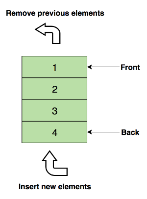

**实现方式**

可借助**双链表**来实现队列。双链表的头指针允许在队头查看和删除数据，而双链表的尾指针允许在队尾查看和添加数据。

**基本操作**（失败时：add/remove/element为抛异常，offer/poll/peek为返回false或null）

- `int size()`：获取队列长度
- `boolean add(E)`/`boolean offer(E)`：添加元素到队尾
- `E remove()`/`E poll()`：获取队首元素并从队列中删除
- `E element()`/`E peek()`：获取队首元素但并不从队列中删除

**应用场景**

当需要按照一定的顺序来处理数据，而该数据的数据量在不断地变化的时候，则需要队列来处理。


### 双端队列（Deque）
双端队列和普通队列最大的不同在于，它允许我们在队列的头尾两端都能在 O(1) 的时间内进行数据的查看、添加和删除。

**实现方式**

双端队列（Deque）与队列相似，可以利用一个**双链表实现**双端队列。

**应用场景**

双端队列最常用的地方就是实现一个长度动态变化的窗口或者连续区间，而动态窗口这种数据结构在很多题目里都有运用。


**案例一：滑动窗口最大值**

给定一个数组 nums，有一个大小为 k 的滑动窗口从数组的最左侧移动到数组的最右侧。你只可以看到在滑动窗口 k 内的数字，滑动窗口每次只向右移动一位，就返回当前滑动窗口中的最大值。

**解题思路**

- 思路 1：移动窗口，扫描，获得最大值。假设数组里有 n 个元素，算法复杂度就是 O(n)。这是最直观的做法。

- 思路 2：利用一个双端队列来保存当前窗口中最大那个数在数组里的下标，双端队列新的头就是当前窗口中最大的那个数。通过该下标，可以很快知道新窗口是否仍包含原来那个最大的数。如果不再包含，就把旧的数从双端队列的头删除。

  因为双端队列能让上面的这两种操作都能在 O(1) 的时间里完成，所以整个算法的复杂度能控制在 O(n)。

  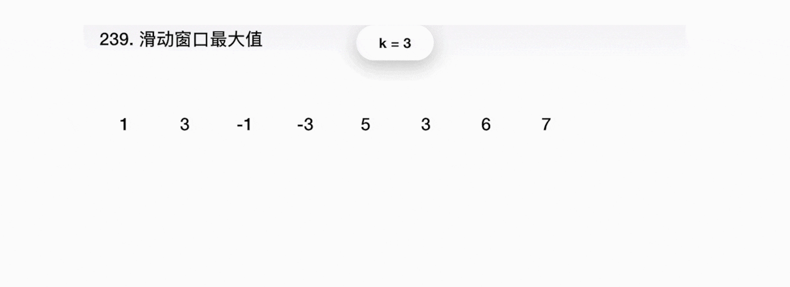


### 树(Tree)

**树(Tree)**是一个分层的数据结构，由节点和连接节点的边组成。是一种特殊的图，它与图最大的区别是没有循环。树的结构十分直观，而树的很多概念定义都有一个相同的特点：递归。也就是说，一棵树要满足某种性质，往往要求每个节点都必须满足。而树的考题，无非就是要考查树的遍历以及序列化（serialization)。常见的树：

- **普通二叉树**
- **平衡二叉树**
- **完全二叉树**
- **二叉搜索树**
- **四叉树（Quadtree）**
- **多叉树（N-ary Tree）**
- **红黑树（Red-Black Tree）**
- **自平衡二叉搜索树（AVL Tree）**

#### 二叉树(Binary Tree)

**二叉树（Binary Tree）**是n(n>=0)个结点的有限集合，该集合或者为空集（空二叉树），或者由一个根结点和两棵互不相交的、分别称为根结点的左子树和右子树的二叉树组成（子树也为二叉树）。


**二叉树特点**

- 每个结点最多有两棵子树，所以**二叉树中不存在度大于2的结点**
- 左子树和右子树是有顺序的，次序不能任意颠倒
- 即使树中某结点只有一棵子树，也要区分它是左子树还是右子树


**二叉树性质**

- **性质1**：在二叉树的第 i 层上**最多**有2^(i-1)个结点（i≥1）
- **性质2**：深度为k的二叉树**最多**有2^k-1个结点（k≥1）
- **性质3**：对任何一二叉树，如果其终端结点数(叶子节点数)为X,度为2的结点数为Y，则X = Y+1
- **性质4**：n个结点的完全二叉树的深度为[log2 n ] + 1
- **性质5**：对于任意一个完全二叉树来说，如果将含有的结点按照层次从左到右依次标号，对于任意一个结点 i ，完全二叉树还有以下3个结论成立：
  - 当 i>1 时，父亲结点为结点 [i/2] 。（i=1 时，表示的是根结点，无父亲结点）
  - 如果 2×i>n（总结点的个数） ，则结点 i 肯定没有左孩子（为叶子结点）；否则其左孩子是结点 2×i 。
  - 如果 2×i+1>n ，则结点 i 肯定没有右孩子；否则右孩子是结点 2×i+1


**存储结构**

其中data是数据域，lchild和rchild都是指针域，分别指向左孩子和右孩子。

```java
public class TreeNode {
    public Object data;
    public TreeNode leftChild;
    public TreeNode rightChild;
}
```


#### 红黑树(Red Black Tree)

红黑树全称是Red-Black Tree，一种特殊的二叉查找树。红黑树的每个节点上都有存储位表示节点的颜色，可以是红(Red)或黑(Black)。


红黑树的特性:

- **每个节点或者是黑色，或者是红色**
- **根节点是黑色**
- **每个叶子节点（NIL）是黑色。 注意：这里叶子节点，是指为空(NIL或NULL)的叶子节点**
- **如果一个节点是红色的，则它的子节点必须是黑色的**
- **从一个节点到该节点的子孙节点的所有路径上包含相同数目的黑节点**

正是红黑树的这5条性质，使一棵n个结点的红黑树始终保持了logn的高度，从而也就解释了“红黑树的查找、插入、删除的时间复杂度最坏为O(log n)”这一结论成立的原因。


**① 左旋**

逆时针旋转两个节点，让一个节点被其右子节点取代，而该节点成为右子节点的左子节点。

对x进行左旋，意味着"将x变成一个左节点"。


**② 右旋**

顺时针旋转两个节点，让一个节点被其左子节点取代，而该节点成为左子节点的右子节点。

对x进行左旋，意味着"将x变成一个左节点"。


**③ 变色**

变颜色条件：两个连续红色节点，并且叔叔节点是红色。


**④ 左旋条件**

两个连续红节点，并且叔叔节点是黑色 , 下面的红色节点在右子树。

**情况1**：如果当前节点是右子树，并且父节点是左子树。`形如：(900是新插入节点)`

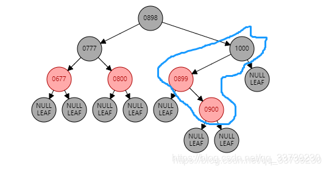

要根据父节点左旋【899】（根据谁左旋，谁就变成子节点）：


【900】的左子树 挂到 【899】的右子树上 ， 【899】变为子节点 ， 【900】变为父节点`
`此时不变色。

**情况2**：如果当前节点是右子树，并且父节点是右子树。形如：(【100】是当前节点)

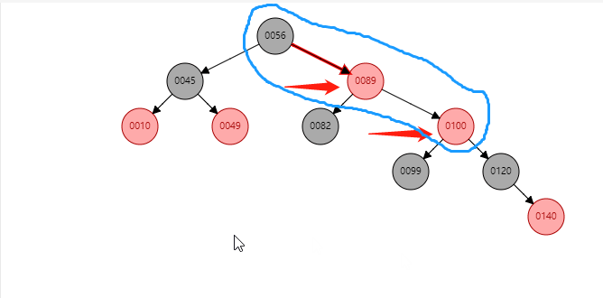

根据祖父节点左旋【56】（根据谁左旋，谁就变成子节点)：

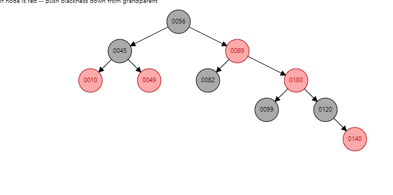

【56】变为子节点，【89】变为父节点，【89】的左子树 挂到 【56】的右子树。同时： 父节点变黑（【89】变黑），祖父节点变红（【56】变红 )。


**⑤ 右旋条件**

两个连续红节点，并且叔叔节点是黑色 , 下面的红色节点在左子树。
**情况1**：如果当前节点是左子树，并且父节点也是右子树。形如：(【8000】是当前节点)

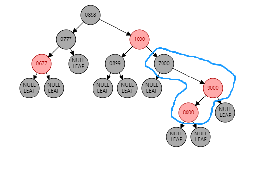

根据父节点右旋【9000】（根据谁右旋，谁就变成子节点）：

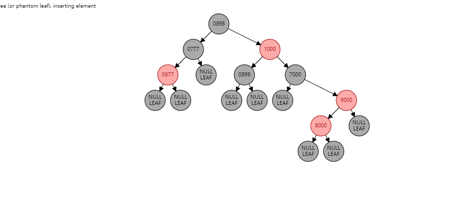

【9000】变为子节点，【8000】变为父节点，【8000】的右子树 挂到 【9000】的左子树，此时不变色。

**情况2**：如果当前节点是左子树，并且父节点也是左子树。形如：(【899】是当前节点)

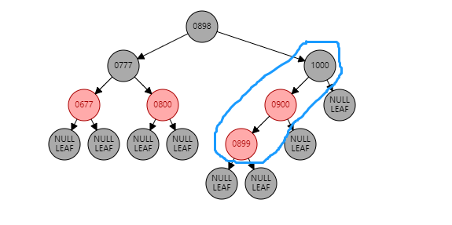

根据祖父节点右旋【1000】（根据谁右旋，谁就变成子节点）:

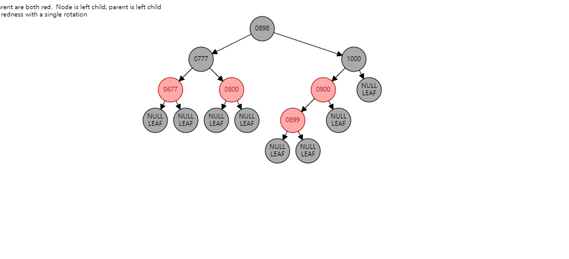

【1000】变为子节点，【900】变为父节点，【900】的右子树 挂到 【1000】的左子树
同时： 父节点变黑（【900】变黑），祖父节点变红（【1000】变红）。


**⑥ 旋转场景**

无法通过变色而进行旋转的场景分为以下四种：

**场景一：左左节点旋转**
这种情况下，父节点和插入的节点都是左节点，如下图(旋转原始图1)这种情况下，我们要插入节点 65。

规则如下：以祖父节点【右旋】，搭配【变色】。


按照规则，步骤如下：

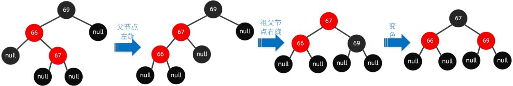

**场景二：左右节点旋转**
这种情况下，父节点是左节点，插入的节点是右节点，在旋转原始图 1 中，我们要插入节点 67。

规则如下：先父节点【左旋】，然后祖父节点【右旋】，搭配【变色】。

按照规则，步骤如下：

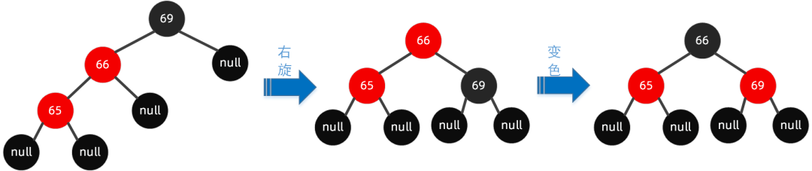

**场景三：右左节点旋转**
这种情况下，父节点是右节点，插入的节点是左节点，如下图（旋转原始图 2）这种情况，我们要插入节点 68。

规则如下：先父节点【右旋】，然后祖父节点【左旋】，搭配【变色】。

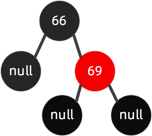

按照规则，步骤如下：

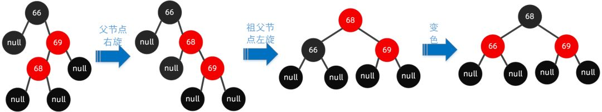

**场景四：右右节点旋转**
这种情况下，父节点和插入的节点都是右节点，在旋转原始图 2 中，我们要插入节点 70。

规则如下：以祖父节点【左旋】，搭配【变色】。

按照规则，步骤如下：

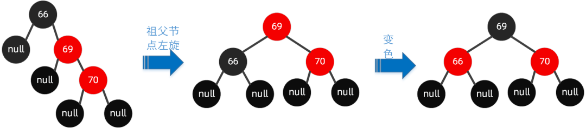


#### 树的遍历

**① 前序遍历（Preorder Traversal）**

**实现原理**：`先访问根节点，然后访问左子树，最后访问右子树`。在访问左、右子树的时候，同样，先访问子树的根节点，再访问子树根节点的左子树和右子树，这是一个不断递归的过程。


**应用场景**：运用最多的场合包括在树里进行搜索以及创建一棵新的树。


**② 中序遍历（Inorder Traversal）**

**实现原理**：`先访问左子树，然后访问根节点，最后访问右子树`。在访问左、右子树的时候，同样，先访问子树的左边，再访问子树的根节点，最后再访问子树的右边。


**应用场景**：最常见的是二叉搜索树，由于二叉搜索树的性质就是左孩子小于根节点，根节点小于右孩子，对二叉搜索树进行中序遍历的时候，被访问到的节点大小是按顺序进行的。


**③ 后序遍历（Postorder Traversal）**

**实现原理**：`先访问左子树，然后访问右子树，最后访问根节点`。


**应用场景**：在对某个节点进行分析的时候，需要来自左子树和右子树的信息。收集信息的操作是从树的底部不断地往上进行，好比你在修剪一棵树的叶子，修剪的方法是从外面不断地往根部将叶子一片片地修剪掉。


**案例一：二叉搜索中第K小的元素**

给定一个二叉搜索树，编写一个函数 kthSmallest 来查找其中第 k 个最小的元素。

**解题思路**

这道题考察了两个知识点：

- **二叉搜索树的性质**：对于每个节点来说，该节点的值比左孩子大，比右孩子小，而且一般来说，二叉搜索树里不出现重复的值。

- **二叉搜索树的遍历**：二叉搜索树的中序遍历是高频考察点，节点被遍历到的顺序是按照节点数值大小的顺序排列好的。即，中序遍历当中遇到的元素都是按照从小到大的顺序出现。

因此，我们只需要对这棵树进行中序遍历的操作，当访问到第 k 个元素的时候返回结果就好。


## 高级数据结构

### 优先队列（Priority Queue）

能保证每次取出的元素都是队列中优先级别最高的。优先级别可以是自定义的，例如，数据的数值越大，优先级越高；或者数据的数值越小，优先级越高。优先级别甚至可以通过各种复杂的计算得到。

**实现方式**
优先队列的本质是一个二叉堆结构。堆在英文里叫 Binary Heap，它是利用一个数组结构来实现的完全二叉树。换句话说，优先队列的本质是一个数组，数组里的每个元素既有可能是其他元素的父节点，也有可能是其他元素的子节点，而且，每个父节点只能有两个子节点，很像一棵二叉树的结构。

**优先队列的性质**

- 数组里的第一个元素 array[0] 拥有最高的优先级别
- 给定一个下标 i，那么对于元素 array[i] 而言：
  - 它的父节点所对应的元素下标是 (i-1)/2
  - 它的左孩子所对应的元素下标是 2×i + 1
  - 它的右孩子所对应的元素下标是 2×i + 2
- 数组里每个元素的优先级别都要高于它两个孩子的优先级别

**应用场景**：从一堆杂乱无章的数据当中按照一定的顺序（或者优先级）逐步地筛选出部分乃至全部的数据。


**基本操作**

**① 向上筛选（sift up/bubble up）**

- 当有新的数据加入到优先队列中，新的数据首先被放置在二叉堆的底部。
- 不断进行向上筛选的操作，即如果发现该数据的优先级别比父节点的优先级别还要高，那么就和父节点的元素相互交换，再接着往上进行比较，直到无法再继续交换为止。

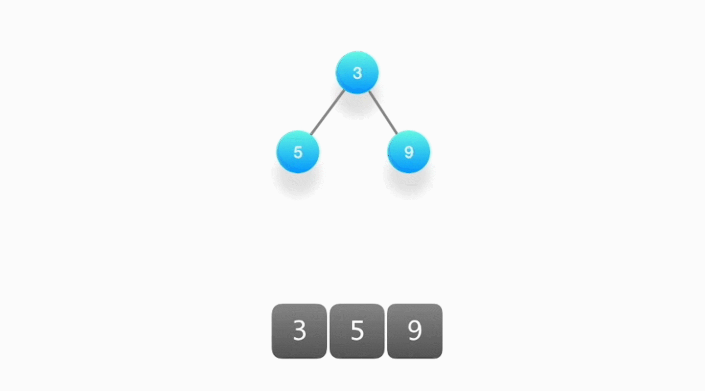

**时间复杂度**：由于二叉堆是一棵完全二叉树，并假设堆的大小为 k，因此整个过程其实就是沿着树的高度往上爬，所以只需要 O(logk) 的时间。

**② 向下筛选（sift down/bubble down）**

- 当堆顶的元素被取出时，要更新堆顶的元素来作为下一次按照优先级顺序被取出的对象，需要将堆底部的元素放置到堆顶，然后不断地对它执行向下筛选的操作。
- 将该元素和它的两个孩子节点对比优先级，如果优先级最高的是其中一个孩子，就将该元素和那个孩子进行交换，然后反复进行下去，直到无法继续交换为止。

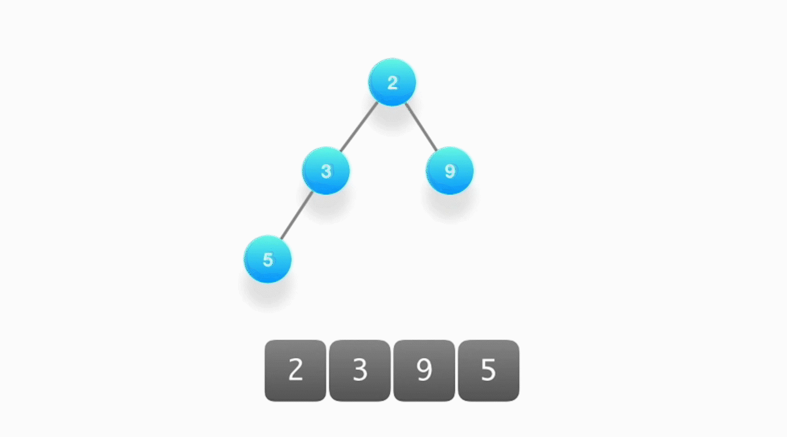

**时间复杂度**：整个过程就是沿着树的高度往下爬，所以时间复杂度也是 O(logk)。


**案例一：[前 K 个高频元素](https://leetcode-cn.com/problems/top-k-frequent-elements/)**

给你一个整数数组 `nums` 和一个整数 `k` ，请你返回其中出现频率前 `k` 高的元素。你可以按 **任意顺序** 返回答案。

**最小堆解法**：题目最终需要返回的是前 k 个频率最大的元素，可以想到借助堆这种数据结构，对于 k 频率之后的元素不用再去处理，进一步优化时间复杂度。


```java
public class Solution {
    public List<Integer> topKFrequent(int[] nums, int k) {
        // 使用字典，统计每个元素出现的次数，元素为键，元素出现的次数为值
        HashMap<Integer,Integer> map = new HashMap();
        for(int num : nums){
            if (map.containsKey(num)) {
               map.put(num, map.get(num) + 1);
             } else {
                map.put(num, 1);
             }
        }
        
        // 遍历map，用最小堆保存频率最大的k个元素
        PriorityQueue<Integer> pq = new PriorityQueue<>(new Comparator<Integer>() {
            @Override
            public int compare(Integer a, Integer b) {
                return map.get(a) - map.get(b);
            }
        });
        for (Integer key : map.keySet()) {
            if (pq.size() < k) {
                pq.add(key);
            } else if (map.get(key) > map.get(pq.peek())) {
                pq.remove();
                pq.add(key);
            }
        }
        
        // 取出最小堆中的元素
        List<Integer> res = new ArrayList<>();
        while (!pq.isEmpty()) {
            res.add(pq.remove());
        }
        return res;
    }
}
```


### 图（Graph）

**图(graph)**由多个**节点(vertex)**构成，节点之间阔以互相连接组成一个网络。(x, y)表示一条**边(edge)**，它表示节点 x 与 y 相连。边可能会有**权值(weight/cost)**。

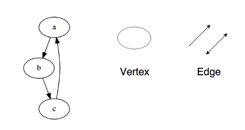


**常见图算法**

- 图的遍历：深度优先、广度优先
- 环的检测：有向图、无向图
- 拓扑排序
- 最短路径算法：Dijkstra、Bellman-Ford、Floyd Warshall
- 连通性相关算法：Kosaraju、Tarjan、求解孤岛的数量、判断是否为树
- 图的着色、旅行商问题等


### 前缀树（Trie）

假如有一个字典，字典里面有如下词："A"，"to"，"tea"，"ted"，"ten"，"i"，"in"，"inn"，每个单词还能有自己的一些权重值，那么用前缀树来构建这个字典将会是如下的样子：


**性质**

- 每个节点至少包含两个基本属性

  - children：数组或者集合，罗列出每个分支当中包含的所有字符
  - isEnd：布尔值，表示该节点是否为某字符串的结尾

- 前缀树的根节点是空的

  所谓空，即只利用到这个节点的 children 属性，即只关心在这个字典里，有哪些打头的字符

- 除了根节点，其他所有节点都有可能是单词的结尾，叶子节点一定都是单词的结尾


**实现**

- 创建

  - 遍历一遍输入的字符串，对每个字符串的字符进行遍历
  - 从前缀树的根节点开始，将每个字符加入到节点的 children 字符集当中
  - 如果字符集已经包含了这个字符，则跳过
  - 如果当前字符是字符串的最后一个，则把当前节点的 isEnd 标记为真。

  由上，创建的方法很直观。前缀树真正强大的地方在于，每个节点还能用来保存额外的信息，比如可以用来记录拥有相同前缀的所有字符串。因此，当用户输入某个前缀时，就能在 O(1) 的时间内给出对应的推荐字符串。

- 搜索

  与创建方法类似，从前缀树的根节点出发，逐个匹配输入的前缀字符，如果遇到了就继续往下一层搜索，如果没遇到，就立即返回。


### 线段树（Segment Tree）

假设有一个数组 array[0 … n-1]， 里面有 n 个元素，现在要经常对这个数组做两件事。

- 更新数组元素的数值
- 求数组任意一段区间里元素的总和（或者平均值）


**解法 1：遍历一遍数组**

- 时间复杂度 O(n)。

**解法 2：线段树**

- 线段树，就是一种按照二叉树的形式存储数据的结构，每个节点保存的都是数组里某一段的总和。
- 适用于数据很多，而且需要频繁更新并求和的操作。
- 时间复杂度 O(logn)。


**实现**
如数组是 [1, 3, 5, 7, 9, 11]，那么它的线段树如下。

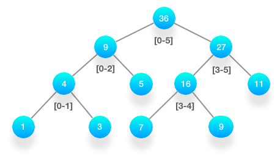

根节点保存的是从下标 0 到下标 5 的所有元素的总和，即 36。左右两个子节点分别保存左右两半元素的总和。按照这样的逻辑不断地切分下去，最终的叶子节点保存的就是每个元素的数值。


### 树状数组（Fenwick Tree）

树状数组（Fenwick Tree / Binary Indexed Tree）。

**举例**：假设有一个数组 array[0 … n-1]， 里面有 n 个元素，现在要经常对这个数组做两件事。

- 更新数组元素的数值
- 求数组前 k 个元素的总和（或者平均值）

 

**解法 1：线段树**

- 线段树能在 O(logn) 的时间里更新和求解前 k 个元素的总和

**解法 2：树状数**

- 该问题只要求求解前 k 个元素的总和，并不要求任意一个区间
- 树状数组可以在 O(logn) 的时间里完成上述的操作
- 相对于线段树的实现，树状数组显得更简单


**树状数组特点**

- 它是利用数组来表示多叉树的结构，在这一点上和优先队列有些类似，只不过，优先队列是用数组来表示完全二叉树，而树状数组是多叉树。
- 树状数组的第一个元素是空节点。
- 如果节点 tree[y] 是 tree[x] 的父节点，那么需要满足条件：y = x - (x & (-x))。


### 散列表(Hash)

散列表又称为**哈希表**，是将某个对象变换为唯一标识符，该标识符通常用一个短的随机字母和数字组成的字符串来代表。哈希可以用来实现各种数据结构，其中最常用的就是**哈希表(hash table)**。哈希表通常由数组实现。

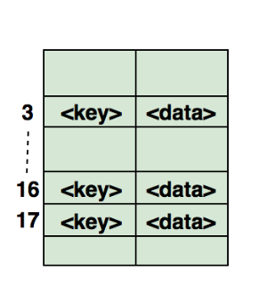


### 二叉堆

**最大堆**：任何一个父节点的值，都 **大于** 或 **等于** 它左、右子节点的值，**堆顶** 是整个堆中的 **最大** 元素。

**最小堆**：任何一个父节点的值，都 **小于** 或 **等于** 它左、右孩子节点的值，**堆顶** 是整个堆中的 **最小** 元素。


# Algorithm

## 复杂度


**相关概念**

- **稳定**：如果a原本在b前面，而a=b，排序之后a仍然在b的前面
- **不稳定**：如果a原本在b的前面，而a=b，排序之后 a 可能会出现在 b 的后面
- **时间复杂度**：对排序数据的总的操作次数。反映当n变化时，操作次数呈现什么规律
- **空间复杂度：**是指算法在计算机内执行时所需存储空间的度量，它也是数据规模n的函数


**时间复杂度与时间效率**：O(1) < O(log2N) < O(n) < O(N \* log2N) < O(N2) < O(N3) < 2N < 3N < N!

一般来说，前四个效率比较高，中间两个差强人意，后三个比较差（只要N比较大，这个算法就动不了了）。


### 常数阶

```java
int sum = 0,n = 100; //执行一次  
sum = (1+n)*n/2; //执行一次  
System.out.println (sum); //执行一次
```

上面算法的运行的次数的函数为 f(n)=3，根据推导大 O 阶的规则 1，我们需要将常数 3 改为 1，则这个算法的时间复杂度为 O(1)。如果 sum=(1+n)*n/2 这条语句再执行 10 遍，因为这与问题大小 n 的值并没有关系，所以这个算法的时间复杂度仍旧是 O(1)，我们可以称之为常数阶。


### 线性阶

线性阶主要要分析循环结构的运行情况，如下所示：

```java
for (int i = 0; i < n; i++) {
    //时间复杂度为O(1)的算法
    ...
}
```

上面算法循环体中的代码执行了n次，因此时间复杂度为O(n)。


### 对数阶

接着看如下代码：

```java
int number = 1;
while (number < n) {
    number = number * 2;
    //时间复杂度为O(1)的算法
    ...
}
```

可以看出上面的代码，随着 number 每次乘以 2 后，都会越来越接近 n，当 number 不小于 n 时就会退出循环。假设循环的次数为 X，则由 2^x=n 得出 x=log₂n，因此得出这个算法的时间复杂度为 O(logn)。


### 平方阶

下面的代码是循环嵌套：

```java
for (int i = 0; i < n; i++) {   	for(int j = 0; j < n; i++) {      //复杂度为O(1)的算法			... 	}}
```

内层循环的时间复杂度在讲到线性阶时就已经得知是O(n)，现在经过外层循环n次，那么这段算法的时间复杂度则为O(n²)。

## 算法思想

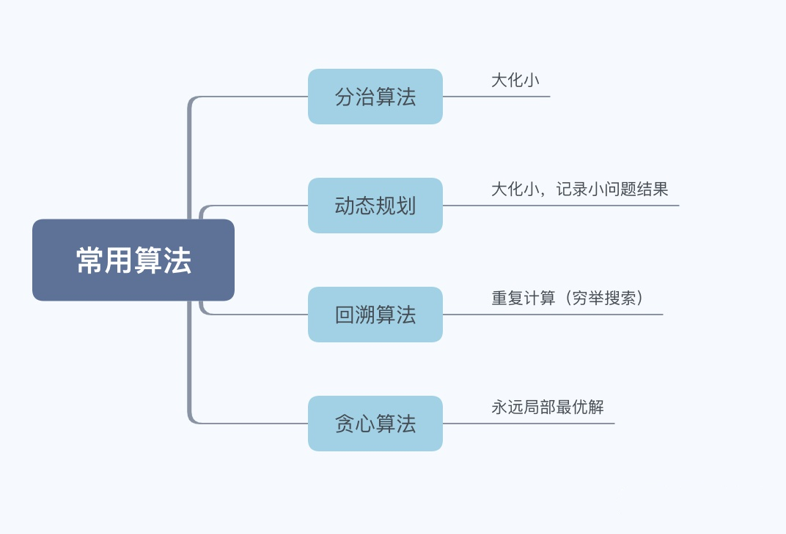

### 分治(Divide and Conquer)

分治算法思想很大程度上是基于递归的，也比较适合用递归来实现。顾名思义，分而治之。一般分为以下三个过程：

- **分解**：将原问题分解成一系列子问题
- **解决**：递归求解各个子问题，若子问题足够小，则直接求解
- **合并**：将子问题的结果合并成原问题

比较经典的应用就是`归并排序 (Merge Sort)` 以及`快速排序 (Quick Sort)` 等。我们来从归并排序理解分治思想，归并排序就是将待排序数组不断二分为规模更小的子问题处理，再将处理好的子问题合并起来。


### 贪心(Greedy)

`贪心算法`是`动态规划`算法的一个子集，可以更高效解决一部分更特殊的问题。实际上，用贪心算法解决问题的思路，并不总能给出最优解。因为它在每一步的决策中，选择目前最优策略，不考虑全局是不是最优。

**贪心算法+双指针求解**

- 给一个孩子的饼干应当尽量小并且能满足孩子，大的留来满足胃口大的孩子
- 因为胃口小的孩子最容易得到满足，所以优先满足胃口小的孩子需求
- 按照从小到大的顺序使用饼干尝试是否可满足某个孩子
- 当饼干 j >= 胃口 i 时，饼干满足胃口，更新满足的孩子数并移动指针 `i++ j++ res++`
- 当饼干 j < 胃口 i 时，饼干不能满足胃口，需要换大的 `j++`


### 回溯(Backtracking)

使用回溯法进行求解，回溯是一种通过穷举所有可能情况来找到所有解的算法。如果一个候选解最后被发现并不是可行解，回溯算法会舍弃它，并在前面的一些步骤做出一些修改，并重新尝试找到可行解。究其本质，其实就是枚举。

- 如果没有更多的数字需要被输入，说明当前的组合已经产生
- 如果还有数字需要被输入：
  - 遍历下一个数字所对应的所有映射的字母
  - 将当前的字母添加到组合最后，也就是 `str + tmp[r]`


### 动态规划(Dynamic Programming)

虽然动态规划的最终版本 (降维再去维) 大都不是递归，但解题的过程还是离开不递归的。新手可能会觉得动态规划思想接受起来比较难，确实，动态规划求解问题的过程不太符合人类常规的思维方式，我们需要切换成机器思维。使用动态规划思想解题，首先要明确动态规划的三要素。动态规划三要素：

- `重叠子问题`：切换机器思维，自底向上思考
- `最优子结构`：子问题的最优解能够推出原问题的优解
- `状态转移方程`：dp[n] = dp[n-1] + dp[n-2]


## 算法模板

### 递归模板

```java
public void recur(int level, int param) {
    // terminator 
    if (level > MAX_LEVEL) {
        // process result    
        return;
    }

    // process current logic  
    process(level, param);

    // drill down   
    recur(level + 1, newParam);

    // restore current status 
}
```

**List转树形结构**

- **方案一：两层循环实现建树**
- **方案二：使用递归方法建树**

```java
public class TreeNode {
    private String id;
    private String parentId;
    private String name;
    private List<TreeNode> children;

    /**
     * 方案一：两层循环实现建树
     *
     * @param treeNodes 传入的树节点列表
     * @return
     */
    public static List<TreeNode> bulid(List<TreeNode> treeNodes) {
        List<TreeNode> trees = new ArrayList<>();
        for (TreeNode treeNode : treeNodes) {
            if ("0".equals(treeNode.getParentId())) {
                trees.add(treeNode);
            }

            for (TreeNode it : treeNodes) {
                if (it.getParentId() == treeNode.getId()) {
                    if (treeNode.getChildren() == null) {
                        treeNode.setChildren(new ArrayList<TreeNode>());
                    }
                    treeNode.getChildren().add(it);
                }
            }
        }

        return trees;
    }

    /**
     * 方案二：使用递归方法建树
     *
     * @param treeNodes
     * @return
     */
    public static List<TreeNode> buildByRecursive(List<TreeNode> treeNodes) {
        List<TreeNode> trees = new ArrayList<>();
        for (TreeNode treeNode : treeNodes) {
            if ("0".equals(treeNode.getParentId())) {
                trees.add(findChildren(treeNode, treeNodes));
            }
        }

        return trees;
    }

    /**
     * 递归查找子节点
     *
     * @param treeNodes
     * @return
     */
    private static TreeNode findChildren(TreeNode treeNode, List<TreeNode> treeNodes) {
        for (TreeNode it : treeNodes) {
            if (treeNode.getId().equals(it.getParentId())) {
                if (treeNode.getChildren() == null) {
                    treeNode.setChildren(new ArrayList<>());
                }
                treeNode.getChildren().add(findChildren(it, treeNodes));
            }
        }

        return treeNode;
    }
}
```


### 回溯模板


### DFS模板


### BFS模板


## 查找算法

### 顺序查找

就是一个一个依次查找。


### 二分查找

二分查找又叫折半查找，从有序列表的初始候选区`li[0:n]`开始，通过对待查找的值与候选区中间值的比较，可以使候选区减少一半。如果待查值小于候选区中间值，则只需比较中间值左边的元素，减半查找范围。依次类推依次减半。

- 二分查找的前提：**列表有序**
- 二分查找的有点：**查找速度快**
- 二分查找的时间复杂度为：**O(logn)**

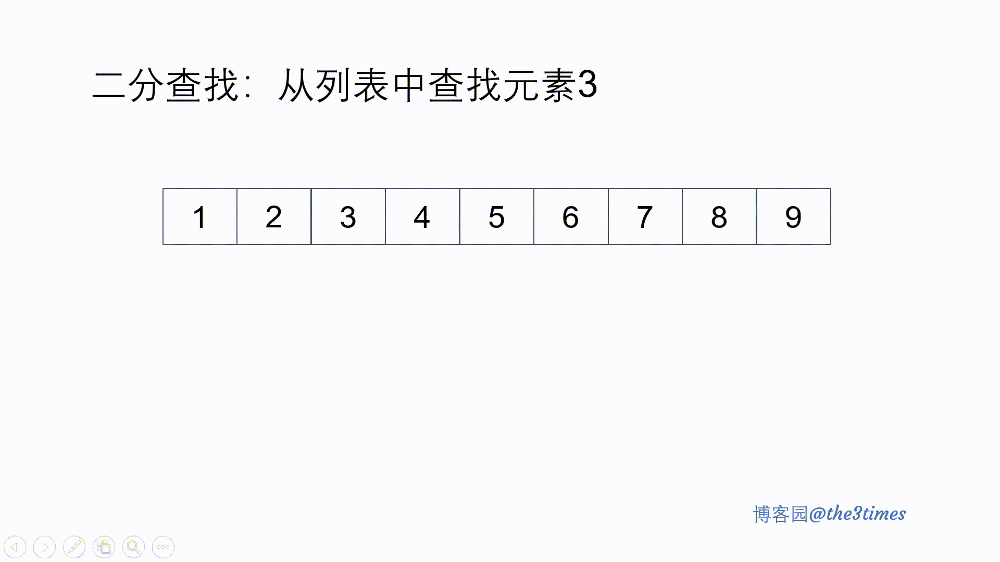

JAVA代码如下：

```java
/**
 * 执行递归二分查找，返回第一次出现该值的位置
 *
 * @param array     已排序的数组
 * @param start     开始位置，如：0
 * @param end       结束位置，如：array.length-1
 * @param findValue 需要找的值
 * @return 值在数组中的位置，从0开始。找不到返回-1
 */
public static int searchRecursive(int[] array, int start, int end, int findValue) {
        // 如果数组为空，直接返回-1，即查找失败
        if (array == null) {
            return -1;
        }
  
        if (start <= end) {
            // 中间位置
            int middle = (start + end) / 1;
            // 中值
            int middleValue = array[middle];
            if (findValue == middleValue) {
                // 等于中值直接返回
                return middle;
            } else if (findValue < middleValue) {
                // 小于中值时在中值前面找
                return searchRecursive(array, start, middle - 1, findValue);
            } else {
                // 大于中值在中值后面找
                return searchRecursive(array, middle + 1, end, findValue);
            }
        } else {
            // 返回-1，即查找失败
            return -1;
        }
}

/**
 * 循环二分查找，返回第一次出现该值的位置
 *
 * @param array     已排序的数组
 * @param findValue 需要找的值
 * @return 值在数组中的位置，从0开始。找不到返回-1
 */
public static int searchLoop(int[] array, int findValue) {
        // 如果数组为空，直接返回-1，即查找失败
        if (array == null) {
            return -1;
        }

        // 起始位置
        int start = 0;
        // 结束位置
        int end = array.length - 1;
        while (start <= end) {
            // 中间位置
            int middle = (start + end) / 2;
            // 中值
            int middleValue = array[middle];
            if (findValue == middleValue) {
                // 等于中值直接返回
                return middle;
            } else if (findValue < middleValue) {
                // 小于中值时在中值前面找
                end = middle - 1;
            } else {
                // 大于中值在中值后面找
                start = middle + 1;
            }
        }

        // 返回-1，即查找失败
        return -1;
}
```


### 插值查找

插值查找算法类似于二分查找，不同的是插值查找每次从自适应mid处开始查找。将折半查找中的求mid索引的公式，low表示左边索引left，high表示右边索引right，key就是前面我们讲的findVal。

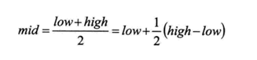      **改为**   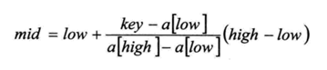  

**注意事项**

- 对于数据量较大，关键字分布比较均匀的查找表来说，采用插值查找，速度较快
- 关键字分布不均匀的情况下，该方法不一定比折半查找要好

```java
/**
 * 插值查找
 *
 * @param arr 已排序的数组
 * @param left 开始位置，如：0
 * @param right 结束位置，如：array.length-1
 * @param findValue
 * @return
 */
public static int insertValueSearch(int[] arr, int left, int right, int findValue) {
        //注意：findVal < arr[0]  和  findVal > arr[arr.length - 1] 必须需要, 否则我们得到的 mid 可能越界
        if (left > right || findValue < arr[0] || findValue > arr[arr.length - 1]) {
            return -1;
        }

        // 求出mid, 自适应
        int mid = left + (right - left) * (findValue - arr[left]) / (arr[right] - arr[left]);
        int midValue = arr[mid];
        if (findValue > midValue) {
            // 向右递归
            return insertValueSearch(arr, mid + 1, right, findValue);
        } else if (findValue < midValue) {
            // 向左递归
            return insertValueSearch(arr, left, mid - 1, findValue);
        } else {
            return mid;
        }
}
```


### 斐波那契查找

黄金分割点是指把一条线段分割为两部分，使其中一部分与全长之比等于另一部分与这部分之比。取其前三位数字的近似值是0.618。由于按此比例设计的造型十分美丽，因此称为黄金分割，也称为中外比。这是一个神奇的数字，会带来意向不大的效果。斐波那契数列{1, 1,2, 3, 5, 8, 13,21, 34, 55 }发现斐波那契数列的两个相邻数的比例，无限接近黄金分割值0.618。
斐波那契查找原理与前两种相似，仅仅改变了中间结点(mid)的位置，mid不再是中间或插值得到，而是位于黄金分割点附近，即mid=low+F(k-1)-1(F代表斐波那契数列)，如下图所示：

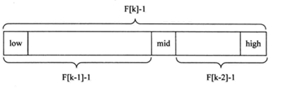

JAVA代码如下：

```java
/**
 * 因为后面我们mid=low+F(k-1)-1，需要使用到斐波那契数列，因此我们需要先获取到一个斐波那契数列
 * <p>
 * 非递归方法得到一个斐波那契数列
 *
 * @return
 */
private static int[] getFibonacci() {
        int[] fibonacci = new int[20];
        fibonacci[0] = 1;
        fibonacci[1] = 1;
        for (int i = 2; i < fibonacci.length; i++) {
            fibonacci[i] = fibonacci[i - 1] + fibonacci[i - 2];
        }
        return fibonacci;
}

/**
 * 编写斐波那契查找算法
 * <p>
 * 使用非递归的方式编写算法
 *
 * @param arr       数组
 * @param findValue 我们需要查找的关键码(值)
 * @return 返回对应的下标，如果没有-1
 */
public static int fibonacciSearch(int[] arr, int findValue) {
        int low = 0;
        int high = arr.length - 1;
        int k = 0;// 表示斐波那契分割数值的下标
        int mid = 0;// 存放mid值
        int[] fibonacci = getFibonacci();// 获取到斐波那契数列
        // 获取到斐波那契分割数值的下标
        while (high > fibonacci[k] - 1) {
            k++;
        }

        // 因为 fibonacci[k] 值可能大于 arr 的 长度，因此我们需要使用Arrays类，构造一个新的数组
        int[] temp = Arrays.copyOf(arr, fibonacci[k]);
        // 实际上需求使用arr数组最后的数填充 temp
        for (int i = high + 1; i < temp.length; i++) {
            temp[i] = arr[high];
        }

        // 使用while来循环处理，找到我们的数 findValue
        while (low <= high) {
            mid = low + fibonacci[k] - 1;
            if (findValue < temp[mid]) {
                high = mid - 1;
                k--;
            } else if (findValue > temp[mid]) {
                low = mid + 1;
                k++;
            } else {
                return Math.min(mid, high);
            }
        }

        return -1;
}
```


## 搜素算法

### 深度优先搜索(DFS)

深度优先搜索（Depth-First Search / DFS）是一种**优先遍历子节点**而不是回溯的算法。


**DFS解决的是连通性的问题**。即给定两个点，一个是起始点，一个是终点，判断是不是有一条路径能从起点连接到终点。起点和终点，也可以指的是某种起始状态和最终的状态。问题的要求并不在乎路径是长还是短，只在乎有还是没有。


**代码案例**

```java
/**
 * Depth-First Search(DFS)
 * <p>
 * 从根节点出发，沿着左子树方向进行纵向遍历，直到找到叶子节点为止。然后回溯到前一个节点，进行右子树节点的遍历，直到遍历完所有可达节点为止。
 * <p>
 * 数据结构：栈
 * 父节点入栈，父节点出栈，先右子节点入栈，后左子节点入栈。递归遍历全部节点即可
 *
 * @author lry
 */
public class DepthFirstSearch {

    /**
     * 树节点
     *
     * @param <V>
     */
    @Data
    @NoArgsConstructor
    @AllArgsConstructor
    public static class TreeNode<V> {
        private V value;
        private List<TreeNode<V>> childList;

        // 二叉树节点支持如下

        public TreeNode<V> getLeft() {
            if (childList == null || childList.isEmpty()) {
                return null;
            }

            return childList.get(0);

        }

        public TreeNode<V> getRight() {
            if (childList == null || childList.isEmpty()) {
                return null;
            }

            return childList.get(1);
        }
    }

    /**
     * 模型：
     * .......A
     * ...../   \
     * ....B     C
     * .../ \   /  \
     * ..D   E F    G
     * ./ \        /  \
     * H  I       J    K
     */
    public static void main(String[] args) {
        TreeNode<String> treeNodeA = new TreeNode<>("A", new ArrayList<>());
        TreeNode<String> treeNodeB = new TreeNode<>("B", new ArrayList<>());
        TreeNode<String> treeNodeC = new TreeNode<>("C", new ArrayList<>());
        TreeNode<String> treeNodeD = new TreeNode<>("D", new ArrayList<>());
        TreeNode<String> treeNodeE = new TreeNode<>("E", new ArrayList<>());
        TreeNode<String> treeNodeF = new TreeNode<>("F", new ArrayList<>());
        TreeNode<String> treeNodeG = new TreeNode<>("G", new ArrayList<>());
        TreeNode<String> treeNodeH = new TreeNode<>("H", new ArrayList<>());
        TreeNode<String> treeNodeI = new TreeNode<>("I", new ArrayList<>());
        TreeNode<String> treeNodeJ = new TreeNode<>("J", new ArrayList<>());
        TreeNode<String> treeNodeK = new TreeNode<>("K", new ArrayList<>());
        // A->B,C
        treeNodeA.getChildList().add(treeNodeB);
        treeNodeA.getChildList().add(treeNodeC);
        // B->D,E
        treeNodeB.getChildList().add(treeNodeD);
        treeNodeB.getChildList().add(treeNodeE);
        // C->F,G
        treeNodeC.getChildList().add(treeNodeF);
        treeNodeC.getChildList().add(treeNodeG);
        // D->H,I
        treeNodeD.getChildList().add(treeNodeH);
        treeNodeD.getChildList().add(treeNodeI);
        // G->J,K
        treeNodeG.getChildList().add(treeNodeJ);
        treeNodeG.getChildList().add(treeNodeK);

        System.out.println("非递归方式");
        dfsNotRecursive(treeNodeA);
        System.out.println();
        System.out.println("前续遍历");
        dfsPreOrderTraversal(treeNodeA, 0);
        System.out.println();
        System.out.println("后续遍历");
        dfsPostOrderTraversal(treeNodeA, 0);
        System.out.println();
        System.out.println("中续遍历");
        dfsInOrderTraversal(treeNodeA, 0);
    }

    /**
     * 非递归方式
     *
     * @param tree
     * @param <V>
     */
    public static <V> void dfsNotRecursive(TreeNode<V> tree) {
        if (tree != null) {
            // 次数之所以用 Map 只是为了保存节点的深度，如果没有这个需求可以改为 Stack<TreeNode<V>>
            Stack<Map<TreeNode<V>, Integer>> stack = new Stack<>();
            Map<TreeNode<V>, Integer> root = new HashMap<>();
            root.put(tree, 0);
            stack.push(root);

            while (!stack.isEmpty()) {
                Map<TreeNode<V>, Integer> item = stack.pop();
                TreeNode<V> node = item.keySet().iterator().next();
                int depth = item.get(node);

                // 打印节点值以及深度
                System.out.print("-->[" + node.getValue().toString() + "," + depth + "]");

                if (node.getChildList() != null && !node.getChildList().isEmpty()) {
                    for (TreeNode<V> treeNode : node.getChildList()) {
                        Map<TreeNode<V>, Integer> map = new HashMap<>();
                        map.put(treeNode, depth + 1);
                        stack.push(map);
                    }
                }
            }
        }
    }

    /**
     * 递归前序遍历方式
     * <p>
     * 前序遍历(Pre-Order Traversal) ：指先访问根，然后访问子树的遍历方式，二叉树则为：根->左->右
     *
     * @param tree
     * @param depth
     * @param <V>
     */
    public static <V> void dfsPreOrderTraversal(TreeNode<V> tree, int depth) {
        if (tree != null) {
            // 打印节点值以及深度
            System.out.print("-->[" + tree.getValue().toString() + "," + depth + "]");

            if (tree.getChildList() != null && !tree.getChildList().isEmpty()) {
                for (TreeNode<V> item : tree.getChildList()) {
                    dfsPreOrderTraversal(item, depth + 1);
                }
            }
        }
    }

    /**
     * 递归后序遍历方式
     * <p>
     * 后序遍历(Post-Order Traversal)：指先访问子树，然后访问根的遍历方式，二叉树则为：左->右->根
     *
     * @param tree
     * @param depth
     * @param <V>
     */
    public static <V> void dfsPostOrderTraversal(TreeNode<V> tree, int depth) {
        if (tree != null) {
            if (tree.getChildList() != null && !tree.getChildList().isEmpty()) {
                for (TreeNode<V> item : tree.getChildList()) {
                    dfsPostOrderTraversal(item, depth + 1);
                }
            }

            // 打印节点值以及深度
            System.out.print("-->[" + tree.getValue().toString() + "," + depth + "]");
        }
    }

    /**
     * 递归中序遍历方式
     * <p>
     * 中序遍历(In-Order Traversal)：指先访问左（右）子树，然后访问根，最后访问右（左）子树的遍历方式，二叉树则为：左->根->右
     *
     * @param tree
     * @param depth
     * @param <V>
     */
    public static <V> void dfsInOrderTraversal(TreeNode<V> tree, int depth) {
        if (tree.getLeft() != null) {
            dfsInOrderTraversal(tree.getLeft(), depth + 1);
        }

        // 打印节点值以及深度
        System.out.print("-->[" + tree.getValue().toString() + "," + depth + "]");

        if (tree.getRight() != null) {
            dfsInOrderTraversal(tree.getRight(), depth + 1);
        }
    }

}
```


### 广度优先搜索(BFS)

广度优先搜索（Breadth-First Search / BFS）是**优先遍历邻居节点**而不是子节点的图遍历算法。


**BFS一般用来解决最短路径的问题**。和深度优先搜索不同，广度优先的搜索是从起始点出发，一层一层地进行，每层当中的点距离起始点的步数都是相同的，当找到了目的地之后就可以立即结束。广度优先的搜索可以同时从起始点和终点开始进行，称之为双端 BFS。这种算法往往可以大大地提高搜索的效率。


**代码案例**

```java
/**
 * Breadth-First Search(BFS)
 * <p>
 * 从根节点出发，在横向遍历二叉树层段节点的基础上纵向遍历二叉树的层次。
 * <p>
 * 数据结构：队列
 * 父节点入队，父节点出队列，先左子节点入队，后右子节点入队。递归遍历全部节点即可
 *
 * @author lry
 */
public class BreadthFirstSearch {

    /**
     * 树节点
     *
     * @param <V>
     */
    @Data
    @NoArgsConstructor
    @AllArgsConstructor
    public static class TreeNode<V> {
        private V value;
        private List<TreeNode<V>> childList;
    }

    /**
     * 模型：
     * .......A
     * ...../   \
     * ....B     C
     * .../ \   /  \
     * ..D   E F    G
     * ./ \        /  \
     * H  I       J    K
     */
    public static void main(String[] args) {
        TreeNode<String> treeNodeA = new TreeNode<>("A", new ArrayList<>());
        TreeNode<String> treeNodeB = new TreeNode<>("B", new ArrayList<>());
        TreeNode<String> treeNodeC = new TreeNode<>("C", new ArrayList<>());
        TreeNode<String> treeNodeD = new TreeNode<>("D", new ArrayList<>());
        TreeNode<String> treeNodeE = new TreeNode<>("E", new ArrayList<>());
        TreeNode<String> treeNodeF = new TreeNode<>("F", new ArrayList<>());
        TreeNode<String> treeNodeG = new TreeNode<>("G", new ArrayList<>());
        TreeNode<String> treeNodeH = new TreeNode<>("H", new ArrayList<>());
        TreeNode<String> treeNodeI = new TreeNode<>("I", new ArrayList<>());
        TreeNode<String> treeNodeJ = new TreeNode<>("J", new ArrayList<>());
        TreeNode<String> treeNodeK = new TreeNode<>("K", new ArrayList<>());
        // A->B,C
        treeNodeA.getChildList().add(treeNodeB);
        treeNodeA.getChildList().add(treeNodeC);
        // B->D,E
        treeNodeB.getChildList().add(treeNodeD);
        treeNodeB.getChildList().add(treeNodeE);
        // C->F,G
        treeNodeC.getChildList().add(treeNodeF);
        treeNodeC.getChildList().add(treeNodeG);
        // D->H,I
        treeNodeD.getChildList().add(treeNodeH);
        treeNodeD.getChildList().add(treeNodeI);
        // G->J,K
        treeNodeG.getChildList().add(treeNodeJ);
        treeNodeG.getChildList().add(treeNodeK);

        System.out.println("递归方式");
        bfsRecursive(Arrays.asList(treeNodeA), 0);
        System.out.println();
        System.out.println("非递归方式");
        bfsNotRecursive(treeNodeA);
    }

    /**
     * 递归遍历
     *
     * @param children
     * @param depth
     * @param <V>
     */
    public static <V> void bfsRecursive(List<TreeNode<V>> children, int depth) {
        List<TreeNode<V>> thisChildren, allChildren = new ArrayList<>();
        for (TreeNode<V> child : children) {
            // 打印节点值以及深度
            System.out.print("-->[" + child.getValue().toString() + "," + depth + "]");

            thisChildren = child.getChildList();
            if (thisChildren != null && thisChildren.size() > 0) {
                allChildren.addAll(thisChildren);
            }
        }

        if (allChildren.size() > 0) {
            bfsRecursive(allChildren, depth + 1);
        }
    }

    /**
     * 非递归遍历
     *
     * @param tree
     * @param <V>
     */
    public static <V> void bfsNotRecursive(TreeNode<V> tree) {
        if (tree != null) {
            // 跟上面一样，使用 Map 也只是为了保存树的深度，没这个需要可以不用 Map
            Queue<Map<TreeNode<V>, Integer>> queue = new ArrayDeque<>();
            Map<TreeNode<V>, Integer> root = new HashMap<>();
            root.put(tree, 0);
            queue.offer(root);

            while (!queue.isEmpty()) {
                Map<TreeNode<V>, Integer> itemMap = queue.poll();
                TreeNode<V> node = itemMap.keySet().iterator().next();
                int depth = itemMap.get(node);

                //打印节点值以及深度
                System.out.print("-->[" + node.getValue().toString() + "," + depth + "]");

                if (node.getChildList() != null && !node.getChildList().isEmpty()) {
                    for (TreeNode<V> child : node.getChildList()) {
                        Map<TreeNode<V>, Integer> map = new HashMap<>();
                        map.put(child, depth + 1);
                        queue.offer(map);
                    }
                }
            }
        }
    }

}
```


### 迪杰斯特拉算法(Dijkstra)

**迪杰斯特拉(Dijkstra)算法** 是典型最短路径算法，用于计算一个节点到其他节点的最短路径。它的主要特点是以起始点为中心向外层层扩展(广度优先搜索思想)，直到扩展到终点为止。


**基本思想**

通过Dijkstra计算图G中的最短路径时，需要指定起点s(即从顶点s开始计算)。

此外，引进两个集合S和U。S的作用是记录已求出最短路径的顶点(以及相应的最短路径长度)，而U则是记录还未求出最短路径的顶点(以及该顶点到起点s的距离)。

初始时，S中只有起点s；U中是除s之外的顶点，并且U中顶点的路径是"起点s到该顶点的路径"。然后，从U中找出路径最短的顶点，并将其加入到S中；接着，更新U中的顶点和顶点对应的路径。 然后，再从U中找出路径最短的顶点，并将其加入到S中；接着，更新U中的顶点和顶点对应的路径。 ... 重复该操作，直到遍历完所有顶点。


**操作步骤**

- 初始时，S只包含起点s；U包含除s外的其他顶点，且U中顶点的距离为"起点s到该顶点的距离"[例如，U中顶点v的距离为(s,v)的长度，然后s和v不相邻，则v的距离为∞]
- U中选出"距离最短的顶点k"，并将顶点k加入到S中；同时，从U中移除顶点k
- 更新U中各个顶点到起点s的距离。之所以更新U中顶点的距离，是由于上一步中确定了k是求出最短路径的顶点，从而可以利用k来更新其它顶点的距离；例如，(s,v)的距离可能大于(s,k)+(k,v)的距离
- 重复步骤(2)和(3)，直到遍历完所有顶点


**迪杰斯特拉算法图解**

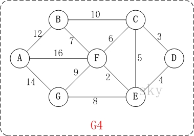

以上图G4为例，来对迪杰斯特拉进行算法演示(以第4个顶点D为起点)：

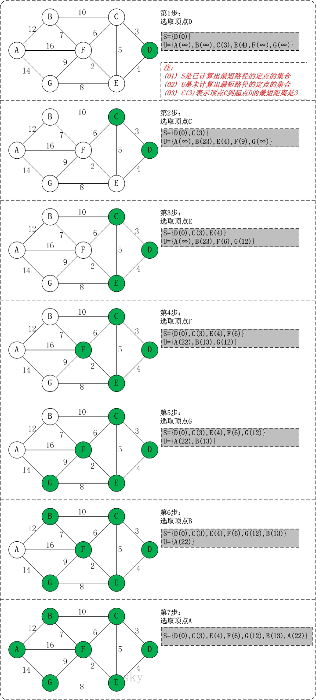

 **代码案例**

```java
public class Dijkstra {
     // 代表正无穷
    public static final int M = 10000;
    public static String[] names = new String[]{"A", "B", "C", "D", "E", "F", "G",};

    public static void main(String[] args) {
        // 二维数组每一行分别是 A、B、C、D、E 各点到其余点的距离,
        // A -> A 距离为0, 常量M 为正无穷
        int[][] weight1 = {
                {0, 12, M, M, M, 16, 14},
                {12, 0, 10, M, M, 7, M},
                {M, 10, 0, 3, 5, 6, M},
                {M, M, 3, 0, 4, M, M},
                {M, M, 5, 4, 0, 2, 8},
                {16, 7, 6, M, 2, 0, 9},
                {14, M, M, M, 8, 9, 0}
        };

        int start = 0;
        int[] shortPath = dijkstra(weight1, start);
        System.out.println("===============");
        for (int i = 0; i < shortPath.length; i++) {
            System.out.println("从" + names[start] + "出发到" + names[i] + "的最短距离为：" + shortPath[i]);
        }
    }

    /**
     * Dijkstra算法
     *
     * @param weight 图的权重矩阵
     * @param start  起点编号start（从0编号，顶点存在数组中）
     * @return 返回一个int[] 数组，表示从start到它的最短路径长度
     */
    public static int[] dijkstra(int[][] weight, int start) {
        // 顶点个数
        int n = weight.length;
        // 标记当前该顶点的最短路径是否已经求出,1表示已求出
        int[] visited = new int[n];
        // 保存start到其他各点的最短路径
        int[] shortPath = new int[n];

        // 保存start到其他各点最短路径的字符串表示
        String[] path = new String[n];
        for (int i = 0; i < n; i++) {
            path[i] = names[start] + "-->" + names[i];
        }

        // 初始化，第一个顶点已经求出
        shortPath[start] = 0;
        visited[start] = 1;

        // 要加入n-1个顶点
        for (int count = 1; count < n; count++) {
            // 选出一个距离初始顶点start最近的未标记顶点
            int k = -1;
            int dMin = Integer.MAX_VALUE;
            for (int i = 0; i < n; i++) {
                if (visited[i] == 0 && weight[start][i] < dMin) {
                    dMin = weight[start][i];
                    k = i;
                }
            }

            // 将新选出的顶点标记为已求出最短路径，且到start的最短路径就是dmin
            shortPath[k] = dMin;
            visited[k] = 1;

            // 以k为中间点，修正从start到未访问各点的距离
            for (int i = 0; i < n; i++) {
                // 如果 '起始点到当前点距离' + '当前点到某点距离' < '起始点到某点距离', 则更新
                if (visited[i] == 0 && weight[start][k] + weight[k][i] < weight[start][i]) {
                    weight[start][i] = weight[start][k] + weight[k][i];
                    path[i] = path[k] + "-->" + names[i];
                }
            }
        }

        for (int i = 0; i < n; i++) {
            System.out.println("从" + names[start] + "出发到" + names[i] + "的最短路径为：" + path[i]);
        }

        return shortPath;
    }

}
```


### kruskal(克鲁斯卡尔)算法

https://www.cnblogs.com/skywang12345/category/508186.html


## 排序算法

十种常见排序算法可以分为两大类：

- **非线性时间比较类排序**

  通过比较来决定元素间的相对次序，由于其时间复杂度不能突破O(nlogn)，因此称为非线性时间比较类排序。

- **线性时间非比较类排序**

  不通过比较来决定元素间的相对次序，它可以突破基于比较排序的时间下界，以线性时间运行，因此称为线性时间非比较类排序。


### 冒泡排序（Bubble Sort）

冒泡排序是一种简单的排序算法。它重复地走访过要排序的数列，一次比较两个元素，如果它们的顺序错误就把它们交换过来。走访数列的工作是重复地进行直到没有再需要交换，也就是说该数列已经排序完成。这个算法的名字由来是因为越小的元素会经由交换慢慢“浮”到数列的顶端。 

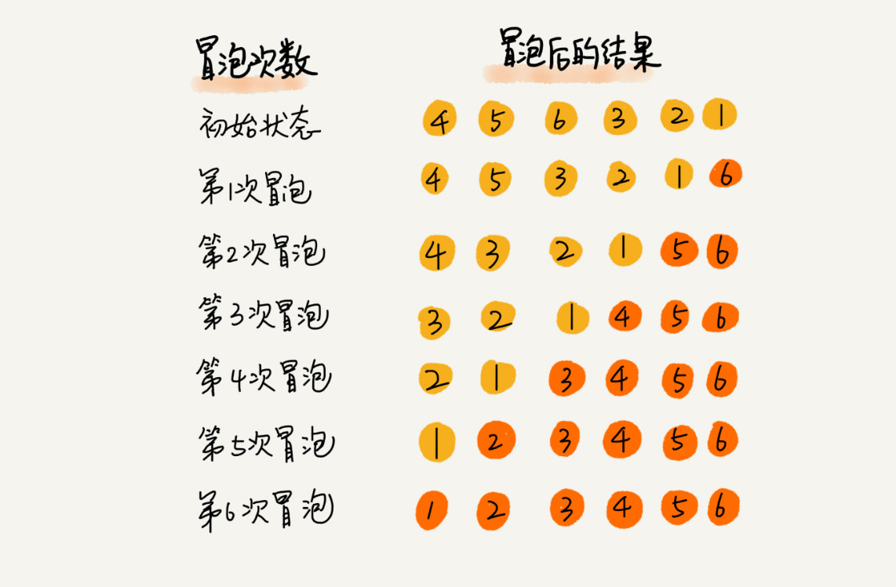


**算法步骤**

- 比较相邻的元素。如果第一个比第二个大，就交换它们两个
- 对每一对相邻元素作同样的工作，从开始第一对到结尾的最后一对，这样在最后的元素应该会是最大的数
- 针对所有的元素重复以上的步骤，除了最后一个
- 重复步骤1~3，直到排序完成

**代码实现**

```java
/**
  * 冒泡排序
  * <p>
  * 描述：每轮连续比较相邻的两个数，前数大于后数，则进行替换。每轮完成后，本轮最大值已被移至最后
  *
  * @param arr 待排序数组
  */
public static int[] bubbleSort(int[] arr) {
    for (int i = 0; i < arr.length - 1; i++) {
        for (int j = 0; j < arr.length - 1 - i; j++) {
            // 每次比较2个相邻的数,前一个小于后一个
            if (arr[j] > arr[j + 1]) {
                int tmp = arr[j];
                arr[j] = arr[j + 1];
                arr[j + 1] = tmp;
            }
        }
    }
    
    return arr;
}
```

以下是冒泡排序算法复杂度:

| 平均时间复杂度 | 最好情况 | 最坏情况 | 空间复杂度 |
| :------------- | :------- | :------- | :--------- |
| O(n²)          | O(n)     | O(n²)    | O(1)       |

冒泡排序是最容易实现的排序, 最坏的情况是每次都需要交换, 共需遍历并交换将近n²/2次, 时间复杂度为O(n²). 最佳的情况是内循环遍历一次后发现排序是对的, 因此退出循环, 时间复杂度为O(n)。平均来讲, 时间复杂度为O(n²). 由于冒泡排序中只有缓存的temp变量需要内存空间, 因此空间复杂度为常量O(1)。

Tips: 由于冒泡排序只在相邻元素大小不符合要求时才调换他们的位置, 它并不改变相同元素之间的相对顺序, 因此它是稳定的排序算法。


### 选择排序（Selection Sort）

选择排序(Selection-sort)是一种简单直观的排序算法。它的工作原理：首先在未排序序列中找到最小（大）元素，存放到排序序列的起始位置，然后，再从剩余未排序元素中继续寻找最小（大）元素，然后放到已排序序列的末尾。以此类推，直到所有元素均排序完毕。 

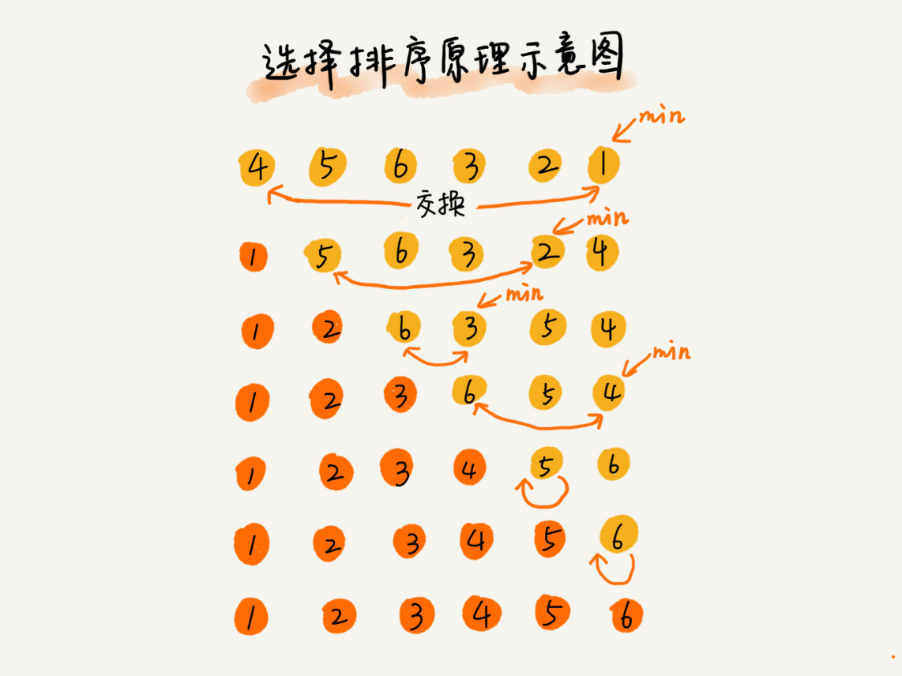


**算法描述**

n个记录的直接选择排序可经过n-1趟直接选择排序得到有序结果。具体算法描述如下：

- 初始状态：无序区为R[1..n]，有序区为空
- 第i趟排序(i=1,2,3…n-1)开始时，当前有序区和无序区分别为R[1..i-1]和R(i..n）。该趟排序从当前无序区中-选出关键字最小的记录 R[k]，将它与无序区的第1个记录R交换，使R[1..i]和R[i+1..n)分别变为记录个数增加1个的新有序区和记录个数减少1个的新无序区
- n-1趟结束，数组有序化了

**代码实现**

```java
 /**
     * 选择排序
     * <p>
     * 描述：每轮选择出最小值，然后依次放置最前面
     *
     * @param arr 待排序数组
     */
    public static int[] selectSort(int[] arr) {
        for (int i = 0; i < arr.length - 1; i++) {
            // 选最小的记录
            int min = i;
            for (int j = i + 1; j < arr.length; j++) {
                if (arr[min] > arr[j]) {
                    min = j;
                }
            }

            // 内层循环结束后，即找到本轮循环的最小的数以后，再进行交换：交换a[i]和a[min]
            if (min != i) {
                int temp = arr[i];
                arr[i] = arr[min];
                arr[min] = temp;
            }
        }

        return arr;
    }
```

以下是选择排序复杂度:

| 平均时间复杂度 | 最好情况 | 最坏情况 | 空间复杂度 |
| :------------- | :------- | :------- | :--------- |
| O(n²)          | O(n²)    | O(n²)    | O(1)       |

选择排序的简单和直观名副其实，这也造就了它”出了名的慢性子”，无论是哪种情况，哪怕原数组已排序完成，它也将花费将近n²/2次遍历来确认一遍。即便是这样，它的排序结果也还是不稳定的。 唯一值得高兴的是，它并不耗费额外的内存空间。


### 插入排序（Insertion Sort）

插入排序（Insertion-Sort）的算法描述是一种简单直观的排序算法。它的工作原理是通过构建有序序列，对于未排序数据，在已排序序列中从后向前扫描，找到相应位置并插入。插入排序由于操作不尽相同，可分为 `直接插入排序`、`折半插入排序`(又称二分插入排序)、`链表插入排序`、`希尔排序` 。

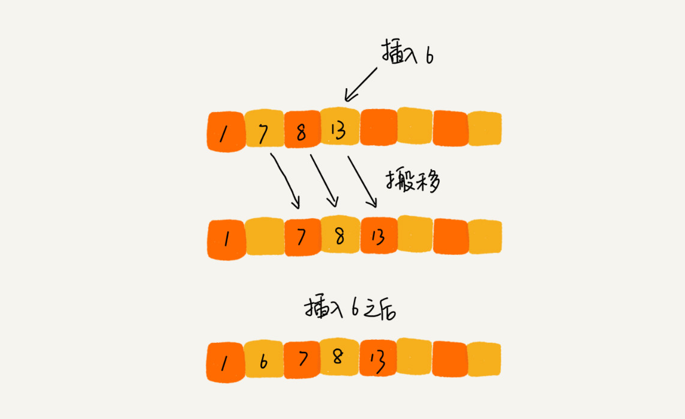


**算法描述**

一般来说，插入排序都采用in-place在数组上实现。具体算法描述如下：

- 从第一个元素开始，该元素可以认为已经被排序
- 取出下一个元素，在已经排序的元素序列中从后向前扫描
- 如果该元素（已排序）大于新元素，将该元素移到下一位置
- 重复步骤3，直到找到已排序的元素小于或者等于新元素的位置
- 将新元素插入到该位置后
- 重复步骤2~5

**代码实现**

```java
   /**
     * 直接插入排序
     * <p>
     * 1. 从第一个元素开始，该元素可以认为已经被排序
     * 2. 取出下一个元素，在已经排序的元素序列中从后向前扫描
     * 3. 如果该元素（已排序）大于新元素，将该元素移到下一位置
     * 4. 重复步骤3，直到找到已排序的元素小于或者等于新元素的位置
     * 5. 将新元素插入到该位置后
     * 6. 重复步骤2~5
     *
     * @param arr 待排序数组
     */
    public static int[] insertionSort(int[] arr) {
        for (int i = 1; i < arr.length; i++) {
            // 取出下一个元素，在已经排序的元素序列中从后向前扫描
            int temp = arr[i];
            for (int j = i; j >= 0; j--) {
                if (j > 0 && arr[j - 1] > temp) {
                    // 如果该元素（已排序）大于取出的元素temp，将该元素移到下一位置
                    arr[j] = arr[j - 1];
                } else {
                    // 将新元素插入到该位置后
                    arr[j] = temp;
                    break;
                }
            }
        }

        return arr;
    }

    /**
     * 折半插入排序
     * <p>
     * 往前找合适的插入位置时采用二分查找的方式，即折半插入
     * <p>
     * 交换次数较多的实现
     *
     * @param arr 待排序数组
     */
    public static int[] insertionBinarySort(int[] arr) {
        for (int i = 1; i < arr.length; i++) {
            if (arr[i] < arr[i - 1]) {
                int tmp = arr[i];

                // 记录搜索范围的左边界,右边界
                int low = 0, high = i - 1;
                while (low <= high) {
                    // 记录中间位置Index
                    int mid = (low + high) / 2;
                    // 比较中间位置数据和i处数据大小，以缩小搜索范围
                    if (arr[mid] < tmp) {
                        // 左边指针则一只中间位置+1
                        low = mid + 1;
                    } else {
                        // 右边指针则一只中间位置-1
                        high = mid - 1;
                    }
                }

                // 将low~i处数据整体向后移动1位
                for (int j = i; j > low; j--) {
                    arr[j] = arr[j - 1];
                }
                arr[low] = tmp;
            }
        }

        return arr;
    }
```

插入排序复杂度：

| 平均时间复杂度 | 最好情况 | 最坏情况 | 空间复杂度 |
| :------------- | :------- | :------- | :--------- |
| O(n²)          | O(n)     | O(n²)    | O(1)       |

Tips：由于直接插入排序每次只移动一个元素的位， 并不会改变值相同的元素之间的排序， 因此它是一种稳定排序。插入排序在实现上，通常采用in-place排序（即只需用到O(1)的额外空间的排序），因而在从后向前扫描过程中，需要反复把已排序元素逐步向后挪位，为最新元素提供插入空间。


### 希尔排序（Shell Sort）

1959年Shell发明，第一个突破O(n2)的排序算法，是简单插入排序的改进版。它与插入排序的不同之处在于，它会优先比较距离较远的元素。希尔排序又叫**缩小增量排序**。


**算法描述**

先将整个待排序的记录序列分割成为若干子序列分别进行直接插入排序，具体算法描述：

- 选择一个增量序列t1，t2，…，tk，其中ti>tj，tk=1
- 按增量序列个数k，对序列进行k 趟排序
- 每趟排序，根据对应的增量ti，将待排序列分割成若干长度为m 的子序列，分别对各子表进行直接插入排序。仅增量因子为1 时，整个序列作为一个表来处理，表长度即为整个序列的长度

**代码实现**

```java
 /**
     * 希尔排序
     * <p>
     * 1. 选择一个增量序列t1，t2，…，tk，其中ti>tj，tk=1；（一般初次取数组半长，之后每次再减半，直到增量为1）
     * 2. 按增量序列个数k，对序列进行k 趟排序；
     * 3. 每趟排序，根据对应的增量ti，将待排序列分割成若干长度为m 的子序列，分别对各子表进行直接插入排序。
     * 仅增量因子为1 时，整个序列作为一个表来处理，表长度即为整个序列的长度。
     *
     * @param arr 待排序数组
     */
    public static int[] shellSort(int[] arr) {
        int gap = arr.length / 2;

        // 不断缩小gap，直到1为止
        for (; gap > 0; gap /= 2) {
            // 使用当前gap进行组内插入排序
            for (int j = 0; (j + gap) < arr.length; j++) {
                for (int k = 0; (k + gap) < arr.length; k += gap) {
                    if (arr[k] > arr[k + gap]) {
                        int temp = arr[k + gap];
                        arr[k + gap] = arr[k];
                        arr[k] = temp;
                    }
                }
            }
        }

        return arr;
    }
```

以下是希尔排序复杂度:

| 平均时间复杂度 | 最好情况   | 最坏情况   | 空间复杂度 |
| :------------- | :--------- | :--------- | :--------- |
| O(nlog2 n)     | O(nlog2 n) | O(nlog2 n) | O(1)       |

Tips：希尔排序的核心在于间隔序列的设定。既可以提前设定好间隔序列，也可以动态的定义间隔序列。动态定义间隔序列的算法是《算法（第4版）》的合著者Robert Sedgewick提出的。　


### 归并排序（Merging Sort）

归并排序是建立在归并操作上的一种有效的排序算法。该算法是采用分治法（Divide and Conquer）的一个非常典型的应用。将已有序的子序列合并，得到完全有序的序列；即先使每个子序列有序，再使子序列段间有序。若将两个有序表合并成一个有序表，称为2-路归并。 

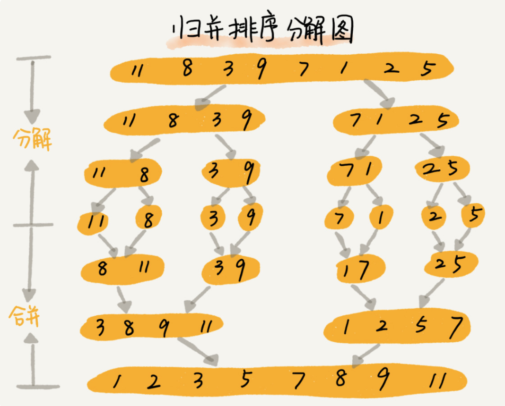


**算法描述**

**a.递归法**（假设序列共有n个元素）

①. 将序列每相邻两个数字进行归并操作，形成 floor(n/2)个序列，排序后每个序列包含两个元素；
②. 将上述序列再次归并，形成 floor(n/4)个序列，每个序列包含四个元素；
③. 重复步骤②，直到所有元素排序完毕。

**b.迭代法**

①. 申请空间，使其大小为两个已经排序序列之和，该空间用来存放合并后的序列
②. 设定两个指针，最初位置分别为两个已经排序序列的起始位置
③. 比较两个指针所指向的元素，选择相对小的元素放入到合并空间，并移动指针到下一位置
④. 重复步骤③直到某一指针到达序列尾
⑤. 将另一序列剩下的所有元素直接复制到合并序列尾

**代码实现**

```java
/**
     * 归并排序（递归）
     * <p>
     * ①. 将序列每相邻两个数字进行归并操作，形成 floor(n/2)个序列，排序后每个序列包含两个元素；
     * ②. 将上述序列再次归并，形成 floor(n/4)个序列，每个序列包含四个元素；
     * ③. 重复步骤②，直到所有元素排序完毕。
     *
     * @param arr 待排序数组
     */
    public static int[] mergeSort(int[] arr) {
        return mergeSort(arr, 0, arr.length - 1);
    }

    private static int[] mergeSort(int[] arr, int low, int high) {
        int center = (high + low) / 2;
        if (low < high) {
            // 递归，直到low==high，也就是数组已不能再分了，
            mergeSort(arr, low, center);
            mergeSort(arr, center + 1, high);

            // 当数组不能再分，开始归并排序
            mergeSort(arr, low, center, high);
        }

        return arr;
    }

    private static void mergeSort(int[] a, int low, int mid, int high) {
        int[] temp = new int[high - low + 1];
        int i = low, j = mid + 1, k = 0;

        // 把较小的数先移到新数组中
        while (i <= mid && j <= high) {
            if (a[i] < a[j]) {
                temp[k++] = a[i++];
            } else {
                temp[k++] = a[j++];
            }
        }

        // 把左边剩余的数移入数组
        while (i <= mid) {
            temp[k++] = a[i++];
        }

        // 把右边边剩余的数移入数组
        while (j <= high) {
            temp[k++] = a[j++];
        }

        // 把新数组中的数覆盖nums数组
        for (int x = 0; x < temp.length; x++) {
            a[x + low] = temp[x];
        }
    }
```

以下是归并排序算法复杂度:

| 平均时间复杂度 | 最好情况  | 最坏情况  | 空间复杂度 |
| :------------- | :-------- | :-------- | :--------- |
| O(nlog₂n)      | O(nlog₂n) | O(nlog₂n) | O(n)       |

从效率上看，归并排序可算是排序算法中的”佼佼者”. 假设数组长度为n，那么拆分数组共需logn，, 又每步都是一个普通的合并子数组的过程， 时间复杂度为O(n)， 故其综合时间复杂度为O(nlogn)。另一方面， 归并排序多次递归过程中拆分的子数组需要保存在内存空间， 其空间复杂度为O(n)。

Tips：和选择排序一样，归并排序的性能不受输入数据的影响，但表现比选择排序好的多，因为始终都是`O(nlogn）`的时间复杂度。代价是需要额外的内存空间。


### 快速排序（Quick Sort）

快速排序（Quicksort）是对冒泡排序的一种改进，借用了分治的思想，由C. A. R. Hoare在1962年提出。基本思想是通过一趟排序将待排记录分隔成独立的两部分，其中一部分记录的关键字均比另一部分的关键字小，则可分别对这两部分记录继续进行排序，以达到整个序列有序。


**算法描述**

快速排序使用分治法来把一个串（list）分为两个子串（sub-lists）。具体算法描述如下：

- 从数列中挑出一个元素，称为 “基准”（pivot）
- 重新排序数列，所有元素比基准值小的摆放在基准前面，所有元素比基准值大的摆在基准的后面（相同的数可以到任一边）。在这个分区退出之后，该基准就处于数列的中间位置。这个称为分区（partition）操作
- 递归地（recursive）把小于基准值元素的子数列和大于基准值元素的子数列排序

**代码实现**

```java
/**
     * 快速排序（递归）
     * <p>
     * ①. 从数列中挑出一个元素，称为"基准"（pivot）。
     * ②. 重新排序数列，所有比基准值小的元素摆放在基准前面，所有比基准值大的元素摆在基准后面（相同的数可以到任一边）。在这个分区结束之后，该基准就处于数列的中间位置。这个称为分区（partition）操作。
     * ③. 递归地（recursively）把小于基准值元素的子数列和大于基准值元素的子数列排序。
     *
     * @param arr 待排序数组
     */
    public static int[] quickSort(int[] arr) {
        return quickSort(arr, 0, arr.length - 1);
    }

    private static int[] quickSort(int[] arr, int low, int high) {
        if (arr.length <= 0 || low >= high) {
            return arr;
        }

        int left = low;
        int right = high;

        // 挖坑1：保存基准的值
        int temp = arr[left];
        while (left < right) {
            // 坑2：从后向前找到比基准小的元素，插入到基准位置坑1中
            while (left < right && arr[right] >= temp) {
                right--;
            }
            arr[left] = arr[right];
            // 坑3：从前往后找到比基准大的元素，放到刚才挖的坑2中
            while (left < right && arr[left] <= temp) {
                left++;
            }
            arr[right] = arr[left];
        }
        // 基准值填补到坑3中，准备分治递归快排
        arr[left] = temp;
        quickSort(arr, low, left - 1);
        quickSort(arr, left + 1, high);

        return arr;
    }

    /**
     * 快速排序（非递归）
     * <p>
     * ①. 从数列中挑出一个元素，称为"基准"（pivot）。
     * ②. 重新排序数列，所有比基准值小的元素摆放在基准前面，所有比基准值大的元素摆在基准后面（相同的数可以到任一边）。在这个分区结束之后，该基准就处于数列的中间位置。这个称为分区（partition）操作。
     * ③. 把分区之后两个区间的边界（low和high）压入栈保存，并循环①、②步骤
     *
     * @param arr 待排序数组
     */
    public static int[] quickSortByStack(int[] arr) {
        Stack<Integer> stack = new Stack<>();

        // 初始状态的左右指针入栈
        stack.push(0);
        stack.push(arr.length - 1);
        while (!stack.isEmpty()) {
            // 出栈进行划分
            int high = stack.pop();
            int low = stack.pop();

            int pivotIdx = partition(arr, low, high);

            // 保存中间变量
            if (pivotIdx > low) {
                stack.push(low);
                stack.push(pivotIdx - 1);
            }
            if (pivotIdx < high && pivotIdx >= 0) {
                stack.push(pivotIdx + 1);
                stack.push(high);
            }
        }

        return arr;
    }

    private static int partition(int[] arr, int low, int high) {
        if (arr.length <= 0) return -1;
        if (low >= high) return -1;
        int l = low;
        int r = high;

        // 挖坑1：保存基准的值
        int pivot = arr[l];
        while (l < r) {
            // 坑2：从后向前找到比基准小的元素，插入到基准位置坑1中
            while (l < r && arr[r] >= pivot) {
                r--;
            }
            arr[l] = arr[r];
            // 坑3：从前往后找到比基准大的元素，放到刚才挖的坑2中
            while (l < r && arr[l] <= pivot) {
                l++;
            }
            arr[r] = arr[l];
        }

        // 基准值填补到坑3中，准备分治递归快排
        arr[l] = pivot;
        return l;
    }
```

以下是快速排序算法复杂度:

| 平均时间复杂度 | 最好情况  | 最坏情况 | 空间复杂度             |
| :------------- | :-------- | :------- | :--------------------- |
| O(nlog₂n)      | O(nlog₂n) | O(n²)    | O(1)（原地分区递归版） |

快速排序排序效率非常高。 虽然它运行最糟糕时将达到O(n²)的时间复杂度, 但通常平均来看, 它的时间复杂为O(nlogn), 比同样为O(nlogn)时间复杂度的归并排序还要快. 快速排序似乎更偏爱乱序的数列, 越是乱序的数列, 它相比其他排序而言, 相对效率更高。

Tips: 同选择排序相似, 快速排序每次交换的元素都有可能不是相邻的, 因此它有可能打破原来值为相同的元素之间的顺序. 因此, 快速排序并不稳定。


### 基数排序（Radix Sort）

基数排序是按照低位先排序，然后收集；再按照高位排序，然后再收集；依次类推，直到最高位。有时候有些属性是有优先级顺序的，先按低优先级排序，再按高优先级排序。最后的次序就是高优先级高的在前，高优先级相同的低优先级高的在前。


**算法描述**

- 取得数组中的最大数，并取得位数
- arr为原始数组，从最低位开始取每个位组成radix数组
- 对radix进行计数排序（利用计数排序适用于小范围数的特点）

**代码实现**

```java
/**
 * 基数排序（LSD 从低位开始）
 * <p>
 * 基数排序适用于：
 * (1)数据范围较小，建议在小于1000
 * (2)每个数值都要大于等于0
 * <p>
 * ①. 取得数组中的最大数，并取得位数；
 * ②. arr为原始数组，从最低位开始取每个位组成radix数组；
 * ③. 对radix进行计数排序（利用计数排序适用于小范围数的特点）；
 *
 * @param arr 待排序数组
 */
public static int[] radixSort(int[] arr) {
    // 取得数组中的最大数，并取得位数
    int max = 0;
    for (int item : arr) {
        if (max < item) {
            max = item;
        }
    }
    int maxDigit = 1;
    while (max / 10 > 0) {
        maxDigit++;
        max = max / 10;
    }

    // 申请一个桶空间
    int[][] buckets = new int[10][arr.length];
    int base = 10;

    // 从低位到高位，对每一位遍历，将所有元素分配到桶中
    for (int i = 0; i < maxDigit; i++) {
        // 存储各个桶中存储元素的数量
        int[] bktLen = new int[10];

        // 分配：将所有元素分配到桶中
        for (int value : arr) {
            int whichBucket = (value % base) / (base / 10);
            buckets[whichBucket][bktLen[whichBucket]] = value;
            bktLen[whichBucket]++;
        }

        // 收集：将不同桶里数据挨个捞出来,为下一轮高位排序做准备,由于靠近桶底的元素排名靠前,因此从桶底先捞
        int k = 0;
        for (int b = 0; b < buckets.length; b++) {
            for (int p = 0; p < bktLen[b]; p++) {
                arr[k++] = buckets[b][p];
            }
        }

        base *= 10;
    }

    return arr;
}
```

以下是基数排序算法复杂度，其中k为最大数的位数：

| 平均时间复杂度 | 最好情况   | 最坏情况   | 空间复杂度 |
| :------------- | :--------- | :--------- | :--------- |
| O(d*(n+r))     | O(d*(n+r)) | O(d*(n+r)) | O(n+r)     |

其中，**d 为位数，r 为基数，n 为原数组个数**。在基数排序中，因为没有比较操作，所以在复杂上，最好的情况与最坏的情况在时间上是一致的，均为 `O(d*(n + r))`。基数排序更适合用于对时间, 字符串等这些**整体权值未知的数据**进行排序。

Tips: 基数排序不改变相同元素之间的相对顺序，因此它是稳定的排序算法。


### 堆排序（Heap Sort）

堆排序（Heapsort）是指利用堆这种数据结构所设计的一种排序算法。堆排序的过程就是将待排序的序列构造成一个堆，选出堆中最大的移走，再把剩余的元素调整成堆，找出最大的再移走，重复直至有序。

**算法描述**

- 将初始待排序关键字序列(R1,R2….Rn)构建成大顶堆，此堆为初始的无序区
- 将堆顶元素R[1]与最后一个元素R[n]交换，此时得到新的无序区(R1,R2,……Rn-1)和新的有序区(Rn),且满足R[1,2…n-1]<=R[n]
- 由于交换后新的堆顶R[1]可能违反堆的性质，因此需要对当前无序区(R1,R2,……Rn-1)调整为新堆，然后再次将R[1]与无序区最后一个元素交换，得到新的无序区(R1,R2….Rn-2)和新的有序区(Rn-1,Rn)。不断重复此过程直到有序区的元素个数为n-1，则整个排序过程完成

**动图演示**

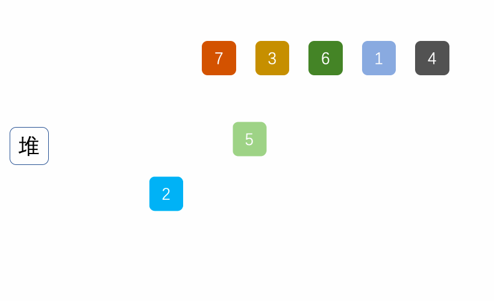

**代码实现**

```java
/**
     * 堆排序算法
     *
     * @param arr 待排序数组
     */
    public static int[] heapSort(int[] arr) {
        // 将无序序列构建成一个堆，根据升序降序需求选择大顶堆或小顶堆
        for (int i = arr.length / 2 - 1; i >= 0; i--) {
            adjustHeap(arr, i, arr.length);
        }

        // 将最大的节点放在堆尾，然后从根节点重新调整
        for (int j = arr.length - 1; j > 0; j--) {
            // 交换
            int temp = arr[j];
            arr[j] = arr[0];
            arr[0] = temp;

            // 完成将以i对应的非叶子结点的树调整成大顶堆
            adjustHeap(arr, 0, j);
        }

        return arr;
    }

    /**
     * 功能： 完成将以i对应的非叶子结点的树调整成大顶堆
     *
     * @param arr    待排序数组
     * @param i      表示非叶子结点在数组中索引
     * @param length 表示对多少个元素继续调整， length 是在逐渐的减少
     */
    private static void adjustHeap(int[] arr, int i, int length) {
        // 先取出当前元素的值，保存在临时变量
        int temp = arr[i];
        //开始调整。说明：1. k = i * 2 + 1 k 是 i结点的左子结点
        for (int k = i * 2 + 1; k < length; k = k * 2 + 1) {
            // 说明左子结点的值小于右子结点的值
            if (k + 1 < length && arr[k] < arr[k + 1]) {
                // k 指向右子结点
                k++;
            }

            // 如果子结点大于父结点
            if (arr[k] > temp) {
                // 把较大的值赋给当前结点
                arr[i] = arr[k];
                // i 指向 k,继续循环比较
                i = k;
            } else {
                break;
            }
        }

        //当for 循环结束后，我们已经将以i 为父结点的树的最大值，放在了 最顶(局部)。将temp值放到调整后的位置
        arr[i] = temp;
    }
```

| 平均时间复杂度 | 最好情况       | 最坏情况       | 空间复杂度 |
| :------------- | :------------- | :------------- | :--------- |
| O(n \log_{2}n) | O(n \log_{2}n) | O(n \log_{2}n) | O(1)       |

Tips: **由于堆排序中初始化堆的过程比较次数较多, 因此它不太适用于小序列.** 同时由于多次任意下标相互交换位置, 相同元素之间原本相对的顺序被破坏了, 因此, 它是不稳定的排序.


### 计数排序（Counting Sort）

计数排序不是基于比较的排序算法，其核心在于将输入的数据值转化为键存储在额外开辟的数组空间中。 作为一种线性时间复杂度的排序，计数排序要求输入的数据必须是有确定范围的整数。

**算法描述**

- 找出待排序的数组中最大和最小的元素
- 统计数组中每个值为i的元素出现的次数，存入数组C的第i项
- 对所有的计数累加（从C中的第一个元素开始，每一项和前一项相加）
- 反向填充目标数组：将每个元素i放在新数组的第C(i)项，每放一个元素就将C(i)减去1

**动图演示**


**代码实现**

```java
/**
     * 计数排序算法
     *
     * @param arr 待排序数组
     */
    public static int[] countingSort(int[] arr) {
        // 得到数列的最大值与最小值，并算出差值d
        int max = arr[0];
        int min = arr[0];
        for (int i = 1; i < arr.length; i++) {
            if (arr[i] > max) {
                max = arr[i];
            }
            if (arr[i] < min) {
                min = arr[i];
            }
        }
        int d = max - min;

        // 创建统计数组并计算统计对应元素个数
        int[] countArray = new int[d + 1];
        for (int value : arr) {
            countArray[value - min]++;
        }

        // 统计数组变形，后面的元素等于前面的元素之和
        int sum = 0;
        for (int i = 0; i < countArray.length; i++) {
            sum += countArray[i];
            countArray[i] = sum;
        }

        // 倒序遍历原始数组，从统计数组找到正确位置，输出到结果数组
        int[] sortedArray = new int[arr.length];
        for (int i = arr.length - 1; i >= 0; i--) {
            sortedArray[countArray[arr[i] - min] - 1] = arr[i];
            countArray[arr[i] - min]--;
        }

        return sortedArray;
    }

```

**算法分析**

计数排序是一个稳定的排序算法。当输入的元素是 n 个 0到 k 之间的整数时，时间复杂度是O(n+k)，空间复杂度也是O(n+k)，其排序速度快于任何比较排序算法。当k不是很大并且序列比较集中时，计数排序是一个很有效的排序算法。


### 桶排序（Bucket Sort）

桶排序是计数排序的升级版。它利用了函数的映射关系，高效与否的关键就在于这个映射函数的确定。桶排序 (Bucket sort)的工作的原理：假设输入数据服从均匀分布，将数据分到有限数量的桶里，每个桶再分别排序（有可能再使用别的排序算法或是以递归方式继续使用桶排序进行排）。

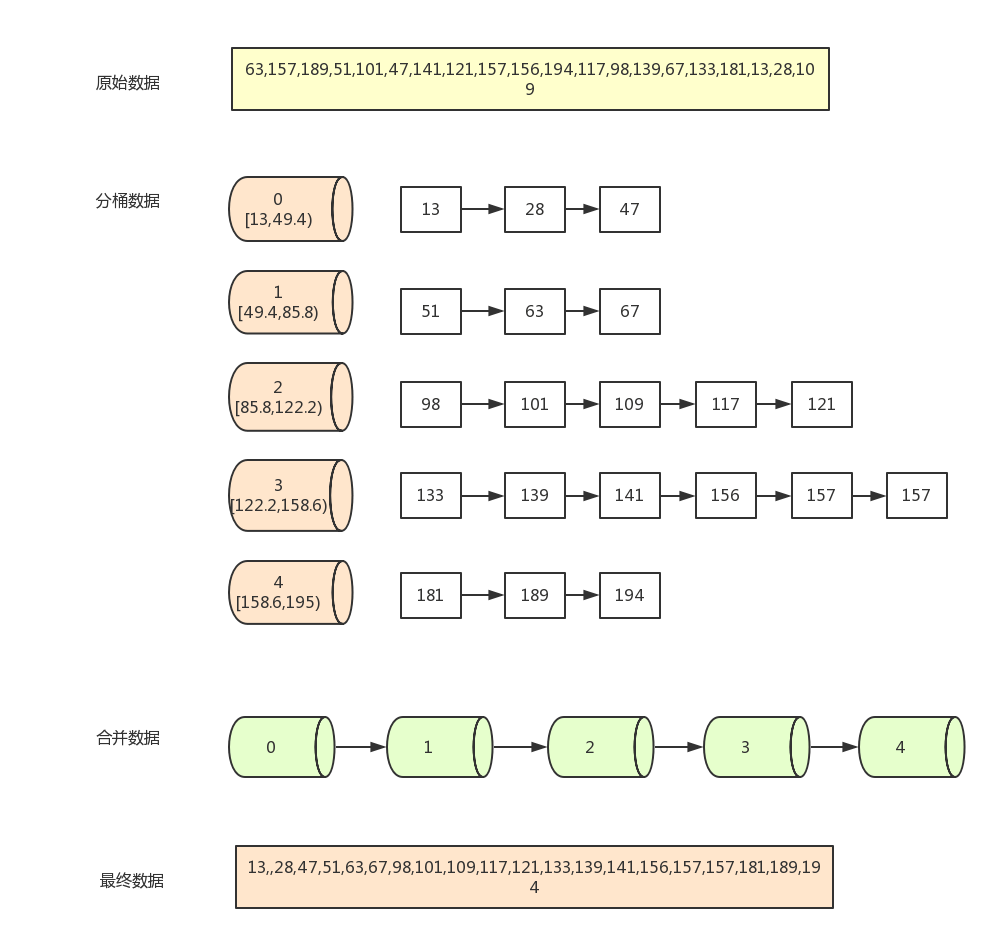

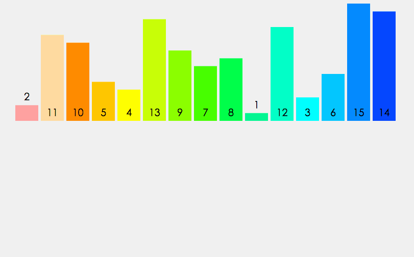

**算法描述**

- 设置一个定量的数组当作空桶
- 遍历输入数据，并且把数据一个一个放到对应的桶里去
- 对每个不是空的桶进行排序
- 从不是空的桶里把排好序的数据拼接起来

**代码实现**

```java
/**
     * 桶排序算法
     *
     * @param arr 待排序数组
     */
    public static int[] bucketSort(int[] arr) {
        // 计算最大值与最小值
        int max = Integer.MIN_VALUE;
        int min = Integer.MAX_VALUE;
        for (int value : arr) {
            max = Math.max(max, value);
            min = Math.min(min, value);
        }

        // 计算桶的数量
        int bucketNum = (max - min) / arr.length + 1;
        List<List<Integer>> bucketArr = new ArrayList<>(bucketNum);
        for (int i = 0; i < bucketNum; i++) {
            bucketArr.add(new ArrayList<>());
        }

        // 将每个元素放入桶
        for (int value : arr) {
            int num = (value - min) / (arr.length);
            bucketArr.get(num).add(value);
        }

        // 对每个桶进行排序
        for (List<Integer> integers : bucketArr) {
            Collections.sort(integers);
        }

        // 将桶中的元素赋值到原序列
        int index = 0;
        for (List<Integer> integers : bucketArr) {
            for (Integer integer : integers) {
                arr[index++] = integer;
            }
        }

        return arr;
    }
```

**算法分析**

桶排序最好情况下使用线性时间O(n)，桶排序的时间复杂度，取决与对各个桶之间数据进行排序的时间复杂度，因为其它部分的时间复杂度都为O(n)。很显然，桶划分的越小，各个桶之间的数据越少，排序所用的时间也会越少。但相应的空间消耗就会增大。 


# Case

## 双指针

### 删除排序数组中的重复项

给你一个有序数组 nums ，请你 原地 删除重复出现的元素，使每个元素 只出现一次 ，返回删除后数组的新长度。不要使用额外的数组空间，你必须在 原地 修改输入数组 并在使用 O(1) 额外空间的条件下完成。

```java
/**
 * 双指针解决
 */
public int removeDuplicates(int[] A) {
        // 边界条件判断
        if (A == null || A.length == 0){
            return 0;
	}
    
        int left = 0;
        for (int right = 1; right < A.length; right++){
            // 如果左指针和右指针指向的值一样，说明有重复的，
            // 这个时候，左指针不动，右指针继续往右移。如果他俩
            // 指向的值不一样就把右指针指向的值往前挪
            if (A[left] != A[right]){
                A[++left] = A[right];
            }
	}
        return ++left;
}
```


### 移动零

给定一个数组 `nums`，编写一个函数将所有 `0` 移动到数组的末尾，同时保持非零元素的相对顺序。

**示例：**输入: [0,1,0,3,12]，输出: [1,3,12,0,0]

可以参照双指针的思路解决，指针j是一直往后移动的，如果指向的值不等于0才对他进行操作。而i统计的是前面0的个数，我们可以把j-i看做另一个指针，它是指向前面第一个0的位置，然后我们让j指向的值和j-i指向的值交换


```java
public void moveZeroes(int[] nums) {
    int i = 0;// 统计前面0的个数
    for (int j = 0; j < nums.length; j++) {
        if (nums[j] == 0) {//如果当前数字是0就不操作
            i++;
        } else if (i != 0) {
            //否则，把当前数字放到最前面那个0的位置，然后再把
            //当前位置设为0
            nums[j - i] = nums[j];
            nums[j] = 0;
        }
    }
}
```


## 反转

### 旋转数组

给定一个数组，将数组中的元素向右移动 `k` 个位置，其中 `k` 是非负数。

先反转全部数组，在反转前k个，最后在反转剩余的，如下所示：

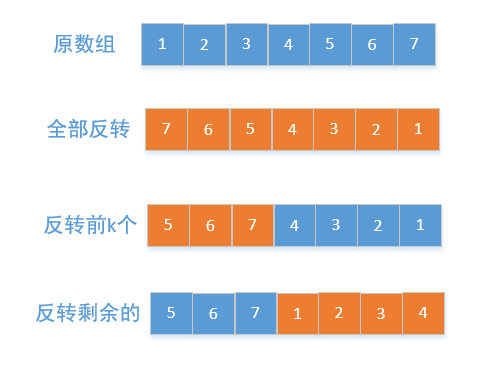


```java
public void rotate(int[] nums, int k) {
    int length = nums.length;
    k %= length;
    reverse(nums, 0, length - 1);//先反转全部的元素
    reverse(nums, 0, k - 1);//在反转前k个元素
    reverse(nums, k, length - 1);//接着反转剩余的
}

//把数组中从[start，end]之间的元素两两交换,也就是反转
public void reverse(int[] nums, int start, int end) {
    while (start < end) {
        int temp = nums[start];
        nums[start++] = nums[end];
        nums[end--] = temp;
    }
}
```


## 栈

### 判断字符串括号是否合法

字符串中只有字符'('和')'。合法字符串需要括号可以配对。如：()，()()，(())是合法的。)(，()(，(()是非法的。

**① 栈**


```java
/**
 * 判断字符串括号是否合法
 *
 * @param s
 * @return
 */
public boolean isValid(String s) {
        // 当字符串本来就是空的时候，我们可以快速返回true
        if (s == null || s.length() == 0) {
            return true;
        }

        // 当字符串长度为奇数的时候，不可能是一个有效的合法字符串
        if (s.length() % 2 == 1) {
            return false;
        }

        // 消除法的主要核心逻辑:
        Stack<Character> t = new Stack<>();
        for (int i = 0; i < s.length(); i++) {
            // 取出字符
            char c = s.charAt(i);
            if (c == '(') {
                // 如果是'('，那么压栈
                t.push(c);
            } else if (c == ')') {
                // 如果是')'，那么就尝试弹栈
                if (t.empty()) {
                    // 如果弹栈失败，那么返回false
                    return false;
                }
                t.pop();
            }
        }

        return t.empty();
}
```

**复杂度分析**：每个字符只入栈一次，出栈一次，所以时间复杂度为 O(N)，而空间复杂度为 O(N)，因为最差情况下可能会把整个字符串都入栈。


**② 栈深度扩展**

如果仔细观察，你会发现，栈中存放的元素是一样的。全部都是左括号'('，除此之外，再也没有别的元素，优化方法如下。**栈中元素都相同时，实际上没有必要使用栈，只需要记录栈中元素个数。** 我们可以通过画图来解决这个问题，如下图所示：

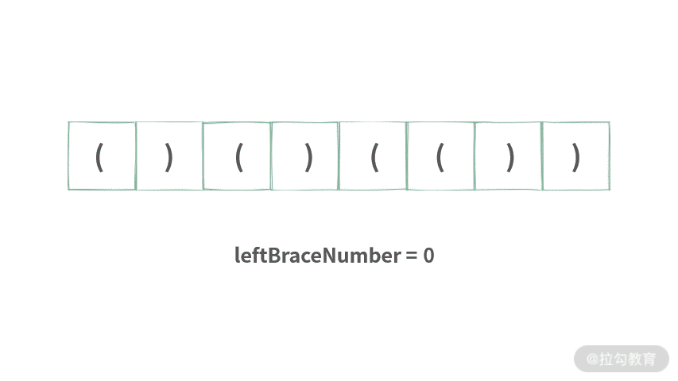

```java
/**
 * 判断字符串括号是否合法
 *
 * @param s
 * @return
 */
public boolean isValid(String s) {
        // 当字符串本来就是空的时候，我们可以快速返回true
        if (s == null || s.length() == 0) {
            return true;
        }

        // 当字符串长度为奇数的时候，不可能是一个有效的合法字符串
        if (s.length() % 2 == 1) {
            return false;
        }

        // 消除法的主要核心逻辑:
        int leftBraceNumber = 0;
        for (int i = 0; i < s.length(); i++) {
            // 取出字符
            char c = s.charAt(i);
            if (c == '(') {
                // 如果是'('，那么压栈
                leftBraceNumber++;
            } else if (c == ')') {
                // 如果是')'，那么就尝试弹栈
                if (leftBraceNumber <= 0) {
                    // 如果弹栈失败，那么返回false
                    return false;
                }
                --leftBraceNumber;
            }
        }

        return leftBraceNumber == 0;
}
```

**复杂度分析**：每个字符只入栈一次，出栈一次，所以时间复杂度为 O(N)，而空间复杂度为 O(1)，因为我们已经只用一个变量来记录栈中的内容。


**③ 栈广度扩展**

接下来再来看看如何进行广度扩展。观察题目可以发现，栈中只存放了一个维度的信息：左括号'('和右括号')'。如果栈中的内容变得更加丰富一点，就可以得到下面这道扩展题。给定一个只包括 '('，')'，'{'，'}'，'['，']' 的字符串，判断字符串是否有效。有效字符串需满足：

- 左括号必须用相同类型的右括号闭合
- 左括号必须以正确的顺序闭合
- 注意空字符串可被认为是有效字符串

```java
/**
 * 判断字符串括号是否合法
 *
 * @param s
 * @return
 */
public boolean isValid(String s) {
        if (s == null || s.length() == 0) {
            return true;
        }
        if (s.length() % 2 == 1) {
            return false;
        }

        Stack<Character> t = new Stack<>();
        for (int i = 0; i < s.length(); i++) {
            char c = s.charAt(i);
            if (c == '{' || c == '(' || c == '[') {
                t.push(c);
            } else if (c == '}') {
                if (t.empty() || t.peek() != '{') {
                    return false;
                }
                t.pop();
            } else if (c == ']') {
                if (t.empty() || t.peek() != '[') {
                    return false;
                }
                t.pop();
            } else if (c == ')') {
                if (t.empty() || t.peek() != '(') {
                    return false;
                }
                t.pop();
            } else {
                return false;
            }
        }

        return t.empty();
}
```


### 大鱼吃小鱼

在水中有许多鱼，可以认为这些鱼停放在 x 轴上。再给定两个数组 Size，Dir，Size[i] 表示第 i 条鱼的大小，Dir[i] 表示鱼的方向 （0 表示向左游，1 表示向右游）。这两个数组分别表示鱼的大小和游动的方向，并且两个数组的长度相等。鱼的行为符合以下几个条件:

- 所有的鱼都同时开始游动，每次按照鱼的方向，都游动一个单位距离
- 当方向相对时，大鱼会吃掉小鱼；
- 鱼的大小都不一样。

输入：Size = [4, 3, 2, 1, 5], Dir = [1, 1, 1, 1, 0]，输出：1。请完成以下接口来计算还剩下几条鱼？

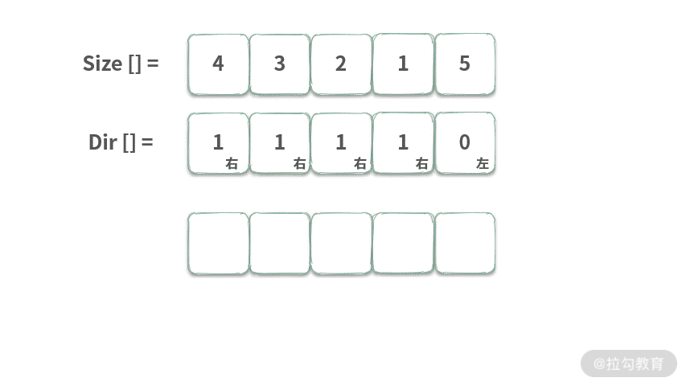

```java
/**
 * 大鱼吃小鱼
 *
 * @param fishSize
 * @param fishDirection
 * @return
 */
public int solution(int[] fishSize, int[] fishDirection) {
        // 首先拿到鱼的数量: 如果鱼的数量小于等于1，那么直接返回鱼的数量
        final int fishNumber = fishSize.length;
        if (fishNumber <= 1) {
            return fishNumber;
        }

        // 0表示鱼向左游
        final int left = 0;
        // 1表示鱼向右游
        final int right = 1;
        Stack<Integer> t = new Stack<>();
        for (int i = 0; i < fishNumber; i++) {
            // 当前鱼的情况：1，游动的方向；2，大小
            final int curFishDirection = fishDirection[i];
            final int curFishSize = fishSize[i];
            // 当前的鱼是否被栈中的鱼吃掉了
            boolean hasEat = false;
            // 如果栈中还有鱼，并且栈中鱼向右，当前的鱼向左游，那么就会有相遇的可能性
            while (!t.empty() && fishDirection[t.peek()] == right && curFishDirection == left) {
                // 如果栈顶的鱼比较大，那么把新来的吃掉
                if (fishSize[t.peek()] > curFishSize) {
                    hasEat = true;
                    break;
                }
                // 如果栈中的鱼较小，那么会把栈中的鱼吃掉，栈中的鱼被消除，所以需要弹栈。
                t.pop();
            }
            // 如果新来的鱼，没有被吃掉，那么压入栈中。
            if (!hasEat) {
                t.push(i);
            }
        }

        return t.size();
}
```


### 找出数组中右边比我小的元素

一个整数数组 A，找到每个元素：右边第一个比我小的下标位置，没有则用 -1 表示。输入：[5, 2]，输出：[1, -1]。

```java
/**
 * 找出数组中右边比我小的元素
 *
 * @param A
 * @return
 */
public static int[] findRightSmall(int[] A) {
        // 结果数组
        int[] ans = new int[A.length];
        // 注意，栈中的元素记录的是下标
        Stack<Integer> t = new Stack<>();
        for (int i = 0; i < A.length; i++) {
            final int x = A[i];
            // 每个元素都向左遍历栈中的元素完成消除动作
            while (!t.empty() && A[t.peek()] > x) {
                // 消除的时候，记录一下被谁消除了
                ans[t.peek()] = i;
                // 消除时候，值更大的需要从栈中消失
                t.pop();
            }
            // 剩下的入栈
            t.push(i);
        }
        // 栈中剩下的元素，由于没有人能消除他们，因此，只能将结果设置为-1。
        while (!t.empty()) {
            ans[t.peek()] = -1;
            t.pop();
        }
        return ans;
}
```


### 字典序最小的 k 个数的子序列

给定一个正整数数组和 k，要求依次取出 k 个数，输出其中数组的一个子序列，需要满足：1. **长度为 k**；2.**字典序最小**。

输入：nums = [3,5,2,6], k = 2，输出：[2,6]

**解释**：在所有可能的解：{[3,5], [3,2], [3,6], [5,2], [5,6], [2,6]} 中，[2,6] 字典序最小。所谓字典序就是，给定两个数组：x = [x1,x2,x3,x4]，y = [y1,y2,y3,y4]，如果 0 ≤ p < i，xp == yp 且 xi < yi，那么我们认为 x 的字典序小于 y。

```java
/**
 * 字典序最小的 k 个数的子序列
 *
 * @param nums
 * @param k
 * @return
 */
public int[] findSmallSeq(int[] nums, int k) {
        int[] ans = new int[k];
        Stack<Integer> s = new Stack();
        // 这里生成单调栈
        for (int i = 0; i < nums.length; i++) {
            final int x = nums[i];
            final int left = nums.length - i;
            // 注意我们想要提取出k个数，所以注意控制扔掉的数的个数
            while (!s.empty() && (s.size() + left > k) && s.peek() > x) {
                s.pop();
            }
            s.push(x);
        }
        // 如果递增栈里面的数太多，那么我们只需要取出前k个就可以了。
        // 多余的栈中的元素需要扔掉。
        while (s.size() > k) {
            s.pop();
        }
        // 把k个元素取出来，注意这里取的顺序!
        for (int i = k - 1; i >= 0; i--) {
            ans[i] = s.peek();
            s.pop();
        }
        return ans;
}
```


## FIFO队列

### 二叉树的层次遍历（两种方法）

从上到下按层打印二叉树，同一层结点按从左到右的顺序打印，每一层打印到一行。输入：

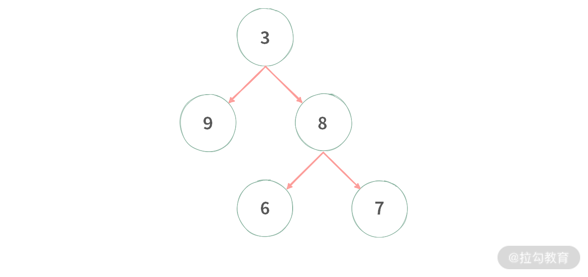

输出：[[3], [9, 8], [6, 7]]

```java
// 二叉树结点的定义
public class TreeNode {
      // 树结点中的元素值
      int val = 0;
      // 二叉树结点的左子结点
      TreeNode left = null;
      // 二叉树结点的右子结点
      TreeNode right = null;
}
```

**Queue表示FIFO队列解法**：

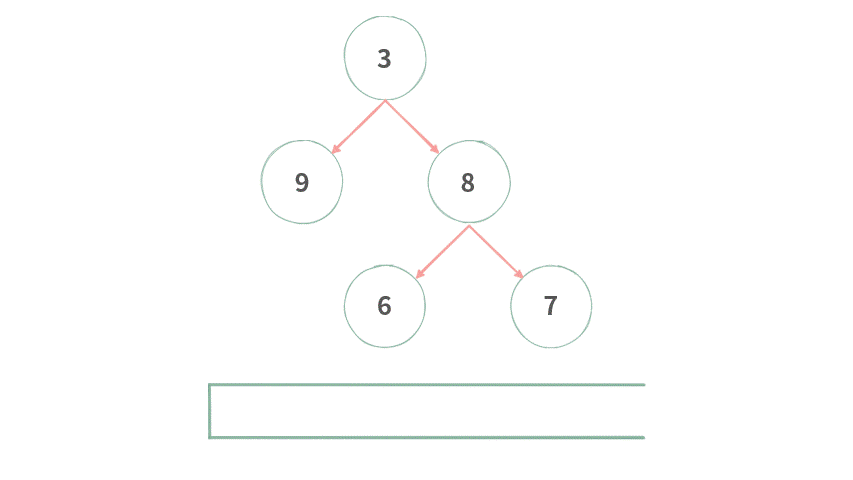

```java
public List<List<Integer>> levelOrder(TreeNode root) {
        // 生成FIFO队列
        Queue<TreeNode> Q = new LinkedList<>();
        // 如果结点不为空，那么加入FIFO队列
        if (root != null) {
               Q.offer(root);
        }

        // ans用于保存层次遍历的结果
        List<List<Integer>> ans = new LinkedList<>();
        // 开始利用FIFO队列进行层次遍历
        while (Q.size() > 0) {
                // 取出当前层里面元素的个数
                final int qSize = Q.size();
                // 当前层的结果存放于tmp链表中
                List<Integer> tmp = new LinkedList<>();
                // 遍历当前层的每个结点
                for (int i = 0; i < qSize; i++) {
                    // 当前层前面的结点先出队
                    TreeNode cur = Q.poll();
                    // 把结果存放当于当前层中
                    tmp.add(cur.val);
                    // 把下一层的结点入队，注意入队时需要非空才可以入队。
                    if (cur.left != null) {
                        Q.offer(cur.left);
                    }
                    if (cur.right != null) {
                        Q.offer(cur.right);
                    }
                }

                // 把当前层的结果放到返回值里面。
                ans.add(tmp);
        }

        return ans;
}
```

**ArrayList表示FIFO队列解法**：

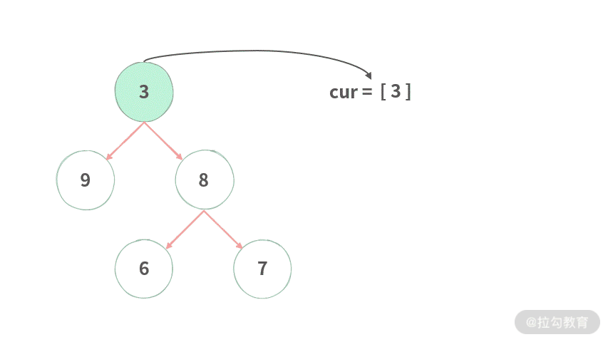

```java
public List<List<Integer>> levelOrder(TreeNode root) {
        List<List<Integer>> ans = new ArrayList<>();
        // 初始化当前层结点
        List<TreeNode> curLevel = new ArrayList<>();
        // 注意：需要root不空的时候才加到里面。
        if (root != null) {
                curLevel.add(root);
        }
        while (curLevel.size() > 0) {
                // 准备用来存放下一层的结点
                List<TreeNode> nextLevel = new ArrayList<>();
                // 用来存放当前层的结果
                List<Integer> curResult = new ArrayList<>();
                // 遍历当前层的每个结点
                for (TreeNode cur : curLevel) {
                    // 把当前层的值存放到当前结果里面
                    curResult.add(cur.val);
                    // 生成下一层
                    if (cur.left != null) {
                        nextLevel.add(cur.left);
                    }
                    if (cur.right != null) {
                        nextLevel.add(cur.right);
                    }
                }
                // 注意这里的更迭!滚动前进
                curLevel = nextLevel;
                // 把当前层的值放到结果里面
                ans.add(curResult);
        }
        return ans;
}
```


### 循环队列

设计一个可以容纳 k 个元素的循环队列。需要实现以下接口：

```java
public class MyCircularQueue {
        // 参数k表示这个循环队列最多只能容纳k个元素
        public MyCircularQueue(int k){}
        // 将value放到队列中, 成功返回true
        public boolean enQueue(int value){return false;}
        // 删除队首元素，成功返回true
        public boolean deQueue(){return false;}
        // 得到队首元素，如果为空，返回-1
        public int Front(){return 0;}
        // 得到队尾元素，如果队列为空，返回-1
        public int Rear(){return 0;}
        // 看一下循环队列是否为空
        public boolean isEmpty(){return false;}
        // 看一下循环队列是否已放满k个元素
        public boolean isFull(){return false;}
}
```

循环队列的重点在于**循环使用固定空间**，难点在于**控制好 front/rear 两个首尾指示器**。

**方法一：k个元素空间**

只使用 k 个元素的空间，三个变量 front, rear, used 来控制循环队列。标记 k = 6 时，循环队列的三种情况，如下图所示：

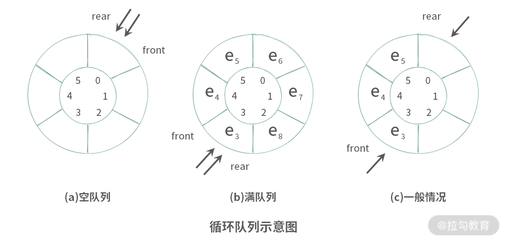

```java
public class MyCircularQueue {
        // 已经使用的元素个数
        private int used = 0;
        // 第一个元素所在位置
        private int front = 0;
        // rear是enQueue可在存放的位置，注意开闭原则， [front, rear)
        private int rear = 0;
        // 循环队列最多可以存放的元素个数
        private int capacity = 0;
        // 循环队列的存储空间
        private int[] a = null;

        public MyCircularQueue(int k) {
            // 初始化循环队列
            capacity = k;
            a = new int[capacity];
        }

        public boolean enQueue(int value) {
            // 如果已经放满了
            if (isFull()) {
                return false;
            }

            // 如果没有放满，那么a[rear]用来存放新进来的元素
            a[rear] = value;
            // rear注意取模
            rear = (rear + 1) % capacity;
            // 已经使用的空间
            used++;
            // 存放成功!
            return true;
        }

        public boolean deQueue() {
            // 如果是一个空队列，当然不能出队
            if (isEmpty()) {
                return false;
            }

            // 第一个元素取出
            int ret = a[front];
            // 注意取模
            front = (front + 1) % capacity;
            // 已经存放的元素减减
            used--;
            // 取出元素成功
            return true;
        }

        public int front() {
            // 如果为空，不能取出队首元素
            if (isEmpty()) {
                return -1;
            }

            // 取出队首元素
            return a[front];
        }

        public int rear() {
            // 如果为空，不能取出队尾元素
            if (isEmpty()) {
                return -1;
            }

            // 注意：这里不能使用rear - 1
            // 需要取模
            int tail = (rear - 1 + capacity) % capacity;
            return a[tail];
        }

        // 队列是否为空
        public boolean isEmpty() {
            return used == 0;
        }

        // 队列是否满了
        public boolean isFull() {
            return used == capacity;
        }
}
```

**复杂度分析**：入队操作与出队操作都是 O(1)。

**方法二：k+1个元素空间**

方法 1 利用 used 变量对满队列和空队列进行了区分。实际上，这种区分方式还有另外一种办法，使用 k+1 个元素的空间，两个变量 front, rear 来控制循环队列的使用。具体如下：

- 在申请数组空间的时候，申请 k + 1 个空间
- 在放满循环队列的时候，必须要保证 rear 与 front 之间有空隙

如下图（此时 k = 5）所示：

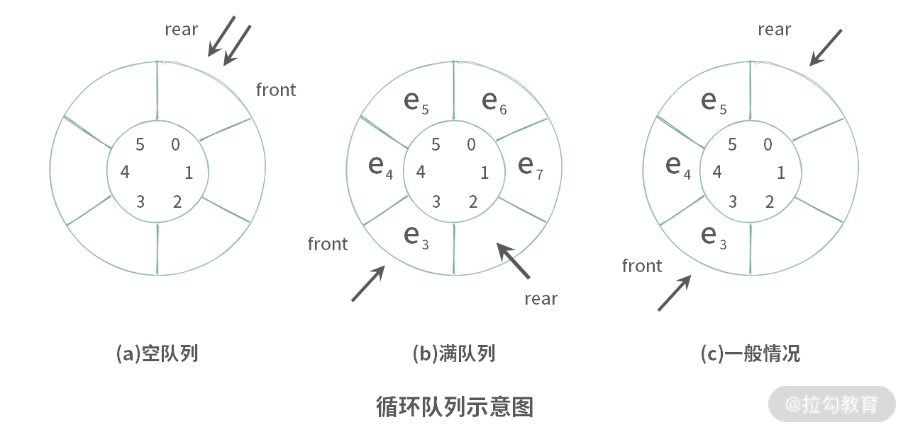

```java
public class MyCircularQueue {
        // 队列的头部元素所在位置
        private int front = 0;
        // 队列的尾巴，注意我们采用的是前开后闭原则， [front, rear)
        private int rear = 0;
        private int[] a = null;
        private int capacity = 0;

        public MyCircularQueue(int k) {
            // 初始化队列，注意此时队列中元素个数为
            // k + 1
            capacity = k + 1;
            a = new int[k + 1];
        }

        public boolean enQueue(int value) {
            // 如果已经满了，无法入队
            if (isFull()) {
                return false;
            }
            // 把元素放到rear位置
            a[rear] = value;
            // rear向后移动
            rear = (rear + 1) % capacity;
            return true;
        }

        public boolean deQueue() {
            // 如果为空，无法出队
            if (isEmpty()) {
                return false;
            }
            // 出队之后，front要向前移
            front = (front + 1) % capacity;
            return true;
        }

        public int front() {
            // 如果能取出第一个元素，取a[front];
            return isEmpty() ? -1 : a[front];
        }

        public int rear() {
            // 由于我们使用的是前开后闭原则
            // [front, rear)
            // 所以在取最后一个元素时，应该是
            // (rear - 1 + capacity) % capacity;
            int tail = (rear - 1 + capacity) % capacity;
            return isEmpty() ? -1 : a[tail];
        }

        public boolean isEmpty() {
            // 队列是否为空
            return front == rear;
        }

        public boolean isFull() {
            // rear与front之间至少有一个空格
            // 当rear指向这个最后的一个空格时，
            // 队列就已经放满了!
            return (rear + 1) % capacity == front;
        }
}
```

**复杂度分析**：入队与出队操作都是 O(1)。


## 单调队列

单调队列属于**双端队列**的一种。双端队列与 FIFO 队列的区别在于：

- FIFO 队列只能从尾部添加元素，首部弹出元素
- 双端队列可以从首尾两端 push/pop 元素

### 滑动窗口的最大值

给定一个数组和滑动窗口的大小，请找出所有滑动窗口里的最大值。输入：nums = [1,3,-1,-3,5,3], k = 3，输出：[3,3,5,5]。

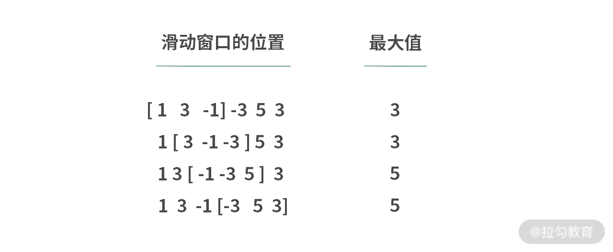

```java
public class Solution {

    // 单调队列使用双端队列来实现
    private ArrayDeque<Integer> Q = new ArrayDeque<>();

    // 入队的时候，last方向入队，但是入队的时候
    // 需要保证整个队列的数值是单调的
    // (在这个题里面我们需要是递减的)
    // 并且需要注意，这里是Q.getLast() < val
    // 如果写成Q.getLast() <= val就变成了严格单调递增
    private void push(int val) {
        while (!Q.isEmpty() && Q.getLast() < val) {
            Q.removeLast();
        }
        // 将元素入队
        Q.addLast(val);
    }

    // 出队的时候，要相等的时候才会出队
    private void pop(int val) {
        if (!Q.isEmpty() && Q.getFirst() == val) {
            Q.removeFirst();
        }
    }

    public int[] maxSlidingWindow(int[] nums, int k) {
        List<Integer> ans = new ArrayList<>();
        for (int i = 0; i < nums.length; i++) {
            push(nums[i]);
            // 如果队列中的元素还少于k个
            // 那么这个时候，还不能去取最大值
            if (i < k - 1) {
                continue;
            }
            // 队首元素就是最大值
            ans.add(Q.getFirst());
            // 尝试去移除元素
            pop(nums[i - k + 1]);
        }
        // 将ans转换成为数组返回!
        return ans.stream().mapToInt(Integer::valueOf).toArray();
    }

}
```

**复杂度分析**：每个元素都只入队一次，出队一次，每次入队与出队都是 O(1) 的复杂度，因此整个算法的复杂度为 O(n)。


### 捡金币游戏

给定一个数组 A[]，每个位置 i 放置了金币 A[i]，小明从 A[0] 出发。当小明走到 A[i] 的时候，下一步他可以选择 A[i+1, i+k]（当然，不能超出数组边界）。每个位置一旦被选择，将会把那个位置的金币收走（如果为负数，就要交出金币）。请问，最多能收集多少金币？

输入：[1,-1,-100,-1000,100,3], k = 2，输出：4。

**解释**：从 A[0] = 1 出发，收获金币 1。下一步走往 A[2] = -100, 收获金币 -100。再下一步走到 A[4] = 100，收获金币 100，最后走到 A[5] = 3，收获金币 3。最多收获 1 - 100 + 100 + 3 = 4。没有比这个更好的走法了。

```java
public class Solution {
    public int maxResult(int[] A, int k) {
        // 处理掉各种边界条件!
        if (A == null || A.length == 0 || k <= 0) {
            return 0;
        }
        final int N = A.length;
        // 每个位置可以收集到的金币数目
        int[] get = new int[N];
        // 单调队列，这里并不是严格递减
        ArrayDeque<Integer> Q = new ArrayDeque<Integer>();
        for (int i = 0; i < N; i++) {
            // 在取最大值之前，需要保证单调队列中都是有效值。
            // 也就是都在区间里面的值
            // 当要求get[i]的时候，
            // 单调队列中应该是只能保存[i-k, i-1]这个范围
            if (i - k > 0) {
                if (!Q.isEmpty() && Q.getFirst() == get[i - k - 1]) {
                    Q.removeFirst();
                }
            }
            // 从单调队列中取得较大值
            int old = Q.isEmpty() ? 0 : Q.getFirst();
            get[i] = old + A[i];
            // 入队的时候，采用单调队列入队
            while (!Q.isEmpty() && Q.getLast() < get[i]) {
                Q.removeLast();
            }
            Q.addLast(get[i]);
        }
        return get[N - 1];
    }
    
}
```

**复杂度分析**：每个元素只入队一次，出队一次，每次入队与出队复杂度都是 O(n)。因此，时间复杂度为 O(n)，空间复杂度为 O(n)。


# Design Pattern

在Java编程语言中，常用的设计模式可分为三种类型：

- **建造类设计模式**：主要用于定义和约束如何创建一个新的对象
- **结构类设计模式**：主要用于定义如何使用多个对象组合出一个或多个复合对象
- **行为类设计模式**：主要用于定义和描述对象之间的交互规则和限定对象的职责边界线


设计模式功能：

- **建造类**
  - **单例（Singleton）模式**：某个类只能生成一个实例，该类提供了一个全局访问点供外部获取该实例，其拓展是有限多例模式
  - **工厂方法（Factory Method）模式**：定义一个用于创建产品的接口，由子类决定生产什么产品
  - **抽象工厂（AbstractFactory）模式**：提供一个创建产品族的接口，其每个子类可以生产一系列相关的产品
  - **建造者（Builder）模式**：将一个复杂对象分解成多个相对简单的部分，然后根据不同需要分别创建它们，最后构建成该复杂对象
  - **原型（Prototype）模式**：将一个对象作为原型，通过对其进行复制而克隆出多个和原型类似的新实例

- **结构类**
  - **适配器（Adapter）模式**：将一个类的接口转换成客户希望的另外一个接口，使得原本由于接口不兼容而不能一起工作的那些类能一起工作
  - **组合（Composite）模式**：将对象组合成树状层次结构，使用户对单个对象和组合对象具有一致的访问性
  - **代理（Proxy）模式**：为某对象提供一种代理以控制对该对象的访问。即客户端通过代理间接地访问该对象，从而限制、增强或修改该对象的一些特性
  - **享元（Flyweight）模式**：运用共享技术来有效地支持大量细粒度对象的复用
  - **外观（Facade）模式**：为多个复杂的子系统提供一个一致的接口，使这些子系统更加容易被访问
  - **桥接（Bridge）模式**：将抽象与实现分离，使它们可以独立变化。它是用组合关系代替继承关系来实现，从而降低了抽象和实现这两个可变维度的耦合度
  - **装饰（Decorator）模式**：动态的给对象增加一些职责，即增加其额外的功能

- **行为类**
  - **模板方法（TemplateMethod）模式**：定义一个操作中的算法骨架，而将算法的一些步骤延迟到子类中，使得子类可以不改变该算法结构的情况下重定义该算法的某些特定步骤
  - **策略（Strategy）模式**：定义了一系列算法，并将每个算法封装起来，使它们可以相互替换，且算法的改变不会影响使用算法的客户
  - **命令（Command）模式**：将一个请求封装为一个对象，使发出请求的责任和执行请求的责任分割开
  - **职责链（Chain of Responsibility）模式**：把请求从链中的一个对象传到下一个对象，直到请求被响应为止。通过这种方式去除对象之间的耦合
  - **状态（State）模式**：允许一个对象在其内部状态发生改变时改变其行为能力
  - **观察者（Observer）模式**：多个对象间存在一对多关系，当一个对象发生改变时，把这种改变通知给其他多个对象，从而影响其他对象的行为
  - **中介者（Mediator）模式**：定义一个中介对象来简化原有对象之间的交互关系，降低系统中对象间的耦合度，使原有对象之间不必相互了解
  - **迭代器（Iterator）模式**：提供一种方法来顺序访问聚合对象中的一系列数据，而不暴露聚合对象的内部表示
  - **访问者（Visitor）模式**：在不改变集合元素的前提下，为一个集合中的每个元素提供多种访问方式，即每个元素有多个访问者对象访问
  - **备忘录（Memento）模式**：在不破坏封装性的前提下，获取并保存一个对象的内部状态，以便以后恢复它
  - **解释器（Interpreter）模式**：提供如何定义语言的文法，以及对语言句子的解释方法，即解释器


## 创建型模式

建造类设计模式提供了对创建对象的基本定义和约束条件，以寻求最佳的实例化Java对象解决方案。

### 简单工厂模式

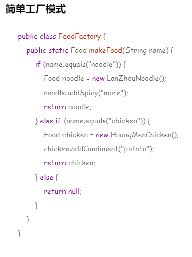


### 工厂模式-Factory

在Java程序设计过程中，当一个超类(super class)具有多个子类(sub class)，且需要频繁的创建子类对象时，我们可以采用工厂模式。工厂模式的作用是将子类的实例化工作统一交由工厂类来完成，通过对输入参数的判断，工厂类自动实例化具体的子类。实现工厂模式需要满足三个条件：

- 超类（super class）：超类是一个抽象类
- 子类（sub class）：子类需继承超类
- 工厂类（factory class）：工厂类根据输入参数实例化子类

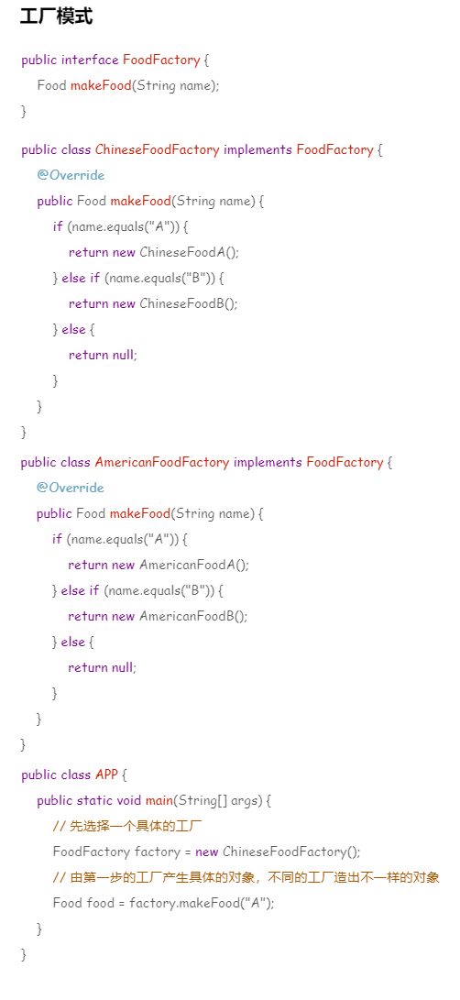


### 抽象工厂模式-Abstract Factory

抽象工厂模式与工厂模式很类似，抽象工厂模式可以简单的理解为“工厂的工厂”。在工厂模式中，根据提供的输入参数返回产品类的实例化对象，这个过程需要通过if-else或者switch这样的逻辑判断语句来完成具体子类的判定。而在抽象工厂模式中，每种产品都有具体的工厂类与之对应，从而避免在编码过程中使用大量的逻辑判断代码。抽象工厂模式会根据输入的工厂类型以返回具体的工厂子类。抽象工厂类只负责实例化工厂子类，不参与商品子类的实例化工作。


### 单例模式-Singleton

单例模式限制类的实例化过程，以确保在Java虚拟机（JVM）中有且只有一个类的实例化对象。单例模式是Java中最常用，也是最简单的设计模式之一。单例模式通常需具备如下的几个特征：

- 单例模式限制类的实例化，且Java虚拟机中只能存在一个该类的示例化对象
- 单例模式必须提供一个全局可用的访问入口来获取该类的实例化对象
- 单例模式常被用于日志记录，驱动程序对象设计，缓存以及线程池
- 单例模式也会被用于其他的设计模式当中，如抽象工厂模式，建造者模式，原型模式等

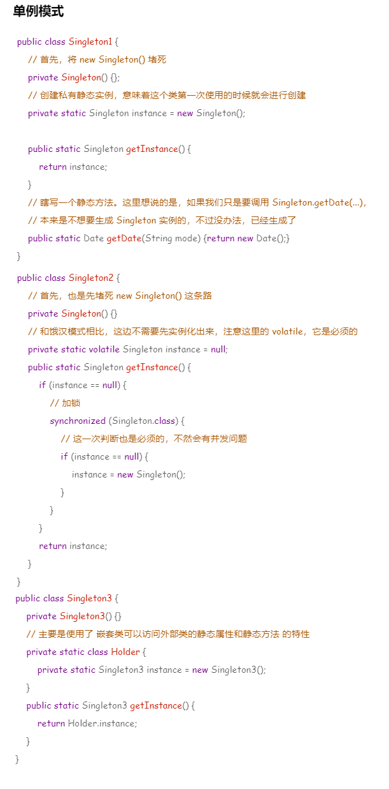


### 建造者模式-Builder

建造者模式通常被用于需要多个步骤创建对象的场景中。建造者模式的主要意图是将类的构建逻辑转移到类的实例化之外，当一个类有许多的属性，当在实例化该类的对象时，并不一定拥有该实例化对象的全部属性信息，便可使用建造者模式通过逐步获取实例化对象的属性信息，来完成该类的实例化过程。而工厂模式和抽象工厂模式需要在实例化时获取该类实例化对象的全部属性信息。

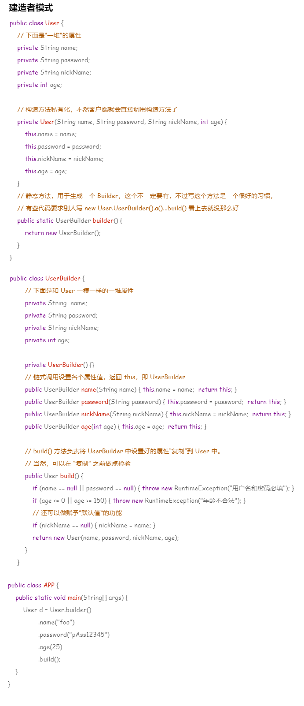


### 原型模式-Prototype

原型模式的主要作用是可以利用现有的类通过复制（克隆）的方式创建一个新的对象。当示例化一个类的对象需要耗费大量的时间和系统资源时，可是采用原型模式，将原始已存在的对象通过复制（克隆）机制创建新的对象，然后根据需要，对新对象进行修改。原型模式要求被复制的对象自身具备拷贝功能，此功能不能由外界完成。


## 结构型模式

结构类设计模式主要解决如何通过多个小对象组合出一个大对象的问题，如使用继承和接口实现将多个类组合在一起。

### 适配器模式-Adapter

适配器模式的主要作用是使现有的多个可用接口能够在一起为客服端提供新的接口服务。在适配器模式中，负责连接不同接口的对象成为适配器。在现实生活中，我们也能够找到很多实际的案例来理解适配器的工作原理，例如常用的手机充电头，在手机和电源插座之间，手机充电头就扮演一个适配器的角色，它能够同时适配220V，200V，120V等不同的电压，最终将电转换成手机可用的5V电压为手机进行充电。

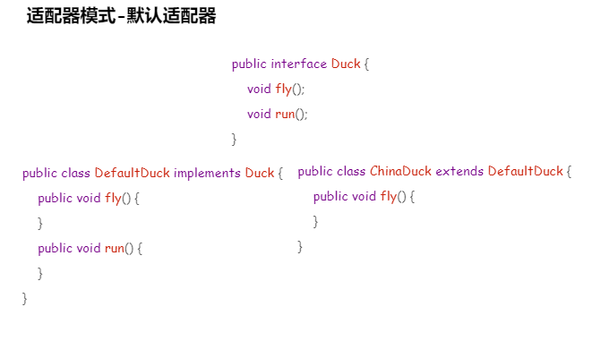

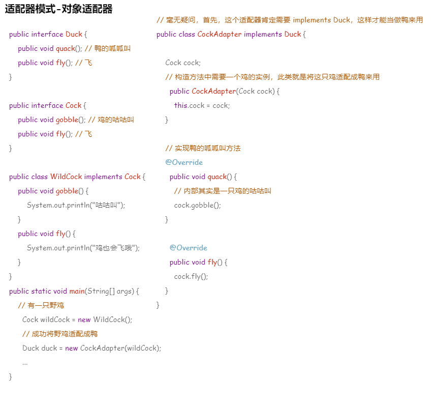

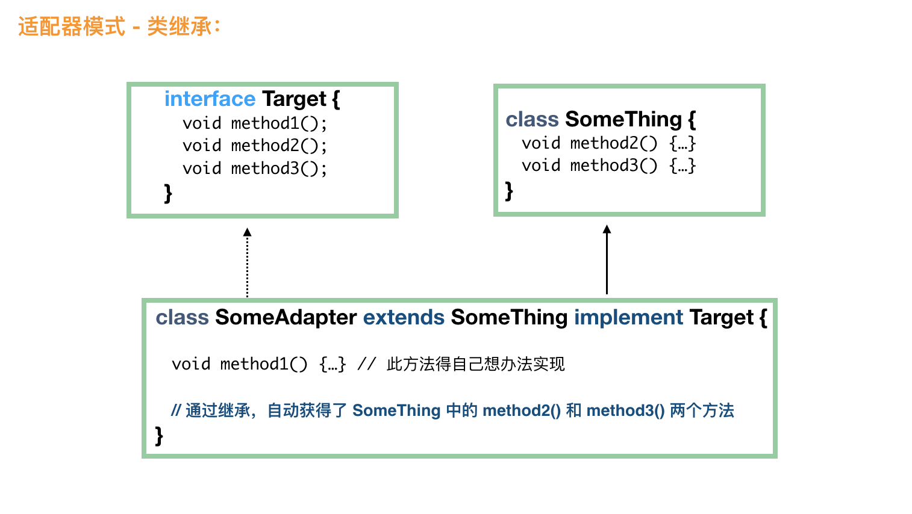


### 组合模式-Composite

组合模式的主要作用是让整体与局部之前具有相同的行为。例如我们需要绘制一个图形（正方形，三角形，圆形或其他多边形），首先需要准备一张空白的纸，然后是选择一种绘制图案的颜色，再次是确定绘制图案的大小，最后是绘制图案。不管是绘制正方形还是三角形，都需要按照这个步骤进行。在软件设计过程中，组合模式的最大意义在于保证了客户端在调用单个对象与组合对象时，在其操作流程上是保持一致的。

**案例**：每个员工都有姓名、部门、薪水这些属性，同时还有下属员工集合（虽然可能集合为空），而下属员工和自己的结构是一样的，也有姓名、部门这些属性，同时也有他们的下属员工集合。

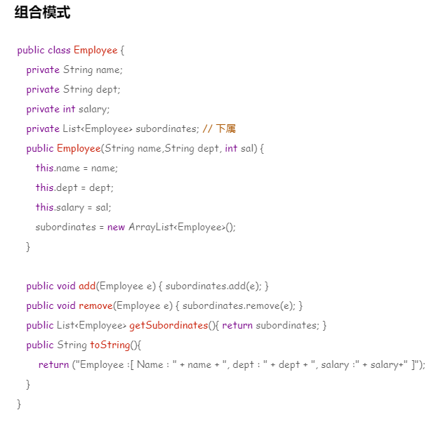


### 代理模式-Proxy

代理模式的主要作用是通过提供一个代理对象或者一个占位符来控制对实际对象的访问行为。代理模式通常用于需要频繁操作一些复杂对象的地方，通过使用代理模式，可以借由代理类来操作目标对象，简化操作流程。

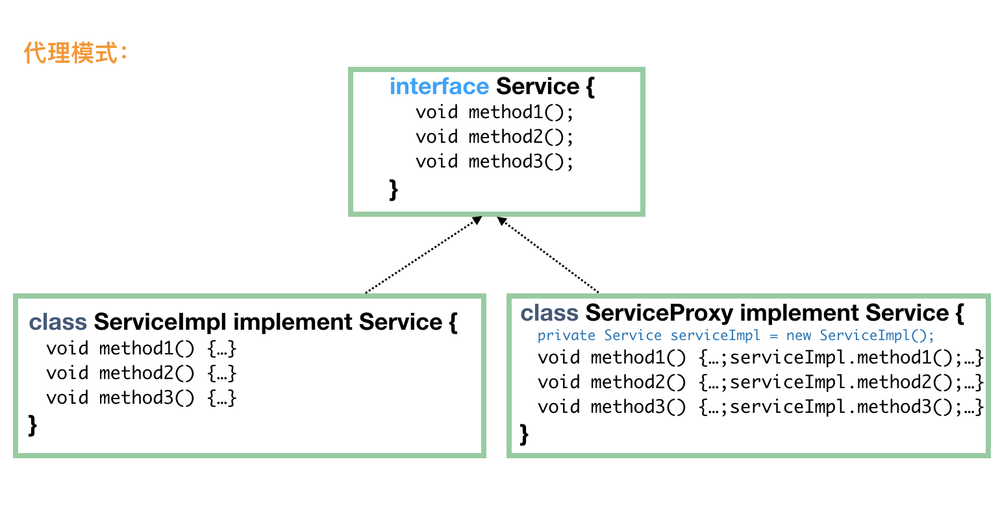


### 享元模式-Flywight

享元模式的主要作用是通过共享来有效地支持大量细粒度的对象。例如当需要创建一个类的很多对象时，可以使用享元模式，通过共享对象信息来减轻内存负载。如果在软件设计过程中采用享元模式，需要考虑以下三个问题：

- 应用程序需要创建的对象数量是否很大？
- 对象的创建对内存消耗和时间消耗是否有严格的要求？
- 对象的属性是否可以分为内在属性和外在属性？对象的外在属性是否支持有客户端定义？


### 门面模式-Facade

门面模式（也叫外观模式）的主要作用是为子系统中的一组接口提供一个统一的接口，以便客户端更容易去使用子系统中的接口。简单的理解是外观模式为众多复杂接口定义了一个更高级别的接口。外观模式的目的是让接口更容易被使用。

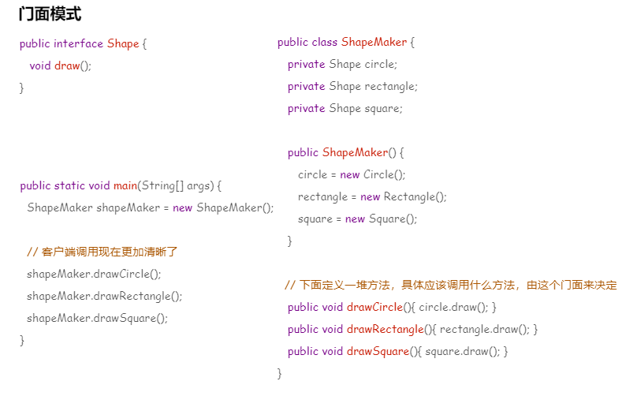


### 桥梁模式-Bridge

桥梁模式的主要用途是将抽象类与抽象类的具体实现相分离，以实现结构上的解耦，使抽象和实现可以独立的进行变化。桥梁模式的实现优先遵循组合而不是继承，当使用桥梁模式时，在一定程度上可以在客户端中因此接口的内部实现。

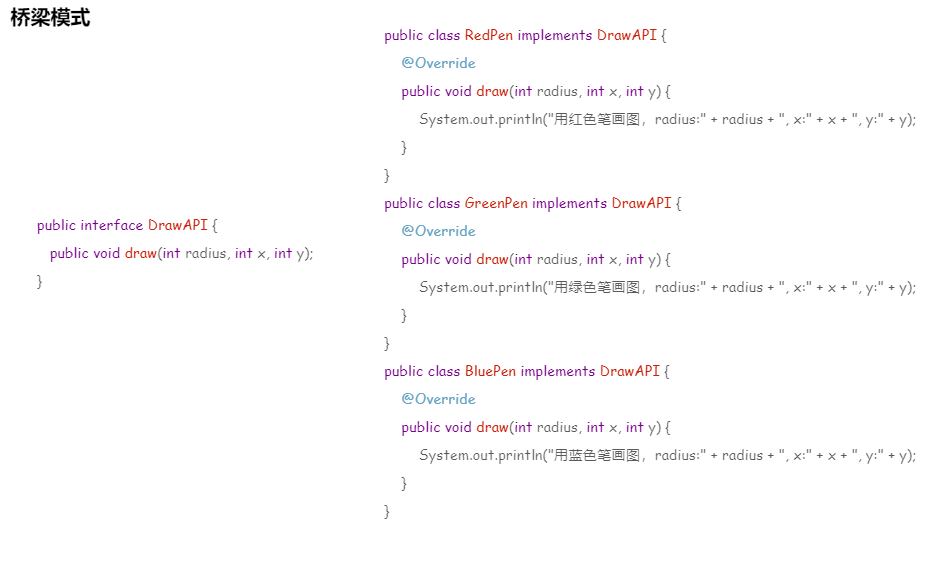

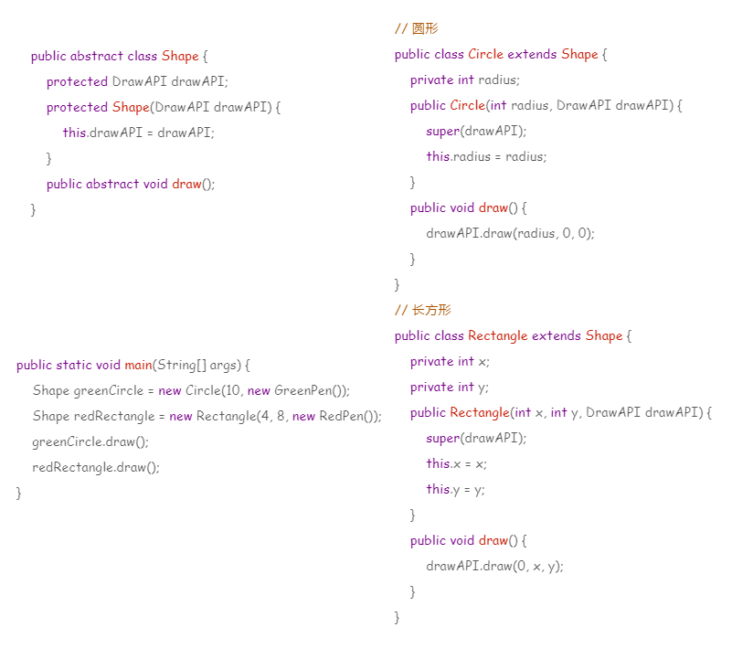


### 修饰模式-Decorator

修饰模式的主要作用是在运行时动态的组合类的行为。通常，你会添加一些新的类或者新的方法来扩展已有的代码库，然而，在某些情况下你需要在程序运行时为某个对象组合新的行为，此时你可以采用修饰模式。


### 过滤器模式-Filter

过滤器模式是使用不同的标准来过滤一组对象，通过逻辑运算以解耦的方式将对象组合起来。


## 行为型模式

行为类设计模式主要用于定义和描述对象之间的交互规则和职责边界，为对象之间更好的交互提供解决方案。

### 模板方法模式-Template Method

模板方法模式的主要作用是在一个方法里实现一个算法，可以将算法中的的一些步骤抽象为方法，并将这些方法的实现推迟到子类中去实现。例如建造一栋房子，我们需要设计图纸，打地基，构筑墙体，安装门窗和内部装修。我们可以设计不同的房屋样式（别墅，高楼，板房等）,不同的门窗和不同的装修材料和风格，但是其顺序不能颠倒。在这种情况下，我们可以定义一个模板方法，规定方法的执行顺序，而将方法的实现推迟到子类中完成。

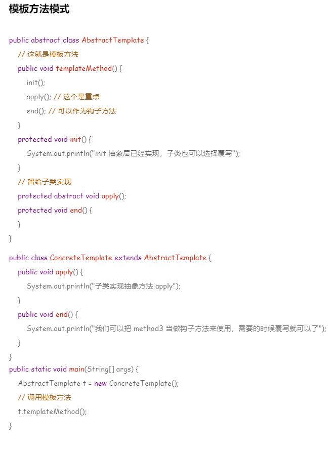


### 解释器模式-Mediator

解释器（中介）模式的主要设计意图是定义一个中间对象，封装一组对象的交互，从而降低对象的耦合度，避免了对象间的显示引用，并可以独立地改变对象的行为。解释器（中介）模式可以在系统中的不同对象之间提供集中式的交互介质，降低系统中各组件的耦合度。


### 责任链模式-Chain of Responsibility

责任链模式主要作用是让多个对象具有对同一任务（请求）的处理机会，以解除请求发送者与接收者之间的耦合度。try-catch就是一个典型的责任链模式的应用案例。在try-catch语句中，可以同时存在多个catch语句块，每个catch语句块都是处理该特定异常的处理器。当try语句块中发生异常是，异常将被发送到第一个catch语句块进行处理，如果第一个语句块无法处理它，它将会被请求转发到链中的下一个catch语句块。如果最后一个catch语句块仍然不能处理该异常，则该异常将会被向上抛出。

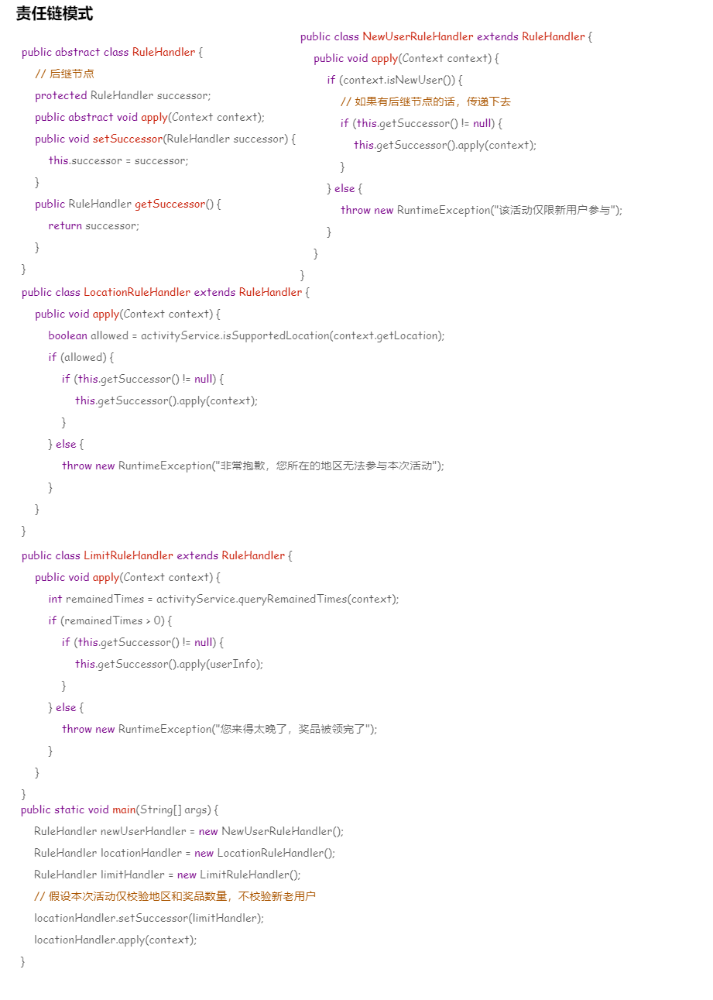


### 观察者模式-Observer

观察者模式的目的是在多个对象之间定义一对多的依赖关系，当一个对象的状态发生改变时，观察者会通知依赖它的对象，并根据新状态做出相应的反应。简单来说，如果你需要在对象状态发生改变时及时收到通知，你可以定义一个监听器，对该对象的状态进行监听，此时的监听器即为观察者（Observer），被监听对象称为主题（Subject）。Java消息服务（JMS）即采用了观察者设计模式（同时还使用了中介模式），允许应用程序订阅数据并将数据发布到其他应用程序中。

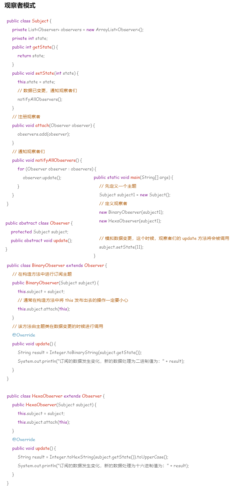


### 策略模式-Strategy

策略模式的主要目的是将可互换的方法封装在各自独立的类中，并且让每个方法都实现一个公共的操作。策略模式定义了策略的输入与输出，实现则由各个独立的类完成。策略模式可以让一组策略共存，代码互不干扰，它不仅将选择策略的逻辑从策略本身中分离出来，还帮助我们组织和简化了代码。一个典型的例子是Collections.sort()方法，采用Comparator作为方法参数，根据Comparator接口实现类的不同，对象将以不同的方式进行排序。

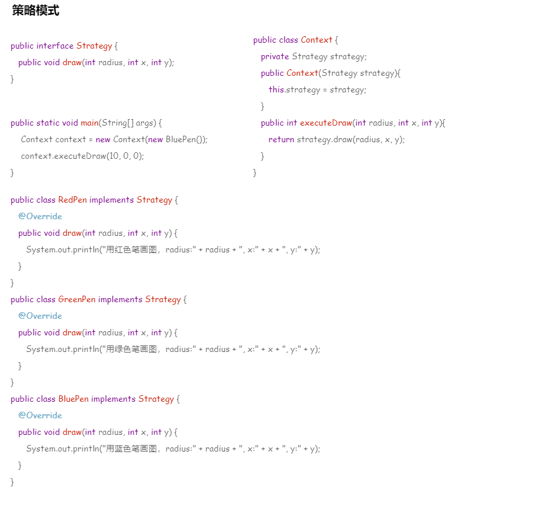


### 命令模式-Command

命令模式的设计意图是将请求封装在对象的内部。直接调用是执行方法的通常做法，然而，在有些时候我们无法控制方法被执行的时机和上下文信息。在这种情况下，可以将方法封装到对象的内部，通过在对象内部存储调用方所需要的信息，就可以让客户端或者服务自由决定何时调用方法。

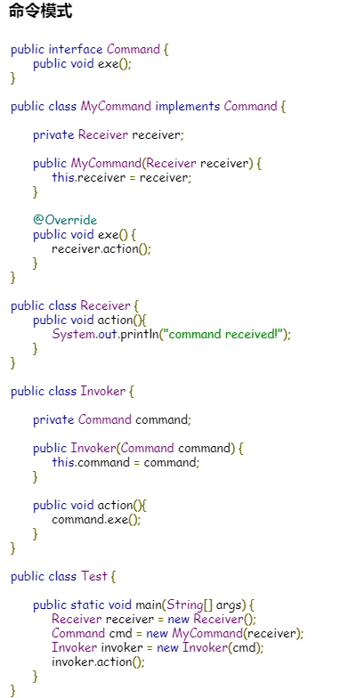


### 状态模式-State

状态模式的设计意图是更具对象的状态改变其行为。如果我们必须根据对象的状态改变对象的行为，可以在对象中定义一个状态变量，并使用逻辑判断语句块（如if-else）根据状态执行不同的操作。

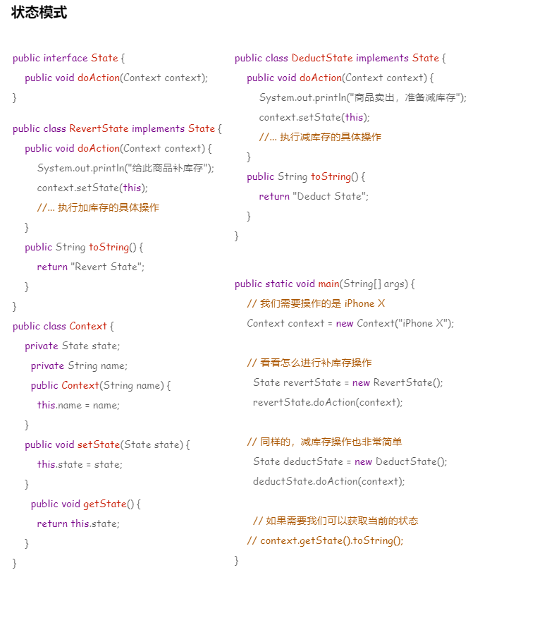


### 访客模式-Visitor

访客模式的设计意图是在不改变现有类层次结构的前提下，对该层次结构进行扩展。例如在购物网站中，我们将不同的商品添加进购物车，然后支付按钮时，它会计算出需要支付的总金额数。我们可以在购物车类中完成金额的计算，也可以使用访客模式，将购物应付金额逻辑转移到新的类中。


### 转义模式-Interpreter

转义（翻译）模式的设计意图是让你根据事先定义好的一系列组合规则，组合可执行的对象。实现转义（翻译）模式的一个基本步骤如下：

- 创建执行解释工作的上下文引擎
- 根据不同的表达式实现类，实现上下文中的解释工作
- 创建一个客户端，客户端从用户那里获取输入，并决定使用哪一种表达式来输出转义后的内容


### 迭代器模式-Iterator

迭代器模式为迭代一组对象提供了一个标准的方法。迭代器模式被广泛的应用于Java Collection框架中，Iterator接口提供了遍历集合元素的方法。迭代器模式不仅仅是遍历集合，我们还可以根据不同的要求提供不同类型的迭代器。迭代器模式通过集合隐藏内部的遍历细节，客户端只需要使用对应的迭代方法即可完成元素的遍历操作。


### 备忘录模式-Memento

备忘录模式的设计意图是为对象的状态提供存储和恢复功能。备忘录模式由两个对象来实现-Originator和Caretaker。Originator需要具有保存和恢复对象状态的能力，它使用内部类来保存对象的状态。内部内则称为备忘录，因为它是对象私有的，因此外部类不能直接访问它。

