<div style="color:#16b0ff;font-size:50px;font-weight: 900;text-shadow: 5px 5px 10px var(--theme-color);font-family: 'Comic Sans MS';">Architecture</div>

<span style="color:#16b0ff;font-size:20px;font-weight: 900;font-family: 'Comic Sans MS';">Introduction</span>：收纳技术相关的 `架构` 等总结！

[TOC]

# 架构演进

## 软件架构模式

有没有想过要设计多大的企业规模系统？在主要的软件开发开始之前，我们必须选择一个合适的体系结构，它将为我们提供所需的功能和质量属性。因此，在将它们应用到我们的设计之前，我们应该了解不同的体系结构。

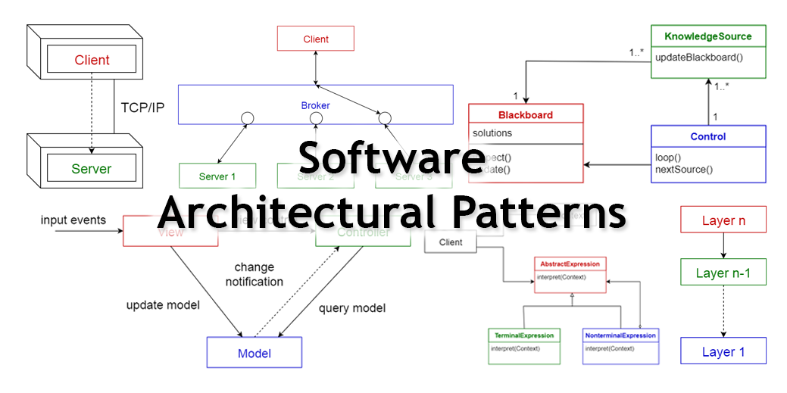

架构模式是一个通用的、可重用的解决方案，用于在给定上下文中的软件体系结构中经常出现的问题。架构模式与软件设计模式类似，但具有更广泛的范围。


### 分层模式

这种模式也称为多层体系架构模式。它可以用来构造可以分解为子任务组的程序，每个子任务都处于一个特定的抽象级别。每个层都为下一个提供更高层次服务。

一般信息系统中最常见的是如下所列的4层。

- 表示层(也称为UI层)
- 应用层(也称为服务层)
- 业务逻辑层(也称为领域层)
- 数据访问层(也称为持久化层)

使用场景：

- 一般的桌面应用程序
- 电子商务Web应用程序

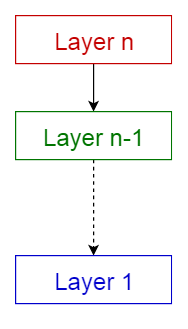


### 客户端-服务器模式

这种模式由两部分组成：一个服务器和多个客户端。服务器组件将为多个客户端组件提供服务。客户端从服务器请求服务，服务器为这些客户端提供相关服务。此外，服务器持续侦听客户机请求。

使用场景：

- 电子邮件，文件共享和银行等在线应用程序

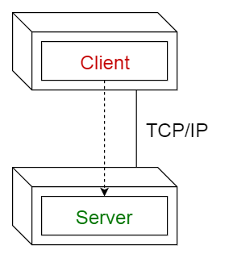


### 主从设备模式

这种模式由两方组成;主设备和从设备。主设备组件在相同的从设备组件中分配工作，并计算最终结果，这些结果是由从设备返回的结果。

使用场景：

- 在数据库复制中，主数据库被认为是权威的来源，并且要与之同步
- 在计算机系统中与总线连接的外围设备(主和从驱动器)

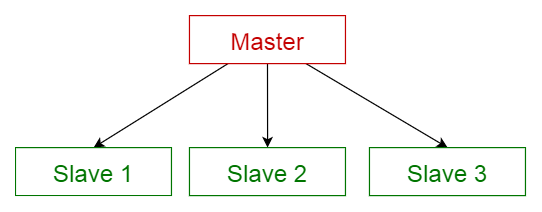


### 管道-过滤器模式

此模式可用于构造生成和处理数据流的系统。每个处理步骤都封装在一个过滤器组件内。要处理的数据是通过管道传递的。这些管道可以用于缓冲或用于同步。

使用场景：

- 编译器。连续的过滤器执行词法分析、解析、语义分析和代码生成
- 生物信息学的工作流

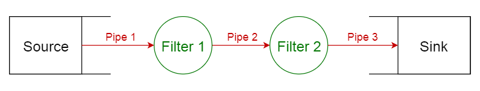


### 代理模式

此模式用于构造具有解耦组件的分布式系统。这些组件可以通过远程服务调用彼此交互。代理组件负责组件之间的通信协调。

服务器将其功能(服务和特征)发布给代理。客户端从代理请求服务，然后代理将客户端重定向到其注册中心的适当服务。

使用场景：

- 消息代理软件，如Apache ActiveMQ，Apache Kafka，RabbitMQ和JBoss Messaging

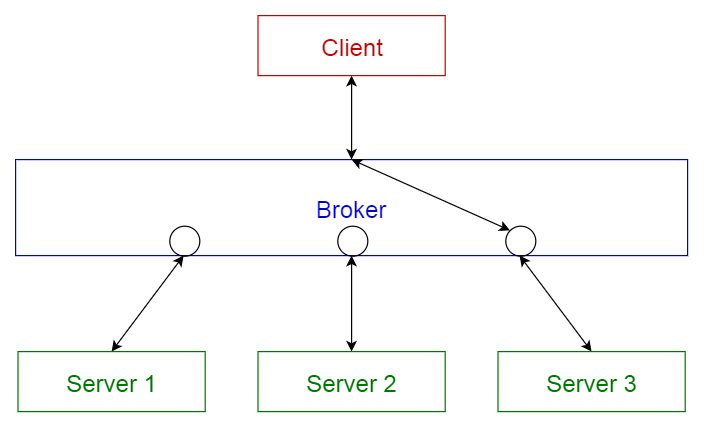


### 点对点模式

在这种模式中，单个组件被称为对等点。对等点可以作为客户端，从其他对等点请求服务，作为服务器，为其他对等点提供服务。对等点可以充当客户端或服务器或两者的角色，并且可以随时间动态地更改其角色。

使用场景：

- 像Gnutella和G2这样的文件共享网络
- 多媒体协议，如P2PTV和PDTP
- 像Spotify这样的专有多媒体应用程序

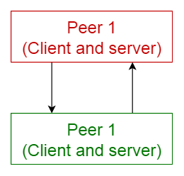


### 事件总线模式

这种模式主要是处理事件，包括4个主要组件：事件源、事件监听器、通道和事件总线。消息源将消息发布到事件总线上的特定通道上。侦听器订阅特定的通道。侦听器会被通知消息，这些消息被发布到它们之前订阅的一个通道上。

使用场景：

- 安卓开发
- 通知服务

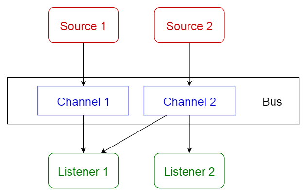


### 模型-视图-控制器模式

这种模式，也称为MVC模式，把一个交互式应用程序划分为3个部分，

- 模型：包含核心功能和数据
- 视图：将信息显示给用户(可以定义多个视图)
- 控制器：处理用户输入的信息

这样做是为了将信息的内部表示与信息的呈现方式分离开来，并接受用户的请求。它分离了组件，并允许有效的代码重用。

使用场景：

- 在主要编程语言中互联网应用程序的体系架构
- 像Django和Rails这样的Web框架

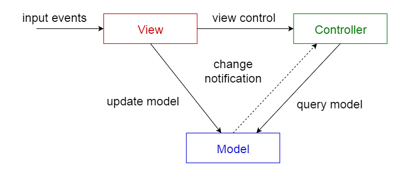


### 黑板模式

这种模式对于没有确定解决方案策略的问题是有用的。黑板模式由3个主要组成部分组成。

- 黑板——包含来自解决方案空间的对象的结构化全局内存
- 知识源——专门的模块和它们自己的表示
- 控制组件——选择、配置和执行模块

所有的组件都可以访问黑板。组件可以生成添加到黑板上的新数据对象。组件在黑板上查找特定类型的数据，并通过与现有知识源的模式匹配来查找这些数据。

使用场景：

- 语音识别
- 车辆识别和跟踪
- 蛋白质结构识别
- 声纳信号的解释

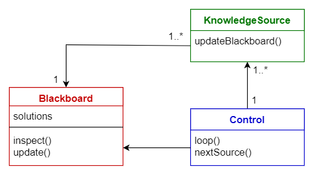


### 解释器模式

这个模式用于设计一个解释用专用语言编写的程序的组件。它主要指定如何评估程序的行数，即以特定的语言编写的句子或表达式。其基本思想是为每种语言的符号都有一个分类。

使用场景：

- 数据库查询语言，比如SQL
- 用于描述通信协议的语言


## 单体应用架构(Monoliths)

互联网早期，一般的网站应用流量较小，只需一个应用，将所有功能代码都部署在一起就可以，这样可以减少开发、部署和维护的成本。比如说一个电商系统，里面会包含很多用户管理，商品管理，订单管理，物流管理等等很多模块，我们会把它们做成一个web项目，然后部署到一台tomcat服务器上。

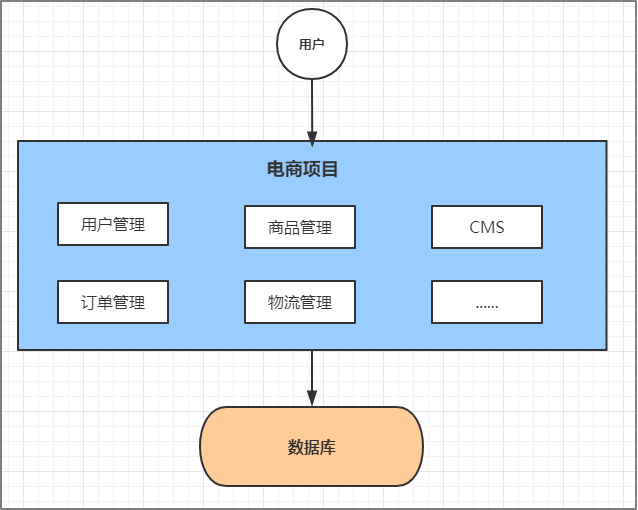

**优点**

- 项目架构简单，小型项目的话， 开发成本低
- 项目部署在一个节点上， 维护方便

**缺点**

- 全部功能集成在一个工程中，对于大型项目来讲不易开发和维护
- 项目模块之间紧密耦合，单点容错率低
- 无法针对不同模块进行针对性优化和水平扩展


## 垂直应用架构(Vertical)

随着访问量的逐渐增大，单一应用只能依靠增加节点来应对，但是这时候会发现并不是所有的模块都会有比较大的访问量。还是以上面的电商为例子， 用户访问量的增加可能影响的只是用户和订单模块， 但是对消息模块的影响就比较小. 那么此时我们希望只多增加几个订单模块， 而不增加消息模块. 此时单体应用就做不到了， 垂直应用就应运而生了。所谓的垂直应用架构，就是将原来的一个应用拆成互不相干的几个应用，以提升效率。比如我们可以将上面电商的单体应用拆分成:

- 电商系统(用户管理 商品管理 订单管理)
- 后台系统(用户管理 订单管理 客户管理)
- CMS系统(广告管理 营销管理)

这样拆分完毕之后，一旦用户访问量变大，只需要增加电商系统的节点就可以了，而无需增加后台和CMS的节点。

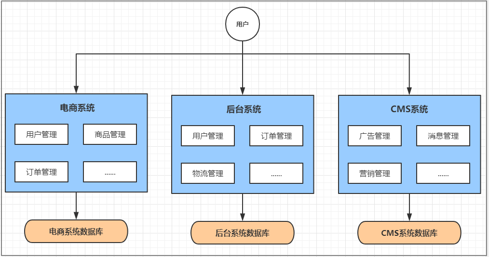

**优点**

- 系统拆分实现了流量分担，解决了并发问题，而且可以针对不同模块进行优化和水扩展
- 一个系统的问题不会影响到其他系统，提高容错率

**缺点**

- 系统之间相互独立， 无法进行相互调用
- 系统之间相互独立， 会有重复的开发任务


## 分布式架构(Distributed)

即分布式架构当垂直应用越来越多，重复的业务代码就会越来越多。这时候，我们就思考可不可以将重复的代码抽取出来，做成统一的业务层作为独立的服务，然后由前端控制层调用不同的业务层服务呢？

这就产生了新的分布式系统架构。它将把工程拆分成表现层和服务层两个部分，服务层中包含业务逻辑。表现层只需要处理和页面的交互，业务逻辑都是调用服务层的服务来实现。

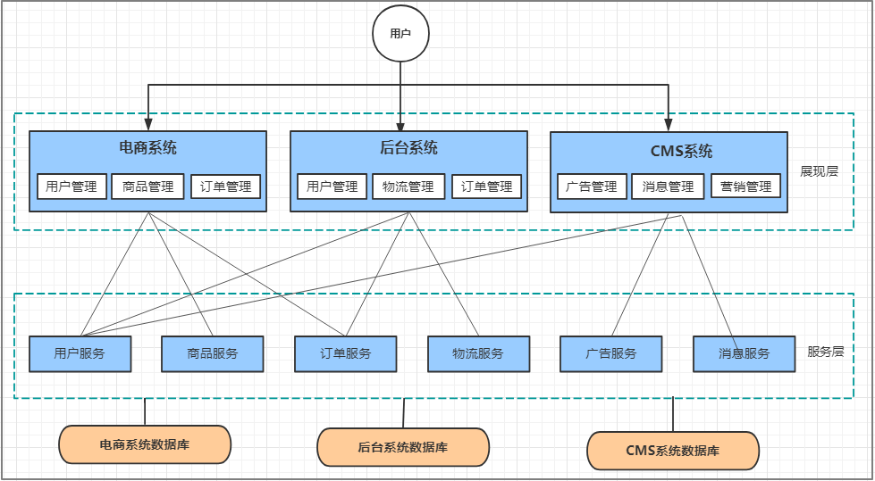

**优点**

- 抽取公共的功能为服务层，提高代码复用性

**缺点**

- 系统间耦合度变高，调用关系错综复杂，难以维护


## 面向服务化架构(SOA)

在分布式架构下，当服务越来越多，容量的评估，小服务资源的浪费等问题逐渐显现，此时需增加一个调度中心对集群进行实时管理。此时，用于资源调度和治理中心(SOA Service Oriented Architecture，面向服务的架构)是关键。

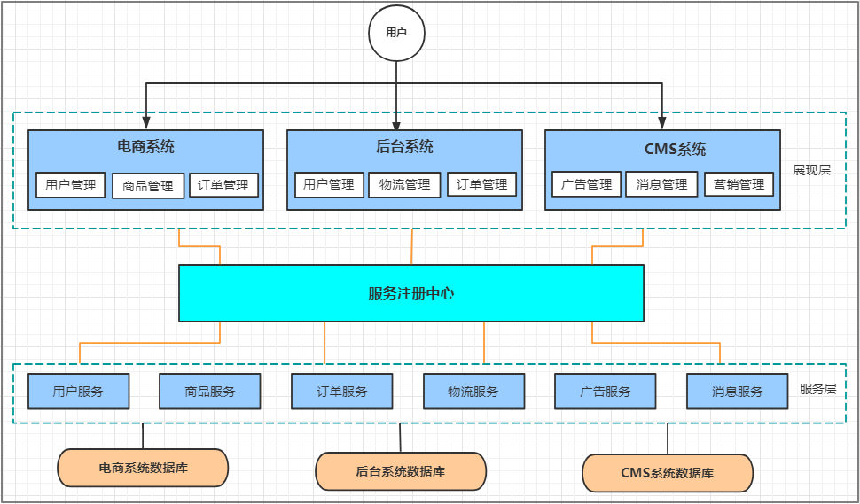

**优点**

- 使用注册中心解决了服务间调用关系的自动调节

**缺点**

- 服务间会有依赖关系，一旦某个环节出错会影响较大( 服务雪崩 )
- 服务关心复杂，运维、测试部署困难


## 微服务架构(Micro Service)

https://juejin.cn/user/4177799914474653/posts

https://www.cnblogs.com/jiujuan/p/13280473.html

微服务架构在某种程度上是面向服务的架构SOA继续发展的下一步，它更加强调服务的"彻底拆分"。

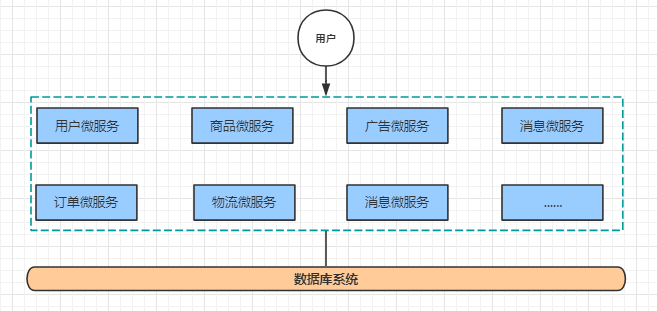

**优点**

- 更好的开发规模
- 更快的开发速度
- 支持迭代开发或现代化增量开发
- 充分利用现代软件开发生态系统的优势（云、容器、 DevOps、Serverless）
- 支持水平缩放和细粒度缩放
- 小体量，较低了开发人员的认知复杂性

**缺点**

- 更高数量级的活动组件（服务、数据库、进程、容器、框架）
- 复杂性从代码转移到基础设施
- RPC 调用和网络通信的大量增加
- 整个系统的安全性管理更具有挑战性
- 整个系统的设计变得更加困难
- 引入了分布式系统的复杂性


### 微服务定义

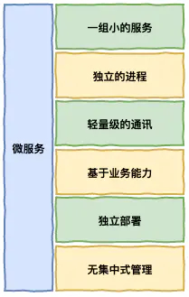

- **一组小的服务**

  原来的单块服务都是业务能力大而全的打包在一个单块中，微服务主张把这些单块服务进行拆分，形成一个个小的独立的服务。这里有个最大的特点是“小”，那么纠结要小到什么程度才为之小，很多同学都会纠结这个小的点，因为这个小并没有特别和明确的规定，所以这也就引申出了现在很多DDD领域驱动设计来指引微服务的拆分，但基本上一个微服务能让一个开发人员能够独立的理解，基本上就称为一个微服务，具体有多少行代码并不是很关键。

- **独立的进程**

  微服务是运行在独立的进程当中，例如java程序部署在tomcat，也可以部署在容器docker中，容易本身也是一种进程，所以微服务可以以进程的方式去扩展。

- **轻量级的通讯**

  微服务主张使用轻量级去构建通讯机制，例如http，固定消息格式和减少消息格式，服务之间不耦合，让通讯尽量轻量。

- **基于业务能力**

  微服务是基于业务能力进行构建，例如有用户服务，登陆服务，商品服务，基于这些业务能力去构建这些微服务。

- **独立部署**

  微服务被拆分开后，每个团队独立维护自己的微服务，开发，迭代自己的微服务，是可以独立的去部署，团队之间是不需要特别的去协调，这些对业务开发维护可以做到更加的敏捷，轻量，快速。

- **无集中式管理**

  原来单体服务是需要整个技术团队是需要独立的架构团队去管理，统一架构，统一技术栈，统一存储，微服务就不太一样，微服务主张每个团队根据自己的技术需要，选择自己最熟悉，最高效解决问题的技术栈，甚至选择不同存储方式。


### 康威定律

> 康威法则设计系统的组织，其产生的设计和架构，等价组织的组织架构


**单块应用时代**

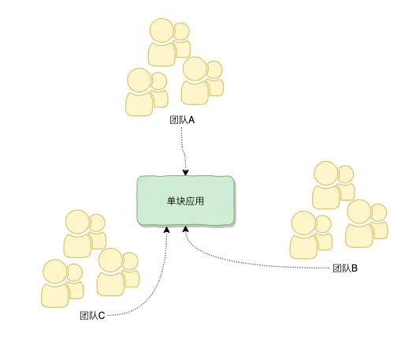

几个团队共同去对一个单块应用去开发和维护时，如果一个团队对这个单块应用进行改造引入一些新的功能或技术的时候，往往需要其他的团队协作和配合，连同做集成测试才能交付这个应用，这个时候，不仅仅是沟通协调成本高，团队和团队之间往往容易产生摩擦。**也就是说，多团队之间和单应用产生不匹配，违反康威法则**。怎么解决，微服务是一个解决的手段：


我们把单块的应用拆分成诺干个独立的应用，每个团队负责自己的服务，相互之间不干扰，当团队A服务的服务进行修改不需要其他的团队来配合，或者说这种配合沟通成本比较少，一般只发生在双方边界交集的地方，那么这个时候发现多团队和微服务之间架构的关系可以映射起来，它符合了康威法则，整体研发效率更高效。


### 微服务利弊

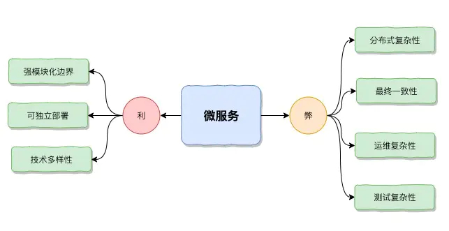

- **利**

  - **强模块化边界**

    我们知道做软件架构，软件设计，模块化是非常重要的一点，一开始我们写程序做软件，我们采用类的方式来做模块化，后面开始采用组件或类库的方式做模块化，可以做到工程上的重用和分享给其他团队来使用。微服务在组件的层次上面又高了一层，以服务的方式来做模块化，每个团队独立开始和维护自己的服务，有明显的一个边界，开发完一个服务其他团队可以直接调用这个服务，不需要像组件通过jar或源码的方式去进行分享，所以微服务的边界是比较清晰的。

  - **可独立部署**

    可独立部署是微服务最显著的一个特性，每个团队可以根据自己的业务需求，当产品经理或业务方把需求提过来，可以根据需要独立开发和部署服务，一般来说不需要太过依赖其他团队去协同，这个对比单块应用，单块引用在这个方面需求很多团队来协助和帮忙。

  - **技术多样性**

    微服务是分散式治理，没有集中治理，每个团队可以根据团队自己的实际情况和业务的实际情况去选择适合自己的技术栈，有些团队可能擅长Java开发，有些团队可能更偏向前端，更适合用nodejs去开发服务，不过这个不是越多越好，技术栈的引入也是有成本

- **弊**

  - **分布式复杂性**

    在原来单块应用就是一个应用，一个对单块应用的架构比较熟悉的人可以对整个单块应用有一个很好的把控。但是到了分布式系统，微服务化了以后可能涉及到的服务有好几十个，一些大公司可能涉及到的服务上百个，服务与服务之间是通过相互沟通来实现业务，那么这个时候整个系统就变成非常复杂，一般的开发人员或一个团队都无法理解整个系统是如何工作的，这个就是分布式带来的复杂性。

  - **最终一致性**

    微服务的数据是分散式治理的，每个团队都有自己的数据源和数据拷贝，比方说团队A有订单数据，B团队也有订单数据，团队A修改了订单数据是否应该同步给团队B的数据呢，这里就涉及到数据一致性问题，如果没有很好的解决一致性问题，就可能造成数据的不一致，这个在业务上是不可以接受的。

  - **运维复杂性**

    以往的运维需要管理的是机器+单块的应用，分布式系统和单块应用不一样的是，分布式系统需要很多的服务，服务与服务之间相互协同，那么对分布式系统的资源，容量规划，对监控，对整个系统的可靠性稳定性都非常具备挑战的。

  - **测试复杂性**

    对测试人员来说，在单块应用上，一个测试团队只需要测试一个单块应用就可以了，到了分布式系统，各个服务是分布在各个团队的，这个对测试团队来说要求就很好，做集成测试的时候需要很多的团队相互配合去联合做集成测试。


### 微服务分层

**BFF是什么？**

BFF即 Backend For Frontend（服务于前端的后端），也就是服务器设计 API 时会考虑前端的使用，并在服务端直接进行业务逻辑的处理，又称为用户体验适配器。BFF 只是一种逻辑分层，而非一种技术，虽然 BFF 是一个新名词，但它的理念由来已久。


一般将微服务整个体系大的方向划分为2层，见下图：

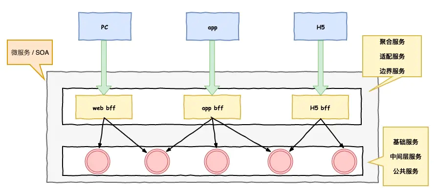

在最上层不属于微服务有很多的连接方式，有PC，有H5，有APP等等，在下层，包含了2个层，它们一起组成我们的微服务或SOA，微服务加单的划分为2层，最底下的基础服务层。

- **微服务基础服务层**

  基础服务一般属于互联网平台基础性的支撑服务，比方说，电商网站的基础服务有订单服务，商品服务，用户服务等，这些都属于比较基础和原子性，下沉一个公司的基础设施的低层，向下承接存储，向上提供业务能力，有些公司叫（基础服务，中间层服务，公共服务），netflix成为中间层服务。我们暂且统称为基础服务。

- **微服务聚合服务层**

  已经有了基础服务能提供业务能力，为什么还需要聚合服务，因为我们有不同的接入端，如app和H5，pc等等，它们看似调用大致相同的数据，但其实存在很多差异，例如PC需要展示更多信息，APP需要做信息裁剪等等。一般低层服务都是比较通用的，基础服务应该对外输出相对统一的服务，在抽象上做得比较好。但是对不同的外界app和pc的接入，我们需要作出不同的适配，这个时候需要有一个层去做出聚合裁剪的工作。例如一个商品详情在pc端展示和app端的展示，pc可能会展示更多的信息，而app则需要对信息作出一些裁剪，如果基础服务直接开放接口给到pc和app，那么基础服务也需要去做成各种设配，这个很不利于基础服务的抽象，所以我们在基础层之上加入聚合服务层，这个层可以针对pc和app做成适当的设配进行相应的裁剪。

  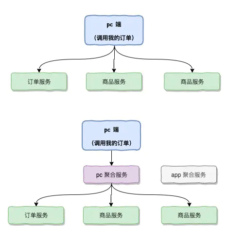

  除了裁剪，还有一个更重要的原因，假定PC端想获取“我的订单”的一个列表，那么Pc端必须知道和调用基础服务的几个模块（用户服务，订单服务，商品服务），pc端发起几次请求之后，在这个几个请求的数据进行汇总，这样不仅性能低下网络开销也比较大，还有pc端要承接数据聚合的这么一个工作，会让pc端变成更为复杂。如果在中间加多一个层为聚合服务层，即对网络开销进行减少，因为微服务内部是通过内网进行数据传输，也让pc端的业务变得比较简单。

  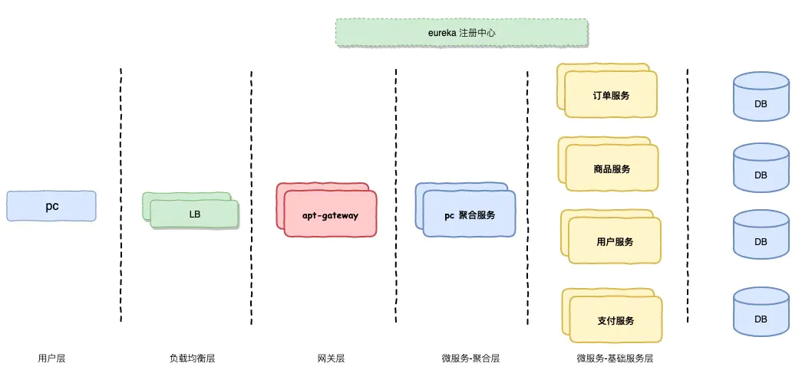

  这个层在各个公司有不同叫法，有叫 聚合服务，边界服务，设配服务 netflix叫边界服务，因为它处在公司微服务和外部的边界之上。这个的划分只是一个逻辑划分，在物理上或者在微服务上这两个层级其实在部署和调用没有差别。


**代码分层设计**


### 技术架构体系


- **接入层**

  接入层负责把外部的流量接入到内部平台系统中来，涉及到更多是基础设施，由运维团队进行负责。

- **基础设施层**

  基础设施层主要是由运维团队来进行维护，设计由计算，也计算资源的分配，网络，存储，监控，安全等等

- **网关层**

  流量接进来之后，会先经过一个网关层，网关在微服务起到举足轻重的作用，主要起到反向路由，限流熔断，安全，鉴权等等的跨横切面的功能，这个层在微服务中起到核心的层次。

- **业务服务层**

  整个业务服务按照逻辑划分为两次，分别是聚合层和基础服务层，聚合层对基础层进行聚合和裁剪，对外部提供业务能力。当然这个视每个公司不同情况而定，此层再划分两层是属于逻辑划分。

- **支撑服务层**

  微服务并不是单单把业务服务启动起来就完毕，微服务在治理的过程中还需要更多的支持，所以由了支撑服务层。支持服务包含了注册发现，集中配置，容错限流，日志聚合，监控告警，后台服务，后台服务涉及到例如MQ，Job，数据访问，这些都是后台服务的内容。

- **平台服务层**

  在微服务逐步完善的过程中，各个团队的都引入一个新的平台服务，例如由容器，镜像的管理，容器的服务编排等等，很多公司先后的引入容器化和容器编排来解决运维管理和发布微服务的难题，docker + keburnetes，确实是被微服务越来越接受。另外，通过CICD支撑起来的devops也是构建在平台服务层的这个能力。由于这个平台服务层的逐步完善也在慢慢解放运维人员一开始对微服务各种治理的不适。


### 服务发现机制

**第一种 传统Lb模式**


这个模式有一个独立的Lb，例如可以硬件F5做负载均衡器，也可以用软件，例如nginx来做负载均衡器，一般来说生产者上线后，会想运维申请一个域名，将域名配置到负载均衡器上，生产者的服务会部署多份，Lb具有负载均衡的功能。消费方想要去进行消费，会通过dns做域名解析，dns会解析到Lb上面，Lb会负载均衡到后台的生产者服务。这种做法是最传统的做法，也是最简单，消费者接入成本低，但是生产者发布服务需要运维的介入。还有一点问题就是Lb成为整个服务中转中心，如何确保这个Lb为高可用，另外还有一点，就是消费者调用生产者必须穿透Lb，这当中可能会有一些性能开销。


**第二种 进程内Lb模式**

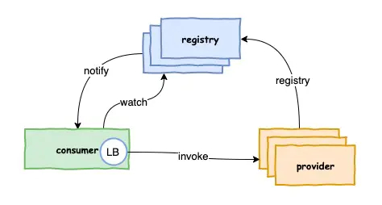

这种做法把传统的Lb转移到进程内，生产者会把自己的信息注册到一个注册中心，并且定期发送心跳建立生产者和注册中心的连接。消费者去监听注册中心，从注册中心获取生产者的列表，Lb存在消费者的进程内，消费者直接使用内部Lb去调用生产者，消费者的Lb会定期去同步注册中心的服务信息。这种做法的好处是没有中间的一跳，不存在集中式Lb的性能短板，也不存在Lb可能存在的单点问题。但是在多语言中，必须每个语言都维护自己的一个Lb，我们熟知的Dubbo就是采用这种进程内Lb模式。


**第三种 主机独立Lb模式**

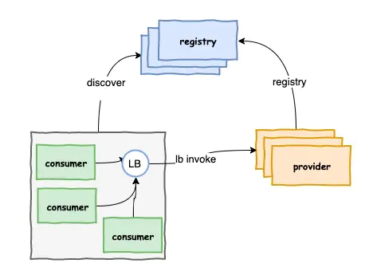

主机独立Lb模式是在前面传统Lb和进程内Lb的模式上做了折中，它把一个Lb以一个独立进程的方式部署在一台独立主机上，既不是集中式Lb也不是进程内Lb，这种方式跟第二种有一些类似，生产者一样注册到注册中心，主机上的Lb也会定时同步注册中心的注册信息，把注册信息放在本地进程中进行负载均衡，这种方式Lb既不存在消费者的进程内，可以让消费者更专注于业务，还可以免去集中式Lb每次调用都必须进行中转一跳的网络开销，并且也可以支持多语言跟消费者语言脱离关系。不过这种模式可能在运维的成本会比较高，运维需要关注每一台机器的LB。


### API网关

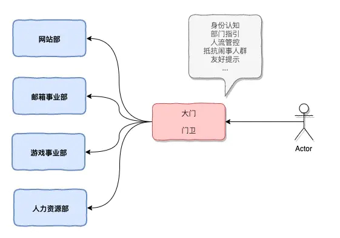

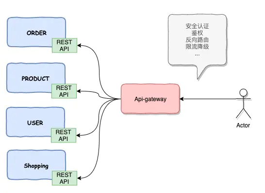

让客户看公司的服务会认为是一个整体的服务。这个就是我们的网关所起到的作用，能够屏蔽我们内部的细节，统一输出对外的接口。

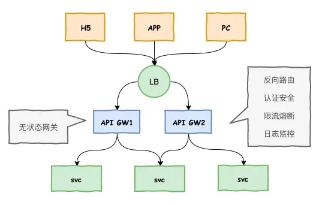

从这张图上看到有四个层次，最上层是我们用户层，第二层是我们的负载均衡器，第三层就是我们的网关，最后是我们内部的微服务，在接入网关的时候为什么需要在上面需要一个负载均衡器，因为我们想让网关无状态，无状态的网关有一个好处，可以部署很多，不会有单点，即使挂了一台，其他的网关还在，这个对整个系统的稳定性起来非常重要的作用。一般的系统会有一个LB，然后对应多个网关。网关能起到的作用很多：

- 最重要的一个重要反向路由，当外面的请求进来之后，怎么找到内部具体的微服务，这个是网关起来重要职责，将外部的调用转化为内部的服务服务，这个就是反向路由
- 第二个是认证安全，网关像是一个门卫，有一些访问是正常的访问，有一些是恶意的访问，例如说爬虫，甚至是一些黑客行为，网关需要将其拦截在外部- 第三个重要职责是限流熔断，比方说，有一个门，外面有流量进来，正常来说流量是比较稳定的，但也有可能有突发流量，有可能网站在搞促销，这个时候可能就有流量的洪峰闯进来，如果说内部没有好的限流熔断措施，可能造成内部整个服务的服务器瘫痪，网关就要承担限流熔断的职责。
- 最后一个功能，网关要承担日志监控的职责，外部的访问所有的流量都要经过网关，那么可以在网关上可以对所有的流量做访问的审计，把它作为日志保存起来，另外可以通过分析日志，知道性能的调用情况，能够对整个流量情况进行监控


### 路由发现体系

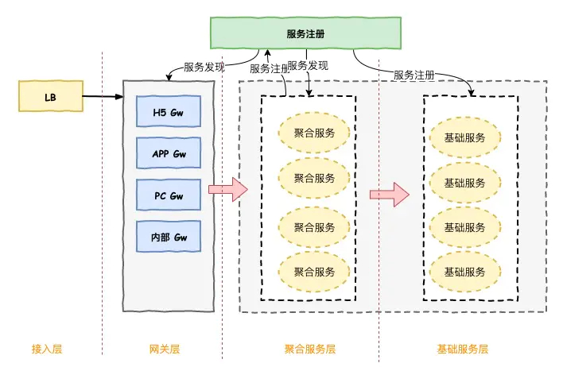

在Netflix的微服务架构中，有两个非常重要的支撑服务

- Netflix的大名鼎鼎的注册中心组件叫Eureka
- 另一个Netflix也是大名鼎鼎的网关组件叫Zuul

Netflix在内部微服务上也是两层的逻辑划分，低层是基础服务（Netflix叫中间层服务），上一层叫聚合服务层，（Netflix叫边界服务），内部服务的发现也是通过注册中心Eureka，基础服务向Eureka进行服务注册，聚合服务通过Eureka进行服务发现，并把聚合层生产者缓存在本身，就可以进行直接的服务调用。

网关层是处在外部调用和聚合服务之间的层，网关层可以看作是一个超级的客户端，它一样可以作为微服务的一个组件，也会同步Eureka注册中心的路由表，外部服务请求进来后，网关根据路由表找到对应的聚合服务进行调用。

另外注册中心和网关还可以对整个调用进行治理，比方说对服务的调用进行安全管控，哪些服务是是有严格的安全要求，不允许随便进行调用，哪些服务可以通过网关放出去，这些能力可以通过网关和注册中心进行实现。这些就是服务治理相关的能力。


### 配置中心

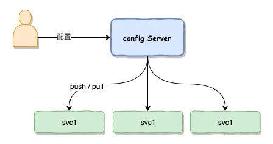

配置中心可以简单的理解为一个服务模块，开发人员或运维人员可以通过界面对配种中心进行配置，下面相关的微服务连接到配置中心上面就可以实时连接获取到配置中心上面修改的参数。更新的方式一般有两种

- pull模式，服务定时去拉取配置中心的数据
- push模式，服务一直连接到配置中心上，一旦配置有变成，配种中心将把变更的参数推送到对应的微服务上

这两种做法其实各有利弊

- pull可以保证一定可以拉取得到数据，pull一般采用定时拉取的方式，即使某一次出现网络没有拉取得到数据，那在下一次定时器也将可以拉取得到数据，最终保证能更新得到配置
- push也有好处，避免pull定时器获取存在时延，基本可以做到准实时的更新，但push也存在问题，如果有网络抖动，某一次push没有推送成功，将丢失这次配置的更新

目前比较流行的配种中心开源组件有springcloud-Config，百度的disconf，阿里的diamond，还有携程的apollo，杨波老师之前是在携程工作过，所以主推的是apollo这套系统。

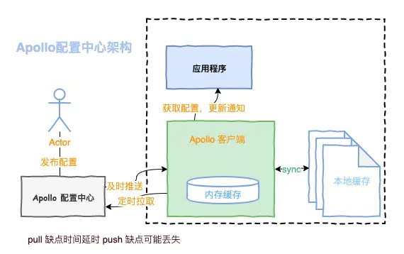

也是一个服务器，也带有对应的客户端，它的特色在于客户端，客户端有一个缓存机制，每次拉取成功后，会把数据保存在缓存机制中，甚至爬客户端的缓存丢失，客户端还可以将缓存sync在本地文件缓存，这样的设计非常的巧妙，就算apollo的配置中心挂掉了，或者客户端的服务重启了，但是因为本地缓存还存在，还可以使用本地缓存继续对外提供服务，从这点来看apollo的配置中心在高可用上考虑还是比较周到的。

另外一点，配置中心有两种获取配置数据的方式，一种pull，一种push，两者各有有点，apollo把两者的优点进行了结合，开发或运维人员在配置中心进行修改，配置中心服务将实时将修改推送push到apollo的客户端，但考虑到可能由于某些网络抖动没有推送成功，客户端还具备了定时向apollo服务端拉取pull数据的功能，就算推送没成功，但是只要一定时间周期，客户端还是会主动去拉取同步数据，保证能把最终配置同步到服务中。这个也是apollo在高可用方面上非常有特色的设计。


### 微服务治理

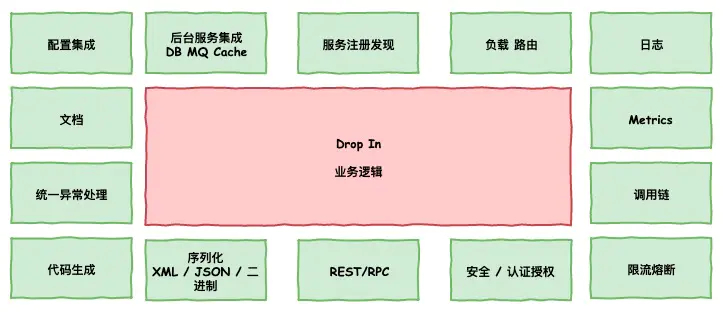

- **服务注册发现**

  微服务当中有很多服务，几十个上百个，它们当中有错中复杂的依赖关系，这个时候就存在服务的消费者怎么发现生产者，这个就是服务注册发现需要解决的问题。

- **服务的负载均衡**

  为了应对大的流量，我们的服务提供方一般都是大规模部署，这个时候就存在服务的负载均衡的问题，另外我们的服务需要路由，这个能力非常重要，如果我们需要灰度发布或者蓝绿发布的机制，那么需要考虑软路由的机制。

- **监控-日志**

  日志对于我们后期排错找出问题，定位问题是非常关键，我们一套好的监控治理框架需要集成日志服务

- **监控-metrics**

  当我们需要对服务的调用量进行监控，对服务延迟出错数有一个好的监控手段，这就是me监控环境

- **监控-调用链埋点**

  微服务有错综复杂的调用关系，就像一个网状一般，如果没有好的调用链监控，开发人员很容易迷失在当中，出问题很难定位，有了好的调用链监控会帮助我们快速定位问题，更好的理解整套微服务系统。

- **限流熔断**

  微服务是一个分布式系统，如果没有好的限流熔断措施，当一个服务出现故障或者出现延迟，会造成整个系统瘫痪。

- **安全-访问控制**

  有些服务并不希望所有的人都能去调用到，涉及到一些敏感信息，比例跟钱相关的信息，那么我们需要安全和访问的控制策略，来限制对这些服务的访问。

- **rpc & rest**

  rpc和rest根据之前的对比，两者各有优劣，如果一个微服务框架中能支持这两个调用，能兼容更多的技术栈，会更加的灵活

- **序列化**

  序列化中，有高性能但对开发人员不优化的二进制序列化，也有对开发人员相当友好的但性能未必最佳的文本式序列化，这个需要根据场景进行灵活的配置，消息系列化协议

- **代码生成**

  现在在大规模开发的情况下，比较推从一个契约驱动开发的方法，开发人员先定立契约，代码自动生成的方式生成对应的代码脚手架，这个在大规模开发的时候更能确保代码的一致和规整

- **统一异常处理**

  我们希望服务治理的环节能集成统一的服务异常处理的能力，这样的化异常能够达到更加标准化，出现问题能更好定位好属于什么类型的问题。如果说没有这样的一个环节，大家各自的玩法不一样，抛的异常各异，出现问题难以定位和无法标准化友好输出。

- **文档**

  微服务最终是要给消费者去使用，暴露出去的API如果没有好的文档，只提供出一些代码，接入方接入的成本会变成比较高，好的文档体系是各方协调和效率的保证。

- **集中配置中心**

  微服务框架需要集成集中式的配置能力，避免各个服务间各自配置，增快参数调整的速度和规范统一格式。

- **后台集成MQ，Cache，DB**

  微服务治理的核心思路就是把上面讲到的各个环节沉淀下来，变成平台和框架的一部分，开发人员可以更加专注业务逻辑的实现，在实现业务逻辑的时候不需要去关注外部环节的，从而提升开发的效率，治理环节沉淀在框架之中有专门的平台架构团队去进行管控。


### 微服务分层监控

**分层监控**

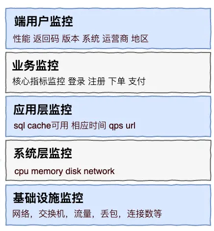

- **基础设施监控**

  一般是由运维人员进行负责，涉及到的方面比较接近硬件体系，例如网络，交换机，路由器等低层设备，这些设备的可靠性稳定性就直接影响到上层服务应用的稳定性，所以需要对网络的流量，丢包情况，错包情况，连接数等等这些基础设施的核心指标进行监控。

- **系统层监控**

  涵盖了物理机，虚拟机，操作系统这些都是属于系统级别监控的方面，对几个核心指标监控，如cpu使用率，内存占用率，磁盘IO和网络带宽情况。

- **应用层监控**

  涉及到方面就跟服务紧密相关，例如对url访问的性能，访问的调用数，访问的延迟，还有对服务提供性能进行监控，服务的错误率，对sql也需要进行监控，查看是否有慢sql，对与cache来说，需要监控缓存的命中率和性能，每个服务的响应时间和qps等等。

- **业务监控**

  比方说一个典型的交易网站，需要关注它的用户登录情况，注册情况，下单情况，支付情况，这些直接影响到实际触发的业务交易情况，这个监控可以提供给运营和公司高管他们需需要关注的数据，直接可能对公司战略产生影响。

- **端用户体验监控**

  一个应用程序可能通过app，h5，pc端的方式交付到用户的手上，用户通过浏览器，客户端打开练到到我们的服务，那么在用户端用户的体验是怎么样，用户端的性能是怎么样，有没有产生错误，这些信息也是需要进行监控并记录下来，如果没有监控，有可能用户的因为某些原因出错或者性能问题造成体验非常的差，而我们并没有感知，这里面包括了，监控用户端的使用性能，返回码，在哪些城市地区他们的使用情况是怎么样，还有运营商的情况，包括电信，联通用户的连接情况。我们需要进一步去知道是否有哪些渠道哪些用户接入的时候存在着问题，包括我们还需要知道客户端使用的操作系统浏览器的版本。


**监控点**

可以通过以下几点进行监控：

- 日志监控
- Metrics监控
- 调用链监控
- 报警系统
- 健康检查

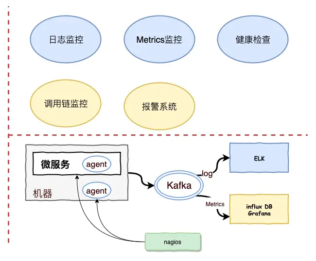


**典型主流的监控架构**

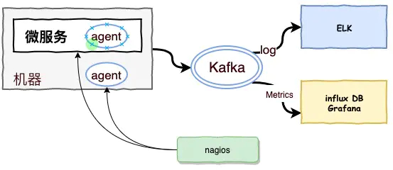

在微服务运行的体系下，我们一般把监控的agent分散到各个服务身边，agent分别是收集机器和服务的metrics，发送到后台监控系统，一般来说，我们的服务量非常大，在收集的过程中，会加入队列，一般来说用kafka，用消息队列有个好处就是两边可以进行解耦，还好就是可以起到庞大的日志进行一个缓存的地带，并在mq可以做到高可用，保证消息不会丢失。

日志收集目前比较流行的是ELK的一套解决方案，（Elasticsearch，Logstash，Kibana），Elasticsearch 分布式搜索引擎，Logstash 是一个日志收集的agent，Kibana 是一个查询的日志界面。

metrice会采用一个时间序列的数据库，influxDB是最近比较主流时间数据库。

微服务的agent例如springboot也提供了健康检查的端点，可以检查cpu使用情况，内存使用情况，jvm使用情况，这些需要一个健康检查机制，能够定期对服务的健康和机器的健康进行check，比较常见的是nagios,zabbix等，这些开源平台能够定期去检查到各个微服务的检查程序并能够进行告警给相关人员，在服务未奔溃之前就可以进行提前的预先接入。


### 调用链

微服务是一个分布式非常复杂系统，如果没有一套调用链监控，如果服务之间依赖出现问题就很难进行调位。

目前个大主流互联网公司中，ali有非常出现的鹰眼系统，点评也有一套很出名的调用链监控系统CAT。调用链监控其实最早是google提出来的，2010年google发表了一篇调用链的论文，论文以它内部的调用链系统dapper命名，这个论文中讲解调用链在google使用的经验和原理，大致的原理如下图：

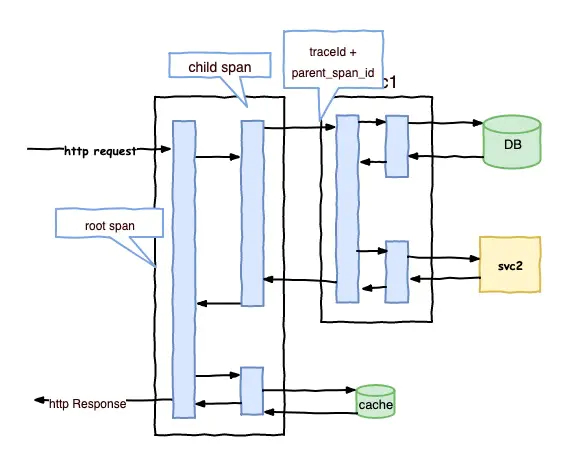

在外界对微服务进行一个请求开始进入我们的微服务体系时，会生成一个Root Span，当web服务去调用后面的服务svc1时又会生成一个span，调用DB也会生成一个span，每一个应用调度都会生成一个新的span，这个是span是整个调用链形成的关键，span中有一些关键的信息，有traceId，spanId。RootSpan是比较特殊的，在启动的时候会生成spanId还会生成TraceId，其他的span会生成自己的spanId，为了维护好调用链上下文的调用关系，span会去记录调用它的链路，以parent spanId记录下来，这样的话父子之间的关系就可以记录下来，每个调用都会把第一个链路traceId也记录下来，这样，当我们把这些span都存在起来，就可以通过分析手段，把整个调用链的关系还原出来。

这里可以采用ELK的方式去记录和展示调用链监控日志，当我们一条调用为一行记录存储下来：

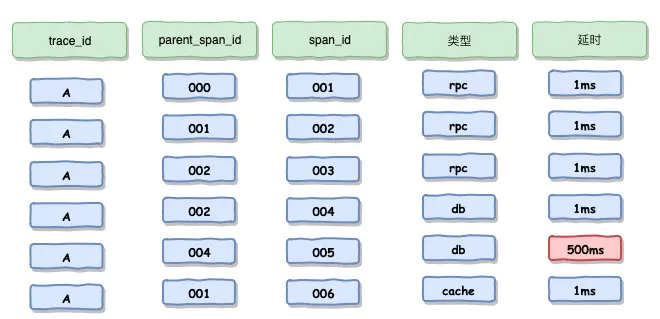

通过traceId 和 parentSpanId 就可以串联起来为一个整体的链路，并可以从这个链路去分析错误或者调用延时和调用次数等等。


目前市面主流的调用链选型有 zipkin，pinpoint，cat，skywalking，他们之间各有一些偏重点，值得一说的是skywalking国人出品的一款新的调用链工具，采用开源的基于字节码注入的调用链分析，接入段无代码入侵，而且开源支持多种插件，UI在几款工具来说比较功能比较强大，而且ui也比较赏心悦目，目前已经加入了apache孵化器。

**skywalking优势**

- 首先在实现方式上，skywalking基本对于代码做到了无入侵，采用java探针和字节码增强的方式，而在cat还采用了代码埋点，而zipkin采用了拦截请求，pinpoint也是使用java探针和字节码增强
- 其次在分析的颗粒度上，skywaling是方法级，而zipkin是接口级，其他两款也是方法级
- 在数据存储上，skywalking可以采用日志体系中比较出名的ES，其他几款，zipkin也可以使用ES，pinpoint使用Hbase，cat使用mysql或HDFS，相对复杂，如果公司对ES熟悉的人才比较有保证，选择熟悉存储方案也是考虑技术选型的重点
- 还有就是性能影响，根据网上的一些性能报告，虽然未必百分百准备，但也具备参考价值，skywalking的探针对吞吐量的影响在4者中间是最效的，经过对skywalking的一些压测也大致证明

下面是网上摘录的几款调用链选型对比：

**基本原理**

| 类别     | Zipkin                                     | Pinpoint             | SkyWalking	CAT    |
| -------- | ------------------------------------------ | -------------------- | -------------------- |
| 实现方式 | 拦截请求，发送（HTTP，mq）数据至zipkin服务 | java探针，字节码增强 | java探针，字节码增强 |

**接入**

| 类别                   | Zipkin                                  | Pinpoint          | SkyWalking      | CAT      |
| ---------------------- | --------------------------------------- | ----------------- | --------------- | -------- |
| 接入方式」             | 基于linkerd或者sleuth方式，引入配置即可 | javaagent字节码」 | javaagent字节码 | 代码侵入 |
| agent到collector的协议 | http,MQ                                 | thrift            | gRPC            | http/tcp |
| OpenTracing            | √                                       | ×                 | √               | ×        |

**分析**

| 类别         | Zipkin | Pinpoint | SkyWalking | CAT    |
| ------------ | ------ | -------- | ---------- | ------ |
| 颗粒度       | 接口级 | 方法级   | 方法级     | 代码级 |
| 全局调用统计 | ×      | √        | √          | √      |
| traceid查询  | √      | ×        | √          | ×      |
| 报警         | ×      | √        | √          | √      |
| JVM监控      | ×      | ×        | √          | √      |

**页面UI展示**

| 类别   | Zipkin | Pinpoint   | SkyWalking | CAT        |
| ------ | ------ | ---------- | ---------- | ---------- |
| 健壮度 | \*\*   | \*\*\*\*\* | \*\*\*\*   | \*\*\*\*\* |

**数据存储**

| 类别     | Zipkin                   | Pinpoint | SkyWalking | CAT        |
| -------- | ------------------------ | -------- | ---------- | ---------- |
| 数据存储 | ES，mysql,Cassandra,内存 | Hbase    | ES，H2     | mysql,hdfs |


### 流量治理

**熔断**

如果说房子里面安装了电路熔断器，当你使用超大功率的电路时，有熔断设配帮你保护不至于出问题的时候把问题扩大化。

**隔离**

我们知道计算资源都是有限的，cpu，内存，队列，线程池都是资源，他们都是限定的资源数，如果不进行隔离，一个服务的调用可能要消耗很多的线程资源，把其他服务的资源都给占用了，那么可能出现应为一个服务的问题连带效应造成其他服务不能进行访问。

**限流**

让大流量的访问冲进去我们的服务时，我们需要一定的限流措施，比方说我们规则一定时间内只允许一定的访问数从我们的资源过，如果再大的化系统会出现问题，那么就需要限流保护。

**降级**

如果说系统后题无法提供足够的支撑能力，那么需要一个降级能力，保护系统不会被进一步恶化，而且可以对用户提供比较友好的柔性方案，例如告知用户暂时无法访问，请在一段时候后重试等等。


**Hystrix**

Hystrix就把上面说的 熔断，隔离，限流，降级封装在这么一个组件里面 下图是Hystrix内部设计和调用流程

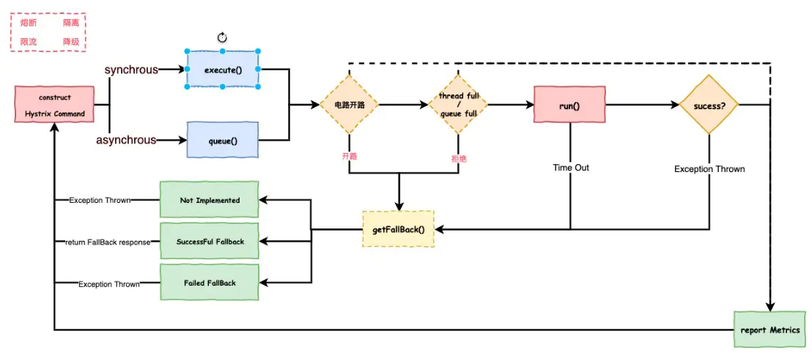

大致的工作流如下：

- 构建一个HystrixCommand对象，用于封装请求，并在构造方法配置请求被执行需要的参数
- 执行命令，Hystrix提供了几种执行命令的方法，比较常用到的是synchrous和asynchrous
- 判断电路是否被打开，如果被打开，直接进入fallback方法
- 判断线程池/队列/信号量是否已经满，如果满了，直接进入fallback方法
- 执行run方法，一般是HystrixCommand.run()，进入实际的业务调用，执行超时或者执行失败抛出未提前预计的异常时，直接进入fallback方法
- 无论中间走到哪一步都会进行上报metrics，统计出熔断器的监控指标
- fallback方法也分实现和备用的环节
- 最后是返回请求响应


### 设计模式

#### 独享数据库（Database per Microservice）

当一家公司将大型单体系统替换成一组微服务，首先要面临的最重要决策是关于数据库。单体架构会使用大型中央数据库。即使转移到微服务架构许多架构师仍倾向于保持数据库不变。虽然有一些短期收益，但它却是反模式的，特别是在大规模系统中，微服务将在数据库层严重耦合，整个迁移到微服务的目标都将面临失败（例如，团队授权、独立开发等问题）。

更好的方法是为每个微服务提供自己的数据存储，这样服务之间在数据库层就不存在强耦合。这里我使用数据库这一术语来表示逻辑上的数据隔离，也就是说微服务可以共享物理数据库，但应该使用分开的数据结构、集合或者表，这还将有助于确保微服务是按照领域驱动设计的方法正确拆分的。

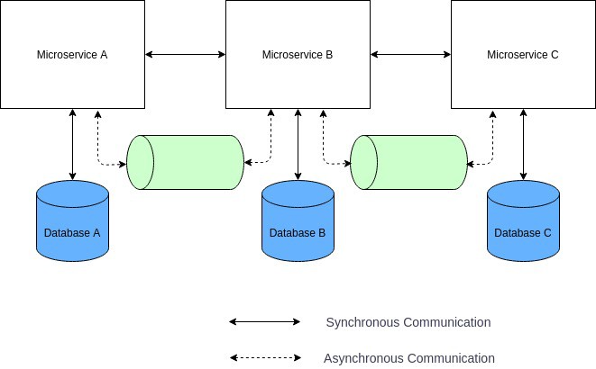

优点

- 数据由服务完全所有
- 服务的开发团队之间耦合度降低

缺点

- 服务间的数据共享变得更有挑战性
- 在应用范围的保证 ACID 事务变得困难许多
- 细心设计如何拆分单体数据库是一项极具挑战的任务

何时使用独享数据库

- 在大型企业应用程序中
- 当团队需要完全把控微服务以实现开发规模扩展和速度提升

何时不宜使用独享数据库

- 在小规模应用中
- 如果是单个团队开发所有微服务

可用技术示例

所有 SQL、 NoSQL 数据库都提供数据的逻辑分离（例如，单独的表、集合、结构、数据库）。


#### 事件源（Event Sourcing）

在微服务架构中，特别使用独享数据库时，微服务之间需要进行数据交换。对于弹性高可伸缩的和可容错的系统，它们应该通过交换事件进行异步通信。在这种情况，您可能希望进行类似更新数据库并发送消息这样的原子操作，如果在大数据量的分布式场景使用关系数据库，您将无法使用两阶段锁协议（2PL），因为它无法伸缩。而 NoSQL 数据库因为大多不支持两阶段锁协议甚至无法实现分布式事务。

在这些场景，可以基于事件的架构使用事件源模式。在传统数据库中，直接存储的是业务实体的当前“状态”，而在事件源中任何“状态”更新事件或其他重要事件都会被存储起来，而不是直接存储实体本身。这意味着业务实体的所有更改将被保存为一系列不可变的事件。因为数据是作为一系列事件存储的，而非直接更新存储，所以各项服务可以通过重放事件存储中的事件来计算出所需的数据状态。

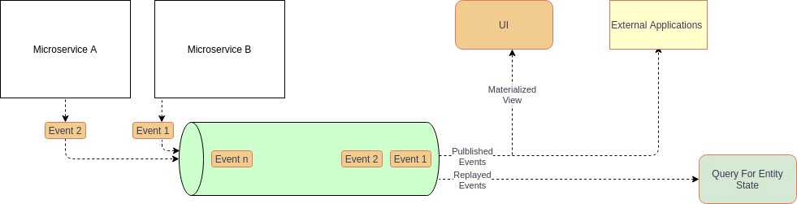

优点

- 为高可伸缩系统提供原子性操作。
- 自动记录实体变更历史，包括时序回溯功能。
- 松耦合和事件驱动的微服务。

缺点

- 从事件存储中读取实体成为新的挑战，通常需要额外的数据存储（CQRS 模式）
- 系统整体复杂性增加了，通常需要领域驱动设计
- 系统需要处理事件重复（幂等）或丢失
- 变更事件结构成为新的挑战

何时使用事件源

- 使用关系数据库的、高可伸缩的事务型系统
- 使用 NoSQL 数据库的事务型系统
- 弹性高可伸缩微服务架构
- 典型的消息驱动或事件驱动系统（电子商务、预订和预约系统）

何时不宜使用事件源

- 使用 SQL 数据库的低可伸缩性事务型系统
- 在服务可以同步交换数据（例如，通过 API）的简单微服务架构中


#### 命令和查询职责分离（CQRS）

如果我们使用事件源，那么从事件存储中读取数据就变得困难了。要从数据存储中获取实体，我们需要处理所有的实体事件。有时我们对读写操作还会有不同的一致性和吞吐量要求。

这种情况，我们可以使用 CQRS 模式。在该模式中，系统的数据修改部分（命令）与数据读取部分（查询）是分离的。而 CQRS 模式有两种容易令人混淆的模式，分别是简单的和高级的。

在其简单形式中，不同实体或 ORM 模型被用于读写操作，如下所示：

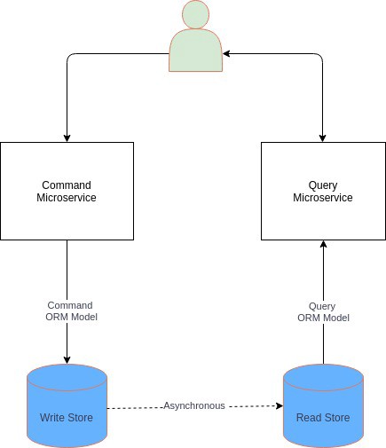

它有助于强化单一职责原则和分离关注点，从而实现更简洁的设计。

在其高级形式中，会有不同的数据存储用于读写操作。高级的 CQRS 通常结合事件源模式。根据不同情况，会使用不同类型的写数据存储和读数据存储。写数据存储是“记录的系统”，也就是整个系统的核心源头。

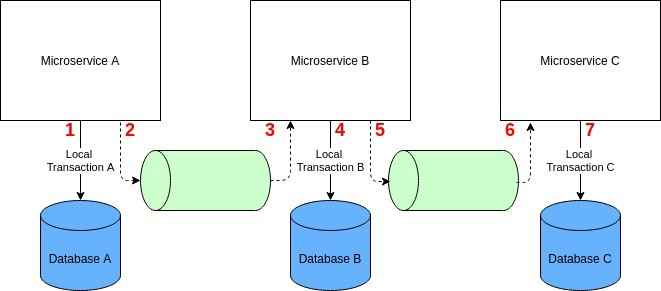

对于读频繁的应用程序或微服务架构，OLTP 数据库（任何提供 ACID 事务保证的关系或非关系数据库）或分布式消息系统都可以被用作写存储。对于写频繁的应用程序（写操作高可伸缩性和大吞吐量），需要使用写可水平伸缩的数据库（如全球托管的公共云数据库）。标准化的数据则保存在写数据存储中。

对搜索（例如 Apache Solr、Elasticsearch）或读操作（KV 数据库、文档数据库）进行优化的非关系数据库常被用作读存储。许多情况会在需要 SQL 查询的地方使用读可伸缩的关系数据库。非标准化和特殊优化过的数据则保存在读存储中。

数据是从写存储异步复制到读存储中的，所以读存储和写存储之间会有延迟，但最终是一致的。

优点

- 在事件驱动的微服务中数据读取速度更快
- 数据的高可用性
- 读写系统可独立扩展

缺点

- 读数据存储是弱一致性的（最终一致性）
- 整个系统的复杂性增加了，混乱的 CQRS 会显着危害整个项目

何时使用 CQRS

- 在高可扩展的微服务架构中使用事件源
- 在复杂领域模型中，读操作需要同时查询多个数据存储
- 在读写操作负载差异明显的系统中

何时不宜使用 CQRS

- 在没有必要存储大量事件的微服务架构中，用事件存储快照来计算实体状态是一个更好的选择
- 在读写操作负载相近的系统中


#### Saga

如果微服务使用独享数据库，那么通过分布式事务管理一致性是一个巨大的挑战。你无法使用传统的两阶段提交协议，因为它要么不可伸缩（关系数据库），要么不被支持（多数非关系数据库）。

但您还是可以在微服务架构中使用 Saga 模式实现分布式事务。Saga 是 1987 年开发的一种古老模式，是关系数据库中关于大事务的一个替代概念。但这种模式的一种现代变种对分布式事务也非常有效。Saga 模式是一个本地事务序列，其每个事务在一个单独的微服务内更新数据存储并发布一个事件或消息。Saga 中的首个事务是由外部请求（事件或动作）初始化的，一旦本地事务完成（数据已保存在数据存储且消息或事件已发布），那么发布消息或事件则会触发 Saga 中的下一个本地事务。

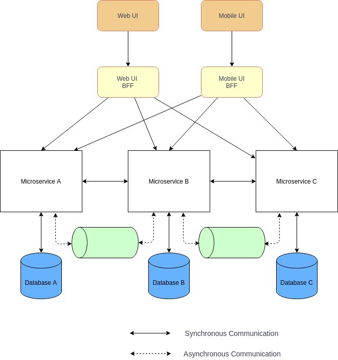

如果本地事务失败，Saga 将执行一系列补偿事务来回滚前面本地事务的更改。

Saga 事务协调管理主要有两种形式：

- 事件编排 Choreography：分散协调，每个微服务生产并监听其他微服务的事件或消息然后决定是否执行某个动作
- 命令编排 Orchestration：集中协调，由一个协调器告诉参与的微服务哪个本地事务需要执行

优点

- 为高可伸缩或松耦合的、事件驱动的微服务架构提供一致性事务
- 为使用了不支持 2PC 的非关系数据库的微服务架构提供一致性事务

缺点

- 需要处理瞬时故障，并且提供等幂性
- 难以调试，而且复杂性随着微服务数量增加而增加

何时使用 Saga

- 在使用了事件源的高可伸缩、松耦合的微服务中
- 在使用了分布式非关系数据库的系统中

何时不宜使用 Saga

- 使用关系数据库的低可伸缩性事务型系统
- 在服务间存在循环依赖的系统中


#### 面向前端的后端 （BFF）

在现代商业应用开发，特别是微服务架构中，前后端应用是分离和独立的服务，它们通过 API 或 GraphQL 连接。如果应用程序还有移动 App 客户端，那么 Web 端和移动客户端使用相同的后端微服务就会出现问题。因为移动客户端和 Web 客户端有不同的屏幕尺寸、显示屏、性能、能耗和网络带宽，它们的 API 需求不同。

面向前端的后端模式适用于需要为特殊 UI 定制单独后端的场景。它还提供了其他优势，比如作为下游微服务的封装，从而减少 UI 和下游微服务之间的频繁通信。此外，在高安全要求的场景中，BFF 为部署在 DMZ 网络中的下游微服务提供了更高的安全性。


优点

- 分离 BFF 之间的关注点，使得我们可以为具体的 UI 优化他们
- 提供更高的安全性
- 减少 UI 和下游微服务之间频繁的通信

缺点

- BFF 之间代码重复
- 大量的 BFF 用于其他用户界面（例如，智能电视，Web，移动端，PC 桌面版）
- 需要仔细的设计和实现，BFF 不应该包含任何业务逻辑，而应只包含特定客户端逻辑和行为

何时使用 BFF

- 如果应用程序有多个含不同 API 需求的 UI
- 出于安全需要，UI 和下游微服务之间需要额外的层
- 如果在 UI 开发中使用微前端

何时不宜使用 BFF

- 如果应用程序虽有多个 UI，但使用的 API 相同
- 如果核心微服务不是部署在 DMZ 网络中

可用技术示例

任何后端框架（Node.js，Spring，Django，Laravel，Flask，Play，…）都能支持。


#### API网关

在微服务架构中，UI 通常连接多个微服务。如果微服务是细粒度的（FaaS） ，那么客户端可能需要连接非常多的微服务，这将变得繁杂和具有挑战性。此外，这些服务包括它们的 API 还将不断进化。大型企业还希望能有其他横切关注点（SSL 终止、身份验证、授权、节流、日志记录等）。

一个解决这些问题的可行方法是使用 API 网关。API 网关位于客户端 APP 和后端微服务之间充当 facade，它可以是反向代理，将客户端请求路由到适当的后端微服务。它还支持将客户端请求扇出到多个微服务，然后将响应聚合后返回给客户端。它还支持必要的横切关注点。

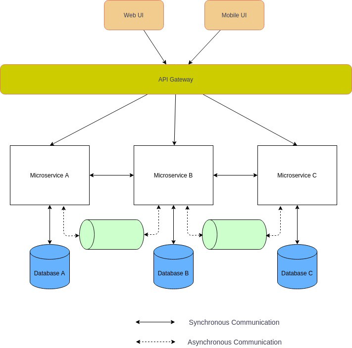

优点

- 在前端和后端服务之间提供松耦合
- 减少客户端和微服务之间的调用次数
- 通过 SSL 终端、身份验证和授权实现高安全性
- 集中管理的横切关注点，例如，日志记录和监视、节流、负载平衡

缺点

- 可能导致微服务架构中的单点故障
- 额外的网络调用带来的延迟增加
- 如果不进行扩展，它们很容易成为整个企业应用的瓶颈
- 额外的维护和开发费用

何时使用 API 网关

- 在复杂的微服务架构中，它几乎是必须的
- 在大型企业中，API 网关是中心化安全性和横切关注点的必要工具

何时不宜使用 API 网关

- 在安全和集中管理不是最优先要素的私人项目或小公司中
- 如果微服务的数量相当少


#### Strangler

如果想在运行中的项目中使用微服务架构，我们需要将遗留的或现有的单体应用迁移到微服务。将现有的大型在线单体应用程序迁移到微服务是相当有挑战性的，因为这可能破坏应用程序的可用性。

一个解决方案是使用 Strangler 模式。Strangler 模式意味着通过使用新的微服务逐步替换特定功能，将单体应用程序增量地迁移到微服务架构。此外，新功能只在微服务中添加，而不再添加到遗留的单体应用中。然后配置一个 Facade （API 网关）来路由遗留单体应用和微服务间的请求。当某个功能从单体应用迁移到微服务，Facade 就会拦截客户端请求并路由到新的微服务。一旦迁移了所有的功能，遗留单体应用程序就会被“扼杀（Strangler）”，即退役。

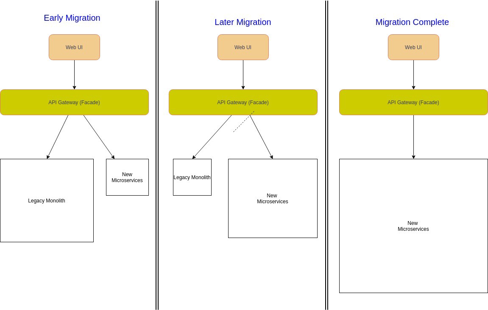

优点

- 安全的迁移单体应用程序到微服务
- 可以并行地迁移已有功能和开发新功能
- 迁移过程可以更好把控节奏

缺点

- 在现有的单体应用服务和新的微服务之间共享数据存储变得具有挑战性
- 添加 Facade （API 网关）将增加系统延迟
- 端到端测试变得困难

何时使用 Strangler

- 将大型后端单体应用程序的增量迁移到微服务

何时不宜使用 Strangler

- 如果后端单体应用很小，那么全量替换会更好
- 如果无法拦截客户端对遗留的单体应用程序的请求


#### 断路器

在微服务架构中，微服务通过同步调用其他服务来满足业务需求。服务调用会由于瞬时故障（网络连接缓慢、超时或暂时不可用） 导致失败，这种情况重试可以解决问题。然而，如果出现了严重问题（微服务完全失败），那么微服务将长时间不可用，这时重试没有意义且浪费宝贵的资源（线程被阻塞，CPU 周期被浪费）。此外，一个服务的故障还会引发整个应用系统的级联故障。这时快速失败是一种更好的方法。

在这种情况，可以使用断路器模式挽救。一个微服务通过代理请求另一个微服务，其工作原理类似于电气断路器，代理通过统计最近发生的故障数量，并使用它来决定是继续请求还是简单的直接返回异常。

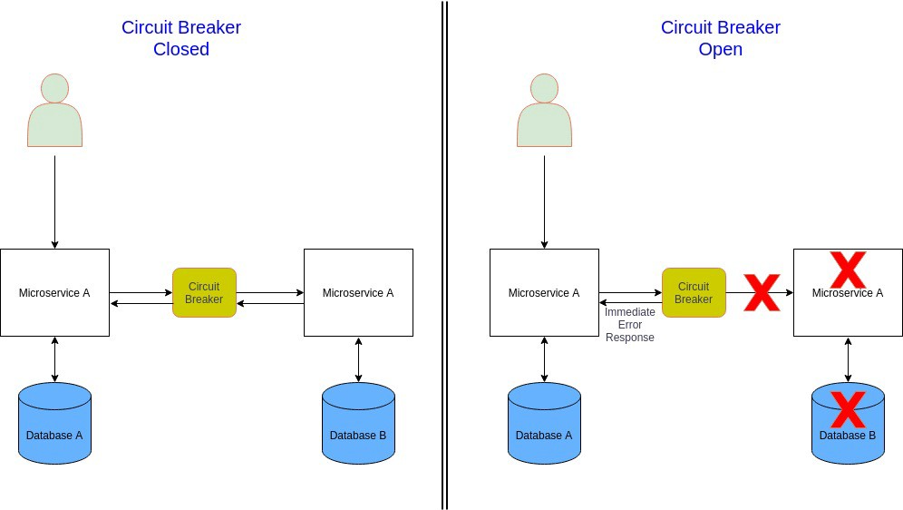

断路器可以有以下三种状态：

- 关闭：断路器将请求路由到微服务，并统计给定时段内的故障数量，如果超过阈值，它就会触发并进入打开状态
- 打开：来自微服务的请求会快速失败并返回异常。在超时后，断路器进入半开启状态
- 半开：只有有限数量的微服务请求被允许通过并进行调用。如果这些请求成功，断路器将进入闭合状态。如果任何请求失败，断路器则会进入开启状态

优点

- 提高微服务架构的容错性和弹性
- 阻止引发其他微服务的级联故障

缺点

- 需要复杂的异常处理
- 日志和监控
- 应该支持人工复位

何时使用断路器

- 在微服务间使用同步通信的紧耦合的微服务架构中
- 如果微服务依赖多个其他微服务

何时不宜使用断路器

- 松耦合、事件驱动的微服务架构
- 如果微服务不依赖于其他微服务


#### 外部化配置

每个业务应用都有许多用于各种基础设施的配置参数（例如，数据库、网络、连接的服务地址、凭据、证书路径）。此外在企业应用程序通常部署在各种运行环境（Local、 Dev、 Prod）中，实现这些的一个方法是通过内部配置。这是一个致命糟糕实践，它会导致严重的安全风险，因为生产凭证很容易遭到破坏。此外，配置参数的任何更改都需要重新构建应用程序，这在在微服务架构中会更加严峻，因为我们可能拥有数百个服务。

更好的方法是将所有配置外部化，使得构建过程与运行环境分离，生产的配置文件只在运行时或通过环境变量使用，从而最小化了安全风险。

优点

- 生产配置不属于代码库，因而最小化了安全漏洞
- 修改配置参数不需要重新构建应用程序

缺点

- 我们需要选择一个支持外部化配置的框架

何时使用外部化配置

- 任何重要的生产应用程序都必须使用外部化配置

何时不宜使用外部化配置

- 在验证概念的开发中


#### 消费端驱动的契约测试

在微服务架构中，通常有许多有不同团队开发的微服务。这些微型服务协同工作来满足业务需求（例如，客户请求），并相互进行同步或异步通信。消费端微服务的集成测试具有挑战性，通常用 TestDouble 以获得更快、更低成本的测试运行。但是 TestDouble 通常并不能代表真正的微服务提供者，而且如果微服务提供者更改了它的 API 或 消息，那么 TestDouble 将无法确认这些。另一种选择是进行端到端测试，尽管它在生产之前是强制性的，但却是脆弱的、缓慢的、昂贵的且不能替代集成测试（Test Pyramid）。

在这方面消费端驱动的契约测试可以帮助我们。在这里，负责消费端微服务的团队针对特定的服务端微服务，编写一套包含了其请求和预期响应（同步）或消息（异步）的测试套件，这些测试套件称为显式的约定。对于微服务服务端，将其消费端所有约定的测试套件都添加到其自动化测试中。当特定服务端微服务的自动化测试执行时，它将一起运行自己的测试和约定的测试并进行验证。通过这种方式，契约测试可以自动的帮助维护微服务通信的完整性。

优点

- 如果提供程序意外更改 API 或消息，可以被快速的自动发现
- 更少意外、更健壮，特别是包含大量微服务的企业应用程序
- 改善团队自主性

缺点

- 需要额外的工作来开发和集成微服务服务端的契约测试，因为他们可能使用完全不同的测试工具
- 如果契约测试与真实服务情况不匹配，将可能导致生产故障

何时使用需求驱动的契约测试

- 在大型企业业务应用程序中，通常由不同的团队开发不同服务

何时不宜使用消费端驱动的契约测试

- 所有微服务由同一团队负责开发的小型简单的应用程序
- 如果服务端微服务是相对稳定的，并且不处在活跃的开发状态


### 关键设计

#### 监控-发现故障的征兆

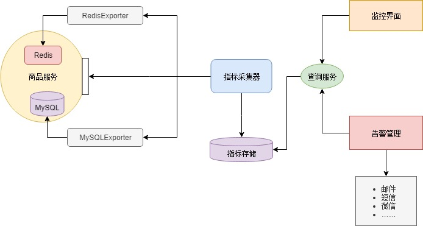


#### 定位问题-链路跟踪


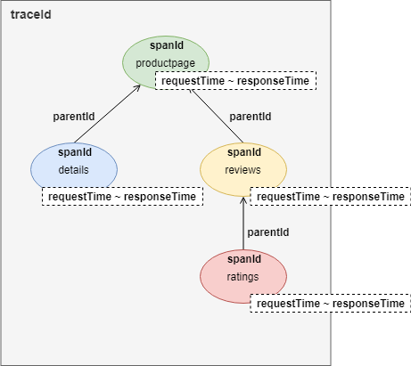

要实现链路跟踪，每次服务调用会在HTTP的HEADERS中记录至少记录四项数据：

- traceId：traceId标识一个用户请求的调用链路。具有相同traceId的调用属于同一条链路
- spanId：标识一次服务调用的ID，即链路跟踪的节点ID
- parentId：父节点的spanId
- requestTime & responseTime：请求时间和响应时间


#### 分析问题-日志分析


一般使用ELK日志分析组件。ELK是Elasticsearch、Logstash和Kibana三个组件的缩写。

- Elasticsearch：搜索引擎，同时也是日志的存储。
- Logstash：日志采集器，它接收日志输入，对日志进行一些预处理，然后输出到Elasticsearch。
- Kibana：UI组件，通过Elasticsearch的API查找数据并展示给用户。

最后还有一个小问题是如何将日志发送到Logstash。一种方案是在日志输出的时候直接调用Logstash接口将日志发送过去。这样一来又（咦，为啥要用“又”）要修改代码……于是小明选用了另一种方案：日志仍然输出到文件，每个服务里再部署个Agent扫描日志文件然后输出给Logstash。


#### 网关-权限控制，服务治理

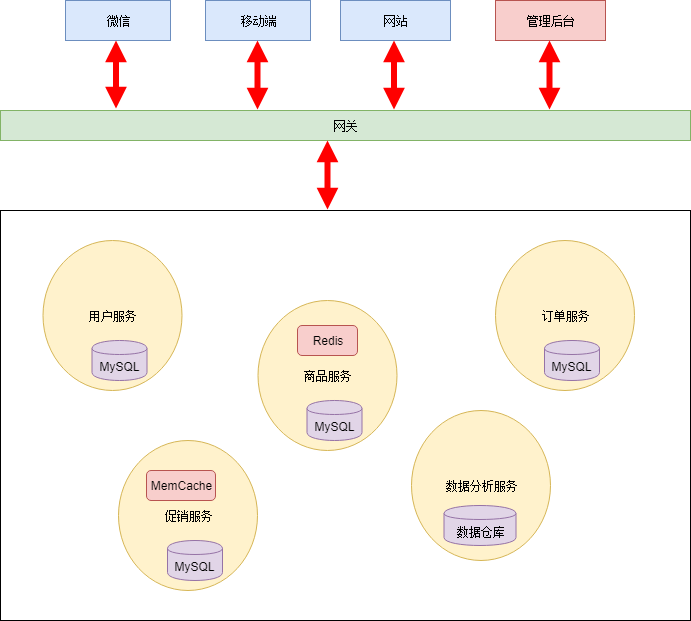


#### 服务注册于发现-动态扩容

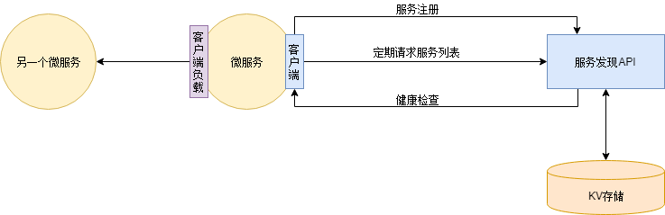


#### 熔断、服务降级、限流

**熔断**

当一个服务因为各种原因停止响应时，调用方通常会等待一段时间，然后超时或者收到错误返回。如果调用链路比较长，可能会导致请求堆积，整条链路占用大量资源一直在等待下游响应。所以当多次访问一个服务失败时，应熔断，标记该服务已停止工作，直接返回错误。直至该服务恢复正常后再重新建立连接。

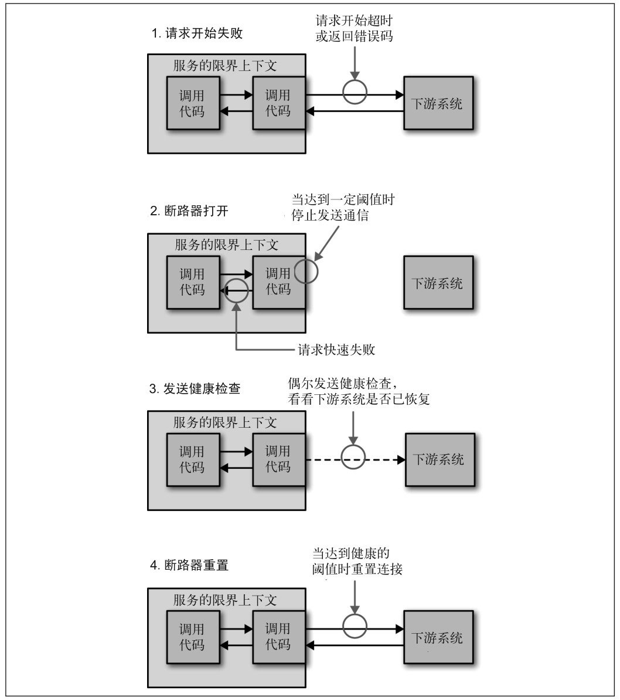


**服务降级**

当下游服务停止工作后，如果该服务并非核心业务，则上游服务应该降级，以保证核心业务不中断。比如网上超市下单界面有一个推荐商品凑单的功能，当推荐模块挂了后，下单功能不能一起挂掉，只需要暂时关闭推荐功能即可。


**限流**

一个服务挂掉后，上游服务或者用户一般会习惯性地重试访问。这导致一旦服务恢复正常，很可能因为瞬间网络流量过大又立刻挂掉，在棺材里重复着仰卧起坐。因此服务需要能够自我保护——限流。限流策略有很多，最简单的比如当单位时间内请求数过多时，丢弃多余的请求。另外，也可以考虑分区限流。仅拒绝来自产生大量请求的服务的请求。例如商品服务和订单服务都需要访问促销服务，商品服务由于代码问题发起了大量请求，促销服务则只限制来自商品服务的请求，来自订单服务的请求则正常响应。


#### 测试

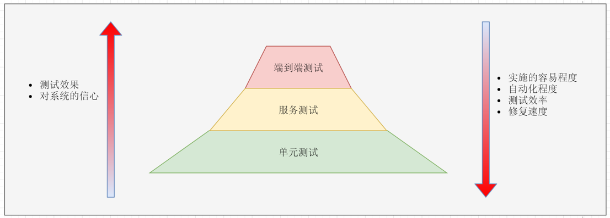

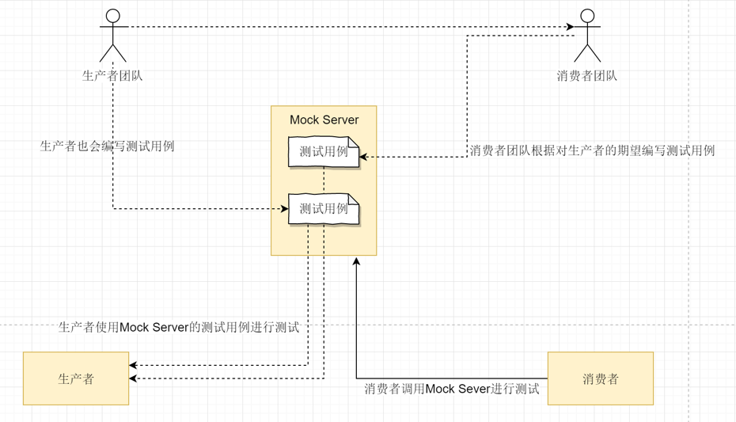


## 无服务器架构(Serverless)

Serverless的基础是云技术，它是云技术发展到一定阶段而出现的一种革命性的高端架构。Serverless并不是说不需要服务器，而是指不需要开发者去关心底层服务器的状态、资源和扩容等，开发者只需要关注于业务逻辑实现。架构上，我们可以把serverless分为FaaS和BaaS：

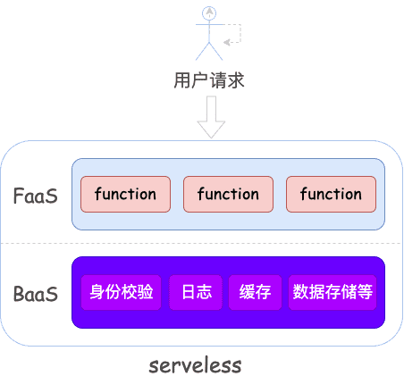

- **FaaS（函数即服务）**：用于创建、运行、管理函数服务的计算平台，它支持多种开发语言，比如java、nodejs、dart等，这有利于不同端测的开发同学介入开发。FaaS是基于事件驱动的思想，只有当一个函数被事件触发时才会占用服务器资源执行，不然都是无需占用服务器资源的
- **BaaS（后端即服务）**：提供了用于函数调用的第三方基础服务，比如身份校验、日志、数据库等，它是有服务商直接提供，开发者无需关系实现，直接调用即可


**优点**

- 降低创业公司启动成本
- 减少运营成本
- 降低开发成本
- 实现快速上线
- 系统安全性更高
- 能适应微服务架构和扩展性能力强

**缺点**

- 不适合长时间运行应用
- 完全会依赖于第三方服务
- 缺乏调式和开发工具，排查问题困难
- 无法用于高并发运用


**应用场景**

- 发送通知
- WebHook
- 数据统计分析
- Trigger及定时任务
- Chat 机器人


## 服务网格(Service Mesh)

### 三种服务发现模式

服务发现和负载均衡并不是新问题，业界其实已经探索和总结出一些常用的模式，这些模式的核心其实是代理 (Proxy，如下图所示)，以及代理在架构中所处的位置。

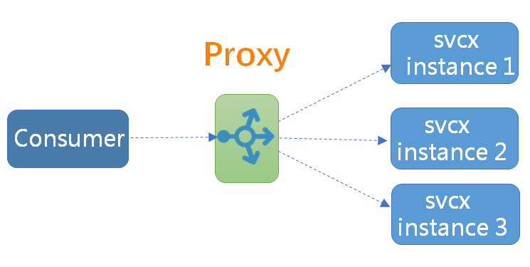

在服务消费方和服务提供方之间增加一层代理，由代理负责服务发现和负载均衡功能，消费方通过代理间接访问目标服务。根据代理在架构上所处的位置不同，当前业界主要有三种不同的服务发现模式。


#### 模式一：传统集中式代理

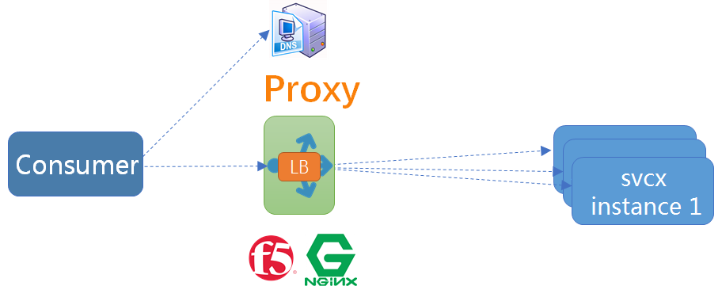

这是最简单和传统做法，在服务消费者和生产者之间，代理作为独立一层集中部署，由独立团队 (一般是运维或框架) 负责治理和运维。常用的集中式代理有硬件负载均衡器 (如 F5)，或者软件负载均衡器 (如 Nginx)，F5(4 层负载)+Nginx(7 层负载) 这种软硬结合两层代理也是业内常见做法，兼顾配置的灵活性 (Nginx 比 F5 易于配置)。

这种方式通常在 DNS 域名服务器的配合下实现服务发现，服务注册 (建立服务域名和 IP 地址之间的映射关系) 一般由运维人员在代理上手工配置，服务消费方仅依赖服务域名，这个域名指向代理，由代理解析目标地址并做负载均衡和调用。

国外知名电商网站 eBay，虽然体量巨大，但其内部的服务发现机制仍然是基于这种传统的集中代理模式，国内公司如携程，也是采用这种模式。


#### 模式二：客户端嵌入式代理


这是很多互联网公司比较流行的一种做法，代理 (包括服务发现和负载均衡逻辑) 以客户库的形式嵌入在应用程序中。这种模式一般需要独立的服务注册中心组件配合，服务启动时自动注册到注册中心并定期报心跳，客户端代理则发现服务并做负载均衡。

Netflix 开源的 Eureka(注册中心)[附录 1] 和 Ribbon(客户端代理)[附录 2] 是这种模式的典型案例，国内阿里开源的 Dubbo 也是采用这种模式。


#### 模式三：主机独立进程代理

这种做法是上面两种模式的一个折中，代理既不是独立集中部署，也不嵌入在客户应用程序中，而是作为独立进程部署在每一个主机上，一个主机上的多个消费者应用可以共用这个代理，实现服务发现和负载均衡，如下图所示。这个模式一般也需要独立的服务注册中心组件配合，作用同模式二。

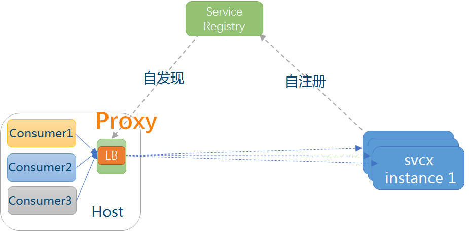


### 服务网格Service Mesh

所谓的 Service Mesh，其实本质上就是上面提到的模式三：主机独立进程模式。

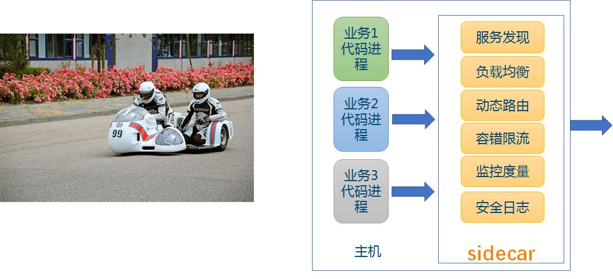

**Service Mesh特点**

- 是一个基础设施
- 轻量级网络代理，应用程序间通讯的中间层
- 应用程序无感知，对应用程序透明无侵入
- 解耦应用程序的重试/超时、监控、追踪和服务发现等控制层面的东西


**Service Mesh开源实现**

- 第一代Service Mesh
  - Linkerd：使用Scala编写，是业界第一个开源的Service Mesh方案
  - Envoy：基于C++ 11编写，无论是理论上还是实际上，Envoy 性能都比 Linkderd 更好
- 第二代Service Mesh：主要改进集中在更加强大的控制面功能（与之对应的 sidecar proxy 被称之为数据面）
  - Istio：是 Google 和 IBM 两位巨人联合 Lyft 的合作开源项目。是当前最主流的Service Mesh方案
  - Conduit：各方面的设计理念与 Istio 非常类似。但是作者抛弃了 Linkerd, 使用Rust重新编写了sidecar, 叫做 Conduit Data Plane, 控制面则由Go编写的 Conduit Control Plane接管


# 架构规范

## 指标

### QPS

**QPS**`Queries Per Second` 是每秒查询率 ,是**一台服务器**每秒能够相应的查询次数，是对一个特定的查询服务器**在规定时间内**所处理流量多少的衡量标准, 即每秒的响应请求数，也即是最大吞吐能力。

`峰值QPS=(日总PV×80%)/(日总秒数×20%)`


### TPS

**TPS**`Transactions Per Second`也就是事务数/秒。一个事务是指一个客户机向服务器发送请求然后服务器做出反应的过程。客户机在发送请求时开始计时，收到服务器响应后结束计时，以此来计算使用的时间和完成的事务个数。


**QPS和TPS区别**

**Tps即每秒处理事务数，包括了**

- 用户请求服务器
- 服务器自己的内部处理
- 服务器返回给用户

这三个过程，每秒能够完成N个这三个过程，Tps也就是N；

Qps基本类似于Tps，但是不同的是，对于一个页面的一次访问，形成一个Tps；但一次页面请求，可能产生多次对服务器的请求，服务器对这些请求，就可计入“Qps”之中。


### 并发数

并发数（并发度）：指系统同时能处理的请求数量，同样反应了系统的负载能力。这个数值可以分析机器1s内的访问日志数量来得到。


### 吐吞量

吞吐量是指系统在单位时间内处理请求的数量，TPS、QPS都是吞吐量的常用量化指标。


**系统吞吐量要素**

一个系统的吞吐量（承压能力）与request（请求）对cpu的消耗，外部接口，IO等等紧密关联。

单个request 对cpu消耗越高，外部系统接口，IO影响速度越慢，系统吞吐能力越低，反之越高。


**重要参数**

- QPS(TPS)：每秒钟request/事务数量
- 并发数：系统同时处理的request/事务数
- 响应时间：一般取平均响应时间


**关系**

QPS(TPS)=并发数/平均响应时间

一个系统吞吐量通常有QPS(TPS),并发数两个因素决定，每套系统这个两个值都有一个相对极限值，在应用场景访问压力下，只要某一项达到系统最高值，系统吞吐量就上不去了，如果压力继续增大，系统的吞吐量反而会下降，原因是系统超负荷工作，上下文切换，内存等等其他消耗导致系统性能下降。


### PV

**PV**（Page View）是页面访问量，即页面浏览量或点击量，用户每次刷新即被计算一次。可以统计服务一天的访问日志得到。


### UV

**UV**（Unique Visitor）是独立访客，统计1天内访问某站点的用户数。可以统计服务一天的访问日志并根据用户的唯一标识去重得到。响应时间（RT）：响应时间是指系统对请求作出响应的时间，一般取平均响应时间。可以通过Nginx、Apache之类的Web Server得到。


### DAU

**DAU**(Daily Active User)是日活跃用户数量。常用于反映网站、互联网应用或网络游戏的运营情况。DAU通常统计一日（统计日）之内，登录或使用了某个产品的用户数（去除重复登录的用户），与UV概念相似。


### MAU

**MAU**(Month Active User)是月活跃用户数量，指网站、app等去重后的月活跃用户数量。


### 系统吞吐量评估

我们在做系统设计的时候就需要考虑CPU运算，IO，外部系统响应因素造成的影响以及对系统性能的初步预估。

而通常情况下，我们面对需求，我们评估出来的出来QPS，并发数之外，还有另外一个维度：日pv。

通过观察系统的访问日志发现，在用户量很大的情况下，各个时间周期内的同一时间段的访问流量几乎一样。比如工作日的每天早上。只要能拿到日流量图和QPS我们就可以推算日流量。

通常的技术方法：

- 找出系统的最高TPS和日PV，这两个要素有相对比较稳定的关系（除了放假、季节性因素影响之外）
- 通过压力测试或者经验预估，得出最高TPS，然后跟进1的关系，计算出系统最高的日吞吐量。B2B中文和淘宝面对的客户群不一样，这两个客户群的网络行为不应用，他们之间的TPS和PV关系比例也不一样


### 指标测试

#### 基准测试

性能基线指标测试是当软件系统中增加一个新的模块的时候，需要做基准测试，以判断新模块对整个软件系统的性能影响。按照基准测试的方法，需要打开/关闭新模块至少各做一次测试。关闭模块之前的系统各个性能指标记下来作为基准（Benchmark），然后与打开模块状态下的系统性能指标作比较，以判断模块对系统性能的影响。


#### 负载测试

开发前期测试。考察软件系统在既定负载下的性能表现指标。指标体现为响应时间、交易容量、并发容量、资源使用率等。

- 根据系统详细设计文档，分析系统可能存在的负载点（并发用户数，业务量，数据量），可以按照特性及功能点进行负载分析
- 固定测试环境，在其它测试角度（负载方面）不变的情况下，变化一个测试角度并持续增加压力，查看系统的性能曲线和处理极限，以及是否有性能瓶颈存在（拐点）

目的在预定的指标基础上，从多个不同的测试角度去探测分析系统的性能变化情况，获得性能指标，配合性能调优

- 确定测试组网模型
- 设计负载注入用例（系统处理能力）
- 针对不同的负载点，开发负载注入工具
- 开发性能指标采集工具


#### 并发测试

在开发中后期测试。模拟并发访问，测试多用户并发访问同一个应用、模块、数据时是否产生隐藏的并发问题，如内存泄漏、线程锁、资源争用问题。目的并非为了获得性能指标，而是为了发现并发引起的问题：

- 设计用户事务并发模型
- 设计测试用例
- 设计问题分析方法


#### 配置测试

在开发中后期测试。通过对被测系统的软硬件环境的调整，了解各种不同环境对性能影响的程度，从而找到系统各项资源的最有分配原则。目的是主要用于性能调优，在经过测试获得了基准测试数据后，进行环境调整（包括硬件配置、网络、操作系统、应用服务器、数据库等），再将测试结果与基准数据进行对比，判断调整是否达到最佳状态。

- 确定资源调整标准
- 设计配置测试用例


#### 强度测试

在开发中后期测试。特殊场景分析，构造异常或极端条件（如告警风暴、资源减少增多），查看系统状态。目的是核实测试对象性能行为在异常或极端条件之下的可接受性。


#### 压力测试

在开发中后期测试。测试系统在一定饱和状态下系统能够处理的会话能力，以及是否出现错误。目的是通过测试调优保证系统即使在极端的压力情况下也不会出错甚至系统崩溃。


#### 稳定性测试

在开发中后期测试。测试系统在一定负载下运行长时间后是否会发生问题。测试系统在饱和状态的70%压力下处理会话能力，以及是否出现错误。目的是测试系统在长时间运行的情况下不会出错及性能下降问题


## 前后端分离

### 规范原则

- 接口返回数据即显示：前端仅做渲染逻辑处理
- 渲染逻辑禁止跨多个接口调用
- 前端关注交互、渲染逻辑，尽量避免业务逻辑处理的出现
- 请求响应传输数据格式：JSON，JSON 数据尽量简单轻量，避免多级 JSON 的出现
- 统一响应格式规范
- 响应分页格式：使用统一响应格式
- 下拉框、复选框、单选框：由后端接口统一逻辑判定是否选中，通过 isSelect 标示是否选中
- Boolean 类型：关于 Boolean 类型，JSON 数据传输中一律使用 1/0 来标示，1 为是 / True，0 为否 / False
- 日期类型：关于日期类型，JSON 数据传输中一律使用字符串，具体日期格式因业务而定


## API接口设计

### 安全性问题

安全性问题是一个接口必须要保证的规范。如果接口保证不了安全性，那么接口相当于直接暴露在公网环境中任人蹂躏。

#### 调用接口的先决条件-token

获取token一般会涉及到参数`appid`，`appkey`，`timestamp`，`nonce`，`sign`。我们通过以上几个参数来获取调用系统的凭证：

- `appid`和`appkey`可以直接通过平台线上申请，也可以线下直接颁发。`appid`是全局唯一的，每个`appid`将对应一个客户，`appkey`需要高度保密
- `timestamp`是时间戳，使用系统当前的unix时间戳。时间戳的目的就是为了减轻DOS攻击。防止请求被拦截后一直尝试请求接口。服务器端设置时间戳阀值，如果请求时间戳和服务器时间超过阀值，则响应失败
- `nonce`是随机值。随机值主要是为了增加`sign`的多变性，也可以保护接口的幂等性，相邻的两次请求`nonce`不允许重复，如果重复则认为是重复提交，响应失败
- `sign`是参数签名，将`appkey`，`timestamp`，`nonce`拼接起来进行md5加密（当然使用其他方式进行不可逆加密也没问题）。

`token`，使用参数`appid`，`timestamp`，`nonce`，`sign`来获取token，作为系统调用的唯一凭证。`token`可以设置一次有效（这样安全性更高），也可以设置时效性，这里推荐设置时效性。如果一次有效的话这个接口的请求频率可能会很高。`token`推荐加到请求头上，这样可以跟业务参数完全区分开来。


#### 使用POST作为接口请求方式

一般调用接口最常用的两种方式就是GET和POST。两者的区别也很明显，GET请求会将参数暴露在浏览器URL中，而且对长度也有限制。为了更高的安全性，所有接口都采用POST方式请求。


#### 客户端IP白名单

ip白名单是指将接口的访问权限对部分ip进行开放。这样就能避免其他ip进行访问攻击，设置ip白名单比较麻烦的一点就是当你的客户端进行迁移后，就需要重新联系服务提供者添加新的ip白名单。设置ip白名单的方式很多，除了传统的防火墙之外，spring cloud alibaba提供的组件sentinel也支持白名单设置。为了降低api的复杂度，推荐使用防火墙规则进行白名单设置。


#### 单个接口针对ip限流

限流是为了更好的维护系统稳定性。使用redis进行接口调用次数统计，ip+接口地址作为key，访问次数作为value，每次请求value+1，设置过期时长来限制接口的调用频率。


#### 记录接口请求日志

使用aop全局记录请求日志，快速定位异常请求位置，排查问题原因。


#### 敏感数据脱敏

在接口调用过程中，可能会涉及到订单号等敏感数据，这类数据通常需要脱敏处理，最常用的方式就是加密。加密方式使用安全性比较高的`RSA`非对称加密。非对称加密算法有两个密钥，这两个密钥完全不同但又完全匹配。只有使用匹配的一对公钥和私钥，才能完成对明文的加密和解密过程。


### 幂等性问题

幂等性是指任意多次请求的执行结果和一次请求的执行结果所产生的影响相同。说的直白一点就是查询操作无论查询多少次都不会影响数据本身，因此查询操作本身就是幂等的。但是新增操作，每执行一次数据库就会发生变化，所以它是非幂等的。幂等问题的解决有很多思路，这里讲一种比较严谨的。提供一个生成随机数的接口，随机数全局唯一。调用接口的时候带入随机数。第一次调用，业务处理成功后，将随机数作为key，操作结果作为value，存入redis，同时设置过期时长。第二次调用，查询redis，如果key存在，则证明是重复提交，直接返回错误。


### 数据规范问题

#### 版本控制

一套成熟的API文档，一旦发布是不允许随意修改接口的。这时候如果想新增或者修改接口，就需要加入版本控制，版本号可以是整数类型，也可以是浮点数类型。一般接口地址都会带上版本号，http://ip:port//v1/list。


#### 响应状态码规范

一个牛逼的API，还需要提供简单明了的响应值，根据状态码就可以大概知道问题所在。我们采用http的状态码进行数据封装，例如200表示请求成功，4xx表示客户端错误，5xx表示服务器内部发生错误。状态码设计参考如下：

| 分类 | 描述                                         |
| :--- | :------------------------------------------- |
| 1xx  | 信息，服务器收到请求，需要请求者继续执行操作 |
| 2xx  | 成功                                         |
| 3xx  | 重定向，需要进一步的操作以完成请求           |
| 4xx  | 客户端错误，请求包含语法错误或无法完成请求   |
| 5xx  | 服务端错误                                   |

状态码枚举类：

```java
public enum CodeEnum {

    // 根据业务需求进行添加
    SUCCESS(200,"处理成功"),
    ERROR_PATH(404,"请求地址错误"),
    ERROR_SERVER(505,"服务器内部发生错误");
    
    private int code;
    private String message;
    
    CodeEnum(int code, String message) {
        this.code = code;
        this.message = message;
    }

    public int getCode() {
        return code;
    }

    public void setCode(int code) {
        this.code = code;
    }

    public String getMessage() {
        return message;
    }

    public void setMessage(String message) {
        this.message = message;
    }
}
```


#### 统一响应数据格式

为了方便给客户端响应，响应数据会包含三个属性，状态码（code）,信息描述（message）,响应数据（data）。客户端根据状态码及信息描述可快速知道接口，如果状态码返回成功，再开始处理数据。响应结果定义及常用方法：

```java
public class R implements Serializable {

    private static final long serialVersionUID = 793034041048451317L;

    private int code;
    private String message;
    private Object data = null;

    public int getCode() {
        return code;
    }
    public void setCode(int code) {
        this.code = code;
    }

    public String getMessage() {
        return message;
    }
    public void setMessage(String message) {
        this.message = message;
    }

    public Object getData() {
        return data;
    }

    /**
     * 放入响应枚举
     */
    public R fillCode(CodeEnum codeEnum){
        this.setCode(codeEnum.getCode());
        this.setMessage(codeEnum.getMessage());
        return this;
    }

    /**
     * 放入响应码及信息
     */
    public R fillCode(int code, String message){
        this.setCode(code);
        this.setMessage(message);
        return this;
    }

    /**
     * 处理成功，放入自定义业务数据集合
     */
    public R fillData(Object data) {
        this.setCode(CodeEnum.SUCCESS.getCode());
        this.setMessage(CodeEnum.SUCCESS.getMessage());
        this.data = data;
        return this;
    }
}
```


# OAuth2.0

`OAuth2.0` 的授权简单理解其实就是获取令牌（`token`）的过程，`OAuth` 协议定义了四种获得令牌的授权方式（`authorization grant` ）如下：

- 授权码（`authorization-code`）
- 隐藏式（`implicit`）
- 密码式（`password`）
- 客户端凭证（`client credentials`）

但值得注意的是，不管我们使用哪一种授权方式，在三方应用申请令牌之前，都必须在系统中去申请身份唯一标识：客户端 ID（`client ID`）和 客户端密钥（`client secret`）。这样做可以保证 `token` 不被恶意使用。


下面我们会分析每种授权方式的原理，在进入正题前，先了解 `OAuth2.0` 授权过程中几个重要的参数：

- `response_type`：code 表示要求返回授权码，token 表示直接返回令牌
- `client_id`：客户端身份标识
- `client_secret`：客户端密钥
- `redirect_uri`：重定向地址
- `scope`：表示授权的范围，`read`只读权限，`all`读写权限
- `grant_type`：表示授权的方式，`AUTHORIZATION_CODE`（授权码）、`password`（密码）、`client_credentials`（凭证式）、`refresh_token` 更新令牌
- `state`：应用程序传递的一个随机数，用来防止`CSRF`


## 授权码模式

授权码模式（Authorization Code Grant）。

 

-  第一步：用户访问页面
-  第二步：访问的页面将请求重定向到认证服务器
-  第三步：认证服务器向用户展示授权页面，等待用户授权
-  第四步：用户授权，认证服务器生成一个code和带上client_id发送给应用服务器。然后，应用服务器拿到code，并用client_id去后台查询对应的client_secret
-  第五步：将code、client_id、client_secret传给认证服务器换取access_token和 refresh_token
-  第六步：将access_token和refresh_token传给应用服务器
-  第七步：验证token，访问真正的资源页面

 


**掘金授权案例**

`OAuth2.0`四种授权中授权码方式是最为复杂，但也是安全系数最高的，比较常用的一种方式。这种方式适用于兼具前后端的`Web`项目，因为有些项目只有后端或只有前端，并不适用授权码模式。下图我们以用`WX`登录掘金为例，详细看一下授权码方式的整体流程。

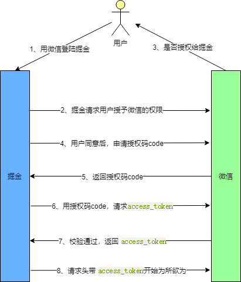

用户选择`WX`登录掘金，掘金会向`WX`发起授权请求，接下来 `WX`询问用户是否同意授权（常见的弹窗授权）。其中 `response_type` 为 `code` 要求返回授权码，`scope` 参数表示本次授权范围为只读权限，`redirect_uri` 重定向地址。

```javascript
https://wx.com/oauth/authorize?
  response_type=code&
  client_id=CLIENT_ID&
  redirect_uri=http://juejin.im/callback&
  scope=read&
  state=10001
```

用户同意授权后，`WX` 根据 `redirect_uri`重定向并带上授权码。

```javascript
http://juejin.im/callback?code=AUTHORIZATION_CODE
```

当掘金拿到授权码（code）时，带授权码和密匙等参数向`WX`申请令牌。`grant_type`表示本次授权为授权码方式 `authorization_code` ，获取令牌要带上客户端密匙 `client_secret`，和上一步得到的授权码 `code`。

```javascript
https://wx.com/oauth/token?
 client_id=CLIENT_ID&
 client_secret=CLIENT_SECRET&
 grant_type=authorization_code&
 code=AUTHORIZATION_CODE&
 redirect_uri=http://juejin.im/callback
```

最后 `WX` 收到请求后向 `redirect_uri` 地址发送 `JSON` 数据，其中的`access_token` 就是令牌。

```javascript
 {    
  "access_token":"ACCESS_TOKEN",
  "token_type":"bearer",
  "expires_in":2592000,
  "refresh_token":"REFRESH_TOKEN",
  "scope":"read",
  ......
}
```


## 简化模式

简化模式（Implicit Grant）。


-  第一步：用户访问页面时，重定向到认证服务器
-  第二步：认证服务器给用户一个认证页面，等待用户授权
-  第三步：用户授权，认证服务器想应用页面返回Token
-  第四步：验证Token，访问真正的资源页面


 

## 密码模式

密码模式（Resource Owner Password Credentials Grant）。


-  第一步：用户访问用页面时，输入第三方认证所需要的信息(QQ/微信账号密码)
-  第二步：应用页面那种这个信息去认证服务器授权
-  第三步：认证服务器授权通过，拿到token，访问真正的资源页面

**优点**：不需要多次请求转发，额外开销，同时可以获取更多的用户信息。

**缺点**：局限性，认证服务器和应用方必须有超高的信赖。

**应用场景**：自家公司搭建的认证服务器。


## 客户端模式

客户端模式（Client Credentials Grant）。


-  第一步：用户访问应用客户端
-  第二步：通过客户端定义的验证方法，拿到token，无需授权
-  第三步：访问资源服务器A
-  第四步：拿到一次token就可以畅通无阻的访问其他的资源页面。

这是一种最简单的模式，只要client请求，我们就将AccessToken发送给它。这种模式是最方便但最不安全的模式。因此这就要求我们对client完全的信任，而client本身也是安全的。因此这种模式一般用来提供给我们完全信任的服务器端服务。在这个过程中不需要用户的参与。


## 隐藏式

上边提到有一些`Web`应用是没有后端的， 属于纯前端应用，无法用上边的授权码模式。令牌的申请与存储都需要在前端完成，跳过了授权码这一步。前端应用直接获取 `token`，`response_type` 设置为 `token`，要求直接返回令牌，跳过授权码，`WX`授权通过后重定向到指定 `redirect_uri` 。

```javascript
https://wx.com/oauth/authorize?
  response_type=token&
  client_id=CLIENT_ID&
  redirect_uri=http://juejin.im/callback&
  scope=read
```


## 密码式

密码模式比较好理解，用户在掘金直接输入自己的`WX`用户名和密码，掘金拿着信息直接去`WX`申请令牌，请求响应的 `JSON`结果中返回 `token`。`grant_type` 为 `password` 表示密码式授权。

```javascript
https://wx.com/token?
  grant_type=password&
  username=USERNAME&
  password=PASSWORD&
  client_id=CLIENT_ID
```

这种授权方式缺点是显而易见的，非常的危险，如果采取此方式授权，该应用一定是可以高度信任的。


## 凭证式

凭证式和密码式很相似，主要适用于那些没有前端的命令行应用，可以用最简单的方式获取令牌，在请求响应的 `JSON` 结果中返回 `token`。`grant_type` 为 `client_credentials` 表示凭证式授权，`client_id` 和 `client_secret` 用来识别身份。

```javascript
https://wx.com/token?
  grant_type=client_credentials&
  client_id=CLIENT_ID&
  client_secret=CLIENT_SECRET
```


## 常见问题

**问题一：令牌怎么用？**

拿到令牌可以调用 `WX` API 请求数据了，那令牌该怎么用呢？每个到达`WX`的请求都必须带上 `token`，将 `token` 放在 `http` 请求头部的一个`Authorization`字段里。如果使用`postman` 模拟请求，要在`Authorization` -> `Bearer Token` 放入 `token`，**注意**：低版本`postman` 没有这个选项。

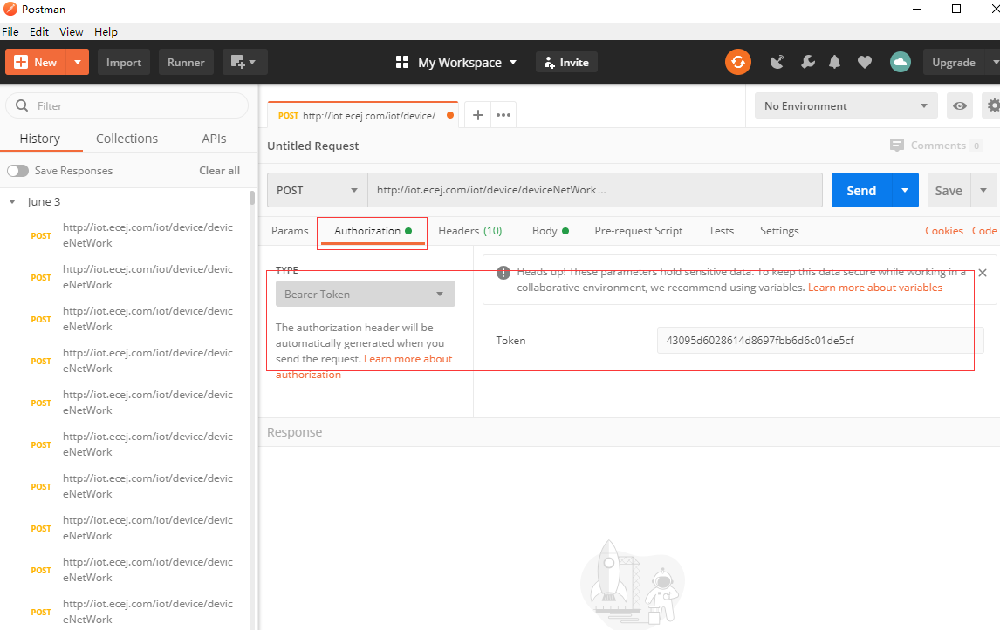


**问题二：令牌过期怎么办？**

`token`是有时效性的，一旦过期就需要重新获取，但是重走一遍授权流程，不仅麻烦而且用户体验也不好，那如何让更新令牌变得优雅一点呢？一般在颁发令牌时会一次发两个令牌，一个令牌用来请求`API`，另一个负责更新令牌 `refresh_token`。`grant_type` 为 `refresh_token` 请求为更新令牌，参数 `refresh_token` 是用于更新令牌的令牌。

```javascript
https://wx.com/oauth/token?
  grant_type=refresh_token&
  client_id=CLIENT_ID&
  client_secret=CLIENT_SECRET&
  refresh_token=REFRESH_TOKEN
```


# 用户体系

## 登录安全规则

- 失败次数超过3次，启用图片验证码
- 失败次数超过10次，启用手机验证码
- 启用HTTPS解决中间人攻击
- 敏感数据进行加密传输
- 操作日志
- 异常操作或登录体系
- 拒绝弱密码
- 防止用户名被遍历


## 注册登录流程

### 账号注册流程

在判断账号是否注册时，为了防止恶意攻击，通过手动或自动化程序测试账号是否注册，这里应该做风险控制，如连续3次账号未注册，后续每次输入账号都需要验证（如输入验证码，滑动验证等）才会继续流程。

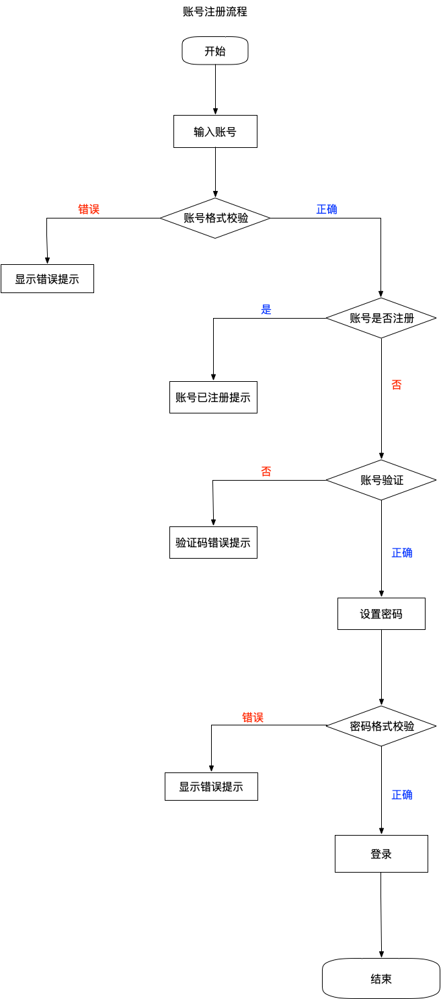


### 账号登录主流程

账号可能是手机号、邮箱号或其他，大部分App均支持手机号验证码登录，这里也分析此流程。第三方账号登录一般情况下有两种情况：

- 主流社交账号如微信、QQ、微博、Facebook等的登录，对于已绑定的账号，直接唤起相应App进行授权登录，对于未绑定的账户，则还需要进行绑定

- 同一公司体系下产品的账号，如腾讯系的腾讯视频、王者荣耀等，无需注册，使用一套账号（微信、QQ）授权登录

  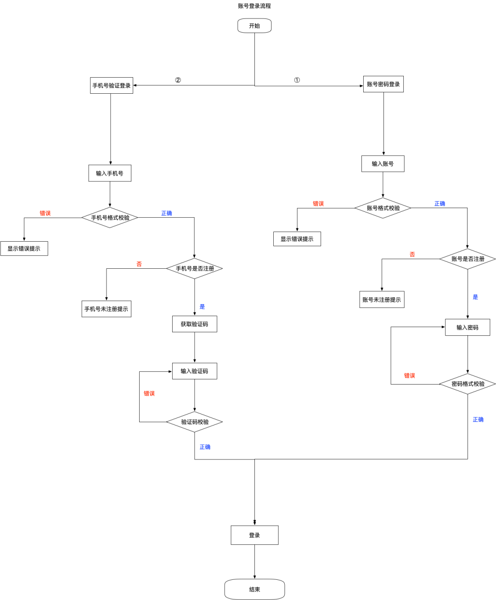


### 找回密码流程

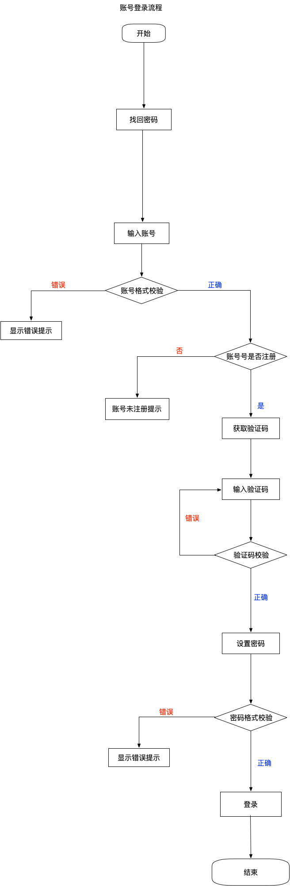


## 密码设计

一般使用 **https 协议 + 非对称加密算法（如 RSA）**来传输用户密码，为了更加安全，可以在前端构造一下随机因子。使用 **BCrypt + 盐存储用户密码**。在感知到暴力破解危害的时候，**「开启短信验证、图形验证码、账号暂时锁定」**等防御机制来抵御暴力破解。

### 传输密码

#### https协议

**http 的三大风险**

为什么要使用 https 协议呢？**「http 它不香」**吗? 因为 http 是明文信息传输的。如果在茫茫的网络海洋，使用 http 协议，有以下三大风险：

- 窃听/嗅探风险：第三方可以截获通信数据
- 数据篡改风险：第三方获取到通信数据后，会进行恶意修改
- 身份伪造风险：第三方可以冒充他人身份参与通信

如果传输不重要的信息还好，但是传输用户密码这些敏感信息，那可不得了。所以一般都要使用**「https 协议」**传输用户密码信息。


**https 原理**

https 原理是什么呢？为什么它能解决 http 的三大风险呢？

**https = http + SSL/TLS**, SSL/TLS 是传输层加密协议，它提供内容加密、身份认证、数据完整性校验，以解决数据传输的安全性问题。


**https一定安全吗？**

https 的数据传输过程，数据都是密文的，那么，使用了 https 协议传输密码信息，一定是安全的吗？其实**「不然」**

- 比如，https 完全就是建立在证书可信的基础上的呢。但是如果遇到中间人伪造证书，一旦客户端通过验证，安全性顿时就没了哦！平时各种钓鱼不可描述的网站，很可能就是黑客在诱导用户安装它们的伪造证书
- 通过伪造证书，https 也是可能被抓包的


#### 对称加密算法

既然使用了 https 协议传输用户密码，还是不一定安全，那么就给用户密码加密再传输。加密算法有对称加密和非对称加密两大类。对称加密：加密和解密使用**「相同密钥」**的加密算法。

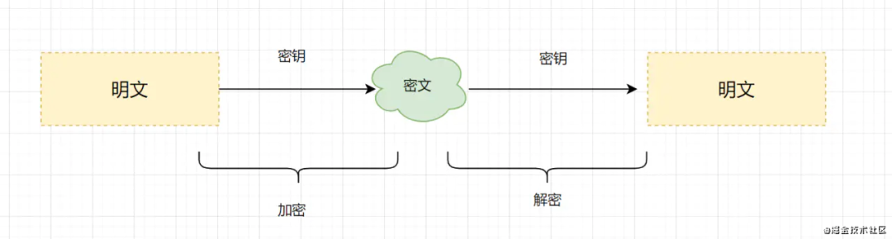

常用的对称加密算法主要有以下几种：

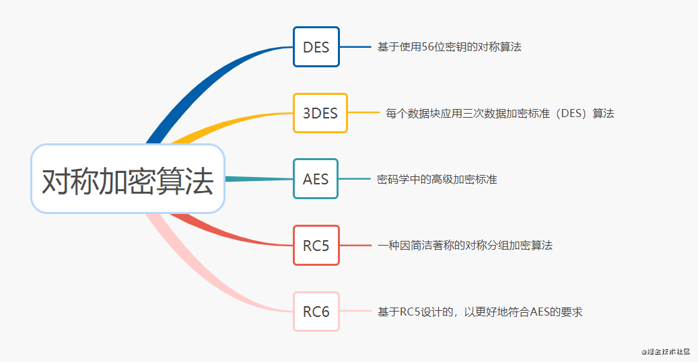

如果使用对称加密算法，需要**考虑密钥如何给到对方**，如果密钥还是网络传输给对方，传输过程，被中间人拿到的话，也是有风险的哦。


#### 非对称加密算法

非对称加密算法需要两个密钥（公开密钥和私有密钥）。公钥与私钥是成对存在的，如果用公钥对数据进行加密，只有对应的私钥才能解密。

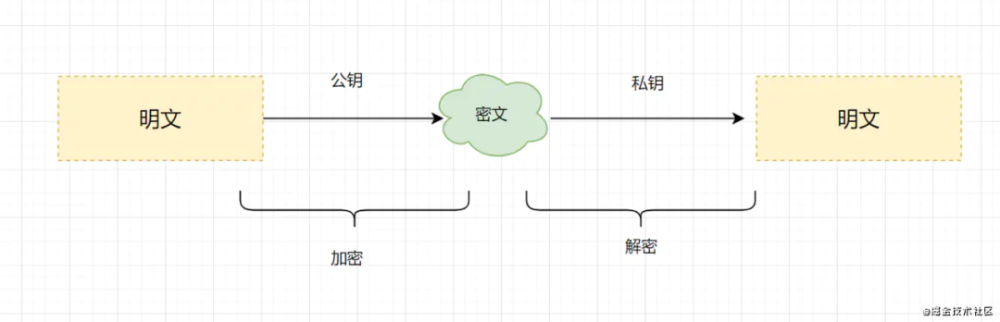

常用的非对称加密算法主要有以下几种：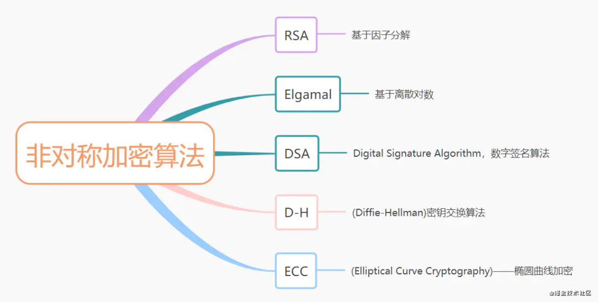

如果使用非对称加密算法，也需要考虑**「密钥公钥如何给到对方」**，如果公钥还是网络传输给对方，传输过程，被中间人拿到的话，会有什么问题呢？**「他们是不是可以伪造公钥，把伪造的公钥给客户端，然后，用自己的私钥等公钥加密的数据发过来？」** 

我们直接**「登录一下百度」**，抓下接口请求，验证一发大厂是怎么加密的。可以发现有获取公钥接口，如下:

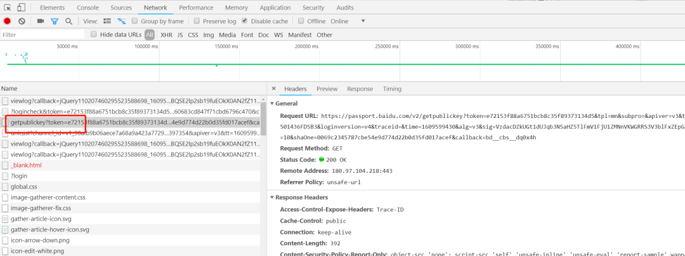

再看下登录接口，发现就是 RSA 算法，RSA 就是**「非对称加密算法」**。其实百度前端是用了 JavaScript 库**「jsencrypt」**，在 github 的 star 还挺多的。

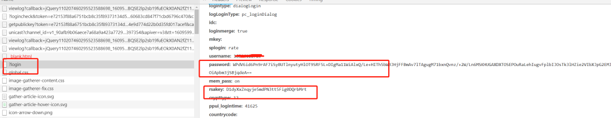

因此，我们可以用**「https + 非对称加密算法（如 RSA）」** 传输用户密码。


### 存储密码

假设密码已经安全到达服务端啦，那么，如何存储用户的密码呢？一定不能明文存储密码到数据库哦！可以用**「哈希摘要算法加密密码」**，再保存到数据库。

**哈希摘要算法**：只能从明文生成一个对应的哈希值，不能反过来根据哈希值得到对应的明文。

#### MD5摘要算法

MD5 是一种非常经典的哈希摘要算法，被广泛应用于数据完整性校验、数据（消息）摘要、数据加密等。但是仅仅使用 MD5 对密码进行摘要，并不安全。在 MD5 免费破解网站一输入，马上就可以看到原密码了。

试想一下，如果黑客构建一个超大的数据库，把所有 20 位数字以内的数字和字母组合的密码全部计算 MD5 哈希值出来，并且把密码和它们对应的哈希值存到里面去（这就是**「彩虹表」**）。在破解密码的时候，只需要查一下这个彩虹表就完事了。所以**「单单 MD5 对密码取哈希值存储」**，已经不安全啦。


####  MD5+盐摘要算法

在密码学中，是指通过在密码任意固定位置插入特定的字符串，让散列后的结果和使用原始密码的散列结果不相符，这种过程称之为“加盐”。用户密码+盐之后，进行哈希散列，再保存到数据库。这样可以有效应对彩虹表破解法。但是呢，使用加盐，需要注意以下几点：

- 不能在代码中写死盐，且盐需要有一定的长度（盐写死太简单的话，黑客可能注册几个账号反推出来）
- 每一个密码都有独立的盐，并且盐要长一点，比如超过 20 位。(盐太短，加上原始密码太短，容易破解)
- 最好是随机的值，并且是全球唯一的，意味着全球不可能有现成的彩虹表给你用


#### Bcrypt

即使是加了盐，密码仍有可能被暴力破解。因此，我们可以采取更**「慢一点」**的算法，让黑客破解密码付出更大的代价，甚至迫使他们放弃。提升密码存储安全的利器——Bcrypt。

实际上，Spring Security 已经废弃了 MessageDigestPasswordEncoder，推荐使用BCryptPasswordEncoder，也就是BCrypt来进行密码哈希。BCrypt 生而为保存密码设计的算法，相比 MD5 要慢很多。看个例子：

```java
public class BCryptTest {
    public static void main(String[] args) {
        String password = "123456";
        long md5Begin = System.currentTimeMillis();
        DigestUtils.md5Hex(password);
        long md5End = System.currentTimeMillis();
        System.out.println("md5 time:"+(md5End - md5Begin));
        long bcrytBegin = System.currentTimeMillis();
        BCrypt.hashpw(password, BCrypt.gensalt(10));
        long bcrytEnd = System.currentTimeMillis();
        System.out.println("bcrypt Time:" + (bcrytEnd- bcrytBegin));
    }
}
```

运行结果：

```java
md5 time:47
bcrypt Time:1597
```

粗略对比发现，BCrypt 比 MD5 慢几十倍，黑客想暴力破解的话，就需要花费几十倍的代价。因此一般情况，建议使用 Bcrypt 来存储用户的密码。


# 权限设计

下述分析的几种权限管理其实并无优劣之分。权限管理作为系统的基石，应依据系统目标用户特点、后续发展方向、维护成本等方面进行综合评估，找到最适合系统的模式即可。

- 用户管理核心是解决用户与权限的问题
- 角色可理解为一类用户，或者一堆权限的集合，链接了用户与权限的关系
- 权限可以分为功能权限和数据范围
- 复杂的继承关系，数据范围依赖用户组织架构树，功能权限依赖角色树，将用户放置于组织架构树的不同节点上，并赋予角色，即解决了功能权限和数据范围的问题


**权限设计=功能权限+数据权限**


参考文档

- https://www.cnblogs.com/jpfss/p/11677430.html


## 权限模型

### 用户-权限

用户直接与权限映射，这种设计的优势在于简洁直观，适合用户数量不多，功能较为简单的系统，它的劣势也是非常的明显当用户量增多时，维护成本较高，可扩展性差。

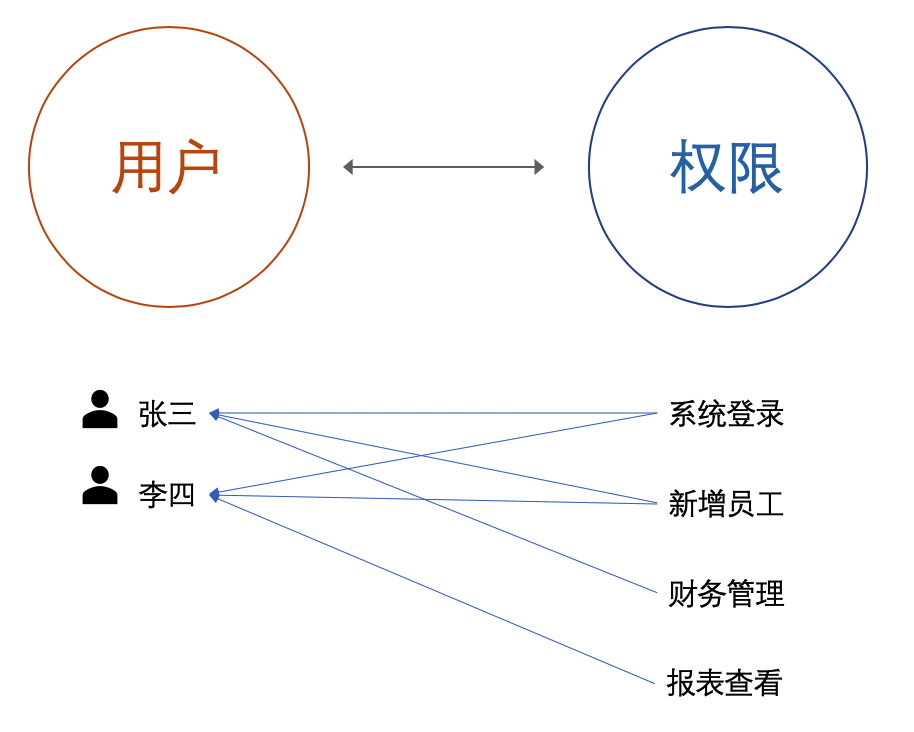

系统页面Demo：

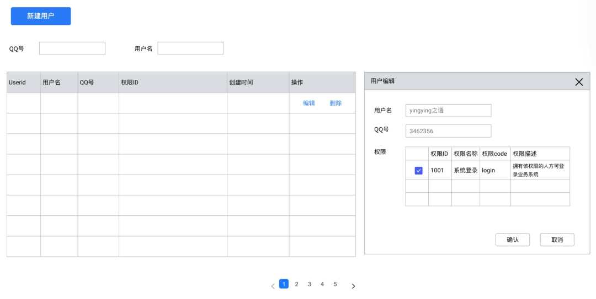


### 用户-角色-权限

若系统用户和功能增多，为每一个用户匹配单独的权限，会变得非常的繁琐，因此权限分门别类，形成“权限包”。从用户的角度，将用户分类，同一类用户固定为相同的角色，赋予相同的权限，会让操作变得简单很多。

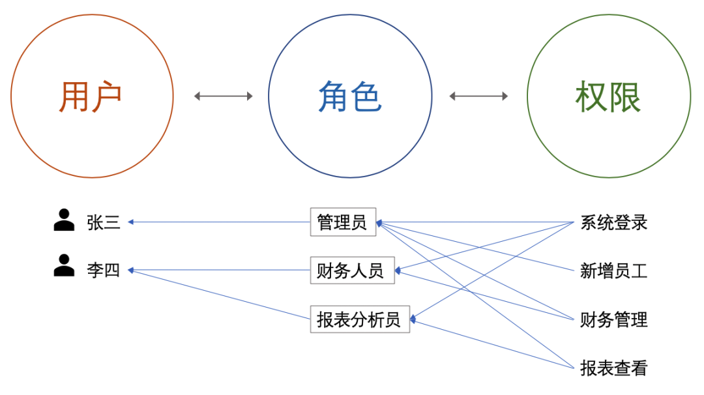

系统页面Demo：

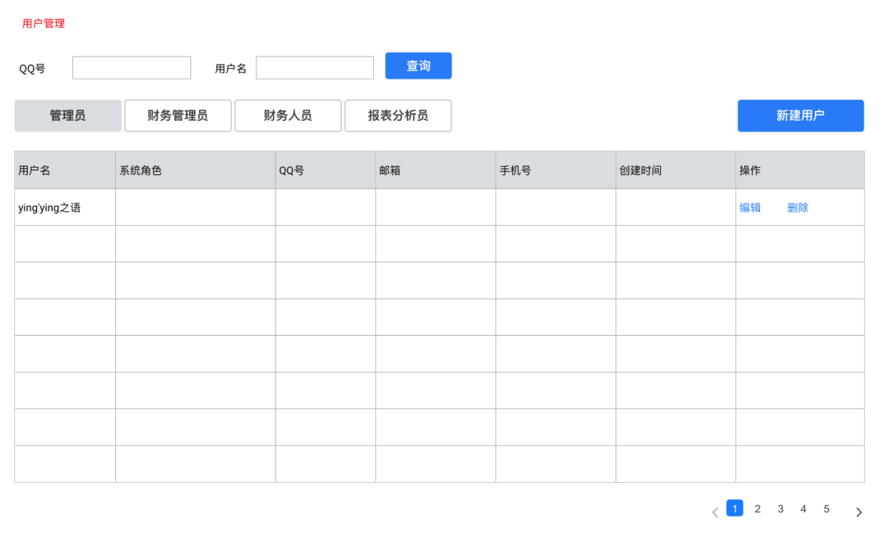

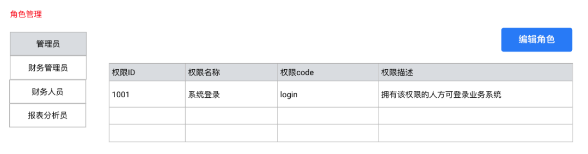


### 组织-用户-角色-权限

对于管理性后台，往往人员是职级区分的，比如用户王五为销售组长，其组员赵六和孙七，王五需要看到赵六和孙七的销售额数据和可以进行赵六和孙七的所有操作，而赵六仅能看到自己的销售额数据，进行和自己相关的操作。这个事例中引入了两个新的概念：

- **用户的权限可以细分为功能权限和数据范围权限**
- **数据范围和功能权限都有了继承的层级概念**

所谓功能权限大家比较好理解，比如能否看到某个页面，能否点击某个按钮。而数据权限略抽象些，比如在业绩报表模块，从功能权限角度，可以决定用户能否打开这个报表页面，但是不同用户进来看到不同的数据（王五需要看到赵六和孙七的销售额数据，而赵六仅能看到自己的销售额数据，看不到孙七的），则是由数据范围来控制的。


#### 数据范围的继承

我们可以将用户进行分级管理，比如建立多层级的组织架构树，将不同用户放置于组织架构的不同根节点上，来实现多层级用户的建立和管理。

- 如果用户的层级如果比较简单（不多于三级），可以将层级关系融入到角色之中。比如用户分为三级：管理员-组长-组员，管理员能看到全部的数据范围和拥有全部的功能权限，而组长能查看组员的数据范围和拥有部分功能权限（比如无法编辑用户），而组员的数据范围仅仅为自己负责的数据和拥有部分功能权限。

  我们可以在组长这个角色下，允许其绑定组员，针对不同的角色设置不同的数据范围读取方式，管理员可以读取全部数据范围，组长需要读取其组员的，组员只能读取自己的。大家有兴趣可以去了解下RBAC0/1模型

  

- 而对于用户层级较多的情况，建议采用多层级的组织架构的管理模式，先建立公司的组织部门，再将人置于组织架构树的不同节点之下。以用户在组织节点的位置，以及是否为某个节点组织的负责人，来确定其数据范围。


#### 功能权限的继承

一般是将角色进行分级，有了所谓的角色树的概念：

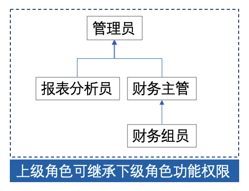

由此，我们就得到了自由度更高但是逻辑更复杂的权限管理：

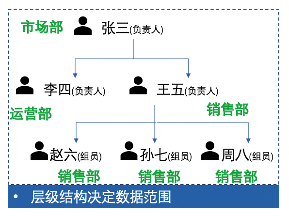

涉及到组织架构树和角色树，需要考虑到的场景更多，这些细节要根据实际的业务场景来制定方案。比如：

- 组织有成立和解散的时间，员工也存在转岗换组织部门的情况，因此要考虑引入时间轴的概念。增加很多的校验逻辑，比如需要增加员工入职、离职时间，且员工在该部门任职的时间不能早于部门成立的时间等等
- 同一员工能否兼岗，允许在多个组织下存在
- 角色上是否会有互斥情况存在（RBAC-2模型），比如实际业务中，发钞和验钞的工作不允许同一个人做，因此在功能设计时要考虑角色之间的互斥性，通过为用户配置角色来实现用户与权限的映射关系，不同权限间是存在优先级的，比如刚刚的例子，互斥关系为最高优先级

实体关系图 ：

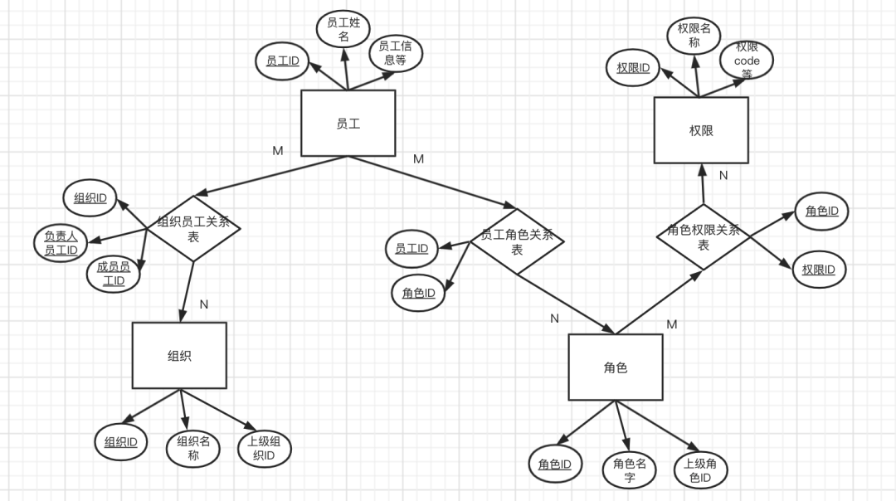

系统页面Demo：

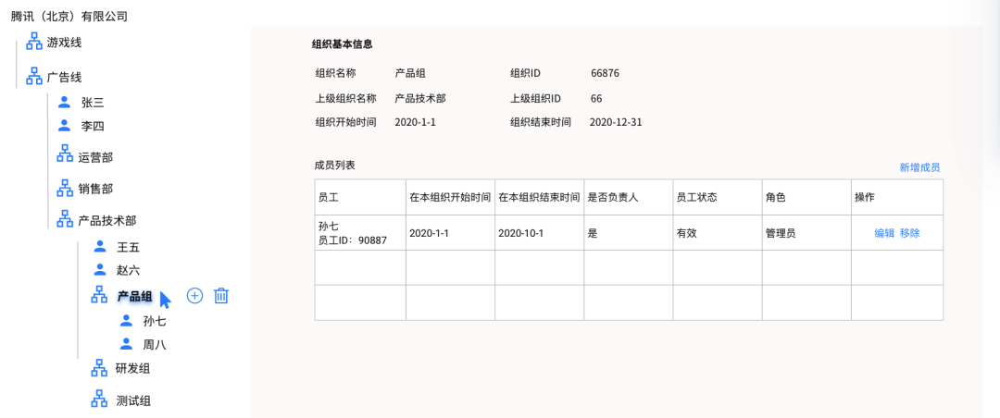


## RBAC

RBAC是一套成熟的权限模型。在传统权限模型中，我们直接把权限赋予用户。而在RBAC中，增加了“角色”的概念，我们首先把权限赋予角色，再把角色赋予用户。这样，由于增加了角色，授权会更加灵活方便。在RBAC中，根据权限的复杂程度，又可分为RBAC0、RBAC1、RBAC2、RBAC3。其中，RBAC0是基础，RBAC1、RBAC2、RBAC3都是以RBAC0为基础的升级。我们可以根据自家产品权限的复杂程度，选取适合的权限模型。

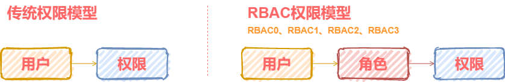

### 基本模型RBAC0

RBAC0是基础，很多产品只需基于RBAC0就可以搭建权限模型了。在这个模型中，我们把权限赋予角色，再把角色赋予用户。用户和角色，角色和权限都是多对多的关系。用户拥有的权限等于他所有的角色持有权限之和。

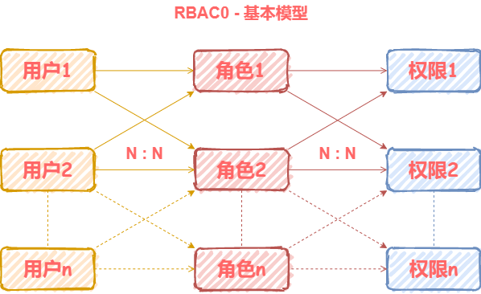


### 角色分层模型RBAC1

RBAC1建立在RBAC0基础之上，在角色中引入了继承的概念。简单理解就是，给角色可以分成几个等级，每个等级权限不同，从而实现更细粒度的权限管理。


### 角色限制模型RBAC2

RBAC2同样建立在RBAC0基础之上，仅是对用户、角色和权限三者之间增加了一些限制。这些限制可以分成两类，即静态职责分离SSD(Static Separation of Duty)和动态职责分离DSD(Dynamic Separation of Duty)。具体限制如下图：

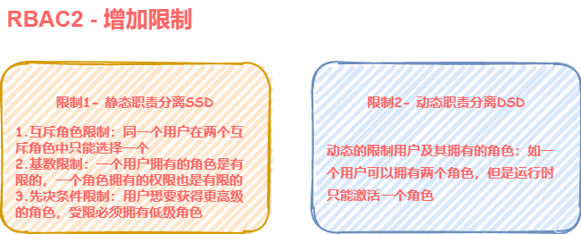


### 统一模型RBAC3

RBAC3是RBAC1和RBAC2的合集，所以RBAC3既有角色分层，也包括可以增加各种限制。

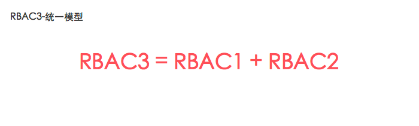


### 延展用户组

基于RBAC模型，还可以适当延展，使其更适合我们的产品。譬如增加用户组概念，直接给用户组分配角色，再把用户加入用户组。这样用户除了拥有自身的权限外，还拥有了所属用户组的所有权限。


# 订单支付

## 系统设计

### 业务关系

订单系统与各业务系统的关系：

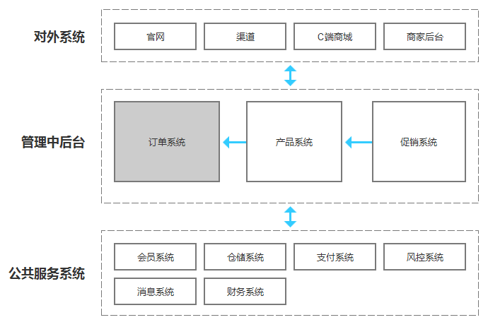

- **对外系统**

  所有给企业外部用户使用的系统都在这一层，包括官网、普通用户使用的C端，还包括给商户使用的商家后台和在各个销售渠道进行分销的系统，比如与银行信用卡中心合作、微信合作在合作商的平台露出本企业的产品。这类系统站在与客户接触的最前线，是公司实现商业模式的桥头堡。

- **管理中后台**

  每个C端的业务形态都会有一个对应的系统模块，如负责管理平台交易的订单系统，管理优惠信息的促销系统，管理平台所有产品的产品系统，以及管理所有对外系统显示内容的内容系统等。

- **公共服务系统**

  随着企业的发展，信息化建设到达一定程度后，企业需要将通用功能服务化、平台化，以保证应用架构的合理性，提升服务效率。这类系统主要给其他应用系统提供基础服务能力支持。


### 上下游关系

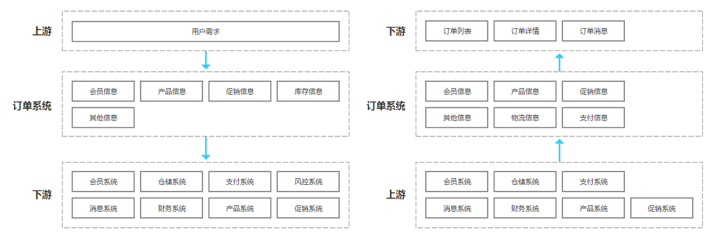

由此可见，订单系统对上接收用户信息，将用户信息转化为产品订单，同时管理并跟踪订单信息和数据，承载了公司整个交易线的重要对客环节。对下则衔接产品系统、促销系统、仓储系统、会员系统、支付系统等，对整个电商平台起着承上启下的作用。


### 业务架构

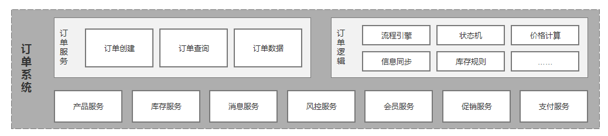

- **订单服务**

  该模块的主要功能是用户日常使用的服务和页面，主要有订单列表、订单详情、在线下单等，还包括为公共业务模块提供的多维度订单数据服务。

- **订单逻辑**

  订单系统的核心，起着至关重要的作用，在订单系统负责管理订单创建、订单支付、订单生产、订单确认、订单完成、取消订单等订单流程。还涉及到复杂的订单状态规则、订单金额计算规则以及增减库存规则等。在4节核心功能设计中会重点来说。

- **底层服务**

  信息化建设达到一定程度的企业，一般会将公司公共服务模块化，比如：产品，会构建对应的产品系统，代码、数据库，接口等相对独立。但是，这也带来了一个问题，比如：订单创建的场景下需要获取的信息分散在各个系统。

  如果需要从各个公共服务系统调用：一是会花费大量时间，二是代码的维护成本非常高。因此，订单系统接入所需的公共服务模块接口，在订单系统即可完成对接公共系统的服务。


## 流程设计

### 订单流程

订单流程主要是订单产生到交易结束的整个流程，按照现在电子商城（E-mall），仓库管理（WMS），物流管理系统（TMS）的流转过程主要如下图：

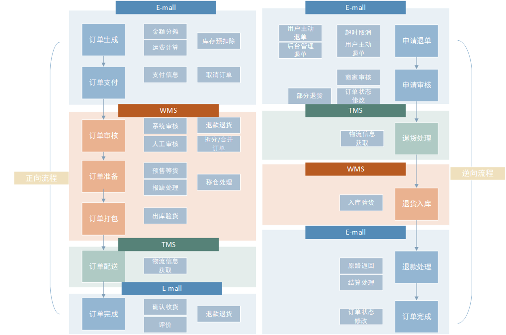


### 正向流程

**订单创建>订单支付>订单生产>订单确认>订单完成**


### 逆向流程

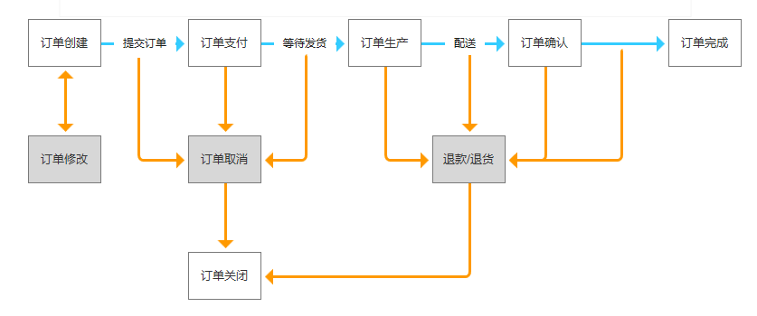

上面说到逆向流程是各种修改订单、取消订单、退款、退货等操作，需要梳理清楚这些流程与正向流程的关系，才能理清订单系统完整的订单流程。

- **订单修改**：可梳理订单内信息，根据信息关联程度及业务诉求，设定订单的可修改范围是什么，比如：客户下单后，想修改收货人地址及电话。此时只需对相应数据进行更新即可。

- **订单取消**：用户提交订单后没有进行支付操作，此时用户原则上属于取消订单，因为还未付款，则比较简单，只需要将原本提交订单时扣减的库存补回，促销优惠中使用的优惠券，权益等视平台规则，进行相应补回。

- **退款**：用户支付成功后，客户发出退款的诉求后，需商户进行退款审核，双方达成一致后，系统应以退款单的形式完成退款，关联原订单数据。因商品无变化，所以不需考虑与库存系统的交互，仅需考虑促销系统及支付系统交互即可。

- **退货**：用户支付成功后，客户发出退货的诉求后，需商户进行退款审核，双方达成一致后，需对库存系统进行补回，支付系统、促销系统以退款单形式完成退款。最后，在退款/退货流程中，需结合平台业务场景，考虑优惠分摊的逻辑，在发生退款/退货时，优惠该如何退回的处理规则和流程。


## 关键设计

### 订单信息

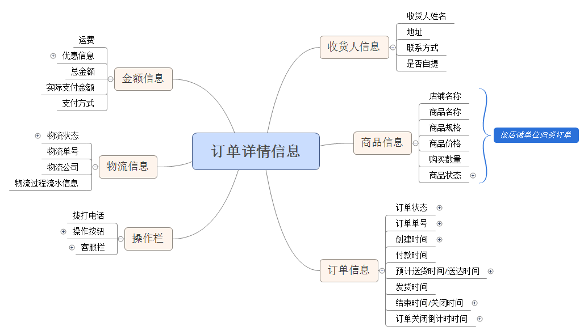


### 订单单号

订单单号是订单信息中的主Key，代表了该订单的唯一性，并且使用在仓库管理系统中，WMS作为拆分合并订单中与电子商城中的订单关联的Key值。订单单号一般组成方式有以下两种：

- **日期时间+随机数字**
  - 初期业务量不多的时候20-26位足够应付
  - **yyyyMMddHHmmss（年月日时分秒） + 6位随机码**
  - 6位随机码表示一秒钟可能生成的订单数上，存在一百万分之一的随机并发相同导致下单失败，因此在初期业务每秒下单量不高的时候选择这种简单的方法足够满足需求

- **日期时间+自增**
  - 不会产生随机数生成冲突
  - 注意防治被查看到销售量需要将数字加密设置


### 倒计时时间

订单里面显示倒计时有：

- **下单未支付**

  - 商品下单后开始倒计时，一定时间内如果还未下单则超时关闭订单
  - 普通商品一般采取3天时间，特价商品根据情况一般采取的是30分钟，快消品一般采用的15分钟

- **已发货确认收货倒计时**

  商品一般是发货开始后开始倒计时10天时间，O2O商品应该是送达即收货。

  - 满1天记录1天 XX天hh小时mm分钟
  - 小于1天小时则hh小时mm分钟ss秒

  防止发货时间过长，发货后用户可以采用一次延长收货，商家/平台端则可以多次**延长收货**。


### 扣减库存

用户下单后，系统需要生成订单，此时需要先获取下单中涉及的商品信息，然后获取该商品所涉及到的优惠信息，如果商品不参与优惠信息，则无此环节。扣减库存规则是指订单中的商品，何时从仓储系统中对相应商品库存进行扣除。方式各有优缺点，需结合实际场景进行考虑，如：秒杀、抢购、促销活动等，可使用下单减库存的方式。而对于产品库存量大，并发流量没有那么强的产品使用付款减库存的方式。


**秒杀场景下如何扣减库存？**

- **采用下单减库存**

  因秒杀场景下，大部分用户都是想直接购买商品的，可以直接用下单减库存。大量用户和恶意用户都是同时进行的，区别是正常用户会直接购买商品，恶意用户虽然在竞争抢购的名额，但是获取到的资格和普通用户一样，所以下单减库存在秒杀场景下，恶意用户下单并不能造成之前说的缺点。而且下单直接扣减库存，这个方案更简单，在第一步就扣减库存了。

- **Redis 缓存**

  查询缓存要比查询数据库快，所以将库存数放在缓存中，直接在缓存中扣减库存。如果并发很高，还可以采取分布式锁的方案。

- **限流**

  秒杀场景中，对请求做了很多限流操作，如前端页面的限流和后端令牌桶限流，真正到扣减库存时，请求数很少了。


#### 下单减库存

即用户下单成功时减少库存数量。

**优势**：用户体验友好，系统逻辑简洁。

**缺点**：会导致恶意下单或下单后却不买，使得真正有需求的用户无法购买，影响真实销量。


**解决办法**

- **设置订单有效时间**：若订单创建成功N分钟不付款，则订单取消，库存回滚
- **限购**：用各种条件来限制买家的购买件数，比如一个账号、一个ip，只能买一件
- **风控**：从技术角度进行判断，屏蔽恶意账号，禁止恶意账号购买


#### 付款减库存

即用户支付完成并反馈给平台后再减少库存数量。

**优势**：减少无效订单带来的资源损耗。

**缺点**：因第三方支付返回结果存在时差，同一时间多个用户同时付款成功，会导致下单数目超过库存，商家库存不足容易引发断货和投诉，成本增加。


**解决办法**

- 付款前再次校验库存，如确认订单要付款时再验证一次，并友好提示用户库存不足
- 增加提示信息：在商品详情页，订单步骤页面提示不及时付款，不能保证有库存等


#### 预扣库存

下单页面显示最新的库存，下单后保留这个库存一段时间（比如10分钟），超过保留时间后，库存释放。若保留时间过后再支付，如果没有库存，则支付失败。

**优势**：结合下单减库存的优点，实时减库存，且缓解恶意买家大量下单的问题，保留时间内未支付，则释放库存。

**缺点**：保留时间内，恶意买家大量下单将库存用完。并发量很高的时候，依然会出现下单数超过库存数。


### 恶意下单

如何解决恶意买家下单的问题？这里的恶意买家指短时间内大量下单，将库存用完的买家。

- **限制用户下单数量**

  **优点**：限制恶意买家下单

  **缺点**：用户想要多买几件，被限制了，会降低销售量

- **标识恶意买家**

  通过标识用户设备id或会员id，将用户加入黑名单，不足之处是有些用户是模拟的，识别不出来是不是真正的恶意买家。


### 支付失败

如何解决下单成功而支付失败（库存不足）的问题？

- **备用库存**

  **优点**：缓解部分用户支付失败的问题。

  **缺点**：备用库存只能缓解问题，不能从根本上解决问题。另外备用库存针对普通商品可以，针对特殊商品这种库存少的，备用库存量也不会很大，还是会出现大量用户下单成功却因库存不足而支付失败的问题。


### 库存超卖

如何解决高并发下库存超卖的场景？库存超卖最简单的解释就是多成交了订单而发不了货。

**场景**：用户 A 和 B 成功下单，在支付时扣减库存，当前库存数为 10。因 A 和 B 查询库存时，都还有库存数，所以 A 和 B 都可以付款。

A 和 B 同时支付，A 和 B 支付完成后，可以看做两个请求`回调`后台系统扣减库存，有两个线程处理请求，两个线程查询出来的库存数 `inventory = 10`。

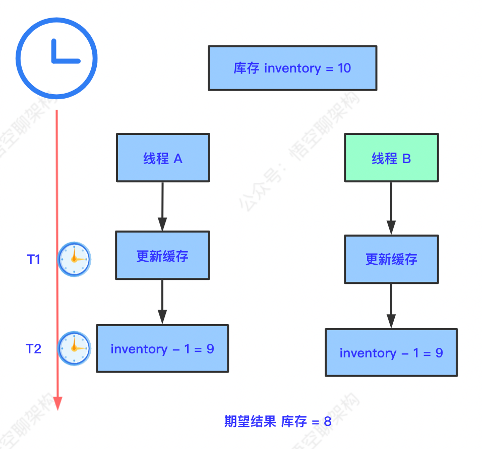

A 线程更新最终库存数 ：lastInventory = inventory - 1 = 9，

B 线程更新库存数： lastInventory = inventory - 1 = 9。

而实际最终的库存应是 8 才对，这样就出现库存超卖的情况，而发不出货。那如何解决库存超卖的情况呢？以下方案都是基于数据库层面的。

- **方案一：SQL语句直接更新库存，而不是先查询出来，然后赋值**

  ```mysql
  UPDATE [库存表] SET 库存数 - 1
  ```

- **方案二：SQL语句更新库存时，如果扣减库存后，库存数为负数，直接抛异常，利用事务的原子性进行自动回滚。**

- **方案三：利用SQL语句更新库存，防止库存为负数**

  ```mysql
  UPDATE [库存表] SET 库存数 - 1 WHERE 库存数 - 1 > 0
  ```

  如果影响条数大于1，则表示扣减库存成功，否则不更新库存，并退款。


### 订单拆分

用户支付完订单后，需要获取订单的支付信息，包括支付流水号、支付时间等。支付完订单接着就是等商家发货，但在发货过程中，根据平台业务模式的不同，可能会涉及到订单的拆分。订单拆分一般分两种：

- 一种是用户挑选的商品来自于不同渠道（自营与商家，商家与商家）
- 另一种是在SKU层面上拆分订单：不同仓库，不同运输要求的SKU，包裹重量体积限制等因素需要将订单拆分


### 异步处理

随着公司的发展你可能会发现你项目的**请求链路越来越长**，例如刚开始的电商项目，可以就是粗暴的扣库存、下单。慢慢地又加上积分服务、短信服务等。这一路同步调用下来客户可能等急了，这时候就是消息队列登场的好时机。

**调用链路长、响应就慢了**，并且相对于扣库存和下单，积分和短信没必要这么的 “及时”。因此只需要在下单结束那个流程，扔个消息到消息队列中就可以直接返回响应了。而且积分服务和短信服务可以并行的消费这条消息。可以看出消息队列可以**减少请求的等待，还能让服务异步并发处理，提升系统总体性能**。

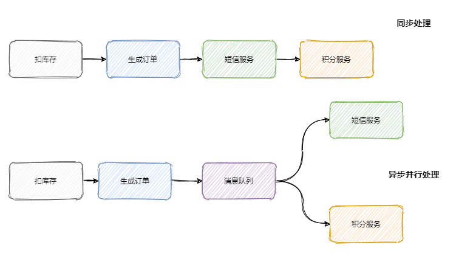


### 服务解耦

上面我们说到加了积分服务和短信服务，这时候可能又要来个营销服务，之后领导又说想做个大数据，又来个数据分析服务等等。所以一般会选用消息队列来解决系统之间耦合的问题，订单服务把订单相关消息塞到消息队列中，下游系统谁要谁就订阅这个主题。

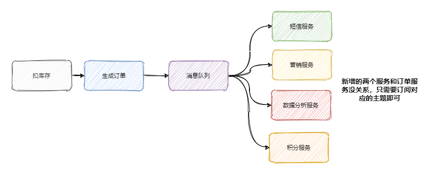


### 流量控制

后端服务相对而言都是比较弱的，因为业务较重，处理时间较长。如秒杀活动爆发式流量打过来可能就顶不住了，因此需要引入一个中间件来做缓冲，基于消息队列实现削峰填谷功效。

- 网关的请求先放入消息队列中，后端服务尽自己最大能力去消息队列中消费请求。超时的请求可以直接返回错误
- 当然还有一些服务特别是某些后台任务，不需要及时地响应，并且业务处理复杂且流程长，那么过来的请求先放入消息队列中，后端服务按照自己的节奏处理

上面两种情况分别对应着生产者生产过快和消费者消费过慢两种情况，消息队列都能在其中发挥很好的缓冲效果。

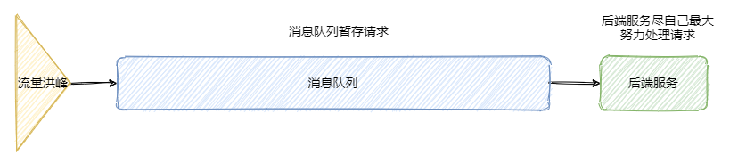


## 异常设计

### 超时关闭

下单后发布延迟消息至MQ，等延迟时间到后，MQ会通知应用该消息，然后检查是否已被支付，未被支付则关闭超时订单。


### 重复支付

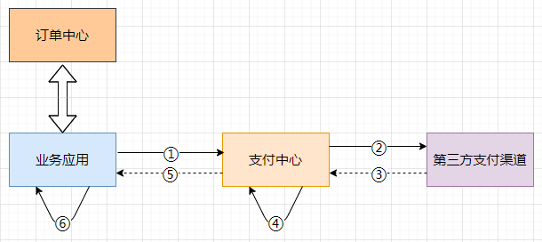

如图是一个简化的下单流程，首先是提交订单，然后是支付。支付的话，一般是走支付网关（支付中心），然后支付中心与第三方支付渠道（微信、支付宝、银联）交互，支付成功以后，异步通知支付中心，支付中心更新自身支付订单状态，再通知业务应用，各业务再更新各自订单状态。

这个过程中经常可能遇到的问题是掉单，无论是超时未收到回调通知也好，还是程序自身报错也好，总之由于各种各样的原因，没有如期收到通知并正确的处理后续逻辑等等，都会造成用户支付成功了，但是服务端这边订单状态没更新，这个时候有可能产生投诉，或者用户重复支付。

由于③⑤造成的掉单称之为外部掉单，由④⑥造成的掉单我们称之为内部掉单。为了防止掉单，这里可以这样处理：

- 支付订单增加一个中间状态“支付中”，当同一个订单去支付的时候，先检查有没有状态为“支付中”的支付流水，当然支付（prepay）的时候要加个锁。支付完成以后更新支付流水状态的时候再讲其改成“支付成功”状态
- 支付中心这边要自己定义一个超时时间（比如：30秒），在此时间范围内如果没有收到支付成功回调，则应调用接口主动查询支付结果，比如10s、20s、30s查一次，如果在最大查询次数内没有查到结果，应做异常处理
- 支付中心收到支付结果以后，将结果同步给业务系统，可以发MQ，也可以直接调用，直接调用的话要加重试（比如：SpringBoot Retry）
- 无论是支付中心，还是业务应用，在接收支付结果通知时都要考虑接口幂等性，消息只处理一次，其余的忽略
- 业务应用也应做超时主动查询支付结果

对于上面说的超时主动查询可以在发起支付的时候将这些支付订单放到一张表中，用定时任务去扫。

为了防止订单重复提交，可以这样处理：

**创建订单的时候，用订单信息计算一个哈希值，判断redis中是否有key，有则不允许重复提交，没有则生成一个新key，放到redis中设置个过期时间，然后创建订单。其实就是在一段时间内不可重复相同的操作。**

附上微信支付最佳实践：

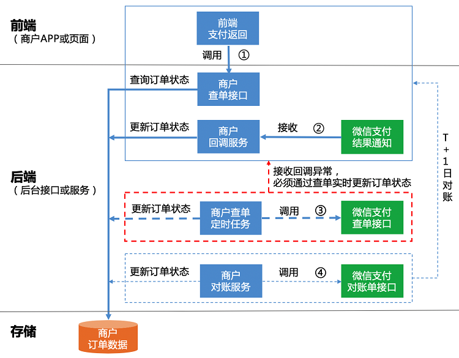


### 支付对账

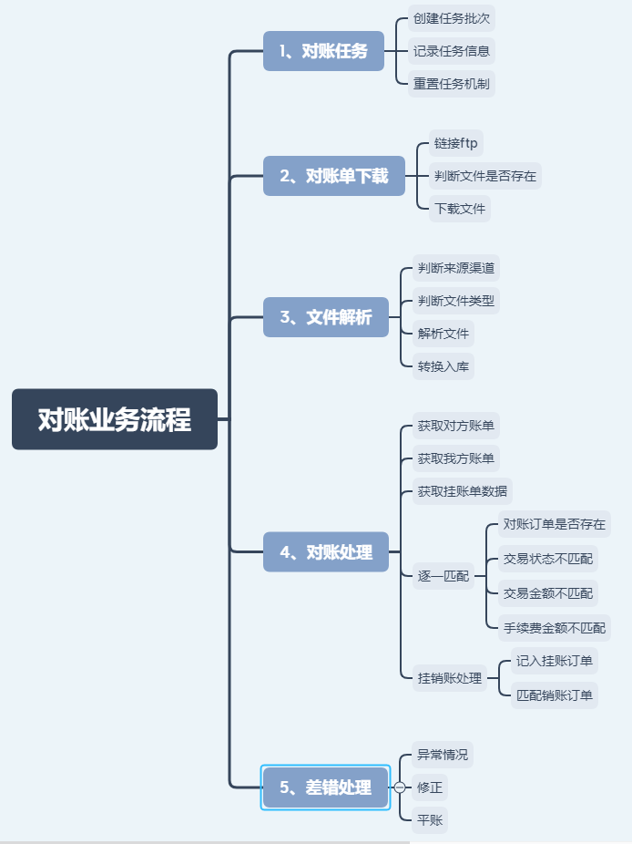


### 支付掉单

一个最常见的支付平台架构关系如下所示：

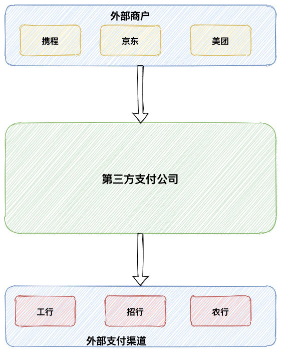

上图我们是站在第三方支付公司支付角度，如果是自己公司的内部支付系统，那么外部商户这一块其实就是公司内部一些系统，比如说订单系统，而外部支付渠道其实就是第三方支付公司。我们以携程为例，在其上面发起一笔订单支付，将会经过三个系统：

- 携程创建订单，向第三方支付公司发起支付请求
- 第三方支付公司创建订单，并向工行发起支付请求
- 工行完成扣款操作，返回第三方支付公司
- 第三方支付完成订单更新并返回携程
- 携程变更订单状态

上面的流程，简单如下图所示：

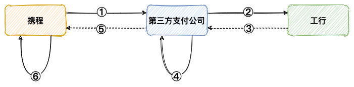

在这个过程就可能会碰到，用户工行卡已经扣款，但是携程订单却还是待支付，我们通常将这种情况称为「掉单」。上述掉单的场景，多数是因为「③、⑤」环节信息丢失导致，这种掉单我们将其称为「外部掉单」。还有一种极少数的情况，收到 「③、⑤」环节返回信息，但是在「④、⑥」环节内部系统更新订单状态失败，从而导致丢失支付成功的信息，这类掉单由于是内部问题，我们通常将其称之为「内部掉单」。


#### 外部掉单

外部掉单是因为没有收到对端返回信息，这种情况极有可能是网络问题，也有可能对端处理逻辑太慢，导致我方请求超时，直接断开了网络请求。

**① 增加超时时间**

适当的增加超时时间，在增加网络超时时间之后，可能还需要调整整个链路的超时时间，不然有可能导致整个链路内部超时从而引起内部掉单。

**注意**：对接外部渠道，一定要「设置网络连接超时时间与读取超时时间」。

**② 接收异步通知**

接收渠道异步回执通知信息，一般来说，现在支付渠道接口都可以上送一个异步回调地址，当渠道端处理成功，将会把成功信息通知到这个回调地址上。这种情况下，只需要接收通知信息，然后解析，再更新内部订单状态。

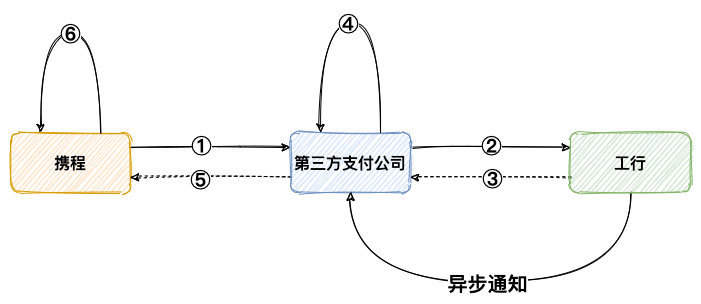

**注意**

- 对于异步请求信息，一定需要对通知内容进行签名验证，并校验返回的订单金额是否与商户侧的订单金额一致，防止数据泄漏导致出现“假通知”，造成资金损失
- 异步通知将会发送多次，所以异步通知处理需要幂等

**③ 掉单查询**

有的渠道可能没有提供异步通知的功能，只提供了订单查询的接口，这种情况下，只能使用定时掉单查询解决。可以将这类超时未知的订单的单独保存到掉单表，然后定时向渠道端查询订单的状态。若查询成功或者明确失败（比如订单不存在等），可以更新订单状态，并且删除掉单表记录；若查询依旧未知，这时我们需要等待下次查询的结果。

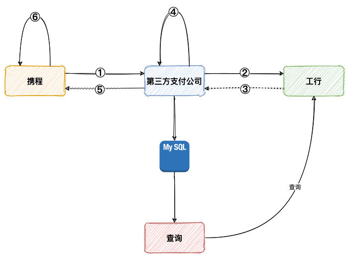

**注意**：有些情况下，有可能无法查询返回订单的状态，所以需要设置订单查询的最大次数，防止无限查询浪费性能。

**④ 对账**

最后，极少数的情况下，订单查询与异步通知都无法获取的支付结果，这就只能进行对账处理。如果第二天渠道端给的对账文件有这一笔支付结果，那么可以根据这个记录更新直接更新内部支付记录。

**注意**：稳妥一点，可以先发起查询，然后根据查询结果更新订单记录。不过有些极端情况，查询无法获取结果，那么直接更新内部记录即可。那如果第二天也没有这笔记录的结果，这种情况下，我们可以认为这笔是失败的。如果用户被扣款，渠道端内部将会发起退款，将支付金额返回给用户。所以这种情况可以无需处理。


#### 内部掉单

**① 支付公司内部订单关系**

如下图所示，第三方支付公司内部表通常为支付订单与渠道订单这样一种 1 比 N 的关系：

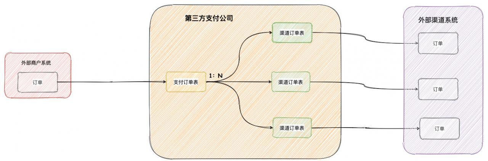

**渠道订单**代表着第三方支付公司与外部渠道的关系，其实对**外部渠道系统**来讲，第三方支付公司就是一个外部商户。如果使用上图 1 对1 的订单关系，当第一次支付支付失败，外部商户可能会再次使用相同订单号对第三方支付公司发起支付。

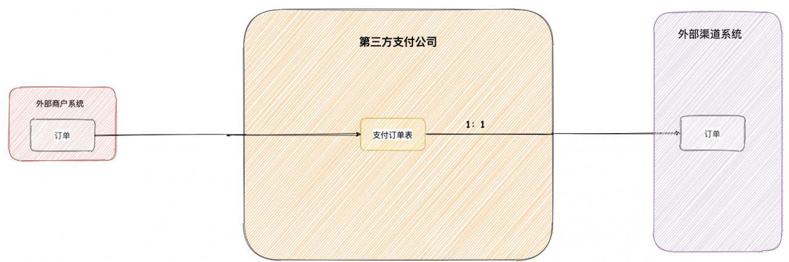

如果第三方支付公司也拿相同的内部订单去请求外部渠道系统，有可能外部渠道系统并不支持同一订单号再次请求。但是现实的情况，很多外部商户并不是那么容易更换生成新的订单号，所以一般第三方支付公司都需要支持同一外部商户订单号在未成功的情况下，支持重复支付。在这种情况下，就需要我们上面的 1:N 的订单关系图了。


**② 内部掉单异常的原因**

当收到外部渠道系统的成功的返回信息，成功更新了渠道订单表的记录。但是由于渠道订单表与支付订单表可能不是同一个数据库，也有可能两者并不在同一个应用中，这就有可能导致更新支付订单表的更新失败。

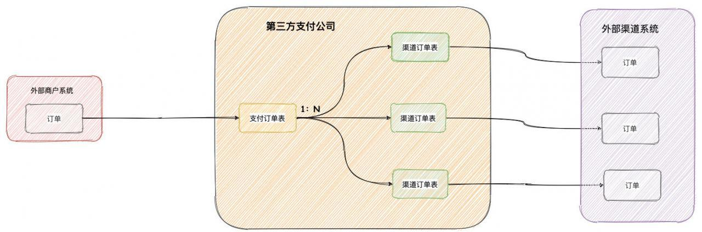

由于支付订单是表保存着外部商户订单与内部订单关系，支付订单未成功，所以外部商户也无法查询得到成功的支付结果。

此时渠道订单表已经成功，所以上面外部掉单的方法并不适用内部掉单。


**内部掉单异常解决办法：**

- **分布式事务**

  内部掉单异常，说白就是因为支付订单表与渠道订单表无法使用数据库事务保证两者同时更新成功或失败。

- **异步补偿更新**

  当发生内部掉单的情况，即更新支付订单失败等情况，可以将这里支付订单保存（无法保证绝对成功）到一张内部掉单表。所以还需要定时查询，查询一段时间内支付订单未成功，而渠道订单表已成功的支付订单记录，然后也将其插入到内部掉单表。另一个系统应用，只需要定时扫描内部掉单表，将支付订单成功，然后再删除内部掉单记录即可。

**注意**：当支付订单表数据量很大后，定时查询可能会慢，为了防止影响主库，所以这类查询可以在备库进行。


#### 解决方案

支付掉单、卡单是支付过程中经常会碰到的事，可以采用异步补偿的方案，解决该问题。异步补偿方案可以采用如下两种：

- 定时轮询补偿方案
- 延迟消息补偿方案

定时轮询补偿方案实现起来比较简单，但是时效性稍差。而延迟消息补偿方案总体来说比较优秀，但是实现起来比较复杂。如果没有自定义的延迟时间的需求，可以直接采用 RocketMQ 延迟消息，简单快捷。另外**延迟队列**使用场景还是比较多，不仅仅能用在掉单补偿上，还可以用于支付关单等场景。所以有能力开发的团队，可以开发一个通用的延迟队列。


**方案一：定时轮询补偿方案**

**① 整体流程**

该方案主要采用定时任务，批量查询掉单记录，从而驱动查询具体支付结果，然后更新内部订单。整体方案流程图如下：

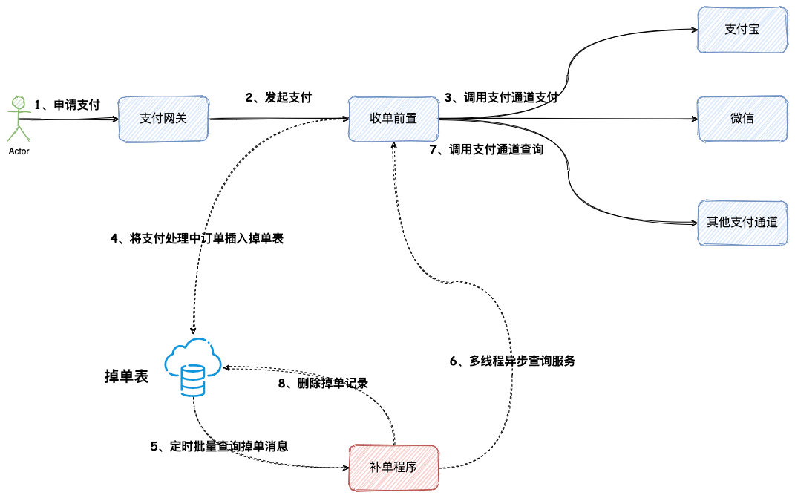

前三步流程没什么好说的，正常的支付流程，咱们针对后面几步具体详细说下。

第三步调用支付通道之后，如果支付通道端返回**支付受理成功或者支付处理中**，我们就需要调用第四步，将这类订单插入掉单表。如果支付直接成功了，那就正常流程返回即可。

> 复习一下，网关类支付，比如支付宝、微信支付、网银支付，这种支付模式，支付通道仅仅返回支付受理成功，具体支付结果需要接收支付通道端的支付通知，这类支付我们将其称为异步支付。相应的还有同步支付，比如银行卡支付，微信、支付宝代扣类支付，这类支付，同步就能返回支付结果。

第五步，补单应用将会定时查询数据库，批量查询掉单记录。

第六步，补单应用使用线程池，多线程异步的方式发起掉单查询。

第七步，调用支付通道支付查询接口。

重点来了，如果第七步支付结果查询为以下状态：

- **支付结果为扣款成功**
- **支付结果为明确失败**
- **掉单记录查询达到最大次数**

**第八步就会删除掉单记录。**

最后，如果掉单查询依旧还是处理中，那么经过一定的延时之后，重复第五步，再次重新掉单补偿，直到成功或者查询到达最大次数。

**② 相关问题**

**为什么需要新建一张掉单表？不能直接使用支付订单表，查询未成功的订单吗?**

这个问题，实际上确实可以直接使用的支付订单表，然后批量查询当天未成功的订单，补单程序发起支付查询。那为什么需要新建一张掉单表？主要是因为数据库查询效率问题，因为支付订单表每天都会大量记录新增，随着时间，这张表记录将会越来越多，越来越大。

**支付记录越多，批量范围查询效率就会变低，查询速度将会变慢**。所以为了查询效率，新建一张掉单表。这张表里仅记录支付未成功的订单，所以数据量就会很小，那么查询效率就会很高。另外，掉单表里的记录，不会被永久保存，只是临时性。当支付结果查询成功，或者支付结果明确失败，再或者查询次数到达规定最大次数，就会删除掉单记录。

**这就是第八步为什么需要删除掉单表的原因。**

如果需要保存每次掉单表查询详情，那么这里建议再新增一张掉单查询记录表，保存每一次的查询记录。针对这个方案，如果还有其他问题，欢迎留言。

**③ 方案优缺点**

定时轮询补偿方案，最大的优点可能就是系统架构方案比较简单，比较容易实施。那么这个方案的缺点主要在于**定时任务**上。定时任务轮询方案天然会存在以下不足：

- **轮询效率稍低**
- 每次查询数据库，已经被执行过记录，仍然会被扫描（补单程序将会根据一定策略决定是否发起支付通道查询），有**重复计算**的嫌疑
- **时效性不够好**，如果每小时轮询一次，最差的情况下，时间误差会达到1小时
- 如果为了解决时效性问题，增加定时任务查询效率，那么 1 中查询效率跟 2 的重复计算问题将会更加明显


**方案二：延迟消息补偿方案**

下面介绍另外一种掉单补偿方案，延迟消息补偿方案，这个方案整体流程与定时任务方案类似，最大区别可能在于，从一种**拉模式**变成一种**推模式**。

**① 整体流程**

整体方案流程图如下：

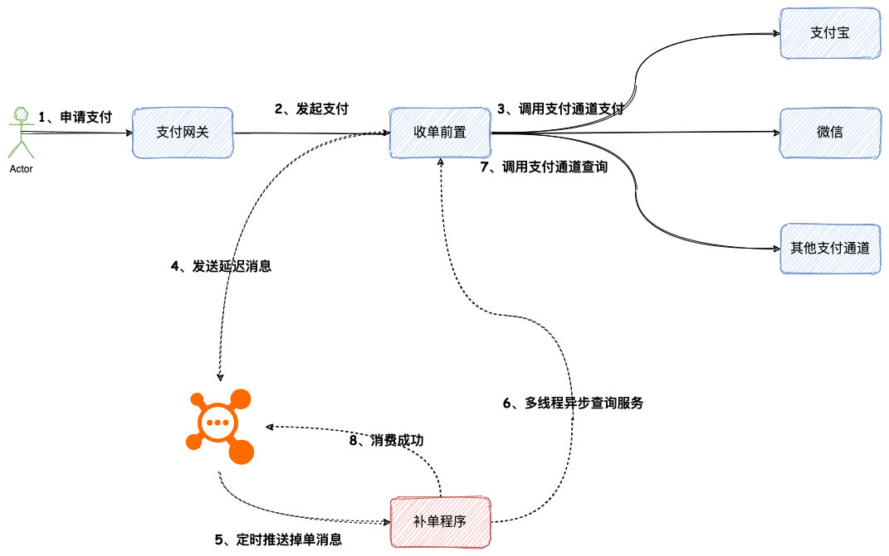

这个方案主要流程跟定时方案类似，主要区别在于第四步，第五步，第八步。

第四步的流程从插入掉单表变更为往**延迟队列发送掉单消息**。

第五步，补单程序接收掉单消息，然后触发支付掉单查询。

第八步，如果第七步支付结果查询为以下状态：

- 支付结果为扣款成功
- 支付结果为明确失败
- 掉单记录查询达到最大次数

补单程序将会告知延迟队列消费成功，延迟队列将会删除这条掉单消息。其他状态将会告知消费失效，延迟队列将会在一定延时之后，再次发送掉单消息，然后继续重复第五步。

**② 延迟队列**

这里的延迟队列需要自己实现，复杂度还是比较高的，这里给大家推荐几种实现方案：

第一种，基于 **Redis SortedSet** 实现延迟队列。可以参考一下有赞的实现方案https://tech.youzan.com/queuing_delay/

第二种，基于时间轮算法(**TimingWheel**)实现延迟队列，具体可以参考 Kafka 延时队列。

第三种，基于 **RocketMQ** 延迟消息。

前两种方案说起来还需要再开发，所以还是比较复杂的。这里重点说下第三种方案，该方案是 **RocketMQ** 已经支持的特性，开箱即用，使用起来还是比较简单的。RocketMQ 延迟消息支持 18 个等级，分别如下：

```properties
1s 5s 10s 30s 1m 2m 3m 4m 5m 6m 7m 8m 9m 10m 20m 30m 1h 2h
```

消息发送方可以通过Message.setDelayTimeLevel方式指定延迟等级，对应上方的延迟时间。消息消费方，如果消费失败，默认将会在消息发送方的的延迟等级基础上加 1。如果消息消费方需要指定其他的延迟等级，可以使用ConsumeConcurrentlyContext.setDelayLevelWhenNextConsume方式。RocketMQ 延迟消息，支持的特性还是比较基础、简单，不支持自定义延迟时间。不过对于掉单补偿的这个场景刚好够用，但是如果需要自定义延迟的，那还是得采用其他的方案。

**③ 方案优缺点**

延迟消息的方案相对于定时轮询方案来讲：

- 无需再查询全部订单，效率高
- 时效性较好

不过延迟消息这种方案，需要基于**延迟队列**，实现起来比较复杂，目前开源实现也比较少。


## 微信支付

### 前提条件

#### 公众号

微信公众号大体上可以分为服务号和订阅号。微信支付接入需要**已经完成微信认证的服务号**。如果是小程序的话，也需要完成**微信认证**。公众号可以关联同一主体的10个小程序，不同主体的3个小程序，如果是和公众号同一主体的小程序并且公众号已经完成认证，则直接可以在公众号后台的`小程序管理`中，进行快速注册并认证，这样就无需重复支付微信认证所需的`300`RMB了。

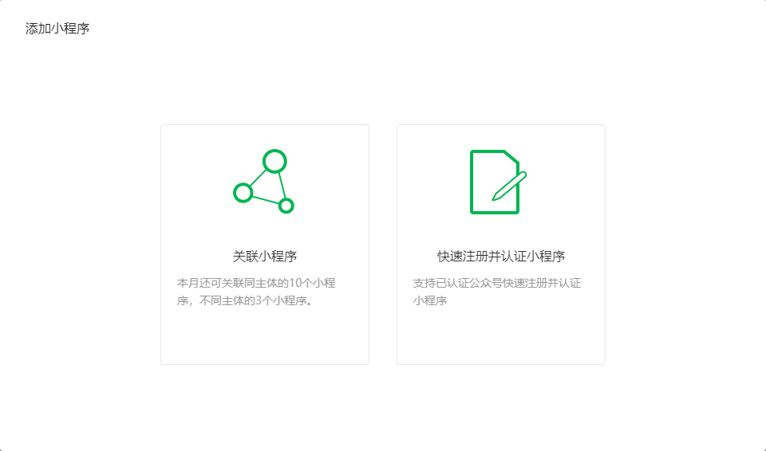


#### 微信商户平台

微信认证完成后，在公众号后台的 `微信支付` 中开通微信支付功能。提交微信支付申请后，3-5个工作日内，会进行审核，审核通过后会往你填写的邮箱里发送一份包含商户号信息的邮件，同时会往你填写的对公账户中打几毛钱的汇款，需要你查看具体金额后在商户平台中验证。

商户分为普通商户和服务商商户，千万不要申请错了。普通商户是可以进行交易，但是不能拓展商户。服务商可以拓展商户，但是不能交易。服务商就是提供统一的支付入口，它需要绑定具体的普通商户，微信支付时会在支付接口中携带普通商户参数，支付成功后金额会直接到具体的普通商户账户上。

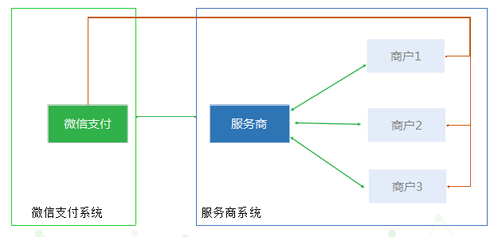

申请时直接申请**普通商户**就可以了。


#### 绑定商户

微信支付发起依赖于公众号、小程序等应用与商户号的绑定关系。因此在进行开发前，需要将商户与具体应用进行绑定。如果商户和需要绑定的AppID是同一主体，只需要以下步骤即可完成绑定。

- 在商户平台-产品中心-AppID账户管理中关联AppID，输入AppId申请绑定
- 在公众号或小程序后台微信支付-商户号管理中进行确认。

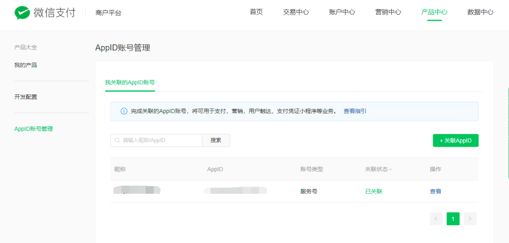

如果商户和需要绑定的AppID是不同主体，步骤和上述一样，除了输入AppId之外，还需要填入AppId的认证信息。

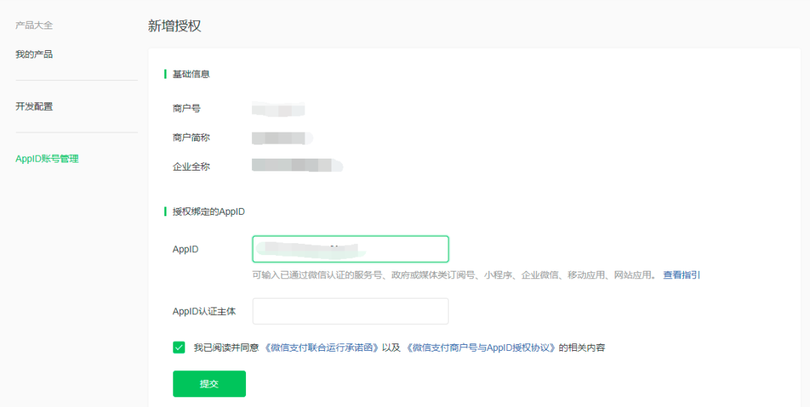


### 相关配置

#### 支付产品类型

- **付款码支付**

  用户打开微信钱包-付款码的界面，商户扫码后提交完成支付。

- **JSAPI支付**

  用户通过微信扫码，关注公众号等方式进入商家H5页面，并在微信内调用JSSDK完成支付。

- **Native支付**

  用户打开微信扫一扫，扫描商户的二维码后完成支付。

- **APP支付**

  商户APP中集成微信SDK，用户点击后跳转到微信内完成支付。

- **H5支付**

  用户在微信以外的手机浏览器请求微信支付的场景唤起微信支付。

- **小程序支付**

  用户在微信小程序中使用微信支付的场景。

- **刷脸支付**

  无需掏出手机，刷脸完成支付，适合线下各种场景。


在商户平台-产品中心-我的产品中申请开通支付产品。

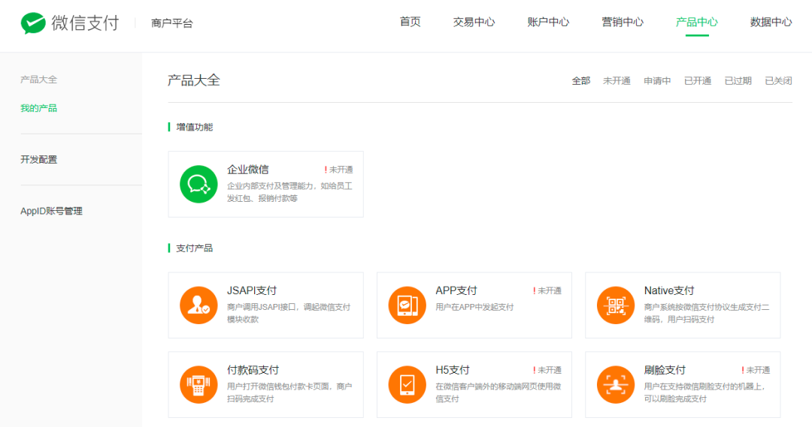


#### 支付授权目录配置

在商户平台-产品中心-开发配置中进行支付授权目录的配置（即你开发的下单接口地址），需要注意的是授权目录最多可以配置**五个**，在开发过程中请合理定义支付接口。

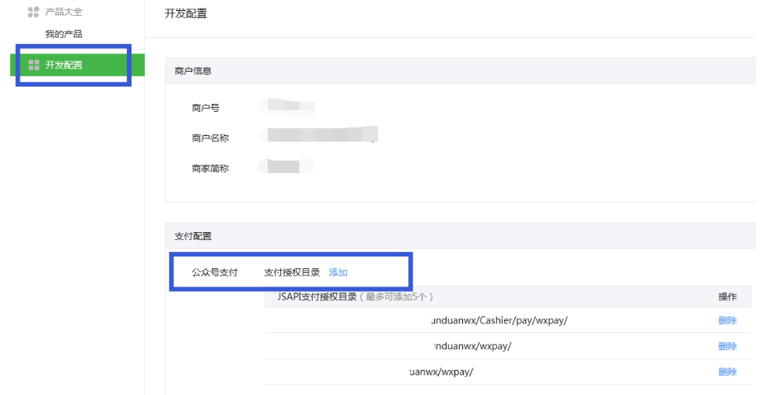


#### 配置商户密钥

在商户平台-账户中心-API安全中设置API密钥。

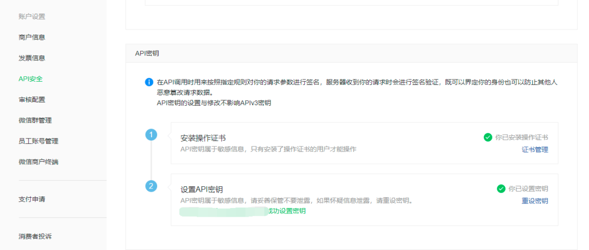

第一次设置时，需要安装操作证书，傻瓜式安装，按照提示一步一步操作就可以。API密钥需要一个**32位**的随机字符串，记得**不要随意更改API密钥**。

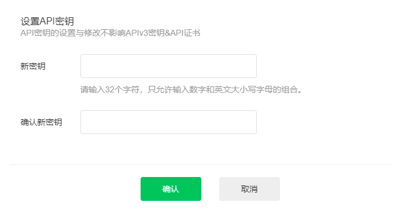

在微信API v3版本中，除了要配置API密钥外，还需要配置APIv3密钥和申请CA颁发的API证书。

- API v3密钥主要用于平台证书解密、回调信息解密
- API证书用于调用更高级别的api接口，包含退款、红包等接口

**如果使用开源的微信开发包，请了解是否支持v3版本**。


#### 配置服务器

在公众号后台-开发-基本配置-服务器配置中启用并填写服务器信息。

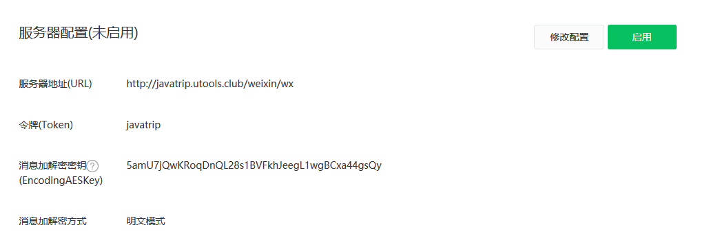


#### 白名单配置

在公众号后台-开发-基本配置-公众号开发信息中配置开发者密钥，同时填写IP白名单。

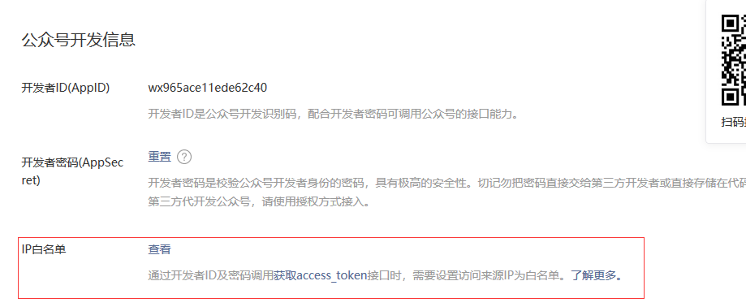


#### JS接口安全域名

在公众号后台-公众号设置-功能设置中设置JS接口安全域名。

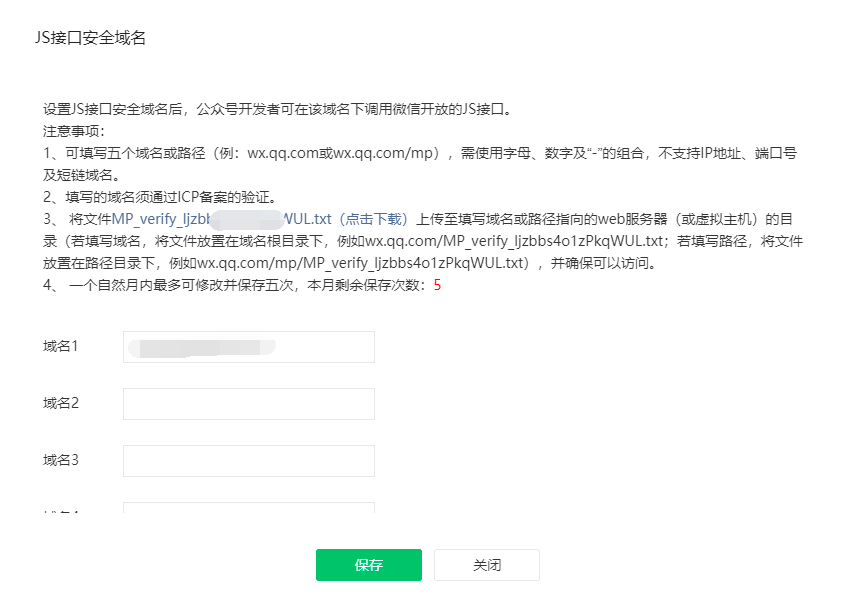

上面的配置是基于公众号支付配置的，小程序支付没有这么麻烦，小程序支付不用配置支付授权目录和授权域名。

|          | JSAPI      | 小程序 |
| :------- | :--------- | :----- |
| 支付协议 | HTTP/HTTPS | HTTPS  |
| 支付目录 | 有         | 无     |
| 授权域名 | 有         | 无     |


### 支付流程

由于微信升级了API接口，在API v3接口中，需要加载申请的API证书，微信已经封装了相关jar包，并且提供了加载示例，具体可参考“https://pay.weixin.qq.com/wiki/doc/apiv3/open/pay/chapter2_3.shtml”，这里就不再赘述。我们以API v2为例详细学习一下微信接入的主要流程（因为API v3的一些接口还在持续升级，v2接口相对完整）。

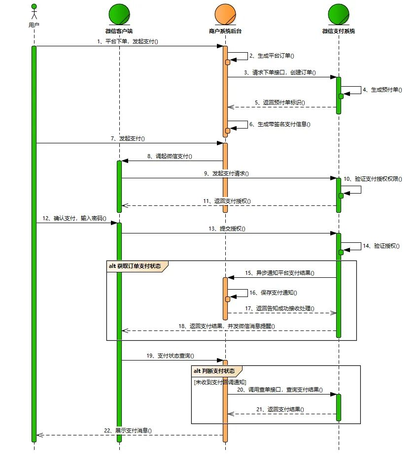

上面的这张图片来自微信开发文档，我们详细分析一下支付流程。


#### 微信下单接口

用户通过微信客户端发起支付，在商戶后台生成订单，然后调用微信下单接口，生成预支付订单，返回订单号！下单接口涉及到的主要参数，只列举重要的几个参数：

| 请求参数     | 是否必传 | 类型   | 描述                      |
| :----------- | :------- | :----- | :------------------------ |
| appid        | 是       | String | 公众号appid               |
| mch_id       | 是       | String | 商户号                    |
| nonce_str    | 是       | String | 随机字符串，32位以内      |
| sign         | 是       | String | 签名，默认使用MD5进行加密 |
| out_trade_no | 是       | String | 系统内部订单号            |
| total_fee    | 是       | Int    | 订单总金额，单位是分      |
| notify_url   | 是       | String | 支付结果通知接口          |

`sign` 的签名也比较通用，涉及了一个保证签名不可预测的`nonce_str：

- 将所有发送的非空参数使用字典排序生成键值对（key1=value1&key2=value2）
- 将商户平台密钥拼接在上述字符串的最后（"String"+&key=密钥）
- 将上述字符串采用MD5加密


#### 支付

拉起微信支付，输入密码，完成支付。这一步需要在H5网页中执行JS调起支付。需要以下参数，因此在预付订单返回时，需要将下列参数封装后响应给页面，由页面完成支付。

| 参数名    | 是否必传 | 类型   | 描述                            |
| :-------- | :------- | :----- | :------------------------------ |
| appId     | 是       | String | 公众号id                        |
| timeStamp | 是       | String | 当前时间戳                      |
| nonceStr  | 是       | String | 随机字符串                      |
| package   | 是       | String | 预支付订单，格式为prepay_id=*** |
| signType  | 是       | String | 签名类型，默认MD5               |
| paySign   | 是       | String | 签名                            |


签名和下单接口的签名方式一样。

JS伪代码如下：

```javascript

function onBridgeReady(){
    WeixinJSBridge.invoke(
        'getBrandWCPayRequest', {
            // 公众号ID，由商户传入
            "appId":"wx2421b1c4370ec43b",
            // 时间戳，自1970年以来的秒数
            "timeStamp":"1395712654",  
            // 随机串
            "nonceStr":"e61463f8efa94090b1f366cccfbbb444",
            "package":"prepay_id=u802345jgfjsdfgsdg888", 
            // 微信签名方式
            "signType":"MD5",
            // 微信签名
            "paySign":"70EA570631E4BB79628FBCA90534C63FF7FADD89"
        },
        function(res){
            if(res.err_msg == "get_brand_wcpay_request:ok" ){
                // 使用以上方式判断前端返回,微信团队郑重提示：
                // res.err_msg将在用户支付成功后返回ok，但并不保证它绝对可靠。
            } 
        }); 
}
if (typeof WeixinJSBridge == "undefined"){
    if( document.addEventListener ){
        document.addEventListener('WeixinJSBridgeReady', onBridgeReady, false);
    }else if (document.attachEvent){
        document.attachEvent('WeixinJSBridgeReady', onBridgeReady); 
        document.attachEvent('onWeixinJSBridgeReady', onBridgeReady);
    }
}else{
    onBridgeReady();
}
```

注意伪代码中的这句话`// res.err_msg将在用户支付成功后返回ok，但并不保证它绝对可靠。`为什么这么说呢，我举个例子应该就明白了。假如你去超市买东西，是不是你说支付成功了你就可以把东西带走呢？肯定不是，是当商家收到钱后才算你支付成功，你才可以把东西带走。也就是说，这里提示的成功并不能说一定支付成功了，具体是否成功，微信平台会以异步的方式给你进行通知。


#### 异步通知

异步通知是比较重要的一步，在这里你可以根据通知结果处理你的业务逻辑。但是，可能会由于网络波动等原因通知不到，或者说微信接收到的响应不符合API的规定，微信会持续发起多次通知（请在回调通知接口中合理处理，**避免重复通知造成业务重复处理**），直到成功为止，通知频率为`15s`/`15s`/`30s`/`3m`/`10m`/`20m`/`30m`/`30m`/`30m`/`60m`/`3h`/`3h`/`3h`/`6h`/`6h` - 总计 `24h4m`）。但是微信不保证通知最终一定会成功。异步通知**响应参数**如下：

| 参数名      | 是否必传 | 类型   | 描述                         |
| :---------- | :------- | :----- | :--------------------------- |
| return_code | 是       | String | 返回状态码，`SUCCESS`/`FAIL` |
| return_msg  | 否       | String | 返回信息                     |

如果微信一直通知不成功怎么？还是刚才那个例子，你明明支付成功了，但是商家却一直说她没收到钱，这时候你怎么办？肯定是去看一下她的手机是否真的没有收到钱！这里也一样。


#### 支付状态查询


- 商户APP或者前端页面收到支付返回时，商户需要调用商户查单接口确认订单状态，并把查询结果展示给用户
- 商户后台需要准确、高效地处理微信支付发送的异步支付结果通知，并按接口规范把处理结果返回给微信支付
- 商户后台未收到异步支付结果通知时，商户应该主动调用 `微信支付查单接口`，同步订单状态
- 商户在T+1日从微信支付侧获取T日的交易账单，并与商户系统中的订单核对。如出现订单在微信支付侧成功，但是在商户侧未成功的情况，商户需要给用户补发货或者退款处理


**总结**

本文主要以公众号支付为例，总结了接入微信支付需要的相关配置和支付流程。其他支付像APP支付也是开发中比较常见的应用场景，APP支付需要在 `微信开放平台` 去创建应用来接入微信支付。除此之外，微信支付API在向v3平滑升级，有些接口也还没有升级完成，升级完的接口相较于v2发生了一些数据格式方面的变化。如果引用第三方开发包进行开发，需要注意接口对应的版本。


## 库存超卖问题

系统A是一个电商系统，目前是一台机器部署，系统中有一个用户下订单的接口，但是用户下订单之前一定要去检查一下库存，确保库存足够了才会给用户下单。由于系统有一定的并发，所以会预先将商品的库存保存在redis中，用户下单的时候会更新redis的库存。此时系统架构如下：

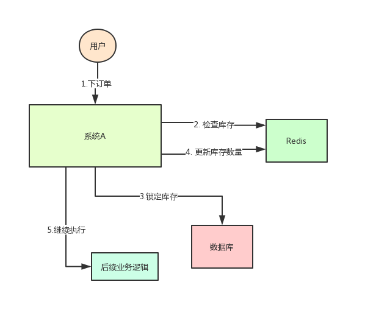

但是这样一来会**产生一个问题**：假如某个时刻，redis里面的某个商品库存为1，此时两个请求同时到来，其中一个请求执行到上图的第3步，更新数据库的库存为0，但是第4步还没有执行。而另外一个请求执行到了第2步，发现库存还是1，就继续执行第3步。这样的结果，是导致卖出了2个商品，然而其实库存只有1个。这就是典型的`库存超卖`问题。

**解决方案**：此时，我们很容易想到解决方案：用锁把2、3、4步锁住，让它们执行完之后，另一个线程才能进来执行第2步。

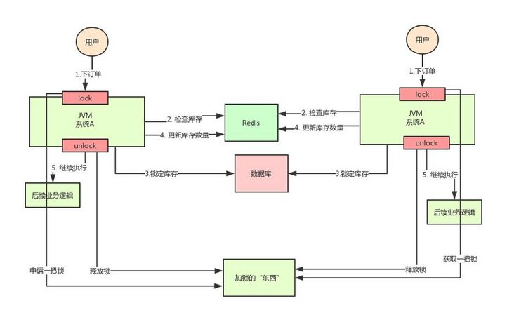


# 数据脱敏

先来看看什么是数据脱敏？数据脱敏也叫数据的去隐私化，在我们给定脱敏规则和策略的情况下，对敏感数据比如 `手机号`、`银行卡号` 等信息，进行转换或者修改的一种技术手段，防止敏感数据直接在不可靠的环境下使用。像政府、医疗行业、金融机构、移动运营商是比较早开始应用数据脱敏的，因为他们所掌握的都是用户最核心的私密数据，如果泄露后果是不可估量的。数据脱敏的应用在生活中是比较常见的，比如我们在淘宝买东西订单详情中，商家账户信息会被用 `*` 遮挡，保障了商户隐私不泄露，这就是一种数据脱敏方式。数据脱敏又分为静态数据脱敏（`SDM`）和 动态数据脱敏（`DDM`）。


## 静态数据脱敏

静态数据脱敏（`SDM`）：适用于将数据抽取出生产环境脱敏后分发至测试、开发、培训、数据分析等场景。

有时我们可能需要将生产环境的数据  `copy` 到测试、开发库中，以此来排查问题或进行数据分析，但出于安全考虑又不能将敏感数据存储于非生产环境，此时就要把敏感数据从生产环境脱敏完毕之后再在非生产环境使用。

这样脱敏后的数据与生产环境隔离，满足业务需要的同时又保障了生产数据的安全。

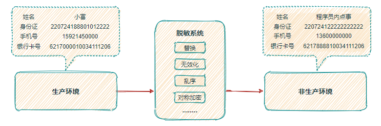

如图所示，将用户的真实 `姓名`、`手机号`、`身份证`、`银行卡号` 通过 `替换`、`无效化`、`乱序`、`对称加密` 等方案进行脱敏改造。


## 动态数据脱敏

动态数据脱敏（`DDM`）：一般用在生产环境，访问敏感数据时实时进行脱敏，因为有时在不同情况下对于同一敏感数据的读取，需要做不同级别的脱敏处理，例如：不同角色、不同权限所执行的脱敏方案会不同。

**注意**：在抹去数据中的敏感内容同时，也需要保持原有的数据特征、业务规则和数据关联性，保证我们在开发、测试以及数据分析类业务不会受到脱敏的影响，使脱敏前后的数据一致性和有效性。**总之一句话：你爱怎么脱就怎么脱，别影响我使用就行**。


## 数据脱敏方案

### 无效化

无效化方案在处理待脱敏的数据时，通过对字段数据值进行 `截断`、`加密`、`隐藏` 等方式让敏感数据脱敏，使其不再具有利用价值。一般采用特殊字符（`*`等）代替真值，这种隐藏敏感数据的方法简单，但缺点是用户无法得知原数据的格式，如果想要获取完整信息，要让用户授权查询。

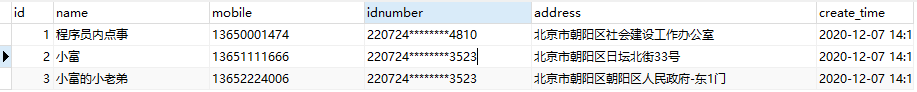

比如我们将身份证号用 * 替换真实数字就变成了 "220724 \*\*\*\*\*\* 3523"，非常简单。

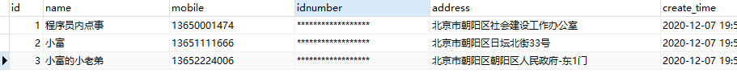


### 随机值

随机值替换，字母变为随机字母，数字变为随机数字，文字随机替换文字的方式来改变敏感数据，这种方案的优点在于可以在一定程度上保留原有数据的格式，往往这种方法用户不易察觉的。

我们看到 `name` 和 `idnumber` 字段进行了随机化脱敏，而名字姓、氏随机化稍有特殊，需要有对应姓氏字典数据支持。

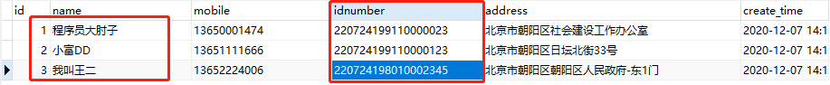


### 数据替换

数据替换与前边的无效化方式比较相似，不同的是这里不以特殊字符进行遮挡，而是用一个设定的虚拟值替换真值。比如说我们将手机号统一设置成 “13651300000”。

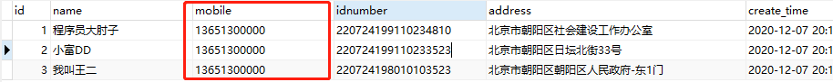


### 对称加密

对称加密是一种特殊的可逆脱敏方法，通过加密密钥和算法对敏感数据进行加密，密文格式与原始数据在逻辑规则上一致，通过密钥解密可以恢复原始数据，要注意的就是密钥的安全性。

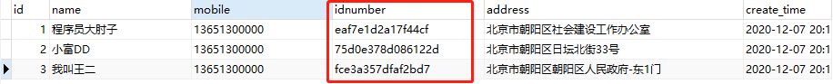


### 平均值

平均值方案经常用在统计场景，针对数值型数据，我们先计算它们的均值，然后使脱敏后的值在均值附近随机分布，从而保持数据的总和不变。

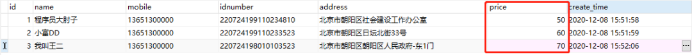

对价格字段 `price` 做平均值处理后，字段总金额不变，但脱敏后的字段值都在均值 60 附近。

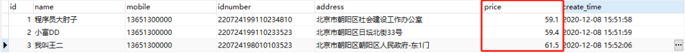


### 偏移和取整

这种方式通过随机移位改变数字数据，偏移取整在保持了数据的安全性的同时保证了范围的大致真实性，比之前几种方案更接近真实数据，在大数据分析场景中意义比较大。

比如下边的日期字段`create_time`中 `2020-12-08 15:12:25` 变为 `2018-01-02 15:00:00`。

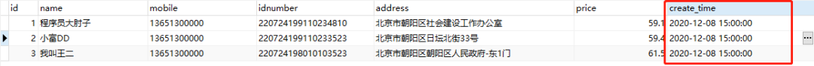

数据脱敏规则在实际应用中往往都是多种方案配合使用，以此来达到更高的安全级别。


# 附近的人

## 操作命令

自Redis 3.2开始，Redis基于geohash和有序集合提供了地理位置相关功能。 Redis Geo模块包含了以下6个命令：

- **GEOADD**: 将给定的位置对象（纬度、经度、名字）添加到指定的key;
- GEOPOS: 从key里面返回所有给定位置对象的位置（经度和纬度）;
- GEODIST: 返回两个给定位置之间的距离;
- GEOHASH: 返回一个或多个位置对象的Geohash表示;
- **GEORADIUS**: 以给定的经纬度为中心，返回目标集合中与中心的距离不超过给定最大距离的所有位置对象;
- GEORADIUSBYMEMBER: 以给定的位置对象为中心，返回与其距离不超过给定最大距离的所有位置对象。

其中，组合使用GEOADD和GEORADIUS可实现“附近的人”中“增”和“查”的基本功能。要实现微信中“附近的人”功能，可直接使用GEORADIUSBYMEMBER命令。其中“给定的位置对象”即为用户本人，搜索的对象为其他用户。不过本质上，GEORADIUSBYMEMBER = GEOPOS + GEORADIUS，即先查找用户位置再通过该位置搜索附近满足位置相互距离条件的其他用户对象。以下会从源码角度入手对GEOADD和GEORADIUS命令进行分析，剖析其算法原理。

> Redis geo操作中只包含了“增”和“查”的操作，并没有专门的“删除”命令。主要是因为Redis内部使用有序集合(zset)保存位置对象，可用zrem进行删除。

> 在Redis源码geo.c的文件注释中，只说明了该文件为GEOADD、GEORADIUS和GEORADIUSBYMEMBER的实现文件（其实在也实现了另三个命令）。从侧面看出其他三个命令为辅助命令。


## GEOADD

**使用方式**

```shell
GEOADD key longitude latitude member [longitude latitude member ...]
```

将给定的位置对象（纬度、经度、名字）添加到指定的key。其中，key为集合名称，member为该经纬度所对应的对象。在实际运用中，当所需存储的对象数量过多时，可通过设置多key(如一个省一个key)的方式对对象集合变相做sharding，避免单集合数量过多。成功插入后的返回值：

```
(integer) N
```

其中N为成功插入的个数。通过源码分析可以看出Redis内部使用有序集合(zset)保存位置对象，有序集合中每个元素都是一个带位置的对象，元素的score值为其经纬度对应的52位的geohash值。

> double类型精度为52位；
> geohash是以base32的方式编码，52bits最高可存储10位geohash值，对应地理区域大小为0.6\*0.6米的格子。换句话说经Redis geo转换过的位置理论上会有约0.3\*1.414=0.424米的误差。


**算法小结**

简单总结下GEOADD命令都干了啥：

- 参数提取和校验
- 将入参经纬度转换为52位的geohash值（score）
- 调用ZADD命令将member及其对应的score存入集合key中


## GEORADIUS

**使用方式**

```
GEORADIUS key longitude latitude radius m|km|ft|mi [WITHCOORD] [WITHDIST] [WITHHASH] [ASC|DESC] [COUNT count] [STORE key] [STORedisT key]
```

以给定的经纬度为中心，返回目标集合中与中心的距离不超过给定最大距离的所有位置对象。

范围单位：`m | km | ft | mi --> 米 | 千米 | 英尺 | 英里`

额外参数：

- WITHDIST：在返回位置对象的同时，将位置对象与中心之间的距离也一并返回。距离的单位和用户给定的范围单位保持一致
- WITHCOORD：将位置对象的经度和维度也一并返回
- WITHHASH：以 52 位有符号整数的形式，返回位置对象经过原始 geohash 编码的有序集合分值。这个选项主要用于底层应用或者调试，实际中的作用并不大
- ASC|DESC：从近到远返回位置对象元素 | 从远到近返回位置对象元素
- COUNT count：选取前N个匹配位置对象元素。（不设置则返回所有元素）
- STORE key：将返回结果的地理位置信息保存到指定key
- STORedisT key：将返回结果离中心点的距离保存到指定key

由于 STORE 和 STORedisT 两个选项的存在，GEORADIUS 和 GEORADIUSBYMEMBER 命令在技术上会被标记为写入命令，从而只会查询（写入）主实例，QPS过高时容易造成主实例读写压力过大。 为解决这个问题，在 Redis 3.2.10 和 Redis 4.0.0 中，分别新增了 GEORADIUS_RO 和 GEORADIUSBYMEMBER_RO两个只读命令。
 不过，在实际开发中笔者发现 在java package `Redis.clients.jedis.params.geo` 的 GeoRadiusParam 参数类中并不包含 STORE 和 STORedisT 两个参数选项，在调用georadius时是否真的只查询了主实例，还是进行了只读封装。感兴趣的朋友可以自己研究下。成功查询后的返回值：
不带WITH限定，返回一个member list，如：

```
["member1","member2","member3"]
```

带WITH限定，member list中每个member也是一个嵌套list，如：

```
[
	["member1", distance1, [longitude1, latitude1]]
	["member2", distance2, [longitude2, latitude2]]
]
```


**算法小结**

抛开众多可选参数不谈，简单总结下GEORADIUS命令是怎么利用geohash获取目标位置对象的：

- 参数提取和校验
- 利用中心点和输入半径计算待查区域范围。这个范围参数包括满足条件的最高的geohash网格等级(精度) 以及 对应的能够覆盖目标区域的九宫格位置
- 对九宫格进行遍历，根据每个geohash网格的范围框选出位置对象。进一步找出与中心点距离小于输入半径的对象，进行返回

直接描述不太好理解，我们通过如下两张图在对算法进行简单的演示：

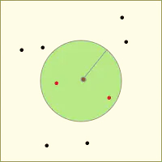 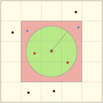

令左图的中心为搜索中心，绿色圆形区域为目标区域，所有点为待搜索的位置对象，红色点则为满足条件的位置对象。
 在实际搜索时,首先会根据搜索半径计算geohash网格等级（即右图中网格大小等级），并确定九宫格位置（即红色九宫格位置信息）；再依次查找计算九宫格中的点（蓝点和红点）与中心点的距离，最终筛选出距离范围内的点（红点）。


# 亿级数据统计

常见的场景如下：

- 给一个 userId ，判断用户登陆状态
- 两亿用户最近 7 天的签到情况，统计 7 天内连续签到的用户总数
- 统计每天的新增与第二天的留存用户数
- 统计网站的对访客（Unique Visitor，UV）量
- 最新评论列表
- 根据播放量音乐榜单

通常情况下，我们面临的用户数量以及访问量都是巨大的，比如百万、千万级别的用户数量，或者千万级别、甚至亿级别的访问信息。所以，我们必须要选择能够非常高效地统计大量数据（例如亿级）的集合类型。

**如何选择合适的数据集合，我们首先要了解常用的统计模式，并运用合理的数据来解决实际问题。**四种统计类型：

- 二值状态统计
- 聚合统计
- 排序统计
- 基数统计


## 二值统计

**什么是二值状态统计呀？**

也就是集合中的元素的值只有 0 和 1 两种，在签到打卡和用户是否登陆的场景中，只需记录`签到(1)`或 `未签到(0)`，`已登录(1)`或`未登陆(0)`。假如我们在判断用户是否登陆的场景中使用 Redis 的 String 类型实现（**key -> userId，value -> 0 表示下线，1 - 登陆**），假如存储 100 万个用户的登陆状态，如果以字符串的形式存储，就需要存储 100 万个字符串了，内存开销太大。


**为什么String类型内存开销大？**

String 类型除了记录实际数据以外，还需要额外的内存记录数据长度、空间使用等信息。当保存的数据包含字符串，String 类型就使用简单动态字符串（SDS）结构体来保存，如下图所示：

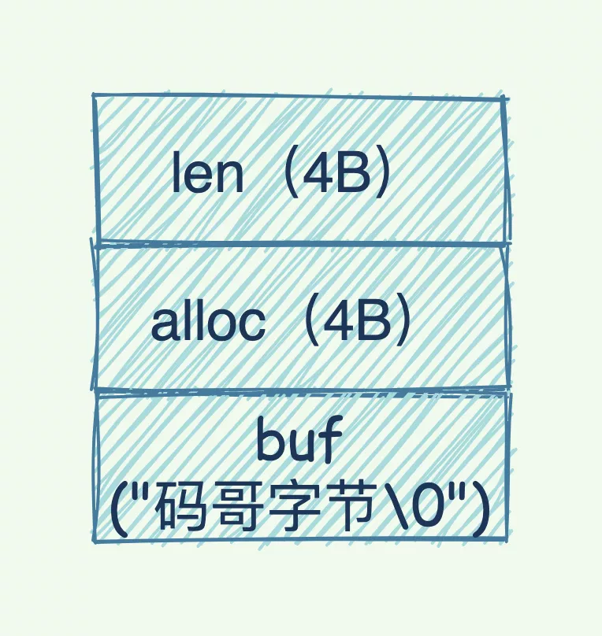

- **len**：占 4 个字节，表示 buf 的已用长度
- **alloc**：占 4 个字节，表示 buf 实际分配的长度，通常 > len
- **buf**：字节数组，保存实际的数据，Redis 自动在数组最后加上一个 “\0”，额外占用一个字节的开销

所以，在 SDS 中除了 buf 保存实际的数据， len 与 alloc 就是额外的开销。另外，还有一个 **RedisObject 结构的开销**，因为 Redis 的数据类型有很多，而且，不同数据类型都有些相同的元数据要记录（比如最后一次访问的时间、被引用的次数等）。所以，Redis 会用一个 RedisObject 结构体来统一记录这些元数据，同时指向实际数据。

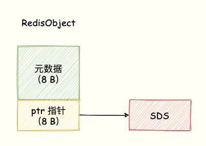

对于二值状态场景，我们就可以利用 Bitmap 来实现。比如登陆状态我们用一个 bit 位表示，一亿个用户也只占用 一亿 个 bit 位内存 ≈ （100000000 / 8/ 1024/1024）12 MB。

```
大概的空间占用计算公式是：($offset/8/1024/1024) MB
```


**什么是 Bitmap 呢？**

Bitmap 的底层数据结构用的是 String 类型的 SDS 数据结构来保存位数组，Redis 把每个字节数组的 8 个 bit 位利用起来，每个 bit 位 表示一个元素的二值状态（不是 0 就是 1）。可以将 Bitmap 看成是一个 bit 为单位的数组，数组的每个单元只能存储 0 或者 1，数组的下标在 Bitmap 中叫做 offset 偏移量。为了直观展示，我们可以理解成 buf 数组的每个字节用一行表示，每一行有 8 个 bit 位，8 个格子分别表示这个字节中的 8 个 bit 位，如下图所示：

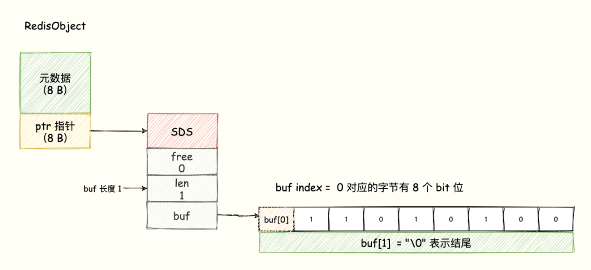

**8 个 bit 组成一个 Byte，所以 Bitmap 会极大地节省存储空间。** 这就是 Bitmap 的优势。

当遇到的统计场景只需要统计数据的二值状态，比如用户是否存在、 ip 是否是黑名单、以及签到打卡统计等场景就可以考虑使用 Bitmap。只需要一个 bit 位就能表示 0 和 1。在统计海量数据的时候将大大减少内存占用。


### 判断用户登陆态

怎么用 Bitmap 来判断海量用户中某个用户是否在线呢？Bitmap 提供了 `GETBIT、SETBIT` 操作，通过一个偏移值 offset 对 bit 数组的 offset 位置的 bit 位进行读写操作，需要注意的是 offset 从 0 开始。

只需要一个 key = login_status 表示存储用户登陆状态集合数据， 将用户 ID 作为 offset，在线就设置为 1，下线设置 0。通过 `GETBIT`判断对应的用户是否在线。50000 万 用户只需要 6 MB 的空间。

- **SETBIT 命令**

  ```
  SETBIT <key> <offset> <value>
  ```

  设置或者清空 key 的 value 在 offset 处的 bit 值（只能是 0 或者 1）。

- **GETBIT 命令**

  ```
  GETBIT <key> <offset>
  ```

  获取 key 的 value 在 offset 处的 bit 位的值，当 key 不存在时，返回 0。


假如我们要判断 ID = 10086 的用户的登陆情况：

- 第一步，执行以下指令，表示用户已登录。

  ```
  SETBIT login_status 10086 1
  ```

- 第二步，检查该用户是否登陆，返回值 1 表示已登录。

  ```
  GETBIT login_status 10086
  ```

- 第三步，登出，将 offset 对应的 value 设置成 0。

  ```
  SETBIT login_status 10086 0
  ```


### 用户每个月的签到情况

在签到统计中，每个用户每天的签到用 1 个 bit 位表示，一年的签到只需要 365 个 bit 位。一个月最多只有 31 天，只需要 31 个 bit 位即可。

比如统计编号 89757 的用户在 2021 年 5 月份的打卡情况要如何进行？key 可以设计成 `uid:sign:{userId}:{yyyyMM}`，月份的每一天的值 - 1 可以作为 offset（因为 offset 从 0 开始，所以 `offset = 日期 - 1`）。

- 第一步，执行下面指令表示记录用户在 2021 年 5 月 16 号打卡。

  ```
  SETBIT uid:sign:89757:202105 15 1
  ```

- 第二步，判断编号 89757 用户在 2021 年 5 月 16 号是否打卡。

  ```
  GETBIT uid:sign:89757:202105 15
  ```

- 第三步，统计该用户在 5 月份的打卡次数，使用 `BITCOUNT` 指令。该指令用于统计给定的 bit 数组中，值 = 1 的 bit 位的数量。

  ```
  BITCOUNT uid:sign:89757:202105
  ```

这样我们就可以实现用户每个月的打卡情况了，是不是很赞。


**如何统计这个月首次打卡时间呢？**

Redis 提供了 `BITPOS key bitValue [start] [end]`指令，返回数据表示 Bitmap 中第一个值为 `bitValue` 的 offset 位置。在默认情况下， 命令将检测整个位图， 用户可以通过可选的 `start` 参数和 `end` 参数指定要检测的范围。所以我们可以通过执行以下指令来获取 userID = 89757 在 2021 年 5 月份**首次打卡**日期：

```
BITPOS uid:sign:89757:202105 1
```

需要注意的是，我们需要将返回的 value + 1 ，因为 offset 从 0 开始。


### 连续签到用户总数

在记录了一个亿的用户连续 7 天的打卡数据，如何统计出这连续 7 天连续打卡用户总数呢？

我们把每天的日期作为 Bitmap 的 key，userId 作为 offset，若是打卡则将 offset 位置的 bit 设置成 1。key 对应的集合的每个 bit 位的数据则是一个用户在该日期的打卡记录。一共有 7 个这样的 Bitmap，如果我们能对这 7 个 Bitmap 的对应的 bit 位做 『与』运算。同样的 UserID  offset 都是一样的，当一个 userID 在 7 个 Bitmap 对应对应的 offset 位置的 bit = 1 就说明该用户 7 天连续打卡。结果保存到一个新 Bitmap 中，我们再通过 `BITCOUNT` 统计 bit = 1 的个数便得到了连续打卡 7 天的用户总数了。

Redis 提供了 `BITOP operation destkey key [key ...]`这个指令用于对一个或者多个 键 = key 的 Bitmap 进行位元操作。

`opration` 可以是 `and`、`OR`、`NOT`、`XOR`。当 BITOP 处理不同长度的字符串时，较短的那个字符串所缺少的部分会被看作 `0` 。空的 `key` 也被看作是包含 `0` 的字符串序列。便于理解，如下图所示：

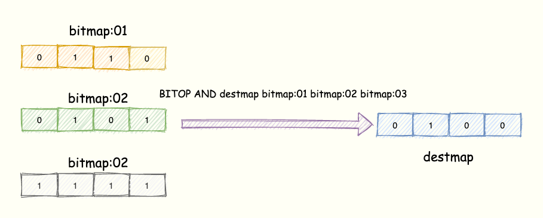

3 个 Bitmap，对应的 bit 位做「与」操作，结果保存到新的 Bitmap 中。操作指令表示将 三个 bitmap 进行 AND 操作，并将结果保存到 destmap 中。接着对 destmap 执行 BITCOUNT 统计。

```
// 与操作
BITOP AND destmap bitmap:01 bitmap:02 bitmap:03
// 统计 bit 位 =  1 的个数
BITCOUNT destmap
```

简单计算下 一个一亿个位的 Bitmap占用的内存开销，大约占 12 MB 的内存（10^8/8/1024/1024），7 天的 Bitmap 的内存开销约为 84 MB。同时我们最好给 Bitmap 设置过期时间，让 Redis 删除过期的打卡数据，节省内存。


## 基数统计

基数统计：统计一个集合中不重复元素的个数，常见于计算独立用户数（UV）。

实现基数统计最直接的方法，就是采用集合（Set）这种数据结构，当一个元素从未出现过时，便在集合中增加一个元素；如果出现过，那么集合仍保持不变。当页面访问量巨大，就需要一个超大的 Set 集合来统计，将会浪费大量空间。

另外，这样的数据也不需要很精确，到底有没有更好的方案呢？这个问题问得好，Redis 提供了 `HyperLogLog` 数据结构就是用来解决种种场景的统计问题。`HyperLogLog` 是一种不精确的去重基数方案，它的统计规则是基于概率实现的，标准误差 0.81%，这样的精度足以满足 UV 统计需求了。


### 网站的 UV

#### Set方案

一个用户一天内多次访问一个网站只能算作一次，所以很容易就想到通过 Redis 的 Set 集合来实现。用户编号 89757 访问 「Redis 为什么这么快 」时，我们将这个信息放到 Set 中。

```shell
SADD Redis为什么这么快:uv 89757
```

当用户编号 89757 多次访问「Redis 为什么这么快」页面，Set 的去重功能能保证不会重复记录同一个用户 ID。通过 `SCARD` 命令，统计「Redis 为什么这么快」页面 UV。指令返回一个集合的元素个数（也就是用户 ID）。

```
SCARD Redis为什么这么快:uv
```


#### Hash方案

可以利用 Hash 类型实现，将用户 ID 作为 Hash 集合的 key，访问页面则执行 HSET 命令将 value 设置成 1。即使用户重复访问，重复执行命令，也只会把这个 userId 的值设置成 “1"。最后，利用 `HLEN` 命令统计 Hash 集合中的元素个数就是 UV。如下：

```
HSET redis集群:uv userId:89757 1
// 统计 UV
HLEN redis集群
```


#### HyperLogLog方案

Set 虽好，如果文章非常火爆达到千万级别，一个 Set 就保存了千万个用户的 ID，页面多了消耗的内存也太大了。同理，Hash数据类型也是如此。咋办呢？

利用  Redis 提供的 `HyperLogLog` 高级数据结构（不要只知道 Redis 的五种基础数据类型了）。这是一种用于基数统计的数据集合类型，即使数据量很大，计算基数需要的空间也是固定的。每个 `HyperLogLog` 最多只需要花费 12KB 内存就可以计算 2 的 64 次方个元素的基数。Redis 对 `HyperLogLog` 的存储进行了优化，在计数比较小的时候，存储空间采用系数矩阵，占用空间很小。只有在计数很大，稀疏矩阵占用的空间超过了阈值才会转变成稠密矩阵，占用 12KB 空间。

- **PFADD**：将访问页面的每个用户 ID 添加到 `HyperLogLog` 中。

  ```
  PFADD Redis主从同步原理:uv userID1 userID 2 useID3
  ```

- **PFCOUNT**：利用 `PFCOUNT` 获取 「Redis主从同步原理」页面的 UV值。

  ```
  PFCOUNT Redis主从同步原理:uv
  ```

- **PFMERGE**：将多个 `HyperLogLog` 合并在一起形成一个新的 `HyperLogLog` 值。

  ```
  PFMERGE destkey sourcekey [sourcekey ...]
  ```

  **使用场景**

  比如在网站中我们有两个内容差不多的页面，运营说需要这两个页面的数据进行合并。其中页面的 UV 访问量也需要合并，那这个时候 `PFMERGE` 就可以派上用场了，也就是**同样的用户访问这两个页面则只算做一次**。

  如下所示：Redis、MySQL 两个 Bitmap 集合分别保存了两个页面用户访问数据。

  ```
  PFADD Redis数据 user1 user2 user3
  PFADD MySQL数据 user1 user2 user4
  PFMERGE 数据库 Redis数据 MySQL数据
  PFCOUNT 数据库 // 返回值 = 4
  ```

  将多个 HyperLogLog 合并（merge）为一个 HyperLogLog ， 合并后的 HyperLogLog 的基数接近于所有输入HyperLogLog 的可见集合（observed set）的**并集**。user1、user2 都访问了 Redis 和 MySQL，只算访问了一次。


## 排序统计

Redis的4个集合类型中（List、Set、Hash、Sorted Set），List和Sorted Set就是有序的。

- List：按照元素插入 List 的顺序排序，使用场景通常可以作为 消息队列、最新列表、排行榜
- Sorted Set：根据元素的score权重排序，我们可以自己决定每个元素的权重值。使用场景（排行榜，比如按照播放量、点赞数）


### 最新评论列表

**可以利用List插入的顺序排序实现评论列表**。比如微信公众号的后台回复列表（不要杠，举例子），每一公众号对应一个 List，这个List保存该公众号的所有的用户评论。每当一个用户评论，则利用`LPUSH key value [value ...]`插入到List队头。

```
LPUSH 码哥字节 1 2 3 4 5 6
```

接着再用 `LRANGE key star stop` 获取列表指定区间内的元素。

```
> LRANGE 码哥字节 0 4
1) "6"
2) "5"
3) "4"
4) "3"
5) "2"
```

**注意**：并不是所有最新列表都能用 List 实现，对于因为对于频繁更新的列表，list类型的分页可能导致列表元素重复或漏掉。比如当前评论列表 `List =｛A, B, C, D｝`，左边表示最新的评论，D 是最早的评论。

```
LPUSH 码哥字节 D C B A
```

展示第一页最新 2 个评论，获取到 A、B：

```
LRANGE 码哥字节 0 1
1) "A"
2) "B"
```

按照我们想要的逻辑来说，第二页可通过 `LRANGE 码哥字节 2 3` 获取 C，D。如果在展示第二页之前，产生新评论 E，评论 E 通过 `LPUSH 码哥字节 E` 插入到 List 队头，List = ｛E, A, B, C, D ｝。现在执行 `LRANGE 码哥字节 2 3` 获取第二页评论发现， B 又出现了。

```
LRANGE 码哥字节 2 3
1) "B"
2) "C"
```

出现这种情况的原因在于 List 是利用元素所在的位置排序，一旦有新元素插入，`List = ｛E，A，B，C，D｝`。原先的数据在 List 的位置都往后移动一位，导致读取都旧元素。

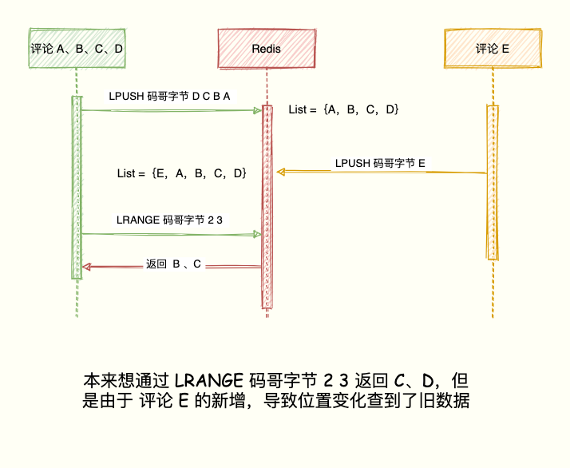


**小结**

只有不需要分页（比如每次都只取列表的前 5 个元素）或者更新频率低（比如每天凌晨统计更新一次）的列表才适合用 List 类型实现。对于需要分页并且会频繁更新的列表，需用使用有序集合 Sorted Set 类型实现。另外，需要通过时间范围查找的最新列表，List 类型也实现不了，需要通过有序集合 Sorted Set 类型实现，如以成交时间范围作为条件来查询的订单列表。


### 排行榜

对于最新列表的场景，List 和 Sorted Set 都能实现，为啥还用 List 呢？直接使用 Sorted Set 不是更好，它还能设置 score 权重排序更加灵活。原因是 Sorted Set 类型占用的内存容量是 List 类型的数倍之多，对于列表数量不多的情况，可以用 Sorted Set 类型来实现。

比如要一周音乐榜单，我们需要实时更新播放量，并且需要分页展示。除此以外，排序是根据播放量来决定的，这个时候 List 就无法满足了。我们可以将音乐 ID 保存到 Sorted Set 集合中，`score` 设置成每首歌的播放量，该音乐每播放一次则设置 score = score +1。

- **ZADD**

  比如我们将《青花瓷》和《花田错》播放量添加到 musicTop 集合中：

  ```
  ZADD musicTop 100000000 青花瓷 8999999 花田错
  ```

- **ZINCRBY**

  《青花瓷》每播放一次就通过 `ZINCRBY`指令将 score + 1。

  ```
  > ZINCRBY musicTop 1 青花瓷
  100000001
  ```

- **ZRANGEBYSCORE**

  最后我们需要获取 musicTop **前十**播放量音乐榜单，目前最大播放量是 N ，可通过如下指令获取：

  ```
  ZRANGEBYSCORE musicTop N-9 N WITHSCORES
  ```

  **注意**：可是这个 N 我们怎么获取呀？

- **ZREVRANGE**

  可通过 `ZREVRANGE key start stop [WITHSCORES]`指令。其中元素的排序按 `score` 值递减(从大到小)来排列。具有相同 `score` 值的成员按字典序的逆序(reverse lexicographical order)排列。

  ```
  > ZREVRANGE musicTop 0 0 WITHSCORES
  1) "青花瓷"
  2) 100000000
  ```


**小结**

即使集合中的元素频繁更新，Sorted Set 也能通过 `ZRANGEBYSCORE`命令准确地获取到按序排列的数据。**在面对需要展示最新列表、排行榜等场景时，如果数据更新频繁或者需要分页显示，建议优先考虑使用 Sorted Set。**


## 聚合统计

指的就是统计多个集合元素的聚合结果，比如说：

- 统计多个元素的共有数据（交集）
- 统计两个集合其中的一个独有元素（差集统计）
- 统计多个集合的所有元素（并集统计）

什么样的场景会用到交集、差集、并集呢？

Redis 的 Set 类型支持集合内的增删改查，底层使用了 Hash 数据结构，无论是 add、remove 都是 O(1) 时间复杂度。并且支持多个集合间的交集、并集、差集操作，利用这些集合操作，解决上边提到的统计问题。

### 交集-共同好友

比如 QQ 中的共同好友正是聚合统计中的交集。我们将账号作为 Key，该账号的好友作为 Set 集合的 value。模拟两个用户的好友集合：

```
SADD user:码哥字节 R大 Linux大神 PHP之父
SADD user:大佬 Linux大神 Python大神 C++菜鸡
```

交集

统计两个用户的共同好友只需要两个 Set 集合的交集，如下命令：

```
SINTERSTORE user:共同好友 user:码哥字节 user:大佬
```

命令的执行后，「user:码哥字节」、「user:大佬」两个集合的交集数据存储到 user:共同好友这个集合中。


### 差集-每日新增好友数

比如，统计某个 App 每日新增注册用户量，只需要对近两天的总注册用户量集合取差集即可。如2021-06-01 的总注册用户量存放在 `key = user:20210601` set 集合中，2021-06-02 的总用户量存放在 `key = user:20210602` 的集合中。

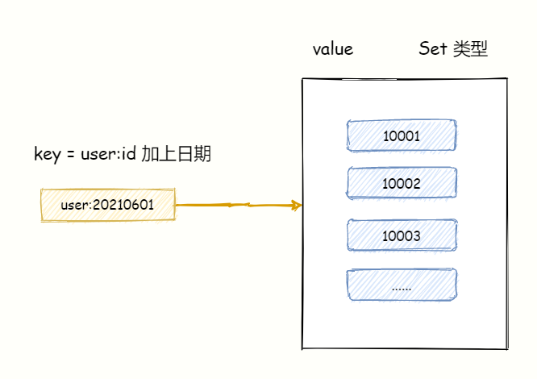

如下指令，执行差集计算并将结果存放到 `user:new` 集合中。

```
SDIFFSTORE  user:new  user:20210602 user:20210601
```

执行完毕，此时的 user:new 集合将是 2021/06/02 日新增用户量。除此之外，QQ 上有个可能认识的人功能，也可以使用差集实现，就是把你朋友的好友集合减去你们共同的好友即是可能认识的人。


### 并集-总共新增好友

还是差集的例子，统计 2021/06/01 和 2021/06/02 两天总共新增的用户量，只需要对两个集合执行并集。

```
SUNIONSTORE  userid:new user:20210602 user:20210601
```

此时新的集合 userid:new 则是两日新增的好友。


**小结**

Set 的差集、并集和交集的计算复杂度较高，在数据量较大的情况下，如果直接执行这些计算，会导致 Redis 实例阻塞。所以，可以专门部署一个集群用于统计，让它专门负责聚合计算，或者是把数据读取到客户端，在客户端来完成聚合统计，这样就可以规避由于阻塞导致其他服务无法响应。


# 短信服务

## 短信防刷

- **时间限制：60秒后才能再次发送**

  从发送验证码开始，前端（客户端）会进行一个60秒的倒数，在这一分钟之内，用户是无法提交多次发送信息的请求的。这种方法虽然使用得比较普遍，但是却不是非常有用，技术稍微好点的人完全可以绕过这个限制，直接发送短信验证码。

- **手机号限制：同一个手机号，24小时之内不能够超过5条**

  对使用同一个手机号码进行注册或者其他发送短信验证码的操作的时候，系统可以对这个手机号码进行限制，例如，24小时只能发送5条短信验证码，超出限制则进行报错（如：系统繁忙，请稍后再试）。然而，这也只能够避免人工手动刷短信而已，对于批量使用不同手机号码来刷短信的机器，这种方法也是无可奈何的。

- **短信验证码限制：30分钟之内发送同一个验证码**

  网上还有一种方法说：30分钟之内，所有的请求，所发送的短信验证码都是同一个验证码。第一次请求短信接口，然后缓存短信验证码结果，30分钟之内再次请求，则直接返回缓存的内容。对于这种方式，不是很清楚短信接口商会不会对发送缓存信息收取费用，如果有兴趣可以了解了解。

- **前后端校验：提交Token参数校验**

  这种方式比较少人说到，个人觉得可以这种方法值得一试。前端（客户端）在请求发送短信的时候，同时向服务端提交一个Token参数，服务端对这个Token参数进行校验，校验通过之后，再向请求发送短信的接口向用户手机发送短信。

- **唯一性限制：微信产品，限制同一个微信ID用户的请求数量**

  如果是微信的产品的话，可以通过微信ID来进行识别，然后对同一个微信ID的用户限制，24小时之内最多只能够发送一定量的短信。

- **产品流程限制：分步骤进行**

  例如注册的短信验证码使用场景，我们将注册的步骤分成2步，用户在输入手机号码并设置了密码之后，下一步才进入验证码的验证步骤。

- **图形验证码限制：图形验证通过后再请求接口**

  用户输入图形验证码并通过之后，再请求短信接口获取验证码。为了有更好的用户体验，也可以设计成：一开始不需要输入图形验证码，在操作达到一定量之后，才需要输入图形验证码。具体情况请根据具体场景来进行设计。

- **IP及Cookie限制：限制相同的IP/Cookie信息最大数量**

  使用Cookie或者IP，能够简单识别同一个用户，然后对相同的用户进行限制（如：24小时内最多只能够发送20条短信）。然而，Cookie能够清理、IP能够模拟，而且IP还会出现局域网相同IP的情况，因此，在使用此方法的时候，应该根据具体情况来思考。

- **短信预警机制，做好出问题之后的防护**

  以上的方法并不一定能够完全杜绝短信被刷，因此，我们也应该做好短信的预警机制，即当短信的使用量达到一定量之后，向管理员发送预警信息，管理员可以立刻对短信的接口情况进行监控和防护。


# 安全漏洞

我们日常开发中，很多小伙伴容易忽视安全漏洞问题，认为只要正常实现业务逻辑就可以了。其实，**安全性才是最重要的**。本文将跟大家一起学习常见的安全漏洞问题，希望对大家有帮助哈。如果本文有什么错误的话，希望大家提出哈，感谢感谢~

## SQL注入

### 什么是SQL注入？

SQL注入是一种代码注入技术，一般被应用于攻击web应用程序。它通过在web应用接口传入一些特殊参数字符，来欺骗应用服务器，执行恶意的SQL命令，以达到非法获取系统信息的目的。它目前是黑客对数据库进行攻击的最常用手段之一。


### SQL注入是如何攻击的？

举个常见的**业务场景**：在web表单搜索框输入员工名字，然后后台查询出对应名字的员工。

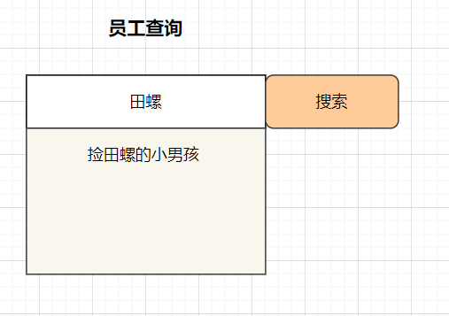

这种场景下，一般都是前端页面把一个名字参数name传到后台，然后后台通过SQL把结果查询出来

```java
name = "田螺"; //前端传过来的
SQL= "select * from staff where name=" + name;  //根据前端传过来的name参数，查询数据库员工表staff
```

因为SQL是直接拼接的，如果我们完全信任前端传的参数的话。假如前端传这么一个参数时`'' or '1'='1'`，SQL就变成酱紫的啦。

```mysql
select * from staff where name='' or '1'='1';
```

这个SQL会把所有的员工信息全都查出来了，酱紫请求用户已经越权啦。请求者可以获取所有员工的信息，其他用户信息已经暴露了啦。


### 如何预防SQL注入问题

**使用#{}而不是${}**

在MyBatis中,使用`#{}`而不是`${}`，可以很大程度防止sql注入。

> - 因为`#{}`是一个参数占位符，对于字符串类型，会自动加上""，其他类型不加。由于Mybatis采用**预编译**，其后的参数不会再进行SQL编译，所以一定程度上防止SQL注入。
> - `${}`是一个简单的字符串替换，字符串是什么，就会解析成什么，存在SQL注入风险

**不要暴露一些不必要的日志或者安全信息，比如避免直接响应一些sql异常信息。**

如果SQL发生异常了，不要把这些信息暴露响应给用户，可以自定义异常进行响应


**不相信任何外部输入参数，过滤参数中含有的一些数据库关键词关键词**

可以加个参数校验过滤的方法，过滤`union，or`等数据库关键词


**适当的权限控制**

在你查询信息时，先校验下当前用户是否有这个权限。如实现代码的时候，可以让用户多传一个企业Id什么的，或者获取当前用户的session信息等，在查询前，先校验一下当前用户是否是这个企业下的等等，是的话才有这个查询员工的权限。


## JSON反序列化漏洞

JSON反序列化漏洞——如Fastjson安全漏洞。

### 什么是JSON序列化，JSON发序列化

- 序列化：把对象转换为字节序列的过程
- 反序列：把字节序列恢复为Java对象的过程

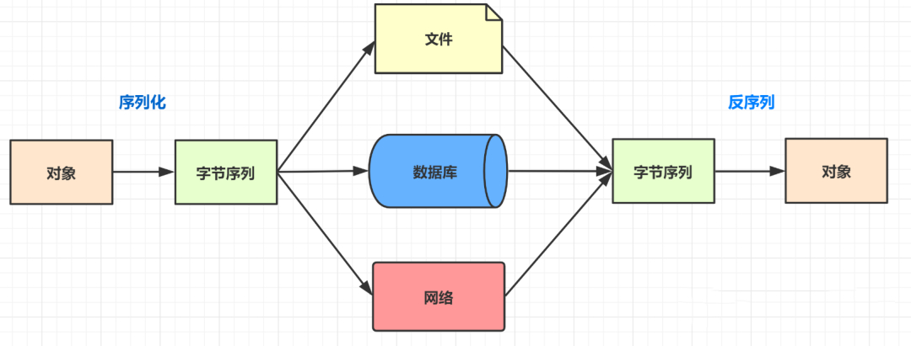

**Json序列化**就是将对象转换成Json格式的字符串，**JSON反序列化**就是Json串转换成对象


### JSON 反序列化漏洞是如何被攻击？

不安全的反序列化可以导致远程代码执行、重放攻击、注入攻击或特权升级攻击。之前Fastjson频繁爆出安全漏洞，我们现在分析fastjson 1.2.24版本的一个反序列化漏洞吧，这个漏洞比较常见的利用手法就是通过jndi注入的方式实现RCE。

我们先来看fastjson一个反序列化的简单例子：

```java
public class User {
    private String name;

    private int age;

    public String getName() {
        return name;
    }

    public void setName(String name) {
        System.out.println("调用了name方法");
        this.name = name;
    }

    public int getAge() {
        return age;
    }

    public void setAge(int age) {
        System.out.println("调用了age方法");
        this.age = age;
    }

    public static void main(String[] args) {
        String str = "{\"@type\":\"cn.eovie.bean.User\",\"age\":26,\"name\":\"捡田螺的小男孩\"}";
        User user = JSON.parseObject(str,User.class);
    }
}
```

运行结果：

```java
调用了age方法
调用了name方法
```

加了`@type`属性就能调用对应对象的`setXXX`方法，而`@type`表示指定反序列化成某个类。如果我们能够找到一个类，而这个类的某个`setXXX`方法中通过我们的精心构造能够完成命令执行，即可达到攻击的目的啦。

> com.sun.rowset.JdbcRowSetImpl 就是类似这么一个类，它有两个set方法，分别是setAutoCommit和setDataSourceName

有兴趣的小伙伴，可以看下它的源代码：

```java
  public void setDataSourceName(String var1) throws SQLException {
        if (this.getDataSourceName() != null) {
            if (!this.getDataSourceName().equals(var1)) {
                super.setDataSourceName(var1);
                this.conn = null;
                this.ps = null;
                this.rs = null;
            }
        } else {
            super.setDataSourceName(var1);
        }

    }
    
      public void setAutoCommit(boolean var1) throws SQLException {
        if (this.conn != null) {
            this.conn.setAutoCommit(var1);
        } else {
            this.conn = this.connect();
            this.conn.setAutoCommit(var1);
        }

    }
    
    private Connection connect() throws SQLException {
        if (this.conn != null) {
            return this.conn;
        } else if (this.getDataSourceName() != null) {
            try {
                InitialContext var1 = new InitialContext();
                DataSource var2 = (DataSource)var1.lookup(this.getDataSourceName());
                return this.getUsername() != null && !this.getUsername().equals("") ? var2.getConnection(this.getUsername(), this.getPassword()) : var2.getConnection();
            } catch (NamingException var3) {
                throw new SQLException(this.resBundle.handleGetObject("jdbcrowsetimpl.connect").toString());
            }
        } else {
            return this.getUrl() != null ? DriverManager.getConnection(this.getUrl(), this.getUsername(), this.getPassword()) : null;
        }
    }
```

`setDataSourceName` 简单设置了设置了dataSourceName的值，`setAutoCommit`中有connect操作，connect方法中有典型的jndi的`lookup`方法调用，参数刚好就是在`setDataSourceName`中设置的dataSourceName。

因此，有漏洞的反序列代码实现如下即可：

```java
public class FastjsonTest {

    public static void main(String[] argv){
        testJdbcRowSetImpl();
    }

    public static void testJdbcRowSetImpl(){
        //JDK 8u121以后版本需要设置改系统变量
        System.setProperty("com.sun.jndi.rmi.object.trustURLCodebase", "true");
        //RMI
        String payload2 = "{\"@type\":\"com.sun.rowset.JdbcRowSetImpl\",\"dataSourceName\":\"rmi://localhost:1099/Exploit\"," +
                " \"autoCommit\":true}";
        JSONObject.parseObject(payload2);
    }
}
```

漏洞复现的流程如下哈：

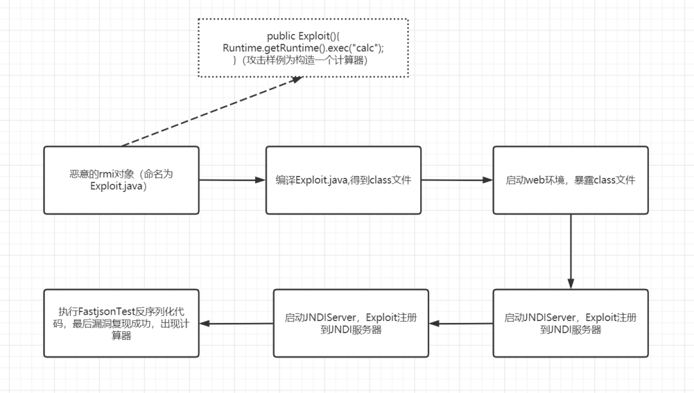

参考的代码来源这里哈，fastjson漏洞代码测试（https://github.com/earayu/fastjson_jndi_poc）


**如何解决json反序列化漏洞问题**

- 可以升级版本，比如fastjson后面版本，增强AutoType打开时的安全性 fastjson，增加了AutoType黑名单等等，都是为了应对这些安全漏洞
- 反序列化有fastjson、gson、jackson等等类型，可以替换其他类型
- 升级+打开safemode


## XSS攻击

### 什么是XSS？

XSS 攻击全称跨站脚本攻击（Cross-Site Scripting），这会与层叠样式表(Cascading Style Sheets, CSS)的缩写混淆，因此有人将跨站脚本攻击缩写为XSS。它指的是恶意攻击者往Web页面里插入恶意html代码，当用户浏览该页之时，嵌入其中Web里面的html代码会被执行，从而达到恶意攻击用户的特殊目的。XSS攻击一般分三种类型：存储型 、反射型 、DOM型XSS。


### XSS是如何攻击的？

拿反射型举个例子吧，流程图如下：

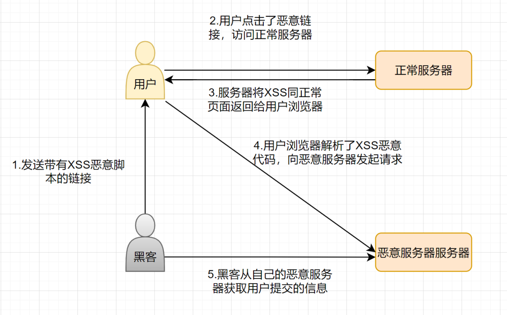

我们搞点简单代码样例吧，首先正常html页面如下：

```xml
<input type="text" name="name" />
<input type="submit" value="搜索" onclick="http://127.0.0.1/search?name=">
</body>
```

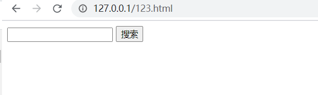

- 用户输入搜索信息，点击搜索按钮，就是到达正常服务器的。如果黑客在url后面的参数中加入如下的恶意攻击代码

  ```java
  http://127.0.0.1/search?keyword="<a href ="http://www.baidu.com"><script>alert('XSS');</script></a>
  ```

- 当用户打开带有恶意代码的URL的时候，正常服务器会解析出请求参数 name，得到""，拼接到 HTML 中返回给浏览器

- 用户浏览器接收到响应后执行解析，其中的恶意代码也会被执行到

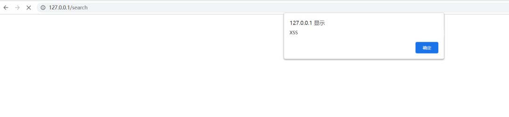

- 这里的链接我写的是百度搜索页，实际上黑客攻击的时候，是引诱用户输入某些重要信息，然后跳到他们自己的服务器，以窃取用户提交的内容信息


### 如何解决XSS攻击问题

- 不相信用户的输入，对输入进行过滤，过滤标签等，只允许合法值
- HTML 转义

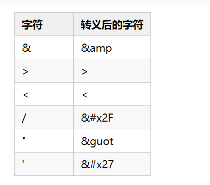

- 对于链接跳转，如`<a href="xxx"` 等，要校验内容，禁止以script开头的非法链接
- 限制输入长度等等


## CSRF攻击

### 什么是CSRF 攻击？

CSRF，跨站请求伪造（英语：Cross-site request forgery），简单点说就是，攻击者盗用了你的身份，以你的名义发送恶意请求。跟跨网站脚本（XSS）相比，XSS利用的是用户对指定网站的信任，CSRF利用的是网站对用户网页浏览器的信任。


### CSRF是如何攻击的呢？

我们来看下这个例子：

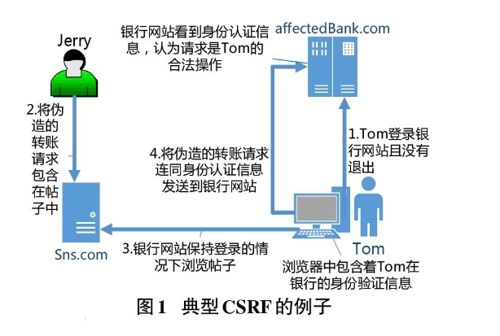

1. Tom 登陆银行，没有退出，浏览器包含了Tom在银行的身份认证信息
2. 黑客Jerry将伪造的转账请求，包含在在帖子
3. Tom在银行网站保持登陆的情况下，浏览帖子
4. 将伪造的转账请求连同身份认证信息，发送到银行网站
5. 银行网站看到身份认证信息，以为就是Tom的合法操作，最后造成Tom资金损失


### 如何解决CSRF攻击

- 检查Referer字段。HTTP头中有一个Referer字段，这个字段用以标明请求来源于哪个地址
- 添加校验token


## 文件上传下载漏洞

### 文件上传漏洞

文件上传漏洞是指用户上传了一个可执行的脚本文件，并通过此脚本文件获得了执行服务器端命令的能力。常见场景是web服务器允许用户上传图片或者普通文本文件保存，而用户绕过上传机制上传恶意代码并执行从而控制服务器。

**解决办法**一般就是：

- 限制服务器相关文件目录的权限
- 校验上传的文件，如后缀名 禁止上传恶意代码的文件
- 尽量禁止使用前端上传的文件名


### 文件下载漏洞

文件下载漏洞，举个例子，使用 .. 等字符，使应用读取到指定目录之外的其他目录中的文件内容，从而可能读取到服务器的其他相关重要信息。


## 敏感数据泄露

这个相对比较好理解，一般敏感信息包括密码、用户手机身份证信息、财务数据等等，由于web应用或者API未加密或者疏忽保护，导致这些数据极易被黑客利用。所以我们需要保护好用户的隐私数据，比如用户密码加密保存，请求采用https加密，重要第三方接口采用加签验签，服务端日志不打印敏感数据等等。


## XXE 漏洞

### 什么是XXE

XXE就是XML外部实体注入。当允许引用外部实体时，通过构造恶意内容，就可能导致任意文件读取、系统命令执行、内网端口探测、攻击内网网站等危害。


### XXE三种攻击场景

- 场景1. 攻击者尝试从服务端提取数据

```xml
<?xml version="1.0"?>
<!DOCTYPE foo [
<!ELEMENT foo (#ANY)>
<!ENTITY file SYSTEM "file:///etc/passwd">]>
]>
<foo>&xxe;</foo>
```

- 场景2. 攻击者通过将上面的实体行更改为一下内容来探测服务器的专用网络

```xml
<!ENTITY xxe SYSTEM "https://192.168.1.1/private">]>
```

- 场景3. 攻击者通过恶意文件执行拒绝服务攻击

```xml
<!ENTITY xxe SYSTEM "file:///dev/random">]>
```


### 如何防御XXE

- 使用开发语言提供的禁用外部实体的方法
- 过滤用户提交的XML数据，过滤<!DOCTYPE和<!ENTITY等关键词


## DDoS 攻击

### 什么是DDos攻击

DDoS 攻击，英文全称是 Distributed Denial of Service，谷歌翻译过来就是“分布式拒绝服务”。一般来说是指攻击者对目标网站在较短的时间内发起大量请求，大规模消耗目标网站的主机资源，让它无法正常服务。在线游戏、互联网金融等领域是 DDoS 攻击的高发行业。为了方便理解，引用一下知乎上一个非常经典的例子：

> 我开了一家有五十个座位的重庆火锅店，由于用料上等，童叟无欺。平时门庭若市，生意特别红火，而对面二狗家的火锅店却无人问津。二狗为了对付我，想了一个办法，叫了五十个人来我的火锅店坐着却不点菜，让别的客人无法吃饭。


### 如何应对DDoS攻击？

- **高防服务器**，即能独立硬防御 50Gbps 以上的服务器，能够帮助网站拒绝服务攻击，定期扫描网络主节点等
- **黑名单**
- **DDoS 清洗**
- **CDN 加速**


## 框架或应用漏洞

- Struts 框架漏洞：远程命令执行漏洞和开放重定向漏洞
- QQ Browser 9.6：API 权限控制问题导致泄露隐私模式
- Oracle GlassFish Server：REST CSRF
- WebLogic: 未授权命令执行漏洞
- Hacking Docker：Registry API 未授权访问
- WordPress 4.7 / 4.7.1：REST API 内容注入漏洞


## 其它漏洞

### 弱口令

- 空口令
- 口令长度小于8
- 口令不应该为连续的某个字符（QQQQQQ）
- 账号密码相同（例：root：root）
- 口令与账号相反（例：root：toor）
- 口令纯数字（例：112312324234， 电话号）
- 口令纯字母（例：asdjfhask）
- 口令已数字代替字母（例：hello word， hell0 w0rd）
- 口令采用连续性组合（例：123456，abcdef，654321，fedcba）
- 服务/设备默认出厂口令


### 证书有效性验证漏洞

如果不对证书进行有效性验证，那https就如同虚设啦。

- 如果是客户生成的证书，需要跟系统可信根CA形成信任链，不能为了解决ssl证书报错的问题，选择在客户端代码中信任客户端中所有证书的方式
- 证书快过期时，需要提前更换


### 未鉴权等权限相关漏洞

一些比较重要的接口，一般建议鉴权。比如你查询某账号的转账记录，肯定需要先校验该账号是不是操作人旗下的啦。


# 秒杀商品

**设计难点**：并发量大，应用、数据库都承受不了。另外难控制超卖。

**设计要点**：

- 将请求尽量拦截在系统上游，html尽量静态化，部署到cdn上面。按钮及时设置为不可用，禁止用户重复提交请求
- 设置页面缓存，针对同一个页面和uid一段时间内返回缓存页面
- 数据用缓存抗，不直接落到数据库
- 读数据的时候不做强一致性教研，写数据的时候再做
- 在每台物理机上也缓存商品信息等等变动不大的相关的数据
- 像商品中的标题和描述这些本身不变的会在秒杀开始之前全量推送到秒杀机器上并一直缓存直到秒杀结束
- 像库存这种动态数据会采用被动失效的方式缓存一定时间（一般是数秒），失效后再去Tair缓存拉取最新的数据
- 如果允许的话，用异步的模式，等缓存都落库之后再返回结果
- 如果允许的话，增加答题教研等验证措施

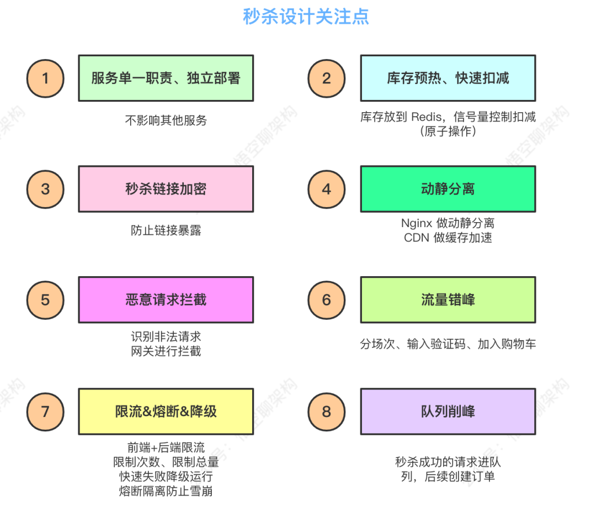

**其它业务和技术保障措施**：

- **业务隔离**。把秒杀做成一种营销活动，卖家要参加秒杀这种营销活动需要单独报名，从技术上来说，卖家报名后对我们来说就是已知热点，当真正开始时我们可以提前做好预热
- **系统隔离**。系统隔离更多是运行时的隔离，可以通过分组部署的方式和另外 99% 分开。秒杀还申请了单独的域名，目的也是让请求落到不同的集群中
- **数据隔离**。秒杀所调用的数据大部分都是热数据，比如会启用单独 cache 集群或 MySQL 数据库来放热点数据，目前也是不想0.01%的数据影响另外99.99%
- **缓存数据库高可用**。主要流量都落在缓存数据库上，需针对缓存数据库的高可用作保障。研究缓存穿透、雪崩等等问题


## 瞬时高并发

一般在`秒杀时间点`（比如：12点）前几分钟，用户并发量才真正突增，达到秒杀时间点时，并发量会达到顶峰。但由于这类活动是大量用户抢少量商品的场景，必定会出现`狼多肉少`的情况，所以其实绝大部分用户秒杀会失败，只有极少部分用户能够成功。正常情况下，大部分用户会收到商品已经抢完的提醒，收到该提醒后，他们大概率不会在那个活动页面停留了，如此一来，用户并发量又会急剧下降。所以这个峰值持续的时间其实是非常短的，这样就会出现瞬时高并发的情况，下面用一张图直观的感受一下流量的变化：

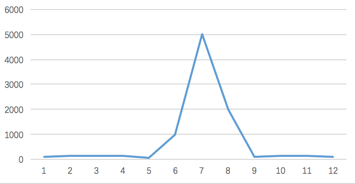

像这种瞬时高并发的场景，传统的系统很难应对，我们需要设计一套全新的系统。可以从以下几个方面入手：

- **页面静态化**
- **CDN加速**
- **缓存**
- **mq异步处理**
- **限流**
- **分布式锁**


## 页面静态化

活动页面是用户流量的第一入口，所以是并发量最大的地方。如果这些流量都能直接访问服务端，恐怕服务端会因为承受不住这么大的压力，而直接挂掉。

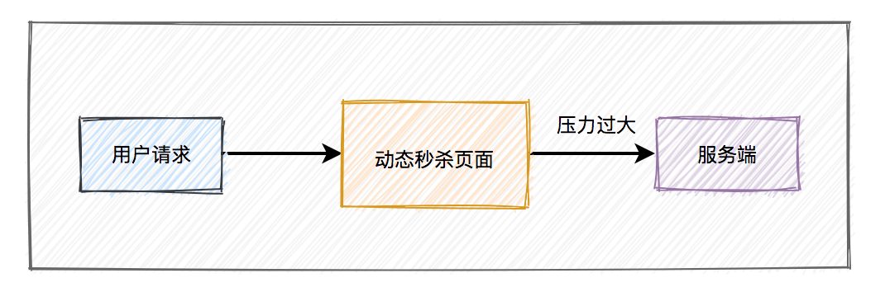活动页面绝大多数内容是固定的，比如：商品名称、商品描述、图片等。为了减少不必要的服务端请求，通常情况下，会对活动页面做`静态化`处理。用户浏览商品等常规操作，并不会请求到服务端。只有到了秒杀时间点，并且用户主动点了秒杀按钮才允许访问服务端。

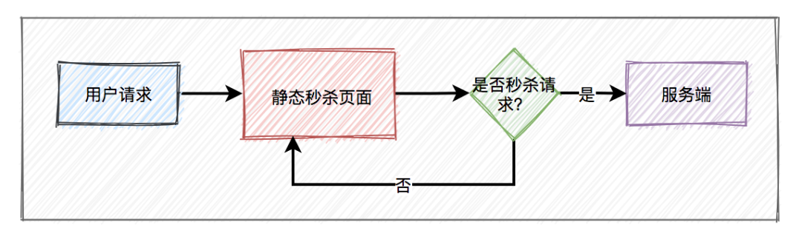这样能过滤大部分无效请求。但只做页面静态化还不够，因为用户分布在全国各地，有些人在北京，有些人在成都，有些人在深圳，地域相差很远，网速各不相同。如何才能让用户最快访问到活动页面呢？这就需要使用CDN，它的全称是Content Delivery Network，即内容分发网络。

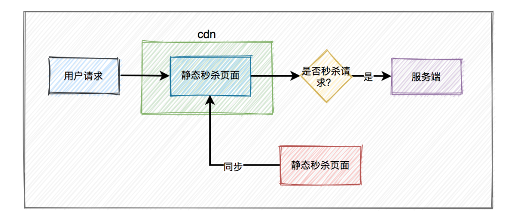使用户就近获取所需内容，降低网络拥塞，提高用户访问响应速度和命中率。


## 秒杀按钮

大部分用户怕错过`秒杀时间点`，一般会提前进入活动页面。此时看到的`秒杀按钮`是置灰，不可点击的。只有到了秒杀时间点那一时刻，秒杀按钮才会自动点亮，变成可点击的。但此时很多用户已经迫不及待了，通过不停刷新页面，争取在第一时间看到秒杀按钮的点亮。

从前面得知，该活动页面是静态的。那么我们在静态页面中如何控制秒杀按钮，只在秒杀时间点时才点亮呢？没错，使用js文件控制。为了性能考虑，一般会将css、js和图片等静态资源文件提前缓存到CDN上，让用户能够就近访问秒杀页面。看到这里，有些聪明的小伙伴，可能会问：CDN上的js文件是如何更新的？秒杀开始之前，js标志为false，还有另外一个随机参数。

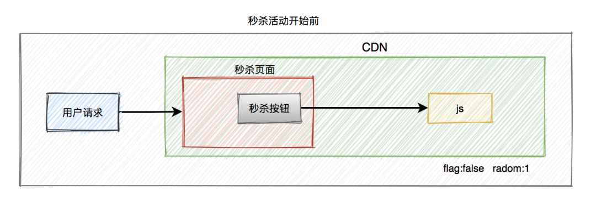

当秒杀开始的时候系统会生成一个新的js文件，此时标志为true，并且随机参数生成一个新值，然后同步给CDN。由于有了这个随机参数，CDN不会缓存数据，每次都能从CDN中获取最新的js代码。

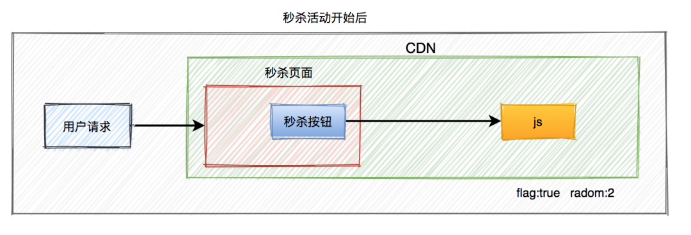

此外，前端还可以加一个定时器，控制比如：10秒之内，只允许发起一次请求。如果用户点击了一次秒杀按钮，则在10秒之内置灰，不允许再次点击，等到过了时间限制，又允许重新点击该按钮。


## 读多写少

在秒杀的过程中，系统一般会先查一下库存是否足够，如果足够才允许下单，写数据库。如果不够，则直接返回该商品已经抢完。由于大量用户抢少量商品，只有极少部分用户能够抢成功，所以绝大部分用户在秒杀时，库存其实是不足的，系统会直接返回该商品已经抢完。这是非常典型的：`读多写少` 的场景。

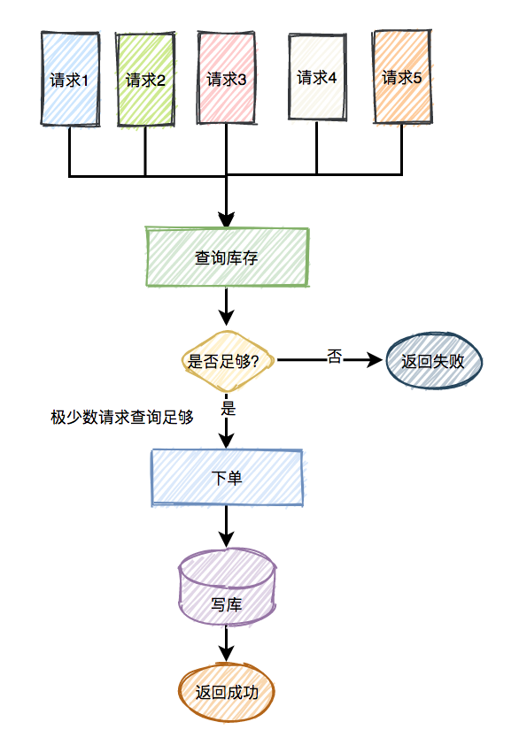

如果有数十万的请求过来，同时通过数据库查缓存是否足够，此时数据库可能会挂掉。因为数据库的连接资源非常有限，比如：mysql，无法同时支持这么多的连接。而应该改用缓存，比如：redis。即便用了redis，也需要部署多个节点。

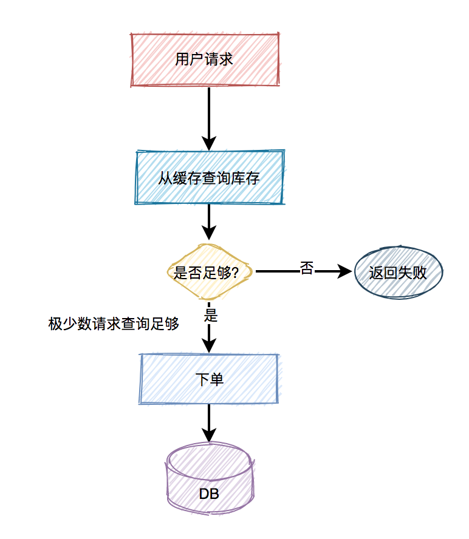


## 缓存问题

通常情况下，我们需要在redis中保存商品信息，里面包含：商品id、商品名称、规格属性、库存等信息，同时数据库中也要有相关信息，毕竟缓存并不完全可靠。用户在点击秒杀按钮，请求秒杀接口的过程中，需要传入的商品id参数，然后服务端需要校验该商品是否合法。大致流程如下图所示：

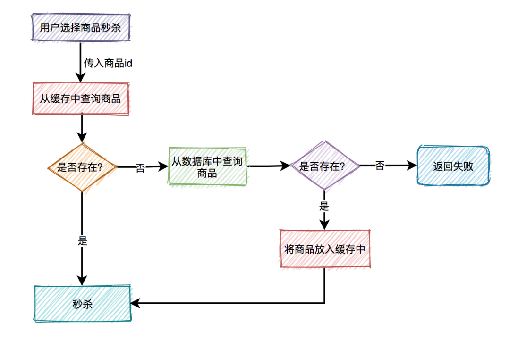

根据商品id，先从缓存中查询商品，如果商品存在，则参与秒杀。如果不存在，则需要从数据库中查询商品，如果存在，则将商品信息放入缓存，然后参与秒杀。如果商品不存在，则直接提示失败。这个过程表面上看起来是OK的，但是如果深入分析一下会发现一些问题。


### 缓存击穿

比如商品A第一次秒杀时，缓存中是没有数据的，但数据库中有。虽说上面有如果从数据库中查到数据，则放入缓存的逻辑。然而，在高并发下，同一时刻会有大量的请求，都在秒杀同一件商品，这些请求同时去查缓存中没有数据，然后又同时访问数据库。结果悲剧了，数据库可能扛不住压力，直接挂掉。如何解决这个问题呢？这就需要加锁，最好使用分布式锁。

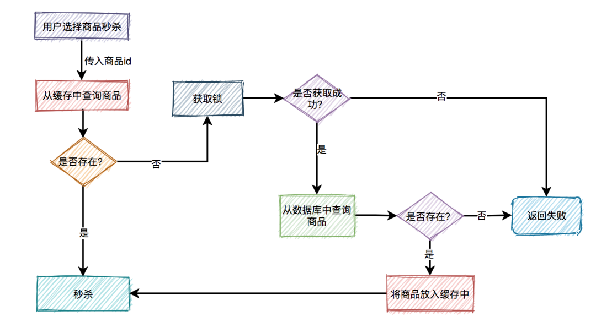当然，针对这种情况，最好在项目启动之前，先把缓存进行`预热`。即事先把所有的商品，同步到缓存中，这样商品基本都能直接从缓存中获取到，就不会出现缓存击穿的问题了。

是不是上面加锁这一步可以不需要了？表面上看起来，确实可以不需要。但如果缓存中设置的过期时间不对，缓存提前过期了，或者缓存被不小心删除了，如果不加速同样可能出现缓存击穿。其实这里加锁，相当于买了一份保险。


### 缓存穿透

如果有大量的请求传入的商品id，在缓存中和数据库中都不存在，这些请求不就每次都会穿透过缓存，而直接访问数据库了。由于前面已经加了锁，所以即使这里的并发量很大，也不会导致数据库直接挂掉。但很显然这些请求的处理性能并不好，有没有更好的解决方案？这时可以想到`布隆过滤器`。

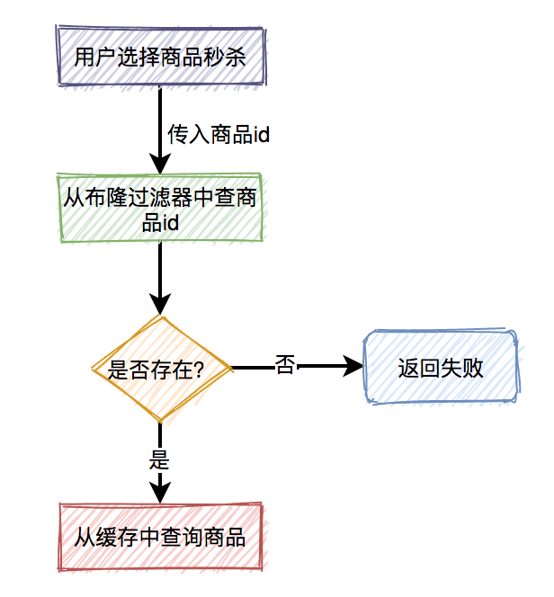

系统根据商品id，先从布隆过滤器中查询该id是否存在，如果存在则允许从缓存中查询数据，如果不存在，则直接返回失败。虽说该方案可以解决缓存穿透问题，但是又会引出另外一个问题：布隆过滤器中的数据如何更缓存中的数据保持一致？这就要求，如果缓存中数据有更新，则要及时同步到布隆过滤器中。如果数据同步失败了，还需要增加重试机制，而且跨数据源，能保证数据的实时一致性吗？显然是不行的。所以布隆过滤器绝大部分使用在缓存数据更新很少的场景中。如果缓存数据更新非常频繁，又该如何处理呢？这时，就需要把不存在的商品id也缓存起来。

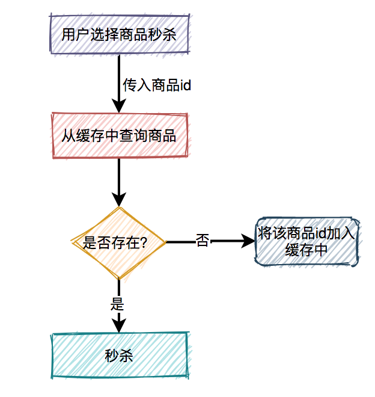

下次，再有该商品id的请求过来，则也能从缓存中查到数据，只不过该数据比较特殊，表示商品不存在。需要特别注意的是，这种特殊缓存设置的超时时间应该尽量短一点。


## 库存问题

对于库存问题看似简单，实则里面还是有些东西。真正的秒杀商品的场景，不是说扣完库存，就完事了，如果用户在一段时间内，还没完成支付，扣减的库存是要加回去的。所以，在这里引出了一个`预扣库存`的概念，预扣库存的主要流程如下：


扣减库存中除了上面说到的`预扣库存`和`回退库存`之外，还需要特别注意的是库存不足和库存超卖问题。


### 数据库扣减库存

使用数据库扣减库存，是最简单的实现方案了，假设扣减库存的sql如下：

```sql
update product set stock=stock-1 where id=123;
```

这种写法对于扣减库存是没有问题的，但如何控制库存不足的情况下，不让用户操作呢？这就需要在update之前，先查一下库存是否足够了。伪代码如下：

```sql
int stock = mapper.getStockById(123);
if(stock > 0) {
  int count = mapper.updateStock(123);
  if(count > 0) {
    addOrder(123);
  }
}
```

大家有没有发现这段代码的问题？没错，查询操作和更新操作不是原子性的，会导致在并发的场景下，出现库存超卖的情况。有人可能会说，这样好办，加把锁，不就搞定了，比如使用synchronized关键字。确实，可以，但是性能不够好。还有更优雅的处理方案，即基于数据库的乐观锁，这样会少一次数据库查询，而且能够天然的保证数据操作的原子性。只需将上面的sql稍微调整一下：

```sql
update product set stock=stock-1 where id=product and stock > 0;
```

在sql最后加上：`stock > 0`，就能保证不会出现超卖的情况。但需要频繁访问数据库，我们都知道数据库连接是非常昂贵的资源。在高并发的场景下，可能会造成系统雪崩。而且，容易出现多个请求，同时竞争行锁的情况，造成相互等待，从而出现死锁的问题。


### redis扣减库存

redis的`incr`方法是原子性的，可以用该方法扣减库存。伪代码如下：

```java
 boolean exist = redisClient.query(productId,userId);
  if(exist) {
    return -1;
  }
  int stock = redisClient.queryStock(productId);
  if(stock <=0) {
    return 0;
  }
  redisClient.incrby(productId, -1);
  redisClient.add(productId,userId);
return 1;
```

代码流程如下：

- 先判断该用户有没有秒杀过该商品，如果已经秒杀过，则直接返回-1
- 查询库存，如果库存小于等于0，则直接返回0，表示库存不足
- 如果库存充足，则扣减库存，然后将本次秒杀记录保存起来。然后返回1，表示成功

估计很多小伙伴，一开始都会按这样的思路写代码。但如果仔细想想会发现，这段代码有问题。有什么问题呢？如果在高并发下，有多个请求同时查询库存，当时都大于0。由于查询库存和更新库存非原则操作，则会出现库存为负数的情况，即`库存超卖`。当然有人可能会说，加个`synchronized`不就解决问题？调整后代码如下：

```java
boolean exist = redisClient.query(productId,userId);
if(exist) {
    return -1;
}

synchronized(this) {
       int stock = redisClient.queryStock(productId);
       if(stock <=0) {
         return 0;
       }
       redisClient.incrby(productId, -1);
       redisClient.add(productId,userId);
   }

return 1;
```

加`synchronized`确实能解决库存为负数问题，但是这样会导致接口性能急剧下降，每次查询都需要竞争同一把锁，显然不太合理。为了解决上面的问题，代码优化如下：

```java
boolean exist = redisClient.query(productId,userId);
if(exist) {
  return -1;
}
if(redisClient.incrby(productId, -1)<0) {
  return 0;
}
redisClient.add(productId,userId);
return 1;
```

该代码主要流程如下：

- 先判断该用户有没有秒杀过该商品，如果已经秒杀过，则直接返回-1
- 扣减库存，判断返回值是否小于0，如果小于0，则直接返回0，表示库存不足
- 如果扣减库存后，返回值大于或等于0，则将本次秒杀记录保存起来。然后返回1，表示成功

该方案咋一看，好像没问题。但如果在高并发场景中，有多个请求同时扣减库存，大多数请求的incrby操作之后，结果都会小于0。虽说，库存出现负数，不会出现`超卖的问题`。但由于这里是预减库存，如果负数值负的太多的话，后面万一要回退库存时，就会导致库存不准。那么，有没有更好的方案呢？


### lua脚本扣减库存

lua脚本能够保证原子性的，它跟redis一起配合使用，能够完美解决上面的问题。lua脚本有段非常经典的代码：

```java
  StringBuilder lua = new StringBuilder();
  lua.append("if (redis.call('exists', KEYS[1]) == 1) then");
  lua.append("    local stock = tonumber(redis.call('get', KEYS[1]));");
  lua.append("    if (stock == -1) then");
  lua.append("        return 1;");
  lua.append("    end;");
  lua.append("    if (stock > 0) then");
  lua.append("        redis.call('incrby', KEYS[1], -1);");
  lua.append("        return stock;");
  lua.append("    end;");
  lua.append("    return 0;");
  lua.append("end;");
  lua.append("return -1;");
```

该代码的主要流程如下：

- 先判断商品id是否存在，如果不存在则直接返回
- 获取该商品id的库存，判断库存如果是-1，则直接返回，表示不限制库存
- 如果库存大于0，则扣减库存
- 如果库存等于0，是直接返回，表示库存不足


## 分布式锁

之前我提到过，在秒杀的时候，需要先从缓存中查商品是否存在，如果不存在，则会从数据库中查商品。如果数据库中，则将该商品放入缓存中，然后返回。如果数据库中没有，则直接返回失败。

大家试想一下，如果在高并发下，有大量的请求都去查一个缓存中不存在的商品，这些请求都会直接打到数据库。数据库由于承受不住压力，而直接挂掉。那么如何解决这个问题呢？这就需要用redis分布式锁了。

### setNx加锁

使用redis的分布式锁，首先想到的是`setNx`命令。

```java
if (jedis.setnx(lockKey, val) == 1) {
   jedis.expire(lockKey, timeout);
}
```

用该命令其实可以加锁，但和后面的设置超时时间是分开的，并非原子操作。假如加锁成功了，但是设置超时时间失败了，该lockKey就变成永不失效的了。在高并发场景中，该问题会导致非常严重的后果。那么，有没有保证原子性的加锁命令呢？


### set加锁

使用redis的set命令，它可以指定多个参数。

```java
String result = jedis.set(lockKey, requestId, "NX", "PX", expireTime);
if ("OK".equals(result)) {
    return true;
}
return false;
```

其中：

- lockKey：锁的标识
- requestId：请求id
- NX：只在键不存在时，才对键进行设置操作。
- PX：设置键的过期时间为 millisecond 毫秒。
- expireTime：过期时间

由于该命令只有一步，所以它是原子操作。


### 释放锁

接下来，有些朋友可能会问：在加锁时，既然已经有了lockKey锁标识，为什么要需要记录requestId呢？因为requestId是在释放锁的时候用的。

```java
if (jedis.get(lockKey).equals(requestId)) {
    jedis.del(lockKey);
    return true;
}
return false;
```

在释放锁的时候，只能释放自己加的锁，不允许释放别人加的锁。这里为什么要用requestId，用userId不行吗？

答：如果用userId的话，假设本次请求流程走完了，准备删除锁。此时，巧合锁到了过期时间失效了。而另外一个请求，巧合使用的相同userId加锁，会成功。而本次请求删除锁的时候，删除的其实是别人的锁了。

当然使用lua脚本也能避免该问题：

```java
if redis.call('get', KEYS[1]) == ARGV[1] then 
 return redis.call('del', KEYS[1]) 
else 
  return 0 
end
```

它能保证查询锁是否存在和删除锁是原子操作。


### 自旋锁

上面的加锁方法看起来好像没有问题，但如果你仔细想想，如果有1万的请求同时去竞争那把锁，可能只有一个请求是成功的，其余的9999个请求都会失败。

在秒杀场景下，会有什么问题？答：每1万个请求，有1个成功。再1万个请求，有1个成功。如此下去，直到库存不足。这就变成均匀分布的秒杀了，跟我们想象中的不一样。

如何解决这个问题呢？答：使用自旋锁。

```java
try {
  Long start = System.currentTimeMillis();
  while(true) {
      String result = jedis.set(lockKey, requestId, "NX", "PX", expireTime);
     if ("OK".equals(result)) {
        return true;
     }
     
     long time = System.currentTimeMillis() - start;
      if (time>=timeout) {
          return false;
      }
      try {
          Thread.sleep(50);
      } catch (InterruptedException e) {
          e.printStackTrace();
      }
  }
 
} finally{
    unlock(lockKey,requestId);
}  
return false;
```

在规定的时间，比如500毫秒内，自旋不断尝试加锁，如果成功则直接返回。如果失败，则休眠50毫秒，再发起新一轮的尝试。如果到了超时时间，还未加锁成功，则直接返回失败。


### redisson

除了上面的问题之外，使用redis分布式锁，还有锁竞争问题、续期问题、锁重入问题、多个redis实例加锁问题等。这些问题使用redisson可以解决，由于篇幅的原因，在这里先保留一点悬念，有疑问的私聊给我。后面会出一个专题介绍分布式锁，敬请期待。


## mq异步处理

我们都知道在真实的秒杀场景中，有三个核心流程：


而这三个核心流程中，真正并发量大的是秒杀功能，下单和支付功能实际并发量很小。所以，我们在设计秒杀系统时，有必要把下单和支付功能从秒杀的主流程中拆分出来，特别是下单功能要做成mq异步处理的。而支付功能，比如支付宝支付，是业务场景本身保证的异步。于是，秒杀后下单的流程变成如下：

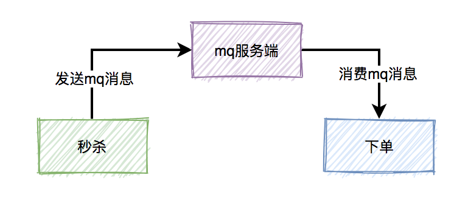

如果使用mq，需要关注以下几个问题：


### 消息丢失问题

秒杀成功了，往mq发送下单消息的时候，有可能会失败。原因有很多，比如：网络问题、broker挂了、mq服务端磁盘问题等。这些情况，都可能会造成消息丢失。那么，如何防止消息丢失呢？答：加一张消息发送表。

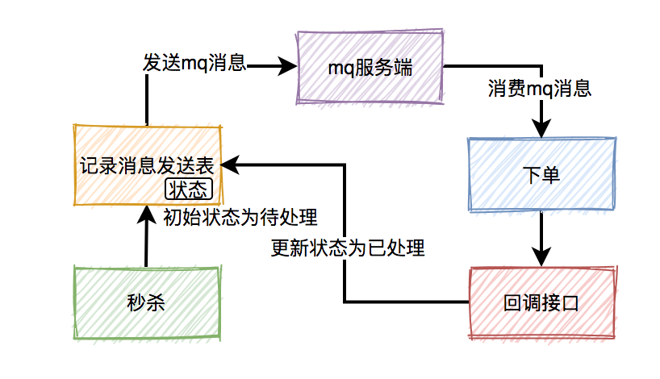

在生产者发送mq消息之前，先把该条消息写入消息发送表，初始状态是待处理，然后再发送mq消息。消费者消费消息时，处理完业务逻辑之后，再回调生产者的一个接口，修改消息状态为已处理。如果生产者把消息写入消息发送表之后，再发送mq消息到mq服务端的过程中失败了，造成了消息丢失。这时候，要如何处理呢？答：使用job，增加重试机制。

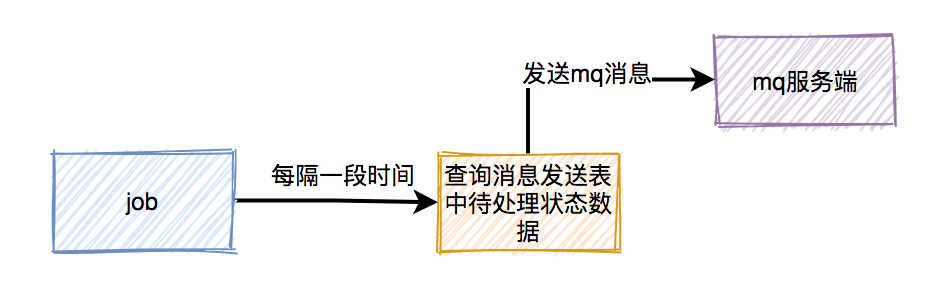

用job每隔一段时间去查询消息发送表中状态为待处理的数据，然后重新发送mq消息。


### 重复消费问题

本来消费者消费消息时，在ack应答的时候，如果网络超时，本身就可能会消费重复的消息。但由于消息发送者增加了重试机制，会导致消费者重复消息的概率增大。那么，如何解决重复消息问题呢？答：加一张消息处理表。

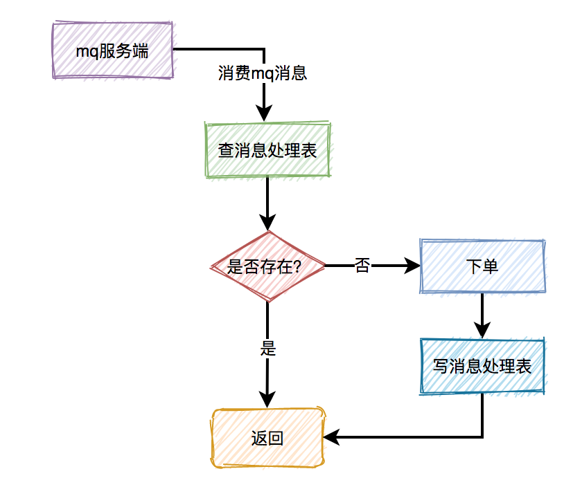

消费者读到消息之后，先判断一下消息处理表，是否存在该消息，如果存在，表示是重复消费，则直接返回。如果不存在，则进行下单操作，接着将该消息写入消息处理表中，再返回。有个比较关键的点是：下单和写消息处理表，要放在同一个事务中，保证原子操作。


### 垃圾消息问题

这套方案表面上看起来没有问题，但如果出现了消息消费失败的情况。比如：由于某些原因，消息消费者下单一直失败，一直不能回调状态变更接口，这样job会不停的重试发消息。最后，会产生大量的垃圾消息。那么，如何解决这个问题呢？

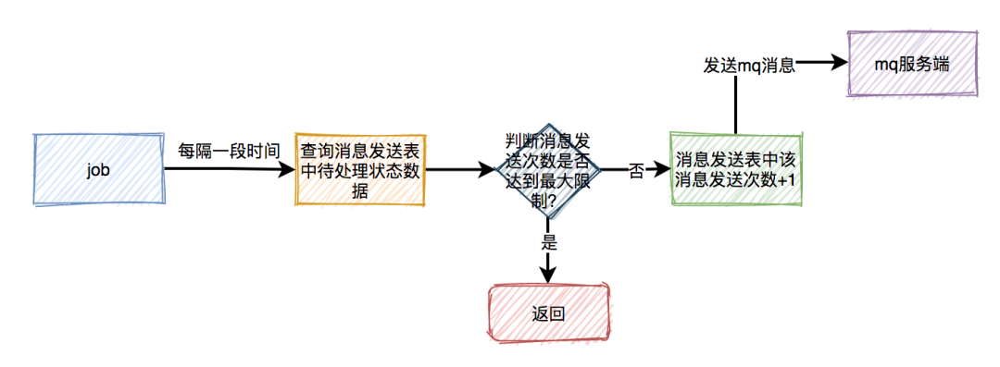

每次在job重试时，需要先判断一下消息发送表中该消息的发送次数是否达到最大限制，如果达到了，则直接返回。如果没有达到，则将次数加1，然后发送消息。这样如果出现异常，只会产生少量的垃圾消息，不会影响到正常的业务。


### 延迟消费问题

通常情况下，如果用户秒杀成功了，下单之后，在15分钟之内还未完成支付的话，该订单会被自动取消，回退库存。那么，在15分钟内未完成支付，订单被自动取消的功能，要如何实现呢？我们首先想到的可能是job，因为它比较简单。但job有个问题，需要每隔一段时间处理一次，实时性不太好。还有更好的方案？答：使用延迟队列。我们都知道rocketmq，自带了延迟队列的功能。

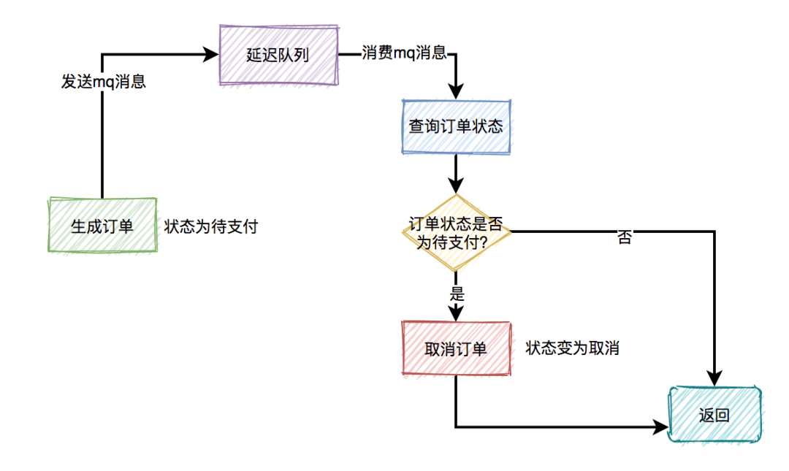

下单时消息生产者会先生成订单，此时状态为待支付，然后会向延迟队列中发一条消息。达到了延迟时间，消息消费者读取消息之后，会查询该订单的状态是否为待支付。如果是待支付状态，则会更新订单状态为取消状态。如果不是待支付状态，说明该订单已经支付过了，则直接返回。还有个关键点，用户完成支付之后，会修改订单状态为已支付。

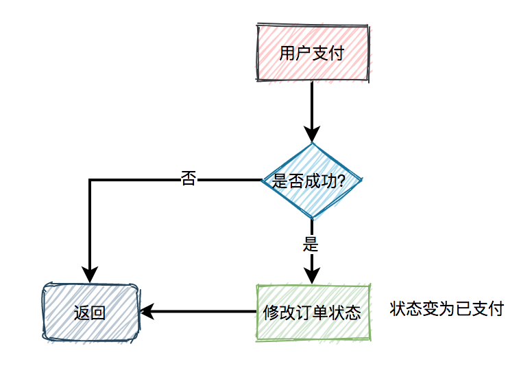


## 如何限流

通过秒杀活动，如果我们运气爆棚，可能会用非常低的价格买到不错的商品（这种概率堪比买福利彩票中大奖）。但有些高手，并不会像我们一样老老实实，通过秒杀页面点击秒杀按钮，抢购商品。他们可能在自己的服务器上，模拟正常用户登录系统，跳过秒杀页面，直接调用秒杀接口。如果是我们手动操作，一般情况下，一秒钟只能点击一次秒杀按钮。

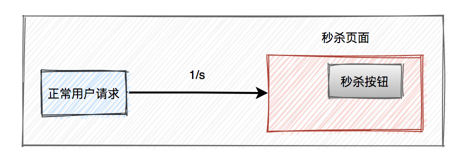

但是如果是服务器，一秒钟可以请求成上千接口。

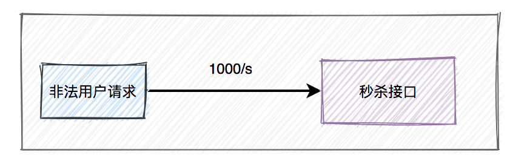

这种差距实在太明显了，如果不做任何限制，绝大部分商品可能是被机器抢到，而非正常的用户，有点不太公平。所以，我们有必要识别这些非法请求，做一些限制。那么，我们该如何现在这些非法请求呢？目前有两种常用的限流方式：

- 基于nginx限流
- 基于redis限流


### 对同一用户限流

为了防止某个用户，请求接口次数过于频繁，可以只针对该用户做限制。

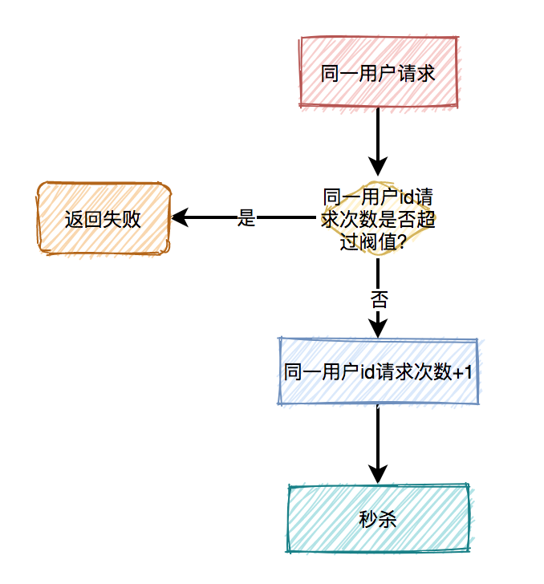

限制同一个用户id，比如每分钟只能请求5次接口。


### 对同一ip限流

有时候只对某个用户限流是不够的，有些高手可以模拟多个用户请求，这种nginx就没法识别。这时需要加同一ip限流功能。

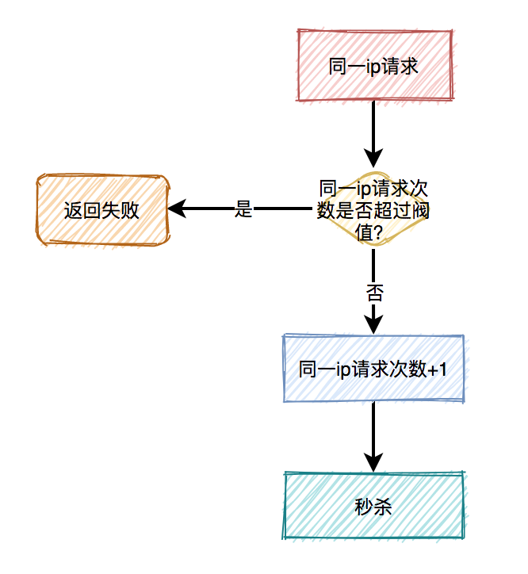

限制同一个ip，比如每分钟只能请求5次接口。但这种限流方式可能会有误杀的情况，比如同一个公司或网吧的出口ip是相同的，如果里面有多个正常用户同时发起请求，有些用户可能会被限制住。


### 对接口限流

别以为限制了用户和ip就万事大吉，有些高手甚至可以使用代理，每次都请求都换一个ip。这时可以限制请求的接口总次数。

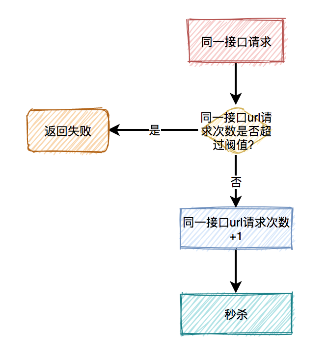

在高并发场景下，这种限制对于系统的稳定性是非常有必要的。但可能由于有些非法请求次数太多，达到了该接口的请求上限，而影响其他的正常用户访问该接口。看起来有点得不偿失。


### 加验证码

相对于上面三种方式，加验证码的方式可能更精准一些，同样能限制用户的访问频次，但好处是不会存在误杀的情况。

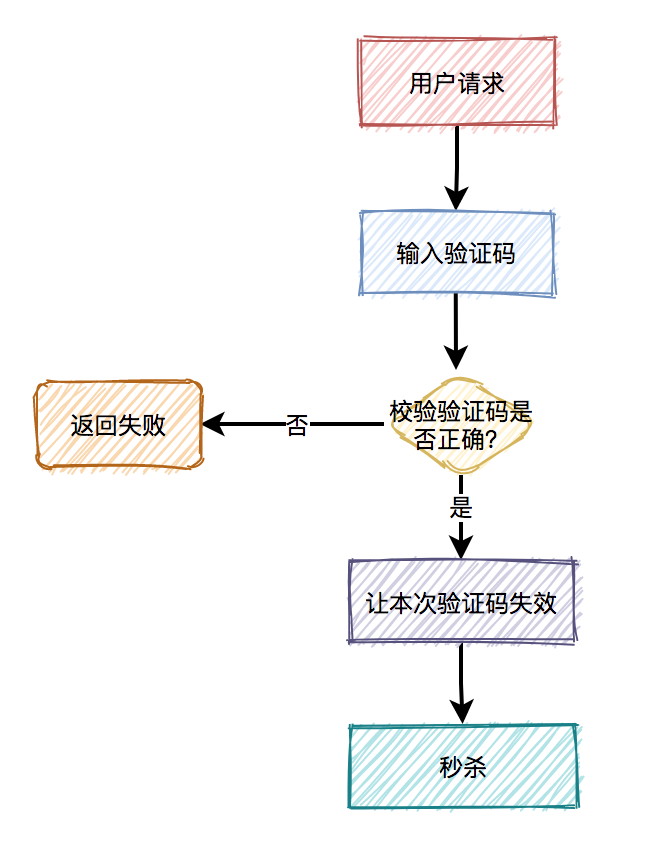

通常情况下，用户在请求之前，需要先输入验证码。用户发起请求之后，服务端会去校验该验证码是否正确。只有正确才允许进行下一步操作，否则直接返回，并且提示验证码错误。此外，验证码一般是一次性的，同一个验证码只允许使用一次，不允许重复使用。普通验证码，由于生成的数字或者图案比较简单，可能会被破解。优点是生成速度比较快，缺点是有安全隐患。还有一个验证码叫做：`移动滑块`，它生成速度比较慢，但比较安全，是目前各大互联网公司的首选。


### 提高业务门槛

上面说的加验证码虽然可以限制非法用户请求，但是有些影响用户体验。用户点击秒杀按钮前，还要先输入验证码，流程显得有点繁琐，秒杀功能的流程不是应该越简单越好吗？

其实，有时候达到某个目的，不一定非要通过技术手段，通过业务手段也一样。

12306刚开始的时候，全国人民都在同一时刻抢火车票，由于并发量太大，系统经常挂。后来，重构优化之后，将购买周期放长了，可以提前20天购买火车票，并且可以在9点、10、11点、12点等整点购买火车票。调整业务之后（当然技术也有很多调整），将之前集中的请求，分散开了，一下子降低了用户并发量。

回到这里，我们通过提高业务门槛，比如只有会员才能参与秒杀活动，普通注册用户没有权限。或者，只有等级到达3级以上的普通用户，才有资格参加该活动。

这样简单的提高一点门槛，即使是黄牛党也束手无策，他们总不可能为了参加一次秒杀活动，还另外花钱充值会员吧？


# 其它设计

## IP地址存储

当存储IPv4地址时，应该使用32位的无符号整数（UNSIGNED INT）来存储IP地址，而不是使用字符串。相对字符串存储，使用无符号整数来存储有如下的好处：

- 节省空间，不管是数据存储空间，还是索引存储空间
- 便于使用范围查询（BETWEEN...AND），且效率更高

通常，在保存IPv4地址时，一个IPv4最小需要7个字符，最大需要15个字符，所以，使用`VARCHAR(15)`即可。MySQL在保存变长的字符串时，还需要额外的一个字节来保存此字符串的长度。而如果使用无符号整数来存储，只需要4个字节即可。

使用无符号整数来存储也有缺点：

- 不便于阅读
- 需要手动转换

对于转换来说，MySQL提供了相应的函数来把字符串格式的IP转换成整数`INET_ATON`，以及把整数格式的IP转换成字符串的`INET_NTOA`。如下所示：

```sql
mysql> select inet_aton('192.168.0.1');
+--------------------------+
| inet_aton('192.168.0.1') |
+--------------------------+
|               3232235521 |
+--------------------------+
1 row in set (0.00 sec)

mysql> select inet_ntoa(3232235521);
+-----------------------+
| inet_ntoa(3232235521) |
+-----------------------+
| 192.168.0.1           |
+-----------------------+
1 row in set (0.00 sec)
```

对于IPv6来说，使用`VARBINARY`同样可获得相同的好处，同时MySQL也提供了相应的转换函数，即`INET6_ATON`和`INET6_NTOA`。

对于转换字符串IPv4和数值类型，可以放在应用层，下面是使用java代码来对二者转换：

```java
public class IpLongUtils {
    /**
     * 把字符串IP转换成long
     *
     * @param ipStr 字符串IP
     * @return IP对应的long值
     */
    public static long ip2Long(String ipStr) {
        String[] ip = ipStr.split("\\.");
        return (Long.valueOf(ip[0]) << 24) + (Long.valueOf(ip[1]) << 16)
                + (Long.valueOf(ip[2]) << 8) + Long.valueOf(ip[3]);
    }

    /**
     * 把IP的long值转换成字符串
     *
     * @param ipLong IP的long值
     * @return long值对应的字符串
     */
    public static String long2Ip(long ipLong) {
        StringBuilder ip = new StringBuilder();
        ip.append(ipLong >>> 24).append(".");
        ip.append((ipLong >>> 16) & 0xFF).append(".");
        ip.append((ipLong >>> 8) & 0xFF).append(".");
        ip.append(ipLong & 0xFF);
        return ip.toString();
    }

    public static void main(String[] args) {
        System.out.println(ip2Long("192.168.0.1"));
        System.out.println(long2Ip(3232235521L));
        System.out.println(ip2Long("10.0.0.1"));
    }

}
```

输出结果为：

```properties
3232235521
192.168.0.1
167772161
```


## 短链接

公认方案：

- **分布式ID生成器产生ID**
- **ID转62进制字符串**
- **记录数据库，根据业务要求确定过期时间，可以保留部分永久链接**

主要难点在于分布式ID生成。鉴于短链一般没有严格递增的需求，可以使用预先分发一个号段，然后生成的方式。看了下新浪微博的短链接，8位，理论上可以保存超过200万亿对关系，具体怎么存储的还有待研究。


## 红包系统

红包系统其实很像秒杀系统，只不过同一个秒杀的总量不大，但是全局的并发量非常大，如春晚可能几百万人同时抢红包。

**技术难点**：

- 主要在数据库，减库存的时候会抢锁
- 由于业务需求不同，没办法异步，也不能超卖，事务更加严格

**不能采用的方式**：

- 乐观锁：手慢会失败，DB 面临更大压力，所以不能采用
- 直接用缓存顶，涉及到钱，一旦缓存挂掉就完了

**建议方式**：

- 接入层垂直切分，根据红包ID，发红包、抢红包、拆红包、查详情详情等都在同一台机器上处理，互不影响，分而治之
- 请求进行排队，到数据库的时候是串行的，就不涉及抢锁的问题了
- 为了防止队列太长过载导致队列被降级，直接打到数据库上，所以数据库前面再加上一个缓存，用CAS自增控制并发，太高的并发直接返回失败
- 红包冷热数据分离，按时间分表


## 分布式定时任务

任务轮询或任务轮询+抢占排队方案

- 每个服务器首次启动时加入队列
- 每次任务运行首先判断自己是否是当前可运行任务，如果是便运行
- 如果不是当前运行的任务，检查自己是否在队列中，如果在，便退出，如果不在队列中，进入队列


## 微博推送

**主要难点**：关系复杂，数据量大。一个人可以关注非常多的用户，一个大 V 也有可能有几千万的粉丝。

**基本方案**：

- 推模式：推模式就是，用户A关注了用户 B，用户 B 每发送一个动态，后台遍历用户B的粉丝，往他们粉丝的 feed 里面推送一条动态
- 拉模式：推模式相反，拉模式则是，用户每次刷新 feed 第一页，都去遍历关注的人，把最新的动态拉取回来

一般采用推拉结合的方式，用户发送状态之后，先推送给粉丝里面在线的用户，然后不在线的那部分等到上线的时候再来拉取。另外冷热数据分离，用户关系在缓存里面可以设置一个过期时间，比如七天。七天没上线的可能就很少用这个 APP。


# Redis应用场景

## 数据缓存

- **热点数据缓存**：如报表、明星出轨、对象缓存、全页缓存都可以提升热点数据的访问速度
- **中间数据缓存**：如导入导出计算中的中间状态数据缓存，以防内存溢出和提升了计算获取数据的速度


## 分布式锁

String 类型setnx方法，只有不存在时才能添加成功，返回true。

```java
public static boolean getLock(String key, long expireTime) {
    Long flag = jedis.setnx(key, "1");
    if (flag == 1) {
        jedis.expire(key, expireTime);
    }
    
    return flag == 1;
    // NX 不存在则操作，EX 设置有效期单位是秒
    // return "OK".equals(jedis.set(key, requestId, "NX", "EX", expireTime));
}

public static void releaseLock(String key) {
    jedis.del(key);
}
```


## 全局ID

**利用int类型的incrby的原子性**

- 分库分表ID：一次性拿一号段
- 订单ID：一次性拿一个号段


## 计数器

**int类型，incr方法**

例如：文章的阅读量、微博点赞数、允许一定的延迟，先写入Redis再定时同步到数据库


## 限流

**int类型，incr方法**

以访问者的ip和其他信息作为key，访问一次增加一次计数，超过次数则返回false。


## 位统计

String类型的bitcount（1.6.6的bitmap数据结构介绍）。字符是以8位二进制存储的。

```shell
set k1 a
setbit k1 6 1
setbit k1 7 0
get k1 

# 6 7 代表的a的二进制位的修改
# a 对应的ASCII码是97，转换为二进制数据是01100001
# b 对应的ASCII码是98，转换为二进制数据是01100010
```

在线用户统计，留存用户统计：

```shell
setbit onlineusers 01 
setbit onlineusers 11 
setbit onlineusers 20
```

支持按位与、按位或等等操作：

- `BITOPANDdestkeykey[key...]`：对一个或多个 key 求逻辑并，并将结果保存到 destkey
- `BITOPORdestkeykey[key...]`：对一个或多个 key 求逻辑或，并将结果保存到 destkey
- `BITOPXORdestkeykey[key...]`：对一个或多个 key 求逻辑异或，并将结果保存到 destkey
- `BITOPNOTdestkeykey`：对给定 key 求逻辑非，并将结果保存到 destkey

计算出7天都在线的用户：

```shell
BITOP "AND" "7_days_both_online_users" "day_1_online_users" "day_2_online_users" ...  "day_7_online_users"
```


## 购物车

String 或hash。所有String可以做的hash都可以做。


- key：用户id
- field：商品id
- value：商品数量
- +1：hincr
- -1：hdecr
- 删除：hdel
- 全选：hgetall
- 商品数：hlen


## 时间线TimeLine

用户消息时间线TimeLine。list双向链表，直接作为timeline就好了。插入有序。Timeline的实现一般有推模式、拉模式、推拉结合这几种。

- 推模式：某人发布内容之后推送给所有粉丝，空间换时间，瓶颈在写入
- 拉模式：粉丝从自己的关注列表中读取内容，时间换空间，瓶颈在读取
- 推拉结合：某人发布内容后推送给`活跃粉丝`，不活跃粉丝则使用拉取

目前只讨论推模式，考虑单个feed内容实体存入散列（hashes）、每个用户的timeline列表存入列表（lists）。


## 消息队列

List提供了两个阻塞的弹出操作：`blpop/brpop`，可以设置超时时间：

- `blpop key1 timeout`：移除并获取列表的第一个元素，如果列表没有元素会阻塞列表直到等待超时或发现可弹出元素为止
- `brpop key1 timeout` 移除并获取列表的最后一个元素，如果列表没有元素会阻塞列表直到等待超时或发现可弹出元素为止


## 抽奖

自带一个随机获得值：`spop myset`。


## 点赞、签到、打卡


假如上面的微博ID是`t1001`，用户ID是`u3001`，用 `like:t1001` 来维护 `t1001` 这条微博的所有点赞用户：

- 点赞了这条微博：`sadd like:t1001 u3001`
- 取消点赞：`srem like:t1001 u3001`
- 是否点赞：`sismember like:t1001 u3001`
- 点赞的所有用户：`smembers like:t1001`
- 点赞数：`scard like:t1001`


## 商品标签


用 `tags:i5001` 来维护商品所有的标签。

- `sadd tags:i5001 画面清晰细腻`
- `sadd tags:i5001 真彩清晰显示屏`
- `sadd tags:i5001 流程至极`


## 商品筛选

- 获取差集：`sdiff set1 set2`
- 获取交集（intersection ）：`sinter set1 set2`
- 获取并集：`sunion set1 set2`


假如：iPhone11 上市了

- `sadd brand:apple iPhone11`
- `sadd brand:ios iPhone11`
- `sad screensize:6.0-6.24 iPhone11`
- `sad screentype:lcd iPhone 11`

筛选商品"苹果的、ios的、屏幕在6.0-6.24之间的，屏幕材质是LCD屏幕"：

- `sinter brand:apple brand:ios screensize:6.0-6.24 screentype:lcd`


## 用户关注、推荐模型

follow 关注 fans 粉丝

- 相互关注：
  - sadd 1:follow 2
  - sadd 2:fans 1
  - sadd 1:fans 2
  - sadd 2:follow 1
- 我关注的人也关注了他(取交集)：
  - sinter 1:follow 2:fans
- 可能认识的人：
  - 用户1可能认识的人(差集)：sdiff 2:follow 1:follow
  - 用户2可能认识的人：sdiff 1:follow 2:follow


## 排行榜

id 为6001 的新闻点击数加1：zincrby hotNews:20190926 1 n6001

获取今天点击最多的15条：zrevrange hotNews:20190926 0 15 withscores


# 分布式问题场景

## 消息队列 —— 幂等问题

**微信支付结果通知场景**

- 微信官方文档上提到微信支付通知结果可能会推送多次，需要开发者自行保证幂等性。第一次我们可以直接修改订单状态（如支付中 -> 支付成功），第二次就根据订单状态来判断，如果不是支付中，则不进行订单处理逻辑。


**插入数据库场景**

- 每次插入数据时，先检查下数据库中是否有这条数据的主键 id，如果有，则进行更新操作。


**写 Redis 场景**

- Redis 的 `Set` 操作天然幂等性，所以不用考虑 Redis 写数据的问题。


**其他场景方案**

- 生产者发送每条数据时，增加一个全局唯一 id，类似订单 id。每次消费时，先去 Redis 查下是否有这个 id，如果没有，则进行正常处理消息，且将 id 存到 Redis。如果查到有这个 id，说明之前消费过，则不要进行重复处理这条消息
- 不同业务场景，可能会有不同的幂等性方案，大家选择合适的即可，上面的几种方案只是提供常见的解决思路。


## 消息队列 —— 消息丢失

### 生产者存放消息的过程中丢失消息


**解决方案**

- 事务机制（不推荐，异步方式）

对于 RabbitMQ 来说，生产者发送数据之前开启 RabbitMQ 的**事务机制**`channel.txselect` ，如果消息没有进队列，则生产者受到异常报错，并进行回滚 `channel.txRollback`，然后重试发送消息；如果收到了消息，则可以提交事务 `channel.txCommit`。但这是一个同步的操作，会影响性能。

- confirm 机制（推荐，异步方式）

我们可以采用另外一种模式：`confirm` 模式来解决同步机制的性能问题。每次生产者发送的消息都会分配一个唯一的 id，如果写入到了 RabbitMQ 队列中，则 RabbitMQ 会回传一个 `ack` 消息，说明这个消息接收成功。如果 RabbitMQ 没能处理这个消息，则回调 `nack` 接口。说明需要重试发送消息。

也可以自定义超时时间 + 消息 id 来实现超时等待后重试机制。但可能出现的问题是调用 ack 接口时失败了，所以会出现消息被发送两次的问题，这个时候就需要保证消费者消费消息的幂等性。


`事务模式` 和 `confirm` 模式的区别：

- 事务机制是同步的，提交事务后悔被**阻塞**直到提交事务完成后。
- confirm 模式异步接收通知，但可能**接收不到通知**。需要考虑接收不到通知的场景。


### 消息队列丢失消息

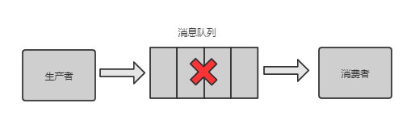

消息队列的消息可以放到内存中，或将内存中的消息转到硬盘（比如数据库）中，一般都是内存和硬盘中都存有消息。如果只是放在内存中，那么当机器重启了，消息就全部丢失了。如果是硬盘中，则可能存在一种极端情况，就是将内存中的数据转换到硬盘的期间中，消息队列出问题了，未能将消息持久化到硬盘。

**解决方案**

- 创建 `Queue` 的时候将其设置为持久化。
- 发送消息的时候将消息的 `deliveryMode` 设置为 2 。
- 开启生产者 `confirm` 模式，可以重试发送消息。


### 消费者丢失消息

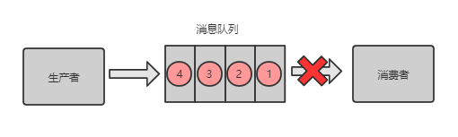

消费者刚拿到数据，还没开始处理消息，结果进程因为异常退出了，消费者没有机会再次拿到消息。

**解决方案**

- 关闭 RabbitMQ 的自动 `ack`，每次生产者将消息写入消息队列后，就自动回传一个 `ack` 给生产者。
- 消费者处理完消息再主动 `ack`，告诉消息队列我处理完了。

**问题：** 那这种主动 `ack` 有什么漏洞了？如果 主动 `ack` 的时候挂了，怎么办？

则可能会被再次消费，这个时候就需要幂等处理了。

**问题：** 如果这条消息一直被重复消费怎么办？

则需要有加上重试次数的监测，如果超过一定次数则将消息丢失，记录到异常表或发送异常通知给值班人员。


## 消息队列 —— 消息乱序

## 消息队列 —— 消息积压

## 消息队列 —— 消息过期失效

## 消息队列 —— 队列写满

## Redis —— 数据丢失

## 分库分表 —— 扩容

## 分库分表 —— 唯一ID

## 分布式事务


