<div style="color:#16b0ff;font-size:50px;font-weight: 900;text-shadow: 5px 5px 10px var(--theme-color);font-family: 'Comic Sans MS';">BigData</div>

<span style="color:#16b0ff;font-size:20px;font-weight: 900;font-family: 'Comic Sans MS';">Author</span>：李茹钰（`echo`）

<span style="color:#16b0ff;font-size:20px;font-weight: 900;font-family: 'Comic Sans MS';">Introduction</span>：收纳技术相关的基础知识 `Redis`、`RocketMQ`、`Zookeeper`、`Netty`、`Tomcat` 等总结！

[TOC]

# Hadoop

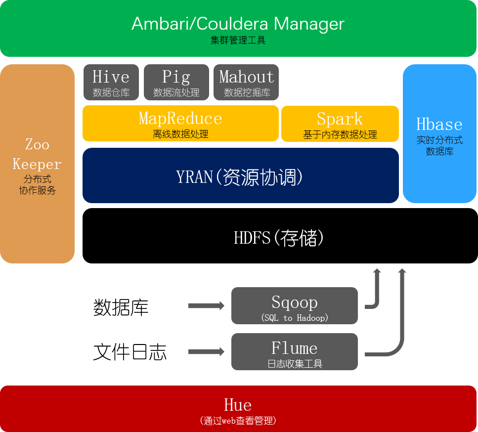


# 数据采集

## Flume

Flume是一个分布式、可靠、和高可用的海量日志采集、聚合和传输的系统。支持在日志系统中定制各类数据发送方，用于收集数据。同时，Flume提供对数据进行简单处理，并写到各种数据接受方(比如文本、HDFS、Hbase等)的能力 。

### 应用架构

#


### 安装使用

第一步：在apache-flume-1.7.0-bin\conf目录下创建一个example.conf配置文件。然后把官文档中的案例内容复制到example.conf文件中，如下内容：

```properties
# example.conf: A single-node Flume configuration

# Name the components on this agent
a1.sources = r1
a1.sinks = k1
a1.channels = c1

# Describe/configure the source
a1.sources.r1.type = netcat
a1.sources.r1.bind = localhost
a1.sources.r1.port = 44444

# Describe the sink
a1.sinks.k1.type = logger

# Use a channel which buffers events in memory
a1.channels.c1.type = memory
a1.channels.c1.capacity = 1000
a1.channels.c1.transactionCapacity = 100

# Bind the source and sink to the channel
a1.sources.r1.channels = c1
a1.sinks.k1.channel = c1
```

第二步：进入到解压flume目录中执行命令，文档中的执行命令如下：

```shell
[root@mini3 apache-flume-1.7.0-bin]# bin/flume-ng agent --conf conf --conf-file conf/example.conf --name a1 -Dflume.root.logger=INFO,console
```

**参数的简要说明**：指明conf文件路径、指明conf文件、指定agent、指明log打印信息级别和位置。执行效果：

```shell
Info: Including Hive libraries found via () for Hive access
+ exec /usr/local/jdk1.7.0_65/bin/java -Xmx20m -Dflume.root.logger=INFO,console -cp '/usr/local/apache-flume-1.7.0-bin/conf:/usr/local/apache-flume-1.7.0-bin/lib/*:/lib/*' -Djava.library.path= org.apache.flume.node.Application --conf-file example.conf --name a1
......
2018-01-31 18:14:45,870 (lifecycleSupervisor-1-4) [INFO - org.apache.flume.source.NetcatSource.start(NetcatSource.java:155)] Source starting
2018-01-31 18:14:45,894 (lifecycleSupervisor-1-4) [INFO - org.apache.flume.source.NetcatSource.start(NetcatSource.java:169)] Created serverSocket:sun.nio.ch.ServerSocketChannelImpl[/127.0.0.1:44444]
```

如上打印日志，启动成功。

第三步：通过telnet客户端进行测试。另开一个终端命令行：输入命令

```shell
telnet localhost 44444
```

连接成功后即可进行模拟通信，即经过44444端口发送消息，让flume监听到。执行结果如下：

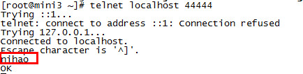

flume后台监听打印：

```shell
2018-01-31 18:15:48,913 (SinkRunner-PollingRunner-DefaultSinkProcessor) [INFO - org.apache.flume.sink.LoggerSink.process(LoggerSink.java:95)] Event: { headers:{} body: 6E 69 68 61 6F 0D                               nihao. }
```

注：如果不能使用telnet，通过yum安装即可。


## Kafka

Kafka是最初由Linkedin公司开发，是一个分布式、分区的、多副本的、多订阅者，基于zookeeper协调的分布式日志系统（也可以当做MQ系统），常见可以用于web/nginx日志、访问日志，消息服务等等，Linkedin于2010年贡献给了Apache基金会并成为顶级开源项目。主要应用场景是：日志收集系统和消息系统。Kafka主要设计目标如下：

- 以时间复杂度为O(1)的方式提供消息持久化能力，即使对TB级以上数据也能保证常数时间的访问性能
- 高吞吐率。即使在非常廉价的商用机器上也能做到单机支持每秒100K条消息的传输
- 支持Kafka Server间的消息分区，及分布式消费，同时保证每个partition内的消息顺序传输
- 同时支持离线数据处理和实时数据处理
- Scale out:支持在线水平扩展

消息传递模式：**点对点传递模式、发布-订阅模式**。大部分消息系统选用发布-订阅模式。**Kafka就是一种发布-订阅模式**。


### Kafka架构


kafka支持消息持久化，消费端是主动拉取数据，消费状态和订阅关系由客户端负责维护，**消息消费完后，不会立即删除，会保留历史消息**。因此支持多订阅时，消息只会存储一份就可以。

- **broker**：kafka集群中包含一个或者多个服务实例（节点），这种服务实例被称为broker（一个broker就是一个节点/一个服务器）
- **topic**：每条发布到kafka集群的消息都属于某个类别，这个类别就叫做topic
- **partition**：partition是一个物理上的概念，每个topic包含一个或者多个partition
- **segment**：一个partition当中存在多个segment文件段，每个segment分为两部分，.log文件和 .index 文件，其中 .index 文件是索引文件，主要用于快速查询， .log 文件当中数据的偏移量位置
- **producer**：消息的生产者，负责发布消息到 kafka 的 broker 中
- **consumer**：消息的消费者，向 kafka 的 broker 中读取消息的客户端
- **consumer group**：消费者组，每一个 consumer 属于一个特定的 consumer group（可以为每个consumer指定 groupName）
- **.log**：存放数据文件
- **.index**：存放.log文件的索引数据


### Kafka优点

- **解耦**

  在项目启动之初来预测将来项目会碰到什么需求，是极其困难的。消息系统在处理过程中间插入了一个隐含的、基于数据的接口层，两边的处理过程都要实现这一接口。这允许你独立的扩展或修改两边的处理过程，只要确保它们遵守同样的接口约束。

- **冗余（副本）**

  有些情况下，处理数据的过程会失败。除非数据被持久化，否则将造成丢失。消息队列把数据进行持久化直到它们已经被完全处理，通过这一方式规避了数据丢失风险。许多消息队列所采用的"插入-获取-删除"范式中，在把一个消息从队列中删除之前，需要你的处理系统明确的指出该消息已经被处理完毕，从而确保你的数据被安全的保存直到你使用完毕。

- **扩展性**

  因为消息队列解耦了你的处理过程，所以增大消息入队和处理的频率是很容易的，只要另外增加处理过程即可。不需要改变代码、不需要调节参数。扩展就像调大电力按钮一样简单。

- **灵活性&峰值处理能力**

  在访问量剧增的情况下，应用仍然需要继续发挥作用，但是这样的突发流量并不常见；如果为以能处理这类峰值访问为标准来投入资源随时待命无疑是巨大的浪费。使用消息队列能够使关键组件顶住突发的访问压力，而不会因为突发的超负荷的请求而完全崩溃。

- **可恢复性**

  系统的一部分组件失效时，不会影响到整个系统。消息队列降低了进程间的耦合度，所以即使一个处理消息的进程挂掉，加入队列中的消息仍然可以在系统恢复后被处理。

- **顺序保证**

  在大多使用场景下，数据处理的顺序都很重要。大部分消息队列本来就是排序的，并且能保证数据会按照特定的顺序来处理。Kafka保证一个Partition内的消息的有序性。

- **缓冲**

  在任何重要的系统中，都会有需要不同的处理时间的元素。例如，加载一张图片比应用过滤器花费更少的时间。消息队列通过一个缓冲层来帮助任务最高效率的执行———写入队列的处理会尽可能的快速。该缓冲有助于控制和优化数据流经过系统的速度。

- **异步通信**

  很多时候，用户不想也不需要立即处理消息。消息队列提供了异步处理机制，允许用户把一个消息放入队列，但并不立即处理它。想向队列中放入多少消息就放多少，然后在需要的时候再去处理它们。


### 主要组件

#### broker

Kafka 服务器，负责消息存储和转发；一个 broker 就代表一个 kafka 节点。**一个 broker 可以包含多个 topic**。


#### topic（主题）

- kafka将消息以topic为单位进行归类
- topic特指kafka处理的消息源（feeds of messages）的不同分类
- topic是一种分类或者发布的一些列记录的名义上的名字。kafka主题始终是支持多用户订阅的；也就是说，一 个主题可以有零个，一个或者多个消费者订阅写入的数据
- 在kafka集群中，可以有无数的主题
- 生产者和消费者消费数据一般以主题为单位。更细粒度可以到分区级别

kafka学习了数据库里面的设计，在里面设计了topic（主题），这个东西类似于关系型数据库的表

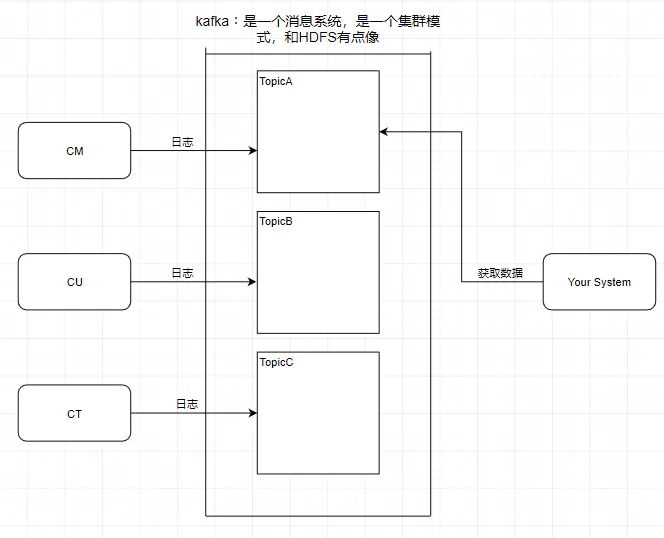

此时我需要获取数据，那就直接监听TopicA即可。


#### partition（分区）

kafka当中，topic是消息的归类，一个topic可以有多个分区（partition），每个分区保存部分topic的数据，所有的partition当中的数据全部合并起来，就是一个topic当中的所有的数据。一个broker服务下，可以创建多个分区，broker数与分区数没有关系；  在kafka中，每一个分区会有一个编号：编号从0开始。**每一个分区内的数据是有序的，但全局的数据不能保证是有序的。**（有序是指生产什么样顺序，消费时也是什么样的顺序）

kafka还有一个概念叫Partition（分区），分区具体在服务器上面表现起初就是一个目录，一个主题下面有多个分区，这些分区会存储到不同的服务器上面，或者说，其实就是在不同的主机上建了不同的目录。这些分区主要的信息就存在了.log文件里面。跟数据库里面的分区差不多，是为了提高性能。

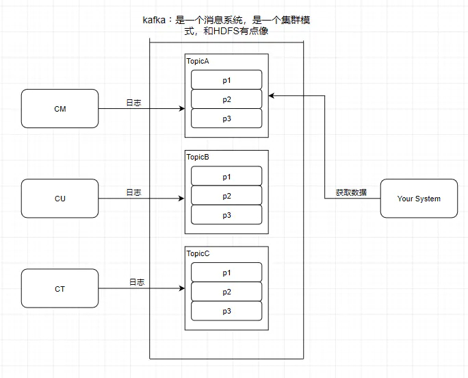

至于为什么提高了性能，很简单，多个分区多个线程，多个线程并行处理肯定会比单线程好得多

Topic和partition像是HBASE里的table和region的概念，table只是一个逻辑上的概念，真正存储数据的是region，这些region会分布式地存储在各个服务器上面，对应于kafka，也是一样，**Topic也是逻辑概念**，而partition就是分布式存储单元。这个设计是保证了海量数据处理的基础。我们可以对比一下，如果HDFS没有block的设计，一个100T的文件也只能单独放在一个服务器上面，那就直接占满整个服务器了，引入block后，大文件可以分散存储在不同的服务器上。

注意：

1.分区会有单点故障问题，所以我们会为每个分区设置副本数

2.分区的编号是从0开始的


topic 的分区，一个 topic 可以包含多个 partition，topic 消息保存在各个 partition 上；由于一个 topic 能被分到多个分区上，给 kafka 提供给了并行的处理能力，这也正是 kafka 高吞吐的原因之一。

partition 物理上由多个 segment 文件组成，每个 segment 大小相等，**顺序读写（这也是 kafka 比较快的原因之一，不需要随机写）**。每个 Segment 数据文件以该段中最小的 offset ，文件扩展名为.log。当查找 offset 的 Message 的时候，通过二分查找快找到 Message 所处于的 Segment 中。

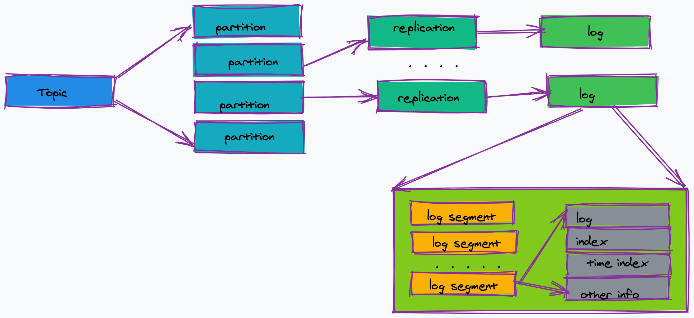


#### offset

- 消息在日志中的位置，可以理解是消息在 partition 上的偏移量，也是代表该消息的**唯一序号**。
- 同时也是主从之间的需要同步的信息

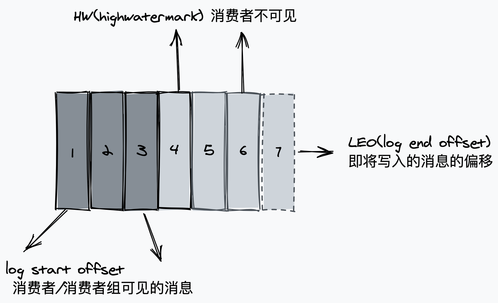


#### producer（生产者）

producer主要是用于生产消息，是kafka当中的消息生产者，生产的消息通过topic进行归类，保存到kafka的broker里面。往消息系统里面发送数据的就是生产者。

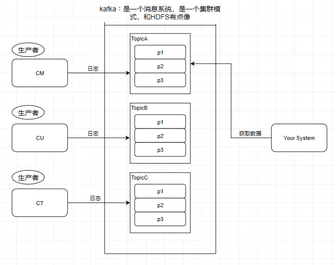


#### consumer（消费者）

consumer是kafka当中的消费者，主要用于消费kafka当中的数据，消费者一定是归属于某个消费组中的。从kafka里读取数据的就是消费者：

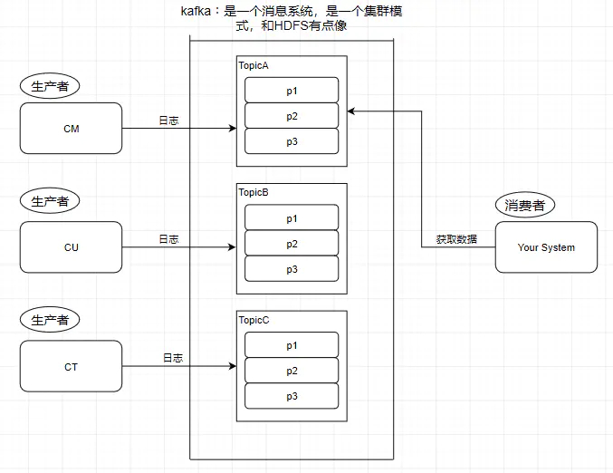


#### consumer group（消费者组）

消费者组由一个或者多个消费者组成，**同一个组中的消费者对于同一条消息只消费一次**。每个消费者都属于某个消费者组，如果不指定，那么所有的消费者都属于默认的组。每个消费者组都有一个ID，即group ID。组内的所有消费者协调在一起来消费一个订阅主题( topic)的所有分区(partition)。当然，**每个分区只能由同一个消费组内的一个消费者(consumer)来消费**，可以由不同的**消费组**来消费。partition数量决定了每个consumer group中并发消费者的最大数量。如下图：


如上面左图所示，如果只有两个分区，即使一个组内的消费者有4个，也会有两个空闲的。如上面右图所示，有4个分区，每个消费者消费一个分区，并发量达到最大4。在来看如下一幅图：


如上图所示，不同的消费者组消费同一个topic，这个topic有4个分区，分布在两个节点上。左边的 消费组1有两个消费者，每个消费者就要消费两个分区才能把消息完整的消费完，右边的 消费组2有四个消费者，每个消费者消费一个分区即可。


**总结下kafka中分区与消费组的关系**：

消费组：由一个或者多个消费者组成，同一个组中的消费者对于同一条消息只消费一次。

某一个主题下的分区数，对于消费该主题的同一个消费组下的消费者数量，应该小于等于该主题下的分区数。

如：某一个主题有4个分区，那么消费组中的消费者应该小于等于4，而且最好与分区数成整数倍 1   2  4 这样。同一个分区下的数据，在同一时刻，不能同一个消费组的不同消费者消费。

总结：**分区数越多，同一时间可以有越多的消费者来进行消费，消费数据的速度就会越快，提高消费的性能**。


#### partition replicas（分区副本）

kafka 中的分区副本如下图所示：


**副本数**（replication-factor）：控制消息保存在几个broker（服务器）上，一般情况下副本数等于broker的个数。

一个broker服务下，不可以创建多个副本因子。**创建主题时，副本因子应该小于等于可用的broker数**。副本因子操作以分区为单位的。每个分区都有各自的主副本和从副本；主副本叫做leader，从副本叫做 follower（在有多个副本的情况下，kafka会为同一个分区下的所有分区，设定角色关系：一个leader和N个 follower），**处于同步状态的副本叫做in-sync-replicas(ISR)**。


#### segment文件

一个partition当中由多个segment文件组成，每个segment文件，包含两部分，一个是 .log 文件，另外一个是 .index 文件，其中 .log 文件包含了我们发送的数据存储，.index 文件，记录的是我们.log文件的数据索引值，便于我们加快数据查询速度。


#### message物理结构

生产者发送到kafka的每条消息，都被kafka包装成了一个message。message 的物理结构如下图所示：


所以生产者发送给kafka的消息并不是直接存储起来，而是经过kafka的包装，每条消息都是上图这个结构，只有最后一个字段才是真正生产者发送的消息数据。


#### zookeeper

管理 kafka 集群，负责存储了集群 broker、topic、partition 等 meta 数据存储，同时也负责 broker 故障发现，partition leader 选举，负载均衡等功能。

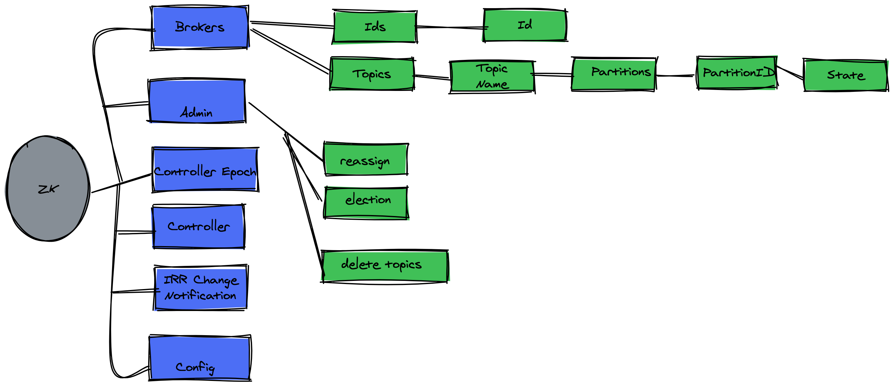


### 消息传递

#### 点对点消息传递模式

在点对点消息系统中，消息持久化到一个队列中。此时，将有一个或多个消费者消费队列中的数据。但是一条消息只能被消费一次。当一个消费者消费了队列中的某条数据之后，该条数据则从消息队列中删除。该模式即使有多个消费者同时消费数据，也能保证数据处理的顺序。这种架构描述示意图如下：


**生产者发送一条消息到queue，只有一个消费者能收到**。


#### 发布-订阅消息传递模式

在发布-订阅消息系统中，消息被持久化到一个topic中。与点对点消息系统不同的是，消费者可以订阅一个或多个topic，消费者可以消费该topic中所有的数据，同一条数据可以被多个消费者消费，数据被消费后不会立马删除。在发布-订阅消息系统中，消息的生产者称为发布者，消费者称为订阅者。该模式的示例图如下：


**发布者发送到topic的消息，只有订阅了topic的订阅者才会收到消息**。


### 服务治理

既然 Kafka 是分布式的发布/订阅系统，这样如果做的集群之间数据同步和一致性，kafka 是不是肯定不会丢消息呢？以及宕机的时候如果进行 Leader 选举呢？


#### 数据同步

在 Kafka 中的 Partition 有一个 leader 与多个 follower，producer 往某个 Partition 中写入数据是，只会往 leader 中写入数据，然后数据才会被复制进其他的 Replica 中。而每一个 follower 可以理解成一个消费者，定期去 leader 去拉去消息。而只有数据同步了后，kafka 才会给生产者返回一个 ACK 告知消息已经存储落地了。


#### ISR

在 Kafka 中，为了保证性能，Kafka 不会采用强一致性的方式来同步主从的数据。而是维护了一个：in-sync Replica 的列表，Leader 不需要等待所有 Follower 都完成同步，只要在 ISR 中的 Follower 完成数据同步就可以发送 ack 给生产者即可认为消息同步完成。同时如果发现 ISR 里面某一个 follower 落后太多的话，就会把它剔除。

具体流程如下：

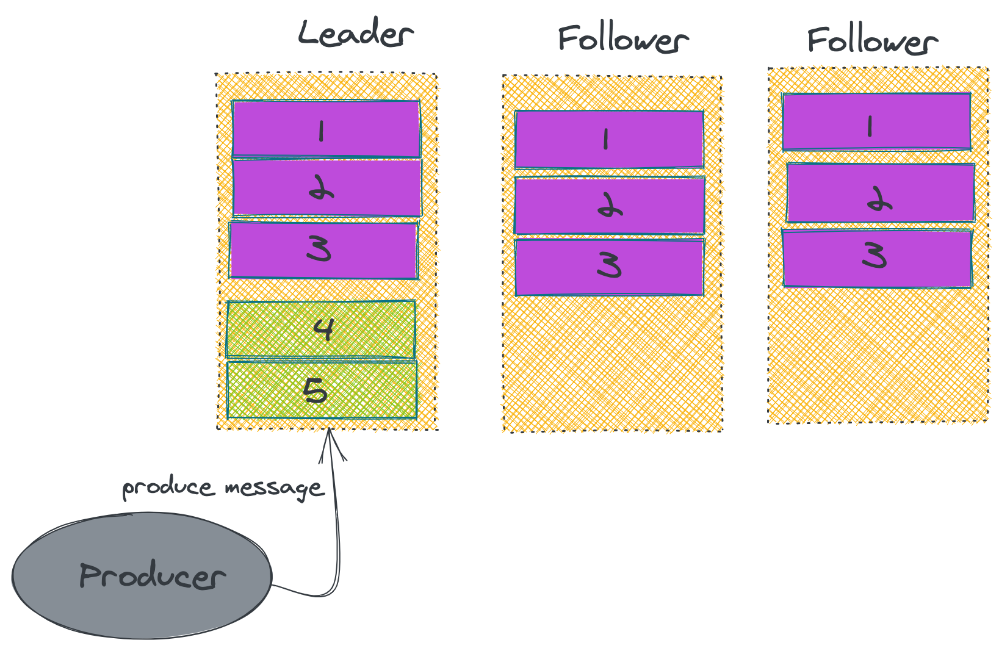

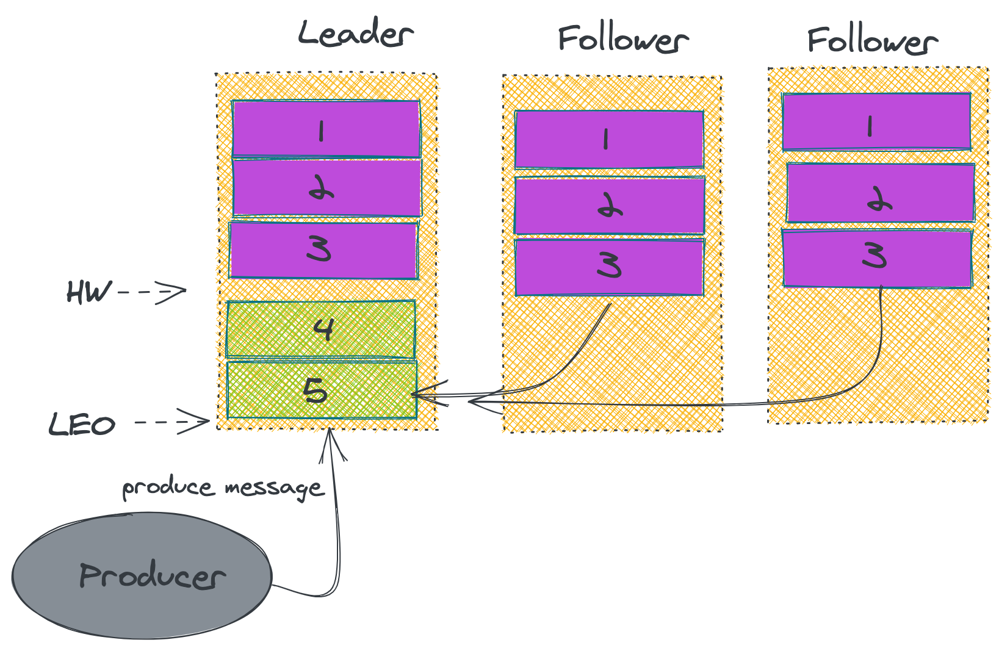

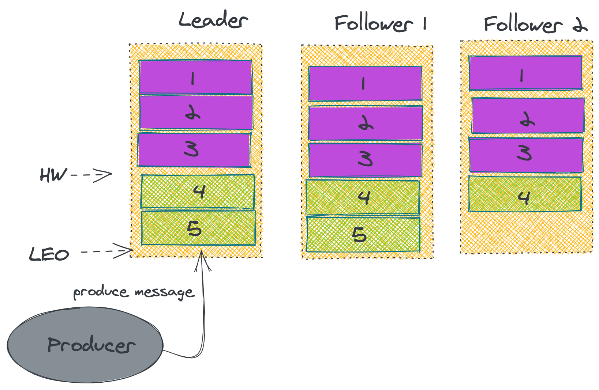

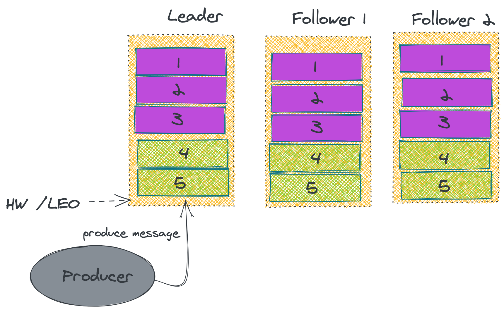

**上述的做法并无法保证 kafka 一定不丢消息。**虽然 Kafka 通过多副本机制中最大限度保证消息不会丢失，但是如果数据已经写入系统 page cache 中但是还没来得及刷入磁盘，此时突然机器宕机或者掉电，那消息自然而然的就会丢失。


#### Kafka故障恢复

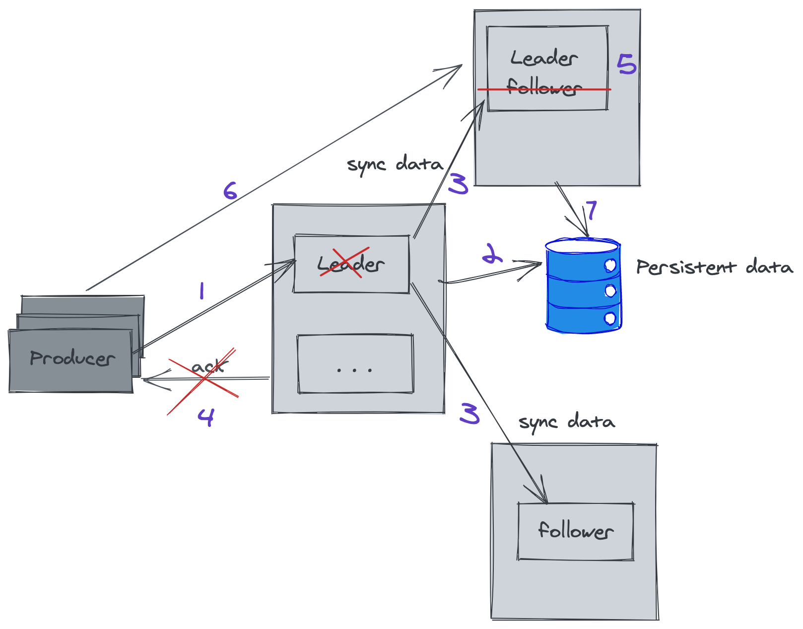

Kafka 通过 Zookeeper 连坐集群的管理，所以这里的选举机制采用的是 Zab(zookeeper 使用)。

- 生产者发生消息给 leader，这个时候 leader 完成数据存储，突然发生故障，没有给 producer 返回 ack
- 通过 ZK 选举，其中一个 follower 成为 leader，这个时候 producer 重新请求新的 leader，并存储数据


### 数据不丢失机制

#### 生产者生产数据不丢失

**发送消息方式**

生产者发送给kafka数据，可以采用**同步方式**或**异步方式**：

- **同步方式**

  发送一批数据给kafka后，等待kafka返回结果：

  - 生产者等待10s，如果broker没有给出ack响应，就认为失败
  - 生产者重试3次，如果还没有响应，就报错

- **异步方式**

  发送一批数据给kafka，只是提供一个回调函数：

  - 先将数据保存在生产者端的buffer中。buffer大小是2万条
  - 满足数据阈值或者数量阈值其中的一个条件就可以发送数据
  - 发送一批数据的大小是500条

注意：如果broker迟迟不给ack，而buffer又满了，开发者可以设置是否直接清空buffer中的数据。


**ack机制（确认机制）**

生产者数据发送出去，需要服务端返回一个确认码，即ack响应码；ack的响应有三个状态值：

- 0：生产者只负责发送数据，不关心数据是否丢失，丢失的数据，需要再次发送

- 1：partition的leader收到数据，不管follow是否同步完数据，响应的状态码为1

- -1：所有的从节点都收到数据，响应的状态码为-1

**注意**：如果broker端一直不返回ack状态，producer永远不知道是否成功；producer可以设置一个超时时间10s，超过时间认为失败。


#### broker中数据不丢失

在broker中，保证数据不丢失主要是通过副本因子（冗余），防止数据丢失。


#### 消费者消费数据不丢失

在消费者消费数据的时候，只要每个消费者记录好offset值即可，就能保证数据不丢失。也就是需要我们自己维护偏移量(offset)，可保存在 Redis 中。


### 常见问题

**问题一：Kafka性能好在什么地方？**

- **顺序写磁盘**

  操作系统每次从磁盘读写数据的时候，需要先寻址，也就是先要找到数据在磁盘上的物理位置，然后再进行数据读写，如果是机械硬盘，寻址就需要较长的时间。 kafka的设计中，数据其实是存储在磁盘上面，一般来说，会把数据存储在内存上面性能才会好。但是kafka用的是顺序写，追加数据是追加到末尾，磁盘顺序写的性能极高，在磁盘个数一定，转数达到一定的情况下，基本和内存速度一致。随机写的话是在文件的某个位置修改数据，性能会较低。

- **Page Cache**

  Kafka 在 OS 系统方面使用了 Page Cache 而不是我们平常所用的 Buffer。Page Cache 其实不陌生，也不是什么新鲜事物

  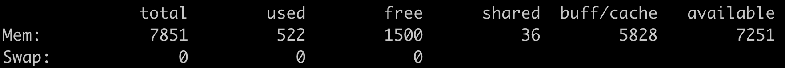

  我们在 linux 上查看内存的时候，经常可以看到 buff/cache，两者都是用来加速 IO 读写用的，而 cache 是作用于读，也就是说，磁盘的内容可以读到 cache 里面这样，应用程序读磁盘就非常快；而 buff 是作用于写，我们开发写磁盘都是，一般如果写入一个 buff 里面再 flush 就非常快。而 kafka 正是把这两者发挥了极致：

  Kafka 虽然是 scala 写的，但是依旧在 Java 的虚拟机上运行，尽管如此，它尽量避开了 JVM 的限制，它利用了 Page cache 来存储，这样躲开了数据在 JVM 因为 GC 而发生的 STD。另一方面也是 Page Cache 使得它实现了零拷贝，具体下面会讲。

- **零拷贝**

  先来看看非零拷贝的情况：

  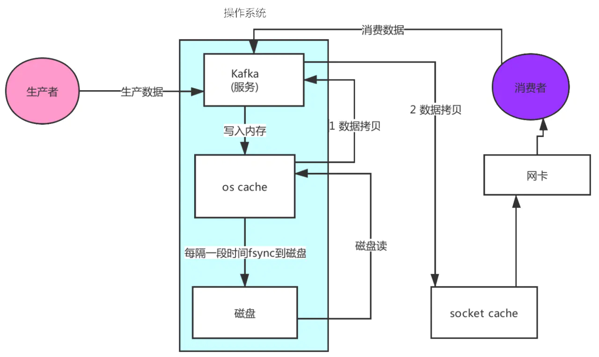

  可以看到数据的拷贝从内存拷贝到kafka服务进程那块，又拷贝到socket缓存那块，整个过程耗费的时间比较高，kafka利用了Linux的sendFile技术（NIO），省去了进程切换和一次数据拷贝，让性能变得更好。

  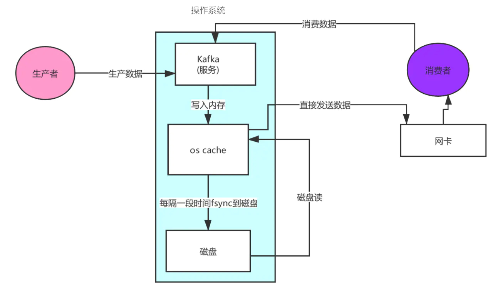

  **传统的一次应用程请求数据的过程**

  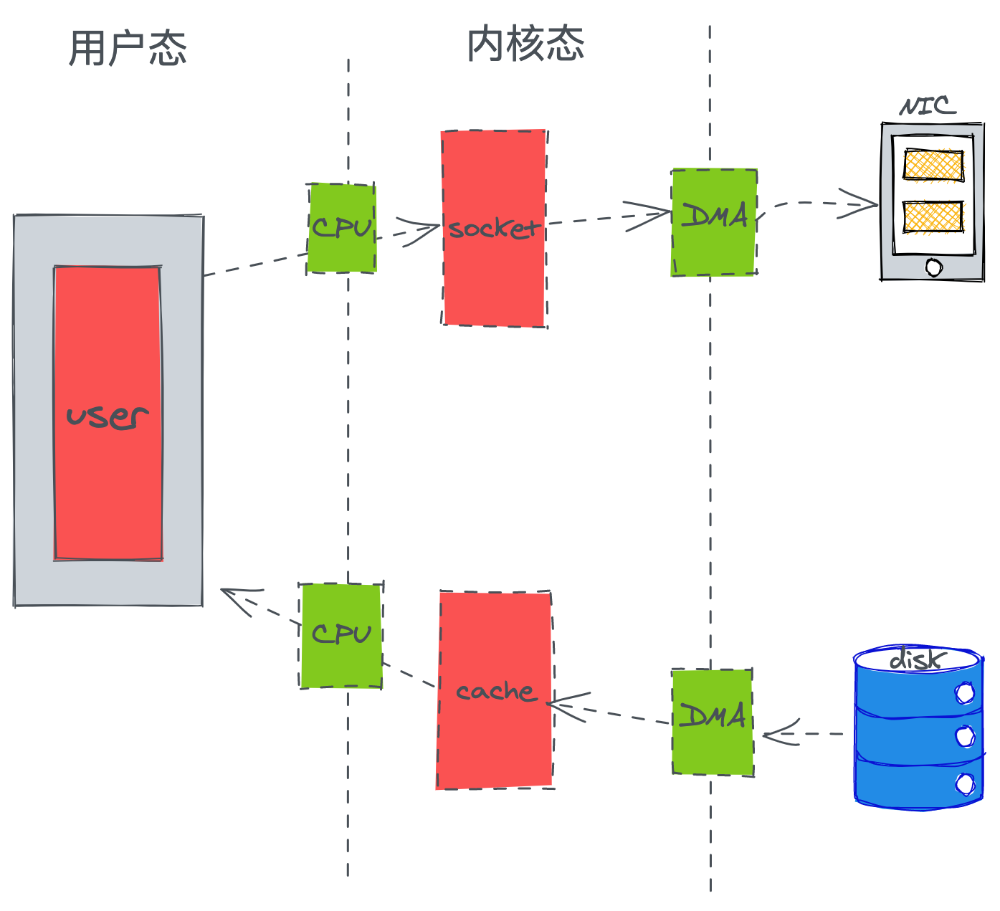

  这里大致可以发传统的方式发生了 4 次拷贝，2 次 DMA 和 2 次 CPU，而 CPU 发生了 4 次的切换。（DMA 简单理解就是，在进行 I/O 设备和内存的数据传输的时候，数据搬运的工作全部交给 DMA 控制器，而 CPU 不再参与任何与数据搬运相关的事情）

  **零拷贝的方式**

  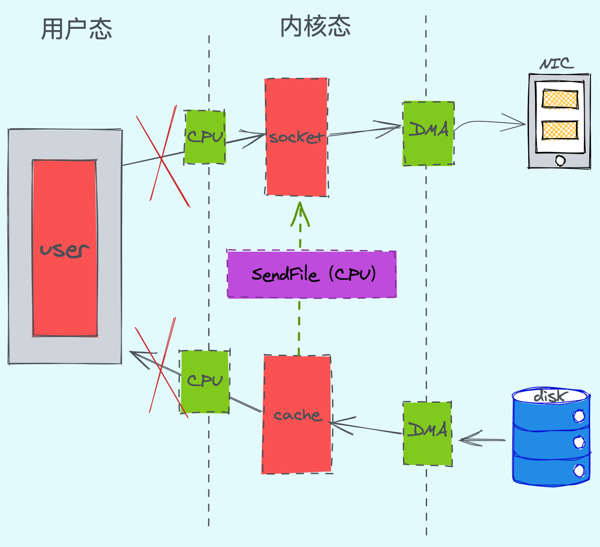

  通过优化我们可以发现，CPU 只发生了 2 次的上下文切换和 3 次数据拷贝。（linux 系统提供了系统事故调用函数“ sendfile()”，这样系统调用，可以直接把内核缓冲区里的数据拷贝到 socket 缓冲区里，不再拷贝到用户态）

- **分区分段**

  我们上面也介绍过了，kafka 采取了分区的模式，而每一个分区又对应到一个物理分段，而查找的时候可以根据二分查找快速定位。这样不仅提供了数据读的查询效率，也提供了并行操作的方式。

- **数据压缩**

  Kafka 对数据提供了：Gzip 和 Snappy 压缩协议等压缩协议，对消息结构体进行了压缩，一方面减少了带宽，也减少了数据传输的消耗。


**问题二：日志如何分段存储？**

Kafka规定了一个分区内的.log文件最大为1G，做这个限制目的是为了方便把.log加载到内存去操作

```shell
00000000000000000000.index
00000000000000000000.log
00000000000000000000.timeindex

00000000000005367851.index
00000000000005367851.log
00000000000005367851.timeindex

00000000000009936472.index
00000000000009936472.log
00000000000009936472.timeindex
```

这个9936472之类的数字，就是代表了这个日志段文件里包含的起始offset，也就说明这个分区里至少都写入了接近1000万条数据了。Kafka broker有一个参数，log.segment.bytes，限定了每个日志段文件的大小，最大就是1GB，一个日志段文件满了，就自动开一个新的日志段文件来写入，避免单个文件过大，影响文件的读写性能，这个过程叫做log rolling，正在被写入的那个日志段文件，叫做active log segment。如果大家有看前面的两篇有关于HDFS的文章时，就会发现NameNode的edits log也会做出限制，所以这些框架都是会考虑到这些问题。


**问题三：Kafka如何网络设计？**

kafka的网络设计和Kafka的调优有关，这也是为什么它能支持高并发的原因：

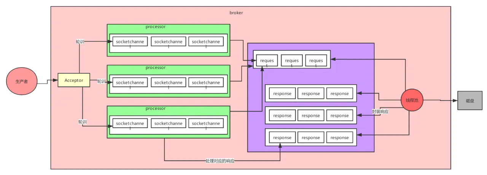

首先客户端发送请求全部会先发送给一个Acceptor，broker里面会存在3个线程（默认是3个），这3个线程都是叫做processor，Acceptor不会对客户端的请求做任何的处理，直接封装成一个个socketChannel发送给这些processor形成一个队列，发送的方式是轮询，就是先给第一个processor发送，然后再给第二个，第三个，然后又回到第一个。消费者线程去消费这些socketChannel时，会获取一个个request请求，这些request请求中就会伴随着数据。

线程池里面默认有8个线程，这些线程是用来处理request的，解析请求，如果request是写请求，就写到磁盘里。读的话返回结果。 processor会从response中读取响应数据，然后再返回给客户端。这就是Kafka的网络三层架构。

所以如果我们需要对kafka进行增强调优，增加processor并增加线程池里面的处理线程，就可以达到效果。request和response那一块部分其实就是起到了一个缓存的效果，是考虑到processor们生成请求太快，线程数不够不能及时处理的问题。所以这就是一个加强版的reactor网络线程模型。


### 安装Kafka

第一步：安装 JDK

第二步：安装 Zookeeper

第三步：下载Kafka：https://www.apache.org/dyn/closer.cgi?path=/kafka/2.8.0/kafka-2.8.0-src.tgz

第四步：安装Kafka：

```javascript
 tar -xzvf kafka_2.12-2.0.0.tgz 
```

第五步：配置环境变量：

```javascript
  export ZK=/usr/local/src/apache-zookeeper-3.7.0-bin
 export PATH=$PATH:$ZK/bin
 export KAFKA=/usr/local/src/kafka
 export PATH=$PATH:$KAFKA/bin
```

第六步：启动Kafka：

```javascript
 nohup kafka-server-start.sh 自己的配置文件路径/server.properties &
```

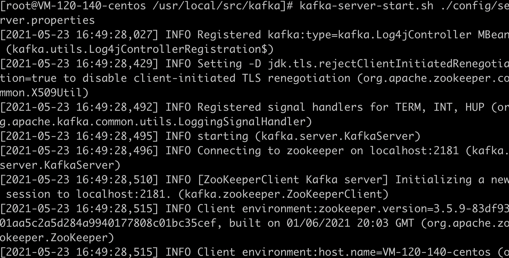


### Spring Boot案例

第一步：添加依赖

```xml
<dependency>
	<groupId>org.springframework.kafka</groupId>
	<artifactId>spring-kafka</artifactId>
</dependency>
```

第二步：配置文件application.yml

```yaml
kafka:
    bootstrap:
        servers: localhost:9092
    topic:
        user: topic-user
    group:
        id: group-user
```

第三步：创建kafka生产者类

```java
/**
 * Kafka消息生产类
 */
@Log
@Component
public class KafkaProducer {
    @Resource
    private KafkaTemplate<String, String> kafkaTemplate;
    @Value("${kafka.topic.user}")
    private String topicUser;// topic名称
    /**
     * 发送用户消息
     * @param user 用户信息
     */
    public void sendUserMessage(User user) {
        GsonBuilder builder = new GsonBuilder();
        builder.setPrettyPrinting();
        builder.setDateFormat("yyyy-MM-dd HH:mm:ss");
        String message = builder.create().toJson(user);
        kafkaTemplate.send(topicUser, message);
        log.info("\n生产消息至Kafka\n" + message);
    }
}

/**
 * 测试控制器
 */
@RestController
@RequestMapping("/kafka")
public class KafkaController {
    @Autowired
    private User user;
    @Autowired
    private KafkaProducer kafkaProducer;
    @RequestMapping("/createMsg")
    public void createMsg() {
        kafkaProducer.sendUserMessage(user);
    }
}
```

第四步：创建kafka消费者类，并通过控制器调用

```java
public class KafkaConsumerDemo {

    @Value("${kafka.topic.user}")
    private String topicUser;// topic名称

    public void consume() {
        Properties props = new Properties();
        // 必须设置的属性
        props.put("bootstrap.servers", "127.0.0.1:9092");
        props.put("key.deserializer", "org.apache.kafka.common.serialization.StringDeserializer");
        props.put("value.deserializer", "org.apache.kafka.common.serialization.StringDeserializer");
        props.put("group.id", "group-user");
        // 自动提交offset,每1s提交一次（提交后的消息不再消费，避免重复消费问题）
        props.put("enable.auto.commit", "true");// 自动提交offset:true【PS：只有当消息提交后，此消息才不会被再次接受到】
        props.put("auto.commit.interval.ms", "1000");// 自动提交的间隔
        /**
         * 消费方式配置
         * earliest： 当各分区下有已提交的offset时，从提交的offset开始消费；无提交的offset时，从头开始消费
         * latest： 当各分区下有已提交的offset时，从提交的offset开始消费；无提交的offset时，消费新产生的该分区下的数据
         * none： topic各分区都存在已提交的offset时，从offset后开始消费；只要有一个分区不存在已提交的offset，则抛出异常
         */
        props.put("auto.offset.reset", "earliest ");
        // 拉取消息设置，每次poll操作最多拉取多少条消息（一般不主动设置，取默认的就好）
        props.put("max.poll.records", "100 ");

        //根据上面的配置，新增消费者对象
        KafkaConsumer<String, String> consumer = new KafkaConsumer<>(props);
        // 订阅topic-user topic
        consumer.subscribe(Collections.singletonList(topicUser));
        while (true) {
            //  从服务器开始拉取数据
            ConsumerRecords<String, String> records = consumer.poll(Duration.ofMillis(100));
            records.forEach(record -> {
                System.out.printf("成功消费消息：topic = %s ,partition = %d,offset = %d, key = %s, value = %s%n", 
                                  record.topic(), record.partition(), record.offset(), record.key(), record.value());
            });
        }
    }
}
```


# 数据存储

## HBase

HBase是一个高可靠性、高性能、面向列、可伸缩的分布式存储系统，利用HBase技术可在廉价PC Server上搭建大规模结构化的存储集群。HBase的目标是存储并处理大型数据，具体来说是仅需使用普通的硬件配置，就能够处理由成千上万的行和列所组成的大型数据。与MapReduce的离线批处理计算框架不同，HBase是一个可以随机访问的存储和检索数据平台，弥补了HDFS不能随机访问数据的缺陷，适合实时性要求不是非常高的业务场景。HBase存储的都是Byte数组，它不介意数据类型，允许动态、灵活的数据模型。

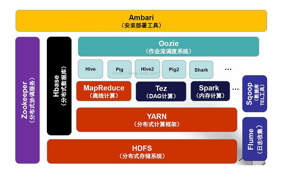

上图描述了Hadoop 2.0生态系统中的各层结构。其中HBase位于结构化存储层，HDFS为HBase提供了高可靠性的底层存储支持， MapReduce为HBase提供了高性能的批处理能力，Zookeeper为HBase提供了稳定服务和failover机制，Pig和Hive为HBase提供了进行数据统计处理的高层语言支持，Sqoop则为HBase提供了便捷的RDBMS数据导入功能，使业务数据从传统数据库向HBase迁移变的非常方便。


HBase是基于列存储、构建在HDFS上的分布式存储系统，其主要功能是存储海量结构化数据。HBase构建在HDFS之上，因此HBase也是通过增加廉价的PC机提高系统运行和存储的能力。HBase中存储的表有如下特点：

- 大表：一个表可以有数十亿行，上百万列
- 无模式：每行都有一个可排序主键和任意多的列，列可以根据需要动态的增加，同一张表中不同的行可以有截然不同的列
- 面向列：面向列（族）的存储和权限控制，列（族）独立检索
- 稀疏：对于空（null）的列，并不占用存储空间，表可以设计的非常稀疏
- 数据多版本：每个单元中的数据可以有多个版本，默认情况下版本号自动分配，是单元格插入时的时间戳
- 数据类型单一：Hbase中的数据都是字符串，没有类型


### 基本架构

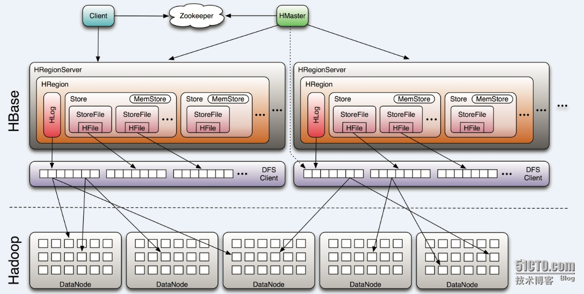

由上图可知，hbase包括Clinet、HMaster、HRegionServer、ZooKeeper组件：

- Client

  Client主要通过ZooKeeper与Hbaser和HRegionServer通信，对于管理操作：client向master发起请求，对于数据读写操作：client向regionserver发起请求

- ZooKeeper

  zk负责存储root表的地址，也负责存储当前服务的master地址,regsion server也会将自身的信息注册到zk中，以便master能够感知region server的状态，zk也会协调active master，也就是可以提供一个选举master leader,也会协调各个region server的容灾流程

- HMaster

  master可以启动多个master，master主要负责table和region的管理工作，响应用户对表的CRUD操作，管理region server的负载均衡，调整region 的分布和分配，当region server停机后，负责对失效的regionn进行迁移操作

- HRegionServer

  region server主要负责响应用户的IO请求，并把IO请求转换为读写HDFS的操作


### 使用场景

**适用场景**

- 存在高并发读写
- 表结构的列族经常需要调整
- 存储结构化或半结构化数据
- 高并发的key-value存储
- key随机写入，有序存储
- 针对每个key保存一个固定大小的集合  多版本


**不适用场景**

- 由于hbase只能提供行锁，它对分布式事务支持不好
- 对于查询操作中的join、group by 性能很差
- 查询如果不使用row-key，性能会很差，因为此时会进行全表扫描，建立二级索引或多级索引需要同时维护一张索引表
- 高并发的随机读支持有限


### SpringBoot案例

**第一步：引入相关依赖**

```xml
 <dependency>
	<groupId>org.springframework.data</groupId>
	<artifactId>spring-data-hadoop-hbase</artifactId>
	<version>2.5.0.RELEASE</version>
</dependency>
<dependency>
	<groupId>org.apache.hbase</groupId>
	<artifactId>hbase-client</artifactId>
	<version>1.1.2</version>
</dependency>
<dependency>
	<groupId>org.springframework.data</groupId>
	<artifactId>spring-data-hadoop</artifactId>
	<version>2.5.0.RELEASE</version>
</dependency>
```

**第二步：增加配置**

官方提供的方式是通过xml方式，简单改写后如下：

```java
@Configuration
public class HBaseConfiguration {

    @Value("${hbase.zookeeper.quorum}")
    private String zookeeperQuorum;

    @Value("${hbase.zookeeper.property.clientPort}")
    private String clientPort;

    @Value("${zookeeper.znode.parent}")
    private String znodeParent;

    @Bean
    public HbaseTemplate hbaseTemplate() {
        org.apache.hadoop.conf.Configuration conf = new org.apache.hadoop.conf.Configuration();
        conf.set("hbase.zookeeper.quorum", zookeeperQuorum);
        conf.set("hbase.zookeeper.property.clientPort", clientPort);
        conf.set("zookeeper.znode.parent", znodeParent);
        return new HbaseTemplate(conf);
    }
}
```

application.yml

```yml
hbase:
  zookeeper:
    quorum: hbase1.xxx.org,hbase2.xxx.org,hbase3.xxx.org
    property:
      clientPort: 2181

zookeeper:
  znode:
    parent: /hbase
```

**第三步：在service类注入HBaseTemplate**

```java
@Service
@Slf4j
public class HBaseService {

    @Autowired
    private HbaseTemplate hbaseTemplate;

    public List<Result> getRowKeyAndColumn(String tableName, String startRowkey, String stopRowkey, String column, String qualifier) {
        FilterList filterList = new FilterList(FilterList.Operator.MUST_PASS_ALL);
        if (StringUtils.isNotBlank(column)) {
            log.debug("{}", column);
            filterList.addFilter(new FamilyFilter(CompareFilter.CompareOp.EQUAL, new BinaryComparator(Bytes.toBytes(column))));
        }
        if (StringUtils.isNotBlank(qualifier)) {
            log.debug("{}", qualifier);
            filterList.addFilter(new QualifierFilter(CompareFilter.CompareOp.EQUAL, new BinaryComparator(Bytes.toBytes(qualifier))));
        }
        Scan scan = new Scan();
        if (filterList.getFilters().size() > 0) {
            scan.setFilter(filterList);
        }
        scan.setStartRow(Bytes.toBytes(startRowkey));
        scan.setStopRow(Bytes.toBytes(stopRowkey));

        return hbaseTemplate.find(tableName, scan, (rowMapper, rowNum) -> rowMapper);
    }

    public List<Result> getListRowkeyData(String tableName, List<String> rowKeys, String familyColumn, String column) {
        return rowKeys.stream().map(rk -> {
            if (StringUtils.isNotBlank(familyColumn)) {
                if (StringUtils.isNotBlank(column)) {
                    return hbaseTemplate.get(tableName, rk, familyColumn, column, (rowMapper, rowNum) -> rowMapper);
                } else {
                    return hbaseTemplate.get(tableName, rk, familyColumn, (rowMapper, rowNum) -> rowMapper);
                }
            }
            return hbaseTemplate.get(tableName, rk, (rowMapper, rowNum) -> rowMapper);
        }).collect(Collectors.toList());
    }
}
```


## HDFS

随着数据量越来越大，在一个操作系统存不下所有的数据，那么就分配到更多的操作系统管理的磁盘中，但是不方便管理和维护，迫切需要一种系统来管理多台机器上的文件，这就是分布式文件管理系统。HDFS只是分布式文件管理系统中的一种。

HDFS（Hadoop Distributed File System），它是一个文件系统，用于存储文件，通过目录树来定位文件；其次，它是分布式的，由很多服务器联合起来实现其功能，集群中的服务器有各自的角色。

**使用场景**：适合一次写入，多次读出的场景，且不支持文件的修改。适合用来做数据分析，并不适合用来做网盘应用。


**HDFS优缺点**

- 优点
  - 高容错性
    - 数据自动保存多个副本。它通过增加副本的形式，提高容错性
    - 某一个副本丢失以后，它可以自动恢复
  - 适合处理大数据
  - 可构建在廉价机器上，通过多副本机制，提高可靠性

- 缺点
  - 不适合低延时数据访问，比如毫秒级的存储数据
  - 无法高效的对大量小文件进行存储
  - 不支持并发写入、文件随机修改


### HDFS组成架构

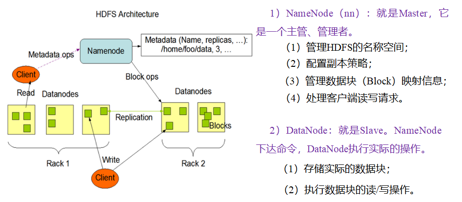

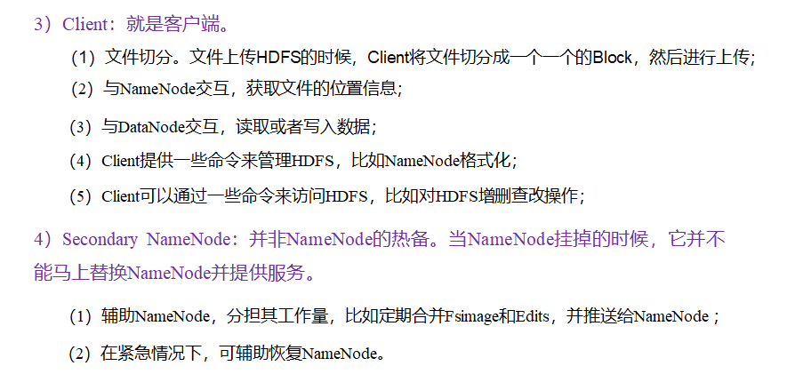


**HDFS文件块大小**

HDFS 中的文件在物理上是分块存储（Block），块的大小可以通过配置参数（dfs.blocksize）来规定，默认大小在Hadoop2.x 版本中是 128M，老版本中是 64M。

如果寻址时间为 100ms，即查找目标 Block 的时间是 100ms。寻址时间与传输时间的比例为 100 : 1为最佳状态，因此传输时间为 1ms。目前磁盘的传输速率大概在 100MB/s，取个整大概就是 128MB。


**客户端操作**

```java
import org.apache.hadoop.conf.Configuration;
import org.apache.hadoop.fs.*;
import org.junit.After;
import org.junit.Before;
import org.junit.Test;

import java.io.IOException;
import java.net.URI;

public class HdfsClient {

    FileSystem fileSystem = null;

    @Before
    public void init() {
        try {
            fileSystem = FileSystem.get(URI.create("hdfs://hadoop102:9000"), new Configuration(), "djm");
        } catch (IOException e) {
            e.printStackTrace();
        } catch (InterruptedException e) {
            e.printStackTrace();
        }
    }

    /**
     * 上传文件
     */
    @Test
    public void put() {
        try {
            fileSystem.copyFromLocalFile(new Path("C:\\Users\\Administrator\\Desktop\\Hadoop 入门.md"), new Path("/"));
        } catch (IOException e) {
            e.printStackTrace();
        }
    }

    /**
     * 下载文件
     */
    @Test
    public void download() {
        try {
            // useRawLocalFileSystem表示是否开启文件校验
            fileSystem.copyToLocalFile(false, new Path("/Hadoop 入门.md"), 
                                       new Path("C:\\Users\\Administrator\\Desktop\\Hadoop 入门1.md"), true);
        } catch (IOException e) {
            e.printStackTrace();
        }
    }

    /**
     * 删除文件
     */
    @Test
    public void delete() {
        try {
            // recursive表示是否递归删除
            fileSystem.delete(new Path("/Hadoop 入门.md"), true);
        } catch (IOException e) {
            e.printStackTrace();
        }
    }

    /**
     * 文件重命名
     */
    @Test
    public void rename() {
        try {
            fileSystem.rename(new Path("/tmp"), new Path("/temp"));
        } catch (IOException e) {
            e.printStackTrace();
        }
    }

    /**
     * 查看文件信息
     */
    @Test
    public void ls() {
        try {
            RemoteIterator<locatedfilestatus> listFiles = fileSystem.listFiles(new Path("/etc"), true);
            while (listFiles.hasNext()) {
                LocatedFileStatus fileStatus = listFiles.next();
                if (fileStatus.isFile()) {
                    // 仅输出文件信息
                    System.out.print(fileStatus.getPath().getName() + "   " + 
                                     fileStatus.getLen() + "   " + fileStatus.getPermission() + "   "  + fileStatus.getGroup() + "   ");
                    // 获取文件块信息
                    BlockLocation[] blockLocations = fileStatus.getBlockLocations();
                    for (BlockLocation blockLocation : blockLocations) {
                        // 获取节点信息
                        String[] hosts = blockLocation.getHosts();
                        for (String host : hosts) {
                            System.out.print(host + "   ");
                        }
                    }
                    System.out.println();
                }

            }
        } catch (IOException e) {
            e.printStackTrace();
        }
    }

    @After
    public void exit() {
        try {
            fileSystem.close();
        } catch (IOException e) {
            e.printStackTrace();
        }
    }
}
```


### HDFS写数据流程

**剖析文件写入**

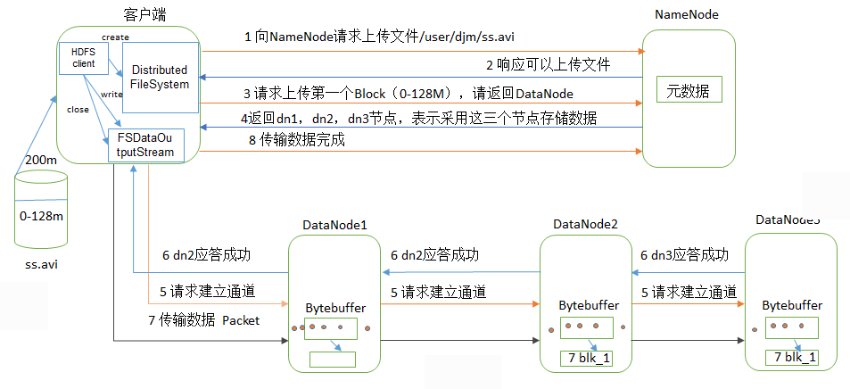

- 客户端通过 Distributed FileSystem 模块向 NameNode 请求上传文件，NameNode 检查目标文件是否已存在，父目录是否存在
- NameNode 返回是否可以上传
- 客户端请求第一个 Block 上传到哪几个 DataNode
- NameNode 返回三个节点，分别是 dn1、dn2、dn3
- 客户端通过 FSDataOutputStream 模块请求 dn1 上传数据，dn1 收到请求会继续调用 dn2，然后 dn2 调用 dn3，将这个通信管道建立完成
- 按倒序逐级响应客户端
- 客户端开始往 dn1 上传第一个 Block（先从磁盘读取数据放到一个本地内存缓存），以 Packet 为单位，dn1 收到一个Packet 就会传给 dn2，dn2 传给 dn3；dn1 每传一个 packet 会放入一个应答队列等待应答
- 当一个Block传输完成之后，客户端再次请求NameNode上传第二个Block的服务器


**网络拓扑-节点距离计算**

在HDFS写数据过程中，NameNode会选择距离待上传数据最近距离的DataNode接收数据。那么这个最近距离怎么计算呢？

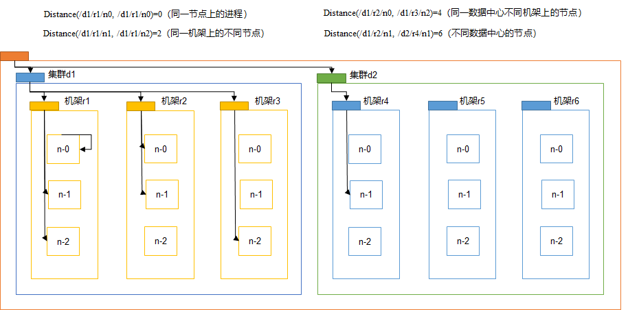


**机架感知**

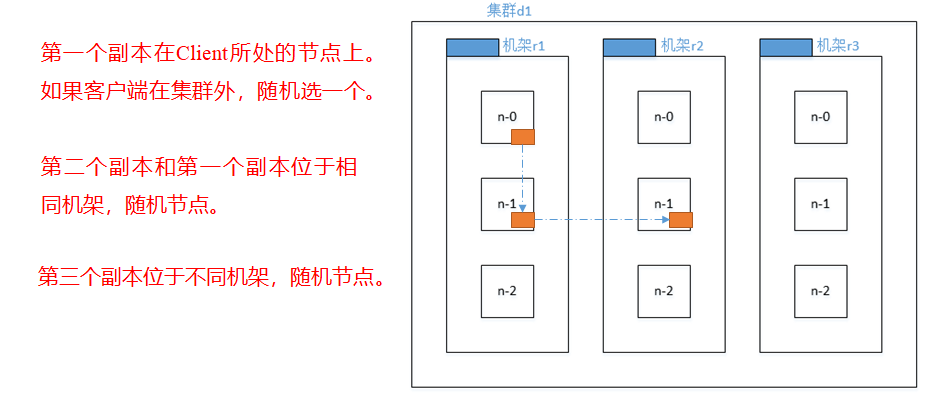


### HDFS读数据流程


- 客户端通过 Distributed FileSystem 向 NameNode 请求下载文件，NameNode通过查询元数据，找到文件块所在的DataNode地址
- 根据就近原则挑选一台 DataNode，请求读取数据
- DataNode 开始传输数据给客户端
- 客户端以 Packet 为单位接收，先在本地缓存，然后写入目标文件


### DataNode

**DataNode工作机制**

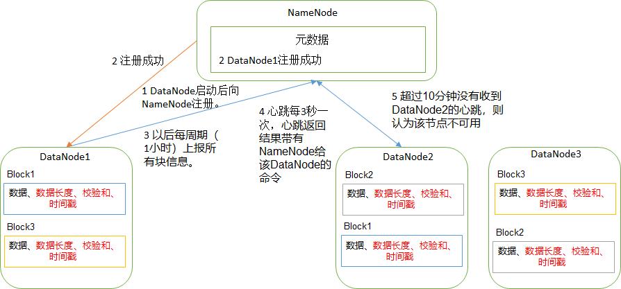

- 一个数据块在 DataNode 上以文件形式存储在磁盘上，包括两个文件，一个是数据本身，一个是元数据包括数据块的长度，块数据的校验和，以及时间戳
- DataNode 启动后向 NameNode 注册，通过后，周期性（1小时）的向 NameNode 上报所有的块信息
- 心跳是每 3 秒一次，心跳返回结果带有 NameNode 给该 DataNode 的命令如复制块数据到另一台机器，或删除某个数据块，如果超过 10 分钟没有收到某个 DataNode 的心跳，则认为该节点不可用
- 集群运行中可以安全加入和退出一些机器


**数据完整性**

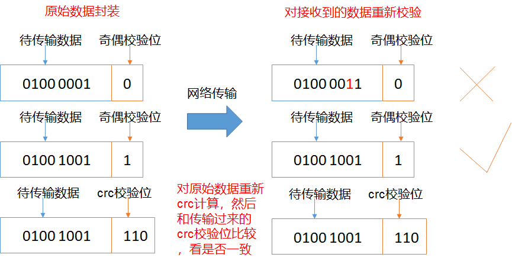

- 当 DataNode 读取 Block 的时候，它会计算 CheckSum
- 如果计算后的 CheckSum，与 Block 创建时值不一样，说明 Block 已经损坏
- Client 读取其他 DataNode 上的 Block
- 在其文件创建后周期验证


### 掉线时限参数设置

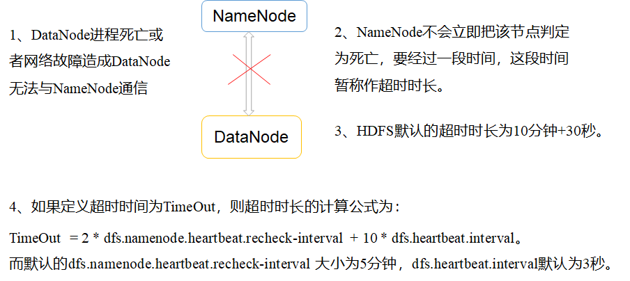

[hdfs-site.xml]

```xml
<property>
    <name>dfs.namenode.heartbeat.recheck-interval</name>
    <value>300000</value>
    <description>毫秒</description>
</property>
<property>
    <name>dfs.heartbeat.interval</name>
    <value>3</value>
    <description>秒</description>
</property>1.2.3.4.5.6.7.8.9.10.
```


### 服役新数据节点

将 hadoop102 上的 java、hadoop、profile 发送到新主机，source 一下 profile，直接启动即可加入集群。


### HDFS 2.X新特性

**集群间数据拷贝**

采用 distcp 命令实现两个 Hadoop 集群之间的递归数据复制

```shell
[djm@hadoop102 hadoop-2.7.2]$  hadoop distcp hdfs://haoop102:9000/user/djm/hello.txt hdfs://hadoop103:9000/user/djm/hello.txt
```


**小文件存档**

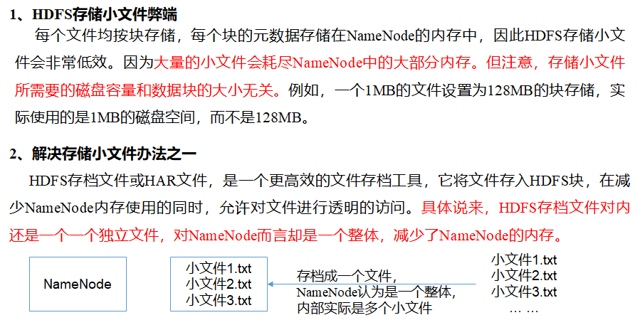


# 数据分析

## Apache Storm

在Storm中，需要先设计一个实时计算结构，我们称之为拓扑（topology）。之后，这个拓扑结构会被提交给集群，其中主节点（master node）负责给工作节点（worker node）分配代码，工作节点负责执行代码。在一个拓扑结构中，包含spout和bolt两种角色。数据在spouts之间传递，这些spouts将数据流以tuple元组的形式发送；而bolt则负责转换数据流。


## Apache Spark

Spark Streaming，即核心Spark API的扩展，不像Storm那样一次处理一个数据流。相反，它在处理数据流之前，会按照时间间隔对数据流进行分段切分。Spark针对连续数据流的抽象，我们称为DStream（Discretized Stream）。 DStream是小批处理的RDD（弹性分布式数据集）， RDD则是分布式数据集，可以通过任意函数和滑动数据窗口（窗口计算）进行转换，实现并行操作。

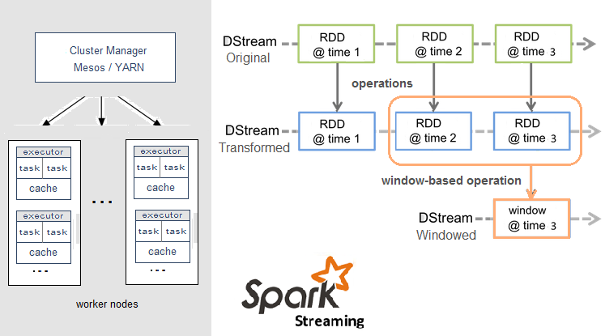


## Apache Flink

Apache Flink是一个**框架**和**分布式处理引擎**，用于在**无界**和**有界**数据流上进行**有状态的计算**。Flink被设计为在所有常见的集群环境中运行，以内存中的速度和任何规模执行计算。


针对流数据+批数据的计算框架。把批数据看作流数据的一种特例，延迟性较低(毫秒级)，且能保证消息传输不丢失不重复。

Flink创造性地统一了流处理和批处理，作为流处理看待时输入数据流是无界的，而批处理被作为一种特殊的流处理，只是它的输入数据流被定义为有界的。Flink程序由Stream和Transformation这两个基本构建块组成，其中Stream是一个中间结果数据，而Transformation是一个操作，它对一个或多个输入Stream进行计算处理，输出一个或多个结果Stream。


### 处理无界和有界数据

数据可以作为无界流或有界流被处理：

- **Unbounded streams**（无界流）有一个起点，但没有定义的终点。它们不会终止，而且会源源不断的提供数据。无边界的流必须被连续地处理，即事件达到后必须被立即处理。等待所有输入数据到达是不可能的，因为输入是无界的，并且在任何时间点都不会完成。处理无边界的数据通常要求以特定顺序（例如，事件发生的顺序）接收事件，以便能够推断出结果的完整性。
- **Bounded streams**（有界流）有一个定义的开始和结束。在执行任何计算之前，可以通过摄取（提取）所有数据来处理有界流。处理有界流不需要有序摄取，因为有界数据集总是可以排序的。有界流的处理也称为批处理。


**Apache Flink擅长处理无界和有界数据集**。对时间和状态的精确控制使Flink的运行时能够在无边界的流上运行任何类型的应用程序。有界流由专门为固定大小的数据集设计的算法和数据结构在内部处理，从而产生出色的性能。


### 分层API

Flink提供了三层API。每个API在简洁性和表达性之间提供了不同的权衡，并且针对不同的使用场景


### 应用场景

Apache Flink是开发和运行许多不同类型应用程序的最佳选择，因为它具有丰富的特性。Flink的特性包括支持流和批处理、复杂的状态管理、事件处理语义以及确保状态的一致性。此外，Flink可以部署在各种资源提供程序上，例如YARN、Apache Mesos和Kubernetes，也可以作为裸机硬件上的独立集群进行部署。配置为高可用性，Flink没有单点故障。Flink已经被证明可以扩展到数千个内核和TB级的应用程序状态，提供高吞吐量和低延迟，并支持世界上一些最苛刻的流处理应用程序。

下面是Flink支持的最常见的应用程序类型：

- Event-driven Applications（事件驱动的应用程序）
- Data Analytics Applications（数据分析应用程序）
- Data Pipeline Applications（数据管道应用程序）


#### Event-driven Applications

Event-driven Applications（事件驱动的应用程序）。事件驱动的应用程序是一个有状态的应用程序，它从一个或多个事件流中获取事件，并通过触发计算、状态更新或外部操作对传入的事件作出反应。

事件驱动的应用程序基于有状态的流处理应用程序。在这种设计中，数据和计算被放在一起，从而可以进行本地(内存或磁盘)数据访问。通过定期将检查点写入远程持久存储，可以实现容错。下图描述了传统应用程序体系结构和事件驱动应用程序之间的区别。


代替查询远程数据库，事件驱动的应用程序在本地访问其数据，从而在吞吐量和延迟方面获得更好的性能。可以定期异步地将检查点同步到远程持久存，而且支持增量同步。不仅如此，在分层架构中，多个应用程序共享同一个数据库是很常见的。因此，数据库的任何更改都需要协调，由于每个事件驱动的应用程序都负责自己的数据，因此更改数据表示或扩展应用程序所需的协调较少。

对于事件驱动的应用程序，Flink的突出特性是savepoint。保存点是一个一致的状态镜像，可以用作兼容应用程序的起点。给定一个保存点，就可以更新或调整应用程序的规模，或者可以启动应用程序的多个版本进行A/B测试。

典型的事件驱动的应用程序有：

- 欺诈检测
- 异常检测
- 基于规则的提醒
- 业务流程监控
- Web应用(社交网络) 


#### Data Analytics Applications

Data Analytics Applications（数据分析应用程序）。传统上的分析是作为批处理查询或应用程序对已记录事件的有限数据集执行的。为了将最新数据合并到分析结果中，必须将其添加到分析数据集中，然后重新运行查询或应用程序，结果被写入存储系统或作为报告发出。

有了复杂的流处理引擎，分析也可以以实时方式执行。流查询或应用程序不是读取有限的数据集，而是接收实时事件流，并在使用事件时不断地生成和更新结果。结果要么写入外部数据库，要么作为内部状态进行维护。Dashboard应用程序可以从外部数据库读取最新的结果，也可以直接查询应用程序的内部状态。

Apache Flink支持流以及批处理分析应用程序，如下图所示：


典型的数据分析应用程序有：

- 电信网络质量监控
- 产品更新分析及移动应用实验评估
- 消费者技术中实时数据的特别分析
- 大规模图分析


#### Data Pipeline Applications

Data Pipeline Applications（数据管道应用程序）。提取-转换-加载（ETL）是在存储系统之间转换和移动数据的常用方法。通常，会定期触发ETL作业，以便将数据从事务性数据库系统复制到分析数据库或数据仓库。

数据管道的作用类似于ETL作业。它们转换和丰富数据，并可以将数据从一个存储系统移动到另一个存储系统。但是，它们以连续流模式运行，而不是周期性地触发。因此，它们能够从不断产生数据的源读取记录，并以低延迟将其移动到目的地。例如，数据管道可以监视文件系统目录中的新文件，并将它们的数据写入事件日志。另一个应用程序可能将事件流物化到数据库，或者增量地构建和完善搜索索引。

下图描述了周期性ETL作业和连续数据管道之间的差异：


与周期性ETL作业相比，连续数据管道的明显优势是减少了将数据移至其目的地的等待时间。此外，数据管道更通用，可用于更多场景，因为它们能够连续消费和产生数据。

典型的数据管道应用程序有：

- 电商中实时搜索索引的建立
- 电商中的持续ETL 


### 安装Flink

https://flink.apache.org/downloads.html

下载安装包，这里下载的是 flink-1.10.1-bin-scala_2.11.tgz

安装参考 https://ci.apache.org/projects/flink/flink-docs-release-1.10/getting-started/tutorials/local_setup.html

```shell
./bin/start-cluster.sh  # Start Flink 
```

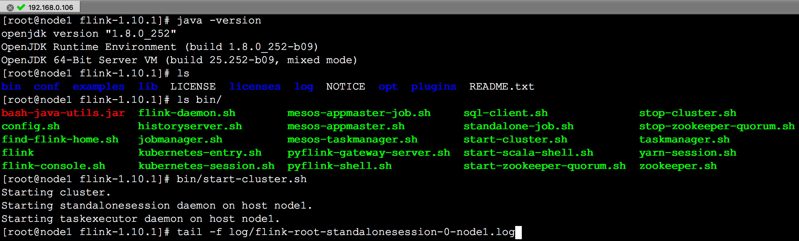

访问 http://localhost:8081

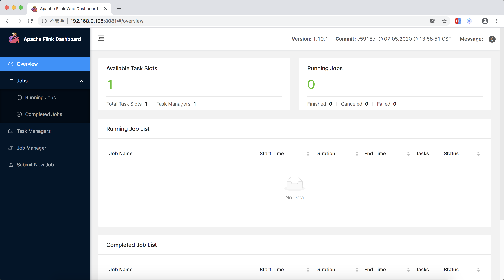

运行 WordCount 示例

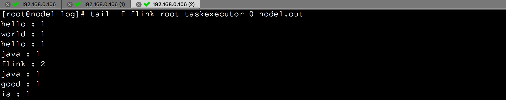

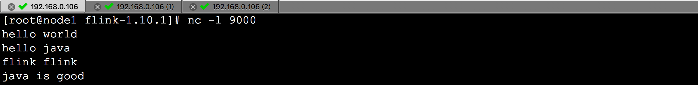

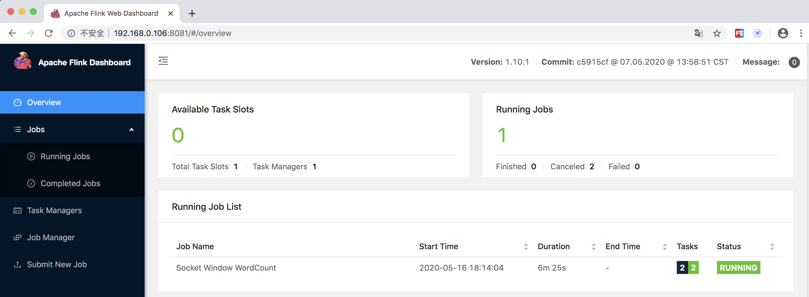 


### 商品实时推荐

基于Flink实现的商品实时推荐系统。flink统计商品热度，放入redis缓存，分析日志信息，将画像标签和实时记录放入Hbase。在用户发起推荐请求后，根据用户画像重排序热度榜，并结合协同过滤和标签两个推荐模块为新生成的榜单的每一个产品添加关联产品，最后返回新的用户列表。

#### 系统架构

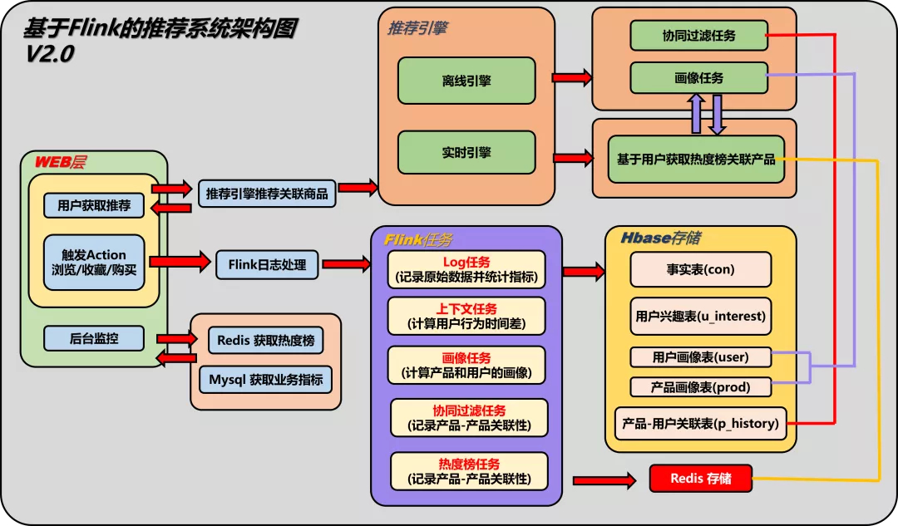

在日志数据模块(flink-2-hbase)中，又主要分为6个Flink任务:

- **用户-产品浏览历史 -> 实现基于协同过滤的推荐逻辑**

  通过Flink去记录用户浏览过这个类目下的哪些产品,为后面的基于Item的协同过滤做准备 实时的记录用户的评分到Hbase中,为后续离线处理做准备。数据存储在Hbase的p_history表

- **用户-兴趣 -> 实现基于上下文的推荐逻辑**

  根据用户对同一个产品的操作计算兴趣度,计算规则通过操作间隔时间(如购物 - 浏览 < 100s)则判定为一次兴趣事件 通过Flink的ValueState实现,如果用户的操作Action=3(收藏),则清除这个产品的state,如果超过100s没有出现Action=3的事件,也会清除这个state。数据存储在Hbase的u_interest表

- **用户画像计算 -> 实现基于标签的推荐逻辑**

  v1.0按照三个维度去计算用户画像,分别是用户的颜色兴趣,用户的产地兴趣,和用户的风格兴趣.根据日志不断的修改用户画像的数据,记录在Hbase中。数据存储在Hbase的user表

- **产品画像记录 -> 实现基于标签的推荐逻辑**

  用两个维度记录产品画像,一个是喜爱该产品的年龄段,另一个是性别。数据存储在Hbase的prod表

- **事实热度榜 -> 实现基于热度的推荐逻辑**

  通过Flink时间窗口机制,统计当前时间的实时热度,并将数据缓存在Redis中。通过Flink的窗口机制计算实时热度,使用ListState保存一次热度榜。数据存储在redis中,按照时间戳存储list

- **日志导入**

  从Kafka接收的数据直接导入进Hbase事实表,保存完整的日志log,日志中包含了用户Id,用户操作的产品id,操作时间,行为(如购买,点击,推荐等)。数据按时间窗口统计数据大屏需要的数据,返回前段展示。数据存储在Hbase的con表


#### 推荐引擎逻辑

**基于热度的推荐逻辑**

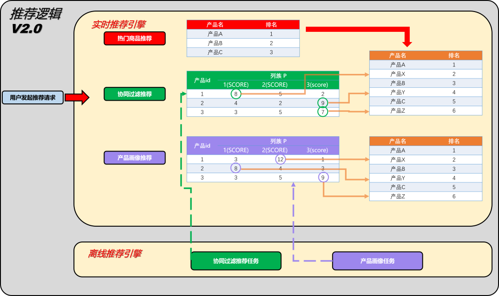

&#8203;根据用户特征，重新排序热度榜，之后根据两种推荐算法计算得到的产品相关度评分，为每个热度榜中的产品推荐几个关联的产品。


**基于产品画像的产品相似度计算方法**

基于产品画像的推荐逻辑依赖于产品画像和热度榜两个维度,产品画像有三个特征,包含color/country/style三个角度,通过计算用户对该类目产品的评分来过滤热度榜上的产品。

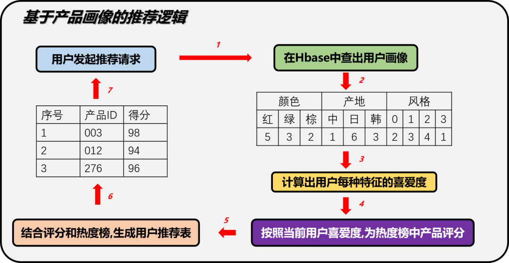

在已经有产品画像的基础上，计算item与item之间的关联系,通过余弦相似度来计算两两之间的评分，最后在已有物品选中的情况下推荐关联性更高的产品。

| 相似度 | A    | B    | C    |
| ------ | ---- | ---- | ---- |
| A      | 1    | 0.7  | 0.2  |
| B      | 0.7  | 1    | 0.6  |
| C      | 0.2  | 0.6  | 1    |


**基于协同过滤的产品相似度计算方法**

根据产品用户表（Hbase） 去计算公式得到相似度评分：
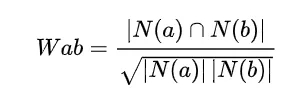


**前台推荐页面**

当前推荐结果分为3列，分别是热度榜推荐，协同过滤推荐和产品画像推荐：
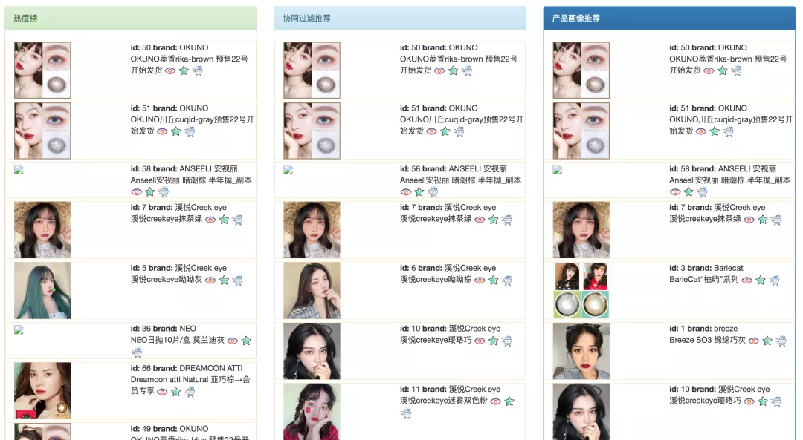


### 实时计算TopN热榜

本案例将实现一个“实时热门商品”的需求，我们可以将“实时热门商品”翻译成程序员更好理解的需求：每隔5分钟输出最近一小时内点击量最多的前 N 个商品。将这个需求进行分解我们大概要做这么几件事情：

- 抽取出业务时间戳，告诉 Flink 框架基于业务时间做窗口
- 过滤出点击行为数据
- 按一小时的窗口大小，每5分钟统计一次，做滑动窗口聚合（Sliding Window）
- 按每个窗口聚合，输出每个窗口中点击量前N名的商品


#### 数据准备

这里我们准备了一份淘宝用户行为数据集（来自[阿里云天池公开数据集](https://tianchi.aliyun.com/datalab/index.htm)）。本数据集包含了淘宝上某一天随机一百万用户的所有行为（包括点击、购买、加购、收藏）。数据集的组织形式和MovieLens-20M类似，即数据集的每一行表示一条用户行为，由用户ID、商品ID、商品类目ID、行为类型和时间戳组成，并以逗号分隔。关于数据集中每一列的详细描述如下：

| 列名称     | 说明                                               |
| :--------- | :------------------------------------------------- |
| 用户ID     | 整数类型，加密后的用户ID                           |
| 商品ID     | 整数类型，加密后的商品ID                           |
| 商品类目ID | 整数类型，加密后的商品所属类目ID                   |
| 行为类型   | 字符串，枚举类型，包括(‘pv’, ‘buy’, ‘cart’, ‘fav’) |
| 时间戳     | 行为发生的时间戳，单位秒                           |

你可以通过下面的命令下载数据集到项目的 `resources` 目录下：

```shell
$ cd my-flink-project/src/main/resources
$ curl https://raw.githubusercontent.com/wuchong/my-flink-project/master/src/main/resources/UserBehavior.csv > UserBehavior.csv
```

这里是否使用 curl 命令下载数据并不重要，你也可以使用 wget 命令或者直接访问链接下载数据。关键是，**将数据文件保存到项目的 `resources` 目录下**，方便应用程序访问。


#### 编写程序


#### 创建模拟数据源

我们先创建一个 `UserBehavior` 的 POJO 类（所有成员变量声明成`public`便是POJO类），强类型化后能方便后续的处理。

```java
/**
  * 用户行为数据结构
  **/
public static class UserBehavior {
  public long userId;         // 用户ID
  public long itemId;         // 商品ID
  public int categoryId;      // 商品类目ID
  public String behavior;     // 用户行为, 包括("pv", "buy", "cart", "fav")
  public long timestamp;      // 行为发生的时间戳，单位秒
}
```

接下来我们就可以创建一个 `PojoCsvInputFormat` 了， 这是一个读取 csv 文件并将每一行转成指定 POJO
类型（在我们案例中是 `UserBehavior`）的输入器。

```java
// UserBehavior.csv 的本地文件路径
URL fileUrl = HotItems2.class.getClassLoader().getResource("UserBehavior.csv");
Path filePath = Path.fromLocalFile(new File(fileUrl.toURI()));
// 抽取 UserBehavior 的 TypeInformation，是一个 PojoTypeInfo
PojoTypeInfo<UserBehavior> pojoType = (PojoTypeInfo<UserBehavior>) TypeExtractor.createTypeInfo(UserBehavior.class);
// 由于 Java 反射抽取出的字段顺序是不确定的，需要显式指定下文件中字段的顺序
String[] fieldOrder = new String[]{"userId", "itemId", "categoryId", "behavior", "timestamp"};
// 创建 PojoCsvInputFormat
PojoCsvInputFormat<UserBehavior> csvInput = new PojoCsvInputFormat<>(filePath, pojoType, fieldOrder);
```

下一步我们用 `PojoCsvInputFormat` 创建输入源。

```java
DataStream<UserBehavior> dataSource = env.createInput(csvInput, pojoType);
```

这就创建了一个 `UserBehavior` 类型的 `DataStream`。


#### EventTime与Watermark

当我们说“统计过去一小时内点击量”，这里的“一小时”是指什么呢？ 在 Flink 中它可以是指 ProcessingTime ，也可以是 EventTime，由用户决定。

- **ProcessingTime**：**事件被处理的时间**。也就是由机器的系统时间来决定
- **EventTime**：**事件发生的时间**。一般就是数据本身携带的时间

在本案例中，我们需要统计业务时间上的每小时的点击量，所以要基于 EventTime 来处理。那么如果让 Flink 按照我们想要的业务时间来处理呢？这里主要有两件事情要做：

- 告诉 Flink 我们现在按照 EventTime 模式进行处理，Flink 默认使用 ProcessingTime 处理，所以我们要显式设置下。

  ```java
  env.setStreamTimeCharacteristic(TimeCharacteristic.EventTime);
  ```

- 指定如何获得业务时间，以及生成 Watermark。Watermark 是用来追踪业务事件的概念，可以理解成 EventTime 世界中的时钟，用来指示当前处理到什么时刻的数据了。由于我们的数据源的数据已经经过整理，没有乱序，即事件的时间戳是单调递增的，所以可以将每条数据的业务时间就当做 Watermark。这里我们用 `AscendingTimestampExtractor` 来实现时间戳的抽取和 Watermark 的生成。


**注意**：真实业务场景一般都是存在乱序的，所以一般使用 `BoundedOutOfOrdernessTimestampExtractor`。

```java
DataStream<UserBehavior> timedData = dataSource
    .assignTimestampsAndWatermarks(new AscendingTimestampExtractor<UserBehavior>() {
      @Override
      public long extractAscendingTimestamp(UserBehavior userBehavior) {
            // 原始数据单位秒，将其转成毫秒
            return userBehavior.timestamp * 1000;
      }
    });
```

这样我们就得到了一个带有时间标记的数据流了，后面就能做一些窗口的操作。


#### 过滤出点击事件

在开始窗口操作之前，先回顾下需求“每隔5分钟输出过去一小时内点击量最多的前 N 个商品”。由于原始数据中存在点击、加购、购买、收藏各种行为的数据，但是我们只需要统计点击量，所以先使用 `FilterFunction` 将点击行为数据过滤出来。

```java
DataStream<UserBehavior> pvData = timedData
    .filter(new FilterFunction<UserBehavior>() {
              @Override
              public boolean filter(UserBehavior userBehavior) throws Exception {
                // 过滤出只有点击的数据
                return userBehavior.behavior.equals("pv");
              }
    });
```


#### 窗口统计点击量

由于要每隔5分钟统计一次最近一小时每个商品的点击量，所以窗口大小是一小时，每隔5分钟滑动一次。即分别要统计 [09:00, 10:00), [09:05, 10:05), [09:10, 10:10)… 等窗口的商品点击量。是一个常见的滑动窗口需求（Sliding Window）。

```java
DataStream<ItemViewCount> windowedData = pvData
     // 对商品进行分组
     .keyBy("itemId")
     // 对每个商品做滑动窗口（1小时窗口，5分钟滑动一次）
      .timeWindow(Time.minutes(60), Time.minutes(5))
     // 做增量的聚合操作，它能使用AggregateFunction提前聚合掉数据，减少 state 的存储压力
     .aggregate(new CountAgg(), new WindowResultFunction());
```


**CountAgg**

这里的`CountAgg`实现了`AggregateFunction`接口，功能是统计窗口中的条数，即遇到一条数据就加一。

```java
/**
  * COUNT 统计的聚合函数实现，每出现一条记录加一
  **/
public static class CountAgg implements AggregateFunction<UserBehavior, Long, Long> {
      @Override
      public Long createAccumulator() {
      		return 0L;
      }

      @Override
      public Long add(UserBehavior userBehavior, Long acc) {
        	return acc + 1;
      }

      @Override
      public Long getResult(Long acc) {
        	return acc;
      }

      @Override
      public Long merge(Long acc1, Long acc2) {
        	return acc1 + acc2;
      }
}
```


**WindowFunction**

`.aggregate(AggregateFunction af, WindowFunction wf)` 的第二个参数`WindowFunction`将每个 key每个窗口聚合后的结果带上其他信息进行输出。这里实现的`WindowResultFunction`将主键商品ID，窗口，点击量封装成了`ItemViewCount`进行输出。

```java
/**
  * 用于输出窗口的结果
  **/
public static class WindowResultFunction implements WindowFunction<Long, ItemViewCount, Tuple, TimeWindow> {
      @Override
      public void apply(
              Tuple key,  // 窗口的主键，即 itemId
              TimeWindow window,  // 窗口
              Iterable<Long> aggregateResult, // 聚合函数的结果，即 count 值
              Collector<ItemViewCount> collector  // 输出类型为 ItemViewCount
      ) throws Exception {
            Long itemId = ((Tuple1<Long>) key).f0;
            Long count = aggregateResult.iterator().next();
            collector.collect(ItemViewCount.of(itemId, window.getEnd(), count));
      }
}

/**
  * 商品点击量(窗口操作的输出类型)
  **/
public static class ItemViewCount {
      public long itemId;     // 商品ID
      public long windowEnd;  // 窗口结束时间戳
      public long viewCount;  // 商品的点击量
      public static ItemViewCount of(long itemId, long windowEnd, long viewCount) {
            ItemViewCount result = new ItemViewCount();
            result.itemId = itemId;
            result.windowEnd = windowEnd;
            result.viewCount = viewCount;
            return result;
      }
}
```

现在我们得到了每个商品在每个窗口的点击量的数据流。


#### TopN计算最热门商品

为了统计每个窗口下最热门的商品，我们需要再次按窗口进行分组，这里根据`ItemViewCount`中的`windowEnd`进行`keyBy()`操作。然后使用 `ProcessFunction` 实现一个自定义的 TopN 函数 `TopNHotItems` 来计算点击量排名前3名的商品，并将排名结果格式化成字符串，便于后续输出。

```java
DataStream<String> topItems = windowedData
    .keyBy("windowEnd")
    .process(new TopNHotItems(3));  // 求点击量前3名的商品
```

`ProcessFunction` 是 Flink 提供的一个 low-level API，用于实现更高级的功能。它主要提供了定时器 timer 的功能（支持EventTime或ProcessingTime）。本案例中我们将利用 timer 来判断何时**收齐**了某个 window 下所有商品的点击量数据。由于 Watermark 的进度是全局的，

在 `processElement` 方法中，每当收到一条数据（`ItemViewCount`），我们就注册一个 `windowEnd+1` 的定时器（Flink 框架会自动忽略同一时间的重复注册）。`windowEnd+1` 的定时器被触发时，意味着收到了`windowEnd+1`的 Watermark，即收齐了该`windowEnd`下的所有商品窗口统计值。我们在 `onTimer()` 中处理将收集的所有商品及点击量进行排序，选出 TopN，并将排名信息格式化成字符串后进行输出。

这里我们还使用了 `ListState` 来存储收到的每条 `ItemViewCount` 消息，保证在发生故障时，状态数据的不丢失和一致性。`ListState` 是 Flink 提供的类似 Java `List` 接口的 State API，它集成了框架的 checkpoint 机制，自动做到了 exactly-once 的语义保证。

```java
/**
  * 求某个窗口中前 N 名的热门点击商品，key 为窗口时间戳，输出为 TopN 的结果字符串
  **/
public static class TopNHotItems extends KeyedProcessFunction<Tuple, ItemViewCount, String> {
      private final int topSize;
      public TopNHotItems(int topSize) {
            this.topSize = topSize;
      }

      // 用于存储商品与点击数的状态，待收齐同一个窗口的数据后，再触发 TopN 计算
      private ListState<ItemViewCount> itemState;

      @Override
      public void open(Configuration parameters) throws Exception {
            super.open(parameters);
            // 状态的注册
            ListStateDescriptor<ItemViewCount> itemsStateDesc = new ListStateDescriptor<>("itemState-state", ItemViewCount.class);
            itemState = getRuntimeContext().getListState(itemsStateDesc);
      }

      @Override
      public void processElement(ItemViewCount input, Context context, Collector<String> collector) throws Exception {
            // 每条数据都保存到状态中
            itemState.add(input);
            // 注册 windowEnd+1 的 EventTime Timer, 当触发时，说明收齐了属于windowEnd窗口的所有商品数据
            context.timerService().registerEventTimeTimer(input.windowEnd + 1);
      }

      @Override
      public void onTimer(long timestamp, OnTimerContext ctx, Collector<String> out) throws Exception {
            // 获取收到的所有商品点击量
            List<ItemViewCount> allItems = new ArrayList<>();
            for (ItemViewCount item : itemState.get()) {
                allItems.add(item);
            }
            // 提前清除状态中的数据，释放空间
            itemState.clear();
            // 按照点击量从大到小排序
            allItems.sort(new Comparator<ItemViewCount>() {
                  @Override
                  public int compare(ItemViewCount o1, ItemViewCount o2) {
                        return (int) (o2.viewCount - o1.viewCount);
                  }
            });

            // 将排名信息格式化成 String, 便于打印
            StringBuilder result = new StringBuilder();
            result.append("====================================\n");
            result.append("时间: ").append(new Timestamp(timestamp-1)).append("\n");
            for (int i=0;i<topSize;i++) {
                  ItemViewCount currentItem = allItems.get(i);
                  // No1:  商品ID=12224  浏览量=2413
                  result.append("No").append(i).append(":")
                        .append("  商品ID=").append(currentItem.itemId)
                        .append("  浏览量=").append(currentItem.viewCount)
                        .append("\n");
            }
            result.append("====================================\n\n");
            out.collect(result.toString());
      }
}
```


#### 打印输出

最后一步我们将结果打印输出到控制台，并调用`env.execute`执行任务。

```java
topItems.print();
env.execute("Hot Items Job");
```


#### 运行程序

直接运行 main 函数，就能看到不断输出的每个时间点的热门商品ID。

