<div style="color:#16b0ff;font-size:50px;font-weight: 900;text-shadow: 5px 5px 10px var(--theme-color);font-family: 'Comic Sans MS';">Database</div>

<span style="color:#16b0ff;font-size:20px;font-weight: 900;font-family: 'Comic Sans MS';">Introduction</span>：收纳技术相关的数据库知识 `事务`、`索引`、`锁`、`SQL优化` 等总结！

[TOC]

# 数据库范式

- **1NF**：所有字段仅包含单值（即单个字段不可在分割使用）
- **2NF**：非键字段必须全完依赖于主键（不能是主键的部分）
- **3NF**：非键字段不能依赖于非键字段（禁止传递依赖）

- **BCNF**：并且主属性不依赖于主属性


- **第四范式（4NF）**：要求把同一表内的多对多关系删除


- **第五范式（5NF）**：从最终结构重新建立原始结构

> 四种范式之间的关系：
>
> 1NF→2NF：消去非主属性对键的部分函数依赖
>
> 2NF→3NF：消去非主属性对键的传递函数依赖
>
> 3NF→BCNF：消去主属性对键的传递函数依赖

## 第一范式(1NF)

**列都是不可再分**。即实体中的某个属性有多个值时，必须拆分为不同的属性。例如：

**用户信息表**

| 编号 | 姓名 | 年龄 | 地址                         |
| ---- | ---- | ---- | ---------------------------- |
| 1    | 小王 | 23   | 浙江省杭州市拱墅区湖州街51号 |

当实际需求对地址没有特定的要求下，这个用户信息表的每一列都是不可分割的。但是当实际需求对省份或者城市有特别要求时，这个用户信息表中的地址就是可以分割的，改为：

**用户信息表**

| 编号 | 姓名 | 年龄 | 省份   | 城市   | 详细地址         |
| ---- | ---- | ---- | ------ | ------ | ---------------- |
| 1    | 小王 | 23   | 浙江省 | 杭州市 | 拱墅区湖州街51号 |

**好处**

- 表结构相对清晰
- 易于查询


## 第二范式(2NF)

**每个表只描述一件事情**。满足第一范式（ 1NF）的情况下，每行必须有主键，且主键与非主键之间是完全函数依赖关系（消除部分子函数依赖）。即数据库表中的每一列都和主键的所有属性相关，不能只和主键的部分属性相关。完全函数依赖：有属性集 X，Y，通过 X 中的所有属性能够推出 Y 中的任意属性，但是 X 的任何真子集，都不能推出 Y 中的任何属性。例如：

**学生课程表**

| 学生编号 | 课程编号 | 学生名称 | 课程名称   | 所在班级  | 班主任 |
| -------- | -------- | -------- | ---------- | --------- | ------ |
| S1       | C1       | 小王     | 计算机导论 | 计算机3班 | 陈老师 |
| S1       | C2       | 小王     | 数据结构   | 计算机3班 | 陈老师 |
| S2       | C1       | 小马     | 计算机导论 | 软件1班   | 李老师 |

将学生编号和课程编号作为主键，能确定唯一一条数据，但是学生名称只跟学生编号有关，跟课程编号无关，即不满足完全函数依赖，改为：

**学生表**

| 学生编号 | 学生名称 | 所在班级  | 班主任 |
| -------- | -------- | --------- | ------ |
| S1       | 小王     | 计算机3班 | 陈老师 |
| S2       | 小马     | 软件1班   | 李老师 |

**课程表**

| 课程编号 | 课程名称   |
| -------- | ---------- |
| C1       | 计算机导论 |
| C2       | 数据结构   |

**学生课程关系表**

| 学生编号 | 课程编号 |
| -------- | -------- |
| S1       | C1       |
| S1       | C2       |
| S2       | C1       |

**好处**

- 相对节约空间，当学生表和课程表属性越多，效果越明显
- 解决插入异常，当新增一门课程时，原表因为没有学生选课，导致无法插入数据
- 解决更新繁琐，当更改一门课程名称时，原表要更改多条数据
- 解决删除异常，当学生学完一门课，原表若要清空学生上课信息，课程编号与课程名称的关系可能会丢失


## 第三范式(3NF)

**不存在对非主键列的传递依赖**。满足第二范式（ 2NF）的情况下，任何非主属性不依赖于其它非主属性（消除传递函数依赖）。例如：

**学生表**

| 学生编号 | 学生名称 | 班级编号 | 班级名字  |
| -------- | -------- | -------- | --------- |
| S1       | 小王     | 001      | 计算机1班 |
| S2       | 小马     | 003      | 计算机3班 |

学生编号作为主键满足第二范式（2NF）。通过学生编号 ⇒⇒ 班级编号 ⇒⇒ 班级名字，所以班级编号和班级名字之间存在依赖关系，改为：

**学生表**

| 学生编号 | 学生名称 | 班级编号 |
| -------- | -------- | -------- |
| S1       | 小王     | 001      |
| S2       | 小马     | 003      |

**班级表**

| 班级编号 | 班级名称  |
| -------- | --------- |
| 001      | 计算机1班 |
| 003      | 计算机3班 |

**好处**

- 相对节约空间
- 解决更新繁琐
- 解决插入异常，当班级分配了老师，还没分配学生的时候，原表将不可插入数据
- 解决删除异常，当学生毕业后，若要清空学生信息，班级和老师的关系可能会丢失


## 巴斯-科德范式（BCNF）

在3NF基础上，**消除主属性之间的传递函数依赖**，即存在多个主属性时，**主属性不依赖于主属性**。例如：

**配件表**

| 仓库号 | 配件号 | 职工号 | 配件数量 |
| ------ | ------ | ------ | -------- |
| W1     | P1     | E1     | 10       |
| W1     | P2     | E1     | 10       |
| W2     | P1     | E2     | 20       |

有以下约束：

- 一个仓库有多个职工
- 一个职工只在一个仓库
- 一种配件可以放多个仓库
- 一个仓库，一个职工管理多个配件，一种配件由唯一一个职工管理

由此，将（仓库号，配件号）作为主键，满足 3NF，但是（仓库号，配件号）⇒⇒ 职工号 ⇒⇒ 仓库号，造成传递函数依赖，改为：

**仓库表**

| 仓库号 | 职工号 |
| ------ | ------ |
| W1     | E1     |
| W2     | E2     |

**工作表**

| 职工号 | 配件号 | 配件数量 |
| ------ | ------ | -------- |
| E1     | P1     | 10       |
| E1     | P2     | 10       |
| E2     | P1     | 20       |

**好处**

- 解决一些冗余和一些异常情况

**不足**

- 丢失一些函数依赖，如丢失（仓库号，配件号）⇒⇒ 职工号，无法通过单表来确定一个职工号


## 第四范式（4NF）

在满足第三范式（3NF）的前提下，表中不能包含一个实体的两个或多个互相独立的多值因子。

当一个表中非主属性相互独立时（即在 3NF 基础上），这些非主属性不应该有`多值`。即表中不能包含一个实体的两个或多个互相独立的多值因子。例如：

**客户联系方式**

| 客户编号 | 固定电话 | 移动电话 |
| -------- | -------- | -------- |
| 10       | 88-123   | 151      |
| 10       | 80-123   | 183      |

一个用户拥有多个固定电话和移动电话，给表的维护带来很多麻烦。比如增加一个固定电话，那么移动电话这一栏就较难维护，改为：

**客户电话表**

| 客户编号 | 电话号码 | 电话类型 |
| -------- | -------- | -------- |
| 10       | 88-123   | 固定电话 |
| 10       | 80-123   | 固定电话 |
| 10       | 151      | 移动电话 |
| 10       | 183      | 移动电话 |

**好处**

- 解决一些异常，使表结构更加合理


## 第五范式（5NF）

在关系模式 R 中，每一个`连接依赖`均有 R 的`候选码`所隐含。即连接时，所连接的属性都是候选码，例如：

**销售表**

| 销售人员 | 供应商 | 产品 |
| -------- | ------ | ---- |
| S1       | V1     | P1   |
| S2       | V2     | P2   |
| S1       | V1     | P1   |
| S2       | V2     | P2   |

要想找到某一条数据，必须以（销售人员，供应商，产品）为主键，改为：

**销售人员_供应商表**

| 销售人员 | 供应商 |
| -------- | ------ |
| S1       | V1     |
| S2       | V2     |

**销售人员_产品表**

| 销售人员 | 产品 |
| -------- | ---- |
| S1       | P1   |
| S2       | P2   |

**供应商_产品表**

| 供应商 | 产品 |
| ------ | ---- |
| V1     | P1   |
| V2     | P2   |

**好处**

- 解决某些异常操作


# 连接方式

## 内连接（INNER JOIN）

INNER JOIN 一般被译作内连接。内连接查询能将左表（表 A）和右表（表 B）中能关联起来的数据连接后返回。

**文氏图**

.png)

**示例查询**

```mysql
SELECT A.PK AS A_PK, B.PK AS B_PK,A.Value AS A_Value, B.Value AS B_Value
FROM Table_A A
INNER JOIN Table_B B
ON A.PK = B.PK;
```

**查询结果**

```mysql
+------+------+---------+---------+
| A_PK | B_PK | A_Value | B_Value |
+------+------+---------+---------+
|    1 |    1 | both ab | both ab |
+------+------+---------+---------+
1 row in set (0.00 sec)
```

**注意**：其中A为Table_A的别名，B为Table_B的别名，下同。


## 左连接（LEFT JOIN）

LEFT JOIN 一般被译作左连接，也写作 LEFT OUTER JOIN。左连接查询会返回左表（表 A）中所有记录，不管右表（表 B）中有没有关联的数据。在右表中找到的关联数据列也会被一起返回。

**文氏图**

.png)

**示例查询**

```mysql
SELECT A.PK AS A_PK, B.PK AS B_PK,A.Value AS A_Value, B.Value AS B_Value
FROM Table_A A
LEFT JOIN Table_B B
ON A.PK = B.PK;
```

**查询结果**

```mysql
+------+------+---------+---------+
| A_PK | B_PK | A_Value | B_Value |
+------+------+---------+---------+
|    1 |    1 | both ab | both ba |
|    2 | NULL | only a  | NULL    |
+------+------+---------+---------+
2 rows in set (0.00 sec)
```


## 右连接（RIGHT JOIN）

RIGHT JOIN 一般被译作右连接，也写作 RIGHT OUTER JOIN。右连接查询会返回右表（表 B）中所有记录，不管左表（表 A）中有没有关联的数据。在左表中找到的关联数据列也会被一起返回。

**文氏图**

.png)

**示例查询**

```mysql
SELECT A.PK AS A_PK, B.PK AS B_PK,A.Value AS A_Value, B.Value AS B_Value
FROM Table_A A
RIGHT JOIN Table_B B
ON A.PK = B.PK;
```

**查询结果**

```mysql
+------+------+---------+---------+
| A_PK | B_PK | A_Value | B_Value |
+------+------+---------+---------+
|    1 |    1 | both ab | both ba |
| NULL |    3 | NULL    | only b  |
+------+------+---------+---------+
2 rows in set (0.00 sec)
```


## 全连接（FULL JOIN）

FULL JOIN 一般被译作外连接、全连接，实际查询语句中可以写作 FULL OUTER JOIN 或 FULL JOIN。外连接查询能返回左右表里的所有记录，其中左右表里能关联起来的记录被连接后返回。（**MySQL不支持FULL OUTER JOIN**）

**文氏图**

.png)

**示例查询**

```mysql
SELECT A.PK AS A_PK, B.PK AS B_PK,A.Value AS A_Value, B.Value AS B_Value
FROM Table_A A
FULL OUTER JOIN Table_B B
ON A.PK = B.PK;
```

**查询结果**

```mysql
ERROR 1064 (42000): You have an error in your SQL syntax; check the manual that corresponds to your MySQL server version for the right syntax to use near 'FULL OUTER JOIN Table_B B
ON A.PK = B.PK' at line 4
```

注意：我当前示例使用的 MySQL 不支持FULL OUTER JOIN。应当返回的结果（使用UNION模拟）：

```mysql
mysql> SELECT * 
    -> FROM Table_A
    -> LEFT JOIN Table_B 
    -> ON Table_A.PK = Table_B.PK
    -> UNION ALL
    -> SELECT *
    -> FROM Table_A
    -> RIGHT JOIN Table_B 
    -> ON Table_A.PK = Table_B.PK
    -> WHERE Table_A.PK IS NULL;
+------+---------+------+---------+
| PK   | Value   | PK   | Value   |
+------+---------+------+---------+
|    1 | both ab |    1 | both ba |
|    2 | only a  | NULL | NULL    |
| NULL | NULL    |    3 | only b  |
+------+---------+------+---------+
3 rows in set (0.00 sec)
```

**SQL常见缩影**

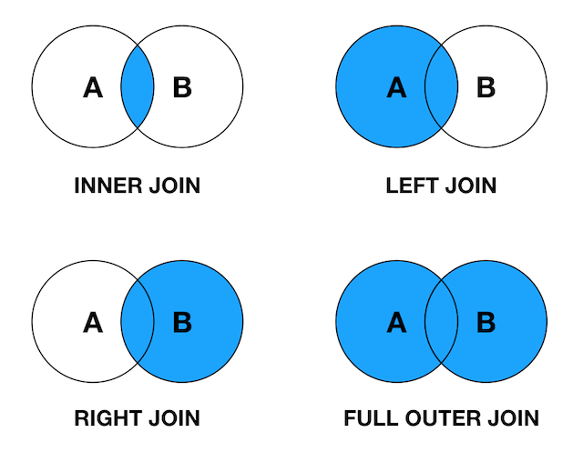


## LEFT JOIN EXCLUDING INNER JOIN

返回左表有但右表没有关联数据的记录集。

**文氏图**

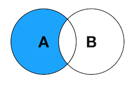

**示例查询**

```mysql
SELECT A.PK AS A_PK, B.PK AS B_PK,A.Value AS A_Value, B.Value AS B_Value
FROM Table_A A
LEFT JOIN Table_B B
ON A.PK = B.PK
WHERE B.PK IS NULL;
```

**查询结果**

```mysql
+------+------+---------+---------+
| A_PK | B_PK | A_Value | B_Value |
+------+------+---------+---------+
|    2 | NULL | only a  | NULL    |
+------+------+---------+---------+
1 row in set (0.01 sec)
```


## RIGHT JOIN EXCLUDING INNER JOIN

返回右表有但左表没有关联数据的记录集。

**文氏图**

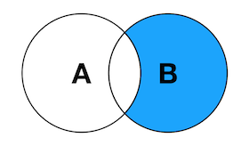

**示例查询**

```mysql
SELECT A.PK AS A_PK, B.PK AS B_PK,A.Value AS A_Value, B.Value AS B_Value
FROM Table_A A
RIGHT JOIN Table_B B
ON A.PK = B.PK
WHERE A.PK IS NULL;
```

**查询结果**

```mysql
+------+------+---------+---------+
| A_PK | B_PK | A_Value | B_Value |
+------+------+---------+---------+
| NULL |    3 | NULL    | only b  |
+------+------+---------+---------+
1 row in set (0.00 sec)
```


## FULL JOIN EXCLUDING INNER JOIN

返回左表和右表里没有相互关联的记录集。

**文氏图**


**示例查询**

```mysql
SELECT A.PK AS A_PK, B.PK AS B_PK,A.Value AS A_Value, B.Value AS B_Value
FROM Table_A A
FULL OUTER JOIN Table_B B
ON A.PK = B.PK
WHERE A.PK IS NULL
OR B.PK IS NULL;
```

因为使用到了 FULL OUTER JOIN，MySQL 在执行该查询时再次报错。

```mysql
ERROR 1064 (42000): You have an error in your SQL syntax; check the manual that corresponds to your MySQL server version for the right syntax to use near 'FULL OUTER JOIN Table_B B
ON A.PK = B.PK
WHERE A.PK IS NULL
OR B.PK IS NULL' at line 4
```

应当返回的结果（用 UNION 模拟）：

```mysql
mysql> SELECT * 
    -> FROM Table_A
    -> LEFT JOIN Table_B
    -> ON Table_A.PK = Table_B.PK
    -> WHERE Table_B.PK IS NULL
    -> UNION ALL
    -> SELECT *
    -> FROM Table_A
    -> RIGHT JOIN Table_B
    -> ON Table_A.PK = Table_B.PK
    -> WHERE Table_A.PK IS NULL;
+------+--------+------+--------+
| PK   | Value  | PK   | Value  |
+------+--------+------+--------+
|    2 | only a | NULL | NULL   |
| NULL | NULL   |    3 | only b |
+------+--------+------+--------+
2 rows in set (0.00 sec)
```

**SQL所有JOIN**

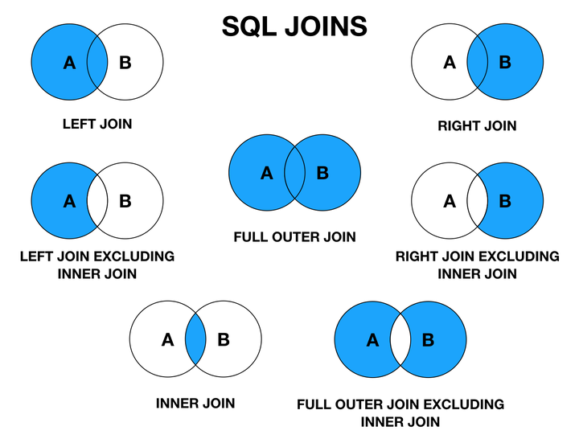


## CROSS JOIN

返回左表与右表之间符合条件的记录的迪卡尔集。

**图示**


**示例查询**

```mysql
SELECT A.PK AS A_PK, B.PK AS B_PK,A.Value AS A_Value, B.Value AS B_Value
FROM Table_A A
CROSS JOIN Table_B B;
```

**查询结果**

```mysql
+------+------+---------+---------+
| A_PK | B_PK | A_Value | B_Value |
+------+------+---------+---------+
|    1 |    1 | both ab | both ba |
|    2 |    1 | only a  | both ba |
|    1 |    3 | both ab | only b  |
|    2 |    3 | only a  | only b  |
+------+------+---------+---------+
4 rows in set (0.00 sec)
```

上面讲过的几种 JOIN 查询的结果都可以用 CROSS JOIN 加条件模拟出来，比如 INNER JOIN 对应 CROSS JOIN ... WHERE A.PK = B.PK。


## SELF JOIN

返回表与自己连接后符合条件的记录，一般用在表里有一个字段是用主键作为外键的情况。比如 Table_C 的结构与数据如下：

```mysql
+--------+----------+-------------+
| EMP_ID | EMP_NAME | EMP_SUPV_ID |
+--------+----------+-------------+
|   1001 | Ma       |        NULL |
|   1002 | Zhuang   |        1001 |
+--------+----------+-------------+
2 rows in set (0.00 sec)
```

EMP_ID 字段表示员工 ID，EMP_NAME 字段表示员工姓名，EMP_SUPV_ID 表示主管 ID。


**示例查询**

现在我们想查询所有有主管的员工及其对应的主管 ID 和姓名，就可以用 SELF JOIN 来实现。

```mysql
SELECT A.EMP_ID AS EMP_ID, A.EMP_NAME AS EMP_NAME, 
    B.EMP_ID AS EMP_SUPV_ID, B.EMP_NAME AS EMP_SUPV_NAME
FROM Table_C A, Table_C B
WHERE A.EMP_SUPV_ID = B.EMP_ID;
```

**查询结果**

```mysql
+--------+----------+-------------+---------------+
| EMP_ID | EMP_NAME | EMP_SUPV_ID | EMP_SUPV_NAME |
+--------+----------+-------------+---------------+
|   1002 | Zhuang   |        1001 | Ma            |
+--------+----------+-------------+---------------+
1 row in set (0.00 sec)
```

**补充说明**

- 文中的图使用 Keynote 绘制
- 个人的体会是 SQL 里的 JOIN 查询与数学里的求交集、并集等很像；SQLite 不支持 RIGHT JOIN 和 FULL OUTER JOIN，可以使用 LEFT JOIN 和 UNION 来达到相同的效果
- MySQL 不支持 FULL OUTER JOIN，可以使用 LEFT JOIN 和 UNION 来达到相同的效果


# 事务

**什么叫事务?**

事务是一系列对系统中数据进行访问与更新的操作组成的一个程序逻辑单元。即不可分割的许多基础数据库操作。

## 事务特性（ACID）

**原子性（Atomicity）**

事务是数据库的逻辑工作单位，事务中包含的各操作要么都做，要么都不做。


**一致性（Consistency）**

事 务执行的结果必须是使数据库从一个一致性状态变到另一个一致性状态。因此当数据库只包含成功事务提交的结果时，就说数据库处于一致性状态。如果数据库系统 运行中发生故障，有些事务尚未完成就被迫中断，这些未完成事务对数据库所做的修改有一部分已写入物理数据库，这时数据库就处于一种不正确的状态，或者说是 不一致的状态。

一个事务执行前后，应该使数据库从一个一致性状态转换为另一个一致性状态。比方说假设A、B两个人，共有5000元。那么无论A给B转多少钱，转多少次，总数仍然是5000没有改变。


**隔离性（Isolation）**

一个事务的执行不能受到其它事务干扰。即一个事务内部的操作及使用的数据对其它并发事务是隔离的，并发执行的各个事务之间不能互相干扰。


**持久性（Durability）**

指一个事务一旦提交，它对数据库中数据的改变就是永久性的。接下来的其它操作或故障不应该对其执行结果有任何影响。


## 隔离级别

数据库事务隔离级别有4种，由低到高为：**Read uncommitted** 、**Read committed** 、**Repeatable read** 、**Serializable** 。而且，在事务的并发操作中可能会出现 **脏读、不可重复读、幻读** 问题。不做隔离操作则会出现：

- **脏读**：事务A中读到了事务B中未提交的更新数据内容
- **不可重复读**：读到其它事务已经提交后的**更新**数据，即一个事务范围内两个相同的查询却返回了不同数据
- **幻读**：事物A执行select后，事物B**增或删**了一条数据，事务A再执行同一条SQL后发现多或少了一条数据
- **第一类丢失更新**：A事务撤销时，把已经提交的B事务的更新数据覆盖了
- **第二类丢失更新**：A事务提交时，把已经提交的B事务的更新数据覆盖了


**默认隔离级别**

- Oracle仅有Serializable(串行化)和Read Committed(读已提交)两种隔离方式，默认选择**读已提交**的方式
- MySQL默认为**Repeatable Read（可重读）**


**InnoDB存储引擎下**的四种隔离级别发生问题的可能性如下：

| 隔离级别                   | 第一类丢失更新 | 第二类丢失更新 | 脏读     | 不可重复读 | 幻读     |
| -------------------------- | -------------- | -------------- | -------- | ---------- | -------- |
| Read Uncommitted(读未提交) | 不可能         | **可能**       | **可能** | **可能**   | **可能** |
| Read Committed(读已提交)   | 不可能         | **可能**       | 不可能   | **可能**   | **可能** |
| Repeatable Read(可重复读)  | 不可能         | 不可能         | 不可能   | 不可能     | **可能** |
| Serializable(串行化)       | 不可能         | 不可能         | 不可能   | 不可能     | 不可能   |

### Read Uncommitted(读未提交)

**即读取到了其它事务未提交的内容**。在该隔离级别，**所有事务都可以看到其他未提交事务的执行结果**。本隔离级别很少用于实际应用，因为它的性能也不比其他级别好多少。读取未提交的数据，也被称之为**脏读（Dirty Read）**。

**特点**：最低级别，任何情况都无法保证

**读未提交的数据库锁情况**

- 事务中读取数据：**未加锁**
- 事务中更新数据：**只对数据增加行级共享锁**


### Read Committed(读已提交)

**即读取到了其它事务已提交的内容**。一个事务只能看见已经提交事务所做的改变。这种隔离级别也支持所谓的**不可重复读（Nonrepeatable Read）**，因为同一事务的其他实例在该实例处理期间可能会有新的commit，所以同一select可能返回不同结果。

**特点**：避免脏读

**读已提交的数据库锁情况**

- 事务中读取数据：**加行级共享锁（读到时才加锁），读完后立即释放**
- 事务中更新数据：**在更新时的瞬间对其加行级排它锁，直到事务结束才释放**


**Read Committed隔离级别下的加锁分析**

隔离级别的实现与锁机制密不可分，所以需要引入锁的概念，首先我们看下InnoDB存储引擎提供的两种标准的行级锁：

- **共享锁(S Lock)**：又称为读锁，可以允许多个事务并发的读取同一资源，互不干扰。即如果一个事务T对数据A加上共享锁后，其他事务只能对A再加共享锁，不能再加排他锁，只能读数据，不能修改数据
- **排他锁(X Lock)**: 又称为写锁，如果事务T对数据A加上排他锁后，其他事务不能再对A加上任何类型的锁，获取排他锁的事务既能读数据，也能修改数据

**注意**： 共享锁和排他锁是不相容的。


### Repeatable Read(可重复读)

**它确保同一事务的多个实例在并发读取数据时，会看到同样的数据行**。但会导致**幻读 （Phantom Read）**问题。

**幻读** 是户读取某一范围的数据行时，另一个事务又在该范围内插入了新行，当该用户再读取该范围的数据行时，会发现有新的“幻影” 行。

**特点**：避免脏读、不可重复读。MySQL默认事务隔离级别

**可重复读的数据库锁情况**

- 事务中读取数据：**开始读取的瞬间对其增加行级共享锁，直到事务结束才释放**
- 事务中更新数据：**开始更新的瞬间对其增加行级排他锁，直到事务结束才释放**


### Serializable(可串行化)

**指一个事务在执行过程中完全看不到其他事务对数据库所做的更新**。当两个事务同时操作数据库中相同数据时，如果第一个事务已经在访问该数据，第二个事务只能停下来等待，必须等到第一个事务结束后才能恢复运行。因此这两个事务实际上是串行化方式运行。

**特点**：避免脏读、不可重复读、幻读

**可序列化的数据库锁情况**

- 事务中读取数据：**先对其加表级共享锁 ，直到事务结束才释放**
- 事务中更新数据：**先对其加表级排他锁 ，直到事务结束才释放**


## SpringBoot Transaction

查看 `mysql` 事务隔离级别：`show variables like 'tx_iso%';`。

### 实现方式

在Spring中事务有两种实现方式：

- **编程式事务管理**： 编程式事务管理使用`TransactionTemplate`或直接使用底层的`PlatformTransactionManager`
- **声明式事务管理**： 建立在`AOP`之上的。其本质是对方法前后进行拦截，然后在目标方法开始之前创建或者加入一个事务，在执行完目标方法之后根据执行情况提交或者回滚事务。声明式事务管理不需要入侵代码，通过`@Transactional`就可以进行事务操作，更快捷而且简单


### 提交方式

**默认情况下，数据库处于自动提交模式**。每一条语句处于一个单独的事务中，在这条语句执行完毕时，如果执行成功则隐式的提交事务，如果执行失败则隐式的回滚事务。
对于正常的事务管理，是一组相关的操作处于一个事务之中，因此必须关闭数据库的自动提交模式。不过，这个我们不用担心，spring会将底层连接的自动提交特性设置为false。也就是在使用spring进行事物管理的时候，spring会将是否自动提交设置为false，等价于JDBC中的 `connection.setAutoCommit(false);`，在执行完之后在进行提交，`connection.commit();` 。


### 事务隔离级别

隔离级别是指若干个并发的事务之间的隔离程度。

```java
@Transactional(isolation = Isolation.READ_UNCOMMITTED)
public void addGoods(){
	......
}
```

枚举类Isolation中定义了五种隔离级别：

- `DEFAULT`：默认值。表示使用底层数据库的默认隔离级别。对大部分数据库而言，通常这值就是**READ_COMMITTED**
- `READ_UNCOMMITTED`：该隔离级别表示一个事务可以读取另一个事务修改但还没有提交的数据。该级别不能防止脏读，不可重复读和幻读，因此很少使用该隔离级别
- `READ_COMMITTED`：该隔离级别表示一个事务只能读取另一个事务已经提交的数据。该级别可以防止脏读，这也是大多数情况下的推荐值
- `REPEATABLE_READ`：该隔离级别表示一个事务在整个过程中可以多次重复执行某个查询，并且每次返回的记录都相同。该级别可以防止脏读和不可重复读
- `SERIALIZABLE`：所有的事务依次逐个执行，这样事务之间就完全不可能产生干扰，也就是说，该级别可以防止脏读、不可重复读以及幻读。但是这将严重影响程序的性能。通常情况下也不会用到该级别


### 事务传播行为

事务的传播性一般用在事务嵌套的场景，如一个事务方法里面调用了另外一个事务方法，那两个方法是各自作为独立的方法提交还是内层事务合并到外层事务一起提交，这就需要事务传播机制配置来确定怎么样执行。

```java
@Transactional(propagation=Propagation.REQUIRED)
public void addGoods(){
	......
}
```

枚举类Propagation中定义了七种事务传播机制如下：

- `REQUIRED`（required）

  Spring默认的传播机制，能满足绝大部分业务需求，如果外层有事务，则当前事务加入到外层事务，一块提交，一块回滚。如果外层没有事务，新建一个事务执行

- `REQUIRES_NEW`（requires_new，新创建事务）

  该事务传播机制是每次都会新开启一个事务，同时把外层事务挂起，当当前事务执行完毕，恢复上层事务的执行。如果外层没有事务，执行当前新开启的事务即可

- `SUPPORTS`（supports）

  如果外层有事务，则加入外层事务，如果外层没有事务，则直接使用非事务方式执行。完全依赖外层的事务

- `NOT_SUPPORTED`（not_supported，传播机制不支持事务）

  该传播机制不支持事务，如果外层存在事务则挂起，执行完当前代码，则恢复外层事务，无论是否异常都不会回滚当前的代码

- `NEVER`（never）

  该传播机制不支持外层事务，即如果外层有事务就抛出异常

- `MANDATORY`（mandatory）

  与NEVER相反，如果外层没有事务，则抛出异常

- `NESTED`（nested，嵌套事务）

  该传播机制的特点是可以保存状态保存点，当前事务回滚到某一个点，从而避免所有的嵌套事务都回滚，即各自回滚各自的，如果子事务没有把异常吃掉，基本还是会引起全部回滚的。


### 事务回滚规则

指示spring事务管理器回滚一个事务的推荐方法是在当前事务的上下文内抛出异常。spring事务管理器会捕捉任何未处理的异常，然后依据规则决定是否回滚抛出异常的事务。
默认配置下，spring只有在抛出的异常为运行时unchecked异常时才回滚该事务，也就是抛出的异常为RuntimeException的子类(Errors也会导致事务回滚)，而抛出checked异常则不会导致事务回滚。
可以明确的配置在抛出那些异常时回滚事务，包括checked异常。也可以明确定义那些异常抛出时不回滚事务。


### 事务常用配置

- **readOnly**

  该属性用于设置当前事务是否为只读事务，设置为true表示只读，false则表示可读写，默认值为false。例如：@Transactional(readOnly=true)

- **rollbackFor**

  该属性用于设置需要进行回滚的异常类数组，当方法中抛出指定异常数组中的异常时，则进行事务回滚。例如：指定单一异常类：@Transactional(rollbackFor=RuntimeException.class)指定多个异常类：@Transactional(rollbackFor={RuntimeException.class, Exception.class})

- **rollbackForClassName**

  该属性用于设置需要进行回滚的异常类名称数组，当方法中抛出指定异常名称数组中的异常时，则进行事务回滚。例如：指定单一异常类名称@Transactional(rollbackForClassName=”RuntimeException”)指定多个异常类名称：@Transactional(rollbackForClassName={“RuntimeException”,”Exception”})

- **noRollbackFor**

  该属性用于设置不需要进行回滚的异常类数组，当方法中抛出指定异常数组中的异常时，不进行事务回滚。例如：指定单一异常类：@Transactional(noRollbackFor=RuntimeException.class)指定多个异常类：@Transactional(noRollbackFor={RuntimeException.class, Exception.class})

- **noRollbackForClassName**

  该属性用于设置不需要进行回滚的异常类名称数组，当方法中抛出指定异常名称数组中的异常时，不进行事务回滚。例如：指定单一异常类名称：@Transactional(noRollbackForClassName=”RuntimeException”)指定多个异常类名称：@Transactional(noRollbackForClassName={“RuntimeException”,”Exception”})

- **propagation** 

  该属性用于设置事务的传播行为。例如：@Transactional(propagation=Propagation.NOT_SUPPORTED,readOnly=true)

- **isolation**

  该属性用于设置底层数据库的事务隔离级别，事务隔离级别用于处理多事务并发的情况，通常使用数据库的默认隔离级别即可，基本不需要进行设置

- **timeout**

  该属性用于设置事务的超时秒数，默认值为-1表示永不超时


### 事物注意事项

- 要根据实际的需求来决定是否要使用事物，最好是在编码之前就考虑好，不然到以后就难以维护
- 如果使用了事物，请务必进行事物测试，因为很多情况下以为事物是生效的，但是实际上可能未生效
- 事物@Transactional的使用要放再类的**公共(public)方法**中，需要注意的是在 protected、private 方法上使用 @Transactional 注解，它也不会报错(IDEA会有提示)，但事务无效
- 事物@Transactional是不会对该方法里面的子方法生效！也就是你在公共方法A声明的事物@Transactional，但是在A方法中有个子方法B和C，其中方法B进行了数据操作，但是该异常被B自己处理了，这样的话事物是不会生效的！反之B方法声明的事物@Transactional，但是公共方法A却未声明事物的话，也是不会生效的！如果想事物生效，需要将子方法的事务控制交给调用的方法，在子方法中使用`rollbackFor`注解指定需要回滚的异常或者将异常抛出交给调用的方法处理。一句话就是在使用事物的异常由调用者进行处理
- 事物@Transactional由spring控制的时候，它会在抛出异常的时候进行回滚。如果自己使用catch捕获了处理了，是不生效的，如果想生效可以进行手动回滚或者在catch里面将异常抛出，比如`throw new RuntimeException();`


### 失效场景

- **@Transactional 应用在非 public 修饰的方法上**
- **数据库引擎要不支持事务**
- **由于propagation 设置错误，导致注解失效**
- **rollbackFor 设置错误，@Transactional 注解失效**
- **方法之间的互相调用也会导致@Transactional失效**
- **异常被你的 catch“吃了”导致@Transactional失效**


### select for update

`for update`是一种`行级锁`，又叫`排它锁`。一旦用户对某个行施加了行级加锁，则该用户可以查询也可以更新被加锁的数据行，其它用户只能查询但不能更新被加锁的数据行。

- **修改sql**：在 `select` 的 `sql` 尾部添加 `for update`。如：`select * from job_info where id = 1 for update;`
- **启用事务**：为 `service` 添加注解 `@Transactional`


**只有当出现如下之一的条件，才会释放共享更新锁：**

1. 执行提交（COMMIT）语句
2. 退出数据库（LOG　OFF）
3. 程序停止运行


假设有个表单products ，里面有id 跟name 二个栏位，id 是主键。

```mysql
-- 例1: 明确指定主键，并且有此数据，row lock
SELECT * FROM products WHERE id='3' FOR UPDATE;
-- 例2: 明确指定主键，若查无此数据，无lock
SELECT * FROM products WHERE id='-1' FOR UPDATE;
-- 例2: 无主键，table lock
SELECT * FROM products WHERE name='Mouse' FOR UPDATE;
-- 例3: 主键不明确，table lock
SELECT * FROM products WHERE id<>'3' FOR UPDATE;
-- 例4: 主键不明确，table lock
SELECT * FROM products WHERE id LIKE '3' FOR UPDATE;
```

**注意**

- FOR UPDATE 仅适用于InnoDB，且必须在事务区块(start sta/COMMIT)中才能生效
- 要测试锁定的状况，可以利用MySQL 的Command Mode ，开二个视窗来做测试


# 索引

建立索引的目的是加快对表中记录的查找或排序。索引只是提高效率的一个因素，如果你的MySQL有大数据量的表，就需要花时间研究建立最优秀的索引，或优化查询语句。因此应该只为最经常查询和最经常排序的数据列建立索引。MySQL里同一个数据表里的索引总数限制为16个。

**优点**

- 索引大大减小了服务器需要扫描的数据量
- 索引可以帮助服务器避免排序和临时表
- 索引可以将随机IO变成顺序IO
- 索引对于InnoDB（对索引支持行级锁）非常重要，因为它可以让查询锁更少的元组
- 关于InnoDB、索引和锁：InnoDB在二级索引上使用共享锁（读锁），但访问主键索引需要排他锁（写锁）

**缺点**

- 虽然索引大大提高了查询速度，同时却会降低更新表的速度，如对表进行INSERT、UPDATE和DELETE。因为更新表时，MySQL不仅要保存数据，还要保存索引文件
- 建立索引会占用磁盘空间的索引文件。一般情况这个问题不太严重，但如果你在一个大表上创建了多种组合索引，索引文件的会膨胀很快
- 如果某个数据列包含许多重复的内容，为它建立索引就没有太大的实际效果
- 对于非常小的表，大部分情况下简单的全表扫描更高效


**索引规范**

- 索引的数量要控制

  - **单张表** 中索引数量不超过 **5** 个
  - **单个索引** 中的字段数不超过 **5** 个（字段超过5个时，实际已经起不到有效过滤数据的作用了）
  - 对字符串使⽤ **前缀索引**，前缀索引长度不超过 **8** 个字符，必要时可添加伪列并建立索引

- 禁止在 **更新十分频繁**、**区分度不高** 的属性上建立索引

  - 更新会变更B+树，更新频繁的字段建立索引会大大降低数据库性能
  - “性别”这种区分度不大的属性，建立索引是没有意义的，其不能有效过滤数据，性能与全表扫描类似

- 不在索引列进行 **数学运算** 和 **函数运算**

- 建立组合索引：必须 **把区分度高的字段放在前面**（能够更加有效的过滤数据）

- 重要的SQL必须被索引，比如：

  - **UPDATE**、**DELETE** 语句的 **WHERE** 条件列
  - **ORDER BY**、**GROUP BY**、**DISTINCT** 的字段

- **多表JOIN** 的字段注意以下（优化准则）

  - **区分度最大** 的字段放在前面
  - 核⼼SQL优先考虑 **覆盖索引**
  - 避免 **冗余** 和 **重复** 索引
  - 索引要综合评估数据 **密度** 和 **分布**以及考虑 **查询** 和 **更新** 比例

- 索引命名

  - 索引名称必须 **全部小写**
  - 唯一所以必须以 **uniq _ 字段1 _ 字段2** 命名
  - 非唯一索引必须以 **idx _ 字段1 _ 字段2** 命名

- 新建的 **唯一索引** 必须不能和主键重复

- 索引字段的默认值不能为 **NULL** （NULL非常影响索引的查询效率）

- 反复查看与表相关的SQL，符合 **最左前缀** 的特点建立索引

  多条件字段重复的语句，要修改语句条件字段的顺序，为其建立一条 **联合索引**，减少索引数量

- **优先使用唯一索引**：能使用唯一索引就要使用唯一索引，提高查询效率

- 研发要经常使用 **explain**，如果发现索引选择性差，必须让他们学会使用hint


## 索引结构

### 二叉树

**特点**

1. 左子节点值 < 节点值
2. 右子节点值 > 节点值
3. 当数据量非常大时，要查找的数据又非常靠后，和没有索引相比，那么二叉树结构的查询优势将非常明显

**存在问题**

如下图，可以看出，二叉树出现单边增长时，二叉树变成了“链”，这样查找一个数的时候，速度并没有得到很大的优化。

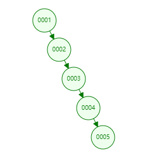


### 红黑树

**特点**

1. 节点是红色或者黑色
2. 根节点是黑色
3. 每个叶子的节点都是黑色的空节点（NULL）
4. 每个红色节点的两个子节点都是黑色的
5. 从任意节点到其每个叶子的所有路径都包含相同的黑色节点

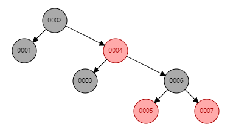

**存在的问题**

**红黑树虽然和二叉树相比，一定程度上缓解了单边过长的问题，但是它依旧存储高度问题。**　

假设现在数据量有100万，那么红黑树的高度大概为 100,0000 = 2^n， n大概为 20。那么，至少要20次的磁盘IO，这样，性能将很受影响。如果数据量更大，IO次数更多，性能损耗更大。**所以红黑树依旧不是最佳方案。**


**思考：针对上面的红黑树结构，我们能否优化一下呢？**

上述红黑树默认一个节点就存了一个 (索引+磁盘地址)，我们设想一个节点存多个 （索引+磁盘地址），这样就可以降低红黑树的高度了。 **实际上我们设想的这种结构就是 B-Tree**。


### Hash

**原理**

1. 事先将索引通过 hash算法后得到的hash值(即磁盘文件指针）存到hash表中
2. 在进行查询时，将索引通过hash算法，得到hash值，与hash表中的hash值比对。通过磁盘文件指针，只要**一次磁盘IO**就能找到要的值

例如：在第一个表中，要查找col=6的值。hash(6) 得到值，比对hash表，就能得到89。性能非常高。

**存在问题**

 但是hash表索引存在问题，如果要查询带范围的条件时，hash索引就歇菜了。

```mysql
select *from t where col1>=6;
```

 

### B-Tree

**特点**

B-Tree索引能很好解决红黑树中遗留的高度问题，B-Tree 是一种平衡的多路查找（又称排序）树，在文件系统中和数据库系统有所应用，主要用作文件的索引，其中的B就表示平衡（Balance）。

为了描述B-Tree，首先定义一条数据记录为一个二元组 [key, data]，key为记录的键值key，对于不同数据记录，key是互不相同的；**data为数据记录除以key外的数据 （这里指的是聚集索引）**。那么B-Tree是满足下列条件的数据结构：

1. d 为大于1的一个正整数，称为BTree的度
2. h为一个正整数，称为BTree的高度
3. key和指针互相间隔，节点两端是指针
4. 叶子节点具有相同的深度，叶子节点的指针为空，节点中数据索引(下图中的key)从左往右递增排列

**说明**：下图都是以主键索引为例，至于非主键索引(非聚集索引)，无非就是data里存的内容不同。

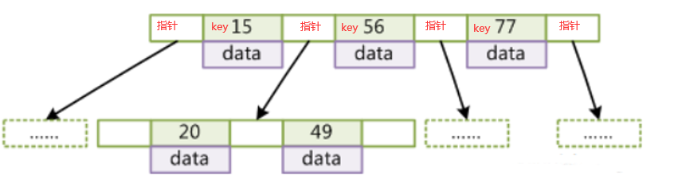

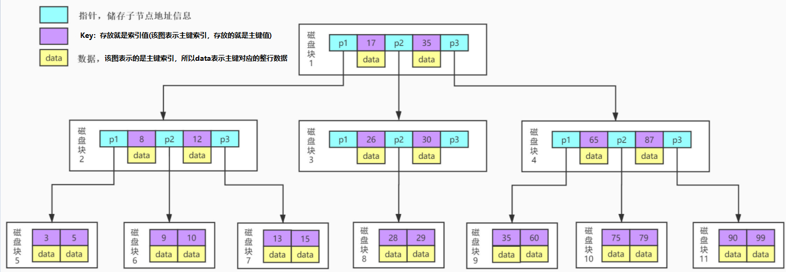

**分析**

模拟下查找key为29的data的过程：

1. 根据根结点指针读取文件目录的根磁盘块1。【磁盘IO操作第**1次**】
2. 磁盘块1存储17，35和三个指针数据。我们发现17<29<35，因此我们找到指针p2
3. 根据p2指针，我们定位并读取磁盘块3。【磁盘IO操作**2次**】
4. 磁盘块3存储26，30和三个指针数据。我们发现26<29<30，因此我们找到指针p2
5. 根据p2指针，我们定位并读取磁盘块8。【磁盘IO操作**3次**】
6. 磁盘块8中存储28，29。我们找到29，获取29所对应的数据data

**存在问题**

1. 比如，下面查询语句，那么不但需要叶子节点>20的值，也需要非叶子节点在右边节点的值。即下图画圈的两部分， **B-Tree似乎在范围查找没有更简便的方法，为了解决这一问题。我们可以用B+Tree。**

   ```mysql
   select *from t where col1 > 20; 
   ```

   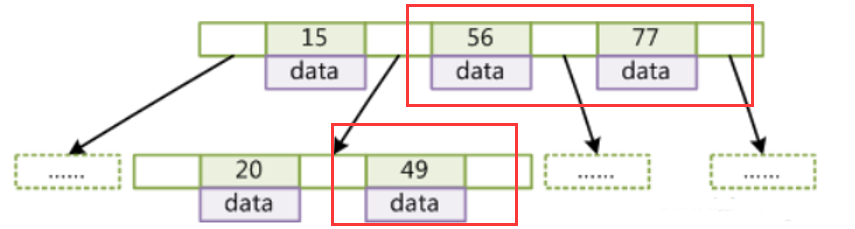

2. 深度问题

   从图上可以看到，每个节点中不仅包含数据的key值，还有data值。而每一个节点的存储空间是有限的(mysql默认设置一个节点的大小为16K)，如果data中存放的数据较大时，将会导致每个节点（即一个页）能存储的key的数量（索引的数量）很小，所以当数据量很多，且每行数据量很大的时候，同样会导致B-Tree的深度较大，增大查询时的磁盘I/O次数，进而影响查询效率。所以引入B+Tree


### B+Tree

**特点**

`B+Tree`是在`B-Tree`基础上的一种优化，使其更适合实现外存储索引结构。在B+Tree中，所有数据记录节点都是按照键值大小顺序存放在同一层的叶子节点上，而非叶子节点上只存储key值信息，这样可以大大加大每个节点存储的key值数量，降低B+Tree的高度。

1. 非叶子节点不存储data，只存储索引，可以存放更多索引
2. 叶子节点不存储指针
3. 顺序访问指针，提高区间访问性能
4. 非叶子节点中的索引最终还是会在叶子节点上存储一份，也就是叶子节点会包含非叶子节点上的所有索引
5. 一个父节点，它的**左侧**子节点都**小于**父节点的值，**右侧**的子节点都**大于等于**父节点的值
6. 每一层节点从左往右都是递增排列，无论是数值型还是字符型

**注意**：MySQL索引默认的存储结构使用的就是B+Tree。

**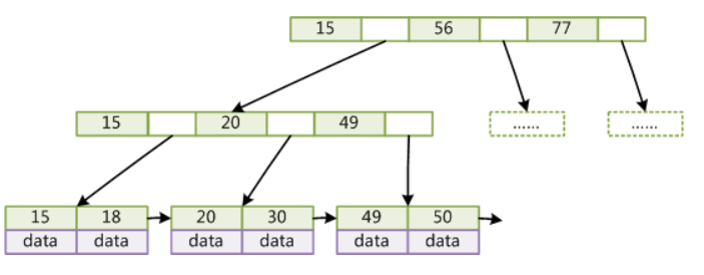**

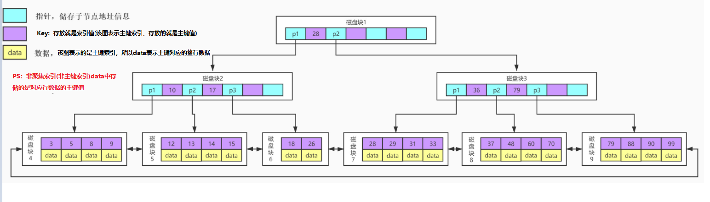

**剖析**：如上图，在叶子节点上注意是MySQL已经有成双向箭头（原生B+Tree是单向的），而且从左到右是递增顺序的，所以很好的解决了 > 和 < 这类查找问题。

**分析**

假如：**以一个高度为3的B+Tree为例**，B+Tree的表都存满了，能存储多少数据？

**首先，**查看MySQL默认一个节点页的大小：

```mysql
SHOW GLOBAL STATUS like 'Innodb_page_size';
```

如下图：大小为16K。

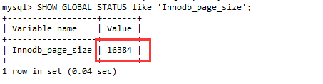

然后，假设主键Id为bigint类型，那么长度就是8B，指针在Innodb源码中大小为6B，所以一共就是14B，再假设最后一层，存放的数据data为1k 大小（能存很多内容了），那么：

1. 第一层最大节点数为： 16k / (8B + 6B) = 1170 (个)
2. 第二层最大节点数也应为：1170个
3. 第三层最大节点数为：16k / 1k = 16 (个)

则，一张B+Tree的表最多存放 1170 * 1170 * 16 = 21902400 ≈ 2千万。所以，通过分析，我们可以得出，B+Tree结构的表可以容纳千万数据量的查询。而且**一般来说，MySQL会把 B+Tree 根节点放在内存中**，那只需要**两次磁盘IO（第二层1次，第三层1次）**就行。

**扩展**

数据库中的B+Tree索引可以分为聚集索引（clustered index，也叫主键索引）和辅助索引（secondary index，也叫非聚集索引）。上面的B+Tree示例图在数据库中的实现对应的是聚集索引，聚集索引的B+Tree中的叶子节点存放的是整张表的行记录数据(除主键以外的所有数据)，辅助索引与聚集索引的区别在于辅助索引的叶子节点并不包含行记录的全部数据，而是存储相应行数据的对应的聚集索引键，即主键。当通过辅助索引来查询数据时，InnoDB存储引擎会遍历辅助索引找到主键，然后再通过主键在聚集索引中找到完整的行记录数据。


## 索引类型

### 普通索引

**普通索引（单列索引）**：单列索引是最基本的索引，它没有任何限制。

- 直接创建索引

```mysql
CREATE INDEX index_name ON table_name(col_name);
```

- 修改表结构的方式添加索引

```mysql
ALTER TABLE table_name ADD INDEX index_name(col_name);
```

- 创建表的时候同时创建索引

```mysql
CREATE TABLE `news` (
    `id` int(11) NOT NULL AUTO_INCREMENT ,
    `title` varchar(255)  NOT NULL ,
    `content` varchar(255)  NULL ,
    `time` varchar(20) NULL DEFAULT NULL ,
    PRIMARY KEY (`id`),
    INDEX index_name (title(255))
)
```

- 删除索引

```mysql
DROP INDEX index_name ON table_name;
# 或
alter table `表名` drop index 索引名;
```


### 复合索引

**复合索引（组合索引）**：复合索引是在多个字段上创建的索引。复合索引遵守“**最左前缀**”原则**，**即在查询条件中使用了复合索引的第一个字段，索引才会被使用。因此，在复合索引中索引列的顺序至关重要。

- 创建一个复合索引

```mysql
create index index_name on table_name(col_name1,col_name2,...);
```

- 修改表结构的方式添加索引

```mysql
alter table table_name add index index_name(col_name,col_name2,...);
```


### 唯一索引

**唯一索引**：唯一索引和普通索引类似，主要的区别在于，**唯一索引限制列的值必须唯一，但允许存在空值（只允许存在一条空值）**。如果在已经有数据的表上添加唯一性索引的话：

- 如果添加索引的列的值存在两个或者两个以上的空值，则不能创建唯一性索引会失败。（一般在创建表的时候，要对自动设置唯一性索引，需要在字段上加上 not null）
- 如果添加索引的列的值存在两个或者两个以上null值，还是可以创建唯一性索引，只是后面创建的数据不能再插入null值 ，并且严格意义上此列并不是唯一的，因为存在多个null值

对于多个字段创建唯一索引规定列值的组合必须唯一。比如：在order表创建orderId字段和 productId字段 的唯一性索引，那么这两列的组合值必须唯一：

```mysql
“空值” 和”NULL”的概念： 
1：空值是不占用空间的 .
2: MySQL中的NULL其实是占用空间的.

长度验证：注意空值的之间是没有空格的。

> select length(''),length(null),length(' ');
+------------+--------------+-------------+
| length('') | length(null) | length(' ') |
+------------+--------------+-------------+
|          0 |         NULL |           1 |
+------------+--------------+-------------+
```

- 创建唯一索引

```mysql
# 创建单个索引
CREATE UNIQUE INDEX index_name ON table_name(col_name);
# 创建多个索引
CREATE UNIQUE INDEX index_name on table_name(col_name,...);
```

- 修改表结构

```mysql
# 单个
ALTER TABLE table_name ADD UNIQUE index index_name(col_name);
# 多个
ALTER TABLE table_name ADD UNIQUE index index_name(col_name,...);
```

- 创建表的时候直接指定索引

```mysql
CREATE TABLE `news` (
    `id` int(11) NOT NULL AUTO_INCREMENT ,
    `title` varchar(255)  NOT NULL ,
    `content` varchar(255)  NULL ,
    `time` varchar(20) NULL DEFAULT NULL ,
    PRIMARY KEY (`id`),
    UNIQUE index_name_unique(title)
)
```


### 主键索引

主键索引是一种特殊的唯一索引，一个表只能有一个主键，不允许有空值。一般是在建表的时候同时创建主键索引：

- 主键索引(创建表时添加)

```mysql
CREATE TABLE `news` (
    `id` int(11) NOT NULL AUTO_INCREMENT ,
    `title` varchar(255)  NOT NULL ,
    `content` varchar(255)  NULL ,
    `time` varchar(20) NULL DEFAULT NULL ,
    PRIMARY KEY (`id`)
)
```

- 主键索引(创建表后添加)

```mysql
alter table tbl_name add primary key(col_name);
```

```mysql
CREATE TABLE `order` (
    `orderId` varchar(36) NOT NULL,
    `productId` varchar(36)  NOT NULL ,
    `time` varchar(20) NULL DEFAULT NULL
)
alter table `order` add primary key(`orderId`);
```


### 全文索引

在一般情况下，模糊查询都是通过 like 的方式进行查询。但是，对于海量数据，这并不是一个好办法，在 like "value%" 可以使用索引，但是对于 like "%value%" 这样的方式，执行全表查询，这在数据量小的表，不存在性能问题，但是对于海量数据，全表扫描是非常可怕的事情，所以 like 进行模糊匹配性能很差。

这种情况下，需要考虑使用全文搜索的方式进行优化。全文搜索在 MySQL 中是一个 FULLTEXT 类型索引。**FULLTEXT 索引在 MySQL 5.6 版本之后支持 InnoDB，而之前的版本只支持 MyISAM 表**。

全文索引主要用来查找文本中的关键字，而不是直接与索引中的值相比较。fulltext索引跟其它索引大不相同，它更像是一个搜索引擎，而不是简单的where语句的参数匹配。fulltext索引配合match against操作使用，而不是一般的where语句加like。目前只有char、varchar，text 列上可以创建全文索引。


**小技巧**
在数据量较大时候，先将数据放入一个没有全局索引的表中，然后再用CREATE index创建fulltext索引，要比先为一张表建立fulltext然后再将数据写入的速度快很多。

- 创建表的适合添加全文索引

```mysql
CREATE TABLE `news` (
    `id` int(11) NOT NULL AUTO_INCREMENT ,
    `title` varchar(255)  NOT NULL ,
    `content` text  NOT NULL ,
    `time` varchar(20) NULL DEFAULT NULL ,
     PRIMARY KEY (`id`),
    FULLTEXT (content)
)
```

- 修改表结构添加全文索引

```mysql
ALTER TABLE table_name ADD FULLTEXT index_fulltext_content(col_name)
```

- 直接创建索引

```mysql
CREATE FULLTEXT INDEX index_fulltext_content ON table_name(col_name)
```

**注意**： 默认MySQL不支持中文全文检索！MySQL 全文搜索只是一个临时方案，对于全文搜索场景，更专业的做法是使用全文搜索引擎，例如 ElasticSearch 或 Solr。

- 索引的查询和删除

```mysql
-- 查看:
show indexes from `表名`;
-- 或
show keys from `表名`;

-- 删除
alter table `表名` drop index 索引名;
```

**注意**：MySQl的客户端工具也可以进索引的创建、查询和删除，如 Navicat Premium!


## 索引优缺点

### 索引优点

- 提高数据检索的效率，降低检索过程中必须要读取得数据量，降低数据库IO成本
- 降低数据库的排序成本。因为索引就是对字段数据进行排序后存储的，如果待排序的字段与索引键字段一致，就在取出数据后不用再次排序了，因为通过索引取得的数据已满足排序要求。另外，分组操作是先排序后分组，所以索引同样可以省略分组的排序操作，降低内存与CPU资源的消耗


### 索引缺点

- 索引会增加 增、删、改操作所带来的IO量与调整索引的计算量
- 索引要占用空间，随着数据量的不断增大，索引还会带来存储空间的消耗


## 失效场景

**场景一：where语句中包含or时，可能会导致索引失效**

使用or并不是一定会使索引失效，你需要看or左右两边的查询列是否命中相同的索引。

```sql
-- 假设user表中的user_id列有索引，age列没有索引
-- 能命中索引
select * from user where user_id = 1 or user_id = 2;
-- 无法命中索引
select * from user where user_id = 1 or age = 20;
-- 假设age列也有索引的话，依然是无法命中索引的
select * from user where user_id = 1 or age = 20;
```

可以根据情况尽量使用union all或者in来代替，这两个语句的执行效率也比or好些。


**场景二：where语句中索引列使用了负向查询，可能会导致索引失效**

负向查询包括：NOT、!=、<>、!<、!>、NOT IN、NOT LIKE等。其实负向查询并不绝对会索引失效，这要看MySQL优化器的判断，全表扫描或者走索引哪个成本低了。


**场景三：索引字段可以为null，使用is null或is not null时，可能会导致索引失效**

其实单个索引字段，使用is null或is not null时，是可以命中索引的。


**场景四：在索引列上使用内置函数，一定会导致索引失效**

比如下面语句中索引列login_time上使用了函数，会索引失效：

```sql
select * from user where DATE_ADD(login_time, INTERVAL 1 DAY) = 7;
```


**场景五：隐式类型转换导致的索引失效**

如下面语句中索引列user_id为varchar类型，不会命中索引：

```mysql
select * from user where user_id = 12;
```


**场景六：对索引列进行运算，一定会导致索引失效**

运算如+，-，\*，/等，如下：

```mysql
select * from user where age - 1 = 10;
```

优化的话，要把运算放在值上，或者在应用程序中直接算好，比如：

```sql
select * from user where age = 10 - 1;
```


**场景七：like通配符可能会导致索引失效**

like查询以%开头时，会导致索引失效。解决办法有两种：

- 将%移到后面，如：

```sql
select * from user where `name` like '李%';
```

- 利用覆盖索引来命中索引：

```sql
select name from user where `name` like '%李%';
```


**场景八：联合索引中，where中索引列违背最左匹配原则，一定会导致索引失效**

当创建一个联合索引的时候，如(k1,k2,k3)，相当于创建了(k1)、(k1,k2)和(k1,k2,k3)三个索引，这就是最左匹配原则。比如下面的语句就不会命中索引：

```sql
select * from t where k2=2;
select * from t where k3=3;
select * from t where k2=2 and k3=3;
```

下面的语句只会命中索引(k1)：

```sql
select * from t where k1=1 and k3=3;
```


## 优化建议

- **禁止在更新十分频繁、区分度不高的属性上建立索引**
  - 更新会变更B+树，更新频繁的字段建立索引会大大降低数据库性能。
  - “性别”这种区分度不大的属性，建立索引是没有什么意义的，不能有效过滤数据，性能与全表扫描类似。
- **建立组合索引，必须把区分度高的字段放在前面**


# SQL优化

## SQL优化步骤
**第1步：通过慢查日志等定位那些执行效率较低的SQL语句**

**第2步：explain分析SQL的执行计划**

需要重点关注`type`、`rows`、`filtered`、`extra`。

- `type`：由上至下，效率越来越高

  - `ALL`：全表扫描
  - `index`：索引全扫描
  - `range`：索引范围扫描，常用语`<`、`<=`、`>=`、`between`、`in`等操作
  - `ref`：使用非唯一索引扫描或唯一索引前缀扫描，返回单条记录，常出现在关联查询中
  - `eq_ref`：类似ref，区别在于使用的是唯一索引，使用主键的关联查询
  - `const/system`：单条记录，系统会把匹配行中的其他列作为常数处理，如主键或唯一索引查询
  - `null`：MySQL不访问任何表或索引，直接返回结果

  虽然上至下，效率越来越高，但是根据cost模型，假设有两个索引`idx1(a, b, c)`,`idx2(a, c)`，SQL为`select * from t where a = 1 and b in (1, 2) order by c;`如果走idx1，那么是type为range，如果走idx2，那么type是ref；当需要扫描的行数，使用idx2大约是idx1的5倍以上时，会用idx1，否则会用idx2

- `Extra`
  - `Using filesort`：MySQL需要额外的一次传递，以找出如何按排序顺序检索行。通过根据联接类型浏览所有行并为所有匹配WHERE子句的行保存排序关键字和行的指针来完成排序。然后关键字被排序，并按排序顺序检索行。
  - `Using temporary`：使用了临时表保存中间结果，性能特别差，需要重点优化
  - `Using index`：表示相应的 select 操作中使用了覆盖索引（Coveing Index）,避免访问了表的数据行，效率不错！如果同时出现 using where，意味着无法直接通过索引查找来查询到符合条件的数据。
  - `Using index condition`：MySQL5.6之后新增的ICP，using index condtion就是使用了ICP（索引下推），在存储引擎层进行数据过滤，而不是在服务层过滤，利用索引现有的数据减少回表的数据。

**第3步：show profile 分析**

了解SQL执行的线程的状态及消耗的时间。默认是关闭的，开启语句“set profiling = 1;”

```mysql
SHOW PROFILES ;
SHOW PROFILE FOR QUERY  #{id};
```

**第4步：trace**

trace分析优化器如何选择执行计划，通过trace文件能够进一步了解为什么优惠券选择A执行计划而不选择B执行计划。

```mysql
set optimizer_trace="enabled=on";
set optimizer_trace_max_mem_size=1000000;
select * from information_schema.optimizer_trace;
```

**第5步：确定问题并采用相应的措施**

- 优化索引
- 优化SQL语句：修改SQL、IN 查询分段、时间查询分段、基于上一次数据过滤
- 改用其他实现方式：ES、数仓等
- 数据碎片处理


## 特殊需求

### 批量去重插入

**问题：MySQL批量插入，如何不插入重复数据？**

**解决方案1：insert ignore into**

当插入数据时，如出现错误时，如重复数据，将不返回错误，只以警告形式返回。所以使用ignore请确保语句本身没有问题，否则也会被忽略掉。例如：

```mysql
INSERT IGNORE INTO user (name) VALUES ('telami') 
```

这种方法很简便，但是有一种可能，就是插入不是因为重复数据报错，而是因为其他原因报错的，也同样被忽略了～


**解决方案2：on duplicate key update**

当primary或者unique重复时，则执行`update`语句，如`update`后为无用语句，如`id=id`，则同1功能相同，但错误不会被忽略掉。在公众号顶级架构师后台回复“架构整洁”，获取一份惊喜礼包。例如，为了实现name重复的数据插入不报错，可使用一下语句：

```mysql
INSERT INTO user (name) VALUES ('telami') ON duplicate KEY UPDATE id = id 
```

这种方法有个前提条件，就是，需要插入的约束，需要是主键或者唯一约束（在你的业务中那个要作为唯一的判断就将那个字段设置为唯一约束也就是`unique key`）。


**解决方案3：insert … select … where not exist**

根据select的条件判断是否插入，可以不光通过`primary`和`unique`来判断，也可通过其它条件。例如：

```mysql
INSERT INTO user (name) SELECT 'telami' FROM dual WHERE NOT EXISTS (SELECT id FROM user WHERE id = 1) 
```

这种方法其实就是使用了`MySQL`的一个临时表的方式，但是里面使用到了子查询，效率也会有一点点影响，如果能使用上面的就不使用这个。


**解决方案4：replace into**

如果存在`primary or unique`相同的记录，则先删除掉。再插入新记录。

```mysql
REPLACE INTO user SELECT 1, 'telami' FROM books 
```

这种方法就是不管原来有没有相同的记录，都会先删除掉然后再插入。选择的是第二种方式

```xml
<insert id="batchSaveUser" parameterType="list">
    insert into user (id,username,mobile_number)
    values
    <foreach collection="list" item="item" index="index" separator=",">
        (
            #{item.id},
            #{item.username},
            #{item.mobileNumber}
        )
    </foreach>
    ON duplicate KEY UPDATE id = id
</insert>
```

这里用的是Mybatis，批量插入的一个操作，`mobile_number`已经加了唯一约束。这样在批量插入时，如果存在手机号相同的话，是不会再插入了的。


## 场景分析

### 案例1：最左匹配

**索引**

```mysql
KEY `idx_shopid_orderno` (`shop_id`,`order_no`)
```

**SQL语句**

```mysql
select * from _t where orderno='xxx';
```

查询匹配从左往右匹配，要使用`order_no`走索引，必须查询条件携带`shop_id`或者索引(`shop_id`,`order_no`)调换前后顺序。


### 案例2：隐式转换

**索引**

```mysql
KEY `idx_mobile` (`mobile`)
```

**SQL语句**

```mysql
select * from _user where mobile=12345678901;
```

隐式转换相当于在索引上做运算，会让索引失效。mobile是字符类型，使用了数字，应该使用字符串匹配，否则MySQL会用到隐式替换，导致索引失效。


### 案例3：大分页

**索引**

```mysql
KEY `idx_a_b_c` (`a`, `b`, `c`)
```

**SQL语句**

```mysql
select * from _t where a = 1 and b = 2 order by c desc limit 10000, 10;
```

对于大分页的场景，可以优先让产品优化需求，如果没有优化的，有如下两种优化方式：

- 把上一次的最后一条数据，也即上面的c传过来，然后做“c < xxx”处理，但是这种一般需要改接口协议，并不一定可行
- 采用延迟关联的方式进行处理，减少SQL回表，但是要记得索引需要完全覆盖才有效果，SQL改动如下

```mysql
SELECT t1.* FROM _t t1, (SELECT id FROM _t WHERE a=1 AND b=2 ORDER BY c DESC LIMIT 10000,10) t2  WHERE t1.id=t2.id;
```


### 案例4：in+order by

**索引**

```mysql
KEY `idx_shopid_status_created` (`shop_id`, `order_status`, `created_at`)
```

**SQL语句**

```mysql
SELECT * FROM _order WHERE shop_id = 1 AND order_status IN ( 1, 2, 3 ) ORDER BY created_at DESC LIMIT 10
```

in查询在MySQL底层是通过`n*m`的方式去搜索，类似union，但是效率比union高。in查询在进行cost代价计算时（`代价 = 元组数 * IO平均值`），是通过将in包含的数值，一条条去查询获取元组数的，因此这个计算过程会比较的慢，所以MySQL设置了个临界值(`eq_range_index_dive_limit`)，5.6之后超过这个临界值后该列的cost就不参与计算了。

因此会导致执行计划选择不准确。默认是200，即in条件超过了200个数据，会导致in的代价计算存在问题，可能会导致Mysql选择的索引不准确。处理方式，可以(`order_status`, `created_at`)互换前后顺序，并且调整SQL为延迟关联。


### 案例5：范围查询索引失效

范围查询阻断，后续字段不能走索引。

**索引**

```mysql
KEY `idx_shopid_created_status` (`shop_id`, `created_at`, `order_status`)
```

**SQL语句**

```mysql
SELECT * FROM _order WHERE shop_id=1 AND created_at > '2021-01-01 00:00:00' AND order_status=10;
```

范围查询还有“IN、between”。


### 案例6：避免使用非快速索引

不等于、不包含不能用到索引的快速搜索。

```mysql
select * from _order where shop_id=1 and order_status not in (1,2);
select * from _order where shop_id=1 and order_status != 1;
```

在索引上，避免使用`NOT`、`!=`、`<>`、`!<`、`!>`、`NOT EXISTS`、`NOT IN`、`NOT LIKE`等。


### 案例7：优化器选择索引失效

如果要求访问的数据量很小，则优化器还是会选择辅助索引，但是当访问的数据占整个表中数据的蛮大一部分时（一般是20%左右），优化器会选择通过聚集索引来查找数据。

```mysql
select * from _order where  order_status = 1
```

查询出所有未支付的订单，一般这种订单是很少的，即使建了索引，也没法使用索引。


### 案例8：复杂查询

```mysql
select sum(amt) from _t where a = 1 and b in (1, 2, 3) and c > '2020-01-01';
select * from _t where a = 1 and b in (1, 2, 3) and c > '2020-01-01' limit 10;
```

如果是统计某些数据，可能改用数仓进行解决；如果是业务上就有那么复杂的查询，可能就不建议继续走SQL了，而是采用其他的方式进行解决，比如使用ES等进行解决。


### 案例9：asc和desc混用

```mysql
select * from _t where a=1 order by b desc, c asc
```

desc 和asc混用时会导致索引失效


### 案例10：大数据

对于推送业务的数据存储，可能数据量会很大，如果在方案的选择上，最终选择存储在MySQL上，并且做7天等有效期的保存。那么需要注意，频繁的清理数据，会照成数据碎片，需要联系DBA进行数据碎片处理。


# 存储引擎

## InnoDB引擎

InnoDB 是一个事务安全的存储引擎，它具备提交、回滚以及崩溃恢复的功能以保护用户数据。InnoDB 的行级别锁定保证数据一致性提升了它的多用户并发数以及性能。InnoDB 将用户数据存储在聚集索引中以减少基于主键的普通查询所带来的 I/O 开销。为了保证数据的完整性，InnoDB 还支持外键约束。默认使用B+TREE数据结构存储索引。


**特点**

- 支持事务，支持4个事务隔离（ACID）级别
- 行级锁定（更新时锁定当前行）
- 读写阻塞与事务隔离级别相关
- 既能缓存索引又能缓存数据
- 支持外键
- InnoDB更消耗资源，读取速度没有MyISAM快
- 在InnoDB中存在着缓冲管理，通过缓冲池，将索引和数据全部缓存起来，加快查询的速度；
- 对于InnoDB类型的表，其数据的物理组织形式是聚簇表。所有的数据按照主键来组织。数据和索引放在一块，都位于B+数的叶子节点上


**业务场景**

- 需要支持事务的场景（银行转账之类）
- 适合高并发，行级锁定对高并发有很好的适应能力，但需要确保查询是通过索引完成的
- 数据修改较频繁的业务


**InnoDB引擎调优**

- 主键尽可能小，否则会给Secondary index带来负担
- 避免全表扫描，这会造成锁表
- 尽可能缓存所有的索引和数据，减少IO操作
- 避免主键更新，这会造成大量的数据移动


## MyISAM引擎

MyISAM既不支持事务、也不支持外键、其优势是访问速度快，但是表级别的锁定限制了它在读写负载方面的性能，因此它经常应用于只读或者以读为主的数据场景。默认使用B+TREE数据结构存储索引。


**特点**

- 不支持事务
- 表级锁定（更新时锁定整个表）
- 读写互相阻塞（写入时阻塞读入、读时阻塞写入；但是读不会互相阻塞）
- 只会缓存索引（通过key_buffer_size缓存索引，但是不会缓存数据）
- 不支持外键
- 读取速度快


**业务场景**

- 不需要支持事务的场景（像银行转账之类的不可行）
- 一般读数据的较多的业务
- 数据修改相对较少的业务
- 数据一致性要求不是很高的业务


**MyISAM引擎调优**

- 设置合适索引
- 启用延迟写入，尽量一次大批量写入，而非频繁写入
- 尽量顺序insert数据，让数据写入到尾部，减少阻塞
- 降低并发数，高并发使用排队机制
- MyISAM的count只有全表扫描比较高效，带有其它条件都需要进行实际数据访问


# MySQL原理

## 架构设计


从上面的示意图可以看出，MySQL从上到下包含了：**客户端、Server层和存储引擎层**。

- **客户端**：可以是我们常用的MySQL命令行窗口，或者是Java的客户端程序等
- **Server层**：连接器、查询缓存、分析器、优化器和执行器等。大部分MySQL对用户提供的功能都在这一层实现，包括了内置函数的实现，存储过程、触发器、视图等
- **存储层**：存储引擎层负责数据的存储和提取，存储引擎的实现是插件式的。也就是说用户可以选择自己所需要的存储引擎，如InnoDB、MyISAM等


### 连接器

连接器是MySQL服务端对外的门户，当我们使用命令行黑窗口或者JDBC的Connection.connect()，连接到MySQL Server端时，会校验用户名和密码；然后会查询用户对应的权限列表。当连接建立后，后续的权限范围就在此时确定了，如果连接没有断开的情况下，更改了用户的权限，此时对于该连接也不生效。


### 查询缓存

当连接建立完成后，执行select 语句的时候，就会来到查询缓存。MySQL会将Select 语句为 KEY，将查询结果为VALUE 的形式保存在内存中。如果匹配到对应的 KEY 就会直接从内存中返回结果。

但是常我们不会使用MySQL自身的查询缓存，因为当有一条Update 或 Insert 的改表语句时，就会清空对该表的所有查询缓存。缓存的粒度比较大，可以考虑类似 Redis 的分布式缓存做业务数据的缓存。在MySQL 8.0 中，查询缓存直接被移除了。


### 分析器

如果在查询缓存中没有查到数据，就要真正的开始执行SQL语句了。分析器首先会做“词法分析”。词法分析就是识别上面字符串，id、name 是表的字段名，T 是表的名称等等。之后就是语法分析，如果SQL有语法错误，在此时就会报错。


### 优化器

当分析器处理过之后，MySQL就知道SQL 要干什么了，但是此时还需要优化器对待执行的SQL 进行优化。当然MySQL 提供的优化器，相比其他几款商用收费的数据库来说还是比较弱的。当然MySQL 的优化器还是可以对 join 操作，表达式计算等等进行优化，本篇不做过多的介绍。


### 执行器

执行阶段，首先会检查当前用户有没有权限操作该 SQL 语句。如果有，则继续执行后续的操作。


## 日志系统

**生产优化**

- 在生产上，建议 innodb_flush_log_at_trx_commit 设置成 1，可以让每次事务的 redo log 都持久化到磁盘上。保证异常重启后，redo log 不丢失
- 建议 sync_binlog 设置成 1，可以让每次事务的 binlog 都持久化到磁盘上。保证异常重启后，binlog 不丢失


**IO性能优化**

- `binlog_group_commit_sync_delay`：表示延迟多少微秒后，再执行 `fsync`
- `binlog_group_commit_sync_no_delay_count`：表示累计多少次后，在调用 `fsync`


当 `MySQL` 出现了 `IO` 的性能问题，可以考虑下面的优化策略：

- 设置 `binlog_group_commit_sync_delay` 和 `binlog_group_commit_sync_no_delay_count`。可以使用故意等待来减少，`binlog` 的写盘次数，没有数据丢失的风险，但是会有客户端响应变慢的风险
- 设置 `sync_binlog` 设置为 `100~1000` 之间的某个值。这样做存在的风险是可能造成 `binlog` 丢失
- 设置 `innodb_flush_log_at_trx_commit = 2`，可能会丢数据


### redo log(重做日志)

在MySQL里，如果我们要执行一条更新语句。执行完成之后，数据不会立马写入磁盘，因为这样对磁盘IO的开销比较大。MySQL里面有一种叫做WAL（Write-Ahead Logging），就是先写日志在写磁盘。就是当有一条记录需要更新的时候，InnoDB 会先写redo log 里面，并更新内存，这个时候更新的操作就算完成了。之后，MySQL会在合适的时候将操作记录 flush 到磁盘上面。当然 flush 的条件可能是系统比较空闲，或者是 redo log 空间不足时。redo log 文件的大小是固定的，比如可以是由4个1GB文件组成的集合。如下图所示：

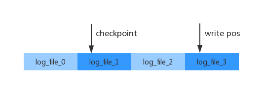

write pos 是当前要写入日志的位置，当写到末尾时，会重新到文件头部开始写入。checkpoint 是当前待擦除的位置，以此循环反复利用这 4GB 的空间。有了 redo log，即时数据异常宕机，重启时也不会丢失已经提交的数据，这个能力叫做 crash-safe。


**redo log写入流程**

前面介绍过了 redo log 的写入首先会写入 redo log cache，其详细的状态如下所示：

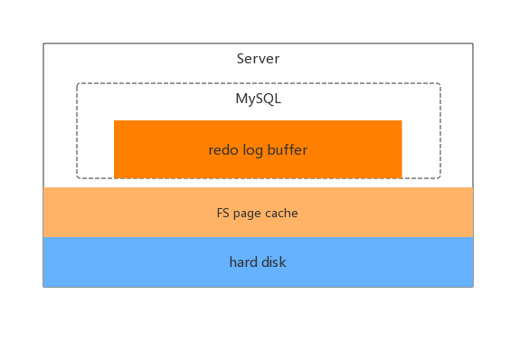

redo log 对应上面的 3 种状态分别是：

- **在 MySQL 应用的 redo log buffer 中**
- **write 到文件系统的 page cache 中，但是没有进行实际的写盘操作（fsync）**
- **执行 fsync 之后，写盘结束**

InnoDB 有一个后台线程，每个 1 秒钟 就会将 redo log buffer 中的日志，调用 write 写入到 文件系统的 page cache 中，然后再调用 fsync 持久化到磁盘中。redo log buffer 是共享的，因此一些正在执行中的事务的 redo log 也有可能被持久化到磁盘中。

通常我们说的 MySQL 的 “双1” 操作，指的是 `sync_binlog = 1 AND innodb_flush_log_at_trx_commit = 1` 。`innodb_flush_log_at_trx_commit` 设置成 `1` 表示 redo log 在 prepare 阶段就需要持久化一次，那么 “双1” 配置 每个事务提交的时候都会刷盘 2 次，一次是 `binlog`，一次是 `redo log`。

为了控制 redo log 的写入策略，innodb_flush_log_at_trx_commit 会有下面 3 中取值：

- **0：每次提交事务只写在 redo log buffer 中**
- **1：每次提交事务持久化到磁盘**
- **2：每次提交事务写到 文件系统的 page cache 中**

redo log 实际的触发 fsync 操作写盘包含以下几个场景：

- **后台每隔 1 秒钟的线程轮询**
- **innodb_flush_log_at_trx_commit 设置成 1 时，事务提交时触发**
- **innodb_log_buffer_size 是设置 redo log 大小的参数**。当 redo log buffer 达到 innodb_log_buffer_size / 2 时，也会触发一次 fsync


### binlog(归档日志)

通过MySQL的架构可以看出，MySQL服务端主要分为2大块：Server层 和 引擎层。redo log 本身是 InnoDB所特有的日志，而Server 层也有自己的日志，那就是binlog。至于为什么会有两种日志，这就是历史原因了。最开始，MySQL原生的存储引擎是MyISAM。它本身不支持事务的特性，而InnoDB 是另外一家公司以插件的形式开发的，为了支持事务等特性，引入了 redo log。两者主要有以下区别：

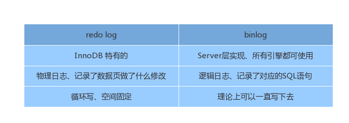

结合到update 语句中，如：对ID=2的这一行的c 值进行更改，执行流程如下所示：

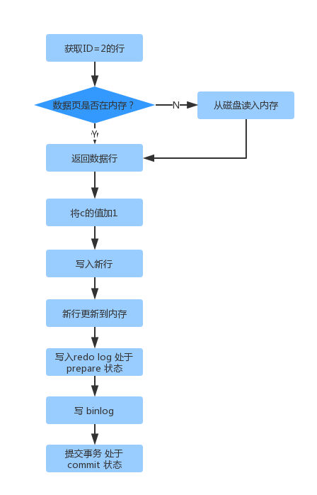

从上面的执行流程可以看出，对于redo log 的写入拆成了 2 个步骤，这就是**两阶段提交**。


**binlog写入流程**

事务执行过程中，binlog 首先会被写到 binlog cache 中；事务提交的时候，再讲binlog cache 写到 binlog 文件中。一个事务的 binlog 是原子的，无论多大都需要保证完整性。

系统为每个客户端线程分配一个 binlog cache，其大小由 binlog_cache_size 控制。如果binlog cache 超过阀值，就会临时持久化到磁盘。当事务提交的时候，再将 binlog cache 中完整的事务持久化到磁盘中，并清空 binlog cache。

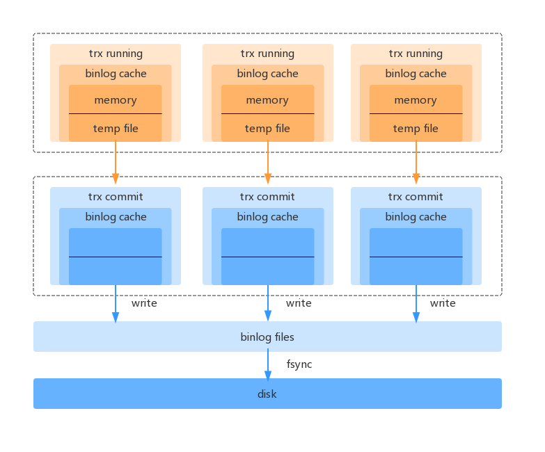

从上面可以看出，每个客户端线程都有自己独立的 binlog cache，但是会共享一份 binlog files。上面的 write 是指把binlog cache 写到文件系统的 page cache，并没有写入到磁盘中，因此速度较快。fsync 是实际的写盘操作，占用磁盘的 IOPS。write 和 fsync 的写入时机，是由sync_binlog 控制的：

- sync_binlog=0：每次事务提交都只 write，不 fsync
- sync_binlog=1：每次事务提交都会fsync
- sync_binlog=N（N>1）：每次提交事务都会 write，累计N 个后再执行 fsync

在出现 IO 瓶颈的情况下，可以考虑将 sync_binlog 设置成一个大的值。比较常见的是将 N设置为 100~1000。但是存在的风险是，当主机异常重启时会丢失 N 个最近提交的事务 binlog。


## 查询过程

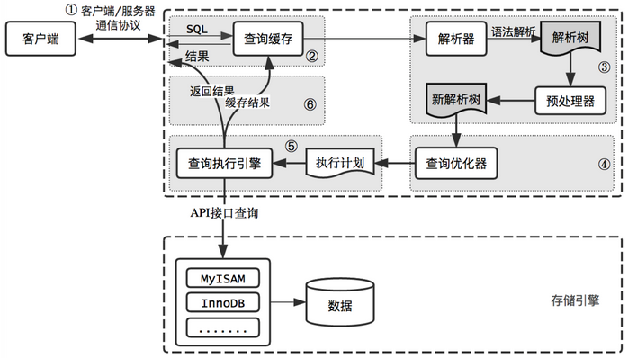


## 全局锁表锁&行锁

### 全局锁

**FTWRL**

全局锁就是对整个数据库实例加锁，MySQL 提供了 flush tables with read lock (FTWRL) 的方式去加全局锁。当你需要让整个库处于只读状态的时候，就可以使用这个命令了，之后所有线程的更改操作都会被阻塞。


**mysqldump**

mysqldump 是官方提供的备份工具，可以通过 --single-transaction 参数来启用可重复读隔离级别，从而可以拿到一个一致性视图。


**set global readonly = true**

通过上述命令可以让全库进入只读状态，但是在开发当中，事务框架往往会利用这个参数来处理读写分离。所以通常情况下，还是不建议使用这种方式。


### 表级锁

MySQL 的表级锁有 2 种：表锁和元数据锁。

**表锁**

表锁可以使用 lock tables T read/write , 可以使用 unlock tables 主动释放锁，也可以在客户端断开的时候自动释放锁。


**MDL (metadata lock)**

MDL 没有显示的命令，当执行改表语句时，MDL 会保证读写的正确性。MySQL 在 5.5 版本以后引入了 MDL 锁，当对一个表做增删改查的时候，加 MDL 读锁；当要多表结构做变更的时候，加 MDL 写锁。

- MDL 读锁之间不互斥，因此可以有多个线程同时对一张表 增删改查
- MDL 读-写、写-写之间是互斥的，因此如果同时有 2 个线程给表加字段，则需要顺序执行


### 行锁

**两阶段锁**

当使用update 更新数据时，会对 where 条件扫描到的行加行锁。在 InnoDB 事务中，行锁是在需要的时候才加上的，并且在事务提交后释放的，这就是两阶段锁协议。所以我们在更新数据时，应尽量把容易产生并发更新的行放在事务末端执行。


**死锁**

在事务对不同行加锁的时候，就很有可能出现死锁的情况。

MySQL 有 2 中策略去解决死锁：

- **超时等待**：可以通过 innodb_lock_wait_timeout 来设置，默认 50S。（一般不采用，因为 50S 对应用来说是不可接受的，并且这个值的设置也没有合适的估算值）
- **死锁检测**：发现死锁后，主动回滚其中一个事务。可以通过 innodb_deadlock_detect 设置为 on

上面 2 种死锁的解决方法，都是MySQL 本身提供的。我们实际开发的过程当中，往往是需要自己从业务的角度去考虑，如何规避死锁和解决死锁的问题：

- **按规则加锁**：如 A 转账给 B，同时 B 也转账给 A，此时就很可能出现死锁。但是如果我们根据 userId 的升序规则去加锁，就不会产生死锁的问题了
- **控制并发度**：如支付系统中的账户系统，可以将总账户拆分成子账户，然后每个子账户是一个独立的锁实体


## mysql复制原理

### 基于语句的复制

基于语句的复制模式下，主库会记录那些造成数据更改的查询，当备库读取并重放这些事件时，实际上只把主库上执行过的SQL再执行一遍。

- **优点**

  最明显的好处是实现相当简单。理论上讲，简单地记录和执行这些语句，能够让备库保持同步。另外好处是binlog日志里的事件更加紧凑，所以相对而言，基于语句的模式不会使用太多带宽。一条更新好几兆数据的语句在二进制日志里可能只占用几十字节。

- **缺点**

  有些数据更新语句，可能依赖其他因素。例如，同一条sql在主库和备库上执行的时间可能稍微或很不相同，因此在传输的binlog日志中，除了查询语句，还包括一些元数据信息，如当前的时间戳。即便如此，还存在着一些无法被正确复制的SQL，例如，使用CURRENT_USER()函数语句。存储过程和触发器在使用基于语句的复制模式时也可能存在问题。另外一个问题是更新必须是串行的。这需要更多的锁。并且不是所有的存储引擎都支持这种复制模式。


### 基于行的复制

MySQL5.1开始支持基于行的复制，这种方式会将实际数据记录在二进制日志中，跟其他数据库的实现比较相像。

- **优点**

  最大的好处是可以正确的复制每一行，一些语句可以呗更加有效地复制。由于无需重放更新主库数据的查询，使用基于行的复制模式能够更高效地复制数据。重放一些查询的代价会很高

- **缺点**

  全表更行，使用基于行复制开销会大很多，因为每一行数据都会呗记录到二进制日志中，这使得二进制日志时间非常庞大


# 高可用方案

我们在考虑MySQL数据库的高可用架构时，主要考虑如下几方面：

- 如果数据库发生了宕机或者意外中断等故障，能尽快恢复数据库的可用性，尽可能的减少停机时间，保证业务不会因为数据库的故障而中断
- 用作备份、只读副本等功能的非主节点的数据应该和主节点的数据实时或者最终保持一致
- 当业务发生数据库切换时，切换前后的数据库内容应当一致，不会因为数据缺失或者数据不一致而影响业务

关于对高可用的分级我们暂不做详细的讨论，这里只讨论常用高可用方案的优缺点以及选型。


随着人们对数据一致性要求不断的提高，越来越多的方法被尝试用来解决分布式数据一致性的问题，如MySQL自身的优化、MySQL集群架构的优化、Paxos、Raft、2PC算法的引入等。

而使用分布式算法用来解决MySQL数据库数据一致性问题的方法，也越来越被人们所接受，一系列成熟的产品如PhxSQL、MariaDB Galera Cluster、Percona XtraDB Cluster等越来越多的被大规模使用。

随着官方MySQL Group Replication的GA，使用分布式协议来解决数据一致性问题已经成为了主流的方向。期望越来越多优秀的解决方案被提出，MySQL高可用问题也可以被更好的解决。


## 主从或主主半同步复制

使用双节点数据库，搭建单向或者双向的半同步复制。在5.7以后的版本中，由于lossless replication、logical多线程复制等一些列新特性的引入，使得MySQL原生半同步复制更加可靠。常见架构如下：

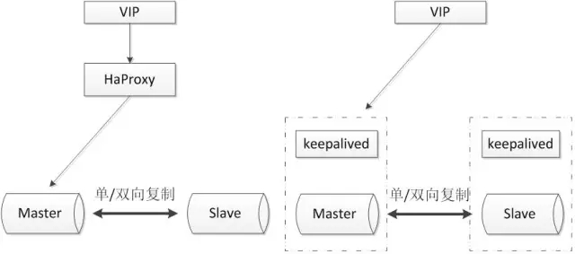

通常会和Proxy、Keepalived等第三方软件同时使用，即可以用来监控数据库的健康，又可以执行一系列管理命令。如果主库发生故障，切换到备库后仍然可以继续使用数据库。

**优点**

- 架构比较简单，使用原生半同步复制作为数据同步的依据
- 双节点，没有主机宕机后的选主问题，直接切换即可
- 双节点，需求资源少，部署简单

**缺点**

- 完全依赖于半同步复制，如果半同步复制退化为异步复制，数据一致性无法得到保证
- 需要额外考虑HAProxy、Keepalived的高可用机制


## 半同步复制优化

半同步复制机制是可靠的。如果半同步复制一直是生效的，那么可以认为数据是一致的。但是由于网络波动等一些客观原因，导致半同步复制发生超时而切换为异步复制，这时便不能保证数据的一致性。所以尽可能的保证半同步复制，就可以提高数据的一致性。

该方案同样使用双节点架构，但是在原有半同复制的基础上做了功能上的优化，使半同步复制的机制变得更加可靠。可参考的优化方案如下：

### 双通道复制

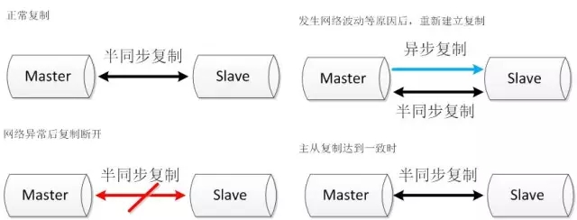

半同步复制由于发生超时后，复制断开，当再次建立起复制时，同时建立两条通道，其中一条半同步复制通道从当前位置开始复制，保证从机知道当前主机执行的进度。另外一条异步复制通道开始追补从机落后的数据。当异步复制通道追赶到半同步复制的起始位置时，恢复半同步复制。


### binlog文件服务器

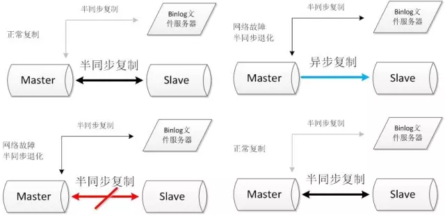

搭建两条半同步复制通道，其中连接文件服务器的半同步通道正常情况下不启用，当主从的半同步复制发生网络问题退化后，启动与文件服务器的半同步复制通道。当主从半同步复制恢复后，关闭与文件服务器的半同步复制通道。

**优点**

- 双节点，需求资源少，部署简单
- 架构简单，没有选主的问题，直接切换即可
- 相比于原生复制，优化后的半同步复制更能保证数据的一致性

**缺点**

- 需要修改内核源码或者使用MySQL通信协议。需要对源码有一定的了解，并能做一定程度的二次开发
- 依旧依赖于半同步复制，没有从根本上解决数据一致性问题


## 高可用架构优化

将双节点数据库扩展到多节点数据库，或者多节点数据库集群。可以根据自己的需要选择一主两从、一主多从或者多主多从的集群。由于半同步复制，存在接收到一个从机的成功应答即认为半同步复制成功的特性，所以多从半同步复制的可靠性要优于单从半同步复制的可靠性。并且多节点同时宕机的几率也要小于单节点宕机的几率，所以多节点架构在一定程度上可以认为高可用性是好于双节点架构。

但由于数据库数量较多，所以需要数据库管理软件来保证数据库的可维护性。可以选择MMM、MHA或者各个版本的Proxy等等。常见方案如下：

### MHA+多节点集群

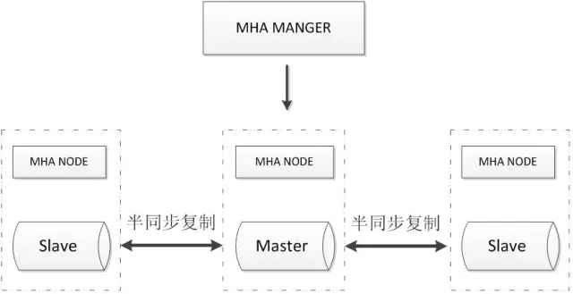

MHA Manager会定时探测集群中的master节点，当master出现故障时，它可以自动将最新数据的slave提升为新的master，然后将所有其他的slave重新指向新的master，整个故障转移过程对应用程序完全透明。MHA Node运行在每台MySQL服务器上，主要作用是切换时处理二进制日志，确保切换尽量少丢数据。MHA也可以扩展到如下的多节点集群：

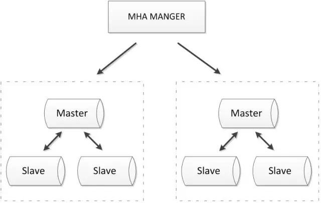

**优点**

- 可以进行故障的自动检测和转移
- 可扩展性较好，可以根据需要扩展MySQL的节点数量和结构
- 相比于双节点的MySQL复制，三节点/多节点的MySQL发生不可用的概率更低

**缺点**

- 至少需要三节点，相对于双节点需要更多的资源
- 逻辑较为复杂，发生故障后排查问题，定位问题更加困难
- 数据一致性仍然靠原生半同步复制保证，仍然存在数据不一致的风险
- 可能因为网络分区发生脑裂现象。
- 在此我向大家推荐一个架构学习交流群。交流学习群号：575745314 里面会分享一些资深架构师录制的视频录像：有Spring，MyBatis，Netty源码分析，高并发、高性能、分布式、微服务架构的原理，JVM性能优化、分布式架构等这些成为架构师必备的知识体系。还能领取免费的学习资源，目前受益良多


### ZooKeeper+Proxy

ZooKeeper使用分布式算法保证集群数据的一致性，使用ZooKeeper可以有效的保证Proxy的高可用性，可以较好地避免网络分区现象的产生。

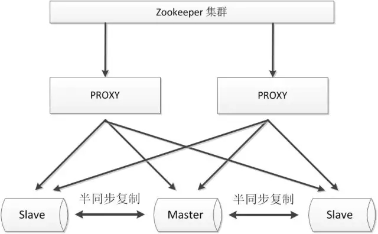

**优点**

- 较好的保证了整个系统的高可用性，包括Proxy、MySQL
- 扩展性较好，可以扩展为大规模集群

**缺点**

- 数据一致性仍然依赖于原生的mysql半同步复制
- 引入ZK，整个系统的逻辑变得更加复杂


## 共享存储

共享存储实现了数据库服务器和存储设备的解耦，不同数据库之间的数据同步不再依赖于MySQL的原生复制功能，而是通过磁盘数据同步的手段，来保证数据的一致性。

### SAN共享储存

SAN的概念是允许存储设备和处理器（服务器）之间建立直接的高速网络（与LAN相比）连接，通过这种连接实现数据的集中式存储。常用架构如下：

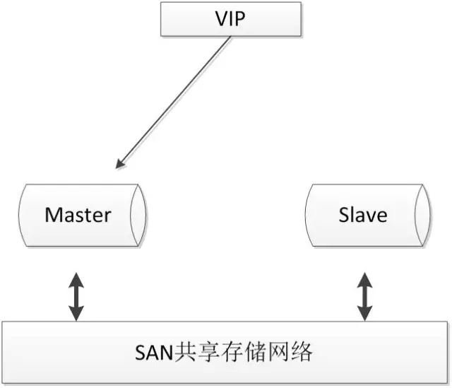

使用共享存储时，MySQL服务器能够正常挂载文件系统并操作，如果主库发生宕机，备库可以挂载相同的文件系统，保证主库和备库使用相同的数据。

**优点**

- 两节点即可，部署简单，切换逻辑简单
- 很好的保证数据的强一致性
- 不会因为MySQL的逻辑错误发生数据不一致的情况

**缺点**

- 需要考虑共享存储的高可用
- 价格昂贵


### DRBD磁盘复制

DRBD是一种基于软件、基于网络的块复制存储解决方案，主要用于对服务器之间的磁盘、分区、逻辑卷等进行数据镜像，当用户将数据写入本地磁盘时，还会将数据发送到网络中另一台主机的磁盘上，这样的本地主机(主节点)与远程主机(备节点)的数据就可以保证实时同步。常用架构如下：

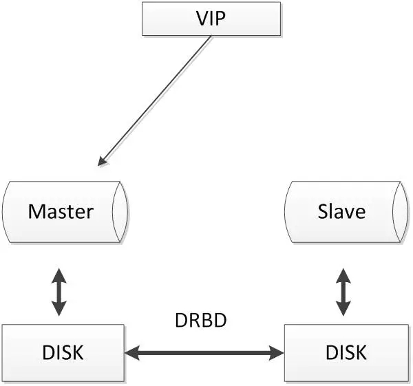

当本地主机出现问题，远程主机上还保留着一份相同的数据，可以继续使用，保证了数据的安全。DRBD是Linux内核模块实现的快级别的同步复制技术，可以与SAN达到相同的共享存储效果。

**优点**

- 两节点即可，部署简单，切换逻辑简单
- 相比于SAN储存网络，价格低廉
- 保证数据的强一致性

**缺点**

- 对IO性能影响较大
- 从库不提供读操作


## 分布式协议

分布式协议可以很好地解决数据一致性问题。比较常见的方案如下：

### MySQL Cluster

MySQL Cluster是官方集群的部署方案，通过使用NDB存储引擎实时备份冗余数据，实现数据库的高可用性和数据一致性。

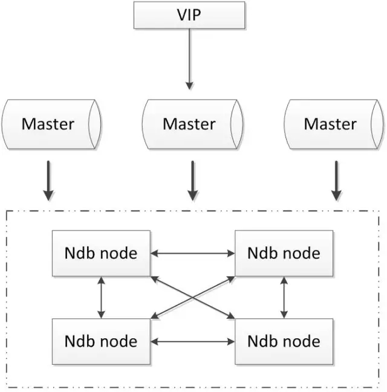

**优点**

- 全部使用官方组件，不依赖于第三方软件
- 可以实现数据的强一致性

**缺点**

- 国内使用的较少
- 配置较复杂，需要使用NDB储存引擎，与MySQL常规引擎存在一定差异
- 至少三节点


### Galera

基于Galera的MySQL高可用集群， 是多主数据同步的MySQL集群解决方案，使用简单，没有单点故障，可用性高。常见架构如下：

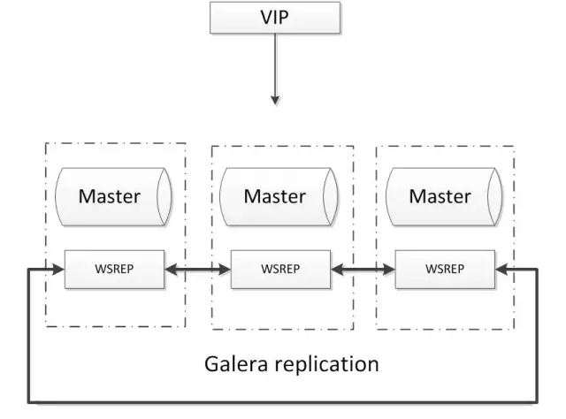

**优点**

- 多主写入，无延迟复制，能保证数据强一致性
- 有成熟的社区，有互联网公司在大规模的使用
- 自动故障转移，自动添加、剔除节点

**缺点**

- 需要为原生MySQL节点打wsrep补丁
- 只支持innodb储存引擎
- 至少三节点


### Paxos

Paxos算法解决的问题是一个分布式系统如何就某个值（决议）达成一致。这个算法被认为是同类算法中最有效的。Paxos与MySQL相结合可以实现在分布式的MySQL数据的强一致性。常见架构如下：

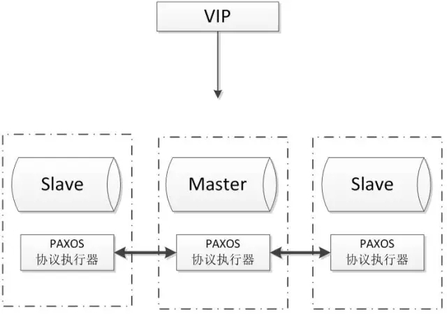

**优点**

- 多主写入，无延迟复制，能保证数据强一致性
- 有成熟理论基础
- 自动故障转移，自动添加、剔除节点

**缺点**

- 只支持InnoDB储存引擎
- 至少三节点
- 在此我向大家推荐一个架构学习交流群。交流学习群号：575745314 里面会分享一些资深架构师录制的视频录像：有Spring，MyBatis，Netty源码分析，高并发、高性能、分布式、微服务架构的原理，JVM性能优化、分布式架构等这些成为架构师必备的知识体系。还能领取免费的学习资源，目前受益良多


## 主从延迟

在实际的生产环境中，由单台MySQL作为独立的数据库是完全不能满足实际需求的，无论是在安全性，高可用性以及高并发等各个方面。因此，一般来说都是通过集群主从复制（Master-Slave）的方式来同步数据，再通过读写分离（MySQL-Proxy）来提升数据库的并发负载能力进行部署与实施。总结MySQL主从集群带来的作用是：

- 提高数据库负载能力，主库执行读写任务（增删改），备库仅做查询
- 提高系统读写性能、可扩展性和高可用性
- 数据备份与容灾，备库在异地，主库不存在了，备库可以立即接管，无须恢复时间

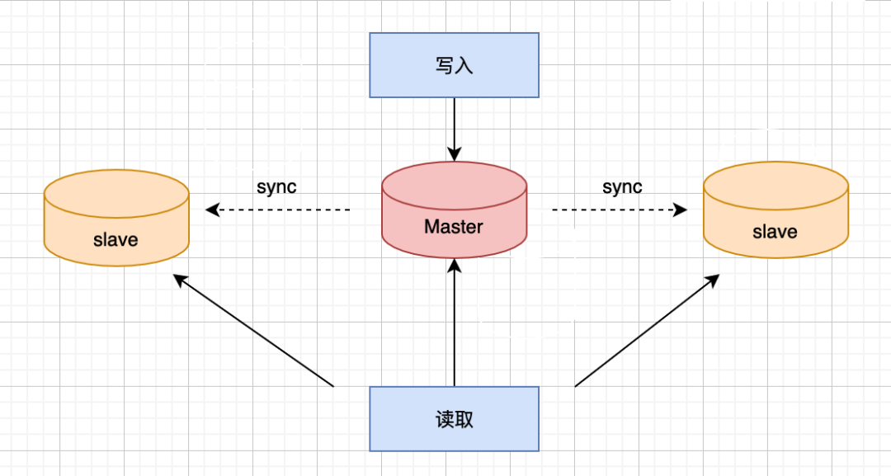


### biglog

**binlog是什么？有什么作用？**

用于记录数据库执行的写入性操作(不包括查询)信息，以二进制的形式保存在磁盘中。可以简单理解为记录的就是sql语句。binlog 是 mysql 的逻辑日志，并且由 `Server`层进行记录，使用任何存储引擎的 mysql 数据库都会记录 binlog 日志。在实际应用中， binlog 的主要使用场景有两个：

- 用于主从复制，在主从结构中，binlog 作为操作记录从 master 被发送到 slave，slave服务器从 master 接收到的日志保存到 relay log 中
- 用于数据备份，在数据库备份文件生成后，binlog保存了数据库备份后的详细信息，以便下一次备份能从备份点开始


**日志格式**

binlog日志有三种格式，分别为STATMENT 、 ROW 和 MIXED。在 MySQL 5.7.7 之前，默认的格式是 STATEMENT ， MySQL 5.7.7 之后，默认值是 ROW。日志格式通过 `binlog-format` 指定。

- **STATMENT** ：基于 SQL 语句的复制，每一条会修改数据的sql语句会记录到 binlog 中
- **ROW** ：基于行的复制
- **MIXED** ：基于 STATMENT 和 ROW 两种模式的混合复制，比如一般的数据操作使用 row 格式保存，有些表结构的变更语句，使用 statement 来记录


我们还可以通过mysql提供的查看工具mysqlbinlog查看文件中的内容，例如：

```mysql
mysqlbinlog mysql-bin.00001 | more
```

binlog文件大小和个数会不断的增加，后缀名会按序号递增，例如`mysql-bin.00002`等。


### 主从复制原理

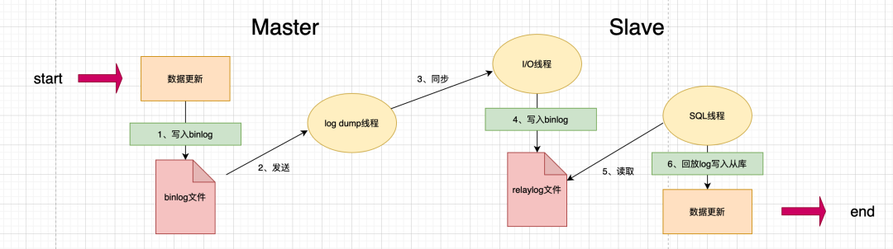

可以看到mysql主从复制需要三个线程：**master（binlog dump thread）、slave（I/O thread 、SQL thread）**

- **binlog dump线程：** 主库中有数据更新时，根据设置的binlog格式，将更新的事件类型写入到主库的binlog文件中，并创建log dump线程通知slave有数据更新。当I/O线程请求日志内容时，将此时的binlog名称和当前更新的位置同时传给slave的I/O线程
- **I/O线程：** 该线程会连接到master，向log dump线程请求一份指定binlog文件位置的副本，并将请求回来的binlog存到本地的relay log中
- **SQL线程：** 该线程检测到relay log有更新后，会读取并在本地做redo操作，将发生在主库的事件在本地重新执行一遍，来保证主从数据同步


**基本过程总结**

- 主库写入数据并且生成binlog文件。该过程中MySQL将事务串行的写入二进制日志，即使事务中的语句都是交叉执行的
- 在事件写入二进制日志完成后，master通知存储引擎提交事务
- 从库服务器上的IO线程连接Master服务器，请求从执行binlog日志文件中的指定位置开始读取binlog至从库
- 主库接收到从库IO线程请求后，其上复制的IO线程会根据Slave的请求信息分批读取binlog文件然后返回给从库的IO线程
- Slave服务器的IO线程获取到Master服务器上IO线程发送的日志内容、日志文件及位置点后，会将binlog日志内容依次写到Slave端自身的Relay Log（即中继日志）文件的最末端，并将新的binlog文件名和位置记录到`master-info`文件中，以便下一次读取master端新binlog日志时能告诉Master服务器从新binlog日志的指定文件及位置开始读取新的binlog日志内容
- 从库服务器的SQL线程会实时监测到本地Relay Log中新增了日志内容，然后把RelayLog中的日志翻译成SQL并且按照顺序执行SQL来更新从库的数据
- 从库在`relay-log.info`中记录当前应用中继日志的文件名和位置点以便下一次数据复制


**并行复制**

在MySQL 5.6版本之前，Slave服务器上有两个线程I/O线程和SQL线程。I/O线程负责接收二进制日志，SQL线程进行回放二进制日志。如果在MySQL 5.6版本开启并行复制功能，那么SQL线程就变为了coordinator线程，coordinator线程主要负责以前两部分的内容：

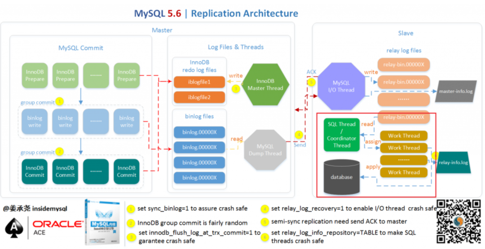

**上图的红色框框部分就是实现并行复制的关键所在**。这意味着coordinator线程并不是仅将日志发送给worker线程，自己也可以回放日志，但是所有可以并行的操作交付由worker线程完成。coordinator线程与worker是典型的生产者与消费者模型。

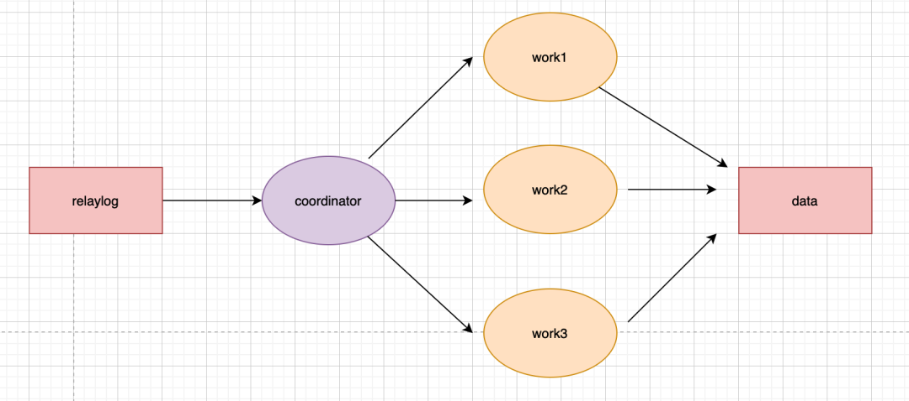

不过到MySQL 5.7才可称为真正的并行复制，这其中最为主要的原因就是slave服务器的回放与主机是一致的即master服务器上是怎么并行执行的slave上就怎样进行并行回放。不再有库的并行复制限制，对于二进制日志格式也无特殊的要求。为了兼容MySQL 5.6基于库的并行复制，5.7引入了新的变量`slave-parallel-type`，其可以配置的值有：

- **DATABASE**：默认值，基于库的并行复制方式
- **LOGICAL_CLOCK**：基于组提交的并行复制方式


**按库并行**

每个 worker 线程对应一个 hash 表，用于保存当前正在这个worker的执行队列里的事务所涉及到的库。其中hash表里的key是数据库名，用于决定分发策略。该策略的优点是构建hash值快，只需要库名，同时对于binlog的格式没有要求。但这个策略的效果，只有在主库上存在多个DB，且各个DB的压力均衡的情况下，这个策略效果好。因此，对于主库上的表都放在同一个DB或者不同DB的热点不同，则起不到多大效果：

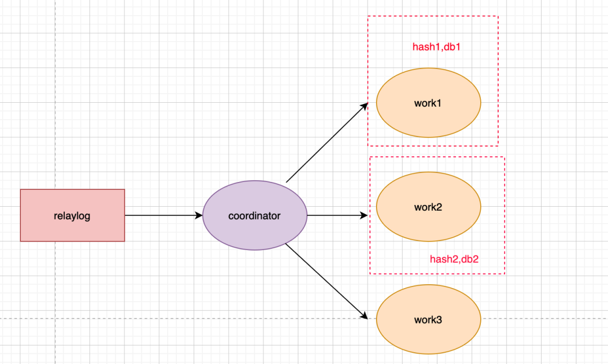


**组提交优化**

该特性如下：

- 能够同一组里提交的事务，定不会修改同一行
- 主库上可以并行执行的事务，从库上也一定可以并行执行

具体是如何实现的：

- 在同一组里面一起提交的事务，会有一个相同的`commit_id`，下一组为`commit_id+1`，该`commit_id`会直接写到binlog中
- 在从库使用时，相同`commit_id`的事务会被分发到多个worker并行执行，直到这一组相同的`commit_id`执行结束后，coordinator再取下一批


### 主从延迟

根据主从复制的原理可以看出，两者之间是存在一定时间的数据不一致，也就是所谓的主从延迟。导致主从延迟的时间点：

- 主库 A 执行完成一个事务，写入 binlog，该时刻记为T1
- 传给从库B，从库接受完这个binlog的时刻记为T2
- 从库B执行完这个事务，该时刻记为T3

那么所谓主从延迟，就是同一个事务，从库执行完成的时间和主库执行完成的时间之间的差值，即T3-T1。我们也可以通过在从库执行`show slave status`，返回结果会显示`seconds_behind_master`，表示当前从库延迟了多少秒。

**seconds_behind_master如何计算的？**

- 每一个事务的binlog都有一个时间字段，用于记录主库上写入的时间
- 从库取出当前正在执行的事务的时间字段，跟当前系统的时间进行相减，得到的就是`seconds_behind_master`，也就是前面所描述的T3-T1


**为什么会主从延迟？**

正常情况下，如果网络不延迟，那么日志从主库传给从库的时间是相当短，所以T2-T1可以基本忽略。最直接的影响就是从库消费中转日志（relaylog）的时间段，而造成原因一般是以下几种：

- **从库的机器性能比主库要差**

  比如将20台主库放在4台机器，把从库放在一台机器。这个时候进行更新操作，由于更新时会触发大量读操作，导致从库机器上的多个从库争夺资源，导致主从延迟。不过，目前大部分部署都是采取主从使用相同规格的机器部署

- **从库的压力大**

  按照正常的策略，读写分离，主库提供写能力，从库提供读能力。将进行大量查询放在从库上，结果导致从库上耗费了大量的CPU资源，进而影响了同步速度，造成主从延迟。对于这种情况，可以通过一主多从，分担读压力；也可以采取binlog输出到外部系统，比如Hadoop，让外部系统提供查询能力

- **大事务的执行**

  一旦执行大事务，那么主库必须要等到事务完成之后才会写入binlog。比如主库执行了一条insert … select非常大的插入操作，该操作产生了近几百G的binlog文件传输到只读节点，进而导致了只读节点出现应用binlog延迟。因此，DBA经常会提醒开发，不要一次性地试用delete语句删除大量数据，尽可能控制数量，分批进行

- **主库的DDL(alter、drop、create)**
  - 只读节点与主库的DDL同步是串行进行，如果DDL操作在主库执行时间很长，那么从库也会消耗同样的时间，比如在主库对一张500W的表添加一个字段耗费了10分钟，那么从节点上也会耗费10分钟
  - 从节点上有一个执行时间非常长的的查询正在执行，那么这个查询会堵塞来自主库的DDL，表被锁，直到查询结束为止，进而导致了从节点的数据延迟

- **锁冲突**

  锁冲突问题也可能导致从节点的SQL线程执行慢，比如从机上有一些select .... for update的SQL，或者使用了MyISAM引擎等

- **从库的复制能力**

  一般场景中，因偶然情况导致从库延迟了几分钟，都会在从库恢复之后追上主库。但若是从库执行速度低于主库，且主库持续具有压力，就会导致长时间主从延迟，很有可能就是从库复制能力的问题。

从库上的执行，即`sql_thread`更新逻辑，在5.6版本之前，是只支持单线程，那么在主库并发高、TPS高时，就会出现较大的主从延迟。因此，MySQL自5.7版本后就已经支持并行复制了。可以在从服务上设置 `slave_parallel_workers`为一个大于0的数，然后把`slave_parallel_type`参数设置为`LOGICAL_CLOCK`，这就可以了

```mysql
mysql> show variables like 'slave_parallel%';
+------------------------+----------+
| Variable_name          | Value    |
+------------------------+----------+
| slave_parallel_type    | DATABASE |
| slave_parallel_workers | 0        |
+------------------------+----------+
```


**怎么减少主从延迟？**

主从同步问题永远都是一致性和性能的权衡，得看实际的应用场景，若想要减少主从延迟的时间，可以采取下面的办法：

- 降低多线程大事务并发的概率，优化业务逻辑
- 优化SQL，避免慢SQL，减少批量操作，建议写脚本以update-sleep这样的形式完成
- 提高从库机器的配置，减少主库写binlog和从库读binlog的效率差
- 尽量采用短的链路，也就是主库和从库服务器的距离尽量要短，提升端口带宽，减少binlog传输的网络延时
- 实时性要求的业务读强制走主库，从库只做灾备，备份


# 常见问题

## MySQL事务

**问题一：什么Mysql的事务？事务的四大特性？事务带来的什么问题？**


在Mysql中事务的四大特性（简称为`ACID`）主要包含：

- **原子性（Atomicity）**：是指事务的原子性操作，**对数据的修改要么全部执行成功，要么全部失败，实现事务的原子性**，是基于日志的Redo/Undo机制
- **一致性**：是指**执行事务前后的状态要一致**，可以理解为数据一致性
- **隔离性**：侧重指**事务之间相互隔离，不受影响**，这个与事务设置的隔离级别有密切的关系
- **持久性**：则是指在**一个事务提交后，这个事务的状态会被持久化到数据库中，也就是事务提交，对数据的新增、更新将会持久化到数据库中**

在我的理解中：**原子性、隔离性、持久性都是为了保障一致性而存在的，一致性也是最终的目的**。


Mysql中事务的隔离级别分为四大等级：

- **读未提交（READ UNCOMMITTED）**
- **读提交 （READ COMMITTED）**
- **可重复读 （REPEATABLE READ）**
- **串行化 （SERIALIZABLE）**

没有哪种隔离级别是完美的，只能根据自己的项目业务场景去评估选择最适合的隔离级别，大部分的公司一般选择Mysql默认的隔离级别：**可重复读**。隔离级别从：**读未提交-读提交-可重复读-串行化**，级别越来越高，隔离也就越来越严实，到最后的串行化，当出现读写锁冲突的时候，后面的事务只能等前面的事务完成后才能继续访问。

- **读未提交：读取到别的事务还没有提交的数据，从而产生了脏读**
- **读提交：读取别的事务已经提交的数据，从而产生不可重复读**
- **可重复读：事务开启过程中看到的数据和事务刚开始看到的数据是一样的，从而产生幻读，在Mysql的中通过MVCC多版本控制的一致性视图解决了不可重复读问题以及通过间隙锁解决了幻读问题**
- **串行化：对于同一行记录，若是读写锁发生冲突，后面访问的事务只能等前面的事务执行完才能继续访问**


## MySQL存储引擎

**问题二：MySQL存储引擎的InnoDB和MyISAM有什么区别？**

- InnoDB和MyISAM都是Mysql的存储引擎，现在MyISAM也逐渐被InnoDB给替代，主要因为InnoDB支持事务和行级锁，MyISAM不支持事务和行级锁，MyISAM最小锁单位是表级。因为MyISAM不支持行级锁，所以在并发处理能力上InnoDB会比MyISAM好
- 数据的存储上：MyISAM的索引也是由B+树构成，但是树的叶子结点存的是行数据的地址，查找时需要找到叶子结点的地址，再根据叶子结点地址查找数据
- 数据文件构成：MyISAM有三种存储文件分别是扩展名为：`.frm`（文件存储表定义）、`.MYD` (MYData数据文件)、`.MYI` (MYIndex索引文件)。而InnoDB的表只受限于操作系统文件的大小，一般是2GB
- 查询区别：对于读多写少的业务场景，MyISAM会更加适合，而对于update和insert比较多的场景InnoDB会比较适合。
- coun(\*)区别：select count(\*) from table，MyISAM引擎会查询已经保存好的行数，这是不加where的条件下，而InnoDB需要全表扫描一遍，InnoDB并没有保存表的具体行数
- 其它的区别：InnoDB支持外键，但是不支持全文索引，而MyISAM不支持外键，支持全文索引，InnoDB的主键的范围比MyISAM的大


## SQL查询流程

**问题三：SQL查询流程是什么？**

当执行一条查询的SQl的时候大概发生了以下的步骤：

- 客户端发送查询语句给服务器
- 服务器首先进行用户名和密码的验证以及权限的校验
- 然后会检查缓存中是否存在该查询，若存在，返回缓存中存在的结果。若是不存在就进行下一步
- 接着进行语法和词法的分析，对SQl的解析、语法检测和预处理，再由优化器生成对应的执行计划
- Mysql的执行器根据优化器生成的执行计划执行，调用存储引擎的接口进行查询
- 服务器将查询的结果返回客户端。

SQL查询流程图如下：

****

 

## MySQL Log

**问题四：redo log和binlog了解过吗？**

- redo log
  - `redo log`日志也叫做`WAL`技术（`Write- Ahead Logging`），他是一种**先写日志，并更新内存，最后再更新磁盘的技术**，为了就是减少sql执行期间的数据库io操作，并且更新磁盘往往是在Mysql比较闲的时候，这样就大大减轻了Mysql的压力
  - `redo log`是固定大小，是物理日志，属于InnoDB引擎的，并且写redo log是环状写日志的形式
  - `redo log`日志实现了即使在数据库出现异常宕机的时候，重启后之前的记录也不会丢失，这就是`crash-safe`能力

- binlog

- `binlog`称为**归档日志**，是逻辑上的日志，它属于Mysql的Server层面的日志，记录着sql的原始逻辑，主要有两种模式：**一个是statement格式记录的是原始的sql，而row格式则是记录行内容**。


redo log和binlog记录的形式、内容不同，这两者日志都能通过自己记录的内容恢复数据。之所以这两个日志同时存在，是因为刚开始Mysql自带的引擎MyISAM就没有crash-safe功能的，并且在此之前Mysql还没有InnoDB引擎，Mysql自带的binlog日志只是用来归档日志的，所以InnoDB引擎也就通过自己redo log日志来实现crash-safe功能。


## MySQL索引种类

**问题五：你知道有哪些种类的索引？**

索引从**数据结构**进行划分的分为：**B+树索引、hash索引、R-Tree索引、FULLTEXT索引**。

索引从**物理存储**的角度划分为：**聚族索引**和**非聚族索引**。

从**逻辑的角度**分为：**主键索引**、**普通索引、唯一索引、联合索引**以及**空间索引**。


## MySQL索引

**问题六：怎么查看索引是否生效？什么情况下索引会失效呢？**

查看索引是否起作用可以使用explain关键字，查询后的语句中的key字段，若是使用了索引，该字段会展示索引的名字。

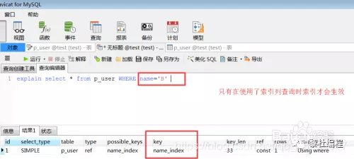

- `id`：查询的序列号
- `select_type`：查询类型
- `table`：查询表名
- `type`：扫描方式，all表示全表扫描
- `possible_keys`：可是使用到的索引
- `key`：实际使用到的索引
- `rows`：该sql扫面了多少行
- `Extra`：sql语句额外的信息，比如排序方式


- **where条件查询中使用了or关键字**，有可能使用了索引进行查询也会导致索引失效，若是想使用or关键字，又不想索引失效，只能在or的所有列上都建立索引。

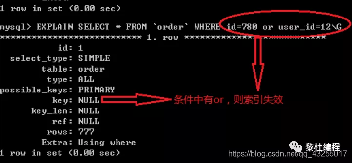

- **条件查询中使用like关键字，并且不符合最左前缀原则**，会导致索引失效。


- **条件查询的字段是字符串，而错误的使用where column = 123 数字类型**也会导致索引失效。

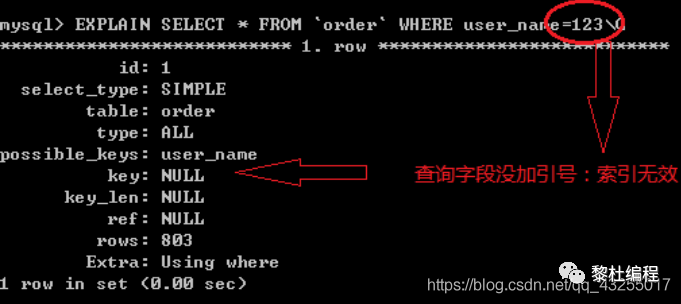

- 对于**联合索引查询不符合最左前缀原则**，也会导致索引失效，如下所示：

```sql
alter table user add index union_index(name, age)   // name左边的列， age 右边的列                                                              
select * from user where name = 'lidu'     // 会用到索引
select * from user where age = 18          //  不会使用索引
```

- 在**where条件查询的后面对字段进行null值判断**，会导致索引失效，解决方式为可以把null改为0或者-1这些特殊的值代替：

```sql
SELECT id FROM table WHERE num is null
```

- 在**where子句中使用!= ,< >这样的符号**，也会导致索引失效。

```sql
SELECT id FROM table WHERE num != 0
```

- **where条件子句中=的左边使用表达式操作或者函数操作**，也会导致索引失效。 

```sql
SELECT id FROM user WHERE age / 2 = 1
SELECT id FROM user WHERE SUBSTRING(name,1,2) = 'lidu'
```