<div style="color:#16b0ff;font-size:50px;font-weight: 900;text-shadow: 5px 5px 10px var(--theme-color);font-family: 'Comic Sans MS';">Database</div>

<span style="color:#16b0ff;font-size:20px;font-weight: 900;font-family: 'Comic Sans MS';">Introduction</span>：收纳技术相关的数据库知识 `事务`、`索引`、`锁`、`SQL优化` 等总结！

[TOC]

# 数据库范式

- **1NF**：所有字段仅包含单值（即单个字段不可在分割使用）
- **2NF**：非键字段必须全完依赖于主键（不能是主键的部分）
- **3NF**：非键字段不能依赖于非键字段（禁止传递依赖）

- **BCNF**：并且主属性不依赖于主属性


- **第四范式（4NF）**：要求把同一表内的多对多关系删除


- **第五范式（5NF）**：从最终结构重新建立原始结构

> 四种范式之间的关系：
>
> 1NF→2NF：消去非主属性对键的部分函数依赖
>
> 2NF→3NF：消去非主属性对键的传递函数依赖
>
> 3NF→BCNF：消去主属性对键的传递函数依赖

## 第一范式(1NF)

**列都是不可再分**。即实体中的某个属性有多个值时，必须拆分为不同的属性。例如：

**用户信息表**

| 编号 | 姓名 | 年龄 | 地址                         |
| ---- | ---- | ---- | ---------------------------- |
| 1    | 小王 | 23   | 浙江省杭州市拱墅区湖州街51号 |

当实际需求对地址没有特定的要求下，这个用户信息表的每一列都是不可分割的。但是当实际需求对省份或者城市有特别要求时，这个用户信息表中的地址就是可以分割的，改为：

**用户信息表**

| 编号 | 姓名 | 年龄 | 省份   | 城市   | 详细地址         |
| ---- | ---- | ---- | ------ | ------ | ---------------- |
| 1    | 小王 | 23   | 浙江省 | 杭州市 | 拱墅区湖州街51号 |

**好处**

- 表结构相对清晰
- 易于查询


## 第二范式(2NF)

**每个表只描述一件事情**。满足第一范式（ 1NF）的情况下，每行必须有主键，且主键与非主键之间是完全函数依赖关系（消除部分子函数依赖）。即数据库表中的每一列都和主键的所有属性相关，不能只和主键的部分属性相关。完全函数依赖：有属性集 X，Y，通过 X 中的所有属性能够推出 Y 中的任意属性，但是 X 的任何真子集，都不能推出 Y 中的任何属性。例如：

**学生课程表**

| 学生编号 | 课程编号 | 学生名称 | 课程名称   | 所在班级  | 班主任 |
| -------- | -------- | -------- | ---------- | --------- | ------ |
| S1       | C1       | 小王     | 计算机导论 | 计算机3班 | 陈老师 |
| S1       | C2       | 小王     | 数据结构   | 计算机3班 | 陈老师 |
| S2       | C1       | 小马     | 计算机导论 | 软件1班   | 李老师 |

将学生编号和课程编号作为主键，能确定唯一一条数据，但是学生名称只跟学生编号有关，跟课程编号无关，即不满足完全函数依赖，改为：

**学生表**

| 学生编号 | 学生名称 | 所在班级  | 班主任 |
| -------- | -------- | --------- | ------ |
| S1       | 小王     | 计算机3班 | 陈老师 |
| S2       | 小马     | 软件1班   | 李老师 |

**课程表**

| 课程编号 | 课程名称   |
| -------- | ---------- |
| C1       | 计算机导论 |
| C2       | 数据结构   |

**学生课程关系表**

| 学生编号 | 课程编号 |
| -------- | -------- |
| S1       | C1       |
| S1       | C2       |
| S2       | C1       |

**好处**

- 相对节约空间，当学生表和课程表属性越多，效果越明显
- 解决插入异常，当新增一门课程时，原表因为没有学生选课，导致无法插入数据
- 解决更新繁琐，当更改一门课程名称时，原表要更改多条数据
- 解决删除异常，当学生学完一门课，原表若要清空学生上课信息，课程编号与课程名称的关系可能会丢失


## 第三范式(3NF)

**不存在对非主键列的传递依赖**。满足第二范式（ 2NF）的情况下，任何非主属性不依赖于其它非主属性（消除传递函数依赖）。例如：

**学生表**

| 学生编号 | 学生名称 | 班级编号 | 班级名字  |
| -------- | -------- | -------- | --------- |
| S1       | 小王     | 001      | 计算机1班 |
| S2       | 小马     | 003      | 计算机3班 |

学生编号作为主键满足第二范式（2NF）。通过学生编号 ⇒⇒ 班级编号 ⇒⇒ 班级名字，所以班级编号和班级名字之间存在依赖关系，改为：

**学生表**

| 学生编号 | 学生名称 | 班级编号 |
| -------- | -------- | -------- |
| S1       | 小王     | 001      |
| S2       | 小马     | 003      |

**班级表**

| 班级编号 | 班级名称  |
| -------- | --------- |
| 001      | 计算机1班 |
| 003      | 计算机3班 |

**好处**

- 相对节约空间
- 解决更新繁琐
- 解决插入异常，当班级分配了老师，还没分配学生的时候，原表将不可插入数据
- 解决删除异常，当学生毕业后，若要清空学生信息，班级和老师的关系可能会丢失


## 巴斯-科德范式（BCNF）

在3NF基础上，**消除主属性之间的传递函数依赖**，即存在多个主属性时，**主属性不依赖于主属性**。例如：

**配件表**

| 仓库号 | 配件号 | 职工号 | 配件数量 |
| ------ | ------ | ------ | -------- |
| W1     | P1     | E1     | 10       |
| W1     | P2     | E1     | 10       |
| W2     | P1     | E2     | 20       |

有以下约束：

- 一个仓库有多个职工
- 一个职工只在一个仓库
- 一种配件可以放多个仓库
- 一个仓库，一个职工管理多个配件，一种配件由唯一一个职工管理

由此，将（仓库号，配件号）作为主键，满足 3NF，但是（仓库号，配件号）⇒⇒ 职工号 ⇒⇒ 仓库号，造成传递函数依赖，改为：

**仓库表**

| 仓库号 | 职工号 |
| ------ | ------ |
| W1     | E1     |
| W2     | E2     |

**工作表**

| 职工号 | 配件号 | 配件数量 |
| ------ | ------ | -------- |
| E1     | P1     | 10       |
| E1     | P2     | 10       |
| E2     | P1     | 20       |

**好处**

- 解决一些冗余和一些异常情况

**不足**

- 丢失一些函数依赖，如丢失（仓库号，配件号）⇒⇒ 职工号，无法通过单表来确定一个职工号


## 第四范式（4NF）

在满足第三范式（3NF）的前提下，表中不能包含一个实体的两个或多个互相独立的多值因子。

当一个表中非主属性相互独立时（即在 3NF 基础上），这些非主属性不应该有`多值`。即表中不能包含一个实体的两个或多个互相独立的多值因子。例如：

**客户联系方式**

| 客户编号 | 固定电话 | 移动电话 |
| -------- | -------- | -------- |
| 10       | 88-123   | 151      |
| 10       | 80-123   | 183      |

一个用户拥有多个固定电话和移动电话，给表的维护带来很多麻烦。比如增加一个固定电话，那么移动电话这一栏就较难维护，改为：

**客户电话表**

| 客户编号 | 电话号码 | 电话类型 |
| -------- | -------- | -------- |
| 10       | 88-123   | 固定电话 |
| 10       | 80-123   | 固定电话 |
| 10       | 151      | 移动电话 |
| 10       | 183      | 移动电话 |

**好处**

- 解决一些异常，使表结构更加合理


## 第五范式（5NF）

在关系模式 R 中，每一个`连接依赖`均有 R 的`候选码`所隐含。即连接时，所连接的属性都是候选码，例如：

**销售表**

| 销售人员 | 供应商 | 产品 |
| -------- | ------ | ---- |
| S1       | V1     | P1   |
| S2       | V2     | P2   |
| S1       | V1     | P1   |
| S2       | V2     | P2   |

要想找到某一条数据，必须以（销售人员，供应商，产品）为主键，改为：

**销售人员_供应商表**

| 销售人员 | 供应商 |
| -------- | ------ |
| S1       | V1     |
| S2       | V2     |

**销售人员_产品表**

| 销售人员 | 产品 |
| -------- | ---- |
| S1       | P1   |
| S2       | P2   |

**供应商_产品表**

| 供应商 | 产品 |
| ------ | ---- |
| V1     | P1   |
| V2     | P2   |

**好处**

- 解决某些异常操作


# 连接方式

## 内连接（INNER JOIN）

INNER JOIN 一般被译作内连接。内连接查询能将左表（表 A）和右表（表 B）中能关联起来的数据连接后返回。

**文氏图**

.png)

**示例查询**

```mysql
SELECT A.PK AS A_PK, B.PK AS B_PK,A.Value AS A_Value, B.Value AS B_Value
FROM Table_A A
INNER JOIN Table_B B
ON A.PK = B.PK;
```

**查询结果**

```mysql
+------+------+---------+---------+
| A_PK | B_PK | A_Value | B_Value |
+------+------+---------+---------+
|    1 |    1 | both ab | both ab |
+------+------+---------+---------+
1 row in set (0.00 sec)
```

**注意**：其中A为Table_A的别名，B为Table_B的别名，下同。


## 左连接（LEFT JOIN）

LEFT JOIN 一般被译作左连接，也写作 LEFT OUTER JOIN。左连接查询会返回左表（表 A）中所有记录，不管右表（表 B）中有没有关联的数据。在右表中找到的关联数据列也会被一起返回。

**文氏图**

.png)

**示例查询**

```mysql
SELECT A.PK AS A_PK, B.PK AS B_PK,A.Value AS A_Value, B.Value AS B_Value
FROM Table_A A
LEFT JOIN Table_B B
ON A.PK = B.PK;
```

**查询结果**

```mysql
+------+------+---------+---------+
| A_PK | B_PK | A_Value | B_Value |
+------+------+---------+---------+
|    1 |    1 | both ab | both ba |
|    2 | NULL | only a  | NULL    |
+------+------+---------+---------+
2 rows in set (0.00 sec)
```


## 右连接（RIGHT JOIN）

RIGHT JOIN 一般被译作右连接，也写作 RIGHT OUTER JOIN。右连接查询会返回右表（表 B）中所有记录，不管左表（表 A）中有没有关联的数据。在左表中找到的关联数据列也会被一起返回。

**文氏图**

.png)

**示例查询**

```mysql
SELECT A.PK AS A_PK, B.PK AS B_PK,A.Value AS A_Value, B.Value AS B_Value
FROM Table_A A
RIGHT JOIN Table_B B
ON A.PK = B.PK;
```

**查询结果**

```mysql
+------+------+---------+---------+
| A_PK | B_PK | A_Value | B_Value |
+------+------+---------+---------+
|    1 |    1 | both ab | both ba |
| NULL |    3 | NULL    | only b  |
+------+------+---------+---------+
2 rows in set (0.00 sec)
```


## 全连接（FULL JOIN）

FULL JOIN 一般被译作外连接、全连接，实际查询语句中可以写作 FULL OUTER JOIN 或 FULL JOIN。外连接查询能返回左右表里的所有记录，其中左右表里能关联起来的记录被连接后返回。（**MySQL不支持FULL OUTER JOIN**）

**文氏图**

.png)

**示例查询**

```mysql
SELECT A.PK AS A_PK, B.PK AS B_PK,A.Value AS A_Value, B.Value AS B_Value
FROM Table_A A
FULL OUTER JOIN Table_B B
ON A.PK = B.PK;
```

**查询结果**

```mysql
ERROR 1064 (42000): You have an error in your SQL syntax; check the manual that corresponds to your MySQL server version for the right syntax to use near 'FULL OUTER JOIN Table_B B
ON A.PK = B.PK' at line 4
```

注意：我当前示例使用的 MySQL 不支持FULL OUTER JOIN。应当返回的结果（使用UNION模拟）：

```mysql
mysql> SELECT * 
    -> FROM Table_A
    -> LEFT JOIN Table_B 
    -> ON Table_A.PK = Table_B.PK
    -> UNION ALL
    -> SELECT *
    -> FROM Table_A
    -> RIGHT JOIN Table_B 
    -> ON Table_A.PK = Table_B.PK
    -> WHERE Table_A.PK IS NULL;
+------+---------+------+---------+
| PK   | Value   | PK   | Value   |
+------+---------+------+---------+
|    1 | both ab |    1 | both ba |
|    2 | only a  | NULL | NULL    |
| NULL | NULL    |    3 | only b  |
+------+---------+------+---------+
3 rows in set (0.00 sec)
```

**SQL常见缩影**


## LEFT JOIN EXCLUDING INNER JOIN

返回左表有但右表没有关联数据的记录集。

**文氏图**


**示例查询**

```mysql
SELECT A.PK AS A_PK, B.PK AS B_PK,A.Value AS A_Value, B.Value AS B_Value
FROM Table_A A
LEFT JOIN Table_B B
ON A.PK = B.PK
WHERE B.PK IS NULL;
```

**查询结果**

```mysql
+------+------+---------+---------+
| A_PK | B_PK | A_Value | B_Value |
+------+------+---------+---------+
|    2 | NULL | only a  | NULL    |
+------+------+---------+---------+
1 row in set (0.01 sec)
```


## RIGHT JOIN EXCLUDING INNER JOIN

返回右表有但左表没有关联数据的记录集。

**文氏图**


**示例查询**

```mysql
SELECT A.PK AS A_PK, B.PK AS B_PK,A.Value AS A_Value, B.Value AS B_Value
FROM Table_A A
RIGHT JOIN Table_B B
ON A.PK = B.PK
WHERE A.PK IS NULL;
```

**查询结果**

```mysql
+------+------+---------+---------+
| A_PK | B_PK | A_Value | B_Value |
+------+------+---------+---------+
| NULL |    3 | NULL    | only b  |
+------+------+---------+---------+
1 row in set (0.00 sec)
```


## FULL JOIN EXCLUDING INNER JOIN

返回左表和右表里没有相互关联的记录集。

**文氏图**


**示例查询**

```mysql
SELECT A.PK AS A_PK, B.PK AS B_PK,A.Value AS A_Value, B.Value AS B_Value
FROM Table_A A
FULL OUTER JOIN Table_B B
ON A.PK = B.PK
WHERE A.PK IS NULL
OR B.PK IS NULL;
```

因为使用到了 FULL OUTER JOIN，MySQL 在执行该查询时再次报错。

```mysql
ERROR 1064 (42000): You have an error in your SQL syntax; check the manual that corresponds to your MySQL server version for the right syntax to use near 'FULL OUTER JOIN Table_B B
ON A.PK = B.PK
WHERE A.PK IS NULL
OR B.PK IS NULL' at line 4
```

应当返回的结果（用 UNION 模拟）：

```mysql
mysql> SELECT * 
    -> FROM Table_A
    -> LEFT JOIN Table_B
    -> ON Table_A.PK = Table_B.PK
    -> WHERE Table_B.PK IS NULL
    -> UNION ALL
    -> SELECT *
    -> FROM Table_A
    -> RIGHT JOIN Table_B
    -> ON Table_A.PK = Table_B.PK
    -> WHERE Table_A.PK IS NULL;
+------+--------+------+--------+
| PK   | Value  | PK   | Value  |
+------+--------+------+--------+
|    2 | only a | NULL | NULL   |
| NULL | NULL   |    3 | only b |
+------+--------+------+--------+
2 rows in set (0.00 sec)
```

**SQL所有JOIN**


## CROSS JOIN

返回左表与右表之间符合条件的记录的迪卡尔集。

**图示**


**示例查询**

```mysql
SELECT A.PK AS A_PK, B.PK AS B_PK,A.Value AS A_Value, B.Value AS B_Value
FROM Table_A A
CROSS JOIN Table_B B;
```

**查询结果**

```mysql
+------+------+---------+---------+
| A_PK | B_PK | A_Value | B_Value |
+------+------+---------+---------+
|    1 |    1 | both ab | both ba |
|    2 |    1 | only a  | both ba |
|    1 |    3 | both ab | only b  |
|    2 |    3 | only a  | only b  |
+------+------+---------+---------+
4 rows in set (0.00 sec)
```

上面讲过的几种 JOIN 查询的结果都可以用 CROSS JOIN 加条件模拟出来，比如 INNER JOIN 对应 CROSS JOIN ... WHERE A.PK = B.PK。


## SELF JOIN

返回表与自己连接后符合条件的记录，一般用在表里有一个字段是用主键作为外键的情况。比如 Table_C 的结构与数据如下：

```mysql
+--------+----------+-------------+
| EMP_ID | EMP_NAME | EMP_SUPV_ID |
+--------+----------+-------------+
|   1001 | Ma       |        NULL |
|   1002 | Zhuang   |        1001 |
+--------+----------+-------------+
2 rows in set (0.00 sec)
```

EMP_ID 字段表示员工 ID，EMP_NAME 字段表示员工姓名，EMP_SUPV_ID 表示主管 ID。


**示例查询**

现在我们想查询所有有主管的员工及其对应的主管 ID 和姓名，就可以用 SELF JOIN 来实现。

```mysql
SELECT A.EMP_ID AS EMP_ID, A.EMP_NAME AS EMP_NAME, 
    B.EMP_ID AS EMP_SUPV_ID, B.EMP_NAME AS EMP_SUPV_NAME
FROM Table_C A, Table_C B
WHERE A.EMP_SUPV_ID = B.EMP_ID;
```

**查询结果**

```mysql
+--------+----------+-------------+---------------+
| EMP_ID | EMP_NAME | EMP_SUPV_ID | EMP_SUPV_NAME |
+--------+----------+-------------+---------------+
|   1002 | Zhuang   |        1001 | Ma            |
+--------+----------+-------------+---------------+
1 row in set (0.00 sec)
```

**补充说明**

- 文中的图使用 Keynote 绘制
- 个人的体会是 SQL 里的 JOIN 查询与数学里的求交集、并集等很像；SQLite 不支持 RIGHT JOIN 和 FULL OUTER JOIN，可以使用 LEFT JOIN 和 UNION 来达到相同的效果
- MySQL 不支持 FULL OUTER JOIN，可以使用 LEFT JOIN 和 UNION 来达到相同的效果


# 数据库锁

从粒度上来说就是**表锁、页锁、行锁**。表锁有意向共享锁、意向排他锁、自增锁等。行锁是在引擎层由各个引擎自己实现的。但并不是所有的引擎都支持行锁，比如 `MyISAM`引擎就`不支持行锁`。


按照锁的粒度进行分类，MySQL主要包含三种类型（级别）的锁定机制：

- **全局锁**：锁的是整个database。由MySQL的SQL layer层实现的
- **表级锁**：锁的是某个table。由MySQL的SQL layer层实现的
- **⾏级锁**：锁的是某⾏数据，也可能锁定⾏之间的间隙。由某些存储引擎实现，⽐如InnoDB


表级锁和行级锁的区别：

- **表级锁**：开销⼩，加锁快；不会出现死锁；锁定粒度⼤，发⽣锁冲突的概率最⾼，并发度最低
- **⾏级锁**：开销⼤，加锁慢；会出现死锁；锁定粒度最⼩，发⽣锁冲突的概率最低，并发度也最⾼


## 全局锁

锁的是整个database。由MySQL的SQL layer层实现的。


## 行级锁

在 `InnoDB` 事务中，行锁通过给索引上的索引项加锁来实现。即只有通过索引条件检索数据，`InnoDB` 才使用行级锁，否则将使用表锁。行级锁定同样分为两种类型：`共享锁` 和`排他锁`，以及加锁前需要先获得的 `意向共享锁` 和 `意向排他锁`。行锁是在需要的时候才加上的，但并不是不需要了就立刻释放，而是要等到事务结束时才释放。这个就是两阶段锁协议。


在 InnoDB 存储引擎中，SELECT 操作的不可重复读问题通过 MVCC 得到了解决，而 UPDATE、DELETE 的不可重复读问题通过 Record Lock 解决，INSERT 的不可重复读问题是通过 Next-Key Lock（Record Lock + Gap Lock）解决的。


**共享锁(Shared Locks)**

共享锁又称为 `S锁` 或 `读锁`。若事务T对数据对象A加上 `S锁`，则事务T `只能读A`；其他事务只能再对A加S锁，而不能加X锁，直到T释放A上的S锁。这就保证了其他事务可以读A，但在T释放A上的S锁之前不能对A做任何修改。

- `select ... lock in share mode`: 会加`共享锁`


**排它锁(Exclusive Locks)**

排它锁又称为 `X锁` 或 `写锁`。若事务T对数据对象A加上X锁，则只允许T读取和修改A，其它任何事务都不能再对A加任何类型的锁，直到T释放A上的锁。它防止任何其它事务获取资源上的锁，直到在事务的末尾将资源上的原始锁释放为止。在更新操作(INSERT、UPDATE 或 DELETE)过程中始终应用排它锁。

注意：排他锁会阻止其它事务再对其**锁定的数据**加读或写的锁，但是不加锁的就没办法控制了。

- `insert`、`update`、`delete`、`select ... for update`：会加`排它锁`


**MVCC**

**MVCC**主要是通过**版本链**和**ReadView**来实现的。在Mysql的InnoDB引擎中，只有**已提交读(READ COMMITTD)**和**可重复读(REPEATABLE READ)**这两种隔离级别下的事务采用了MVCC机制。

- **版本链**

  在InnoDB引擎表中，它的每一行记录中有两个必要的隐藏列：

  - `DATA_TRX_ID`：表示插入或更新该行的最后一个事务的事务标识符，同样删除在内部被视为更新，在该更新中，行中的特殊位被设置为将其标记为已删除。行中会有一个特殊位置来标记删除。
  - `DATA_ROLL_PTR`：存储了一个指针，它指向这条记录的上一个版本的位置，通过它来获得上一个版本的记录信息。

  **作用**：解决了读和写的并发执行。

- **ReadView**

  ReadView主要存放的是当前事务操作时，系统中仍然活跃着的事务（事务开启后，没有提交或回滚的事务）。

  - **ReadView数据结构**：ReadView是MySQL底层使用C++代码实现的一个结构体，主要的内部属性如下：
    - `trx_ids`：数组，存储的是创建readview时，活跃事务链表里所有的事务ID
    - `low_limit_id`：存储的是创建readview时，活跃事务链表里最大的事务ID
    - `up_limit_id`：存储的是创建readview时，活跃事务链表里最小的事务ID
    - `creator_trx_id`：当前readview所属事务的事务版本号

  - **ReadView创建策略**：对于读提交和可重复读事务隔离级别来说，ReadView创建策略是不同的，这样才能保证隔离性不同
    - `可重复读隔离级别`：事务开启后，第一次查询的时候创建，之后一直不变，直到事务结束
    - `读提交隔离级别`：事务开启后，每一次读取都重新创建

  也就是说已提交读隔离级别下的事务在每次查询的开始都会生成一个独立的ReadView，而可重复读隔离级别则在第一次读的时候生成一个ReadView，之后的读都复用之前的ReadView。


**行锁实现算法**

- Record Lock（记录锁）
- Gap Lock（间隙锁）
- Next-Key Lock（间隙锁）


### Record Lock（记录锁）

记录锁就是为**某行**记录加锁，它封锁该行的索引记录：

```sql
-- id 列为主键列或唯一索引列
SELECT * FROM t_user WHERE id = 1 FOR UPDATE;
```

id 为 1 的记录行会被锁住。需要注意：

- `id` 列必须为`唯一索引列`或`主键列`，否则上述语句加的锁就会变成`临键锁`
- 同时查询语句必须为`精准匹配`（`=`），不能为 `>`、`<`、`like`等，否则也会退化成`临键锁`

也可以在通过 `主键索引` 与 `唯一索引` 对数据行进行 UPDATE 操作时，也会对该行数据加`记录锁`：

```sql
-- id 列为主键列或唯一索引列
UPDATE t_user SET age = 50 WHERE id = 1;
```


### Gap Lock（间隙锁）

**间隙锁**基于`非唯一索引`，它`锁定一段范围内的索引记录`。**间隙锁**基于下面将会提到的`Next-Key Locking` 算法，请务必牢记：**使用间隙锁锁住的是一个区间，而不仅仅是这个区间中的每一条数据**。

```sql
SELECT * FROM t_user WHERE id BETWEN 1 AND 10 FOR UPDATE;
-- 或
SELECT * FROM t_user WHERE id > 1 AND id < 10 FOR UPDATE;
```

即所有在`（1，10）`区间内的记录行都会被锁住，所有id 为 2、3、4、5、6、7、8、9 的数据行的插入会被阻塞，但是 1 和 10 两条记录行并不会被锁住。除了手动加锁外，在执行完某些 `SQL`后，`InnoDB`也会自动加**间隙锁**。

**幻读原因**：因为行锁只能锁住行，但新插入记录这个动作，要更新的是记录之间的“`间隙`”。所以加入间隙锁来解决幻读。


### Next-Key Lock（临键锁）

临键锁是一种特殊的**间隙锁**，也可以理解为一种特殊的**算法**。通过**临建锁**可以解决`幻读`的问题。每个数据行上的`非唯一索引列`上都会存在一把**临键锁**，当某个事务持有该数据行的**临键锁**时，会锁住一段**左开右闭区间**的数据。需要强调的一点是，`InnoDB` 中`行级锁`是基于索引实现的，**临键锁**只与`非唯一索引列`有关，在`唯一索引列`（包括`主键列`）上不存在**临键锁**。

比如：表信息 `t_user(id PK, age KEY, name)`


该表中 `age` 列潜在的`临键锁`有：


在`事务 A` 中执行如下命令：

```sql
-- 根据非唯一索引列 UPDATE 某条记录
UPDATE t_user SET name = Vladimir WHERE age = 24;
-- 或根据非唯一索引列 锁住某条记录
SELECT * FROM t_user WHERE age = 24 FOR UPDATE;
```

不管执行了上述 `SQL` 中的哪一句，之后如果在`事务 B` 中执行以下命令，则该命令会被阻塞：

```sql
INSERT INTO t_user VALUES(100, 26, 'tian');
```

很明显，`事务 A` 在对 `age` 为 24 的列进行 UPDATE 操作的同时，也获取了 `(24, 32]` 这个区间内的临键锁。

不仅如此，在执行以下 SQL 时，也会陷入阻塞等待：

```sql
INSERT INTO table VALUES(100, 30, 'zhang');
```

那最终我们就可以得知，在根据`非唯一索引` 对记录行进行 `UPDATE \ FOR UPDATE \ LOCK IN SHARE MODE` 操作时，InnoDB 会获取该记录行的 `临键锁` ，并同时获取该记录行下一个区间的`间隙锁`。

即`事务 A`在执行了上述的 SQL 后，最终被锁住的记录区间为 `(10, 32)`。


## 表级锁

MySQL 里面表级别的锁有这几种：

- 表锁
- 元数据锁（MDL）
- 意向锁
- AUTO-INC 锁

### 表锁

- 表锁会限制别的线程的读写外
- 表锁也会限制本线程接下来的读写操作

如果我们想对学生表（t_student）加表锁，可以使用下面的命令：

```sql
-- 表级别的共享锁，也就是读锁
lock tables t_student read;
-- 表级别的独占锁，也就是写锁
lock tables t_stuent wirte;
```

不过尽量避免在使用 InnoDB 引擎的表使用表锁，因为表锁的颗粒度太大，会影响并发性能，**InnoDB 的优势在于实现了颗粒度更细的行级锁**。要释放表锁，可以使用下面这条命令，会释放当前会话的所有表锁：

```sql
unlock tables
```


### 元数据锁（MDL）

MDL 是为了保证当用户对表执行 CRUD 操作时，防止其他线程对这个表结构做了变更。不需要显示的使用 MDL，因为当我们对数据库表进行操作时，会自动给这个表加上 MDL：

- 对一张表进行 CRUD 操作时，加的是 **MDL 读锁**

  当有线程在执行 select 语句（ 加 MDL 读锁）的期间，如果有其他线程要更改该表的结构（ 申请 MDL 写锁），那么将会被阻塞，直到执行完 select 语句（ 释放 MDL 读锁）。

- 对一张表做结构变更操作的时候，加的是 **MDL 写锁**

  当有线程对表结构进行变更（ 加 MDL 写锁）的期间，如果有其他线程执行了 CRUD 操作（ 申请 MDL 读锁），那么就会被阻塞，直到表结构变更完成（ 释放 MDL 写锁）。


MDL 是在事务提交后才会释放，这意味着**事务执行期间，MDL 是一直持有的**。申请 MDL 锁的操作会形成一个队列，队列中**写锁获取优先级高于读锁**，一旦出现 MDL 写锁等待，会阻塞后续该表的所有 CRUD 操作。


### 意向锁

- 在使用 InnoDB 引擎的表里对某些记录加上「共享锁」之前，需要先在表级别加上一个「意向共享锁」；
- 在使用 InnoDB 引擎的表里对某些纪录加上「独占锁」之前，需要先在表级别加上一个「意向独占锁」；

也就是，当执行插入、更新、删除操作，需要先对表加上「意向共享锁」，然后对该记录加独占锁。而普通的 select 是不会加行级锁的，普通的 select 语句是利用 MVCC 实现一致性读，是无锁的。不过，select 也是可以对记录加共享锁和独占锁的，具体方式如下：

```sql
-- 先在表上加上意向共享锁，然后对读取的记录加独占锁
select ... lock in share mode;
-- 先表上加上意向独占锁，然后对读取的记录加独占锁
select ... for update;
```

**意向共享锁和意向独占锁是表级锁，不会和行级的共享锁和独占锁发生冲突，而且意向锁之间也不会发生冲突，只会和共享表锁（\*lock tables … read\*）和独占表锁（\*lock tables … write\*）发生冲突。**

表锁和行锁是满足读读共享、读写互斥、写写互斥的。如果没有「意向锁」，那么加「独占表锁」时，就需要遍历表里所有记录，查看是否有记录存在独占锁，这样效率会很慢。那么有了「意向锁」，由于在对记录加独占锁前，先会加上表级别的意向独占锁，那么在加「独占表锁」时，直接查该表是否有意向独占锁，如果有就意味着表里已经有记录被加了独占锁，这样就不用去遍历表里的记录。所以，**意向锁的目的是为了快速判断表里是否有记录被加锁**。


### AUTO-INC锁(自增长锁)

在为某个字段声明 `AUTO_INCREMENT` 属性时，之后可以在插入数据时，可以不指定该字段的值，数据库会自动给该字段赋值递增的值，这主要是通过 AUTO-INC 锁实现的。

AUTO-INC 锁是特殊的表锁机制，锁**不是再一个事务提交后才释放，而是再执行完插入语句后就会立即释放**。**在插入数据时，会加一个表级别的 AUTO-INC 锁**，然后为被 `AUTO_INCREMENT` 修饰的字段赋值递增的值，等插入语句执行完成后，才会把 AUTO-INC 锁释放掉。

AUTO-INC 锁再对大量数据进行插入的时候，会影响插入性能，因为另一个事务中的插入会被阻塞。因此， 在 MySQL 5.1.22 版本开始，InnoDB 存储引擎提供了一种**轻量级的锁**来实现自增。一样也是在插入数据的时候，会为被 `AUTO_INCREMENT` 修饰的字段加上轻量级锁，**然后给该字段赋值一个自增的值，就把这个轻量级锁释放了，而不需要等待整个插入语句执行完后才释放锁**。

InnoDB 存储引擎提供了个 innodb_autoinc_lock_mode 的系统变量，是用来控制选择用 AUTO-INC 锁，还是轻量级的锁。

- 当 innodb_autoinc_lock_mode = 0，就采用 AUTO-INC 锁
- 当 innodb_autoinc_lock_mode = 2，就采用轻量级锁
- 当 innodb_autoinc_lock_mode = 1，这个是默认值，两种锁混着用，如果能够确定插入记录的数量就采用轻量级锁，不确定时就采用 AUTO-INC 锁

不过，当 innodb_autoinc_lock_mode = 2 是性能最高的方式，但是会带来一定的问题。因为并发插入的存在，在每次插入时，自增长的值可能不是连续的，**这在有主从复制的场景中是不安全的**。


## 死锁

当两个及以上的事务，双方都在等待对方释放已经持有的锁或因为加锁顺序不一致造成循环等待锁资源，就会出现“死锁”。常见的报错信息为 ” `Deadlock found when trying to get lock...`”。`MySQL` 出现死锁的几个要素为：

- 两个或者两个以上事务
- 每个事务都已经持有锁并且申请新的锁
- 锁资源同时只能被同一个事务持有或者不兼容
- 事务之间因为持有锁和申请锁导致彼此循环等待


### 预防死锁

- `innodb_lock_wait_timeout` **等待锁超时回滚事务**

  直观方法是在两个事务相互等待时，当一个等待时间超过设置的某一阀值时，对其中一个事务进行回滚，另一个事务就能继续执行。

- `wait-for graph`**算法来主动进行死锁检测**

  每当加锁请求无法立即满足需要并进入等待时，wait-for graph算法都会被触发。wait-for graph要求数据库保存以下两种信息：
  - 锁的信息链表
  - 事务等待链表


### 解决死锁

- 等待事务超时，主动回滚
- 进行死锁检查，主动回滚某条事务，让别的事务能继续走下去

下面提供一种方法，解决死锁的状态:

```sql
-- 查看正在被锁的事务
SELECT * FROM INFORMATION_SCHEMA.INNODB_TRX;
```


```sql
--上图trx_mysql_thread_id列的值
kill trx_mysql_thread_id;
```


## 锁问题

### 脏读

脏读指的是不同事务下，当前事务可以读取到另外事务未提交的数据。

例如：T1 修改一个数据，T2 随后读取这个数据。如果 T1 撤销了这次修改，那么 T2 读取的数据是脏数据。

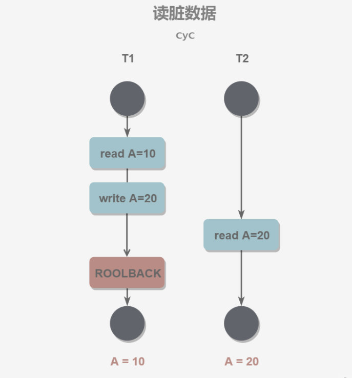


### 不可重复读

不可重复读指的是同一事务内多次读取同一数据集合，读取到的数据是不一样的情况。

例如：T2 读取一个数据，T1 对该数据做了修改。如果 T2 再次读取这个数据，此时读取的结果和第一次读取的结果不同。

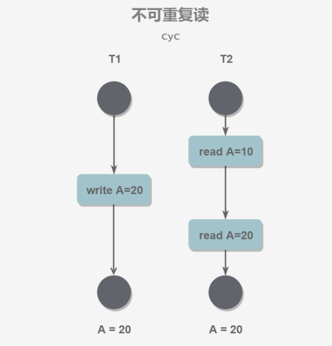

在 InnoDB 存储引擎中：

- `SELECT`：操作的不可重复读问题通过 MVCC 得到了解决的
- `UPDATE/DELETE`：操作的不可重复读问题是通过 Record Lock 解决的
- `INSERT`：操作的不可重复读问题是通过 Next-Key Lock（Record Lock + Gap Lock）解决的


### 幻读

幻读是指在同一事务下，连续执行两次同样的 sql 语句可能返回不同的结果，第二次的 sql 语句可能会返回之前不存在的行。幻影读是一种特殊的不可重复读问题。


### 丢失更新

一个事务的更新操作会被另一个事务的更新操作所覆盖。

例如：T1 和 T2 两个事务都对一个数据进行修改，T1 先修改，T2 随后修改，T2 的修改覆盖了 T1 的修改。

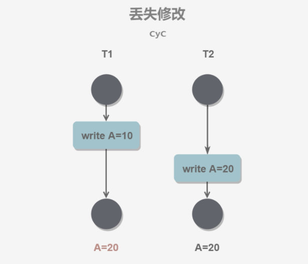

这类型问题可以通过给 SELECT 操作加上排他锁来解决，不过这可能会引入性能问题，具体使用要视业务场景而定。


# 数据库事务

**什么叫事务?**

事务是一系列对系统中数据进行访问与更新的操作组成的一个程序逻辑单元。即不可分割的许多基础数据库操作。

## 事务特性(ACID)

### 原子性（Atomicity）

**事务是最小的执行单位，不允许分割。原子性确保动作要么全部完成，要么完全不起作用。**

原子性是依赖于回滚日志（`undo log`）实现的。当事务对数据库进行修改时，`InnoDB`会生成对应的 `undo log`；如果事务执行失败或调用了 `rollback`，导致`事务需要回滚`，便可以利用 `undo log` 中的信息将数据回滚到修改之前的样子。`undo log`属于逻辑日志，它记录的是sql执行相关的信息。当发生回滚时，InnoDB 会根据 `undo log` 的内容做与之前相反的工作：

- 对于每个`insert`，回滚时会执行`delete`
- 对于每个 `delete`，回滚时会执行`insert`
- 对于每个 `update`，回滚时会执行一个相反的 `update`，把数据改回去

以`update`操作为例：当事务执行`update`时，其生成的`undo log`中会包含被修改行的主键、修改了哪些列、这些列在修改前后的值等信息，回滚时便可以使用这些信息将数据还原到`update`之前的状态。 


### 一致性（Consistency）

**事务开始前和结束后，数据库的完整性约束没有被破坏**。比如A向B转账，不可能A扣了钱，B却没收到。

一致性是事务追求的最终目标，原子性、持久性和隔离性其实都是为了保证数据库状态的一致性。当然，都是数据库层面的保障，一致性的实现也需要应用层面进行保障。也就是你的业务，比如购买操作只扣除用户的余额，不减库存，肯定无法保证状态的一致。


### 隔离性（Isolation）

**并发访问数据库时，一个事务不被其他事务所干扰。**

隔离性是通过 `锁` 和 `MVCC`（多版本并发控制） 实现。InnoDB采用的MVCC实现方式是：在需要时，通过undo日志构造出历史版本。


### 持久性（Durability）

**一个事务被提交之后。对数据库中数据的改变是持久的，即使数据库发生故障。**

`InnnoDB`有很多 log，持久性靠的是`redo log`。持久性肯定和写有关，`MySQL` 里经常说到的 `WAL`技术，`WAL`的全称是`Write-Ahead Logging`，它的关键点就是先写日志，再写磁盘。


**redo log**

当有一条记录要更新时，`InnoDB`引擎就会先把记录写到`redo log`（并更新内存），这个时候更新就算完成了。在适当的时候，将这个操作记录更新到磁盘里面，而这个更新往往是在系统比较空闲的时候做。`redo log`有两个特点

- 大小固定，循环写
- `crash-safe`

对于`redo log`是有两阶段的：`commit` 和 `prepare`如果不使用“两阶段提交”，数据库的状态就有可能和用它的日志恢复出来的库的状态不一致。


**Buffer Pool**

InnoDB还提供了缓存，`Buffer Pool`中包含了磁盘中部分数据页的映射，作为访问数据库的缓冲：

- 当读取数据时，会先从`Buffer Pool`中读取，如果`Buffer Pool`中没有，则从磁盘读取后放入Buffer Pool
- 当向数据库写入数据时，会首先写入`Buffer Pool`，`Buffer Pool`中修改的数据会定期刷新到磁盘中

Buffer Pool 的使用大大提高了读写数据的效率，但是也带了新的问题：如果`MySQL`宕机，而此时 `Buffer Pool`中修改的数据还没有刷新到磁盘，就会导致数据的丢失，事务的持久性无法保证。

**所以加入了 redo log。** 当数据修改时，除了修改`Buffer Pool`中的数据，还会在`redo log`记录这次操作。当事务提交时，会调用`fsync`接口对`redo log`进行刷盘。如果`MySQL`宕机，重启时可以读取`redo log`中的数据，对数据库进行恢复。

`redo log`采用的是WAL（`Write-ahead logging`，预写式日志），所有修改先写入日志，再更新到`Buffer Pool`，保证了数据不会因MySQL宕机而丢失，从而满足了持久性要求。而且这样做还有两个优点：

- 刷脏页是随机`IO`，`redo log` 顺序`IO`
- 刷脏页以Page为单位，一个Page上的修改整页都要写；而redo log 只包含真正需要写入的，无效 IO 减少


## 隔离级别

数据库事务隔离级别有4种，由低到高为：**Read uncommitted** 、**Read committed** 、**Repeatable read** 、**Serializable** 。


**事务并发问题**

在事务的并发操作中，不做隔离操作则可能会出现 **脏读、不可重复读、幻读** 问题：

- **脏读**：**事务A中读到了事务B中未提交的更新数据内容**。然后B回滚操作，那么A读取到的数据是脏数据
- **不可重复读**：**事务A读到事务B已经提交后的数据**。即事务A多次读取同一数据时，返回结果不一致
- **幻读**：事物A执行select后，事物B**增或删**了一条数据，事务A再执行同一条SQL后发现多或少了一条数据

**小结**：不可重复读的和幻读很容易混淆，**不可重复读**侧重于**修改**，**幻读**侧重于**新增或删除**。解决不可重复读的问题只需锁住满足条件的行，解决幻读需要锁表。


**默认隔离级别**

- Oracle仅有Serializable(串行化)和Read Committed(读已提交)两种隔离方式，默认选择**读已提交**的方式
- MySQL默认为**Repeatable Read（可重读）**


**数据库中的锁**

- **共享锁（Share locks简记为S锁）**：也称**读锁**，事务A对对象T加s锁，其他事务也只能对T加S，多个事务可以同时读，但不能有写操作，直到A释放S锁。
- **排它锁（Exclusivelocks简记为X锁）**：也称**写锁**，事务A对对象T加X锁以后，其他事务不能对T加任何锁，只有事务A可以读写对象T直到A释放X锁。
- **更新锁（简记为U锁）**：用来预定要对此对象施加X锁，它允许其他事务读，但不允许再施加U锁或X锁；当被读取的对象将要被更新时，则升级为X锁，主要是用来防止死锁的。因为使用共享锁时，修改数据的操作分为两步，首先获得一个共享锁，读取数据，然后将共享锁升级为排它锁，然后再执行修改操作。这样如果同时有两个或多个事务同时对一个对象申请了共享锁，在修改数据的时候，这些事务都要将共享锁升级为排它锁。这些事务都不会释放共享锁而是一直等待对方释放，这样就造成了死锁。如果一个数据在修改前直接申请更新锁，在数据修改的时候再升级为排它锁，就可以避免死锁。


**InnoDB存储引擎下**的四种隔离级别发生问题的可能性如下：

| 隔离级别                   | 第一类丢失更新 | 第二类丢失更新 | 脏读     | 不可重复读 | 幻读     |
| -------------------------- | -------------- | -------------- | -------- | ---------- | -------- |
| Read Uncommitted(读未提交) | 不可能         | **可能**       | **可能** | **可能**   | **可能** |
| Read Committed(读已提交)   | 不可能         | **可能**       | 不可能   | **可能**   | **可能** |
| Repeatable Read(可重复读)  | 不可能         | 不可能         | 不可能   | 不可能     | **可能** |
| Serializable(串行化)       | 不可能         | 不可能         | 不可能   | 不可能     | 不可能   |

### Read Uncommitted(读未提交)

**即读取到了其它事务未提交的内容**。在该隔离级别，**所有事务都可以看到其他未提交事务的执行结果**。本隔离级别很少用于实际应用，因为它的性能也不比其他级别好多少。读取未提交的数据，也被称之为**脏读（Dirty Read）**。

**特点**：最低级别，任何情况都无法保证

**读未提交的数据库锁情况**

- 读取数据：**未加锁**
- 写入数据：**只对数据增加行级共享锁**


### Read Committed(读已提交)

**即读取到了其它事务已提交的内容**。一个事务只能看见已经提交事务所做的改变。这种隔离级别也支持所谓的**不可重复读（Nonrepeatable Read）**，因为同一事务的其他实例在该实例处理期间可能会有新的commit，所以同一select可能返回不同结果。

**特点**：避免脏读

**读已提交的数据库锁情况**

- 读取数据：**加行级共享锁（读到时才加锁），读完后立即释放**
- 写入数据：**在更新时的瞬间对其加行级排它锁，直到事务结束才释放**


**Read Committed隔离级别下的加锁分析**

隔离级别的实现与锁机制密不可分，所以需要引入锁的概念，首先我们看下InnoDB存储引擎提供的两种标准的行级锁：

- **共享锁(S Lock)**：又称为读锁，可以允许多个事务并发的读取同一资源，互不干扰。即如果一个事务T对数据A加上共享锁后，其他事务只能对A再加共享锁，不能再加排他锁，只能读数据，不能修改数据
- **排他锁(X Lock)**: 又称为写锁，如果事务T对数据A加上排他锁后，其他事务不能再对A加上任何类型的锁，获取排他锁的事务既能读数据，也能修改数据

**注意**： 共享锁和排他锁是不相容的。


### Repeatable Read(可重复读)

**它确保同一事务的多个实例在并发读取数据时，会看到同样的数据行**。但会导致**幻读 （Phantom Read）**问题。

**幻读** 是户读取某一范围的数据行时，另一个事务又在该范围内插入了新行，当该用户再读取该范围的数据行时，会发现有新的“幻影” 行。

**特点**：避免脏读、不可重复读。MySQL默认事务隔离级别

**可重复读的数据库锁情况**

- 读取数据：**开始读取的瞬间对其增加行级共享锁，直到事务结束才释放**
- 写入数据：**开始更新的瞬间对其增加行级排他锁，直到事务结束才释放**


### Serializable(可串行化)

**指一个事务在执行过程中完全看不到其他事务对数据库所做的更新**。当两个事务同时操作数据库中相同数据时，如果第一个事务已经在访问该数据，第二个事务只能停下来等待，必须等到第一个事务结束后才能恢复运行。因此这两个事务实际上是串行化方式运行。

**特点**：避免脏读、不可重复读、幻读

**可序列化的数据库锁情况**

- 读取数据：**先对其加表级共享锁 ，直到事务结束才释放**
- 写入数据：**先对其加表级排他锁 ，直到事务结束才释放**


## Spring事务

查看 `mysql` 事务隔离级别：`show variables like 'tx_iso%';`。

### 实现方式

在Spring中事务有两种实现方式：

- **编程式事务管理**： 编程式事务管理使用`TransactionTemplate`或直接使用底层的`PlatformTransactionManager`
- **声明式事务管理**： 建立在`AOP`之上的。其本质是对方法前后进行拦截，然后在目标方法开始之前创建或者加入一个事务，在执行完目标方法之后根据执行情况提交或者回滚事务。声明式事务管理不需要入侵代码，通过`@Transactional`就可以进行事务操作，更快捷而且简单


### 提交方式

**默认情况下，数据库处于自动提交模式**。每一条语句处于一个单独的事务中，在这条语句执行完毕时，如果执行成功则隐式的提交事务，如果执行失败则隐式的回滚事务。
对于正常的事务管理，是一组相关的操作处于一个事务之中，因此必须关闭数据库的自动提交模式。不过，这个我们不用担心，spring会将底层连接的自动提交特性设置为false。也就是在使用spring进行事物管理的时候，spring会将是否自动提交设置为false，等价于JDBC中的 `connection.setAutoCommit(false);`，在执行完之后在进行提交，`connection.commit();` 。


### 事务隔离级别

隔离级别是指若干个并发的事务之间的隔离程度。

```java
@Transactional(isolation = Isolation.READ_UNCOMMITTED)
public void addGoods(){
	......
}
```

枚举类Isolation中定义了五种隔离级别：

- `DEFAULT`：默认值。表示使用底层数据库的默认隔离级别。对大部分数据库而言，通常这值就是**READ_COMMITTED**
- `READ_UNCOMMITTED`：该隔离级别表示一个事务可以读取另一个事务修改但还没有提交的数据。该级别不能防止脏读，不可重复读和幻读，因此很少使用该隔离级别
- `READ_COMMITTED`：该隔离级别表示一个事务只能读取另一个事务已经提交的数据。该级别可以防止脏读，这也是大多数情况下的推荐值
- `REPEATABLE_READ`：该隔离级别表示一个事务在整个过程中可以多次重复执行某个查询，并且每次返回的记录都相同。该级别可以防止脏读和不可重复读
- `SERIALIZABLE`：所有的事务依次逐个执行，这样事务之间就完全不可能产生干扰，也就是说，该级别可以防止脏读、不可重复读以及幻读。但是这将严重影响程序的性能。通常情况下也不会用到该级别


### 事务传播行为

事务的传播性一般用在事务嵌套的场景，如一个事务方法里面调用了另外一个事务方法，那两个方法是各自作为独立的方法提交还是内层事务合并到外层事务一起提交，这就需要事务传播机制配置来确定怎么样执行。

```java
@Transactional(propagation=Propagation.REQUIRED)
public void addGoods(){
	......
}
```

枚举类Propagation中定义了七种事务传播机制如下：

- `REQUIRED`（required，要求，Spring默认）：**当前存在事务，则加入该事务；当前没有事务，则创建一个新的事务**
- `REQUIRES_NEW`（requires_new，要求新的）：**创建一个新事务，如果存在当前事务，则挂起该事务**
- `SUPPORTS`（supports，支持）：**如果当前存在事务，则加入当前事务；如果当前没有事务，就以非事务方法执行**
- `NOT_SUPPORTED`（not_supported，不支持）：**始终以非事务方式执行，如果当前存在事务，则挂起当前事务**
- `NEVER`（never，都不）：**不使用事务，如果当前事务存在，则抛出异常**
- `MANDATORY`（mandatory，强制）：**如果当前存在事务，则加入当前事务；如果当前事务不存在，则抛出异常**
- `NESTED`（nested，嵌套）**如果当前事务存在，则在嵌套事务中执行，否则REQUIRED的操作一样（开启一个事务）**

 

### 事务回滚规则

指示spring事务管理器回滚一个事务的推荐方法是在当前事务的上下文内抛出异常。spring事务管理器会捕捉任何未处理的异常，然后依据规则决定是否回滚抛出异常的事务。
默认配置下，spring只有在抛出的异常为运行时unchecked异常时才回滚该事务，也就是抛出的异常为RuntimeException的子类(Errors也会导致事务回滚)，而抛出checked异常则不会导致事务回滚。
可以明确的配置在抛出那些异常时回滚事务，包括checked异常。也可以明确定义那些异常抛出时不回滚事务。


### 事务常用配置

- **readOnly**

  该属性用于设置当前事务是否为只读事务，设置为true表示只读，false则表示可读写，默认值为false。例如：@Transactional(readOnly=true)

- **rollbackFor**

  该属性用于设置需要进行回滚的异常类数组，当方法中抛出指定异常数组中的异常时，则进行事务回滚。例如：指定单一异常类：@Transactional(rollbackFor=RuntimeException.class)指定多个异常类：@Transactional(rollbackFor={RuntimeException.class, Exception.class})

- **rollbackForClassName**

  该属性用于设置需要进行回滚的异常类名称数组，当方法中抛出指定异常名称数组中的异常时，则进行事务回滚。例如：指定单一异常类名称@Transactional(rollbackForClassName=”RuntimeException”)指定多个异常类名称：@Transactional(rollbackForClassName={“RuntimeException”,”Exception”})

- **noRollbackFor**

  该属性用于设置不需要进行回滚的异常类数组，当方法中抛出指定异常数组中的异常时，不进行事务回滚。例如：指定单一异常类：@Transactional(noRollbackFor=RuntimeException.class)指定多个异常类：@Transactional(noRollbackFor={RuntimeException.class, Exception.class})

- **noRollbackForClassName**

  该属性用于设置不需要进行回滚的异常类名称数组，当方法中抛出指定异常名称数组中的异常时，不进行事务回滚。例如：指定单一异常类名称：@Transactional(noRollbackForClassName=”RuntimeException”)指定多个异常类名称：@Transactional(noRollbackForClassName={“RuntimeException”,”Exception”})

- **propagation** 

  该属性用于设置事务的传播行为。例如：@Transactional(propagation=Propagation.NOT_SUPPORTED,readOnly=true)

- **isolation**

  该属性用于设置底层数据库的事务隔离级别，事务隔离级别用于处理多事务并发的情况，通常使用数据库的默认隔离级别即可，基本不需要进行设置

- **timeout**

  该属性用于设置事务的超时秒数，默认值为-1表示永不超时


### 事物注意事项

- 要根据实际的需求来决定是否要使用事物，最好是在编码之前就考虑好，不然到以后就难以维护
- 如果使用了事物，请务必进行事物测试，因为很多情况下以为事物是生效的，但是实际上可能未生效
- 事物@Transactional的使用要放再类的**公共(public)方法**中，需要注意的是在 protected、private 方法上使用 @Transactional 注解，它也不会报错(IDEA会有提示)，但事务无效
- 事物@Transactional是不会对该方法里面的子方法生效！也就是你在公共方法A声明的事物@Transactional，但是在A方法中有个子方法B和C，其中方法B进行了数据操作，但是该异常被B自己处理了，这样的话事物是不会生效的！反之B方法声明的事物@Transactional，但是公共方法A却未声明事物的话，也是不会生效的！如果想事物生效，需要将子方法的事务控制交给调用的方法，在子方法中使用`rollbackFor`注解指定需要回滚的异常或者将异常抛出交给调用的方法处理。一句话就是在使用事物的异常由调用者进行处理
- 事物@Transactional由spring控制的时候，它会在抛出异常的时候进行回滚。如果自己使用catch捕获了处理了，是不生效的，如果想生效可以进行手动回滚或者在catch里面将异常抛出，比如`throw new RuntimeException();`


### 失效场景

- **@Transactional 应用在非 public 修饰的方法上**
- **数据库引擎要不支持事务**
- **由于propagation 设置错误，导致注解失效**
- **rollbackFor 设置错误，@Transactional 注解失效**
- **方法之间的互相调用也会导致@Transactional失效**
- **异常被你的 catch“吃了”导致@Transactional失效**


### select for update

`for update`是一种`行级锁`，又叫`排它锁`。一旦用户对某个行施加了行级加锁，则该用户可以查询也可以更新被加锁的数据行，其它用户只能查询但不能更新被加锁的数据行。

- **修改sql**：在 `select` 的 `sql` 尾部添加 `for update`。如：`select * from job_info where id = 1 for update;`
- **启用事务**：为 `service` 添加注解 `@Transactional`


**只有当出现如下之一的条件，才会释放共享更新锁：**

1. 执行提交（COMMIT）语句
2. 退出数据库（LOG　OFF）
3. 程序停止运行


假设有个表单products ，里面有id 跟name 二个栏位，id 是主键。

```mysql
-- 例1: 明确指定主键，并且有此数据，row lock
SELECT * FROM products WHERE id='3' FOR UPDATE;
-- 例2: 明确指定主键，若查无此数据，无lock
SELECT * FROM products WHERE id='-1' FOR UPDATE;
-- 例2: 无主键，table lock
SELECT * FROM products WHERE name='Mouse' FOR UPDATE;
-- 例3: 主键不明确，table lock
SELECT * FROM products WHERE id<>'3' FOR UPDATE;
-- 例4: 主键不明确，table lock
SELECT * FROM products WHERE id LIKE '3' FOR UPDATE;
```

**注意**

- FOR UPDATE 仅适用于InnoDB，且必须在事务区块(start sta/COMMIT)中才能生效
- 要测试锁定的状况，可以利用MySQL 的Command Mode ，开二个视窗来做测试


# 索引机制

索引是为了加速对表中数据行的检索而创建的一种分散存储的（不连续的）数据结构，硬盘级的。

**索引意义**：索引能极大的减少存储引擎需要扫描的数据量，索引可以把随机IO变成顺序IO。索引可以帮助我们在进行分组、排序等操作时，避免使用临时表。正确的创建合适的索引是提升数据库查询性能的基础。


**优势**

- **大大减少服务器需要扫描的数据量**
- **可以提高数据检索的效率（将随机I/O变成顺序I/O），降低数据库的I/O成本**
- **通过索引列对数据进行排序，降低数据排序的成本，降低了CPU的消耗**


**劣势**

- **索引会占据磁盘空间**
- **索引虽然会提高查询效率，但是会降低更新表的效率**。比如每次对表进行增删改操作，MySQL不仅要保存数据，还有保存或者更新对应的索引文件


## 数据结构

索引的数据结构：

- Hash表
- 

### Hash索引

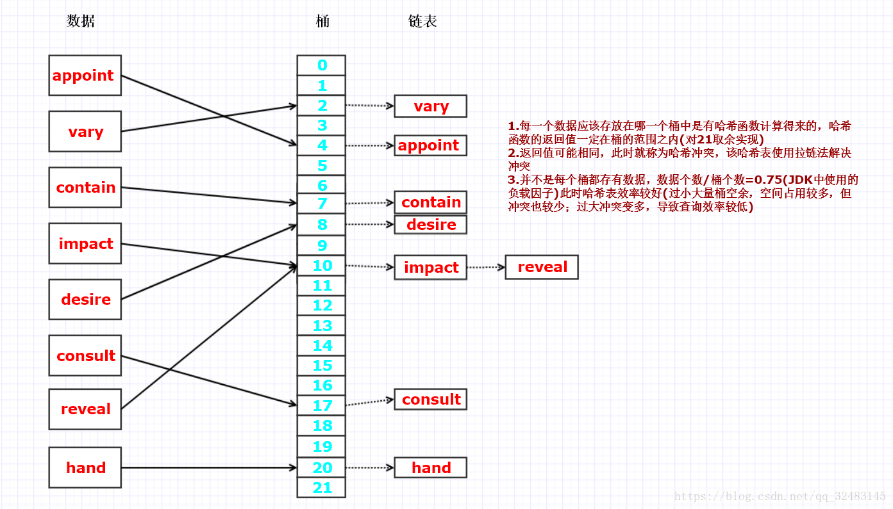

**原理**

- 事先将索引通过 hash算法后得到的hash值(即磁盘文件指针）存到hash表中
- 在进行查询时，将索引通过hash算法，得到hash值，与hash表中的hash值比对。通过磁盘文件指针，只要**一次磁盘IO**就能找到要的值

例如：在第一个表中，要查找col=6的值。hash(6) 得到值，比对hash表，就能得到89。性能非常高。


**优点**

- 快速查询：参与索引的字段只要进行Hash运算之后就可以快速定位到该记录，时间复杂度约为1

**缺点**

- 哈希索引只包含哈希值和行指针，所以不能用索引中的值来避免读取行
- 哈希索引数据并不是按照索引值顺序存储的，所以也就无法用于排序和范围查询
- 哈希索引也不支持部分索引列查询，因为哈希索引始终是使用索引列的全部数据进行哈希计算的
- 哈希索引只支持等值比较查询，如=，IN()，<=>操作
- 如果哈希冲突较多，一些索引的维护操作的代价也会更高


### R-Tree索引

空间数据索引。


### B-Tree索引

**背景**：二叉查找树查询的时间复杂度是O(logN)，查找速度最快和比较次数较少。但用于数据库索引，当数据量过大，不可能将所有索引加载进内存，使用二叉树会导致磁盘IO过于频繁，最坏的情况下磁盘IO的次数由树的高度来决定。

B-Tree(平衡多路查找树)对二叉树进行了横向扩展，能很好解决红黑树中遗留的高度问题，使树结构更加**矮胖**，使得一次IO能加载更多关键字，对比在内存中完成，减少了磁盘IO次数，更适用于大型数据库，但是为了保持自平衡，插入或者删除元素都会导致节点发生裂变反应，有时候会非常麻烦。

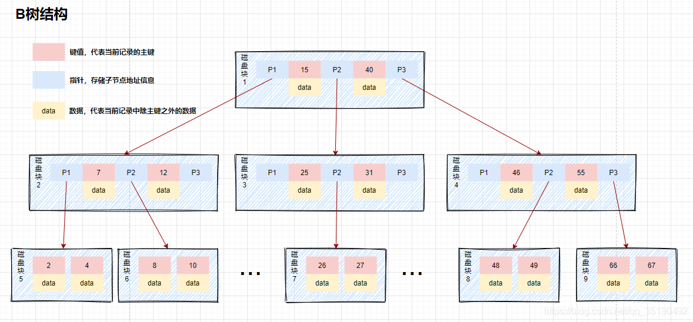


**案例分析**：模拟下查找key为10的data的过程

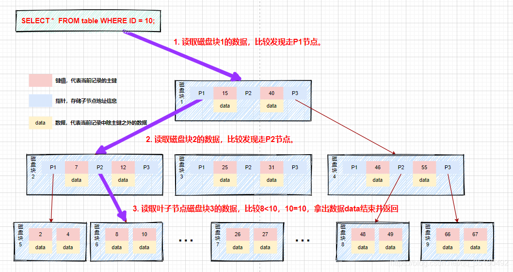

- 根据根结点指针读取文件目录的根磁盘块1。【磁盘IO操作第**1次**】
- 磁盘块1存储15，45和三个指针数据。我们发现10<15，因此我们找到指针p1
- 根据p1指针，我们定位并读取磁盘块2。【磁盘IO操作**2次**】
- 磁盘块2存储7，12和三个指针数据。我们发现7<10<12，因此我们找到指针p2
- 根据p2指针，我们定位并读取磁盘块6。【磁盘IO操作**3次**】
- 磁盘块6中存储8，10。我们找到10，获取10所对应的数据data


**存在问题**

- **不支持范围查询的快速查找**。可以用B+Tree解决

- **每行数据量很大时，会导致B-Tree深度较大，进而影响查询效率**。可以用B+Tree解决


### B+Tree索引

B+树是B-树的变体，也是一种多路搜索树。其定义基本与B-树相同，除了：

- 非叶子结点的子树指针与关键字个数相同
- 非叶子结点的子树指针P[i]，指向关键字值属于[K[i], K[i+1])的子树（B-树是开区间）
- 为所有叶子结点增加一个链指针
- 所有关键字都在叶子结点出现

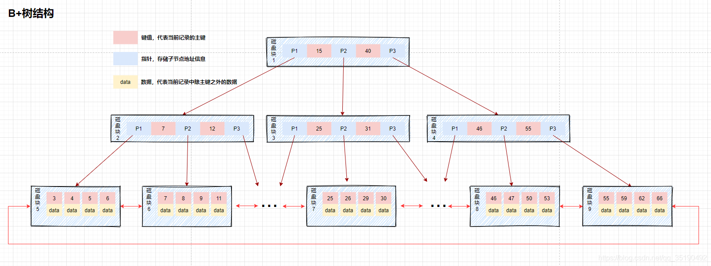


**案例分析：等值查询**

假如我们查询值等于9的数据。查询路径磁盘块1->磁盘块2->磁盘块6。

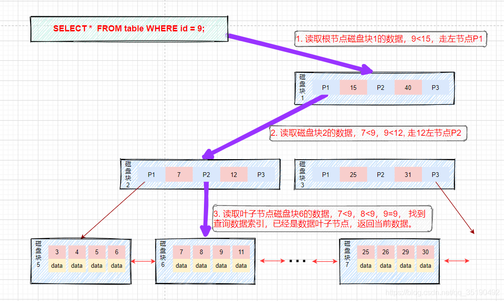

- 第一次磁盘IO：将磁盘块1加载到内存中，在内存中从头遍历比较，9<15，走左路，到磁盘寻址磁盘块2
- 第二次磁盘IO：将磁盘块2加载到内存中，在内存中从头遍历比较，7<9<12，到磁盘中寻址定位到磁盘块6
- 第三次磁盘IO：将磁盘块6加载到内存中，在内存中从头遍历比较，在第三个索引中找到9，取出data，如果data存储的行记录，取出data，查询结束。如果存储的是磁盘地址，还需要根据磁盘地址到磁盘中取出数据，查询终止。（这里需要区分的是在InnoDB中Data存储的为行数据，而MyIsam中存储的是磁盘地址。）


**案例分析：范围查询**
假如我们想要查找9和26之间的数据。查找路径是磁盘块1->磁盘块2->磁盘块6->磁盘块7。

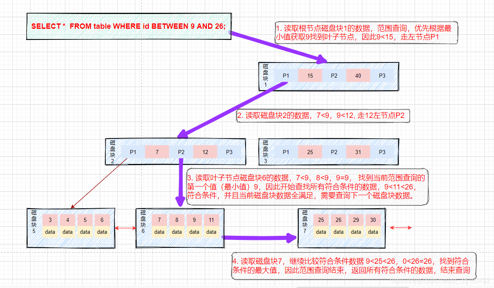

- 首先查找值等于9的数据，将值等于9的数据缓存到结果集。这一步和前面等值查询流程一样，发生了三次磁盘IO
- 查找到15之后，底层的叶子节点是一个有序列表，我们从磁盘块6，键值9开始向后遍历筛选所有符合筛选条件的数据
- 第四次磁盘IO：根据磁盘6后继指针到磁盘中寻址定位到磁盘块7，将磁盘7加载到内存中，在内存中从头遍历比较，9<25<26，9<26<=26，将data缓存到结果集。
- 主键具备唯一性（后面不会有<=26的数据），不需再向后查找，查询终止。将结果集返回给用户


**优点**

- 单次请求涉及的磁盘IO次数少（出度d大，且非叶子节点不包含表数据，树的高度小）
- 查询效率稳定（任何关键字的查询必须走从根结点到叶子结点，查询路径长度相同）
- 遍历效率高（从符合条件的某个叶子节点开始遍历即可）

**缺点**

B+树最大的性能问题在于会产生大量的随机IO，主要存在以下两种情况：

- 主键不是有序递增的，导致每次插入数据产生大量的数据迁移和空间碎片
- 即使主键是有序递增的，大量写请求的分布仍是随机的


### B*Tree

是B+树的变体，在B+树的非根和非叶子结点再增加指向兄弟的指针；

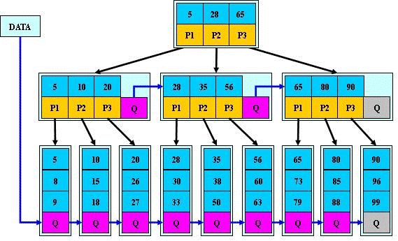

B*树定义了非叶子结点关键字个数至少为(2/3)M，即块的最低使用率为2/3（代替B+树的1/2）。

**B+树的分裂**

当一个结点满时，分配一个新的结点，并将原结点中1/2的数据复制到新结点，最后在父结点中增加新结点的指针；B+树的分裂只影响原结点和父结点，而不会影响兄弟结点，所以它不需要指向兄弟的指针。

**B*树的分裂**

当一个结点满时，如果它的下一个兄弟结点未满，那么将一部分数据移到兄弟结点中，再在原结点插入关键字，最后修改父结点中兄弟结点的关键字（因为兄弟结点的关键字范围改变了）；如果兄弟也满了，则在原结点与兄弟结点之间增加新结点，并各复制1/3的数据到新结点，最后在父结点增加新结点的指针；所以，B*树分配新结点的概率比B+树要低，空间使用率更高。


## 索引类型

### 普通索引

**单列索引是最基本的索引，它没有任何限制，允许在定义索引的列中插入重复值和空值。**

```sql
-- 直接创建索引
CREATE INDEX index_name ON table_name(col_name);
-- 修改表结构的方式添加索引
ALTER TABLE table_name ADD INDEX index_name(col_name);

-- 创建表的时候同时创建索引
CREATE TABLE `news` (
    `id` int(11) NOT NULL AUTO_INCREMENT ,
    `title` varchar(255)  NOT NULL ,
    `content` varchar(255)  NULL ,
    `time` varchar(20) NULL DEFAULT NULL ,
    PRIMARY KEY (`id`),
    INDEX index_name (title(255))
)

-- 删除索引
DROP INDEX index_name ON table_name;
--  或
alter table `表名` drop index 索引名;
```


### 唯一索引

**索引列中的值必须是唯一的，但是允许为空值（只允许存在一条空值）。**

```mysql
-- 创建单个索引
CREATE UNIQUE INDEX index_name ON table_name(col_name);
-- 创建多个索引
CREATE UNIQUE INDEX index_name on table_name(col_name,...);

-- 修改表结构
-- 单个
ALTER TABLE table_name ADD UNIQUE index index_name(col_name);
-- 多个
ALTER TABLE table_name ADD UNIQUE index index_name(col_name,...);
```


### 主键索引

**索引列中的值必须是唯一的，不允许有空值。**

```sql
-- 主键索引(创建表时添加)
CREATE TABLE `news` (
    `id` int(11) NOT NULL AUTO_INCREMENT ,
    `title` varchar(255)  NOT NULL ,
    `content` varchar(255)  NULL ,
    `time` varchar(20) NULL DEFAULT NULL ,
    PRIMARY KEY (`id`)
)

-- 主键索引(创建表后添加)
CREATE TABLE `order` (
    `orderId` varchar(36) NOT NULL,
    `productId` varchar(36)  NOT NULL ,
    `time` varchar(20) NULL DEFAULT NULL
)
alter table `order` add primary key(`orderId`);
```


### 组合索引

**在多个字段上创建的索引**。组合索引遵守“**最左前缀**”原则，即在查询条件中使用了复合索引的第一个字段，索引才会被使用。因此，在复合索引中索引列的顺序至关重要。

```sql
-- 创建一个复合索引
create index index_name on table_name(col_name1,col_name2,...);

-- 修改表结构的方式添加索引
alter table table_name add index index_name(col_name,col_name2,...);
```


### 全文索引

**只能在文本类型 `CHAR`、`VARCHAR`、`TEXT` 类型字段上创建全文索引**。字段长度比较大时，如果创建普通索引，在进行like模糊查询时效率比较低，这时可以创建全文索引。 MyISAM和InnoDB中都可以使用全文索引。

```mysql
-- 创建表的适合添加全文索引
CREATE TABLE `news` (
    `id` int(11) NOT NULL AUTO_INCREMENT ,
    `title` varchar(255)  NOT NULL ,
    `content` text  NOT NULL ,
    `time` varchar(20) NULL DEFAULT NULL ,
     PRIMARY KEY (`id`),
    FULLTEXT (content)
)

-- 修改表结构添加全文索引
ALTER TABLE table_name ADD FULLTEXT index_fulltext_content(col_name);
```


## 索引实现

### MyIsam索引

MyISAM的数据文件和索引文件是分开存储的。MyISAM使用B+树构建索引树时，叶子节点中存储的键值为索引列的值，数据为索引所在行的磁盘地址。

#### 主键索引

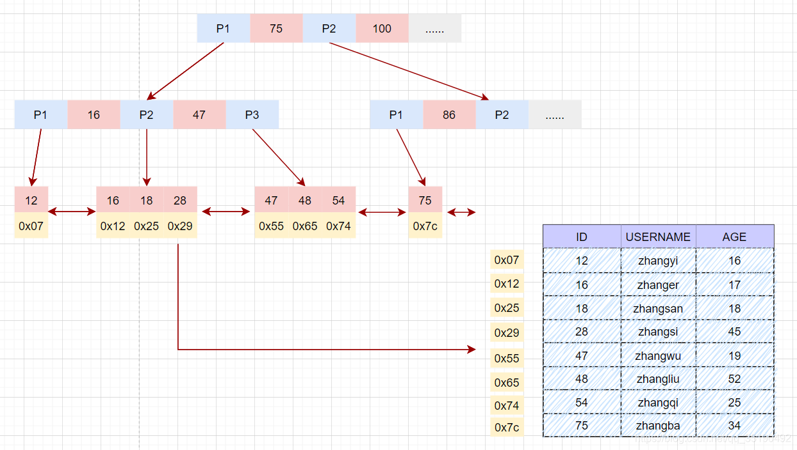

表user的索引存储在索引文件`user.MYI`中，数据文件存储在数据文件 `user.MYD`中。简单分析下查询时的磁盘IO情况：


**场景一：根据主键等值查询数据**
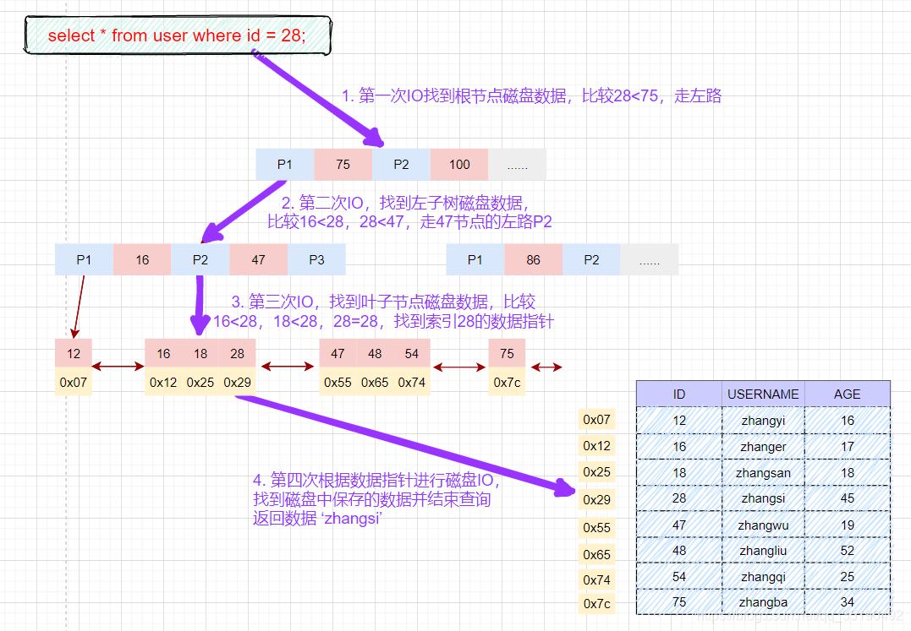

- 先在主键树中从根节点开始检索，将根节点加载到内存，比较28<75，走左路。（1次磁盘IO）
- 将左子树节点加载到内存中，比较16<28<47，向下检索。（1次磁盘IO）
- 检索到叶节点，将节点加载到内存中遍历，比较16<28，18<28，28=28。查找到值等于30的索引项。（1次磁盘IO）
- 从索引项中获取磁盘地址，然后到数据文件user.MYD中获取对应整行记录。（1次磁盘IO）
- 将记录返给客户端。

**磁盘IO次数：3次索引检索+记录数据检索。**


**场景二：根据主键范围查询数据**

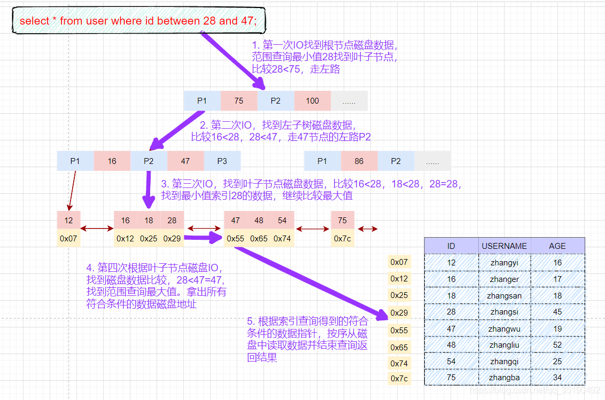

- 先在主键树中从根节点开始检索，将根节点加载到内存，比较28<75，走左路。（1次磁盘IO）
- 将左子树节点加载到内存中，比较16<28<47，向下检索。（1次磁盘IO）
- 检索到叶节点，将节点加载到内存中遍历比较16<28，18<28，28=28<47。查找到值等于28的索引项。
  - 根据磁盘地址从数据文件中获取行记录缓存到结果集中。（1次磁盘IO）
  - 我们的查询语句时范围查找，需要向后遍历底层叶子链表，直至到达最后一个不满足筛选条件。

- 向后遍历底层叶子链表，将下一个节点加载到内存中，遍历比较，28<47=47，根据磁盘地址从数据文件中获取行记录缓存到结果集中。（1次磁盘IO）
- 最后得到两条符合筛选条件，将查询结果集返给客户端。

**磁盘IO次数：4次索引检索+记录数据检索。**

**备注：**以上分析仅供参考，MyISAM在查询时，会将索引节点缓存在MySQL缓存中，而数据缓存依赖于操作系统自身的缓存，所以并不是每次都是走的磁盘，这里只是为了分析索引的使用过程。


#### 辅助索引

在 MyISAM 中，辅助索引和主键索引的结构是一样的，没有任何区别，叶子节点的数据存储的都是行记录的磁盘地址。只是主键索引的键值是唯一的，而辅助索引的键值可以重复。查询数据时，由于辅助索引的键值不唯一，可能存在多个拥有相同的记录，所以即使是等值查询，也需要按照范围查询的方式在辅助索引树中检索数据。


### InnoDB索引

#### 主键索引

每个InnoDB表都有一个主键索引(聚簇索引) ，聚簇索引使用B+树构建，叶子节点存储的数据是整行记录。一般情况下，聚簇索引等同于主键索引，当一个表没有创建主键索引时，InnoDB会自动创建一个ROWID字段来构建聚簇索引。InnoDB创建索引的具体规则如下：

- 在表上定义主键PRIMARY KEY，InnoDB将主键索引用作聚簇索引
- 如果表没有定义主键，InnoDB会选择第一个不为NULL的唯一索引列用作聚簇索引
- 如果以上两个都没有，InnoDB 会使用一个6 字节长整型的隐式字段 ROWID字段构建聚簇索引。该ROWID字段会在插入新行时自动递增

除聚簇索引之外的所有索引都称为辅助索引。在中InnoDB，辅助索引中的叶子节点存储的数据是该行的主键值都。 在检索时，InnoDB使用此主键值在聚簇索引中搜索行记录。
主键索引的叶子节点会存储数据行，辅助索引只会存储主键值。

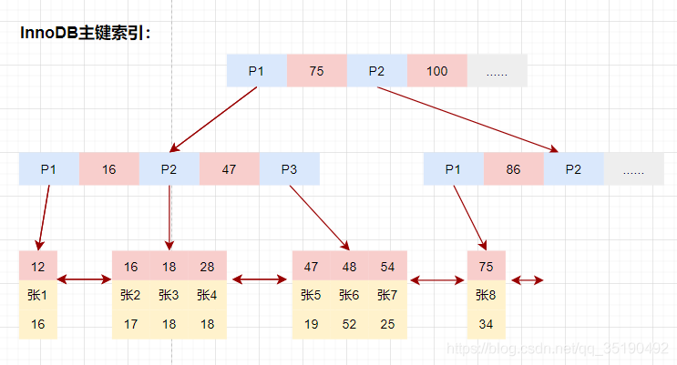


**场景一：等值查询数据**

- 先在主键树中从根节点开始检索，将根节点加载到内存，比较28<75，走左路。（1次磁盘IO）
- 将左子树节点加载到内存中，比较16<28<47，向下检索。（1次磁盘IO）
- 检索到叶节点，将节点加载到内存中遍历，比较16<28，18<28，28=28。查找到值等于28的索引项，直接可以获取整行数据。将改记录返回给客户端。（1次磁盘IO）

**磁盘IO数量：3次。**

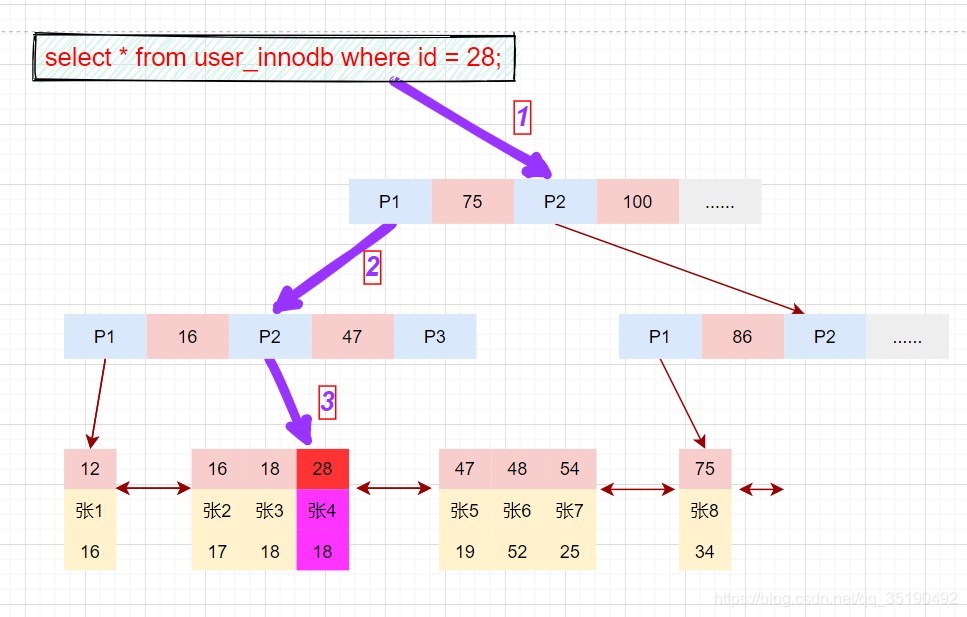


#### 辅助索引

除聚簇索引之外的所有索引都称为辅助索引，InnoDB的辅助索引只会存储主键值而非磁盘地址。以表user_innodb的age列为例，age索引的索引结果如下图：

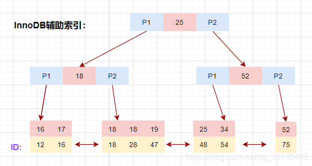

底层叶子节点的按照（age，id）的顺序排序，先按照age列从小到大排序，age列相同时按照id列从小到大排序。使用辅助索引需要检索两遍索引：首先检索辅助索引获得主键，然后使用主键到主索引中检索获得记录。


**场景一：等值查询的情况**

```sql
select * from t_user_innodb where age=19;
```

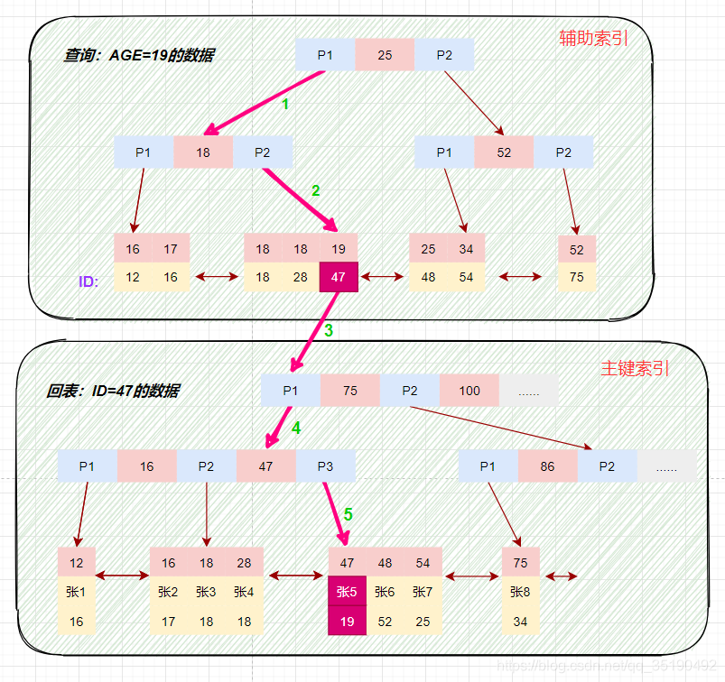

根据在辅助索引树中获取的主键id，到主键索引树检索数据的过程称为**回表**查询。

**磁盘IO数：辅助索引3次+获取记录回表3次**


#### 组合索引

还是以自己创建的一个表为例：表 abc_innodb，id为主键索引，创建了一个联合索引idx_abc(a,b,c)。

```sql
CREATE TABLE `abc_innodb`
(
  `id` int(11) NOT NULL AUTO_INCREMENT,
  `a`  int(11)     DEFAULT NULL,
  `b`  int(11)     DEFAULT NULL,
  `c`  varchar(10) DEFAULT NULL,
  `d`  varchar(10) DEFAULT NULL,
  PRIMARY KEY (`id`) USING BTREE,
  KEY `idx_abc` (`a`, `b`, `c`)
) ENGINE = InnoDB;
```

组合索引的数据结构：

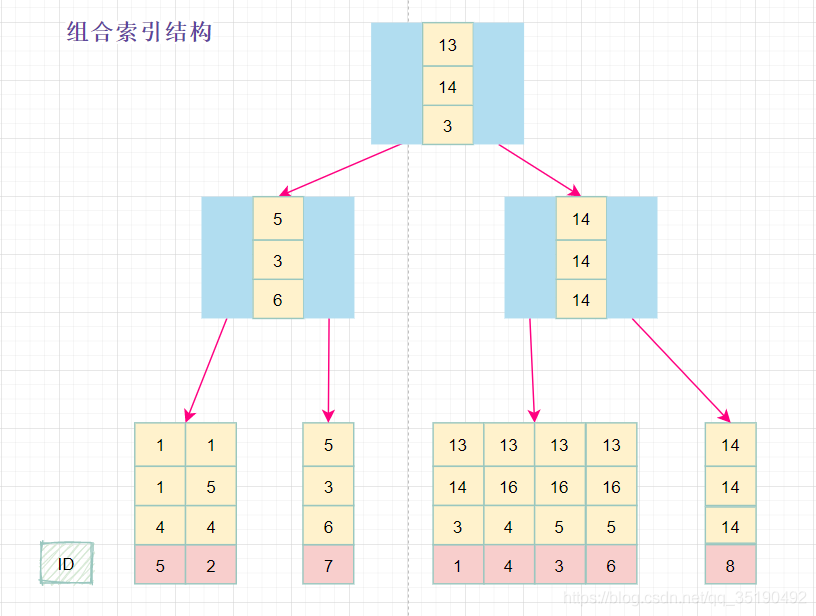

**组合索引的查询过程：**

```sql
select * from abc_innodb where a = 13 and b = 16 and c = 4;
```

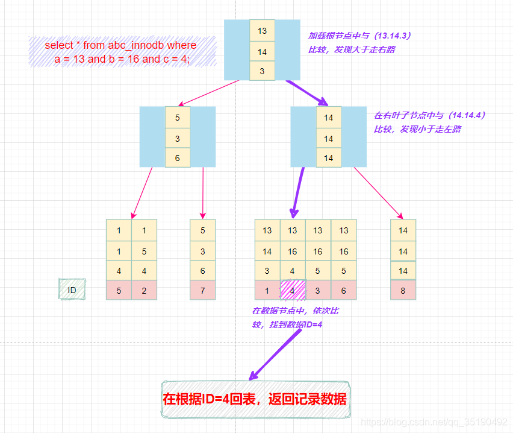

**最左匹配原则**

最左前缀匹配原则和联合索引的索引存储结构和检索方式是有关系的。

在组合索引树中，最底层的叶子节点按照第一列a列从左到右递增排列，但是b列和c列是无序的，b列只有在a列值相等的情况下小范围内递增有序，而c列只能在a，b两列相等的情况下小范围内递增有序。

就像上面的查询，B+树会先比较a列来确定下一步应该搜索的方向，往左还是往右。如果a列相同再比较b列。但是如果查询条件没有a列，B+树就不知道第一步应该从哪个节点查起。

可以说创建的idx_abc(a,b,c)索引，相当于创建了(a)、（a,b）（a,b,c）三个索引。、

组合索引的最左前缀匹配原则：使用组合索引查询时，mysql会一直向右匹配直至遇到范围查询(>、<、between、like)就停止匹配。


#### 覆盖索引

覆盖索引并不是说是索引结构，覆盖索引是一种很常用的优化手段。因为在使用辅助索引的时候，我们只可以拿到主键值，相当于获取数据还需要再根据主键查询主键索引再获取到数据。但是试想下这么一种情况，在上面abc_innodb表中的组合索引查询时，如果我只需要abc字段的，那是不是意味着我们查询到组合索引的叶子节点就可以直接返回了，而不需要回表。这种情况就是覆盖索引。可以看一下执行计划：

**覆盖索引的情况：**

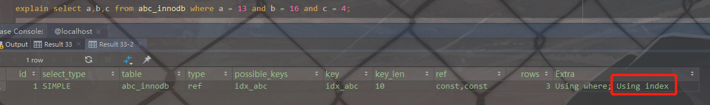**未使用到覆盖索引：**

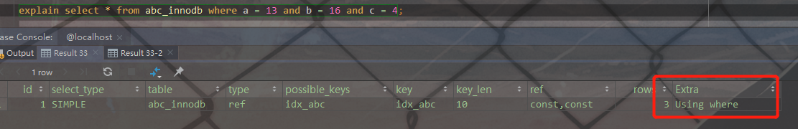


## 失效场景

**场景一：where语句中包含or时，可能会导致索引失效**

使用or并不是一定会使索引失效，你需要看or左右两边的查询列是否命中相同的索引。

```sql
-- 假设user表中的user_id列有索引，age列没有索引
-- 能命中索引
select * from user where user_id = 1 or user_id = 2;
-- 无法命中索引
select * from user where user_id = 1 or age = 20;
-- 假设age列也有索引的话，依然是无法命中索引的
select * from user where user_id = 1 or age = 20;
```

可以根据情况尽量使用union all或者in来代替，这两个语句的执行效率也比or好些。


**场景二：where语句中索引列使用了负向查询，可能会导致索引失效**

负向查询包括：NOT、!=、<>、!<、!>、NOT IN、NOT LIKE等。其实负向查询并不绝对会索引失效，这要看MySQL优化器的判断，全表扫描或者走索引哪个成本低了。


**场景三：索引字段可以为null，使用is null或is not null时，可能会导致索引失效**

其实单个索引字段，使用is null或is not null时，是可以命中索引的。


**场景四：在索引列上使用内置函数，一定会导致索引失效**

比如下面语句中索引列login_time上使用了函数，会索引失效：

```sql
select * from user where DATE_ADD(login_time, INTERVAL 1 DAY) = 7;
```


**场景五：隐式类型转换导致的索引失效**

如下面语句中索引列user_id为varchar类型，不会命中索引：

```mysql
select * from user where user_id = 12;
```


**场景六：对索引列进行运算，一定会导致索引失效**

运算如+，-，\*，/等，如下：

```mysql
select * from user where age - 1 = 10;
```

优化的话，要把运算放在值上，或者在应用程序中直接算好，比如：

```sql
select * from user where age = 10 - 1;
```


**场景七：like通配符可能会导致索引失效**

like查询以%开头时，会导致索引失效。解决办法有两种：

- 将%移到后面，如：

```sql
select * from user where `name` like '李%';
```

- 利用覆盖索引来命中索引：

```sql
select name from user where `name` like '%李%';
```


**场景八：联合索引中，where中索引列违背最左匹配原则，一定会导致索引失效**

当创建一个联合索引的时候，如(k1,k2,k3)，相当于创建了(k1)、(k1,k2)和(k1,k2,k3)三个索引，这就是最左匹配原则。比如下面的语句就不会命中索引：

```sql
select * from t where k2=2;
select * from t where k3=3;
select * from t where k2=2 and k3=3;
```

下面的语句只会命中索引(k1)：

```sql
select * from t where k1=1 and k3=3;
```


# MySQL日志

**生产优化**

- 在生产上，建议 innodb_flush_log_at_trx_commit 设置成 1，可以让每次事务的 redo log 都持久化到磁盘上。保证异常重启后，redo log 不丢失
- 建议 sync_binlog 设置成 1，可以让每次事务的 binlog 都持久化到磁盘上。保证异常重启后，binlog 不丢失


**IO性能优化**

- `binlog_group_commit_sync_delay`：表示延迟多少微秒后，再执行 `fsync`
- `binlog_group_commit_sync_no_delay_count`：表示累计多少次后，在调用 `fsync`


当 `MySQL` 出现了 `IO` 的性能问题，可以考虑下面的优化策略：

- 设置 `binlog_group_commit_sync_delay` 和 `binlog_group_commit_sync_no_delay_count`。可以使用故意等待来减少，`binlog` 的写盘次数，没有数据丢失的风险，但是会有客户端响应变慢的风险
- 设置 `sync_binlog` 设置为 `100~1000` 之间的某个值。这样做存在的风险是可能造成 `binlog` 丢失
- 设置 `innodb_flush_log_at_trx_commit = 2`，可能会丢数据


## 重做日志（redo log）

重做日志（redo log）是InnoDB引擎层的日志，用来记录事务操作引起数据的变化，记录的是数据页的物理修改。

在MySQL里，如果我们要执行一条更新语句。执行完成之后，数据不会立马写入磁盘，因为这样对磁盘IO的开销比较大。MySQL里面有一种叫做WAL（Write-Ahead Logging），就是先写日志再写磁盘。就是当有一条记录需要更新的时候，InnoDB 会先写redo log 里面，并更新内存，这个时候更新的操作就算完成了。之后，MySQL会在合适的时候将操作记录 flush 到磁盘上面。当然 flush 的条件可能是系统比较空闲，或者是 redo log 空间不足时。redo log 文件的大小是固定的，比如可以是由4个1GB文件组成的集合。

### 作用

确保事务的持久性。防止在发生故障的时间点，尚有脏页未写入磁盘，在重启mysql服务的时候，根据redo log进行重做，从而达到事务的持久性这一特性。


### 写入流程

为了控制 redo log 的写入策略，innodb_flush_log_at_trx_commit 会有下面 3 中取值：

- **0：每次提交事务只写在 redo log buffer 中**
- **1：每次提交事务持久化到磁盘**
- **2：每次提交事务写到 文件系统的 page cache 中**


### 刷盘场景

redo log 实际的触发 fsync 操作写盘包含以下几个场景：

- **后台每隔 1 秒钟的线程轮询**
- **innodb_flush_log_at_trx_commit 设置成 1 时，事务提交时触发**
- **innodb_log_buffer_size 是设置 redo log 大小的参数**。当 redo log buffer 达到 innodb_log_buffer_size / 2 时，也会触发一次 fsync


## 二进制日志（bin log）

`binlog` 用于记录数据库执行的写入性操作(不包括查询)信息，以二进制的形式保存在磁盘中。`binlog` 是 `mysql`的逻辑日志，并且由 `Server` 层进行记录，使用任何存储引擎的 `mysql` 数据库都会记录 `binlog` 日志。

- **逻辑日志**：可以简单理解为记录的就是sql语句 。
- **物理日志**：`mysql` 数据最终是保存在数据页中的，物理日志记录的就是数据页变更 。

`binlog` 是通过追加的方式进行写入的，可以通过`max_binlog_size` 参数设置每个 `binlog`文件的大小，当文件大小达到给定值之后，会生成新的文件来保存日志。

### 作用

- 用于复制，在主从复制中，从库利用主库上的binlog进行重播，实现主从同步
- 用于数据库的基于时间点的还原


### 使用场景

在实际应用中， `binlog` 的主要使用场景有两个，分别是 **主从复制** 和 **数据恢复** 。

- **主从复制** ：在 `Master` 端开启 `binlog` ，然后将 `binlog`发送到各个 `Slave` 端， `Slave` 端重放 `binlog` 从而达到主从数据一致
- **数据恢复** ：通过使用 `mysqlbinlog` 工具来恢复数据


### 刷盘时机

对于 `InnoDB` 存储引擎而言，只有在事务提交时才会记录`biglog` ，此时记录还在内存中，那么 `biglog`是什么时候刷到磁盘中的呢？`mysql` 通过 `sync_binlog` 参数控制 `biglog` 的刷盘时机，取值范围是 `0-N`：

- `sync_binlog=0`：不去强制要求，由系统自行判断何时写入磁盘；
- `sync_binlog=1`：每次 `commit` 的时候都要将 `binlog` 写入磁盘；
- `sync_binlog=N(N>1)`：每N个事务，才会将 `binlog` 写入磁盘。

从上面可以看出， `sync_binlog` 最安全的是设置是 `1` ，这也是`MySQL 5.7.7`之后版本的默认值。但是设置一个大一些的值可以提升数据库性能，因此实际情况下也可以将值适当调大，牺牲一定的一致性来获取更好的性能。


### 日志格式

`binlog` 日志有三种格式，分别为 `STATMENT` 、 `ROW` 和 `MIXED`。

在 `MySQL 5.7.7` 之前，默认的格式是 `STATEMENT` ， `MySQL 5.7.7` 之后，默认值是 `ROW`。日志格式通过 `binlog-format` 指定。

- `STATMENT`：基于`SQL` 语句的复制( `statement-based replication, SBR` )，每一条会修改数据的sql语句会记录到`binlog` 中  。

- - 优点：不需要记录每一行的变化，减少了 binlog 日志量，节约了 IO  , 从而提高了性能；
  - 缺点：在某些情况下会导致主从数据不一致，比如执行sysdate() 、  slepp()  等 。

- `ROW`：基于行的复制(`row-based replication, RBR` )，不记录每条sql语句的上下文信息，仅需记录哪条数据被修改了 。

- - 优点：不会出现某些特定情况下的存储过程、或function、或trigger的调用和触发无法被正确复制的问题 ；
  - 缺点：会产生大量的日志，尤其是` alter table ` 的时候会让日志暴涨

- `MIXED`：基于`STATMENT` 和 `ROW` 两种模式的混合复制(`mixed-based replication, MBR` )，一般的复制使用`STATEMENT` 模式保存 `binlog` ，对于 `STATEMENT` 模式无法复制的操作使用 `ROW` 模式保存 `binlog`


## 回滚日志（undo log）

### 作用

保证数据的原子性，保存了事务发生之前的数据的一个版本，可以用于回滚，同时可以提供多版本并发控制下的读（MVCC），也即非锁定读。


## 错误日志（error log）

## 慢查询日志（slow query log）

## 一般查询日志（general log）

## 中继日志（relay log）


# InnoDB

## 线程


## 数据页

数据页主要是用来存储表中记录的，它在磁盘中是用双向链表相连的，方便查找，能够非常快速得从一个数据页，定位到另一个数据页。

- 写操作时，先将数据写到内存的某个批次中，然后再将该批次的数据一次性刷到磁盘上。如下图所示：

  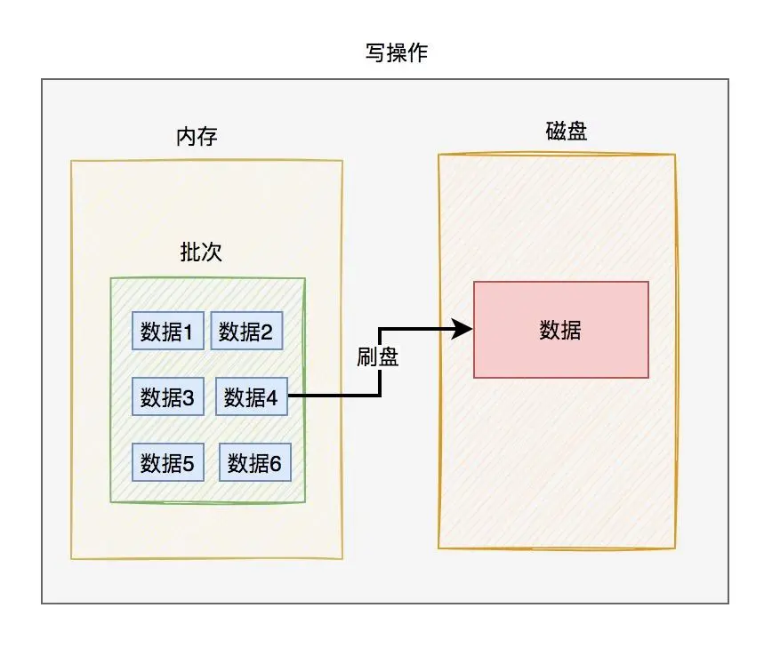

- 读操作时，从磁盘上一次读一批数据，然后加载到内存当中，以后就在内存中操作。如下图所示：

  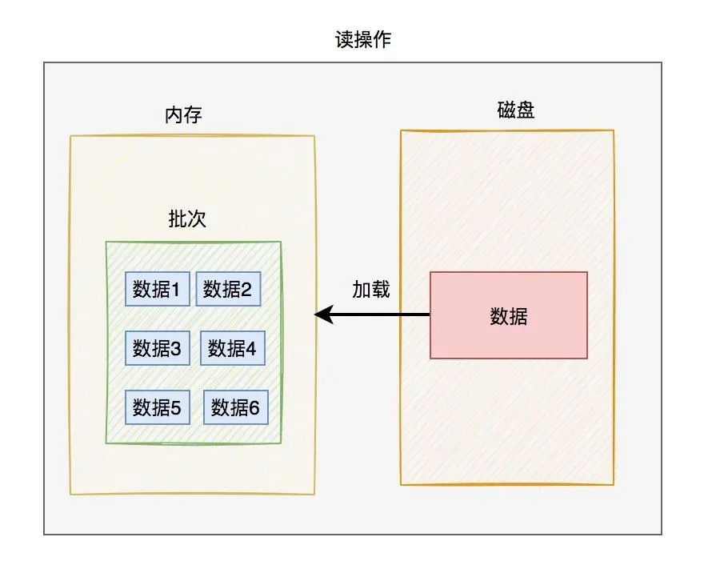

磁盘中各数据页的整体结构如下图所示：

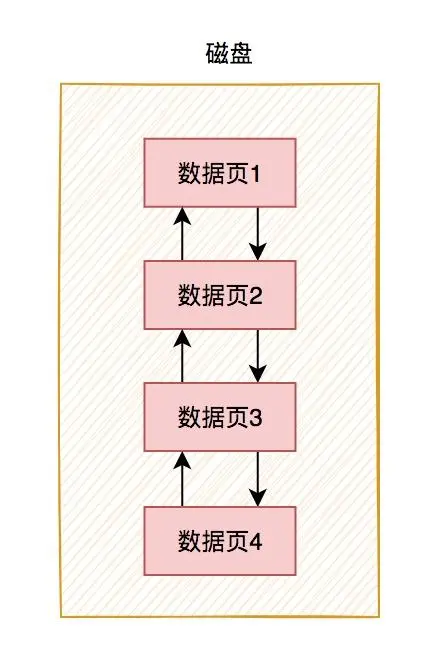

通常情况下，单个数据页默认的大小是`16kb`。当然，我们也可以通过参数：`innodb_page_size`，来重新设置大小。不过，一般情况下，用它的默认值就够了。单个数据页包含内容如下：

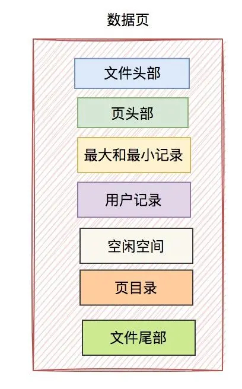

### 文件头部

通过前面介绍的行记录中`下一条记录的位置`和`页目录`，innodb能非常快速的定位某一条记录。但有个前提条件，就是用户记录必须在同一个数据页当中。

如果用户记录非常多，在第一个数据页找不到我们想要的数据，需要到另外一页找该怎么办呢？这时就需要使用`文件头部`了。它里面包含了多个信息，但我只列出了其中4个最关键的信息：

- 页号
- 上一页页号
- 下一页页号
- 页类型

顾名思义，innodb是通过页号、上一页页号和下一页页号来串联不同数据页的。如下图所示：

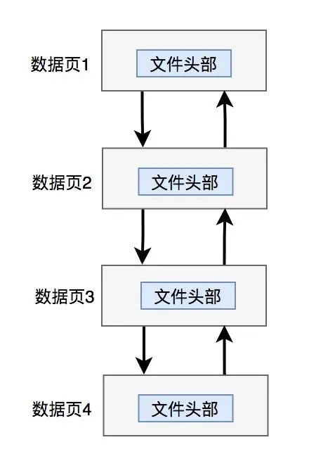

不同的数据页之间，通过上一页页号和下一页页号构成了双向链表。这样就能从前向后，一页页查找所有的数据了。此外，页类型也是一个非常重要的字段，它包含了多种类型，其中比较出名的有：数据页、索引页（目录项页）、溢出页、undo日志页等。


### 页头部

比如一页数据到底保存了多条记录，或者页目录到底使用了多个槽等。这些信息是实时统计，还是事先统计好了，保存到某个地方？为了性能考虑，上面的这些统计数据，当然是先统计好，保存到一个地方。后面需要用到该数据时，再读取出来会更好。这个保存统计数据的地方，就是`页头部`。当然页头部不仅仅只保存：槽的数量、记录条数等信息。它还记录了：

- 已删除记录所占的字节数
- 最后插入记录的位置
- 最大事务id
- 索引id
- 索引层级


### 最大和最小记录

在一个数据页当中，如果存在多条用户记录，它们是通过`下一条记录的位置`相连的。不过有个问题：如果才能快速找到最大的记录和最小的记录呢？这就需要在保存用户记录的同时，也保存最大和最小记录了。最大记录保存到Supremum记录中。最小记录保存在Infimum记录中。

在保存用户记录时，数据库会自动创建两条额外的记录：Supremum 和 Infimum。它们之间的关系，如下图所示：

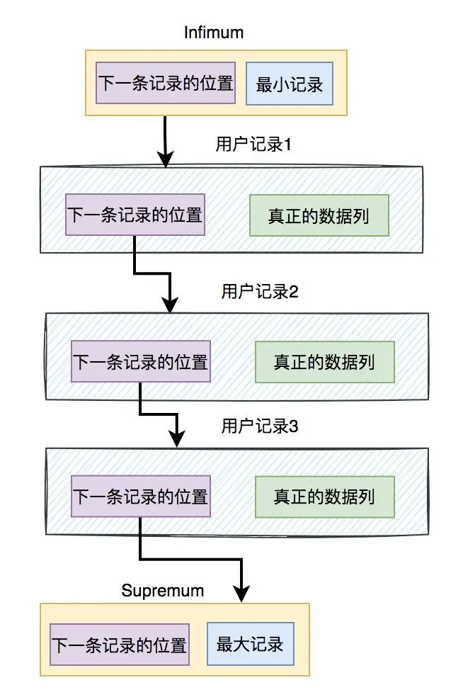

从图中可以看出用户数据是从最小记录开始，通过下一条记录的位置，从小到大，一步步查找，最后找到最大记录为止。


### 用户记录

对于新申请的数据页，用户记录是空的。当插入数据时，innodb会将一部分`空闲空间`分配给用户记录。用户记录是innodb的重中之重，我们平时保存到数据库中的数据，就存储在它里面。其实在innodb支持的数据行格式有四种：

- compact行格式
- redundant行格式
- dynamic行格式
- compressed行格式


以compact行格式为例：

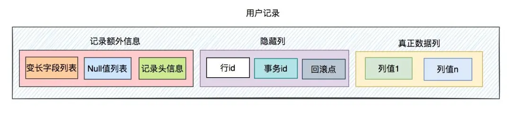

一条用户记录主要包含三部分内容：

- 记录额外信息：它包含了变长字段、null值列表和记录头信息
- 隐藏列：它包含了行id、事务id和回滚点
- 真正的数据列：包含真正的用户数据，可以有很多列


#### 额外信息

额外信息并非真正的用户数据，它是为了辅助存数据用的。

- **变长字段列表**

  有些数据如果直接存会有问题，比如：如果某个字段是varchar或text类型，它的长度不固定，可以根据存入数据的长度不同，而随之变化。如果不在一个地方记录数据真正的长度，innodb很可能不知道要分配多少空间。假如都按某个固定长度分配空间，但实际数据又没占多少空间，岂不是会浪费？所以，需要在变长字段中记录某个变长字段占用的字节数，方便按需分配空间。

- **null值列表**

  数据库中有些字段的值允许为null，如果把每个字段的null值，都保存到用户记录中，显然有些浪费存储空间。有没有办法只简单的标记一下，不存储实际的null值呢？答案：将为null的字段保存到null值列表。在列表中用二进制的值1，表示该字段允许为null，用0表示不允许为null。它只占用了1位，就能表示某个字符是否为null，确实可以节省很多存储空间。

- **记录头信息**

  记录头信息用于描述一些特殊的属性。它主要包含：

  - deleted_flag：即删除标记，用于标记该记录是否被删除了
  - min_rec_flag：即最小目录标记，它是非叶子节点中的最小目录标记
  - n_owned：即拥有的记录数，记录该组索引记录的条数
  - heap_no：即堆上的位置，它表示当前记录在堆上的位置
  - record_type：即记录类型，其中0表示普通记录，1表示非叶子节点，2表示Infrimum记录， 3表示Supremum记录
  - next_record：即下一条记录的位置


#### 隐藏列

数据库在保存一条用户记录时，会自动创建一些隐藏列。如下图所示：


目前innodb自动创建的隐藏列有三种：

- db_row_id，即行id，它是一条记录的唯一标识。
- db_trx_id，即事务id，它是事务的唯一标识。
- db_roll_ptr，即回滚点，它用于事务回滚。

如果表中有主键，则用主键做行id，无需额外创建。如果表中没有主键，假如有不为null的unique唯一键，则用它做为行id，同样无需额外创建。如果表中既没有主键，又没有唯一键，则数据库会自动创建行id。也就是说在innodb中，隐藏列中`事务id`和`回滚点`是一定会被创建的，但行id要根据实际情况决定。


#### 真正数据列

真正的数据列中存储了用户的真实数据，它可以包含很多列的数据。


### 页目录

从上面可以看出，如果我们要查询某条记录的话，数据库会从最小记录开始，一条条查找所有记录。如果中途找到了，则直接返回该记录。如果一直找到最大记录，还没有找到想要的记录，则返回空。

但效率会不会有点低？这不是要对整页用户数据进行扫描吗？

这就需要使用`页目录`了。说白了，就是把一页用户记录分为若干组，每一组的最大记录都保存到一个地方，这个地方就是`页目录`。每一组的最大记录叫做`槽`。由此可见，页目录是有多个槽组成的。所下图所示：

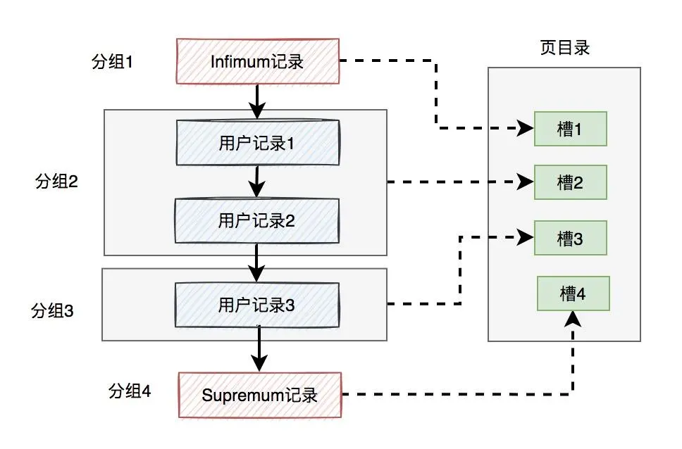

假设一页的数据分为4组，这样在页目录中，就对应了4个槽，每个槽中都保存了该组数据的最大值。这样就能通过二分查找，比较槽中的记录跟需要找到的记录的大小。如果用户需要查找的记录，小于当前槽中的记录，则向上查找上一个槽。如果用户需要查找的记录，大于当前槽中的记录，则向下查找下一个槽。如此一来，就能通过二分查找，快速的定位需要查找的记录了。


### 文件尾部

数据库的数据是以数据页为单位，加载到内存中，如果数据有更新的话，需要刷新到磁盘上。但如果某一天比较倒霉，程序在刷新到磁盘的过程中，出现了异常，比如：进程被kill掉了，或者服务器被重启了。这时候数据可能只刷新了一部分，如何判断上次刷盘的数据是完整的呢？这就需要用到`文件尾部`。它里面记录了页面的`校验和`。

在数据刷新到磁盘之前，会先计算一个页面的校验和。后面如果数据有更新的话，会计算一个新值。文件头部中也会记录这个校验和，由于文件头部在前面，会先被刷新到磁盘上。

接下来，刷新用户记录到磁盘的时候，假设刷新了一部分，恰好程序出现异常了。这时，文件尾部的校验和，还是一个旧值。数据库会去校验，文件尾部的校验和，不等于文件头部的新值，说明该数据页的数据是不完整的。


## Buffer Pool

`InnoDB`为了解决磁盘`IO`问题，`MySQL`需要申请一块内存空间，这块内存空间称为`Buffer Pool`。


### 缓存页

`Buffer Pool`申请下来后，`Buffer Pool`里面放什么，要怎么规划？

`MySQL`数据是以页为单位，每页默认`16KB`，称为数据页，在`Buffer Pool`里面会划分出若干**个缓存页**与数据页对应。

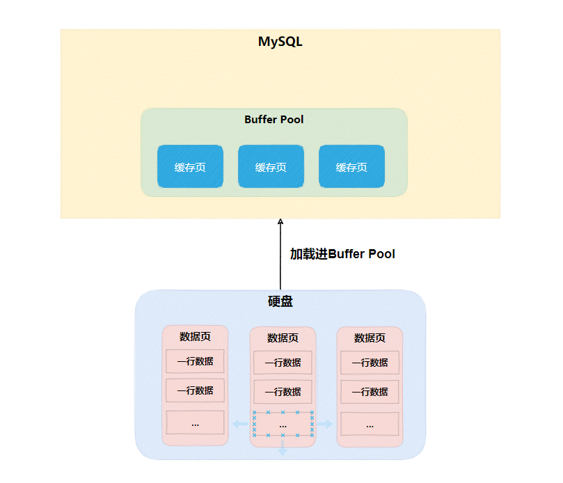


### 描述数据

如何知道缓存页对应那个数据页呢？

所以还需要缓存页的元数据信息，可以称为**描述数据**，它与缓存页一一对应，包含一些所属表空间、数据页的编号、`Buffer Pool`中的地址等等。


后续对数据的增删改查都是在`Buffer Pool`里操作

- 查询：从磁盘加载到缓存，后续直接查缓存
- 插入：直接写入缓存
- 更新删除：缓存中存在直接更新，不存在加载数据页到缓存更新


`MySQL`宕机数据不就全丢了吗？

`InnoDB`提供了`WAL`技术（Write-Ahead Logging），通过`redo log`让`MySQL`拥有了崩溃恢复能力。再配合空闲时，会有异步线程做缓存页刷盘，保证数据的持久性与完整性。


直接更新数据的缓存页称为**脏页**，缓存页刷盘后称为**干净页**。


### Free链表

`MySQL`数据库启动时，按照设置的`Buffer Pool`大小，去找操作系统申请一块内存区域，作为`Buffer Pool`（**假设申请了512MB**）。申请完毕后，会按照默认缓存页的`16KB`以及对应的`800Byte`的描述数据，在`Buffer Pool`中划分出来一个一个的缓存页和它们对应的描述数据。


`MySQL`运行起来后，会不停的执行增删改查，需要从磁盘读取一个一个的数据页放入`Buffer Pool`对应的缓存页里，把数据缓存起来，以后就可以在内存里执行增删改查。

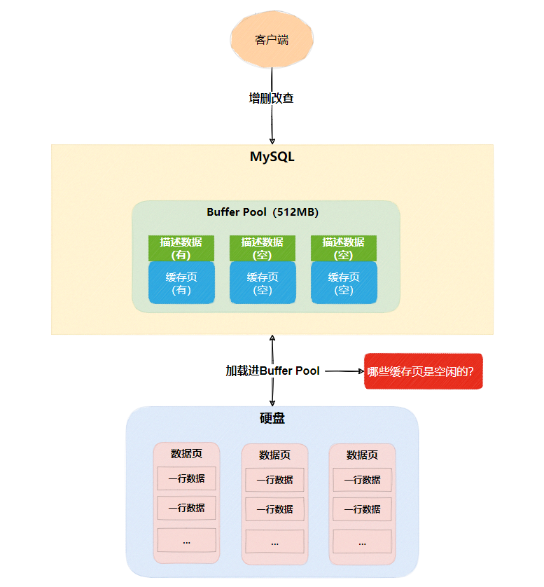

但是这个过程必然涉及一个问题，**哪些缓存页是空闲的**？

为了解决这个问题，我们使用链表结构，把空闲缓存页的**描述数据**放入链表中，这个链表称为`free`链表。针对`free`链表我们要做如下设计：

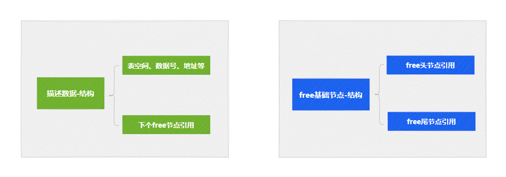

- 新增`free`基础节点
- 描述数据添加`free`节点指针

最终呈现出来的，是由空闲缓存页的**描述数据**组成的`free`链表。


有了`free`链表之后，我们只需要从`free`链表获取一个**描述数据**，就可以获取到对应的缓存页。

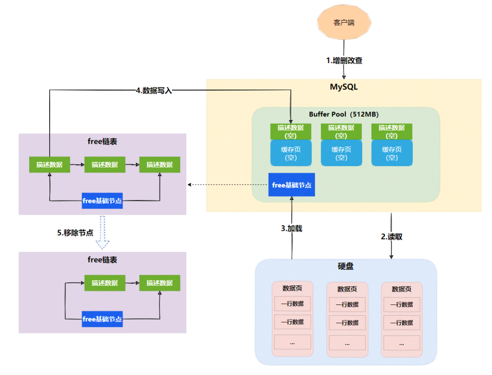

往**描述数据**与**缓存页**写入数据后，就将该**描述数据**移出`free`链表。


### 缓存页哈希表

查询数据时，如何在`Buffer Pool`里快速定位到对应的缓存页呢？难道需要一个**非空闲的描述数据**链表，再通过**表空间号+数据页编号**遍历查找吗？这样做也可以实现，但是效率不太高，时间复杂度是`O(N)`。


所以我们可以换一个结构，使用哈希表来缓存它们间的映射关系，时间复杂度是`O(1)`。

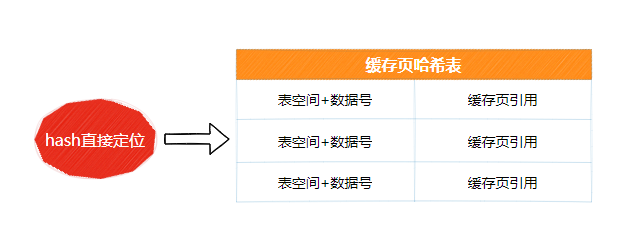

**表空间号+数据页号**，作为一个`key`，然后缓存页的地址作为`value`。每次加载数据页到空闲缓存页时，就写入一条映射关系到**缓存页哈希表**中。

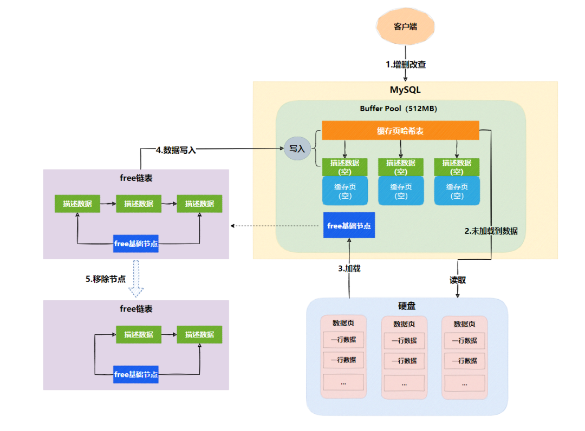

后续的查询，就可以通过**缓存页哈希表**路由定位了。


### Flush链表

还记得之前有说过「**空闲时会有异步线程做缓存页刷盘，保证数据的持久性与完整性**」吗？

新问题来了，难道每次把`Buffer Pool`里所有的缓存页都刷入磁盘吗？当然不能这样做，磁盘`IO`开销太大了，应该把**脏页**刷入磁盘才对（更新过的缓存页）。可是我们怎么知道，那些缓存页是**脏页**？很简单，参照`free`链表，弄个`flush`链表出来就好了，只要缓存页被更新，就将它的**描述数据**加入`flush`链表。针对`flush`链表我们要做如下设计：

- 新增`flush`基础节点
- 描述数据添加`flush`节点指针

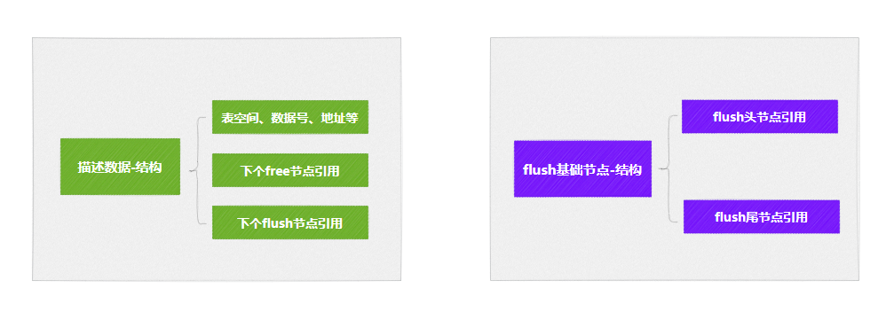

最终呈现出来的，是由更新过数据的缓存页**描述数据**组成的`flush`链表。

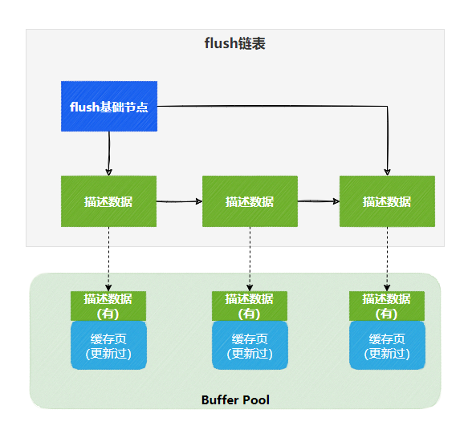

后续异步线程都从`flush`链表刷缓存页，当`Buffer Pool`内存不足时，也会优先刷`flush`链表里的缓存页。


### LRU链表

目前看来`Buffer Pool`的功能已经比较完善了。

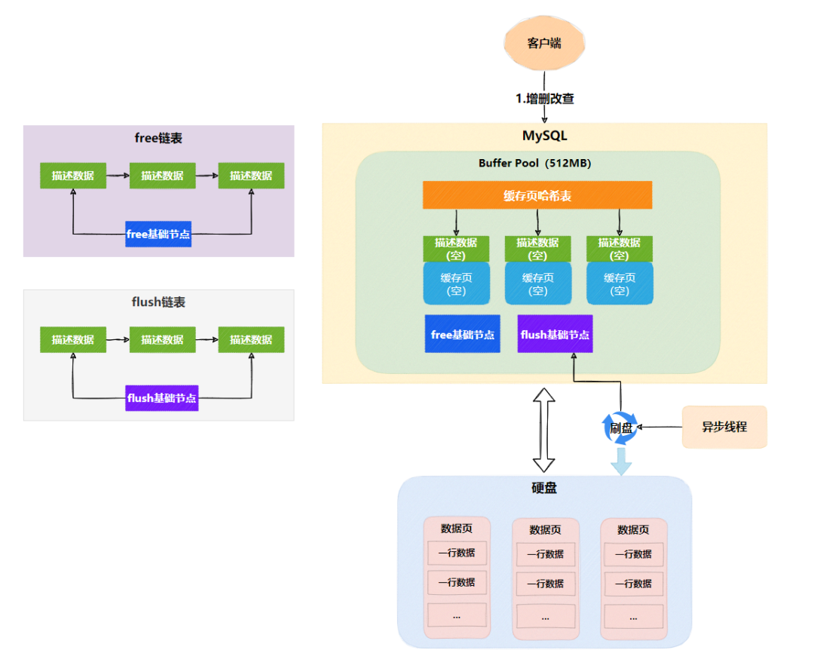

但是仔细思考下，发现还有一个问题没处理。`MySQL`数据库随着系统的运行会不停的把磁盘上的数据页加载到空闲的缓存页里去，因此`free`链表中的空闲缓存页会越来越少，直到没有，最后磁盘的数据页无法加载。

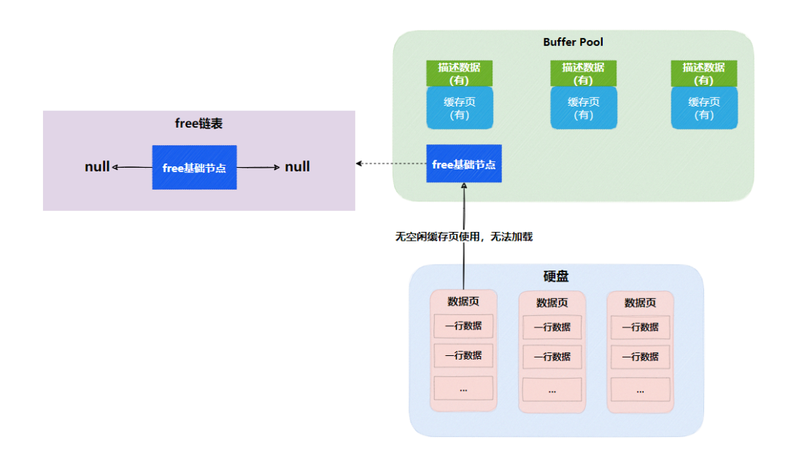

为了解决这个问题，我们需要淘汰缓存页，腾出空闲缓存页。可是我们要优先淘汰哪些缓存页？总不能一股脑直接全部淘汰吧？这里就要借鉴`LRU`算法思想，把最近最少使用的缓存页淘汰（命中率低），提供`LRU`链表出来。针对`LRU`链表我们要做如下设计：

- 新增`LRU`基础节点
- 描述数据添加`LRU`节点指针

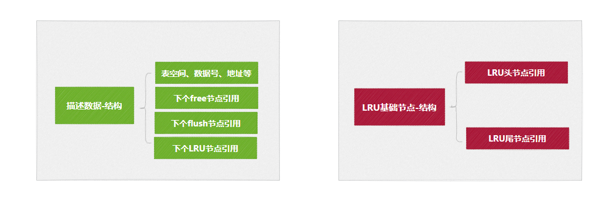

实现思路也很简单，只要是查询或修改过缓存页，就把该缓存页的描述数据放入链表头部，也就说近期访问的数据一定在链表头部。

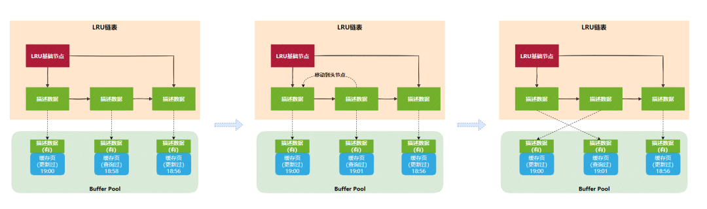

当`free`链表为空的时候，直接淘汰`LRU`链表尾部缓存页即可。


### LRU链表优化

麻雀虽小五脏俱全，基本`Buffer Pool`里与缓存页相关的组件齐全了。

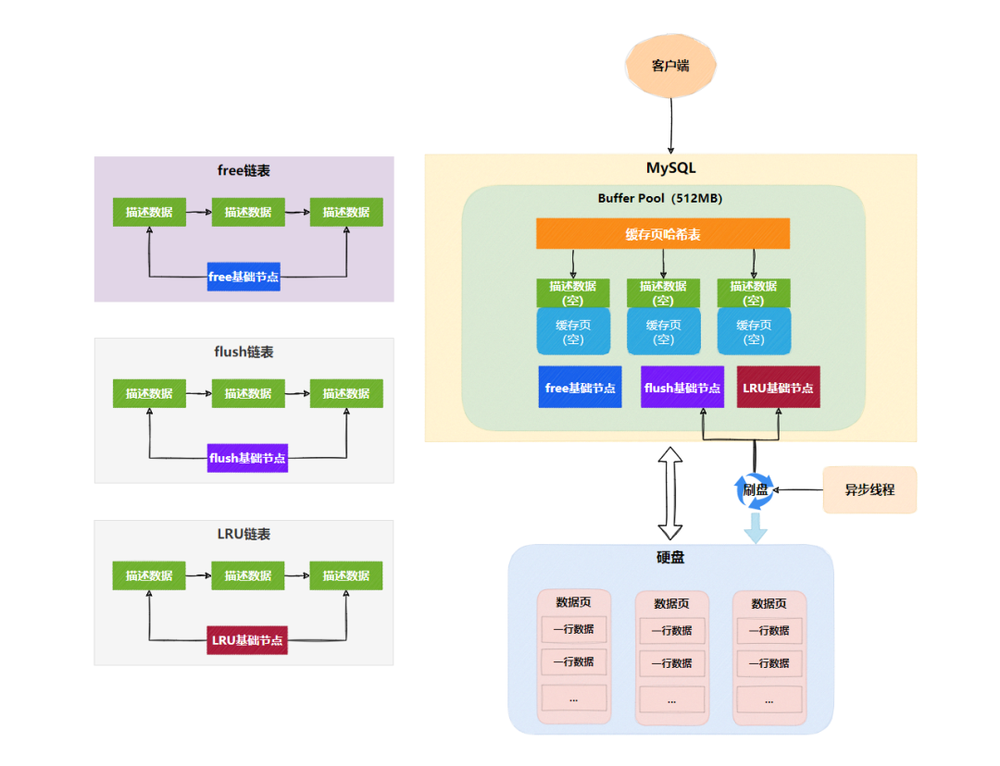

但是缓存页淘汰这里还有点问题，如果仅仅只是使用`LRU`链表的机制，有两个场景会让**热点数据**被淘汰。

- **预读机制**

  InnoDB使用两种预读算法来提高I/O性能：线性预读（linear read-ahead）和随机预读（randomread-ahead）。

- **全表扫描**

  预读机制是指`MySQL`加载数据页时，可能会把它相邻的数据页一并加载进来（局部性原理）。这样会带来一个问题，预读进来的数据页，其实我们没有访问，但是它却排在前面。

  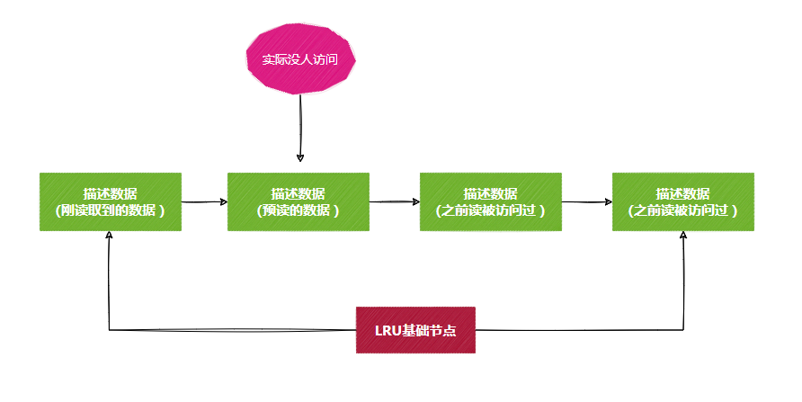

  正常来说，淘汰缓存页时，应该把这个预读的淘汰，结果却把尾部的淘汰了，这是不合理的。我们接着来看第二个场景全表扫描，如果**表数据量大**，大量的数据页会把空闲缓存页用完。最终`LRU`链表前面都是全表扫描的数据，之前频繁访问的热点数据全部到队尾了，淘汰缓存页时就把**热点数据页**给淘汰了。

  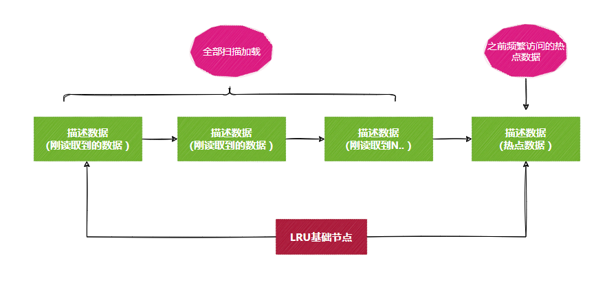

  为了解决上述的问题，我们需要给`LRU`链表做冷热数据分离设计，把`LRU`链表按一定比例，分为冷热区域，热区域称为`young`区域，冷区域称为`old`区域。


**以7:3为例，young区域70%，old区域30%**


如上图所示，数据页第一次加载进缓存页的时候，是先放入冷数据区域的头部，如果1秒后再次访问缓存页，则会移动到热区域的头部。这样就保证了**预读机制**与**全表扫描**加载的数据都在链表队尾。

- `young`区域其实还可以做一个小优化，为了防止`young`区域节点频繁移动到表头

- `young`区域前面`1/4`被访问不会移动到链表头部，只有后面的`3/4`被访问了才会

记住是按照某个比例将`LRU`链表分成两部分，不是某些节点固定是`young`区域的，某些节点固定是`old`区域的，随着程序的运行，某个节点所属的区域也可能发生变化。

- InnoDB在LRU列表中引入了midpoint参数。新读取的页并不会直接放在LRU列表的首部，而是放在LRU列表的midpoint位置，即 innodb_old_blocks_pct这个点的设置。默认是37%，最小是5，最大是95；如果内存比较大的话，可以将这个数值调低，通常会调成20，也就是说20%的是冷数据块。目的是为了保护热区数据不被刷出内存。
- InnoDB还引入了innodb_old_blocks_time参数，控制成为热数据的所需时间，默认是1000ms，也就是1s，也就是数据在1s内没有被刷走，就调入热区。 


## Change Buffer

可变缓冲区（Change Buffer），在内存中，可变缓冲区是InnoDB缓冲池的一部分，在磁盘上，它是系统表空间的一部分，因此即使在数据库重新启动之后，索引更改也会保持缓冲状态。

可变缓冲区是一种特殊的数据结构，当受影响的页不在缓冲池中时，缓存对辅助索引页的更改。


## Log Buffer

日志缓冲区（Log Buffer ），主要保存写到redo log(重放日志)的数据。周期性的将缓冲区内的数据写入redo日志中。将内存中的数据写入磁盘的行为由innodb_log_at_trx_commit 和 innodb_log_at_timeout 调节。较大的redo日志缓冲区允许大型事务在事务提交前不进行写磁盘操作。

变量：innodb_log_buffer_size (默认 16M)


## InnoDB日志

### Redo Log(重做日志)


### Undo Log


# 数据切分

## 水平切分

水平切分又称为 Sharding，它是将同一个表中的记录拆分到多个结构相同的表中。当一个表的数据不断增多时，Sharding 是必然的选择，它可以将数据分布到集群的不同节点上，从而缓存单个数据库的压力。

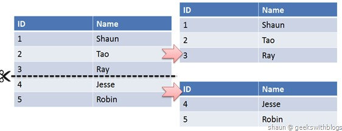


## 垂直切分

垂直切分是将一张表按列分成多个表，通常是按照列的关系密集程度进行切分，也可以利用垂直气氛将经常被使用的列喝不经常被使用的列切分到不同的表中。在数据库的层面使用垂直切分将按数据库中表的密集程度部署到不通的库中，例如将原来电商数据部署库垂直切分称商品数据库、用户数据库等。

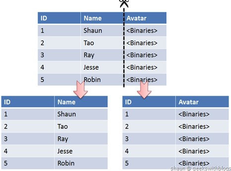


## Sharding策略

- 哈希取模：hash(key)%N
- 范围：可以是 ID 范围也可以是时间范围
- 映射表：使用单独的一个数据库来存储映射关系


## Sharding存在的问题

- **事务问题**：使用分布式事务来解决，比如 XA 接口

- **连接**：可以将原来的连接分解成多个单表查询，然后在用户程序中进行连接。

- **唯一性**
  - 使用全局唯一 ID （GUID）
  - 为每个分片指定一个 ID 范围
  - 分布式 ID 生成器（如 Twitter 的 Snowflake 算法）


# SQL优化

## 优化步骤
**第1步：通过慢查日志等定位那些执行效率较低的SQL语句**

**第2步：explain分析SQL的执行计划**

需要重点关注`type`、`rows`、`filtered`、`extra`。

- `type`：由上至下，效率越来越高

  - `ALL`：全表扫描
  - `index`：索引全扫描
  - `range`：索引范围扫描，常用语`<`、`<=`、`>=`、`between`、`in`等操作
  - `ref`：使用非唯一索引扫描或唯一索引前缀扫描，返回单条记录，常出现在关联查询中
  - `eq_ref`：类似ref，区别在于使用的是唯一索引，使用主键的关联查询
  - `const/system`：单条记录，系统会把匹配行中的其他列作为常数处理，如主键或唯一索引查询
  - `null`：MySQL不访问任何表或索引，直接返回结果

  虽然上至下，效率越来越高，但是根据cost模型，假设有两个索引`idx1(a, b, c)`,`idx2(a, c)`，SQL为`select * from t where a = 1 and b in (1, 2) order by c;`如果走idx1，那么是type为range，如果走idx2，那么type是ref；当需要扫描的行数，使用idx2大约是idx1的5倍以上时，会用idx1，否则会用idx2

- `Extra`
  - `Using filesort`：MySQL需要额外的一次传递，以找出如何按排序顺序检索行。通过根据联接类型浏览所有行并为所有匹配WHERE子句的行保存排序关键字和行的指针来完成排序。然后关键字被排序，并按排序顺序检索行。
  - `Using temporary`：使用了临时表保存中间结果，性能特别差，需要重点优化
  - `Using index`：表示相应的 select 操作中使用了覆盖索引（Coveing Index）,避免访问了表的数据行，效率不错！如果同时出现 using where，意味着无法直接通过索引查找来查询到符合条件的数据。
  - `Using index condition`：MySQL5.6之后新增的ICP，using index condtion就是使用了ICP（索引下推），在存储引擎层进行数据过滤，而不是在服务层过滤，利用索引现有的数据减少回表的数据。

**第3步：show profile 分析**

了解SQL执行的线程的状态及消耗的时间。默认是关闭的，开启语句“set profiling = 1;”

```mysql
SHOW PROFILES ;
SHOW PROFILE FOR QUERY  #{id};
```

**第4步：trace**

trace分析优化器如何选择执行计划，通过trace文件能够进一步了解为什么优惠券选择A执行计划而不选择B执行计划。

```mysql
set optimizer_trace="enabled=on";
set optimizer_trace_max_mem_size=1000000;
select * from information_schema.optimizer_trace;
```

**第5步：确定问题并采用相应的措施**

- 优化索引
- 优化SQL语句：修改SQL、IN 查询分段、时间查询分段、基于上一次数据过滤
- 改用其他实现方式：ES、数仓等
- 数据碎片处理


## 特殊需求

### 批量去重插入

**问题：MySQL批量插入，如何不插入重复数据？**

**解决方案1：insert ignore into**

当插入数据时，如出现错误时，如重复数据，将不返回错误，只以警告形式返回。所以使用ignore请确保语句本身没有问题，否则也会被忽略掉。例如：

```mysql
INSERT IGNORE INTO user (name) VALUES ('telami') 
```

这种方法很简便，但是有一种可能，就是插入不是因为重复数据报错，而是因为其他原因报错的，也同样被忽略了～


**解决方案2：on duplicate key update**

当primary或者unique重复时，则执行`update`语句，如`update`后为无用语句，如`id=id`，则同1功能相同，但错误不会被忽略掉。在公众号顶级架构师后台回复“架构整洁”，获取一份惊喜礼包。例如，为了实现name重复的数据插入不报错，可使用一下语句：

```mysql
INSERT INTO user (name) VALUES ('telami') ON duplicate KEY UPDATE id = id 
```

这种方法有个前提条件，就是，需要插入的约束，需要是主键或者唯一约束（在你的业务中那个要作为唯一的判断就将那个字段设置为唯一约束也就是`unique key`）。


**解决方案3：insert … select … where not exist**

根据select的条件判断是否插入，可以不光通过`primary`和`unique`来判断，也可通过其它条件。例如：

```mysql
INSERT INTO user (name) SELECT 'telami' FROM dual WHERE NOT EXISTS (SELECT id FROM user WHERE id = 1) 
```

这种方法其实就是使用了`MySQL`的一个临时表的方式，但是里面使用到了子查询，效率也会有一点点影响，如果能使用上面的就不使用这个。


**解决方案4：replace into**

如果存在`primary or unique`相同的记录，则先删除掉。再插入新记录。

```mysql
REPLACE INTO user SELECT 1, 'telami' FROM books 
```

这种方法就是不管原来有没有相同的记录，都会先删除掉然后再插入。选择的是第二种方式

```xml
<insert id="batchSaveUser" parameterType="list">
    insert into user (id,username,mobile_number)
    values
    <foreach collection="list" item="item" index="index" separator=",">
        (
            #{item.id},
            #{item.username},
            #{item.mobileNumber}
        )
    </foreach>
    ON duplicate KEY UPDATE id = id
</insert>
```

这里用的是Mybatis，批量插入的一个操作，`mobile_number`已经加了唯一约束。这样在批量插入时，如果存在手机号相同的话，是不会再插入了的。


## 场景分析

### 案例1：最左匹配

**索引**

```mysql
KEY `idx_shopid_orderno` (`shop_id`,`order_no`)
```

**SQL语句**

```mysql
select * from _t where orderno='xxx';
```

查询匹配从左往右匹配，要使用`order_no`走索引，必须查询条件携带`shop_id`或者索引(`shop_id`,`order_no`)调换前后顺序。


### 案例2：隐式转换

**索引**

```mysql
KEY `idx_mobile` (`mobile`)
```

**SQL语句**

```mysql
select * from _user where mobile=12345678901;
```

隐式转换相当于在索引上做运算，会让索引失效。mobile是字符类型，使用了数字，应该使用字符串匹配，否则MySQL会用到隐式替换，导致索引失效。


### 案例3：大分页

**索引**

```mysql
KEY `idx_a_b_c` (`a`, `b`, `c`)
```

**SQL语句**

```mysql
select * from _t where a = 1 and b = 2 order by c desc limit 10000, 10;
```

对于大分页的场景，可以优先让产品优化需求，如果没有优化的，有如下两种优化方式：

- 把上一次的最后一条数据，也即上面的c传过来，然后做“c < xxx”处理，但是这种一般需要改接口协议，并不一定可行
- 采用延迟关联的方式进行处理，减少SQL回表，但是要记得索引需要完全覆盖才有效果，SQL改动如下

```mysql
SELECT t1.* FROM _t t1, (SELECT id FROM _t WHERE a=1 AND b=2 ORDER BY c DESC LIMIT 10000,10) t2  WHERE t1.id=t2.id;
```


### 案例4：in+order by

**索引**

```mysql
KEY `idx_shopid_status_created` (`shop_id`, `order_status`, `created_at`)
```

**SQL语句**

```mysql
SELECT * FROM _order WHERE shop_id = 1 AND order_status IN ( 1, 2, 3 ) ORDER BY created_at DESC LIMIT 10
```

in查询在MySQL底层是通过`n*m`的方式去搜索，类似union，但是效率比union高。in查询在进行cost代价计算时（`代价 = 元组数 * IO平均值`），是通过将in包含的数值，一条条去查询获取元组数的，因此这个计算过程会比较的慢，所以MySQL设置了个临界值(`eq_range_index_dive_limit`)，5.6之后超过这个临界值后该列的cost就不参与计算了。

因此会导致执行计划选择不准确。默认是200，即in条件超过了200个数据，会导致in的代价计算存在问题，可能会导致Mysql选择的索引不准确。处理方式，可以(`order_status`, `created_at`)互换前后顺序，并且调整SQL为延迟关联。


### 案例5：范围查询索引失效

范围查询阻断，后续字段不能走索引。

**索引**

```mysql
KEY `idx_shopid_created_status` (`shop_id`, `created_at`, `order_status`)
```

**SQL语句**

```mysql
SELECT * FROM _order WHERE shop_id=1 AND created_at > '2021-01-01 00:00:00' AND order_status=10;
```

范围查询还有“IN、between”。


### 案例6：避免使用非快速索引

不等于、不包含不能用到索引的快速搜索。

```mysql
select * from _order where shop_id=1 and order_status not in (1,2);
select * from _order where shop_id=1 and order_status != 1;
```

在索引上，避免使用`NOT`、`!=`、`<>`、`!<`、`!>`、`NOT EXISTS`、`NOT IN`、`NOT LIKE`等。


### 案例7：优化器选择索引失效

如果要求访问的数据量很小，则优化器还是会选择辅助索引，但是当访问的数据占整个表中数据的蛮大一部分时（一般是20%左右），优化器会选择通过聚集索引来查找数据。

```mysql
select * from _order where  order_status = 1
```

查询出所有未支付的订单，一般这种订单是很少的，即使建了索引，也没法使用索引。


### 案例8：复杂查询

```mysql
select sum(amt) from _t where a = 1 and b in (1, 2, 3) and c > '2020-01-01';
select * from _t where a = 1 and b in (1, 2, 3) and c > '2020-01-01' limit 10;
```

如果是统计某些数据，可能改用数仓进行解决；如果是业务上就有那么复杂的查询，可能就不建议继续走SQL了，而是采用其他的方式进行解决，比如使用ES等进行解决。


### 案例9：asc和desc混用

```mysql
select * from _t where a=1 order by b desc, c asc
```

desc 和asc混用时会导致索引失效


### 案例10：大数据

对于推送业务的数据存储，可能数据量会很大，如果在方案的选择上，最终选择存储在MySQL上，并且做7天等有效期的保存。那么需要注意，频繁的清理数据，会照成数据碎片，需要联系DBA进行数据碎片处理。


# MySQL原理

## 架构设计


从上面的示意图可以看出，MySQL从上到下包含了：**客户端、Server层和存储引擎层**。

- **客户端**：可以是我们常用的MySQL命令行窗口，或者是Java的客户端程序等
- **Server层**：连接器、查询缓存、分析器、优化器和执行器等。大部分MySQL对用户提供的功能都在这一层实现，包括了内置函数的实现，存储过程、触发器、视图等
- **存储层**：存储引擎层负责数据的存储和提取，存储引擎的实现是插件式的。也就是说用户可以选择自己所需要的存储引擎，如InnoDB、MyISAM等


### 连接器

连接器是MySQL服务端对外的门户，当我们使用命令行黑窗口或者JDBC的Connection.connect()，连接到MySQL Server端时，会校验用户名和密码；然后会查询用户对应的权限列表。当连接建立后，后续的权限范围就在此时确定了，如果连接没有断开的情况下，更改了用户的权限，此时对于该连接也不生效。


### 查询缓存

当连接建立完成后，执行select 语句的时候，就会来到查询缓存。MySQL会将Select 语句为 KEY，将查询结果为VALUE 的形式保存在内存中。如果匹配到对应的 KEY 就会直接从内存中返回结果。

但是常我们不会使用MySQL自身的查询缓存，因为当有一条Update 或 Insert 的改表语句时，就会清空对该表的所有查询缓存。缓存的粒度比较大，可以考虑类似 Redis 的分布式缓存做业务数据的缓存。在MySQL 8.0 中，查询缓存直接被移除了。


### 分析器

如果在查询缓存中没有查到数据，就要真正的开始执行SQL语句了。分析器首先会做“词法分析”。词法分析就是识别上面字符串，id、name 是表的字段名，T 是表的名称等等。之后就是语法分析，如果SQL有语法错误，在此时就会报错。


### 优化器

当分析器处理过之后，MySQL就知道SQL 要干什么了，但是此时还需要优化器对待执行的SQL 进行优化。当然MySQL 提供的优化器，相比其他几款商用收费的数据库来说还是比较弱的。当然MySQL 的优化器还是可以对 join 操作，表达式计算等等进行优化，本篇不做过多的介绍。


### 执行器

执行阶段，首先会检查当前用户有没有权限操作该 SQL 语句。如果有，则继续执行后续的操作。


## 存储引擎

InnoDB 和 MyISAM 的比较

- 事务：InnoDB 是事务型的，可以使用 Commit 和 Rollback 语句。
- 并发：MyISAM 只支持表级锁，而 InnoDB 还支持行级锁。
- 外键：InnoDB 支持外键。
- 备份：InnoDB 支持在线热备份。
- 崩溃恢复：MyISAM 崩溃后发生损坏的概率比 InnoDB 高很多，而且恢复的速度也更慢。
- 其它特性：MyISAM 支持压缩表和空间数据索引。


### InnoDB引擎

InnoDB 是一个事务安全的存储引擎，它具备提交、回滚以及崩溃恢复的功能以保护用户数据。InnoDB 的行级别锁定保证数据一致性提升了它的多用户并发数以及性能。InnoDB 将用户数据存储在聚集索引中以减少基于主键的普通查询所带来的 I/O 开销。为了保证数据的完整性，InnoDB 还支持外键约束。默认使用B+TREE数据结构存储索引。


**特点**

- 支持事务，支持4个事务隔离（ACID）级别
- 行级锁定（更新时锁定当前行）
- 读写阻塞与事务隔离级别相关
- 既能缓存索引又能缓存数据
- 支持外键
- InnoDB更消耗资源，读取速度没有MyISAM快
- 在InnoDB中存在着缓冲管理，通过缓冲池，将索引和数据全部缓存起来，加快查询的速度；
- 对于InnoDB类型的表，其数据的物理组织形式是聚簇表。所有的数据按照主键来组织。数据和索引放在一块，都位于B+数的叶子节点上


**业务场景**

- 需要支持事务的场景（银行转账之类）
- 适合高并发，行级锁定对高并发有很好的适应能力，但需要确保查询是通过索引完成的
- 数据修改较频繁的业务


**InnoDB引擎调优**

- 主键尽可能小，否则会给Secondary index带来负担
- 避免全表扫描，这会造成锁表
- 尽可能缓存所有的索引和数据，减少IO操作
- 避免主键更新，这会造成大量的数据移动


### MyISAM引擎

MyISAM既不支持事务、也不支持外键、其优势是访问速度快，但是表级别的锁定限制了它在读写负载方面的性能，因此它经常应用于只读或者以读为主的数据场景。默认使用B+TREE数据结构存储索引。


**特点**

- 不支持事务
- 表级锁定（更新时锁定整个表）
- 读写互相阻塞（写入时阻塞读入、读时阻塞写入；但是读不会互相阻塞）
- 只会缓存索引（通过key_buffer_size缓存索引，但是不会缓存数据）
- 不支持外键
- 读取速度快


**业务场景**

- 不需要支持事务的场景（像银行转账之类的不可行）
- 一般读数据的较多的业务
- 数据修改相对较少的业务
- 数据一致性要求不是很高的业务


**MyISAM引擎调优**

- 设置合适索引
- 启用延迟写入，尽量一次大批量写入，而非频繁写入
- 尽量顺序insert数据，让数据写入到尾部，减少阻塞
- 降低并发数，高并发使用排队机制
- MyISAM的count只有全表扫描比较高效，带有其它条件都需要进行实际数据访问


## 复制

### 主从复制

主要涉及三个线程：

- **binlog 线程**：负责将主服务器上的数据更改写入二进制日志（Binary log）中
- **I/O 线程**：负责从主服务器上读取- 二进制日志，并写入从服务器的中继日志（Relay log）
- **SQL 线程**：负责读取中继日志，解析出主服务器已经执行的数据更改并在从服务器中重放（Replay）

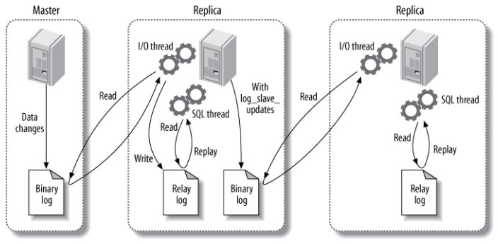


### 读写分离

主服务器处理写操作以及实时性要求比较高的读操作，而从服务器处理读操作。读写分离能提高性能的原因在于：

- 主从服务器负责各自的读和写，极大程度缓解了锁的争用
- 从服务器可以使用 MyISAM，提升查询性能以及节约系统开销
- 增加冗余，提高可用性

读写分离常用代理方式来实现，代理服务器接收应用层传来的读写请求，然后决定转发到哪个服务器。

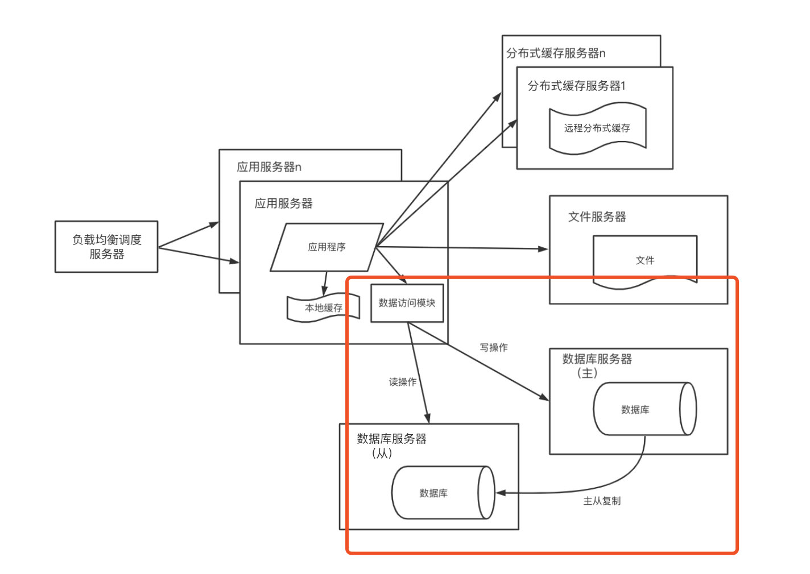


## 查询过程


## mysql复制原理

### 基于语句的复制

基于语句的复制模式下，主库会记录那些造成数据更改的查询，当备库读取并重放这些事件时，实际上只把主库上执行过的SQL再执行一遍。

- **优点**

  最明显的好处是实现相当简单。理论上讲，简单地记录和执行这些语句，能够让备库保持同步。另外好处是binlog日志里的事件更加紧凑，所以相对而言，基于语句的模式不会使用太多带宽。一条更新好几兆数据的语句在二进制日志里可能只占用几十字节。

- **缺点**

  有些数据更新语句，可能依赖其他因素。例如，同一条sql在主库和备库上执行的时间可能稍微或很不相同，因此在传输的binlog日志中，除了查询语句，还包括一些元数据信息，如当前的时间戳。即便如此，还存在着一些无法被正确复制的SQL，例如，使用CURRENT_USER()函数语句。存储过程和触发器在使用基于语句的复制模式时也可能存在问题。另外一个问题是更新必须是串行的。这需要更多的锁。并且不是所有的存储引擎都支持这种复制模式。


### 基于行的复制

MySQL5.1开始支持基于行的复制，这种方式会将实际数据记录在二进制日志中，跟其他数据库的实现比较相像。

- **优点**

  最大的好处是可以正确的复制每一行，一些语句可以呗更加有效地复制。由于无需重放更新主库数据的查询，使用基于行的复制模式能够更高效地复制数据。重放一些查询的代价会很高

- **缺点**

  全表更行，使用基于行复制开销会大很多，因为每一行数据都会呗记录到二进制日志中，这使得二进制日志时间非常庞大


# 高可用方案

我们在考虑MySQL数据库的高可用架构时，主要考虑如下几方面：

- 如果数据库发生了宕机或者意外中断等故障，能尽快恢复数据库的可用性，尽可能的减少停机时间，保证业务不会因为数据库的故障而中断
- 用作备份、只读副本等功能的非主节点的数据应该和主节点的数据实时或者最终保持一致
- 当业务发生数据库切换时，切换前后的数据库内容应当一致，不会因为数据缺失或者数据不一致而影响业务

关于对高可用的分级我们暂不做详细的讨论，这里只讨论常用高可用方案的优缺点以及选型。


随着人们对数据一致性要求不断的提高，越来越多的方法被尝试用来解决分布式数据一致性的问题，如MySQL自身的优化、MySQL集群架构的优化、Paxos、Raft、2PC算法的引入等。

而使用分布式算法用来解决MySQL数据库数据一致性问题的方法，也越来越被人们所接受，一系列成熟的产品如PhxSQL、MariaDB Galera Cluster、Percona XtraDB Cluster等越来越多的被大规模使用。

随着官方MySQL Group Replication的GA，使用分布式协议来解决数据一致性问题已经成为了主流的方向。期望越来越多优秀的解决方案被提出，MySQL高可用问题也可以被更好的解决。


## 主从或主主半同步复制

使用双节点数据库，搭建单向或者双向的半同步复制。在5.7以后的版本中，由于lossless replication、logical多线程复制等一些列新特性的引入，使得MySQL原生半同步复制更加可靠。常见架构如下：


通常会和Proxy、Keepalived等第三方软件同时使用，即可以用来监控数据库的健康，又可以执行一系列管理命令。如果主库发生故障，切换到备库后仍然可以继续使用数据库。

**优点**

- 架构比较简单，使用原生半同步复制作为数据同步的依据
- 双节点，没有主机宕机后的选主问题，直接切换即可
- 双节点，需求资源少，部署简单

**缺点**

- 完全依赖于半同步复制，如果半同步复制退化为异步复制，数据一致性无法得到保证
- 需要额外考虑HAProxy、Keepalived的高可用机制


## 半同步复制优化

半同步复制机制是可靠的。如果半同步复制一直是生效的，那么可以认为数据是一致的。但是由于网络波动等一些客观原因，导致半同步复制发生超时而切换为异步复制，这时便不能保证数据的一致性。所以尽可能的保证半同步复制，就可以提高数据的一致性。

该方案同样使用双节点架构，但是在原有半同复制的基础上做了功能上的优化，使半同步复制的机制变得更加可靠。可参考的优化方案如下：

### 双通道复制


半同步复制由于发生超时后，复制断开，当再次建立起复制时，同时建立两条通道，其中一条半同步复制通道从当前位置开始复制，保证从机知道当前主机执行的进度。另外一条异步复制通道开始追补从机落后的数据。当异步复制通道追赶到半同步复制的起始位置时，恢复半同步复制。


### binlog文件服务器


搭建两条半同步复制通道，其中连接文件服务器的半同步通道正常情况下不启用，当主从的半同步复制发生网络问题退化后，启动与文件服务器的半同步复制通道。当主从半同步复制恢复后，关闭与文件服务器的半同步复制通道。

**优点**

- 双节点，需求资源少，部署简单
- 架构简单，没有选主的问题，直接切换即可
- 相比于原生复制，优化后的半同步复制更能保证数据的一致性

**缺点**

- 需要修改内核源码或者使用MySQL通信协议。需要对源码有一定的了解，并能做一定程度的二次开发
- 依旧依赖于半同步复制，没有从根本上解决数据一致性问题


## 高可用架构优化

将双节点数据库扩展到多节点数据库，或者多节点数据库集群。可以根据自己的需要选择一主两从、一主多从或者多主多从的集群。由于半同步复制，存在接收到一个从机的成功应答即认为半同步复制成功的特性，所以多从半同步复制的可靠性要优于单从半同步复制的可靠性。并且多节点同时宕机的几率也要小于单节点宕机的几率，所以多节点架构在一定程度上可以认为高可用性是好于双节点架构。

但由于数据库数量较多，所以需要数据库管理软件来保证数据库的可维护性。可以选择MMM、MHA或者各个版本的Proxy等等。常见方案如下：

### MHA+多节点集群


MHA Manager会定时探测集群中的master节点，当master出现故障时，它可以自动将最新数据的slave提升为新的master，然后将所有其他的slave重新指向新的master，整个故障转移过程对应用程序完全透明。MHA Node运行在每台MySQL服务器上，主要作用是切换时处理二进制日志，确保切换尽量少丢数据。MHA也可以扩展到如下的多节点集群：


**优点**

- 可以进行故障的自动检测和转移
- 可扩展性较好，可以根据需要扩展MySQL的节点数量和结构
- 相比于双节点的MySQL复制，三节点/多节点的MySQL发生不可用的概率更低

**缺点**

- 至少需要三节点，相对于双节点需要更多的资源
- 逻辑较为复杂，发生故障后排查问题，定位问题更加困难
- 数据一致性仍然靠原生半同步复制保证，仍然存在数据不一致的风险
- 可能因为网络分区发生脑裂现象。
- 在此我向大家推荐一个架构学习交流群。交流学习群号：575745314 里面会分享一些资深架构师录制的视频录像：有Spring，MyBatis，Netty源码分析，高并发、高性能、分布式、微服务架构的原理，JVM性能优化、分布式架构等这些成为架构师必备的知识体系。还能领取免费的学习资源，目前受益良多


### ZooKeeper+Proxy

ZooKeeper使用分布式算法保证集群数据的一致性，使用ZooKeeper可以有效的保证Proxy的高可用性，可以较好地避免网络分区现象的产生。


**优点**

- 较好的保证了整个系统的高可用性，包括Proxy、MySQL
- 扩展性较好，可以扩展为大规模集群

**缺点**

- 数据一致性仍然依赖于原生的mysql半同步复制
- 引入ZK，整个系统的逻辑变得更加复杂


## 共享存储

共享存储实现了数据库服务器和存储设备的解耦，不同数据库之间的数据同步不再依赖于MySQL的原生复制功能，而是通过磁盘数据同步的手段，来保证数据的一致性。

### SAN共享储存

SAN的概念是允许存储设备和处理器（服务器）之间建立直接的高速网络（与LAN相比）连接，通过这种连接实现数据的集中式存储。常用架构如下：


使用共享存储时，MySQL服务器能够正常挂载文件系统并操作，如果主库发生宕机，备库可以挂载相同的文件系统，保证主库和备库使用相同的数据。

**优点**

- 两节点即可，部署简单，切换逻辑简单
- 很好的保证数据的强一致性
- 不会因为MySQL的逻辑错误发生数据不一致的情况

**缺点**

- 需要考虑共享存储的高可用
- 价格昂贵


### DRBD磁盘复制

DRBD是一种基于软件、基于网络的块复制存储解决方案，主要用于对服务器之间的磁盘、分区、逻辑卷等进行数据镜像，当用户将数据写入本地磁盘时，还会将数据发送到网络中另一台主机的磁盘上，这样的本地主机(主节点)与远程主机(备节点)的数据就可以保证实时同步。常用架构如下：


当本地主机出现问题，远程主机上还保留着一份相同的数据，可以继续使用，保证了数据的安全。DRBD是Linux内核模块实现的快级别的同步复制技术，可以与SAN达到相同的共享存储效果。

**优点**

- 两节点即可，部署简单，切换逻辑简单
- 相比于SAN储存网络，价格低廉
- 保证数据的强一致性

**缺点**

- 对IO性能影响较大
- 从库不提供读操作


## 分布式协议

分布式协议可以很好地解决数据一致性问题。比较常见的方案如下：

### MySQL Cluster

MySQL Cluster是官方集群的部署方案，通过使用NDB存储引擎实时备份冗余数据，实现数据库的高可用性和数据一致性。


**优点**

- 全部使用官方组件，不依赖于第三方软件
- 可以实现数据的强一致性

**缺点**

- 国内使用的较少
- 配置较复杂，需要使用NDB储存引擎，与MySQL常规引擎存在一定差异
- 至少三节点


### Galera

基于Galera的MySQL高可用集群， 是多主数据同步的MySQL集群解决方案，使用简单，没有单点故障，可用性高。常见架构如下：


**优点**

- 多主写入，无延迟复制，能保证数据强一致性
- 有成熟的社区，有互联网公司在大规模的使用
- 自动故障转移，自动添加、剔除节点

**缺点**

- 需要为原生MySQL节点打wsrep补丁
- 只支持innodb储存引擎
- 至少三节点


### Paxos

Paxos算法解决的问题是一个分布式系统如何就某个值（决议）达成一致。这个算法被认为是同类算法中最有效的。Paxos与MySQL相结合可以实现在分布式的MySQL数据的强一致性。常见架构如下：


**优点**

- 多主写入，无延迟复制，能保证数据强一致性
- 有成熟理论基础
- 自动故障转移，自动添加、剔除节点

**缺点**

- 只支持InnoDB储存引擎
- 至少三节点
- 在此我向大家推荐一个架构学习交流群。交流学习群号：575745314 里面会分享一些资深架构师录制的视频录像：有Spring，MyBatis，Netty源码分析，高并发、高性能、分布式、微服务架构的原理，JVM性能优化、分布式架构等这些成为架构师必备的知识体系。还能领取免费的学习资源，目前受益良多


## 主从延迟

在实际的生产环境中，由单台MySQL作为独立的数据库是完全不能满足实际需求的，无论是在安全性，高可用性以及高并发等各个方面。因此，一般来说都是通过集群主从复制（Master-Slave）的方式来同步数据，再通过读写分离（MySQL-Proxy）来提升数据库的并发负载能力进行部署与实施。总结MySQL主从集群带来的作用是：

- 提高数据库负载能力，主库执行读写任务（增删改），备库仅做查询
- 提高系统读写性能、可扩展性和高可用性
- 数据备份与容灾，备库在异地，主库不存在了，备库可以立即接管，无须恢复时间


### biglog

**binlog是什么？有什么作用？**

用于记录数据库执行的写入性操作(不包括查询)信息，以二进制的形式保存在磁盘中。可以简单理解为记录的就是sql语句。binlog 是 mysql 的逻辑日志，并且由 `Server`层进行记录，使用任何存储引擎的 mysql 数据库都会记录 binlog 日志。在实际应用中， binlog 的主要使用场景有两个：

- 用于主从复制，在主从结构中，binlog 作为操作记录从 master 被发送到 slave，slave服务器从 master 接收到的日志保存到 relay log 中
- 用于数据备份，在数据库备份文件生成后，binlog保存了数据库备份后的详细信息，以便下一次备份能从备份点开始


**日志格式**

binlog日志有三种格式，分别为STATMENT 、 ROW 和 MIXED。在 MySQL 5.7.7 之前，默认的格式是 STATEMENT ， MySQL 5.7.7 之后，默认值是 ROW。日志格式通过 `binlog-format` 指定。

- **STATMENT** ：基于 SQL 语句的复制，每一条会修改数据的sql语句会记录到 binlog 中
- **ROW** ：基于行的复制
- **MIXED** ：基于 STATMENT 和 ROW 两种模式的混合复制，比如一般的数据操作使用 row 格式保存，有些表结构的变更语句，使用 statement 来记录


我们还可以通过mysql提供的查看工具mysqlbinlog查看文件中的内容，例如：

```mysql
mysqlbinlog mysql-bin.00001 | more
```

binlog文件大小和个数会不断的增加，后缀名会按序号递增，例如`mysql-bin.00002`等。


### 主从复制原理


可以看到mysql主从复制需要三个线程：**master（binlog dump thread）、slave（I/O thread 、SQL thread）**

- **binlog dump线程：** 主库中有数据更新时，根据设置的binlog格式，将更新的事件类型写入到主库的binlog文件中，并创建log dump线程通知slave有数据更新。当I/O线程请求日志内容时，将此时的binlog名称和当前更新的位置同时传给slave的I/O线程
- **I/O线程：** 该线程会连接到master，向log dump线程请求一份指定binlog文件位置的副本，并将请求回来的binlog存到本地的relay log中
- **SQL线程：** 该线程检测到relay log有更新后，会读取并在本地做redo操作，将发生在主库的事件在本地重新执行一遍，来保证主从数据同步


**基本过程总结**

- 主库写入数据并且生成binlog文件。该过程中MySQL将事务串行的写入二进制日志，即使事务中的语句都是交叉执行的
- 在事件写入二进制日志完成后，master通知存储引擎提交事务
- 从库服务器上的IO线程连接Master服务器，请求从执行binlog日志文件中的指定位置开始读取binlog至从库
- 主库接收到从库IO线程请求后，其上复制的IO线程会根据Slave的请求信息分批读取binlog文件然后返回给从库的IO线程
- Slave服务器的IO线程获取到Master服务器上IO线程发送的日志内容、日志文件及位置点后，会将binlog日志内容依次写到Slave端自身的Relay Log（即中继日志）文件的最末端，并将新的binlog文件名和位置记录到`master-info`文件中，以便下一次读取master端新binlog日志时能告诉Master服务器从新binlog日志的指定文件及位置开始读取新的binlog日志内容
- 从库服务器的SQL线程会实时监测到本地Relay Log中新增了日志内容，然后把RelayLog中的日志翻译成SQL并且按照顺序执行SQL来更新从库的数据
- 从库在`relay-log.info`中记录当前应用中继日志的文件名和位置点以便下一次数据复制


**并行复制**

在MySQL 5.6版本之前，Slave服务器上有两个线程I/O线程和SQL线程。I/O线程负责接收二进制日志，SQL线程进行回放二进制日志。如果在MySQL 5.6版本开启并行复制功能，那么SQL线程就变为了coordinator线程，coordinator线程主要负责以前两部分的内容：


**上图的红色框框部分就是实现并行复制的关键所在**。这意味着coordinator线程并不是仅将日志发送给worker线程，自己也可以回放日志，但是所有可以并行的操作交付由worker线程完成。coordinator线程与worker是典型的生产者与消费者模型。


不过到MySQL 5.7才可称为真正的并行复制，这其中最为主要的原因就是slave服务器的回放与主机是一致的即master服务器上是怎么并行执行的slave上就怎样进行并行回放。不再有库的并行复制限制，对于二进制日志格式也无特殊的要求。为了兼容MySQL 5.6基于库的并行复制，5.7引入了新的变量`slave-parallel-type`，其可以配置的值有：

- **DATABASE**：默认值，基于库的并行复制方式
- **LOGICAL_CLOCK**：基于组提交的并行复制方式


**按库并行**

每个 worker 线程对应一个 hash 表，用于保存当前正在这个worker的执行队列里的事务所涉及到的库。其中hash表里的key是数据库名，用于决定分发策略。该策略的优点是构建hash值快，只需要库名，同时对于binlog的格式没有要求。但这个策略的效果，只有在主库上存在多个DB，且各个DB的压力均衡的情况下，这个策略效果好。因此，对于主库上的表都放在同一个DB或者不同DB的热点不同，则起不到多大效果：


**组提交优化**

该特性如下：

- 能够同一组里提交的事务，定不会修改同一行
- 主库上可以并行执行的事务，从库上也一定可以并行执行

具体是如何实现的：

- 在同一组里面一起提交的事务，会有一个相同的`commit_id`，下一组为`commit_id+1`，该`commit_id`会直接写到binlog中
- 在从库使用时，相同`commit_id`的事务会被分发到多个worker并行执行，直到这一组相同的`commit_id`执行结束后，coordinator再取下一批


### 主从延迟

根据主从复制的原理可以看出，两者之间是存在一定时间的数据不一致，也就是所谓的主从延迟。导致主从延迟的时间点：

- 主库 A 执行完成一个事务，写入 binlog，该时刻记为T1
- 传给从库B，从库接受完这个binlog的时刻记为T2
- 从库B执行完这个事务，该时刻记为T3

那么所谓主从延迟，就是同一个事务，从库执行完成的时间和主库执行完成的时间之间的差值，即T3-T1。我们也可以通过在从库执行`show slave status`，返回结果会显示`seconds_behind_master`，表示当前从库延迟了多少秒。

**seconds_behind_master如何计算的？**

- 每一个事务的binlog都有一个时间字段，用于记录主库上写入的时间
- 从库取出当前正在执行的事务的时间字段，跟当前系统的时间进行相减，得到的就是`seconds_behind_master`，也就是前面所描述的T3-T1


**为什么会主从延迟？**

正常情况下，如果网络不延迟，那么日志从主库传给从库的时间是相当短，所以T2-T1可以基本忽略。最直接的影响就是从库消费中转日志（relaylog）的时间段，而造成原因一般是以下几种：

- **从库的机器性能比主库要差**

  比如将20台主库放在4台机器，把从库放在一台机器。这个时候进行更新操作，由于更新时会触发大量读操作，导致从库机器上的多个从库争夺资源，导致主从延迟。不过，目前大部分部署都是采取主从使用相同规格的机器部署

- **从库的压力大**

  按照正常的策略，读写分离，主库提供写能力，从库提供读能力。将进行大量查询放在从库上，结果导致从库上耗费了大量的CPU资源，进而影响了同步速度，造成主从延迟。对于这种情况，可以通过一主多从，分担读压力；也可以采取binlog输出到外部系统，比如Hadoop，让外部系统提供查询能力

- **大事务的执行**

  一旦执行大事务，那么主库必须要等到事务完成之后才会写入binlog。比如主库执行了一条insert … select非常大的插入操作，该操作产生了近几百G的binlog文件传输到只读节点，进而导致了只读节点出现应用binlog延迟。因此，DBA经常会提醒开发，不要一次性地试用delete语句删除大量数据，尽可能控制数量，分批进行

- **主库的DDL(alter、drop、create)**
  - 只读节点与主库的DDL同步是串行进行，如果DDL操作在主库执行时间很长，那么从库也会消耗同样的时间，比如在主库对一张500W的表添加一个字段耗费了10分钟，那么从节点上也会耗费10分钟
  - 从节点上有一个执行时间非常长的的查询正在执行，那么这个查询会堵塞来自主库的DDL，表被锁，直到查询结束为止，进而导致了从节点的数据延迟

- **锁冲突**

  锁冲突问题也可能导致从节点的SQL线程执行慢，比如从机上有一些select .... for update的SQL，或者使用了MyISAM引擎等

- **从库的复制能力**

  一般场景中，因偶然情况导致从库延迟了几分钟，都会在从库恢复之后追上主库。但若是从库执行速度低于主库，且主库持续具有压力，就会导致长时间主从延迟，很有可能就是从库复制能力的问题。

从库上的执行，即`sql_thread`更新逻辑，在5.6版本之前，是只支持单线程，那么在主库并发高、TPS高时，就会出现较大的主从延迟。因此，MySQL自5.7版本后就已经支持并行复制了。可以在从服务上设置 `slave_parallel_workers`为一个大于0的数，然后把`slave_parallel_type`参数设置为`LOGICAL_CLOCK`，这就可以了

```mysql
mysql> show variables like 'slave_parallel%';
+------------------------+----------+
| Variable_name          | Value    |
+------------------------+----------+
| slave_parallel_type    | DATABASE |
| slave_parallel_workers | 0        |
+------------------------+----------+
```


**怎么减少主从延迟？**

主从同步问题永远都是一致性和性能的权衡，得看实际的应用场景，若想要减少主从延迟的时间，可以采取下面的办法：

- 降低多线程大事务并发的概率，优化业务逻辑
- 优化SQL，避免慢SQL，减少批量操作，建议写脚本以update-sleep这样的形式完成
- 提高从库机器的配置，减少主库写binlog和从库读binlog的效率差
- 尽量采用短的链路，也就是主库和从库服务器的距离尽量要短，提升端口带宽，减少binlog传输的网络延时
- 实时性要求的业务读强制走主库，从库只做灾备，备份


# ClickHouse
