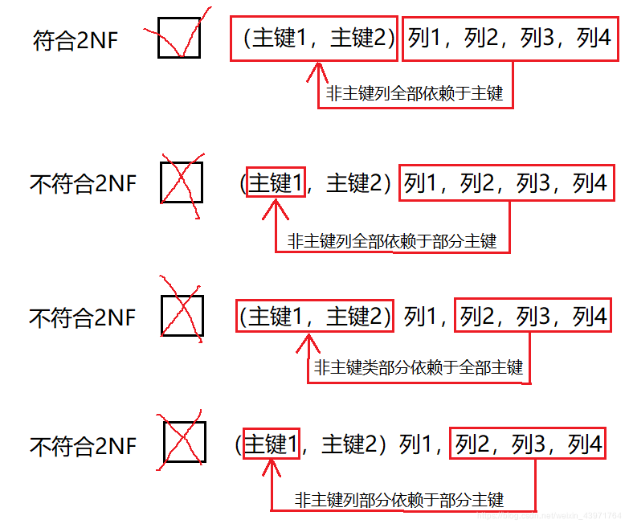
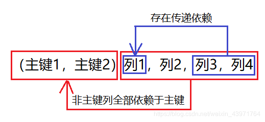
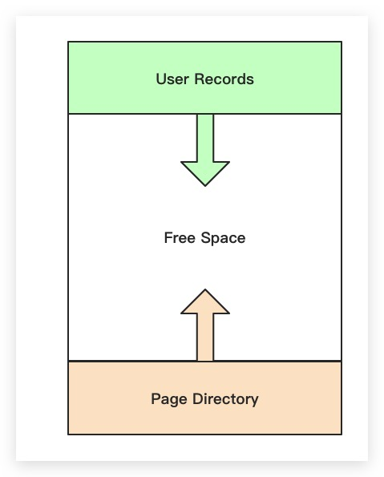
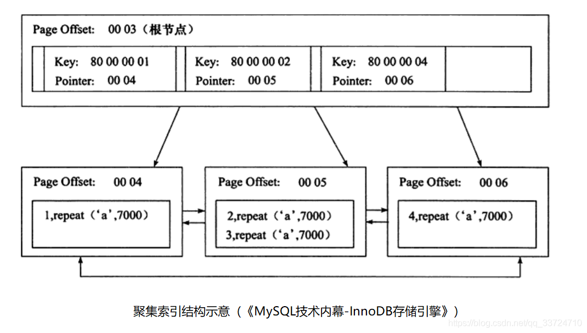
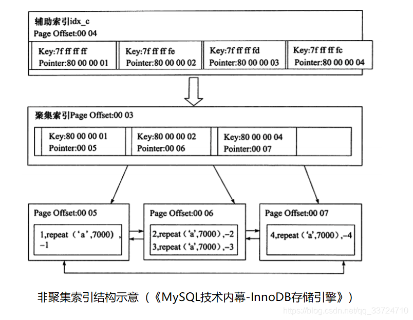
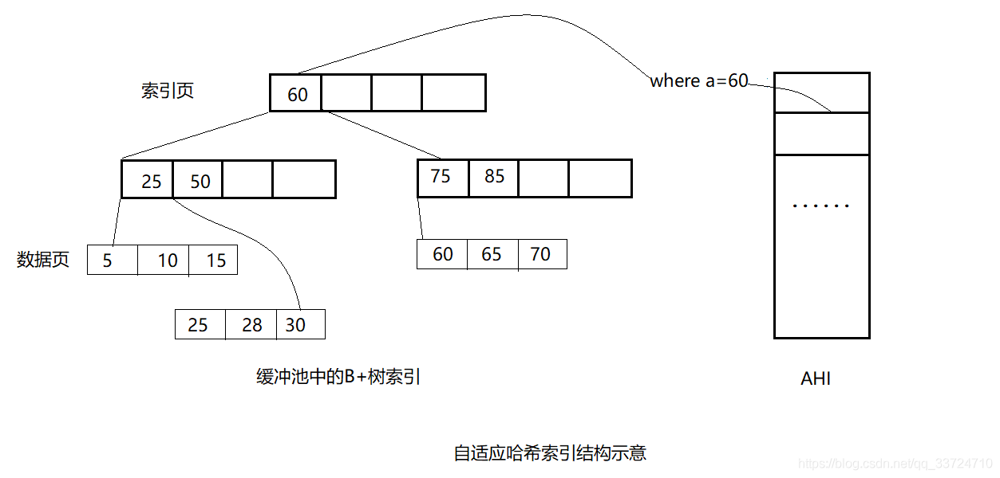

<div style="color:#16b0ff;font-size:50px;font-weight: 900;text-shadow: 5px 5px 10px var(--theme-color);font-family: 'Comic Sans MS';">Database</div>

<span style="color:#16b0ff;font-size:20px;font-weight: 900;font-family: 'Comic Sans MS';">Introduction</span>：收纳技术相关的数据库知识 `事务`、`索引`、`锁`、`SQL优化` 等总结！

[TOC]

# 数据库范式

## 第一范式(1NF)

**所有字段的值都是不可分解的原子值**。即实体中的某个属性有多个值时，必须拆分为不同的属性。例如：

**用户信息表**

| 编号 | 姓名 | 年龄 | 地址                         |
| ---- | ---- | ---- | ---------------------------- |
| 1    | 小王 | 23   | 浙江省杭州市拱墅区湖州街51号 |

当实际需求对地址没有特定的要求下，这个用户信息表的每一列都是不可分割的。但是当实际需求对省份或者城市有特别要求时，这个用户信息表中的地址就是可以分割的，改为：

**用户信息表**

| 编号 | 姓名 | 年龄 | 省份   | 城市   | 区县   | 详细地址   |
| ---- | ---- | ---- | ------ | ------ | ------ | ---------- |
| 1    | 小王 | 23   | 浙江省 | 杭州市 | 拱墅区 | 湖州街51号 |

**好处**

- 表结构相对清晰
- 易于查询


## 第二范式(2NF)

**所有非主键列必须全部依赖于全部主键**。符合与不符合的场景如下：



案例如下：

**学生课程表**

| 学生编号 | 课程编号 | 学生名称 | 课程名称   | 所在班级  | 班主任 |
| -------- | -------- | -------- | ---------- | --------- | ------ |
| S1       | C1       | 小王     | 计算机导论 | 计算机3班 | 陈老师 |
| S1       | C2       | 小王     | 数据结构   | 计算机3班 | 陈老师 |
| S2       | C1       | 小马     | 计算机导论 | 软件1班   | 李老师 |

将学生编号和课程编号作为主键，能确定唯一一条数据，但是学生名称只跟学生编号有关，跟课程编号无关，即不满足完全函数依赖，改为：

**学生表**

| 学生编号 | 学生名称 | 所在班级  | 班主任 |
| -------- | -------- | --------- | ------ |
| S1       | 小王     | 计算机3班 | 陈老师 |
| S2       | 小马     | 软件1班   | 李老师 |

**课程表**

| 课程编号 | 课程名称   |
| -------- | ---------- |
| C1       | 计算机导论 |
| C2       | 数据结构   |

**学生课程关系表**

| 学生编号 | 课程编号 |
| -------- | -------- |
| S1       | C1       |
| S1       | C2       |
| S2       | C1       |

**好处**

- 相对节约空间，当学生表和课程表属性越多，效果越明显
- 解决插入异常，当新增一门课程时，原表因为没有学生选课，导致无法插入数据
- 解决更新繁琐，当更改一门课程名称时，原表要更改多条数据
- 解决删除异常，当学生学完一门课，原表若要清空学生上课信息，课程编号与课程名称的关系可能会丢失


## 第三范式(3NF)

**在满足1NF和2NF的前提下，非主键列之间不存在间接依赖关系**（消除传递函数依赖）。



案例如下：

**学生表**

| 学生编号 | 学生名称 | 班级编号 | 班级名字  |
| -------- | -------- | -------- | --------- |
| S1       | 小王     | 001      | 计算机1班 |
| S2       | 小马     | 003      | 计算机3班 |

学生编号作为主键满足第二范式（2NF）。通过学生编号 ⇒⇒ 班级编号 ⇒⇒ 班级名字，所以班级编号和班级名字之间存在依赖关系，改为：

**学生表**

| 学生编号 | 学生名称 | 班级编号 |
| -------- | -------- | -------- |
| S1       | 小王     | 001      |
| S2       | 小马     | 003      |

**班级表**

| 班级编号 | 班级名称  |
| -------- | --------- |
| 001      | 计算机1班 |
| 003      | 计算机3班 |

**好处**

- 相对节约空间
- 解决更新繁琐
- 解决插入异常，当班级分配了老师，还没分配学生的时候，原表将不可插入数据
- 解决删除异常，当学生毕业后，若要清空学生信息，班级和老师的关系可能会丢失


## 巴斯-科德范式（BCNF）

在3NF基础上，**主属性之间不存在部分或传递依赖**。例如：

**配件表**

| 仓库号 | 配件号 | 职工号 | 配件数量 |
| ------ | ------ | ------ | -------- |
| W1     | P1     | E1     | 10       |
| W1     | P2     | E1     | 10       |
| W2     | P1     | E2     | 20       |

有以下约束：

- 一个仓库有多个职工
- 一个职工只在一个仓库
- 一种配件可以放多个仓库
- 一个仓库，一个职工管理多个配件，一种配件由唯一一个职工管理

由此，将（仓库号，配件号）作为主键，满足 3NF，但是（仓库号，配件号）⇒⇒ 职工号 ⇒⇒ 仓库号，造成传递函数依赖，改为：

**仓库表**

| 仓库号 | 职工号 |
| ------ | ------ |
| W1     | E1     |
| W2     | E2     |

**工作表**

| 职工号 | 配件号 | 配件数量 |
| ------ | ------ | -------- |
| E1     | P1     | 10       |
| E1     | P2     | 10       |
| E2     | P1     | 20       |

**好处**

- 解决一些冗余和一些异常情况

**不足**

- 丢失一些函数依赖，如丢失（仓库号，配件号）⇒⇒ 职工号，无法通过单表来确定一个职工号


## 第四范式（4NF）

在BCNF基础上，**需要消除多对多关系**。

例如：

**客户联系方式**

| 客户编号 | 固定电话 | 移动电话 |
| -------- | -------- | -------- |
| 10       | 88-123   | 151      |
| 10       | 80-123   | 183      |

一个用户拥有多个固定电话和移动电话，给表的维护带来很多麻烦。比如增加一个固定电话，那么移动电话这一栏就较难维护，改为：

**客户电话表**

| 客户编号 | 电话号码 | 电话类型 |
| -------- | -------- | -------- |
| 10       | 88-123   | 固定电话 |
| 10       | 80-123   | 固定电话 |
| 10       | 151      | 移动电话 |
| 10       | 183      | 移动电话 |

**好处**

- 解决一些异常，使表结构更加合理


## 第五范式（5NF）

在关系模式 R 中，每一个`连接依赖`均有 R 的`候选码`所隐含。即连接时，所连接的属性都是候选码，例如：

**销售表**

| 销售人员 | 供应商 | 产品 |
| -------- | ------ | ---- |
| S1       | V1     | P1   |
| S2       | V2     | P2   |
| S1       | V1     | P1   |
| S2       | V2     | P2   |

要想找到某一条数据，必须以（销售人员，供应商，产品）为主键，改为：

**销售人员_供应商表**

| 销售人员 | 供应商 |
| -------- | ------ |
| S1       | V1     |
| S2       | V2     |

**销售人员_产品表**

| 销售人员 | 产品 |
| -------- | ---- |
| S1       | P1   |
| S2       | P2   |

**供应商_产品表**

| 供应商 | 产品 |
| ------ | ---- |
| V1     | P1   |
| V2     | P2   |

**好处**

- 解决某些异常操作


# 连接方式

## 内连接（INNER JOIN）

INNER JOIN 一般被译作内连接。内连接查询能将左表（表 A）和右表（表 B）中能关联起来的数据连接后返回。

**文氏图**

.png)

**示例查询**

```mysql
SELECT A.PK AS A_PK, B.PK AS B_PK,A.Value AS A_Value, B.Value AS B_Value
FROM Table_A A
INNER JOIN Table_B B
ON A.PK = B.PK;
```

**查询结果**

```mysql
+------+------+---------+---------+
| A_PK | B_PK | A_Value | B_Value |
+------+------+---------+---------+
|    1 |    1 | both ab | both ab |
+------+------+---------+---------+
1 row in set (0.00 sec)
```

**注意**：其中A为Table_A的别名，B为Table_B的别名，下同。


## 左连接（LEFT JOIN）

LEFT JOIN 一般被译作左连接，也写作 LEFT OUTER JOIN。左连接查询会返回左表（表 A）中所有记录，不管右表（表 B）中有没有关联的数据。在右表中找到的关联数据列也会被一起返回。

**文氏图**

.png)

**示例查询**

```mysql
SELECT A.PK AS A_PK, B.PK AS B_PK,A.Value AS A_Value, B.Value AS B_Value
FROM Table_A A
LEFT JOIN Table_B B
ON A.PK = B.PK;
```

**查询结果**

```mysql
+------+------+---------+---------+
| A_PK | B_PK | A_Value | B_Value |
+------+------+---------+---------+
|    1 |    1 | both ab | both ba |
|    2 | NULL | only a  | NULL    |
+------+------+---------+---------+
2 rows in set (0.00 sec)
```


## 右连接（RIGHT JOIN）

RIGHT JOIN 一般被译作右连接，也写作 RIGHT OUTER JOIN。右连接查询会返回右表（表 B）中所有记录，不管左表（表 A）中有没有关联的数据。在左表中找到的关联数据列也会被一起返回。

**文氏图**

.png)

**示例查询**

```mysql
SELECT A.PK AS A_PK, B.PK AS B_PK,A.Value AS A_Value, B.Value AS B_Value
FROM Table_A A
RIGHT JOIN Table_B B
ON A.PK = B.PK;
```

**查询结果**

```mysql
+------+------+---------+---------+
| A_PK | B_PK | A_Value | B_Value |
+------+------+---------+---------+
|    1 |    1 | both ab | both ba |
| NULL |    3 | NULL    | only b  |
+------+------+---------+---------+
2 rows in set (0.00 sec)
```


## 全连接（FULL JOIN）

FULL JOIN 一般被译作外连接、全连接，实际查询语句中可以写作 FULL OUTER JOIN 或 FULL JOIN。外连接查询能返回左右表里的所有记录，其中左右表里能关联起来的记录被连接后返回。（**MySQL不支持FULL OUTER JOIN**）

**文氏图**

.png)

**示例查询**

```mysql
SELECT A.PK AS A_PK, B.PK AS B_PK,A.Value AS A_Value, B.Value AS B_Value
FROM Table_A A
FULL OUTER JOIN Table_B B
ON A.PK = B.PK;
```

**查询结果**

```mysql
ERROR 1064 (42000): You have an error in your SQL syntax; check the manual that corresponds to your MySQL server version for the right syntax to use near 'FULL OUTER JOIN Table_B B
ON A.PK = B.PK' at line 4
```

注意：我当前示例使用的 MySQL 不支持FULL OUTER JOIN。应当返回的结果（使用UNION模拟）：

```mysql
mysql> SELECT * 
    -> FROM Table_A
    -> LEFT JOIN Table_B 
    -> ON Table_A.PK = Table_B.PK
    -> UNION ALL
    -> SELECT *
    -> FROM Table_A
    -> RIGHT JOIN Table_B 
    -> ON Table_A.PK = Table_B.PK
    -> WHERE Table_A.PK IS NULL;
+------+---------+------+---------+
| PK   | Value   | PK   | Value   |
+------+---------+------+---------+
|    1 | both ab |    1 | both ba |
|    2 | only a  | NULL | NULL    |
| NULL | NULL    |    3 | only b  |
+------+---------+------+---------+
3 rows in set (0.00 sec)
```

**SQL常见缩影**


## LEFT JOIN EXCLUDING INNER JOIN

**左连接后排除内连接**。返回左表有但右表没有关联数据的记录集。

**文氏图**


**示例查询**

```mysql
SELECT A.PK AS A_PK, B.PK AS B_PK,A.Value AS A_Value, B.Value AS B_Value
FROM Table_A A
LEFT JOIN Table_B B
ON A.PK = B.PK
WHERE B.PK IS NULL;
```

**查询结果**

```mysql
+------+------+---------+---------+
| A_PK | B_PK | A_Value | B_Value |
+------+------+---------+---------+
|    2 | NULL | only a  | NULL    |
+------+------+---------+---------+
1 row in set (0.01 sec)
```


## RIGHT JOIN EXCLUDING INNER JOIN

**右连接后排除内连接**。返回右表有但左表没有关联数据的记录集。

**文氏图**


**示例查询**

```mysql
SELECT A.PK AS A_PK, B.PK AS B_PK,A.Value AS A_Value, B.Value AS B_Value
FROM Table_A A
RIGHT JOIN Table_B B
ON A.PK = B.PK
WHERE A.PK IS NULL;
```

**查询结果**

```mysql
+------+------+---------+---------+
| A_PK | B_PK | A_Value | B_Value |
+------+------+---------+---------+
| NULL |    3 | NULL    | only b  |
+------+------+---------+---------+
1 row in set (0.00 sec)
```


## FULL JOIN EXCLUDING INNER JOIN

**全连接后排除内连接**。返回左表和右表里没有相互关联的记录集。

**文氏图**


**示例查询**

```mysql
SELECT A.PK AS A_PK, B.PK AS B_PK,A.Value AS A_Value, B.Value AS B_Value
FROM Table_A A
FULL OUTER JOIN Table_B B
ON A.PK = B.PK
WHERE A.PK IS NULL
OR B.PK IS NULL;
```

因为使用到了 FULL OUTER JOIN，MySQL 在执行该查询时再次报错。

```mysql
ERROR 1064 (42000): You have an error in your SQL syntax; check the manual that corresponds to your MySQL server version for the right syntax to use near 'FULL OUTER JOIN Table_B B
ON A.PK = B.PK
WHERE A.PK IS NULL
OR B.PK IS NULL' at line 4
```

应当返回的结果（用 UNION 模拟）：

```mysql
mysql> SELECT * 
    -> FROM Table_A
    -> LEFT JOIN Table_B
    -> ON Table_A.PK = Table_B.PK
    -> WHERE Table_B.PK IS NULL
    -> UNION ALL
    -> SELECT *
    -> FROM Table_A
    -> RIGHT JOIN Table_B
    -> ON Table_A.PK = Table_B.PK
    -> WHERE Table_A.PK IS NULL;
+------+--------+------+--------+
| PK   | Value  | PK   | Value  |
+------+--------+------+--------+
|    2 | only a | NULL | NULL   |
| NULL | NULL   |    3 | only b |
+------+--------+------+--------+
2 rows in set (0.00 sec)
```

**SQL所有JOIN**


## CROSS JOIN

返回左表与右表之间符合条件的记录的迪卡尔集。

**图示**


**示例查询**

```mysql
SELECT A.PK AS A_PK, B.PK AS B_PK,A.Value AS A_Value, B.Value AS B_Value
FROM Table_A A
CROSS JOIN Table_B B;
```

**查询结果**

```mysql
+------+------+---------+---------+
| A_PK | B_PK | A_Value | B_Value |
+------+------+---------+---------+
|    1 |    1 | both ab | both ba |
|    2 |    1 | only a  | both ba |
|    1 |    3 | both ab | only b  |
|    2 |    3 | only a  | only b  |
+------+------+---------+---------+
4 rows in set (0.00 sec)
```

上面讲过的几种 JOIN 查询的结果都可以用 CROSS JOIN 加条件模拟出来，比如 INNER JOIN 对应 CROSS JOIN ... WHERE A.PK = B.PK。


## SELF JOIN

返回表与自己连接后符合条件的记录，一般用在表里有一个字段是用主键作为外键的情况。比如 Table_C 的结构与数据如下：

```mysql
+--------+----------+-------------+
| EMP_ID | EMP_NAME | EMP_SUPV_ID |
+--------+----------+-------------+
|   1001 | Ma       |        NULL |
|   1002 | Zhuang   |        1001 |
+--------+----------+-------------+
2 rows in set (0.00 sec)
```

EMP_ID 字段表示员工 ID，EMP_NAME 字段表示员工姓名，EMP_SUPV_ID 表示主管 ID。


**示例查询**

现在我们想查询所有有主管的员工及其对应的主管 ID 和姓名，就可以用 SELF JOIN 来实现。

```mysql
SELECT A.EMP_ID AS EMP_ID, A.EMP_NAME AS EMP_NAME, 
    B.EMP_ID AS EMP_SUPV_ID, B.EMP_NAME AS EMP_SUPV_NAME
FROM Table_C A, Table_C B
WHERE A.EMP_SUPV_ID = B.EMP_ID;
```

**查询结果**

```mysql
+--------+----------+-------------+---------------+
| EMP_ID | EMP_NAME | EMP_SUPV_ID | EMP_SUPV_NAME |
+--------+----------+-------------+---------------+
|   1002 | Zhuang   |        1001 | Ma            |
+--------+----------+-------------+---------------+
1 row in set (0.00 sec)
```

**补充说明**

- 文中的图使用 Keynote 绘制
- 个人的体会是 SQL 里的 JOIN 查询与数学里的求交集、并集等很像；SQLite 不支持 RIGHT JOIN 和 FULL OUTER JOIN，可以使用 LEFT JOIN 和 UNION 来达到相同的效果
- MySQL 不支持 FULL OUTER JOIN，可以使用 LEFT JOIN 和 UNION 来达到相同的效果


# 数据库锁

数据库锁可以按粒度、加锁算法、加锁策略、兼容性和其它等方面进行分类：

- **锁粒度**
  - **行锁**
    - 锁的是 `某⾏数据` 或 `⾏之间的间隙`。由某些**存储引擎**实现，如InnoDB
    - 开销大，加锁慢；会出现死锁；锁定粒度小，发生锁冲突的概率低，并发度高
  - **表锁**
    - 锁的是某个 `table`。由MySQL的**SQL layer**层实现的
    - 开销小，加锁快；不会出现死锁；锁定力度大，发生锁冲突概率高，并发度最低
  - **页锁**
    - 开销和加锁速度介于表锁和行锁之间；会出现死锁；锁定粒度介于表锁和行锁之间，并发度一般
  - **全局锁**
    - 锁的是整个 `database`。由MySQL的**SQL layer**层实现的

- **加锁算法**
  - **Record Lock（记录锁）**
  - **Gap Lock（间隙锁）**
  - **Next-Key Lock（临键锁）**


- **加锁策略**
  - **悲观锁**
  - **乐观锁**

- **兼容性**
  - **排它锁**
  - **共享锁**
  - **意向锁**

- **其它锁**
  - **自增锁（AUTO-INC锁）**


根据不同的存储引擎，MySQL中锁的特性可以大致归纳如下：

| 存储引擎 | 行锁 | 表锁 | 页锁 |
| -------- | ---- | ---- | ---- |
| InnoDB   | √    | √    |      |
| MyISAM   |      | √    |      |
| BDB      | √    | √    | √    |

在 InnoDB 存储引擎中：

- `SELECT` 操作的不可重复读问题通过 `MVCC` 得到了解决
- `UPDATE`、`DELETE` 的不可重复读问题通过 `Record Lock` (记录锁)解决
- `INSERT` 的不可重复读问题是通过 `Next-Key Lock` (临键锁)解决


## 全局锁(Global-Level)

**全局锁就是对整个数据库实例加锁**。MySQL 提供了一个加全局读锁的方法，命令是`Flush tables with read lock (FTWRL)`。 当你需要让整个库处于只读状态的时候，可以使用这个命令，之后其他线程的以下语句会被阻塞：

- **数据更新语句**（数据的增删改）
- **数据定义语句**（包括建表、修改表结构等）
- **更新类事务的提交语句**


**使用场景**

- 典型使用场景是做**全库逻辑备份（mysqldump）** 

**数据库只读状态的危险性**

- 如果你在主库上备份，那么在备份期间都不能执行更新，业务基本上就能停止
- 如果你在从库上备份，那么备份期间从库不能执行主库同步过来的binlog，会导致主从延迟


全局锁两种方法：

- **FLUSH TABLES WRITE READ LOCK（`FTWRL`）**
- **set global readonly=true**

一般建议使用 `FTWRL` 方式，因为： 

- 有些系统中 readonly 的值会被用来做其它逻辑。如判断一个库是主库或备库。因此修改 global 变量的方式影响面更大
- 异常处理机制上有差异：
  - 如果执行`FTWRL`后由于客户端发生异常断开，则MySQL会自动释放这个全局锁，整个库回到可正常更新状态
  - 将库设置为`readonly`后，若客户端发生异常，则数据库会一直保持`readonly`状态，导致整库长时间处于不可写状态
  - readonly 对super用户权限无效


### 全局读锁(FTWRL)

**为什么需要全局读锁(FTWRL)？**

当 `mysqldump` 使用参数 `--single-transaction` 的时候，导数据之前就会启动一个事务，来确保拿到一致性快照视图。而由于 MVCC 的支持，这个过程中数据是可以正常更新的。所以，**single-transaction 方法只适用于所有的表使用事务引擎的库**。如果有的表使用了不支持事务的引擎，那么备份就只能通过 FTWRL 方法。这往往是 DBA 要求业务开发人员使用 InnoDB 替代 MyISAM 的原因之一。


要使用全局锁，则要执行这条命：

```sql
flush tables with read lock
```

执行后，**整个数据库就处于只读状态了**，这时其他线程执行以下操作，都会被阻塞：

- 对数据的增删查改操作，比如 insert、delete、update等语句；
- 对表结构的更改操作，比如 alter table、drop table 等语句。

如果要释放全局锁，则要执行这条命令：

```sql
unlock tables
```

当然，当会话断开了，全局锁会被自动释放。


### set global readonly=true


## 表级锁(Table-Level)

表级锁是MySQL中锁定粒度最大的一种锁，表示对当前操作的整张表加锁，它实现简单，资源消耗较少，被大部分MySQL引擎支持。最常使用的MyISAM与InnoDB都支持表级锁定。表级锁分为：

- **表共享读锁（共享锁）**
- **表独占写锁（排他锁）**

**特点：开销小、加锁快、不会出现死锁、发生锁冲突的概率最高、并发度也最低。**

### 表锁

**表锁除了会限制别的线程的读写外，也会限制本线程接下来的读写操作**。

如果我们想对学生表（t_student）加表锁，可以使用下面的命令：

```sql
-- 表级别的共享锁，也就是读锁
lock tables t_student read;
-- 表级别的独占锁，也就是写锁
lock tables t_stuent wirte;
```

不过尽量避免在使用 InnoDB 引擎的表使用表锁，因为表锁的颗粒度太大，会影响并发性能，**InnoDB 的优势在于实现了颗粒度更细的行级锁**。要释放表锁，可以使用下面这条命令，会释放当前会话的所有表锁：

```sql
unlock tables
```


### 元数据锁(MDL)

**MDL作用是防止DDL和DML并发的冲突，保证读写的正确性**。元数据锁是为了保证当用户对表执行 CRUD 操作时，防止其它线程对这个表结构做了变更。不需要显示的使用 MDL，因为当我们对数据库表进行操作时，会自动给这个表加上 MDL。

- 对一张表进行 CRUD 操作时，加的是 **MDL 读锁**

  当有线程在执行 select 语句（ 加 MDL 读锁）的期间，如果有其他线程要更改该表的结构（ 申请 MDL 写锁），那么将会被阻塞，直到执行完 select 语句（ 释放 MDL 读锁）。

- 对一张表做结构变更操作的时候，加的是 **MDL 写锁**

  当有线程对表结构进行变更（ 加 MDL 写锁）的期间，如果有其他线程执行了 CRUD 操作（ 申请 MDL 读锁），那么就会被阻塞，直到表结构变更完成（ 释放 MDL 写锁）。


MDL 是在事务提交后才会释放，这意味着**事务执行期间，MDL是一直持有的**。申请 MDL 锁的操作会形成一个队列，队列中**写锁获取优先级高于读锁**，一旦出现 MDL 写锁等待，会阻塞后续该表的所有 CRUD 操作。


### 意向锁(Intention Lock)

**意向锁是表级锁，是InnoDB主动加的，不需要手动处理。其目的是为了快速判断表里是否有记录被加锁。**

- 如果没有**意向锁**，那么加**独占表锁**时，就需要遍历表里所有记录，查看是否有记录存在独占锁，这样效率会很慢
- 如果有了**意向锁**，在对记录加独占锁前，先会加上表级的意向独占锁，那么在加**独占表锁**时，直接查该表是否有意向独占锁，如果有就意味着表里已经有记录被加了独占锁，这样就不用去遍历表里的记录

对于insert、update、delete，InnoDB会自动给涉及的数据加排他锁（X）；对于一般的Select语句，InnoDB不会加任何锁，事务可以通过以下语句给显示加共享锁或排他锁。

- 共享锁：`SELECT ... LOCK IN SHARE MODE;`
- 排他锁：`SELECT ... FOR UPDATE;`


#### 意向共享锁（Intention Shared Lock）

**意向共享锁（IS锁）是指当事务准备在某行记录上加共享锁（S锁）时，需要先在表级别加一个IS锁。**

**作用**：通知数据库接下来需要施加什么锁并对表加锁。如果需要对记录A加共享锁，那么此时innodb会先找到这张表，对该表加意向共享锁之后，再对记录A添加共享锁。


#### 意向排他锁（Intention Exclusive Lock）

**意向排他锁（IX锁）是指当事务准备在某行记录上加排他锁（X锁）时，需要先在表级别加一个IX锁**

**作用**：通知数据库接下来需要施加什么锁并对表加锁。如果需要对记录A加排他锁，那么此时innodb会先找到这张表，对该表加意向排他锁之后，再对记录A添加排他锁。


### AUTO-INC锁(自增长锁)

在为某个字段声明 `AUTO_INCREMENT` 属性时，之后可以在插入数据时，可以不指定该字段的值，数据库会自动给该字段赋值递增的值，这主要是通过 `AUTO-INC` 锁实现的。

`AUTO-INC` 锁是特殊的表锁机制，锁**不是在一个事务提交后才释放，而是在执行完插入语句后就会立即释放**。**在插入数据时，会加一个表级别的 `AUTO-INC` 锁**，然后为被 `AUTO_INCREMENT` 修饰的字段赋值递增的值，等插入语句执行完成后，才会把 `AUTO-INC` 锁释放掉。

`AUTO-INC` 锁在对大量数据进行插入的时候，会影响插入性能，因为另一个事务中的插入会被阻塞。因此， 在 MySQL 5.1.22 版本开始，InnoDB 存储引擎提供了一种**轻量级的锁**来实现自增。一样也是在插入数据的时候，会为被 `AUTO_INCREMENT` 修饰的字段加上轻量级锁，**然后给该字段赋值一个自增的值，就把这个轻量级锁释放了，而不需要等待整个插入语句执行完后才释放锁**。

InnoDB 存储引擎提供了个`innodb_autoinc_lock_mode`的系统变量，是用来控制选择用 `AUTO-INC` 锁，还是**轻量级**的锁。

- innodb_autoinc_lock_mode=0：**采用`AUTO-INC`锁**
- innodb_autoinc_lock_mode=2：**采用轻量级锁**。性能最高，但自增长值可能不是连续的，在主从复制场景中是不安全的
- innodb_autoinc_lock_mode=1：默认值，两种锁混着用
  - 如果能够确定插入记录的数量就采用**轻量级**锁
  - 不确定时就采用 `AUTO-INC` 锁


## 页级锁(Page-Level)

页级锁是 MySQL 中锁定粒度介于行级锁和表级锁中间的一种锁。表级锁速度快，但冲突多，行级冲突少，但速度慢。因此，采取了折中的页级锁，**一次锁定相邻的一组记录**。BDB 支持页级锁。

**特点：开销和加锁时间界于表锁和行锁之间、会出现死锁、锁定粒度界于表锁和行锁之间、并发度一般。**


## 行级锁(Row-Level)

行级锁是MySQL中锁定粒度最细的一种锁。表示只针对当前操作的行进行加锁。行级锁能大大减少数据库操作的冲突，其加锁粒度最小，但加锁的开销也最大。行级锁分为：

- **共享锁**
- **排他锁**

**特点：开销大、加锁慢、会出现死锁、发生锁冲突的概率最低、并发度也最高。**


在 `InnoDB` 事务中，行锁通过给索引上的**索引项加锁**来实现。只有通过索引条件检索数据，才使用行级锁，否则将使用表锁。行级锁定同样分为两种类型：`共享锁` 和 `排他锁`，以及加锁前需要先获得的 `意向共享锁` 和 `意向排他锁`。行锁是在需要的时候才加上的，但并不是不需要了就立刻释放，而是要等到事务结束时才释放。这个就是**两阶段锁协议**。

行锁实现算法(**3种锁都是排它锁(X锁)**)：

- **Record Lock(记录锁)**
- **Gap Lock(间隙锁)**
- **Next-Key Lock(临键锁)**


### 属性锁

按照锁的共享策略来分：

- **共享锁（S锁，Shared Locks）**
- **排它锁（X锁，Exclusive Locks）**

| 请求锁模式是否兼容当前锁模式 | X锁    | IX锁   | S锁    | IS锁   |
| ---------------------------- | ------ | ------ | ------ | ------ |
| X锁                          | `冲突` | `冲突` | `冲突` | `冲突` |
| IX锁                         | `冲突` | 兼容   | `冲突` | 兼容   |
| S锁                          | `冲突` | `冲突` | 兼容   | 兼容   |
| IS锁                         | `冲突` | 兼容   | 兼容   | 兼容   |

若一个事务请求锁模式与当前锁兼容，InnoDB就将请求锁授予该事务；反之，两者不兼容，该事务就要等待锁释放。

#### 共享锁(Shared Locks)

**共享锁（ `S锁 ` 或 `读锁`）是指针对同一份数据，多个读操作可以同时进行而不会互相影响。**若事务T对数据对象A加上**S锁**，则事务T只能读A；其它事务只能再对A加**S锁**，而不能加X锁，直到T释放A上的S锁。加锁方式：

- `select ... lock in share mode`

**注意**：

- 共享锁都是行锁


#### 排它锁(Exclusive Locks)

**排它锁（ `X锁` 或 `写锁`）是指当前写操作没有完成前，它会阻断其它写锁和读锁。**若事务T对数据对象A加上X锁，则只允许T读取和修改A，其它事务都不能再对A加任何类型的锁，直到T释放A上的锁。加锁方式：

- `insert`
- `update`
- `delete`
- `select ... for update`

**注意**

- 在更新操作(INSERT、UPDATE 或 DELETE)过程中始终应用排它锁

- 排它锁可以是**行锁**也可以是**表锁**

  ```sql
  -- 当username是主键时，锁定的是行锁；当username不是主键时，是表锁
  SELECT count(*) as total FROM test WHERE username = "zhangsan" FOR UPDATE
  ```


### 锁实现方式

#### Record Lock(记录锁)

**为单个行记录上的锁，总是会去锁住索引记录**。

```sql
-- id 列为主键列或唯一索引列
SELECT * FROM t_user WHERE id = 1 FOR UPDATE;
```

id 为 1 的记录行会被锁住。需要注意：

- `id` 列必须为`唯一索引列`或`主键列`，否则上述语句加的锁就会变成`临键锁`
- 同时查询语句必须为`精准匹配`（`=`），不能为 `>`、`<`、`like`等，否则也会退化成`临键锁`

也可以在通过 `主键索引` 与 `唯一索引` 对数据行进行 UPDATE 操作时，也会对该行数据加`记录锁`：

```sql
-- id 列为主键列或唯一索引列
UPDATE t_user SET age = 50 WHERE id = 1;
```

**注意**：在MySQL中，**行级锁**并不是直接锁记录，而是**锁索引**。索引分为**主键索引**和**非主键索引**两种：

- 如果一条sql语句操作了**主键索引**，MySQL就会**锁定这条主键索引**
- 如果一条语句操作了**非主键索引**，MySQL会**先锁定该非主键索引**，**再锁定相关的主键索引**


#### Gap Lock(间隙锁)

间隙锁，想一下幻读的原因，其实就是行锁只能锁住行，但新插入记录这个动作，要更新的是记录之间的“间隙”。**所以加入间隙锁来解决幻读。**

**间隙锁**基于`非唯一索引`，它`锁定一段范围内的索引记录`。**间隙锁**基于下面将会提到的`Next-Key Locking` 算法，请务必牢记：**使用间隙锁锁住的是一个区间，而不仅仅是这个区间中的每一条数据**。

```sql
SELECT * FROM t_user WHERE id BETWEN 1 AND 10 FOR UPDATE;
-- 或
SELECT * FROM t_user WHERE id > 1 AND id < 10 FOR UPDATE;
```

即所有在`（1，10）`区间内的记录行都会被锁住，所有id 为 2、3、4、5、6、7、8、9 的数据行的插入会被阻塞，但是 1 和 10 两条记录行并不会被锁住。除了手动加锁外，在执行完某些 `SQL`后，`InnoDB`也会自动加**间隙锁**。

**幻读原因**：因为行锁只能锁住行，但新插入记录这个动作，要更新的是记录之间的“`间隙`”。所以加入间隙锁来解决幻读。


**间隙锁的目的**

1. 防止幻读，以满足相关隔离级别的要求
2. 满足恢复和复制的需要

**产生间隙锁的条件（RR事务隔离级别下）**

1. 使用普通索引锁定
2. 使用多列唯一索引
3. 使用唯一索引锁定多行记录


#### Next-Key Lock(临键锁)

**Next-Key Lock(Record Lock + Gap Lock)锁定的是一个范围，并且锁定记录本身，MySql 防止幻读就是使用此锁实现。**

临键锁是一种特殊的**间隙锁**，也可以理解为一种特殊的**算法**。通过**临建锁**可以解决`幻读`的问题。每个数据行上的`非唯一索引列`上都会存在一把**临键锁**，当某个事务持有该数据行的**临键锁**时，会锁住一段**左开右闭区间**的数据。需要强调的一点是，`InnoDB` 中`行级锁`是基于索引实现的，**临键锁**只与`非唯一索引列`有关，在`唯一索引列`（包括`主键列`）上不存在**临键锁**。

比如：表信息 `t_user(id PK, age KEY, name)`


该表中 `age` 列潜在的`临键锁`有：


在`事务 A` 中执行如下命令：

```sql
-- 根据非唯一索引列 UPDATE 某条记录
UPDATE t_user SET name = Vladimir WHERE age = 24;
-- 或根据非唯一索引列 锁住某条记录
SELECT * FROM t_user WHERE age = 24 FOR UPDATE;
```

不管执行了上述 `SQL` 中的哪一句，之后如果在`事务 B` 中执行以下命令，则该命令会被阻塞：

```sql
INSERT INTO t_user VALUES(100, 26, 'tian');
```

很明显，`事务 A` 在对 `age` 为 24 的列进行 UPDATE 操作的同时，也获取了 `(24, 32]` 这个区间内的临键锁。

不仅如此，在执行以下 SQL 时，也会陷入阻塞等待：

```sql
INSERT INTO table VALUES(100, 30, 'zhang');
```

那最终我们就可以得知，在根据`非唯一索引` 对记录行进行 `UPDATE`、`FOR UPDATE`、`LOCK IN SHARE MODE` 操作时，InnoDB 会获取该记录行的 `临键锁` ，并同时获取该记录行下一个区间的`间隙锁`。即`事务 A`在执行了上述的 SQL 后，最终被锁住的记录区间为 `(10, 32)`。


## 加锁机制

### 乐观锁(Optimistic Lock)

乐观锁的特点先进行业务操作，不到万不得已不去拿锁。即“乐观”的认为拿锁多半是会成功的，因此在进行完业务操作需要实际更新数据的最后一步再去拿一下锁就好。

乐观锁在数据库上的实现完全是逻辑的，不需要数据库提供特殊的支持。一般的做法是在需要锁的数据上增加一个版本号或时间戳。乐观锁的两种实现方式：

- **使用数据版本（version）记录对比机制**

  当读取数据时，将version字段的值一同读出，数据每更新一次，对此version值加一。

- **使用时间戳（timestamp）记录对比机制**

  在更新提交时检查当前数据库中数据的时间戳和自己更新前取到的时间戳进行对比，一致则OK，否则为版本冲突。


### 悲观锁(Pessimistic Lock)

悲观锁（**一锁二查三更新**）的特点是先获取锁，再进行业务操作，即“悲观”的认为获取锁是非常有可能失败的，因此要先确保获取锁成功再进行业务操作。**在数据库上的悲观锁需要数据库本身提供支持，即通过常用的 `select … for update` 操作来实现悲观锁。**

MySQL还有个问题是 `select... for update` 语句执行中，如果数据表没有添加索引或主键，所有扫描过的行都会被锁上，这一点很容易造成问题。因此如果在MySQL中用悲观锁务必要确定走了索引，而不是全表扫描。


## 锁问题

### 死锁

**MyISAM中是不会产生死锁的，因为MyISAM总是一次性获得所需的全部锁，要么全部满足，要么全部等待。而在InnoDB中，锁是逐步获得的，就造成了死锁的可能。**

当两个及以上的事务，双方都在等待对方释放已经持有的锁或因为加锁顺序不一致造成循环等待锁资源，就会出现“死锁”。常见的报错信息为 ” `Deadlock found when trying to get lock...`”。

#### 避免死锁

三种常见的避免死锁方式：

- 如果不同程序会并发存取多个表，尽量**约定以相同的顺序访问表**，可以大大降低死锁机会
- 在同一个事务中，尽可能做到**一次锁定所需要的所有资源**，减少死锁产生概率
- 对于非常容易产生死锁的业务部分，可以尝试使用**升级锁定颗粒度**，通过表级锁定来减少死锁产生的概率


#### 预防死锁

- `innodb_lock_wait_timeout` **等待锁超时回滚事务**

  直观方法是在两个事务相互等待时，当一个等待时间超过设置的某一阀值时，对其中一个事务进行回滚，另一个事务就能继续执行。

- `wait-for graph`**算法来主动进行死锁检测**

  每当加锁请求无法立即满足需要并进入等待时，wait-for graph算法都会被触发。wait-for graph要求数据库保存以下两种信息：
  - 锁的信息链表
  - 事务等待链表


#### 解决死锁

- **等待事务超时，主动回滚**
- **进行死锁检查，主动回滚某条事务，让别的事务能继续走下去**

下面提供一种方法，解决死锁的状态:

```sql
-- 查看正在被锁的事务
SELECT * FROM INFORMATION_SCHEMA.INNODB_TRX;
```


```sql
--上图trx_mysql_thread_id列的值
kill trx_mysql_thread_id;
```


### 脏读

**脏读指的是不同事务下，当前事务可以读取到另外事务未提交的数据**。

例如：T1 修改一个数据，T2 随后读取这个数据。如果 T1 撤销了这次修改，那么 T2 读取的数据是脏数据。


### 不可重复读

**不可重复读指的是同一事务内多次读取同一数据集合，读取到的数据是不一样的情况**。

例如：T2 读取一个数据，T1 对该数据做了修改。如果 T2 再次读取这个数据，此时读取的结果和第一次读取的结果不同。


在 InnoDB 存储引擎中：

- `SELECT`：操作的不可重复读问题通过 MVCC 得到了解决的
- `UPDATE/DELETE`：操作的不可重复读问题是通过 Record Lock 解决的
- `INSERT`：操作的不可重复读问题是通过 Next-Key Lock（Record Lock + Gap Lock）解决的


### 幻读

**幻读是指在同一事务下，连续执行两次同样的 sql 语句可能返回不同的结果，第二次的 sql 语句可能会返回之前不存在的行**。幻影读是一种特殊的不可重复读问题。


### 丢失更新

**一个事务的更新操作会被另一个事务的更新操作所覆盖**。

例如：T1 和 T2 两个事务都对一个数据进行修改，T1 先修改，T2 随后修改，T2 的修改覆盖了 T1 的修改。


这类型问题可以通过给 SELECT 操作加上排他锁来解决，不过这可能会引入性能问题，具体使用要视业务场景而定。


# 数据库事务

**什么叫事务?**

事务是一系列对系统中数据进行访问与更新的操作组成的一个程序逻辑单元。即不可分割的许多基础数据库操作。

## 事务特性(ACID)

### 原子性(Atomicity)

**原子性是指一个事务（事务是最小的执行单位）是一个不可分割的工作单元，其中的操作要么都做，要么都不做**。如果事务中一个sql语句执行失败，则已执行的语句也必须回滚，数据库退回到事务前的状态。


**实现原理**

**① 回滚日志（undo log）**

InnoDB实现回滚靠的是undo log。当事务对数据库进行修改时，InnoDB会生成对应的undo log。如果事务执行失败或调用了rollback，导致事务需要回滚，便可利用undo log中的信息将数据回滚到修改前。

- 对于每个`insert`，回滚时会执行`delete`
- 对于每个 `delete`，回滚时会执行`insert`
- 对于每个 `update`，回滚时会执行一个相反的 `update`，把数据改回去


### 一致性(Consistency)

**一致性是指事务执行结束后，数据库的完整性约束没有被破坏，事务执行的前后都是合法的数据状态。**

数据库的完整性约束包括但不限于：实体完整性（如行的主键存在且唯一）、列完整性（如字段的类型、大小、长度要符合要求）、外键约束、用户自定义完整性（如转账前后，两个账户余额的和应该不变）。


**实现原理**

一致性是事务追求的最终目标。前面提到的**原子性、持久性和隔离性**，都是为了保证数据库状态的一致性。此外，除了数据库层面的保障，一致性的实现也需要应用层面进行保障。实现一致性的措施包括：

**① 保证原子性、持久性和隔离性**。如果这些特性无法保证，事务的一致性也无法保证

**② 数据库本身提供保障**。如不允许向整型列插入字符串值、字符串长度不能超过列的限制等

**③ 应用层面进行保障**。如转账操作只扣除转账者余额，而未增加接收者余额


### 隔离性(Isolation)

**隔离性是指事务内部的操作与其它事务是隔离的，并发执行的各个事务之间不能互相干扰。**严格的隔离性，对应了事务隔离级别中的Serializable (可串行化)，但实际应用中出于性能方面的考虑很少会使用可串行化。


**实现原理**

隔离性追求的是并发情形下事务之间互不干扰。主要分为两个方面：

**① 锁机制保证隔离性**：(一个事务)写操作对(另一个事务)写操作的影响

事务在修改数据之前，需要先获得相应的锁；获得锁之后，事务便可以修改数据；该事务操作期间，这部分数据是锁定的，其它事务如果需要修改数据，需要等待当前事务提交或回滚后释放锁。

**② MVCC(多版本并发控制)保证隔离性**：(一个事务)写操作对(另一个事务)读操作的影响

MVCC全称Multi-Version Concurrency Control，即多版本的并发控制协议。最大优点是读不加锁，因此读写不冲突，并发性能好。InnoDB的MVCC实现了多个版本的数据可共存，主要基于以下技术及数据结构：

- **隐藏列**：在Innodb引擎中每行数据都会有两个隐藏列（实际是三个列）
  - **隐藏id**（`id`，如果建表时没有显式指定，则会生成这个隐藏id作为主键，实际和mvcc没有关系）
  - **创建版本号**（`data_trx_id`，事务id）：用来标识最近对本行记录做修改的事务 id
  - **回滚指针**（`data_roll_pointer`，指向undo log的指针）
- **基于undo log版本链**：每条undo log也会指向更早版本的undo log，从而形成一条版本链
- **ReadView**：**通过隐藏列和版本链可以将数据恢复到指定版本，但具体要恢复到哪个版本，则需要根据ReadView来确定。**当进行查询操作时，事务会生成一个ReadView（是一个事务快照），准确来说是当前时间点系统内活跃的事务列表，也就是说系统内所有未提交的事务，都会记录在这个Readview内，事务就根据它来判断哪些数据是可见的，哪些是不可见的。在每一条 SQL 开始的时候被创建，有几个重要属性：
  - **trx_ids:** 当前系统活跃(未提交)事务版本号集合
  - **low_limit_id:** 创建当前 read view 时“当前系统最大**事务版本号**+1”
  - **up_limit_id:** 创建当前read view 时“系统正处于**活跃事务**最小版本号”
  - **creator_trx_id:** 创建当前read view的事务版本号


**MVCC查询流程**

现在开始查询，一个 select 过来了，找到了一行数据。

- **data_trx_id < up_limit_id**：说明数据在当前事务之前就存在了，显示
- **data_trx_id >= low_limit_id**：说明该数据是在当前read view 创建后才产生的，数据不显示。不显示怎么办，根据 data_roll_pointer 从 undo log 中找到历史版本，找不到就空
- **up_limit_id < data_trx_id < low_limit_id**：就要看隔离级别了


**MVCC应用场景**

在Mysql的InnoDB引擎中，只有**已提交读**和**可重复读**这两种隔离级别的事务采用了MVCC机制：

- **已提交读(READ COMMITTD)**：事务中的每次读操作都会生成一个新的ReadView，也就是说如果这期间某个事务提交了，那么它就会从ReadView中移除。这样确保事务每次读操作都能读到相对比较新的数据
- **可重复读(REPEATABLE READ)**：事务只有在第一次进行读操作时才会生成一个ReadView，后续的读操作都会重复使用这个ReadView。也就是说如果在此期间有其他事务提交了，那么对于可重复读来说也是不可见的，因为对它来说，事务活跃状态在第一次进行读操作时就已经确定下来，后面不会修改了


### 持久性(Durability)

**持久性是指事务一旦提交，它对数据库的改变就应该是永久性的，即使数据库发生故障也不受影响。**


**实现原理**

**① redo log**

当数据修改时，除了修改Buffer Pool中的数据，还会在redo log记录这次操作；当事务提交时，会调用fsync接口对redo log进行刷盘（刷脏页）。如果MySQL宕机，重启时可以读取redo log中的数据，对数据库进行恢复。redo log采用的是WAL（Write-ahead logging，预写式日志），所有修改先写入日志，再更新到Buffer Pool，保证了数据不会因MySQL宕机而丢失，从而满足了持久性要求。


**为什么redo log写入磁盘比直接将Buffer Pool中修改数据写入磁盘（刷脏）快？**

- 刷脏是随机I/O，因为每次修改的数据位置随机，但写redo log是追加操作，属于顺序I/O
- 刷脏是以数据页（Page）为单位的，MySQL默认页大小是16KB，一个Page上一个小修改都要整页写入；而redo log中只包含真正需要写入的部分，无效I/O大大减少


## 隔离级别

**事务并发问题**

在事务的并发操作中，不做隔离操作则可能会出现 **脏读、不可重复读、幻读** 问题：

- **脏读**：**事务A中读到了事务B中未提交的更新数据内容**。然后B回滚操作，那么A读取到的数据是脏数据
- **不可重复读**：**事务A读到事务B已经提交后的数据**。即事务A多次读取同一数据时，返回结果不一致
- **幻读**：事物A执行select后，事物B**增或删**了一条数据，事务A再执行同一条SQL后发现多或少了一条数据
-  **第一类丢失更新：** A事务撤销事务时，覆盖了B事务提交的事务（现代关系型数据库中已经不会发生）
- **第二类丢失更新：** A事务提交事务时，覆盖了B事务提交的事务（是不可重复读的特殊情况）

**小结**：不可重复读的和幻读很容易混淆，**不可重复读**侧重于**修改**，**幻读**侧重于**新增或删除**。解决不可重复读的问题只需锁住满足条件的行，解决幻读需要锁表。查看 `mysql` 事务隔离级别：`show variables like 'tx_iso%';`。


**InnoDB存储引擎下**的四种隔离级别发生问题的可能性如下：

| 隔离级别                   | 第一类丢失更新 | 第二类丢失更新 | 脏读     | 不可重复读 | 幻读     |
| -------------------------- | -------------- | -------------- | -------- | ---------- | -------- |
| Read Uncommitted(读未提交) | 不可能         | **可能**       | **可能** | **可能**   | **可能** |
| Read Committed(读已提交)   | 不可能         | **可能**       | 不可能   | **可能**   | **可能** |
| Repeatable Read(可重复读)  | 不可能         | 不可能         | 不可能   | 不可能     | **可能** |
| Serializable(串行化)       | 不可能         | 不可能         | 不可能   | 不可能     | 不可能   |


### Read Uncommitted(读未提交)

**即读取到了其它事务未提交的内容(可能会被回滚)**。在该隔离级别，**所有事务都可以看到其他未提交事务的执行结果**。本隔离级别很少用于实际应用，因为它的性能也不比其他级别好多少。读取未提交的数据，也被称之为**脏读（Dirty Read）**。

**特点**：最低级别，任何情况都无法保证

**读未提交的数据库锁情况**

- 读取数据：**未加锁，每次都读到最新数据，性能最好**
- 写入数据：**只对数据增加行级共享锁，写完释放**


### Read Committed(读已提交)

**即读取到了其它事务已提交的内容**。一个事务只能看见已经提交事务所做的改变。这种隔离级别也支持所谓的**不可重复读（Nonrepeatable Read）**，因为同一事务的其他实例在该实例处理期间可能会有新的commit，所以同一select可能返回不同结果。

**特点**：避免脏读

**脏读解决方案：基于乐观锁理论的MVCC（多版本并发控）实现**

**读已提交的数据库锁情况**

- 读取数据：**加行级共享锁（读到时才加锁），读完后立即释放**
- 写入数据：**在更新时的瞬间对其加行级排它锁，直到事务结束才释放**


### Repeatable Read(可重复读)

**它确保同一事务的多个实例在并发读取数据时，会看到同样的数据行**。但会导致**幻读 （Phantom Read）**问题。

**幻读** 是户读取某一范围的数据行时，另一个事务又在该范围内插入了新行，当该用户再读取该范围的数据行时，会发现有新的“幻影” 行。

**特点**：避免脏读、不可重复读。MySQL默认事务隔离级别

**不可重复读解决方案：基于乐观锁理论的MVCC（多版本并发控）实现**

**可重复读的数据库锁情况**

- 读取数据：**开始读取的瞬间对其增加行级共享锁，直到事务结束才释放**
- 写入数据：**开始更新的瞬间对其增加行级排他锁，直到事务结束才释放**


### Serializable(可串行化)

**指一个事务在执行过程中完全看不到其他事务对数据库所做的更新**。当两个事务同时操作数据库中相同数据时，如果第一个事务已经在访问该数据，第二个事务只能停下来等待，必须等到第一个事务结束后才能恢复运行。因此这两个事务实际上是串行化方式运行。

**特点**：避免脏读、不可重复读、幻读

**可序列化的数据库锁情况**

- 读取数据：**先对其加表级共享锁 ，直到事务结束才释放**
- 写入数据：**先对其加表级排他锁 ，直到事务结束才释放**


## Spring事务机制

### 实现方式

在Spring中事务有两种实现方式：

- **编程式事务管理**： 编程式事务管理使用`TransactionTemplate`或直接使用底层的`PlatformTransactionManager`
- **声明式事务管理**： 建立在`AOP`之上的。其本质是对方法前后进行拦截，然后在目标方法开始之前创建或者加入一个事务，在执行完目标方法之后根据执行情况提交或者回滚事务。声明式事务管理不需要入侵代码，通过`@Transactional`就可以进行事务操作，更快捷而且简单


### 提交方式

**默认情况下，数据库处于自动提交模式**。每一条语句处于一个单独的事务中，在这条语句执行完毕时，如果执行成功则隐式的提交事务，如果执行失败则隐式的回滚事务。
对于正常的事务管理，是一组相关的操作处于一个事务之中，因此必须关闭数据库的自动提交模式。不过，这个我们不用担心，Spring会将底层连接的自动提交特性设置为false。也就是在使用Spring进行事物管理的时候，Spring会将是否自动提交设置为false，等价于JDBC中的 `connection.setAutoCommit(false);`，在执行完之后在进行提交，`connection.commit();` 。


### 事务隔离级别

隔离级别是指若干个并发的事务之间的隔离程度。

```java
@Transactional(isolation = Isolation.READ_UNCOMMITTED)
public void addGoods(){
	......
}
```

枚举类Isolation中定义了五种隔离级别：

- `DEFAULT`：默认值。表示使用底层数据库的默认隔离级别。对大部分数据库，通常这值就是**READ_COMMITTED**
- `READ_UNCOMMITTED`：该隔离级别表示一个事务可以读取另一个事务修改但还没有提交的数据。该级别不能防止脏读，不可重复读和幻读，因此很少使用该隔离级别
- `READ_COMMITTED`：该隔离级别表示一个事务只能读取另一个事务已经提交的数据。该级别可以防止脏读，这也是大多数情况下的推荐值
- `REPEATABLE_READ`：该隔离级别表示一个事务在整个过程中可以多次重复执行某个查询，并且每次返回的记录都相同。该级别可以防止脏读和不可重复读
- `SERIALIZABLE`：所有的事务依次逐个执行，这样事务之间就完全不可能产生干扰，也就是说，该级别可以防止脏读、不可重复读以及幻读。但是这将严重影响程序的性能。通常情况下也不会用到该级别


### 事务传播行为

事务的传播性一般用在事务嵌套的场景，如一个事务方法里面调用了另外一个事务方法，那两个方法是各自作为独立的方法提交还是内层事务合并到外层事务一起提交，这就需要事务传播机制配置来确定怎么样执行。

```java
@Transactional(propagation=Propagation.REQUIRED)
public void addGoods(){
	......
}
```

枚举类Propagation中定义了七种事务传播机制如下：

- `REQUIRED`（required，要求，Spring默认）：**当前存在事务，则加入该事务；当前没有事务，则创建一个新的事务**
- `REQUIRES_NEW`（requires_new，要求新的）：**创建一个新事务，如果存在当前事务，则挂起该事务**
- `SUPPORTS`（supports，支持）：**如果当前存在事务，则加入当前事务；如果当前没有事务，就以非事务方法执行**
- `NOT_SUPPORTED`（not_supported，不支持）：**始终以非事务方式执行，如果当前存在事务，则挂起当前事务**
- `NEVER`（never，都不）：**不使用事务，如果当前事务存在，则抛出异常**
- `MANDATORY`（mandatory，强制）：**如果当前存在事务，则加入当前事务；如果当前事务不存在，则抛出异常**
- `NESTED`（nested，嵌套）**如果当前事务存在，则在嵌套事务中执行，否则REQUIRED的操作一样（开启一个事务）**

 

### 事务回滚规则

指示Spring事务管理器回滚一个事务的推荐方法是在当前事务的上下文内抛出异常。Spring事务管理器会捕捉任何未处理的异常，然后依据规则决定是否回滚抛出异常的事务。
默认配置下，Spring只有在抛出的异常为运行时unchecked异常时才回滚该事务，也就是抛出的异常为RuntimeException的子类(Errors也会导致事务回滚)，而抛出checked异常则不会导致事务回滚。
可以明确的配置在抛出那些异常时回滚事务，包括checked异常。也可以明确定义那些异常抛出时不回滚事务。


### 事务常用配置

- **readOnly**

  该属性用于设置当前事务是否为只读事务，设置为true表示只读，false则表示可读写，默认值为false。例如：@Transactional(readOnly=true)

- **rollbackFor**

  该属性用于设置需要进行回滚的异常类数组，当方法中抛出指定异常数组中的异常时，则进行事务回滚。例如：指定单一异常类：@Transactional(rollbackFor=RuntimeException.class)指定多个异常类：@Transactional(rollbackFor={RuntimeException.class, Exception.class})

- **rollbackForClassName**

  该属性用于设置需要进行回滚的异常类名称数组，当方法中抛出指定异常名称数组中的异常时，则进行事务回滚。例如：指定单一异常类名称@Transactional(rollbackForClassName=”RuntimeException”)指定多个异常类名称：@Transactional(rollbackForClassName={“RuntimeException”,”Exception”})

- **noRollbackFor**

  该属性用于设置不需要进行回滚的异常类数组，当方法中抛出指定异常数组中的异常时，不进行事务回滚。例如：指定单一异常类：@Transactional(noRollbackFor=RuntimeException.class)指定多个异常类：@Transactional(noRollbackFor={RuntimeException.class, Exception.class})

- **noRollbackForClassName**

  该属性用于设置不需要进行回滚的异常类名称数组，当方法中抛出指定异常名称数组中的异常时，不进行事务回滚。例如：指定单一异常类名称：@Transactional(noRollbackForClassName=”RuntimeException”)指定多个异常类名称：@Transactional(noRollbackForClassName={“RuntimeException”,”Exception”})

- **propagation** 

  该属性用于设置事务的传播行为。例如：@Transactional(propagation=Propagation.NOT_SUPPORTED,readOnly=true)

- **isolation**

  该属性用于设置底层数据库的事务隔离级别，事务隔离级别用于处理多事务并发的情况，通常使用数据库的默认隔离级别即可，基本不需要进行设置

- **timeout**

  该属性用于设置事务的超时秒数，默认值为-1表示永不超时


### 失效场景

- **@Transactional 应用在非 public 修饰的方法上**
- **数据库引擎要不支持事务**
- **由于propagation 设置错误，导致注解失效**
- **rollbackFor 设置错误，@Transactional 注解失效**
- **方法之间的互相调用也会导致@Transactional失效**
- **异常被你的 catch“吃了”导致@Transactional失效**


# InnoDB引擎

## 线程模型

InnoDB存储引擎是多线程的模型，所以犹太有多个不同的后台线程，负责处理不同的任务，主要有：`Master Thread`、`I/O Thread`、`Purge Thread`、`Page Cleaner Thread` 四种。

### Master Thread

**核心后台线程，主要负责将缓冲池中的数据异步刷新到磁盘，保证数据的一致性，包括脏页的刷新、合并插入缓冲(Insert Buffer)、回滚页（UNDO PAGE）的回收等。**


### I/O Thread

**在InnoDB存储引擎中大量使用AIO来处理IO请求，而I/O Thread主要负责处理这些 I/O 请求的回调(call back)处理。**这里共有四类I/O线程，分别是：`insert buffer thread`、`log thread`、`read thread`、`write thread`。

```sql
mysql> show variables like "%innodb%io_threads%";
+-------------------------+-------+
| Variable_name           | Value |
+-------------------------+-------+
| innodb_read_io_threads  | 4     |
| innodb_write_io_threads | 4     |
+-------------------------+-------+
```


### Purge Thread

**purge thread线程用来回收事务提交后其被分配的undo页，默认是开启的，可以通过修改配置文件来配置多个Purge Thread线程。**

```sql
mysql> show variables like "%purge_threads%";
+----------------------+-------+
| Variable_name        | Value |
+----------------------+-------+
| innodb_purge_threads | 4     |
+----------------------+-------+
1 row in set (0.00 sec)
```

在提交了一个事务给数据库时，为了保证事务能够回滚，会在内存中缓存下该事务未执行时的状态（undo 日志），如果事务执行不成功，那么就恢复之前的状态；如果执行成功，undo日志就用不着了，要把它删除以腾出空间。Purge 线程就是做这个删除工作的。默认有4个线程。


### Page Cleaner Thread

**用于多版本控制功能中回收delete和update操作产生的脏页，用来执行将脏页刷新到磁盘。** 

MySQL 5.7 版本以后，支持设置多个刷脏页线程，提高脏页处理性能。设置命令，比如：

`SET GLOBAL innodb_page_cleaner = 3`


## 数据页

数据页主要是用来存储表中记录的，它在磁盘中是用双向链表相连的，方便查找，能够非常快速得从一个数据页，定位到另一个数据页。通常情况下，单个数据页默认的大小是`16kb`。当然也可以通过参数 `innodb_page_size` 来重新设置大小。不过，一般情况下，用它的默认值就够了。单个数据页包含内容如下：


### File Header(文件头)

**用于记录页（Page）的信息**，如页类型、上一页和下一页等，占固定的 `38byte`。重要字段结构如下：

- `FIL_PAGE_SPACE_OR_CHKSUM`：**校验和**。为了快速比较、保证数据的完整性防止遭到破坏等

- `FIL_PAGE_OFFSET`：**页号**。InnoDB通过页号来可以唯一定位一个页

- `FIL_PAGE_TYPE`：**页的类型**。InnoDB为了不同的目的而把页分为不同的类型

- `FIL_PAGE_PREV、FIL_PAGE_NEXT`：分别指向**上一页**和**下一页**


### Page Header(页头)

**存储页内的一些状态和汇总信息**，如本页有多少条记录等，占固定的 `56byte`。重要字段结构如下：

- `PAGE_N_DIR_SLOTS`：**页内槽的个数**，其占用`2byte`。新建空数据页初值为2，分别指向Infimum最小记录、Supremum最大记录

- `PAGE_HEAP_TOP`：**第一条记录地址**

- `PAGE_N_HEAP`：**页内记录数**，含最大最小记录及标记删除的记录


### Infimun+Supremum Records

**为了快速找到最大或最小记录，在保存用户记录时，数据库会自动创建两条额外的记录，最大记录保存到Supremum记录中，最小记录保存在Infimum记录中**。如下图所示：


### User Records(用户记录)

**用来存储用户插入的数据记录**。对于新申请的数据页，用户记录是空的。当插入数据时，Innodb会将一部分`空闲空间`分配给用户记录。我们平时保存到数据库中的数据，就存储在它里面。Innodb支持的数据行格式有四种：

- compact行格式
- redundant行格式
- dynamic行格式
- compressed行格式


以compact行格式为例：


一条用户记录主要包含三部分内容：

- **记录额外信息**：它包含了变长字段、null值列表和记录头信息

  **记录头信息**用于描述一些特殊的属性。它主要包含：

  - deleted_flag：即删除标记，用于标记该记录是否被删除了
  - min_rec_flag：即最小目录标记，它是非叶子节点中的最小目录标记
  - n_owned：即拥有的记录数，记录该组索引记录的条数
  - heap_no：即堆上的位置，它表示当前记录在堆上的位置
  - record_type：即记录类型，其中0表示普通记录，1表示非叶子节点，2表示Infrimum记录， 3表示Supremum记录
  - next_record：即下一条记录的位置

- **隐藏列**：它包含了行id(`db_row_id`)、事务id(`db_trx_id`)和回滚点(`db_roll_ptr`)

- **真正的数据列**：包含真正的用户数据，可以有很多列


### Free Space(空闲空间)

**为页面的剩余空间**。User Records部分从上往下使用剩余空间，而Page Directory则从下往上使用剩余空间。




### Page Directory(页目录)

**为了在单页中能快速查找到对应的记录（最坏情况为全页扫描），把一页用户记录分为若干组，每一组的最大记录都保存到`页目录`，每一组的最大记录叫做`槽`，然后就能通过二分查找进行快速定位记录**。所下图所示：


### File Trailer(文件结尾信息)

用于检验当前页的完整性，主要记录了页面的`校验和（checksum）`。具体地其占用 `8byte`，前`4byte`为校验和(checksum)，后`4byte`为页面被最后修改时相应的日志序列位置(LSN)。


## 行格式

### compact行格式

### redundant行格式

### dynamic行格式

### compressed行格式


## 内存结构

### Buffer Pool

`InnoDB `为了解决磁盘 `I/O` 频繁操作问题，`MySQL `需要申请一块内存空间，这块内存空间称为`Buffer Pool`。


#### 缓存页

`MySQL`数据是以页为单位，每页默认`16KB`，称为**数据页**。在`Buffer Pool`里面会划分出若干个**缓存页**与**数据页**对应。


#### 描述数据

每个**缓存页**会有对应的一份**描述数据**（一一对应），里面存储了**缓存页的元数据信息**，包含一些所属表空间、数据页的编号、`Buffer Pool`中的地址等。可用于**缓存页**直接映射到对应的**数据页**。每个描述数据默认为 `800Byte`。


后续对数据的增删改查都是在`Buffer Pool`里操作

- 查询：从磁盘加载到缓存，后续直接查缓存
- 插入：直接写入缓存
- 更新删除：缓存中存在直接更新，不存在加载数据页到缓存更新

直接更新数据的缓存页称为**脏页**，缓存页刷盘后称为**干净页**。


#### 缓存页哈希表

查询数据时，如何在`Buffer Pool`里快速定位到对应的缓存页呢？难道需要一个**非空闲的描述数据**链表，再通过**表空间号+数据页编号**遍历查找吗？这样做也可以实现，但是效率不太高，时间复杂度是`O(N)`。


所以我们可以换一个结构，使用哈希表来缓存它们间的映射关系，时间复杂度是`O(1)`。


**表空间号+数据页号**，作为一个`key`，然后缓存页的地址作为`value`。每次加载数据页到空闲缓存页时，就写入一条映射关系到**缓存页哈希表**中。


后续的查询，就可以通过**缓存页哈希表**路由定位了。


#### Free链表

**Free链表可以帮助我们快速找到空闲的缓存页**。当执行增删改查时，需要从数据页加载数据，然后从free链表（双向链表）中找到空闲的缓存页。把数据页的表空间号和数据页号写入描述信息块，加载数据到缓存页后，会把缓存页对应的描述信息块从free链表中移除。`Free`链表设计：

- 新增**`free`基础节点**
- **描述数据**添加**`free`节点指针**


#### Flush链表

**Free链表可以帮助我们快速找到脏页的缓存页**。当空闲时会有异步线程做缓存页刷盘，保证数据的持久性与完整性。但不会每次把`Buffer Pool`里所有缓存页都刷入磁盘，因为磁盘`I/O`开销太大，应该把**脏页**刷入磁盘才对（更新过的缓存页）。可哪些缓存页是**脏页**？参照`free`链表设计`flush`链表，只要缓存页被更新，就将它的**描述数据**加入`flush`链表。`Flush`链表设计：

- 新增**`flush`基础节点**
- **描述数据**添加**`flush`节点指针**


后续异步线程都从`flush`链表刷缓存页，当`Buffer Pool`内存不足时，也会优先刷`flush`链表里的缓存页。


#### LRU链表

`MySQL`数据库随着系统的运行会不停的把磁盘上的数据页加载到空闲的缓存页里去，因此`free`链表中的空闲缓存页会越来越少，直到没有，最后磁盘的数据页无法加载。为了解决该问题，需要淘汰缓存页，腾出空闲缓存页。这里借鉴`LRU`算法思想，把最近最少使用的缓存页淘汰（命中率低），提供`LRU`链表出来。`LRU`链表设计：

- 新增**`LRU`基础节点**
- **描述数据**添加**`LRU`节点指针**


实现思路也很简单，只要是查询或修改过缓存页，就把该缓存页的描述数据放入链表头部，也就说近期访问的数据一定在链表头部。当`free`链表为空的时候，直接淘汰`LRU`链表尾部缓存页即可。


**LRU链表优化**

缓存页淘汰这里还有点问题，如果仅仅只是使用`LRU`链表的机制，有两个场景会让**热点数据**被淘汰：

**① 预读机制**

InnoDB使用两种预读算法来提高I/O性能：线性预读（linear read-ahead）和随机预读（randomread-ahead）。

预读机制是指`MySQL`加载数据页时，可能会把它相邻的数据页一并加载进来（局部性原理）。这样会带来一个问题，预读进来的数据页，其实我们没有访问，但是它却排在前面。正常来说，淘汰缓存页时，应该把这个预读的淘汰，结果却把尾部的淘汰了，这是不合理的。


**② 全表扫描**

如果**表数据量大**，大量的数据页会把空闲缓存页用完。最终`LRU`链表前面都是全表扫描的数据，之前频繁访问的热点数据全部到队尾了，淘汰缓存页时就把**热点数据页**给淘汰了。


**解决方案**

为了解决上述的问题，我们需要给`LRU`链表做冷热数据分离设计，把`LRU`链表按一定比例，分为冷热区域，热区域称为`young`区域，冷区域称为`old`区域。**以7:3为例，young区域70%，old区域30%**


如上图所示，数据页第一次加载进缓存页的时候，是先放入冷数据区域的头部，如果1秒后再次访问缓存页，则会移动到热区域的头部。这样就保证了**预读机制**与**全表扫描**加载的数据都在链表队尾。

- `young`区域其实还可以做一个小优化，为了防止`young`区域节点频繁移动到表头

- `young`区域前面`1/4`被访问不会移动到链表头部，只有后面的`3/4`被访问了才会

记住是按照某个比例将`LRU`链表分成两部分，不是某些节点固定是`young`区域的，某些节点固定是`old`区域的，随着程序的运行，某个节点所属的区域也可能发生变化。

- InnoDB在LRU列表中引入了midpoint参数。新读取的页并不会直接放在LRU列表的首部，而是放在LRU列表的midpoint位置，即 innodb_old_blocks_pct这个点的设置。默认是37%，最小是5，最大是95；如果内存比较大的话，可以将这个数值调低，通常会调成20，也就是说20%的是冷数据块。目的是为了保护热区数据不被刷出内存。
- InnoDB还引入了innodb_old_blocks_time参数，控制成为热数据的所需时间，默认是1000ms，也就是1s，也就是数据在1s内没有被刷走，就调入热区。 


### Change Buffer

**可变缓冲区（Change Buffer）**存在于内存中，当对辅助索引（secondary index） 进行DML操作时，Buffer Pool没有其相应的Page，会将这些变更缓存到Change Buffer中。当Change Buffer里的Page被read的时候，会被合并到Buffer Pool中。**当脏页超过一定比例时，会将其flush磁盘中。** Change Buffer的内存默认占Buffer Pool的25%。

原本修改Buffer Pool不存在的Page需要先从磁盘读取（一次I/O操作）到内存，然后写redo log。引入Change Buffer后，会先缓存在Change Buffer，然后写redo log。**由于Change Buffer的存在，避免了从磁盘读取辅助索引到缓冲池所需的大量随机访问I/O。**


**应用场景**

**① 适合写多读少场景**

对于写多读少的业务来说，页面在写完以后马上被访问到的概率比较小，此时 Change Buffer 的使用效果最好。这种业务模型常见的就是账单类、日志类的系统。

**② 不适合写后立即查询场景**

写入之后马上会做查询，那么即使满足了条件，将更新先记录在 Change Buffer，但之后由于马上要访问这个数据页，会立即触发 merge 过程。这样随机访问 I/O 的次数不会减少，反而增加了 Change Buffer 的维护代价。所以，对于这种业务模式来说，Change Buffer 反而起到了副作用。


### 自适应哈希索引

**自适应哈希索引(Adaptive Hash Index)**对InnoDB在Buffer Pool的查询有很大的优化。针对Buffer Pool中**热点页数据**，构建索引（一般使用索引键的前缀构建哈希索引）。因为Hash索引的**等值查询**效率远高于B+Tree，所以当查询命中Hash，就能很快返回结果，不用再去遍历B+Tree。


### Log Buffer

**日志缓冲区(Log Buffer)**用来存储那些即将被**刷入到磁盘**文件中的日志(如RedoLog)。默认为16MB。参数设置如下：

- `innodb_log_buffer_size`：设置大小
- `innodb_flush_log_at_trx_commit`：控制如何将日志缓冲区的内容写入并刷新到磁盘
  - `0`：日志每秒刷新到磁盘。 未刷新日志的事务会在mysql崩溃中丢失
  - `1`：为默认值。每次提交事务时，写入并刷新日志到磁盘
  - `2`：每次提交事务后写入日志，并每秒刷新一次磁盘。 未刷新日志的事务可能会在mysql崩溃中丢失
- `innodb_flush_log_at_timeout`：控制日志刷新频率。每几秒刷新日志，取值范围 [1,2700] (second)


## 磁盘结构

### 表空间(Tablespaces)

#### 系统表空间

**系统表空间(The System Tablespace)是`数据字典`、`双写缓冲区(Doublewrite Buffer)`、`Change buffer`和`Undo Logs`的储存区域**。该空间的数据文件通过参数`innodb_data_file_path`控制，默认值是`ibdata1:12M:autoextend`(文件名为ibdata1，大小略大于12MB，自动扩展)。8.0之后InnoDB将元数据存在该区域的数据字典中（data dictionary）。


#### 独占表空间

**独占表空间(File-Per-Table Tablespaces)**默认开启，为每个表都独立建一个.ibd文件。 通过参数`innodb_file_per_tabl`  可以设置关闭，这样的话所有表数据是都存在The System Tablespace的ibdata。


#### 通用表空间

**通用表空间(General Tablespaces)**是通过`CREATE TABLESPACE`创建的共享表空间。通用表空间可以创建于MySQL数据目录外的其他表空间，其可以容纳多张表，且其支持所有的行格式。


#### 撤销表空间

**撤销表空间(Undo Log Tablespaces)**保存的是undo log ，用于回滚事务。undo log（撤销日志或回滚日志）记录了事务发生之前的数据状态（不包括select） 。用来保证在必要时实现回滚，如果另一个事务需要在一致性读操作中查看原始数据，则从undo日志记录中检索未修改的数据，也就是说MVCC机制也依赖于undo log来实现。在执行 undo 的时候，仅仅是将数据从逻辑上恢复至事务之前的状态，而不是从物理页面上操作实现的，属于逻辑格式的日志。


#### 临时表空间

**临时表空间(Temporary Tablespaces)**存储临时表的数据，包括用户创建的临时表和磁盘的内部临时表。对应数据目录下的ibtmp1文件。当数据服务器正常关闭时，该表空间被删除，下次重新产生。


### 数据字典(Data Dictionary)

**Data Dictironary(DD，数据字典)是有关数据库对象的合集**，例如表、视图、索引等，可以看做是数据库的元信息。换句话说，数据字典存储了有关表结构的信息，每个表具有的列，表的索引等

InnoDB数据字典由内部系统表组成，这些表包含用于**查找表、索引和表字段**等对象的元数据。元数据物理上位于InnoDB系统表空间中。由于历史原因，数据字典元数据在一定程度上与InnoDB表元数据文件（.frm文件）中存储的信息重叠。


### 双写缓冲区(Doublewrite Buffer)

**Doublewrite Buffer机制极大的保障了Innodb引擎的数据安全性。尽管出现了宕机坏页的状况，也能够从Doublewrite Buffer读取正常页来恢复**。Doublewrite缓冲区是一个存储区域，InnoDB在将页面写入InnoDB数据文件中的适当位置以前，会在其中写入从缓冲池中刷新的页面。若是在页面写入过程当中发生操做系统，存储子系统或mysqld进程崩溃，则InnoDB能够在崩溃恢复期间从Doublewrite缓冲区中找到该页面的良好副本。

在MySQL 8.0.20以前，Doublewrite缓冲区存储区位于InnoDB系统表空间中。从MySQL 8.0.20开始，Doublewrite缓冲区存储区位于Doublewrite文件中。从MySQL 8.0.20开始，默认会建立2个Doublewrite Buffer文件。


**为何有了redo，还要Doublewrite Buffer机制？数据库双写的好处是什么？**
Doublewrite Buffer机制主要是更大的保障了数据页的可靠性。**主要是解决部分写失效的问题。**好比16KB的页，只写了前面4KB，以后就发生宕机了，这种状况被称为部分写失效。针对部分写失效的问题，redo重作日志也不能解决这个问题。


### 重做日志(Redo Log)

重作日志是基于磁盘的数据结构，主要做用是在崩溃恢复期间用于纠正不完整事务写入的数据。在正常操做期间，重作日志对更改表数据的请求进行编码记录，这些请求是由SQL语句或低级API调用引发的。在初始化期间以及接受链接以前，会自动重播未完成意外关闭以前未完成更新数据文件的修改。默认状况下，redo log会自动生成2个文件：`ib_logfile0`和`ib_logfile1` 。


**WAL机制**
WAL 的全称是 Write-Ahead Logging，中文称**预写式日志**，是一种数据安全写入机制。就是**先写日志，而后在写入磁盘，这样保证数据的安全性**。Mysql中的Redo Log就是采用WAL机制。(这里的写日志因为是顺序写，因此不会成为性能瓶颈。)

**WAL做用**
Mysql中若是为了保证数据的持久性，在每提交一个事务就将日志刷新到磁盘上，这样效率就过低了，严重影响性能，因此就有了Write-Ahead 。
**Write-Ahead工作机制**
先在内存中提交事务，而后写日志(在InnoDB中就是Redo Log，日志是为了防止宕机致使内存数据丢失)，而后再后台任务中把内存中的数据异步刷到磁盘。


### 撤销日志(Undo Logs)

回滚日志主要是为了支持事务回滚功能。默认会生成2个回滚日志，保存在undo tablespaces，默认状况下就在数据目录下：`undo_001`和`undo_002`。

一个事务最多能够分配四个撤消日志，如下每种操做类型均可以分配一个：

- 对用户自定义表执行插入操做
- 对用户自定义表执行删除和更新操做
- 对用户自定义的临时表执行插入操做
- 对用户自定义的临时表执行删除和更新操做


## 存储索引

`InnoDB`支持`3`种常见索引：

- `B+ `树索引
- 全文索引
- 哈希索引

### B+树索引

**B+树是为磁盘或其它直接存取辅助设备涉及的一种近似平衡的查找树**。在InnoDB存储引擎中，B+树索引**根据键值类型**可以分为**聚集索引**和**非聚集索引**。

#### 聚集索引(主键索引)

**聚集索引(Clustered index)**的**非叶子节点**存放**索引页**，**叶子节点**存放**数据页**，数据页中的所有的行记录都是按照键值递增方式顺序的存放在同一层的叶子结点上，各叶子结点通过前驱后继两个指针串联成一个双向循环链表(数据页本身就是聚集索引的一部分)。


InnoDB存储引擎在创建表的过程中就会根据主键自动构造一棵B+树索引，其高度一般是2~4层，故需要2~4次的查询才能找到对应的数据页。聚集索引使用时，根据主键在B+树中依次比较，直到找到底层对应的数据页（叶子节点），然后通过**二分查找**的方式在数据页中**定位到目标行**，故其对针对主键的排序查找和范围查找的速度是特别快的。


#### 非聚集索引(辅助索引)

**非聚集索引**的**非叶子节点**包含对应的**辅助索引键值**，叶子节点不同于聚集索引，不含行数据，而是包含了一个聚集索引键（主键），通过查找非聚集索引B+树找到其叶子节点上的主键，然后再去聚集索引B+树上去查找对应的行数据。其树高一般也是2~4层，故查询次数较聚集索引多了一倍。




### 全文索引(FULLTEXT)

B+树索引的特点是可以通过索引字段等值查询（where a = “xxx”）或者进行前缀匹配（where a like “xxx%”）查找，然而如果数据库中存储的数据为blog或weibo之类的长篇文本，用户一般希望以模糊匹配（where a like “%xxx%”）的方式来查询，由于条件的前缀并不是固定的值，所以没法利用B+树索引进行比较查找，故而效率会很低，为了解决这类问题，引入了全文索引。
全文索引（Full-Text Search）是将数据库中某段文字（或词语）快速查找出来的技术。其本质是一种映射表结构，在表中存储了单词与单词所在文档的位置的映射关系（其key是对应的数据（单词），value是数据的位置），相对于B+树索引的key-val来讲，顺序是倒过来的，所以也叫倒排索引。这个索引表，也叫做辅助表。


InnoDB存储引擎生成了6张辅助表以提高全文检索的并发性能，同时该表是持久化的保存在磁盘上的，在服务起来后，动态将其加载到内存里。辅助表在内存中并不是表结构（能想来表的查询效率并不高），其在内存中的格式是一棵红黑树，根据（text,documents）来进行排序，该缓存也被起个响亮的名字——全文检索索引缓存。
参数innodb_ft_cache_size用来控制全文索引缓存的大小，默认一般是32M。缓存满时，会将其中的（text,documents）映射信息保存到磁盘中去。若缓存设置过小，可能会导致频繁换页引起索引效率下降。

另外值得一提的是，InnoDB存储引擎的全文索引只支持如英文这类的有单词分界符的语言，像中文这样的语言是不支持的


### 自适应哈希索引

B+树索引树高一般是2~4层，故需要2~4次的查询才能找到对应的数据页，而哈希索引是一种非常快的查找方法，通常情况下它的时间复杂度是O(1)的。InnDB存储引擎一般会默认开启自适应哈希索引的开关，通过如下命令可以查看：

```sql
show variables like '%adaptive_hash%';
```

开启后，引擎会自动监控对表上各个索引页的查询，如果观察到建立哈希索引可以带来一定的效率提升，则会自动构建哈希索引，所以称之为自适应哈希索引（Adaptive Hash Index）。AHI是通过缓冲池中的B+树索引页构造而来，无需访问磁盘，故而创建速度是很快的。同样的，因为是自适应的，所以无法主动的去构造AHI，我们只能控制它的开启或关闭：

```sql
set global innodb_adaptive_hash_index=off/on
```

该引擎根据访问的频率以及查询条件来为某些热点页建立AHI：

- 查询条件必须是指定的值而不是范围：如where a=xxx and b=xxx
- 以该模式的查询条件连续访问100次以上（或查询次数达到了页中记录的1/16）        



InnoDB存储引擎官方提供的性能数据显示，开启AHI后，读取和写入性能可以提高2倍，辅助索引的连接操作性能可以提高5倍，显然，一般情况下开启AHI还是很有必要且值得的。另外，我们还可以通过命令来查看当前AHI的使用情况：

```sql

mysql> show engine innodb status \G
-------------------------------------
INSERT BUFFER AND ADAPTIVE HASH INDEX
-------------------------------------
Ibuf: size 1, free list len 0, seg size 2, 0 merges
merged operations:
 insert 0, delete mark 0, delete 0
discarded operations:
 insert 0, delete mark 0, delete 0
Hash table size 553229, node heap has 17 buffer(s)
0.00 hash searches/s, 0.00 non-hash searches/s
```

其中包括AHI的大小、使用情况、每秒使用AHI搜索的情况。通过hash searches/non-hash searches可以大概的了解AHI的调用频率。根据频率的大小，我们可以考虑是否需要调整它的开关状态。


# MySQL日志

**重做日志（redo log）、二进制日志（bin log）、回滚日志（undo log）、错误日志（error log）、慢查询日志（slow query log）、一般查询日志（general log）、中继日志（relay log）。**

## 二进制日志(bin log)

`binlog` 用于记录数据库执行的写入性操作(不包括查询)信息，以二进制的形式保存在磁盘中。`binlog` 是 `mysql`的逻辑日志(即SQL语句)，并且由 `Server` 层进行记录，使用任何存储引擎的 `mysql` 数据库都会记录 `binlog` 日志。`binlog` 是通过追加的方式进行写入的，可以通过`max_binlog_size` 参数设置每个 `binlog`文件的大小，当文件大小达到给定值之后，会生成新的文件来保存日志。


**作用**

- **主从复制**：在主从复制中，从库利用主库上的binlog进行重播，实现主从同步
- **数据恢复**：通过使用mysqlbinlog`工具来实现数据库基于时间点的还原


### 刷盘时机

对于 `InnoDB` 存储引擎而言，只有在事务提交时才会记录`biglog` ，此时记录还在内存中，那么 `biglog`是什么时候刷到磁盘中的呢？`mysql` 通过 `sync_binlog` 参数控制 `biglog` 的刷盘时机，取值范围是 `0-N`：

- `sync_binlog=0`：不去强制要求，由系统自行判断何时写入磁盘
- `sync_binlog=1`：每次 `commit` 的时候都要将 `binlog` 写入磁盘
- `sync_binlog=N(N>1)`：每N个事务，才会将 `binlog` 写入磁盘

从上面可以看出， `sync_binlog` 最安全的是设置是 `1` ，这也是`MySQL 5.7.7`之后版本的默认值。但是设置一个大一些的值可以提升数据库性能，因此实际情况下也可以将值适当调大，牺牲一定的一致性来获取更好的性能。


### 日志格式

`binlog` 日志有三种格式，日志格式通过 `binlog-format` 指定。在 `MySQL 5.7.7` 之前，默认的格式是 `STATEMENT` ， `MySQL 5.7.7` 之后，默认值是 `ROW`。

- `STATMENT`：基于`SQL`语句复制(`statement-based replication, SBR`)，每一条会修改数据的sql语句会记录到`binlog`中
  - **优点**：不需要记录每一行的变化，减少了binlog日志量，节约了IO，从而提高了性能
  - **缺点**：在某些情况下会导致主从数据不一致，比如执行sysdate()、slepp() 等
- `ROW`：基于行复制(`row-based replication, RBR` )，不记录每条sql语句的上下文信息，仅需记录哪条数据被修改了。
  - **优点**：不会出现某些特定情况下的存储过程、或function、或trigger的调用和触发无法被正确复制的问题
  - **缺点**：会产生大量的日志，尤其是` alter table ` 的时候会让日志暴涨
- `MIXED`：基于`STATMENT` 和 `ROW` 两种模式的混合复制(`mixed-based replication, MBR` )，一般的复制使用`STATEMENT` 模式保存 `binlog` ，对于 `STATEMENT` 模式无法复制的操作使用 `ROW` 模式保存 `binlog`


## 重做日志(redo log)

**重做日志是InnoDB引擎层日志，用来记录事务操作引起数据变化，记录的是数据页的物理修改。**包括两部分：

- **内存中的日志缓冲(redo log buffer)**
- **磁盘上的日志文件(redo logfile)**

MySQL 每执行一条 DML 语句，先将记录写入 redo log buffer，后续某个时间点再一次性将多个操作记录写到 redo log file，种先写日志再写磁盘的技术就是 WAL(Write-Ahead Logging) 技术。之后MySQL会在合适的时候将操作记录 flush 到磁盘上面，flush 的条件可能是系统比较空闲，或 redo log 空间不足时。redo log 文件的大小是固定的，如可以是由4个1GB文件组成的集合。


**WAL(Write-Ahead Logging)** 

WAL（Write-Ahead Logging，预写式日志）是一种数据安全写入机制，即**先写日志，再写磁盘**，这样保证数据的安全性。先在内存中提交事务，然后写日志(在InnoDB中就是Redo Log，日志是为了防止宕机导致内存数据丢失)，然后再后台任务中把内存中的数据异步刷到磁盘。


**作用**

- **确保事务的持久性**
- **防止发生故障时，尚有脏页未写入磁盘**。在重启mysql服务时，根据redo log进行重做，从而达到事务的持久性特性


### 写入流程

为了控制 `redo log` 的写入策略，`innodb_flush_log_at_trx_commit` 会有下面 3 中取值：

- `0`：**每次提交事务只写在 `redo log buffer` 中**
- `1`：**每次提交事务持久化到磁盘**
- `2`：**每次提交事务写到 文件系统的 `page cache` 中**


### 刷盘场景

redo log 实际的触发 fsync 操作写盘包含以下几个场景：

- **后台每隔 1 秒钟的线程轮询**
- **innodb_flush_log_at_trx_commit 设置成 1 时，事务提交时触发**
- **innodb_log_buffer_size 是设置 redo log 大小的参数**。当 redo log buffer 达到 innodb_log_buffer_size / 2 时，也会触发一次 fsync


## 回滚日志(undo log)

回滚日志（undo log）主要存储的是数据的逻辑变化日志，用于回滚操作。比如我们要 insert 一条数据，那么 undo log 就会生成一条对应的 delete 日志。所以当需要回滚时，只需要利用undo log 就可以恢复都修改前的数据。


**作用**

- **提供回滚操作**。undo log实现事务的原子性，保存了事务发生之前的数据的一个版本，可以用于回滚
- **提供多版本并发控制（MVCC）下的读**。也即非锁定读


# 索引机制

索引是为了加速对表中数据行的检索而创建的一种分散存储的（不连续的）数据结构，硬盘级的。

**索引意义**：索引能极大的减少存储引擎需要扫描的数据量，索引可以把随机IO变成顺序IO。索引可以帮助我们在进行分组、排序等操作时，避免使用临时表。正确的创建合适的索引是提升数据库查询性能的基础。


**优势**

- **大大减少服务器需要扫描的数据量**
- **可以提高数据检索的效率（将随机I/O变成顺序I/O），降低数据库的I/O成本**
- **通过索引列对数据进行排序，降低数据排序的成本，降低了CPU的消耗**

**劣势**

- **索引会占据磁盘空间**
- **索引虽然会提高查询效率，但是会降低更新表的效率**。比如每次对表进行增删改操作，MySQL不仅要保存数据，还有保存或者更新对应的索引文件


## 数据结构

### Hash索引

**原理**是先将索引通过hash算法后得到的hash值(即磁盘文件指针）存到hash表中。在进行查询时，将索引通过hash算法，得到hash值，与hash表中的hash值比对。通过磁盘文件指针，只要**一次磁盘IO**就能找到要的值。


**优点**

- **快速查询**。参与索引的字段只要进行Hash运算之后就可以快速定位到该记录，时间复杂度约为1

**缺点**

- 哈希索引只包含哈希值和行指针，所以不能用索引中的值来避免读取行
- 哈希索引数据并不是按照索引值顺序存储的，所以也就无法用于排序和范围查询
- 哈希索引也不支持部分索引列查询，因为哈希索引始终是使用索引列的全部数据进行哈希计算的
- 哈希索引只支持等值比较查询，如=，IN()，<=>操作
- 如果哈希冲突较多，一些索引的维护操作的代价也会更高


### B-Tree索引

**背景**：二叉查找树查询的时间复杂度是O(logN)，查找速度最快和比较次数较少。但用于数据库索引，当数据量过大，不可能将所有索引加载进内存，使用二叉树会导致磁盘I/O过于频繁，最坏的情况下磁盘I/O的次数由树的高度来决定。

**B-Tree(平衡多路查找树)**对二叉树进行了横向扩展，能很好**解决红黑树中遗留的高度问题**，使树结构更加**矮胖**，使得一次I/O能加载更多关键字，对比在内存中完成，减少了磁盘I/O次数，更适用于大型数据库，但是为了保持自平衡，插入或者删除元素都会导致节点发生裂变反应，有时候会非常麻烦。


**存在问题**

- **不支持范围查询的快速查找**。可以用B+Tree解决
- **每行数据量很大时，会导致B-Tree深度较大，进而影响查询效率**。可以用B+Tree解决


**案例分析**：模拟下查找key为10的data的过程


- 根据根结点指针读取文件目录的根磁盘块1。【磁盘IO操作第**1次**】
- 磁盘块1存储15，45和三个指针数据。我们发现10<15，因此我们找到指针p1
- 根据p1指针，我们定位并读取磁盘块2。【磁盘IO操作**2次**】
- 磁盘块2存储7，12和三个指针数据。我们发现7<10<12，因此我们找到指针p2
- 根据p2指针，我们定位并读取磁盘块6。【磁盘IO操作**3次**】
- 磁盘块6中存储8，10。我们找到10，获取10所对应的数据data


### B+Tree索引

B+树是B-树的变体，也是一种多路搜索树。其定义基本与B-树相同，与B-Tree相比B+Tree有以下不同点：

- **非叶子结点的子树指针与关键字个数相同**
- **非叶子结点的子树指针P[i]，指向关键字值属于[K[i], K[i+1])的子树（B-树是开区间）**
- **为所有叶子结点增加一个链指针**
- **所有关键字都在叶子结点出现**
- **内节点不存储data，只存储key**


**优点**

- 单次请求涉及的磁盘IO次数少（出度d大，且非叶子节点不包含表数据，树的高度小）
- 查询效率稳定（任何关键字的查询必须走从根结点到叶子结点，查询路径长度相同）
- 遍历效率高（从符合条件的某个叶子节点开始遍历即可）

**缺点**

B+树最大的性能问题在于会产生大量的随机IO，主要存在以下两种情况：

- 主键不是有序递增的，导致每次插入数据产生大量的数据迁移和空间碎片
- 即使主键是有序递增的，大量写请求的分布仍是随机的


**案例分析：等值查询**

假如我们查询值等于9的数据。查询路径磁盘块1->磁盘块2->磁盘块6。


- 第一次磁盘IO：将磁盘块1加载到内存中，在内存中从头遍历比较，9<15，走左路，到磁盘寻址磁盘块2
- 第二次磁盘IO：将磁盘块2加载到内存中，在内存中从头遍历比较，7<9<12，到磁盘中寻址定位到磁盘块6
- 第三次磁盘IO：将磁盘块6加载到内存中，在内存中从头遍历比较，在第三个索引中找到9，取出data，如果data存储的行记录，取出data，查询结束。如果存储的是磁盘地址，还需要根据磁盘地址到磁盘中取出数据，查询终止。（这里需要区分的是在InnoDB中Data存储的为行数据，而MyIsam中存储的是磁盘地址。）


**案例分析：范围查询**
假如我们想要查找9和26之间的数据。查找路径是磁盘块1->磁盘块2->磁盘块6->磁盘块7。


- 首先查找值等于9的数据，将值等于9的数据缓存到结果集。这一步和前面等值查询流程一样，发生了三次磁盘IO
- 查找到15之后，底层的叶子节点是一个有序列表，我们从磁盘块6，键值9开始向后遍历筛选所有符合筛选条件的数据
- 第四次磁盘IO：根据磁盘6后继指针到磁盘中寻址定位到磁盘块7，将磁盘7加载到内存中，在内存中从头遍历比较，9<25<26，9<26<=26，将data缓存到结果集。
- 主键具备唯一性（后面不会有<=26的数据），不需再向后查找，查询终止。将结果集返回给用户


### B*Tree

是B+树的变体，**在B+树的非根和非叶子结点再增加指向兄弟的指针**。


B*树定义了非叶子结点关键字个数至少为(2/3)M，即块的最低使用率为2/3（代替B+树的1/2）。


**B+树的分裂**

当一个结点满时，分配一个新的结点，并将原结点中1/2的数据复制到新结点，最后在父结点中增加新结点的指针；B+树的分裂只影响原结点和父结点，而不会影响兄弟结点，所以它不需要指向兄弟的指针。


**B*树的分裂**

当一个结点满时，如果它的下一个兄弟结点未满，那么将一部分数据移到兄弟结点中，再在原结点插入关键字，最后修改父结点中兄弟结点的关键字（因为兄弟结点的关键字范围改变了）；如果兄弟也满了，则在原结点与兄弟结点之间增加新结点，并各复制1/3的数据到新结点，最后在父结点增加新结点的指针；所以，B*树分配新结点的概率比B+树要低，空间使用率更高。


### R-Tree索引

空间数据索引（R-Tree），MyISAM支持空间索引，可以用作地理数据存储。


## 索引类型

### 普通索引

基本的索引类型，值可以为空，没有唯一性的限制。

```sql
-- 直接创建索引
CREATE INDEX index_name ON table_name(col_name);
-- 修改表结构的方式添加索引
ALTER TABLE table_name ADD INDEX index_name(col_name);

-- 创建表的时候同时创建索引
CREATE TABLE `news` (
    `id` int(11) NOT NULL AUTO_INCREMENT ,
    `title` varchar(255)  NOT NULL ,
    `content` varchar(255)  NULL ,
    `time` varchar(20) NULL DEFAULT NULL ,
    PRIMARY KEY (`id`),
    INDEX index_name (title(255))
)

-- 删除索引
DROP INDEX index_name ON table_name;
--  或
alter table `表名` drop index 索引名;
```


### 唯一索引

索引列中的值必须是唯一的，但是允许为空值（只允许存在一条空值）。

```mysql
-- 创建单个索引
CREATE UNIQUE INDEX index_name ON table_name(col_name);
-- 创建多个索引
CREATE UNIQUE INDEX index_name on table_name(col_name,...);

-- 修改表结构
-- 单个
ALTER TABLE table_name ADD UNIQUE index index_name(col_name);
-- 多个
ALTER TABLE table_name ADD UNIQUE index index_name(col_name,...);
```


### 主键索引

主键是一种唯一性索引，但它必须指定为`PRIMARY KEY`，每个表只能有一个主键。

```sql
-- 主键索引(创建表时添加)
CREATE TABLE `news` (
    `id` int(11) NOT NULL AUTO_INCREMENT ,
    `title` varchar(255)  NOT NULL ,
    `content` varchar(255)  NULL ,
    `time` varchar(20) NULL DEFAULT NULL ,
    PRIMARY KEY (`id`)
)

-- 主键索引(创建表后添加)
CREATE TABLE `order` (
    `orderId` varchar(36) NOT NULL,
    `productId` varchar(36)  NOT NULL ,
    `time` varchar(20) NULL DEFAULT NULL
)
alter table `order` add primary key(`orderId`);
```


### 组合索引

**在多个字段上创建的索引**。组合索引遵守“**最左前缀**”原则，即在查询条件中使用了复合索引的第一个字段，索引才会被使用。因此，在复合索引中索引列的顺序至关重要。

```sql
-- 创建一个复合索引
create index index_name on table_name(col_name1,col_name2,...);

-- 修改表结构的方式添加索引
alter table table_name add index index_name(col_name,col_name2,...);
```


### 全文索引

全文索引的索引类型为`FULLTEXT`。全文索引可以在`varchar、char、text`类型的列上创建。可以通过`ALTER TABLE`或`CREATE INDEX`命令创建。对于大规模的数据集，通过`ALTER TABLE`（或`CREATE INDEX`）命令创建全文索引要比把记录插入带有全文索引的空表更快。`MyISAM`支持全文索引，`InnoDB`在mysql5.6之后支持了`全文索引`。    全文索引`不支持中文`需要借`sphinx(coreseek)`或`迅搜<、code>技术处理中文。`

```mysql
-- 创建表的适合添加全文索引
CREATE TABLE `news` (
    `id` int(11) NOT NULL AUTO_INCREMENT ,
    `title` varchar(255)  NOT NULL ,
    `content` text  NOT NULL ,
    `time` varchar(20) NULL DEFAULT NULL ,
     PRIMARY KEY (`id`),
    FULLTEXT (content)
)

-- 修改表结构添加全文索引
ALTER TABLE table_name ADD FULLTEXT index_fulltext_content(col_name);
```


## 索引实现

### MyIsam索引

MyISAM的数据文件和索引文件是分开存储的。MyISAM使用B+树构建索引树时，叶子节点中存储的键值为索引列的值，数据为索引所在行的磁盘地址。

#### 主键索引


表user的索引存储在索引文件`user.MYI`中，数据文件存储在数据文件 `user.MYD`中。简单分析下查询时的磁盘IO情况：


**场景一：根据主键等值查询数据**


- 先在主键树中从根节点开始检索，将根节点加载到内存，比较28<75，走左路。（1次磁盘IO）
- 将左子树节点加载到内存中，比较16<28<47，向下检索。（1次磁盘IO）
- 检索到叶节点，将节点加载到内存中遍历，比较16<28，18<28，28=28。查找到值等于30的索引项。（1次磁盘IO）
- 从索引项中获取磁盘地址，然后到数据文件user.MYD中获取对应整行记录。（1次磁盘IO）
- 将记录返给客户端。

**磁盘IO次数：3次索引检索+记录数据检索。**


**场景二：根据主键范围查询数据**


- 先在主键树中从根节点开始检索，将根节点加载到内存，比较28<75，走左路。（1次磁盘IO）
- 将左子树节点加载到内存中，比较16<28<47，向下检索。（1次磁盘IO）
- 检索到叶节点，将节点加载到内存中遍历比较16<28，18<28，28=28<47。查找到值等于28的索引项。
  - 根据磁盘地址从数据文件中获取行记录缓存到结果集中。（1次磁盘IO）
  - 我们的查询语句时范围查找，需要向后遍历底层叶子链表，直至到达最后一个不满足筛选条件。

- 向后遍历底层叶子链表，将下一个节点加载到内存中，遍历比较，28<47=47，根据磁盘地址从数据文件中获取行记录缓存到结果集中。（1次磁盘IO）
- 最后得到两条符合筛选条件，将查询结果集返给客户端。

**磁盘IO次数：4次索引检索+记录数据检索。**

**备注：**以上分析仅供参考，MyISAM在查询时，会将索引节点缓存在MySQL缓存中，而数据缓存依赖于操作系统自身的缓存，所以并不是每次都是走的磁盘，这里只是为了分析索引的使用过程。


#### 辅助索引

在 MyISAM 中，辅助索引和主键索引的结构是一样的，没有任何区别，叶子节点的数据存储的都是行记录的磁盘地址。只是主键索引的键值是唯一的，而辅助索引的键值可以重复。查询数据时，由于辅助索引的键值不唯一，可能存在多个拥有相同的记录，所以即使是等值查询，也需要按照范围查询的方式在辅助索引树中检索数据。


### InnoDB索引

#### 主键索引

每个InnoDB表都有一个主键索引(聚簇索引) ，聚簇索引使用B+树构建，叶子节点存储的数据是整行记录。一般情况下，聚簇索引等同于主键索引，当一个表没有创建主键索引时，InnoDB会自动创建一个ROWID字段来构建聚簇索引。InnoDB创建索引的具体规则如下：

- 在表上定义主键PRIMARY KEY，InnoDB将主键索引用作聚簇索引
- 如果表没有定义主键，InnoDB会选择第一个不为NULL的唯一索引列用作聚簇索引
- 如果以上两个都没有，InnoDB 会使用一个6 字节长整型的隐式字段 ROWID字段构建聚簇索引。该ROWID字段会在插入新行时自动递增

除聚簇索引之外的所有索引都称为辅助索引。在中InnoDB，辅助索引中的叶子节点存储的数据是该行的主键值都。 在检索时，InnoDB使用此主键值在聚簇索引中搜索行记录。
主键索引的叶子节点会存储数据行，辅助索引只会存储主键值。


**场景一：等值查询数据**

- 先在主键树中从根节点开始检索，将根节点加载到内存，比较28<75，走左路。（1次磁盘IO）
- 将左子树节点加载到内存中，比较16<28<47，向下检索。（1次磁盘IO）
- 检索到叶节点，将节点加载到内存中遍历，比较16<28，18<28，28=28。查找到值等于28的索引项，直接可以获取整行数据。将改记录返回给客户端。（1次磁盘IO）

**磁盘IO数量：3次。**


#### 辅助索引

除聚簇索引之外的所有索引都称为辅助索引，InnoDB的辅助索引只会存储主键值而非磁盘地址。以表user_innodb的age列为例，age索引的索引结果如下图：


底层叶子节点的按照（age，id）的顺序排序，先按照age列从小到大排序，age列相同时按照id列从小到大排序。使用辅助索引需要检索两遍索引：首先检索辅助索引获得主键，然后使用主键到主索引中检索获得记录。


**场景一：等值查询的情况**

```sql
select * from t_user_innodb where age=19;
```


根据在辅助索引树中获取的主键id，到主键索引树检索数据的过程称为**回表**查询。

**磁盘IO数：辅助索引3次+获取记录回表3次**


#### 组合索引

还是以自己创建的一个表为例：表 abc_innodb，id为主键索引，创建了一个联合索引idx_abc(a,b,c)。

```sql
CREATE TABLE `abc_innodb`
(
  `id` int(11) NOT NULL AUTO_INCREMENT,
  `a`  int(11)     DEFAULT NULL,
  `b`  int(11)     DEFAULT NULL,
  `c`  varchar(10) DEFAULT NULL,
  `d`  varchar(10) DEFAULT NULL,
  PRIMARY KEY (`id`) USING BTREE,
  KEY `idx_abc` (`a`, `b`, `c`)
) ENGINE = InnoDB;
```

组合索引的数据结构：


**组合索引的查询过程：**

```sql
select * from abc_innodb where a = 13 and b = 16 and c = 4;
```


**最左匹配原则**

最左前缀匹配原则和联合索引的索引存储结构和检索方式是有关系的。

在组合索引树中，最底层的叶子节点按照第一列a列从左到右递增排列，但是b列和c列是无序的，b列只有在a列值相等的情况下小范围内递增有序，而c列只能在a，b两列相等的情况下小范围内递增有序。

就像上面的查询，B+树会先比较a列来确定下一步应该搜索的方向，往左还是往右。如果a列相同再比较b列。但是如果查询条件没有a列，B+树就不知道第一步应该从哪个节点查起。

可以说创建的idx_abc(a,b,c)索引，相当于创建了(a)、（a,b）（a,b,c）三个索引。、

组合索引的最左前缀匹配原则：使用组合索引查询时，mysql会一直向右匹配直至遇到范围查询(>、<、between、like)就停止匹配。


#### 覆盖索引

覆盖索引并不是说是索引结构，覆盖索引是一种很常用的优化手段。因为在使用辅助索引的时候，我们只可以拿到主键值，相当于获取数据还需要再根据主键查询主键索引再获取到数据。但是试想下这么一种情况，在上面abc_innodb表中的组合索引查询时，如果我只需要abc字段的，那是不是意味着我们查询到组合索引的叶子节点就可以直接返回了，而不需要回表。这种情况就是覆盖索引。可以看一下执行计划：

**覆盖索引的情况：**

**未使用到覆盖索引：**


## 失效场景

**场景一：where语句中包含or时，可能会导致索引失效**

使用or并不是一定会使索引失效，你需要看or左右两边的查询列是否命中相同的索引。

```sql
-- 假设user表中的user_id列有索引，age列没有索引
-- 能命中索引
select * from user where user_id = 1 or user_id = 2;
-- 无法命中索引
select * from user where user_id = 1 or age = 20;
-- 假设age列也有索引的话，依然是无法命中索引的
select * from user where user_id = 1 or age = 20;
```

可以根据情况尽量使用union all或者in来代替，这两个语句的执行效率也比or好些。


**场景二：where语句中索引列使用了负向查询，可能会导致索引失效**

负向查询包括：NOT、!=、<>、!<、!>、NOT IN、NOT LIKE等。其实负向查询并不绝对会索引失效，这要看MySQL优化器的判断，全表扫描或者走索引哪个成本低了。


**场景三：索引字段可以为null，使用is null或is not null时，可能会导致索引失效**

其实单个索引字段，使用is null或is not null时，是可以命中索引的。


**场景四：在索引列上使用内置函数，一定会导致索引失效**

比如下面语句中索引列login_time上使用了函数，会索引失效：

```sql
select * from user where DATE_ADD(login_time, INTERVAL 1 DAY) = 7;
```


**场景五：隐式类型转换导致的索引失效**

如下面语句中索引列user_id为varchar类型，不会命中索引：

```mysql
select * from user where user_id = 12;
```


**场景六：对索引列进行运算，一定会导致索引失效**

运算如+，-，\*，/等，如下：

```mysql
select * from user where age - 1 = 10;
```

优化的话，要把运算放在值上，或者在应用程序中直接算好，比如：

```sql
select * from user where age = 10 - 1;
```


**场景七：like通配符可能会导致索引失效**

like查询以%开头时，会导致索引失效。解决办法有两种：

- 将%移到后面，如：

```sql
select * from user where `name` like '李%';
```

- 利用覆盖索引来命中索引：

```sql
select name from user where `name` like '%李%';
```


**场景八：联合索引中，where中索引列违背最左匹配原则，一定会导致索引失效**

当创建一个联合索引的时候，如(k1,k2,k3)，相当于创建了(k1)、(k1,k2)和(k1,k2,k3)三个索引，这就是最左匹配原则。比如下面的语句就不会命中索引：

```sql
select * from t where k2=2;
select * from t where k3=3;
select * from t where k2=2 and k3=3;
```

下面的语句只会命中索引(k1)：

```sql
select * from t where k1=1 and k3=3;
```


# 数据切分

## 水平切分

水平切分又称为 Sharding，它是将同一个表中的记录拆分到多个结构相同的表中。当一个表的数据不断增多时，Sharding 是必然的选择，它可以将数据分布到集群的不同节点上，从而缓存单个数据库的压力。


## 垂直切分

垂直切分是将一张表按列分成多个表，通常是按照列的关系密集程度进行切分，也可以利用垂直气氛将经常被使用的列喝不经常被使用的列切分到不同的表中。在数据库的层面使用垂直切分将按数据库中表的密集程度部署到不通的库中，例如将原来电商数据部署库垂直切分称商品数据库、用户数据库等。


## Sharding策略

- 哈希取模：hash(key)%N
- 范围：可以是 ID 范围也可以是时间范围
- 映射表：使用单独的一个数据库来存储映射关系


## Sharding存在的问题

- **事务问题**：使用分布式事务来解决，比如 XA 接口

- **连接**：可以将原来的连接分解成多个单表查询，然后在用户程序中进行连接。

- **唯一性**
  - 使用全局唯一 ID （GUID）
  - 为每个分片指定一个 ID 范围
  - 分布式 ID 生成器（如 Twitter 的 Snowflake 算法）


# SQL优化

## 优化步骤
**第1步：通过慢查日志等定位那些执行效率较低的SQL语句**

**第2步：explain分析SQL的执行计划**

需要重点关注`type`、`rows`、`filtered`、`extra`。

- `type`：由上至下，效率越来越高

  - `ALL`：全表扫描
  - `index`：索引全扫描
  - `range`：索引范围扫描，常用语`<`、`<=`、`>=`、`between`、`in`等操作
  - `ref`：使用非唯一索引扫描或唯一索引前缀扫描，返回单条记录，常出现在关联查询中
  - `eq_ref`：类似ref，区别在于使用的是唯一索引，使用主键的关联查询
  - `const/system`：单条记录，系统会把匹配行中的其他列作为常数处理，如主键或唯一索引查询
  - `null`：MySQL不访问任何表或索引，直接返回结果

  虽然上至下，效率越来越高，但是根据cost模型，假设有两个索引`idx1(a, b, c)`,`idx2(a, c)`，SQL为`select * from t where a = 1 and b in (1, 2) order by c;`如果走idx1，那么是type为range，如果走idx2，那么type是ref；当需要扫描的行数，使用idx2大约是idx1的5倍以上时，会用idx1，否则会用idx2

- `Extra`
  - `Using filesort`：MySQL需要额外的一次传递，以找出如何按排序顺序检索行。通过根据联接类型浏览所有行并为所有匹配WHERE子句的行保存排序关键字和行的指针来完成排序。然后关键字被排序，并按排序顺序检索行。
  - `Using temporary`：使用了临时表保存中间结果，性能特别差，需要重点优化
  - `Using index`：表示相应的 select 操作中使用了覆盖索引（Coveing Index）,避免访问了表的数据行，效率不错！如果同时出现 using where，意味着无法直接通过索引查找来查询到符合条件的数据。
  - `Using index condition`：MySQL5.6之后新增的ICP，using index condtion就是使用了ICP（索引下推），在存储引擎层进行数据过滤，而不是在服务层过滤，利用索引现有的数据减少回表的数据。

**第3步：show profile 分析**

了解SQL执行的线程的状态及消耗的时间。默认是关闭的，开启语句“set profiling = 1;”

```mysql
SHOW PROFILES ;
SHOW PROFILE FOR QUERY  #{id};
```

**第4步：trace**

trace分析优化器如何选择执行计划，通过trace文件能够进一步了解为什么优惠券选择A执行计划而不选择B执行计划。

```mysql
set optimizer_trace="enabled=on";
set optimizer_trace_max_mem_size=1000000;
select * from information_schema.optimizer_trace;
```

**第5步：确定问题并采用相应的措施**

- 优化索引
- 优化SQL语句：修改SQL、IN 查询分段、时间查询分段、基于上一次数据过滤
- 改用其他实现方式：ES、数仓等
- 数据碎片处理


## 特殊需求

### 批量去重插入

**问题：MySQL批量插入，如何不插入重复数据？**

**解决方案1：insert ignore into**

当插入数据时，如出现错误时，如重复数据，将不返回错误，只以警告形式返回。所以使用ignore请确保语句本身没有问题，否则也会被忽略掉。例如：

```mysql
INSERT IGNORE INTO user (name) VALUES ('telami') 
```

这种方法很简便，但是有一种可能，就是插入不是因为重复数据报错，而是因为其他原因报错的，也同样被忽略了～


**解决方案2：on duplicate key update**

当primary或者unique重复时，则执行`update`语句，如`update`后为无用语句，如`id=id`，则同1功能相同，但错误不会被忽略掉。在公众号顶级架构师后台回复“架构整洁”，获取一份惊喜礼包。例如，为了实现name重复的数据插入不报错，可使用一下语句：

```mysql
INSERT INTO user (name) VALUES ('telami') ON duplicate KEY UPDATE id = id 
```

这种方法有个前提条件，就是，需要插入的约束，需要是主键或者唯一约束（在你的业务中那个要作为唯一的判断就将那个字段设置为唯一约束也就是`unique key`）。


**解决方案3：insert … select … where not exist**

根据select的条件判断是否插入，可以不光通过`primary`和`unique`来判断，也可通过其它条件。例如：

```mysql
INSERT INTO user (name) SELECT 'telami' FROM dual WHERE NOT EXISTS (SELECT id FROM user WHERE id = 1) 
```

这种方法其实就是使用了`MySQL`的一个临时表的方式，但是里面使用到了子查询，效率也会有一点点影响，如果能使用上面的就不使用这个。


**解决方案4：replace into**

如果存在`primary or unique`相同的记录，则先删除掉。再插入新记录。

```mysql
REPLACE INTO user SELECT 1, 'telami' FROM books 
```

这种方法就是不管原来有没有相同的记录，都会先删除掉然后再插入。选择的是第二种方式

```xml
<insert id="batchSaveUser" parameterType="list">
    insert into user (id,username,mobile_number)
    values
    <foreach collection="list" item="item" index="index" separator=",">
        (
            #{item.id},
            #{item.username},
            #{item.mobileNumber}
        )
    </foreach>
    ON duplicate KEY UPDATE id = id
</insert>
```

这里用的是Mybatis，批量插入的一个操作，`mobile_number`已经加了唯一约束。这样在批量插入时，如果存在手机号相同的话，是不会再插入了的。


## 场景分析

### 案例1：最左匹配

**索引**

```mysql
KEY `idx_shopid_orderno` (`shop_id`,`order_no`)
```

**SQL语句**

```mysql
select * from _t where orderno='xxx';
```

查询匹配从左往右匹配，要使用`order_no`走索引，必须查询条件携带`shop_id`或者索引(`shop_id`,`order_no`)调换前后顺序。


### 案例2：隐式转换

**索引**

```mysql
KEY `idx_mobile` (`mobile`)
```

**SQL语句**

```mysql
select * from _user where mobile=12345678901;
```

隐式转换相当于在索引上做运算，会让索引失效。mobile是字符类型，使用了数字，应该使用字符串匹配，否则MySQL会用到隐式替换，导致索引失效。


### 案例3：大分页

**索引**

```mysql
KEY `idx_a_b_c` (`a`, `b`, `c`)
```

**SQL语句**

```mysql
select * from _t where a = 1 and b = 2 order by c desc limit 10000, 10;
```

对于大分页的场景，可以优先让产品优化需求，如果没有优化的，有如下两种优化方式：

- 把上一次的最后一条数据，也即上面的c传过来，然后做“c < xxx”处理，但是这种一般需要改接口协议，并不一定可行
- 采用延迟关联的方式进行处理，减少SQL回表，但是要记得索引需要完全覆盖才有效果，SQL改动如下

```mysql
SELECT t1.* FROM _t t1, (SELECT id FROM _t WHERE a=1 AND b=2 ORDER BY c DESC LIMIT 10000,10) t2  WHERE t1.id=t2.id;
```


### 案例4：in+order by

**索引**

```mysql
KEY `idx_shopid_status_created` (`shop_id`, `order_status`, `created_at`)
```

**SQL语句**

```mysql
SELECT * FROM _order WHERE shop_id = 1 AND order_status IN ( 1, 2, 3 ) ORDER BY created_at DESC LIMIT 10
```

in查询在MySQL底层是通过`n*m`的方式去搜索，类似union，但是效率比union高。in查询在进行cost代价计算时（`代价 = 元组数 * IO平均值`），是通过将in包含的数值，一条条去查询获取元组数的，因此这个计算过程会比较的慢，所以MySQL设置了个临界值(`eq_range_index_dive_limit`)，5.6之后超过这个临界值后该列的cost就不参与计算了。

因此会导致执行计划选择不准确。默认是200，即in条件超过了200个数据，会导致in的代价计算存在问题，可能会导致Mysql选择的索引不准确。处理方式，可以(`order_status`, `created_at`)互换前后顺序，并且调整SQL为延迟关联。


### 案例5：范围查询索引失效

范围查询阻断，后续字段不能走索引。

**索引**

```mysql
KEY `idx_shopid_created_status` (`shop_id`, `created_at`, `order_status`)
```

**SQL语句**

```mysql
SELECT * FROM _order WHERE shop_id=1 AND created_at > '2021-01-01 00:00:00' AND order_status=10;
```

范围查询还有“IN、between”。


### 案例6：避免使用非快速索引

不等于、不包含不能用到索引的快速搜索。

```mysql
select * from _order where shop_id=1 and order_status not in (1,2);
select * from _order where shop_id=1 and order_status != 1;
```

在索引上，避免使用`NOT`、`!=`、`<>`、`!<`、`!>`、`NOT EXISTS`、`NOT IN`、`NOT LIKE`等。


### 案例7：优化器选择索引失效

如果要求访问的数据量很小，则优化器还是会选择辅助索引，但是当访问的数据占整个表中数据的蛮大一部分时（一般是20%左右），优化器会选择通过聚集索引来查找数据。

```mysql
select * from _order where  order_status = 1
```

查询出所有未支付的订单，一般这种订单是很少的，即使建了索引，也没法使用索引。


### 案例8：复杂查询

```mysql
select sum(amt) from _t where a = 1 and b in (1, 2, 3) and c > '2020-01-01';
select * from _t where a = 1 and b in (1, 2, 3) and c > '2020-01-01' limit 10;
```

如果是统计某些数据，可能改用数仓进行解决；如果是业务上就有那么复杂的查询，可能就不建议继续走SQL了，而是采用其他的方式进行解决，比如使用ES等进行解决。


### 案例9：asc和desc混用

```mysql
select * from _t where a=1 order by b desc, c asc
```

desc 和asc混用时会导致索引失效


### 案例10：大数据

对于推送业务的数据存储，可能数据量会很大，如果在方案的选择上，最终选择存储在MySQL上，并且做7天等有效期的保存。那么需要注意，频繁的清理数据，会照成数据碎片，需要联系DBA进行数据碎片处理。


# MySQL原理

## 架构设计


从上面的示意图可以看出，MySQL从上到下包含了：**客户端、Server层和存储引擎层**。

- **客户端**：可以是我们常用的MySQL命令行窗口，或者是Java的客户端程序等
- **Server层**：连接器、查询缓存、分析器、优化器和执行器等。大部分MySQL对用户提供的功能都在这一层实现，包括了内置函数的实现，存储过程、触发器、视图等
- **存储层**：存储引擎层负责数据的存储和提取，存储引擎的实现是插件式的。也就是说用户可以选择自己所需要的存储引擎，如InnoDB、MyISAM等


### 连接器

连接器是MySQL服务端对外的门户，当我们使用命令行黑窗口或者JDBC的Connection.connect()，连接到MySQL Server端时，会校验用户名和密码；然后会查询用户对应的权限列表。当连接建立后，后续的权限范围就在此时确定了，如果连接没有断开的情况下，更改了用户的权限，此时对于该连接也不生效。


### 查询缓存

当连接建立完成后，执行select 语句的时候，就会来到查询缓存。MySQL会将Select 语句为 KEY，将查询结果为VALUE 的形式保存在内存中。如果匹配到对应的 KEY 就会直接从内存中返回结果。

但是常我们不会使用MySQL自身的查询缓存，因为当有一条Update 或 Insert 的改表语句时，就会清空对该表的所有查询缓存。缓存的粒度比较大，可以考虑类似 Redis 的分布式缓存做业务数据的缓存。在MySQL 8.0 中，查询缓存直接被移除了。


### 分析器

如果在查询缓存中没有查到数据，就要真正的开始执行SQL语句了。分析器首先会做“词法分析”。词法分析就是识别上面字符串，id、name 是表的字段名，T 是表的名称等等。之后就是语法分析，如果SQL有语法错误，在此时就会报错。


### 优化器

当分析器处理过之后，MySQL就知道SQL 要干什么了，但是此时还需要优化器对待执行的SQL 进行优化。当然MySQL 提供的优化器，相比其他几款商用收费的数据库来说还是比较弱的。当然MySQL 的优化器还是可以对 join 操作，表达式计算等等进行优化，本篇不做过多的介绍。


### 执行器

执行阶段，首先会检查当前用户有没有权限操作该 SQL 语句。如果有，则继续执行后续的操作。


## 存储引擎

InnoDB 和 MyISAM 的比较

- 事务：InnoDB 是事务型的，可以使用 Commit 和 Rollback 语句。
- 并发：MyISAM 只支持表级锁，而 InnoDB 还支持行级锁。
- 外键：InnoDB 支持外键。
- 备份：InnoDB 支持在线热备份。
- 崩溃恢复：MyISAM 崩溃后发生损坏的概率比 InnoDB 高很多，而且恢复的速度也更慢。
- 其它特性：MyISAM 支持压缩表和空间数据索引。


### InnoDB引擎

InnoDB 是一个事务安全的存储引擎，它具备提交、回滚以及崩溃恢复的功能以保护用户数据。InnoDB 的行级别锁定保证数据一致性提升了它的多用户并发数以及性能。InnoDB 将用户数据存储在聚集索引中以减少基于主键的普通查询所带来的 I/O 开销。为了保证数据的完整性，InnoDB 还支持外键约束。默认使用B+TREE数据结构存储索引。


**特点**

- 支持事务，支持4个事务隔离（ACID）级别
- 行级锁定（更新时锁定当前行）
- 读写阻塞与事务隔离级别相关
- 既能缓存索引又能缓存数据
- 支持外键
- InnoDB更消耗资源，读取速度没有MyISAM快
- 在InnoDB中存在着缓冲管理，通过缓冲池，将索引和数据全部缓存起来，加快查询的速度；
- 对于InnoDB类型的表，其数据的物理组织形式是聚簇表。所有的数据按照主键来组织。数据和索引放在一块，都位于B+数的叶子节点上


**业务场景**

- 需要支持事务的场景（银行转账之类）
- 适合高并发，行级锁定对高并发有很好的适应能力，但需要确保查询是通过索引完成的
- 数据修改较频繁的业务


**InnoDB引擎调优**

- 主键尽可能小，否则会给Secondary index带来负担
- 避免全表扫描，这会造成锁表
- 尽可能缓存所有的索引和数据，减少IO操作
- 避免主键更新，这会造成大量的数据移动


### MyISAM引擎

MyISAM既不支持事务、也不支持外键、其优势是访问速度快，但是表级别的锁定限制了它在读写负载方面的性能，因此它经常应用于只读或者以读为主的数据场景。默认使用B+TREE数据结构存储索引。


**特点**

- 不支持事务
- 表级锁定（更新时锁定整个表）
- 读写互相阻塞（写入时阻塞读入、读时阻塞写入；但是读不会互相阻塞）
- 只会缓存索引（通过key_buffer_size缓存索引，但是不会缓存数据）
- 不支持外键
- 读取速度快


**业务场景**

- 不需要支持事务的场景（像银行转账之类的不可行）
- 一般读数据的较多的业务
- 数据修改相对较少的业务
- 数据一致性要求不是很高的业务


**MyISAM引擎调优**

- 设置合适索引
- 启用延迟写入，尽量一次大批量写入，而非频繁写入
- 尽量顺序insert数据，让数据写入到尾部，减少阻塞
- 降低并发数，高并发使用排队机制
- MyISAM的count只有全表扫描比较高效，带有其它条件都需要进行实际数据访问


## 复制

### 主从复制

主要涉及三个线程：

- **binlog 线程**：负责将主服务器上的数据更改写入二进制日志（Binary log）中
- **I/O 线程**：负责从主服务器上读取- 二进制日志，并写入从服务器的中继日志（Relay log）
- **SQL 线程**：负责读取中继日志，解析出主服务器已经执行的数据更改并在从服务器中重放（Replay）


### 读写分离

主服务器处理写操作以及实时性要求比较高的读操作，而从服务器处理读操作。读写分离能提高性能的原因在于：

- 主从服务器负责各自的读和写，极大程度缓解了锁的争用
- 从服务器可以使用 MyISAM，提升查询性能以及节约系统开销
- 增加冗余，提高可用性

读写分离常用代理方式来实现，代理服务器接收应用层传来的读写请求，然后决定转发到哪个服务器。


## 查询过程


## mysql复制原理

### 基于语句的复制

基于语句的复制模式下，主库会记录那些造成数据更改的查询，当备库读取并重放这些事件时，实际上只把主库上执行过的SQL再执行一遍。

- **优点**

  最明显的好处是实现相当简单。理论上讲，简单地记录和执行这些语句，能够让备库保持同步。另外好处是binlog日志里的事件更加紧凑，所以相对而言，基于语句的模式不会使用太多带宽。一条更新好几兆数据的语句在二进制日志里可能只占用几十字节。

- **缺点**

  有些数据更新语句，可能依赖其他因素。例如，同一条sql在主库和备库上执行的时间可能稍微或很不相同，因此在传输的binlog日志中，除了查询语句，还包括一些元数据信息，如当前的时间戳。即便如此，还存在着一些无法被正确复制的SQL，例如，使用CURRENT_USER()函数语句。存储过程和触发器在使用基于语句的复制模式时也可能存在问题。另外一个问题是更新必须是串行的。这需要更多的锁。并且不是所有的存储引擎都支持这种复制模式。


### 基于行的复制

MySQL5.1开始支持基于行的复制，这种方式会将实际数据记录在二进制日志中，跟其他数据库的实现比较相像。

- **优点**

  最大的好处是可以正确的复制每一行，一些语句可以呗更加有效地复制。由于无需重放更新主库数据的查询，使用基于行的复制模式能够更高效地复制数据。重放一些查询的代价会很高

- **缺点**

  全表更行，使用基于行复制开销会大很多，因为每一行数据都会呗记录到二进制日志中，这使得二进制日志时间非常庞大


# 高可用方案

我们在考虑MySQL数据库的高可用架构时，主要考虑如下几方面：

- 如果数据库发生了宕机或者意外中断等故障，能尽快恢复数据库的可用性，尽可能的减少停机时间，保证业务不会因为数据库的故障而中断
- 用作备份、只读副本等功能的非主节点的数据应该和主节点的数据实时或者最终保持一致
- 当业务发生数据库切换时，切换前后的数据库内容应当一致，不会因为数据缺失或者数据不一致而影响业务

关于对高可用的分级我们暂不做详细的讨论，这里只讨论常用高可用方案的优缺点以及选型。


随着人们对数据一致性要求不断的提高，越来越多的方法被尝试用来解决分布式数据一致性的问题，如MySQL自身的优化、MySQL集群架构的优化、Paxos、Raft、2PC算法的引入等。

而使用分布式算法用来解决MySQL数据库数据一致性问题的方法，也越来越被人们所接受，一系列成熟的产品如PhxSQL、MariaDB Galera Cluster、Percona XtraDB Cluster等越来越多的被大规模使用。

随着官方MySQL Group Replication的GA，使用分布式协议来解决数据一致性问题已经成为了主流的方向。期望越来越多优秀的解决方案被提出，MySQL高可用问题也可以被更好的解决。


## 主从或主主半同步复制

使用双节点数据库，搭建单向或者双向的半同步复制。在5.7以后的版本中，由于lossless replication、logical多线程复制等一些列新特性的引入，使得MySQL原生半同步复制更加可靠。常见架构如下：


通常会和Proxy、Keepalived等第三方软件同时使用，即可以用来监控数据库的健康，又可以执行一系列管理命令。如果主库发生故障，切换到备库后仍然可以继续使用数据库。

**优点**

- 架构比较简单，使用原生半同步复制作为数据同步的依据
- 双节点，没有主机宕机后的选主问题，直接切换即可
- 双节点，需求资源少，部署简单

**缺点**

- 完全依赖于半同步复制，如果半同步复制退化为异步复制，数据一致性无法得到保证
- 需要额外考虑HAProxy、Keepalived的高可用机制


## 半同步复制优化

半同步复制机制是可靠的。如果半同步复制一直是生效的，那么可以认为数据是一致的。但是由于网络波动等一些客观原因，导致半同步复制发生超时而切换为异步复制，这时便不能保证数据的一致性。所以尽可能的保证半同步复制，就可以提高数据的一致性。

该方案同样使用双节点架构，但是在原有半同复制的基础上做了功能上的优化，使半同步复制的机制变得更加可靠。可参考的优化方案如下：

### 双通道复制


半同步复制由于发生超时后，复制断开，当再次建立起复制时，同时建立两条通道，其中一条半同步复制通道从当前位置开始复制，保证从机知道当前主机执行的进度。另外一条异步复制通道开始追补从机落后的数据。当异步复制通道追赶到半同步复制的起始位置时，恢复半同步复制。


### binlog文件服务器


搭建两条半同步复制通道，其中连接文件服务器的半同步通道正常情况下不启用，当主从的半同步复制发生网络问题退化后，启动与文件服务器的半同步复制通道。当主从半同步复制恢复后，关闭与文件服务器的半同步复制通道。

**优点**

- 双节点，需求资源少，部署简单
- 架构简单，没有选主的问题，直接切换即可
- 相比于原生复制，优化后的半同步复制更能保证数据的一致性

**缺点**

- 需要修改内核源码或者使用MySQL通信协议。需要对源码有一定的了解，并能做一定程度的二次开发
- 依旧依赖于半同步复制，没有从根本上解决数据一致性问题


## 高可用架构优化

将双节点数据库扩展到多节点数据库，或者多节点数据库集群。可以根据自己的需要选择一主两从、一主多从或者多主多从的集群。由于半同步复制，存在接收到一个从机的成功应答即认为半同步复制成功的特性，所以多从半同步复制的可靠性要优于单从半同步复制的可靠性。并且多节点同时宕机的几率也要小于单节点宕机的几率，所以多节点架构在一定程度上可以认为高可用性是好于双节点架构。

但由于数据库数量较多，所以需要数据库管理软件来保证数据库的可维护性。可以选择MMM、MHA或者各个版本的Proxy等等。常见方案如下：

### MHA+多节点集群


MHA Manager会定时探测集群中的master节点，当master出现故障时，它可以自动将最新数据的slave提升为新的master，然后将所有其他的slave重新指向新的master，整个故障转移过程对应用程序完全透明。MHA Node运行在每台MySQL服务器上，主要作用是切换时处理二进制日志，确保切换尽量少丢数据。MHA也可以扩展到如下的多节点集群：


**优点**

- 可以进行故障的自动检测和转移
- 可扩展性较好，可以根据需要扩展MySQL的节点数量和结构
- 相比于双节点的MySQL复制，三节点/多节点的MySQL发生不可用的概率更低

**缺点**

- 至少需要三节点，相对于双节点需要更多的资源
- 逻辑较为复杂，发生故障后排查问题，定位问题更加困难
- 数据一致性仍然靠原生半同步复制保证，仍然存在数据不一致的风险
- 可能因为网络分区发生脑裂现象。
- 在此我向大家推荐一个架构学习交流群。交流学习群号：575745314 里面会分享一些资深架构师录制的视频录像：有Spring，MyBatis，Netty源码分析，高并发、高性能、分布式、微服务架构的原理，JVM性能优化、分布式架构等这些成为架构师必备的知识体系。还能领取免费的学习资源，目前受益良多


### ZooKeeper+Proxy

ZooKeeper使用分布式算法保证集群数据的一致性，使用ZooKeeper可以有效的保证Proxy的高可用性，可以较好地避免网络分区现象的产生。


**优点**

- 较好的保证了整个系统的高可用性，包括Proxy、MySQL
- 扩展性较好，可以扩展为大规模集群

**缺点**

- 数据一致性仍然依赖于原生的mysql半同步复制
- 引入ZK，整个系统的逻辑变得更加复杂


## 共享存储

共享存储实现了数据库服务器和存储设备的解耦，不同数据库之间的数据同步不再依赖于MySQL的原生复制功能，而是通过磁盘数据同步的手段，来保证数据的一致性。

### SAN共享储存

SAN的概念是允许存储设备和处理器（服务器）之间建立直接的高速网络（与LAN相比）连接，通过这种连接实现数据的集中式存储。常用架构如下：


使用共享存储时，MySQL服务器能够正常挂载文件系统并操作，如果主库发生宕机，备库可以挂载相同的文件系统，保证主库和备库使用相同的数据。

**优点**

- 两节点即可，部署简单，切换逻辑简单
- 很好的保证数据的强一致性
- 不会因为MySQL的逻辑错误发生数据不一致的情况

**缺点**

- 需要考虑共享存储的高可用
- 价格昂贵


### DRBD磁盘复制

DRBD是一种基于软件、基于网络的块复制存储解决方案，主要用于对服务器之间的磁盘、分区、逻辑卷等进行数据镜像，当用户将数据写入本地磁盘时，还会将数据发送到网络中另一台主机的磁盘上，这样的本地主机(主节点)与远程主机(备节点)的数据就可以保证实时同步。常用架构如下：


当本地主机出现问题，远程主机上还保留着一份相同的数据，可以继续使用，保证了数据的安全。DRBD是Linux内核模块实现的快级别的同步复制技术，可以与SAN达到相同的共享存储效果。

**优点**

- 两节点即可，部署简单，切换逻辑简单
- 相比于SAN储存网络，价格低廉
- 保证数据的强一致性

**缺点**

- 对IO性能影响较大
- 从库不提供读操作


## 分布式协议

分布式协议可以很好地解决数据一致性问题。比较常见的方案如下：

### MySQL Cluster

MySQL Cluster是官方集群的部署方案，通过使用NDB存储引擎实时备份冗余数据，实现数据库的高可用性和数据一致性。


**优点**

- 全部使用官方组件，不依赖于第三方软件
- 可以实现数据的强一致性

**缺点**

- 国内使用的较少
- 配置较复杂，需要使用NDB储存引擎，与MySQL常规引擎存在一定差异
- 至少三节点


### Galera

基于Galera的MySQL高可用集群， 是多主数据同步的MySQL集群解决方案，使用简单，没有单点故障，可用性高。常见架构如下：


**优点**

- 多主写入，无延迟复制，能保证数据强一致性
- 有成熟的社区，有互联网公司在大规模的使用
- 自动故障转移，自动添加、剔除节点

**缺点**

- 需要为原生MySQL节点打wsrep补丁
- 只支持innodb储存引擎
- 至少三节点


### Paxos

Paxos算法解决的问题是一个分布式系统如何就某个值（决议）达成一致。这个算法被认为是同类算法中最有效的。Paxos与MySQL相结合可以实现在分布式的MySQL数据的强一致性。常见架构如下：


**优点**

- 多主写入，无延迟复制，能保证数据强一致性
- 有成熟理论基础
- 自动故障转移，自动添加、剔除节点

**缺点**

- 只支持InnoDB储存引擎
- 至少三节点
- 在此我向大家推荐一个架构学习交流群。交流学习群号：575745314 里面会分享一些资深架构师录制的视频录像：有Spring，MyBatis，Netty源码分析，高并发、高性能、分布式、微服务架构的原理，JVM性能优化、分布式架构等这些成为架构师必备的知识体系。还能领取免费的学习资源，目前受益良多


## 主从延迟

在实际的生产环境中，由单台MySQL作为独立的数据库是完全不能满足实际需求的，无论是在安全性，高可用性以及高并发等各个方面。因此，一般来说都是通过集群主从复制（Master-Slave）的方式来同步数据，再通过读写分离（MySQL-Proxy）来提升数据库的并发负载能力进行部署与实施。总结MySQL主从集群带来的作用是：

- 提高数据库负载能力，主库执行读写任务（增删改），备库仅做查询
- 提高系统读写性能、可扩展性和高可用性
- 数据备份与容灾，备库在异地，主库不存在了，备库可以立即接管，无须恢复时间


### biglog

**binlog是什么？有什么作用？**

用于记录数据库执行的写入性操作(不包括查询)信息，以二进制的形式保存在磁盘中。可以简单理解为记录的就是sql语句。binlog 是 mysql 的逻辑日志，并且由 `Server`层进行记录，使用任何存储引擎的 mysql 数据库都会记录 binlog 日志。在实际应用中， binlog 的主要使用场景有两个：

- 用于主从复制，在主从结构中，binlog 作为操作记录从 master 被发送到 slave，slave服务器从 master 接收到的日志保存到 relay log 中
- 用于数据备份，在数据库备份文件生成后，binlog保存了数据库备份后的详细信息，以便下一次备份能从备份点开始


**日志格式**

binlog日志有三种格式，分别为STATMENT 、 ROW 和 MIXED。在 MySQL 5.7.7 之前，默认的格式是 STATEMENT ， MySQL 5.7.7 之后，默认值是 ROW。日志格式通过 `binlog-format` 指定。

- **STATMENT** ：基于 SQL 语句的复制，每一条会修改数据的sql语句会记录到 binlog 中
- **ROW** ：基于行的复制
- **MIXED** ：基于 STATMENT 和 ROW 两种模式的混合复制，比如一般的数据操作使用 row 格式保存，有些表结构的变更语句，使用 statement 来记录


我们还可以通过mysql提供的查看工具mysqlbinlog查看文件中的内容，例如：

```mysql
mysqlbinlog mysql-bin.00001 | more
```

binlog文件大小和个数会不断的增加，后缀名会按序号递增，例如`mysql-bin.00002`等。


### 主从复制原理


可以看到mysql主从复制需要三个线程：**master（binlog dump thread）、slave（I/O thread 、SQL thread）**

- **binlog dump线程：** 主库中有数据更新时，根据设置的binlog格式，将更新的事件类型写入到主库的binlog文件中，并创建log dump线程通知slave有数据更新。当I/O线程请求日志内容时，将此时的binlog名称和当前更新的位置同时传给slave的I/O线程
- **I/O线程：** 该线程会连接到master，向log dump线程请求一份指定binlog文件位置的副本，并将请求回来的binlog存到本地的relay log中
- **SQL线程：** 该线程检测到relay log有更新后，会读取并在本地做redo操作，将发生在主库的事件在本地重新执行一遍，来保证主从数据同步


**基本过程总结**

- 主库写入数据并且生成binlog文件。该过程中MySQL将事务串行的写入二进制日志，即使事务中的语句都是交叉执行的
- 在事件写入二进制日志完成后，master通知存储引擎提交事务
- 从库服务器上的IO线程连接Master服务器，请求从执行binlog日志文件中的指定位置开始读取binlog至从库
- 主库接收到从库IO线程请求后，其上复制的IO线程会根据Slave的请求信息分批读取binlog文件然后返回给从库的IO线程
- Slave服务器的IO线程获取到Master服务器上IO线程发送的日志内容、日志文件及位置点后，会将binlog日志内容依次写到Slave端自身的Relay Log（即中继日志）文件的最末端，并将新的binlog文件名和位置记录到`master-info`文件中，以便下一次读取master端新binlog日志时能告诉Master服务器从新binlog日志的指定文件及位置开始读取新的binlog日志内容
- 从库服务器的SQL线程会实时监测到本地Relay Log中新增了日志内容，然后把RelayLog中的日志翻译成SQL并且按照顺序执行SQL来更新从库的数据
- 从库在`relay-log.info`中记录当前应用中继日志的文件名和位置点以便下一次数据复制


**并行复制**

在MySQL 5.6版本之前，Slave服务器上有两个线程I/O线程和SQL线程。I/O线程负责接收二进制日志，SQL线程进行回放二进制日志。如果在MySQL 5.6版本开启并行复制功能，那么SQL线程就变为了coordinator线程，coordinator线程主要负责以前两部分的内容：


**上图的红色框框部分就是实现并行复制的关键所在**。这意味着coordinator线程并不是仅将日志发送给worker线程，自己也可以回放日志，但是所有可以并行的操作交付由worker线程完成。coordinator线程与worker是典型的生产者与消费者模型。


不过到MySQL 5.7才可称为真正的并行复制，这其中最为主要的原因就是slave服务器的回放与主机是一致的即master服务器上是怎么并行执行的slave上就怎样进行并行回放。不再有库的并行复制限制，对于二进制日志格式也无特殊的要求。为了兼容MySQL 5.6基于库的并行复制，5.7引入了新的变量`slave-parallel-type`，其可以配置的值有：

- **DATABASE**：默认值，基于库的并行复制方式
- **LOGICAL_CLOCK**：基于组提交的并行复制方式


**按库并行**

每个 worker 线程对应一个 hash 表，用于保存当前正在这个worker的执行队列里的事务所涉及到的库。其中hash表里的key是数据库名，用于决定分发策略。该策略的优点是构建hash值快，只需要库名，同时对于binlog的格式没有要求。但这个策略的效果，只有在主库上存在多个DB，且各个DB的压力均衡的情况下，这个策略效果好。因此，对于主库上的表都放在同一个DB或者不同DB的热点不同，则起不到多大效果：


**组提交优化**

该特性如下：

- 能够同一组里提交的事务，定不会修改同一行
- 主库上可以并行执行的事务，从库上也一定可以并行执行

具体是如何实现的：

- 在同一组里面一起提交的事务，会有一个相同的`commit_id`，下一组为`commit_id+1`，该`commit_id`会直接写到binlog中
- 在从库使用时，相同`commit_id`的事务会被分发到多个worker并行执行，直到这一组相同的`commit_id`执行结束后，coordinator再取下一批


### 主从延迟

根据主从复制的原理可以看出，两者之间是存在一定时间的数据不一致，也就是所谓的主从延迟。导致主从延迟的时间点：

- 主库 A 执行完成一个事务，写入 binlog，该时刻记为T1
- 传给从库B，从库接受完这个binlog的时刻记为T2
- 从库B执行完这个事务，该时刻记为T3

那么所谓主从延迟，就是同一个事务，从库执行完成的时间和主库执行完成的时间之间的差值，即T3-T1。我们也可以通过在从库执行`show slave status`，返回结果会显示`seconds_behind_master`，表示当前从库延迟了多少秒。

**seconds_behind_master如何计算的？**

- 每一个事务的binlog都有一个时间字段，用于记录主库上写入的时间
- 从库取出当前正在执行的事务的时间字段，跟当前系统的时间进行相减，得到的就是`seconds_behind_master`，也就是前面所描述的T3-T1


**为什么会主从延迟？**

正常情况下，如果网络不延迟，那么日志从主库传给从库的时间是相当短，所以T2-T1可以基本忽略。最直接的影响就是从库消费中转日志（relaylog）的时间段，而造成原因一般是以下几种：

- **从库的机器性能比主库要差**

  比如将20台主库放在4台机器，把从库放在一台机器。这个时候进行更新操作，由于更新时会触发大量读操作，导致从库机器上的多个从库争夺资源，导致主从延迟。不过，目前大部分部署都是采取主从使用相同规格的机器部署

- **从库的压力大**

  按照正常的策略，读写分离，主库提供写能力，从库提供读能力。将进行大量查询放在从库上，结果导致从库上耗费了大量的CPU资源，进而影响了同步速度，造成主从延迟。对于这种情况，可以通过一主多从，分担读压力；也可以采取binlog输出到外部系统，比如Hadoop，让外部系统提供查询能力

- **大事务的执行**

  一旦执行大事务，那么主库必须要等到事务完成之后才会写入binlog。比如主库执行了一条insert … select非常大的插入操作，该操作产生了近几百G的binlog文件传输到只读节点，进而导致了只读节点出现应用binlog延迟。因此，DBA经常会提醒开发，不要一次性地试用delete语句删除大量数据，尽可能控制数量，分批进行

- **主库的DDL(alter、drop、create)**
  - 只读节点与主库的DDL同步是串行进行，如果DDL操作在主库执行时间很长，那么从库也会消耗同样的时间，比如在主库对一张500W的表添加一个字段耗费了10分钟，那么从节点上也会耗费10分钟
  - 从节点上有一个执行时间非常长的的查询正在执行，那么这个查询会堵塞来自主库的DDL，表被锁，直到查询结束为止，进而导致了从节点的数据延迟

- **锁冲突**

  锁冲突问题也可能导致从节点的SQL线程执行慢，比如从机上有一些select .... for update的SQL，或者使用了MyISAM引擎等

- **从库的复制能力**

  一般场景中，因偶然情况导致从库延迟了几分钟，都会在从库恢复之后追上主库。但若是从库执行速度低于主库，且主库持续具有压力，就会导致长时间主从延迟，很有可能就是从库复制能力的问题。

从库上的执行，即`sql_thread`更新逻辑，在5.6版本之前，是只支持单线程，那么在主库并发高、TPS高时，就会出现较大的主从延迟。因此，MySQL自5.7版本后就已经支持并行复制了。可以在从服务上设置 `slave_parallel_workers`为一个大于0的数，然后把`slave_parallel_type`参数设置为`LOGICAL_CLOCK`，这就可以了

```mysql
mysql> show variables like 'slave_parallel%';
+------------------------+----------+
| Variable_name          | Value    |
+------------------------+----------+
| slave_parallel_type    | DATABASE |
| slave_parallel_workers | 0        |
+------------------------+----------+
```


**怎么减少主从延迟？**

主从同步问题永远都是一致性和性能的权衡，得看实际的应用场景，若想要减少主从延迟的时间，可以采取下面的办法：

- 降低多线程大事务并发的概率，优化业务逻辑
- 优化SQL，避免慢SQL，减少批量操作，建议写脚本以update-sleep这样的形式完成
- 提高从库机器的配置，减少主库写binlog和从库读binlog的效率差
- 尽量采用短的链路，也就是主库和从库服务器的距离尽量要短，提升端口带宽，减少binlog传输的网络延时
- 实时性要求的业务读强制走主库，从库只做灾备，备份


# ClickHouse
