<div style="color:#16b0ff;font-size:50px;font-weight: 900;text-shadow: 5px 5px 10px var(--theme-color);font-family: 'Comic Sans MS';">DevOps</div>

<span style="color:#16b0ff;font-size:20px;font-weight: 900;font-family: 'Comic Sans MS';">Author</span>：李茹钰（`echo`）

<span style="color:#16b0ff;font-size:20px;font-weight: 900;font-family: 'Comic Sans MS';">Introduction</span>：收纳技术相关的 `JDK Tools`、`Linux Tools`、`Git` 等总结！

[TOC]

# JDK Tools

## jps

用于显示当前用户下的所有java进程信息：

```shell
# jps [options] [hostid] 
# q:仅输出VM标识符, m: 输出main method的参数,l:输出完全的包名, v:输出jvm参数
[root@localhost ~]# jps -l
28729 sun.tools.jps.Jps
23789 cn.ms.test.DemoMain
23651 cn.ms.test.TestMain
```


## jstat

用于监视虚拟机运行时状态信息（类装载、内存、垃圾收集、JIT编译等运行数据）：

**-gc**：垃圾回收统计（大小）

```shell
# 每隔2000ms输出<pid>进程的gc情况，一共输出2次
[root@localhost ~]# jstat -gc <pid> 2000 2
# 每隔2s输出<pid>进程的gc情况，每个3条记录就打印隐藏列标题
[root@localhost ~]# jstat -gc -t -h3 <pid> 2s
Timestamp        S0C    S1C    S0U    S1U    ... YGC     YGCT    FGC    FGCT     GCT   
         1021.6 1024.0 1024.0  0.0   1024.0  ...  1    0.012   0      0.000    0.012
         1023.7 1024.0 1024.0  0.0   1024.0  ...  1    0.012   0      0.000    0.012
         1025.7 1024.0 1024.0  0.0   1024.0  ...  1    0.012   0      0.000    0.012
Timestamp        S0C    S1C    S0U    S1U    ... YGC     YGCT    FGC    FGCT     GCT   
         1027.7 1024.0 1024.0  0.0   1024.0  ...  1    0.012   0      0.000    0.012
         1029.7 1024.0 1024.0  0.0   1024.0  ...  1    0.012   0      0.000    0.012
# 结果说明: C即Capacity 总容量，U即Used 已使用的容量
##########################
# S0C：年轻代中第一个survivor（幸存区）的容量 (kb)
# S1C：年轻代中第二个survivor（幸存区）的容量 (kb)
# S0U：年轻代中第一个survivor（幸存区）目前已使用空间 (kb)
# S1U：年轻代中第二个survivor（幸存区）目前已使用空间 (kb)
# EC：年轻代中Eden（伊甸园）的容量 (kb)
# EU：年轻代中Eden（伊甸园）目前已使用空间 (kb)
# OC：Old代的容量 (kb)
# OU：Old代目前已使用空间 (kb)
# PC：Perm(持久代)的容量 (kb)
# PU：Perm(持久代)目前已使用空间 (kb)
# YGC：从应用程序启动到采样时年轻代中gc次数
# YGCT：从应用程序启动到采样时年轻代中gc所用时间(s)
# FGC：从应用程序启动到采样时old代(全gc)gc次数
# FGCT：从应用程序启动到采样时old代(全gc)gc所用时间(s)
# GCT：从应用程序启动到采样时gc用的总时间(s)
```

**-gcutil**：垃圾回收统计（百分比）

```shell
[root@localhost bin]# jstat -gcutil <pid>
  S0     S1     E      O      M     CCS    YGC     YGCT    FGC    FGCT     GCT
  0.00  99.80  16.21  26.18  93.34  90.74      9    0.056     2    0.045    0.102
# 结果说明
##########################
# S0：年轻代中第一个survivor（幸存区）已使用的占当前容量百分比
# S1：年轻代中第二个survivor（幸存区）已使用的占当前容量百分比
# E：年轻代中Eden（伊甸园）已使用的占当前容量百分比
# O：old代已使用的占当前容量百分比
# P：perm代已使用的占当前容量百分比
# YGC：从应用程序启动到采样时年轻代中gc次数
# YGCT：从应用程序启动到采样时年轻代中gc所用时间(s)
# FGC：从应用程序启动到采样时old代(全gc)gc次数
# FGCT：从应用程序启动到采样时old代(全gc)gc所用时间(s)
# GCT：从应用程序启动到采样时gc用的总时间(s)
```

**-gccapacity**：堆内存统计

```shell
[root@localhost ~]# jstat -gccapacity <pid>
 NGCMN    NGCMX     NGC     S0C   S1C       EC      OGCMN      OGCMX       OGC         OC      PGCMN    PGCMX     PGC       PC     YGC    FGC 
 84480.0 1349632.0 913408.0 54272.0 51200.0 502784.0   168448.0  2699264.0   168448.0   168448.0  21504.0  83968.0  51712.0  51712.0      9     0
# 结果说明
##########################
# NGCMN：年轻代(young)中初始化(最小)的大小 (kb)
# NGCMX：年轻代(young)的最大容量 (kb)
# NGC：年轻代(young)中当前的容量 (kb)
# S0C：年轻代中第一个survivor（幸存区）的容量 (kb)
# S1C：年轻代中第二个survivor（幸存区）的容量 (kb)
# EC：年轻代中Eden（伊甸园）的容量 (kb)
# OGCMN：old代中初始化(最小)的大小 (kb)
# OGCMX：old代的最大容量 (kb)
# OGC：old代当前新生成的容量 (kb)
# OC：Old代的容量 (kb)
# PGCMN：perm代中初始化(最小)的大小 (kb)
# PGCMX：perm代的最大容量 (kb)
# PGC：perm代当前新生成的容量 (kb)
# PC：Perm(持久代)的容量 (kb)
# YGC：从应用程序启动到采样时年轻代中gc次数
# GCT：从应用程序启动到采样时gc用的总时间(s)
```

**-gccause**：垃圾收集统计概述（同-gcutil），附加最近两次垃圾回收事件的原因

```shell
[root@localhost ~]# jstat -gccause <pid>
  S0     S1     E      O      P     YGC     YGCT    FGC    FGCT     GCT    LGCC                 GCC       
  0.00  79.23  39.37  39.92  99.74      9    0.198     0    0.000    0.198 Allocation Failure   No GC
# 结果说明
##########################
# LGCC：最近垃圾回收的原因
# GCC：当前垃圾回收的原因
```


## jstack

jstack(Java Stack Trace)主要用于打印线程的堆栈信息，是JDK自带的很强大的线程分析工具，可以帮助我们排查程序运行时的线程状态、死锁状态等。

```shell
# dump出进程<pid>的线程堆栈快照至/data/1.log文件中
jstack -l <pid> >/data/1.log

# 参数说明：
# -F：如果正常执行jstack命令没有响应（比如进程hung住了），可以加上此参数强制执行thread dump
# -m：除了打印Java的方法调用栈之外，还会输出native方法的栈帧
# -l：打印与锁有关的附加信息。使用此参数会导致JVM停止时间变长，在生产环境需慎用
```

jstack dump文件中值得关注的线程状态有：

- **死锁（Deadlock） —— 重点关注**
- 执行中（Runnable）  
- **等待资源（Waiting on condition） —— 重点关注**
  - 等待某个资源或条件发生来唤醒自己。具体需结合jstacktrace来分析，如线程正在sleep，网络读写繁忙而等待
  - 如果大量线程在“waiting on condition”，并且在等待网络资源，可能是网络瓶颈的征兆
- **等待获取监视器（Waiting on monitor entry） —— 重点关注**
  - 如果大量线程在“waiting for monitor entry”，可能是一个全局锁阻塞住了大量线程
- 暂停（Suspended）
- 对象等待中（Object.wait() 或 TIMED_WAITING）
- **阻塞（Blocked） —— 重点关注**
- 停止（Parked）


**注意**：如果某个相同的call stack经常出现， 我们有80%的以上的理由确定这个代码存在性能问题（读网络的部分除外）。


**场景一：分析BLOCKED问题**

```shell
"RMI TCP Connection(267865)-172.16.5.25" daemon prio=10 tid=0x00007fd508371000 nid=0x55ae waiting for monitor entry [0x00007fd4f8684000]
   java.lang.Thread.State: BLOCKED (on object monitor)
at org.apache.log4j.Category.callAppenders(Category.java:201)
- waiting to lock <0x00000000acf4d0c0> (a org.apache.log4j.Logger)
at org.apache.log4j.Category.forcedLog(Category.java:388)
at org.apache.log4j.Category.log(Category.java:853)
at org.apache.commons.logging.impl.Log4JLogger.warn(Log4JLogger.java:234)
at com.tuan.core.common.lang.cache.remote.SpyMemcachedClient.get(SpyMemcachedClient.java:110)
```

- 线程状态是 Blocked，阻塞状态。说明线程等待资源超时
- “ waiting to lock <0x00000000acf4d0c0>”指，线程在等待给这个 0x00000000acf4d0c0 地址上锁（英文可描述为：trying to obtain  0x00000000acf4d0c0 lock）
- 在 dump 日志里查找字符串 0x00000000acf4d0c0，发现有大量线程都在等待给这个地址上锁。如果能在日志里找到谁获得了这个锁（如locked < 0x00000000acf4d0c0 >），就可以顺藤摸瓜了
- “waiting for monitor entry”说明此线程通过 synchronized(obj) {……} 申请进入了临界区，从而进入了下图1中的“Entry Set”队列，但该 obj 对应的 monitor 被其他线程拥有，所以本线程在 Entry Set 队列中等待
- 第一行里，"RMI TCP Connection(267865)-172.16.5.25"是 Thread Name 。tid指Java Thread id。nid指native线程的id。prio是线程优先级。[0x00007fd4f8684000]是线程栈起始地址。


**场景二：分析CPU过高问题**

1.top命令找出最高占用的进程（Shift+P）

2.查看高负载进程下的高负载线程（top -Hp <PID>或ps -mp <PID> -o THREAD,tid,time）

3.找出最高占用的线程并记录thread_id，把线程号进行换算成16进制编号（printf "%X\n" thread_id）

4.（可选）执行查看高负载的线程名称（jstack 16143 | grep 3fb6）

5.导出进程的堆栈日志，找到3fb6 这个线程号（jstack 16143 >/home/16143.log）

6.根据找到的堆栈信息关联到代码进行定位分析即可


## jmap

jmap(Java Memory Map)主要用于打印内存映射。常用命令：

`jmap -dump:live,format=b,file=xxx.hprof <pid> `

**查看JVM堆栈的使用情况**

```powershell
[root@localhost ~]# jmap -heap 7243
Attaching to process ID 27900, please wait...
Debugger attached successfully.
Client compiler detected.
JVM version is 20.45-b01
using thread-local object allocation.
Mark Sweep Compact GC
Heap Configuration: #堆内存初始化配置
   MinHeapFreeRatio = 40     #-XX:MinHeapFreeRatio设置JVM堆最小空闲比率  
   MaxHeapFreeRatio = 70   #-XX:MaxHeapFreeRatio设置JVM堆最大空闲比率  
   MaxHeapSize = 100663296 (96.0MB)   #-XX:MaxHeapSize=设置JVM堆的最大大小
   NewSize = 1048576 (1.0MB)     #-XX:NewSize=设置JVM堆的‘新生代’的默认大小
   MaxNewSize = 4294901760 (4095.9375MB) #-XX:MaxNewSize=设置JVM堆的‘新生代’的最大大小
   OldSize = 4194304 (4.0MB)  #-XX:OldSize=设置JVM堆的‘老生代’的大小
   NewRatio = 2    #-XX:NewRatio=:‘新生代’和‘老生代’的大小比率
   SurvivorRatio = 8  #-XX:SurvivorRatio=设置年轻代中Eden区与Survivor区的大小比值
   PermSize = 12582912 (12.0MB) #-XX:PermSize=<value>:设置JVM堆的‘持久代’的初始大小  
   MaxPermSize = 67108864 (64.0MB) #-XX:MaxPermSize=<value>:设置JVM堆的‘持久代’的最大大小  
Heap Usage:
New Generation (Eden + 1 Survivor Space): #新生代区内存分布，包含伊甸园区+1个Survivor区
   capacity = 30212096 (28.8125MB)
   used = 27103784 (25.848182678222656MB)
   free = 3108312 (2.9643173217773438MB)
   89.71169693092462% used
Eden Space: #Eden区内存分布
   capacity = 26869760 (25.625MB)
   used = 26869760 (25.625MB)
   free = 0 (0.0MB)
   100.0% used
From Space: #其中一个Survivor区的内存分布
   capacity = 3342336 (3.1875MB)
   used = 234024 (0.22318267822265625MB)
   free = 3108312 (2.9643173217773438MB)
   7.001809512867647% used
To Space: #另一个Survivor区的内存分布
   capacity = 3342336 (3.1875MB)
   used = 0 (0.0MB)
   free = 3342336 (3.1875MB)
   0.0% used
PS Old Generation: #当前的Old区内存分布
   capacity = 67108864 (64.0MB)
   used = 67108816 (63.99995422363281MB)
   free = 48 (4.57763671875E-5MB)
   99.99992847442627% used
PS Perm Generation: #当前的 “持久代” 内存分布
   capacity = 14417920 (13.75MB)
   used = 14339216 (13.674942016601562MB)
   free = 78704 (0.0750579833984375MB)
   99.45412375710227% used
```

新生代内存回收就是采用空间换时间方式；如果from区使用率一直是100% 说明程序创建大量的短生命周期的实例，使用jstat统计jvm在内存回收中发生的频率耗时以及是否有full gc，使用这个数据来评估一内存配置参数、gc参数是否合理。

**统计一【jmap -histo】**：统计所有类的实例数量和所占用的内存容量

```powershell
[root@localhost ~]# jmap -histo 7243 num     #instances         #bytes  class name----------------------------------------------   1:          8969       19781168  [B   2:          1835        2296720  [I   3:         19735        2050688  [C   4:          3448         385608  java.lang.Class   5:          3829         371456  [Ljava.lang.Object;   6:         14634         351216  java.lang.String   7:          6695         214240  java.util.concurrent.ConcurrentHashMap$Node   8:          6257         100112  java.lang.Object   9:          2155          68960  java.util.HashMap$Node  10:           723          63624  java.lang.reflect.Method  11:            49          56368  [Ljava.util.concurrent.ConcurrentHashMap$Node;  12:           830          46480  java.util.zip.ZipFile$ZipFileInputStream  13:          1146          45840  java.lang.ref.Finalizer  ......
```

**统计二【jmap -histo】**：查看对象数最多的对象，并过滤Map关键词，然后按降序排序输出

```shell
[root@localhost ~]# jmap -histo 7243 |grep Map|sort -k 2 -g -r|lessTotal         96237       26875560   7:          6695         214240  java.util.concurrent.ConcurrentHashMap$Node   9:          2155          68960  java.util.HashMap$Node  18:           563          27024  java.util.HashMap  21:           505          20200  java.util.LinkedHashMap$Entry  16:           337          34880  [Ljava.util.HashMap$Node;  27:           336          16128  gnu.trove.THashMap  56:           163           6520  java.util.WeakHashMap$Entry  60:           127           6096  java.util.WeakHashMap  38:           127          10144  [Ljava.util.WeakHashMap$Entry;  53:           126           7056  java.util.LinkedHashMap......
```


**统计三【jmap -histo】**：统计实例数量最多的前10个类

```shell
[root@localhost ~]# jmap -histo 7243 | sort -n -r -k 2 | head -10 num     #instances         #bytes  class name----------------------------------------------Total         96237       26875560   3:         19735        2050688  [C   6:         14634         351216  java.lang.String   1:          8969       19781168  [B   7:          6695         214240  java.util.concurrent.ConcurrentHashMap$Node   8:          6257         100112  java.lang.Object   5:          3829         371456  [Ljava.lang.Object;   4:          3448         385608  java.lang.Class   9:          2155          68960  java.util.HashMap$Node   2:          1835        2296720  [I
```


**统计四【jmap -histo】**：统计合计容量最多的前10个类

```shell
[root@localhost ~]# jmap -histo 7243 | sort -n -r -k 3 | head -10 num     #instances         #bytes  class name----------------------------------------------Total         96237       26875560   1:          8969       19781168  [B   2:          1835        2296720  [I   3:         19735        2050688  [C   4:          3448         385608  java.lang.Class   5:          3829         371456  [Ljava.lang.Object;   6:         14634         351216  java.lang.String   7:          6695         214240  java.util.concurrent.ConcurrentHashMap$Node   8:          6257         100112  java.lang.Object   9:          2155          68960  java.util.HashMap$Node
```

**dump注意事项**

- 在应用快要发生FGC的时候把堆数据导出来

  ​	老年代或新生代used接近100%时，就表示即将发生GC，也可以再JVM参数中指定触发GC的阈值。

  - 查看快要发生FGC使用命令：jmap -heap < pid >
  - 数据导出：jmap -dump:format=b,file=heap.bin < pid >

- 通过命令查看大对象：jmap -histo < pid >|less


**使用总结**

- 如果程序内存不足或者频繁GC，很有可能存在内存泄露情况，这时候就要借助Java堆Dump查看对象的情况
- 要制作堆Dump可以直接使用jvm自带的jmap命令
- 可以先使用`jmap -heap`命令查看堆的使用情况，看一下各个堆空间的占用情况
- 使用`jmap -histo:[live]`查看堆内存中的对象的情况。如果有大量对象在持续被引用，并没有被释放掉，那就产生了内存泄露，就要结合代码，把不用的对象释放掉
- 也可以使用 `jmap -dump:format=b,file=<fileName>`命令将堆信息保存到一个文件中，再借助jhat命令查看详细内容
- 在内存出现泄露、溢出或者其它前提条件下，建议多dump几次内存，把内存文件进行编号归档，便于后续内存整理分析
- 在用cms gc的情况下，执行jmap -heap有些时候会导致进程变T，因此强烈建议别执行这个命令，如果想获取内存目前每个区域的使用状况，可通过jstat -gc或jstat -gccapacity来拿到


## EclipseMAT

虽然Java虚拟机可以帮我们对内存进行回收，但是其回收的是Java虚拟机不再引用的对象。很多时候我们使用系统的IO流、Cursor、Receiver如果不及时释放，就会导致内存泄漏（OOM）。但是，很多时候内存泄漏的现象不是很明显，比如内部类、Handler相关的使用导致的内存泄漏，或者你使用了第三方library的一些引用，比较消耗资源，但又不是像系统资源那样会引起你足够的注意去手动释放它们。以下通过内存泄漏分析、集合使用率、Hash性能分析和OQL快读定位空集合来使用MAT。


**GC Roots**

JAVA虚拟机通过可达性（Reachability)来判断对象是否存活，基本思想：`以”GC Roots”的对象作为起始点向下搜索，搜索形成的路径称为引用链，当一个对象到GC Roots没有任何引用链相连（即不可达的），则该对象被判定为可以被回收的对象，反之不能被回收`。GC Roots可以是以下任意对象

- 一个在current thread（当前线程）的call stack（调用栈）上的对象（如方法参数和局部变量）
- 线程自身或者system class loader（系统类加载器）加载的类
- native code（本地代码）保留的活动对象


**内存泄漏**

当对象无用了，但仍然可达（未释放），垃圾回收器无法回收。


**Java四种引用类型**

- Strong References（强引用）

  普通的java引用，我们通常new的对象就是：`StringBuffer buffer = new StringBuffer();` 如果一个对象通过一串强引用链可达，那么它就不会被垃圾回收。你肯定不希望自己正在使用的引用被垃圾回收器回收吧。但对于集合中的对象，应在不使用的时候移除掉，否则会占用更多的内存，导致内存泄漏。

- Soft Reference（软引用）

  当对象是Soft Reference可达时，gc会向系统申请更多内存，而不是直接回收它，当内存不足的时候才回收它。因此Soft Reference适合用于构建一些缓存系统，比如图片缓存。

- Weak Reference（弱引用）

  WeakReference不会强制对象保存在内存中。它拥有比较短暂的生命周期，允许你使用垃圾回收器的能力去权衡一个对象的可达性。在垃圾回收器扫描它所管辖的内存区域过程中，一旦gc发现对象是Weak Reference可达，就会把它放到 `Reference Queue` 中，等下次gc时回收它。

  系统为我们提供了WeakHashMap，和HashMap类似，只是其key使用了weak reference。如果WeakHashMap的某个key被垃圾回收器回收，那么entity也会自动被remove。由于WeakReference被GC回收的可能性较大，因此，在使用它之前，你需要通过weakObj.get()去判断目的对象引用是否已经被回收。一旦WeakReference.get()返回null，它指向的对象就会被垃圾回收，那么WeakReference对象就没有用了，意味着你应该进行一些清理。比如在WeakHashMap中要把回收过的key从Map中删除掉，避免无用的的weakReference不断增长。

  ReferenceQueue可以让你很容易地跟踪dead references。WeakReference类的构造函数有一个ReferenceQueue参数，当指向的对象被垃圾回收时，会把WeakReference对象放到ReferenceQueue中。这样，遍历ReferenceQueue可以得到所有回收过的WeakReference。

- Phantom Reference（虚引用）

  其余Soft/Weak Reference区别较大是它的get()方法总是返回null。这意味着你只能用Phantom Reference本身，而得不到它指向的对象。当Weak Reference指向的对象变得弱可达(weakly reachable）时会立即被放到ReferenceQueue中，这在finalization、garbage collection之前发生。理论上，你可以在finalize()方法中使对象“复活”（使一个强引用指向它就行了，gc不会回收它）。但没法复活PhantomReference指向的对象。而PhantomReference是在garbage collection之后被放到ReferenceQueue中的，没法复活。


**MAT视图与概念**

- **Shallow Heap**

  Shallow Size就是对象本身占用内存的大小，不包含其引用的对象内存，实际分析中作用不大。 常规对象（非数组）的Shallow Size由其成员变量的数量和类型决定。数组的Shallow Size有数组元素的类型（对象类型、基本类型）和数组长度决定。案例如下：

```java
public class String {    public final class String {8 Bytes header    private char value[]; 4 Bytes    private int offset; 4 Bytes    private int count; 4 Bytes    private int hash = 0; 4 Bytes	// ......}// "Shallow size“ of a String ==24 Bytes12345678
```

Java的对象成员都是些引用。真正的内存都在堆上，看起来是一堆原生的byte[]、char[]、int[]，对象本身的内存都很小。所以我们可以看到以Shallow Heap进行排序的Histogram图中，排在第一位第二位的是byte和char。


- **Retained Heap**

  Retained Heap值的计算方式是将Retained Set中的所有对象大小叠加。或者说，由于X被释放，导致其它所有被释放对象（包括被递归释放的）所占的Heap大小。当X被回收时哪些将被GC回收的对象集合。比如: 

  一个ArrayList持有100000个对象，每一个占用16 bytes，移除这些ArrayList可以释放16×100000+X，X代表ArrayList的Shallow大小。相对于Shallow Heap，Retained Heap可以更精确的反映一个对象实际占用的大小（因为如果该对象释放，Retained Heap都可以被释放）。


- **Histogram**

  可列出每一个类的实例数。支持正则表达式查找，也可以计算出该类所有对象的Retained Size。


- **Dominator Tree**

  对象之间dominator关系树。如果从GC Root到达Y的的所有path都经过X，那么我们称X dominates Y，或者X是Y的Dominator Dominator Tree由系统中复杂的对象图计算而来。从MAT的dominator tree中可以看到占用内存最大的对象以及每个对象的dominator。 我们也可以右键选择Immediate Dominator”来查看某个对象的dominator。


- **Path to GC Roots**

  ​	查看一个对象到RC Roots的引用链通常在排查内存泄漏的时候，我们会选择exclude all phantom/weak/soft etc.references, 
  意思是查看排除虚引用/弱引用/软引用等的引用链，因为被虚引用/弱引用/软引用的对象可以直接被GC给回收，我们要看的就是某个对象否还存在Strong 引用链（在导出HeapDump之前要手动出发GC来保证），如果有，则说明存在内存泄漏，然后再去排查具体引用。

  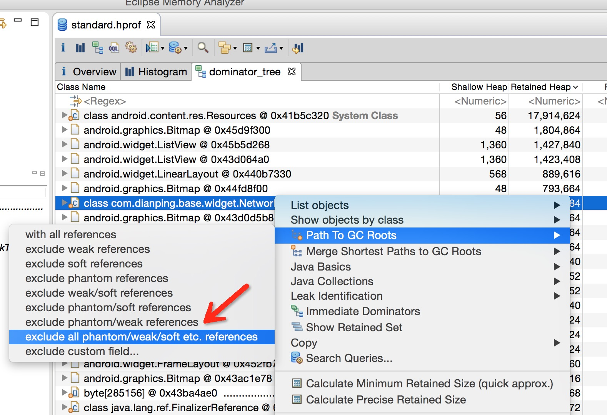

  查看当前Object所有引用,被引用的对象：

  - List objects with （以Dominator Tree的方式查看）
    - incoming references 引用到该对象的对象
    - outcoming references 被该对象引用的对象
  - Show objects by class （以class的方式查看）
    - incoming references 引用到该对象的对象
    - outcoming references 被该对象引用的对象


- **OQL(Object Query Language)**

类似SQL查询语言：Classes：Table、Objects：Rows、Fileds：Cols

```mysql
select * from com.example.mat.Listener# 查找size＝0并且未使用过的ArrayListselect * from java.util.ArrayList where size=0 and modCount=01# 查找所有的Activity select * from instanceof android.app.Activity
```


- **内存快照对比**

方式一：Compare To Another Heap Dump（直接进行比较）

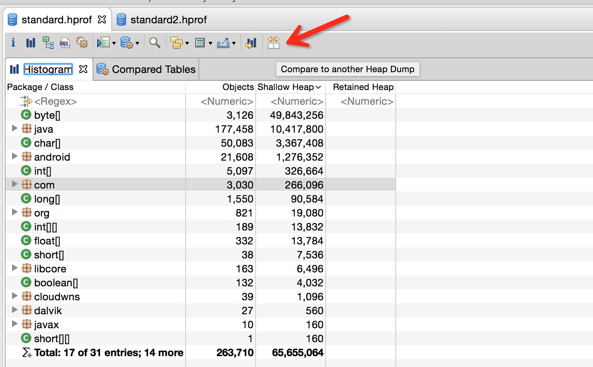


方式二：Compare Baseket（更全面，可以直接给出百分比）

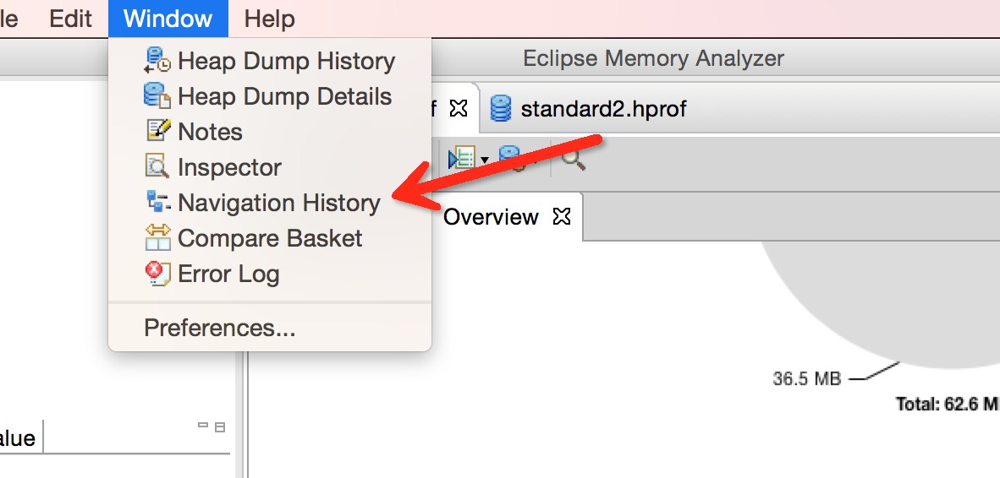


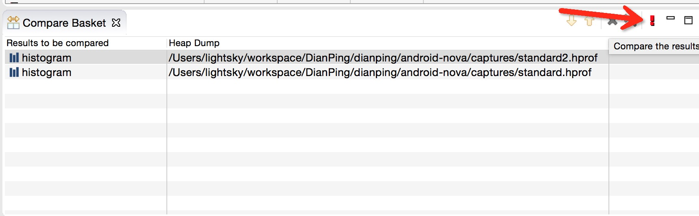

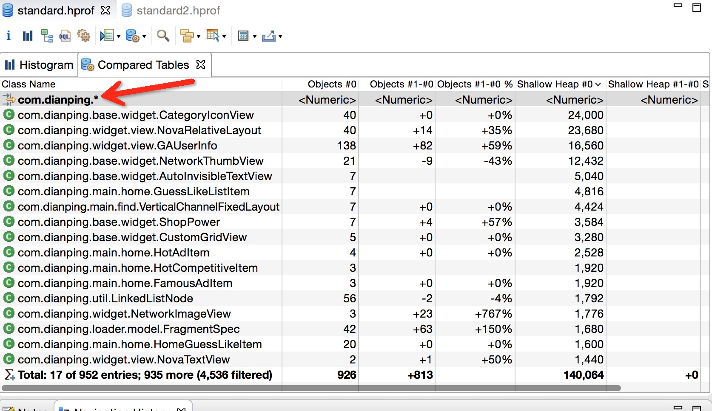


**MAT内存分析实战**

- **实战一：内存泄漏分析**

  查找导致内存泄漏的类。既然环境已经搭好，heap dump也成功倒入，接下来就去分析问题。

  - 查找目标类 
    如果在开发过程中，你的目标很明确，比如就是查找自己负责的服务，那么通过包名或者Class筛选，OQL搜索都可以快速定位到。点击OQL图标，在窗口输入，并按Ctrl + F5或者!按钮执行：

    `select * from instanceof android.app.Activity`

  - Paths to GC Roots：exclude all phantom/weak/soft etc.references 

    查看一个对象到RC Roots是否存在引用链。要将虚引用/弱引用/软引用等排除，因为被虚引用/弱引用/软引用的对象可以直接被GC给回收

  - 分析具体的引用为何没有被释放，并进行修复


**小技巧：**

- 当目的不明确时，可以直接定位到RetainedHeap最大的Object，Select incoming references，查看引用链，定位到可疑的对象然后Path to GC Roots进行引用链分析
- 如果大对象筛选看不出区别，可以试试按照class分组，再寻找可疑对象进行GC引用链分析
- 直接按照包名直接查看GC引用链，可以一次性筛选多个类，但是如下图所示，选项是 Merge Shortest Path to GCRoots，这个选项具体不是很明白，不过也能筛选出存在GC引用链的类，这种方式的准确性还待验证

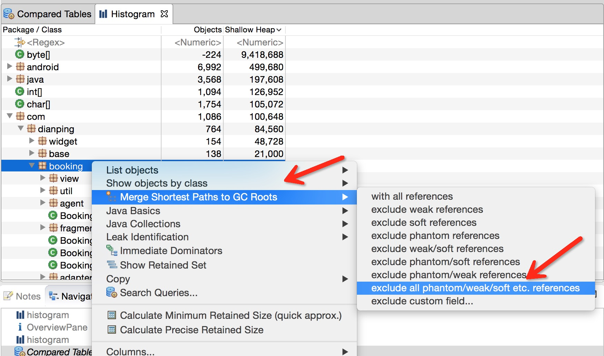

所以有时候进行MAT分析还是需要一些经验，能够帮你更快更准确的定位。


- **实战二：集合使用率分析**

  集合在开发中会经常使用到，如何选择合适的数据结构的集合，初始容量是多少（太小，可能导致频繁扩容），太大，又会开销跟多内存。当这些问题不是很明确时或者想查看集合的使用情况时，可以通过MAT来进行分析。

  - **筛选目标对象**

    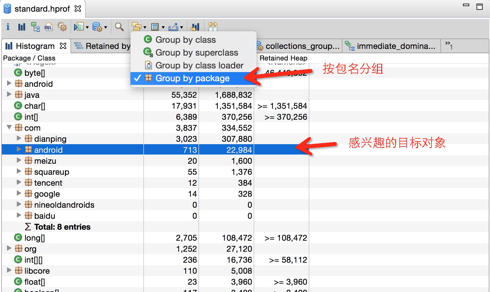

  - **Show Retained Set（查找当X被回收时那些将被GC回收的对象集合）**

    

  - **筛选指定的Object（Hash Map，ArrayList）并按照大小进行分组**

    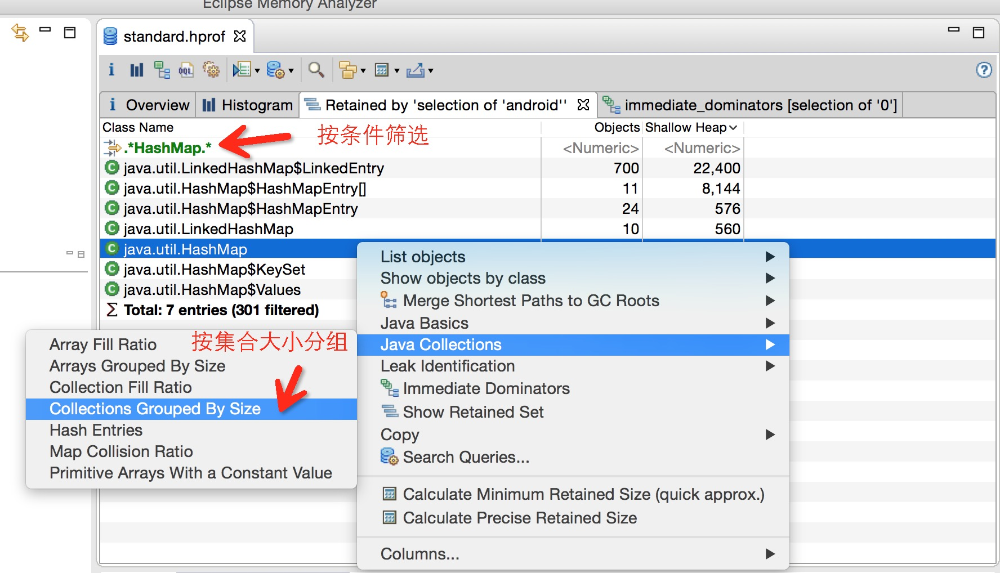

  - **查看指定类的Immediate dominators**

    


**Collections fill ratio**

这种方式只能查看那些具有预分配内存能力的集合，比如HashMap，ArrayList。计算方式：”size / capacity”


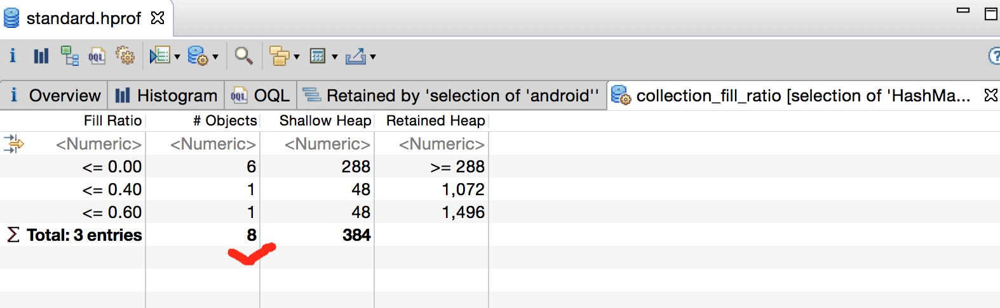


- **实战三：Hash相关性能分析**

  当Hash集合中过多的对象返回相同Hash值的时候，会严重影响性能（Hash算法原理自行搜索），这里来查找导致Hash集合的碰撞率较高的罪魁祸首。

  - **Map Collision Ratio**

    检测每一个HashMap或者HashTable实例并按照碰撞率排序：**碰撞率 = 碰撞的实体/Hash表中所有实体**

    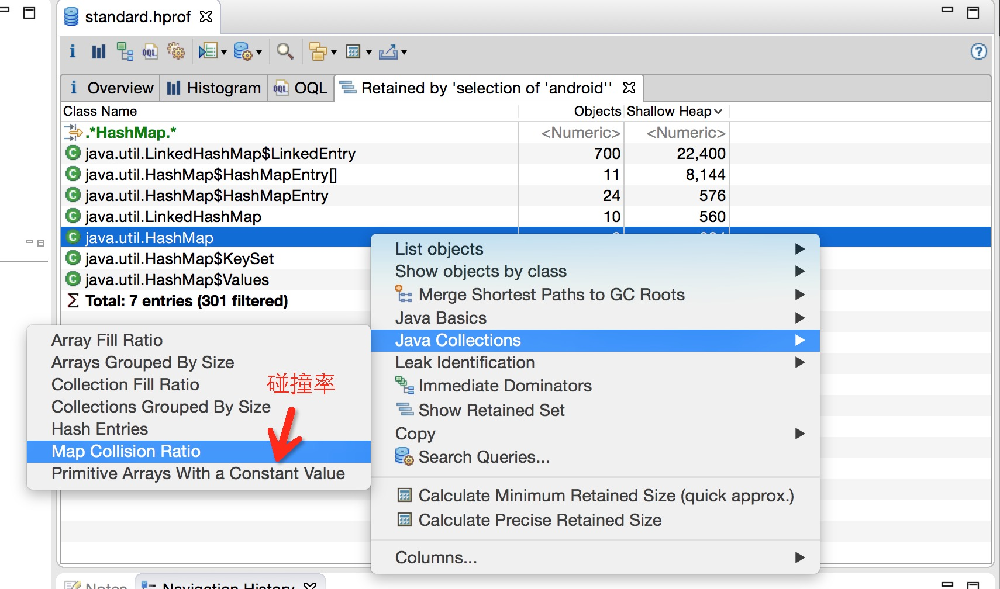

  - **查看Immediate dominators**

    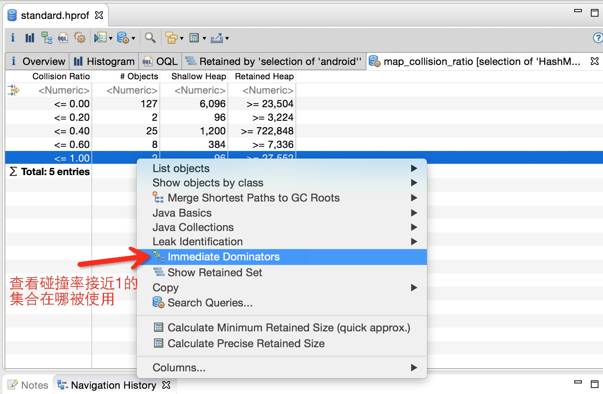

    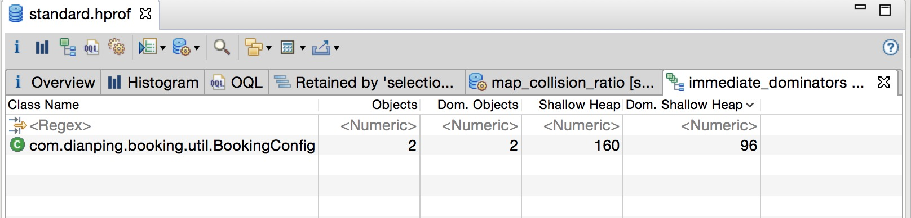

  - **通过HashEntries查看key value**

    

  - **Array等其它集合分析方法类似**


- **实战四：通过OQL快速定位未使用的集合**

  - **通过OQL查询empty并且未修改过的集合：**

    ```mysql
    select * from java.util.ArrayList where size=0 and modCount=01select * from java.util.HashMap where size=0 and modCount=0select * from java.util.Hashtable where count=0 and modCount=012
    ```

    

  - **Immediate dominators(查看引用者)**

    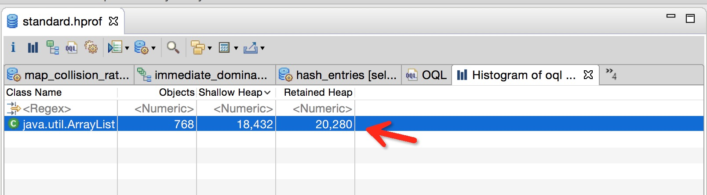

  - **计算空集合的Retained Size值，查看浪费了多少内存**

    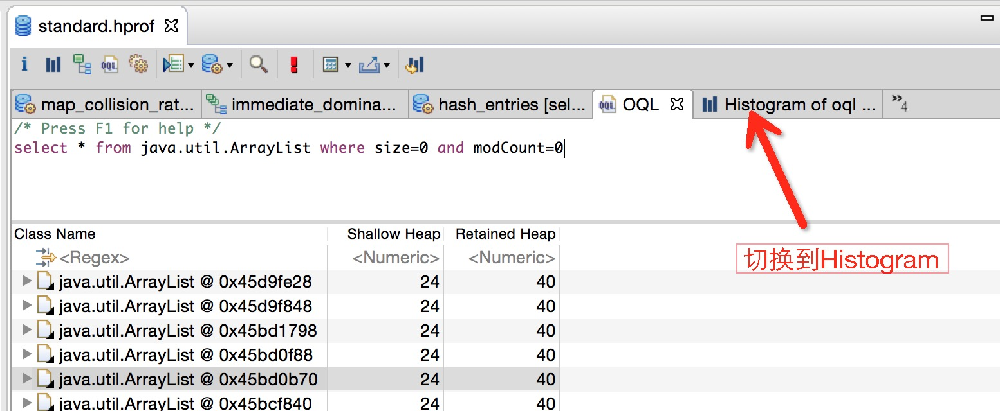


## jhat

jhat（JVM Heap Analysis Tool）命令是与jmap搭配使用，用来分析jmap生成的dump，jhat内置了一个微型的HTTP/HTML服务器，生成dump的分析结果后，可以在浏览器中查看。在此要注意，一般不会直接在服务器上进行分析，因为jhat是一个耗时并且耗费硬件资源的过程，一般把服务器生成的dump文件复制到本地或其他机器上进行分析。

```powershell
# 解析Java堆转储文件,并启动一个 web serverjhat heapDump.dump
```


## jconsole

jconsole(Java Monitoring and Management Console)是一个javaGUI监视工具，可以以图表化的形式显示各种数据，并可通过远程连接监视远程的服务器VM。用java写的GUI程序，用来监控VM，并可监控远程的VM，非常易用，而且功能非常强。命令行里打jconsole，选则进程就可以了。

**第一步**：在远程机的tomcat的catalina.sh中加入配置：

```powershell
JAVA_OPTS="$JAVA_OPTS -Djava.rmi.server.hostname=192.168.202.121 -Dcom.sun.management.jmxremote"JAVA_OPTS="$JAVA_OPTS -Dcom.sun.management.jmxremote.port=12345"JAVA_OPTS="$JAVA_OPTS -Dcom.sun.management.jmxremote.authenticate=true"JAVA_OPTS="$JAVA_OPTS -Dcom.sun.management.jmxremote.ssl=false"JAVA_OPTS="$JAVA_OPTS -Dcom.sun.management.jmxremote.pwd.file=/usr/lib/jvm/java-1.8.0-openjdk-1.8.0.101-3.b13.el7_2.x86_64/jre/lib/management/jmxremote.password"
```


**第二步**：配置权限文件

```powershell
[root@localhost bin]# cd /usr/lib/jvm/java-1.8.0-openjdk-1.8.0.101-3.b13.el7_2.x86_64/jre/lib/management/[root@localhost management]# cp jmxremote.password.template jmxremote.password[root@localhost management]# vi jmxremote.password
```

monitorRole QED
controlRole chenqimiao


**第三步**：配置权限文件为600

```powershell
[root@localhost management]# chmod 600 jmxremote.password jmxremote.access
```

这样基本配置就结束了，下面说两个坑，第一个就是防火墙的问题，要开放指定端口的防火墙，我这里配置的是12345端口，第二个是hostname的问题：


请将127.0.0.1修改为本地真实的IP,我的服务器IP是192.168.202.121：


 **第四步**：查看JConsole

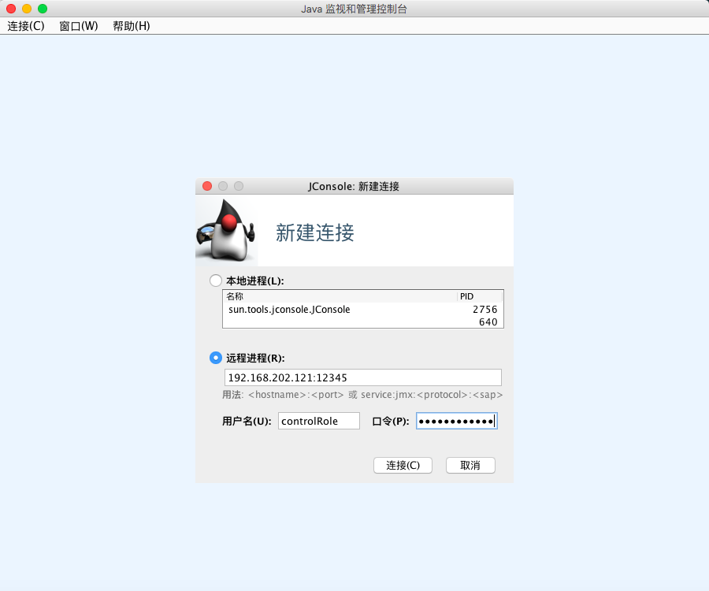

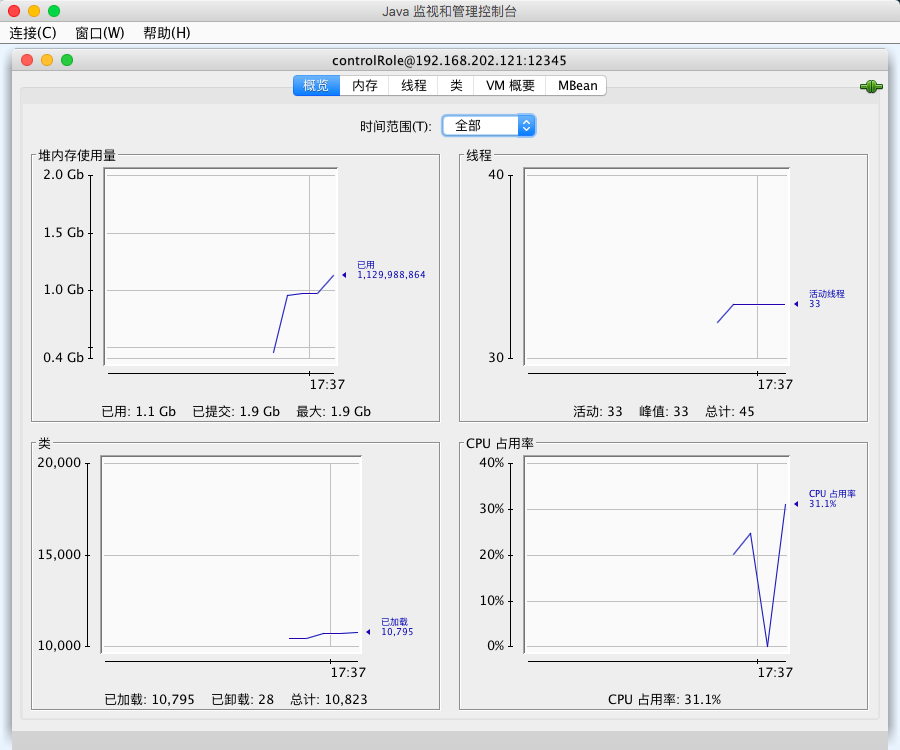


## jvisualvm

jvisualvm(JVM Monitoring/Troubleshooting/Profiling Tool)同jconsole都是一个基于图形化界面的、可以查看本地及远程的JAVA GUI监控工具，Jvisualvm同jconsole的使用方式一样，直接在命令行打入Jvisualvm即可启动，不过Jvisualvm相比，界面更美观一些，数据更实时。 jvisualvm的使用VisualVM进行远程连接的配置和JConsole是一摸一样的，最终效果图如下

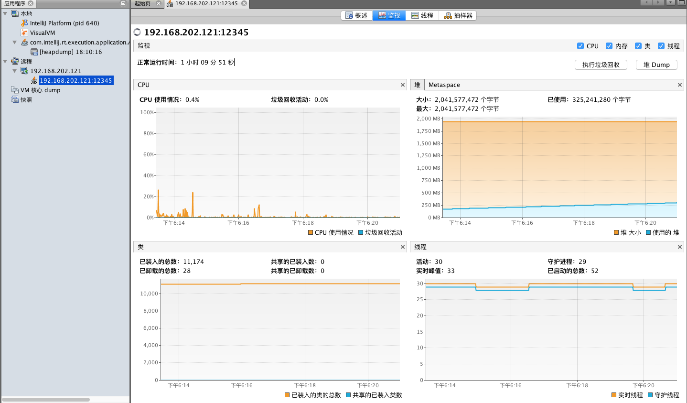


**Visual GC(监控垃圾回收器)**

Java VisualVM默认没有安装Visual GC插件，需要手动安装，JDK的安装目录的bin目露下双击 jvisualvm.sh，即可打开Java VisualVM，点击菜单栏： **工具->插件** 安装Visual GC，最终效果如下图所示：


**大dump文件**

从服务器dump堆内存后文件比较大（5.5G左右），加载文件、查看实例对象都很慢，还提示配置xmx大小。表明给VisualVM分配的堆内存不够，找到$JAVA_HOME/lib/visualvm}/etc/visualvm.conf这个文件，修改：

```shell
default_options="-J-Xms24m -J-Xmx192m"
```

再重启VisualVM就行了。


## jmc

jmc（Java Mission Control）是JDK自带的一个图形界面监控工具，监控信息非常全面。JMC打开性能日志后，主要包括**一般信息、内存、代码、线程、I/O、系统、事件** 功能。


JMC的最主要的特征就是JFR（Java Flight Recorder），是基于JAVA的飞行记录器，JFR的数据是一些列JVM事件的历史纪录，可以用来诊断JVM的性能和操作，收集后的数据可以使用JMC来分析。


**启动JFR**

在商业版本上面，JFR默认是关闭的，可以通过在启动时增加参数 `-XX:+UnlockCommercialFeatures -XX:+FlightRecorder` 来启动应用。启动之后，也只是开启了JFR特性，但是还没有开始进行事件记录。这就要通过GUI和命令行了。

- **通过Java Mission Control启动JFR**

  打开Java Mission Control点击对应的JVM启动即可，事件记录有两种模式（如果选择第2种模式，那么JVM会使用一个循环使用的缓存来存放事件数据）：

  - 记录固定一段时间的事件（比如：1分钟）
  - 持续进行记录

- **通过命令行启动JFR**

  通过在启动的时候，增加参数：`-XX:+FlightRecorderOptions=string` 来启动真正地事件记录，这里的 `string` 可以是以下值（下列参数都可以使用jcmd命令，在JVM运行的时候进行动态调整，[参考地址](https://docs.oracle.com/javase/8/docs/technotes/tools/unix/java.html)）：

  - `name=name`：标识recording的名字（一个进程可以有多个recording存在，它们使用名字来进行区分）
  - `defaultrecording=<ture|false>`：是否启动recording，默认是false，我们要分析，必须要设置为true
  - `setting=paths`：包含JFR配置的文件名字
  - `delay=time`：启动之后，经过多长时间（比如：30s，1h）开始进行recording
  - `duration=time`：做多长时间的recording
  - `filename=path`：recordding记录到那个文件里面
  - `compress=<ture|false>`：是否对recording进行压缩（gzip）,默认为false
  - `maxage=time`：在循环使用的缓存中，事件数据保存的最大时长
  - `maxsize=size`：事件数据缓存的最大大小（比如：1024k，1M）

常用JFR命令如下：

- 启动recording

  命令格式：`jcmd process_id JFR.start [options_list]`，其中options_list就是上述的参数值。

- dump出循环缓存中的数据

  命令格式：`jcmd process_id JFR.dump [options_list]`，其中options_list参数的可选值如下：

  - `name=name`：recording的名字
  - `recording=n`：JFR recording的数字（一个标识recording的随机数）
  - `filename=path`：dump文件的保存路径

- 查看进程中所有recording

  命令格式：` jcmd process_id JFR.check [verbose]`，不同recording使用名字进行区分，同时JVM还为它分配一个随机数。

- 停止recording

  命令格式：` jcmd process_id JFR.stop [options_list]`，其中options_list参数的可选值如下：

  - `name=name`：要停止的recording名字
  - `recording=n`：要停止的recording的标识数字
  - `discard=boolean`：如果为true，数据被丢弃，而不是写入下面指定的文件当中
  - `filename=path`：写入数据的文件名称


**命令启动JFR案例如下**：

- **第一步**：创建一个包含了你自己配置的JFR模板文件（`template.jfc`）。运行jmc, 然后Window->Flight Recording Template Manage菜单。准备好档案后，就可以导出文件，并移动到要排查问题的环境中

  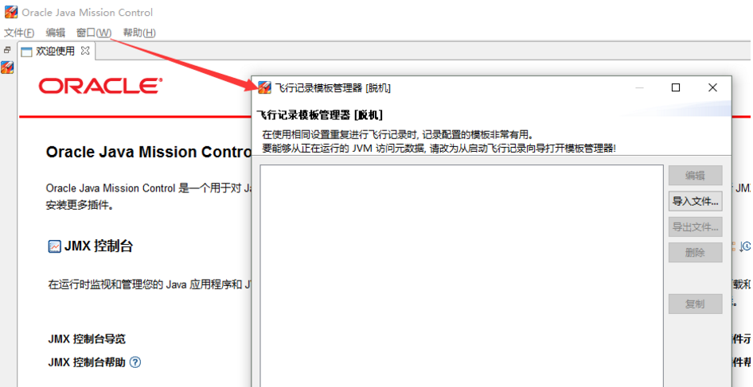

- **第二步**：由于JFR需要JDK的商业证书，这一步需要解锁jdk的商业特性

  ```powershell
  [root@localhost bin]# jcmd 12234 VM.unlock_commercial_features12234: Commercial Features already unlocked.
  ```

- **第三步**：最后你就可以启动JFR，命令格式如下：

  ```powershell
  jcmd <PID> JFR.start name=test duration=60s [settings=template.jfc] filename=output.jfr
  ```

  ​	上述命令立即启动JFR并开始使用 `template.jfc`（在 `$JAVA_HOME/jre/lib/jfr` 下有 `default.jfc` 和 `profile.jfc` 模板）的配置收集 `60s` 的JVM信息，输出到 `output.jfr` 中。一旦记录完成之后，就可以复制.jfr文件到你的工作环境使用jmc GUI来分析。它几乎包含了排查jvm问题需要的所有信息，包括堆dump时的异常信息。使用案例如下：

  ```powershell
  [root@localhost bin]# jcmd 12234 JFR.start name=test duration=60s filename=output.jfr12234: Started recording 6. The result will be written to: /root/zookeeper-3.4.12/bin/output.jfr[root@localhost bin]# ls -l-rw-r--r-- 1 root root 298585 6月  29 11:09 output.jfr
  ```


**JFR（Java Flight Recorder）**

- Java Mission Control的最主要的特征就是Java Flight Recorder。正如它的名字所示，JFR的数据是一些列JVM事件的历史纪录，可以用来诊断JVM的性能和操作
- JFR的基本操作就是开启哪些事件（比如：线程由于等待锁而阻塞的事件）。当开启的事件发生了，事件相关的数据会记录到内存或磁盘文件上。记录事件数据的缓存是循环使用的，只有最近发生的事件才能够从缓存中找到，之前的都因为缓存的限制被删除了。Java Mission Control能够对这些事件在界面上进行展示（从JVM的内存中读取或从事件数据文件中读取），我们可以通过这些事件来对JVM的性能进行诊断
- 事件的类型、缓存的大小、事件数据的存储方式等等都是通过JVM参数、Java Mission Control的GUI界面、jcmd命令来控制的。JFR默认是编译进程序的，因为它的开销很小，一般来说对应用的影响小于1%。不过，如果我们增加了事件的数目、修改了记录事件的阈值，都有可能增加JFR的开销


**① JFR概况**

​	下面对GlassFish web服务器进行JFR记录的例子，在这个服务器上面运行着在第2章介绍的股票servlet。Java Mission Control加载完JFR获取的事件之后，大概是下面这个样子：

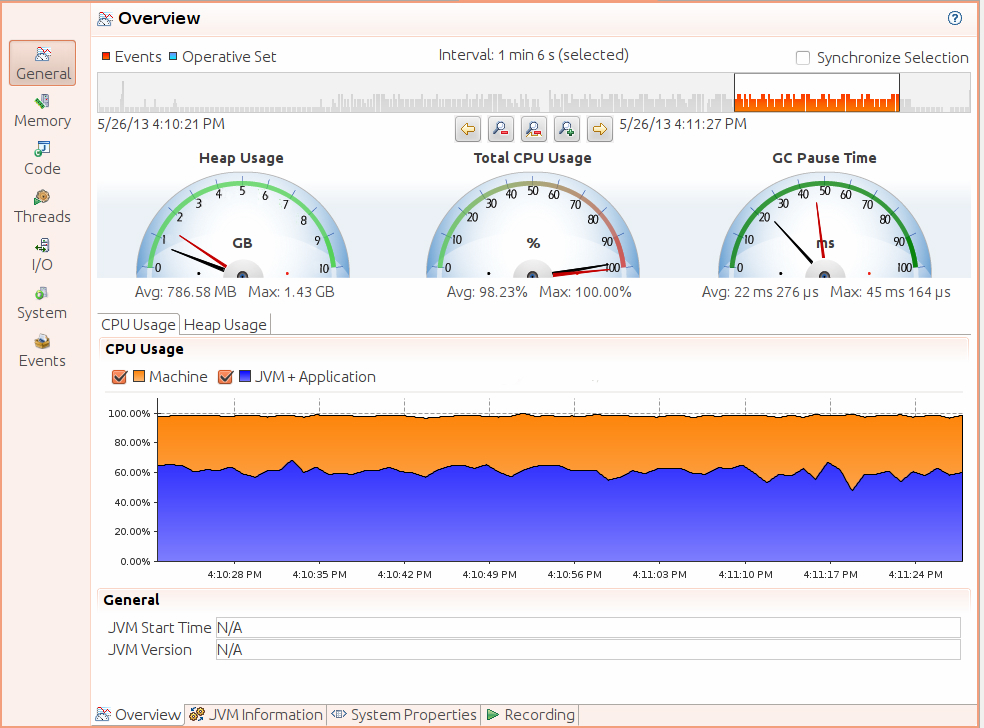

我们可以看到，通过上图可以看到：CPU使用率，Heap使用率，JVM信息，System Properties，JFR的记录情况等等。


**② JFR 内存视图**

Java Mission Control 可以看到非常多的信息，下图只显示了一个标签的内容。下图显示了JVM 的内存波动非常频繁，因为新生代经常被清除（有意思的是，head的大小并没有增长）。下面左边的面板显示了最近一段时间的垃圾回收情况，包括：GC的时长和垃圾回收的类型。如果我们点击一个事件，右边的面板会展示这个事件的具体情况，包括：垃圾垃圾回收的各个阶段及其统计信息。从面板的标签可以看到，还有很多其它信息，比如：有多少对象被清除了，花了多长时间；GC算法的配置；分配的对象信息等等。在第5章和第6章中，我们会详细介绍。


**③ JFR 代码视图**
这张图也有很多tab，可以看到各个包的使用频率和类的使用情况、异常、编译、代码缓存、类加载情况等等：


**④ JFR事件视图**
下图显示了事件的概述视图：


## 火焰图

火焰图是用来分析程序运行瓶颈的工具。火焰图也可以用来分析 Java 应用。可以从 github 上下载 [async-profiler](https://github.com/jvm-profiling-tools/async-profiler) 的压缩包进行相关操作。比如，我们把它解压到 /root/ 目录，然后以 javaagent 的方式来启动 Java 应用，命令行如下：

```shell
java -agentpath:/root/build/libasyncProfiler.so=start,svg,file=profile.svg -jar spring-petclinic-2.3.1.BUILD-SNAPSHOT.jar
```

运行一段时间后，停止进程，可以看到在当前目录下，生成了 profile.svg 文件，这个文件是可以用浏览器打开的。
如下图所示，纵向，表示的是调用栈的深度；横向，表明的是消耗的时间。所以格子的宽度越大，越说明它可能是一个瓶颈。一层层向下浏览，即可找到需要优化的目标。


# Linux Command


## Base

`$`和`#`区别：`$`普通用户即可执行，`#`为root用户才可执行，或普通用户使用`sudo`。

**JDK环境变量配置**

```shell
# 方式一：非root用户安装JDK# 编辑用户根目录下的.bash_profile文件vi .bash_profile# 向.bash_profile文件中导入配置export JAVA_HOME=/home/lry/jdk1.7.0_80export PATH=$JAVA_HOME/bin:$PATH export CLASSPATH=.:$JAVA_HOME/lib/dt.jar:$JAVA_HOME/lib/tools.jar # 立刻生效source .bash_profile
```

```shell
# 方式二：yum安装JDK配置环境变量# 查看CentOS自带JDK是否已安装yum list installed |grep java# 批量卸载JDKrpm -qa | grep java | xargs rpm -e --nodeps # 直接yum安装1.8.0版本openjdkyum install java-1.8.0-openjdk* -y# 默认jre jdk安装路径是/usr/lib/jvm下面vim /etc/profile# 添加以下配置export JAVA_HOME=/usr/lib/jvm/javaexport CLASSPATH=.:$JAVA_HOME/lib/dt.jar:$JAVA_HOME/lib/tools.jar:$JAVA_HOME/jre/lib/rt.jarexport PATH=$PATH:$JAVA_HOME/bin# 使得配置生效. /etc/profile
```

```shell
# 方式三：root用户下是配置JDKvim /etc/profile# 添加以下配置export JAVA_HOME=/home/hmf/jdk1.7.0_80export PATH=.:$JAVA_HOME/bin:$PATHexport CLASSPATH=.:$JAVA_HOME/lib/dt.jar:$JAVA_HOME/lib/tools.jar# source环境变量source /etc/profile
```


**基本常用命令**

```shell
# 查看机器cpu核数:# 1.CPU总核数 = 物理CPU个数 * 每颗物理CPU的核数# 2.总逻辑CPU数 = 物理CPU个数 * 每颗物理CPU的核数 * 超线程数# 查看CPU信息（型号）cat /proc/cpuinfo | grep name | cut -f2 -d: | uniq -c# 查看物理CPU个数cat /proc/cpuinfo| grep "physical id"| sort| uniq| wc -l# 查看每个物理CPU中core的个数(即核数)cat /proc/cpuinfo| grep "cpu cores"| uniq# 查看逻辑CPU的个数cat /proc/cpuinfo| grep "processor"| wc -l# 重启reboot# 关机poweroff# 添加用户useradd# 设置密码passwd# 查看nginx的位置whereis nginx# 修改start.sh文件为最高权限777chmod 777 start.sh# 修改test.txt文件所属的用户和组, – R表示递归处理chown - R username:group test.txt# 改变/opt/local和/book/及其子目录下的所有文件的属组为lry, – R表示递归处理chgrp - R lry /opt/local /book# Tab补全# 1.未输入状态下连按两次Tab列出所有可用命令# 2.已输入部分命令名或文件名，按Tab进行自动补全# 根据端口查看占用情况netstat -tln | grep 8080# 根据端口查看进程lsof -i :8080# 查看java关键词的进程ps aux|grep java# 查看所有进程ps aux# 查看java关键词的进程ps -ef | grep java
```

**常用复合命令**

```powershell
# 查找和tomcat相关的所有进程并杀死ps -ef | grep tomcat | grep -v grep | awk '{print $2}' | xargs kill -9# 从100行开始显示,支持滚动less +100 /home/test/example.log# 从100行开始显示,不支持滚动more +100 /home/test/example.log# 查看文件头10行head -n 10 example.txt# 每隔3s出12234进程的gc情况，每个20录就打印隐藏列标题jstat -gc -t -h20 <pid> 3s# Java线程Dump快照导出(建议使用tdump或log格式)jstack -l <pid> > thread-dump.tdump# Java内存Dump快照导出(建议使用hprof格式),format=b表示二进制文件(一般较大)jmap -dump:[live,]format=b,file=heap-dump.hprof <pid># JMC分析jcmd <pid> VM.unlock_commercial_featuresjcmd <pid> JFR.start name=test duration=60s filename=output.jfr
```


### vi/vim

```shell
:set nu # 设置显示行号:set nonu # 取消显示行号ctr+f # 向前翻页ctr+b # 向后翻页u # 恢复修改操作yy # 复制本行nyy # 本行往下n行进行复制p # 粘贴在光标以下的行P # 粘贴在光标以上的行x # 向后删除一个字符X # 向前删除一个字符nx # 向后删除n个字符:w # 保存:q # 退出:q! # 强制退出不保存:w! # 强制保存:wq # 保存并退出:w otherfilename # 另存为# 在文件中移动nG  # 光标移动到n行gg  # 光标移动到文件第1行G   # 光标移动到文件最后1行75% # 光标移动到百分之75的位置# 移动到指定字符fx  # 把光标移动到右边的第一个’x’字符上Fx  # 把光标移动到左边的第一个’x’字符上3fx # 把光标移动到光标右边的第3个’x’字符上tx  # 把光标移动到右边的第一个’x’字符之前Tx  # 把光标移动到左边的第一个’x’字之后n空格 # 光标移动到本行第n个字符$ # 光标移动到本行最后一个字符# H/M/L(大写)：可以让光标跳到当前窗口的顶部、中间、和底部，停留在第一个非空字符上3H  # 表示光标移动到距窗口顶部第3行的位置5L  # 表示光标移动到距窗口底部5行的位置# 相对于光标滚屏zt  # 把光标所在行移动窗口的顶端zz  # 把光标所在行移动窗口的中间zb  # 把光标所在行移动窗口的底部# 查找/word # 向光标之后搜索字符串?word # 向光标之前搜索字符串n     # 重复上一次的查找命令向后查找N     # 重复上一次的查找命令向前查找:n1,n2s/word1/word2/gc # 逐个替换:1,$s/word1/word2/g # 从第一行到最后一行进行替换应该是:n1,n2s/word1/word2/g # 从第n1行到第n2行搜索word1字符串，并替换为word2
```


### scp

```shell
# 拷贝本机/home/lry/test整个目录至远程主机192.168.1.100的/test目录下scp -r /home/lry/test/ root@192.168.1.100:/test/# 拷贝单个文件至远程主机scp /home/lry/test.txt root@192.168.1.100:/test/# 远程文件/文件夹下载举例# 把192.168.62.10上面的/test/文件夹，下载到本地的/home/lry/下scp -r root@192.168.62.10:/test/ /home/lry/
```


### tar

```shell
# 格式：tar [-cxtzjvfpPN] 文件与目录 ....# 参数说明：# -c ：压缩# -x ：解压# -t ：查看内容# 注意：c/x/t只能同时存在一个# # -r：向压缩归档文件末尾追加文件# -u：更新原压缩包中的文件# -v：显示操作过程# -f：指定备份文件，其后不能再跟参数# 压缩文件tar -czf test.tar.gz /test1 /test2# 列出压缩文件列表tar -tzf test.tar.gz# 解压文件tar -xvzf test.tar.gz# 仅打包，不压缩tar -cvf log.tar log01.log # 打包后，以gzip压缩tar -zcvf log.tar.gz log01.log# 打包后，以bzip2压缩tar -jcvf log.tar.bz2 log01.log# 总结# *.tar：用tar –xvf解压# *.gz：用gzip -d或者gunzip解压# *.tar.gz和*.tgz：用tar –xzf解压# *.bz2：用bzip2 -d或者用bunzip2解压# *.tar.bz2：用tar –xjf解压# *.Z：用uncompress解压# *.tar.Z：用tar –xZf解压# *.rar：用unrar解压# *.zip：用unzip解压
```


### su

```shell
# 切换到其它身份用户,默认是root,如下相同su -# 切换到root用户,并至root目录,不带-只切换用户su - root# 变更帐号为root并在执行ls指令后退出变回原使用者su -c ls root
```


### df

```shell
# 易读的显示目前磁盘空间和使用情况,-h(1024计算)/-H(1000计算)df -h
```


### tail

```shell
# tail语法格式： # tail [-f] [-c Number|-n Number|-m Number|-b Number|-k Number] [File] # 倒数300行并进入实时监听文件写入模式tail -300f example.log # 查看文件尾10行tail -n 10 example.log# 实时查看日志文件tail -f example.log
```


### grep

```shell
# 文件查找grep forest test.txt# 多文件查找grep forest test.txt example.txt# 目录下查号所有符合关键词的文件grep 'log' /home/test -r -n# 在文件 '/var/log/messages'中查找以"Aug"开始的词汇grep ^Aug /var/log/messages# 查找指定文件中的关键词并打印至控制台cat f.txt | grep -i shopbase# 查找指定文件中的关键词并统计其出现次数cat f.txt | grep -c 'shopbase'# 指定文件后缀grep 'shopbase' /home/test -r -n --include *.{vm,java}# 反匹配grep 'shopbase' /home/test -r -n --exclude *.{vm,java}# 上匹配seq 10 | grep 5 -A 3# 下匹配seq 10 | grep 5 -B 3# 上下匹配，平时用这个就妥了seq 10 | grep 5 -C 3# 查找当前目录中的所有jar文件ls -l | grep '.jar'# 查找所以有的包含spring的xml文件grep -H 'spring' *.xml# 显示所有以d开头的文件中包含test的行grep 'test' d*# 显示在aa，bb，cc文件中匹配test的行grep 'test' aa bb cc# 显示所有包含每个字符串至少有5个连续小写字符的字符串的行grep '[a-z]\{5\}' aa# 显示foo及后5行grep -A 5 Exception app.log# 显示foo及前5行grep -B 5 Exception app.log# 显示app.log文件里匹配Exception字串那行以及上下5行grep -C 5 Exception app.log
```


### awk

```shell
# 1.原理# 逐行处理文件中的数据# 2.语法awk 'pattern + {action}'# 说明：# 单引号''是为了和shell命令区分开# 大括号{}表示一个命令分组# pattern是一个过滤器，表示命中pattern的行才进行action处理# action是处理动作# 使用#作为注释# 3.内置变量FS # 分隔符，默认是空格NR # 当前行数，从1开始NF # 当前记录字段个数$0 # 当前记录$1~$n # 当前记录第n个字段# 4.内置函数gsub(r,s) # 在$0中用s代替rindex(s,t) # 返回s中t的第一个位置length(s) # s的长度match(s,r) # s是否匹配rsplit(s,a,fs) # 在fs上将s分成序列asubstr(s,p) # 返回s从p开始的子串# 5.案例# 显示hello.txt中的第3行至第5行的命令为cat hello.txt | awk 'NR==3, NR==5{print;}'# 显示hello.txt中，正则匹配hello的行的命令为cat hello.txt | awk '/hello/'# 显示hello.txt中，长度大于100的行号的命令为cat hello.txt | awk 'length($0)>80{print NR}'# 显示hello.txt中的第3行至第5行的第一列与最后一列cat hello.txt | awk 'NR==3, NR==5{print $1,$NF}'# 基础命令# 在控制台循环打印打印第4列和第6列数据awk '{print $4,$6}' f.txtawk '{print NR,$0}' f.txt cpf.txtawk '{print FNR,$0}' f.txt cpf.txtawk '{print FNR,FILENAME,$0}' f.txt cpf.txtawk '{print FILENAME,"NR="NR,"FNR="FNR,"$"NF"="$NR}' f.txt cpf.txtecho 1:2:3:4 | awk -F: '{print $1,$2,$3}'# 匹配# 匹配ldbawk '/ldb/ {print}' f.txt# 不匹配ldbawk '!/ldb/ {print}' f.txt# 匹配ldb和LISTENawk '/ldb/ && /LISTEN/ {print}' f.txt# 第五列匹配ldbawk '$5 ~ /ldb/ {print}' f.txt# 内建变量# NR:NR表示从awk开始执行后，按照记录分隔符读取的数据次数，默认的记录分隔符为换行符，因此默认的就是读取的数据行数，NR可以理解为Number of Record的缩写# FNR:在awk处理多个输入文件的时候，在处理完第一个文件后，NR并不会从1开始，而是继续累加，因此就出现了FNR，每当处理一个新文件的时候，FNR就从1开始计数，FNR可以理解为File Number of Record# NF: NF表示目前的记录被分割的字段的数目，NF可以理解为Number of Field
```


### find

```shell
# 根据名称查找/目录下的filename.txt文件find / -name filename.txt# 递归查找所有的xml文件find . -name "*.xml"# 递归查找所有文件内容中包含hello world的xml文件find . -name "*.xml" |xargs grep "hello world"# 删除文件大小为零的文件find ./ -size 0 | xargs rm -f &# 多个目录查找find /home/admin /tmp /usr -name \*.log# 大小写都匹配find . -iname \*.txt# 当前目录下的所有子目录find . -type d# 当前目录下所有的符号链接find /usr -type l# 符号链接的详细信息 eg:inode,目录find /usr -type l -name "z*" -ls# 超过250000k的文件,当然+改成-就是小于了find /home/admin -size +250000k# 按照权限查询文件find /home/admin -f -perm 777 -exec ls -l {} \;# 1天内访问过的文件find /home/admin -atime -1# 1天内状态改变过的文件find /home/admin -ctime -1# 1天内修改过的文件find /home/admin -mtime -1# 1分钟内访问过的文件find /home/admin -amin -1# 1分钟内状态改变过的文件find /home/admin -cmin -1# 1分钟内修改过的文件find /home/admin -mmin -1
```


### netstat

```shell
# 查看当前连接，注意CLOSE_WAIT偏高的情况netstat -nat|awk '{print $6}'|sort|uniq -c|sort -rn# 显示所有tcp连接，并包括pid和程序名netstat -atnp# 统计所有tcp状态的数量并排序netstat -atn | awk '{print $6}' | sort | uniq -c | sort -rn# 每隔1s显示网络信息(-c参数)netstat -ctn | grep "ESTABLISHED"# 列出所有处于连接状态的ip并按数量排序netstat -an | grep ESTABLISHED | awk '/^tcp/ {print $5}' | awk -F: '{print $1}' | sort | uniq -c | sort -nr 
```


### echo

```shell
# 创建test.txt文件，并向该文件写入“内容”echo "内容" > test.txt# 输出环境变量$JAVA_HOME的值echo $JAVA_HOME
```


### telnet

```shell
# 查看端口是否通畅：telnet IP 端口号telnet 10.150.159.71 5516
```


### rpm

```shell
# 安装一个rpm包rpm -ivh package.rpm# 安装一个rpm包而忽略依赖关系警告rpm -ivh --nodeeps package.rpm
```


### yum

```shell
# 下载并安装一个rpm包yum install package_name# 将安装一个rpm包，使用你自己的软件仓库为你解决所有依赖关系yum localinstall package_name.rpm# 更新当前系统中所有安装的rpm包yum update package_name.rpm# 更新一个rpm包yum update package_name# 删除一个rpm包yum remove package_name# 列出当前系统中安装的所有包yum list# 在rpm仓库中搜寻软件包yum search package_name# 删除所有缓存的包和头文件yum clean all
```


## Monitor

### Memory

#### free

`free`是查看内存使用情况，包括物理内存、交换内存(swap)和内核缓冲区内存。

```shell
# 语法free [-bkmhotV][-s <间隔秒数>]# 参数说明：# -b 　以Byte为单位显示内存使用情况# -k 　以KB为单位显示内存使用情况# -m    以MB为单位显示内存使用情况# -h 　以合适的单位显示内存使用情况，最大为三位数，自动计算对应单位值。单位：B=bytes, K=kilos, M=megas, G=gigas, T=teras# -o 　不显示缓冲区调节列# -s <间隔秒数> 　持续观察内存使用状况# -t 　显示内存总和列# -V 　显示版本信息
```

`free -h -s 3`表示每隔三秒输出一次内存情况，命令如下：

```shell
[1014154@cc69dd4c5-4tdb5 ~]$ free -h -s 3              total        used        free      shared  buff/cache   availableMem:           114G         41G         43G        4.1G         29G         67GSwap:            0B          0B          0B              total        used        free      shared  buff/cache   availableMem:           114G         41G         43G        4.1G         29G         67GSwap:            0B          0B          0B
```

- `Mem`：是内存的使用情况
- `Swap`：是交换空间的使用情况
- `total`：系统总的可用物理内存和交换空间大小
- `used`：已经被使用的物理内存和交换空间
- `free`：还有多少物理内存和交换空间可用使用，**是真正尚未被使用的物理内存数量** 
- `shared`：被共享使用的物理内存大小
- `buff/cache`：被 buffer（缓冲区） 和 cache（缓存） 使用的物理内存大小
- `available`：还可以被应用程序使用的物理内存大小，**它是从应用程序的角度看到的可用内存数量，available ≈ free + buffer + cache** 

**交换空间(swap space)**

swap space 是磁盘上的一块区域，当系统物理内存吃紧时，Linux 会将内存中不常访问的数据保存到 swap 上，这样系统就有更多的物理内存为各个进程服务，而当系统需要访问 swap 上存储的内容时，再将 swap 上的数据加载到内存中，这就是常说的换出和换入。交换空间可以在一定程度上缓解内存不足情况，但它需要读写磁盘数据，所以性能不是很高。


#### vmstat

vmstat（Virtual Meomory Statistics，虚拟内存统计）是Linux中监控内存的常用工具，它收集和显示关于**内存**，**进程**，**终端**和**分页**和**I/O阻塞**的概括信息。

```shell
# 每隔1秒打印一次，一共打印3次。-S指定显示单位, M代表Mb, 默认为Kb[root@localhost ~]# vmstat -SM 1 3procs -----------memory---------- ---swap-- -----io---- -system-- ------cpu----- r  b   swpd   free   buff  cache   si   so    bi    bo   in   cs us sy id wa st 1  0      0   2433      2    657    0    0   132     8   77   95  1  2 97  1  0 0  0      0   2433      2    657    0    0     0     0   47   71  0  0 100  0  0 0  0      0   2433      2    657    0    0     0     0   54   72  0  0 100  0  0
```

- **procs**

  - `r`：表示运行和等待CPU时间片的进程数（就是说多少个进程真的分配到CPU），**这个值如果长期大于系统CPU个数，说明CPU不足，需要增加CPU** 
  - `b`：表示在等待资源的进程数，比如正在等待I/O或者内存交换等

- **memory**

  - `swpd`：表示切换到内存交换区的内存大小，即虚拟内存已使用的大小（单位KB），**如果大于0，表示你的机器物理内存不足了，如果不是程序内存泄露的原因，那么你该升级内存了或者把耗内存的任务迁移到其他机器** 
  - `free`：表示当前空闲的物理内存
  - `buff`：表示缓冲大小，一般对块设备的读写才需要缓冲
  - `cache`：表示缓存大小，一般作为文件系统进行缓冲，频繁访问的文件都会被缓存，如果cache值非常大说明缓存文件比较多，如果此时io中的bi比较小，说明文件系统效率比较好

- **swap**：交换空间

  一般情况下si、so的值都为0，如果si、so的值长期不为0，则说明系统内存不足，需要增加系统内存。

  - `si`：表示数据由磁盘读入内存；通俗的讲就是每秒从磁盘读入虚拟内存的大小，**如果这个值大于0，表示物理内存不够用或者内存泄露了，要查找耗内存进程解决掉** 
  - `so`：表示由内存写入磁盘，也就是由内存交换区进入内存的数据大小

- **io**

  如果bi+bo的值过大，且wa值较大，则表示系统磁盘IO瓶颈。

  - `bi`：表示由块设备读入数据的总量，即读磁盘，单位kb/s
  - `bo`：表示写到块设备数据的总量，即写磁盘，单位kb/s

- **system**

  这两个值越大，则由内核消耗的CPU就越多。

  - `in`：表示某一时间间隔内观测到的每秒设备终端数
  - `cs`：表示每秒产生的上下文切换次数，**这个值要越小越好，太大了，要考虑调低线程或者进程的数目** 

- **CPU(百分比)**

  - `us`：表示用户进程消耗的CPU时间比，**us值越高，说明用户进程消耗CPU时间越多。如果长期大于50%，则需要考虑优化程序或者算法** 
  - `sy`：表示系统内核进程消耗的CPU时间比，**一般us+sy应该小于80%，如果大于80%，说明可能存在CPU瓶颈** 
  - `id`：表示CPU处在空间状态的时间百分比
  - `wa`：表示IP等待所占用的CPU时间百分比，**wa值越高，说明I/O等待越严重，根据经验wa的参考值为20%，如果超过20%，说明I/O等待严重，引起I/O等待的原因可能是磁盘大量随机读写造成的，也可能是磁盘或者监控器的贷款瓶颈（主要是块操作）造成的** 


### CPU

#### top

top可以查看CPU总体消耗，包括分项消耗，如User，System，Idle，nice等。

- `Shift + H` 显示java线程
- `Shift + M` 按照内存使用排序
- `Shift + P` 按照CPU使用时间（使用率）排序
- `Shift + T` 按照CPU累积使用时间排序

```shell
top - 15:24:11 up 8 days,  7:52,  1 user,  load average: 5.73, 6.85, 7.33Tasks:  17 total,   1 running,  16 sleeping,   0 stopped,   0 zombie%Cpu(s): 13.9 us,  9.2 sy,  0.0 ni, 76.1 id,  0.1 wa,  0.0 hi,  0.1 si,  0.7 stKiB Mem : 11962365+total, 50086832 free, 38312808 used, 31224016 buff/cacheKiB Swap:        0 total,        0 free,        0 used. 75402760 avail Mem   PID USER      PR  NI    VIRT    RES    SHR S  %CPU %MEM     TIME+ COMMAND   300 ymmapp    20   0 17.242g 1.234g  14732 S   2.3  1.1   9:40.38 java     1 root      20   0   15376   1988   1392 S   0.0  0.0   0:00.06 sh    11 root      20   0  120660  11416   1132 S   0.0  0.0   0:04.94 python    54 root      20   0   85328   2240   1652 S   0.0  0.0   0:00.00 su......
```

第三行：`%Cpu(s): 13.9 us, 9.2 sy, 0.0 ni, 76.1 id, 0.1 wa, 0.0 hi, 0.1 si, 0.7 st`：**用户空间CPU占比13.9%** ，内核空间CPU占比9.2%，改变过优先级的进程CPU占比0%，**空闲CPU占比76.1** ，**IO等待占用CPU占比0.1%** ，硬中断占用CPU占比0%，软中断占用CPU占比0.1%,当前VM中的cpu 时钟被虚拟化偷走的比例0.7%。其中：

- `PID`：进程id
- `USER`：进程所有者
- `VIRT`：虚拟内存，进程使用的虚拟内存总量，单位kb。VIRT=SWAP+RES
- `RES`：常驻内存，进程使用的、未被换出的物理内存大小，单位kb。RES=CODE+DATA
- `SHR`：共享内存，共享内存大小，单位kb
- `%CPU`：上次更新到现在的CPU时间占用百分比
- `%MEM`：进程使用的物理内存百分比


#### htop

htop基本上是一个top改善版本，它能够以更加多彩的方式显示更多的统计信息，同时允许你采用不同的方式进行排序，它提供了一个用户友好的接口。


#### sar

① 通过`sar -u 1 3`可以查看CUP总体消耗占比，每间隔1秒钟统计1次总共统计3次：

```shell
[root@localhost ~]# sar -u 1 3Linux 3.10.0-1062.el7.x86_64 (localhost.localdomain)    2020年05月01日  _x86_64_        (2 CPU)15时18分03秒     CPU     %user     %nice   %system   %iowait    %steal     %idle15时18分06秒     all      0.00      0.00      0.17      0.00      0.00     99.8315时18分09秒     all      0.00      0.00      0.17      0.00      0.00     99.8315时18分12秒     all      0.17      0.00      0.17      0.00      0.00     99.6615时18分15秒     all      0.00      0.00      0.00      0.00      0.00    100.0015时18分18秒     all      0.00      0.00      0.00      0.00      0.00    100.00
```

- `%user`：用户空间的CPU使用
- `%nice`：改变过优先级的进程的CPU使用率
- `%system`：内核空间的CPU使用率
- `%iowait`：CPU等待IO的百分比 
- `%steal`：虚拟机的虚拟机CPU使用的CPU
- `%idle`：空闲的CPU

在以上的显示当中，主要看`%iowait`和`%idle`：

- 若 `%iowait`的值过高，表示硬盘存在I/O瓶颈
- 若 `%idle`的值高但系统响应慢时，有可能是 CPU 等待分配内存，此时应加大内存容量
- 若 `%idle`的值持续低于 10，则系统的 CPU 处理能力相对较低，表明系统中最需要解决的资源是 CPU


② 查看平均负载` sar -q 1 3`：


- `runq-sz`：运行队列的长度（等待运行的进程数，每核的CP不能超过3个）
- `plist-sz`：进程列表中的进程（processes）和线程数（threads）的数量
- `ldavg-1`：最后1分钟的CPU平均负载，即将多核CPU过去一分钟的负载相加再除以核心数得出的平均值，
- `ldavg-5`：最后5分钟的CPU平均负载
- `ldavg-15`：最后15分钟的CPU平均负载


### IO

#### iostat

iostat用于报告中央处理器（CPU）统计信息和整个系统、适配器、tty 设备、磁盘和 CD-ROM 的输入/输出统计信息，默认显示了与vmstat相同的cpu使用信息，使用以下命令显示扩展的设备统计：

```shell
# 每隔一秒打印一次磁盘的详细信息iostat -dx 1# 每秒打印一次统计信息，打印30次后退出iostat 1 30
```


- **rrqm/s和wrqm/s**：每秒合并的读写请求，“合并的”即操作系统从队列中拿出多个逻辑请求合并为一个请求到实际磁盘
- **r/s和w/s**：每秒发送到设备的读和写请求数
- **rsec/s和wsec/s**：每秒读和写的扇区数
- **avgrq –sz**：请求的扇区数
- **avgqu –sz**：在设备队列中等待的请求数
- **await**：每个IO请求花费的时间
- **svctm**：实际请求（服务）时间
- **%util**：至少有一个活跃请求所占时间的百分比


#### pidstat

pidstat主要用于监控全部或指定进程占用系统资源的情况。如CPU、内存、设备IO、任务切换和线程等。


```shell
# 统计IO使用信息pidstat –d <interval># 统计CPU使用信息pidstat –u <interval># 统计内存使用信息pidstat –r <interval># 查看特定进程的cpu统计信息pidstat –p <pid># 查看特定进程的CPU使用情况pidstat –u –p {pid} {interval} [count]# 作用：以1秒为信息采集周期，采集10次程序“admin”的CPU统计信息，最后一行会输出10次统计信息的平均值 pidstat -u -p `pgrep admin` 1 10# 查看特定进程的内存使用情况pidstat –r –p {pid} {interval} [count]# 查看特定进程的IO使用情况pidstat –d –p {pid} {interval} [count]
```


#### iotop

iotop命令是专门显示硬盘IO的命令，界面风格类似top命令，可以显示IO负载具体是由哪个进程产生的。是一个用来监视磁盘I/O使用状况的top类工具，具有与top相似的UI，其中包括PID、用户、I/O、进程等相关信息。可以以非交互的方式使用：iotop –bod interval。查看每个进程的I/O，可以使用pidstat，pidstat –d instat。

```shell
# Linux安装iotopyum install iotop# Ubuntu安装iotopsudo apt-get install iotop # 实时监控IO读写iotop
```


### Network

#### netstat

netstat 是一个内置工具，用于显示IP、TCP、UDP和ICMP协议相关的统计数据，一般用于检验本机各端口网络连接情况。


```shell
# 查看当前连接，注意CLOSE_WAIT偏高的情况netstat -nat|awk '{print $6}'|sort|uniq -c|sort -rn# 显示所有tcp连接，并包括pid和程序名netstat -atnp# 统计所有tcp状态的数量并排序netstat -atn | awk '{print $6}' | sort | uniq -c | sort -rn# 每隔1s显示网络信息(-c参数)netstat -ctn | grep "ESTABLISHED"# 列出所有处于连接状态的ip并按数量排序netstat -an | grep ESTABLISHED | awk '/^tcp/ {print $5}' | awk -F: '{print $1}' | sort | uniq -c | sort -nr 
```

**案例分析**

```shell
[root@localhost ~]# netstatActive Internet connections (w/o servers)Proto Recv-Q Send-Q Local Address Foreign Address Statetcp 0 2 210.34.6.89:telnet 210.34.6.96:2873 ESTABLISHEDtcp 296 0 210.34.6.89:1165 210.34.6.84:netbios-ssn ESTABLISHEDtcp 0 0 localhost.localdom:9001 localhost.localdom:1162 ESTABLISHEDtcp 0 0 localhost.localdom:1162 localhost.localdom:9001 ESTABLISHEDtcp 0 80 210.34.6.89:1161 210.34.6.10:netbios-ssn CLOSEActive UNIX domain sockets (w/o servers)Proto RefCnt Flags Type State I-Node Pathunix 1 [ ] STREAM CONNECTED 16178 @000000ddunix 1 [ ] STREAM CONNECTED 16176 @000000dcunix 9 [ ] DGRAM 5292 /dev/logunix 1 [ ] STREAM CONNECTED 16182 @000000df
```

其中"Recv-Q"和"Send-Q"指%0A的是接收队列和发送队列，这些数字一般都应该是0。如果不是则表示软件包正在队列中堆积，这种情况只能在非常少的情况见到。


#### iftop

iftop可用来监控网卡的实时流量（可以指定网段）、反向解析IP、显示端口信息等，详细的将会在后面的使用参数中说明。

```shell
# 安装命令yum install iftop# 开始监控iftop# 结果参数说明：# 1.中间的<= =>这两个左右箭头，表示的是流量的方向。# 2.TX：发送流量# 3.RX：接收流量# 4.TOTAL：总流量# 5.Cumm：运行iftop到目前时间的总流量# 6.peak：流量峰值# 7.rates：分别表示过去 2s 10s 40s 的平均流量
```


#### tcpdump

tcpdump可以用来查看网络连接的封包内容。它显示了传输过程中封包内容的各种信息。为了使得输出信息更为有用，它允许使用者通过不同的过滤器获取自己想要的信息。


```shell
# 过滤主机--------# 抓取所有经过 eth1，目的或源地址是 192.168.1.1 的网络数据tcpdump -i eth1 host 192.168.1.1# 源地址tcpdump -i eth1 src host 192.168.1.1# 目的地址tcpdump -i eth1 dst host 192.168.1.1# 过滤端口--------# 抓取所有经过 eth1，目的或源端口是 25 的网络数据tcpdump -i eth1 port 25# 源端口tcpdump -i eth1 src port 25# 目的端口tcpdump -i eth1 dst port 25# 网络过滤--------tcpdump -i eth1 net 192.168tcpdump -i eth1 src net 192.168tcpdump -i eth1 dst net 192.168# 协议过滤--------tcpdump -i eth1 arptcpdump -i eth1 iptcpdump -i eth1 tcptcpdump -i eth1 udp# 常用表达式----------# 非 : ! or "not" (去掉双引号)# 且 : && or "and"# 或 : || or "or"# 抓取所有经过 eth1，目的地址是 192.168.1.254 或 192.168.1.200 端口是 80 的 TCP 数据tcpdump -i eth1 '((tcp) and (port 80) and ((dst host 192.168.1.254) or (dst host 192.168.1.200)))'# 抓取所有经过 eth1，目标 MAC 地址是 00:01:02:03:04:05 的 ICMP 数据tcpdump -i eth1 '((icmp) and ((ether dst host 00:01:02:03:04:05)))'# 抓取所有经过 eth1，目的网络是 192.168，但目的主机不是 192.168.1.200 的 TCP 数据tcpdump -i eth1 '((tcp) and ((dst net 192.168) and (not dst host 192.168.1.200)))'# 实时抓取端口号8000的GET包，然后写入GET.logtcpdump -i eth0 '((port 8000) and (tcp[(tcp[12]>>2):4]=0x47455420))' -nnAl -w /tmp/GET.log
```


### Others

#### dstat

该命令整合了 **vmstat、iostat、ifstat** 三种命令。同时增加了新的特性和功能可以让你能及时看到各种的资源使用情况，从而能够使你对比和整合不同的资源使用情况。通过不同颜色和区块布局的界面帮助你能够更加清晰容易的获取信息。它也支持将信息数据导出到cvs格式文件中，从而用其他应用程序打开，或者导入到数据库中。你可以用该命令来监控cpu，内存和网络状态随着时间的变化。

**安装**

```shell
# Ubuntu安装方法sudo apy-get install dstat# Centos安装方法yum install dstat# ArchLinux系统pacman -S dstat
```

**使用参数**

```shell
# 参数说明：# -l ：显示负载统计量# -m ：显示内存使用率（包括used，buffer，cache，free值）# -r ：显示I/O统计# -s ：显示交换分区使用情况# -t ：将当前时间显示在第一行# –fs ：显示文件系统统计数据（包括文件总数量和inodes值）# –nocolor ：不显示颜色（有时候有用）# –socket ：显示网络统计数据# –tcp ：显示常用的TCP统计# –udp ：显示监听的UDP接口及其当前用量的一些动态数据# 插件库：# -–disk-util ：显示某一时间磁盘的忙碌状况# -–freespace ：显示当前磁盘空间使用率# -–proc-count ：显示正在运行的程序数量# -–top-bio ：指出块I/O最大的进程# -–top-cpu ：图形化显示CPU占用最大的进程# -–top-io ：显示正常I/O最大的进程# -–top-mem ：显示占用最多内存的进程# eg：# 查看全部内存都有谁在占用dstat -g -l -m -s --top-mem# 显示一些关于CPU资源损耗的数据dstat -c -y -l --proc-count --top-cpu# 想输出一个csv格式的文件用于以后，可以通过下面的命令dstat –output /tmp/sampleoutput.csv -cdn
```

**监控分析**

```shell
dstat# 结果参数说明：# 1.CPU状态：CPU的使用率。这项报告更有趣的部分是显示了用户，系统和空闲部分，这更好地分析了CPU当前的使用状况。如果你看到"wait"一栏中，CPU的状态是一个高使用率值，那说明系统存在一些其它问题。当CPU的状态处在"waits"时，那是因为它正在等待I/O设备（例如内存，磁盘或者网络）的响应而且还没有收到。# 2.磁盘统计：磁盘的读写操作，这一栏显示磁盘的读、写总数。# 3.网络统计：网络设备发送和接受的数据，这一栏显示的网络收、发数据总数。# 4.分页统计：系统的分页活动。分页指的是一种内存管理技术用于查找系统场景，一个较大的分页表明系统正在使用大量的交换空间，或者说内存非常分散，大多数情况下你都希望看到page in（换入）和page out（换出）的值是0 0。# 5.系统统计：这一项显示的是中断（int）和上下文切换（csw）。这项统计仅在有比较基线时才有意义。这一栏中较高的统计值通常表示大量的进程造成拥塞，需要对CPU进行关注。你的服务器一般情况下都会运行运行一些程序，所以这项总是显示一些数值。# 默认情况下，dstat每秒都会刷新数据。如果想退出dstat，你可以按"CTRL-C"键。
```


#### saidar

saidar是一个简单且轻量的系统信息监控工具。虽然它无法提供大多性能报表，但是它能够通过一个简单明了的方式显示最有用的系统运行状况数据。可以容易地看到运行时间、平均负载、CPU、内存、进程、磁盘和网络接口统计信息。

```powershell
# Usage: saidar [-d delay] [-c] [-v] [-h]# -d 设置更新时间（秒）# -c 彩色显示# -v 显示版本号# -h 显示本帮助
```


#### Glances

**Glances** 是一个由 Python 编写，使用 **psutil** 库来从系统抓取信息的基于 curses 开发的跨平台命令行系统监视工具。 通过 Glances，我们可以监视 **CPU、平均负载、内存、网络流量、磁盘 I/O、其它处理器** 和 **文件系统** 空间的利用情况。


**在 Linux/Unix 系统中安装 Glances**

```powershell
# 对于 RHEL/CentOS/Fedora 发行版# yum install -y glances#对于 Debian/Ubuntu/Linux Mint 发行版# sudo apt-add-repository ppa:arnaud-hartmann/glances-stable# sudo apt-get update# sudo apt-get install glances
```

**使用 Glances**

```powershell
# Glances 的默认刷新频率是 1 （秒），但是你可以通过在终端指定参数来手动定义其刷新频率# glances -t 2# 按下 ‘**q**‘ （‘**ESC**‘ 和 ‘**Ctrl-C**‘ 也可以） 退出 Glances 终端
```

**Glances 的选项**

- `m` : 按内存占用排序进程
- `p` : 按进程名称排序进程
- `c` : 按 CPU 占用率排序进程
- `i` : 按 I/O 频率排序进程
- `a` : 自动排序进程
- `d` : 显示/隐藏磁盘 I/O 统计信息
- `f` : 显示/隐藏文件系统统计信息
- `s` : 显示/隐藏传感器统计信息
- `y` : 显示/隐藏硬盘温度统计信息
- `l` : 显示/隐藏日志
- `n` : 显示/隐藏网络统计信息
- `x` : 删除警告和严重日志
- `h` : 显示/隐藏帮助界面
- `q` : 退出
- `w` : 删除警告记录


## Statistics

```shell
# 查看某个进程的PIDps -ef | grep arthas-demo.jar# 查看java关键词的进程的数量ps -ef | grep java| wc -l# 查看线程是否存在死锁jstack -l <pid># 统计某个进程的线程数量ps -efL | grep [pid] | wc -l# 查看某个进制有哪些线程ps -Lp [pid] cu# 统计所有的log文件中，包含Error字符的行find / -type f -name "*.log" | xargs grep "ERROR"# 统计日志文件中包含特定异常数量cat xxx.log | grep ** *Exception| wc -l# 统计log中301、302状态码的行数，$8表示第八列是状态码，可以根据实际情况更改awk'{print $8}' 2017-05-22-access_log|egrep '301|302'| wc -l
```

### GoAccess

**GoAccess 是一个实时的网络日志分析器**。它能分析 apache、nginx 和 amazon cloudfront 的访问日志。它也可以将数据输出成 HTML、JSON 或 CSV 格式。它会给你一个基本的统计信息、访问量、404 页面，访客位置和其他东西。


**下载与安装**

```powershell
# wget https://tar.goaccess.io/goaccess-1.3.tar.gz# tar -xzvf goaccess-1.3.tar.gz# cd goaccess-1.3/# ./configure --enable-utf8 --enable-geoip=legacy# make# make install
```


## 瓶颈排查

### 定位线上最耗CPU的线程

**第一步：通过 `top` 命令找到最耗时 ( `Shift + P` ) 的进程**

```shell
[root@localhost ~]# toptop - 11:11:05 up 20:02,  3 users,  load average: 0.09, 0.07, 0.05Tasks: 225 total,   1 running, 224 sleeping,   0 stopped,   0 zombie%Cpu(s):  0.0 us,  0.7 sy,  0.0 ni, 99.3 id,  0.0 wa,  0.0 hi,  0.0 si,  0.0 stKiB Mem :  1421760 total,   135868 free,   758508 used,   527384 buff/cacheKiB Swap:  2097148 total,  2070640 free,    26508 used.   475852 avail MemChange delay from 3.0 to   PID USER      PR  NI    VIRT    RES    SHR S  %CPU %MEM     TIME+ COMMAND 98344 root      20   0 2422552  23508  12108 S   0.7  1.7   0:00.32 java     1 root      20   0  194100   6244   3184 S   0.0  0.4   0:20.41 systemd     2 root      20   0       0      0      0 S   0.0  0.0   0:00.12 kthreadd     4 root       0 -20       0      0      0 S   0.0  0.0   0:00.00 kworker/0:0H     6 root      20   0       0      0      0 S   0.0  0.0   0:20.25 ksoftirqd/0
```

找到进程号是98344。

**第二步：找到进程中最耗CUP的线程**

使用`ps -Lp <pid> cu`命令，查看某个进程中的线程CPU消耗排序：

```shell
[root@localhost ~]# ps -Lp 98344 cuUSER        PID    LWP %CPU NLWP %MEM    VSZ   RSS TTY      STAT START   TIME COMMANDroot      98344  98344  0.0   10  4.1 2422552 59060 pts/0   Sl+  11:09   0:00 javaroot      98344  98345  0.0   10  4.1 2422552 59060 pts/0   Sl+  11:09   0:04 javaroot      98344  98346  0.0   10  4.1 2422552 59060 pts/0   Sl+  11:09   0:01 VM Threadroot      98344  98347  0.0   10  4.1 2422552 59060 pts/0   Sl+  11:09   0:00 Reference Handlroot      98344  98348  0.0   10  4.1 2422552 59060 pts/0   Sl+  11:09   0:00 Finalizerroot      98344  98349  0.0   10  4.1 2422552 59060 pts/0   Sl+  11:09   0:00 Signal Dispatchroot      98344  98350  0.0   10  4.1 2422552 59060 pts/0   Sl+  11:09   0:05 C2 CompilerThreroot      98344  98351  0.0   10  4.1 2422552 59060 pts/0   Sl+  11:09   0:00 C1 CompilerThreroot      98344  98352  0.0   10  4.1 2422552 59060 pts/0   Sl+  11:09   0:00 Service Threadroot      98344  98353  0.1   10  4.1 2422552 59060 pts/0   Sl+  11:09   0:19 VM Periodic Tas
```

看`TIME`列可看出哪个线程耗费CUP多，`LWP`列可以看到线程的ID号，但需要转换成16进制才可以查询线程堆栈信息。

**第三步：获取线程id的十六进制码**

使用`printf '%x\n' <LWP>`命令做进制转换：

```shell
[root@localhost ~]# printf '%x\n' 9834518029
```

**第四步：查看线程堆栈信息**

使用jstack获取堆栈信息`jstack <pid> | grep -A 10 <16进制LWP>`：

```shell
[root@localhost ~]# jstack 98344 | grep -A 10 0x18029"main" #1 prio=5 os_prio=0 tid=0x00007fb88404b800 nid=0x18029 waiting on condition [0x00007fb88caab000]   java.lang.Thread.State: TIMED_WAITING (sleeping)        at java.lang.Thread.sleep(Native Method)        at java.lang.Thread.sleep(Thread.java:340)        at java.util.concurrent.TimeUnit.sleep(TimeUnit.java:386)        at demo.MathGame.main(MathGame.java:17)"VM Thread" os_prio=0 tid=0x00007fb8840f2800 nid=0x1802a runnable"VM Periodic Task Thread" os_prio=0 tid=0x00007fb884154000 nid=0x18031 waiting on condition
```

通过命令我们可以看到这个线程的对应的耗时代码是在 `demo.MathGame.main(MathGame.java:17)`


### 定位丢包错包情况

`watch more /proc/net/dev`用于定位丢包，错包情况，以便看网络瓶颈，重点关注drop(包被丢弃)和网络包传送的总量，不要超过网络上限：

```shell
[root@localhost ~]# watch -n 2 more /proc/net/devEvery 2.0s: more /proc/net/dev                                                                                                                                                   Fri May  1 17:16:55 2020Inter-|   Receive                                                |  Transmit face |bytes    packets errs drop fifo frame compressed multicast|bytes    packets errs drop fifo colls carrier compressed    lo:   10025     130    0    0    0     0          0         0    10025     130    0    0    0     0       0          0 ens33: 759098071  569661    0    0    0     0          0         0 19335572  225551    0    0    0     0       0          0
```

- 最左边的表示接口的名字，Receive表示收包，Transmit表示发送包
- `bytes`：表示收发的字节数
- `packets`：表示收发正确的包量
- `errs`：表示收发错误的包量
- `drop`：表示收发丢弃的包量


### 查看路由经过的地址

`traceroute ip`可以查看路由经过的地址，常用来统计网络在各个路由区段的耗时，如：

```shell
[root@localhost ~]# traceroute 14.215.177.38traceroute to 14.215.177.38 (14.215.177.38), 30 hops max, 60 byte packets 1  CD-HZTK5H2.mshome.net (192.168.137.1)  0.126 ms * * 2  * * * 3  10.250.112.3 (10.250.112.3)  12.587 ms  12.408 ms  12.317 ms 4  172.16.227.230 (172.16.227.230)  2.152 ms  2.040 ms  1.956 ms 5  172.16.227.202 (172.16.227.202)  11.884 ms  11.746 ms  12.692 ms 6  172.16.227.65 (172.16.227.65)  2.665 ms  3.143 ms  2.923 ms 7  171.223.206.217 (171.223.206.217)  2.834 ms  2.752 ms  2.654 ms 8  182.150.18.205 (182.150.18.205)  5.145 ms  5.815 ms  5.542 ms 9  110.188.6.33 (110.188.6.33)  3.514 ms 171.208.199.185 (171.208.199.185)  3.431 ms 171.208.199.181 (171.208.199.181)  10.768 ms10  202.97.29.17 (202.97.29.17)  29.574 ms 202.97.30.146 (202.97.30.146)  32.619 ms *11  113.96.5.126 (113.96.5.126)  36.062 ms 113.96.5.70 (113.96.5.70)  35.940 ms 113.96.4.42 (113.96.4.42)  45.859 ms12  90.96.135.219.broad.fs.gd.dynamic.163data.com.cn (219.135.96.90)  35.680 ms  35.468 ms  35.304 ms13  14.215.32.102 (14.215.32.102)  35.135 ms 14.215.32.110 (14.215.32.110)  35.613 ms 14.29.117.242 (14.29.117.242)  54.712 ms14  * 14.215.32.134 (14.215.32.134)  49.518 ms 14.215.32.122 (14.215.32.122)  47.652 ms15  * * *...
```


### 查看网络错误

`netstat -i`可以查看网络错误：

```shell
[root@localhost ~]# netstat -iKernel Interface tableIface             MTU    RX-OK RX-ERR RX-DRP RX-OVR    TX-OK TX-ERR TX-DRP TX-OVR Flgens33            1500   570291      0      0 0        225897      0      0      0 BMRUlo              65536      130      0      0 0           130      0      0      0 LRU
```

- `Iface`: 网络接口名称
- `MTU`: 最大传输单元，它限制了数据帧的最大长度，不同的网络类型都有一个上限值，如：以太网的MTU是1500
- `RX-OK`：接收时，正确的数据包数
- `RX-ERR`：接收时，产生错误的数据包数
- `RX-DRP`：接收时，丢弃的数据包数
- `RX-OVR`：接收时，由于过速（在数据传输中，由于接收设备不能接收按照发送速率传送来的数据而使数据丢失）而丢失的数据包数
- `TX-OK`：发送时，正确的数据包数
- `TX-ERR`：发送时，产生错误的数据包数
- `TX-DRP`：发送时，丢弃的数据包数
- `TX-OVR`：发送时，由于过速而丢失的数据包数
- `Flg`：标志，B 已经设置了一个广播地址。L 该接口是一个回送设备。M 接收所有数据包（混乱模式）。N 避免跟踪。O 在该接口上，禁用ARP。P 这是一个点到点链接。R 接口正在运行。U 接口处于“活动”状态


### 包的重传率

`cat /proc/net/snmp` 查看和分析240秒内网络包量、流量、错包和丢包。通过 `RetransSegs` 和 `OutSegs` 来计算：

**TCP重传率 =（RetransSegs ÷ OutSegs）× 100%**

```shell
[root@localhost ~]# cat /proc/net/snmpIp: Forwarding DefaultTTL InReceives InHdrErrors InAddrErrors ForwDatagrams InUnknownProtos InDiscards InDelivers OutRequests OutDiscards OutNoRoutes ReasmTimeout ReasmReqds ReasmOKs ReasmFails FragOKs FragFails FragCreatesIp: 1 64 241708 0 0 0 0 0 238724 225517 15 0 0 0 0 0 0 0 0Icmp: InMsgs InErrors InCsumErrors InDestUnreachs InTimeExcds InParmProbs InSrcQuenchs InRedirects InEchos InEchoReps InTimestamps InTimestampReps InAddrMasks InAddrMaskReps OutMsgs OutErrors OutDestUnreachs OutTimeExcds OutParmProbs OutSrcQuenchs OutRedirects OutEchos OutEchoReps OutTimestamps OutTimestampReps OutAddrMasks OutAddrMaskRepsIcmp: 149 0 0 50 99 0 0 0 0 0 0 0 0 0 147 0 147 0 0 0 0 0 0 0 0 0 0IcmpMsg: InType3 InType11 OutType3IcmpMsg: 50 99 147Tcp: RtoAlgorithm RtoMin RtoMax MaxConn ActiveOpens PassiveOpens AttemptFails EstabResets CurrEstab InSegs OutSegs RetransSegs InErrs OutRsts InCsumErrorsTcp: 1 200 120000 -1 376 6 0 0 4 236711 223186 292 0 4 0Udp: InDatagrams NoPorts InErrors OutDatagrams RcvbufErrors SndbufErrors InCsumErrorsUdp: 1405 438 0 1896 0 0 0UdpLite: InDatagrams NoPorts InErrors OutDatagrams RcvbufErrors SndbufErrors InCsumErrorsUdpLite: 0 0 0 0 0 0 0
```

TCP重传率为：（292÷223186） × 100% = 0.13%

- **平均每秒新增TCP连接数**：通过/proc/net/snmp文件得到最近240秒内PassiveOpens的增量，除以240得到每秒的平均增量
- **机器的TCP连接数** ：通过/proc/net/snmp文件的CurrEstab得到TCP连接数
- **平均每秒的UDP接收数据报**：通过/proc/net/snmp文件得到最近240秒内InDatagrams的增量，除以240得到平均每秒的UDP接收数据报
- **平均每秒的UDP发送数据报**：通过/proc/net/snmp文件得到最近240秒内OutDatagrams的增量，除以240得到平均每秒的UDP发送数据报


# Shell

## 基本语法

### 第一行

第一行必须是 `#!/bin/sh`。

- 它不是注释，`#!/bin/sh` 是对shell的声明，说明你所用的是那种类型的shell及其路径所在
- 如果没有声明，则脚本将在默认的shell中执行，默认shell是由用户所在的系统定义为执行shell脚本的shell
- 如果脚本被编写为在Kornshell ksh中运行，而默认运行shell脚本的为C shell csh,则脚本在执行过程中很可能失败
- 所以建议大家就把 `#!/bin/sh` 当成C 语言的main函数一样，写shell必须有，以使shell程序更严密


### 注释

一行开头为 `#`。


### 接收参数

脚本文件“copy.sh”，其内容如下：

```shell
m=$1n=$2echo $m-$n
```

执行命令：“sh copy.sh 111 222”；输出 111-222


### 格式化输出日期

```shell
curdate="`date +%Y%m%d%H%M%S`"echo $curdate
```

执行结果：20210504175817


### exist

退出当前shell脚本，一般来说，返回0表示执行成功，其他值表示没有执行成功。

```shell
exist 0    # 返回0exist 1    # 返回1
```


## 变量

### 变量命名

shell 变量的命名规则如下：开头是一个字母或下划线，后面可以接任意长度的字母、数字或下划线符号，变量名的字符长度并无限制（Bourne shell中）。不过为了兼容性（一些早期的shell里变量名是有长度限制的），一般还是不要超过255个字符。另外，**Linux区分大小写**。当用户自己定义变量的时候，要注意变量名不能与 shell 中的关键字重名。


### 变量赋值

`变量名=值`

注意：**赋值语句两边不能有空格（即 “=” 号两边不能有空格）**。**等号右边若有空格的话，需要加上引号（单引号或双引号都是可以的）**。shell 中可以在变量名前加上 $ 字符来取变量的值。


### 定义变量

定义单变量：

```shell
p_name='kang'
```

使用单变量：

```shell
echo  $p_name'.js'    # 输出kang.jsecho  $p_name.js      # 输出kang.jscp  $p_name.js  copy.js;
```


### 系统变量

```shell
pwd=$PWD      # 当前目录user=$USER    # 当前用户echo $pwdecho $user
```

运行脚本后输出：

```shell
/home/rainman/testrainman
```


## 数组

- Shell 并且没有限制数组的大小，理论上可以存放无限量的数据
- Shell 数组元素的下标也是从 0 开始计数
- 获取数组中的元素要使用下标`[ ]`，下标可以是一个整数，也可以是一个结果为整数的表达式、
- 下标必须大于等于 0
- 常用的 Bash Shell 只支持一维数组，不支持多维数组

```shell
 #!/bin/bashnums=(29 100 13 8 91 44)echo ${nums[@]}  # 输出所有数组元素nums[10]=66         # 给第10个元素赋值（此时会增加数组长度）echo ${nums[*]}   # 输出所有数组元素echo ${nums[4]}   # 输出第4个元素
```


### 获取数组长度

利用`@`或`*`，可以将数组扩展成列表，然后使用`#`来获取数组元素的个数，格式如下：

```shell
${#array_name[@]}${#array_name[*]}
```

其中 array_name 表示数组名。两种形式是等价的，选择其一即可。示例如下：

```shell
 #!/bin/bashnums=(29 100 13)echo ${#nums[*]} # 输出3# 向数组中添加元素nums[10]="http://c.biancheng.net/shell/"echo ${#nums[@]} # 输出4
```


### 数组拼接

拼接数组的思路是：先利用`@`或`*`，将数组扩展成列表，然后再合并到一起。具体格式如下：

```shell
array_new=(${array1[@]}  ${array2[@]})array_new=(${array1[*]}  ${array2[*]})
```

两种方式是等价的，选择其一即可。其中，array1 和 array2 是需要拼接的数组，array_new 是拼接后形成的新数组。完整示例如下：

```shell
 #!/bin/basharray1=(23 56)array2=(99 "https://www.baidu.com/")array_new=(${array1[@]} ${array2[*]})echo ${array_new[@]}  # 也可以写作 ${array_new[*]}
```

运行结果：`23 56 99 https://www.baidu.com/`


### 删除数组元素

在 Shell 中，使用 unset 关键字来删除数组元素，具体格式如下：

```shell
unset array_name[index]
```

其中，array_name 表示数组名，index 表示数组下标。如果不写下标，而是写成下面的形式：

```shell
unset array_name
```

那么就是删除整个数组，所有元素都会消失。

```shell
 #!/bin/bash arr=(23 56 99 "https://www.baidu.com/")unset arr[1]echo ${arr[@]}unset arrecho ${arr[*]}
```

运行结果：`23 99 https://www.baidu.com/`


## 算术运算

### expr命令求值

使用 expr 命令对算术表达式求值，常见的命令如下：

| 表达式           | 说明                                                     |
| ---------------- | -------------------------------------------------------- |
| `expr1 | expr2`  | 若 expr1 非零，则等于 expr1 ，否则等于 expr2。           |
| `expr1 & expr2`  | 只要有一个表达式为零，则等于零，否则等于 expr1。         |
| `expr1 = expr2`  | 等于（与 == 是同义的），若两式相等则结果为1，不等结果为0 |
| `expr1 > expr2`  | 大于                                                     |
| `expr1 >= expr2` | 大于等于                                                 |
| `expr1 < expr2`  | 小于                                                     |
| `expr1 <= expr2` | 小于等于                                                 |
| `expr1 != expr2` | 不等于                                                   |
| `expr1 + expr2`  | 加                                                       |
| `expr1 - expr2`  | 减                                                       |
| `expr1 * expr2`  | 乘                                                       |
| `expr1 / expr2`  | 整除                                                     |
| `expr1 % expr2`  | 取余                                                     |

注意：在 expr 命令所支持的操作符中，“`|`、`&`、`<`、`<=`、`>`、`>=`、 `\*` ” 这几个需要用 `\` 符进行转义再使用。此外，表达式的各字符之间需要用空格隔开。使用方法如下：

```shell
  #!/bin/bash    a=5;b=6;c=0  echo $(expr $a \| $c)        # 输出 5  echo $(expr $b \& $c)       # 输出 0  echo $(expr $a \& $b)       # 输出 5  echo $(expr $a \<= $b)      # 输出 1  echo $(expr $a \* $b)       # 输出 30  echo $(expr $a = 2)           # 输出 1   exit 0 
```


**逻辑符号**

- `命令1 && 命令2`：如果左边的“命令1”执行成功，那么右边的“命令2”才会被执行 

- `命令1 || 命令2`：与&&相反。如果“命令1”未执行成功，那么就执行“命令2”


### $(( ... ))求值

使用 `$(( ... ))` 的方式对算术表达式求值。

expr 虽然功能强大，但是上面已经提到，在进行一些运算的时候，需要使用 `\` 符来进行转义，这对于阅读代码的人来说并不友好。另一方面，expr 命令执行起来其实很慢，因为它需要调用一个新的 shell 来处理 expr 命令。更新更好的一种做法是使用 `$((...))` 扩展的方式。只需要将准备求值的表达式放在 `$((...))` 的括号中即可进行简单的算术求值。且，所有支持 `$(( ... ))` 的 shell，都可以让用户在提供变量名称时，无须前置 `$` 符。用一段代码演示一下用法：

```shell
 #!/bin/bash  a=5;b=6  echo $(($a + $b))　　# 输出 11 。在变量名前加上 $，这在shell中一般是取变量值的意思 echo $((a + b))            # 输出 11 。可见，变量前不加 $ 也是可以的，为了简便，后面的代码就不加 $ 了  echo $((a | b))            # 输出 7 。这里的 | 是按位或操作符 echo $((a || b))           # 输出 1 。这里的 || 是逻辑或操作符 echo $((a & b))            # 输出 4 。这里的 & 是按位与操作符 echo $((a && b))          # 输出 1 。这里的 && 是逻辑与操作符 echo $((a * b))             # 输出 30 echo $((a == b))           # 输出 0 exit 0
```


## 字符串

字符串可以由单引号`' '`包围，也可以由双引号`" "`包围，也可以不用引号。它们之间的区别：

- 由单引号`' '`包围的字符串
  - 任何字符都会原样输出，在其中使用变量是无效的
  - 字符串中不能出现单引号，即使对单引号进行转义也不行

- 由双引号`" "`包围的字符串
  - 如果其中包含了某个变量，那么该变量会被解析（得到该变量的值），而不是原样输出
  - 字符串中可以出现双引号，只要它被转义了就行

- 不被引号包围的字符串
  - 不被引号包围的字符串中出现变量时也会被解析，这一点和双引号`" "`包围的字符串一样
  - 字符串中不能出现空格，否则空格后边的字符串会作为其他变量或者命令解析


### 拼接 

字符串拼接连接、合并。

```shell
 #!/bin/bashname="Shell"url="https://www.baidu.com/"str1=$name$url                                      # 中间不能有空格str2="$name $url"                                  # 如果被双引号包围，那么中间可以有空格str3=$name": "$url                                 # 中间可以出现别的字符串str4="$name: $url"                                 # 这样写也可以str5="${name}Script: ${url}index.html"  # 这个时候需要给变量名加上大括号echo $str1echo $str2echo $str3echo $str4echo $str5
```


### 截取

| 格式                         | 说明                                                         |
| ---------------------------- | ------------------------------------------------------------ |
| `${string: start :length}`   | 从 string 字符串的左边第 start 个字符开始，向右截取 length 个字符。 |
| `${string: start}`           | 从 string 字符串的左边第 start 个字符开始截取，直到最后。    |
| `${string: 0-start :length}` | 从 string 字符串的右边第 start 个字符开始，向右截取 length 个字符。 |
| `${string: 0-start}`         | 从 string 字符串的右边第 start 个字符开始截取，直到最后。    |
| `${string#*chars}`           | 从 string 字符串第一次出现 *chars 的位置开始，截取 *chars 右边的所有字符。 |
| `${string##*chars}`          | 从 string 字符串最后一次出现 *chars 的位置开始，截取 *chars 右边的所有字符。 |
| `${string%*chars}`           | 从 string 字符串第一次出现 *chars 的位置开始，截取 *chars 左边的所有字符。 |
| `${string%%*chars}`          | 从 string 字符串最后一次出现 *chars 的位置开始，截取 *chars 左边的所有字符。 |


## 条件判断

test 命令可以处理 shell 脚本中的各类工作。它产生的不是一般的输出，而是可使用的退出状态。test 命令通过接受各种不同的参数，来控制要执行哪种测试。在许多系统上，test 命令与 [ 命令的作用其实是一样的，使用 [ 命令的时候，一般在结尾加上 ] 符号，使代码更具可读性。另外，需要注意一点的是，在使用 [ 命令时，[ 符号与被检查的语句之间应该留有空格**。**shell 中通常使用 test 命令来产生控制结构所需要的条件，根据 test 命令的退出码决定是否需要执行后面的代码。

test 命令可以使用的条件类型有三类：字符串比较、算术比较和与文件有关的条件测试。

### 字符串比较

| 表达式               | 结果                               |
| -------------------- | ---------------------------------- |
| `string1 = string2`  | 如果两个字符串相同则结果为真       |
| `string1 != string2` | 如果两个字符串不同则结果为真       |
| `-n string`          | 如果字符串不为空则结果为真         |
| `-z string`          | 如果字符串为空（null），则结果为真 |

使用方法如下：

```shell
str1="tongye"str2="ttyezi"# 用 test 命令，test 语句的结果将作为 if 的判断条件，结果为真即条件为真，则执行 if 下面的语句if test "$str1" = "$str2" ; then    ....fi# 用 [ 命令的话，可以这样，注意 [ 与表达式之间要有空格if [ "$str1" != "$str2" ] ; then    ....fi    if [ -n "$str1" ] ; then    ....fi
```

使用字符串比较的时候，必须给变量加上引号 " " ，避免因为空字符或字符串中的空格导致一些问题。实际上，对于条件测试语句里的变量，都建议加上双引号，能做字符串比较的时候，不要用数值比较。

 

### 算术比较

| 算术比较          | 结果                             |
| ----------------- | -------------------------------- |
| `expr1 -eq expr2` | 如果两个表达式相等，则结果为真   |
| `expr1 -ne expr2` | 如果两个表达式不相等，则结果为真 |
| `expr1 -gt expr2` | 如果 expr1 > expr2 ，则结果为真  |
| `expr1 -ge expr2` | 如果 expr1 >= expr2 ，则结果为真 |
| `expr1 -lt expr2` | 如果 expr1 < expr2，则结果为真   |
| `expr1 -le expr2` | 如果 expr1 <= expr2，则结果为真  |
| `!expr`           | 如果表达式为假，则结果为真       |

使用方法如下：

```shell
num1=2num2=3if [ "$num1" -eq "$num2" ] ; then    ...fiif [ "$num1" -le "$num2" ] ; then    ....fi
```

注意算术比较和字符串比较之间的不同之处，字符串比较比较的是两个字符串，数字也是能组成字符串的，因此，当我们使用字符串比较的方式和数字比较的方式来比较两串数字的时候，结果会有些不同。案例如下：

```shell
  #!/bin/bash    val1="1"  val2="001"  val3="1 "                        # 字符串 val3 在 1 的后面还有一个空格 　　                                                                             [ "$val1" = "$val2" ]  echo $?　　　　　　　　# 使用字符串比较，退出码为 1，说明两个字符串不相等    [ "$val1" -eq "$val2" ]  echo $?　　　　　　　　# 使用数值比较，退出码为 0，说明两个数值相等    [ "$val1" = "$val3" ]  echo $?　　　　　　　　# 退出码为 1    [ "$val1" -eq "$val3" ]  echo $?　　　　　　　　# 退出码为 0  exit 0
```

需要注意的是，如果在编写代码时，变量没有加上双引号，上述程序的结果又会不同，仅对 val3 进行取值，将会忽略该字符串中的空格，则第三个表达式的退出码将为 0 。这也说明了在变量两边加上双引号的重要性。

 

### 文件条件测试

| 文件条件测试 | 结果                                                         |
| ------------ | ------------------------------------------------------------ |
| `-d file`    | 如果文件是一个目录，则结果为真                               |
| `-e file`    | 如果文件存在，则结果为真。注意，历史上 -e 选项不可移植，所以通常使用的是 -f 选项 |
| `-f file`    | 如果文件存在且为普通文件，则结果为真                         |
| `-g file`    | 如果文件的 set-group-id 位被设置，则结果为真                 |
| `-r file`    | 如果文件可读，则结果为真                                     |
| `-s file`    | 如果文件大小不为 0 ，则结果为真                              |
| `-u file`    | 如果文件的 set-user-id 为被设置，则结果为真                  |
| `-w file`    | 如果文件可写，则结果为真                                     |
| `-x file`    | 如果文件可执行，则结果为真                                   |

用一个例子演示一下：

```shell
#!/bin/bashif [ -f /bin/bash ] ; then    echo "file /bin/bash exists"fiif [ -d /bin/bash ] ; then　　echo "/bin/bash is a directory"else　　echo "/bin/bash is not a directory"fiexit 0
```


## 流程控制

### if语句

"["和"]"前后的空格必须有，否则提示错误。

```shell
m="kang2"if [ "$m" == 'kang' ]; then    echo 'kang'elif [ $m == 'kang2' ]; then    echo 'kang2'else    echo 'no'fi
```

示例：判断文件夹

```shell
if [ -d './js' ]; then echo 'js是文件夹'fi
```

 

### case语句

与其他编程语言中的 case 语句类似， shell 中的 case 语句也可以用来进行模式匹配，语法如下：

```shell
case variable in    pattern [ | pattern ] ... ) statements;;    pattern [ | pattern ] ... ) statements;;    ...esac
```

关于 case 的语法，有以下几点需要说明一下：

- case 语句以 case 作为开头，以 esac 作为结尾
- case 语句的每个模式行都是以双分号 ;; 结尾的
- 一个模式行可以合并匹配多个模式，使用 | 符作为分隔
- 一个模式行可以执行多条语句，各语句之间可以使用单分号 ; 隔开，这也是为什么每行的结尾要使用双分号 ;; 作为结束标志的原因
- case 语句支持使用正则表达式作为匹配项，这使得 case 语句的功能更为强大

```shell
#!/bin/bashread -p "please keyin a word:" -t 5 wordcase $word in    [a-z] | [A-Z] ) echo "You have keyin a letter";;    [1-9] ) echo "You have keyin a number";;                                                    * ) echo "Unknow input"esacexit 0
```

这段代码从键盘输入一个字符，然后进行匹配，判断这个字符是字母还是数字，都不是的话返回未知输入。

 

### for语句

循环：`for/do/done`。注意循环项是以“空格”拆分的字符串。

**foreach形式**：

```shell
name="rain man's blog"for loop in $name; do    echo $loop;done
```

**自定义步长循环**： 

```shell
for ((初始值; 限定值; 执行步长 ))do    # 程序段done# 例如for (( i = 1; i < ${number}; i = i + 1 ))do    # 程序段done
```

```shell
 #!/bin/bash  for name in tongye wuhen xiaodong wufei laowang do     echo $name done                                                                                              exit 0# 依次输出：tongye wuhen xiaodong wufei laowang
```


### while与until语句

如果你需要进行循环操作而是先不知道需要循环的次数，可以使用 while 循环，while 循环的语法如下：

```shell
while conditiondo    statementsdone
```

until 循环语句的功能与 while 一样，不同的是对于条件判断结果的处理上。until 循环的语法如下：

```shell
until conditiondo    statementsdone
```

在 while 和 until 语句中，condition 是判断条件，不同的是，while 语句中，若判断条件为真，则执行循环体；until 语句中，若判断条件为真，则停止执行循环体。

```shell
 #!/bin/bash  i=1  while [ "$i" -le 10 ]                                                                        do     read -p "please keyin a number:" i done  9  10 echo "$i" 11  12 exit 0
```

这段代码从键盘中输入一个数字，直到输入数值大于 10，退出循环并打印最后输入的那个值。 


## 高级命令

### 输出重定向

- 标准输出重定向
  - `command >file`：以覆盖的方式，把 command 的正确输出结果输出到 file 文件中
  - `command >>file`：以追加的方式，把 command 的正确输出结果输出到 file 文件中
- 标准错误输出重定向
  - `command 2>file`：以覆盖的方式，把 command 的错误信息输出到 file 文件中
  - `command 2>>file`：以追加的方式，把 command 的错误信息输出到 file 文件中
- 正确输出和错误信息同时保存
  - `command >file 2>&1`：以覆盖的方式，把正确输出和错误信息同时保存到同一个文件（file）中
  - `command >>file 2>&1`：以追加的方式，把正确输出和错误信息同时保存到同一个文件（file）中
  - `command >file1 2>file2`：以覆盖的方式，把正确输出结果输出到 file1 文件中，把错误信息输出到 file2 文件中
  - `command >>file1 2>>file2`： 以追加的方式，把正确输出结果输出到 file1 文件中，把错误信息输出到 file2 文件中

示例：

```shell
 #!/bin/bash for str in "test1" "test2" "test3"do	echo $str >>demo.txt  # 将输入结果以追加的方式重定向到文件done
```

```shell
[localhost]$ ls -l >demo.txt  # 重定向[localhost]$ cat demo.txt    # 查看文件内容
```


### 自定义函数

`$?` 获取函数的返回值。

```shell
 #!/bin/bash # 得到两个数相加的和function add(){    return `expr $1 + $2`}add 23 50  # 调用函数echo $?     # 获取函数返回值
```


## 常用脚本

**检测两台服务器指定目录下的文件一致性**

```shell
#!/bin/bash######################################检测两台服务器指定目录下的文件一致性######################################通过对比两台服务器上文件的md5值，达到检测一致性的目的dir=/data/webb_ip=192.168.88.10#将指定目录下的文件全部遍历出来并作为md5sum命令的参数，进而得到所有文件的md5值，并写入到指定文件中find $dir -type f|xargs md5sum > /tmp/md5_a.txtssh $b_ip "find $dir -type f|xargs md5sum > /tmp/md5_b.txt"scp $b_ip:/tmp/md5_b.txt /tmp#将文件名作为遍历对象进行一一比对for f in `awk '{print 2} /tmp/md5_a.txt'`do#以a机器为标准，当b机器不存在遍历对象中的文件时直接输出不存在的结果if grep -qw "$f" /tmp/md5_b.txtthenmd5_a=`grep -w "$f" /tmp/md5_a.txt|awk '{print 1}'`md5_b=`grep -w "$f" /tmp/md5_b.txt|awk '{print 1}'`#当文件存在时，如果md5值不一致则输出文件改变的结果if [ $md5_a != $md5_b ]thenecho "$f changed."fielseecho "$f deleted."fidone
```

**定时清空文件内容，定时记录文件大小**

```shell
#!/bin/bash#################################################################每小时执行一次脚本（任务计划），当时间为0点或12点时，将目标目录下的所有文件内#容清空，但不删除文件，其他时间则只统计各个文件的大小，一个文件一行，输出到以时#间和日期命名的文件中，需要考虑目标目录下二级、三级等子目录的文件################################################################logfile=/tmp/`date +%H-%F`.logn=`date +%H`if [ $n -eq 00 ] || [ $n -eq 12 ]then#通过for循环，以find命令作为遍历条件，将目标目录下的所有文件进行遍历并做相应操作for i in `find /data/log/ -type f`dotrue > $idoneelsefor i in `find /data/log/ -type f`dodu -sh $i >> $logfiledonefi
```

**检测网卡流量，并按规定格式记录在日志中**

```shell
#!/bin/bash########################################################检测网卡流量，并按规定格式记录在日志中#规定一分钟记录一次#日志格式如下所示:#2019-08-12 20:40#ens33 input: 1234bps#ens33 output: 1235bps######################################################3while :do#设置语言为英文，保障输出结果是英文，否则会出现bugLANG=enlogfile=/tmp/`date +%d`.log#将下面执行的命令结果输出重定向到logfile日志中exec >> $logfiledate +"%F %H:%M"#sar命令统计的流量单位为kb/s，日志格式为bps，因此要*1000*8sar -n DEV 1 59|grep Average|grep ens33|awk '{print $2,"\t","input:","\t",$5*1000*8,"bps","\n",$2,"\t","output:","\t",$6*1000*8,"bps"}'echo "####################"#因为执行sar命令需要59秒，因此不需要sleepdone
```

**杀死所有脚本**

```shell
#!/bin/bash#################################################################有一些脚本加入到了cron之中，存在脚本尚未运行完毕又有新任务需要执行的情况，#导致系统负载升高，因此可通过编写脚本，筛选出影响负载的进程一次性全部杀死。################################################################ps aux|grep 指定进程名|grep -v grep|awk '{print $2}'|xargs kill -9
```

**从FTP服务器下载文件**

```shell
#!/bin/bashif [ $# -ne 1 ]; then    echo "Usage: $0 filename"fidir=$(dirname $1)file=$(basename $1)ftp -n -v << EOF   # -n 自动登录open 192.168.1.10  # ftp服务器user admin passwordbinary   # 设置ftp传输模式为二进制，避免MD5值不同或.tar.gz压缩包格式错误cd $dirget "$file"EOF
```

**监测Nginx访问日志502情况，并做相应动作**

假设服务器环境为lnmp，近期访问经常出现502现象，且502错误在重启php-fpm服务后消失，因此需要编写监控脚本，一旦出现502，则自动重启php-fpm服务。

```shell
#场景：#1.访问日志文件的路径：/data/log/access.log#2.脚本死循环，每10秒检测一次，10秒的日志条数为300条，出现502的比例不低于10%（30条）则需要重启php-fpm服务#3.重启命令为：/etc/init.d/php-fpm restart#!/bin/bash############################################################监测Nginx访问日志502情况，并做相应动作###########################################################log=/data/log/access.logN=30 #设定阈值while :do #查看访问日志的最新300条，并统计502的次数    err=`tail -n 300 $log |grep -c '502" '` if [ $err -ge $N ] then /etc/init.d/php-fpm restart 2> /dev/null #设定60s延迟防止脚本bug导致无限重启php-fpm服务     sleep 60 fi sleep 10done
```

**批量修改文件名**

```shell
# touch article_{1..3}.html# lsarticle_1.html  article_2.html  article_3.html# 目的：把article改为bbs# 方法1for file in $(ls *html); do    mv $file bbs_${file#*_}    # mv $file $(echo $file |sed -r 's/.*(_.*)/bbs\1/')    # mv $file $(echo $file |echo bbs_$(cut -d_ -f2)done# 方法2for file in $(find . -maxdepth 1 -name "*html"); do     mv $file bbs_${file#*_}done# 方法3rename article bbs *.html
```

**统计当前目录中以.html结尾的文件总大**

```shell
# 方法1find . -name "*.html" -exec du -k {} \; |awk '{sum+=$1}END{print sum}'# 方法2for size in $(ls -l *.html |awk '{print $5}'); do    sum=$(($sum+$size))doneecho $sum
```

**扫描主机端口状态**

```shell
#!/bin/bashHOST=$1PORT="22 25 80 8080"for PORT in $PORT; do    if echo &>/dev/null > /dev/tcp/$HOST/$PORT; then        echo "$PORT open"    else        echo "$PORT close"    fidone
```

**输入数字运行相应命令**

```shell
#!/bin/bash###############################################################输入数字运行相应命令##############################################################echo "*cmd menu* 1-date 2-ls 3-who 4-pwd 0-exit "while :do#捕获用户键入值 read -p "please input number :" n n1=`echo $n|sed s'/[0-9]//'g`#空输入检测  if [ -z "$n" ] then continue fi#非数字输入检测  if [ -n "$n1" ] then exit 0 fi breakdonecase $n in 1) date ;; 2) ls ;; 3) who ;; 4) pwd ;; 0) break ;;    #输入数字非1-4的提示 *) echo "please input number is [1-4]"esac
```

**Expect实现SSH免交互执行命令**

Expect是一个自动交互式应用程序的工具，如telnet，ftp，passwd等。需先安装expect软件包。

```shell
# 将expect脚本独立出来为登录脚本# cat login.exp#!/usr/bin/expectset ip [lindex $argv 0]set user [lindex $argv 1]set passwd [lindex $argv 2]set cmd [lindex $argv 3]if { $argc != 4 } {puts "Usage: expect login.exp ip user passwd"exit 1}set timeout 30spawn ssh $user@$ipexpect {    "(yes/no)" {send "yes\r"; exp_continue}    "password:" {send "$passwd\r"}}expect "$user@*"  {send "$cmd\r"}expect "$user@*"  {send "exit\r"}expect eof# 执行命令脚本：写个循环可以批量操作多台服务器#!/bin/bashHOST_INFO=user_info.txtfor ip in $(awk '{print $1}' $HOST_INFO)do    user=$(awk -v I="$ip" 'I==$1{print $2}' $HOST_INFO)    pass=$(awk -v I="$ip" 'I==$1{print $3}' $HOST_INFO)    expect login.exp $ip $user $pass $1done# Linux主机SSH连接信息：# cat user_info.txt192.168.1.120 root 123456
```

**监控httpd的进程数，根据监控情况做相应处理**

```sh
#!/bin/bash################################################################################################################################需求：#1.每隔10s监控httpd的进程数，若进程数大于等于500，则自动重启Apache服务，并检测服务是否重启成功#2.若未成功则需要再次启动，若重启5次依旧没有成功，则向管理员发送告警邮件，并退出检测#3.如果启动成功，则等待1分钟后再次检测httpd进程数，若进程数正常，则恢复正常检测（10s一次），否则放弃重启并向管理员发送告警邮件，并退出检测################################################################################################################################计数器函数check_service(){ j=0 for i in `seq 1 5`  do #重启Apache的命令 /usr/local/apache2/bin/apachectl restart 2> /var/log/httpderr.log    #判断服务是否重启成功 if [ $? -eq 0 ] then break else j=$[$j+1] fi    #判断服务是否已尝试重启5次 if [ $j -eq 5 ] then mail.py exit fi done }while :do n=`pgrep -l httpd|wc -l` #判断httpd服务进程数是否超过500 if [ $n -gt 500 ] then /usr/local/apache2/bin/apachectl restart if [ $? -ne 0 ] then check_service else sleep 60 n2=`pgrep -l httpd|wc -l` #判断重启后是否依旧超过500             if [ $n2 -gt 500 ] then  mail.py exit fi fi fi #每隔10s检测一次 sleep 10done
```

**iptables自动屏蔽访问网站频繁的IP**

```shell
#场景：恶意访问,安全防范#1）屏蔽每分钟访问超过200的IP#方法1：根据访问日志（Nginx为例）#!/bin/bashDATE=$(date +%d/%b/%Y:%H:%M)ABNORMAL_IP=$(tail -n5000 access.log |grep $DATE |awk '{a[$1]++}END{for(i in a)if(a[i]>100)print i}')#先tail防止文件过大，读取慢，数字可调整每分钟最大的访问量。awk不能直接过滤日志，因为包含特殊字符。for IP in $ABNORMAL_IP; do    if [ $(iptables -vnL |grep -c "$IP") -eq 0 ]; then        iptables -I INPUT -s $IP -j DROP    fidone#方法2：通过TCP建立的连接#!/bin/bashABNORMAL_IP=$(netstat -an |awk '$4~/:80$/ && $6~/ESTABLISHED/{gsub(/:[0-9]+/,"",$5);{a[$5]++}}END{for(i in a)if(a[i]>100)print i}')#gsub是将第五列（客户端IP）的冒号和端口去掉for IP in $ABNORMAL_IP; do    if [ $(iptables -vnL |grep -c "$IP") -eq 0 ]; then        iptables -I INPUT -s $IP -j DROP    fidone#2）屏蔽每分钟SSH尝试登录超过10次的IP#方法1：通过lastb获取登录状态:#!/bin/bashDATE=$(date +"%a %b %e %H:%M") #星期月天时分  %e单数字时显示7，而%d显示07ABNORMAL_IP=$(lastb |grep "$DATE" |awk '{a[$3]++}END{for(i in a)if(a[i]>10)print i}')for IP in $ABNORMAL_IP; do    if [ $(iptables -vnL |grep -c "$IP") -eq 0 ]; then        iptables -I INPUT -s $IP -j DROP    fidone#方法2：通过日志获取登录状态#!/bin/bashDATE=$(date +"%b %d %H")ABNORMAL_IP="$(tail -n10000 /var/log/auth.log |grep "$DATE" |awk '/Failed/{a[$(NF-3)]++}END{for(i in a)if(a[i]>5)print i}')"for IP in $ABNORMAL_IP; do    if [ $(iptables -vnL |grep -c "$IP") -eq 0 ]; then        iptables -A INPUT -s $IP -j DROP        echo "$(date +"%F %T") - iptables -A INPUT -s $IP -j DROP" >>~/ssh-login-limit.log    fidone
```

**根据web访问日志，封禁请求量异常的IP，如IP在半小时后恢复正常，则解除封禁**

```shell
#!/bin/bash#####################################################################################根据web访问日志，封禁请求量异常的IP，如IP在半小时后恢复正常，则解除封禁####################################################################################logfile=/data/log/access.log#显示一分钟前的小时和分钟d1=`date -d "-1 minute" +%H%M`d2=`date +%M`ipt=/sbin/iptablesips=/tmp/ips.txtblock(){ #将一分钟前的日志全部过滤出来并提取IP以及统计访问次数 grep '$d1:' $logfile|awk '{print $1}'|sort -n|uniq -c|sort -n > $ips #利用for循环将次数超过100的IP依次遍历出来并予以封禁 for i in `awk '$1>100 {print $2}' $ips` do $ipt -I INPUT -p tcp --dport 80 -s $i -j REJECT echo "`date +%F-%T` $i" >> /tmp/badip.log done}unblock(){ #将封禁后所产生的pkts数量小于10的IP依次遍历予以解封 for a in `$ipt -nvL INPUT --line-numbers |grep '0.0.0.0/0'|awk '$2<10 {print $1}'|sort -nr` do  $ipt -D INPUT $a done $ipt -Z}#当时间在00分以及30分时执行解封函数if [ $d2 -eq "00" ] || [ $d2 -eq "30" ] then #要先解再封，因为刚刚封禁时产生的pkts数量很少 unblock block else blockfi
```

**添加脚本开机自启动**

```shell
# 将脚本移动到/etc/rc.d/init.d目录mv test.sh /etc/rc.d/init.d/test.sh# 赋予可执行权限chmod +x /etc/rc.d/init.d/test.sh# 添加脚本到开机自动启动项目中cd /etc/rc.d/init.dchkconfig --add test.shchkconfig test.sh on
```


# Git

## 工作流程

**① Git Flow**

- 主干分支
- 稳定分支
- 开发分支
- 补丁分支
- 修改分支


**② Github Flow**

- 创建分支
- 添加提交
- 提交 PR 请求
- 讨论和评估代码
- 部署检测
- 合并代码


**③ Gitlab Flow**

- 带生产分支
- 带环境分支
- 带发布分支


## 常用命令

### 新建代码库

```shell
# 在当前目录新建一个Git代码库$ git init# 新建一个目录，将其初始化为Git代码库$ git init [project-name]# 下载一个项目和它的整个代码历史$ git clone [url]
```


### 配置信息

Git的设置文件为.gitconfig，它可以在用户主目录下(全局配置)，也可以在项目目录下(项目配置)

```shell
# 显示当前的Git配置$ git config --list# 编辑Git配置文件$ git config -e [--global]# 设置提交代码时的用户信息$ git config [--global] user.name "[name]"$ git config [--global] user.email "[email address]"# 颜色设置git config --global color.ui true                         # git status等命令自动着色git config --global color.status autogit config --global color.diff autogit config --global color.branch autogit config --global color.interactive autogit config --global --unset http.proxy                    # remove  proxy configuration on git
```


### 增加/删除文件

```shell
# 添加指定文件到暂存区$ git add [file] [dir] ...# 删除工作区文件，并且将这次删除放入暂存区$ git rm [file1] [file2] ...
```


### 代码提交

```shell
# 提交暂存区到仓库区$ git commit -m [message]# 提交暂存区的指定文件到仓库区$ git commit [file1] [file2] ... -m [message]
```


### 分支

```shell
# 列出所有本地分支和远程分支$ git branch -a# 新建一个分支，但依然停留在当前分支$ git branch [branch-name]# 新建一个分支，并切换到该分支$ git checkout -b [branch]# 从远程分支develop创建新本地分支devel并检出$ git checkout -b devel origin/develop# 切换到指定分支，并更新工作区$ git checkout [branch-name]# 合并指定分支到当前分支$ git merge [branch]# 选择一个commit，合并进当前分支$ git cherry-pick [commit]# 删除分支$ git branch -d [branch-name]# 删除远程分支$ git push origin --delete [branch-name]                      
```


### 标签

```shell
# 列出所有tag$ git tag# 新建一个tag在当前commit$ git tag [tag]# 删除本地tag$ git tag -d [tag]# 删除远程tag$ git push origin :refs/tags/[tagName]# 查看tag信息$ git show [tag]# 提交指定tag$ git push [remote] [tag]# 提交所有tag$ git push [remote] --tags
```


### 查看信息

```shell
# 显示有变更的文件$ git status# 显示当前分支的版本历史$ git log# 显示commit历史，以及每次commit发生变更的文件$ git log --stat# 搜索提交历史，根据关键词$ git log -S [keyword]# 显示某个commit之后的所有变动，每个commit占据一行$ git log [tag] HEAD --pretty=format:%s# 显示某个commit之后的所有变动，其"提交说明"必须符合搜索条件$ git log [tag] HEAD --grep feature# 显示某个文件的版本历史，包括文件改名$ git log --follow [file]# 显示指定文件相关的每一次diff$ git log -p [file]# 显示过去5次提交$ git log -5 --pretty --oneline# 显示所有提交过的用户，按提交次数排序$ git shortlog -sn# 显示指定文件是什么人在什么时间修改过$ git blame [file]# 显示暂存区和工作区的差异$ git diff# 显示暂存区和上一个commit的差异$ git diff --cached [file]# 显示工作区与当前分支最新commit之间的差异$ git diff HEAD# 显示两次提交之间的差异$ git diff [first-branch]...[second-branch]# 显示今天你写了多少行代码$ git diff --shortstat "@{0 day ago}"# 显示某次提交的元数据和内容变化$ git show [commit]# 显示某次提交发生变化的文件$ git show --name-only [commit]# 显示某次提交时，某个文件的内容$ git show [commit]:[filename]# 显示当前分支的最近几次提交$ git reflog
```


### 远程同步

```shell
# 下载远程仓库的所有变动$ git fetch [remote]# 显示所有远程仓库$ git remote -v# 显示某个远程仓库的信息$ git remote show [remote]# 增加一个新的远程仓库，并命名$ git remote add [shortname] [url]# 取回远程仓库的变化，并与本地分支合并$ git pull [remote] [branch]# 上传本地指定分支到远程仓库$ git push [remote] [branch]
```


### 撤销

```shell
# 重置暂存区的指定文件，与上一次commit保持一致，但工作区不变$ git reset [file]# 重置当前分支的指针为指定commit，同时重置暂存区，但工作区不变$ git reset [commit]# 重置当前分支的HEAD为指定commit，同时重置暂存区和工作区，与指定commit一致$ git reset --hard [commit]# 后者的所有变化都将被前者抵消，并且应用到当前分支$ git revert [commit]
```


## 特殊命令


# Test Tools

## AB

```shell
# 参数说明：# -n：即requests，用于指定压力测试总共的执行次数# -c：即concurrency，用于指定压力测试的并发数# -t：即timelimit，等待响应的最大时间(单位：秒)# -b：即windowsize，TCP发送/接收的缓冲大小(单位：字节)# -p：即postfile，发送POST请求时需要上传的文件，此外还必须设置-T参数# -u：即putfile，发送PUT请求时需要上传的文件，此外还必须设置-T参数# -T：即content-type，用于设置Content-Type请求头信息，例如：application/json，默认值为text/plain# -w：以HTML表格形式打印结果# -i：使用HEAD请求代替GET请求# -x：插入字符串作为table标签的属性# -y：插入字符串作为tr标签的属性# -z：插入字符串作为td标签的属性# -C：添加cookie信息，例如："Apache=1234"(可以重复该参数选项以添加多个)# -H：添加任意的请求头，如："Accept-Encoding: gzip"，可以重复该参数选项以添加多个# -A：添加一个基本的网络认证信息，用户名和密码之间用英文冒号隔开# -P：添加一个基本的代理认证信息，用户名和密码之间用英文冒号隔开# -X：指定使用的代理服务器和端口号，例如:"126.10.10.3:88"# -k：使用HTTP的KeepAlive特性# -e：输出结果信息到CSV格式的文件中。# -r：指定接收到错误信息时不退出程序。# 在任意目录下执行该命令yum -y install httpd-tools# 添加请求头参数ab -n100 -c10 -H "Cookie: Key1=Value1; Key2=Value2" http://127.0.0.1:8080/get# ab测试简单HTTP GET接口ab -n30000 -c1000 http://127.0.0.1:8080/get# ab测试HTTP POST接口,img.json为符合接口格式的字符串ab -n400 -c20  -p "img.json" -T "application/x-www-form-urlencoded" http://127.0.0.1:8080/add
```


## Jmeter

**第一步**：安装JDK，配置环境变量

**第二步**：Linux下安装jmeter

官方网站下载最新版本：http://jmeter.apache.org/download_jmeter.cgi，目前最新版是Apache JMeter 3.3。下载二进制包，使用JMeter依赖jdk，建议安装jdk 1.6版本以上。解压JMeter：`tar -zxvf apache-jmeter-3.3.tgz`

### Junit

**第一步**：编写测试类Jmeter Junit代码，然后进行编译验证通过

**第二步**：调试通过后，导出Jar包，并将该Jar包导入到.\Jmeter\apache-jmeter-2.13\lib\junit目录下。（如果编写代码时，存在第三方Jar包引入，那么就将该第三方Jar包放在.\Jmeter\apache-jmeter-2.13\lib中）


**第三步**：重新启动Jmeter，添加三条：Junit Request、查看结果树、图形结果


  

**第四步**：点击运行按钮，可以在查看结果树中查看结果，如果想要将测试结果保存到文件，可以如下图配置：


### Thread Group

使用Thread Group， 控制模拟多少用户。选中Thread Group

 

- `Number of Threads(users)`:     一个用户占一个线程，  200个线程就是模拟200个用户
- `Ramp-Up Period(in seconds)`:   设置线程需要多长时间全部启动。如果线程数为200 ，准备时长为10 ，那么需要1秒钟启动20个线程。也就是每秒钟启动20个线程
- `Loop Count`: 每个线程发送请求的次数。如果线程数为200 ，循环次数为10 ，那么每个线程发送10次请求。总请求数为200*10=2000 。如果勾选了“永远”，那么所有线程会一直发送请求，直到选择停止运行脚本


### HTTP Request


比如我要发送一个GET方法的http请求，可以按照下图这么填：


### Summary Report

添加Summary Report 用来查看测试结果。选中Thread Group 右键(Add -> Listener -> Summary Report)。运行一下，到目前为止， 脚本就全写好了， 我们来运行下， 如何看下测试的结果：


### CSV Data Set Config

使用CSV Data Set Config 来参数化。首先我们把测试需要用到的2个参数放在txt文件中。新建一个data.txt文件，输入些数据， 一行有两个数据，用逗号分隔。


启动Jmeter, 先添加一个Thread Group, 然后添加一个CSV Data Set Config (Add -> Config Element -> CSV Data Set Config)


我们添加http 请求，模拟发送get 到：`http://cn.bing.com/search?q=博客园+小坦克`。选择Thread Group 右键 (Add ->Sampler -> HTTP Request)，  需要填的数据如下：

 


### HTTP Head Manager

添加HTTP Head Manager。选中新建的HTTP request，右键，新建一个Http Header manager，添加一个header：


### Http Cookie Manager

**Http Cookie Manager的作用**：

- **自动管理cookie**：像浏览器一样的存储和发送Cookie，如果发送一个http请求他的响应中包含Cookie，那么Cookie Manager就会自动地保存这些Cookie并在所有后来发送到该站点的请求中使用这些Cookie的值。每个线程都自己存储cookie的区域。在cookie manager中看不到自动保存的cookie，我们可以在View Results Tree的Request界面看到被发送的Cookie Data。

  接受到的Cookie的值能被存储到JMeter 线程变量中（2.3.2版本后的JMeter不自动做这个事情）。要把Cookies保存到线程变量中，要定义属性”CookieManager.save.cookies=true”。线程变量名为COOKIE_ + Cookie名。属性CookieManager.name.prefix= 可以用来修改默认的COOKIE_的值。

- **手动管理Cookie**：手动添加Cookie到Cookie Manager，这些Cookie的值被会所有线程共享。

比较简单的做法是使用firefox的firebug导出cookies：


然后，在把文件导入到jmeter：


**特别注意**：

如果在一个测试计划内有多个Cookie Manager ，Jmeter目前无法指定哪个被使用。所以一个测试计划内最好只有一个cookie manager。并且一个manager里的 cookie 并不能被其它manager所引用。所以在使用多个Cookie Managers 时要谨慎。


### View Results Tree

添加View Results Tree，View Results Tree 是用来看运行的结果的：


运行测试,查看结果：


### Assertion & Assert Results

添加Assertion和Assert Results来实现结果的断言。选择HTTP Request, 右键 Add-> Assertions -> Response Assertion，添加 Patterns To Test：


然后添加一个Assetion Results 用来查看Assertion执行的结果。选中Thread Group 右键  Add -> Listener -> Assertion Results。运行后，如果HTTP Response中没有包含期待的字符串，那么test 就会Fail：


### User Defined Variables

使用用户自定义变量。我们还可以在Jmeter中定义变量，比如我定义一个变量叫 city，使用它的时候用  ${city}

添加一个 User Defined Variables，选中Thread Group: 右键Add -> Config Element -> User Defined Variables：


 然后在Http Request中使用这个变量：


### Regular Expression Extractor

Regular Expression Extractor所谓关联， 就是第二个Requst, 使用第一个Request中的数据，我们需要在第一个Http Requst 中新建一个正则表达式，把Response的值提取到变量中，提供给别的Http Request 使用。选择第一个Http Request, 右键 Add -> Post Processors -> Regular Expresstion Extractor：


 现在新建第二个Http Request,     发送到： http://www.weather.com.cn/weather2d/${citycode}.html 

${citycode} 中的数据， 是从Regular Expression Extractor 中取来的：


 到这， 脚本就全部写好了， 运行下，看下最终结果：

 


### Run AS

运行测试,查看结果：


### HTTP Mirror Server

HTTP Mirror Server可以在本地临时搭建一个HTTP服务器，该服务器把接收到的请求原样返回，这样就可以看到发送出的请求的具体内容，以供调试。 **实例如下**：

**第一步**：添加HTTP Mirror Server

右键点击WorkBench-->Add-->Non-Test Elements-->HTTP Mirror Server ,点击【Start】启动。


**第二步**：发送请求到该服务器


 **第三步**：对比Request与Response


可以看到，Response中的内容与Request内容一模一样，我们就可以通过此种方法判断我们发送出去的请求是否确实是我们预期的结果。

 

### Non-GUI Mode

Non-GUI Mode (Command Line mode)

```shell
-n  指定JMeter以非GUI模式运行-t  包含测试计划的jmx文件的名称（.jmx测试脚本）-l  记录样本结果日志的jtl文件名称-j  JMeter运行日志文件名称-r  在JMeter属性"remote_hosts"所指定的服务器中运行测试-R  [远程服务器列表]在指定的远程服务器上运行测试-g  [CSV文件路径]只生成报表-e  负载测试后生成报表-o  负载测试完成后，用于存放所生成报表的文件夹（文件夹必须不存在or文件夹内为空）
```

e.g:

```powershell
[root@localhost ~]# jmeter -n -t [jmx file] -l [results file] -e -o [Path to web report folder][root@localhost ~]# jmeter -n -t [jmx file] -l [results file] -R host1,host2 -e -o [Path to web report folder]
```


# Pack

## 其它

当写完一个Spring boot Maven 工程，使用 mvn clean package 打包成可运行的jar文件后，可使用如下命令开始执行：

```shell
nohup java -Xloggc:${logging_file_location}gc.log -XX:+PrintGCDetails -jar app.jar --spring.profiles.active=${environment} --logging.file.location=${logging_file_location} --domain=com.xx.xxx.xxxx > /dev/null 2>&1 &
```


# Docker

## 安装


## 常用命令

### 镜像命令

```sh
# 列出 Docker  本地镜像列表$ docker images$ docker image ls -a# 运行 Docker 镜像（守护态方式）$ docker run -d {镜像名}# 删除指定 Docker 镜像$ docker  image rm {镜像名}
```


### 容器命令


```bash
# 列出正在运行的容器$ docker ps -a# 列出所有容器（包括已停止容器）$ docker ps -l
```


```bash

```

：

```bash
$ docker exec -it {容器ID} /bin/bash
```

停止 Docker 容器：

```bash
$ docker stop {容器ID}
```

删除指定 Docker 容器：

```bash
$ docker rm -f {容器ID}
```

删除停止的 Docker 容器：

```bash
$ docker container prune
```

查看 Docker 容器历史运行日志：

```bash
$ docker logs {容器名}
```

实时监听 Docker 容器运行日志：

```bash
$ docker logs -f {容器名}
```


### 数据卷命令

创建 Docker 数据卷：

```bash
$ docker volume create {数据卷名}
```

列出所有 Docker 数据卷：

```bash
$ docker volume ls
```

删除指定 Docker 数据卷：

```bash
$ docker volume rm {数据卷名}
```

删除未关联（失效） Docker 数据卷：

```bash
$ docker volume prune$ docker volume rm $(docker volume ls -qf dangling=true)
```


### 文件操作命令

从主机复制文件到 Docker 容器中：

```bash
$ sudo docker cp {主机内文件路径} {容器ID}:{容器内文件存储路径}
```

从 Docker 容器中复制文件到主机中：

```bash
$ sudo docker cp {容器ID}:{容器内文件路径} {主机内文件存储路径}
```


# Optimize

## MySQL

### SQL

#### 查询

`规则1`：**尽量避免使用子查询**

内部执行计划：先查询外表再匹配内表，当外表数据量很大时，查询速度会非常慢。

`规则2`：**避免函数索引**

MySQL不像Oracle那样支持函数索引，即时是函数内的字段有索引，也会扫描全表。

`规则3`：**用IN来替换OR**

MySQL对IN做了优化，即将IN中的常量全部存储在数组里，且排好序。但IN中的数值较多时，产生的消耗也比较大。连续数值可以用BETWEEN，而非IN。

### 分页

```mysql
select id,name from table_name limit 866613, 20;# 改为select id,name from table_name where id> 866612 limit 20;
```


### 索引

失效场景：

函数内的字段、LIKE前缀%号、双百分号、