<div style="color:#16b0ff;font-size:50px;font-weight: 900;text-shadow: 5px 5px 10px var(--theme-color);font-family: 'Comic Sans MS';">DevOps</div>

<span style="color:#16b0ff;font-size:20px;font-weight: 900;font-family: 'Comic Sans MS';">Introduction</span>：收纳技术相关的 `JDK Tools`、`Linux Tools`、`Git` 等总结！

[TOC]


# Linux Command


## Base

`$`和`#`区别：`$`普通用户即可执行，`#`为root用户才可执行，或普通用户使用`sudo`。

**JDK环境变量配置**

```shell
# 方式一：非root用户安装JDK
# 编辑用户根目录下的.bash_profile文件
vi .bash_profile
# 向.bash_profile文件中导入配置
export JAVA_HOME=/home/lry/jdk1.7.0_80
export PATH=$JAVA_HOME/bin:$PATH 
export CLASSPATH=.:$JAVA_HOME/lib/dt.jar:$JAVA_HOME/lib/tools.jar 

# 立刻生效
source .bash_profile
```

```shell
# 方式二：yum安装JDK配置环境变量
# 查看CentOS自带JDK是否已安装
yum list installed |grep java
# 批量卸载JDK
rpm -qa | grep java | xargs rpm -e --nodeps 
# 直接yum安装1.8.0版本openjdk
yum install java-1.8.0-openjdk* -y

# 默认jre jdk安装路径是/usr/lib/jvm下面
vim /etc/profile
# 添加以下配置
export JAVA_HOME=/usr/lib/jvm/java
export CLASSPATH=.:$JAVA_HOME/lib/dt.jar:$JAVA_HOME/lib/tools.jar:$JAVA_HOME/jre/lib/rt.jar
export PATH=$PATH:$JAVA_HOME/bin

# 使得配置生效
. /etc/profile
```

```shell
# 方式三：root用户下是配置JDK
vim /etc/profile
# 添加以下配置
export JAVA_HOME=/home/hmf/jdk1.7.0_80
export PATH=.:$JAVA_HOME/bin:$PATH
export CLASSPATH=.:$JAVA_HOME/lib/dt.jar:$JAVA_HOME/lib/tools.jar

# source环境变量
source /etc/profile
```


**基本常用命令**

```shell
# 查看机器cpu核数:
# 1.CPU总核数 = 物理CPU个数 * 每颗物理CPU的核数
# 2.总逻辑CPU数 = 物理CPU个数 * 每颗物理CPU的核数 * 超线程数
# 查看CPU信息（型号）
cat /proc/cpuinfo | grep name | cut -f2 -d: | uniq -c
# 查看物理CPU个数
cat /proc/cpuinfo| grep "physical id"| sort| uniq| wc -l
# 查看每个物理CPU中core的个数(即核数)
cat /proc/cpuinfo| grep "cpu cores"| uniq
# 查看逻辑CPU的个数
cat /proc/cpuinfo| grep "processor"| wc -l

# 重启
reboot
# 关机
poweroff
# 添加用户
useradd
# 设置密码
passwd
# 查看nginx的位置
whereis nginx

# Tab补全
# 1.未输入状态下连按两次Tab列出所有可用命令
# 2.已输入部分命令名或文件名，按Tab进行自动补全

# 根据端口查看占用情况
netstat -tln | grep 8080
# 根据端口查看进程
lsof -i :8080
# 查看java关键词的进程
ps aux|grep java
# 查看所有进程
ps aux
# 查看java关键词的进程
ps -ef | grep java
```

**常用复合命令**

```powershell
# 查找和tomcat相关的所有进程并杀死
ps -ef | grep tomcat | grep -v grep | awk '{print $2}' | xargs kill -9

# 从100行开始显示,支持滚动
less +100 /home/test/example.log
# 从100行开始显示,不支持滚动
more +100 /home/test/example.log
# 查看文件头10行
head -n 10 example.txt

# 每隔3s出12234进程的gc情况，每个20录就打印隐藏列标题
jstat -gc -t -h20 <pid> 3s
# Java线程Dump快照导出(建议使用tdump或log格式)
jstack -l <pid> > thread-dump.tdump
# Java内存Dump快照导出(建议使用hprof格式),format=b表示二进制文件(一般较大)
jmap -dump:[live,]format=b,file=heap-dump.hprof <pid>

# JMC分析
jcmd <pid> VM.unlock_commercial_features
jcmd <pid> JFR.start name=test duration=60s filename=output.jfr
```


### cd/ls

`cd` 用于切换当前目录，它的参数是要切换到的目录的路径，可以是绝对路径，也可以是相对路径

```shell
cd /home    # 进入 '/ home' 目录
cd ..            # 返回上一级目录
cd ../..         # 返回上两级目录
cd               # 进入个人的主目录
cd ~user1   # 进入个人的主目录
cd -             # 返回上次所在的目录

ls 		# 查看目录中的文件
ls -l 	   # 显示文件和目录的详细资料
ls -a 	  # 列出全部文件，包含隐藏文件
ls -R 	  # 连同子目录的内容一起列出（递归列出），等于该目录下的所有文件都会显示出来
ls [0-9]   # 显示包含数字的文件名和目录名
```


### chmod/chown/chgrp

```shell
# 显示权限
ls -lh
# 设置目录的所有人(u)、群组(g)以及其他人(o)以读（r，4 ）、写(w，2)和执行(x，1)的权限
chmod ugo+rwx directory1 
# 删除群组(g)与其他人(o)对目录的读写执行权限
chmod go-rwx directory1

# chown改变文件的所有者
# 改变一个文件的所有人属性
chown user1 file1
# 改变一个目录的所有人属性并同时改变改目录下所有文件的属性
chown -R user1 directory1
# 改变一个文件的所有人和群组属性
chown user1:group1 file1

# chgrp改变文件所属用户组
# 改变文件的群组
chgrp group1 file1

# 常用命令
# 修改start.sh文件为最高权限777
chmod 777 start.sh
# 修改test.txt文件所属的用户和组, – R表示递归处理
chown - R username:group test.txt
# 改变/opt/local和/book/及其子目录下的所有文件的属组为lry, – R表示递归处理
chgrp - R lry /opt/local /book
```


### vi/vim

```shell
:set nu # 设置显示行号
:set nonu # 取消显示行号
ctr+f # 向前翻页
ctr+b # 向后翻页
u # 恢复修改操作
yy # 复制本行
nyy # 本行往下n行进行复制
p # 粘贴在光标以下的行
P # 粘贴在光标以上的行
x # 向后删除一个字符
X # 向前删除一个字符
nx # 向后删除n个字符

:w # 保存
:q # 退出
:q! # 强制退出不保存
:w! # 强制保存
:wq # 保存并退出
:w otherfilename # 另存为

# 在文件中移动
nG  # 光标移动到n行
gg  # 光标移动到文件第1行
G   # 光标移动到文件最后1行
75% # 光标移动到百分之75的位置
$ # 移动到行末
0 # 移动到行首

dd # 删除当前行
dG # 删除当前后面的全部内容

# 移动到指定字符
fx  # 把光标移动到右边的第一个’x’字符上
Fx  # 把光标移动到左边的第一个’x’字符上
3fx # 把光标移动到光标右边的第3个’x’字符上
tx  # 把光标移动到右边的第一个’x’字符之前
Tx  # 把光标移动到左边的第一个’x’字之后
n空格 # 光标移动到本行第n个字符
$ # 光标移动到本行最后一个字符

# H/M/L(大写)：可以让光标跳到当前窗口的顶部、中间、和底部，停留在第一个非空字符上
3H  # 表示光标移动到距窗口顶部第3行的位置
5L  # 表示光标移动到距窗口底部5行的位置

# 相对于光标滚屏
zt  # 把光标所在行移动窗口的顶端
zz  # 把光标所在行移动窗口的中间
zb  # 把光标所在行移动窗口的底部

# 查找
/word # 向光标之后搜索字符串
?word # 向光标之前搜索字符串
n     # 重复上一次的查找命令向后查找
N     # 重复上一次的查找命令向前查找

:n1,n2s/word1/word2/gc # 逐个替换
:1,$s/word1/word2/g # 从第一行到最后一行进行替换应该是
:n1,n2s/word1/word2/g # 从第n1行到第n2行搜索word1字符串，并替换为word2
```


### scp

```shell
# 拷贝本机/home/lry/test整个目录至远程主机192.168.1.100的/test目录下
scp -r /home/lry/test/ root@192.168.1.100:/test/
# 拷贝单个文件至远程主机
scp /home/lry/test.txt root@192.168.1.100:/test/
# 远程文件/文件夹下载举例
# 把192.168.62.10上面的/test/文件夹，下载到本地的/home/lry/下
scp -r root@192.168.62.10:/test/ /home/lry/
```


### tar

```shell
# 格式：tar [-cxtzjvfpPN] 文件与目录 ....
# 参数说明：
# -c ：压缩
# -x ：解压
# -t ：查看内容
# 注意：c/x/t只能同时存在一个
# 
# -r：向压缩归档文件末尾追加文件
# -u：更新原压缩包中的文件
# -v：显示操作过程
# -f：指定备份文件，其后不能再跟参数

# 压缩文件
tar -czf test.tar.gz /test1 /test2
# 列出压缩文件列表
tar -tzf test.tar.gz
# 解压文件
tar -xvzf test.tar.gz

# 仅打包，不压缩
tar -cvf log.tar log01.log 
# 打包后，以gzip压缩
tar -zcvf log.tar.gz log01.log
# 打包后，以bzip2压缩
tar -jcvf log.tar.bz2 log01.log

# 总结
# *.tar：用tar –xvf解压
# *.gz：用gzip -d或者gunzip解压
# *.tar.gz和*.tgz：用tar –xzf解压
# *.bz2：用bzip2 -d或者用bunzip2解压
# *.tar.bz2：用tar –xjf解压
# *.Z：用uncompress解压
# *.tar.Z：用tar –xZf解压
# *.rar：用unrar解压
# *.zip：用unzip解压
```


### su

```shell
# 切换到其它身份用户,默认是root,如下相同
su -
# 切换到root用户,并至root目录,不带-只切换用户
su - root
# 变更帐号为root并在执行ls指令后退出变回原使用者
su -c ls root
```


### df

```shell
# 易读的显示目前磁盘空间和使用情况,-h(1024计算)/-H(1000计算)
df -h
```


## Install

### rpm

```shell
rpm -ivh package.rpm # 安装一个rpm包
rpm -ivh --nodeeps package.rpm # 安装一个rpm包而忽略依赖关系警告
rpm -U package.rpm # 更新一个rpm包但不改变其配置文件
rpm -F package.rpm # 更新一个确定已经安装的rpm包
rpm -e package_name.rpm # 删除一个rpm包
rpm -qa # 显示系统中所有已经安装的rpm包
rpm -qa | grep httpd # 显示所有名称中包含 "httpd" 字样的rpm包
rpm -qi package_name # 获取一个已安装包的特殊信息
rpm -qg "System Environment/Daemons" # 显示一个组件的rpm包
rpm -ql package_name # 显示一个已经安装的rpm包提供的文件列表
rpm -qc package_name # 显示一个已经安装的rpm包提供的配置文件列表
rpm -q package_name --whatrequires # 显示与一个rpm包存在依赖关系的列表
rpm -q package_name --whatprovides # 显示一个rpm包所占的体积
rpm -q package_name --scripts # 显示在安装/删除期间所执行的脚本l
rpm -q package_name --changelog # 显示一个rpm包的修改历史
rpm -qf /etc/httpd/conf/httpd.conf # 确认所给的文件由哪个rpm包所提供
rpm -qp package.rpm -l # 显示由一个尚未安装的rpm包提供的文件列表
rpm --import /media/cdrom/RPM-GPG-KEY # 导入公钥数字证书
rpm --checksig package.rpm # 确认一个rpm包的完整性
rpm -qa gpg-pubkey # 确认已安装的所有rpm包的完整性
rpm -V package_name # 检查文件尺寸、 许可、类型、所有者、群组、MD5检查以及最后修改时间
rpm -Va # 检查系统中所有已安装的rpm包- 小心使用
rpm -Vp package.rpm # 确认一个rpm包还未安装
rpm2cpio package.rpm | cpio --extract --make-directories *bin* # 从一个rpm包运行可执行文件
rpm -ivh /usr/src/redhat/RPMS/`arch`/package.rpm # 从一个rpm源码安装一个构建好的包
rpmbuild --rebuild package_name.src.rpm # 从一个rpm源码构建一个 rpm 包
```


### yum

```shell
# 下载并安装一个rpm包
yum install package_name
# 将安装一个rpm包，使用你自己的软件仓库为你解决所有依赖关系
yum localinstall package_name.rpm
# 更新当前系统中所有安装的rpm包
yum update package_name.rpm
# 更新一个rpm包
yum update package_name
# 删除一个rpm包
yum remove package_name
# 列出当前系统中安装的所有包
yum list
# 在rpm仓库中搜寻软件包
yum search package_name
# 删除所有缓存的包和头文件
yum clean all
```


### deb/apt

```shell
dpkg -i package.deb # 安装/更新一个 deb 包
dpkg -r package_name # 从系统删除一个 deb 包
dpkg -l # 显示系统中所有已经安装的 deb 包
dpkg -l | grep httpd # 显示所有名称中包含 "httpd" 字样的deb包
dpkg -s package_name # 获得已经安装在系统中一个特殊包的信息
dpkg -L package_name # 显示系统中已经安装的一个deb包所提供的文件列表
dpkg --contents package.deb # 显示尚未安装的一个包所提供的文件列表
dpkg -S /bin/ping # 确认所给的文件由哪个deb包提供

# APT 软件工具 (Debian, Ubuntu 以及类似系统)
apt-get install package_name # 安装/更新一个 deb 包
apt-cdrom install package_name # 从光盘安装/更新一个 deb 包
apt-get update # 升级列表中的软件包
apt-get upgrade # 升级所有已安装的软件
apt-get remove package_name # 从系统删除一个deb包
apt-get check # 确认依赖的软件仓库正确
apt-get clean # 从下载的软件包中清理缓存
apt-cache search searched-package # 返回包含所要搜索字符串的软件包名称
```


## Filter

### tail

```shell
# tail语法格式： 
# tail [-f] [-c Number|-n Number|-m Number|-b Number|-k Number] [File] 

# 倒数300行并进入实时监听文件写入模式
tail -300f example.log 
# 查看文件尾10行
tail -n 10 example.log
# 实时查看日志文件
tail -f example.log
```


### grep

```shell
# 文件查找
grep forest test.txt
# 多文件查找
grep forest test.txt example.txt
# 目录下查号所有符合关键词的文件
grep 'log' /home/test -r -n
# 在文件 '/var/log/messages'中查找以"Aug"开始的词汇
grep ^Aug /var/log/messages
# 查找指定文件中的关键词并打印至控制台
cat f.txt | grep -i shopbase
# 查找指定文件中的关键词并统计其出现次数
cat f.txt | grep -c 'shopbase'
# 指定文件后缀
grep 'shopbase' /home/test -r -n --include *.{vm,java}
# 反匹配
grep 'shopbase' /home/test -r -n --exclude *.{vm,java}

# 上匹配
seq 10 | grep 5 -A 3
# 下匹配
seq 10 | grep 5 -B 3
# 上下匹配，平时用这个就妥了
seq 10 | grep 5 -C 3

# 查找当前目录中的所有jar文件
ls -l | grep '.jar'
# 查找所以有的包含spring的xml文件
grep -H 'spring' *.xml
# 显示所有以d开头的文件中包含test的行
grep 'test' d*
# 显示在aa，bb，cc文件中匹配test的行
grep 'test' aa bb cc
# 显示所有包含每个字符串至少有5个连续小写字符的字符串的行
grep '[a-z]\{5\}' aa
# 找出文件中包含123或者包含abc的行
grep -E '123|abc' filename.txt
# 找出文件中包含123，且包含abc的行
grep '123' filename.txt | grep 'abc'

# 显示foo及后5行
grep -A 5 Exception app.log
# 显示foo及前5行
grep -B 5 Exception app.log
# 显示app.log文件里匹配Exception字串那行以及上下5行
grep -C 5 Exception app.log
```

**查看文件内容**

```shell
cat file1 # 从第一个字节开始正向查看文件的内容
tac file1 # 从最后一行开始反向查看一个文件的内容
more file1 # 查看一个长文件的内容
less file1 # 类似于 'more' 命令，但是它允许在文件中和正向操作一样的反向操作
head -2 file1 # 查看一个文件的前两行
tail -2 file1 # 查看一个文件的最后两行
tail -f /var/log/messages # 实时查看被添加到一个文件中的内容
```

**文本处理**

```shell
cat file1 file2 ... | command <> file1_in.txt_or_file1_out.txt general syntax for text manipulation using PIPE, STDIN and STDOUT
cat file1 | command( sed, grep, awk, grep, etc...) > result.txt # 合并一个文件的详细说明文本，并将简介写入一个新文件中
cat file1 | command( sed, grep, awk, grep, etc...) >> result.txt # 合并一个文件的详细说明文本，并将简介写入一个已有的文件中
grep Aug /var/log/messages # 在文件 '/var/log/messages'中查找关键词"Aug"
grep ^Aug /var/log/messages # 在文件 '/var/log/messages'中查找以"Aug"开始的词汇
grep [0-9] /var/log/messages # 选择 '/var/log/messages' 文件中所有包含数字的行
grep Aug -R /var/log/* # 在目录 '/var/log' 及随后的目录中搜索字符串"Aug"
sed 's/stringa1/stringa2/g' example.txt # 将example.txt文件中的 "string1" 替换成 "string2"
sed '/^$/d' example.txt # 从example.txt文件中删除所有空白行
sed '/ *#/d; /^$/d' example.txt # 从example.txt文件中删除所有注释和空白行
echo 'esempio' | tr '[:lower:]' '[:upper:]' # 合并上下单元格内容
sed -e '1d' result.txt # 从文件example.txt 中排除第一行
sed -n '/stringa1/p' # 查看只包含词汇 "string1"的行
sed -e 's/ *$//' example.txt # 删除每一行最后的空白字符
sed -e 's/stringa1//g' example.txt # 从文档中只删除词汇 "string1" 并保留剩余全部
sed -n '1,5p;5q' example.txt # 查看从第一行到第5行内容
sed -n '5p;5q' example.txt # 查看第5行
sed -e 's/00*/0/g' example.txt # 用单个零替换多个零
cat -n file1 # 标示文件的行数
cat example.txt | awk 'NR%2==1' # 删除example.txt文件中的所有偶数行
echo a b c | awk '{print $1}' # 查看一行第一栏
echo a b c | awk '{print $1,$3}' # 查看一行的第一和第三栏
paste file1 file2 # 合并两个文件或两栏的内容
paste -d '+' file1 file2 # 合并两个文件或两栏的内容，中间用"+"区分
sort file1 file2 # 排序两个文件的内容
sort file1 file2 | uniq # 取出两个文件的并集(重复的行只保留一份)
sort file1 file2 | uniq -u # 删除交集，留下其他的行
sort file1 file2 | uniq -d # 取出两个文件的交集(只留下同时存在于两个文件中的文件)
comm -1 file1 file2 # 比较两个文件的内容只删除 'file1' 所包含的内容
comm -2 file1 file2 # 比较两个文件的内容只删除 'file2' 所包含的内容
comm -3 file1 file2 # 比较两个文件的内容只删除两个文件共有的部分
```


### awk

```shell
# 1.原理
# 逐行处理文件中的数据

# 2.语法
awk 'pattern + {action}'
# 说明：
# 单引号''是为了和shell命令区分开
# 大括号{}表示一个命令分组
# pattern是一个过滤器，表示命中pattern的行才进行action处理
# action是处理动作
# 使用#作为注释

# 3.内置变量
FS # 分隔符，默认是空格
NR # 当前行数，从1开始
NF # 当前记录字段个数
$0 # 当前记录
$1~$n # 当前记录第n个字段

# 4.内置函数
gsub(r,s) # 在$0中用s代替r
index(s,t) # 返回s中t的第一个位置
length(s) # s的长度
match(s,r) # s是否匹配r
split(s,a,fs) # 在fs上将s分成序列a
substr(s,p) # 返回s从p开始的子串

# 5.案例
# 显示hello.txt中的第3行至第5行的命令为
cat hello.txt | awk 'NR==3, NR==5{print;}'
# 显示hello.txt中，正则匹配hello的行的命令为
cat hello.txt | awk '/hello/'
# 显示hello.txt中，长度大于100的行号的命令为
cat hello.txt | awk 'length($0)>80{print NR}'
# 显示hello.txt中的第3行至第5行的第一列与最后一列
cat hello.txt | awk 'NR==3, NR==5{print $1,$NF}'

# 基础命令
# 在控制台循环打印打印第4列和第6列数据
awk '{print $4,$6}' f.txt
awk '{print NR,$0}' f.txt cpf.txt
awk '{print FNR,$0}' f.txt cpf.txt
awk '{print FNR,FILENAME,$0}' f.txt cpf.txt
awk '{print FILENAME,"NR="NR,"FNR="FNR,"$"NF"="$NR}' f.txt cpf.txt
echo 1:2:3:4 | awk -F: '{print $1,$2,$3}'

# 匹配
# 匹配ldb
awk '/ldb/ {print}' f.txt
# 不匹配ldb
awk '!/ldb/ {print}' f.txt
# 匹配ldb和LISTEN
awk '/ldb/ && /LISTEN/ {print}' f.txt
# 第五列匹配ldb
awk '$5 ~ /ldb/ {print}' f.txt

# 内建变量
# NR:NR表示从awk开始执行后，按照记录分隔符读取的数据次数，默认的记录分隔符为换行符，因此默认的就是读取的数据行数，NR可以理解为Number of Record的缩写
# FNR:在awk处理多个输入文件的时候，在处理完第一个文件后，NR并不会从1开始，而是继续累加，因此就出现了FNR，每当处理一个新文件的时候，FNR就从1开始计数，FNR可以理解为File Number of Record
# NF: NF表示目前的记录被分割的字段的数目，NF可以理解为Number of Field
```


### find

```shell
# 根据名称查找/目录下的filename.txt文件
find / -name filename.txt
# 递归查找所有的xml文件
find . -name "*.xml"
# 递归查找所有文件内容中包含hello world的xml文件
find . -name "*.xml" |xargs grep "hello world"
# 删除文件大小为零的文件
find ./ -size 0 | xargs rm -f &

# 多个目录查找
find /home/admin /tmp /usr -name \*.log
# 大小写都匹配
find . -iname \*.txt
# 当前目录下的所有子目录
find . -type d
# 当前目录下所有的符号链接
find /usr -type l
# 符号链接的详细信息 eg:inode,目录
find /usr -type l -name "z*" -ls
# 超过250000k的文件,当然+改成-就是小于了
find /home/admin -size +250000k
# 按照权限查询文件
find /home/admin -f -perm 777 -exec ls -l {} \;

# 1天内访问过的文件
find /home/admin -atime -1
# 1天内状态改变过的文件
find /home/admin -ctime -1
# 1天内修改过的文件
find /home/admin -mtime -1

# 1分钟内访问过的文件
find /home/admin -amin -1
# 1分钟内状态改变过的文件
find /home/admin -cmin -1
# 1分钟内修改过的文件
find /home/admin -mmin -1

# 删除大于50M的文件
find /var/mail/ -size +50M -exec rm {} ＼
```


### netstat

```shell
# 查看当前连接，注意CLOSE_WAIT偏高的情况
netstat -nat|awk '{print $6}'|sort|uniq -c|sort -rn
# 显示所有tcp连接，并包括pid和程序名
netstat -atnp
# 统计所有tcp状态的数量并排序
netstat -atn | awk '{print $6}' | sort | uniq -c | sort -rn
# 每隔1s显示网络信息(-c参数)
netstat -ctn | grep "ESTABLISHED"
# 列出所有处于连接状态的ip并按数量排序
netstat -an | grep ESTABLISHED | awk '/^tcp/ {print $5}' | awk -F: '{print $1}' | sort | uniq -c | sort -nr 
```


### echo

```shell
# 创建test.txt文件，并向该文件写入“内容”
echo "内容" > test.txt
# 输出环境变量$JAVA_HOME的值
echo $JAVA_HOME
```


### telnet

```shell
# 查看端口是否通畅：telnet IP 端口号
telnet 10.150.159.71 5516
```


### whereis

Linux whereis命令用于查找文件。

```shell
whereis [-bfmsu][-B <目录>...][-M <目录>...][-S <目录>...][文件...]

# 参数：
# -b：只查找二进制文件
# -B<目录>：只在设置的目录下查找二进制文件
# -f：不显示文件名前的路径名称
# -m：只查找说明文件
# -M<目录>：只在设置的目录下查找说明文件
# -s：只查找原始代码文件
# -S<目录>：只在设置的目录下查找原始代码文件
# -u：查找不包含指定类型的文件
```


### touch/mkdir


### gzip/rar/tar

```shell
bunzip2 file1.bz2 # 解压一个叫做 'file1.bz2'的文件
bzip2 file1 # 压缩一个叫做 'file1' 的文件

gunzip file1.gz # 解压一个叫做 'file1.gz'的文件
gzip file1 # 压缩一个叫做 'file1'的文件
gzip -9 file1 # 最大程度压缩

rar a file1.rar test_file # 创建一个叫做 'file1.rar' 的包
rar a file1.rar file1 file2 dir1 # 同时压缩 'file1', 'file2' 以及目录 'dir1'
rar x file1.rar # 解压rar包
unrar x file1.rar # 解压rar包

tar -cvf archive.tar file1 # 创建一个非压缩的 tarball
tar -cvf archive.tar file1 file2 dir1 # 创建一个包含了 'file1', 'file2' 以及 'dir1'的档案文件
tar -tf archive.tar # 显示一个包中的内容
tar -xvf archive.tar # 释放一个包
tar -xvf archive.tar -C /tmp # 将压缩包释放到 /tmp目录下
tar -cvfj archive.tar.bz2 dir1 # 创建一个bzip2格式的压缩包
tar -xvfj archive.tar.bz2 # 解压一个bzip2格式的压缩包
tar -cvfz archive.tar.gz dir1 # 创建一个gzip格式的压缩包
tar -xvfz archive.tar.gz # 解压一个gzip格式的压缩包

zip file1.zip file1 # 创建一个zip格式的压缩包
zip -r file1.zip file1 file2 dir1 # 将几个文件和目录同时压缩成一个zip格式的压缩包
unzip file1.zip # 解压一个zip格式压缩包
```


## Statistics

```shell
# 查看某个进程的PID
ps -ef | grep arthas-demo.jar

# 查看java关键词的进程的数量
ps -ef | grep java| wc -l

# 查看线程是否存在死锁
jstack -l <pid>

# 统计某个进程的线程数量
ps -efL | grep [pid] | wc -l

# 查看某个进制有哪些线程
ps -Lp [pid] cu

# 统计所有的log文件中，包含Error字符的行
find / -type f -name "*.log" | xargs grep "ERROR"

# 统计日志文件中包含特定异常数量
cat xxx.log | grep ** *Exception| wc -l

# 统计log中301、302状态码的行数，$8表示第八列是状态码，可以根据实际情况更改
awk'{print $8}' 2017-05-22-access_log|egrep '301|302'| wc -l
```


# Linux Monitor


## CPU

从 CPU 的角度来说，主要的性能指标就是 **CPU 的使用率**、**上下文切换**以及 **CPU 缓存的命中率**等。


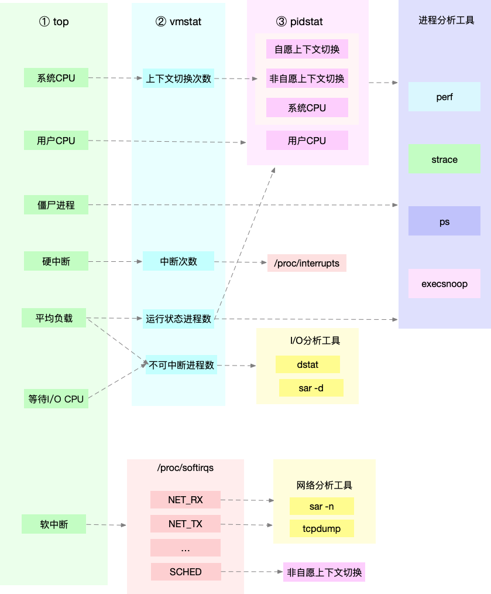

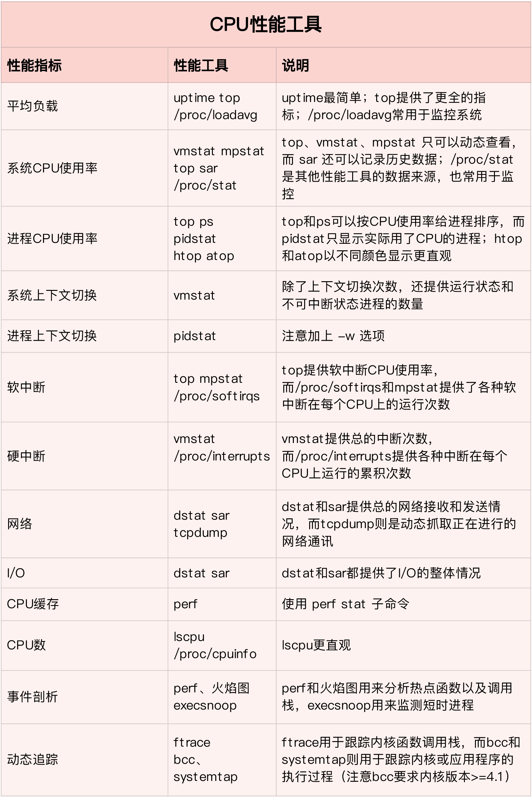

### top

top可以查看CPU总体消耗，包括分项消耗，如User，System，Idle，nice等。

- `Shift + H` 显示java线程
- `Shift + M` 按照内存使用排序
- `Shift + P` 按照CPU使用时间（使用率）排序
- `Shift + T` 按照CPU累积使用时间排序

```shell
top - 15:24:11 up 8 days,  7:52,  1 user,  load average: 5.73, 6.85, 7.33
Tasks:  17 total,   1 running,  16 sleeping,   0 stopped,   0 zombie
%Cpu(s): 13.9 us,  9.2 sy,  0.0 ni, 76.1 id,  0.1 wa,  0.0 hi,  0.1 si,  0.7 st
KiB Mem : 11962365+total, 50086832 free, 38312808 used, 31224016 buff/cache
KiB Swap:        0 total,        0 free,        0 used. 75402760 avail Mem

   PID USER      PR  NI    VIRT    RES    SHR S  %CPU %MEM     TIME+ COMMAND
   300 ymmapp    20   0 17.242g 1.234g  14732 S   2.3  1.1   9:40.38 java
     1 root      20   0   15376   1988   1392 S   0.0  0.0   0:00.06 sh
    11 root      20   0  120660  11416   1132 S   0.0  0.0   0:04.94 python
    54 root      20   0   85328   2240   1652 S   0.0  0.0   0:00.00 su
......
```

第三行：`%Cpu(s): 13.9 us, 9.2 sy, 0.0 ni, 76.1 id, 0.1 wa, 0.0 hi, 0.1 si, 0.7 st`：**用户空间CPU占比13.9%** ，内核空间CPU占比9.2%，改变过优先级的进程CPU占比0%，**空闲CPU占比76.1** ，**IO等待占用CPU占比0.1%** ，硬中断占用CPU占比0%，软中断占用CPU占比0.1%,当前VM中的cpu 时钟被虚拟化偷走的比例0.7%。其中：

- `PID`：进程id
- `USER`：进程所有者
- `VIRT`：虚拟内存，进程使用的虚拟内存总量，单位kb。VIRT=SWAP+RES
- `RES`：常驻内存，进程使用的、未被换出的物理内存大小，单位kb。RES=CODE+DATA
- `SHR`：共享内存，共享内存大小，单位kb
- `%CPU`：上次更新到现在的CPU时间占用百分比
- `%MEM`：进程使用的物理内存百分比


### htop

htop基本上是一个top改善版本，它能够以更加多彩的方式显示更多的统计信息，同时允许你采用不同的方式进行排序，它提供了一个用户友好的接口。


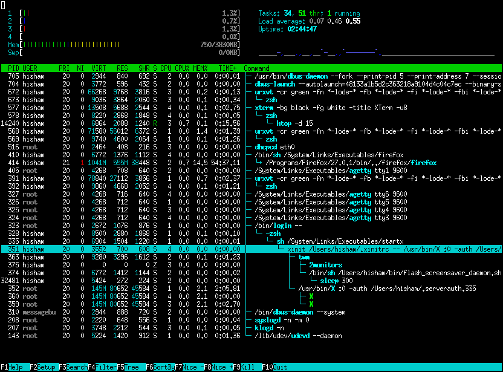


### sar

① 通过`sar -u 1 3`可以查看CUP总体消耗占比，每间隔1秒钟统计1次总共统计3次：

```shell
[root@localhost ~]# sar -u 1 3
Linux 3.10.0-1062.el7.x86_64 (localhost.localdomain)    2020年05月01日  _x86_64_        (2 CPU)
15时18分03秒     CPU     %user     %nice   %system   %iowait    %steal     %idle
15时18分06秒     all      0.00      0.00      0.17      0.00      0.00     99.83
15时18分09秒     all      0.00      0.00      0.17      0.00      0.00     99.83
15时18分12秒     all      0.17      0.00      0.17      0.00      0.00     99.66
15时18分15秒     all      0.00      0.00      0.00      0.00      0.00    100.00
15时18分18秒     all      0.00      0.00      0.00      0.00      0.00    100.00
```

- `%user`：用户空间的CPU使用
- `%nice`：改变过优先级的进程的CPU使用率
- `%system`：内核空间的CPU使用率
- `%iowait`：CPU等待IO的百分比 
- `%steal`：虚拟机的虚拟机CPU使用的CPU
- `%idle`：空闲的CPU

在以上的显示当中，主要看`%iowait`和`%idle`：

- 若 `%iowait`的值过高，表示硬盘存在I/O瓶颈
- 若 `%idle`的值高但系统响应慢时，有可能是 CPU 等待分配内存，此时应加大内存容量
- 若 `%idle`的值持续低于 10，则系统的 CPU 处理能力相对较低，表明系统中最需要解决的资源是 CPU


② 查看平均负载` sar -q 1 3`：

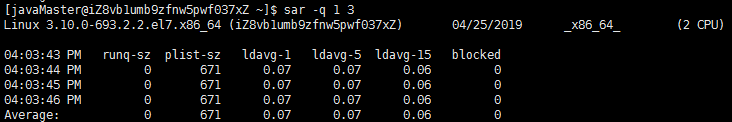

- `runq-sz`：运行队列的长度（等待运行的进程数，每核的CP不能超过3个）
- `plist-sz`：进程列表中的进程（processes）和线程数（threads）的数量
- `ldavg-1`：最后1分钟的CPU平均负载，即将多核CPU过去一分钟的负载相加再除以核心数得出的平均值，
- `ldavg-5`：最后5分钟的CPU平均负载
- `ldavg-15`：最后15分钟的CPU平均负载


## Memory

从内存的角度来说，主要的性能指标，就是系统内存的分配和使用、进程内存的分配和使用以及 SWAP 的用量。


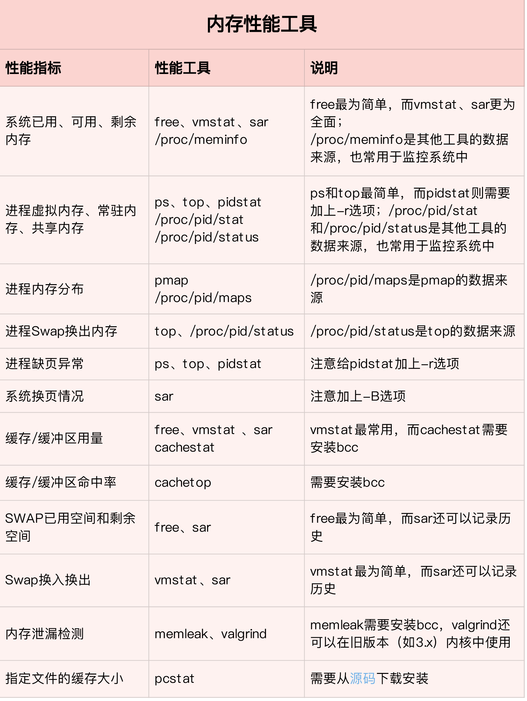

### free

`free`是查看内存使用情况，包括物理内存、交换内存(swap)和内核缓冲区内存。

```shell
# 语法
free [-bkmhotV][-s <间隔秒数>]

# 参数说明：
# -b 　以Byte为单位显示内存使用情况
# -k 　以KB为单位显示内存使用情况
# -m    以MB为单位显示内存使用情况
# -h 　以合适的单位显示内存使用情况，最大为三位数，自动计算对应单位值。单位：B=bytes, K=kilos, M=megas, G=gigas, T=teras
# -o 　不显示缓冲区调节列
# -s <间隔秒数> 　持续观察内存使用状况
# -t 　显示内存总和列
# -V 　显示版本信息
```

`free -h -s 3`表示每隔三秒输出一次内存情况，命令如下：

```shell
[1014154@cc69dd4c5-4tdb5 ~]$ free -h -s 3
              total        used        free      shared  buff/cache   available
Mem:           114G         41G         43G        4.1G         29G         67G
Swap:            0B          0B          0B
              total        used        free      shared  buff/cache   available
Mem:           114G         41G         43G        4.1G         29G         67G
Swap:            0B          0B          0B
```

- `Mem`：是内存的使用情况
- `Swap`：是交换空间的使用情况
- `total`：系统总的可用物理内存和交换空间大小
- `used`：已经被使用的物理内存和交换空间
- `free`：还有多少物理内存和交换空间可用使用，**是真正尚未被使用的物理内存数量** 
- `shared`：被共享使用的物理内存大小
- `buff/cache`：被 buffer（缓冲区） 和 cache（缓存） 使用的物理内存大小
- `available`：还可以被应用程序使用的物理内存大小，**它是从应用程序的角度看到的可用内存数量，available ≈ free + buffer + cache** 

**交换空间(swap space)**

swap space 是磁盘上的一块区域，当系统物理内存吃紧时，Linux 会将内存中不常访问的数据保存到 swap 上，这样系统就有更多的物理内存为各个进程服务，而当系统需要访问 swap 上存储的内容时，再将 swap 上的数据加载到内存中，这就是常说的换出和换入。交换空间可以在一定程度上缓解内存不足情况，但它需要读写磁盘数据，所以性能不是很高。


### vmstat

vmstat（Virtual Meomory Statistics，虚拟内存统计）是Linux中监控内存的常用工具，它收集和显示关于**内存**，**进程**，**终端**和**分页**和**I/O阻塞**的概括信息。

```shell
# 每隔1秒打印一次，一共打印3次。-S指定显示单位, M代表Mb, 默认为Kb
[root@localhost ~]# vmstat -SM 1 3
procs -----------memory---------- ---swap-- -----io---- -system-- ------cpu-----
 r  b   swpd   free   buff  cache   si   so    bi    bo   in   cs us sy id wa st
 1  0      0   2433      2    657    0    0   132     8   77   95  1  2 97  1  0
 0  0      0   2433      2    657    0    0     0     0   47   71  0  0 100  0  0
 0  0      0   2433      2    657    0    0     0     0   54   72  0  0 100  0  0
```

- **procs**

  - `r`：表示运行和等待CPU时间片的进程数（就是说多少个进程真的分配到CPU），**这个值如果长期大于系统CPU个数，说明CPU不足，需要增加CPU** 
  - `b`：表示在等待资源的进程数，比如正在等待I/O或者内存交换等

- **memory**

  - `swpd`：表示切换到内存交换区的内存大小，即虚拟内存已使用的大小（单位KB），**如果大于0，表示你的机器物理内存不足了，如果不是程序内存泄露的原因，那么你该升级内存了或者把耗内存的任务迁移到其他机器** 
  - `free`：表示当前空闲的物理内存
  - `buff`：表示缓冲大小，一般对块设备的读写才需要缓冲
  - `cache`：表示缓存大小，一般作为文件系统进行缓冲，频繁访问的文件都会被缓存，如果cache值非常大说明缓存文件比较多，如果此时io中的bi比较小，说明文件系统效率比较好

- **swap**：交换空间

  一般情况下si、so的值都为0，如果si、so的值长期不为0，则说明系统内存不足，需要增加系统内存。

  - `si`：表示数据由磁盘读入内存；通俗的讲就是每秒从磁盘读入虚拟内存的大小，**如果这个值大于0，表示物理内存不够用或者内存泄露了，要查找耗内存进程解决掉** 
  - `so`：表示由内存写入磁盘，也就是由内存交换区进入内存的数据大小

- **io**

  如果bi+bo的值过大，且wa值较大，则表示系统磁盘IO瓶颈。

  - `bi`：表示由块设备读入数据的总量，即读磁盘，单位kb/s
  - `bo`：表示写到块设备数据的总量，即写磁盘，单位kb/s

- **system**

  这两个值越大，则由内核消耗的CPU就越多。

  - `in`：表示某一时间间隔内观测到的每秒设备终端数
  - `cs`：表示每秒产生的上下文切换次数，**这个值要越小越好，太大了，要考虑调低线程或者进程的数目** 

- **CPU(百分比)**

  - `us`：表示用户进程消耗的CPU时间比，**us值越高，说明用户进程消耗CPU时间越多。如果长期大于50%，则需要考虑优化程序或者算法** 
  - `sy`：表示系统内核进程消耗的CPU时间比，**一般us+sy应该小于80%，如果大于80%，说明可能存在CPU瓶颈** 
  - `id`：表示CPU处在空间状态的时间百分比
  - `wa`：表示IP等待所占用的CPU时间百分比，**wa值越高，说明I/O等待越严重，根据经验wa的参考值为20%，如果超过20%，说明I/O等待严重，引起I/O等待的原因可能是磁盘大量随机读写造成的，也可能是磁盘或者监控器的贷款瓶颈（主要是块操作）造成的** 


## I/O

从文件系统和磁盘 I/O 的角度来说，主要性能指标，就是文件系统的使用、缓存和缓冲区的使用，以及磁盘 I/O 的使用率、吞吐量和延迟等。

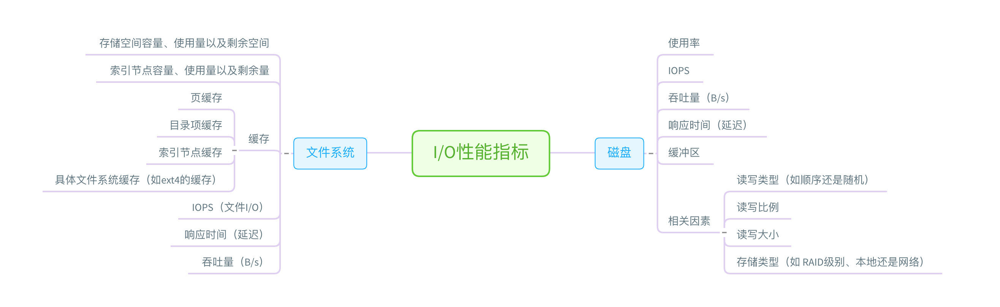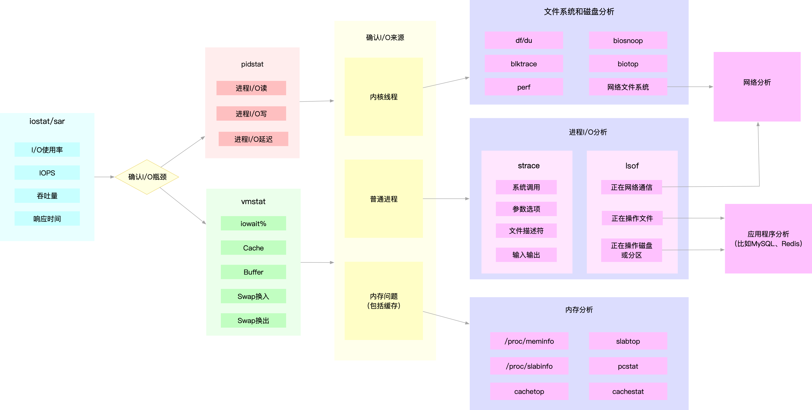

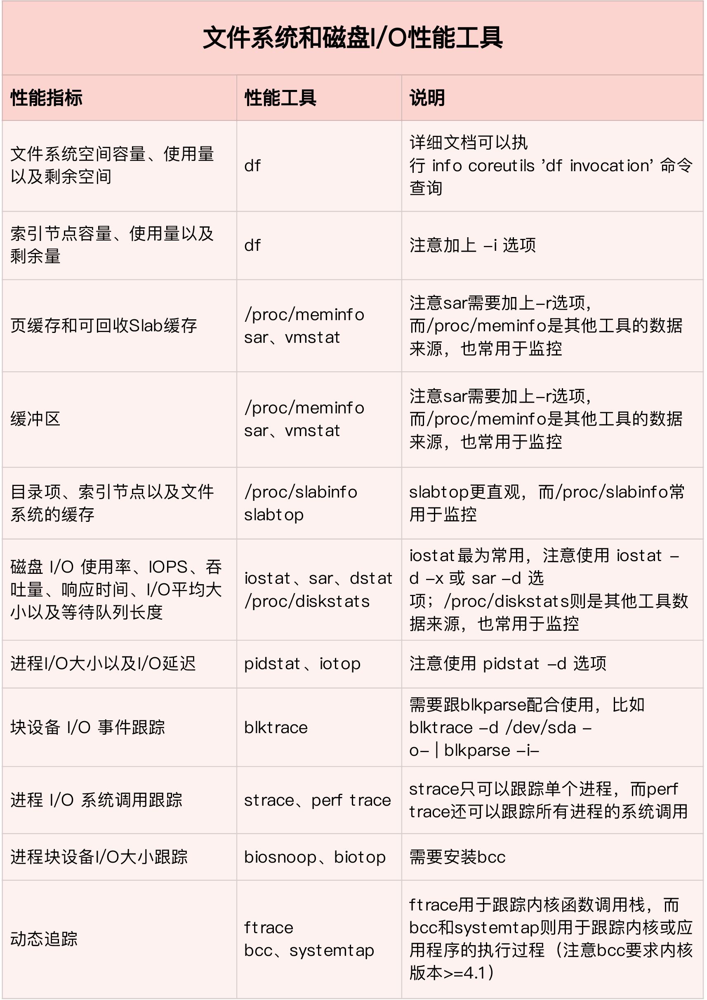

### iostat

iostat用于报告中央处理器（CPU）统计信息和整个系统、适配器、tty 设备、磁盘和 CD-ROM 的输入/输出统计信息，默认显示了与vmstat相同的cpu使用信息，使用以下命令显示扩展的设备统计：

```shell
# 每隔一秒打印一次磁盘的详细信息
iostat -dx 1
# 每秒打印一次统计信息，打印30次后退出
iostat 1 30
```

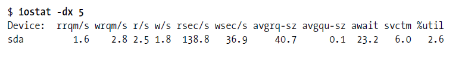

- **rrqm/s和wrqm/s**：每秒合并的读写请求，“合并的”即操作系统从队列中拿出多个逻辑请求合并为一个请求到实际磁盘
- **r/s和w/s**：每秒发送到设备的读和写请求数
- **rsec/s和wsec/s**：每秒读和写的扇区数
- **avgrq –sz**：请求的扇区数
- **avgqu –sz**：在设备队列中等待的请求数
- **await**：每个IO请求花费的时间
- **svctm**：实际请求（服务）时间
- **%util**：至少有一个活跃请求所占时间的百分比


### pidstat

pidstat主要用于监控全部或指定进程占用系统资源的情况。如CPU、内存、设备IO、任务切换和线程等。

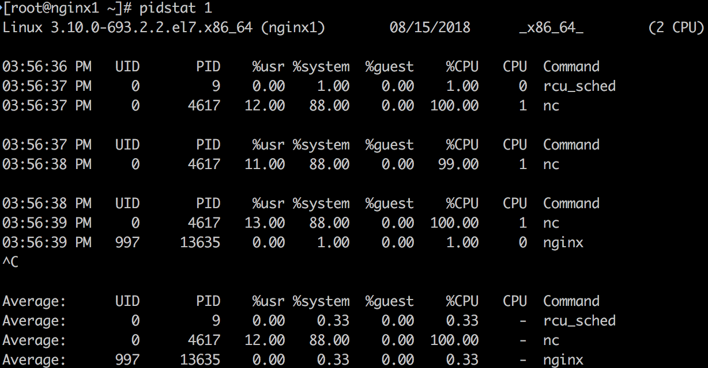

```shell
# 统计IO使用信息
pidstat –d <interval>
# 统计CPU使用信息
pidstat –u <interval>
# 统计内存使用信息
pidstat –r <interval>
# 查看特定进程的cpu统计信息
pidstat –p <pid>

# 查看特定进程的CPU使用情况
pidstat –u –p {pid} {interval} [count]

# 作用：以1秒为信息采集周期，采集10次程序“admin”的CPU统计信息，最后一行会输出10次统计信息的平均值 
pidstat -u -p `pgrep admin` 1 10

# 查看特定进程的内存使用情况
pidstat –r –p {pid} {interval} [count]

# 查看特定进程的IO使用情况
pidstat –d –p {pid} {interval} [count]
```


### iotop

iotop命令是专门显示硬盘IO的命令，界面风格类似top命令，可以显示IO负载具体是由哪个进程产生的。是一个用来监视磁盘I/O使用状况的top类工具，具有与top相似的UI，其中包括PID、用户、I/O、进程等相关信息。可以以非交互的方式使用：iotop –bod interval。查看每个进程的I/O，可以使用pidstat，pidstat –d instat。

```shell
# Linux安装iotop
yum install iotop
# Ubuntu安装iotop
sudo apt-get install iotop 
# 实时监控IO读写
iotop
```


## Network

从网络的角度来说，主要性能指标就是吞吐量、响应时间、连接数、丢包数等。


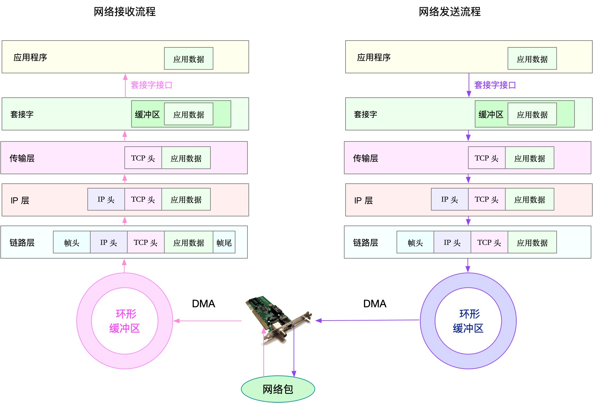

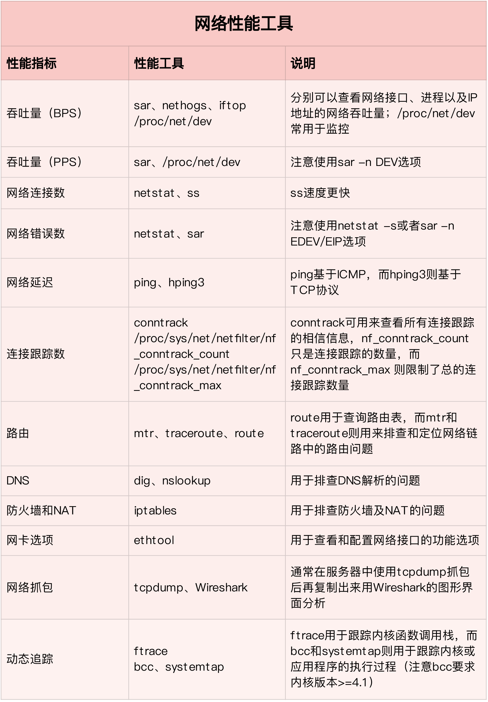

### netstat

netstat 是一个内置工具，用于显示IP、TCP、UDP和ICMP协议相关的统计数据，一般用于检验本机各端口网络连接情况。

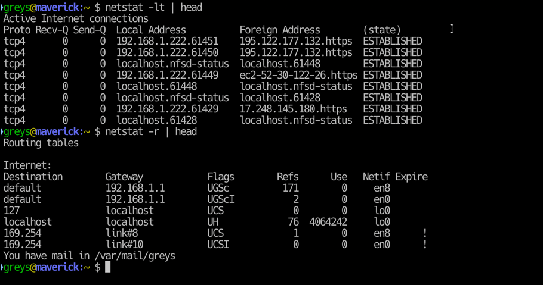

```shell
# 查看当前连接，注意CLOSE_WAIT偏高的情况
netstat -nat|awk '{print $6}'|sort|uniq -c|sort -rn
# 显示所有tcp连接，并包括pid和程序名
netstat -atnp
# 统计所有tcp状态的数量并排序
netstat -atn | awk '{print $6}' | sort | uniq -c | sort -rn
# 每隔1s显示网络信息(-c参数)
netstat -ctn | grep "ESTABLISHED"
# 列出所有处于连接状态的ip并按数量排序
netstat -an | grep ESTABLISHED | awk '/^tcp/ {print $5}' | awk -F: '{print $1}' | sort | uniq -c | sort -nr 
```

**案例分析**

```shell
[root@localhost ~]# netstat
Active Internet connections (w/o servers)
Proto Recv-Q Send-Q Local Address Foreign Address State
tcp 0 2 210.34.6.89:telnet 210.34.6.96:2873 ESTABLISHED
tcp 296 0 210.34.6.89:1165 210.34.6.84:netbios-ssn ESTABLISHED
tcp 0 0 localhost.localdom:9001 localhost.localdom:1162 ESTABLISHED
tcp 0 0 localhost.localdom:1162 localhost.localdom:9001 ESTABLISHED
tcp 0 80 210.34.6.89:1161 210.34.6.10:netbios-ssn CLOSE

Active UNIX domain sockets (w/o servers)
Proto RefCnt Flags Type State I-Node Path
unix 1 [ ] STREAM CONNECTED 16178 @000000dd
unix 1 [ ] STREAM CONNECTED 16176 @000000dc
unix 9 [ ] DGRAM 5292 /dev/log
unix 1 [ ] STREAM CONNECTED 16182 @000000df
```

其中"Recv-Q"和"Send-Q"指%0A的是接收队列和发送队列，这些数字一般都应该是0。如果不是则表示软件包正在队列中堆积，这种情况只能在非常少的情况见到。


### iftop

iftop可用来监控网卡的实时流量（可以指定网段）、反向解析IP、显示端口信息等，详细的将会在后面的使用参数中说明。

```shell
# 安装命令
yum install iftop
# 开始监控
iftop

# 结果参数说明：
# 1.中间的<= =>这两个左右箭头，表示的是流量的方向。
# 2.TX：发送流量
# 3.RX：接收流量
# 4.TOTAL：总流量
# 5.Cumm：运行iftop到目前时间的总流量
# 6.peak：流量峰值
# 7.rates：分别表示过去 2s 10s 40s 的平均流量
```


### tcpdump

tcpdump可以用来查看网络连接的封包内容。它显示了传输过程中封包内容的各种信息。为了使得输出信息更为有用，它允许使用者通过不同的过滤器获取自己想要的信息。


```shell
# 过滤主机--------
# 抓取所有经过 eth1，目的或源地址是 192.168.1.1 的网络数据
tcpdump -i eth1 host 192.168.1.1
# 源地址
tcpdump -i eth1 src host 192.168.1.1
# 目的地址
tcpdump -i eth1 dst host 192.168.1.1

# 过滤端口--------
# 抓取所有经过 eth1，目的或源端口是 25 的网络数据
tcpdump -i eth1 port 25
# 源端口
tcpdump -i eth1 src port 25
# 目的端口
tcpdump -i eth1 dst port 25

# 网络过滤--------
tcpdump -i eth1 net 192.168
tcpdump -i eth1 src net 192.168
tcpdump -i eth1 dst net 192.168

# 协议过滤--------
tcpdump -i eth1 arp
tcpdump -i eth1 ip
tcpdump -i eth1 tcp
tcpdump -i eth1 udp

# 常用表达式----------
# 非 : ! or "not" (去掉双引号)
# 且 : && or "and"
# 或 : || or "or"
# 抓取所有经过 eth1，目的地址是 192.168.1.254 或 192.168.1.200 端口是 80 的 TCP 数据
tcpdump -i eth1 '((tcp) and (port 80) and ((dst host 192.168.1.254) or (dst host 192.168.1.200)))'
# 抓取所有经过 eth1，目标 MAC 地址是 00:01:02:03:04:05 的 ICMP 数据
tcpdump -i eth1 '((icmp) and ((ether dst host 00:01:02:03:04:05)))'
# 抓取所有经过 eth1，目的网络是 192.168，但目的主机不是 192.168.1.200 的 TCP 数据
tcpdump -i eth1 '((tcp) and ((dst net 192.168) and (not dst host 192.168.1.200)))'

# 实时抓取端口号8000的GET包，然后写入GET.log
tcpdump -i eth0 '((port 8000) and (tcp[(tcp[12]>>2):4]=0x47455420))' -nnAl -w /tmp/GET.log
```


## Others

### dstat

该命令整合了 **vmstat、iostat、ifstat** 三种命令。同时增加了新的特性和功能可以让你能及时看到各种的资源使用情况，从而能够使你对比和整合不同的资源使用情况。通过不同颜色和区块布局的界面帮助你能够更加清晰容易的获取信息。它也支持将信息数据导出到cvs格式文件中，从而用其他应用程序打开，或者导入到数据库中。你可以用该命令来监控cpu，内存和网络状态随着时间的变化。

**安装**

```shell
# Ubuntu安装方法
sudo apy-get install dstat
# Centos安装方法
yum install dstat
# ArchLinux系统
pacman -S dstat
```

**使用参数**

```shell
# 参数说明：
# -l ：显示负载统计量
# -m ：显示内存使用率（包括used，buffer，cache，free值）
# -r ：显示I/O统计
# -s ：显示交换分区使用情况
# -t ：将当前时间显示在第一行
# –fs ：显示文件系统统计数据（包括文件总数量和inodes值）
# –nocolor ：不显示颜色（有时候有用）
# –socket ：显示网络统计数据
# –tcp ：显示常用的TCP统计
# –udp ：显示监听的UDP接口及其当前用量的一些动态数据

# 插件库：
# -–disk-util ：显示某一时间磁盘的忙碌状况
# -–freespace ：显示当前磁盘空间使用率
# -–proc-count ：显示正在运行的程序数量
# -–top-bio ：指出块I/O最大的进程
# -–top-cpu ：图形化显示CPU占用最大的进程
# -–top-io ：显示正常I/O最大的进程
# -–top-mem ：显示占用最多内存的进程

# eg：
# 查看全部内存都有谁在占用
dstat -g -l -m -s --top-mem
# 显示一些关于CPU资源损耗的数据
dstat -c -y -l --proc-count --top-cpu
# 想输出一个csv格式的文件用于以后，可以通过下面的命令
dstat –output /tmp/sampleoutput.csv -cdn
```

**监控分析**

```shell
dstat

# 结果参数说明：
# 1.CPU状态：CPU的使用率。这项报告更有趣的部分是显示了用户，系统和空闲部分，这更好地分析了CPU当前的使用状况。如果你看到"wait"一栏中，CPU的状态是一个高使用率值，那说明系统存在一些其它问题。当CPU的状态处在"waits"时，那是因为它正在等待I/O设备（例如内存，磁盘或者网络）的响应而且还没有收到。
# 2.磁盘统计：磁盘的读写操作，这一栏显示磁盘的读、写总数。
# 3.网络统计：网络设备发送和接受的数据，这一栏显示的网络收、发数据总数。
# 4.分页统计：系统的分页活动。分页指的是一种内存管理技术用于查找系统场景，一个较大的分页表明系统正在使用大量的交换空间，或者说内存非常分散，大多数情况下你都希望看到page in（换入）和page out（换出）的值是0 0。
# 5.系统统计：这一项显示的是中断（int）和上下文切换（csw）。这项统计仅在有比较基线时才有意义。这一栏中较高的统计值通常表示大量的进程造成拥塞，需要对CPU进行关注。你的服务器一般情况下都会运行运行一些程序，所以这项总是显示一些数值。

# 默认情况下，dstat每秒都会刷新数据。如果想退出dstat，你可以按"CTRL-C"键。
```


### saidar

saidar是一个简单且轻量的系统信息监控工具。虽然它无法提供大多性能报表，但是它能够通过一个简单明了的方式显示最有用的系统运行状况数据。可以容易地看到运行时间、平均负载、CPU、内存、进程、磁盘和网络接口统计信息。

```powershell
# Usage: saidar [-d delay] [-c] [-v] [-h]
# -d 设置更新时间（秒）
# -c 彩色显示
# -v 显示版本号
# -h 显示本帮助
```


### Glances

**Glances** 是一个由 Python 编写，使用 **psutil** 库来从系统抓取信息的基于 curses 开发的跨平台命令行系统监视工具。 通过 Glances，我们可以监视 **CPU、平均负载、内存、网络流量、磁盘 I/O、其它处理器** 和 **文件系统** 空间的利用情况。

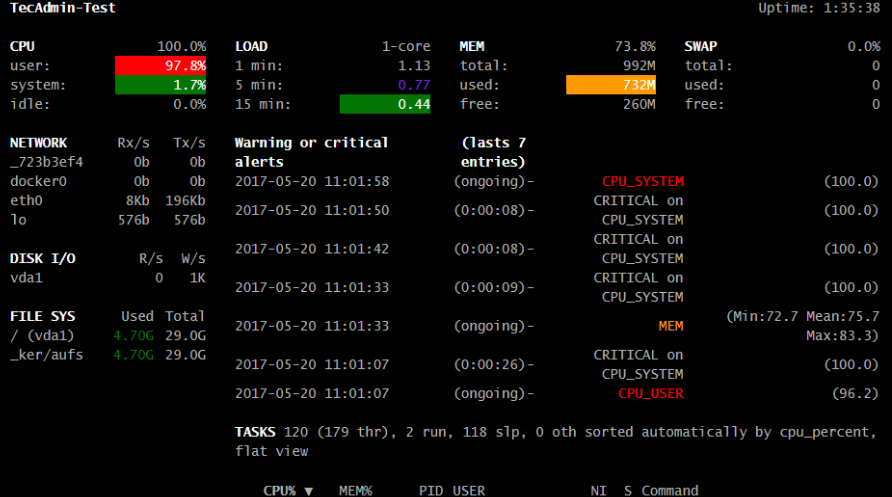

**在 Linux/Unix 系统中安装 Glances**

```powershell
# 对于 RHEL/CentOS/Fedora 发行版
# yum install -y glances

#对于 Debian/Ubuntu/Linux Mint 发行版
# sudo apt-add-repository ppa:arnaud-hartmann/glances-stable
# sudo apt-get update
# sudo apt-get install glances
```

**使用 Glances**

```powershell
# Glances 的默认刷新频率是 1 （秒），但是你可以通过在终端指定参数来手动定义其刷新频率
# glances -t 2

# 按下 ‘**q**‘ （‘**ESC**‘ 和 ‘**Ctrl-C**‘ 也可以） 退出 Glances 终端
```

**Glances 的选项**

- `m` : 按内存占用排序进程
- `p` : 按进程名称排序进程
- `c` : 按 CPU 占用率排序进程
- `i` : 按 I/O 频率排序进程
- `a` : 自动排序进程
- `d` : 显示/隐藏磁盘 I/O 统计信息
- `f` : 显示/隐藏文件系统统计信息
- `s` : 显示/隐藏传感器统计信息
- `y` : 显示/隐藏硬盘温度统计信息
- `l` : 显示/隐藏日志
- `n` : 显示/隐藏网络统计信息
- `x` : 删除警告和严重日志
- `h` : 显示/隐藏帮助界面
- `q` : 退出
- `w` : 删除警告记录


### GoAccess

**GoAccess 是一个实时的网络日志分析器**。它能分析 apache、nginx 和 amazon cloudfront 的访问日志。它也可以将数据输出成 HTML、JSON 或 CSV 格式。它会给你一个基本的统计信息、访问量、404 页面，访客位置和其他东西。

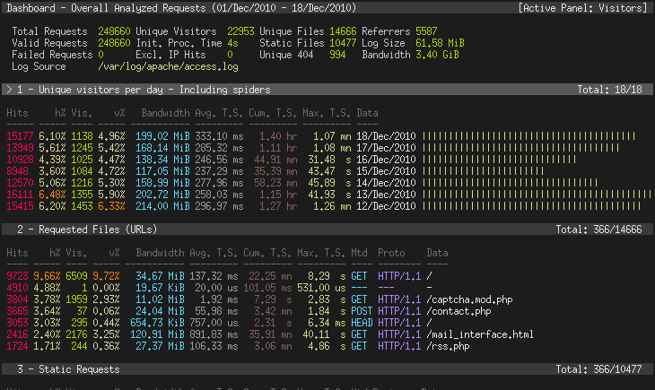

**下载与安装**

```powershell
# wget https://tar.goaccess.io/goaccess-1.3.tar.gz
# tar -xzvf goaccess-1.3.tar.gz
# cd goaccess-1.3/
# ./configure --enable-utf8 --enable-geoip=legacy
# make
# make install
```


## 瓶颈排查

### 定位线上最耗CPU的线程

**第一步：通过 `top` 命令找到最耗时 ( `Shift + P` ) 的进程**

```shell
[root@localhost ~]# top
top - 11:11:05 up 20:02,  3 users,  load average: 0.09, 0.07, 0.05
Tasks: 225 total,   1 running, 224 sleeping,   0 stopped,   0 zombie
%Cpu(s):  0.0 us,  0.7 sy,  0.0 ni, 99.3 id,  0.0 wa,  0.0 hi,  0.0 si,  0.0 st
KiB Mem :  1421760 total,   135868 free,   758508 used,   527384 buff/cache
KiB Swap:  2097148 total,  2070640 free,    26508 used.   475852 avail Mem
Change delay from 3.0 to
   PID USER      PR  NI    VIRT    RES    SHR S  %CPU %MEM     TIME+ COMMAND
 98344 root      20   0 2422552  23508  12108 S   0.7  1.7   0:00.32 java
     1 root      20   0  194100   6244   3184 S   0.0  0.4   0:20.41 systemd
     2 root      20   0       0      0      0 S   0.0  0.0   0:00.12 kthreadd
     4 root       0 -20       0      0      0 S   0.0  0.0   0:00.00 kworker/0:0H
     6 root      20   0       0      0      0 S   0.0  0.0   0:20.25 ksoftirqd/0
```

找到进程号是98344。

**第二步：找到进程中最耗CUP的线程**

使用`ps -Lp <pid> cu`命令，查看某个进程中的线程CPU消耗排序：

```shell
[root@localhost ~]# ps -Lp 98344 cu
USER        PID    LWP %CPU NLWP %MEM    VSZ   RSS TTY      STAT START   TIME COMMAND
root      98344  98344  0.0   10  4.1 2422552 59060 pts/0   Sl+  11:09   0:00 java
root      98344  98345  0.0   10  4.1 2422552 59060 pts/0   Sl+  11:09   0:04 java
root      98344  98346  0.0   10  4.1 2422552 59060 pts/0   Sl+  11:09   0:01 VM Thread
root      98344  98347  0.0   10  4.1 2422552 59060 pts/0   Sl+  11:09   0:00 Reference Handl
root      98344  98348  0.0   10  4.1 2422552 59060 pts/0   Sl+  11:09   0:00 Finalizer
root      98344  98349  0.0   10  4.1 2422552 59060 pts/0   Sl+  11:09   0:00 Signal Dispatch
root      98344  98350  0.0   10  4.1 2422552 59060 pts/0   Sl+  11:09   0:05 C2 CompilerThre
root      98344  98351  0.0   10  4.1 2422552 59060 pts/0   Sl+  11:09   0:00 C1 CompilerThre
root      98344  98352  0.0   10  4.1 2422552 59060 pts/0   Sl+  11:09   0:00 Service Thread
root      98344  98353  0.1   10  4.1 2422552 59060 pts/0   Sl+  11:09   0:19 VM Periodic Tas
```

看`TIME`列可看出哪个线程耗费CUP多，`LWP`列可以看到线程的ID号，但需要转换成16进制才可以查询线程堆栈信息。

**第三步：获取线程id的十六进制码**

使用`printf '%x\n' <LWP>`命令做进制转换：

```shell
[root@localhost ~]# printf '%x\n' 98345
18029
```

**第四步：查看线程堆栈信息**

使用jstack获取堆栈信息`jstack <pid> | grep -A 10 <16进制LWP>`：

```shell
[root@localhost ~]# jstack 98344 | grep -A 10 0x18029
"main" #1 prio=5 os_prio=0 tid=0x00007fb88404b800 nid=0x18029 waiting on condition [0x00007fb88caab000]
   java.lang.Thread.State: TIMED_WAITING (sleeping)
        at java.lang.Thread.sleep(Native Method)
        at java.lang.Thread.sleep(Thread.java:340)
        at java.util.concurrent.TimeUnit.sleep(TimeUnit.java:386)
        at demo.MathGame.main(MathGame.java:17)

"VM Thread" os_prio=0 tid=0x00007fb8840f2800 nid=0x1802a runnable
"VM Periodic Task Thread" os_prio=0 tid=0x00007fb884154000 nid=0x18031 waiting on condition
```

通过命令我们可以看到这个线程的对应的耗时代码是在 `demo.MathGame.main(MathGame.java:17)`


### 定位丢包错包情况

`watch more /proc/net/dev`用于定位丢包，错包情况，以便看网络瓶颈，重点关注drop(包被丢弃)和网络包传送的总量，不要超过网络上限：

```shell
[root@localhost ~]# watch -n 2 more /proc/net/dev
Every 2.0s: more /proc/net/dev                                                                                                                                                   Fri May  1 17:16:55 2020
Inter-|   Receive                                                |  Transmit
 face |bytes    packets errs drop fifo frame compressed multicast|bytes    packets errs drop fifo colls carrier compressed
    lo:   10025     130    0    0    0     0          0         0    10025     130    0    0    0     0       0          0
 ens33: 759098071  569661    0    0    0     0          0         0 19335572  225551    0    0    0     0       0          0
```

- 最左边的表示接口的名字，Receive表示收包，Transmit表示发送包
- `bytes`：表示收发的字节数
- `packets`：表示收发正确的包量
- `errs`：表示收发错误的包量
- `drop`：表示收发丢弃的包量


### 查看路由经过的地址

`traceroute ip`可以查看路由经过的地址，常用来统计网络在各个路由区段的耗时，如：

```shell
[root@localhost ~]# traceroute 14.215.177.38
traceroute to 14.215.177.38 (14.215.177.38), 30 hops max, 60 byte packets
 1  CD-HZTK5H2.mshome.net (192.168.137.1)  0.126 ms * *
 2  * * *
 3  10.250.112.3 (10.250.112.3)  12.587 ms  12.408 ms  12.317 ms
 4  172.16.227.230 (172.16.227.230)  2.152 ms  2.040 ms  1.956 ms
 5  172.16.227.202 (172.16.227.202)  11.884 ms  11.746 ms  12.692 ms
 6  172.16.227.65 (172.16.227.65)  2.665 ms  3.143 ms  2.923 ms
 7  171.223.206.217 (171.223.206.217)  2.834 ms  2.752 ms  2.654 ms
 8  182.150.18.205 (182.150.18.205)  5.145 ms  5.815 ms  5.542 ms
 9  110.188.6.33 (110.188.6.33)  3.514 ms 171.208.199.185 (171.208.199.185)  3.431 ms 171.208.199.181 (171.208.199.181)  10.768 ms
10  202.97.29.17 (202.97.29.17)  29.574 ms 202.97.30.146 (202.97.30.146)  32.619 ms *
11  113.96.5.126 (113.96.5.126)  36.062 ms 113.96.5.70 (113.96.5.70)  35.940 ms 113.96.4.42 (113.96.4.42)  45.859 ms
12  90.96.135.219.broad.fs.gd.dynamic.163data.com.cn (219.135.96.90)  35.680 ms  35.468 ms  35.304 ms
13  14.215.32.102 (14.215.32.102)  35.135 ms 14.215.32.110 (14.215.32.110)  35.613 ms 14.29.117.242 (14.29.117.242)  54.712 ms
14  * 14.215.32.134 (14.215.32.134)  49.518 ms 14.215.32.122 (14.215.32.122)  47.652 ms
15  * * *
...
```


### 查看网络错误

`netstat -i`可以查看网络错误：

```shell
[root@localhost ~]# netstat -i
Kernel Interface table
Iface             MTU    RX-OK RX-ERR RX-DRP RX-OVR    TX-OK TX-ERR TX-DRP TX-OVR Flg
ens33            1500   570291      0      0 0        225897      0      0      0 BMRU
lo              65536      130      0      0 0           130      0      0      0 LRU
```

- `Iface`: 网络接口名称
- `MTU`: 最大传输单元，它限制了数据帧的最大长度，不同的网络类型都有一个上限值，如：以太网的MTU是1500
- `RX-OK`：接收时，正确的数据包数
- `RX-ERR`：接收时，产生错误的数据包数
- `RX-DRP`：接收时，丢弃的数据包数
- `RX-OVR`：接收时，由于过速（在数据传输中，由于接收设备不能接收按照发送速率传送来的数据而使数据丢失）而丢失的数据包数
- `TX-OK`：发送时，正确的数据包数
- `TX-ERR`：发送时，产生错误的数据包数
- `TX-DRP`：发送时，丢弃的数据包数
- `TX-OVR`：发送时，由于过速而丢失的数据包数
- `Flg`：标志，B 已经设置了一个广播地址。L 该接口是一个回送设备。M 接收所有数据包（混乱模式）。N 避免跟踪。O 在该接口上，禁用ARP。P 这是一个点到点链接。R 接口正在运行。U 接口处于“活动”状态


### 包的重传率

`cat /proc/net/snmp` 查看和分析240秒内网络包量、流量、错包和丢包。通过 `RetransSegs` 和 `OutSegs` 来计算：

**TCP重传率 =（RetransSegs ÷ OutSegs）× 100%**

```shell
[root@localhost ~]# cat /proc/net/snmp
Ip: Forwarding DefaultTTL InReceives InHdrErrors InAddrErrors ForwDatagrams InUnknownProtos InDiscards InDelivers OutRequests OutDiscards OutNoRoutes ReasmTimeout ReasmReqds ReasmOKs ReasmFails FragOKs FragFails FragCreates
Ip: 1 64 241708 0 0 0 0 0 238724 225517 15 0 0 0 0 0 0 0 0
Icmp: InMsgs InErrors InCsumErrors InDestUnreachs InTimeExcds InParmProbs InSrcQuenchs InRedirects InEchos InEchoReps InTimestamps InTimestampReps InAddrMasks InAddrMaskReps OutMsgs OutErrors OutDestUnreachs OutTimeExcds OutParmProbs OutSrcQuenchs OutRedirects OutEchos OutEchoReps OutTimestamps OutTimestampReps OutAddrMasks OutAddrMaskReps
Icmp: 149 0 0 50 99 0 0 0 0 0 0 0 0 0 147 0 147 0 0 0 0 0 0 0 0 0 0
IcmpMsg: InType3 InType11 OutType3
IcmpMsg: 50 99 147
Tcp: RtoAlgorithm RtoMin RtoMax MaxConn ActiveOpens PassiveOpens AttemptFails EstabResets CurrEstab InSegs OutSegs RetransSegs InErrs OutRsts InCsumErrors
Tcp: 1 200 120000 -1 376 6 0 0 4 236711 223186 292 0 4 0
Udp: InDatagrams NoPorts InErrors OutDatagrams RcvbufErrors SndbufErrors InCsumErrors
Udp: 1405 438 0 1896 0 0 0
UdpLite: InDatagrams NoPorts InErrors OutDatagrams RcvbufErrors SndbufErrors InCsumErrors
UdpLite: 0 0 0 0 0 0 0
```

TCP重传率为：（292÷223186） × 100% = 0.13%

- **平均每秒新增TCP连接数**：通过/proc/net/snmp文件得到最近240秒内PassiveOpens的增量，除以240得到每秒的平均增量
- **机器的TCP连接数** ：通过/proc/net/snmp文件的CurrEstab得到TCP连接数
- **平均每秒的UDP接收数据报**：通过/proc/net/snmp文件得到最近240秒内InDatagrams的增量，除以240得到平均每秒的UDP接收数据报
- **平均每秒的UDP发送数据报**：通过/proc/net/snmp文件得到最近240秒内OutDatagrams的增量，除以240得到平均每秒的UDP发送数据报


# Shell

## 基本语法

### 第一行

第一行必须是 `#!/bin/sh`。

- 它不是注释，`#!/bin/sh` 是对shell的声明，说明你所用的是那种类型的shell及其路径所在
- 如果没有声明，则脚本将在默认的shell中执行，默认shell是由用户所在的系统定义为执行shell脚本的shell
- 如果脚本被编写为在Kornshell ksh中运行，而默认运行shell脚本的为C shell csh,则脚本在执行过程中很可能失败
- 所以建议大家就把 `#!/bin/sh` 当成C 语言的main函数一样，写shell必须有，以使shell程序更严密


### 注释

一行开头为 `#`。


### 接收参数

脚本文件“copy.sh”，其内容如下：

```shell
m=$1
n=$2
echo $m-$n
```

执行命令：“sh copy.sh 111 222”；输出 111-222


### 格式化输出日期

```shell
curdate="`date +%Y%m%d%H%M%S`"
echo $curdate
```

执行结果：20210504175817


### exist

退出当前shell脚本，一般来说，返回0表示执行成功，其他值表示没有执行成功。

```shell
exist 0    # 返回0
exist 1    # 返回1
```


## 变量

### 变量命名

shell 变量的命名规则如下：开头是一个字母或下划线，后面可以接任意长度的字母、数字或下划线符号，变量名的字符长度并无限制（Bourne shell中）。不过为了兼容性（一些早期的shell里变量名是有长度限制的），一般还是不要超过255个字符。另外，**Linux区分大小写**。当用户自己定义变量的时候，要注意变量名不能与 shell 中的关键字重名。


### 变量赋值

`变量名=值`

注意：**赋值语句两边不能有空格（即 “=” 号两边不能有空格）**。**等号右边若有空格的话，需要加上引号（单引号或双引号都是可以的）**。shell 中可以在变量名前加上 $ 字符来取变量的值。


### 定义变量

定义单变量：

```shell
p_name='kang'
```

使用单变量：

```shell
echo  $p_name'.js'    # 输出kang.js
echo  $p_name.js      # 输出kang.js
cp  $p_name.js  copy.js;
```


### 系统变量

```shell
pwd=$PWD      # 当前目录
user=$USER    # 当前用户
echo $pwd
echo $user
```

运行脚本后输出：

```shell
/home/rainman/test
rainman
```


## 数组

- Shell 并且没有限制数组的大小，理论上可以存放无限量的数据
- Shell 数组元素的下标也是从 0 开始计数
- 获取数组中的元素要使用下标`[ ]`，下标可以是一个整数，也可以是一个结果为整数的表达式、
- 下标必须大于等于 0
- 常用的 Bash Shell 只支持一维数组，不支持多维数组

```shell
 #!/bin/bash

nums=(29 100 13 8 91 44)
echo ${nums[@]}  # 输出所有数组元素
nums[10]=66         # 给第10个元素赋值（此时会增加数组长度）
echo ${nums[*]}   # 输出所有数组元素
echo ${nums[4]}   # 输出第4个元素
```


### 获取数组长度

利用`@`或`*`，可以将数组扩展成列表，然后使用`#`来获取数组元素的个数，格式如下：

```shell
${#array_name[@]}
${#array_name[*]}
```

其中 array_name 表示数组名。两种形式是等价的，选择其一即可。示例如下：

```shell
 #!/bin/bash

nums=(29 100 13)
echo ${#nums[*]} # 输出3

# 向数组中添加元素
nums[10]="http://c.biancheng.net/shell/"
echo ${#nums[@]} # 输出4
```


### 数组拼接

拼接数组的思路是：先利用`@`或`*`，将数组扩展成列表，然后再合并到一起。具体格式如下：

```shell
array_new=(${array1[@]}  ${array2[@]})
array_new=(${array1[*]}  ${array2[*]})
```

两种方式是等价的，选择其一即可。其中，array1 和 array2 是需要拼接的数组，array_new 是拼接后形成的新数组。完整示例如下：

```shell
 #!/bin/bash

array1=(23 56)
array2=(99 "https://www.baidu.com/")
array_new=(${array1[@]} ${array2[*]})
echo ${array_new[@]}  # 也可以写作 ${array_new[*]}
```

运行结果：`23 56 99 https://www.baidu.com/`


### 删除数组元素

在 Shell 中，使用 unset 关键字来删除数组元素，具体格式如下：

```shell
unset array_name[index]
```

其中，array_name 表示数组名，index 表示数组下标。如果不写下标，而是写成下面的形式：

```shell
unset array_name
```

那么就是删除整个数组，所有元素都会消失。

```shell
 #!/bin/bash
 
arr=(23 56 99 "https://www.baidu.com/")
unset arr[1]
echo ${arr[@]}

unset arr
echo ${arr[*]}
```

运行结果：`23 99 https://www.baidu.com/`


## 算术运算

### expr命令求值

使用 expr 命令对算术表达式求值，常见的命令如下：

| 表达式           | 说明                                                     |
| ---------------- | -------------------------------------------------------- |
| `expr1 | expr2`  | 若 expr1 非零，则等于 expr1 ，否则等于 expr2。           |
| `expr1 & expr2`  | 只要有一个表达式为零，则等于零，否则等于 expr1。         |
| `expr1 = expr2`  | 等于（与 == 是同义的），若两式相等则结果为1，不等结果为0 |
| `expr1 > expr2`  | 大于                                                     |
| `expr1 >= expr2` | 大于等于                                                 |
| `expr1 < expr2`  | 小于                                                     |
| `expr1 <= expr2` | 小于等于                                                 |
| `expr1 != expr2` | 不等于                                                   |
| `expr1 + expr2`  | 加                                                       |
| `expr1 - expr2`  | 减                                                       |
| `expr1 * expr2`  | 乘                                                       |
| `expr1 / expr2`  | 整除                                                     |
| `expr1 % expr2`  | 取余                                                     |

注意：在 expr 命令所支持的操作符中，“`|`、`&`、`<`、`<=`、`>`、`>=`、 `\*` ” 这几个需要用 `\` 符进行转义再使用。此外，表达式的各字符之间需要用空格隔开。使用方法如下：

```shell
  #!/bin/bash
  
  a=5;b=6;c=0
  echo $(expr $a \| $c)        # 输出 5
  echo $(expr $b \& $c)       # 输出 0
  echo $(expr $a \& $b)       # 输出 5
  echo $(expr $a \<= $b)      # 输出 1
  echo $(expr $a \* $b)       # 输出 30
  echo $(expr $a = 2)           # 输出 1   exit 0 
```


**逻辑符号**

- `命令1 && 命令2`：如果左边的“命令1”执行成功，那么右边的“命令2”才会被执行 

- `命令1 || 命令2`：与&&相反。如果“命令1”未执行成功，那么就执行“命令2”


### $(( ... ))求值

使用 `$(( ... ))` 的方式对算术表达式求值。

expr 虽然功能强大，但是上面已经提到，在进行一些运算的时候，需要使用 `\` 符来进行转义，这对于阅读代码的人来说并不友好。另一方面，expr 命令执行起来其实很慢，因为它需要调用一个新的 shell 来处理 expr 命令。更新更好的一种做法是使用 `$((...))` 扩展的方式。只需要将准备求值的表达式放在 `$((...))` 的括号中即可进行简单的算术求值。且，所有支持 `$(( ... ))` 的 shell，都可以让用户在提供变量名称时，无须前置 `$` 符。用一段代码演示一下用法：

```shell
 #!/bin/bash
 
 a=5;b=6
 
 echo $(($a + $b))　　# 输出 11 。在变量名前加上 $，这在shell中一般是取变量值的意思
 echo $((a + b))            # 输出 11 。可见，变量前不加 $ 也是可以的，为了简便，后面的代码就不加 $ 了 
 echo $((a | b))            # 输出 7 。这里的 | 是按位或操作符
 echo $((a || b))           # 输出 1 。这里的 || 是逻辑或操作符
 echo $((a & b))            # 输出 4 。这里的 & 是按位与操作符
 echo $((a && b))          # 输出 1 。这里的 && 是逻辑与操作符
 echo $((a * b))             # 输出 30
 echo $((a == b))           # 输出 0 exit 0
```


## 字符串

字符串可以由单引号`' '`包围，也可以由双引号`" "`包围，也可以不用引号。它们之间的区别：

- 由单引号`' '`包围的字符串
  - 任何字符都会原样输出，在其中使用变量是无效的
  - 字符串中不能出现单引号，即使对单引号进行转义也不行

- 由双引号`" "`包围的字符串
  - 如果其中包含了某个变量，那么该变量会被解析（得到该变量的值），而不是原样输出
  - 字符串中可以出现双引号，只要它被转义了就行

- 不被引号包围的字符串
  - 不被引号包围的字符串中出现变量时也会被解析，这一点和双引号`" "`包围的字符串一样
  - 字符串中不能出现空格，否则空格后边的字符串会作为其他变量或者命令解析


### 拼接 

字符串拼接连接、合并。

```shell
 #!/bin/bash

name="Shell"
url="https://www.baidu.com/"

str1=$name$url                                      # 中间不能有空格
str2="$name $url"                                  # 如果被双引号包围，那么中间可以有空格
str3=$name": "$url                                 # 中间可以出现别的字符串
str4="$name: $url"                                 # 这样写也可以
str5="${name}Script: ${url}index.html"  # 这个时候需要给变量名加上大括号

echo $str1
echo $str2
echo $str3
echo $str4
echo $str5
```


### 截取

| 格式                         | 说明                                                         |
| ---------------------------- | ------------------------------------------------------------ |
| `${string: start :length}`   | 从 string 字符串的左边第 start 个字符开始，向右截取 length 个字符。 |
| `${string: start}`           | 从 string 字符串的左边第 start 个字符开始截取，直到最后。    |
| `${string: 0-start :length}` | 从 string 字符串的右边第 start 个字符开始，向右截取 length 个字符。 |
| `${string: 0-start}`         | 从 string 字符串的右边第 start 个字符开始截取，直到最后。    |
| `${string#*chars}`           | 从 string 字符串第一次出现 *chars 的位置开始，截取 *chars 右边的所有字符。 |
| `${string##*chars}`          | 从 string 字符串最后一次出现 *chars 的位置开始，截取 *chars 右边的所有字符。 |
| `${string%*chars}`           | 从 string 字符串第一次出现 *chars 的位置开始，截取 *chars 左边的所有字符。 |
| `${string%%*chars}`          | 从 string 字符串最后一次出现 *chars 的位置开始，截取 *chars 左边的所有字符。 |


## 条件判断

test 命令可以处理 shell 脚本中的各类工作。它产生的不是一般的输出，而是可使用的退出状态。test 命令通过接受各种不同的参数，来控制要执行哪种测试。在许多系统上，test 命令与 [ 命令的作用其实是一样的，使用 [ 命令的时候，一般在结尾加上 ] 符号，使代码更具可读性。另外，需要注意一点的是，在使用 [ 命令时，[ 符号与被检查的语句之间应该留有空格**。**shell 中通常使用 test 命令来产生控制结构所需要的条件，根据 test 命令的退出码决定是否需要执行后面的代码。

test 命令可以使用的条件类型有三类：字符串比较、算术比较和与文件有关的条件测试。

### 字符串比较

| 表达式               | 结果                               |
| -------------------- | ---------------------------------- |
| `string1 = string2`  | 如果两个字符串相同则结果为真       |
| `string1 != string2` | 如果两个字符串不同则结果为真       |
| `-n string`          | 如果字符串不为空则结果为真         |
| `-z string`          | 如果字符串为空（null），则结果为真 |

使用方法如下：

```shell
str1="tongye"
str2="ttyezi"

# 用 test 命令，test 语句的结果将作为 if 的判断条件，结果为真即条件为真，则执行 if 下面的语句
if test "$str1" = "$str2" ; then
    ....
fi

# 用 [ 命令的话，可以这样，注意 [ 与表达式之间要有空格
if [ "$str1" != "$str2" ] ; then
    ....
fi    if [ -n "$str1" ] ; then    ....fi
```

使用字符串比较的时候，必须给变量加上引号 " " ，避免因为空字符或字符串中的空格导致一些问题。实际上，对于条件测试语句里的变量，都建议加上双引号，能做字符串比较的时候，不要用数值比较。

 

### 算术比较

| 算术比较          | 结果                             |
| ----------------- | -------------------------------- |
| `expr1 -eq expr2` | 如果两个表达式相等，则结果为真   |
| `expr1 -ne expr2` | 如果两个表达式不相等，则结果为真 |
| `expr1 -gt expr2` | 如果 expr1 > expr2 ，则结果为真  |
| `expr1 -ge expr2` | 如果 expr1 >= expr2 ，则结果为真 |
| `expr1 -lt expr2` | 如果 expr1 < expr2，则结果为真   |
| `expr1 -le expr2` | 如果 expr1 <= expr2，则结果为真  |
| `!expr`           | 如果表达式为假，则结果为真       |

使用方法如下：

```shell
num1=2
num2=3

if [ "$num1" -eq "$num2" ] ; then
    ...
fi

if [ "$num1" -le "$num2" ] ; then
    ....
fi
```

注意算术比较和字符串比较之间的不同之处，字符串比较比较的是两个字符串，数字也是能组成字符串的，因此，当我们使用字符串比较的方式和数字比较的方式来比较两串数字的时候，结果会有些不同。案例如下：

```shell
  #!/bin/bash
  
  val1="1"
  val2="001"
  val3="1 "                        # 字符串 val3 在 1 的后面还有一个空格 　　                                                                         
  
  [ "$val1" = "$val2" ]
  echo $?　　　　　　　　# 使用字符串比较，退出码为 1，说明两个字符串不相等
  
  [ "$val1" -eq "$val2" ]
  echo $?　　　　　　　　# 使用数值比较，退出码为 0，说明两个数值相等
  
  [ "$val1" = "$val3" ]
  echo $?　　　　　　　　# 退出码为 1
  
  [ "$val1" -eq "$val3" ]
  echo $?　　　　　　　　# 退出码为 0  exit 0
```

需要注意的是，如果在编写代码时，变量没有加上双引号，上述程序的结果又会不同，仅对 val3 进行取值，将会忽略该字符串中的空格，则第三个表达式的退出码将为 0 。这也说明了在变量两边加上双引号的重要性。

 

### 文件条件测试

| 文件条件测试 | 结果                                                         |
| ------------ | ------------------------------------------------------------ |
| `-d file`    | 如果文件是一个目录，则结果为真                               |
| `-e file`    | 如果文件存在，则结果为真。注意，历史上 -e 选项不可移植，所以通常使用的是 -f 选项 |
| `-f file`    | 如果文件存在且为普通文件，则结果为真                         |
| `-g file`    | 如果文件的 set-group-id 位被设置，则结果为真                 |
| `-r file`    | 如果文件可读，则结果为真                                     |
| `-s file`    | 如果文件大小不为 0 ，则结果为真                              |
| `-u file`    | 如果文件的 set-user-id 为被设置，则结果为真                  |
| `-w file`    | 如果文件可写，则结果为真                                     |
| `-x file`    | 如果文件可执行，则结果为真                                   |

用一个例子演示一下：

```shell
#!/bin/bash

if [ -f /bin/bash ] ; then
    echo "file /bin/bash exists"
fi

if [ -d /bin/bash ] ; then
　　echo "/bin/bash is a directory"
else
　　echo "/bin/bash is not a directory"
fiexit 0
```


## 流程控制

### if语句

"["和"]"前后的空格必须有，否则提示错误。

```shell
m="kang2"
if [ "$m" == 'kang' ]; then
    echo 'kang'
elif [ $m == 'kang2' ]; then
    echo 'kang2'
else
    echo 'no'
fi
```

示例：判断文件夹

```shell
if [ -d './js' ]; then
 echo 'js是文件夹'
fi
```

 

### case语句

与其他编程语言中的 case 语句类似， shell 中的 case 语句也可以用来进行模式匹配，语法如下：

```shell
case variable in
    pattern [ | pattern ] ... ) statements;;
    pattern [ | pattern ] ... ) statements;;
    ...
esac
```

关于 case 的语法，有以下几点需要说明一下：

- case 语句以 case 作为开头，以 esac 作为结尾
- case 语句的每个模式行都是以双分号 ;; 结尾的
- 一个模式行可以合并匹配多个模式，使用 | 符作为分隔
- 一个模式行可以执行多条语句，各语句之间可以使用单分号 ; 隔开，这也是为什么每行的结尾要使用双分号 ;; 作为结束标志的原因
- case 语句支持使用正则表达式作为匹配项，这使得 case 语句的功能更为强大

```shell
#!/bin/bash

read -p "please keyin a word:" -t 5 word

case $word in
    [a-z] | [A-Z] ) echo "You have keyin a letter";;
    [1-9] ) echo "You have keyin a number";;                                                
    * ) echo "Unknow input"
esac

exit 0
```

这段代码从键盘输入一个字符，然后进行匹配，判断这个字符是字母还是数字，都不是的话返回未知输入。

 

### for语句

循环：`for/do/done`。注意循环项是以“空格”拆分的字符串。

**foreach形式**：

```shell
name="rain man's blog"
for loop in $name; do
    echo $loop;
done
```

**自定义步长循环**： 

```shell
for ((初始值; 限定值; 执行步长 ))
do
    # 程序段
done

# 例如
for (( i = 1; i < ${number}; i = i + 1 ))
do
    # 程序段
done
```

```shell
 #!/bin/bash
 
 for name in tongye wuhen xiaodong wufei laowang
 do
     echo $name
 done
                                                                                             
 exit 0
# 依次输出：tongye wuhen xiaodong wufei laowang
```


### while与until语句

如果你需要进行循环操作而是先不知道需要循环的次数，可以使用 while 循环，while 循环的语法如下：

```shell
while condition
do
    statements
done
```

until 循环语句的功能与 while 一样，不同的是对于条件判断结果的处理上。until 循环的语法如下：

```shell
until condition
do
    statements
done
```

在 while 和 until 语句中，condition 是判断条件，不同的是，while 语句中，若判断条件为真，则执行循环体；until 语句中，若判断条件为真，则停止执行循环体。

```shell
 #!/bin/bash
 
 i=1
 
 while [ "$i" -le 10 ]                                                                       
 do
     read -p "please keyin a number:" i
 done
  9 
 10 echo "$i"
 11 
 12 exit 0
```

这段代码从键盘中输入一个数字，直到输入数值大于 10，退出循环并打印最后输入的那个值。 


## 高级命令

### 输出重定向

- 标准输出重定向
  - `command >file`：以覆盖的方式，把 command 的正确输出结果输出到 file 文件中
  - `command >>file`：以追加的方式，把 command 的正确输出结果输出到 file 文件中
- 标准错误输出重定向
  - `command 2>file`：以覆盖的方式，把 command 的错误信息输出到 file 文件中
  - `command 2>>file`：以追加的方式，把 command 的错误信息输出到 file 文件中
- 正确输出和错误信息同时保存
  - `command >file 2>&1`：以覆盖的方式，把正确输出和错误信息同时保存到同一个文件（file）中
  - `command >>file 2>&1`：以追加的方式，把正确输出和错误信息同时保存到同一个文件（file）中
  - `command >file1 2>file2`：以覆盖的方式，把正确输出结果输出到 file1 文件中，把错误信息输出到 file2 文件中
  - `command >>file1 2>>file2`： 以追加的方式，把正确输出结果输出到 file1 文件中，把错误信息输出到 file2 文件中

示例：

```shell
 #!/bin/bash
 
for str in "test1" "test2" "test3"
do
	echo $str >>demo.txt  # 将输入结果以追加的方式重定向到文件
done
```

```shell
[localhost]$ ls -l >demo.txt  # 重定向
[localhost]$ cat demo.txt    # 查看文件内容
```


### 自定义函数

`$?` 获取函数的返回值。

```shell
 #!/bin/bash
 
# 得到两个数相加的和
function add(){
    return `expr $1 + $2`
}

add 23 50  # 调用函数
echo $?     # 获取函数返回值
```


## 常用脚本

**检测两台服务器指定目录下的文件一致性**

```shell
#!/bin/bash
#####################################
#检测两台服务器指定目录下的文件一致性
#####################################
#通过对比两台服务器上文件的md5值，达到检测一致性的目的
dir=/data/web
b_ip=192.168.88.10
#将指定目录下的文件全部遍历出来并作为md5sum命令的参数，进而得到所有文件的md5值，并写入到指定文件中
find $dir -type f|xargs md5sum > /tmp/md5_a.txt
ssh $b_ip "find $dir -type f|xargs md5sum > /tmp/md5_b.txt"
scp $b_ip:/tmp/md5_b.txt /tmp
#将文件名作为遍历对象进行一一比对
for f in `awk '{print 2} /tmp/md5_a.txt'`
do
#以a机器为标准，当b机器不存在遍历对象中的文件时直接输出不存在的结果
if grep -qw "$f" /tmp/md5_b.txt
then
md5_a=`grep -w "$f" /tmp/md5_a.txt|awk '{print 1}'`
md5_b=`grep -w "$f" /tmp/md5_b.txt|awk '{print 1}'`
#当文件存在时，如果md5值不一致则输出文件改变的结果
if [ $md5_a != $md5_b ]
then
echo "$f changed."
fi
else
echo "$f deleted."
fi
done
```

**定时清空文件内容，定时记录文件大小**

```shell
#!/bin/bash
################################################################
#每小时执行一次脚本（任务计划），当时间为0点或12点时，将目标目录下的所有文件内
#容清空，但不删除文件，其他时间则只统计各个文件的大小，一个文件一行，输出到以时#间和日期命名的文件中，需要考虑目标目录下二级、三级等子目录的文件
################################################################
logfile=/tmp/`date +%H-%F`.log
n=`date +%H`
if [ $n -eq 00 ] || [ $n -eq 12 ]
then
#通过for循环，以find命令作为遍历条件，将目标目录下的所有文件进行遍历并做相应操作
for i in `find /data/log/ -type f`
do
true > $i
done
else
for i in `find /data/log/ -type f`
do
du -sh $i >> $logfile
done
fi
```

**检测网卡流量，并按规定格式记录在日志中**

```shell
#!/bin/bash
#######################################################
#检测网卡流量，并按规定格式记录在日志中
#规定一分钟记录一次
#日志格式如下所示:
#2019-08-12 20:40
#ens33 input: 1234bps
#ens33 output: 1235bps
######################################################3
while :
do
#设置语言为英文，保障输出结果是英文，否则会出现bug
LANG=en
logfile=/tmp/`date +%d`.log
#将下面执行的命令结果输出重定向到logfile日志中
exec >> $logfile
date +"%F %H:%M"
#sar命令统计的流量单位为kb/s，日志格式为bps，因此要*1000*8
sar -n DEV 1 59|grep Average|grep ens33|awk '{print $2,"\t","input:","\t",$5*1000*8,"bps","\n",$2,"\t","output:","\t",$6*1000*8,"bps"}'
echo "####################"
#因为执行sar命令需要59秒，因此不需要sleep
done
```

**杀死所有脚本**

```shell
#!/bin/bash
################################################################
#有一些脚本加入到了cron之中，存在脚本尚未运行完毕又有新任务需要执行的情况，
#导致系统负载升高，因此可通过编写脚本，筛选出影响负载的进程一次性全部杀死。
################################################################
ps aux|grep 指定进程名|grep -v grep|awk '{print $2}'|xargs kill -9
```

**从FTP服务器下载文件**

```shell
#!/bin/bash
if [ $# -ne 1 ]; then
    echo "Usage: $0 filename"
fi
dir=$(dirname $1)
file=$(basename $1)
ftp -n -v << EOF   # -n 自动登录
open 192.168.1.10  # ftp服务器
user admin password
binary   # 设置ftp传输模式为二进制，避免MD5值不同或.tar.gz压缩包格式错误
cd $dir
get "$file"
EOF
```

**监测Nginx访问日志502情况，并做相应动作**

假设服务器环境为lnmp，近期访问经常出现502现象，且502错误在重启php-fpm服务后消失，因此需要编写监控脚本，一旦出现502，则自动重启php-fpm服务。

```shell
#场景：
#1.访问日志文件的路径：/data/log/access.log
#2.脚本死循环，每10秒检测一次，10秒的日志条数为300条，出现502的比例不低于10%（30条）则需要重启php-fpm服务
#3.重启命令为：/etc/init.d/php-fpm restart
#!/bin/bash
###########################################################
#监测Nginx访问日志502情况，并做相应动作
###########################################################
log=/data/log/access.log
N=30 #设定阈值
while :
do
 #查看访问日志的最新300条，并统计502的次数
    err=`tail -n 300 $log |grep -c '502" '`
 if [ $err -ge $N ]
 then
 /etc/init.d/php-fpm restart 2> /dev/null
 #设定60s延迟防止脚本bug导致无限重启php-fpm服务
     sleep 60
 fi
 sleep 10
done
```

**批量修改文件名**

```shell
# touch article_{1..3}.html
# ls
article_1.html  article_2.html  article_3.html

# 目的：把article改为bbs
# 方法1
for file in $(ls *html); do
    mv $file bbs_${file#*_}
    # mv $file $(echo $file |sed -r 's/.*(_.*)/bbs\1/')
    # mv $file $(echo $file |echo bbs_$(cut -d_ -f2)
done

# 方法2
for file in $(find . -maxdepth 1 -name "*html"); do
     mv $file bbs_${file#*_}
done

# 方法3
rename article bbs *.html
```

**统计当前目录中以.html结尾的文件总大**

```shell
# 方法1
find . -name "*.html" -exec du -k {} \; |awk '{sum+=$1}END{print sum}'

# 方法2
for size in $(ls -l *.html |awk '{print $5}'); do
    sum=$(($sum+$size))
done
echo $sum
```

**扫描主机端口状态**

```shell
#!/bin/bash
HOST=$1
PORT="22 25 80 8080"
for PORT in $PORT; do
    if echo &>/dev/null > /dev/tcp/$HOST/$PORT; then
        echo "$PORT open"
    else
        echo "$PORT close"
    fi
done
```

**输入数字运行相应命令**

```shell
#!/bin/bash
##############################################################
#输入数字运行相应命令
##############################################################
echo "*cmd menu* 1-date 2-ls 3-who 4-pwd 0-exit "
while :
do
#捕获用户键入值
 read -p "please input number :" n
 n1=`echo $n|sed s'/[0-9]//'g`
#空输入检测 
 if [ -z "$n" ]
 then
 continue
 fi
#非数字输入检测 
 if [ -n "$n1" ]
 then
 exit 0
 fi
 break
done
case $n in
 1)
 date
 ;;
 2)
 ls
 ;;
 3)
 who
 ;;
 4)
 pwd
 ;;
 0)
 break
 ;;
    #输入数字非1-4的提示
 *)
 echo "please input number is [1-4]"
esac
```

**Expect实现SSH免交互执行命令**

Expect是一个自动交互式应用程序的工具，如telnet，ftp，passwd等。需先安装expect软件包。

```shell
# 将expect脚本独立出来为登录脚本
# cat login.exp
#!/usr/bin/expect
set ip [lindex $argv 0]
set user [lindex $argv 1]
set passwd [lindex $argv 2]
set cmd [lindex $argv 3]
if { $argc != 4 } {
puts "Usage: expect login.exp ip user passwd"
exit 1
}
set timeout 30
spawn ssh $user@$ip
expect {
    "(yes/no)" {send "yes\r"; exp_continue}
    "password:" {send "$passwd\r"}
}
expect "$user@*"  {send "$cmd\r"}
expect "$user@*"  {send "exit\r"}
expect eof

# 执行命令脚本：写个循环可以批量操作多台服务器
#!/bin/bash
HOST_INFO=user_info.txt
for ip in $(awk '{print $1}' $HOST_INFO)
do
    user=$(awk -v I="$ip" 'I==$1{print $2}' $HOST_INFO)
    pass=$(awk -v I="$ip" 'I==$1{print $3}' $HOST_INFO)
    expect login.exp $ip $user $pass $1
done

# Linux主机SSH连接信息：
# cat user_info.txt
192.168.1.120 root 123456
```

**监控httpd的进程数，根据监控情况做相应处理**

```sh
#!/bin/bash
###############################################################################################################################
#需求：
#1.每隔10s监控httpd的进程数，若进程数大于等于500，则自动重启Apache服务，并检测服务是否重启成功
#2.若未成功则需要再次启动，若重启5次依旧没有成功，则向管理员发送告警邮件，并退出检测
#3.如果启动成功，则等待1分钟后再次检测httpd进程数，若进程数正常，则恢复正常检测（10s一次），否则放弃重启并向管理员发送告警邮件，并退出检测
###############################################################################################################################
#计数器函数
check_service()
{
 j=0
 for i in `seq 1 5` 
 do
 #重启Apache的命令
 /usr/local/apache2/bin/apachectl restart 2> /var/log/httpderr.log
    #判断服务是否重启成功
 if [ $? -eq 0 ]
 then
 break
 else
 j=$[$j+1]
 fi
    #判断服务是否已尝试重启5次
 if [ $j -eq 5 ]
 then
 mail.py
 exit
 fi
 done 
}
while :
do
 n=`pgrep -l httpd|wc -l`
 #判断httpd服务进程数是否超过500
 if [ $n -gt 500 ]
 then
 /usr/local/apache2/bin/apachectl restart
 if [ $? -ne 0 ]
 then
 check_service
 else
 sleep 60
 n2=`pgrep -l httpd|wc -l`
 #判断重启后是否依旧超过500
             if [ $n2 -gt 500 ]
 then 
 mail.py
 exit
 fi
 fi
 fi
 #每隔10s检测一次
 sleep 10
done
```

**iptables自动屏蔽访问网站频繁的IP**

```shell
#场景：恶意访问,安全防范
#1）屏蔽每分钟访问超过200的IP
#方法1：根据访问日志（Nginx为例）
#!/bin/bash
DATE=$(date +%d/%b/%Y:%H:%M)
ABNORMAL_IP=$(tail -n5000 access.log |grep $DATE |awk '{a[$1]++}END{for(i in a)if(a[i]>100)print i}')
#先tail防止文件过大，读取慢，数字可调整每分钟最大的访问量。awk不能直接过滤日志，因为包含特殊字符。
for IP in $ABNORMAL_IP; do
    if [ $(iptables -vnL |grep -c "$IP") -eq 0 ]; then
        iptables -I INPUT -s $IP -j DROP
    fi
done

#方法2：通过TCP建立的连接
#!/bin/bash
ABNORMAL_IP=$(netstat -an |awk '$4~/:80$/ && $6~/ESTABLISHED/{gsub(/:[0-9]+/,"",$5);{a[$5]++}}END{for(i in a)if(a[i]>100)print i}')
#gsub是将第五列（客户端IP）的冒号和端口去掉
for IP in $ABNORMAL_IP; do
    if [ $(iptables -vnL |grep -c "$IP") -eq 0 ]; then
        iptables -I INPUT -s $IP -j DROP
    fi
done

#2）屏蔽每分钟SSH尝试登录超过10次的IP
#方法1：通过lastb获取登录状态:
#!/bin/bash
DATE=$(date +"%a %b %e %H:%M") #星期月天时分  %e单数字时显示7，而%d显示07
ABNORMAL_IP=$(lastb |grep "$DATE" |awk '{a[$3]++}END{for(i in a)if(a[i]>10)print i}')
for IP in $ABNORMAL_IP; do
    if [ $(iptables -vnL |grep -c "$IP") -eq 0 ]; then
        iptables -I INPUT -s $IP -j DROP
    fi
done

#方法2：通过日志获取登录状态
#!/bin/bash
DATE=$(date +"%b %d %H")
ABNORMAL_IP="$(tail -n10000 /var/log/auth.log |grep "$DATE" |awk '/Failed/{a[$(NF-3)]++}END{for(i in a)if(a[i]>5)print i}')"
for IP in $ABNORMAL_IP; do
    if [ $(iptables -vnL |grep -c "$IP") -eq 0 ]; then
        iptables -A INPUT -s $IP -j DROP
        echo "$(date +"%F %T") - iptables -A INPUT -s $IP -j DROP" >>~/ssh-login-limit.log
    fi
done
```

**根据web访问日志，封禁请求量异常的IP，如IP在半小时后恢复正常，则解除封禁**

```shell
#!/bin/bash
####################################################################################
#根据web访问日志，封禁请求量异常的IP，如IP在半小时后恢复正常，则解除封禁
####################################################################################
logfile=/data/log/access.log
#显示一分钟前的小时和分钟
d1=`date -d "-1 minute" +%H%M`
d2=`date +%M`
ipt=/sbin/iptables
ips=/tmp/ips.txt
block()
{
 #将一分钟前的日志全部过滤出来并提取IP以及统计访问次数
 grep '$d1:' $logfile|awk '{print $1}'|sort -n|uniq -c|sort -n > $ips
 #利用for循环将次数超过100的IP依次遍历出来并予以封禁
 for i in `awk '$1>100 {print $2}' $ips`
 do
 $ipt -I INPUT -p tcp --dport 80 -s $i -j REJECT
 echo "`date +%F-%T` $i" >> /tmp/badip.log
 done
}
unblock()
{
 #将封禁后所产生的pkts数量小于10的IP依次遍历予以解封
 for a in `$ipt -nvL INPUT --line-numbers |grep '0.0.0.0/0'|awk '$2<10 {print $1}'|sort -nr`
 do 
 $ipt -D INPUT $a
 done
 $ipt -Z
}
#当时间在00分以及30分时执行解封函数
if [ $d2 -eq "00" ] || [ $d2 -eq "30" ]
 then
 #要先解再封，因为刚刚封禁时产生的pkts数量很少
 unblock
 block
 else
 block
fi
```

**添加脚本开机自启动**

```shell
# 将脚本移动到/etc/rc.d/init.d目录
mv test.sh /etc/rc.d/init.d/test.sh

# 赋予可执行权限
chmod +x /etc/rc.d/init.d/test.sh

# 添加脚本到开机自动启动项目中
cd /etc/rc.d/init.d
chkconfig --add test.sh
chkconfig test.sh on
```


# Git

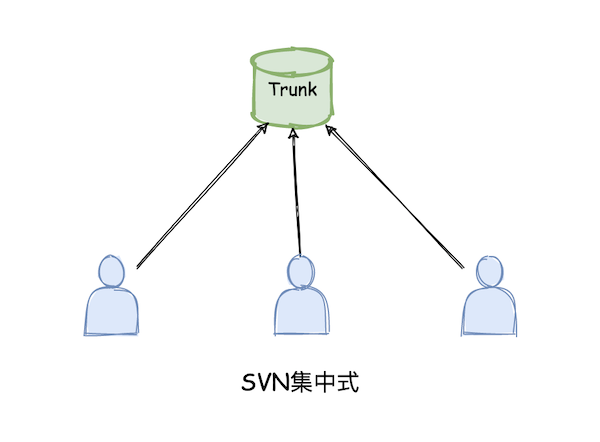

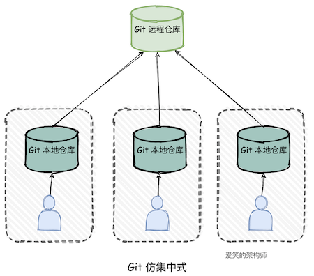

## 工作流程

### Git Flow

- 主干分支
- 稳定分支
- 开发分支
- 补丁分支
- 修改分支

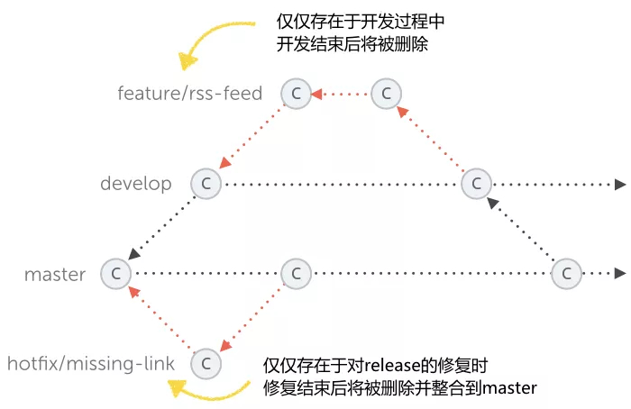


### Github Flow

- 创建分支
- 添加提交
- 提交 PR 请求
- 讨论和评估代码
- 部署检测
- 合并代码


### Gitlab Flow

- 带生产分支
- 带环境分支
- 带发布分支


## GitFlow工作流

Gitflow 工作流是目前非常成熟的一个方案，它定义了一个围绕项目发布的严格分支模型，通过为代码研发、项目发布以及维护分配独立的分支来让项目的迭代过程更加地顺畅，不同于之前的集中式工作流以及功能分支工作流，Gitflow 工作流常驻的分支有两个：主干分支 master、开发分支 develop。和功能分支工作流相比，Gitflow工作流没有增加任何新的概念或命令，它给不同的分支指定了特定的角色，定义它们应该如何、什么时候交互。除了功能分支之外，还为准备发布、维护发布、记录发布分别使用了单独的分支。


**Gitflow常见分支**

- 开发主分支：master 分支

  master 分支的代码是可以直接部署到生成环境的，为了保持稳定性一般不会直接在这个分支上修改代码，都是通过其他分支合并过来的。

- 开发主分支：develop分支

  develop 分支是主开发分支，包含所有要发布到下一个release的代码，主要是由feature分支合并过来的。

- 临时分支：feature 分支

  feature 分支主要是用来开发一个新特性，一旦开发完成会合入 develop 分支，feature 分支也随即删除掉。

- 临时分支：release 分支

  当需要一个发布一个新release版本时，会基于develop分支创建一个release分支，经过测试人员充分测试后再合入 master 分支和 develop 分支。

- 临时分支：hotfix 分支

  当在生成环境发现新的Bug时候，如果需要紧急修复，会创建一个hotfix分支， 充分测试后合入master和develop分支，随后删除该分支。


**分支命名规范**

团队内部可以约定每个分支的命名样式，这里举个例子，大家可以参考：

- feature分支：以feature_开头，如 feature_order

- release分支：以release_开头，如 release_v1.0

- hotfix分支：以hotfix_开头，如hotfix_20210117

- tag标记：如果是release分支合并，则以release\_开头，如果是hotfix分支合并，则以hotfix\_开头。


### master与develop分支

原则上master分支上所有的commit 都应该打上Tag，因为一般情况下master不存在直接commit。devlop分支是基于 master分支创建的，与 master 分支一样都是主分支，不会被删除。develop 从 master 拉出来之后会独立发展，不会与 master 直接产生联系。

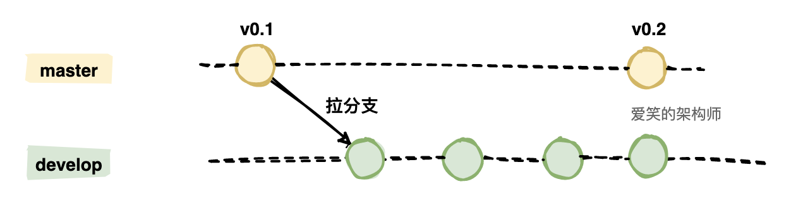


### feature分支

通常一个独立的特性都会基于develop拉出一个feature分支，feature 分支之间没有任何交互，互不影响。feature 分支一旦开发完成后会立马合入 develop 分支（采用 merge request 或者 pull request），feature 分支的生命周期也随之结束。

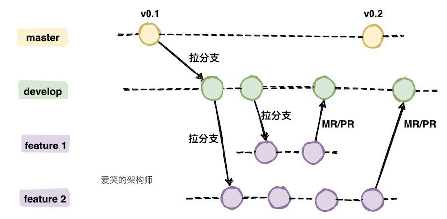


### release分支

通常一个迭代上线会拉一个release 分支，开发人员开发完毕所有的代码都已合入 develop 分支，这时候会基于 develop 分支拉出一个 release 分支，测试人员基于该分支进行测试。


### hotfix分支

hotfix分支基于master分支创建，开发完后需要同时回合到master和develop分支，同时在master上打一个tag。

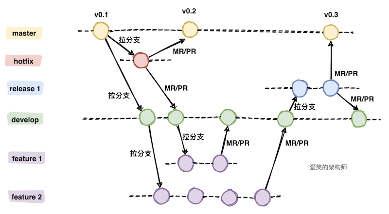


## 常用命令

### 新建代码库

```shell
# 在当前目录新建一个Git代码库
$ git init
# 新建一个目录，将其初始化为Git代码库
$ git init [project-name]
# 下载一个项目和它的整个代码历史
$ git clone [url]
```


### 配置信息

Git的设置文件为.gitconfig，它可以在用户主目录下(全局配置)，也可以在项目目录下(项目配置)

```shell
# 显示当前的Git配置
$ git config --list

# 编辑Git配置文件
$ git config -e [--global]

# 设置提交代码时的用户信息
$ git config [--global] user.name "[name]"
$ git config [--global] user.email "[email address]"


# 颜色设置
git config --global color.ui true                         # git status等命令自动着色
git config --global color.status auto
git config --global color.diff auto
git config --global color.branch auto
git config --global color.interactive auto
git config --global --unset http.proxy                    # remove  proxy configuration on git
```


### 增加/删除文件

```shell
# 添加指定文件到暂存区
$ git add [file] [dir] ...
# 删除工作区文件，并且将这次删除放入暂存区
$ git rm [file1] [file2] ...
```


### 代码提交

```shell
# 提交暂存区到仓库区
$ git commit -m [message]
# 提交暂存区的指定文件到仓库区
$ git commit [file1] [file2] ... -m [message]
```


### 分支

```shell
# 列出所有本地分支和远程分支
$ git branch -a

# 新建一个分支，但依然停留在当前分支
$ git branch [branch-name]
# 新建一个分支，并切换到该分支
$ git checkout -b [branch]
# 从远程分支develop创建新本地分支devel并检出
$ git checkout -b devel origin/develop

# 切换到指定分支，并更新工作区
$ git checkout [branch-name]

# 合并指定分支到当前分支
$ git merge [branch]
# 选择一个commit，合并进当前分支
$ git cherry-pick [commit]

# 删除分支
$ git branch -d [branch-name]
# 删除远程分支
$ git push origin --delete [branch-name]                      
```


### 标签

```shell
# 列出所有tag
$ git tag
# 新建一个tag在当前commit
$ git tag [tag]

# 删除本地tag
$ git tag -d [tag]
# 删除远程tag
$ git push origin :refs/tags/[tagName]

# 查看tag信息
$ git show [tag]

# 提交指定tag
$ git push [remote] [tag]
# 提交所有tag
$ git push [remote] --tags
```


### 查看信息

```shell
# 显示有变更的文件
$ git status

# 显示当前分支的版本历史
$ git log
# 显示commit历史，以及每次commit发生变更的文件
$ git log --stat
# 搜索提交历史，根据关键词
$ git log -S [keyword]
# 显示某个commit之后的所有变动，每个commit占据一行
$ git log [tag] HEAD --pretty=format:%s
# 显示某个commit之后的所有变动，其"提交说明"必须符合搜索条件
$ git log [tag] HEAD --grep feature
# 显示某个文件的版本历史，包括文件改名
$ git log --follow [file]

# 显示指定文件相关的每一次diff
$ git log -p [file]
# 显示过去5次提交
$ git log -5 --pretty --oneline

# 显示所有提交过的用户，按提交次数排序
$ git shortlog -sn

# 显示指定文件是什么人在什么时间修改过
$ git blame [file]

# 显示暂存区和工作区的差异
$ git diff
# 显示暂存区和上一个commit的差异
$ git diff --cached [file]
# 显示工作区与当前分支最新commit之间的差异
$ git diff HEAD
# 显示两次提交之间的差异
$ git diff [first-branch]...[second-branch]
# 显示今天你写了多少行代码
$ git diff --shortstat "@{0 day ago}"

# 显示某次提交的元数据和内容变化
$ git show [commit]
# 显示某次提交发生变化的文件
$ git show --name-only [commit]
# 显示某次提交时，某个文件的内容
$ git show [commit]:[filename]

# 显示当前分支的最近几次提交
$ git reflog
```


### 远程同步

```shell
# 下载远程仓库的所有变动
$ git fetch [remote]

# 显示所有远程仓库
$ git remote -v
# 显示某个远程仓库的信息
$ git remote show [remote]
# 增加一个新的远程仓库，并命名
$ git remote add [shortname] [url]

# 取回远程仓库的变化，并与本地分支合并
$ git pull [remote] [branch]

# 上传本地指定分支到远程仓库
$ git push [remote] [branch]
```


### 撤销

```shell
# 重置暂存区的指定文件，与上一次commit保持一致，但工作区不变
$ git reset [file]
# 重置当前分支的指针为指定commit，同时重置暂存区，但工作区不变
$ git reset [commit]
# 重置当前分支的HEAD为指定commit，同时重置暂存区和工作区，与指定commit一致
$ git reset --hard [commit]
# 后者的所有变化都将被前者抵消，并且应用到当前分支
$ git revert [commit]
```


## 特殊命令


# Test Tools

## AB

```shell
# 参数说明：
# -n：即requests，用于指定压力测试总共的执行次数
# -c：即concurrency，用于指定压力测试的并发数
# -t：即timelimit，等待响应的最大时间(单位：秒)
# -b：即windowsize，TCP发送/接收的缓冲大小(单位：字节)
# -p：即postfile，发送POST请求时需要上传的文件，此外还必须设置-T参数
# -u：即putfile，发送PUT请求时需要上传的文件，此外还必须设置-T参数
# -T：即content-type，用于设置Content-Type请求头信息，例如：application/json，默认值为text/plain
# -w：以HTML表格形式打印结果
# -i：使用HEAD请求代替GET请求
# -x：插入字符串作为table标签的属性
# -y：插入字符串作为tr标签的属性
# -z：插入字符串作为td标签的属性
# -C：添加cookie信息，例如："Apache=1234"(可以重复该参数选项以添加多个)
# -H：添加任意的请求头，如："Accept-Encoding: gzip"，可以重复该参数选项以添加多个
# -A：添加一个基本的网络认证信息，用户名和密码之间用英文冒号隔开
# -P：添加一个基本的代理认证信息，用户名和密码之间用英文冒号隔开
# -X：指定使用的代理服务器和端口号，例如:"126.10.10.3:88"
# -k：使用HTTP的KeepAlive特性
# -e：输出结果信息到CSV格式的文件中。
# -r：指定接收到错误信息时不退出程序。

# 在任意目录下执行该命令
yum -y install httpd-tools
# 添加请求头参数
ab -n100 -c10 -H "Cookie: Key1=Value1; Key2=Value2" http://127.0.0.1:8080/get
# ab测试简单HTTP GET接口
ab -n30000 -c1000 http://127.0.0.1:8080/get
# ab测试HTTP POST接口,img.json为符合接口格式的字符串
ab -n400 -c20  -p "img.json" -T "application/x-www-form-urlencoded" http://127.0.0.1:8080/add
```


## Jmeter

**第一步**：安装JDK，配置环境变量

**第二步**：Linux下安装jmeter

官方网站下载最新版本：http://jmeter.apache.org/download_jmeter.cgi，目前最新版是Apache JMeter 3.3。下载二进制包，使用JMeter依赖jdk，建议安装jdk 1.6版本以上。解压JMeter：`tar -zxvf apache-jmeter-3.3.tgz`

### Junit

**第一步**：编写测试类Jmeter Junit代码，然后进行编译验证通过

**第二步**：调试通过后，导出Jar包，并将该Jar包导入到.\Jmeter\apache-jmeter-2.13\lib\junit目录下。（如果编写代码时，存在第三方Jar包引入，那么就将该第三方Jar包放在.\Jmeter\apache-jmeter-2.13\lib中）

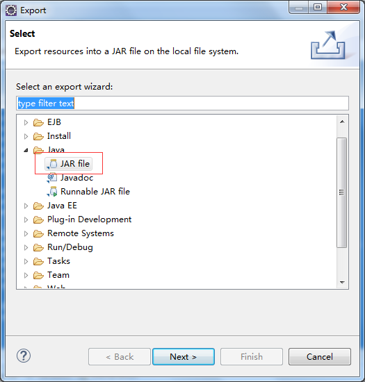

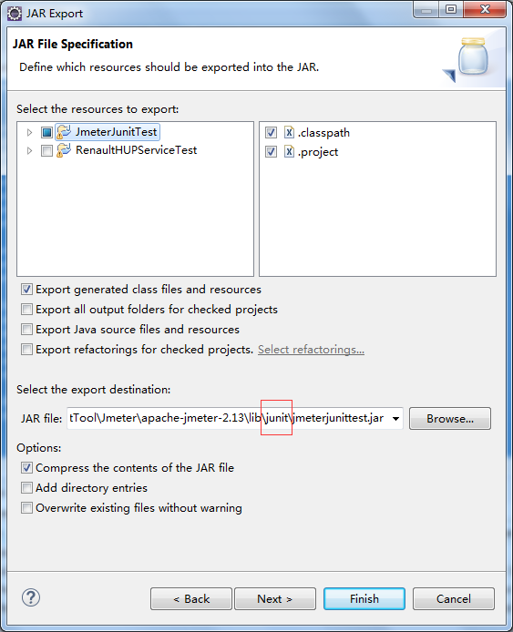

**第三步**：重新启动Jmeter，添加三条：Junit Request、查看结果树、图形结果

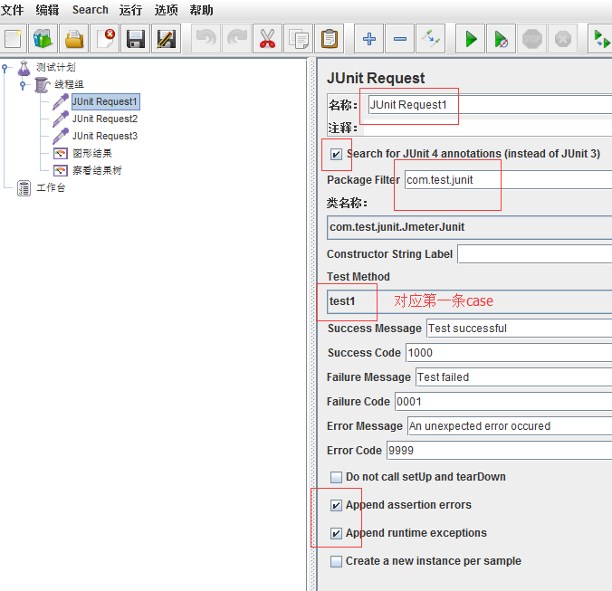

 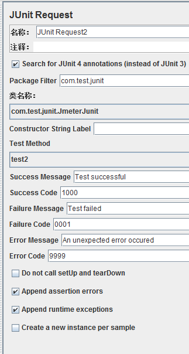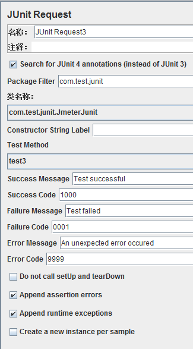 

**第四步**：点击运行按钮，可以在查看结果树中查看结果，如果想要将测试结果保存到文件，可以如下图配置：

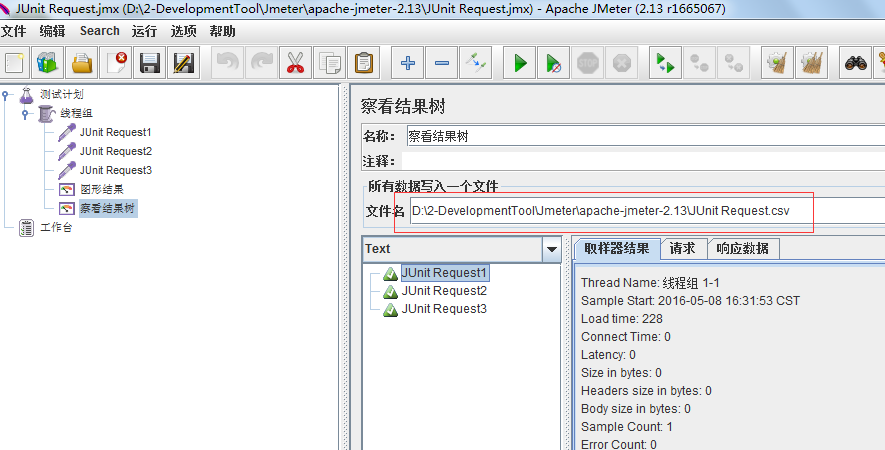


### Thread Group

使用Thread Group， 控制模拟多少用户。选中Thread Group

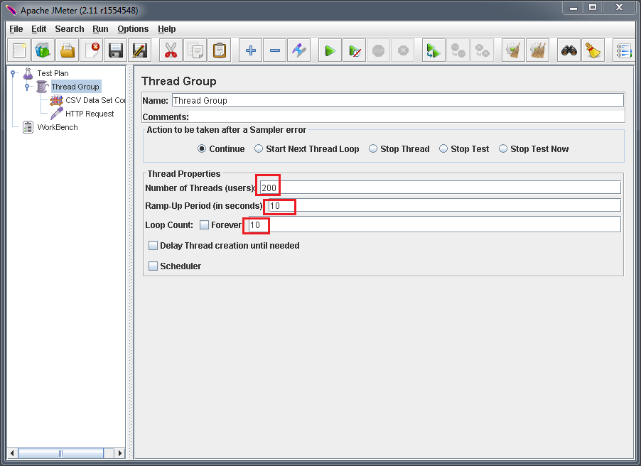 

- `Number of Threads(users)`:     一个用户占一个线程，  200个线程就是模拟200个用户
- `Ramp-Up Period(in seconds)`:   设置线程需要多长时间全部启动。如果线程数为200 ，准备时长为10 ，那么需要1秒钟启动20个线程。也就是每秒钟启动20个线程
- `Loop Count`: 每个线程发送请求的次数。如果线程数为200 ，循环次数为10 ，那么每个线程发送10次请求。总请求数为200*10=2000 。如果勾选了“永远”，那么所有线程会一直发送请求，直到选择停止运行脚本


### HTTP Request

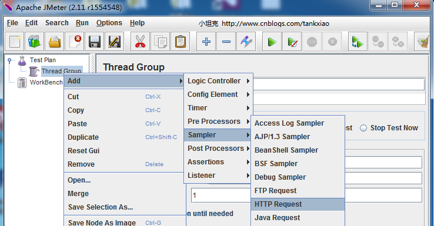

比如我要发送一个GET方法的http请求，可以按照下图这么填：

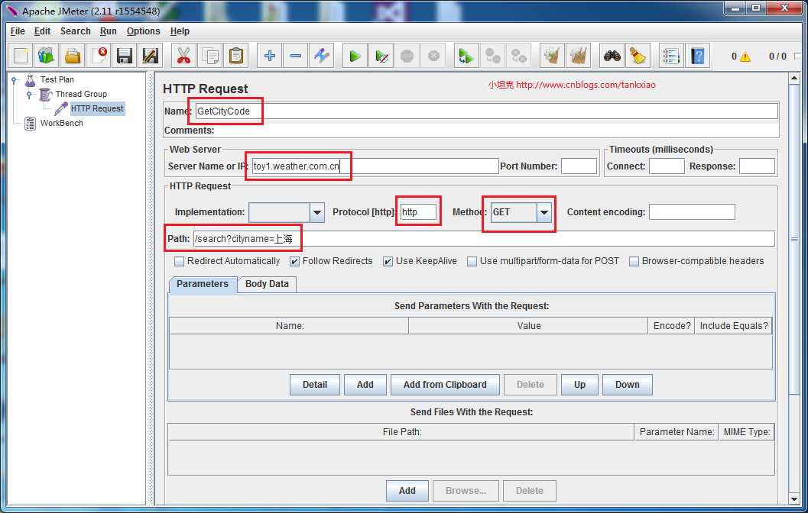


### Summary Report

添加Summary Report 用来查看测试结果。选中Thread Group 右键(Add -> Listener -> Summary Report)。运行一下，到目前为止， 脚本就全写好了， 我们来运行下， 如何看下测试的结果：


### CSV Data Set Config

使用CSV Data Set Config 来参数化。首先我们把测试需要用到的2个参数放在txt文件中。新建一个data.txt文件，输入些数据， 一行有两个数据，用逗号分隔。

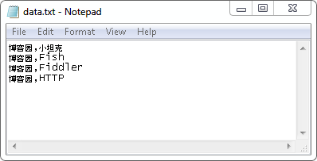

启动Jmeter, 先添加一个Thread Group, 然后添加一个CSV Data Set Config (Add -> Config Element -> CSV Data Set Config)

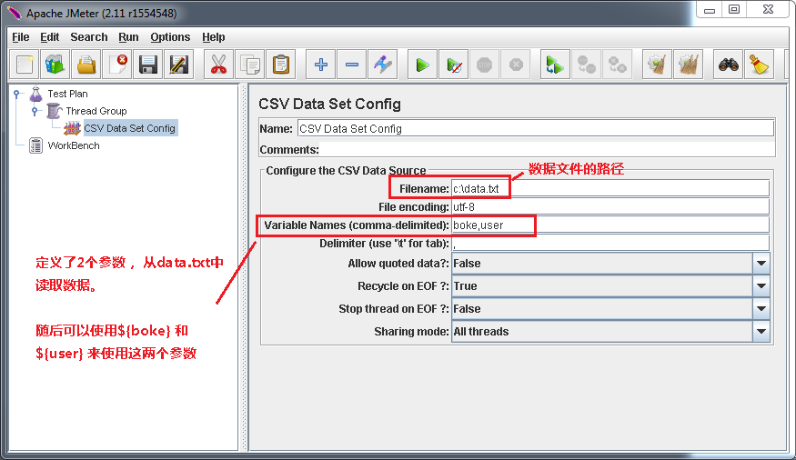

我们添加http 请求，模拟发送get 到：`http://cn.bing.com/search?q=博客园+小坦克`。选择Thread Group 右键 (Add ->Sampler -> HTTP Request)，  需要填的数据如下：

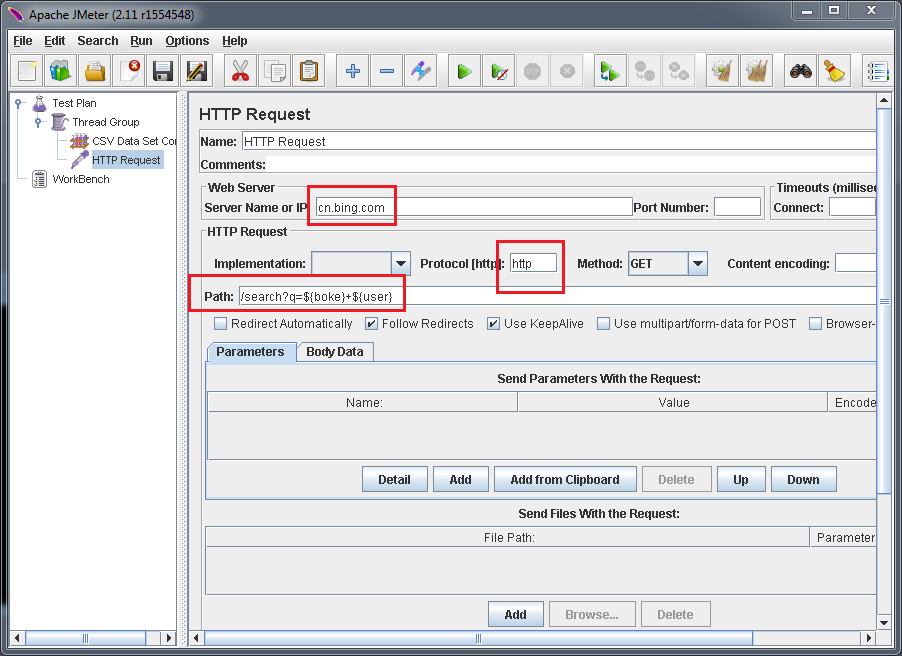 


### HTTP Head Manager

添加HTTP Head Manager。选中新建的HTTP request，右键，新建一个Http Header manager，添加一个header：

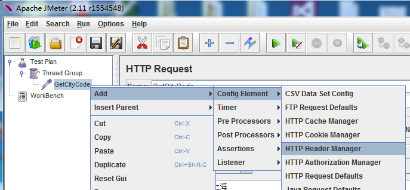

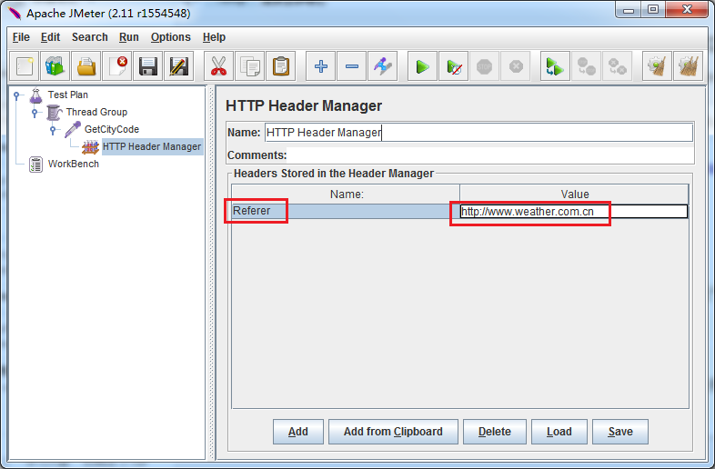


### Http Cookie Manager

**Http Cookie Manager的作用**：

- **自动管理cookie**：像浏览器一样的存储和发送Cookie，如果发送一个http请求他的响应中包含Cookie，那么Cookie Manager就会自动地保存这些Cookie并在所有后来发送到该站点的请求中使用这些Cookie的值。每个线程都自己存储cookie的区域。在cookie manager中看不到自动保存的cookie，我们可以在View Results Tree的Request界面看到被发送的Cookie Data。

  接受到的Cookie的值能被存储到JMeter 线程变量中（2.3.2版本后的JMeter不自动做这个事情）。要把Cookies保存到线程变量中，要定义属性”CookieManager.save.cookies=true”。线程变量名为COOKIE_ + Cookie名。属性CookieManager.name.prefix= 可以用来修改默认的COOKIE_的值。

- **手动管理Cookie**：手动添加Cookie到Cookie Manager，这些Cookie的值被会所有线程共享。

比较简单的做法是使用firefox的firebug导出cookies：

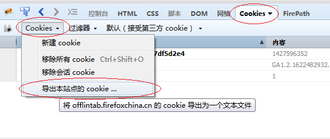

然后，在把文件导入到jmeter：

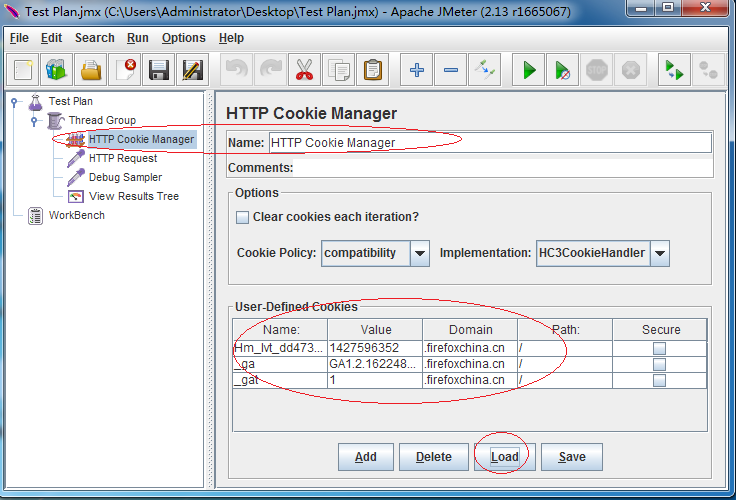

**特别注意**：

如果在一个测试计划内有多个Cookie Manager ，Jmeter目前无法指定哪个被使用。所以一个测试计划内最好只有一个cookie manager。并且一个manager里的 cookie 并不能被其它manager所引用。所以在使用多个Cookie Managers 时要谨慎。


### View Results Tree

添加View Results Tree，View Results Tree 是用来看运行的结果的：

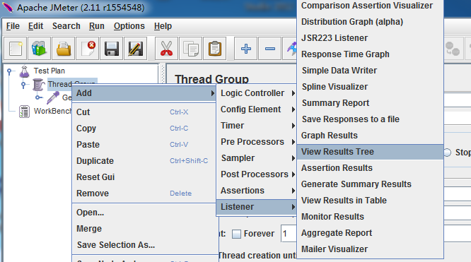

运行测试,查看结果：

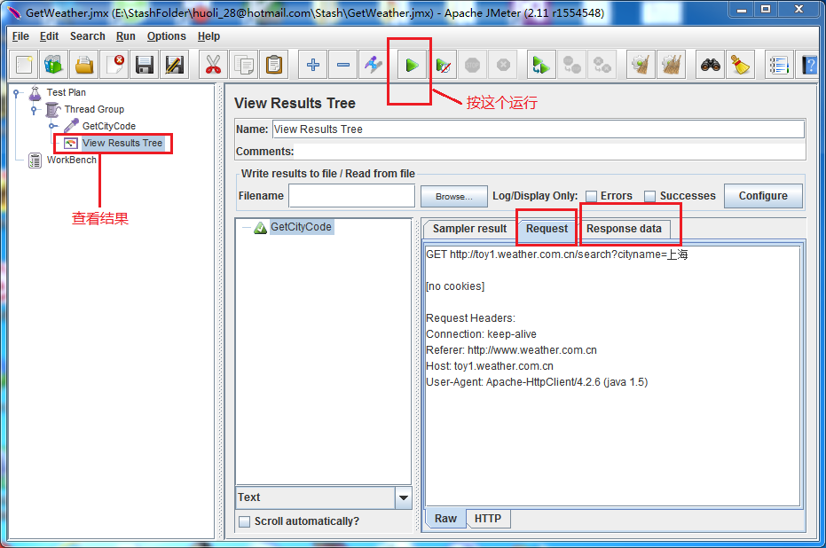


### Assertion & Assert Results

添加Assertion和Assert Results来实现结果的断言。选择HTTP Request, 右键 Add-> Assertions -> Response Assertion，添加 Patterns To Test：

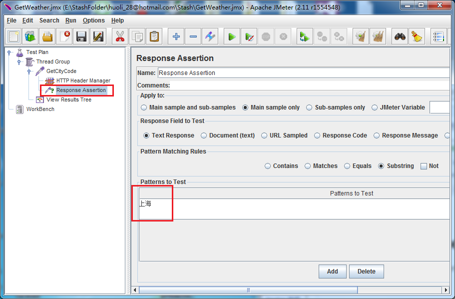

然后添加一个Assetion Results 用来查看Assertion执行的结果。选中Thread Group 右键  Add -> Listener -> Assertion Results。运行后，如果HTTP Response中没有包含期待的字符串，那么test 就会Fail：

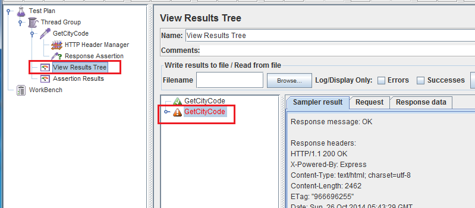

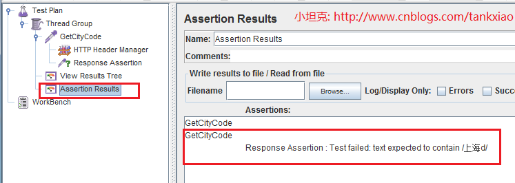


### User Defined Variables

使用用户自定义变量。我们还可以在Jmeter中定义变量，比如我定义一个变量叫 city，使用它的时候用  ${city}

添加一个 User Defined Variables，选中Thread Group: 右键Add -> Config Element -> User Defined Variables：

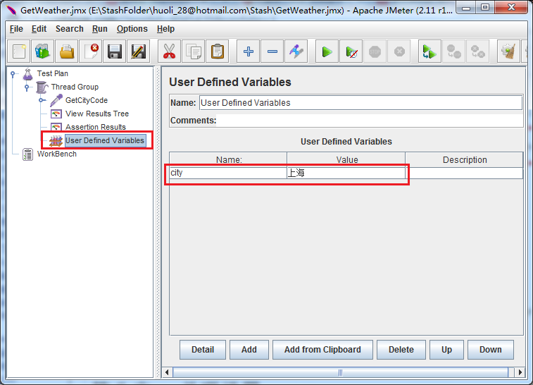

 然后在Http Request中使用这个变量：

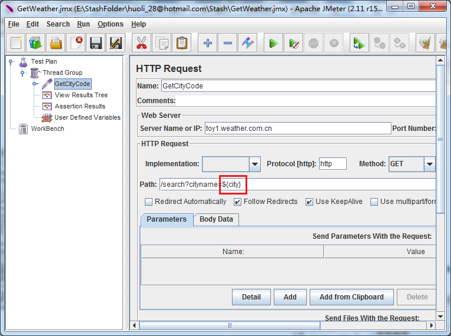


### Regular Expression Extractor

Regular Expression Extractor所谓关联， 就是第二个Requst, 使用第一个Request中的数据，我们需要在第一个Http Requst 中新建一个正则表达式，把Response的值提取到变量中，提供给别的Http Request 使用。选择第一个Http Request, 右键 Add -> Post Processors -> Regular Expresstion Extractor：

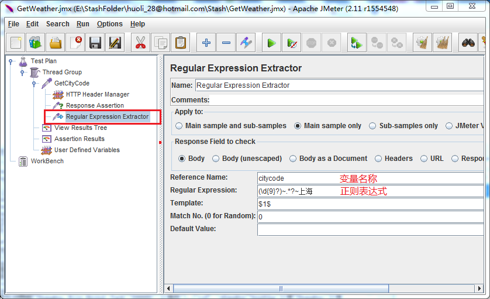

 现在新建第二个Http Request,     发送到： http://www.weather.com.cn/weather2d/${citycode}.html 

${citycode} 中的数据， 是从Regular Expression Extractor 中取来的：

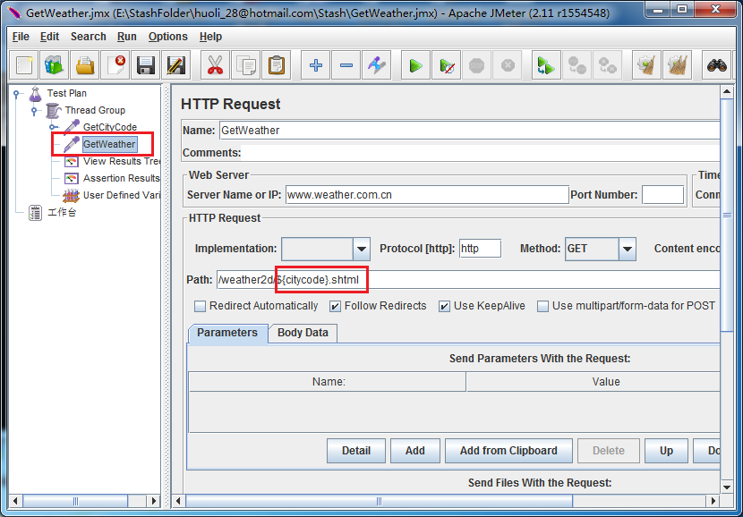

 到这， 脚本就全部写好了， 运行下，看下最终结果：

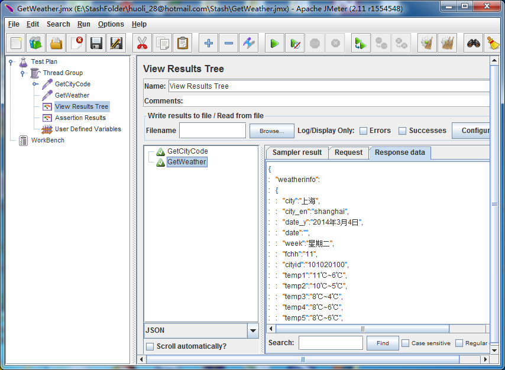 


### Run AS

运行测试,查看结果：


### HTTP Mirror Server

HTTP Mirror Server可以在本地临时搭建一个HTTP服务器，该服务器把接收到的请求原样返回，这样就可以看到发送出的请求的具体内容，以供调试。 **实例如下**：

**第一步**：添加HTTP Mirror Server

右键点击WorkBench-->Add-->Non-Test Elements-->HTTP Mirror Server ,点击【Start】启动。

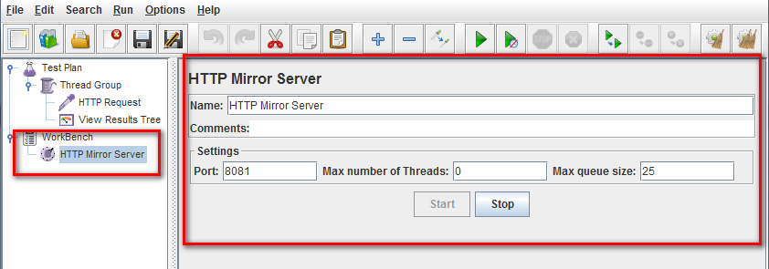

**第二步**：发送请求到该服务器

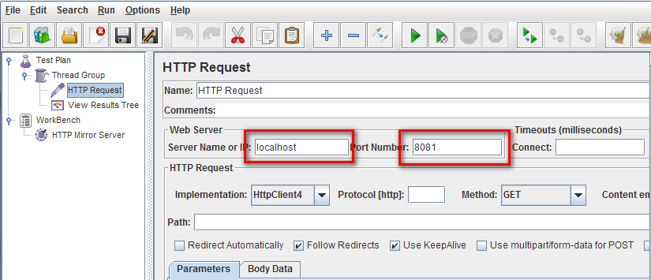

 **第三步**：对比Request与Response

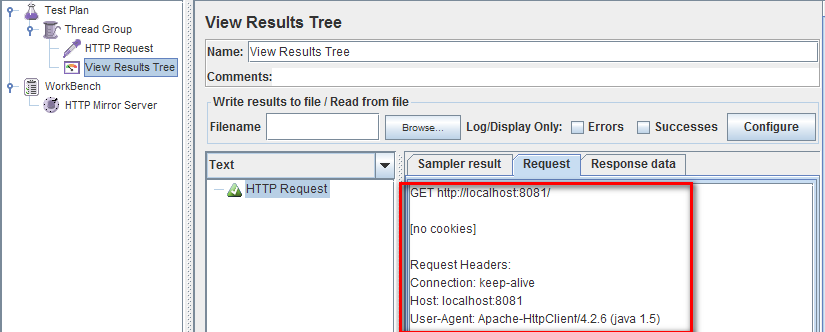

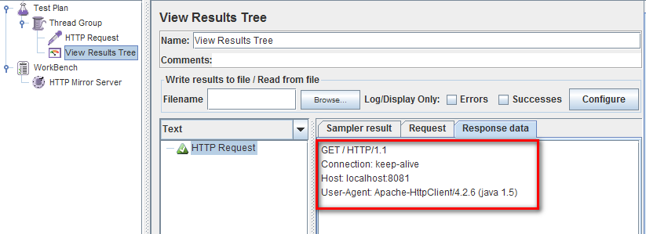

可以看到，Response中的内容与Request内容一模一样，我们就可以通过此种方法判断我们发送出去的请求是否确实是我们预期的结果。

 

### Non-GUI Mode

Non-GUI Mode (Command Line mode)

```shell
-n  指定JMeter以非GUI模式运行
-t  包含测试计划的jmx文件的名称（.jmx测试脚本）
-l  记录样本结果日志的jtl文件名称
-j  JMeter运行日志文件名称
-r  在JMeter属性"remote_hosts"所指定的服务器中运行测试
-R  [远程服务器列表]在指定的远程服务器上运行测试
-g  [CSV文件路径]只生成报表
-e  负载测试后生成报表
-o  负载测试完成后，用于存放所生成报表的文件夹（文件夹必须不存在or文件夹内为空）
```

e.g:

```powershell
[root@localhost ~]# jmeter -n -t [jmx file] -l [results file] -e -o [Path to web report folder]
[root@localhost ~]# jmeter -n -t [jmx file] -l [results file] -R host1,host2 -e -o [Path to web report folder]
```


# Pack

## 其它

当写完一个Spring boot Maven 工程，使用 mvn clean package 打包成可运行的jar文件后，可使用如下命令开始执行：

```shell
nohup java -Xloggc:${logging_file_location}gc.log -XX:+PrintGCDetails -jar app.jar --spring.profiles.active=${environment} --logging.file.location=${logging_file_location} --domain=com.xx.xxx.xxxx > /dev/null 2>&1 &
```


# Docker

## 安装


## 常用命令

### 镜像命令

```sh
# 列出 Docker  本地镜像列表
$ docker images
$ docker image ls -a

# 运行 Docker 镜像（守护态方式）
$ docker run -d {镜像名}

# 删除指定 Docker 镜像
$ docker  image rm {镜像名}
```


### 容器命令


```bash
# 列出正在运行的容器
$ docker ps -a

# 列出所有容器（包括已停止容器）
$ docker ps -l
```


```bash

```

：

```bash
$ docker exec -it {容器ID} /bin/bash
```

停止 Docker 容器：

```bash
$ docker stop {容器ID}
```

删除指定 Docker 容器：

```bash
$ docker rm -f {容器ID}
```

删除停止的 Docker 容器：

```bash
$ docker container prune
```

查看 Docker 容器历史运行日志：

```bash
$ docker logs {容器名}
```

实时监听 Docker 容器运行日志：

```bash
$ docker logs -f {容器名}
```


### 数据卷命令

创建 Docker 数据卷：

```bash
$ docker volume create {数据卷名}
```

列出所有 Docker 数据卷：

```bash
$ docker volume ls
```

删除指定 Docker 数据卷：

```bash
$ docker volume rm {数据卷名}
```

删除未关联（失效） Docker 数据卷：

```bash
$ docker volume prune
$ docker volume rm $(docker volume ls -qf dangling=true)
```


### 文件操作命令

从主机复制文件到 Docker 容器中：

```bash
$ sudo docker cp {主机内文件路径} {容器ID}:{容器内文件存储路径}
```

从 Docker 容器中复制文件到主机中：

```bash
$ sudo docker cp {容器ID}:{容器内文件路径} {主机内文件存储路径}
```


# Nginx

## 常用配置

### 侦听端口

```nginx
server {
        # Standard HTTP Protocol
        listen 80;
        # Standard HTTPS Protocol
        listen 443 ssl;
        # For http2
        listen 443 ssl http2;
        # Listen on 80 using IPv6
        listen [::]:80;
        # Listen only on using IPv6
        listen [::]:80 ipv6only=on;
}
```


### 访问日志

```nginx
server {
        # Relative or full path to log file
        access_log /path/to/file.log;
        # Turn 'on' or 'off'  
        access_log on;
}
```


### 域名

```nginx
server {
        # Listen to yourdomain.com
        server_name yourdomain.com;
        # Listen to multiple domains server_name yourdomain.com www.yourdomain.com;
        # Listen to all domains
        server_name *.yourdomain.com;
        # Listen to all top-level domains
        server_name yourdomain.*;
        # Listen to unspecified Hostnames (Listens to IP address itself)
        server_name "";
}
```


### 静态资产

```nginx
server {
        listen 80;
        server_name yourdomain.com;
        location / {
        	root /path/to/website;
        }
}
```


### 重定向

```nginx
server {
        listen 80;
        server_name www.yourdomain.com;
        return 301 http://yourdomain.com$request_uri;
}
server {
        listen 80;
        server_name www.yourdomain.com;
        location /redirect-url {
        	return 301 http://otherdomain.com;
        }
}
```


### 反向代理

```nginx
server {
        listen 80;
        server_name yourdomain.com;
        location / {
                proxy_pass http://0.0.0.0:3000;
                # where 0.0.0.0:3000 is your application server (Ex: node.js) bound on 0.0.0.0 listening on port 3000
        }
}
```


### 负载均衡

```nginx
upstream node_js {
        server 0.0.0.0:3000;
        server 0.0.0.0:4000;
        server 123.131.121.122;
}
server {
        listen 80;
        server_name yourdomain.com;
        location / {
       		 proxy_pass http://node_js;
        }
}
```


### SSL 协议

```nginx
server {
        listen 443 ssl;
        server_name yourdomain.com;
        ssl on;
        ssl_certificate /path/to/cert.pem;
        ssl_certificate_key /path/to/privatekey.pem;
        ssl_stapling on;
        ssl_stapling_verify on;
        ssl_trusted_certificate /path/to/fullchain.pem;
        ssl_protocols TLSv1 TLSv1.1 TLSv1.2;
        ssl_session_timeout 1h;
        ssl_session_cache shared:SSL:50m;
        add_header Strict-Transport-Security max-age=15768000;
}
# Permanent Redirect for HTTP to HTTPS
server {
        listen 80;
        server_name yourdomain.com;
        return 301 https://$host$request_uri;
}
```

其实可以采用可视化的方式对 Nginx 进行配置，我在 GitHub 上发现了一款可以一键生成 Nginx 配置的神器，相当给力。

先来看看它都支持什么功能的配置：反向代理、HTTPS、HTTP/2、IPv6, 缓存、WordPress、CDN、Node.js 支持、 Python (Django) 服务器等等。

如果你想在线进行配置，只需要打开网站：**https://nginxconfig.io/**


## 应用场景

### HTTP服务器

Nginx本身也是一个静态资源的服务器，当只有静态资源的时候，就可以使用Nginx来做服务器，如果一个网站只是静态页面的话，那么就可以通过这种方式来实现部署。

1、 首先在文档根目录`Docroot(/usr/local/var/www)`下创建html目录, 然后在html中放一个test.html;

2、 配置`nginx.conf`中的server

```nginx
user mengday staff;

http {
    server {
        listen       80;
        server_name  localhost;
        client_max_body_size 1024M;

        # 默认location
        location / {
            root   /usr/local/var/www/html;
            index  index.html index.htm;
        }
    }
}
```

3、访问测试

- `http://localhost/` 指向`/usr/local/var/www/index.html`, index.html是安装nginx自带的html
- `http://localhost/test.html` 指向`/usr/local/var/www/html/test.html`

> 注意：如果访问图片出现403 Forbidden错误，可能是因为nginx.conf 的第一行user配置不对，默认是#user nobody;是注释的，linux下改成user root; macos下改成user 用户名 所在组; 然后重新加载配置文件或者重启，再试一下就可以了， 用户名可以通过who am i 命令来查看。

4、指令简介

- server : 用于定义服务，http中可以有多个server块
- listen : 指定服务器侦听请求的IP地址和端口，如果省略地址，服务器将侦听所有地址，如果省略端口，则使用标准端口
- server_name : 服务名称，用于配置域名
- location : 用于配置映射路径uri对应的配置，一个server中可以有多个location, location后面跟一个uri,可以是一个正则表达式, / 表示匹配任意路径, 当客户端访问的路径满足这个uri时就会执行location块里面的代码
- root : 根路径，当访问`http://localhost/test.html`，“/test.html”会匹配到”/”uri, 找到root为`/usr/local/var/www/html`，用户访问的资源物理地址=`root + uri = /usr/local/var/www/html + /test.html=/usr/local/var/www/html/test.html`
- index : 设置首页，当只访问`server_name`时后面不跟任何路径是不走root直接走index指令的；如果访问路径中没有指定具体的文件，则返回index设置的资源，如果访问`http://localhost/html/` 则默认返回index.html

5、location uri正则表达式

- `.` ：匹配除换行符以外的任意字符
- `?` ：重复0次或1次
- `+` ：重复1次或更多次
- `*` ：重复0次或更多次
- `\d` ：匹配数字
- `^` ：匹配字符串的开始
- `$` ：匹配字符串的结束
- `{n}` ：重复n次
- `{n,}` ：重复n次或更多次
- `[c]` ：匹配单个字符c
- `[a-z]` ：匹配a-z小写字母的任意一个
- `(a|b|c)` : 属线表示匹配任意一种情况，每种情况使用竖线分隔，一般使用小括号括括住，匹配符合a字符 或是b字符 或是c字符的字符串
- `\` 反斜杠：用于转义特殊字符

小括号()之间匹配的内容，可以在后面通过`$1`来引用，`$2`表示的是前面第二个()里的内容。正则里面容易让人困惑的是`\`转义特殊字符。


### 静态服务器

在公司中经常会遇到静态服务器，通常会提供一个上传的功能，其他应用如果需要静态资源就从该静态服务器中获取。

在`/usr/local/var/www` 下分别创建images和img目录，分别在每个目录下放一张`test.jpg`

```nginx
http {
    server {
        listen       80;
        server_name  localhost;


        set $doc_root /usr/local/var/www;

        # 默认location
        location / {
            root   /usr/local/var/www/html;
            index  index.html index.htm;
        }

        location ^~ /images/ {
            root $doc_root;
       }

       location ~* \.(gif|jpg|jpeg|png|bmp|ico|swf|css|js)$ {
           root $doc_root/img;
       }
    }
}
```

自定义变量使用set指令，语法 set 变量名值;引用使用变量名值;引用使用变量名; 这里自定义了doc_root变量。

静态服务器location的映射一般有两种方式：

- 使用路径，如 /images/ 一般图片都会放在某个图片目录下，
- 使用后缀，如 .jpg、.png 等后缀匹配模式

访问`http://localhost/test.jpg` 会映射到 `$doc_root/img`

访问`http://localhost/images/test.jpg` 当同一个路径满足多个location时，优先匹配优先级高的location，由于`^~` 的优先级大于 `~`, 所以会走`/images/`对应的location

常见的location路径映射路径有以下几种：

- `=`    进行普通字符精确匹配。也就是完全匹配。
- `^~`     前缀匹配。如果匹配成功，则不再匹配其他location。
- `~`    表示执行一个正则匹配，区分大小写
- `~*`     表示执行一个正则匹配，不区分大小写
- `/xxx/`  常规字符串路径匹配
- `/`    通用匹配，任何请求都会匹配到


**location优先级**

当一个路径匹配多个location时究竟哪个location能匹配到时有优先级顺序的，而优先级的顺序于location值的表达式类型有关，和在配置文件中的先后顺序无关。相同类型的表达式，字符串长的会优先匹配。推荐：[Java面试题大全](http://mp.weixin.qq.com/s?__biz=MzI4Njc5NjM1NQ==&mid=2247504489&idx=1&sn=afd92248113146b086652ad7f89c7a7c&chksm=ebd5ed45dca26453c0cf91265d669711a4e2b4ea52f3ff4a00b063a9de46d69fcc599f151210&scene=21#wechat_redirect)

以下是按优先级排列说明：

- 等号类型（=）的优先级最高。一旦匹配成功，则不再查找其他匹配项，停止搜索。
- `^~`类型表达式，不属于正则表达式。一旦匹配成功，则不再查找其他匹配项，停止搜索。
- 正则表达式类型（`~ ~*`）的优先级次之。如果有多个location的正则能匹配的话，则使用正则表达式最长的那个。
- 常规字符串匹配类型。按前缀匹配。
- / 通用匹配，如果没有匹配到，就匹配通用的

优先级搜索问题：不同类型的location映射决定是否继续向下搜索

- 等号类型、`^~`类型：一旦匹配上就停止搜索了，不会再匹配其他location了
- 正则表达式类型(`~ ~*`）,常规字符串匹配类型`/xxx/` : 匹配到之后，还会继续搜索其他其它location，直到找到优先级最高的，或者找到第一种情况而停止搜索

location优先级从高到底：

(`location =`) > (`location 完整路径`) > (`location ^~ 路径`) > (`location ~,~* 正则顺序`) > (`location 部分起始路径`) > (`/`)

```nginx
location = / {
    # 精确匹配/，主机名后面不能带任何字符串 /
    [ configuration A ]
}
location / {
    # 匹配所有以 / 开头的请求。
    # 但是如果有更长的同类型的表达式，则选择更长的表达式。
    # 如果有正则表达式可以匹配，则优先匹配正则表达式。
    [ configuration B ]
}
location /documents/ {
    # 匹配所有以 /documents/ 开头的请求，匹配符合以后，还要继续往下搜索。
    # 但是如果有更长的同类型的表达式，则选择更长的表达式。
    # 如果有正则表达式可以匹配，则优先匹配正则表达式。
    [ configuration C ]
}
location ^~ /images/ {
    # 匹配所有以 /images/ 开头的表达式，如果匹配成功，则停止匹配查找，停止搜索。
    # 所以，即便有符合的正则表达式location，也不会被使用
    [ configuration D ]
}

location ~* \.(gif|jpg|jpeg)$ {
    # 匹配所有以 gif jpg jpeg结尾的请求。
    # 但是 以 /images/开头的请求，将使用 Configuration D，D具有更高的优先级
    [ configuration E ]
}

location /images/ {
    # 字符匹配到 /images/，还会继续往下搜索
    [ configuration F ]
}


location = /test.htm {
    root   /usr/local/var/www/htm;
    index  index.htm;
}
```

注意：location的优先级与location配置的位置无关


### 反向代理

反向代理应该是Nginx使用最多的功能了，反向代理(Reverse Proxy)方式是指以代理服务器来接受internet上的连接请求，然后将请求转发给内部网络上的服务器，并将从服务器上得到的结果返回给internet上请求连接的客户端，此时代理服务器对外就表现为一个反向代理服务器。

简单来说就是真实的服务器不能直接被外部网络访问，所以需要一台代理服务器，而代理服务器能被外部网络访问的同时又跟真实服务器在同一个网络环境，当然也可能是同一台服务器，端口不同而已。

反向代理通过`proxy_pass`指令来实现。

启动一个Java Web项目，端口号为8081

```nginx
server {
    listen       80;
    server_name  localhost;

    location / {
        proxy_pass http://localhost:8081;
        proxy_set_header Host $host:$server_port;
        # 设置用户ip地址
         proxy_set_header X-Forwarded-For $remote_addr;
         # 当请求服务器出错去寻找其他服务器
         proxy_next_upstream error timeout invalid_header http_500 http_502 http_503; 
    }

}   
```

当我们访问localhost的时候，就相当于访问 `localhost:8081`了


### 负载均衡

负载均衡也是Nginx常用的一个功能，负载均衡其意思就是分摊到多个操作单元上进行执行，例如Web服务器、FTP服务器、企业关键应用服务器和其它关键任务服务器等，从而共同完成工作任务。

简单而言就是当有2台或以上服务器时，根据规则随机的将请求分发到指定的服务器上处理，负载均衡配置一般都需要同时配置反向代理，通过反向代理跳转到负载均衡。而Nginx目前支持自带3种负载均衡策略，还有2种常用的第三方策略。负载均衡通过upstream指令来实现。

#### RR(round robin :轮询 默认)

每个请求按时间顺序逐一分配到不同的后端服务器，也就是说第一次请求分配到第一台服务器上，第二次请求分配到第二台服务器上，如果只有两台服务器，第三次请求继续分配到第一台上，这样循环轮询下去，也就是服务器接收请求的比例是 1:1， 如果后端服务器down掉，能自动剔除。轮询是默认配置，不需要太多的配置，同一个项目分别使用8081和8082端口启动项目：

```nginx
upstream web_servers {  
   server localhost:8081;  
   server localhost:8082;  
}

server {
    listen       80;
    server_name  localhost;
    #access_log  logs/host.access.log  main;


    location / {
        proxy_pass http://web_servers;
        # 必须指定Header Host
        proxy_set_header Host $host:$server_port;
    }
 }
```

访问地址仍然可以获得响应 `http://localhost/api/user/login?username=zhangsan&password=111111` ，这种方式是轮询的


#### 权重

指定轮询几率，weight和访问比率成正比, 也就是服务器接收请求的比例就是各自配置的weight的比例，用于后端服务器性能不均的情况,比如服务器性能差点就少接收点请求，服务器性能好点就多处理点请求。

```nginx
upstream test {
    server localhost:8081 weight=1;
    server localhost:8082 weight=3;
    server localhost:8083 weight=4 backup;
}
```

示例是4次请求只有一次被分配到8081上，其他3次分配到8082上。backup是指热备，只有当8081和8082都宕机的情况下才走8083


#### ip_hash

上面的2种方式都有一个问题，那就是下一个请求来的时候请求可能分发到另外一个服务器，当我们的程序不是无状态的时候(采用了session保存数据)，这时候就有一个很大的很问题了，比如把登录信息保存到了session中，那么跳转到另外一台服务器的时候就需要重新登录了，所以很多时候我们需要一个客户只访问一个服务器，那么就需要用iphash了，iphash的每个请求按访问ip的hash结果分配，这样每个访客固定访问一个后端服务器，可以解决session的问题。

```nginx
upstream test {
    ip_hash;
    server localhost:8080;
    server localhost:8081;
}
```


#### fair(第三方)

按后端服务器的响应时间来分配请求，响应时间短的优先分配。这个配置是为了更快的给用户响应

```nginx
upstream backend {
    fair;
    server localhost:8080;
    server localhost:8081;
}
```

#### url_hash(第三方)

按访问url的hash结果来分配请求，使每个url定向到同一个后端服务器，后端服务器为缓存时比较有效。在upstream中加入hash语句，server语句中不能写入weight等其他的参数，`hash_method`是使用的hash算法

```nginx
upstream backend {
    hash $request_uri;
    hash_method crc32;
    server localhost:8080;
    server localhost:8081;
}
```

以上5种负载均衡各自适用不同情况下使用，所以可以根据实际情况选择使用哪种策略模式,不过fair和url_hash需要安装第三方模块才能使用。


### 动静分离

动静分离是让动态网站里的动态网页根据一定规则把不变的资源和经常变的资源区分开来，动静资源做好了拆分以后，我们就可以根据静态资源的特点将其做缓存操作，这就是网站静态化处理的核心思路。

```nginx
upstream web_servers {  
       server localhost:8081;  
       server localhost:8082;  
}

server {
    listen       80;
    server_name  localhost;

    set $doc_root /usr/local/var/www;

    location ~* \.(gif|jpg|jpeg|png|bmp|ico|swf|css|js)$ {
       root $doc_root/img;
    }

    location / {
        proxy_pass http://web_servers;
        # 必须指定Header Host
        proxy_set_header Host $host:$server_port;
    }

    error_page 500 502 503 504  /50x.html;  
    location = /50x.html {  
        root $doc_root;
    }

 }
```


### 其他

#### return指令

返回http状态码 和 可选的第二个参数可以是重定向的URL

```nginx
location /permanently/moved/url {
    return 301 http://www.example.com/moved/here;
}
```


#### rewrite指令

重写URI请求 rewrite，通过使用rewrite指令在请求处理期间多次修改请求URI，该指令具有一个可选参数和两个必需参数。

第一个(必需)参数是请求URI必须匹配的正则表达式。

第二个参数是用于替换匹配URI的URI。

可选的第三个参数是可以停止进一步重写指令的处理或发送重定向(代码301或302)的标志

```nginx
location /users/ {
    rewrite ^/users/(.*)$ /show?user=$1 break;
}
```


#### error_page指令

使用error_page指令，您可以配置NGINX返回自定义页面以及错误代码，替换响应中的其他错误代码，或将浏览器重定向到其他URI。在以下示例中，`error_page`指令指定要返回404页面错误代码的页面(/404.html)。

```nginx
error_page 404 /404.html;
```


#### 日志

访问日志：需要开启压缩 gzip on; 否则不生成日志文件，打开`log_format`、`access_log`注释

```nginx
log_format  main  '$remote_addr - $remote_user [$time_local] "$request" '
                      '$status $body_bytes_sent "$http_referer" '
                      '"$http_user_agent" "$http_x_forwarded_for"';

access_log  /usr/local/etc/nginx/logs/host.access.log  main;

gzip  on;
```


#### deny 指令

```nginx
# 禁止访问某个目录
location ~* \.(txt|doc)${
    root $doc_root;
    deny all;
}   
```


#### 内置变量

nginx的配置文件中可以使用的内置变量以美元符`$`开始，也有人叫全局变量。其中，部分预定义的变量的值是可以改变的。另外，关注Java知音公众号，回复“后端面试”，送你一份面试题宝典！

- `$args` ：`#`这个变量等于请求行中的参数，同`$query_string`
- `$content_length` ：请求头中的Content-length字段。
- `$content_type` ：请求头中的Content-Type字段。
- `$document_root` ：当前请求在root指令中指定的值。
- `$host` ：请求主机头字段，否则为服务器名称。
- `$http_user_agent` ：客户端agent信息
- `$http_cookie` ：客户端cookie信息
- `$limit_rate` ：这个变量可以限制连接速率。
- `$request_method` ：客户端请求的动作，通常为GET或POST。
- `$remote_addr` ：客户端的IP地址。
- `$remote_port` ：客户端的端口。
- `$remote_user` ：已经经过Auth Basic Module验证的用户名。
- `$request_filename` ：当前请求的文件路径，由root或alias指令与URI请求生成。
- `$scheme` ：HTTP方法（如http，https）。
- `$server_protocol` ：请求使用的协议，通常是HTTP/1.0或HTTP/1.1。
- `$server_addr` ：服务器地址，在完成一次系统调用后可以确定这个值。
- `$server_name` ：服务器名称。
- `$server_port` ：请求到达服务器的端口号。
- `$request_uri` ：包含请求参数的原始URI，不包含主机名，如：”`/foo/bar.php?arg=baz`”。
- `$uri` ：不带请求参数的当前URI，`$uri`不包含主机名，如”`/foo/bar.html`”。
- `$document_uri` ：与`$uri`相同


# VMware

## 虚拟机安装
VMware15.5安装，傻瓜式安装，只记录变动步骤，其余都下一步，软件安装位置自己选择，最好别选c盘，软件地址https://www.nocmd.com/windows/740.html（内含激活码），安装时需要注意它文件不会在一个文件夹下，自己多建一个版本文件夹，方便管理。

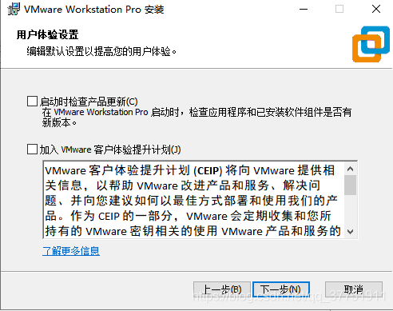

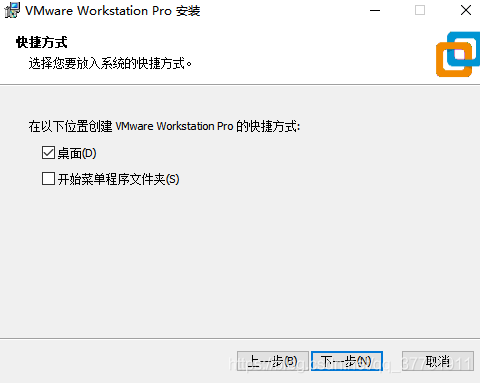

**文件 > 新建虚拟机**：


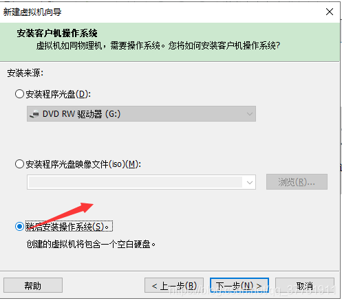

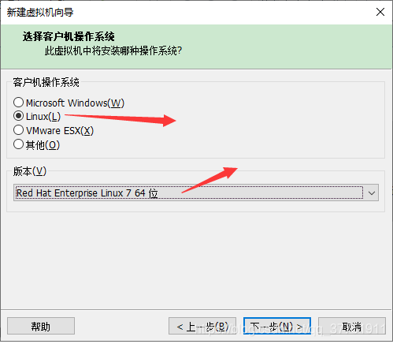

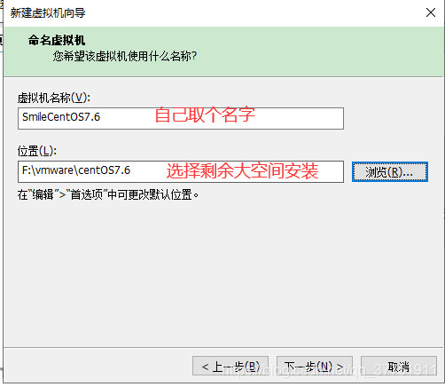

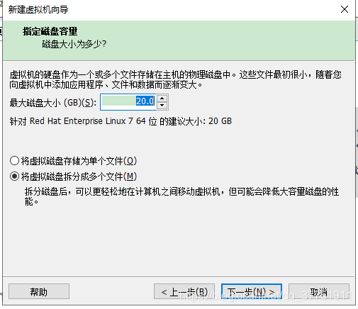

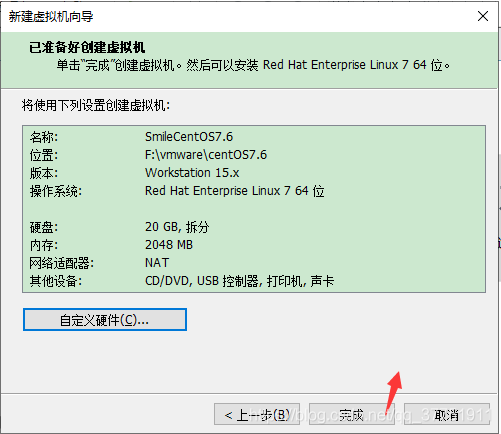

点击安装计算机的设置 > 选择镜像后 > 点确定：

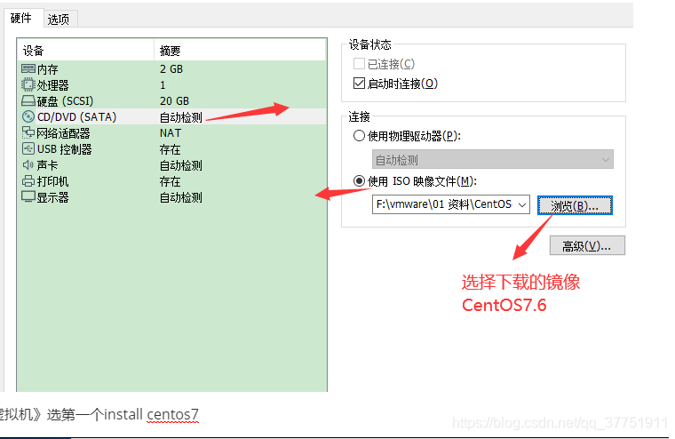

开启虚拟机》选第一个install centos7


等待一段时间不要乱点，乱点会卡死，》软件选择》最小安装或gui服务器或gnome桌面，选好后点完成。开发中一般都选最小安装，需要什么软件在自行选择，但其它安装可以省略jdk，mysql等安装，会自行安装。

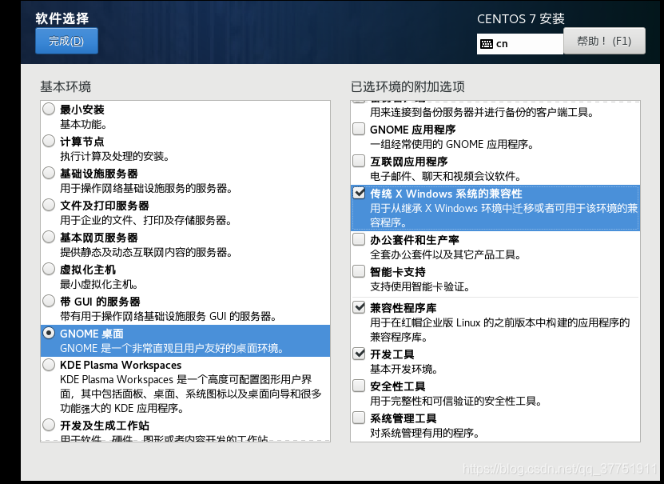

在这一步也可以选择自动配置分区，这里更快，这里我选择我要配置分区。

设置好/boot要1G，swap要2G，剩余都在根目录分区大小后，设备类型点标准分区，点完成。

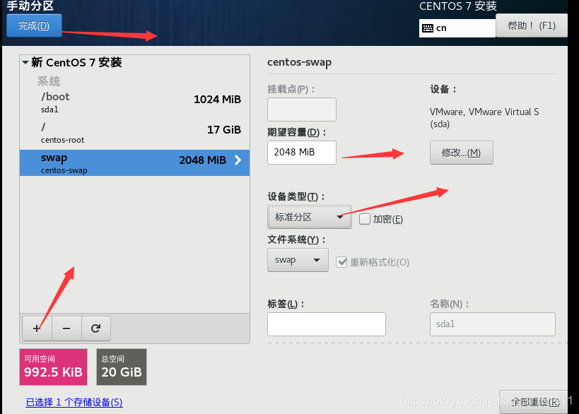

点接受更改

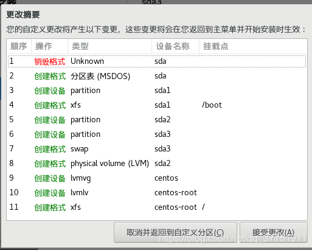

网络和主机名设置，需要联网就打开以太网。

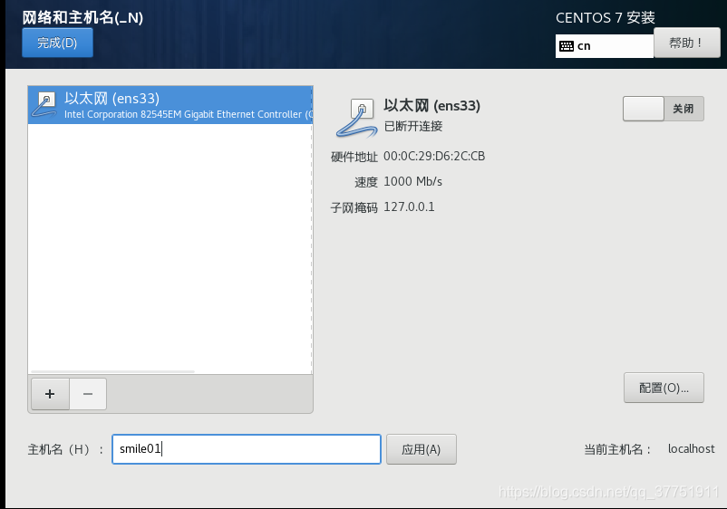

最后一个像一把锁的安检策略可以关闭。

点开始安装
在这个页面配置root账号密码，创建用户账号密码。在实际开发中root账号要复杂点，避免被破解。

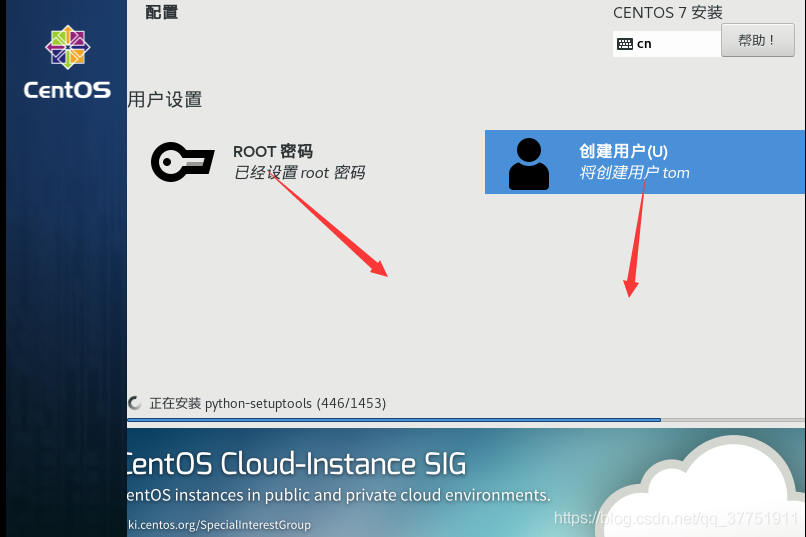等待完成后，点击重启。


再把网络连接打开。


## 虚拟机网络连接方式
- 桥接模式：同一网段中，最多只能连接255台机子，一旦超出容易造成IP冲突。IP地址的前3位就是网段（192.168.0.1）
- NAT（网络地址装换）模式：虚拟机和外部通信，不会造成IP冲突。虚拟机地址不再是以0开头，而是生成1-255之间的数，如192.168.6.1，然后主机会生成一个对应的虚拟网卡如192.168.6.6，两者能通信。这种模式下虚拟机能访问192.168.0.1，由于网段不同，192.168.0.1不能访问虚拟机
- 主机模式：虚拟网络对主机可见，虚拟机不能上网


## 安装vmtools
vmtools工具是实现虚拟机和主机文件进行共享，两个地方都能修改同一文件。安装步骤如下

- 右击虚拟机 install vmware tools
- 双击VMware Tools，复制XXX.tar.gz压缩包到/opt目录下
- 桌面上打开终端，cd /opt ,进入到opt目录下，使用解压命令tar -zxvfVM+tab键提示自动补全名称, 得到一个解压文件夹
- 进入该vm解压的目录cd vmxxx，/opt目录下
- 安装./vmware-install.pl
- 全部使用默认设置即可，一直按回车，就可以安装成功

注意:安装vmtools需有gcc ，可以使用gcc -v查看gcc版本


## 虚拟机目录

- /bin ：存放着最经常使用的命令
- /home ：存放普通用户的主目录，一般该目录名是以用户的账号命名
- /root ：该目录为系统管理员，也称作超级权限者的用户主目录（根目录）
- /boot：Linux启动相关文件
- /lib：系统开机所需要最基本的动态连接共享库，其作用类似于Windows里的DLL文件。
- /lost+ found这个目录一般情况下是空的,当系统非法关机后,这里就存放了一些文件
- /etc：系统管理所需配置和子文件目录
- /user：用户应用程序和文件
- /proc[不能动]：是虚拟目录，系统内存映射，访问这个目录获取系统信息
- /srv[不能动]：存放服务启动后所需数据
- /sys[不能动]：该目录安装了2.6内核新出现的文件系统
- /tmp：存放临时文件
- /mnt：存放挂载文件
- /opt：给主机额外安装软件的目录，即软件存放目录
- /user/local：软件安装后的目标目录，一般是编译源码的方式安装的程序


## CentOS7找回root密码

- 启动系统，进入开机页面，按e键进入编辑页面
- 光标向下移动，找到以“Linux16”开头的行数，行末输入init=/bin/sh，接着按ctr+x进入单用户模式
- 在光标闪烁位置输入：mount -o remount,rw /，完成后回车
- 接着输入passwd，完成后回车，输入密码后回车，再次输入密码。修改成功后会显示passwd……
- 接着在光标位置输入：touch /.autorelabel，完成后回车，等待系统重启，新密码就生效了

