<div style="color:#16b0ff;font-size:50px;font-weight: 900;text-shadow: 5px 5px 10px var(--theme-color);font-family: 'Comic Sans MS';">JAVA</div>

<span style="color:#16b0ff;font-size:20px;font-weight: 900;font-family: 'Comic Sans MS';">Introduction</span>：收纳技术相关的JAVA知识 `JUC`、`Thread`、`Lock`、`I/O` 等总结！

[TOC]

# J.U.C

## 并发特性

JAVA里面进行多线程通信的主要方式就是 `共享内存` 的方式，共享内存主要的关注点有两个：`可见性` 和 `有序性`。加上复合操作的 `原子性`，可以认为JAVA的线程安全性问题主要关注点有3个（JAVA内存模型JMM解决了可见性和有序性的问题，而锁解决了原子性的问题）：`可见性`、`有序性`、`原子性`

-  **原子性（Atomicity）**：在Java中原子性指的是一个或多个操作要么全部执行成功要么全部执行失败
-  **有序性（Ordering）**：程序执行的顺序按照代码的先后顺序执行（处理器可能会对指令进行重排序）
-  **可见性（Visibility）**：指在多线程环境下，当一个线程修改了某一个共享变量的值，其它线程能够立刻知道这个修改


**① 重排序**

指编译器和处理器为了优化程序性能而对指令序列进行重新排序的一种手段。从JAVA源码到最终实际执行的指令序列，会经历下面3种重排序（主要流程）：


**指令重排序分类**

- 编译器重排序
  - 编译器优化重排序：编译器在不改变单线程程序语义（as-if-serial ）的前提下，可以重新安排语句的执行顺序
- 处理器重排序
  - 内存系统重排序：由于处理器使用缓存和读/写缓冲区，这使得加载和存储操作看上去可能是在乱序执行
  - 指令级并行重排序：现代处理器采用了指令级并行技术（Instruction Level Parallelism，ILP）来将多条指令重叠执行。如果不存在数据依赖性，处理器可以改变语句对机器指令的执行顺序

**② 顺序一致性**

顺序一致性内存模型是一个理论参考模型，在设计的时候，处理器的内存模型和编程语言的内存模型都会以顺序一致性内存模型作为参照。顺序一致性特征如下：

- 一个线程中的所有操作必须按照程序的顺序来执行
- （不管程序是否同步）所有线程都只能看到一个单一的操作执行顺序。在顺序一致性的内存模型中，每个操作必须原子执行并且立刻对所有线程可见


## Unsafe

Java不能直接访问操作系统底层，而是通过本地方法来访问。**Unsafe类提供了硬件级别的原子操作**，主要提供以下功能：

- **通过Unsafe类可以分配内存，可以释放内存**

  类中提供的3个本地方法allocateMemory(申请)、reallocateMemory(扩展)、freeMemory(销毁)分别用于分配内存，扩充内存和释放内存，与C语言中的3个方法对应。

- **可以定位对象某字段的内存位置，也可以修改对象的字段值，即使它是私有的**

  - 字段的定位
  - 数组元素定位

- **挂起与恢复**

  将一个线程进行挂起是通过park方法实现的，调用 park后，线程将一直阻塞直到超时或者中断等条件出现。unpark可以终止一个挂起的线程，使其恢复正常。整个并发框架中对线程的挂起操作被封装在 LockSupport类中，LockSupport类中有各种版本pack方法，但最终都调用了Unsafe.park()方法。

- **CAS操作**

  是通过compareAndSwapXXX方法实现的


## LockSupport

LockSupport 和 CAS 是Java并发包中很多并发工具控制机制的基础，它们底层其实都是依赖Unsafe实现。LockSupport 提供park()和unpark()方法实现阻塞线程和解除线程阻塞。

LockSupport和每个使用它的线程都与一个许可(permit)关联。permit相当于1，0的开关，默认是0，调用一次unpark就加1变成1，调用一次park会消费permit, 也就是将1变成0，同时park立即返回。再次调用park会变成block（因为permit为0了，会阻塞在这里，直到permit变为1）, 这时调用unpark会把permit置为1。每个线程都有一个相关的permit, permit最多只有一个，重复调用unpark也不会积累。

park()和unpark()不会有 `Thread.suspend` 和 `Thread.resume` 所可能引发的死锁问题，由于许可的存在，调用 park 的线程和另一个试图将其 unpark 的线程之间的竞争将保持活性。


## CAS机制

CAS(`Compare And Swap`，即比较并交换)，是解决多线程并行情况下使用锁造成性能损耗的一种机制。其原理是利用`sun.misc.Unsafe.java` 类通过JNI来调用硬件级别的原子操作来实现CAS(即CAS是借助C来调用CPU底层指令实现的)。


**CAS机制=比较并交换+乐观锁机制+锁自旋**

**设计思想**：如果`内存位置` 的值与 `预期原值` 相匹配，那么处理器会自动将该位置值更新为新值，否则处理器不做任何操作。

ReentrantLock、ReentrantReadWriteLock 都是基于 AbstractQueuedSynchronizer (AQS)，而 AQS 又是基于 CAS。CAS 的全称是 Compare And Swap（比较与交换），它是一种无锁算法。synchronized和Lock都采用了悲观锁的机制，而CAS是一种乐观锁的实现。乐观锁的原理就是每次不加锁去执行某项操作，如果发生冲突则失败并重试，直到成功为止，其实本质上不算锁，所以很多地方也称之为**自旋**。乐观锁用到的主要机制就是**CAS**（Compare And Swap）。


**CAS特性**

- 通过JNI借助C来调用CPU底层指令实现
- 非阻塞算法
- 非独占锁


**CAS缺陷**

- **ABA问题**：X线程读到为A；Y线程立刻改为B，又改为A；X线程发现值还是A，此时CAS比较值相等，自旋成功
  - 使用数据乐观锁的方式给它加一个版本号或者时间戳，如使用 `AtomicStampedReference<V>` 解决
- **自旋消耗资源**：多个线程争夺同一个资源时，如果自旋一直不成功，将会一直占用CPU
  - 破坏掉死循环，当超过一定时间或者一定次数时，return退出
- **只能保证一个共享变量的原子操作**
  - 可以加锁来解决
  - 封装成对象类解决，如使用 `AtomicReference<V>` 解决


## AQS框架

**什么是AQS？**

`AQS` 的全称是 `AbstractQueuedSynchronizer`，即`抽象队列同步器`。是Java并发工具的基础，采用乐观锁，通过CAS与自旋轻量级的获取锁。维护了一个volatile int state（代表共享资源）和一个FIFO线程等待队列（多线程争用资源被阻塞时会进入此队列）。很多JUC包，比如ReentrantLock、Semaphore、CountDownLatch等并发类均是继承AQS，通过AQS的模板方法，来实现的。


**核心思想**

- 若请求的共享资源空闲，则将当前请求的线程设置为有效的工作线程，并将共享资源设置为锁定状态
- 若共享资源被占用，则需要阻塞等待唤醒机制保证锁的分配


**工作原理**

**AQS = `同步状态（volatile int state）` + `同步队列（即等待队列，FIFO的CLH队列）` + `条件队列（ConditionObject）`**

- **state**：代表共享资源。`volatile` 保证并发读，`CAS` 保证并发写
- **同步队列（即等待队列，CLH队列）**：是CLH变体的虚拟双向队列（先进先出FIFO）来等待获取共享资源。当前线程可以通过signal和signalAll将条件队列中的节点转移到同步队列中
- **条件队列（ConditionObject）**：当前线程存在于同步队列的头节点，可以通过await从同步队列转移到条件队列中


**实现原理**

- 通过CLH队列的变体：FIFO双向队列实现的
- 每个请求资源的线程被包装成一个节点来实现锁的分配
- 通过`volatile`的`int`类型的成员变量`state`表示同步状态
- 通过FIFO队列完成资源获取的排队工作
- 通过CAS完成对`state`的修改


### 共享方式

AQS定义两种资源共享方式。无论是独占锁还是共享锁，本质上都是对AQS内部的一个变量`state`的获取。`state`是一个原子的int变量，用来表示锁状态、资源数等。

**① 独占锁(`Exclusive`)模式**：只能被一个线程获取到(`Reentrantlock`)。

模式.png)


**② 共享锁(`Share`)模式**：可以被多个线程同时获取(`Semaphore/CountDownLatch/ReadWriteLock`)。

模式.png)


### state机制

提供`volatile`变量`state`，用于同步线程之间的共享状态。通过 `CAS` 和 `volatile` 保证其原子性和可见性。核心要点：

- state 用 `volatile` 修饰，保证多线程中的可见性
- `getState()` 和 `setState()` 方法**采用final修饰**，限制AQS的子类重写它们两
- `compareAndSetState()` 方法采用乐观锁思想的CAS算法，也是采用final修饰的，不允许子类重写


**state应用案例**：

| 案例                     | 描述                                                         |
| ------------------------ | ------------------------------------------------------------ |
| `Semaphore`              | 使用AQS同步状态来保存信号量的当前计数。tryRelease会增加计数，acquireShared会减少计数 |
| `CountDownLatch`         | 使用AQS同步状态来表示计数。计数为0时，所有的Acquire操作（CountDownLatch的await方法）才可以通过 |
| `ReentrantReadWriteLock` | 使用AQS同步状态中的16位保存写锁持有的次数，剩下的16位用于保存读锁的持有次数 |
| `ThreadPoolExecutor`     | Worker利用AQS同步状态实现对独占线程变量的设置（tryAcquire和tryRelease） |
| `ReentrantLock`          | 使用AQS保存锁重复持有的次数。当一个线程获取锁时，ReentrantLock记录当前获得锁的线程标识，用于检测是否重复获取，以及错误线程试图解锁操作时异常情况的处理 |


### 双队列


- **同步队列（syncQueue）：管理多个线程的休眠与唤醒**
- **条件队列（waitQueue）：类似wait与signal作用，实现在使用锁时对线程管理**


**注意**

- 同步队列与条件队列节点可相互转化
- 一个线程只能存在于两个队列中的一个


#### 同步队列

**同步队列是用来管理多个线程的休眠与唤醒**。

同步队列依赖一个双向链表（CHL）来完成同步状态的管理，当前线程获取同步状态失败后，同步器会将线程构建成一个节点，并将其加入同步队列中。通过`signal`或`signalAll`将条件队列中的节点转移到同步队列。（由条件队列转化为同步队列）

结构.png)

如果没有锁竞争，线程可以直接获取到锁，就不会进入同步队列。即没有锁竞争时，同步队列(syncQueue)是空的，当存在锁竞争时，线程会进入到同步队列中。一旦进入到同步队列中，就会有线程切换。标准的 CHL 无锁队列是单向链表，同步队列(syncQueue) 在 CHL 基础上做了改进：

- **同步队列是双向链表**。和二叉树一样，双向链表目前也没有无锁算法的实现。双向链表需要同时设置前驱和后继结点，这两次操作只能保证一个是原子性的

- **node.pre一定可以遍历所有结点，是线程安全的**。而后继结点 node.next 则是线程不安全的。也就是说，node.pre 一定可以遍历整个链表，而 node.next 则不一定


#### 条件队列

**条件队列是类似wait与signal作用，实现在使用锁时对线程管理。且由于实现了Condition，对线程的管理可更加细化**。

当线程存在于同步队列的头结点时，调用 `await` 方法进行阻塞（从同步队列转化到条件队列）。Condition条件队列(`waitQueue`)要比Lock同步队列(`syncQueue`)简单很多，最重要的原因是 `waitQueue` 的操作都是在获取锁的线程中执行，不存在数据竞争的问题。


ConditionObject重要的方法说明：

- **await**：阻塞线程并放弃锁，加入到等待队列中
- **signal**：唤醒等待线程，没有特殊的要求，尽量使用 signalAll
- **addConditionWaiter**：将结点(状态为 CONDITION)添加到等待队列 waitQueue 中，不存在锁竞争
- **fullyRelease**：释放锁，并唤醒后继等待线程
- **isOnSyncQueue**：根据结点是否在同步队列上，判断等待线程是否已经被唤醒
- **acquireQueued**：Lock 接口中的方法，通过同步队列方法竞争锁
- **unlinkCancelledWaiters**：清理取消等待的线程


### 框架架构图


**常见问题**

**问题1：state为什么要提供setState和compareAndSetState两种修改状态的方法？**

这个问题，关键是修改状态时是否存在数据竞争，如果有则必须使用 compareAndSetState。

- lock.lock() 获取锁时会发生数据竞争，必须使用 CAS 来保障线程安全，也就是 compareAndSetState 方法
- lock.unlock() 释放锁时，线程已经获取到锁，没有数据竞争，也就可以直接使用 setState 修改锁的状态

**问题2：AQS为什么选择node.prev前驱结点的原子性，而node.next后继结点则是辅助结点？**

- next 域：需要修改二处来保证原子性，一是 tail.next；二是 tail 指针
- prev 域：只需要修改一处来保证原子性，就是 tail 指针。你可能会说不需要修改 node.prev 吗？当然需要，但 node 还没添加到链表中，其 node.prev 修改并没有锁竞争的问题，将 tail 指针指向 node 时，如果失败会通过自旋不断尝试

**问题3：AQS明知道node.next有可见性问题，为什么还要设计成双向链表？**

唤醒同步线程时，如果有后继结点，那么时间复杂为 O(1)。否则只能只反向遍历，时间复杂度为 O(n)。以下两种情况，则认为 node.next 不可靠，需要从 tail 反向遍历。

- node.next=null：可能结点刚刚插入链表中，node.next 仍为空。此时有其它线程通过 unparkSuccessor 来唤醒该线程
- node.next.waitStatus>0：结点已经取消，next 值可能已经改变


## Condition

Condition的作用是对锁进行更精确的控制。Condition中的await()方法相当于Object的wait()方法，Condition中的signal()方法相当于Object的notify()方法，Condition中的signalAll()相当于Object的notifyAll()方法。不同的是，Object中的wait(),notify(),notifyAll()方法是和"同步锁"(synchronized关键字)捆绑使用的；而Condition是需要与"互斥锁"/"共享锁"捆绑使用的。


## volatile

Java 语言提供了一种稍弱的同步机制，即 volatile 变量，用来确保将变量的更新操作通知到其他线程。volatile 变量具备两种特性，volatile 变量不会被缓存在寄存器或者对其他处理器不可见的地方，因此在读取 volatile 类型的变量时总会返回最新写入的值。


**volatile特性与原理**

- **可见性**：volatile修饰的变量，JVM保证了每次都跳过工作内存和缓存行（CPU Cache）来读取主内存中的最新值
- **有序性**：即JVM使用内存屏障来禁止了该变量操作的指令重排序优化
- **volatile性能**：volatile的读性能消耗与普通变量几乎相同，但是写操作稍慢，因为它需要在本地代码中插入许多内存屏障指令来保证处理器不发生乱序执行
- **内存屏障**：加入volatile关键字时，会多出一个lock前缀指令，lock前缀指令相当于一个内存屏障（也称内存栅栏）
- **轻量级同步机制**：Java提供了一种稍弱同步机制，即volatile变量，是一种比sychronized关键字更轻量级的同步机制
- **禁止重排序**：volatile 禁止了指令重排


**使用场景**

- 状态标记量

- DCL（Double Check Lock）


**CPU缓存**

CPU缓存的出现主要是为了解决CPU运算速度与内存读写速度不匹配的矛盾，因为CPU运算速度要比内存读写速度快得多。按照读取顺序与CPU结合的紧密程度，CPU缓存可分为：

- **一级缓存**：简称L1 Cache，位于CPU内核的旁边，是与CPU结合最为紧密的CPU缓存
- **二级缓存**：简称L2 Cache，分内部和外部两种芯片，内部芯片二级缓存运行速度与主频相同，外部芯片二级缓存运行速度则只有主频的一半
- **三级缓存**：简称L3 Cache，部分高端CPU才有


**volatile的特性**

- 保证了线程可见性，不保证原子性，保证一定的有序性（禁止指令重排序）
- 在JVM底层volatile是采用“内存屏障”来实现的
- volatile常用场景：状态标记、DCL（双重检查锁，Double Check）
- volatile不会引起线程上下文的切换和调度
- 基于lock前缀指令，相当于内存屏障（内存栅栏）


## lambda

### 函数式接口

函数接口是只有一个抽象方法的接口，用作 Lambda 表达式的类型。使用@FunctionalInterface注解修饰的类，编译器会检测该类是否只有一个抽象方法或接口，否则，会报错。可以有多个默认方法，静态方法。JAVA8自带的常用函数式接口：

| 函数接口       | 抽象方法        | 功能                   | 参数  | 返回类型 | 示例                |
| -------------- | --------------- | ---------------------- | ----- | -------- | ------------------- |
| Predicate      | test(T t)       | 判断真假               | T     | boolean  | 身高大于185cm吗？   |
| Consumer       | accept(T t)     | 消费消息               | T     | void     | 输出一个值          |
| Function       | R apply(T t)    | 将T映射为R（转换功能） | T     | R        | 取student对象的名字 |
| Supplier       | T get()         | 生产消息               | None  | T        | 工厂方法            |
| UnaryOperator  | T apply(T t)    | 一元操作               | T     | T        | 逻辑非（!）         |
| BinaryOperator | apply(T t, U u) | 二元操作               | (T,T) | (T)      | 求两个数的乘积（*） |


### 常用的流

#### collect

**将流转换为集合。有toList()、toSet()、toMap()等，及早求值**。

```java
public class TestCase {
    public static void main(String[] args) {
        List<Student> studentList = Stream.of(new Student("路飞", 22, 175), 
                                              new Student("红发", 40, 180), new Student("白胡子", 50, 185)).collect(Collectors.toList());
        System.out.println(studentList);
    }
}

// 输出结果
// [Student{name='路飞', age=22, stature=175, specialities=null}, 
// Student{name='红发', age=40, stature=180, specialities=null}, 
// Student{name='白胡子', age=50, stature=185, specialities=null}]
```


#### filter

顾名思义，起**过滤筛选**的作用。**内部就是Predicate接口。惰性求值。**


```java
public class TestCase {
    public static void main(String[] args) {
        List<Student> students = new ArrayList<>(3);
        students.add(new Student("路飞", 22, 175));
        students.add(new Student("红发", 40, 180));
        students.add(new Student("白胡子", 50, 185));

        List<Student> list = students.stream()
            .filter(stu -> stu.getStature() < 180)
            .collect(Collectors.toList());
        System.out.println(list);
    }
}

// 输出结果
// [Student{name='路飞', age=22, stature=175, specialities=null}]
```


#### map

**转换功能，内部就是Function接口。惰性求值。**


```java
public class TestCase {
    public static void main(String[] args) {
        List<Student> students = new ArrayList<>(3);
        students.add(new Student("路飞", 22, 175));
        students.add(new Student("红发", 40, 180));
        students.add(new Student("白胡子", 50, 185));

        List<String> names = students.stream().map(student -> student.getName())
                .collect(Collectors.toList());
        System.out.println(names);
    }
}

// 输出结果
// [路飞, 红发, 白胡子]
```

例子中将student对象转换为String对象，获取student的名字。


#### flatMap

**将多个Stream合并为一个Stream。惰性求值。**


```java
public class TestCase {
    public static void main(String[] args) {
        List<Student> students = new ArrayList<>(3);
        students.add(new Student("路飞", 22, 175));
        students.add(new Student("红发", 40, 180));
        students.add(new Student("白胡子", 50, 185));

        List<Student> studentList = Stream.of(students,
                asList(new Student("艾斯", 25, 183),
                        new Student("雷利", 48, 176)))
                .flatMap(students1 -> students1.stream()).collect(Collectors.toList());
        System.out.println(studentList);
    }
}

// 输出结果
// [Student{name='路飞', age=22, stature=175, specialities=null}, 
// Student{name='红发', age=40, stature=180, specialities=null}, 
// Student{name='白胡子', age=50, stature=185, specialities=null}, 
// Student{name='艾斯', age=25, stature=183, specialities=null},
// Student{name='雷利', age=48, stature=176, specialities=null}]
```

调用Stream.of的静态方法将两个list转换为Stream，再通过flatMap将两个流合并为一个。


#### max和min

我们经常会在集合中**求最大或最小值**，使用流就很方便。**及早求值。**

```java
public class TestCase {
    public static void main(String[] args) {
        List<Student> students = new ArrayList<>(3);
        students.add(new Student("路飞", 22, 175));
        students.add(new Student("红发", 40, 180));
        students.add(new Student("白胡子", 50, 185));

        Optional<Student> max = students.stream()
            .max(Comparator.comparing(stu -> stu.getAge()));
        Optional<Student> min = students.stream()
            .min(Comparator.comparing(stu -> stu.getAge()));
        //判断是否有值
        if (max.isPresent()) {
            System.out.println(max.get());
        }
        if (min.isPresent()) {
            System.out.println(min.get());
        }
    }
}

// 输出结果
// Student{name='白胡子', age=50, stature=185, specialities=null}
// Student{name='路飞', age=22, stature=175, specialities=null}
```

**max、min接收一个Comparator**（例子中使用java8自带的静态函数，只需要传进需要比较值即可），并且返回一个Optional对象，该对象是java8新增的类，专门为了防止null引发的空指针异常。可以使用max.isPresent()判断是否有值；可以使用max.orElse(new Student())，当值为null时就使用给定值；也可以使用max.orElseGet(() -> new Student());这需要传入一个Supplier的lambda表达式。


#### count

**统计功能，一般都是结合filter使用，因为先筛选出我们需要的再统计即可。及早求值。**

```java
public class TestCase {
    public static void main(String[] args) {
        List<Student> students = new ArrayList<>(3);
        students.add(new Student("路飞", 22, 175));
        students.add(new Student("红发", 40, 180));
        students.add(new Student("白胡子", 50, 185));

        long count = students.stream().filter(s1 -> s1.getAge() < 45).count();
        System.out.println("年龄小于45岁的人数是：" + count);
    }
}

// 输出结果
// 年龄小于45岁的人数是：2
```


#### reduce

**reduce 操作可以实现从一组值中生成一个值**。在上述例子中用到的 count 、 min 和 max 方法，因为常用而被纳入标准库中。事实上，这些方法都是 reduce 操作。**及早求值。**


```java
public class TestCase {
    public static void main(String[] args) {
        Integer reduce = Stream.of(1, 2, 3, 4).reduce(0, (acc, x) -> acc+ x);
        System.out.println(reduce);
    }
}

// 输出结果
// 10
```

我们看得reduce接收了一个初始值为0的累加器，依次取出值与累加器相加，最后累加器的值就是最终的结果。


### 高级集合类及收集器

#### 转换成值

**收集器，一种通用的、从流生成复杂值的结构。**只要将它传给 collect 方法，所有的流就都可以使用它了。标准类库已经提供了一些有用的收集器，**以下示例代码中的收集器都是从 java.util.stream.Collectors 类中静态导入的。**

```java
public class CollectorsTest {
    public static void main(String[] args) {
        List<Student> students1 = new ArrayList<>(3);
        students1.add(new Student("路飞", 23, 175));
        students1.add(new Student("红发", 40, 180));
        students1.add(new Student("白胡子", 50, 185));

        OutstandingClass ostClass1 = new OutstandingClass("一班", students1);
        //复制students1，并移除一个学生
        List<Student> students2 = new ArrayList<>(students1);
        students2.remove(1);
        OutstandingClass ostClass2 = new OutstandingClass("二班", students2);
        //将ostClass1、ostClass2转换为Stream
        Stream<OutstandingClass> classStream = Stream.of(ostClass1, ostClass2);
        OutstandingClass outstandingClass = biggestGroup(classStream);
        System.out.println("人数最多的班级是：" + outstandingClass.getName());

        System.out.println("一班平均年龄是：" + averageNumberOfStudent(students1));
    }

    /**
     * 获取人数最多的班级
     */
    private static OutstandingClass biggestGroup(Stream<OutstandingClass> outstandingClasses) {
        return outstandingClasses.collect(
                maxBy(comparing(ostClass -> ostClass.getStudents().size())))
                .orElseGet(OutstandingClass::new);
    }

    /**
     * 计算平均年龄
     */
    private static double averageNumberOfStudent(List<Student> students) {
        return students.stream().collect(averagingInt(Student::getAge));
    }
}

// 输出结果
// 人数最多的班级是：一班
// 一班平均年龄是：37.666666666666664
```

maxBy或者minBy就是求最大值与最小值。


#### 转换成块

**常用的流操作是将其分解成两个集合，Collectors.partitioningBy帮我们实现了，接收一个Predicate函数式接口。**


将示例学生分为会唱歌与不会唱歌的两个集合。

```java
public class PartitioningByTest {
    public static void main(String[] args) {
        // 省略List<student> students的初始化
        Map<Boolean, List<Student>> listMap = students.stream().collect(
            Collectors.partitioningBy(student -> student.getSpecialities().
                                      contains(SpecialityEnum.SING)));
    }
}
```


#### 数据分组

数据分组是一种更自然的分割数据操作，与将数据分成 ture 和 false 两部分不同，**可以使用任意值对数据分组。Collectors.groupingBy接收一个Function做转换。**


**如图，使用groupingBy将根据进行分组为圆形一组，三角形一组，正方形一组。**例子：根据学生第一个特长进行分组

```java
public class GroupingByTest {
    public static void main(String[] args) {
        //省略List<student> students的初始化
         Map<SpecialityEnum, List<Student>> listMap = 
             students.stream().collect(
             Collectors.groupingBy(student -> student.getSpecialities().get(0)));
    }
}
```

Collectors.groupingBy与SQL 中的 group by 操作是一样的。


#### 字符串拼接

如果将所有学生的名字拼接起来，怎么做呢？通常只能创建一个StringBuilder，循环拼接。使用Stream，使用Collectors.joining()简单容易。

```java
public class JoiningTest {
    public static void main(String[] args) {
        List<Student> students = new ArrayList<>(3);
        students.add(new Student("路飞", 22, 175));
        students.add(new Student("红发", 40, 180));
        students.add(new Student("白胡子", 50, 185));

         String names = students.stream()
             .map(Student::getName).collect(Collectors.joining(",","[","]"));
        System.out.println(names);
    }
}
//输出结果
//[路飞,红发,白胡子]
```

joining接收三个参数，第一个是分界符，第二个是前缀符，第三个是结束符。也可以不传入参数Collectors.joining()，这样就是直接拼接。


## Striped64

Striped64的设计思路是在竞争激烈的时候尽量分散竞争。


**Striping（条带化）**

大多数磁盘系统都对访问次数（每秒的 I/O 操作，IOPS）和数据传输率（每秒传输的数据量，TPS）有限制。当达到这些限制时，后续需要访问磁盘的进程就需要等待，这就是所谓的磁盘冲突。当多个进程同时访问一个磁盘时，可能会出现磁盘冲突。因此，避免磁盘冲突是优化 I/O 性能的一个重要目标。

条带（strip）是把连续的数据分割成相同大小的数据块，把每段数据分别写入到阵列中的不同磁盘上的方法。使用条带化技术使得多个进程同时访问数据的多个不同部分而不会造成磁盘冲突，而且在需要对这种数据进行顺序访问的时候可以获得最大程度上的 I/O 并行能力，从而获得非常好的性能。


**Striped64设计**

Striped64通过维护一个原子更新Cell表和一个base字段，并使用每个线程的探针字段作为哈希码映射到表的指定Cell。当竞争激烈时，将多线程的更新分散到不同Cell进行，有效降低了高并发下CAS更新的竞争，从而最大限度地提高了Striped64的吞吐量。Striped64为实现高吞吐量的并发计数组件奠定了基础，其中LongAdder就是基于Striped64实现，此外Java8中ConcurrentHashMap实现的并发计数功能也是基于Striped64的设计理念，还有hystrix、guava等实现的并发计数组件也离不开Striped64。


## LongAdder

LongAdder是JDK1.8开始出现的，所提供的API基本上可替换掉原先AtomicLong。LongAdder所使用思想就是**热点分离**，这点可以类比一下ConcurrentHashMap的设计思想。就是将value值分离成一个数组，当多线程访问时，通过hash算法映射到其中的一个数字进行计数。而最终的结果，就是这些数组的求和累加。这样一来，就减小了锁的粒度。如下图所示：


LonAdder和AtomicLong性能测试对比：


LongAdder就是基于Striped64实现，用于并发计数时，若不存在竞争或竞争比较低时，LongAdder具有和AtomicLong差不多的效率。但是，高并发环境下，竞争比较严重时，LongAdder的cells表发挥作用，将并发更新分散到不同Cell进行，有效降低了CAS更新的竞争，从而极大提高了LongAdder的并发计数能力。因此，高并发场景下，要实现吞吐量更高的计数器，推荐使用LongAdder。


## Semaphore

Semaphore是一个计数信号量，它的本质是一个"共享锁"。信号量维护了一个信号量许可集。线程可以通过调用acquire()来获取信号量的许可；当信号量中有可用的许可时，线程能获取该许可；否则线程必须等待，直到有可用的许可为止。 线程可以通过release()来释放它所持有的信号量许可。


**数据结构**


- 和"ReentrantLock"一样，Semaphore也包含sync对象，sync是Sync类型；而且Sync是一个继承于AQS的抽象类
- Sync包括两个子类："公平信号量"FairSync 和 "非公平信号量"NonfairSync。sync是"FairSync的实例"，或者"NonfairSync的实例"；默认情况下，sync是NonfairSync(即，默认是非公平信号量)

 

## CyclicBarrier

CyclicBarrier是一个同步辅助类，允许一组线程互相等待，直到到达某个公共屏障点 (common barrier point)。因为该 barrier 在释放等待线程后可以重用，所以称它为循环 的 barrier。


**比较CountDownLatch和CyclicBarrier**

- CountDownLatch的作用是允许1或N个线程等待其他线程完成执行；而CyclicBarrier则是允许N个线程相互等待
- CountDownLatch的计数器无法被重置；CyclicBarrier的计数器可以被重置后使用，因此它被称为是循环的barrier


**数据结构**


CyclicBarrier是包含了"ReentrantLock对象lock"和"Condition对象trip"，它是通过独占锁实现的。下面通过源码去分析到底是如何实现的。


## CountDownLatch

CountDownLatch是一个同步辅助类，在完成一组正在其他线程中执行的操作之前，它允许一个或多个线程一直等待。


**CountDownLatch和CyclicBarrier的区别**

- CountDownLatch的作用是允许1或N个线程等待其他线程完成执行；而CyclicBarrier则是允许N个线程相互等待
- CountDownLatch的计数器无法被重置；CyclicBarrier的计数器可以被重置后使用，因此它被称为是循环的barrier


**数据结构**


CountDownLatch的数据结构很简单，它是通过"共享锁"实现的。它包含了sync对象，sync是Sync类型。Sync是实例类，它继承于AQS。


## CompletableFuture

CompletableFuture是Java 8新增的一个类，用于异步编程，继承了Future和CompletionStage。Future主要具备对请求结果独立处理的功能，CompletionStage用于实现流式处理，实现异步请求的各个阶段组合或链式处理，因此CompletableFuture能实现整个异步调用接口的扁平化和流式处理，解决原有Future处理一系列链式异步请求时的复杂编码:


**Future的局限性**

- **Future 的结果在非阻塞的情况下，不能执行更进一步的操作**

  我们知道，使用Future时只能通过isDone()方法判断任务是否完成，或者通过get()方法阻塞线程等待结果返回，它不能非阻塞的情况下，执行更进一步的操作

- **不能组合多个Future的结果**

  假设你有多个Future异步任务，你希望最快的任务执行完时，或者所有任务都执行完后，进行一些其他操作

- **多个Future不能组成链式调用**

  当异步任务之间有依赖关系时，Future不能将一个任务的结果传给另一个异步任务，多个Future无法创建链式的工作流

- **没有异常处理**


**注意事项**

- **CompletableFuture默认线程池是否满足使用**

  前面提到创建CompletableFuture异步任务的静态方法runAsync和supplyAsync等，可以指定使用的线程池，不指定则用CompletableFuture的默认线程池：

  ```java
  private static final Executor asyncPool = useCommonPool ? ForkJoinPool.commonPool() : new ThreadPerTaskExecutor();
  ```

  可以看到，CompletableFuture默认线程池是调用ForkJoinPool的commonPool()方法创建，这个默认线程池的核心线程数量根据CPU核数而定，公式为`Runtime.getRuntime().availableProcessors() - 1`，以4核双槽CPU为例，核心线程数量就是`4*2-1=7`个。这样的设置满足CPU密集型的应用，但对于业务都是IO密集型的应用来说，是有风险的，当qps较高时，线程数量可能就设的太少了，会导致线上故障。所以可以根据业务情况自定义线程池使用。

- **get设置超时时间不能串行get，不然会导致接口延时`线程数量\*超时时间`**


**① 创建异步任务**

通常可以使用下面几个CompletableFuture的静态方法创建一个异步任务

```java
// 创建无返回值的异步任务
public static CompletableFuture<Void> runAsync(Runnable runnable);
// 无返回值，可指定线程池（默认使用ForkJoinPool.commonPool）
public static CompletableFuture<Void> runAsync(Runnable runnable, Executor executor);
// 创建有返回值的异步任务
public static <U> CompletableFuture<U> supplyAsync(Supplier<U> supplier);
// 有返回值，可指定线程池
public static <U> CompletableFuture<U> supplyAsync(Supplier<U> supplier, Executor executor);
```

使用示例：

```java
Executor executor = Executors.newFixedThreadPool(10);
CompletableFuture<Void> future = CompletableFuture.runAsync(() -> {
    //do something
}, executor);

int poiId = 111;
CompletableFuture<String> future = CompletableFuture.supplyAsync(() -> {
	PoiDTO poi = poiService.loadById(poiId);
  return poi.getName();
});
// Block and get the result of the Future
String poiName = future.get();
```


**② 使用回调方法**

通过`future.get()`方法获取异步任务的结果，还是会阻塞的等待任务完成

CompletableFuture提供了几个回调方法，可以不阻塞主线程，在异步任务完成后自动执行回调方法中的代码

```java
// 无参数、无返回值
public CompletableFuture<Void> thenRun(Runnable runnable);
// 接受参数，无返回值
public CompletableFuture<Void> thenAccept(Consumer<? super T> action);
// 接受参数T，有返回值U
public <U> CompletableFuture<U> thenApply(Function<? super T,? extends U> fn);
```

使用示例：

```java
CompletableFuture<Void> future = CompletableFuture.supplyAsync(() -> "Hello")
   	 .thenRun(() -> System.out.println("do other things. 比如异步打印日志或发送消息"));
// 如果只想在一个CompletableFuture任务执行完后，进行一些后续的处理，不需要返回值，那么可以用thenRun回调方法来完成。
// 如果主线程不依赖thenRun中的代码执行完成，也不需要使用get()方法阻塞主线程。

CompletableFuture<Void> future = CompletableFuture.supplyAsync(() -> "Hello")
    	.thenAccept((s) -> System.out.println(s + " world"));
// 输出：Hello world
// 回调方法希望使用异步任务的结果，并不需要返回值，那么可以使用thenAccept方法

CompletableFuture<Boolean> future = CompletableFuture.supplyAsync(() -> {
  	PoiDTO poi = poiService.loadById(poiId);
  	return poi.getMainCategory();
}).thenApply((s) -> isMainPoi(s));			// boolean isMainPoi(int poiId);
future.get();
// 希望将异步任务的结果做进一步处理，并需要返回值，则使用thenApply方法。
// 如果主线程要获取回调方法的返回，还是要用get()方法阻塞得到
```


**③ 组合两个异步任务**

```java
// thenCompose方法中的异步任务依赖调用该方法的异步任务
public <U> CompletableFuture<U> thenCompose(Function<? super T, ? extends CompletionStage<U>> fn);	
// 用于两个独立的异步任务都完成的时候
public <U,V> CompletableFuture<V> thenCombine(CompletionStage<? extends U> other,  BiFunction<? super T,? super U,? extends V> fn);
```

使用示例：

```java
CompletableFuture<List<Integer>> poiFuture = CompletableFuture.supplyAsync(
  () -> poiService.queryPoiIds(cityId, poiId)
);
// 第二个任务是返回CompletableFuture的异步方法
CompletableFuture<List<DealGroupDTO>> getDeal(List<Integer> poiIds){
  return CompletableFuture.supplyAsync(() ->  poiService.queryPoiIds(poiIds));
}
// thenCompose
CompletableFuture<List<DealGroupDTO>> resultFuture = poiFuture.thenCompose(poiIds -> getDeal(poiIds));
resultFuture.get();
```

thenCompose和thenApply的功能类似，两者区别在于thenCompose接受一个返回`CompletableFuture<U>`的Function，当想从回调方法返回的`CompletableFuture<U>`中直接获取结果U时，就用thenCompose。如果使用thenApply，返回结果resultFuture的类型是`CompletableFuture<CompletableFuture<List<DealGroupDTO>>>`，而不是`CompletableFuture<List<DealGroupDTO>>`

```java
CompletableFuture<String> future = CompletableFuture.supplyAsync(() -> "Hello")
  .thenCombine(CompletableFuture.supplyAsync(() -> "world"), (s1, s2) -> s1 + s2);
// future.get()
```


**④ 组合多个CompletableFuture**

当需要多个异步任务都完成时，再进行后续处理，可以使用**allOf**方法：

```java
CompletableFuture<Void> poiIDTOFuture = CompletableFuture
	.supplyAsync(() -> poiService.loadPoi(poiId))
  .thenAccept(poi -> {
    model.setModelTitle(poi.getShopName());
    // do more thing
  });

CompletableFuture<Void> productFuture = CompletableFuture
	.supplyAsync(() -> productService.findAllByPoiIdOrderByUpdateTimeDesc(poiId))
  .thenAccept(list -> {
    model.setDefaultCount(list.size());
    model.setMoreDesc("more");
  });
// future3等更多异步任务，这里就不一一写出来了

// allOf组合所有异步任务，并使用join获取结果
CompletableFuture.allOf(poiIDTOFuture, productFuture, future3, ...).join();
```

该方法挺适合C端的业务，通过poiId异步的从多个服务拿门店信息，然后组装成自己需要的模型，最后所有门店信息都填充完后返回。这里使用了join方法获取结果，它和get方法一样阻塞的等待任务完成。多个异步任务有任意一个完成时就返回结果，可以使用**anyOf**方法：

```java
CompletableFuture<String> future1 = CompletableFuture.supplyAsync(() -> {
    try {
        TimeUnit.SECONDS.sleep(2);
    } catch (InterruptedException e) {
       throw new IllegalStateException(e);
    }
    return "Result of Future 1";
});

CompletableFuture<String> future2 = CompletableFuture.supplyAsync(() -> {
    try {
        TimeUnit.SECONDS.sleep(1);
    } catch (InterruptedException e) {
       throw new IllegalStateException(e);
    }
    return "Result of Future 2";
});

CompletableFuture<String> future3 = CompletableFuture.supplyAsync(() -> {
    try {
        TimeUnit.SECONDS.sleep(3);
    } catch (InterruptedException e) {
       throw new IllegalStateException(e);
      return "Result of Future 3";
});

CompletableFuture<Object> anyOfFuture = CompletableFuture.anyOf(future1, future2, future3);

System.out.println(anyOfFuture.get()); // Result of Future 2
```


**⑤ 异常处理**

```java
Integer age = -1;

CompletableFuture<Void> maturityFuture = CompletableFuture.supplyAsync(() -> {
  if(age < 0) {
    throw new IllegalArgumentException("Age can not be negative");
  }
  if(age > 18) {
    return "Adult";
  } else {
    return "Child";
  }
}).exceptionally(ex -> {
  System.out.println("Oops! We have an exception - " + ex.getMessage());
  return "Unknown!";
}).thenAccept(s -> System.out.print(s));
// Unkown!
```

exceptionally方法可以处理异步任务的异常，在出现异常时，给异步任务链一个从错误中恢复的机会，可以在这里记录异常或返回一个默认值。使用handler方法也可以处理异常，并且无论是否发生异常它都会被调用：

```java
Integer age = -1;

CompletableFuture<String> maturityFuture = CompletableFuture.supplyAsync(() -> {
    if(age < 0) {
        throw new IllegalArgumentException("Age can not be negative");
    }
    if(age > 18) {
        return "Adult";
    } else {
        return "Child";
    }
}).handle((res, ex) -> {
    if(ex != null) {
        System.out.println("Oops! We have an exception - " + ex.getMessage());
        return "Unknown!";
    }
    return res;
});
```


**⑥ 分片处理**

分片和并行处理：分片借助stream实现，然后通过CompletableFuture实现并行执行，最后做数据聚合（其实也是stream的方法）。CompletableFuture并不提供单独的分片api，但可以借助stream的分片聚合功能实现。举个例子：

```java
// 请求商品数量过多时，做分批异步处理
List<List<Long>> skuBaseIdsList = ListUtils.partition(skuIdList, 10);//分片
// 并行
List<CompletableFuture<List<SkuSales>>> futureList = Lists.newArrayList();
for (List<Long> skuId : skuBaseIdsList) {
  CompletableFuture<List<SkuSales>> tmpFuture = getSkuSales(skuId);
  futureList.add(tmpFuture);
}
// 聚合
futureList.stream().map(CompletalbleFuture::join).collent(Collectors.toList());
```


**⑦ 应用案例**

首先还是需要先完成分工方案，在下面的程序中，我们分了3个任务：

- 任务1负责洗水壶、烧开水
- 任务2负责洗茶壶、洗茶杯和拿茶叶
- 任务3负责泡茶。其中任务3要等待任务1和任务2都完成后才能开始

```java
// 任务1：洗水壶->烧开水
CompletableFuture f1 = 
  CompletableFuture.runAsync(()->{
  System.out.println("T1:洗水壶...");
  sleep(1, TimeUnit.SECONDS);

  System.out.println("T1:烧开水...");
  sleep(15, TimeUnit.SECONDS);
});

// 任务2：洗茶壶->洗茶杯->拿茶叶
CompletableFuture f2 = 
  CompletableFuture.supplyAsync(()->{
  System.out.println("T2:洗茶壶...");
  sleep(1, TimeUnit.SECONDS);

  System.out.println("T2:洗茶杯...");
  sleep(2, TimeUnit.SECONDS);

  System.out.println("T2:拿茶叶...");
  sleep(1, TimeUnit.SECONDS);
  return "龙井";
});

// 任务3：任务1和任务2完成后执行：泡茶
CompletableFuture f3 = 
  f1.thenCombine(f2, (__, tf)->{
    System.out.println("T3:拿到茶叶:" + tf);
    System.out.println("T3:泡茶...");
    return "上茶:" + tf;
  });

// 等待任务3执行结果
System.out.println(f3.join());
void sleep(int t, TimeUnit u) {
      try {
        u.sleep(t);
      }catch(InterruptedException e){}
}

// 一次执行结果：
T1:洗水壶...
T2:洗茶壶...
T1:烧开水...
T2:洗茶杯...
T2:拿茶叶...
T3:拿到茶叶:龙井
T3:泡茶...
上茶:龙井
```


# 集合

## List

### ArrayList(数组)

ArrayList 是一个**数组队列**，相当于 **动态数组**。与Java中的数组相比，它的容量能动态增长。

它允许对元素进行快速随机访问。数组的缺点是每个元素之间不能有间隔，当数组大小不满足时需要增加存储能力，就要将已经有数组的数据复制到新的存储空间中。当从 ArrayList 的中间位置插入或者删除元素时，需要对数组进行复制、移动、代价比较高。因此，它适合随机查找和遍历，不适合插入和删除。


### LinkedList(链表)

LinkedList 是用链表结构存储数据的，很适合数据的动态插入和删除，随机访问和遍历速度比较慢。另外，他还提供了 List 接口中没有定义的方法，专门用于操作表头和表尾元素，可以当作堆栈、队列和双向队列使用。

- LinkedList是有序的双向链表
- LinkedList在内存中开辟的内存不连续【ArrayList开辟的内存是连续的】
- LinkedList插入和删除元素很快，但是查询很慢【相对于ArrayList】


### Vector(数组实现、线程同步)

Vector 与 ArrayList 一样，也是通过数组实现的，不同的是它支持线程的同步，即某一时刻只有一个线程能够写 Vector，避免多线程同时写而引起的不一致性，但实现同步需要很高的花费，因此，访问它比访问 ArrayList 慢。


### CopyOnWriteArrayList

**Copy-On-Write是什么？**

顾名思义，在计算机中就是当你想要对一块内存进行修改时，我们不在原有内存块中进行`写`操作，而是将内存拷贝一份，在新的内存中进行`写`操作，`写`完之后呢，就将指向原来内存指针指向新的内存，原来的内存就可以被回收掉。


CopyOnWriteArrayList相当于线程安全的ArrayList，它实现了List接口，支持高并发。和ArrayList一样，它是个可变数组，但是和ArrayList不同的时，它具有以下特性：

- 最适合于具有以下特征的应用：List大小通常保持很小，只读操作远多于可变操作，需在遍历期间防止线程间的冲突
- 它是线程安全的
- 因为通常需要复制整个基础数组，所以可变操作（add()、set() 和 remove() 等等）的开销很大
- 迭代器支持hasNext(), next()等不可变操作，但不支持可变 remove()等操作
- 使用迭代器进行遍历的速度很快，并且不会与其他线程发生冲突。在构造迭代器时，迭代器依赖于不变的数组快照


**CopyOnWriteArrayList数据结构**


- CopyOnWriteArrayList实现了List接口，因此它是一个队列
- CopyOnWriteArrayList包含了成员lock。每一个CopyOnWriteArrayList都和一个互斥锁lock绑定，通过lock，实现了对CopyOnWriteArrayList的互斥访问
- CopyOnWriteArrayList包含了成员array数组，这说明CopyOnWriteArrayList本质上通过数组实现的


**CopyOnWriteArrayList原理**

下面从“动态数组”和“线程安全”两个方面进一步对CopyOnWriteArrayList的原理进行说明。

- **CopyOnWriteArrayList的“动态数组”机制**

  它内部有个“volatile数组”(array)来保持数据。

  在“添加/修改/删除”数据时，都会新建一个数组，并将更新后的数据拷贝到新建的数组中，最后再将该数组赋值给“volatile数组”。这就是它叫做CopyOnWriteArrayList的原因。CopyOnWriteArrayList就是通过这种方式实现的动态数组，不过正由于它在“添加/修改/删除”数据时，都会新建数组，所以涉及到修改数据的操作，CopyOnWriteArrayList效率很
  低。但是单单只是进行遍历查找的话，效率比较高

- **CopyOnWriteArrayList的“线程安全”机制**

  是通过volatile和互斥锁来实现的。

  - **CopyOnWriteArrayList是通过“volatile数组”来保存数据的**。一个线程读取volatile数组时，总能看到其它线程对该volatile变量最后的写入。就这样，通过volatile提供了“读取到的数据总是最新的”这个机制的保证
  - **CopyOnWriteArrayList通过互斥锁来保护数据**。在“添加、修改、删除”数据时，会先“获取互斥锁”，再修改完毕之后，先将数据更新到“volatile数组”中，然后再“释放互斥锁”；这样，就达到了保护数据的目的


## Set

### HashSet(Hash表)

**HashSet 基于 HashMap，底层是通过 HashMap 的API来实现的。**哈希表边存放的是哈希值。HashSet 存储元素的顺序并不是按照存入时的顺序（和 List 显然不同） 而是按照哈希值来存的所以取数据也是按照哈希值取得。元素的哈希值是通过元素的hashcode 方法来获取的, HashSet 首先判断两个元素的哈希值，如果哈希值一样，接着会比较equals方法，如果 equls 结果为 true ，HashSet 就视为同一个元素；如果 equals 为 false 就不是同一个元素。hashcode相同，equals不相等，则使用链表存储。


### TreeSet(二叉树)

底层通过TreeMap来实现，非线程安全，具有排序功能（自然排序（默认）和自定义排序）。它继承AbstractSet，实现NavigableSet（搜索功能）, Cloneable（克隆）, Serializable（序列化，可用hessian协议来传输）接口。

- TreeSet()是使用二叉树的原理对新 add()的对象按照指定的顺序排序（升序、降序），每增加一个对象都会进行排序，将对象插入的二叉树指定的位置
- Integer 和 String 对象都可以进行默认的 TreeSet 排序，而自定义类的对象是不可以的，自己定义的类必须实现 Comparable 接口，并且覆写相应的 compareTo()函数，才可以正常使用
- 在覆写 compare()函数时，要返回相应的值才能使 TreeSet 按照一定的规则来排序
- 比较此对象与指定对象的顺序。如果该对象小于、等于或大于指定对象，则分别返回负整数、零或正整数


### LinkedHashSet

对于 LinkedHashSet 而言，它继承与 HashSet、又基于 LinkedHashMap 来实现的。LinkedHashSet 底层使用LinkedHashMap 来保存所有元素，它继承与 HashSet，其所有的方法操作上又与 HashSet 相同，因此 LinkedHashSet 的实现上非常简单，只提供了四个构造方法，并通过传递一个标识参数，调用父类的构造器，底层构造一个 LinkedHashMap 来实现，在相关操作上与父类 HashSet 的操作相同，直接调用父类 HashSet 的方法即可。


### ConcurrentSkipListSet

ConcurrentSkipListSet是线程安全的有序的集合(相当于线程安全的TreeSet)；它继承于AbstractSet，并实现了NavigableSet接口。ConcurrentSkipListSet是通过ConcurrentSkipListMap实现的，它也支持并发。


### CopyOnWriteArraySet

CopyOnWriteArraySet是线程安全的无序的集合，可以将它理解成线程安全的HashSet。CopyOnWriteArraySet内部包含一个CopyOnWriteArrayList对象，它是通过CopyOnWriteArrayList实现的。

- **通过“动态数组(CopyOnWriteArrayList)”实现（HashSet是通过“散列表(HashMap)”实现的）**
- **线程安全是通过volatile和互斥锁来实现**
- **无序的不能重复集合**


**CopyOnWriteArraySet特性**

- 它最适合于具有以下特征的应用程序：Set 大小通常保持很小，只读操作远多于可变操作，需要在遍历期间防止线程间的冲突
- 它是线程安全的
- 因为通常需要复制整个基础数组，所以可变操作（add()、set() 和 remove() 等等）的开销很大
- 迭代器支持hasNext(), next()等不可变操作，但不支持可变 remove()等 操作
- 使用迭代器进行遍历的速度很快，并且不会与其他线程发生冲突。在构造迭代器时，迭代器依赖于不变的数组快照


**数据结构**


- CopyOnWriteArraySet继承于AbstractSet，这就意味着它是一个集合
- CopyOnWriteArraySet包含CopyOnWriteArrayList对象，它是通过CopyOnWriteArrayList实现的。而CopyOnWriteArrayList本质是个动态数组队列，所以CopyOnWriteArraySet相当于通过通过动态数组实现的“集合”！ CopyOnWriteArrayList中允许有重复的元素；但是，CopyOnWriteArraySet是一个集合，所以它不能有重复集合。因此，CopyOnWriteArrayList额外提供了addIfAbsent()和addAllAbsent()这两个添加元素的API，通过这些API来添加元素时，只有当元素不存在时才执行添加操作


### ConcurrentSkipListSet

ConcurrentSkipListSet是线程安全的有序的集合，适用于高并发的场景。ConcurrentSkipListSet和TreeSet，它们虽然都是有序的集合。但是，第一，它们的线程安全机制不同，TreeSet是非线程安全的，而ConcurrentSkipListSet是线程安全的。第二，ConcurrentSkipListSet是通过ConcurrentSkipListMap实现的，而TreeSet是通过TreeMap实现的。


**数据结构**

 

- ConcurrentSkipListSet继承于AbstractSet。因此，它本质上是一个集合
- ConcurrentSkipListSet实现了NavigableSet接口。因此，ConcurrentSkipListSet是一个有序的集合
- ConcurrentSkipListSet是通过ConcurrentSkipListMap实现的。它包含一个ConcurrentNavigableMap对象m，而m对象实际上是ConcurrentNavigableMap的实现类ConcurrentSkipListMap的实例。ConcurrentSkipListMap中的元素是key-value键值对；而ConcurrentSkipListSet是集合，它只用到了ConcurrentSkipListMap中的key


## Map

### HashMap(数组+链表+红黑树)

**工作原理**

**HashMap（数组+链表+红黑树）**。HashMap 根据键的 hashCode 值存储数据，大多数情况下可以直接定位到它的值，因而具有很快的访问速度，但遍历顺序却是不确定的。 HashMap 最多只允许一条记录的键为 null，允许多条记录的值为 null。HashMap 非线程安全，即任一时刻可以有多个线程同时写 HashMap，可能会导致数据的不一致。如果需要满足线程安全，可以用 Collections 的 synchronizedMap 方法使HashMap 具有线程安全的能力，或者使用 ConcurrentHashMap。我们用下面这张图来介绍HashMap 的结构。


hashCode 是定位的，**存储位置**；equals是定性的，**比较两者是否相等**。

**put()**

- 第一步：调用 hash(K) 方法**计算 K 的 hash 值**，然后结合数组长度，计算得数组下标
- 第二步：**调整数组大小**（当容器中的元素个数大于 capacity * loadfactor 时，容器会进行扩容resize 为 2n）
- 第三步：
  - 如果 **K 的 hash 值**在 HashMap 中**不存在**，则执行**插入**，若存在，则发生**碰撞**
  - 如果 K 的 hash 值在 HashMap 中**存在**，且它们两者 **equals 返回 true**，则**更新键值对**
  - 如果 K 的 hash 值在 HashMap 中**存在**，且它们两者 **equals 返回 false**，则**插入链表的尾部（尾插法）或者红黑树中（树的添加方式）**

**get()**

- 第一步：调用 hash(K) 方法（**计算 K 的 hash 值**）从而**获取该键值所在链表的数组下标**
- 第二步：顺序遍历链表，equals()方法查找**相同 Node 链表中 K 值**对应的 V 值


大方向上，HashMap 里面是一个数组，然后数组中每个元素是一个单向链表。上图中，每个绿色的实体是嵌套类 Entry 的实例，Entry 包含四个属性：key, value, hash 值和用于单向链表的 next。

- capacity：当前数组容量，始终保持 2^n，可以扩容，扩容后数组大小为当前的 2 倍
- loadFactor：负载因子，默认为 0.75
- threshold：扩容的阈值，等于 capacity * loadFactor


Java8 对 HashMap 进行了一些修改，最大的不同就是利用了红黑树，所以其由 数组+链表+红黑树 组成。根据 Java7 HashMap 的介绍，我们知道，查找的时候，根据 hash 值我们能够快速定位到数组的具体下标，但是之后的话，需要顺着链表一个个比较下去才能找到我们需要的，时间复杂度取决于链表的长度，为 O(n)。为了降低这部分的开销，在 Java8 中，当链表中的元素超过了 8 个以后，会将链表转换为红黑树，在这些位置进行查找的时候可以降低时间复杂度为 O(logN)。


HashMap具有如下特性：

- HashMap 的存取是没有顺序的
- KV 均允许为 NULL
- 多线程情况下该类不安全，可以考虑用 HashTable
- JDk8底层是数组 + 链表 + 红黑树，JDK7底层是数组 + 链表
- 初始容量和装载因子是决定整个类性能的关键点，轻易不要动
- HashMap是**懒汉式**创建的，只有在你put数据时候才会 build
- 单向链表转换为红黑树的时候会先变化为**双向链表**最终转换为**红黑树**，切记双向链表跟红黑树是`共存`的
- 对于传入的两个`key`，会强制性的判别出个高低，目的是为了决定向左还是向右放置数据
- 链表转红黑树后会努力将红黑树的`root`节点和链表的头节点 跟`table[i]`节点融合成一个
- 在删除时候是先判断删除节点红黑树个数是否需要转链表，不转链表就跟`RBT`类似，找个合适的节点来填充已删除的节点
- 红黑树的`root`节点`不一定`跟`table[i]`也就是链表的头节点是同一个，三者同步是靠`MoveRootToFront`实现的。而`HashIterator.remove()`会在调用`removeNode`的时候`movable=false`


### TreeMap(可排序)

TreeMap 实现 SortedMap 接口，能够把它保存的记录根据键排序，默认是按键值的升序排序，也可以指定排序的比较器，当用 Iterator 遍历 TreeMap 时，得到的记录是排过序的。如果使用排序的映射，建议使用 TreeMap。在使用 TreeMap 时，key 必须实现 Comparable 接口或者在构造 TreeMap 传入自定义的Comparator，否则会在运行时抛出java.lang.ClassCastException 类型的异常。


### HashTable(线程安全)

Hashtable 是遗留类，很多映射的常用功能与 HashMap 类似，不同的是它承自 Dictionary 类，并且是线程安全的，任一时间只有一个线程能写 Hashtable，并发性不如 ConcurrentHashMap，因为 ConcurrentHashMap 引入了分段锁。Hashtable 不建议在新代码中使用，不需要线程安全的场合可以用 HashMap 替换，需要线程安全的场合可以用 ConcurrentHashMap 替换。


### LinkedHashMap(记录插入顺序)

LinkedHashMap 是 HashMap 的一个子类，保存了记录的插入顺序，在用 Iterator 遍历LinkedHashMap 时，先得到的记录肯定是先插入的，也可以在构造时带参数，按照访问次序排序。


### ConcurrentHashMap

ConcurrentHashMap是线程安全的哈希表(相当于线程安全的HashMap)；它继承于AbstractMap类，并且实现ConcurrentMap接口。ConcurrentHashMap是通过“锁分段”来实现的，它支持并发。


**Segment** **段**

ConcurrentHashMap 和 HashMap 思路是差不多的，但是因为它支持并发操作，所以要复杂一些。整个ConcurrentHashMap 由一个个 Segment 组成，Segment 代表”部分“或”一段“的意思，所以很多地方都会将其描述为分段锁。注意，行文中，我很多地方用了“槽”来代表一个segment。


**线程安全（Segment继承ReentrantLock加锁）**

简单理解就是，ConcurrentHashMap 是一个 Segment 数组，Segment 通过继承ReentrantLock 来进行加锁，所以每次需要加锁的操作锁住的是一个 segment，这样只要保证每个 Segment 是线程安全的，也就实现了全局的线程安全。


**并行度（默认16）**

concurrencyLevel：并行级别、并发数、Segment 数，怎么翻译不重要，理解它。默认是 16，也就是说ConcurrentHashMap 有 16 个 Segments，所以理论上，这个时候，最多可以同时支持 16 个线程并发写，只要它们的操作分别分布在不同的 Segment 上。这个值可以在初始化的时候设置为其他值，但是一旦初始化以后，它是不可以扩容的。再具体到每个 Segment 内部，其实每个 Segment 很像之前介绍的 HashMap，不过它要保证线程安全，所以处理起来要麻烦些。


**Java8** **实现 （引入了红黑树）**

Java8 对 ConcurrentHashMap 进行了比较大的改动,Java8 也引入了红黑树。


**ConcurrentHashMap并发**

- **减小锁粒度**
- **ConcurrentHashMap 分段锁（Segment）**


### ConcurrentSkipListMap

ConcurrentSkipListMap是线程安全的有序的哈希表(相当于线程安全的TreeMap)。它继承于AbstractMap类，并且实现ConcurrentNavigableMap接口。ConcurrentSkipListMap是通过“跳表”来实现的，它支持并发。


**数据结构**


ConcurrentSkipListMap是线程安全的有序的哈希表，适用于高并发的场景。ConcurrentSkipListMap和TreeMap，它们虽然都是有序的哈希表。但是，第一，它们的线程安全机制不同，TreeMap是非线程安全的，而ConcurrentSkipListMap是线程安全的。第二，ConcurrentSkipListMap是通过跳表实现的，而TreeMap是通过红黑树实现的。关于跳表(Skip List)，它是平衡树的一种替代的数据结构，但是和红黑树不相同的是，跳表对于树的平衡的实现是基于一种随机化的算法的，这样也就是说跳表的插入和删除的工作是比较简单的。


# Queue

**Queue（队列）是一种特殊的线性表，它只允许在表的前端（front）进行删除操作，只允许在表的后端（rear）进行插入操作。进行插入操作的端称为队尾，进行删除操作的端称为队头。**

每个元素总是从队列的rear端进入队列，然后等待该元素之前的所有元素出队之后，当前元素才能出对，遵循先进先出（FIFO）原则。下面是Queue类的继承关系图：


图中我们可以看到，最上层是Collection接口，Queue满足集合类的所有方法：

- **add(E e)：增加元素**
- **remove(Object o)：删除元素**
- **clear()：清除集合中所有元素**
- **size()：集合元素的大小**
- **isEmpty()：集合是否没有元素**
- **contains(Object o)：集合是否包含元素o**


## 队列

### Queue

Queue：队列的上层接口，提供了插入、删除、获取元素这3种类型的方法，而且对每一种类型都提供了两种方式。

**插入方法**

- **add(E e)**：插入元素到队尾，插入成功返回true，没有可用空间抛出异常 IllegalStateException
- **offer(E e)**： 插入元素到队尾，插入成功返回true，否则返回false

add和offer作为插入方法的唯一不同就在于队列满了之后的处理方式。add抛出异常，而offer返回false。


**删除和获取元素方法（和插入方法类似）**

- **remove()**：获取并移除队首的元素，该方法和poll方法的不同之处在于，如果队列为空该方法会抛出异常，而poll不会
- **poll()**：获取并移除队首的元素，如果队列为空，返回null
- **element()**：获取队列首的元素，该方法和peek方法的不同之处在于，如果队列为空该方法会抛出异常，而peek不会
- **peek()**：获取队列首的元素，如果队列为空，返回null

如果队列是空，remove和element方法会抛出异常，而poll和peek返回null。当然，Queue只是单向队列，为了提供更强大的功能，JDK在1.6的时候新增了一个双向队列Deque，用来实现更灵活的队列操作。


### Deque

Deque在Queue的基础上，增加了以下几个方法：

- **addFirst(E e)**：在前端插入元素，异常处理和add一样
- **addLast(E e)**：在后端插入元素，和add一样的效果
- **offerFirst(E e)**：在前端插入元素，异常处理和offer一样
- **offerLast(E e)**：在后端插入元素，和offer一样的效果
- **removeFirst()**：移除前端的一个元素，异常处理和remove一样
- **removeLast()**：移除后端的一个元素，和remove一样的效果
- **pollFirst()**：移除前端的一个元素，和poll一样的效果
- **pollLast()**：移除后端的一个元素，异常处理和poll一样
- **getFirst()**：获取前端的一个元素，和element一样的效果
- **getLast()**：获取后端的一个元素，异常处理和element一样
- **peekFirst()**：获取前端的一个元素，和peek一样的效果
- **peekLast()**：获取后端的一个元素，异常处理和peek一样
- **removeFirstOccurrence(Object o)**：从前端开始移除第一个是o的元素
- **removeLastOccurrence(Object o)**：从后端开始移除第一个是o的元素
- **push(E e)**：和addFirst一样的效果
- **pop()**：和removeFirst一样的效果

其实很多方法的效果都是一样的，只不过名字不同。比如Deque为了实现Stack的语义，定义了push和pop两个方法。


## 阻塞队列

### BlockingQueue

**BlockingQueue（阻塞队列）**，在Queue的基础上实现了阻塞等待的功能。它是JDK 1.5中加入的接口，它是指这样的一个队列：当生产者向队列添加元素但队列已满时，生产者会被阻塞；当消费者从队列移除元素但队列为空时，消费者会被阻塞。

先给出BlockingQueue新增的方法：

- put(E e)：向队尾插入元素。如果队列满了，阻塞等待，直到被中断为止。
- boolean offer(E e, long timeout, TimeUnit unit)：向队尾插入元素。如果队列满了，阻塞等待timeout个时长，如果到了超时时间还没有空间，抛弃该元素。
- take()：获取并移除队首的元素。如果队列为空，阻塞等待，直到被中断为止。
- poll(long timeout, TimeUnit unit)：获取并移除队首的元素。如果队列为空，阻塞等待timeout个时长，如果到了超时时间还没有元素，则返回null。
- remainingCapacity()：返回在无阻塞的理想情况下（不存在内存或资源约束）此队列能接受的元素数量，如果该队列是无界队列，返回Integer.MAX_VALUE。
- drainTo(Collection<? super E> c)：移除此队列中所有可用的元素，并将它们添加到给定 collection 中。
- drainTo(Collection<? super E> c, int maxElements)：最多从此队列中移除给定数量的可用元素，并将这些元素添加到给定 collection 中。

**BlockingQueue**最重要的也就是关于阻塞等待的几个方法，而这几个方法正好可以用来实现**生产-消费的模型**。

从图中我们可以知道实现了BlockingQueue的类有以下几个：

- ArrayBlockingQueue：一个由数组结构组成的有界阻塞队列。
- LinkedBlockingQueue：一个由链表结构组成的有界阻塞队列。
- PriorityBlockingQueue：一个支持优先级排序的无界阻塞队列。
- SynchronousQueue：一个不存储元素的阻塞队列。
- DelayQueue：一个使用优先级队列实现的无界阻塞队列。


#### ArrayBlockingQueue

**ArrayBlockingQueue是一个用数组实现的有界阻塞队列**。此队列按照先进先出（FIFO）的原则对元素进行排序。默认情况下不保证访问者公平的访问队列，所谓公平访问队列是指阻塞的所有生产者线程或消费者线程，当队列可用时，可以按照阻塞的先后顺序访问队列，即先阻塞的生产者线程，可以先往队列里插入元素，先阻塞的消费者线程，可以先从队列里获取元素。通常情况下为了保证公平性会降低吞吐量。

**特性**

- **内部使用循环数组进行存储**
- **内部使用ReentrantLock来保证线程安全**
- **由Condition的await和signal来实现等待唤醒功能**
- **支持对生产者线程和消费者线程进行公平的调度**。默认情况下是不保证公平性的。公平性通常会降低吞吐量，但是减少了可变性和避免了线程饥饿问题


**数据结构 —— 数组**

通常，队列的实现方式有数组和链表两种方式。对于数组这种实现方式来说，我们可以通过维护一个队尾指针，使得在入队的时候可以在O(1)的时间内完成。但是对于出队操作，在删除队头元素之后，必须将数组中的所有元素都往前移动一个位置，这个操作的复杂度达到了O(n)，效果并不是很好。如下图所示：


**数据结构 —— 环型结构**

为了解决这个问题，我们可以使用另外一种逻辑结构来处理数组中各个位置之间的关系。假设现在我们有一个数组A[1…n]，我们可以把它想象成一个环型结构，即A[n]之后是A[1]，相信了解过一致性Hash算法的应该很容易能够理解。如下图所示：

我们可以使用两个指针，分别维护队头和队尾两个位置，使入队和出队操作都可以在O(1)的时间内完成。当然，这个环形结构只是逻辑上的结构，实际的物理结构还是一个普通的数据。


**入队方法**

ArrayBlockingQueue 提供了多种入队操作的实现来满足不同情况下的需求，入队操作有如下几种：

- **boolean add(E e)**：其调用的是父类，即AbstractQueue的add方法，实际上调用的就是offer方法

- **void put(E e)**：在count等于items长度时，一直等待，直到被其他线程唤醒。唤醒后调用enqueue方法放入队列

- **boolean offer(E e)**：offer方法在队列满了的时候返回false，否则调用enqueue方法插入元素，并返回true。

  **enqueue**：方法首先把元素放在items的putIndex位置，接着判断在putIndex+1等于队列的长度时把putIndex设置为0，也就是上面提到的圆环的index操作。最后唤醒等待获取元素的线程。

- **boolean offer(E e, long timeout, TimeUnit unit)**：只是在offer(E e)的基础上增加了超时时间的概念


**出队方法**

ArrayBlockingQueue提供了多种出队操作的实现来满足不同情况下的需求，如下：

- **E poll()**：poll方法是非阻塞方法，如果队列没有元素返回null，否则调用dequeue把队首的元素出队列。

  **dequeue**：会根据takeIndex获取到该位置的元素，并把该位置置为null，接着利用圆环原理，在takeIndex到达列表长度时设置为0，最后唤醒等待元素放入队列的线程。

- **E poll(long timeout, TimeUnit unit)**：该方法是poll()的可配置超时等待方法，和上面的offer一样，使用while循环+Condition的awaitNanos来进行等待，等待时间到后执行dequeue获取元素

- **E take()**：


**获取元素方法**

- **peek()**：这里获取元素时上锁是为了避免脏数据的产生


**删除元素方法**

- **remove(Object o)**：从takeIndex一直遍历到putIndex，直到找到和元素o相同的元素，调用removeAt进行删除。removeAt()：
  - 当removeIndex == takeIndex时就不需要后面的元素整体往前移了，而只需要把takeIndex的指向下一个元素即可（还记得前面说的ArrayBlockingQueue可以类比为圆环吗）
  - 当removeIndex != takeIndex时，通过putIndex将removeIndex后的元素往前移一位


#### LinkedBlockingQueue

**LinkedBlockingQueue是一个用链表实现的有界阻塞队列**。此队列的默认和最大长度为`Integer.MAX_VALUE`，也就是无界队列，所以为了避免队列过大造成机器负载或者内存爆满的情况出现，我们在使用的时候建议手动传一个队列的大小。此队列按照先进先出的原则对元素进行排序。

LinkedBlockingQueue是一个阻塞队列，内部由两个ReentrantLock来实现出入队列的线程安全，由各自的Condition对象的await和signal来实现等待和唤醒功能。


**LinkedBlockingQueue和ArrayBlockingQueue的不同点**

- 队列大小有所不同，ArrayBlockingQueue是有界的初始化必须指定大小，而LinkedBlockingQueue可以是有界的也可以是无界的(Integer.MAX_VALUE)，对于后者而言，当添加速度大于移除速度时，在无界的情况下，可能会造成内存溢出等问题
- 数据存储容器不同，ArrayBlockingQueue采用的是数组作为数据存储容器，而LinkedBlockingQueue采用的则是以Node节点作为连接对象的链表
- 由于ArrayBlockingQueue采用的是数组的存储容器，因此在插入或删除元素时不会产生或销毁任何额外的对象实例，而LinkedBlockingQueue则会生成一个额外的Node对象。这可能在长时间内需要高效并发地处理大批量数据的时，对于GC可能存在较大影响
- 两者的实现队列添加或移除的锁不一样，ArrayBlockingQueue实现的队列中的锁是没有分离的，即添加操作和移除操作采用的同一个ReenterLock锁，而LinkedBlockingQueue实现的队列中的锁是分离的，其添加采用的是putLock，移除采用的则是takeLock，这样能大大提高队列的吞吐量，也意味着在高并发的情况下生产者和消费者可以并行地操作队列中的数据，以此来提高整个队列的并发性能


**入队方法**

LinkedBlockingQueue提供了多种入队操作的实现来满足不同情况下的需求，入队操作有如下几种：

- **void put(E e)**：
  - 队列已满，阻塞等待
  - 队列未满，创建一个node节点放入队列中，如果放完以后队列还有剩余空间，继续唤醒下一个添加线程进行添加。如果放之前队列中没有元素，放完以后要唤醒消费线程进行消费
- **boolean offer(E e)**：offer仅仅对put方法改动了一点点，当队列没有可用元素的时候，不同于put方法的阻塞等待，offer方法直接方法false
- **boolean offer(E e, long timeout, TimeUnit unit)**：该方法只是对offer方法进行了阻塞超时处理，使用了Condition的awaitNanos来进行超时等待。为什么要用while循环？因为awaitNanos方法是可中断的，为了防止在等待过程中线程被中断，这里使用while循环进行等待过程中中断的处理，继续等待剩下需等待的时间


**出队方法**

入队列的方法说完后，我们来说说出队列的方法。LinkedBlockingQueue提供了多种出队操作的实现来满足不同情况下的需求，如下：

- **E take()**：
  - 队列为空，阻塞等待
  - 队列不为空，从队首获取并移除一个元素，如果消费后还有元素在队列中，继续唤醒下一个消费线程进行元素移除。如果放之前队列是满元素的情况，移除完后要唤醒生产线程进行添加元素
- **E poll()**：poll方法去除了take方法中元素为空后阻塞等待
- **E poll(long timeout, TimeUnit unit)**：利用了Condition的awaitNanos方法来进行阻塞等待直至超时


**获取元素方法**

- **peek()**：加锁获取。枷锁后获取到head节点的next节点，如果为空返回null，如果不为空，返回next节点的item值


**删除元素方法**

- **remove(Object o)**：因为remove方法使用两个锁（put锁和take锁）全部上锁，所以其它操作都需要等待它完成，而该方法需要从head节点遍历到尾节点，所以时间复杂度为O(n)


#### PriorityBlockingQueue

**PriorityBlockingQueue是一个支持优先级的无界队列**。默认情况下元素采取自然顺序排列，也可以通过比较器comparator来指定元素的排序规则。元素按照升序排列。


#### SynchronousQueue

**SynchronousQueue是一个不存储元素的阻塞队列**。每一个put操作必须等待一个take操作，否则不能继续添加元素。SynchronousQueue可以看成是一个传球手，负责把生产者线程处理的数据直接传递给消费者线程。队列本身并不存储任何元素，非常适合于传递性场景,比如在一个线程中使用的数据，传递给另外一个线程使用，SynchronousQueue的吞吐量高于LinkedBlockingQueue 和 ArrayBlockingQueue。


#### DelayQueue

**DelayQueue是一个支持延时获取元素的无界阻塞队列**。队列使用PriorityQueue来实现。队列中的元素必须实现Delayed接口，在创建元素时可以指定多久才能从队列中获取当前元素。只有在延迟期满时才能从队列中提取元素。我们可以将DelayQueue运用在以下应用场景：

- 缓存系统的设计：可以用DelayQueue保存缓存元素的有效期，使用一个线程循环查询DelayQueue，一旦能从DelayQueue中获取元素时，表示缓存有效期到了。
- 定时任务调度。使用DelayQueue保存当天将会执行的任务和执行时间，一旦从DelayQueue中获取到任务就开始执行，从比如TimerQueue就是使用DelayQueue实现的。


### BlockingDeque

**BlockingDeque（阻塞双端队列）**在Deque的基础上实现了双端阻塞等待的功能。和第2节说的类似，BlockingDeque也提供了双端队列该有的阻塞等待方法：

- putFirst(E e)：在队首插入元素，如果队列满了，阻塞等待，直到被中断为止。
- putLast(E e)：在队尾插入元素，如果队列满了，阻塞等待，直到被中断为止。
- offerFirst(E e, long timeout, TimeUnit unit)：向队首插入元素。如果队列满了，阻塞等待timeout个时长，如果到了超时时间还没有空间，抛弃该元素。
- offerLast(E e, long timeout, TimeUnit unit)：向队尾插入元素。如果队列满了，阻塞等待timeout个时长，如果到了超时时间还没有空间，抛弃该元素。
- takeFirst()：获取并移除队首的元素。如果队列为空，阻塞等待，直到被中断为止。
- takeLast()：获取并移除队尾的元素。如果队列为空，阻塞等待，直到被中断为止。
- pollFirst(long timeout, TimeUnit unit)：获取并移除队首的元素。如果队列为空，阻塞等待timeout个时长，如果到了超时时间还没有元素，则返回null。
- pollLast(long timeout, TimeUnit unit)：获取并移除队尾的元素。如果队列为空，阻塞等待timeout个时长，如果到了超时时间还没有元素，则返回null。
- removeFirstOccurrence(Object o)：从队首开始移除第一个和o相等的元素。
- removeLastOccurrence(Object o)：从队尾开始移除第一个和o相等的元素。


#### LinkedBlockingDeque

**LinkedBlockingDeque是一个由链表结构组成的双向阻塞队列**，即可以从队列的两端插入和移除元素。双向队列因为多了一个操作队列的入口，在多线程同时入队时，也就减少了一半的竞争。`LinkedBlockingDeque`是可选容量的，在初始化时可以设置容量防止其过度膨胀，如果不设置，默认容量大小为`Integer.MAX_VALUE`。

相比于其它阻塞队列，LinkedBlockingDeque多了addFirst、addLast、peekFirst、peekLast等方法，以first结尾的方法，表示插入、获取获移除双端队列的第一个元素。以last结尾的方法，表示插入、获取获移除双端队列的最后一个元素。


**LinkedBlockingDeque和LinkedBlockingQueue的相同点**

- 基于链表
- 容量可选，不设置的话，就是Int的最大值


**LinkedBlockingDeque和LinkedBlockingQueue的不同点**

- 双端链表和单链表
- 不存在头节点
- 一把锁+两个条件


**入队方法**

LinkedBlockingDeque提供了多种入队操作的实现来满足不同情况下的需求，入队操作有如下几种：

- add(E e)、addFirst(E e)、addLast(E e)
- offer(E e)、offerFirst(E e)、offerLast(E e)
- offer(E e, long timeout, TimeUnit unit)、offerFirst(E e, long timeout, TimeUnit unit)、offerLast(E e, long timeout, TimeUnit unit)
- put(E e)、putFirst(E e)、putLast(E e)


**出队方法**

入队列的方法说完后，我们来说说出队列的方法。LinkedBlockingDeque提供了多种出队操作的实现来满足不同情况下的需求，如下：

- **remove()、removeFirst()、removeLast()**
- **poll()、pollFirst()、pollLast()**
- **take()、takeFirst()、takeLast()**
- **poll(long timeout, TimeUnit unit)、pollFirst(long timeout, TimeUnit unit)、pollLast(long timeout, TimeUnit unit)**


**获取元素方法**

获取元素前加锁，防止并发问题导致数据不一致。利用first和last节点直接可以获得元素。

- **element()**
- **peek()**


**删除元素方法**

删除元素是从头/尾向两边进行遍历比较，故时间复杂度为O(n)，最后调用unlink把要移除元素的prev和next进行关联，把要移除的元素从链中脱离，等待下次GC回收。

- **remove(Object o)**：


### TransferQueue

TransferQueue是JDK 1.7对于并发类库新增加的一个接口，它扩展自BlockingQueue，所以保持着阻塞队列的所有特性。

TransferQueue对比与BlockingQueue更强大的一点是，生产者会一直阻塞直到所添加到队列的元素被某一个消费者所消费（不仅仅是添加到队列里就完事）。新添加的transfer方法用来实现这种约束。顾名思义，阻塞就是发生在元素从一个线程transfer到另一个线程的过程中，它有效地实现了元素在线程之间的传递（以建立Java内存模型中的happens-before关系的方式）。


该接口提供的标准方法：

- tryTransfer(E e)：若当前存在一个正在等待获取的消费者线程（使用take()或者poll()函数），使用该方法会即刻转移/传输对象元素e并立即返回true；**若不存在，则返回false，并且不进入队列。这是一个不阻塞的操作**
- transfer(E e)：若当前存在一个正在等待获取的消费者线程，即立刻移交之；**否则，会插入当前元素e到队列尾部，并且等待进入阻塞状态，到有消费者线程取走该元素**
- tryTransfer(E e, long timeout, TimeUnit unit)：若当前存在一个正在等待获取的消费者线程，会立即传输给它;**否则将插入元素e到队列尾部，并且等待被消费者线程获取消费掉；若在指定的时间内元素e无法被消费者线程获取，则返回false，同时该元素被移除**
- hasWaitingConsumer()：判断是否存在消费者线程
- getWaitingConsumerCount()：获取所有等待获取元素的消费线程数量


#### LinkedTransferQueue

LinkedTransferQueue 是**单向链表结构的无界阻塞队列**。

LinkedTransferQueue(LTQ) 相比 BlockingQueue 更进一步，**生产者会一直阻塞直到所添加到队列的元素被某一个消费者所消费（不仅仅是添加到队列里就完事）**。新添加的 transfer 方法用来实现这种约束。顾名思义，阻塞就是发生在元素从一个线程 transfer 到另一个线程的过程中，它有效地实现了元素在线程之间的传递（以建立 Java 内存模型中的 happens-before 关系的方式）。**Doug Lea 说从功能角度来讲，LinkedTransferQueue 实际上是 ConcurrentLinkedQueue、SynchronousQueue（公平模式）和 LinkedBlockingQueue 的超集。**而且 LinkedTransferQueue 更好用，因为它不仅仅综合了这几个类的功能，同时也提供了更高效的实现。


# Thread

**什么是进程 ？**

进程是**资源分配的最小单位**。（资源包括各种表格、内存空间、磁盘空间） 同一进程中的多条线程将共享该进程中的全部系统资源。

**什么是线程 ？**

线程是**CPU调度的最小单位**。线程只由相关堆栈（系统栈或用户栈）寄存器和线程控制表组成。 而寄存器可被用来存储线程内的局部变量。

**什么是并行和并发 ？**

- **并行运行**：总线程数≤CPU数量×核心数
- **并发运行**：总线程数>CPU数量×核心数（如：有的操作系统CPU线程切换之间用的时间片轮转进程调度算法）


**线程优缺点**

- **优点**
  - 创建一个新线程的代价要比创建一个新进程小的多
  - 线程之间的切换相较于进程之间的切换需要操作系统做的工作很少
  - 线程占用的资源要比进程少很多
  - 能充分利用多处理器的可并行数量
  - 等待慢速IO操作结束以后，程序可以继续执行其他的计算任务
  - 计算（CPU）密集型应用，为了能在多处理器系统上运行，将计算分解到多个线程中实现
  - IO密集型应用，为了提高性能，将IO操作重叠，线程可以等待不同的IO操作

- **缺点**
  - 性能损失
  - 健壮性降低
  - 缺乏访问控制
  - 编程难度提高


## 线程实现方式

**实现线程**只有一种方式：

- **new Thread()**


**实现线程执行内容**有两种方式：

- **继续Thread类**：Thread实现了Runable接口
- **实现Runable接口**：new Thread(new Runable(){……})，本质是通过Thread的run()进行调用触发


更多实现线程执行内容的方式，只需在此基础上进行封装：

- **线程池创建线程**：本质是通过 new Thread() 的方式实现
- **有返回值的Callable创建线程**：需要提交到线程池中执行。本质是通过实例化Thread的方式实现
- **定时器Timer**：本质是继承自 Thread 类实现


**Thread、Runnable和Callable的区别**

- Runnable相对于Thread的优势是：**避免单继承**的局限，适合于**资源共享**场景
- Thread使用JNI调用(native修饰的start0方法)系统函数来完成start，Runnable则由JVM来实现start，Callable也需要调用Thread.start()启动线程
- 一般情况，多线程中优先选择实现Runnable接口
- Callable能返回任务线程执行结果，而Runable不能返回
- Callable的call方法允许抛出异常，而Runable异常只能在run方法内部消化


**Thread.sleep(0)的作用是什么？**

由于Java采用抢占式的线程调度算法，因此可能会出现某条线程常常获取到CPU控制权的情况，为了让某些优先级比较低的线程也能获取到CPU控制权，可以使用Thread.sleep(0)手动触发一次操作系统分配时间片的操作，这也是平衡CPU控制权的一种操作。


**wait()和sleep()的区别？**

- wait()来自Object ，sleep()来自Thread 
- 调用wait()时线程会释放锁，调用sleep()时线程不会释放对象锁（只是暂时让出CPU的执行权）
- wait()只能在同步控制方法或者同步控制块中使用，sleep()可以在任何地方使用
- wait()可以通过notify()或notifyAll()被结束 ，sleep()只能等待休眠时间到期后才结束


## 线程创建方式

- 继承Thread类
- 实现Runnable接口
- ExecutorService、Callable、Future有返回值线程
- 基于线程池的方式


## 线程生命周期

就像生物从出生到长大、最终死亡的过程一样，线程也有自己的生命周期，在 Java 中线程的生命周期中一共有 6 种状态。

- New（新创建）
- Runnable（可运行）
- Blocked（被阻塞）
- Waiting（等待）
- Timed Waiting（计时等待）
- Terminated（被终止）

如果想要确定线程当前的状态，可以通过 getState() 方法，并且线程在任何时刻只可能处于 1 种状态。线程状态切换：


### 新建状态(NEW)


New 表示线程被创建但尚未启动的状态：当我们用 new Thread() 新建一个线程时，如果线程没有开始运行 start() 方法，所以也没有开始执行 run() 方法里面的代码，那么此时它的状态就是 New。而一旦线程调用了 start()，它的状态就会从 New 变成 Runnable，也就是状态转换图中中间的这个大方框里的内容。


### 可运行状态(RUNNABLE)


Java 中的 Runable 状态对应操作系统线程状态中的两种状态，分别是 Running 和 Ready，也就是说，Java 中处于 Runnable 状态的线程有可能正在执行，也有可能没有正在执行，正在等待被分配 CPU 资源。

所以，如果一个正在运行的线程是 Runnable 状态，当它运行到任务的一半时，执行该线程的 CPU 被调度去做其他事情，导致该线程暂时不运行，它的状态依然不变，还是 Runnable，因为它有可能随时被调度回来继续执行任务。


### 被阻塞状态(BLOCKED)


首先来看最简单的 Blocked，从箭头的流转方向可以看出，从 Runnable 状态进入 Blocked 状态只有一种可能，就是进入 synchronized 保护的代码时没有抢到 monitor 锁，无论是进入 synchronized 代码块，还是 synchronized 方法，都是一样。当处于 Blocked 的线程抢到 monitor 锁，就会从 Blocked 状态回到Runnable 状态。


### 等待状态(WAITING)


线程进入 Waiting 状态有三种可能性：

- 没有设置 Timeout 参数的 Object.wait() 方法
- 没有设置 Timeout 参数的 Thread.join() 方法
- LockSupport.park() 方法

Blocked 仅仅针对 synchronized monitor 锁，可是在 Java 中还有很多其他的锁，比如 ReentrantLock，如果线程在获取这种锁时没有抢到该锁就会进入 Waiting 状态，因为本质上它执行了 LockSupport.park() 方法，所以会进入 Waiting 状态。同样，Object.wait() 和 Thread.join() 也会让线程进入 Waiting 状态。 

Blocked 与 Waiting 的区别是 Blocked 在等待其他线程释放 monitor 锁，而 Waiting 则是在等待某个条件，比如 join 的线程执行完毕，或者是 notify()/notifyAll() 。


### 计时等待状态(TIMED_WAITING)


在 Waiting 上面是 Timed Waiting 状态，这两个状态是非常相似的，区别仅在于有没有时间限制，Timed Waiting 会等待超时，由系统自动唤醒，或者在超时前被唤醒信号唤醒。以下情况会让线程进入 Timed Waiting 状态。

- 设置了时间参数的 Thread.sleep(long millis) 方法
- 设置了时间参数的 Object.wait(long timeout) 方法
- 设置了时间参数的 Thread.join(long millis) 方法
- 设置了时间参数的 LockSupport.parkNanos(long nanos) 方法和 LockSupport.parkUntil(long deadline) 方法


### 已终止状态(TERMINATED)


线程会以下面三种方式结束，结束后就是终止状态：

- **正常结束**：run()或 call()方法执行完成，线程正常结束

- **异常结束**：线程抛出一个未捕获的 Exception 或 Error

- **调用** **stop**：直接调用该线程的 stop()方法来结束该线程—该方法通常容易导致死锁，不推荐使用


## JDK线程池

### newCachedThreadPool

创建一个可根据需要创建新线程的线程池，但是在以前构造的线程可用时将重用它们。对于执行很多短期异步任务的程序而言，这些线程池通常可提高程序性能。调用 execute 将重用以前构造的线程（如果线程可用）。如果现有线程没有可用的，则创建一个新线程并添加到池中。终止并从缓存中移除那些已有 60 秒钟未被使用的线程。因此，长时间保持空闲的线程池不会使用任何资源。


### newFixedThreadPool

创建一个可重用固定线程数的线程池，以共享的无界队列方式来运行这些线程。在任意点，在大多数 nThreads 线程会处于处理任务的活动状态。如果在所有线程处于活动状态时提交附加任务，则在有可用线程之前，附加任务将在队列中等待。如果在关闭前的执行期间由于失败而导致任何线程终止，那么一个新线程将代替它执行后续的任务（如果需要）。在某个线程被显式地关闭之前，池中的线程将一直存在。


### newScheduledThreadPool

创建一个线程池，它可安排在给定延迟后运行命令或者定期地执行。


### newSingleThreadExecutor

Executors.newSingleThreadExecutor()返回一个线程池（这个线程池只有一个线程），这个线程池可以在线程死后（或发生异常时）重新启动一个线程来替代原来的线程继续执行下去。


## 线程方法

### 线程等待(wait)

调用该方法的线程进入 WAITING 状态，只有等待另外线程的通知或被中断才会返回，需要注意的是调用 wait()方法后，会释放对象的锁。因此，wait 方法一般用在同步方法或同步代码块中。


### 线程睡眠(sleep)

sleep 导致当前线程休眠，与 wait 方法不同的是 sleep 不会释放当前占有的锁,sleep(long)会导致线程进入 TIMED-WATING 状态，而 wait()方法会导致当前线程进入 WATING 状态。


### 线程让步(yield)

yield 会使当前线程让出 CPU 执行时间片，与其他线程一起重新竞争 CPU 时间片。一般情况下，优先级高的线程有更大的可能性成功竞争得到 CPU 时间片，但这又不是绝对的，有的操作系统对线程优先级并不敏感。


### 线程中(interrupt)

中断一个线程，其本意是给这个线程一个通知信号，会影响这个线程内部的一个中断标识位。这个线程本身并不会因此而改变状态(如阻塞，终止等)。


### 等待其他线程终止(join)

join() 方法，等待其他线程终止，在当前线程中调用一个线程的 join() 方法，则当前线程转为阻塞状态，回到另一个线程结束，当前线程再由阻塞状态变为就绪状态，等待 cpu 的宠幸。


### 线程唤醒(notify)

Object 类中的 notify() 方法，唤醒在此对象监视器上等待的单个线程，如果所有线程都在此对象上等待，则会选择唤醒其中一个线程，选择是任意的，并在对实现做出决定时发生，线程通过调用其中一个 wait() 方法，在对象的监视器上等待，直到当前的线程放弃此对象上的锁定，才能继续执行被唤醒的线程，被唤醒的线程将以常规方式与在该对象上主动同步的其他所有线程进行竞争。类似的方法还有 notifyAll() ，唤醒再次监视器上等待的所有线程。


## 线程安全

线程安全是指当多个线程访问某个类时，该类始终都表现正确行为，则称该类是线程安全的。


**出现线程安全问题的原因？**

在多个线程并发环境下，多个线程共同访问同一共享内存资源时，其中一个线程对资源进行写操作的中途(写⼊入已经开始，但还没结束)，其他线程对这个写了一半的资源进⾏了读操作，或者对这个写了一半的资源进⾏了写操作，导致此资源出现数据错误。


**如何避免线程安全问题？**

- 保证共享资源在同一时间只能由一个线程进行操作(原子性，有序性)
- 将线程操作的结果及时刷新，保证其他线程可以立即获取到修改后的最新数据（可见性）


## 线程同步

多个线程操作一个资源的情况下，导致资源数据前后不一致。这样就需要协调线程的调度，即线程同步。线程同步的方式：

- **同步方法（synchronized ）**
- **同步代码块（synchronized ）**
- **使用特殊域变量（volatile）实现线程同步**
- **使用重入锁（ReentrantLock）实现线程同步**
- **使用局部变量（ThreadLocal）实现线程同步**
- **使用阻塞队列（LinkedBlockingQueue）实现线程同步**
- **使用原子变量（AtomicXxx）实现线程同步**


## 多线程通信

多线程通讯的方式主要包括以下几种：

- **使用volatile关键词：基于共享内存的思想**
- **使用Synchronized+Object类的wait()/notify()/notifyAll()方法**
- **使用JUC工具类CountDownLatch：基于共享变量state实现**
- **使用Lock（ReentrantLock）结合Condition**
- **基于LockSupport实现线程间的阻塞和唤醒**


## 线程协作

### sleep/yield/join

**sleep()**

 - 让当前线程暂停指定的时间（毫秒）
  - wait方法依赖于同步，而sleep方法可以直接调用
  - sleep方法只是暂时让出CPU的执行权，并不释放锁，而wait方法则需要释放锁

**yield()**

 - 暂停当前线程，让出当前CPU的使用权，以便其它线程有机会执行
  - 不能指定暂停的时间，并且也不能保证当前线程马上停止
  - 会让当前线程从运行状态转变为就绪状态
  - yield只能使同优先级或更高优先级的线程有执行的机会

**join()**

 - 等待调用 join 方法的线程执行结束，才执行后面的代码
  - 其调用一定要在 start 方法之后（看源码可知）
  - 作用是父线程等待子线程执行完成后再执行（即将异步执行的线程合并为同步的线程）


### wait/notify/notifyAll

一般需要配合**synchronized**一起使用。**Object**的主要方法如下：

- **wait()**：阻塞当前线程，直到 notify 或者 notifyAll 来唤醒
- **notify()**：只能唤醒一个处于 wait 的线程
- **notifyAll()**：唤醒全部处于 wait 的线程


### await/signal/signalAll

使用显式的 **Lock** 和 **Condition** 对象：

- **await()**：当前线程进入等待状态，直到被通知（signal/signalAll）、中断或超时
- **signal()**：唤醒一个等待在Condition上的线程，将该线程从**等待队列**中转移到**同步队列**中

- **signalAll()**：能够唤醒所有等待在Condition上的线程


## 线程死锁

**造成死锁的原因？**

多个线程竞争共享资源，由于资源被占用、资源不足或进程推进顺序不当等原因造成线程处于永久阻塞状态，从而引发死锁。死锁形成的原因：

- 系统资源不足
- 进程（线程）推进的顺序不恰当
- 资源分配不当


**死锁的解决办法？**

- 让程序每次至多只能获得一个锁（多线程环境中并不现实）
- 设计时考虑清楚锁的顺序，尽量减少嵌套加锁和交互数量
- 设置锁等待时间上限


## 守护线程

守护线程（daemon=true）：当线程只剩下守护线程的时候，JVM就会退出；但是如果还有其它的任意一个用户线程还在，JVM就不会退出。在Java中有两类线程：**User Thread(用户线程)、Daemon Thread(守护线程)** 

- thread.setDaemon(true)必须在thread.start()之前设置，否则会跑出一个IllegalThreadStateException异常
- 在Daemon线程中产生的新线程也是Daemon的
- 不要认为所有的应用都可以分配给Daemon来进行服务，比如读写操作或者计算逻辑


## 常见问题

**sleep与wait区别**

- 来源不同：**wait** 来自**Object**，**sleep** 来自 **Thread**
- 是否释放锁：**wait** 释放锁，**sleep** 不释放
- 使用范围：**wait** 必须在同步代码块中，**sleep** 可以任意使用
- 捕捉异常：**wait** 不需要捕获异常，**sleep** 需捕获异常


**start与run区别**

- start()方法来启动线程，真正实现了多线程运行。这时无需等待 run 方法体代码执行完毕，可以直接继续执行下面的代码
- 通过调用 Thread 类的 start()方法来启动一个线程， 这时此线程是处于就绪状态， 并没有运行
- 方法 run()称为线程体，它包含了要执行的这个线程的内容，线程就进入了运行状态，开始运行 run 函数当中的代码。 Run 方法运行结束， 此线程终止。然后 CPU 再调度其它线程


**yield跟sleep区别**

- **yield** 跟 **sleep** 都能暂停当前线程，都**不会释放锁资源**，**sleep** 可以指定具体休眠的时间，而 **yield** 则依赖 **CPU** 的时间片划分
- **sleep**方法给其他线程运行机会时不考虑线程的优先级，因此会给低优先级的线程以运行的机会。**yield**方法只会给相同优先级或更高优先级的线程以运行的机会
- 调用 **sleep** 方法使线程进入**等待状态**，等待休眠时间达到，而调用我们的 **yield**方法，线程会进入**就绪状态**，也就是**sleep**需要等待设置的时间后才会进行**就绪状态**，而**yield**会立即进入**就绪状态**
- **sleep**方法声明会抛出 **InterruptedException**，而 **yield** 方法没有声明任何异常
- **yield** 不能被中断，而 **sleep** 则可以接受中断
- **sleep**方法比**yield**方法具有更好的移植性(跟操作系统CPU调度相关)


## ThreadLocal

把ThreadLocal看成一个全局Map<Thread, Object>，每个线程获取ThreadLocal变量时，总是**使用Thread自身作为key**。相当于给每个线程都开辟了一个独立的存储空间，**各个线程的ThreadLocal关联的实例互不干扰**。

- ThreadLocal表示线程的"局部变量"，它确保每个线程的ThreadLocal变量都是各自独立的
- ThreadLocal适合在一个线程的处理流程中保持上下文（避免了同一参数在所有方法中传递）
- 使用ThreadLocal要用try ... finally结构，并在finally中清除


ThreadLocal常用的方法

- set：为当前线程设置变量，当前ThreadLocal作为索引
- get：获取当前线程变量，当前ThreadLocal作为索引
- initialValue（钩子方法需要子类实现）：赖加载形式初始化线程本地变量，执行get时，发现线程本地变量为null，就会执行initialValue的内容
- remove：清空当前线程的ThreadLocal索引与映射的元素


### InheritableThreadLocal

`InheritableThreadLocal` 是 JDK 本身自带的一种线程传递解决方案。顾名思义，由当前线程创建的线程，将会继承当前线程里 ThreadLocal 保存的值。

`JDK`的`InheritableThreadLocal`类可以完成父线程到子线程的值传递。但对于使用线程池等会池化复用线程的执行组件的情况，线程由线程池创建好，并且线程是池化起来反复使用的；这时父子线程关系的`ThreadLocal`值传递已经没有意义，应用需要的实际上是把 **任务提交给线程池时**的`ThreadLocal`值传递到 **任务执行时**。


### TransmittableThreadLocal

**TransmittableThreadLocal** 是Alibaba开源的、用于解决 **“在使用线程池等会缓存线程的组件情况下传递ThreadLocal”** 问题的 InheritableThreadLocal 扩展。若希望 TransmittableThreadLocal 在线程池与主线程间传递，需配合 TtlRunnable 和 TtlCallable使用。


**使用场景**

- 分布式跟踪系统
- 应用容器或上层框架跨应用代码给下层SDK传递信息
- 日志收集记录系统上下文


## ThreadPoolExecutor

ThreadPoolExecutor是如何运行，如何同时维护线程和执行任务的呢？其运行机制如下图所示：


线程池在内部实际上构建了一个生产者消费者模型，将线程和任务两者解耦，并不直接关联，从而良好的缓冲任务，复用线程。线程池的运行主要分成两部分：任务管理、线程管理。任务管理部分充当生产者的角色，当任务提交后，线程池会判断该任务后续的流转：（1）直接申请线程执行该任务；（2）缓冲到队列中等待线程执行；（3）拒绝该任务。线程管理部分是消费者，它们被统一维护在线程池内，根据任务请求进行线程的分配，当线程执行完任务后则会继续获取新的任务去执行，最终当线程获取不到任务的时候，线程就会被回收。


**线程池（Thread Pool）**

线程池（Thread Pool）是一种基于池化思想管理线程的工具，经常出现在多线程服务器中。

线程过多会带来额外的开销，其中包括创建销毁线程的开销、调度线程的开销等等，同时也降低了计算机的整体性能。线程池维护多个线程，等待监督管理者分配可并发执行的任务。这种做法，一方面避免了处理任务时创建销毁线程开销的代价，另一方面避免了线程数量膨胀导致的过分调度问题，保证了对内核的充分利用。当然，使用线程池可以带来一系列好处：

- **降低资源消耗**：通过池化技术重复利用已创建的线程，降低线程创建和销毁造成的损耗
- **提高响应速度**：任务到达时，无需等待线程创建即可立即执行
- **提高线程的可管理性**：线程是稀缺资源，如果无限制创建，不仅会消耗系统资源，还会因为线程的不合理分布导致资源调度失衡，降低系统的稳定性。使用线程池可以进行统一的分配、调优和监控
- **提供更多更强大的功能**：线程池具备可拓展性，允许开发人员向其中增加更多的功能。比如延时定时线程池ScheduledThreadPoolExecutor，就允许任务延期执行或定期执行


**线程池要解决的两个问题**

- **解决频繁创建和销毁线程所产生的开销**。减少在创建和销毁线程上所花的时间以及系统资源的开销
- **解决无限制创建线程引起系统崩溃**。不使用线程池，可能造成系统创建大量线程而导致消耗完系统内存以及”过度切换”


**多线程优缺点**

- **多线程的优点**
  - 资源利用率更好
  - 程序设计在某些情况下更简单
  - 程序响应更快
- **多线程的缺点**
  - 设计更复杂
  - 上下文切换的开销
  - 增加资源消耗


**线程池类型**

JDK默认提供四种线程池：

- **newCachedThreadPool**：可变尺寸的线程池
- **newFixedThreadPool**：可重用的固定线程数的线程池
- **newScheduledThreadPool**：定时以及周期性执行任务的线程池
- **newSingleThreadExecutor**：单任务的线程池


### 重要参数

- **corePoolSize**（核心线程数，默认值为1）

  - 核心线程会一直存活，即使没有任务需要执行
  - 当线程数＜核心线程数时，即使有线程空闲，线程池也会优先创建新线程处理
  - 设置allowCoreThreadTimeout=true（默认false）时，核心线程会超时关闭

- **maximumPoolSize**（最大线程数，默认值为Integer.MAX_VALUE）

  - 当线程数≥corePoolSize，且任务队列已满时，线程池会创建新线程来处理任务
  - 当线程数=maxPoolSize，且任务队列已满时，线程池会拒绝处理任务而抛出异常

- **keepAliveTime**（线程空闲时间，Single和Fixed默认值为0ms，Cached默认值为60s）

  - 当线程空闲时间达到keepAliveTime时，线程会退出，直到线程数量=corePoolSize
  - 如果allowCoreThreadTimeout=true，则会直到线程数量=0

- **unit**（时间单位）：用于设置keepAliveTime的时间单位

- **workQueue**（任务队列容量，阻塞队列，默认值为Integer.MAX_VALUE）

  - 当核心线程数达到最大时，新任务会放在队列中排队等待执行

- **threadFactory**（ 新建线程工厂）

  - 通常用于线程命名
  - 设置线程守护（daemon）

- **allowCoreThreadTimeout**：允许核心线程超时，默认值为false

- **handler**（任务拒绝处理器，默认值为策略为AbortPolicy）

  以下两种情况会拒绝处理任务：

  - 当线程数已经达到maxPoolSize，切队列已满，会拒绝新任务
  - 当线程池被调用shutdown()后，会等待线程池里的任务执行完毕，再shutdown。如果在调用shutdown()和线程池真正shutdown之间提交任务，会拒绝新任务


### 线程池状态转换

下图为线程池的状态转换过程：


线程池最重要的5种状态：

- **RUNNING**：能接受新提交的任务，并且也能处理阻塞队列中的任务
- **SHUTDOWN**：关闭状态，不再接受新提交的任务，但却可以继续处理阻塞队列中已保存的任务。在线程池处于 RUNNING 状态时，调用 shutdown()方法会使线程池进入到该状态。（finalize() 方法在执行过程中也会调用shutdown()方法进入该状态）
- **STOP**：不能接受新任务，也不处理队列中的任务，会中断正在处理任务的线程。在线程池处于 RUNNING 或 SHUTDOWN 状态时，调用 shutdownNow() 方法会使线程池进入到该状态
- **TIDYING**：如果所有的任务都已终止了，workerCount (有效线程数) 为0，线程池进入该状态后会调用 terminated() 方法进入TERMINATED 状态
- **TERMINATED**：在terminated() 方法执行完后进入该状态，默认terminated()方法中什么也没有做


### execute销毁流程

**execute到线程销毁的整个流程图**


### 线程池的监控

通过线程池提供的参数进行监控。线程池里有一些属性在监控线程池的时候可以使用

- **getTaskCount**：线程池已经执行的和未执行的任务总数
- **getCompletedTaskCount**：线程池已完成的任务数量，该值小于等于taskCount
- **getLargestPoolSize**：线程池曾经创建过的最大线程数量。通过这个数据可以知道线程池是否满过，也就是达到了maximumPoolSize
- **getPoolSize**：线程池当前的线程数量
- **getActiveCount**：当前线程池中正在执行任务的线程数量


### 生命周期

hreadPoolExecutor的运行状态有5种，分别为：


其生命周期转换如下入所示：


### 任务调度


线程池分配线程时，其执行过程如下：

- 首先检测线程池运行状态，如果不是RUNNING，则直接拒绝，线程池要保证在RUNNING的状态下执行任务
- **当线程数＜核心线程数（corePoolSize）**时，每次都创建新线程
- **当线程数 ≥ 核心线程数（corePoolSize）**时
  - **任务队列（queueCapacity）未满**
    - 将任务放入任务队列
  - **任务队列（queueCapacity）已满**
    - **若线程数＜最大线程数（maxPoolSize）**，则创建线程
    - **若线程数 = 最大线程数（maxPoolSize）**，则抛出异常而拒绝任务


### 任务缓冲

任务缓冲模块是线程池能够管理任务的核心部分。线程池的本质是对任务和线程的管理，而做到这一点最关键的思想就是将任务和线程两者解耦，不让两者直接关联，才可以做后续的分配工作。线程池中是以生产者消费者模式，通过一个阻塞队列来实现的。阻塞队列缓存任务，工作线程从阻塞队列中获取任务。使用不同的队列可以实现不一样的任务存取策略。以下是阻塞队列的成员：


### 任务申请

由上文的任务分配部分可知，任务的执行有两种可能：一种是任务直接由新创建的线程执行。另一种是线程从任务队列中获取任务然后执行，执行完任务的空闲线程会再次去从队列中申请任务再去执行。第一种情况仅出现在线程初始创建的时候，第二种是线程获取任务绝大多数的情况。

线程需要从任务缓存模块中不断地取任务执行，帮助线程从阻塞队列中获取任务，实现线程管理模块和任务管理模块之间的通信。这部分策略由getTask方法实现，其执行流程如下图所示：


getTask这部分进行了多次判断，为的是控制线程的数量，使其符合线程池的状态。如果线程池现在不应该持有那么多线程，则会返回null值。工作线程Worker会不断接收新任务去执行，而当工作线程Worker接收不到任务的时候，就会开始被回收。


### 任务拒绝

任务拒绝模块是线程池的保护部分，线程池有一个最大的容量，当线程池的任务缓存队列已满，并且线程池中的线程数目达到maximumPoolSize时，就需要拒绝掉该任务，采取任务拒绝策略，保护线程池。拒绝策略是一个接口，其设计如下：


### 并发类型

**CPU密集型（CPU-bound）**

CPU密集型（又称计算密集型），是指任务需要进行大量复杂的运算，几乎没有阻塞，需要CPU长时间高速运行。在多核CPU时代，我们要让每一个CPU核心都参与计算，将CPU的性能充分利用起来，这样才算是没有浪费服务器配置，如果在非常好的服务器配置上还运行着单线程程序那将是多么重大的浪费。对于计算密集型的应用，完全是靠CPU的核数来工作，所以为了让它的优势完全发挥出来，**避免过多的线程上下文切换**，比较理想方案是：

`线程数 = CPU核数 + 1`

JVM可运行的CPU核数可以通过`Runtime.getRuntime().availableProcessors()`查看。也可设置成CPU核数×2 ，这还是要看JDK的使用版本以及CPU配置（服务器的CPU有超线程）。对于JDK1.8来说，里面增加了一个并行计算，因此计算密集型的较理想：

`线程数 = CPU内核线程数×2`


**IO密集型（IO-bound）**

对于IO密集型的应用，我们现在做的开发大部分都是WEB应用，涉及到大量的网络传输或磁盘读写，线程花费更多的时间在IO阻塞上，而不是CPU运算。如与数据库和缓存之间的交互也涉及到IO，一旦发生IO，线程就会处于等待状态，当IO结束且数据准备好后，线程才会继续执行。因此对于IO密集型的应用，我们可以多设置一些线程池中线程的数量（但不宜过多，因为线程上下文切换是有代价的），这样就能让在等待IO的这段时间内，线程可以去做其它事，提高并发处理效率。对于IO密集型应用：

`线程数=CPU数/(1-阻塞系数)`

 `阻塞系数=线程等待时间/(线程等待时间+CPU处理时间) `

或  `线程数=CPU核数×2 + 1`

这个阻塞系数一般为 **0.8~0.9** 之间，也可以取0.8或者0.9。套用公式，对于双核CPU来说，它比较理想的线程数就是：2÷(1-0.9)=20，当然这都不是绝对的，需要根据实际情况以及实际业务来调整。


### 参数计算 

**目标假设**

- **tasks** ：每秒的任务数假设为**500~1000**
- **taskCost**：每个任务花费时间假设为**0.1s**，则
  - **corePoolSize**=TPS÷平均耗时
  - **1÷taskCost**：表示单个线程每秒的处理能力（处理数量）
- **responseTime**：系统允许容忍的最大响应时间，假设为**1s**
  - **queueCapacity**=corePoolSize÷平均耗时×最大容忍耗时


**参数计算**

- **每秒需要多少个线程处理（corePoolSize） = tasks ÷ (1 ÷ taskCost)**

  ① corePoolSize = tasks ÷ (1 ÷ taskCost) = (500~1000) ÷ (1 ÷ 0.1) = 50~100个线程

  ② 根据2/8原则，如果每秒任务数80%都小于800，那么corePoolSize设置为80即可

- **线程池缓冲队列大小（queueCapacity） = (coreSizePool ÷ taskCost) × responseTime**

  ① queueCapacity = 80÷0.1×1 = 80，即队列里的线程可以等待1s，超过了的需要新开线程来执行

  ② 禁止设置为Integer.MAX_VALUE，否则CPU Load会飙满，耗时会变长，内存也会OOM

- **最大线程数（maximumPoolSize ）= (Max(tasks) - queueCapacity) ÷ (1÷taskCost)**

  ① 计算可得 maximumPoolSize = (1000 - 80) ÷ 10 = 92

- rejectedExecutionHandler：根据具体情况来决定，任务不重要可丢弃，任务重要则利用一些缓冲机制来处理

- keepAliveTime和allowCoreThreadTimeout采用默认通常能满足

- prestartAllCoreThreads：调用线程池的prestartAllCoreThreads方法，可以实现提前创建并启动好所有基本线程

**注意：** 以上都是理想值，实际情况下要根据机器性能来决定。如果在未达到最大线程数的情况机器CPU Load已经满了，则需要通过升级硬件和优化代码，降低taskCost来处理。


# Lock

## synchronized

synchronized是Java中的关键字，是利用锁的机制来实现同步的。synchronized是一种 **互斥锁**，它通过字节码指令monitorenter和monitorexist隐式的来使用lock和unlock操作，synchronized 具有 **原子性** 和 **可见性** 。

共享资源代码段又称为**临界区**（`critical section`），保证**临界区互斥**，是指执行**临界区**（`critical section`）的只能有一个线程执行，其他线程阻塞等待，达到排队效果。


**synchronize缺点**

- 性能较低
- 无法中断一个正在等候获得锁的线程
- 无法通过投票得到锁，如果不想等下去，也就没办法得到锁


**synchronized和lock的区别**

| compare | synchronized             | lock                                      |
| :------ | :----------------------- | :---------------------------------------- |
| 哪层面  | 虚拟机层面               | 代码层面                                  |
| 锁类型  | 可重入、不可中断、非公平 | 可重入、可中断、可公平                    |
| 锁获取  | A线程获取锁，B线程等待   | 可以尝试获取锁，不需要一直等待            |
| 锁释放  | 由JVM 释放锁             | 在finally中手动释放。如不释放，会造成死锁 |
| 锁状态  | 无法判断                 | 可以判断                                  |


### Monitor

在多线程的 JAVA程序中，实现线程之间的同步，就要说说 Monitor。 Monitor是 Java中用以实现线程之间的互斥与协作的主要手段，它可以看成是对象或者 Class的锁。每一个对象都有，也仅有一个 monitor。下 面这个图，描述了线程和 Monitor之间关系，以 及线程的状态转换图：


- **进入区(Entrt Set)**：表示线程通过synchronized要求获取对象的锁。如果对象未被锁住，则进入拥有者；否则在进入等待区。一旦对象锁被其他线程释放，立即参与竞争
- **拥有者(The Owner)**：表示某一线程成功竞争到对象锁
- **等待区(Wait Set)** ：表示线程通过对象的wait方法，释放对象的锁，并在等待区等待被唤醒

从图中可以看出，一个 Monitor在某个时刻，只能被一个线程拥有，该线程就是 “Active Thread”，而其它线程都是 “Waiting Thread”，分别在两个队列 “ Entry Set”和 “Wait Set”里面等候。在 “Entry Set”中等待的线程状态是 “Waiting for monitor entry”，而在 “Wait Set”中等待的线程状态是 “in Object.wait()”。 先看 “Entry Set”里面的线程。我们称被 synchronized保护起来的代码段为临界区。当一个线程申请进入临界区时，它就进入了 “Entry Set”队列。


### 使用方式

`Synchronized` 的使用方式有三种：

- **修饰普通函数**。监视器锁（`monitor`）便是对象实例（`this`）
- **修饰静态函数**。视器锁（`monitor`）便是对象的`Class`实例（每个对象只有一个`Class`实例）
- **修饰代码块**。监视器锁（`monitor`）是指定对象实例


**修饰普通函数**


**修饰静态函数**


**修饰代码块**


### synchronized原理


### synchronized优化

`Jdk 1.5`以后对`Synchronized`关键字做了各种的优化，经过优化后`Synchronized`已经变得原来越快了，这也是为什么官方建议使用`Synchronized`的原因，具体的优化点如下：

- **轻量级锁和偏向锁**：引入轻量级锁和偏向锁来减少重量级锁的使用
- **适应性自旋（Adaptive Spinning）**：自旋成功，则下次自旋次数增加；自旋失败，则下次自旋次数减少
- **锁粗化（Lock Coarsening）**：将多次连接在一起的加锁、解锁操作合并为一次，将多个连续锁扩展成一个范围更大的锁
- **锁消除（Lock Elimination）**：锁消除即删除不必要的加锁操作。根据代码逃逸技术，如果判断到一段代码中，堆上的数据不会逃逸出当前线程，那么可以认为这段代码是线程安全的，不必要加锁


### 锁升级

`Java`中每个对象都拥有对象头，对象头由`Mark World` 、指向类的指针、以及数组长度三部分组成，本文，我们只需要关心`Mark World` 即可，`Mark World` 记录了对象的`HashCode`、分代年龄和锁标志位信息。

**Mark World简化结构**

| 锁状态   | 存储内容                                                | 锁标记 |
| :------- | :------------------------------------------------------ | :----- |
| 无锁     | 对象的hashCode、对象分代年龄、是否是偏向锁（0）         | 01     |
| 偏向锁   | 偏向线程ID、偏向时间戳、对象分代年龄、是否是偏向锁（1） | 01     |
| 轻量级锁 | 指向栈中锁记录的指针                                    | 00     |
| 重量级锁 | 指向互斥量（重量级锁）的指针                            | 10     |

锁的升级变化，体现在锁对象的对象头`Mark World`部分，也就是说`Mark World`的内容会随着锁升级而改变。`Java1.5`以后为了减少获取锁和释放锁带来的性能消耗，引入了**偏向锁**和**轻量级锁**，`Synchronized`的升级顺序是 「**无锁-->偏向锁-->轻量级锁-->重量级锁，只会升级不会降级**」


#### 偏向锁
在大多数情况下，锁总是由同一线程多次获得，不存在多线程竞争，所以出现了偏向锁，其目标就是在只有一个线程执行同步代码块时，降低获取锁带来的消耗，提高性能（可以通过J V M参数关闭偏向锁：-XX:-UseBiasedLocking=false，关闭之后程序默认会进入轻量级锁状态）。线程执行同步代码或方法前，线程只需要判断对象头的Mark Word中线程ID与当前线程ID是否一致，如果一致直接执行同步代码或方法，具体流程如下


- 无锁状态，存储内容「是否为偏向锁（`0`）」，锁标识位`01`
  - `CAS`设置当前线程ID到`Mark Word`存储内容中
  - 是否为偏向锁`0` => 是否为偏向锁`1`
  - 执行同步代码或方法
- 偏向锁状态，存储内容「是否为偏向锁（`1`）、线程ID」，锁标识位`01`
  - 对比线程`ID`是否一致，如果一致执行同步代码或方法，否则进入下面的流程
  - 若不一致，`CAS`将`Mark Word`的线程`ID`设置为当前线程`ID`，设置成功，执行同步代码或方法，否则进入下面的流程
  - `CAS`设置失败，证明存在多线程竞争情况，触发撤销偏向锁，当到达全局安全点，偏向锁的线程被挂起，偏向锁升级为轻量级锁，然后在安全点的位置恢复继续往下执行


#### 轻量级锁
轻量级锁考虑的是竞争锁对象的线程不多，持有锁时间也不长的场景。因为阻塞线程需要C P U从用户态转到内核态，代价较大，如果刚刚阻塞不久这个锁就被释放了，那这个代价就有点得不偿失，所以干脆不阻塞这个线程，让它自旋一段时间等待锁释放。

当前线程持有的锁是偏向锁的时候，被另外的线程所访问，偏向锁就会升级为轻量级锁，其他线程会通过自旋的形式尝试获取锁，不会阻塞，从而提高性能。轻量级锁的获取主要有两种情况：① 当关闭偏向锁功能时；② 多个线程竞争偏向锁导致偏向锁升级为轻量级锁。


- 无锁状态，存储内容「是否为偏向锁（`0`）」，锁标识位`01`
  - 关闭偏向锁功能时
  - `CAS`设置当前线程栈中锁记录的指针到`Mark Word`存储内容
  - 锁标识位设置为`00`
  - 执行同步代码或方法
  - 释放锁时，还原来`Mark Word`内容
- 轻量级锁状态，存储内容「线程栈中锁记录的指针」，锁标识位`00`（存储内容的线程是指"持有轻量级锁的线程"）
  - `CAS`设置当前线程栈中锁记录的指针到`Mark Word`存储内容，设置成功获取轻量级锁，执行同步块代码或方法，否则执行下面的逻辑
  - 设置失败，证明多线程存在一定竞争，线程自旋上一步的操作，自旋一定次数后还是失败，轻量级锁升级为重量级锁
  - `Mark Word`存储内容替换成重量级锁指针，锁标记位`10`


#### 重量级锁

轻量级锁膨胀之后，就升级为重量级锁，重量级锁是依赖操作系统的MutexLock（互斥锁）来实现的，需要从用户态转到内核态，这个成本非常高，这就是为什么Java1.6之前Synchronized效率低的原因。

升级为重量级锁时，锁标志位的状态值变为10，此时Mark Word中存储内容的是重量级锁的指针，等待锁的线程都会进入阻塞状态，下面是简化版的锁升级过程。


## ReentrantLock

ReentrantLock的底层是借助AbstractQueuedSynchronizer实现，所以其数据结构依附于AbstractQueuedSynchronizer的数据结构，关于AQS的数据结构，在前一篇已经介绍过，不再累赘。

- ReentrantLock是一个可重入的互斥锁，又被称为“独占锁”
- ReentrantLock锁在同一个时间点只能被一个线程锁持有；可重入表示，ReentrantLock锁可以被同一个线程多次获取
- ReentraantLock是通过一个FIFO的等待队列来管理获取该锁所有线程的。在“公平锁”的机制下，线程依次排队获取锁；而“非公平锁”在锁是可获取状态时，不管自己是不是在队列的开头都会获取锁


**ReentrantLock和synchronized比较**

- synchronized是独占锁，加锁和解锁的过程自动进行，易于操作，但不够灵活。ReentrantLock也是独占锁，加锁和解锁的过程需要手动进行，不易操作，但非常灵活
- synchronized可重入，因为加锁和解锁自动进行，不必担心最后是否释放锁；ReentrantLock也可重入，但加锁和解锁需要手动进行，且次数需一样，否则其他线程无法获得锁
- synchronized不可响应中断，一个线程获取不到锁就一直等着；ReentrantLock可以相应中断


## ReentrantReadWriteLock

**数据结构**


- ReentrantReadWriteLock实现了ReadWriteLock接口。ReadWriteLock是一个读写锁的接口，提供了"获取读锁的readLock()函数" 和 "获取写锁的writeLock()函数"
- ReentrantReadWriteLock中包含：sync对象，读锁readerLock和写锁writerLock。读锁ReadLock和写锁WriteLock都实现了Lock接口。读锁ReadLock和写锁WriteLock中也都分别包含了"Sync对象"，它们的Sync对象和ReentrantReadWriteLock的Sync对象 是一样的，就是通过sync，读锁和写锁实现了对同一个对象的访问
- 和"ReentrantLock"一样，sync是Sync类型；而且，Sync也是一个继承于AQS的抽象类。Sync也包括"公平锁"FairSync和"非公平锁"NonfairSync。sync对象是"FairSync"和"NonfairSync"中的一个，默认是"NonfairSync"


## 锁的状态

- 锁的4种状态：无锁、偏向锁、轻量级锁和重量级锁
- 锁状态只能升级不能降级
- 锁的状态是通过对象监视器在对象头中的字段来表明的


**锁的升级流程**

- **偏向锁：** 指一段同步代码一直被一个线程所访问，那么该线程会自动获取锁，降低获取锁的代价
- **轻量级锁：** 指当锁是偏向锁的时候，被另一个线程所访问，偏向锁就会升级为轻量级锁，其它线程会通过自旋的形式尝试获取锁，不会阻塞，提高性能
- **重量级锁：** 指当锁为轻量级锁的时候，另一个线程虽然是自旋，但自旋不会一直持续下去，当自旋一定次数的时候，还没有获取到锁，就会进入阻塞，该锁膨胀为重量级锁。重量级锁会让其它申请的线程进入阻塞，性能降低


**Java对象头**

Hotspot虚拟机的对象头主要包括两部分数据（synchronized的锁就是存在Java对象头中）：

- **Mark Word（标记字段）**：默认存储对象的HashCode，分代年龄和锁标志位信息。这些信息都是与对象自身定义无关的数据，所以Mark Word被设计成一个非固定的数据结构以便在极小的空间内存存储尽量多的数据。它会根据对象的状态复用自己的存储空间，也就是说在运行期间Mark Word里存储的数据会随着锁标志位的变化而变化
- **Klass Point（类型指针）**：对象指向它的类元数据的指针，虚拟机通过这个指针来确定这个对象是哪个类的实例


**Monitor**

- Monitor可以理解为一个同步工具或一种同步机制
- synchronized通过Monitor来实现线程同步
- Monitor是依赖于底层的操作系统的Mutex Lock（互斥锁）来实现的线程同步
- 每一个Java对象就有一把看不见的锁，称为内部锁或者Monitor锁
- Monitor是线程私有的数据结构，每一个线程都有一个可用monitor record列表，同时还有一个全局的可用列表


**锁状态升级流程**


- **偏向锁**：通过对比Mark Word解决加锁问题，避免执行CAS操作
- **轻量级锁**：通过用CAS操作和自旋来解决加锁问题，避免线程阻塞和唤醒而影响性能
- **重量级锁**：将除了拥有锁的线程以外的线程都阻塞


**优缺点对比**

| 锁       | 优点                                                         | 缺点                                           | 适用场景                           |
| :------- | :----------------------------------------------------------- | :--------------------------------------------- | :--------------------------------- |
| 偏向锁   | 加锁和解锁不需要额外的消耗，和执行非同步方法相比仅存在纳秒级的差距 | 如果线程间存在锁竞争，会带来额外的锁撤销的消耗 | 适用于只有一个线程访问同步块的场景 |
| 轻量级锁 | 竞争的线程不会阻塞，提高了程序的响应速度                     | 如果始终得不到锁竞争的线程，使用自旋会消耗CPU  | 追求响应时间同步块执行速度非常快   |
| 重量级锁 | 线程竞争不使用自旋，不会消耗CPU                              | 线程阻塞，响应时间缓慢                         | 追求吞吐量，同步块执行速度较长     |


### 无锁

- 无锁是指没有对资源进行锁定，所有的线程都能访问并修改同一个资源，但同时只有一个线程能修改成功
- 修改操作在循环内进行，线程会不断的尝试修改共享资源
- CAS即是无锁的实现
- 无锁无法全面代替有锁，但无锁在某些场合下的性能是非常高的


### 偏向锁

指同步代码一直被一个线程所访问，那么该线程会自动获取锁，降低获取锁的代价。适用于只有一个线程访问同步块场景。

- **优点**：加锁和解锁不需要额外的消耗，和执行非同步方法比仅存在纳秒级的差距
- **缺点**：如果线程间存在锁竞争，会带来额外的锁撤销的消耗


### 轻量级锁

指当锁是偏向锁的时候，被另一个线程所访问，偏向锁就会升级为轻量级锁，其它线程会通过自旋的形式尝试获取锁，不会阻塞，提高性能。适用于追求响应时间，同步块执行速度非常快。

- **优点**：竞争的线程不会阻塞，提高了程序的响应速度
- **缺点**：如果始终得不到锁竞争的线程使用自旋会消耗CPU


### 重量级锁

指当锁为轻量级锁的时候，另一个线程虽然是自旋，但自旋不会一直持续下去，当自旋一定次数的时候，还没有获取到锁，就会进入阻塞，该锁膨胀为重量级锁。重量级锁会让其它申请的线程进入阻塞，性能降低。适用于追求吞吐量，同步块执行速度较长。

- **优点**：线程竞争不使用自旋，不会消耗CPU
- **缺点**：线程阻塞，响应时间缓慢


## 自旋锁(SpinLock)

**指当一个线程在获取锁的时候，如果锁已经被其它线程获取，那么该线程将循环等待，然后不断的判断锁是否能够被成功获取，直到获取到锁才会退出循环**。普通自旋锁是指当一个线程尝试获取某个锁时，如果该锁已被其他线程占用，就一直循环检测锁是否被释放，而不是进入线程挂起或睡眠状态。其特点如下：

- 自旋锁适用于锁保护的临界区很小的情况，临界区很小的话，锁占用的时间就很短
- 阻塞或唤醒一个Java线程需要操作系统切换CPU状态来完成，这种状态转换需要耗费处理器时间
- 如果同步代码块中的内容过于简单，状态转换消耗的时间有可能比用户代码执行的时间还要长

.png)

简单代码实现：

```java
public class SpinLock {
   private AtomicReference<Thread> owner = new AtomicReference<Thread>();
   public void lock() {
       Thread currentThread = Thread.currentThread();
       // 如果锁未被占用，则设置当前线程为锁的拥有者
       while (owner.compareAndSet(null, currentThread)) {
       }
   }

   public void unlock() {
       Thread currentThread = Thread.currentThread();
       // 只有锁的拥有者才能释放锁
       owner.compareAndSet(currentThread, null);
   }
}
```

**缺点**

- CAS操作需要硬件的配合
- 保证各个CPU的缓存（L1、L2、L3、跨CPU Socket、主存）的数据一致性，通讯开销很大，在多处理器系统上更严重
- 没法保证公平性，不保证等待进程/线程按照FIFO顺序获得锁


### Ticket Lock

TicketLock即为排队自旋锁。思路：类似银行办业务，先取一个号，然后等待叫号叫到自己。好处：保证FIFO，先取号的肯定先进入。而普通的SpinLock，大家都在转圈，锁释放后谁刚好转到这谁进入。简单的实现：

```java
public class TicketLock {
   private AtomicInteger serviceNum = new AtomicInteger(); // 服务号
   private AtomicInteger ticketNum = new AtomicInteger(); // 排队号

   public int lock() {
       // 首先原子性地获得一个排队号
       int myTicketNum = ticketNum.getAndIncrement();

       // 只要当前服务号不是自己的就不断轮询
       while (serviceNum.get() != myTicketNum) {
       }

       return myTicketNum;
    }

    public void unlock(int myTicket) {
        // 只有当前线程拥有者才能释放锁
        int next = myTicket + 1;
        serviceNum.compareAndSet(myTicket, next);
    }
}
```

**缺点**

Ticket Lock 虽然解决了公平性的问题，但是多处理器系统上，每个进程/线程占用的处理器都在读写同一个变量，每次读写操作都必须在多个处理器缓存之间进行缓存同步，这会导致繁重的系统总线和内存的流量，大大降低系统整体的性能。


### MCS Lock

MCS SpinLock 是一种基于链表的可扩展、高性能、公平的自旋锁，申请线程只在本地变量上自旋，直接前驱负责通知其结束自旋，从而极大地减少了不必要的处理器缓存同步的次数，降低了总线和内存的开销。

```java
public class MCSLock {
    public static class MCSNode {
        MCSNode next;
        boolean isLocked = true; // 默认是在等待锁
    }

    volatile MCSNode queue ;// 指向最后一个申请锁的MCSNode
    private static final AtomicReferenceFieldUpdater<MCSLock, MCSNode> UPDATER = 
        AtomicReferenceFieldUpdater.newUpdater(MCSLock.class, MCSNode. class, "queue" );

    public void lock(MCSNode currentThread) {
        MCSNode predecessor = UPDATER.getAndSet(this, currentThread);// step 1
        if (predecessor != null) {
            predecessor.next = currentThread;// step 2
            while (currentThread.isLocked ) {// step 3
            }
        }
    }

    public void unlock(MCSNode currentThread) {
        if ( UPDATER.get( this ) == currentThread) {// 锁拥有者进行释放锁才有意义
            if (currentThread.next == null) {// 检查是否有人排在自己后面
                if (UPDATER.compareAndSet(this, currentThread, null)) {// step 4
                    // compareAndSet返回true表示确实没有人排在自己后面
                    return;
                } else {
                    // 突然有人排在自己后面了，可能还不知道是谁，下面是等待后续者
                    // 这里之所以要忙等是因为：step 1执行完后，step 2可能还没执行完
                    while (currentThread.next == null) { // step 5
                    }
                }
            }

            currentThread.next.isLocked = false;
            currentThread.next = null;// for GC
        }
    }
}
```


### CLH Lock

CLH（Craig, Landin, and Hagersten  Locks）锁也是一种基于链表的可扩展、高性能、公平的自旋锁，申请线程只在本地变量上自旋，它不断轮询前驱的状态，如果发现前驱释放了锁就结束自旋。

```java
public class CLHLock {
    public static class CLHNode {
        private boolean isLocked = true; // 默认是在等待锁
    }

    @SuppressWarnings("unused" )
    private volatile CLHNode tail ;
    private static final AtomicReferenceFieldUpdater<CLHLock, CLHNode> UPDATER = AtomicReferenceFieldUpdater
                  . newUpdater(CLHLock.class, CLHNode .class , "tail" );

    public void lock(CLHNode currentThread) {
        CLHNode preNode = UPDATER.getAndSet( this, currentThread);
        if(preNode != null) {//已有线程占用了锁，进入自旋
            while(preNode.isLocked ) {
            }
        }
    }

    public void unlock(CLHNode currentThread) {
        // 如果队列里只有当前线程，则释放对当前线程的引用（for GC）。
        if (!UPDATER .compareAndSet(this, currentThread, null)) {
            // 还有后续线程
            currentThread. isLocked = false ;// 改变状态，让后续线程结束自旋
        }
    }
}
```

**CLH优势**

- 公平、FIFO、先来后到的顺序进入锁
- 且没有竞争同一个变量，因为每个线程只要等待自己的前继释放即可

**CLH锁与MCS锁的比较**

- 从代码实现来看，CLH比MCS要简单得多
- 从自旋的条件来看，CLH是在本地变量上自旋，MCS是自旋在其他对象的属性
- 从链表队列来看，CLH的队列是隐式的，CLHNode并不实际持有下一个节点；MCS的队列是物理存在的
- CLH锁释放时只需要改变自己的属性，MCS锁释放则需要改变后继节点的属性


## 常见锁

### 乐观锁/悲观锁

**悲观锁**
当线程去操作数据的时候，总认为别的线程会去修改数据，所以它每次拿数据的时候总会上锁，别的线程去拿数据的时候就会阻塞，比如synchronized。


**乐观锁**
每次去拿数据的时候都认为别人不会修改，更新的时候会判断是别人是否回去更新数据，通过版本来判断，如果数据被修改了就拒绝更新，比如CAS是乐观锁，但严格来说并不是锁，通过原子性来保证数据的同步，比如说数据库的乐观锁，通过版本控制来实现，CAS不会保证线程同步，乐观的认为在数据更新期间没有其他线程影响


**小结**：悲观锁适合写操作多的场景，乐观锁适合读操作多的场景，乐观锁的吞吐量会比悲观锁大。


### 公平锁/非公平锁
**公平锁**
指多个线程按照申请锁的顺序来获取锁，简单来说 如果一个线程组里，能保证每个线程都能拿到锁 比如ReentrantLock(底层是同步队列FIFO: First Input First Output来实现)


**非公平锁**
获取锁的方式是随机获取的，保证不了每个线程都能拿到锁，也就是存在有线程饿死，一直拿不到锁，比如synchronized、ReentrantLock。


**小结**：非公平锁性能高于公平锁，更能重复利用CPU的时间。ReentrantLock中可以通过构造方法指定是否为公平锁，默认为非公平锁！synchronized无法指定为公平锁，一直都是非公平锁。


### 可重入锁/不可重入锁
**可重入锁**
也叫递归锁，在外层使用锁之后，在内层仍然可以使用，并且不发生死锁。一个线程获取锁之后再尝试获取锁时会自动获取锁，可重入锁的优点是避免死锁。


**不可重入锁**
若当前线程执行某个方法已经获取了该锁，那么在方法中尝试再次获取锁时，就会获取不到被阻塞。


**小结**：可重入锁能一定程度的避免死锁 synchronized、ReentrantLock都是可重入锁。


### 独占锁/共享锁
**独享锁**

指锁一次只能被一个线程持有。也叫X锁/排它锁/写锁/独享锁：该锁每一次只能被一个线程所持有，加锁后任何线程试图再次加锁的线程会被阻塞，直到当前线程解锁。例子：如果 线程A 对 data1 加上排他锁后，则其他线程不能再对 data1 加任何类型的锁，获得独享锁的线程即能读数据又能修改数据！


**共享锁**

指锁一次可以被多个线程持有。也叫S锁/读锁，能查看数据，但无法修改和删除数据的一种锁，加锁后其它用户可以并发读取、查询数据，但不能修改，增加，删除数据，该锁可被多个线程所持有，用于资源数据共享！


**小结**：ReentrantLock和synchronized都是独享锁，ReadWriteLock的读锁是共享锁，写锁是独享锁。


### 互斥锁/读写锁
与独享锁/共享锁的概念差不多，是独享锁/共享锁的具体实现。

ReentrantLock和synchronized都是互斥锁，ReadWriteLock是读写锁


### 自旋锁
**自旋锁**

- 一个线程在获取锁的时候，如果锁已经被其它线程获取，那么该线程将循环等待，然后不断的判断锁是否能够被成功获取，直到获取到锁才会退出循环，任何时刻最多只能有一个执行单元获得锁。
- 不会发生线程状态的切换，一直处于用户态，减少了线程上下文切换的消耗，缺点是循环会消耗CPU。


**常见的自旋锁**：TicketLock，CLHLock，MSCLock


## 锁优化

### 偏向锁/轻量级锁

**偏向锁**

大多数情况下锁不仅不存在多线程竞争，而且总是由同一线程多次获得，为了 `让线程获得锁的代价更低` 而引入了偏向锁，让该线程会自动获取锁，减少不必要的CAS操作。

**轻量级锁**

对于轻量级锁，其性能提升依据:“`对于绝大部分锁，在整个生命周期内都是不会存在竞争的`”。轻量级锁的目标：`减少无实际竞争情况下，使用重量级锁产生的性能消耗`，包括系统调用引起的内核态与用户态切换、线程阻塞造成的线程切换等。


### 自旋锁

**背景**

线程的阻塞和唤醒需要CPU从用户态转为核心态，频繁的阻塞和唤醒对CPU来说是一件负担很重的工作，势必会给系统的并发性能带来很大的压力。同时我们发现在许多应用上面，对象锁的锁状态只会持续很短一段时间，为了这一段很短的时间频繁地阻塞和唤醒线程是非常不值得的。所以引入自旋锁。 

**定义** 
自旋锁就是 `让该线程等待（即执行一段无意义的循环为自旋）固定的一段时间`，不会被立即挂起，看持有锁的线程是否会很快释放锁。

**弊端**

自旋可以避免线程切换带来的开销，但它占用了处理器（CPU）的时间。长时间的自旋而不处理任何事，就会浪费资源，所以需要设置自旋等待时间（即自旋次数）。自旋的次数虽然可以通过参数-XX:PreBlockSpin来调整（默认为10次），但固定的自旋次数，`会对部分场景（如只需要自旋一两次就可获得锁）造成浪费`，因此JDK1.6引入了自适应自旋锁。


### 适应性自旋锁

所谓自适应就意味着 `自旋的次数不再是固定的`，它是由前一次在同一个锁上的自旋时间及锁的拥有者的状态来决定。

- **自旋成功，次数增加**：因为虚拟机认为既然上次成功，那么此次自旋也很有可能会再次成功，那么它就会允许自旋等待持续的次数更多
- **自旋失败，次数减少**：如果对于某个锁，很少有自旋能够成功的，那么在以后要获得这个锁的时候自旋的次数会减少甚至省略掉自旋过程，以免浪费处理器资源


### 锁消除

为了保证数据的完整性，我们在进行操作时需要对这部分操作进行同步控制，但是在有些情况下，JVM检测到不可能存在共享数据竞争，这时JVM会对这些同步锁进行锁消除，锁消除的依据是 `逃逸分析` 的数据支持。 

锁消除主要是解决我们使用JDK内置API时存在的 `隐形加锁操作`。如StringBuffer、Vector、HashTable等，StringBuffer的append()方法，Vector的add()方法：

```java
public void vectorTest(){
	Vector<String> vector = new Vector<String>();
	for(int i = 0 ; i < 10 ; i++){
		vector.add(i + "");
	}
	System.out.println(vector);
}
```

在运行这段代码时，JVM可以明显检测到变量vector没有逃逸出方法vectorTest()之外，所以JVM可以大胆地将vector内部的加锁操作消除。


### 锁粗化

在使用同步锁的时候，需要让同步块的作用范围尽可能小，仅在共享数据的实际作用域中才进行同步，这样做的目的是为了使需要同步的操作数量尽可能缩小，如果存在锁竞争，那么等待锁的线程也能尽快拿到锁。 
在大多数情况下，上述观点是正确的。但如果 `一系列的连续加锁解锁操作，可能会导致不必要的性能损耗`，所以引入锁粗化的概念。锁粗化概念比较好理解，就是 `将多个连续的加锁、解锁操作连接在一起，扩展成一个范围更大的锁`。

如上面实例：vector每次add的时候都需要加锁操作，JVM检测到对同一个对象（vector）连续加锁、解锁操作，会合并一个更大范围的加锁、解锁操作，即加锁解锁操作会移到for循环之外。


### 分段锁

分段锁其实是一种锁的设计，并不是具体的一种锁，对于 `ConcurrentHashMap` 而言，其并发的实现就是通过分段锁的形式来实现高效的并发操作。


### 锁细化

- **减少锁的时间**：不需要同步执行的代码，能不放在同步快里面执行就不要放在同步快内，可以让锁尽快释放
- **减少锁的粒度**：将物理上的一个锁，拆成逻辑上的多个锁，增加并行度，从而降低锁竞争。其思想是用空间来换时间


# I/O

Linux/Unix常见IO模型：**阻塞（Blocking I/O）**、**非阻塞（Non-Blocking I/O）**、**IO多路复用（I/O Multiplexing）**、 **信号驱动 I/O（Signal Driven I/O）**（不常用）和**异步（Asynchronous I/O）**。网络IO操作主要涉及到**内核**和**进程**，其主要分为两个过程：

- 内核等待数据可操作（可读或可写）——阻塞与非阻塞
- 内核与进程之间数据的拷贝——同步与异步


## 基础概念

**① 阻塞（Blocking）和非阻塞（Non-blocking）**

阻塞和非阻塞发生在内核等待数据可操作（可读或可写）时，指做事时是否需要等待应答。

- **阻塞：** 内核检查数据不可操作，则不立即返回
- **非阻塞：** 内核检查数据不可操作，则立即返回

**② 同步（Synchronous）和异步（Asynchronous）**

同步和异步发生在内核与进程交互时，进程触发IO操作后是否需要等待或轮询查看结果。

- **同步：** 触发IO操作 → 等待或轮询查看结果
- **异步：** 触发IO操作 → 直接返回去做其它事，IO处理完后内核主动通知进程


### 阻塞I/O

当用户程序执行 `read` ，线程会被阻塞，一直等到内核数据准备好，并把数据从内核缓冲区拷贝到应用程序的缓冲区中，当拷贝过程完成，`read` 才会返回。阻塞等待的是 **内核数据准备好** 和 **数据从内核态拷贝到用户态** 两个过程。过程如下图：


### 非阻塞I/O

非阻塞的 `read` 请求在数据未准备好的情况下立即返回，可以继续往下执行，此时应用程序不断轮询内核，直到数据准备好，内核将数据拷贝到应用程序缓冲区，`read` 调用才可以获取到结果。过程如下图：

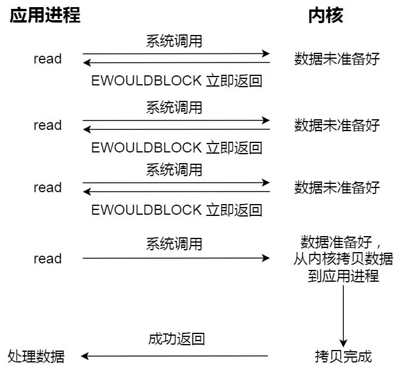

注意，**这里最后一次 read 调用，获取数据的过程，是一个同步的过程，是需要等待的过程。这里的同步指的是内核态的数据拷贝到用户程序的缓存区这个过程。**


### 同步I/O

无论 `read` 和 `send` 是 `阻塞I/O`，还是 `非阻塞I/O` 都是同步调用。因为在 `read` 调用时，内核将数据从内核空间拷贝到用户空间的过程都是需要等待的，即这个过程是同步的，如果内核实现的拷贝效率不高，`read` 调用就会在这个同步过程中等待比较长的时间。


### 异步I/O

真正的异步 I/O 是`内核数据准备好` 和 `数据从内核态拷贝到用户态` 这两个过程都不用等待。

当我们发起 `aio_read` （异步 I/O） 之后，就立即返回，内核自动将数据从内核空间拷贝到用户空间，这个拷贝过程同样是异步的，内核自动完成的，和前面的同步操作不一样，应用程序并不需要主动发起拷贝动作。过程如下图：


## Reactor模式

`Reactor 模式` 即 I/O 多路复用监听事件，收到事件后根据事件类型分配（Dispatch）给某个进程/线程。其主要由 `Reactor` 和 `处理资源池`  两个核心部分组成：

- **Reactor**：负责监听和分发事件。事件类型包含连接事件、读写事件
- **处理资源池**：负责处理事件。如：read -> 业务逻辑 -> send

Reactor 模式是灵活多变的，可以应对不同的业务场景，灵活在于：

- Reactor 的数量可以只有一个，也可以有多个
- 处理资源池可以是单个进程/线程，也可以是多个进程/线程


将上面的两个因素排列组设一下，理论上就可以有 4 种方案选择：

- **单 Reactor 单进程/线程**
- **单 Reactor 多进程/线程**
- **多 Reactor 单进程/线程**：相比 `单Reactor单进程/线程` 方案不仅复杂而且没有性能优势，因此可以忽略
- **多 Reactor 多进程/线程**


### 单Reactor单进程/单线程

一般来说，C 语言实现的是`单Reactor单进程`的方案，因为 C 语编写完的程序，运行后就是一个独立的进程，不需要在进程中再创建线程。而 Java 语言实现的是「单 Reactor 单线程」的方案，因为 Java 程序是跑在 Java 虚拟机这个进程上面的，虚拟机中有很多线程，我们写的 Java 程序只是其中的一个线程而已。以下是「`单 Reactor单进程`」的方案示意图：


可以看到进程里有 `Reactor`、`Acceptor`、`Handler` 这三个对象：

- `Reactor` 对象的作用是监听和分发事件
- `Acceptor` 对象的作用是获取连接
- `Handler` 对象的作用是处理业务

对象里的 `select`、`accept`、`read`、`send` 是系统调用函数，`dispatch` 和 `业务处理` 是需要完成的操作，其中 `dispatch` 是分发事件操作。


**工作流程**

- `Reactor` 对象通过 `select` （IO多路复用接口） 监听事件，收到事件后通过 `dispatch` 进行分发，具体分发给 `Acceptor` 对象还是 `Handler` 对象，还要看收到的事件类型
- 如果是连接建立的事件，则交由 `Acceptor` 对象进行处理，`Acceptor` 对象会通过 `accept` 方法 获取连接，并创建一个 `Handler` 对象来处理后续的响应事件
- 如果不是连接建立事件， 则交由当前连接对应的 `Handler` 对象来进行响应
- `Handler` 对象通过 `read` -> 业务处理 -> `send` 的流程来完成完整的业务流程


**优缺点**

- **优点**
  - 因为全部工作都在同一个进程内完成，所以实现起来比较简单
  - 不需要考虑进程间通信，也不用担心多进程竞争

- **缺点**
  - 因为只有一个进程，无法充分利用 多核 `CPU` 的性能
  - `Handler`对象在业务处理时，整个进程是无法处理其它连接事件，如果业务处理耗时比较长，那么就造成响应的延迟


**使用场景**

单Reactor单进程的方案`不适用计算机密集型的场景`，`只适用于业务处理非常快速的场景`。如：Redis 是由 C 语言实现的，它采用的正是「单Reactor单进程」的方案，因为 Redis 业务处理主要是在内存中完成，操作的速度是很快的，性能瓶颈不在 CPU 上，所以 Redis 对于命令的处理是单进程的方案。


### 单Reactor多线程/多进程

如果要克服`单 Reactor 单线程/单进程`方案的缺点，那么就需要引入多线程/多进程，这样就产生了**单Reactor多线程/多进程**的方案。具体方案的示意图如下：


**工作流程**

- `Reactor` 对象通过 `select` （IO 多路复用接口） 监听事件，收到事件后通过 `dispatch` 进行分发，具体分发给 `Acceptor` 对象还是 `Handler` 对象，还要看收到的事件类型
- 如果是连接建立的事件，则交由 `Acceptor` 对象进行处理，`Acceptor` 对象会通过 `accept` 方法获取连接，并创建一个 `Handler` 对象来处理后续的响应事件
- 如果不是连接建立事件， 则交由当前连接对应的 `Handler` 对象来进行响应
- `Handler` 对象不再负责业务处理，只负责数据的接收和发送，`Handler` 对象通过 `read` 读取到数据后，会将数据发给子线程里的 `Processor` 对象进行业务处理
- 子线程里的 `Processor` 对象就进行业务处理，处理完后，将结果发给主线程中的 `Handler` 对象，接着由 `Handler` 通过 `send` 方法将响应结果发送给 `client`


**单Reator多线程**

- **优势**：能够充分利用多核 `CPU` 的能力

- **缺点**：带来了多线程竞争资源问题（如需加互斥锁解决）

**单Reactor多进程**

- **缺点**
  - 需要考虑子进程和父进程的双向通信
  - 进程间通信远比线程间通信复杂


另外，`单Reactor` 的模式还有个问题，因为一个 `Reactor` 对象承担所有事件的 `监听` 和 `响应` ，而且只在主线程中运行，在面对瞬间高并发的场景时，容易成为性能瓶颈。


### 多Reactor多进程/多线程

要解决 `单Reactor` 的问题，就是将 `单Reactor` 实现成 `多Reactor`，这样就产生了 **多Reactor多进程/线程** 方案。其方案的示意图如下（以线程为例）：


**工作流程**

- 主线程中的 `MainReactor` 对象通过 `select` 监控连接建立事件，收到事件后通过 `Acceptor` 对象中的 `accept` 获取连接，将新的连接分配给某个子线程
- 子线程中的 `SubReactor` 对象将 `MainReactor` 对象分配的连接加入 `select` 继续进行监听，并创建一个 `Handler` 用于处理连接的响应事件
- 如果有新的事件发生时，`SubReactor` 对象会调用当前连接对应的 `Handler` 对象来进行响应
- `Handler` 对象通过 `read` -> 业务处理 -> `send` 的流程来完成完整的业务流程


**方案优势**

`多Reactor多线程` 的方案虽然看起来复杂的，但是实际实现时比 `单Reactor多线程`的方案要简单的多，原因如下：

- **分工明确**：主线程只负责接收新连接，子线程负责完成后续的业务处理
- **主线程和子线程的交互很简单**：主线程只需要把新连接传给子线程，子线程无须返回数据，直接就可以在子线程将处理结果发送给客户端


**应用场景**

- `多Reactor多线程`：开源软件 `Netty`、`Memcache`

- `多Reactor多进程`：开源软件 `Nginx`。不过 Nginx 方案与标准的多Reactor多进程有些差异，具体差异：
  - 主进程仅用来初始化 socket，并没有创建 mainReactor 来 accept 连接，而由子进程的 Reactor 来 accept 连接
  - 通过锁来控制一次只有一个子进程进行 accept（防止出现惊群现象），子进程 accept 新连接后就放到自己的 Reactor 进行处理，不会再分配给其他子进程


## Proactor模式

**Reactor 和 Proactor 的区别**

- **Reactor 是非阻塞同步网络模式，感知的是就绪可读写事件**
  - 在每次感知到有事件发生（比如可读就绪事件）后，就需要应用进程主动调用 `read` 方法来完成数据的读取，也就是要应用进程主动将 `socket` 接收缓存中的数据读到应用进程内存中，这个过程是同步的，读取完数据后应用进程才能处理数据
  - 简单理解：**来了事件**(有新连接、有数据可读、有数据可写)**操作系统通知应用进程，让应用进程来处理**(从驱动读取到内核以及从内核读取到用户空间)
- **Proactor 是异步网络模式， 感知的是已完成的读写事件**
  - 在发起异步读写请求时，需要传入数据缓冲区的地址（用来存放结果数据）等信息，这样系统内核才可以自动帮我们把数据的读写工作完成，这里的读写工作全程由操作系统来做，并不需要像 Reactor 那样还需要应用进程主动发起 read/write 来读写数据，操作系统完成读写工作后，就会通知应用进程直接处理数据
  - 简单理解：**来了事件**(有新连接、有数据可读、有数据可写)**操作系统来处理**(从驱动读取到内核，从内核读取到用户空间)，**处理完再通知应用进程**

无论是 Reactor，还是 Proactor，都是一种基于「事件分发」的网络编程模式，区别在于 **Reactor 模式是基于「待完成」的 I/O 事件，而 Proactor 模式则是基于「已完成」的 I/O 事件**。


Proactor 模式的示意图如下：


**工作流程**

- Proactor Initiator 负责创建 Proactor 和 Handler 对象，并将 Proactor 和 Handler 都通过
- Asynchronous Operation Processor 注册到内核
- Asynchronous Operation Processor 负责处理注册请求，并处理 I/O 操作；
- Asynchronous Operation Processor 完成 I/O 操作后通知 Proactor
- Proactor 根据不同的事件类型回调不同的 Handler 进行业务处理
- Handler 完成业务处理


**平台支持**

- **Linux**：在 `Linux` 下的 `异步I/O` 是不完善的，`aio` 系列函数是由 `POSIX` 定义的异步操作接口，不是真正的操作系统级别支持的，而是在用户空间模拟出来的异步。并且仅仅支持基于本地文件的 `aio` 异步操作，网络编程中的 `socket` 是不支持的，这也使得基于 `Linux` 的高性能网络程序都是使用 `Reactor` 方案
- **Windows** ：在 `Windows` 下实现了一套完整的支持 `socket` 的异步编程接口，这套接口就是 `IOCP`，是由操作系统级别实现的 `异步I/O`，真正意义上 `异步I/O`，因此在 `Windows` 里实现高性能网络程序可以使用效率更高的 `Proactor` 方案


## select/poll/epoll

select/poll/epoll对比：


**注意**：**遍历**相当于查看所有的位置，**回调**相当于查看对应的位置。


### select

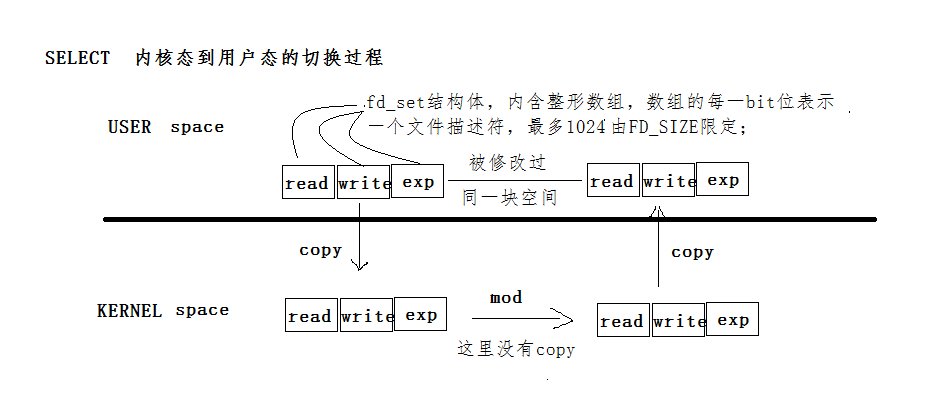

POSIX所规定，目前几乎在所有的平台上支持，其良好跨平台支持也是它的一个优点，本质上是通过设置或者检查存放fd标志位的数据结构来进行下一步处理

**缺点**

- 单个进程可监视的fd数量被限制，即能监听端口的数量有限,数值存在如下文件里：`cat /proc/sys/fs/file-max`
- 对socket是线性扫描，即采用轮询的方法，效率较低
- select采取了内存拷贝方法来实现内核将FD消息通知给用户空间，这样一个用来存放大量fd的数据结构，这样会使得用户空间和内核空间在传递该结构时复制开销大


select是第一版IO复用，提出后暴漏了很多问题。

- select 会修改传入的参数数组，这个对于一个需要调用很多次的函数，是非常不友好的
- select 如果任何一个sock(I/O stream)出现了数据，select 仅仅会返回，但不会告诉是那个sock上有数据，只能自己遍历查找
- select 只能监视1024个链接
- select 不是线程安全的，如果你把一个sock加入到select, 然后突然另外一个线程发现这个sock不用，要收回，这个select 不支持的


### poll


本质上和select没有区别，它将用户传入的数组拷贝到内核空间，然后查询每个fd对应的设备状态

- 其没有最大连接数的限制，原因是它是基于链表来存储的
- 大量的fd的数组被整体复制于用户态和内核地址空间之间，而不管这样的复制是不是有意义
- poll特点是“水平触发”，如果报告了fd后，没有被处理，那么下次poll时会再次报告该fd
- 边缘触发：只通知一次，epoll用的就是边缘触发


poll 修复了 select 的很多问题：

- poll 去掉了1024个链接的限制
- poll 从设计上来说不再修改传入数组

但是poll仍然不是线程安全的， 这就意味着不管服务器有多强悍，你也只能在一个线程里面处理一组 I/O 流。你当然可以拿多进程来配合了，不过然后你就有了多进程的各种问题。


### epoll

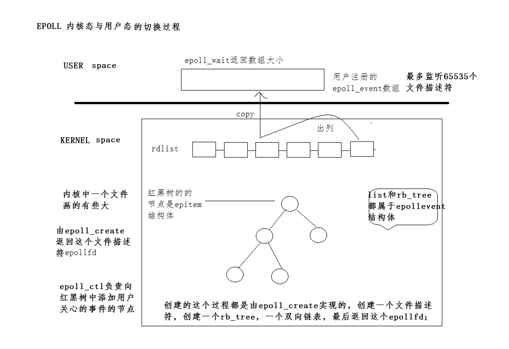

在Linux2.6内核中提出的select和poll的增强版本

- 支持水平触发和边缘触发，最大的特点在于边缘触发，它只告诉进程哪些fd刚刚变为就绪态，并且只会通知一次
- 使用“事件”的就绪通知方式，通过epoll_ctl注册fd，一旦该fd就绪，内核就会采用类似callback的回调机制来激活该fd，epoll_wait便可以收到通知

**优点**

- 没有最大并发连接的限制：能打开的FD的上限远大于1024(1G的内存能监听约10万个端口)
- 效率提升：非轮询的方式，不会随着FD数目的增加而效率下降；只有活跃可用的FD才会调用callback函数，即epoll最大的优点就在于它只管理“活跃”的连接，而跟连接总数无关
- 内存拷贝，利用mmap()文件映射内存加速与内核空间的消息传递；即epoll使用mmap减少复制开销
- 文件映射内存直接通过地址空间访问，效率更高，把文件映射到内存中


epoll 可以说是 I/O  多路复用最新的一个实现，epoll 修复了poll 和select绝大部分问题， 比如：

- epoll 现在是线程安全的
- epoll 现在不仅告诉你sock组里面数据，还会告诉你具体哪个sock有数据，你不用自己去找了
- epoll 内核态管理了各种IO文件描述符， 以前用户态发送所有文件描述符到内核态，然后内核态负责筛选返回可用数组，现在epoll模式下所有文件描述符在内核态有存，查询时不用传文件描述符进去了


## BIO(同步阻塞I/O)

用户需要等待read将socket中的数据读取到buffer后，才继续处理接收的数据。整个IO请求的过程中，用户线程是被阻塞的，这导致用户在发起IO请求时，不能做任何事情，对CPU的资源利用率不够。


**特点：**I/O执行的两个阶段进程都是阻塞的。

**优点**

- 能够及时的返回数据，无延迟
- 程序简单，进程挂起基本不会消耗CPU时间

**缺点**

- I/O等待对性能影响较大
- 每个连接需要独立的一个进程/线程处理，当并发请求量较大时为了维护程序，内存、线程和CPU上下文切换开销较大，因此较少在开发环境中使用


## NIO(同步非阻塞I/O)

用户需要不断地调用read，尝试读取socket中的数据，直到读取成功后，才继续处理接收的数据。整个IO请求过程中，虽然用户线程每次发起IO请求后可以立即返回，但为了等到数据，仍需要不断地轮询、重复请求，消耗了大量的CPU的资源。


**特点：**non-blocking I/O模式需要不断的主动询问kernel数据是否已准备好。

**优点**

- 进程在等待当前任务完成时，可以同时执行其他任务进程不会被阻塞在内核等待数据过程，每次发起的I/O请求会立即返回，具有较好的实时性

**缺点**

- 不断轮询将占用大量CPU时间，系统资源利用率大打折扣，影响性能，整体数据吞吐量下降
- 该模型不适用web服务器


## IO多路复用(异步阻塞I/O)

通过Reactor的方式，可以将用户线程轮询IO操作状态的工作统一交给handle_events事件循环进行处理。用户线程注册事件处理器之后可以继续执行做其他的工作（异步），而Reactor线程负责调用内核的select函数检查socket状态。当有socket被激活时，则通知相应的用户线程（或执行用户线程的回调函数），执行handle_event进行数据读取、处理的工作。

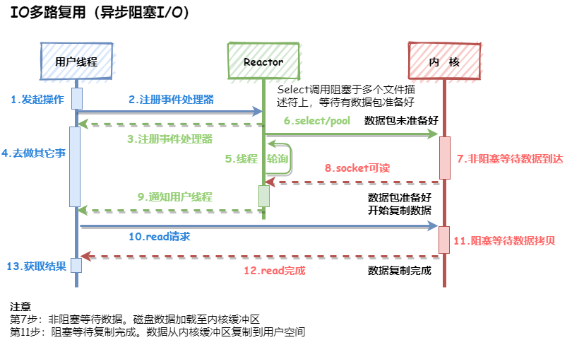

**特点：**通过一种机制能同时等待多个文件描述符，而这些文件描述符（套接字描述符）其中的任意一个变为可读就绪状态，select()/poll()函数就会返回。

**优点**

- 可以基于一个阻塞对象，同时在多个描述符上可读就绪，而不是使用多个线程（每个描述符一个线程），即能处理更多的连接
- 可以节省更多的系统资源

**缺点：**

- 如果处理的连接数不是很多的话，使用select/poll的web server不一定比使用multi-threading + blocking I/O的web server性能更好
- 可能延迟还更大，因为处理一个连接数需要发起两次system call


## AIO(异步非阻塞I/O)

AIO(异步非阻塞IO,即NIO.2)。异步IO模型中，用户线程直接使用内核提供的异步IO API发起read请求，且发起后立即返回，继续执行用户线程代码。不过此时用户线程已经将调用的AsynchronousOperation和CompletionHandler注册到内核，然后操作系统开启独立的内核线程去处理IO操作。当read请求的数据到达时，由内核负责读取socket中的数据，并写入用户指定的缓冲区中。最后内核将read的数据和用户线程注册的CompletionHandler分发给内部Proactor，Proactor将IO完成的信息通知给用户线程（一般通过调用用户线程注册的完成事件处理函数），完成异步IO。

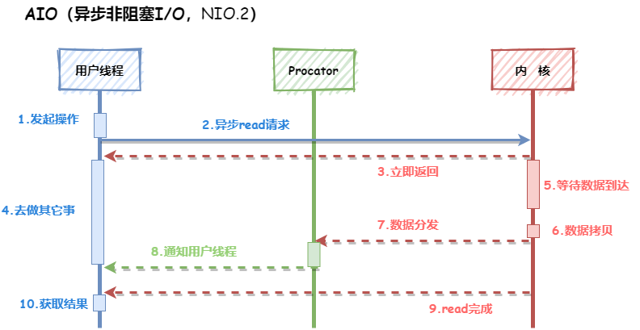

**特点：**第一阶段和第二阶段都是有内核完成。

**优点**

- 能充分利用DMA的特性，将I/O操作与计算重叠，提高性能、资源利用率与并发能力

**缺点**

- 在程序的实现上比较困难
- 要实现真正的异步 I/O，操作系统需要做大量的工作。目前 Windows 下通过 IOCP 实现了真正的异步 I/O。而在 Linux 系统下，Linux 2.6才引入，目前 AIO 并不完善，因此在 Linux 下实现高并发网络编程时都是以 复用式I/O模型为主


## 信号驱动式I/O

信号驱动式I/O是指进程预先告知内核，使得某个文件描述符上发生了变化时，内核使用信号通知该进程。在信号驱动式I/O模型，进程使用socket进行信号驱动I/O，并建立一个SIGIO信号处理函数，当进程通过该信号处理函数向内核发起I/O调用时，内核并没有准备好数据报，而是返回一个信号给进程，此时进程可以继续发起其他I/O调用。也就是说，在第一阶段内核准备数据的过程中，进程并不会被阻塞，会继续执行。当数据报准备好之后，内核会递交SIGIO信号，通知用户空间的信号处理程序，数据已准备好；此时进程会发起recvfrom的系统调用，这一个阶段与阻塞式I/O无异。也就是说，在第二阶段内核复制数据到用户空间的过程中，进程同样是被阻塞的。

**信号驱动式I/O的整个过程图如下：**


**第一阶段（非阻塞）：**

- ①：进程使用socket进行信号驱动I/O，建立SIGIO信号处理函数，向内核发起系统调用，内核在未准备好数据报的情况下返回一个信号给进程，此时进程可以继续做其他事情
- ②：内核将磁盘中的数据加载至内核缓冲区完成后，会递交SIGIO信号给用户空间的信号处理程序

**第二阶段（阻塞）：**

- ③：进程在收到SIGIO信号程序之后，进程向内核发起系统调用（recvfrom）
- ④：内核再将内核缓冲区中的数据复制到用户空间中的进程缓冲区中（真正执行IO过程的阶段），直到数据复制完成
- ⑤：内核返回成功数据处理完成的指令给进程；进程在收到指令后再对数据包进程处理；处理完成后，此时的进程解除不可中断睡眠态，执行下一个I/O操作


**特点：**借助socket进行信号驱动I/O并建立SIGIO信号处理函数

**优点**

- 线程并没有在第一阶段（数据等待）时被阻塞，提高了资源利用率；

**缺点**

- 在程序的实现上比较困难
- 信号 I/O 在大量 IO 操作时可能会因为信号队列溢出导致没法通知。信号驱动 I/O 尽管对于处理 UDP 套接字来说有用，即这种信号通知意味着到达一个数据报，或者返回一个异步错误。但是，对于 TCP 而言，信号驱动的 I/O 方式近乎无用，因为导致这种通知的条件为数众多，每一个来进行判别会消耗很大资源，与前几种方式相比优势尽失


**信号通知机制**

- **水平触发：**指数据报到内核缓冲区准备好之后，内核通知进程后，进程因繁忙未发起recvfrom系统调用；内核会再次发送通知信号，循环往复，直到进程来请求recvfrom系统调用。很明显，这种方式会频繁消耗过多的系统资源
- **边缘触发：**内核只会发送一次通知信号


# Classloader

## JVM类加载机制

JVM类加载机制分为五个部分：加载，验证，准备，解析，初始化，下面我们就分别来看一下这五个过程。


### 加载

加载是类加载过程中的一个阶段，这个阶段会在内存中生成一个代表这个类的 java.lang.Class 对 象，作为方法区这个类的各种数据的入口。注意这里不一定非得要从一个 Class 文件获取，这里既可以从 ZIP 包中读取（比如从 jar 包和 war 包中读取），也可以在运行时计算生成（动态代理），也可以由其它文件生成（比如将 JSP 文件转换成对应的 Class 类）。


### 验证

这一阶段的主要目的是为了确保 Class 文件的字节流中包含的信息是否符合当前虚拟机的要求，并且不会危害虚拟机自身的安全。


### 准备

准备阶段是正式为类变量分配内存并设置类变量的初始值阶段，即在方法区中分配这些变量所使用的内存空间。注意这里所说的初始值概念，比如一个类变量定义为：

```java
public static int v = 8080;
```

实际上变量 v 在准备阶段过后的初始值为 0 而不是 8080，将 v 赋值为 8080 的 put static 指令是程序被编译后，存放于类构造器<client>方法之中。但是注意如果声明为：

```java
public static final int v = 8080;
```

在编译阶段会为 v 生成 ConstantValue 属性，在准备阶段虚拟机会根据 ConstantValue 属性将 v 赋值为 8080。


### 解析

解析阶段是指虚拟机将常量池中的符号引用替换为直接引用的过程。符号引用就是 class 文件中的：

- CONSTANT_Class_info
- CONSTANT_Field_info
- CONSTANT_Method_info

等类型的常量。


## 类加载器

虚拟机设计团队把加载动作放到 JVM 外部实现，以便让应用程序决定如何获取所需的类，JVM 提供了 3 种类加载器：

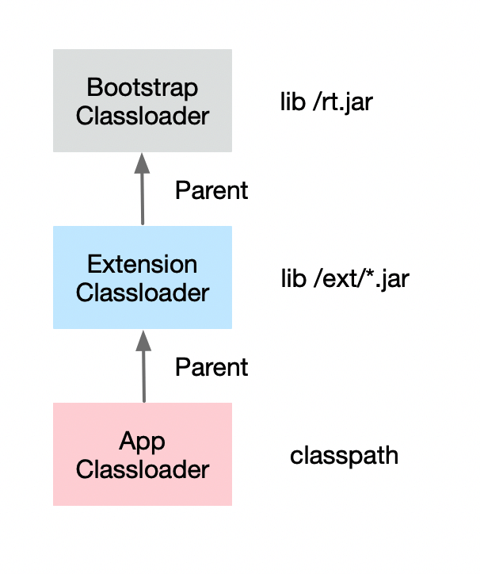

- **启动类加载器(Bootstrap ClassLoader)**

  负责加载 JAVA_HOME\lib 目录中的，或通过-Xbootclasspath 参数指定路径中的，且被虚拟机认可（按文件名识别，如 rt.jar）的类。

- **扩展类加载器(Extension ClassLoader)**

  负责加载 JAVA_HOME\lib\ext 目录中的，或通过 java.ext.dirs 系统变量指定路径中的类库。

- **应用程序类加载器(Application ClassLoader)**

  负责加载用户路径（classpath）上的类库。JVM 通过双亲委派模型进行类的加载，当然我们也可以通过继承java.lang.ClassLoader 实现自定义的类加载器。


此外我们比较需要知道的几点：

- 一个类是由 jvm 加载是通过类加载器+全限定类名确定唯一性的
- 双亲委派，众所周知，子加载器会尽量委托给父加载器进行加载，父加载器找不到再自己加载
- 线程上下文类加载，为了满足 spi 等需求突破双亲委派机制，当高层类加载器想加载底层类时通过 Thread.contextClassLoader 来获取当前线程的类加载器(往往是底层类加载器)去加载类


## 双亲委派

当一个.class文件要被加载时，不考虑我们自定义类加载器类，首先会在AppClassLoader中检查是否加载过，如果有那就无需再加载；如果没有会交到父加载器，然后调用父加载器的loadClass方法。父加载器同样也会先检查自己是否已经加载过，如果没有再往上，直到到达BootstrapClassLoader之前，都是在检查是否加载过，并不会选择自己去加载。到了根加载器时，才会开始检查是否能够加载当前类，能加载就结束，使用当前的加载器；否则就通知子加载器进行加载；子加载器重复该步骤。如果到最底层还不能加载，就抛出异常ClassNotFoundException。

**总结**：所有的加载请求都会传送到根加载器去加载，只有当父加载器无法加载时，子类加载器才会去加载

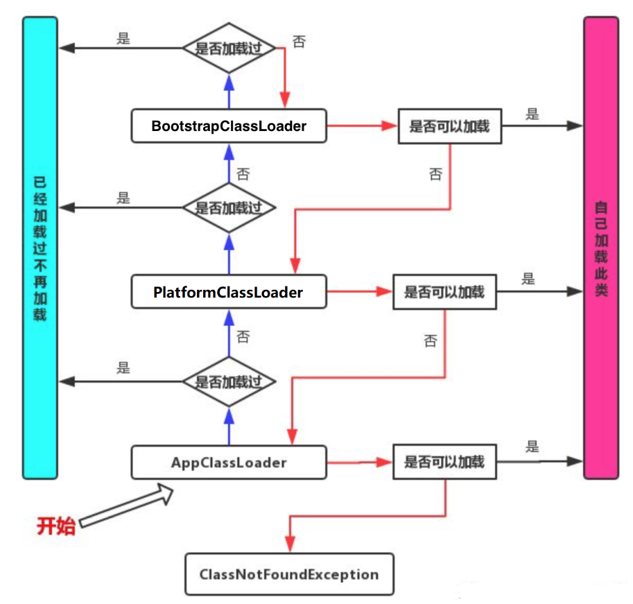

**作用**

- 避免类的重复加载
- 保证Java核心类库的安全


**如何打破双亲委派机制？**


# Throwable


## Error

Error 类是指 java 运行时系统的内部错误和资源耗尽错误。应用程序不会抛出该类对象。如果出现了这样的错误，除了告知用户，剩下的就是尽力使程序安全的终止。


## Exception

### CheckedException

检查异常（CheckedException）。一般是外部错误，这种异常都发生在编译阶段，Java 编译器会强制程序去捕获此类异常，即会出现要求你把这段可能出现异常的程序进行 try catch，该类异常一般包括几个方面：

- 试图在文件尾部读取数据
- 试图打开一个错误格式的 URL 
- 试图根据给定的字符串查找 class 对象，而这个字符串表示的类并不存在


### RuntimeException

运行时异常（RuntimeException）。如 ：NullPointerException 、 ClassCastException ；一个是检查异常CheckedException，如I/O错误导致的IOException、SQLException。 RuntimeException 是那些可能在Java虚拟机正常运行期间抛出的异常的超类。 如果出现 RuntimeException，那么一定是程序员的错。


## 异常处理方式

抛出异常有三种形式：

- throw
- throws
- 系统自动抛异常


**throw 和 throws 的区别**

- throws 用在函数上，后面跟的是异常类，可以跟多个；而 throw 用在函数内，后面跟的是异常对象
- throws 用来声明异常，让调用者只知道该功能可能出现的问题，可以给出预先的处理方式；throw 抛出具体的问题对象，执行到 throw，功能就已经结束了，跳转到调用者，并将具体的问题对象抛给调用者。也就是说 throw 语句独立存在时，下面不要定义其他语句，因为执行不到
- throws 表示出现异常的一种可能性，并不一定会发生这些异常；throw 则是抛出了异常，执行 throw 则一定抛出了某种异常对象
- 两者都是消极处理异常的方式，只是抛出或者可能抛出异常，但是不会由函数去处理异常，真正的处理异常由函数的上层调用处理


# JAVA Others

## Annotation


## JAVA内部类

Java 类中不仅可以定义变量和方法，还可以定义类，这样定义在类内部的类就被称为内部类。根据定义的方式不同，内部类分为静态内部类、成员内部类、局部内部类和匿名内部类四种。

### 静态内部类

使用static修饰的内部类我们称之为静态内部类，不过我们更喜欢称之为嵌套内部类。静态内部类与非静态内部类之间存在一个最大的区别，我们知道非静态内部类在编译完成之后会隐含地保存着一个引用，该引用是指向创建它的外围内，但是静态内部类却没有。没有这个引用就意味着：

- 它的创建是不需要依赖于外围类的
- 它不能使用任何外围类的非static成员变量和方法

```java
public class OuterClass {
    private String sex;
    public static String name = "chenssy";
    
    /**
     *静态内部类
     */
    static class InnerClass1{
        /* 在静态内部类中可以存在静态成员 */
        public static String _name1 = "chenssy_static";
        
        public void display(){
            /* 
             * 静态内部类只能访问外围类的静态成员变量和方法
             * 不能访问外围类的非静态成员变量和方法
             */
            System.out.println("OutClass name :" + name);
        }
    }
    
    /**
     * 非静态内部类
     */
    class InnerClass2{
        /* 非静态内部类中不能存在静态成员 */
        public String _name2 = "chenssy_inner";
        /* 非静态内部类中可以调用外围类的任何成员,不管是静态的还是非静态的 */
        public void display(){
            System.out.println("OuterClass name：" + name);
        }
    }
    
    /**
     * @desc 外围类方法
     * @author chenssy
     * @data 2013-10-25
     * @return void
     */
    public void display(){
        /* 外围类访问静态内部类：内部类. */
        System.out.println(InnerClass1._name1);
        /* 静态内部类 可以直接创建实例不需要依赖于外围类 */
        new InnerClass1().display();
        
        /* 非静态内部的创建需要依赖于外围类 */
        OuterClass.InnerClass2 inner2 = new OuterClass().new InnerClass2();
        /* 方位非静态内部类的成员需要使用非静态内部类的实例 */
        System.out.println(inner2._name2);
        inner2.display();
    }
    
    public static void main(String[] args) {
        OuterClass outer = new OuterClass();
        outer.display();
    }
}
```


### 成员内部类

成员内部类也是最普通的内部类，它是外围类的一个成员，所以他是可以无限制的访问外围类的所有 成员属性和方法，尽管是private的，但是外围类要访问内部类的成员属性和方法则需要通过内部类实例来访问。在成员内部类中要注意两点：

- **成员内部类中不能存在任何static的变量和方法**
- **成员内部类是依附于外围类的，所以只有先创建了外围类才能够创建内部类**
- **推荐使用getxxx()来获取成员内部类，尤其是该内部类的构造函数无参数时**

```java
public class OuterClass {
    private String str;
    
    public class InnerClass{
        public void innerDisplay(){
            //使用外围内的属性
            str = "chenssy...";
            System.out.println(str);
            //使用外围内的方法
            outerDisplay();
        }
    }
    
    /* 推荐使用getxxx()来获取成员内部类，尤其是该内部类的构造函数无参数时 */
    public InnerClass getInnerClass(){
        return new InnerClass();
    }
    
    public static void main(String[] args) {
        OuterClass outer = new OuterClass();
        OuterClass.InnerClass inner = outer.getInnerClass();
        inner.innerDisplay();
    }
}
```


### 局部内部类

有这样一种内部类，它是嵌套在方法和作用于内的，对于这个类的使用主要是应用与解决比较复杂的问题，想创建一个类来辅助我们的解决方案，到那时又不希望这个类是公共可用的，所以就产生了局部内部类，局部内部类和成员内部类一样被编译，只是它的作用域发生了改变，它只能在该方法和属性中被使用，出了该方法和属性就会失效。

- 定义在方法里：

  ```java
  public class Parcel5 {
      public Destionation destionation(String str){
          class PDestionation implements Destionation{
              private String label;
              private PDestionation(String whereTo){
                  label = whereTo;
              }
              public String readLabel(){
                  return label;
              }
          }
          return new PDestionation(str);
      }
      
      public static void main(String[] args) {
          Parcel5 parcel5 = new Parcel5();
          Destionation d = parcel5.destionation("chenssy");
      }
  }
  ```

- 定义在作用域内：

  ```java
  public class Parcel6 {
      private void internalTracking(boolean b){
          if(b){
              class TrackingSlip{
                  private String id;
                  TrackingSlip(String s) {
                      id = s;
                  }
                  String getSlip(){
                      return id;
                  }
              }
              TrackingSlip ts = new TrackingSlip("chenssy");
              String string = ts.getSlip();
          }
      }
      
      public void track(){
          internalTracking(true);
      }
      
      public static void main(String[] args) {
          Parcel6 parcel6 = new Parcel6();
          parcel6.track();
      }
  }
  ```


### 匿名内部类

- 匿名内部类是没有访问修饰符的
- new 匿名内部类，这个类首先是要存在的。如果我们将那个InnerClass接口注释掉，就会出现编译出错
- 注意getInnerClass()方法的形参，第一个形参是用final修饰的，而第二个却没有。同时我们也发现第二个形参在匿名内部类中没有使用过，所以当所在方法的形参需要被匿名内部类使用，那么这个形参就必须为final
- 匿名内部类是没有构造方法的。因为它连名字都没有何来构造方法

```java
button2.addActionListener(  
        new ActionListener(){  
                public void actionPerformed(ActionEvent e) {  
                     System.out.println("你按了按钮二");  
                }  
        });
```


## 泛型

### 获取类泛型类型

获取当前类上的泛型类型方式如下：

```java
public class DefaultTargetType<T> {

    private Type type;
    private Class<T> classType;

    @SuppressWarnings("unchecked")
    public DefaultTargetType() {
        Type superClass = getClass().getGenericSuperclass();
        this.type = ((ParameterizedType) superClass).getActualTypeArguments()[0];
        if (this.type instanceof ParameterizedType) {
            this.classType = (Class<T>) ((ParameterizedType) this.type).getRawType();
        } else {
            this.classType = (Class<T>) this.type;
        }
    }
    
}
```

获取到泛型中的类型方式：

```java
Class<List<User>> classType = new DefaultTargetType<List<User>>() {}.getClassType();
```


### 获取接口泛型类型

获取当前类的父类接口上的泛型类型方式如下：

```java
public class DefaultTargetType implements TargetType<T> {

    private Type type;
    private Class<T> classType;

    @SuppressWarnings("unchecked")
    public DefaultTargetType() {
        Type superClass = getClass().getGenericInterfaces()[0];
        this.type = ((ParameterizedType) superClass).getActualTypeArguments()[0];
        if (this.type instanceof ParameterizedType) {
            this.classType = (Class<T>) ((ParameterizedType) this.type).getRawType();
        } else {
            this.classType = (Class<T>) this.type;
        }
    }
    
}
```

获取到泛型中的类型方式：

```java
Class<List<User>> classType = new DefaultTargetType<List<User>>() {}.getClassType();
```


## JAVA复制

### 浅复制

被复制对象的所有变量都含有与原来的对象相同的值，而所有的对其他对象的引用仍然指向原来的对象。换言之，浅复制仅仅复制所考虑的对象，而不复制它所引用的对象。


### 深复制

被复制对象的所有变量都含有与原来的对象相同的值，除去那些引用其他对象的变量。那些引用其他对象的变量将指向被复制过的新对象，而不再是原有的那些被引用的对象。换言之，深复制把要复制的对象所引用的对象都复制了一遍。


# JVM

## JVM常量池

- **字符串常量池**：存放在堆上，即执行intern方法后存的地方。class文件的静态常量池，如果是字符串，则也会被装到字符串常量池中
- **运行时常量池**：存放在方法区，属于元空间，是类加载后的一些存储区域，大多数是类中 constant_pool 的内容
- **类文件常量池**：也就是constant_pool，这个是概念性的，并没有什么实际存储区域


## JVM内存布局

JVM包含**堆**、**元空间**、**Java虚拟机栈**、**本地方法栈**、**程序计数器**等内存区域，其中**堆**是占用内存最大的，如下图所示：


## JAVA内存模型(JMM)

JVM试图定义一种统一的内存模型，能将各种底层硬件以及操作系统的内存访问差异进行封装，使Java程序在不同硬件以及操作系统上都能达到相同的并发效果。**它分为工作内存和主内存，线程无法对主存储器直接进行操作，如果一个线程要和另外一个线程通信，那么只能通过主存进行交换**。如下图所示：


**线程隔离数据区：**

- **程序计数器：** 当前线程所执行字节码的行号指示器
- **虚拟机栈：** 里面的元素叫栈帧，存储局部变量表、操作栈、动态链接、方法出口等，方法被调用到执行完成的过程对应一个栈帧在虚拟机栈中入栈到出栈的过程
- **本地方法栈：** 和虚拟机栈的区别在于虚拟机栈为虚拟机执行Java方法，本地方法栈为虚拟机使用到的本地Native方法服务

**线程共享数据区：**

- **方法区：** 可以描述为堆的一个逻辑部分，或者说使用永久代来实现方法区。存储已被虚拟机加载的类信息、常量、静态变量、即时编译器编译后的代码等数据
- **堆：** 唯一目的就是存放对象的实例，是垃圾回收管理器的主要区域，分为Eden、From/To Survivor空间


### 程序计数器

程序计数器（Program Counter Register）。一块较小的内存空间, 是当前线程所执行的字节码的行号指示器，每条线程都要有一个独立的程序计数器，这类内存也称为“线程私有”的内存。正在执行 java 方法的话，计数器记录的是虚拟机字节码指令的地址（当前指令的地址）。如果还是 Native 方法，则为空。这个内存区域是唯一一个在虚拟机中没有规定任何 OutOfMemoryError 情况的区域。

- 线程私有
- 是一块很小的独立内存空间
- 主要存储当前线程所执行的字节码行号指示器
- 以一种数据结构的形式放置于内存中
- 分支、循环、跳转、异常处理、线程恢复等功能都需要依赖这个计数器来完成

**注意**：此内存区域是唯一一个在Java虚拟机规范中没有规定任何OutOfMemoryError情况的区域。


### JAVA虚拟机栈

JAVA虚拟机栈（Java Virtual Machine Stacks）。是描述java方法执行的内存模型，每个方法在执行的同时都会创建一个栈帧（Stack Frame）用于存储局部变量表、操作数栈、动态链接、方法出口等信息。每一个方法从调用直至执行完成的过程，就对应着一个栈帧在虚拟机栈中入栈到出栈的过程。栈帧（ Frame）是用来存储数据和部分过程结果的数据结构，同时也被用来处理动态链接(Dynamic Linking)、 方法返回值和异常分派（ Dispatch Exception）。栈帧随着方法调用而创建，随着方法结束而销毁——无论方法是正常完成还是异常完成（抛出了在方法内未被捕获的异常）都算作方法结束。

- 线程私有
- JAVA线程创建同时，会自动创建对应的JAVA栈
- JAVA栈包含多个栈帧（运行每个方法，就会自动创建一个栈帧，用于存储局部变量、操作栈和返回值等）

> **相关参数：**
>
> -Xss：设置方法栈的最大值


### 本地方法栈

本地方法栈（Native Method Stacks）。本地方法区和 Java Stack 作用类似, 区别是虚拟机栈为执行 Java 方法服务, 而本地方法栈则为Native 方法服务, 如果一个 VM 实现使用 C-linkage 模型来支持 Native 调用, 那么该栈将会是一个C 栈，但 HotSpot VM 直接就把本地方法栈和虚拟机栈合二为一。

- 线程私有
- 与JAVA栈的作用相似
- 主要为JVM使用本地方法（native）提供支持
- 不是由Java实现的，而是由C实现的

与虚拟机栈一样，本地方法栈区域也会抛出**StackOverflowError**和**OutOfMemoryError**异常：

```java
// 原因：对象不能被分配到堆内存中
Exception in thread "main": java.lang.OutOfMemoryError: Java heap space
// 原因：类或者方法不能被加载到持久代。它可能出现在一个程序加载很多类的时候，比如引用了很多第三方的库
Exception in thread "main": java.lang.OutOfMemoryError: PermGen space
// 原因：创建的数组大于堆内存的空间
Exception in thread "main": java.lang.OutOfMemoryError: Requested array size exceeds VM limit
// 原因：分配本地分配失败。JNI、本地库或者Java虚拟机都会从本地堆中分配内存空间
Exception in thread "main": java.lang.OutOfMemoryError: request <size> bytes for <reason>. Out of swap space?
// 原因：同样是本地方法内存分配失败，只不过是JNI或者本地方法或者Java虚拟机发现
Exception in thread "main": java.lang.OutOfMemoryError: <reason> <stack trace> (Native method)
```


### 方法区

方法区（Method Area）。即我们常说的**永久代(Permanent Generation)**, 用于存储**被 JVM 加载的类信息、常量、静态变量、即时编译器编译后的代码**等数据，HotSpot VM把GC分代收集扩展至方法区, 即使用Java堆的永久代来实现方法区, 这样 HotSpot 的垃圾收集器就可以像管理 Java 堆一样管理这部分内存, 而不必为方法区开发专门的内存管理器(永久带的内存回收的主要目标是针对常量池的回收和类型的卸载, 因此收益一般很小)。运行时常量池（Runtime Constant Pool）是方法区的一部分。Class 文件中除了有类的版本、字段、方法、接口等描述等信息外，还有一项信息是常量池（Constant Pool Table），用于存放编译期生成的各种字面量和符号引用，这部分内容将在类加载后存放到方法区的运行时常量池中。 Java 虚拟机对 Class 文件的每一部分（自然也包括常量池）的格式都有严格的规定，每一个字节用于存储哪种数据都必须符合规范上的要求，这样才会被虚拟机认可、装载和执行。

- 又称之为：**非堆（Non-Heap）**或 **永久区**
- 线程共享
- 主要存储：类的类型信息、**常量池（Runtime Constant Pool）**、字段信息、方法信息、类变量和Class类的引用等
- Java虚拟机规范规定：当方法区无法满足内存分配需求时，将抛出OutOfMemoryError异常

> **相关参数：**
>
> -XX:PermSize：设置Perm区的初始大小
>
> -XX:MaxPermSize：设置Perm区的最大值


### 堆内存

堆内存（JAVA Heap）。是被线程共享的一块内存区域，创建的对象和数组都保存在 Java 堆内存中，也是垃圾收集器进行

垃圾收集的最重要的内存区域。由于现代 VM 采用**分代收集算法**, 因此 Java 堆从 GC 的角度还可以细分为: **新生代**(Eden 区、From Survivor 区和 To Survivor 区)和老年代。

- 线程共享
- 主要用于存储JAVA实例或对象
- GC发生的主要区域
- 是Java虚拟机所管理的内存中最大的一块
- 当堆中没有内存能完成实例分配，且堆也无法再扩展，则会抛出OutOfMemoryError异常

> **相关参数：**
>
> -Xms：设置堆内存初始大小
>
> -Xmx：设置堆内存最大值
>
> -XX:MaxTenuringThreshold：设置对象在新生代中存活的次数
>
> -XX:PretenureSizeThreshold：设置超过指定大小的大对象直接分配在旧生代中
>
> **新生代相关参数**（注意：当新生代设置得太小时，也可能引发大对象直接分配到旧生代）：
>
> -Xmn：设置新生代内存大小
>
> -XX:SurvivorRatio：设置Eden与Survivor空间的大小比例


## JVM运行时内存

JVM运行时内存又称堆内存(Heap)。Java 堆从 GC 的角度还可以细分为: 新生代(Eden 区、From Survivor 区和 To Survivor 区)和老年代。


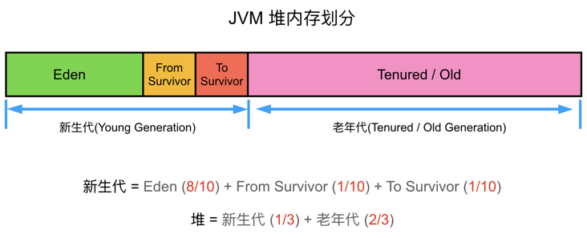

当代主流虚拟机（Hotspot VM）的垃圾回收都采用“分代回收”的算法。“分代回收”是基于这样一个事实：对象的生命周期不同，所以针对不同生命周期的对象可以采取不同的回收方式，以便提高回收效率。Hotspot VM将内存划分为不同的物理区，就是“分代”思想的体现。


**一个对象从出生到消亡**

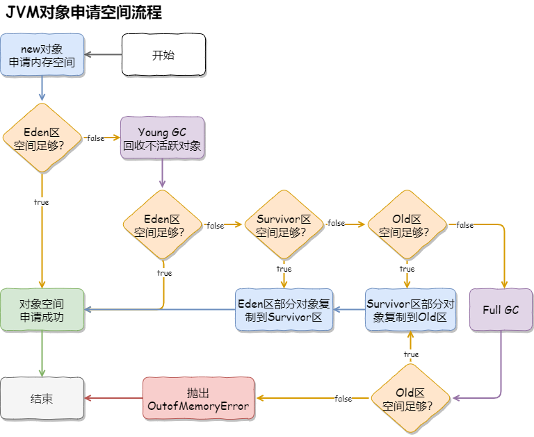

一个对象产生之后首先进行栈上分配，栈上如果分配不下会进入伊甸区，伊甸区经过一次垃圾回收之后进入surivivor区，survivor区在经过一次垃圾回收之后又进入另外一个survivor，与此同时伊甸区的某些对象也跟着进入另外一个survivot，什么时候年龄够了就会进入old区，这是整个对象的一个逻辑上的移动过程。


### 新生代（Young Generation）

**主要是用来存放新生的对象**。一般占据堆的1/3空间。由于频繁创建对象，所以新生代会频繁触发MinorGC进行垃圾回收。新生代又分为 Eden区、ServivorFrom、ServivorTo三个区。

- **Eden区**：Java新对象的出生地（如果新创建的对象占用内存很大，则直接分配到老年代）。当Eden区内存不够的时候就会触发MinorGC，对新生代区进行一次垃圾回收
- **ServivorTo**：保留了一次MinorGC过程中的幸存者
- **ServivorFrom**：上一次GC的幸存者，作为这一次GC的被扫描者


**MinorGC流程**

- **MinorGC采用复制算法**
- 首先把Eden和ServivorFrom区域中存活的对象复制到ServicorTo区域（如果有对象的年龄以及达到了老年的标准，则复制到老年代区），同时把这些对象的年龄+1（如果ServicorTo不够位置了就放到老年区）
- 然后清空Eden和ServicorFrom中的对象
- 最后ServicorTo和ServicorFrom互换，原ServicorTo成为下一次GC时的ServicorFrom区


**为什么 Survivor 分区不能是 0 个？**

如果 Survivor 是 0 的话，也就是说新生代只有一个 Eden 分区，每次垃圾回收之后，存活的对象都会进入老生代，这样老生代的内存空间很快就被占满了，从而触发最耗时的 Full GC ，显然这样的收集器的效率是我们完全不能接受的。

**为什么 Survivor 分区不能是 1 个？**

如果 Survivor 分区是 1 个的话，假设我们把两个区域分为 1:1，那么任何时候都有一半的内存空间是闲置的，显然空间利用率太低不是最佳的方案。

但如果设置内存空间的比例是 8:2 ，只是看起来似乎“很好”，假设新生代的内存为 100 MB（ Survivor 大小为 20 MB ），现在有 70 MB 对象进行垃圾回收之后，剩余活跃的对象为 15 MB 进入 Survivor 区，这个时候新生代可用的内存空间只剩了 5 MB，这样很快又要进行垃圾回收操作，显然这种垃圾回收器最大的问题就在于，需要频繁进行垃圾回收。

**为什么 Survivor 分区是 2 个？**

如果Survivor分区有2个分区，我们就可以把 Eden、From Survivor、To Survivor 分区内存比例设置为 8:1:1 ，那么任何时候新生代内存的利用率都 90% ，这样空间利用率基本是符合预期的。再者就是虚拟机的大部分对象都符合“朝生夕死”的特性，所以每次新对象的产生都在空间占比比较大的Eden区，垃圾回收之后再把存活的对象方法存入Survivor区，如果是 Survivor区存活的对象，那么“年龄”就+1，当年龄增长到15（可通过 -XX:+MaxTenuringThreshold 设定）对象就升级到老生代。


**总结**

根据上面的分析可以得知，当新生代的 Survivor 分区为 2 个的时候，不论是空间利用率还是程序运行的效率都是最优的，所以这也是为什么 Survivor 分区是 2 个的原因了。


### 老年代（Old Generation）

**主要存放应用程序中生命周期长的内存对象**。老年代的对象比较稳定，所以MajorGC不会频繁执行。在进行MajorGC前一般都先进行了一次MinorGC，使得有新生代的对象晋身入老年代，导致空间不够用时才触发。当无法找到足够大的连续空间分配给新创建的较大对象时也会提前触发一次MajorGC进行垃圾回收腾出空间。


**MajorGC流程**

MajorGC采用标记—清除算法。首先扫描一次所有老年代，标记出存活的对象，然后回收没有标记的对象。MajorGC的耗时比较长，因为要扫描再回收。MajorGC会产生内存碎片，为了减少内存损耗，我们一般需要进行合并或者标记出来方便下次直接分配。当老年代也满了装不下的时候，就会抛出OOM（Out of Memory）异常。


### 永久区（Perm Generation）

指内存的永久保存区域，**主要存放元数据**，例如Class、Method的元信息，与垃圾回收要回收的Java对象关系不大。相对于新生代和年老代来说，该区域的划分对垃圾回收影响比较小。GC不会在主程序运行期对永久区域进行清理，所以这也导致了永久代的区域会随着加载的Class的增多而胀满，最终抛出OOM异常。


**JAVA8与元数据**

在Java8中，永久代已经被移除，被一个称为“元数据区”（元空间）的区域所取代。元空间的本质和永久代类似，都是对JVM规范中方法区的实现。不过元空间与永久代之间最大的区别在于：**元空间并不在虚拟机中，而是使用本地内存**。因此，默认情况下，元空间的大小仅受本地内存限制。类的元数据放入Native Memory，字符串池和类的静态变量放入java堆中，这样可以加载多少类的元数据就不再由MaxPermSize控制，而由系统的实际可用空间来控制。


### 内存分配策略

堆内存常见的分配测试如下：

- 对象优先在Eden区分配
- 大对象直接进入老年代
- 长期存活的对象将进入老年代

| **参数**                        | **说明信息**                                                 |
| :------------------------------ | ------------------------------------------------------------ |
| -Xms                            | 初始堆大小。如：-Xms256m                                     |
| -Xmx                            | 最大堆大小。如：-Xmx512m                                     |
| -Xmn                            | 新生代大小。通常为Xmx的1/3或1/4。新生代=Eden+2个Survivor空间。实际可用空间为=Eden+1个Survivor，即 90% |
| -Xss                            | JDK1.5+每个线程堆栈大小为 1M，一般来说如果栈不是很深的话， 1M 是绝对够用了的 |
| -XX:NewRatio                    | 新生代与老年代的比例。如–XX:NewRatio=2，则新生代占整个堆空间的1/3，老年代占2/3 |
| -XX:SurvivorRatio               | 新生代中Eden与Survivor的比值。默认值为 8，即Eden占新生代空间的8/10，另外两个Survivor各占1/10 |
| -XX:PermSize                    | 永久代（方法区）的初始大小                                   |
| -XX:MaxPermSize                 | 永久代（方法区）的最大值                                     |
| -XX:+PrintGCDetails             | 打印GC信息                                                   |
| -XX:+HeapDumpOnOutOfMemoryError | 让虚拟机在发生内存溢出时Dump出当前的内存堆转储快照，以便分析用 |


**参数基本策略**

各分区的大小对GC的性能影响很大。如何将各分区调整到合适的大小，分析活跃数据的大小是很好的切入点。

**活跃数据的大小**：指应用程序稳定运行时长期存活对象在堆中占用的空间大小，即Full GC后堆中老年代占用空间的大小。

可以通过GC日志中Full GC之后老年代数据大小得出，比较准确的方法是在程序稳定后，多次获取GC数据，通过取平均值的方式计算活跃数据的大小。活跃数据和各分区之间的比例关系如下：

| 空间   | 倍数                                    |
| ------ | --------------------------------------- |
| 总大小 | **3-4** 倍活跃数据的大小                |
| 新生代 | **1-1.5** 活跃数据的大小                |
| 老年代 | **2-3** 倍活跃数据的大小                |
| 永久代 | **1.2-1.5** 倍Full GC后的永久代空间占用 |

例如，根据GC日志获得老年代的活跃数据大小为300M，那么各分区大小可以设为：

> 总堆：1200MB = 300MB × 4
>
> 新生代：450MB = 300MB × 1.5
>
> 老年代： 750MB = 1200MB - 450MB

这部分设置仅仅是堆大小的初始值，后面的优化中，可能会调整这些值，具体情况取决于应用程序的特性和需求。


## 引用级别

Java中4种引用的级别和强度由高到低依次为：**强引用→软引用→弱引用→虚引用**

当**垃圾回收器**回收时，某些对象会被回收，某些不会被回收。垃圾回收器会从**根对象**`Object`来**标记**存活的对象，然后将某些不可达的对象和一些引用的对象进行回收。如下所示：

| 引用类型 | 被垃圾回收时间 | 用途               | 生存时间          |
| -------- | -------------- | ------------------ | ----------------- |
| 强引用   | 从来不会       | 对象的一般状态     | JVM停止运行时终止 |
| 软引用   | 当内存不足时   | 对象缓存           | 内存不足时终止    |
| 弱引用   | 正常垃圾回收时 | 对象缓存           | 垃圾回收后终止    |
| 虚引用   | 正常垃圾回收时 | 跟踪对象的垃圾回收 | 垃圾回收后终止    |

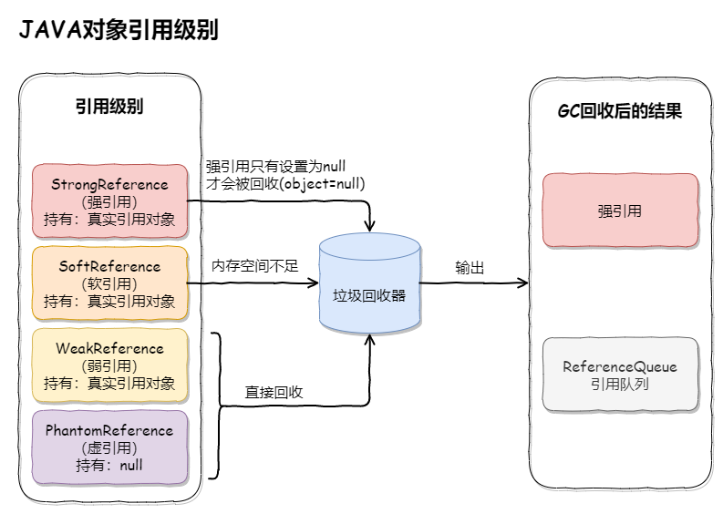


### 强引用（StrongReference）

强引用是我们最常见的对象，它属于不可回收资源，垃圾回收器（后面简称GC）绝对不会回收它，即使是内存不足，JVM宁愿抛出 OutOfMemoryError 异常，使程序终止，也不会来回收强引用对象。如果一个对象具有强引用，那**垃圾回收器**绝不会回收它。如下：

```java
Object strongReference = new Object();
```

当**内存空间不足**时，`Java`虚拟机宁愿抛出`OutOfMemoryError`错误，使程序**异常终止**，也不会靠随意**回收**具有**强引用**的**对象**来解决内存不足的问题。 如果强引用对象**不使用时**，需要弱化从而使`GC`能够回收，如下：

```java
strongReference = null;
```

显式地设置`strongReference`对象为`null`，或让其**超出**对象的**生命周期**范围，则`gc`认为该对象**不存在引用**，这时就可以回收这个对象。具体什么时候收集这要取决于`GC`算法。

```java
public void test() {
	Object strongReference = new Object();
	// 省略其他操作
}
```

在一个**方法的内部**有一个**强引用**，这个引用保存在`Java`**栈**中，而真正的引用内容(`Object`)保存在`Java`**堆**中。 当这个**方法运行完成**后，就会退出**方法栈**，则引用对象的**引用数**为`0`，这个对象会被回收。但是如果这个`strongReference`是**全局变量**时，就需要在不用这个对象时赋值为`null`，因为**强引用**不会被垃圾回收。


### 软引用（SoftReference）

如果一个对象只具有**软引用**，则**内存空间充足**时，**垃圾回收器**就**不会**回收它；如果**内存空间不足**了，就会**回收**这些对象的内存。只要垃圾回收器没有回收它，该对象就可以被程序使用。软引用可用来实现内存敏感的高速缓存。

```java
// 强引用
String strongReference = new String("abc");
// 软引用
String str = new String("abc");
SoftReference<String> softReference = new SoftReference<String>(str);
```

**软引用**可以和一个**引用队列**(`ReferenceQueue`)联合使用。如果**软引用**所引用对象被**垃圾回收**，`JAVA`虚拟机就会把这个**软引用**加入到与之关联的**引用队列**中。

```java
ReferenceQueue<String> referenceQueue = new ReferenceQueue<>();
String str = new String("abc");
SoftReference<String> softReference = new SoftReference<>(str, referenceQueue);
```

**注意**：软引用对象是在jvm内存不够时才会被回收，我们调用System.gc()方法只是起通知作用，JVM什么时候扫描回收对象是JVM自己的状态决定的。就算扫描到软引用对象也不一定会回收它，只有内存不够的时候才会回收。

**垃圾收集线程**会在虚拟机抛出`OutOfMemoryError`之前回**收软引用对象**，而**虚拟机**会尽可能优先回收**长时间闲置不用**的**软引用对象**。对那些**刚构建**的或刚使用过的**"较新的"**软对象会被虚拟机尽可能**保留**，这就是引入**引用队列**`ReferenceQueue`的原因。


### 弱引用（WeakReference）

弱引用对象相对软引用对象具有更短暂的生命周期，只要 GC 发现它仅有弱引用，不管内存空间是否充足，都会回收它，不过 GC 是一个优先级很低的线程，因此不一定会很快发现那些仅有弱引用的对象。

**弱引用**与**软引用**的区别在于：只具有**弱引用**的对象拥有**更短暂**的**生命周期**。在垃圾回收器线程扫描它所管辖的内存区域的过程中，一旦发现了只具有**弱引用**的对象，不管当前**内存空间足够与否**，都会**回收**它的内存。不过，由于垃圾回收器是一个**优先级很低的线程**，因此**不一定**会**很快**发现那些只具有**弱引用**的对象。

```java
String str = new String("abc");
WeakReference<String> weakReference = new WeakReference<>(str);
str = null;
```

`JVM`首先将**软引用**中的**对象**引用置为`null`，然后通知**垃圾回收器**进行回收：

```java
str = null;
System.gc();
```

**注意**：如果一个对象是偶尔(很少)的使用，并且希望在使用时随时就能获取到，但又不想影响此对象的垃圾收集，那么你应该用Weak Reference来记住此对象。

下面的代码会让一个**弱引用**再次变为一个**强引用**：

```java
String str = new String("abc");
WeakReference<String> weakReference = new WeakReference<>(str);
// 弱引用转强引用
String strongReference = weakReference.get();
```

同样，**弱引用**可以和一个**引用队列**(`ReferenceQueue`)联合使用，如果**弱引用**所引用的**对象**被**垃圾回收**，`Java`虚拟机就会把这个**弱引用**加入到与之关联的**引用队列**中。


### 虚引用（PhantomReference）

**虚引用**顾名思义，就是**形同虚设**。与其他几种引用都不同，**虚引用**并**不会**决定对象的**生命周期**。如果一个对象**仅持有虚引用**，那么它就和**没有任何引用**一样，在任何时候都可能被垃圾回收器回收。

**应用场景：**

**虚引用**主要用来**跟踪对象**被垃圾回收器**回收**的活动。 **虚引用**与**软引用**和**弱引用**的一个区别在于：

> 虚引用必须和引用队列(ReferenceQueue)联合使用。当垃圾回收器准备回收一个对象时，如果发现它还有虚引用，就会在回收对象的内存之前，把这个虚引用加入到与之关联的引用队列中。

```java
String str = new String("abc");
ReferenceQueue queue = new ReferenceQueue();
// 创建虚引用，要求必须与一个引用队列关联
PhantomReference pr = new PhantomReference(str, queue);
```

程序可以通过判断引用**队列**中是否已经加入了**虚引用**，来了解被引用的对象是否将要进行**垃圾回收**。如果程序发现某个虚引用已经被加入到引用队列，那么就可以在所引用的对象的**内存被回收之前**采取必要的行动。


## OOM

JVM发生OOM的九种场景如下：

**场景一：Java heap space**

> 当堆内存（Heap Space）没有足够空间存放新创建的对象时，就会抛出 `java.lang.OutOfMemoryError:Javaheap space` 错误（根据实际生产经验，可以对程序日志中的 OutOfMemoryError 配置关键字告警，一经发现，立即处理）。
>
> **原因分析**
>
> `Javaheap space` 错误产生的常见原因可以分为以下几类：
>
> - 请求创建一个超大对象，通常是一个大数组
> - 超出预期的访问量/数据量，通常是上游系统请求流量飙升，常见于各类促销/秒杀活动，可以结合业务流量指标排查是否有尖状峰值
> - 过度使用终结器（Finalizer），该对象没有立即被 GC
> - 内存泄漏（Memory Leak），大量对象引用没有释放，JVM 无法对其自动回收，常见于使用了 File 等资源没有回收
>
> **解决方案**
>
> 针对大部分情况，通常只需通过 `-Xmx` 参数调高 JVM 堆内存空间即可。如果仍然没有解决，可参考以下情况做进一步处理：
>
> - 如果是超大对象，可以检查其合理性，比如是否一次性查询了数据库全部结果，而没有做结果数限制
> - 如果是业务峰值压力，可以考虑添加机器资源，或者做限流降级
> - 如果是内存泄漏，需要找到持有的对象，修改代码设计，比如关闭没有释放的连接

**场景二：GC overhead limit exceeded**

> 当 Java 进程花费 98% 以上的时间执行 GC，但只恢复了不到 2% 的内存，且该动作连续重复了 5 次，就会抛出 `java.lang.OutOfMemoryError:GC overhead limit exceeded` 错误。简单地说，就是应用程序已经基本耗尽了所有可用内存， GC 也无法回收。
>
> 此类问题的原因与解决方案跟 `Javaheap space` 非常类似，可以参考上文。

**场景三：Permgen space**

> 该错误表示永久代（Permanent Generation）已用满，通常是因为加载的 class 数目太多或体积太大。
>
> **原因分析**
>
> 永久代存储对象主要包括以下几类：
>
> - 加载/缓存到内存中的 class 定义，包括类的名称，字段，方法和字节码
> - 常量池
> - 对象数组/类型数组所关联的 class
> - JIT 编译器优化后的 class 信息
>
> PermGen 的使用量与加载到内存的 class 的数量/大小正相关。
>
> **解决方案**
>
> 根据 Permgen space 报错的时机，可以采用不同的解决方案，如下所示：
>
> - 程序启动报错，修改 `-XX:MaxPermSize` 启动参数，调大永久代空间
> - 应用重新部署时报错，很可能是没有应用没有重启，导致加载了多份 class 信息，只需重启 JVM 即可解决
> - 运行时报错，应用程序可能会动态创建大量 class，而这些 class 的生命周期很短暂，但是 JVM 默认不会卸载 class，可以设置 `-XX:+CMSClassUnloadingEnabled` 和 `-XX:+UseConcMarkSweepGC` 这两个参数允许 JVM 卸载 class。
>
> 如果上述方法无法解决，可以通过 jmap 命令 dump 内存对象 `jmap-dump:format=b,file=dump.hprof<process-id>` ，然后利用 Eclipse MAT https://www.eclipse.org/mat 功能逐一分析开销最大的 classloader 和重复 class。

**场景四：Metaspace**

> JDK 1.8 使用 Metaspace 替换了永久代（Permanent Generation），该错误表示 Metaspace 已被用满，通常是因为加载的 class 数目太多或体积太大。
>
> 此类问题的原因与解决方法跟 `Permgenspace` 非常类似，可以参考上文。需要特别注意的是调整 Metaspace 空间大小的启动参数为 `-XX:MaxMetaspaceSize`。

**场景五：Unable to create new native thread**

> 每个 Java 线程都需要占用一定的内存空间，当 JVM 向底层操作系统请求创建一个新的 native 线程时，如果没有足够的资源分配就会报此类错误。
>
> **原因分析**
>
> JVM 向 OS 请求创建 native 线程失败，就会抛出 `Unableto createnewnativethread`，常见的原因包括以下几类：
>
> - 线程数超过操作系统最大线程数 ulimit 限制
> - 线程数超过 kernel.pid_max（只能重启）
> - native 内存不足
>
> 该问题发生的常见过程主要包括以下几步：
>
> - JVM 内部的应用程序请求创建一个新的 Java 线程
> - JVM native 方法代理了该次请求，并向操作系统请求创建一个 native 线程
> - 操作系统尝试创建一个新的 native 线程，并为其分配内存
> - 如果操作系统的虚拟内存已耗尽，或是受到 32 位进程的地址空间限制，操作系统就会拒绝本次 native 内存分配
> - JVM 将抛出 `java.lang.OutOfMemoryError:Unableto createnewnativethread`错误
>
> **解决方案**
>
> - 升级配置，为机器提供更多的内存
> - 降低 Java Heap Space 大小
> - 修复应用程序的线程泄漏问题
> - 限制线程池大小
> - 使用 -Xss 参数减少线程栈的大小
> - 调高 OS 层面的线程最大数：执行 `ulimia-a` 查看最大线程数限制，使用 `ulimit-u xxx` 调整最大线程数限制

**场景六：Out of swap space？**

> 该错误表示所有可用的虚拟内存已被耗尽。虚拟内存（Virtual Memory）由物理内存（Physical Memory）和交换空间（Swap Space）两部分组成。当运行时程序请求的虚拟内存溢出时就会报 `Outof swap space?` 错误。
>
> **原因分析**
>
> 该错误出现的常见原因包括以下几类：
>
> - 地址空间不足
> - 物理内存已耗光
> - 应用程序的本地内存泄漏（native leak），例如不断申请本地内存，却不释放
> - 执行 `jmap-histo:live<pid>` 命令，强制执行 Full GC；如果几次执行后内存明显下降，则基本确认为 Direct ByteBuffer 问题
>
> **解决方案**
>
> 根据错误原因可以采取如下解决方案：
>
> - 升级地址空间为 64 bit
> - 使用 Arthas 检查是否为 Inflater/Deflater 解压缩问题，如果是，则显式调用 end 方法
> - Direct ByteBuffer 问题可以通过启动参数 `-XX:MaxDirectMemorySize` 调低阈值
> - 升级服务器配置/隔离部署，避免争用

**场景七：Kill process or sacrifice child**

> 有一种内核作业（Kernel Job）名为 Out of Memory Killer，它会在可用内存极低的情况下“杀死”（kill）某些进程。OOM Killer 会对所有进程进行打分，然后将评分较低的进程“杀死”，具体的评分规则可以参考 Surviving the Linux OOM Killer。不同于其它OOM错误， `Killprocessorsacrifice child` 错误不是由 JVM 层面触发的，而是由操作系统层面触发的。
>
> **原因分析**
>
> 默认情况下，Linux 内核允许进程申请的内存总量大于系统可用内存，通过这种“错峰复用”的方式可以更有效的利用系统资源。然而，这种方式也会无可避免地带来一定的“超卖”风险。例如某些进程持续占用系统内存，然后导致其他进程没有可用内存。此时，系统将自动激活 OOM Killer，寻找评分低的进程，并将其“杀死”，释放内存资源。
>
> **解决方案**
>
> - 升级服务器配置/隔离部署，避免争用
> - OOM Killer 调优

**场景八：Requested array size exceeds VM limit**

> JVM 限制了数组的最大长度，该错误表示程序请求创建的数组超过最大长度限制。JVM 在为数组分配内存前，会检查要分配的数据结构在系统中是否可寻址，通常为 `Integer.MAX_VALUE-2`。
>
> 此类问题比较罕见，通常需要检查代码，确认业务是否需要创建如此大的数组，是否可以拆分为多个块，分批执行。

**场景九：Direct buffer memory**

> Java 允许应用程序通过 Direct ByteBuffer 直接访问堆外内存，许多高性能程序通过 Direct ByteBuffer 结合内存映射文件（Memory Mapped File）实现高速 IO。
>
> **原因分析**
>
> Direct ByteBuffer 的默认大小为 64 MB，一旦使用超出限制，就会抛出 `Directbuffer memory` 错误。
>
> **解决方案**
>
> - Java 只能通过 ByteBuffer.allocateDirect 方法使用 Direct ByteBuffer，因此，可以通过 Arthas 等在线诊断工具拦截该方法进行排查
> - 检查是否直接或间接使用了 NIO，如 netty，jetty 等
> - 通过启动参数 `-XX:MaxDirectMemorySize` 调整 Direct ByteBuffer 的上限值
> - 检查 JVM 参数是否有 `-XX:+DisableExplicitGC` 选项，如果有就去掉，因为该参数会使 `System.gc()` 失效
> - 检查堆外内存使用代码，确认是否存在内存泄漏；或者通过反射调用 `sun.misc.Cleaner` 的 `clean()` 方法来主动释放被 Direct ByteBuffer 持有的内存空间
> - 内存容量确实不足，升级配置

**最佳实践**

> ① OOM发生时输出堆dump：
>
> `-XX:+HeapDumpOnOutOfMemoryError` `-XX:HeapDumpPath=$CATALINA_HOME/logs`
>
> ② OOM发生后的执行动作：
>
> `-XX:OnOutOfMemoryError=$CATALINA_HOME/bin/stop.sh` 
>
> `-XX:OnOutOfMemoryError=$CATALINA_HOME/bin/restart.sh`
>
> OOM之后除了保留堆dump外，根据管理策略选择合适的运行脚本。


# GC

## 寻找垃圾算法


### 引用计数法

引用计数法（Reference Count）会给对象中添加一个引用计数器，每当有一个地方引用它的时候，计数器的值就 +1 ，当引用失效时，计数器值就 -1 ，计数器的值为 0 的对象不可能在被使用，这个时候就可以判定这个对象是垃圾。


当图中的数值变成0时，这个时候使用引用计数算法就可以判定它是垃圾了，但是引用计数法不能解决一个问题，就是当对象是循环引用的时候，计数器值都不为0，这个时候引用计数器无法通知GC收集器来回收他们，如下图所示：

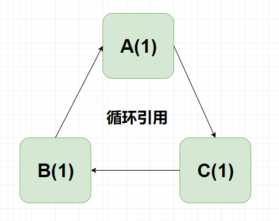

这个时候就需要使用到我们的根可达算法。


### 可达性分析

根可达算法（Root Searching）的意思是说从根上开始搜索，当一个程序启动后，马上需要的那些个对象就叫做根对象，所谓的根可达算法就是首先找到根对象，然后跟着这根线一直往外找到那些有用的。常见的GC roots如下：

- **线程栈变量：** 线程里面会有线程栈和main栈帧，从这个main() 里面开始的这些对象都是我们的根对象

- **静态变量：** 一个class 它有一个静态的变量，load到内存之后马上就得对静态变量进行初始化，所以静态变量到的对象这个叫做根对象

- **常量池：** 如果你这个class会用到其他的class的那些个类的对象，这些就是根对象

- **JNI：** 如果我们调用了 C和C++ 写的那些本地方法所用到的那些个类或者对象


图中的 object5 和object6 虽然他们之间互相引用了，但是从根找不到它，所以就是垃圾，而object8没有任何引用自然而然也是垃圾，其他的Object对象都有可以从根找到的，所以是有用的，不会被垃圾回收掉。


**GC Root**

GC Roots 是一组必须活跃的引用。用通俗的话来说，就是程序接下来通过直接引用或者间接引用，能够访问到的潜在被使用的对象。GC Roots 包括：

- **Java 线程中，当前所有正在被调用的方法的引用类型参数、局部变量、临时值等。也就是与我们栈帧相关的各种引用**
- **所有当前被加载的 Java 类**
- **Java 类的引用类型静态变量**
- **运行时常量池里的引用类型常量（String 或 Class 类型）**
- **JVM 内部数据结构的一些引用，比如 sun.jvm.hotspot.memory.Universe 类**
- **用于同步的监控对象，比如调用了对象的 wait() 方法**
- **JNI handles，包括 global handles 和 local handles**

这些 GC Roots 大体可以分为三大类：

- **活动线程相关的各种引用**
- **类的静态变量的引用**
- **JNI 引用**

有两个注意点：

- **我们这里说的是活跃的引用，而不是对象，对象是不能作为 GC Roots 的**
- **GC 过程是找出所有活对象，并把其余空间认定为“无用”；而不是找出所有死掉的对象，并回收它们占用的空间。所以，哪怕 JVM 的堆非常的大，基于 tracing 的 GC 方式，回收速度也会非常快**


## 清理垃圾算法

清理垃圾算法又叫内存回收算法。

### 标记（Mark）

垃圾回收的第一步，就是找出活跃的对象。根据 GC Roots 遍历所有的可达对象，这个过程，就叫作标记。


如图所示，圆圈代表的是对象。绿色的代表 GC Roots，红色的代表可以追溯到的对象。可以看到标记之后，仍然有多个灰色的圆圈，它们都是被回收的对象。


### 清除（Sweep）

清除阶段就是把未被标记的对象回收掉。


但是这种简单的清除方式，有一个明显的弊端，那就是碎片问题。比如我申请了 1k、2k、3k、4k、5k 的内存。


由于某种原因 ，2k 和 4k 的内存，我不再使用，就需要交给垃圾回收器回收。


这个时候，我应该有足足 6k 的空闲空间。接下来，我打算申请另外一个 5k 的空间，结果系统告诉我内存不足了。系统运行时间越长，这种碎片就越多。在很久之前使用 Windows 系统时，有一个非常有用的功能，就是内存整理和磁盘整理，运行之后有可能会显著提高系统性能。这个出发点是一样的。


### 复制（Copying）

算法.png)

**优点**

- 因为是对整个半区进行内存回收，内存分配时不用考虑内存碎片等情况。实现简单，效率较高

**不足之处**

- 既然要复制，需要提前预留内存空间，有一定的浪费
- 在对象存活率较高时，需要复制的对象较多，效率将会变低


### 整理（Compact）

其实，不用分配一个对等的额外空间，也是可以完成内存的整理工作。可以把内存想象成一个非常大的数组，根据随机的 index 删除了一些数据。那么对整个数组的清理，其实是不需要另外一个数组来进行支持的，使用程序就可以实现。它的主要思路，就是移动所有存活的对象，且按照内存地址顺序依次排列，然后将末端内存地址以后的内存全部回收。


但是需要注意，这只是一个理想状态。对象的引用关系一般都是非常复杂的，我们这里不对具体的算法进行描述。你只需要了解，从效率上来说，一般整理算法是要低于复制算法的。


### 扩展回收算法

目前JVM的垃圾回收器都是对几种朴素算法的发扬光大（没有最优的算法，只有最合适的算法）：

- **复制算法（Copying）**：复制算法是所有算法里面效率最高的，缺点是会造成一定的空间浪费
- **标记-清除（Mark-Sweep）**：效率一般，缺点是会造成内存碎片问题
- **标记-整理（Mark-Compact）**：效率比前两者要差，但没有空间浪费，也消除了内存碎片问题


#### 标记清除（Mark-Sweep）

算法.png)

首先从 GC Root 开始遍历对象图，并标记（Mark）所遇到的每个对象，标识出所有要回收的对象。然后回收器检查堆中每一个对象，并将所有未被标记的对象进行回收。

**不足之处**

- 标记、清除的效率都不高
- 清除后产生大量的内存碎片，空间碎片太多会导致在分配大对象时无法找到足够大的连续内存，从而不得不触发另一次垃圾回收动作


#### 标记整理（Mark-Compact）

算法.png)

与标记清除算法类似，但不是在标记完成后对可回收对象进行清理，而是将所有存活的对象向一端移动，然后直接清理掉端边界以外的内存。

**优点**

- 消除了标记清除导致的内存分散问题，也消除了复制算法中内存减半的高额代价

**不足之处**

- 效率低下，需要标记所有存活对象，还要标记所有存活对象的引用地址。效率上低于复制算法


#### 分代收集（Generational Collection）

研究表明大部分对象可以分为两类：

- 大部分对象的生命周期都很短
- 其他对象则很可能会存活很长时间

根据对象存活周期的不同将内存划分为几块。对不同周期的对象采取不同的收集算法：

- **新生代**：每次垃圾收集会有大批对象回收，所以采取复制算法
- **老年代**：对象存活率高，采取标记清理或者标记整理算法


**① 年轻代（Young Generation）**

年轻代使用的垃圾回收算法是复制算法。因为年轻代发生 GC 后，只会有非常少的对象存活，复制这部分对象是非常高效的。但复制算法会造成一定的空间浪费，所以年轻代中间也会分很多区域。


如图所示，年轻代分为：**1个伊甸园空间（Eden ）**，**2个幸存者空间（Survivor ）**。当年轻代中的 Eden 区分配满的时候，就会触发年轻代的 GC（Minor GC）。具体过程如下：

- 在 Eden 区执行了第一次 GC 之后，存活的对象会被移动到其中一个 Survivor 分区（以下简称from）
- Eden 区再次 GC，这时会采用复制算法，将 Eden 和 from 区一起清理。存活的对象会被复制到 to 区，然后只需要清空 from 区就可以了

在这个过程中，总会有1个 Survivor 分区是空置的。Eden、from、to 的默认比例是 8:1:1，所以只会造成 10% 的空间浪费。这个比例，是由参数 **-XX:SurvivorRatio** 进行配置的（默认为 8）。


**② 老年代（Old/Tenured Generation）**

老年代一般使用“**标记-清除**”、“**标记-整理**”算法，因为老年代的对象存活率一般是比较高的，空间又比较大，拷贝起来并不划算，还不如采取就地收集的方式。对象进入老年代的途径如下：

- **提升（Promotion）**

  如果对象够老，会通过“提升”进入老年代

- **分配担保**

  年轻代回收后存活的对象大于10%时，因Survivor空间不够存储，对象就会直接在老年代上分配

- **大对象直接在老年代分配**

  超出某个大小的对象将直接在老年代分配

- **动态对象年龄判定**

  有的垃圾回收算法，并不要求 age 必须达到 15 才能晋升到老年代，它会使用一些动态的计算方法。

  比如，如果幸存区中相同年龄对象大小的和，大于幸存区的一半，大于或等于 age 的对象将会直接进入老年代。


## GC垃圾收集器


GC垃圾收集器的JVM配置参数：

- **-XX:+UseSerialGC**：年轻代和老年代都用串行收集器
- **-XX:+UseParNewGC**：年轻代使用 ParNew，老年代使用 Serial Old
- **-XX:+UseParallelGC**：年轻代使用 ParallerGC，老年代使用 Serial Old
- **-XX:+UseParallelOldGC**：新生代和老年代都使用并行收集器
- **-XX:+UseConcMarkSweepGC**：表示年轻代使用 ParNew，老年代的用 CMS
- **-XX:+UseG1GC**：使用 G1垃圾回收器
- **-XX:+UseZGC**：使用 ZGC 垃圾回收器


### 年轻代收集器

#### Serial收集器

处理GC的只有一条线程，并且在垃圾回收的过程中暂停一切用户线程。最简单的垃圾回收器，但千万别以为它没有用武之地。因为简单，所以高效，它通常用在客户端应用上。因为客户端应用不会频繁创建很多对象，用户也不会感觉出明显的卡顿。相反，它使用的资源更少，也更轻量级。


#### ParNew收集器

ParNew是Serial的多线程版本。由多条GC线程并行地进行垃圾清理。清理过程依然要停止用户线程。ParNew 追求“低停顿时间”，与 Serial 唯一区别就是使用了多线程进行垃圾收集，在多 CPU 环境下性能比 Serial 会有一定程度的提升；但线程切换需要额外的开销，因此在单 CPU 环境中表现不如 Serial。

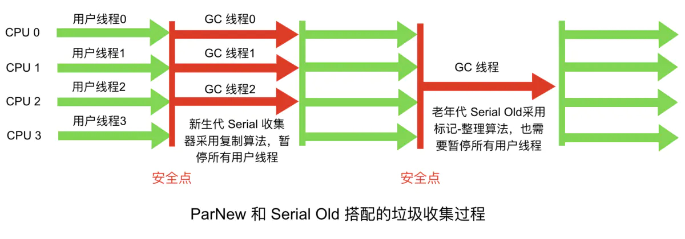


#### Parallel Scavenge收集器

另一个多线程版本的垃圾回收器。它与ParNew的主要区别是：

- **Parallel Scavenge**：追求CPU吞吐量，能够在较短时间完成任务，适合没有交互的后台计算。弱交互强计算
- **ParNew**：追求降低用户停顿时间，适合交互式应用。强交互弱计算


### 老年代收集器

#### Serial Old收集器

与年轻代的 Serial 垃圾收集器对应，都是单线程版本，同样适合客户端使用。年轻代的 Serial，使用复制算法。老年代的 Old Serial，使用标记-整理算法。


#### Parallel Old收集器

Parallel Old 收集器是 Parallel Scavenge 的老年代版本，追求 CPU 吞吐量。


#### CMS收集器

**并发标记清除(Concurrent Mark Sweep,CMS)垃圾回收器**，是一款致力于获取最短停顿时间的收集器，使用多个线程来扫描堆内存并标记可被清除的对象，然后清除标记的对象。在下面两种情形下会暂停工作线程：

- 在老年代中标记引用对象的时候

- 在做垃圾回收的过程中堆内存中有变化发生


对比与并行垃圾回收器，CMS回收器使用更多的CPU来保证更高的吞吐量。如果我们可以有更多的CPU用来提升性能，那么CMS垃圾回收器是比并行回收器更好的选择。使用 `-XX:+UseParNewGCJVM` 参数来开启使用CMS垃圾回收器。

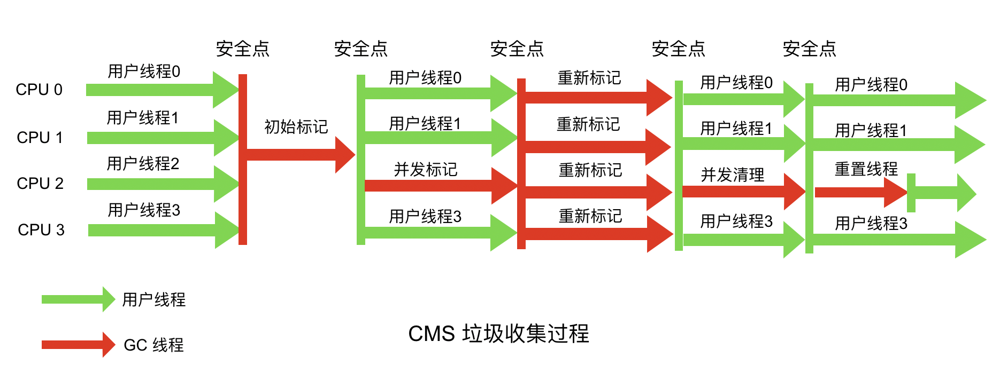

**主要流程如下**：

- 初始标记(CMS initial mark)
- 并发标记(CMS concurrenr mark)
- 重新标记(CMS remark)
- 并发清除(CMS concurrent sweep)


**优点**：

- 并发收集
- 停顿时间最短

**缺点**：

- 并发收集占据一定CPU资源，导致程序GC过程中变慢（吞吐量下降）
- 无法处理浮动垃圾，可能出现”Concurrent Mode Failure“失败而导致另一次Full GC
- 因为基于”标记-清除算法“导致空间碎片过多，可能因此在分配对象时引起另一次GC


**作用内存区域**：老年代

**适用场景**：对停顿时间敏感的场合

**算法类型**：标记-清除


### 新生代和老年代收集

#### G1收集器

**G1垃圾回收器** 应用于大的堆内存空间。它将堆内存空间划分为不同的区域，对各个区域并行地做回收工作。G1在回收内存空间后还立即堆空闲空间做整合工作以减少碎片。CMS却是在全部停止(stop the world,STW)时执行内存整合工作。对于不同的区域G1根据垃圾的数量决定优先级。使用 `-XX:UseG1GCJVM` 参数来开启使用G1垃圾回收器。


**主要流程如下**：

- 初始标记(Initial Marking)
- 并发标记(Concurrenr Marking)
- 最终标记(Final Marking)
- 筛选回收(Live Data Counting And Evacution)


**优点**：

- 并行与并发，充分发挥多核优势
- 分代收集，所以不需要与其它收集器配合即可工作
- 空间整合，整体来看基于”标记-整理算法“，局部采用”复制算法“都不会产生内存碎片
- 可以指定GC最大停顿时长

**缺点**：

- 需要记忆集来记录新生代和老年代之间的引用关系
- 需要占用大量的内存，可能达到整个堆内存容量的20%甚至更多


**作用内存区域**：跨代

**适用场景**：作为关注停顿时间的场景的收集器备选方案

**算法类型**：整体来看基于”标记-整理算法“，局部采用"复制算法"


#### ZGC收集器

Z Garbage Collector，简称 ZGC，是 JDK 11 中新加入的尚在实验阶段的低延迟垃圾收集器。它和 Shenandoah 同属于超低延迟的垃圾收集器，但在吞吐量上比 Shenandoah 有更优秀的表现，甚至超过了 G1，接近了“吞吐量优先”的 Parallel 收集器组合，可以说近乎实现了“鱼与熊掌兼得”。

与CMS中的ParNew和G1类似，ZGC也采用标记-复制算法，不过ZGC对该算法做了重大改进：ZGC在标记、转移和重定位阶段几乎都是并发的，这是ZGC实现停顿时间小于10ms目标的最关键原因。ZGC垃圾回收周期如下图所示：


ZGC只有三个STW阶段：**初始标记**，**再标记**，**初始转移**。其中，初始标记和初始转移分别都只需要扫描所有GC Roots，其处理时间和GC Roots的数量成正比，一般情况耗时非常短；再标记阶段STW时间很短，最多1ms，超过1ms则再次进入并发标记阶段。即，ZGC几乎所有暂停都只依赖于GC Roots集合大小，停顿时间不会随着堆的大小或者活跃对象的大小而增加。与ZGC对比，G1的转移阶段完全STW的，且停顿时间随存活对象的大小增加而增加。


**ZGC 的内存布局**

与 Shenandoah 和 G1 一样，ZGC 也采用基于 Region 的堆内存布局，但与它们不同的是， ZGC 的 Region 具有动态性，也就是可以动态创建和销毁，容量大小也是动态的，有大、中、小三类容量:

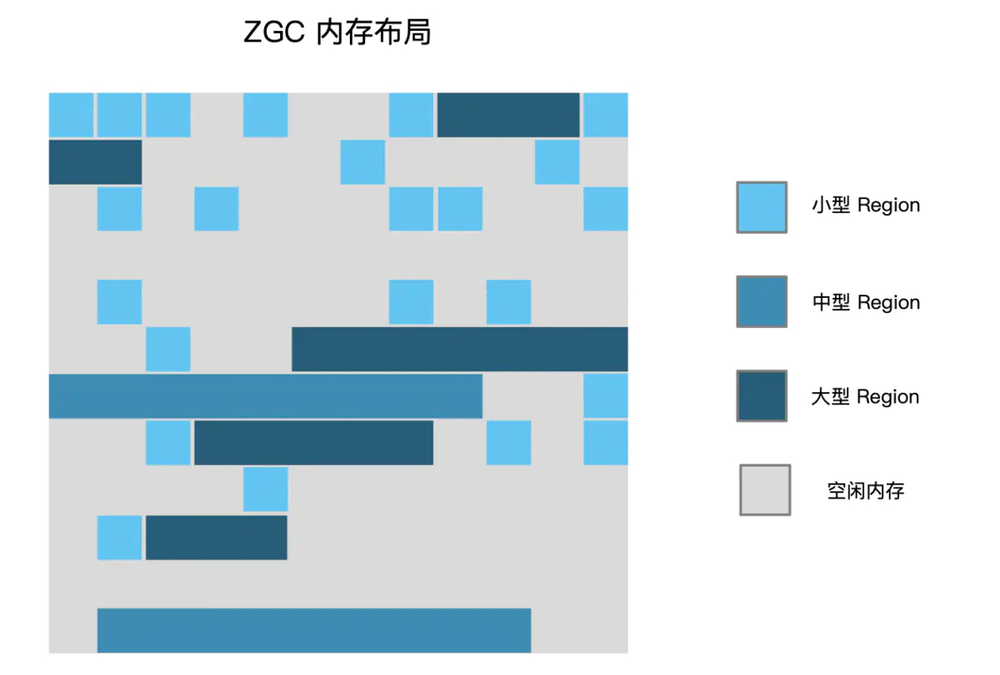

- 小型 Region (Small Region)：容量固定为 2MB，用于放置小于 256KB 的小对象
- 中型 Region (M edium Region)：容量固定为 32MB，用于放置大于等于 256KB 但小于 4MB 的对象
- 大型 Region (Large Region)：容量不固定，可以动态变化，但必须为 2MB 的整数倍，用于放置 4MB 或以上的大对象。每个大型 Region 中只会存放一个大对象，这也预示着虽然名字叫作“大型 Region”，但它的实际容量完全有可能小于中型 Region，最小容量可低至 4MB

在 JDK 11 及以上版本，可以通过以下参数开启 ZGC：`-XX:+UnlockExperimentalVMOptions -XX:+UseZGC` 。


#### Shenandoah收集器

Shenandoah 与 G1 有很多相似之处，比如都是基于 Region 的内存布局，都有用于存放大对象的 Humongous Region，默认回收策略也是优先处理回收价值最大的 Region。不过也有三个重大的区别：

- Shenandoah支持并发的整理算法，G1整理阶段虽是多线程并行，但无法与用户程序并发执行
- 默认不使用分代收集理论
- 使用连接矩阵 (Connection Matrix)记录跨Region的引用关系，替换掉了G1中的记忆级(Remembered Set)，内存和计算成本更低

Shenandoah 收集器的工作原理相比 G1 要复杂不少，其运行流程示意图如下：


可见Shenandoah的并发程度明显比G1更高，只需要在初始标记、最终标记、初始引用更新和最终引用更新这几个阶段进行短暂的“Stop The World”，其他阶段皆可与用户程序并发执行，其中最重要的并发标记、并发回收和并发引用更新详情如下：

- **并发标记( Concurrent Marking)**
- **并发回收( Concurrent Evacuation)**
- **并发引用更新( Concurrent Update Reference)**

Shenandoah 的高并发度让它实现了超低的停顿时间，但是更高的复杂度也伴随着更高的系统开销，这在一定程度上会影响吞吐量，下图是 Shenandoah 与之前各种收集器在停顿时间维度和系统开销维度上的对比：


OracleJDK 并不支持 Shenandoah，如果你用的是 OpenJDK 12 或某些支持 Shenandoah 移植版的 JDK 的话，可以通过以下参数开启 Shenandoah：`-XX:+UnlockExperimentalVMOptions -XX:+UseShenandoahGC` 。


## GC日志

### 日志格式

**ParallelGC YoungGC日志**

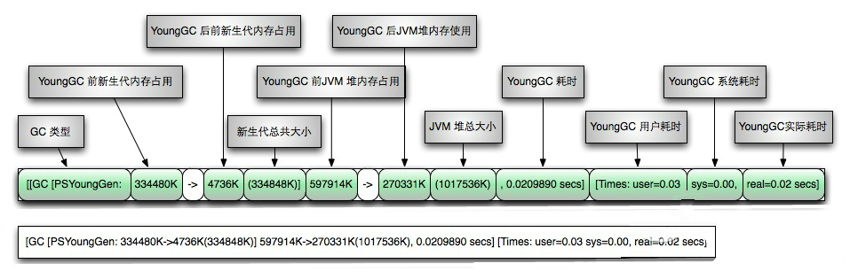

**ParallelGC FullGC日志**


### 最佳实践

在不同的 JVM 的不垃圾回收器上，看参数默认是什么，不要轻信别人的建议，命令行示例如下：

```shell
java -XX:+PrintFlagsFinal -XX:+UseG1GC  2>&1 | grep UseAdaptiveSizePolicy
```

PrintCommandLineFlags：通过它，你能够查看当前所使用的垃圾回收器和一些默认的值。

```shell
# java -XX:+PrintCommandLineFlags -version
-XX:InitialHeapSize=127905216 -XX:MaxHeapSize=2046483456 -XX:+PrintCommandLineFlags -XX:+UseCompressedClassPointers -XX:+UseCompressedOops -XX:+UseParallelGC
openjdk version "1.8.0_41"
OpenJDK Runtime Environment (build 1.8.0_41-b04)
OpenJDK 64-Bit Server VM (build 25.40-b25, mixed mode)
```


G1垃圾收集器JVM参数最佳实践：

```shell
# 1.基本参数
-server                  # 服务器模式
-Xmx12g                  # 初始堆大小
-Xms12g                  # 最大堆大小
-Xss256k                 # 每个线程的栈内存大小
-XX:+UseG1GC             # 使用 G1 (Garbage First) 垃圾收集器   
-XX:MetaspaceSize=256m   # 元空间初始大小
-XX:MaxMetaspaceSize=1g  # 元空间最大大小
-XX:MaxGCPauseMillis=200 # 每次YGC / MixedGC 的最多停顿时间 (期望最长停顿时间)

# 2.必备参数
-XX:+PrintGCDetails            # 输出详细GC日志
-XX:+PrintGCDateStamps         # 输出GC的时间戳（以日期的形式，如 2013-05-04T21:53:59.234+0800）
-XX:+PrintTenuringDistribution # 打印对象分布：为了分析GC时的晋升情况和晋升导致的高暂停，看对象年龄分布日志
-XX:+PrintHeapAtGC                 # 在进行GC的前后打印出堆的信息
-XX:+PrintReferenceGC              # 打印Reference处理信息:强引用/弱引用/软引用/虚引用/finalize方法万一有问题
-XX:+PrintGCApplicationStoppedTime # 打印STW时间
-XX:+PrintGCApplicationConCurrentTime # 打印GC间隔的服务运行时长

# 3.日志分割参数
-XX:+UseGCLogFileRotation   # 开启日志文件分割
-XX:NumberOfGCLogFiles=14   # 最多分割几个文件，超过之后从头文件开始写
-XX:GCLogFileSize=32M       # 每个文件上限大小，超过就触发分割
-Xloggc:/path/to/gc-%t.log  # GC日志输出的文件路径,使用%t作为日志文件名,即gc-2021-03-29_20-41-47.log
```

CMS垃圾收集器JVM参数最佳实践：

```shell
# 1.基本参数
-server   # 服务器模式
-Xmx4g    # JVM最大允许分配的堆内存，按需分配
-Xms4g    # JVM初始分配的堆内存，一般和Xmx配置成一样以避免每次gc后JVM重新分配内存
-Xmn256m  # 年轻代内存大小，整个JVM内存=年轻代 + 年老代 + 持久代
-Xss512k  # 设置每个线程的堆栈大小
-XX:+DisableExplicitGC                # 忽略手动调用GC, System.gc()的调用就会变成一个空调用，完全不触发GC
-XX:+UseConcMarkSweepGC               # 使用 CMS 垃圾收集器
-XX:+CMSParallelRemarkEnabled         # 降低标记停顿
-XX:+UseCMSCompactAtFullCollection    # 在FULL GC的时候对年老代的压缩
-XX:+UseFastAccessorMethods           # 原始类型的快速优化
-XX:+UseCMSInitiatingOccupancyOnly    # 使用手动定义初始化定义开始CMS收集
-XX:LargePageSizeInBytes=128m         # 内存页的大小
-XX:CMSInitiatingOccupancyFraction=70 # 使用cms作为垃圾回收使用70％后开始CMS收集

# 2.必备参数
-XX:+PrintGCDetails                # 输出详细GC日志
-XX:+PrintGCDateStamps             # 输出GC的时间戳（以日期的形式，如 2013-05-04T21:53:59.234+0800）
-XX:+PrintTenuringDistribution     # 打印对象分布：为分析GC时的晋升情况和晋升导致的高暂停，看对象年龄分布
-XX:+PrintHeapAtGC                 # 在进行GC的前后打印出堆的信息
-XX:+PrintReferenceGC              # 打印Reference处理信息:强引用/弱引用/软引用/虚引用/finalize方法万一有问题
-XX:+PrintGCApplicationStoppedTime # 打印STW时间
-XX:+PrintGCApplicationConCurrentTime # 打印GC间隔的服务运行时长

# 3.日志分割参数
-XX:+UseGCLogFileRotation   # 开启日志文件分割
-XX:NumberOfGCLogFiles=14   # 最多分割几个文件，超过之后从头文件开始写
-XX:GCLogFileSize=32M       # 每个文件上限大小，超过就触发分割
-Xloggc:/path/to/gc-%t.log  # GC日志输出的文件路径,使用%t作为日志文件名,即gc-2021-03-29_20-41-47.log
```


## GC场景

### Full GC场景

**场景一：System.gc()方法的调用**

此方法的调用是建议JVM进行Full GC,虽然只是建议而非一定,但很多情况下它会触发 Full GC,从而增加Full GC的频率,也即增加了间歇性停顿的次数。强烈影响系建议能不使用此方法就别使用，让虚拟机自己去管理它的内存，可通过通过 `-XX:+ DisableExplicitGC` 来禁止RMI调用System.gc()。


**场景二：老年代代空间不足**

- 原因分析：新生代对象转入老年代、创建大对象或数组时，执行FullGC后仍空间不足
- 抛出错误：`Java.lang.OutOfMemoryError: Java heap space`
- 解决办法：
  - 尽量让对象在YoungGC时被回收
  - 让对象在新生代多存活一段时间
  - 不要创建过大的对象或数组


**场景三：永生区空间不足**

- 原因分析：JVM方法区因系统中要加载的类、反射的类和调用的方法较多而可能会被占满
- 抛出错误：`java.lang.OutOfMemoryError: PermGen space`
- 解决办法：
  - 增大老年代空间大小
  - 使用CMS GC


**场景四：CMS GC时出现promotion failed和concurrent mode failure**

- 原因分析：
   - `promotion failed`：是在进行Minor GC时，survivor space放不下、对象只能放入老年代，而此时老年代也放不下造成
    - `concurrent mode failure`：是在执行CMS GC的过程中同时有对象要放入老年代，而此时老年代空间不足造成的
- 抛出错误：GC日志中存在`promotion failed`和`concurrent mode`
- 解决办法：增大幸存区或老年代


**场景五：堆中分配很大的对象**

- 原因分析：创建大对象或长数据时，此对象直接进入老年代，而老年代虽有很大剩余空间，但没有足够的连续空间来存储
- 抛出错误：触发FullGC
- 解决办法：配置-XX:+UseCMSCompactAtFullCollection开关参数，用于享受用完FullGC后额外免费赠送的碎片整理过程，但同时停顿时间不得不变长。可以使用-XX:CMSFullGCsBeforeCompaction参数来指定执行多少次不压缩的FullGC后才执行一次压缩


### CMS GC场景

**场景一：动态扩容引起的空间震荡**

- **现象**

  服务**刚刚启动时 GC 次数较多**，最大空间剩余很多但是依然发生 GC，这种情况我们可以通过观察 GC 日志或者通过监控工具来观察堆的空间变化情况即可。GC Cause 一般为 Allocation Failure，且在 GC 日志中会观察到经历一次 GC ，堆内各个空间的大小会被调整，如下图所示：

  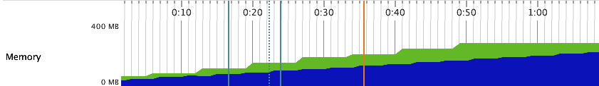

- **原因**

  在 JVM 的参数中 `-Xms` 和 `-Xmx` 设置的不一致，在初始化时只会初始 `-Xms` 大小的空间存储信息，每当空间不够用时再向操作系统申请，这样的话必然要进行一次 GC。另外，如果空间剩余很多时也会进行缩容操作，JVM 通过 `-XX:MinHeapFreeRatio` 和 `-XX:MaxHeapFreeRatio` 来控制扩容和缩容的比例，调节这两个值也可以控制伸缩的时机。整个伸缩的模型理解可以看这个图，当 committed 的空间大小超过了低水位/高水位的大小，capacity 也会随之调整：

  

- **策略** 

  观察 CMS GC 触发时间点 Old/MetaSpace 区的 committed 占比是不是一个固定的值，或者像上文提到的观察总的内存使用率也可以。尽量 **将成对出现的空间大小配置参数设置成固定的** ，如 `-Xms` 和 `-Xmx`，`-XX:MaxNewSize` 和 `-XX:NewSize`，`-XX:MetaSpaceSize` 和 `-XX:MaxMetaSpaceSize` 等。


**场景二：显式GC的去与留**

- **现象**

  除了扩容缩容会触发 CMS GC 之外，还有 Old 区达到回收阈值、MetaSpace 空间不足、Young 区晋升失败、大对象担保失败等几种触发条件，如果这些情况都没有发生却触发了 GC ？这种情况有可能是代码中手动调用了 System.gc 方法，此时可以找到 GC 日志中的 GC Cause 确认下。

- **原因**

  **保留 System.gc**：CMS中使用 Foreground Collector 时将会带来非常长的 STW，在应用程序中 System.gc 被频繁调用，那就非常危险。增加 `-XX:+DisableExplicitGC` 参数则可以禁用。**去掉 System.gc**：禁用掉后会带来另一个内存泄漏的问题，为 DirectByteBuffer 分配空间过程中会显式调用 System.gc ，希望通过 Full GC 来强迫已经无用的 DirectByteBuffer 对象释放掉它们关联的 Native Memory，如Netty等。

- **策略**

  无论是保留还是去掉都会有一定的风险点，不过目前互联网中的 RPC 通信会大量使用 NIO，所以建议保留。此外 JVM 还提供了 `-XX:+ExplicitGCInvokesConcurrent` 和 `-XX:+ExplicitGCInvokesConcurrentAndUnloadsClasses` 参数来将 System.gc 的触发类型从 Foreground 改为 Background，同时 Background 也会做 Reference Processing，这样的话就能大幅降低了 STW 开销，同时也不会发生 NIO Direct Memory OOM。


**场景三：MetaSpace区OOM**

- **现象**

  JVM 在启动后或者某个时间点开始， **MetaSpace 的已使用大小在持续增长，同时每次 GC 也无法释放，调大 MetaSpace 空间也无法彻底解决** 。

- **原因**

  在讨论为什么会 OOM 之前，我们先来看一下这个区里面会存什么数据，Java 7 之前字符串常量池被放到了 Perm 区，所有被 intern 的 String 都会被存在这里，由于 String.intern 是不受控的，所以 `-XX:MaxPermSize` 的值也不太好设置，经常会出现 `java.lang.OutOfMemoryError: PermGen space` 异常，所以在 Java 7 之后常量池等字面量（Literal）、类静态变量（Class Static）、符号引用（Symbols Reference）等几项被移到 Heap 中。而 Java 8 之后 PermGen 也被移除，取而代之的是 MetaSpace。由场景一可知，为了避免弹性伸缩带来的额外 GC 消耗，我们会将 `-XX:MetaSpaceSize` 和 `-XX:MaxMetaSpaceSize` 两个值设置为固定的，但这样也会导致在空间不够的时候无法扩容，然后频繁地触发 GC，最终 OOM。所以关键原因是 **ClassLoader不停地在内存中load了新的Class ，一般这种问题都发生在动态类加载等情况上。**

- **策略**

  可以 dump 快照之后通过 JProfiler 或 MAT 观察 Classes 的 Histogram（直方图） 即可，或者直接通过命令即可定位， jcmd 打几次 Histogram 的图，看一下具体是哪个包下的 Class 增加较多就可以定位。如果无法从整体的角度定位，可以添加 `-XX:+TraceClassLoading` 和 `-XX:+TraceClassUnLoading` 参数观察详细的类加载和卸载信息。


**场景四：过早晋升**

- **现象**

  这种场景主要发生在分代的收集器上面，专业的术语称为“Premature Promotion”。90% 的对象朝生夕死，只有在 Young 区经历过几次 GC 的洗礼后才会晋升到 Old 区，每经历一次 GC 对象的 GC Age 就会增长 1，最大通过 `-XX:MaxTenuringThreshold` 来控制。过早晋升一般不会直接影响 GC，总会伴随着浮动垃圾、大对象担保失败等问题，但这些问题不是立刻发生的，我们可以观察以下几种现象来判断是否发生了过早晋升：

  - **分配速率接近于晋升速率** ，对象晋升年龄较小。

    GC 日志中出现“Desired survivor size 107347968 bytes, **new threshold 1(max 6)** ”等信息，说明此时经历过一次 GC 就会放到 Old 区。

  - **Full GC 比较频繁** ，且经历过一次 GC 之后 Old 区的 **变化比例非常大** 。

    如Old区触发回收阈值是80%，经历一次GC之后下降到了10%，这说明Old区70%的对象存活时间其实很短。

    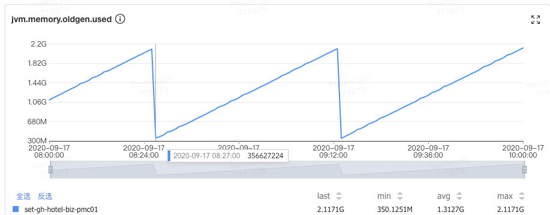

  过早晋升的危害：

  - Young GC 频繁，总的吞吐量下降
  - Full GC 频繁，可能会有较大停顿

- **原因**

  主要的原因有以下两点：

  - **Young/Eden 区过小**： 过小的直接后果就是 Eden 被装满的时间变短，本应该回收的对象参与了 GC 并晋升，Young GC 采用的是复制算法，由基础篇我们知道 copying 耗时远大于 mark，也就是 Young GC 耗时本质上就是 copy 的时间（CMS 扫描 Card Table 或 G1 扫描 Remember Set 出问题的情况另说），没来及回收的对象增大了回收的代价，所以 Young GC 时间增加，同时又无法快速释放空间，Young GC 次数也跟着增加
  - **分配速率过大**： 可以观察出问题前后 Mutator 的分配速率，如果有明显波动可以尝试观察网卡流量、存储类中间件慢查询日志等信息，看是否有大量数据被加载到内存中

- **策略**
  - 如果是 **Young/Eden 区过小** ，可以在总的 Heap 内存不变的情况下适当增大Young区。一般情况下Old的大小应当为活跃对象的2~3倍左右，考虑到浮动垃圾问题最好在3倍左右，剩下的都可以分给Young区

  - 过早晋升优化来看，原配置为Young 1.2G+Old 2.8G，通过观察CMS GC的情况找到存活对象大概为 300~400M，于是调整Old 1.5G左右，剩下2.5G分给Young 区。仅仅调了一个Young区大小参数（`-Xmn`），整个 JVM 一分钟Young GC从26次降低到了11次，单次时间也没有增加，总的GC时间从1100ms降低到了500ms，CMS GC次数也从40分钟左右一次降低到了7小时30分钟一次：

    

    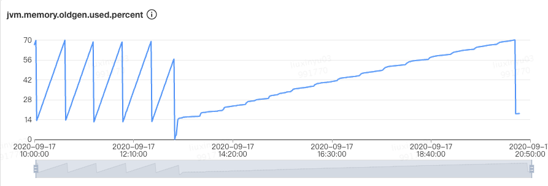

    如果是分配速率过大：

    - **偶发较大** ：通过内存分析工具找到问题代码，从业务逻辑上做一些优化
    - **一直较大** ：当前的 Collector 已经不满足 Mutator 的期望了，这种情况要么扩容 Mutator 的 VM，要么调整 GC 收集器类型或加大空间

- **小结**

  过早晋升问题一般不会特别明显，但日积月累之后可能会爆发一波收集器退化之类的问题，所以我们还是要提前避免掉的，可以看看自己系统里面是否有这些现象，如果比较匹配的话，可以尝试优化一下。一行代码优化的 ROI 还是很高的。如果在观察 Old 区前后比例变化的过程中，发现可以回收的比例非常小，如从 80% 只回收到了 60%，说明我们大部分对象都是存活的，Old 区的空间可以适当调大些。


**场景五：CMS Old GC频繁**

- **现象**

  Old 区频繁的做 CMS GC，但是每次耗时不是特别长，整体最大 STW 也在可接受范围内，但由于 GC 太频繁导致吞吐下降比较多。

- **原因**

  这种情况比较常见，基本都是一次 Young GC 完成后，负责处理 CMS GC 的一个后台线程 concurrentMarkSweepThread 会不断地轮询，使用 `shouldConcurrentCollect()` 方法做一次检测，判断是否达到了回收条件。如果达到条件，使用 `collect_in_background()` 启动一次 Background 模式 GC。轮询的判断是使用 `sleepBeforeNextCycle()` 方法，间隔周期为 `-XX:CMSWaitDuration` 决定，默认为 2s。

- **策略**

  处理这种常规内存泄漏问题基本是一个思路，主要步骤如下：

  

  Dump Diff 和 Leak Suspects 比较直观，这里说下其它几个关键点：

  - **内存 Dump**： 使用 jmap、arthas 等 dump 堆进行快照时记得摘掉流量，同时 **分别在 CMS GC 的发生前后分别 dump 一次** 
  - **分析 Top Component**： 要记得按照对象、类、类加载器、包等多个维度观察Histogram，同时使用 outgoing和incoming分析关联的对象，其次Soft Reference和Weak Reference、Finalizer 等也要看一下
  - **分析 Unreachable**： 重点看一下这个，关注下 Shallow 和 Retained 的大小。如下图所示的一次 GC 优化，就根据 Unreachable Objects 发现了 Hystrix 的滑动窗口问题。

  

  

**场景六：单次CMS Old GC耗时长**

- **现象**

  CMS GC 单次 STW 最大超过 1000ms，不会频繁发生，如下图所示最长达到了 8000ms。某些场景下会引起“雪崩效应”，这种场景非常危险，我们应该尽量避免出现。

  

- **原因**

  CMS在回收的过程中，STW的阶段主要是 Init Mark 和 Final Remark 这两个阶段，也是导致CMS Old GC 最多的原因，另外有些情况就是在STW前等待Mutator的线程到达SafePoint也会导致时间过长，但这种情况较少。

- **策略**

  知道了两个 STW 过程执行流程，我们分析解决就比较简单了，由于大部分问题都出在 Final Remark 过程，这里我们也拿这个场景来举例，主要步骤：

  - **【方向】** 观察详细 GC 日志，找到出问题时 Final Remark 日志，分析下 Reference 处理和元数据处理 real 耗时是否正常，详细信息需要通过 `-XX:+PrintReferenceGC` 参数开启。 **基本在日志里面就能定位到大概是哪个方向出了问题，耗时超过 10% 的就需要关注** 。

  ```shell
  2019-02-27T19:55:37.920+0800: 516952.915: [GC (CMS Final Remark) 516952.915: [ParNew516952.939: [SoftReference, 0 refs, 0.0003857 secs]516952.939: [WeakReference, 1362 refs, 0.0002415 secs]516952.940: [FinalReference, 146 refs, 0.0001233 secs]516952.940: [PhantomReference, 0 refs, 57 refs, 0.0002369 secs]516952.940: [JNI Weak Reference, 0.0000662 secs]
  [class unloading, 0.1770490 secs]516953.329: [scrub symbol table, 0.0442567 secs]516953.373: [scrub string table, 0.0036072 secs][1 CMS-remark: 1638504K(2048000K)] 1667558K(4352000K), 0.5269311 secs] [Times: user=1.20 sys=0.03, real=0.53 secs]
  ```

  - **【根因】** 有了具体的方向我们就可以进行深入的分析，一般来说最容易出问题的地方就是 Reference 中的 FinalReference 和元数据信息处理中的 scrub symbol table 两个阶段，想要找到具体问题代码就需要内存分析工具 MAT 或 JProfiler 了，注意要 dump 即将开始 CMS GC 的堆。在用 MAT 等工具前也可以先用命令行看下对象 Histogram，有可能直接就能定位问题。
    - 对 FinalReference 的分析主要观察 `java.lang.ref.Finalizer` 对象的 dominator tree，找到泄漏的来源。经常会出现问题的几个点有 Socket 的 `SocksSocketImpl` 、Jersey 的 `ClientRuntime`、MySQL 的 `ConnectionImpl` 等等
    - scrub symbol table 表示清理元数据符号引用耗时，符号引用是 Java 代码被编译成字节码时，方法在 JVM 中的表现形式，生命周期一般与 Class 一致，当 `_should_unload_classes` 被设置为 true 时在 `CMSCollector::refProcessingWork()` 中与 Class Unload、String Table 一起被处理

  - **【策略】** 知道 GC 耗时的根因就比较好处理了，这种问题不会大面积同时爆发，不过有很多时候单台 STW 的时间会比较长，如果业务影响比较大，及时摘掉流量，具体后续优化策略如下：
    - FinalReference：找到内存来源后通过优化代码的方式来解决，如果短时间无法定位可以增加 `-XX:+ParallelRefProcEnabled` 对 Reference 进行并行处理
    - symbol table：观察 MetaSpace 区的历史使用峰值，以及每次 GC 前后的回收情况，一般没有使用动态类加载或者 DSL 处理等，MetaSpace 的使用率上不会有什么变化，这种情况可以通过 `-XX:-CMSClassUnloadingEnabled` 来避免 MetaSpace 的处理，JDK8 会默认开启 CMSClassUnloadingEnabled，这会使得 CMS 在 CMS-Remark 阶段尝试进行类的卸载

- **小结**

  正常情况进行的 Background CMS GC，出现问题基本都集中在 Reference 和 Class 等元数据处理上，在 Reference 类的问题处理方面，不管是 FinalReference，还是 SoftReference、WeakReference 核心的手段就是找准时机 dump快照，然后用内存分析工具来分析。Class处理方面目前除了关闭类卸载开关，没有太好的方法。在 G1 中同样有 Reference 的问题，可以观察日志中的 Ref Proc，处理方法与 CMS 类似。


**场景七：内存碎片&收集器退化**

- **现象**

  并发的 CMS GC 算法，退化为 Foreground 单线程串行 GC 模式，STW 时间超长，有时会长达十几秒。其中 CMS 收集器退化后单线程串行 GC 算法有两种：

  - 带压缩动作的算法，称为 MSC，上面我们介绍过，使用标记-清理-压缩，单线程全暂停的方式，对整个堆进行垃圾收集，也就是真正意义上的 Full GC，暂停时间要长于普通 CMS
  - 不带压缩动作的算法，收集 Old 区，和普通的 CMS 算法比较相似，暂停时间相对 MSC 算法短一些

- **原因**

  CMS 发生收集器退化主要有以下几种情况：

  - **晋升失败（Promotion Failed）**

  - **增量收集担保失败**

  - **显式 GC**

  - **并发模式失败（Concurrent Mode Failure）**

- **策略**

  分析到具体原因后，我们就可以针对性解决了，具体思路还是从根因出发，具体解决策略：

  - **内存碎片**： 通过配置 `-XX:UseCMSCompactAtFullCollection=true` 来控制 Full GC 的过程中是否进行空间的整理（默认开启，注意是 Full GC，不是普通 CMS GC），以及 `-XX: CMSFullGCsBeforeCompaction=n` 来控制多少次 Full GC 后进行一次压缩
  - **增量收集**： 降低触发 CMS GC 的阈值，即参数 `-XX:CMSInitiatingOccupancyFraction` 的值，让 CMS GC 尽早执行，以保证有足够的连续空间，也减少 Old 区空间的使用大小，另外需要使用 `-XX:+UseCMSInitiatingOccupancyOnly` 来配合使用，不然 JVM 仅在第一次使用设定值，后续则自动调整
  - **浮动垃圾**： 视情况控制每次晋升对象的大小，或者缩短每次 CMS GC 的时间，必要时可调节 NewRatio 的值。另外使用 `-XX:+CMSScavengeBeforeRemark` 在过程中提前触发一次Young GC，防止后续晋升过多对象

- **小结**

  正常情况下触发并发模式的 CMS GC，停顿非常短，对业务影响很小，但 CMS GC 退化后，影响会非常大，建议发现一次后就彻底根治。只要能定位到内存碎片、浮动垃圾、增量收集相关等具体产生原因，还是比较好解决的，关于内存碎片这块，如果 `-XX:CMSFullGCsBeforeCompaction` 的值不好选取的话，可以使用 `-XX:PrintFLSStatistics` 来观察内存碎片率情况，然后再设置具体的值。最后就是在编码的时候也要避免需要连续地址空间的大对象的产生，如过长的字符串，用于存放附件、序列化或反序列化的 byte 数组等，还有就是过早晋升问题尽量在爆发问题前就避免掉。


**场景八：堆外内存OOM**

- **现象**

  内存使用率不断上升，甚至开始使用 SWAP 内存，同时可能出现 GC 时间飙升，线程被 Block 等现象， **通过 top 命令发现 Java 进程的 RES 甚至超过了** `**-Xmx**` **的大小** 。出现这些现象时，基本可确定是出现堆外内存泄漏。

- **原因**

  JVM 的堆外内存泄漏，主要有两种的原因：

  - 通过 `UnSafe#allocateMemory`，`ByteBuffer#allocateDirect` 主动申请了堆外内存而没有释放，常见于 NIO、Netty 等相关组件
  - 代码中有通过 JNI 调用 Native Code 申请的内存没有释放

- **策略**

  **原因一：主动申请未释放**

  **原因二：通过 JNI 调用的 Native Code 申请的内存未释放**


**场景九：JNI引发的GC问题**

- **现象**

  在 GC 日志中，出现 GC Cause 为 GCLocker Initiated GC。

  ```shell
  2020-09-23T16:49:09.727+0800: 504426.742: [GC (GCLocker Initiated GC) 504426.742: [ParNew (promotion failed): 209716K->6042K(1887488K), 0.0843330 secs] 1449487K->1347626K(3984640K), 0.0848963 secs] [Times: user=0.19 sys=0.00, real=0.09 secs]2020-09-23T16:49:09.812+0800: 504426.827: [Full GC (GCLocker Initiated GC) 504426.827: [CMS: 1341583K->419699K(2097152K), 1.8482275 secs] 1347626K->419699K(3984640K), [Metaspace: 297780K->297780K(1329152K)], 1.8490564 secs] [Times: user=1.62 sys=0.20, real=1.85 secs]
  ```

- **原因**

  JNI（Java Native Interface）意为 Java 本地调用，它允许 Java 代码和其他语言写的 Native 代码进行交互。JNI 如果需要获取 JVM 中的 String 或者数组，有两种方式：

  - 拷贝传递
  - 共享引用（指针），性能更高

  由于 Native 代码直接使用了 JVM 堆区的指针，如果这时发生 GC，就会导致数据错误。因此，在发生此类 JNI 调用时，禁止 GC 的发生，同时阻止其他线程进入 JNI 临界区，直到最后一个线程退出临界区时触发一次 GC。

- **策略**
  - 添加 `-XX+PrintJNIGCStalls` 参数，可以打印出发生 JNI 调用时的线程，进一步分析，找到引发问题的 JNI 调用
  - JNI 调用需要谨慎，不一定可以提升性能，反而可能造成 GC 问题
  - 升级 JDK 版本到 14，避免 [JDK-8048556](https://bugs.openjdk.java.net/browse/JDK-8048556) 导致的重复 GC

