<div style="color:#16b0ff;font-size:50px;font-weight: 900;text-shadow: 5px 5px 10px var(--theme-color);font-family: 'Comic Sans MS';">JAVA</div>

<span style="color:#16b0ff;font-size:20px;font-weight: 900;font-family: 'Comic Sans MS';">Introduction</span>：收纳技术相关的JAVA知识 `JUC`、`Thread`、`Lock`、`I/O` 等总结！

[TOC]

# J.U.C

## 并发特性

JAVA里面进行多线程通信的主要方式就是 `共享内存` 的方式，共享内存主要的关注点有两个：`可见性` 和 `有序性`。加上复合操作的 `原子性`，可以认为JAVA的线程安全性问题主要关注点有3个（JAVA内存模型JMM解决了可见性和有序性的问题，而锁解决了原子性的问题）：`可见性`、`有序性`、`原子性`

-  **原子性（Atomicity）**：在Java中原子性指的是一个或多个操作要么全部执行成功要么全部执行失败
-  **有序性（Ordering）**：程序执行的顺序按照代码的先后顺序执行（处理器可能会对指令进行重排序）
-  **可见性（Visibility）**：指在多线程环境下，当一个线程修改了某一个共享变量的值，其它线程能够立刻知道这个修改


**① 重排序**

指编译器和处理器为了优化程序性能而对指令序列进行重新排序的一种手段。从JAVA源码到最终实际执行的指令序列，会经历下面3种重排序（主要流程）：

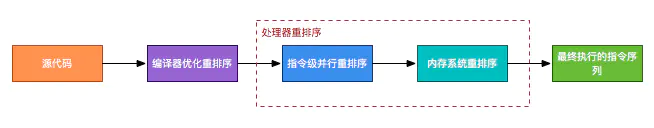

**指令重排序分类**

- **编译器优化的重排序**：编译器在不改变单线程程序语义的前提下，可以重新安排语句的执行顺序;
- **指令级并行的重排序**：现代处理器采用了指令级并行技术来将多条指令重叠执行。如果不存在数据依赖性，处理器可以改变语句对应机器指令的执行顺序;
- **内存系统的重排序**：由于处理器使用缓存和读/写缓冲区，这使得加载和存储操作看上去可能是在乱序执行的。

**② 顺序一致性**

顺序一致性内存模型是一个理论参考模型，在设计的时候，处理器的内存模型和编程语言的内存模型都会以顺序一致性内存模型作为参照。顺序一致性特征如下：

- 一个线程中的所有操作必须按照程序的顺序来执行
- （不管程序是否同步）所有线程都只能看到一个单一的操作执行顺序。在顺序一致性的内存模型中，每个操作必须原子执行并且立刻对所有线程可见


## Unsafe

Java不能直接访问操作系统底层，而是通过本地方法来访问。**Unsafe类提供了硬件级别的原子操作**，主要提供以下功能：

- **通过Unsafe类可以分配内存，可以释放内存**

  类中提供的3个本地方法allocateMemory(申请)、reallocateMemory(扩展)、freeMemory(销毁)分别用于分配内存，扩充内存和释放内存，与C语言中的3个方法对应。

- **可以定位对象某字段的内存位置，也可以修改对象的字段值，即使它是私有的**

  - 字段的定位
  - 数组元素定位

- **挂起与恢复**

  将一个线程进行挂起是通过park方法实现的，调用 park后，线程将一直阻塞直到超时或者中断等条件出现。unpark可以终止一个挂起的线程，使其恢复正常。整个并发框架中对线程的挂起操作被封装在 LockSupport类中，LockSupport类中有各种版本pack方法，但最终都调用了Unsafe.park()方法。

- **CAS操作**

  是通过compareAndSwapXXX方法实现的


## LockSupport

LockSupport 和 CAS 是Java并发包中很多并发工具控制机制的基础，它们底层其实都是依赖Unsafe实现。LockSupport 提供park()和unpark()方法实现阻塞线程和解除线程阻塞。

LockSupport和每个使用它的线程都与一个许可(permit)关联。permit相当于1，0的开关，默认是0，调用一次unpark就加1变成1，调用一次park会消费permit, 也就是将1变成0，同时park立即返回。再次调用park会变成block（因为permit为0了，会阻塞在这里，直到permit变为1）, 这时调用unpark会把permit置为1。每个线程都有一个相关的permit, permit最多只有一个，重复调用unpark也不会积累。

park()和unpark()不会有 `Thread.suspend` 和 `Thread.resume` 所可能引发的死锁问题，由于许可的存在，调用 park 的线程和另一个试图将其 unpark 的线程之间的竞争将保持活性。


## CAS机制

CAS(`Compare And Swap`，即比较并交换)，是解决多线程并行情况下使用锁造成性能损耗的一种机制。其原理是利用`sun.misc.Unsafe.java` 类通过JNI来调用硬件级别的原子操作来实现CAS(即CAS是借助C来调用CPU底层指令实现的)。


**CAS机制=比较并交换+乐观锁机制+锁自旋**

**设计思想**：如果`内存位置` 的值与 `预期原值` 相匹配，那么处理器会自动将该位置值更新为新值，否则处理器不做任何操作。

ReentrantLock、ReentrantReadWriteLock 都是基于 AbstractQueuedSynchronizer (AQS)，而 AQS 又是基于 CAS。CAS 的全称是 Compare And Swap（比较与交换），它是一种无锁算法。synchronized和Lock都采用了悲观锁的机制，而CAS是一种乐观锁的实现。乐观锁的原理就是每次不加锁去执行某项操作，如果发生冲突则失败并重试，直到成功为止，其实本质上不算锁，所以很多地方也称之为**自旋**。乐观锁用到的主要机制就是**CAS**（Compare And Swap）。


**CAS特性**

- 通过JNI借助C来调用CPU底层指令实现
- 非阻塞算法
- 非独占锁


**CAS缺陷**

- **ABA问题**：X线程读到为A；Y线程立刻改为B，又改为A；X线程发现值还是A，此时CAS比较值相等，自旋成功
  - 使用数据乐观锁的方式给它加一个版本号或者时间戳，如使用 `AtomicStampedReference<V>` 解决
- **自旋消耗资源**：多个线程争夺同一个资源时，如果自旋一直不成功，将会一直占用CPU
  - 破坏掉死循环，当超过一定时间或者一定次数时，return退出
- **只能保证一个共享变量的原子操作**
  - 可以加锁来解决
  - 封装成对象类解决，如使用 `AtomicReference<V>` 解决


## AQS框架

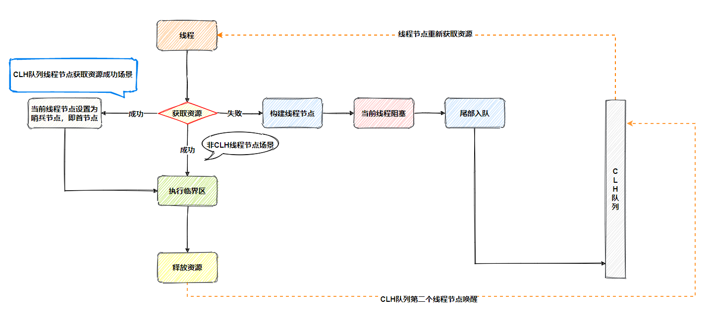

### 基础

AbstractQueuedSynchronizer抽象同步队列简称AQS，它是实现同步器的基础组件，如常用的ReentrantLock、Semaphore、CountDownLatch等。

AQS定义了一套多线程访问共享资源的同步模板，解决了实现同步器时涉及的大量细节问题，能够极大地减少实现工作，虽然大多数开发者可能永远不会使用AQS实现自己的同步器（JUC包下提供的同步器基本足够应对日常开发），但是知道AQS的原理对于架构设计还是很有帮助的，面试还可以吹吹牛，下面是AQS的组成结构。

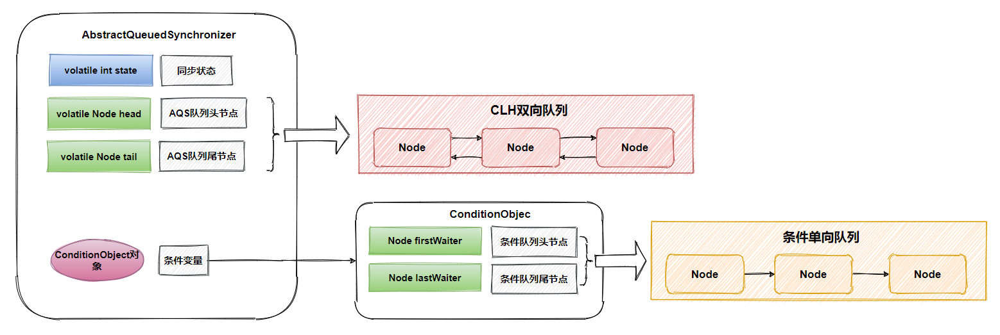

三部分组成：`volatile int state同步状态`、`Node组成的CLH队列`、`ConditionObject条件变量`（包含Node组成的条件单向队列）。


**状态**

- `getState()`：返回同步状态
- `setState(int newState)`：设置同步状态
- `compareAndSetState(int expect, int update)`：使用CAS设置同步状态
- `isHeldExclusively()`：当前线程是否持有资源


**独占资源（不响应线程中断）**

- `tryAcquire(int arg)`：独占式获取资源，子类实现
- `acquire(int arg)`：独占式获取资源模板
- `tryRelease(int arg)`：独占式释放资源，子类实现
- `release(int arg)`：独占式释放资源模板


**共享资源（不响应线程中断）**

- `tryAcquireShared(int arg)`：共享式获取资源，返回值大于等于0则表示获取成功，否则获取失败，子类实现
- `acquireShared(int arg)`：共享形获取资源模板
- `tryReleaseShared(int arg)`：共享式释放资源，子类实现
- `releaseShared(int arg)`：共享式释放资源模板


### 同步状态

在AQS中维护了一个同步状态变量state，getState函数获取同步状态，setState、compareAndSetState函数修改同步状态，对于AQS来说，线程同步的关键是对state的操作，可以说获取、释放资源是否成功都是由state决定的，比如state>0代表可获取资源，否则无法获取，所以state的具体语义由实现者去定义，现有的ReentrantLock、ReentrantReadWriteLock、Semaphore、CountDownLatch定义的state语义都不一样。

- ReentrantLock的state用来表示是否有锁资源
- ReentrantReadWriteLock的state高16位代表读锁状态，低16位代表写锁状态
- Semaphore的state用来表示可用信号的个数
- CountDownLatch的state用来表示计数器的值


### CLH队列

CLH是AQS内部维护的FIFO（先进先出）双端双向队列（方便尾部节点插入），基于链表数据结构，当一个线程竞争资源失败，就会将等待资源的线程封装成一个Node节点，通过CAS原子操作插入队列尾部，最终不同的Node节点连接组成了一个CLH队列，所以说AQS通过CLH队列管理竞争资源的线程，个人总结CLH队列具有如下几个优点：

- 先进先出保证了公平性
- 非阻塞的队列，通过自旋锁和CAS保证节点插入和移除的原子性，实现无锁快速插入
- 采用了自旋锁思想，所以CLH也是一种基于链表的可扩展、高性能、公平的自旋锁


### Node内部类

`Node`是`AQS`的内部类，每个等待资源的线程都会封装成`Node`节点组成`CLH`队列、等待队列，所以说`Node`是非常重要的部分，理解它是理解`AQS`的第一步。

**waitStatus等待状态如下**

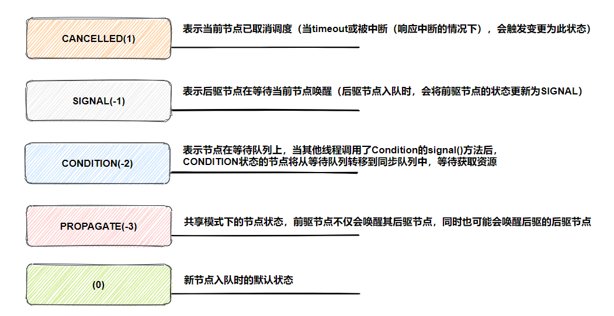

**nextWaiter特殊标记**

- **`Node`在`CLH`队列时，`nextWaiter`表示共享式或独占式标记**
- **`Node`在条件队列时，`nextWaiter`表示下个`Node`节点指针**


### 流程概述

线程获取资源失败，封装成`Node`节点从`CLH`队列尾部入队并阻塞线程，某线程释放资源时会把`CLH`队列首部`Node`节点关联的线程唤醒（**此处的首部是指第二个节点，后面会细说**），再次获取资源。

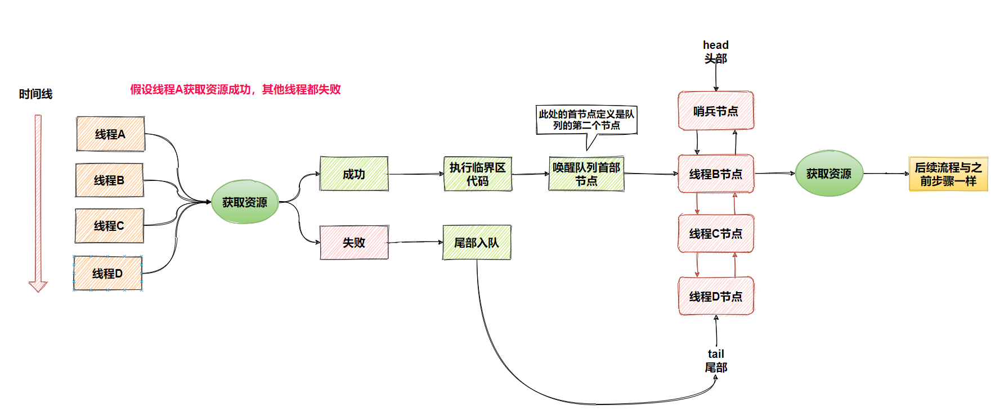


### 入队

获取资源失败的线程需要封装成`Node`节点，接着尾部入队，在`AQS`中提供`addWaiter`函数完成`Node`节点的创建与入队。

```java
/**
  * @description:  Node节点入队-CLH队列
  * @param mode 标记Node.EXCLUSIVE独占式 or Node.SHARED共享式
  */
private Node addWaiter(Node mode) {
        // 根据当前线程创建节点，等待状态为0
        Node node = new Node(Thread.currentThread(), mode);
        // 获取尾节点
        Node pred = tail;
        if (pred != null) {
            // 如果尾节点不等于null，把当前节点的前驱节点指向尾节点
            node.prev = pred;
            // 通过CAS把尾节点指向当前节点
            if (compareAndSetTail(pred, node)) {
                // 之前尾节点的下个节点指向当前节点
                pred.next = node;
                return node;
            }
        }

        // 如果添加失败或队列不存在，执行end函数
        enq(node);
        return node;
}
```

添加节点的时候，如果从`CLH`队列已经存在，通过`CAS`快速将当前节点添加到队列尾部，如果添加失败或队列不存在，则指向`enq`函数自旋入队。

```java
/**
  * @description: 自旋cas入队
  * @param node 节点
  */
private Node enq(final Node node) {
        for (;;) { //循环
            //获取尾节点
            Node t = tail;
            if (t == null) {
                //如果尾节点为空，创建哨兵节点，通过cas把头节点指向哨兵节点
                if (compareAndSetHead(new Node()))
                    //cas成功，尾节点指向哨兵节点
                    tail = head;
            } else {
                //当前节点的前驱节点设指向之前尾节点
                node.prev = t;
                //cas设置把尾节点指向当前节点
                if (compareAndSetTail(t, node)) {
                    //cas成功，之前尾节点的下个节点指向当前节点
                    t.next = node;
                    return t;
                }
            }
        }
}
```

通过自旋`CAS`尝试往队列尾部插入节点，直到成功，自旋过程如果发现`CLH`队列不存在时会初始化`CLH`队列，入队过程流程如下图：

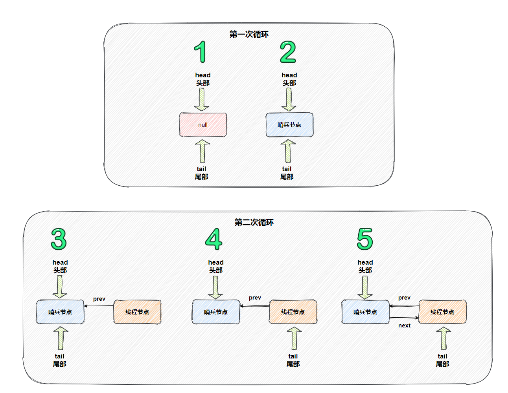

第一次循环

- 刚开始C L H队列不存在，head与tail都指向null
- 要初始化C L H队列，会创建一个哨兵节点，head与tail都指向哨兵节点

第二次循环

- 当前线程节点的前驱节点指向尾部节点（哨兵节点）
- 设置当前线程节点为尾部，tail指向当前线程节点
- 前尾部节点的后驱节点指向当前线程节点（当前尾部节点）


最后结合addWaiter与enq函数的入队流程图如下
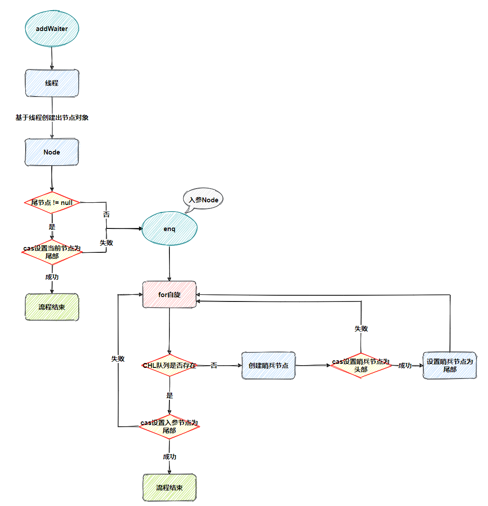

### 出队

`CLH`队列中的节点都是获取资源失败的线程节点，当持有资源的线程释放资源时，会将`head.next`指向的线程节点唤醒（**`CLH`队列的第二个节点**），如果唤醒的线程节点获取资源成功，线程节点清空信息设置为头部节点（**新哨兵节点**），原头部节点出队（**原哨兵节点**）**acquireQueued函数中的部分代码**

```java
//1.获取前驱节点
final Node p = node.predecessor();
//如果前驱节点是首节点，获取资源（子类实现）
if (p == head && tryAcquire(arg)) {
    //2.获取资源成功，设置当前节点为头节点，清空当前节点的信息，把当前节点变成哨兵节点
    setHead(node);
    //3.原来首节点下个节点指向为null
    p.next = null; // help GC
    //4.非异常状态，防止指向finally逻辑
    failed = false;
    //5.返回线程中断状态
    return interrupted;
}

private void setHead(Node node) {
    //节点设置为头部
    head = node;
    //清空线程
    node.thread = null;
    //清空前驱节点
    node.prev = null;
}
```

只需要关注`1~3`步骤即可，过程非常简单，假设获取资源成功，更换头部节点，并把头部节点的信息清除变成哨兵节点，注意这个过程是不需要使用`CAS`来保证，因为只有一个线程能够成功获取到资源。

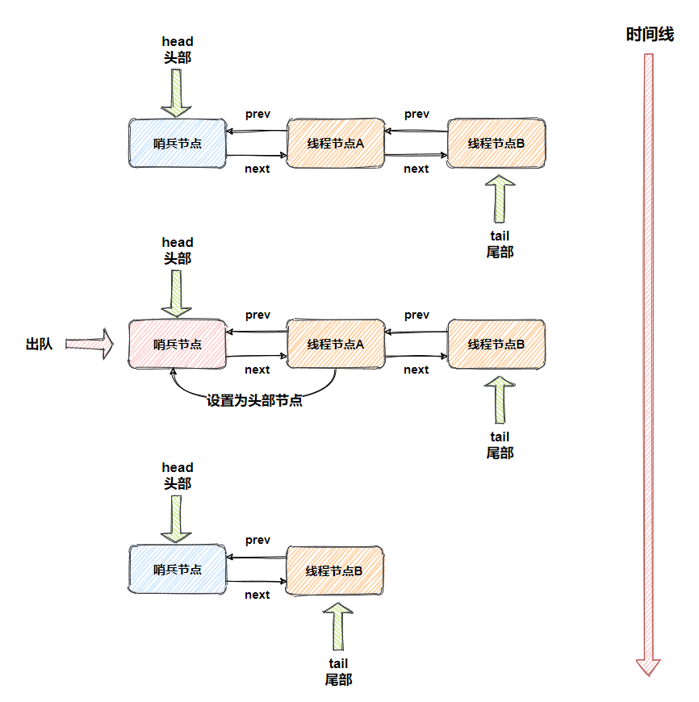


### 条件变量

Object的wait、notify函数是配合Synchronized锁实现线程间同步协作的功能，A Q S的ConditionObject条件变量也提供这样的功能，通过ConditionObject的await和signal两类函数完成。不同于Synchronized锁，一个A Q S可以对应多个条件变量，而Synchronized只有一个。
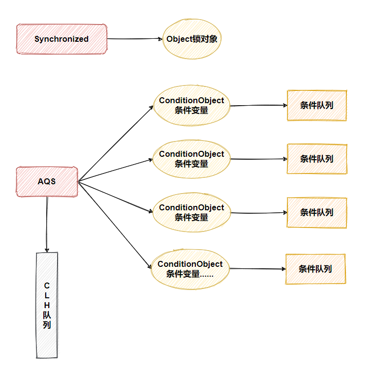

如上图所示，ConditionObject内部维护着一个单向条件队列，不同于C H L队列，条件队列只入队执行await的线程节点，并且加入条件队列的节点，不能在C H L队列， 条件队列出队的节点，会入队到C H L队列。

当某个线程执行了ConditionObject的await函数，阻塞当前线程，线程会被封装成Node节点添加到条件队列的末端，其他线程执行ConditionObject的signal函数，会将条件队列头部线程节点转移到C H L队列参与竞争资源，具体流程如下图
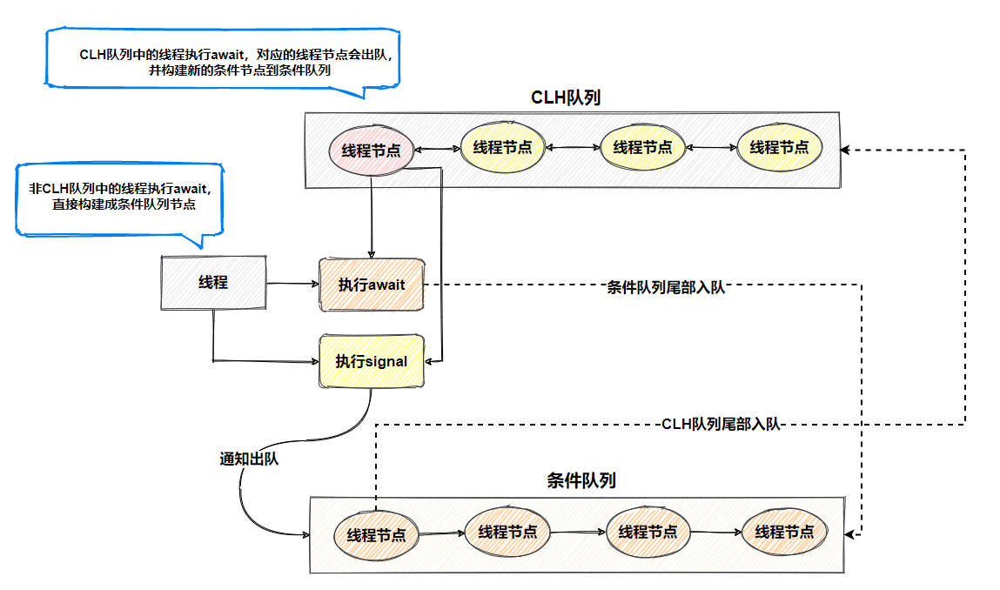

### 模板方法

`AQS`采用了模板方法设计模式，提供了两类模板，一类是独占式模板，另一类是共享形模式，对应的模板函数如下

- 独占式
  - **`acquire`获取资源**
  - **`release`释放资源**
- 共享式
  - **`acquireShared`获取资源**
  - **`releaseShared`释放资源**

#### 独占式获取资源

`acquire`是个模板函数，模板流程就是线程获取共享资源，如果获取资源成功，线程直接返回，否则进入`CLH`队列，直到获取资源成功为止，且整个过程忽略中断的影响，`acquire`函数代码如下

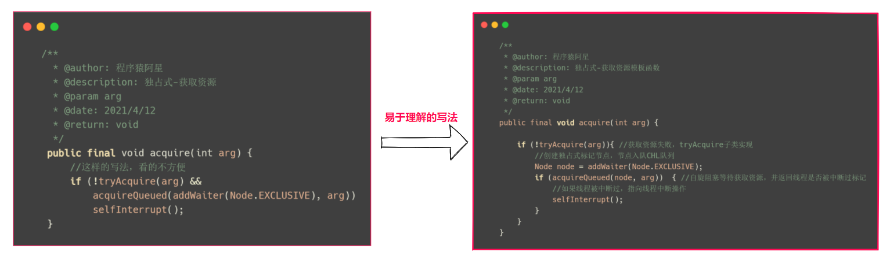

- 执行tryAcquire函数，tryAcquire是由子类实现，代表获取资源是否成功，如果资源获取失败，执行下面的逻辑
- 执行addWaiter函数（前面已经介绍过），根据当前线程创建出独占式节点，并入队CLH队列
- 执行acquireQueued函数，自旋阻塞等待获取资源
- 如果acquireQueued函数中获取资源成功，根据线程是否被中断状态，来决定执行线程中断逻辑


`acquire`函数的大致流程都清楚了，下面来分析下`acquireQueued`函数，线程封装成节点后，是如何自旋阻塞等待获取资源的，代码如下：

```java
/**
     * @description: 自旋机制等待获取资源
     * @param node
     * @param arg
     * @return: boolean
     */
    final boolean acquireQueued(final Node node, int arg) {
        //异常状态，默认是
        boolean failed = true;
        try {
            //该线程是否中断过，默认否
            boolean interrupted = false;
            for (;;) {//自旋
                //获取前驱节点
                final Node p = node.predecessor();
                //如果前驱节点是首节点，获取资源（子类实现）
                if (p == head && tryAcquire(arg)) {
                    //获取资源成功，设置当前节点为头节点，清空当前节点的信息，把当前节点变成哨兵节点
                    setHead(node);
                    //原来首节点下个节点指向为null
                    p.next = null; // help GC
                    //非异常状态，防止指向finally逻辑
                    failed = false;
                    //返回线程中断状态
                    return interrupted;
                }
                /**
                 * 如果前驱节点不是首节点，先执行shouldParkAfterFailedAcquire函数，shouldParkAfterFailedAcquire做了三件事
                 * 1.如果前驱节点的等待状态是SIGNAL，返回true，执行parkAndCheckInterrupt函数，返回false
                 * 2.如果前驱节点的等大状态是CANCELLED，把CANCELLED节点全部移出队列（条件节点）
                 * 3.以上两者都不符合，更新前驱节点的等待状态为SIGNAL，返回false
                 */
                if (shouldParkAfterFailedAcquire(p, node) &&
                    //使用LockSupport类的静态方法park挂起当前线程，直到被唤醒，唤醒后检查当前线程是否被中断，返回该线程中断状态并重置中断状态
                    parkAndCheckInterrupt())
                    //该线程被中断过
                    interrupted = true;
                }
            } finally {
                // 尝试获取资源失败并执行异常，取消请求，将当前节点从队列中移除
                if (failed)
                    cancelAcquire(node);
            }
    }
```

一图胜千言，核心流程图如下:

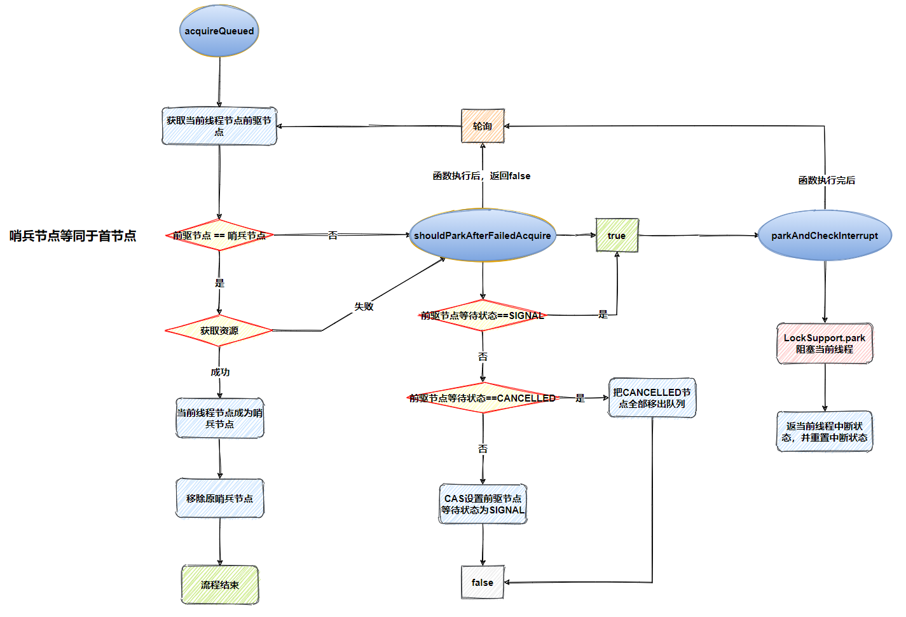


#### 独占式释放资源

有获取资源，自然就少不了释放资源，`A Q S`中提供了`release`模板函数来释放资源，模板流程就是线程释放资源成功，唤醒`CLH`队列的第二个线程节点（**首节点的下个节点**），代码如下

```java
    /**
     * @description: 独占式-释放资源模板函数
     * @param arg
     * @return: boolean
     */
    public final boolean release(int arg) {

        if (tryRelease(arg)) {//释放资源成功，tryRelease子类实现
            //获取头部线程节点
            Node h = head;
            if (h != null && h.waitStatus != 0) //头部线程节点不为null，并且等待状态不为0
                //唤醒CHL队列第二个线程节点
                unparkSuccessor(h);
            return true;
        }
        return false;
    }
    
    
    private void unparkSuccessor(Node node) {
        //获取节点等待状态
        int ws = node.waitStatus;
        if (ws < 0)
            //cas更新节点状态为0
            compareAndSetWaitStatus(node, ws, 0);
    
        //获取下个线程节点        
        Node s = node.next;
        if (s == null || s.waitStatus > 0) { //如果下个节点信息异常，从尾节点循环向前获取到正常的节点为止，正常情况不会执行
            s = null;
            for (Node t = tail; t != null && t != node; t = t.prev)
                if (t.waitStatus <= 0)
                    s = t;
        }
        if (s != null)
            //唤醒线程节点
            LockSupport.unpark(s.thread);
        }
    }
```

`release`逻辑非常简单，流程图如下：

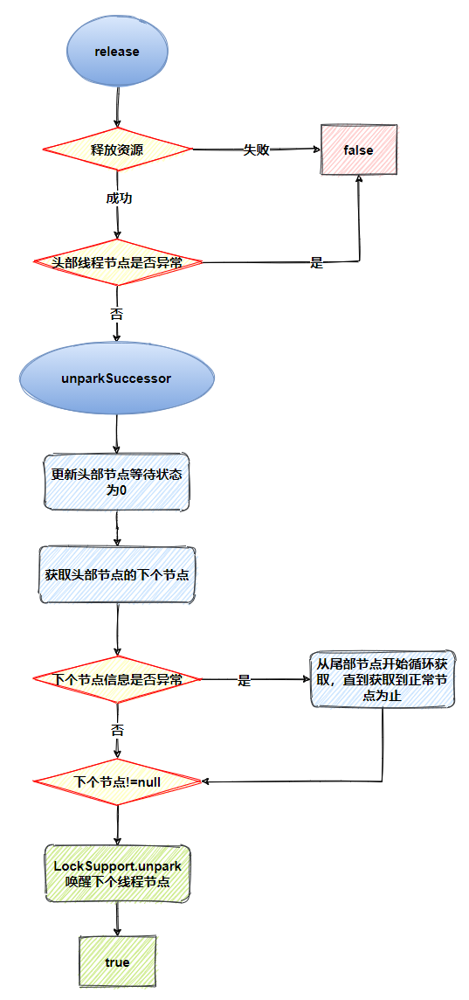


#### 共享式获取资源

`acquireShared`是个模板函数，模板流程就是线程获取共享资源，如果获取到资源，线程直接返回，否则进入`CLH`队列，直到获取到资源为止，且整个过程忽略中断的影响，`acquireShared`函数代码如下

```java
  /**
     * @description: 共享式-获取资源模板函数
     * @param arg
     * @return: void
     */
    public final void acquireShared(int arg) {
        /**
         * 1.负数表示失败
         * 2.0表示成功，但没有剩余可用资源
         * 3.正数表示成功且有剩余资源
         */
        if (tryAcquireShared(arg) < 0) //获取资源失败，tryAcquireShared子类实现
            //自旋阻塞等待获取资源
            doAcquireShared(arg);
    }
```

`doAcquireShared`函数与独占式的`acquireQueued`函数逻辑基本一致，唯一的区别就是下图红框部分


- **节点的标记是共享式**
- **获取资源成功，还会唤醒后续资源，因为资源数可能`>0`，代表还有资源可获取，所以需要做后续线程节点的唤醒**


#### 共享式释放资源

`AQS`中提供了`releaseShared`模板函数来释放资源，模板流程就是线程释放资源成功，唤醒CHL队列的第二个线程节点（**首节点的下个节点**），代码如下

```java
    /**
     * @description: 共享式-释放资源模板函数
     * @param arg
     * @return: boolean
     */
    public final boolean releaseShared(int arg) {
        if (tryReleaseShared(arg)) {//释放资源成功，tryReleaseShared子类实现
            //唤醒后继节点
            doReleaseShared();
            return true;
        }
        return false;
    }
    
    private void doReleaseShared() {
        for (;;) {
            //获取头节点
            Node h = head;
            if (h != null && h != tail) {
                int ws = h.waitStatus;
    
                if (ws == Node.SIGNAL) {//如果头节点等待状态为SIGNAL
                    if (!compareAndSetWaitStatus(h, Node.SIGNAL, 0))//更新头节点等待状态为0
                        continue;            // loop to recheck cases
                    //唤醒头节点下个线程节点
                    unparkSuccessor(h);
                }
                //如果后继节点暂时不需要被唤醒，更新头节点等待状态为PROPAGATE
                else if (ws == 0 &&
                         !compareAndSetWaitStatus(h, 0, Node.PROPAGATE))
                    continue;               
            }
            if (h == head)              
                break;
        }
    }
```

与独占式释放资源区别不大，都是唤醒头节点的下个节点。


**什么是AQS？**

`AQS` 的全称是 `AbstractQueuedSynchronizer`，即`抽象队列同步器`。是Java并发工具的基础，采用乐观锁，通过CAS与自旋轻量级的获取锁。维护了一个volatile int state（代表共享资源）和一个FIFO线程等待队列（多线程争用资源被阻塞时会进入此队列）。很多JUC包，比如ReentrantLock、Semaphore、CountDownLatch等并发类均是继承AQS，通过AQS的模板方法，来实现的。


**核心思想**

- 若请求的共享资源空闲，则将当前请求的线程设置为有效的工作线程，并将共享资源设置为锁定状态
- 若共享资源被占用，则需要阻塞等待唤醒机制保证锁的分配


**工作原理**

**AQS = `同步状态（volatile int state）` + `同步队列（即等待队列，FIFO的CLH队列）` + `条件队列（ConditionObject）`**

- **state**：代表共享资源。`volatile` 保证并发读，`CAS` 保证并发写
- **同步队列（即等待队列，CLH队列）**：是CLH变体的虚拟双向队列（先进先出FIFO）来等待获取共享资源。当前线程可以通过signal和signalAll将条件队列中的节点转移到同步队列中
- **条件队列（ConditionObject）**：当前线程存在于同步队列的头节点，可以通过await从同步队列转移到条件队列中


**实现原理**

- 通过CLH队列的变体：FIFO双向队列实现的
- 每个请求资源的线程被包装成一个节点来实现锁的分配
- 通过`volatile`的`int`类型的成员变量`state`表示同步状态
- 通过FIFO队列完成资源获取的排队工作
- 通过CAS完成对`state`的修改


### 共享方式

AQS定义两种资源共享方式。无论是独占锁还是共享锁，本质上都是对AQS内部的一个变量`state`的获取。`state`是一个原子的int变量，用来表示锁状态、资源数等。

**① 独占锁(`Exclusive`)模式**：只能被一个线程获取到(`Reentrantlock`)。

模式.png)


**② 共享锁(`Share`)模式**：可以被多个线程同时获取(`Semaphore/CountDownLatch/ReadWriteLock`)。

模式.png)


### state机制

提供`volatile`变量`state`，用于同步线程之间的共享状态。通过 `CAS` 和 `volatile` 保证其原子性和可见性。核心要点：

- state 用 `volatile` 修饰，保证多线程中的可见性
- `getState()` 和 `setState()` 方法**采用final修饰**，限制AQS的子类重写它们两
- `compareAndSetState()` 方法采用乐观锁思想的CAS算法，也是采用final修饰的，不允许子类重写


**state应用案例**：

| 案例                     | 描述                                                         |
| ------------------------ | ------------------------------------------------------------ |
| `Semaphore`              | 使用AQS同步状态来保存信号量的当前计数。tryRelease会增加计数，acquireShared会减少计数 |
| `CountDownLatch`         | 使用AQS同步状态来表示计数。计数为0时，所有的Acquire操作（CountDownLatch的await方法）才可以通过 |
| `ReentrantReadWriteLock` | 使用AQS同步状态中的16位保存写锁持有的次数，剩下的16位用于保存读锁的持有次数 |
| `ThreadPoolExecutor`     | Worker利用AQS同步状态实现对独占线程变量的设置（tryAcquire和tryRelease） |
| `ReentrantLock`          | 使用AQS保存锁重复持有的次数。当一个线程获取锁时，ReentrantLock记录当前获得锁的线程标识，用于检测是否重复获取，以及错误线程试图解锁操作时异常情况的处理 |


### 双队列

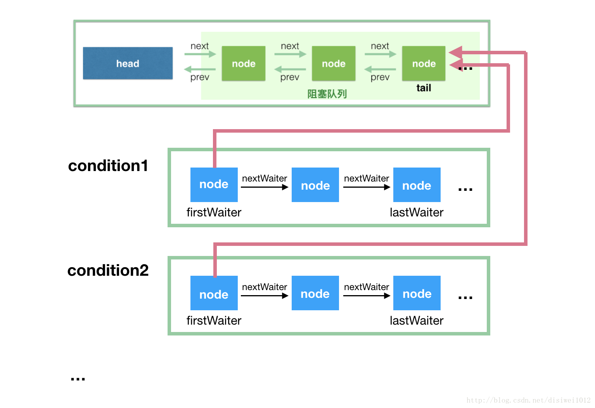

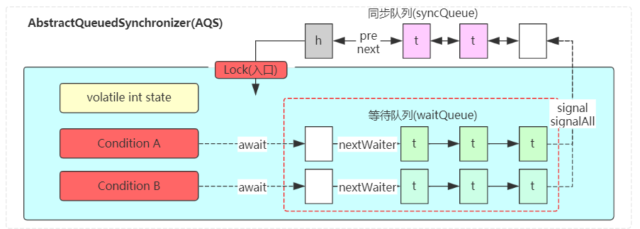

- **同步队列（syncQueue）：管理多个线程的休眠与唤醒**
- **条件队列（waitQueue）：类似wait与signal作用，实现在使用锁时对线程管理**


**注意**

- 同步队列与条件队列节点可相互转化
- 一个线程只能存在于两个队列中的一个


#### 同步队列

**同步队列是用来管理多个线程的休眠与唤醒**。

同步队列依赖一个双向链表（CHL）来完成同步状态的管理，当前线程获取同步状态失败后，同步器会将线程构建成一个节点，并将其加入同步队列中。通过`signal`或`signalAll`将条件队列中的节点转移到同步队列。（由条件队列转化为同步队列）

结构.png)

如果没有锁竞争，线程可以直接获取到锁，就不会进入同步队列。即没有锁竞争时，同步队列(syncQueue)是空的，当存在锁竞争时，线程会进入到同步队列中。一旦进入到同步队列中，就会有线程切换。标准的 CHL 无锁队列是单向链表，同步队列(syncQueue) 在 CHL 基础上做了改进：

- **同步队列是双向链表**。和二叉树一样，双向链表目前也没有无锁算法的实现。双向链表需要同时设置前驱和后继结点，这两次操作只能保证一个是原子性的

- **node.pre一定可以遍历所有结点，是线程安全的**。而后继结点 node.next 则是线程不安全的。也就是说，node.pre 一定可以遍历整个链表，而 node.next 则不一定


#### 条件队列

**条件队列是类似wait与signal作用，实现在使用锁时对线程管理。且由于实现了Condition，对线程的管理可更加细化**。

当线程存在于同步队列的头结点时，调用 `await` 方法进行阻塞（从同步队列转化到条件队列）。Condition条件队列(`waitQueue`)要比Lock同步队列(`syncQueue`)简单很多，最重要的原因是 `waitQueue` 的操作都是在获取锁的线程中执行，不存在数据竞争的问题。

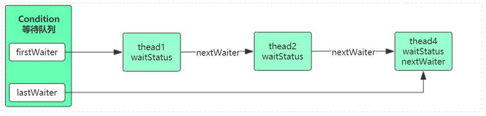

ConditionObject重要的方法说明：

- **await**：阻塞线程并放弃锁，加入到等待队列中
- **signal**：唤醒等待线程，没有特殊的要求，尽量使用 signalAll
- **addConditionWaiter**：将结点(状态为 CONDITION)添加到等待队列 waitQueue 中，不存在锁竞争
- **fullyRelease**：释放锁，并唤醒后继等待线程
- **isOnSyncQueue**：根据结点是否在同步队列上，判断等待线程是否已经被唤醒
- **acquireQueued**：Lock 接口中的方法，通过同步队列方法竞争锁
- **unlinkCancelledWaiters**：清理取消等待的线程


### 框架架构图


**常见问题**

**问题1：state为什么要提供setState和compareAndSetState两种修改状态的方法？**

这个问题，关键是修改状态时是否存在数据竞争，如果有则必须使用 compareAndSetState。

- lock.lock() 获取锁时会发生数据竞争，必须使用 CAS 来保障线程安全，也就是 compareAndSetState 方法
- lock.unlock() 释放锁时，线程已经获取到锁，没有数据竞争，也就可以直接使用 setState 修改锁的状态

**问题2：AQS为什么选择node.prev前驱结点的原子性，而node.next后继结点则是辅助结点？**

- next 域：需要修改二处来保证原子性，一是 tail.next；二是 tail 指针
- prev 域：只需要修改一处来保证原子性，就是 tail 指针。你可能会说不需要修改 node.prev 吗？当然需要，但 node 还没添加到链表中，其 node.prev 修改并没有锁竞争的问题，将 tail 指针指向 node 时，如果失败会通过自旋不断尝试

**问题3：AQS明知道node.next有可见性问题，为什么还要设计成双向链表？**

唤醒同步线程时，如果有后继结点，那么时间复杂为 O(1)。否则只能只反向遍历，时间复杂度为 O(n)。以下两种情况，则认为 node.next 不可靠，需要从 tail 反向遍历。

- node.next=null：可能结点刚刚插入链表中，node.next 仍为空。此时有其它线程通过 unparkSuccessor 来唤醒该线程
- node.next.waitStatus>0：结点已经取消，next 值可能已经改变


## Condition

Condition的作用是对锁进行更精确的控制。Condition中的await()方法相当于Object的wait()方法，Condition中的signal()方法相当于Object的notify()方法，Condition中的signalAll()相当于Object的notifyAll()方法。不同的是，Object中的wait(),notify(),notifyAll()方法是和"同步锁"(synchronized关键字)捆绑使用的；而Condition是需要与"互斥锁"/"共享锁"捆绑使用的。


## volatile

Java 语言提供了一种稍弱的同步机制，即 volatile 变量，用来确保将变量的更新操作通知到其他线程。volatile 变量具备两种特性，volatile 变量不会被缓存在寄存器或者对其他处理器不可见的地方，因此在读取 volatile 类型的变量时总会返回最新写入的值。


**volatile特性与原理**

- **可见性**：volatile修饰的变量，JVM保证了每次都跳过工作内存和缓存行（CPU Cache）来读取主内存中的最新值
- **有序性**：即JVM使用内存屏障来禁止了该变量操作的指令重排序优化
- **volatile性能**：volatile的读性能消耗与普通变量几乎相同，但是写操作稍慢，因为它需要在本地代码中插入许多内存屏障指令来保证处理器不发生乱序执行
- **内存屏障**：加入volatile关键字时，会多出一个lock前缀指令，lock前缀指令相当于一个内存屏障（也称内存栅栏）
- **轻量级同步机制**：Java提供了一种稍弱同步机制，即volatile变量，是一种比sychronized关键字更轻量级的同步机制
- **禁止重排序**：volatile 禁止了指令重排


**使用场景**

- 状态标记量

- DCL（Double Check Lock）


**CPU缓存**

CPU缓存的出现主要是为了解决CPU运算速度与内存读写速度不匹配的矛盾，因为CPU运算速度要比内存读写速度快得多。按照读取顺序与CPU结合的紧密程度，CPU缓存可分为：

- **一级缓存**：简称L1 Cache，位于CPU内核的旁边，是与CPU结合最为紧密的CPU缓存
- **二级缓存**：简称L2 Cache，分内部和外部两种芯片，内部芯片二级缓存运行速度与主频相同，外部芯片二级缓存运行速度则只有主频的一半
- **三级缓存**：简称L3 Cache，部分高端CPU才有


**volatile的特性**

- 保证了线程可见性，不保证原子性，保证一定的有序性（禁止指令重排序）
- 在JVM底层volatile是采用“内存屏障”来实现的
- volatile常用场景：状态标记、DCL（双重检查锁，Double Check）
- volatile不会引起线程上下文的切换和调度
- 基于lock前缀指令，相当于内存屏障（内存栅栏）


## lambda

### 函数式接口

函数接口是只有一个抽象方法的接口，用作 Lambda 表达式的类型。使用@FunctionalInterface注解修饰的类，编译器会检测该类是否只有一个抽象方法或接口，否则，会报错。可以有多个默认方法，静态方法。JAVA8自带的常用函数式接口：

| 函数接口       | 抽象方法        | 功能                   | 参数  | 返回类型 | 示例                |
| -------------- | --------------- | ---------------------- | ----- | -------- | ------------------- |
| Predicate      | test(T t)       | 判断真假               | T     | boolean  | 身高大于185cm吗？   |
| Consumer       | accept(T t)     | 消费消息               | T     | void     | 输出一个值          |
| Function       | R apply(T t)    | 将T映射为R（转换功能） | T     | R        | 取student对象的名字 |
| Supplier       | T get()         | 生产消息               | None  | T        | 工厂方法            |
| UnaryOperator  | T apply(T t)    | 一元操作               | T     | T        | 逻辑非（!）         |
| BinaryOperator | apply(T t, U u) | 二元操作               | (T,T) | (T)      | 求两个数的乘积（*） |


### 常用的流

#### collect

**将流转换为集合。有toList()、toSet()、toMap()等，及早求值**。

```java
public class TestCase {
    public static void main(String[] args) {
        List<Student> studentList = Stream.of(new Student("路飞", 22, 175), 
                                              new Student("红发", 40, 180), new Student("白胡子", 50, 185)).collect(Collectors.toList());
        System.out.println(studentList);
    }
}

// 输出结果
// [Student{name='路飞', age=22, stature=175, specialities=null}, 
// Student{name='红发', age=40, stature=180, specialities=null}, 
// Student{name='白胡子', age=50, stature=185, specialities=null}]
```


#### filter

顾名思义，起**过滤筛选**的作用。**内部就是Predicate接口。惰性求值。**

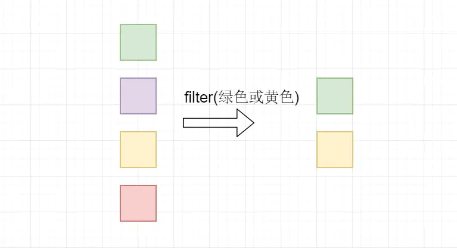

```java
public class TestCase {
    public static void main(String[] args) {
        List<Student> students = new ArrayList<>(3);
        students.add(new Student("路飞", 22, 175));
        students.add(new Student("红发", 40, 180));
        students.add(new Student("白胡子", 50, 185));

        List<Student> list = students.stream()
            .filter(stu -> stu.getStature() < 180)
            .collect(Collectors.toList());
        System.out.println(list);
    }
}

// 输出结果
// [Student{name='路飞', age=22, stature=175, specialities=null}]
```


#### map

**转换功能，内部就是Function接口。惰性求值。**


```java
public class TestCase {
    public static void main(String[] args) {
        List<Student> students = new ArrayList<>(3);
        students.add(new Student("路飞", 22, 175));
        students.add(new Student("红发", 40, 180));
        students.add(new Student("白胡子", 50, 185));

        List<String> names = students.stream().map(student -> student.getName())
                .collect(Collectors.toList());
        System.out.println(names);
    }
}

// 输出结果
// [路飞, 红发, 白胡子]
```

例子中将student对象转换为String对象，获取student的名字。


#### flatMap

**将多个Stream合并为一个Stream。惰性求值。**

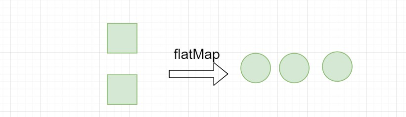

```java
public class TestCase {
    public static void main(String[] args) {
        List<Student> students = new ArrayList<>(3);
        students.add(new Student("路飞", 22, 175));
        students.add(new Student("红发", 40, 180));
        students.add(new Student("白胡子", 50, 185));

        List<Student> studentList = Stream.of(students,
                asList(new Student("艾斯", 25, 183),
                        new Student("雷利", 48, 176)))
                .flatMap(students1 -> students1.stream()).collect(Collectors.toList());
        System.out.println(studentList);
    }
}

// 输出结果
// [Student{name='路飞', age=22, stature=175, specialities=null}, 
// Student{name='红发', age=40, stature=180, specialities=null}, 
// Student{name='白胡子', age=50, stature=185, specialities=null}, 
// Student{name='艾斯', age=25, stature=183, specialities=null},
// Student{name='雷利', age=48, stature=176, specialities=null}]
```

调用Stream.of的静态方法将两个list转换为Stream，再通过flatMap将两个流合并为一个。


#### max和min

我们经常会在集合中**求最大或最小值**，使用流就很方便。**及早求值。**

```java
public class TestCase {
    public static void main(String[] args) {
        List<Student> students = new ArrayList<>(3);
        students.add(new Student("路飞", 22, 175));
        students.add(new Student("红发", 40, 180));
        students.add(new Student("白胡子", 50, 185));

        Optional<Student> max = students.stream()
            .max(Comparator.comparing(stu -> stu.getAge()));
        Optional<Student> min = students.stream()
            .min(Comparator.comparing(stu -> stu.getAge()));
        //判断是否有值
        if (max.isPresent()) {
            System.out.println(max.get());
        }
        if (min.isPresent()) {
            System.out.println(min.get());
        }
    }
}

// 输出结果
// Student{name='白胡子', age=50, stature=185, specialities=null}
// Student{name='路飞', age=22, stature=175, specialities=null}
```

**max、min接收一个Comparator**（例子中使用java8自带的静态函数，只需要传进需要比较值即可），并且返回一个Optional对象，该对象是java8新增的类，专门为了防止null引发的空指针异常。可以使用max.isPresent()判断是否有值；可以使用max.orElse(new Student())，当值为null时就使用给定值；也可以使用max.orElseGet(() -> new Student());这需要传入一个Supplier的lambda表达式。


#### count

**统计功能，一般都是结合filter使用，因为先筛选出我们需要的再统计即可。及早求值。**

```java
public class TestCase {
    public static void main(String[] args) {
        List<Student> students = new ArrayList<>(3);
        students.add(new Student("路飞", 22, 175));
        students.add(new Student("红发", 40, 180));
        students.add(new Student("白胡子", 50, 185));

        long count = students.stream().filter(s1 -> s1.getAge() < 45).count();
        System.out.println("年龄小于45岁的人数是：" + count);
    }
}

// 输出结果
// 年龄小于45岁的人数是：2
```


#### reduce

**reduce 操作可以实现从一组值中生成一个值**。在上述例子中用到的 count 、 min 和 max 方法，因为常用而被纳入标准库中。事实上，这些方法都是 reduce 操作。**及早求值。**

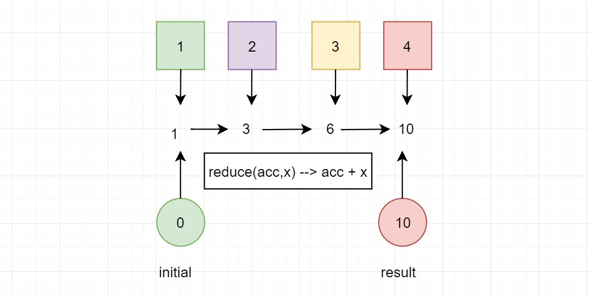

```java
public class TestCase {
    public static void main(String[] args) {
        Integer reduce = Stream.of(1, 2, 3, 4).reduce(0, (acc, x) -> acc+ x);
        System.out.println(reduce);
    }
}

// 输出结果：10
```

我们看得reduce接收了一个初始值为0的累加器，依次取出值与累加器相加，最后累加器的值就是最终的结果。


### 高级集合类及收集器

#### 转换成值

**收集器，一种通用的、从流生成复杂值的结构。**只要将它传给 collect 方法，所有的流就都可以使用它了。标准类库已经提供了一些有用的收集器，**以下示例代码中的收集器都是从 java.util.stream.Collectors 类中静态导入的。**

```java
public class CollectorsTest {
    public static void main(String[] args) {
        List<Student> students1 = new ArrayList<>(3);
        students1.add(new Student("路飞", 23, 175));
        students1.add(new Student("红发", 40, 180));
        students1.add(new Student("白胡子", 50, 185));

        OutstandingClass ostClass1 = new OutstandingClass("一班", students1);
        //复制students1，并移除一个学生
        List<Student> students2 = new ArrayList<>(students1);
        students2.remove(1);
        OutstandingClass ostClass2 = new OutstandingClass("二班", students2);
        //将ostClass1、ostClass2转换为Stream
        Stream<OutstandingClass> classStream = Stream.of(ostClass1, ostClass2);
        OutstandingClass outstandingClass = biggestGroup(classStream);
        System.out.println("人数最多的班级是：" + outstandingClass.getName());

        System.out.println("一班平均年龄是：" + averageNumberOfStudent(students1));
    }

    /**
     * 获取人数最多的班级
     */
    private static OutstandingClass biggestGroup(Stream<OutstandingClass> outstandingClasses) {
        return outstandingClasses.collect(
                maxBy(comparing(ostClass -> ostClass.getStudents().size())))
                .orElseGet(OutstandingClass::new);
    }

    /**
     * 计算平均年龄
     */
    private static double averageNumberOfStudent(List<Student> students) {
        return students.stream().collect(averagingInt(Student::getAge));
    }
}

// 输出结果
// 人数最多的班级是：一班
// 一班平均年龄是：37.666666666666664
```

maxBy或者minBy就是求最大值与最小值。


#### 转换成块

**常用的流操作是将其分解成两个集合，Collectors.partitioningBy帮我们实现了，接收一个Predicate函数式接口。**

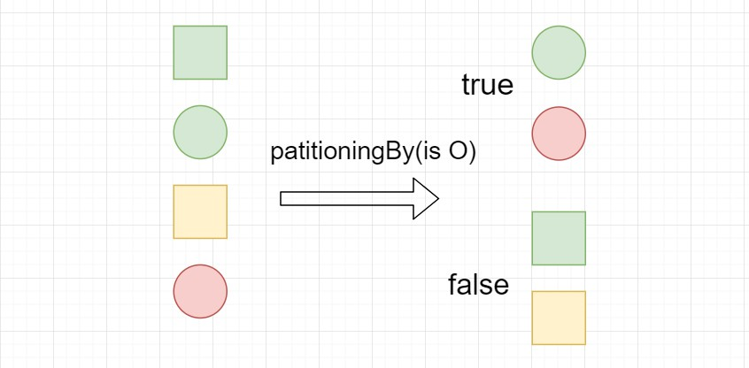

将示例学生分为会唱歌与不会唱歌的两个集合。

```java
public class PartitioningByTest {
    public static void main(String[] args) {
        // 省略List<student> students的初始化
        Map<Boolean, List<Student>> listMap = students.stream().collect(
            Collectors.partitioningBy(student -> student.getSpecialities().
                                      contains(SpecialityEnum.SING)));
    }
}
```


#### 数据分组

数据分组是一种更自然的分割数据操作，与将数据分成 ture 和 false 两部分不同，**可以使用任意值对数据分组。Collectors.groupingBy接收一个Function做转换。**

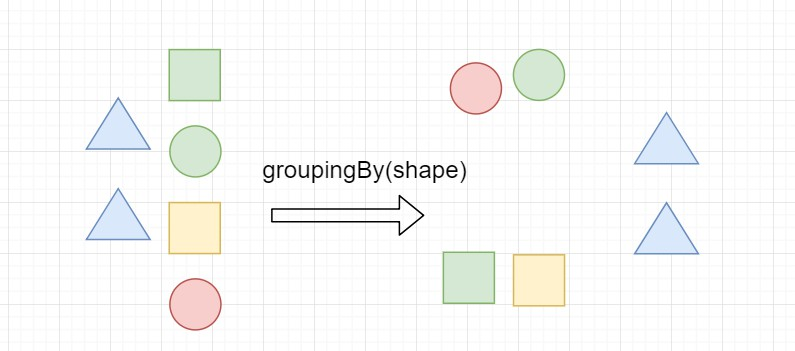

**如图，使用groupingBy将根据进行分组为圆形一组，三角形一组，正方形一组。**例子：根据学生第一个特长进行分组

```java
public class GroupingByTest {
    public static void main(String[] args) {
        //省略List<student> students的初始化
         Map<SpecialityEnum, List<Student>> listMap = 
             students.stream().collect(
             Collectors.groupingBy(student -> student.getSpecialities().get(0)));
    }
}
```

Collectors.groupingBy与SQL 中的 group by 操作是一样的。


#### 字符串拼接

如果将所有学生的名字拼接起来，怎么做呢？通常只能创建一个StringBuilder，循环拼接。使用Stream，使用Collectors.joining()简单容易。

```java
public class JoiningTest {
    public static void main(String[] args) {
        List<Student> students = new ArrayList<>(3);
        students.add(new Student("路飞", 22, 175));
        students.add(new Student("红发", 40, 180));
        students.add(new Student("白胡子", 50, 185));

         String names = students.stream()
             .map(Student::getName).collect(Collectors.joining(",","[","]"));
        System.out.println(names);
    }
}
//输出结果
//[路飞,红发,白胡子]
```

joining接收三个参数，第一个是分界符，第二个是前缀符，第三个是结束符。也可以不传入参数Collectors.joining()，这样就是直接拼接。


## Striped64

Striped64的设计思路是在竞争激烈的时候尽量分散竞争。


**Striping（条带化）**

大多数磁盘系统都对访问次数（每秒的 I/O 操作，IOPS）和数据传输率（每秒传输的数据量，TPS）有限制。当达到这些限制时，后续需要访问磁盘的进程就需要等待，这就是所谓的磁盘冲突。当多个进程同时访问一个磁盘时，可能会出现磁盘冲突。因此，避免磁盘冲突是优化 I/O 性能的一个重要目标。

条带（strip）是把连续的数据分割成相同大小的数据块，把每段数据分别写入到阵列中的不同磁盘上的方法。使用条带化技术使得多个进程同时访问数据的多个不同部分而不会造成磁盘冲突，而且在需要对这种数据进行顺序访问的时候可以获得最大程度上的 I/O 并行能力，从而获得非常好的性能。


**Striped64设计**

Striped64通过维护一个原子更新Cell表和一个base字段，并使用每个线程的探针字段作为哈希码映射到表的指定Cell。当竞争激烈时，将多线程的更新分散到不同Cell进行，有效降低了高并发下CAS更新的竞争，从而最大限度地提高了Striped64的吞吐量。Striped64为实现高吞吐量的并发计数组件奠定了基础，其中LongAdder就是基于Striped64实现，此外Java8中ConcurrentHashMap实现的并发计数功能也是基于Striped64的设计理念，还有hystrix、guava等实现的并发计数组件也离不开Striped64。


## LongAdder

LongAdder是JDK1.8开始出现的，所提供的API基本上可替换掉原先AtomicLong。LongAdder所使用思想就是**热点分离**，这点可以类比一下ConcurrentHashMap的设计思想。就是将value值分离成一个数组，当多线程访问时，通过hash算法映射到其中的一个数字进行计数。而最终的结果，就是这些数组的求和累加。这样一来，就减小了锁的粒度。如下图所示：


LonAdder和AtomicLong性能测试对比：


LongAdder就是基于Striped64实现，用于并发计数时，若不存在竞争或竞争比较低时，LongAdder具有和AtomicLong差不多的效率。但是，高并发环境下，竞争比较严重时，LongAdder的cells表发挥作用，将并发更新分散到不同Cell进行，有效降低了CAS更新的竞争，从而极大提高了LongAdder的并发计数能力。因此，高并发场景下，要实现吞吐量更高的计数器，推荐使用LongAdder。


## Semaphore

Semaphore是一个计数信号量，它的本质是一个"共享锁"。信号量维护了一个信号量许可集。线程可以通过调用acquire()来获取信号量的许可；当信号量中有可用的许可时，线程能获取该许可；否则线程必须等待，直到有可用的许可为止。 线程可以通过release()来释放它所持有的信号量许可。


**数据结构**


- 和"ReentrantLock"一样，Semaphore也包含sync对象，sync是Sync类型；而且Sync是一个继承于AQS的抽象类
- Sync包括两个子类："公平信号量"FairSync 和 "非公平信号量"NonfairSync。sync是"FairSync的实例"，或者"NonfairSync的实例"；默认情况下，sync是NonfairSync(即，默认是非公平信号量)

 

## CyclicBarrier

CyclicBarrier是一个同步辅助类，允许一组线程互相等待，直到到达某个公共屏障点 (common barrier point)。因为该 barrier 在释放等待线程后可以重用，所以称它为循环 的 barrier。


**比较CountDownLatch和CyclicBarrier**

- CountDownLatch的作用是允许1或N个线程等待其他线程完成执行；而CyclicBarrier则是允许N个线程相互等待
- CountDownLatch的计数器无法被重置；CyclicBarrier的计数器可以被重置后使用，因此它被称为是循环的barrier


**数据结构**

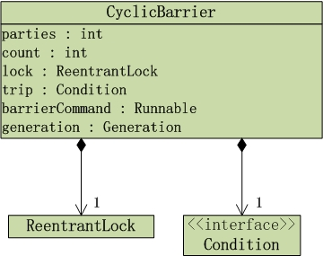

CyclicBarrier是包含了"ReentrantLock对象lock"和"Condition对象trip"，它是通过独占锁实现的。下面通过源码去分析到底是如何实现的。


## CountDownLatch

CountDownLatch是一个同步辅助类，在完成一组正在其他线程中执行的操作之前，它允许一个或多个线程一直等待。


**CountDownLatch和CyclicBarrier的区别**

- CountDownLatch的作用是允许1或N个线程等待其他线程完成执行；而CyclicBarrier则是允许N个线程相互等待
- CountDownLatch的计数器无法被重置；CyclicBarrier的计数器可以被重置后使用，因此它被称为是循环的barrier


**数据结构**

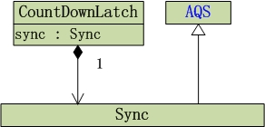

CountDownLatch的数据结构很简单，它是通过"共享锁"实现的。它包含了sync对象，sync是Sync类型。Sync是实例类，它继承于AQS。


## CompletableFuture

CompletableFuture是Java 8新增的一个类，用于异步编程，继承了Future和CompletionStage。Future主要具备对请求结果独立处理的功能，CompletionStage用于实现流式处理，实现异步请求的各个阶段组合或链式处理，因此CompletableFuture能实现整个异步调用接口的扁平化和流式处理，解决原有Future处理一系列链式异步请求时的复杂编码:

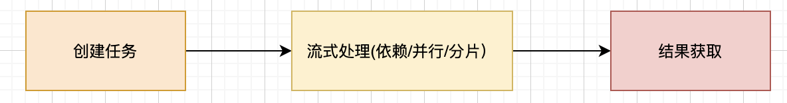

**Future的局限性**

- **Future 的结果在非阻塞的情况下，不能执行更进一步的操作**

  我们知道，使用Future时只能通过isDone()方法判断任务是否完成，或者通过get()方法阻塞线程等待结果返回，它不能非阻塞的情况下，执行更进一步的操作

- **不能组合多个Future的结果**

  假设你有多个Future异步任务，你希望最快的任务执行完时，或者所有任务都执行完后，进行一些其他操作

- **多个Future不能组成链式调用**

  当异步任务之间有依赖关系时，Future不能将一个任务的结果传给另一个异步任务，多个Future无法创建链式的工作流

- **没有异常处理**


**注意事项**

- **CompletableFuture默认线程池是否满足使用**

  前面提到创建CompletableFuture异步任务的静态方法runAsync和supplyAsync等，可以指定使用的线程池，不指定则用CompletableFuture的默认线程池：

  ```java
  private static final Executor asyncPool = useCommonPool ? ForkJoinPool.commonPool() : new ThreadPerTaskExecutor();
  ```

  可以看到，CompletableFuture默认线程池是调用ForkJoinPool的commonPool()方法创建，这个默认线程池的核心线程数量根据CPU核数而定，公式为`Runtime.getRuntime().availableProcessors() - 1`，以4核双槽CPU为例，核心线程数量就是`4*2-1=7`个。这样的设置满足CPU密集型的应用，但对于业务都是IO密集型的应用来说，是有风险的，当qps较高时，线程数量可能就设的太少了，会导致线上故障。所以可以根据业务情况自定义线程池使用。

- **get设置超时时间不能串行get，不然会导致接口延时`线程数量\*超时时间`**


**① 创建异步任务**

通常可以使用下面几个CompletableFuture的静态方法创建一个异步任务

```java
// 创建无返回值的异步任务
public static CompletableFuture<Void> runAsync(Runnable runnable);
// 无返回值，可指定线程池（默认使用ForkJoinPool.commonPool）
public static CompletableFuture<Void> runAsync(Runnable runnable, Executor executor);
// 创建有返回值的异步任务
public static <U> CompletableFuture<U> supplyAsync(Supplier<U> supplier);
// 有返回值，可指定线程池
public static <U> CompletableFuture<U> supplyAsync(Supplier<U> supplier, Executor executor);
```

使用示例：

```java
Executor executor = Executors.newFixedThreadPool(10);
CompletableFuture<Void> future = CompletableFuture.runAsync(() -> {
    //do something
}, executor);

int poiId = 111;
CompletableFuture<String> future = CompletableFuture.supplyAsync(() -> {
	PoiDTO poi = poiService.loadById(poiId);
  return poi.getName();
});
// Block and get the result of the Future
String poiName = future.get();
```


**② 使用回调方法**

通过`future.get()`方法获取异步任务的结果，还是会阻塞的等待任务完成

CompletableFuture提供了几个回调方法，可以不阻塞主线程，在异步任务完成后自动执行回调方法中的代码

```java
// 无参数、无返回值
public CompletableFuture<Void> thenRun(Runnable runnable);
// 接受参数，无返回值
public CompletableFuture<Void> thenAccept(Consumer<? super T> action);
// 接受参数T，有返回值U
public <U> CompletableFuture<U> thenApply(Function<? super T,? extends U> fn);
```

使用示例：

```java
CompletableFuture<Void> future = CompletableFuture.supplyAsync(() -> "Hello")
   	 .thenRun(() -> System.out.println("do other things. 比如异步打印日志或发送消息"));
// 如果只想在一个CompletableFuture任务执行完后，进行一些后续的处理，不需要返回值，那么可以用thenRun回调方法来完成。
// 如果主线程不依赖thenRun中的代码执行完成，也不需要使用get()方法阻塞主线程。

CompletableFuture<Void> future = CompletableFuture.supplyAsync(() -> "Hello")
    	.thenAccept((s) -> System.out.println(s + " world"));
// 输出：Hello world
// 回调方法希望使用异步任务的结果，并不需要返回值，那么可以使用thenAccept方法

CompletableFuture<Boolean> future = CompletableFuture.supplyAsync(() -> {
  	PoiDTO poi = poiService.loadById(poiId);
  	return poi.getMainCategory();
}).thenApply((s) -> isMainPoi(s));			// boolean isMainPoi(int poiId);
future.get();
// 希望将异步任务的结果做进一步处理，并需要返回值，则使用thenApply方法。
// 如果主线程要获取回调方法的返回，还是要用get()方法阻塞得到
```


**③ 组合两个异步任务**

```java
// thenCompose方法中的异步任务依赖调用该方法的异步任务
public <U> CompletableFuture<U> thenCompose(Function<? super T, ? extends CompletionStage<U>> fn);	
// 用于两个独立的异步任务都完成的时候
public <U,V> CompletableFuture<V> thenCombine(CompletionStage<? extends U> other,  BiFunction<? super T,? super U,? extends V> fn);
```

使用示例：

```java
CompletableFuture<List<Integer>> poiFuture = CompletableFuture.supplyAsync(
  () -> poiService.queryPoiIds(cityId, poiId)
);
// 第二个任务是返回CompletableFuture的异步方法
CompletableFuture<List<DealGroupDTO>> getDeal(List<Integer> poiIds){
  return CompletableFuture.supplyAsync(() ->  poiService.queryPoiIds(poiIds));
}
// thenCompose
CompletableFuture<List<DealGroupDTO>> resultFuture = poiFuture.thenCompose(poiIds -> getDeal(poiIds));
resultFuture.get();
```

thenCompose和thenApply的功能类似，两者区别在于thenCompose接受一个返回`CompletableFuture<U>`的Function，当想从回调方法返回的`CompletableFuture<U>`中直接获取结果U时，就用thenCompose。如果使用thenApply，返回结果resultFuture的类型是`CompletableFuture<CompletableFuture<List<DealGroupDTO>>>`，而不是`CompletableFuture<List<DealGroupDTO>>`

```java
CompletableFuture<String> future = CompletableFuture.supplyAsync(() -> "Hello")
  .thenCombine(CompletableFuture.supplyAsync(() -> "world"), (s1, s2) -> s1 + s2);
// future.get()
```


**④ 组合多个CompletableFuture**

当需要多个异步任务都完成时，再进行后续处理，可以使用**allOf**方法：

```java
CompletableFuture<Void> poiIDTOFuture = CompletableFuture
	.supplyAsync(() -> poiService.loadPoi(poiId))
  .thenAccept(poi -> {
    model.setModelTitle(poi.getShopName());
    // do more thing
  });

CompletableFuture<Void> productFuture = CompletableFuture
	.supplyAsync(() -> productService.findAllByPoiIdOrderByUpdateTimeDesc(poiId))
  .thenAccept(list -> {
    model.setDefaultCount(list.size());
    model.setMoreDesc("more");
  });
// future3等更多异步任务，这里就不一一写出来了

// allOf组合所有异步任务，并使用join获取结果
CompletableFuture.allOf(poiIDTOFuture, productFuture, future3, ...).join();
```

该方法挺适合C端的业务，通过poiId异步的从多个服务拿门店信息，然后组装成自己需要的模型，最后所有门店信息都填充完后返回。这里使用了join方法获取结果，它和get方法一样阻塞的等待任务完成。多个异步任务有任意一个完成时就返回结果，可以使用**anyOf**方法：

```java
CompletableFuture<String> future1 = CompletableFuture.supplyAsync(() -> {
    try {
        TimeUnit.SECONDS.sleep(2);
    } catch (InterruptedException e) {
       throw new IllegalStateException(e);
    }
    return "Result of Future 1";
});

CompletableFuture<String> future2 = CompletableFuture.supplyAsync(() -> {
    try {
        TimeUnit.SECONDS.sleep(1);
    } catch (InterruptedException e) {
       throw new IllegalStateException(e);
    }
    return "Result of Future 2";
});

CompletableFuture<String> future3 = CompletableFuture.supplyAsync(() -> {
    try {
        TimeUnit.SECONDS.sleep(3);
    } catch (InterruptedException e) {
       throw new IllegalStateException(e);
      return "Result of Future 3";
});

CompletableFuture<Object> anyOfFuture = CompletableFuture.anyOf(future1, future2, future3);

System.out.println(anyOfFuture.get()); // Result of Future 2
```


**⑤ 异常处理**

```java
Integer age = -1;

CompletableFuture<Void> maturityFuture = CompletableFuture.supplyAsync(() -> {
  if(age < 0) {
    throw new IllegalArgumentException("Age can not be negative");
  }
  if(age > 18) {
    return "Adult";
  } else {
    return "Child";
  }
}).exceptionally(ex -> {
  System.out.println("Oops! We have an exception - " + ex.getMessage());
  return "Unknown!";
}).thenAccept(s -> System.out.print(s));
// Unkown!
```

exceptionally方法可以处理异步任务的异常，在出现异常时，给异步任务链一个从错误中恢复的机会，可以在这里记录异常或返回一个默认值。使用handler方法也可以处理异常，并且无论是否发生异常它都会被调用：

```java
Integer age = -1;

CompletableFuture<String> maturityFuture = CompletableFuture.supplyAsync(() -> {
    if(age < 0) {
        throw new IllegalArgumentException("Age can not be negative");
    }
    if(age > 18) {
        return "Adult";
    } else {
        return "Child";
    }
}).handle((res, ex) -> {
    if(ex != null) {
        System.out.println("Oops! We have an exception - " + ex.getMessage());
        return "Unknown!";
    }
    return res;
});
```


**⑥ 分片处理**

分片和并行处理：分片借助stream实现，然后通过CompletableFuture实现并行执行，最后做数据聚合（其实也是stream的方法）。CompletableFuture并不提供单独的分片api，但可以借助stream的分片聚合功能实现。举个例子：

```java
// 请求商品数量过多时，做分批异步处理
List<List<Long>> skuBaseIdsList = ListUtils.partition(skuIdList, 10);//分片
// 并行
List<CompletableFuture<List<SkuSales>>> futureList = Lists.newArrayList();
for (List<Long> skuId : skuBaseIdsList) {
  CompletableFuture<List<SkuSales>> tmpFuture = getSkuSales(skuId);
  futureList.add(tmpFuture);
}
// 聚合
futureList.stream().map(CompletalbleFuture::join).collent(Collectors.toList());
```


**⑦ 应用案例**

首先还是需要先完成分工方案，在下面的程序中，我们分了3个任务：

- 任务1负责洗水壶、烧开水
- 任务2负责洗茶壶、洗茶杯和拿茶叶
- 任务3负责泡茶。其中任务3要等待任务1和任务2都完成后才能开始

```java
// 任务1：洗水壶->烧开水
CompletableFuture f1 = 
  CompletableFuture.runAsync(()->{
  System.out.println("T1:洗水壶...");
  sleep(1, TimeUnit.SECONDS);

  System.out.println("T1:烧开水...");
  sleep(15, TimeUnit.SECONDS);
});

// 任务2：洗茶壶->洗茶杯->拿茶叶
CompletableFuture f2 = 
  CompletableFuture.supplyAsync(()->{
  System.out.println("T2:洗茶壶...");
  sleep(1, TimeUnit.SECONDS);

  System.out.println("T2:洗茶杯...");
  sleep(2, TimeUnit.SECONDS);

  System.out.println("T2:拿茶叶...");
  sleep(1, TimeUnit.SECONDS);
  return "龙井";
});

// 任务3：任务1和任务2完成后执行：泡茶
CompletableFuture f3 = 
  f1.thenCombine(f2, (__, tf)->{
    System.out.println("T3:拿到茶叶:" + tf);
    System.out.println("T3:泡茶...");
    return "上茶:" + tf;
  });

// 等待任务3执行结果
System.out.println(f3.join());
void sleep(int t, TimeUnit u) {
      try {
        u.sleep(t);
      }catch(InterruptedException e){}
}

// 一次执行结果：
T1:洗水壶...
T2:洗茶壶...
T1:烧开水...
T2:洗茶杯...
T2:拿茶叶...
T3:拿到茶叶:龙井
T3:泡茶...
上茶:龙井
```


# 集合

## List

### ArrayList(数组)

ArrayList 是一个**数组队列**，相当于 **动态数组**。与Java中的数组相比，它的容量能动态增长。

它允许对元素进行快速随机访问。数组的缺点是每个元素之间不能有间隔，当数组大小不满足时需要增加存储能力，就要将已经有数组的数据复制到新的存储空间中。当从 ArrayList 的中间位置插入或者删除元素时，需要对数组进行复制、移动、代价比较高。因此，它适合随机查找和遍历，不适合插入和删除。


### LinkedList(链表)

LinkedList 是用链表结构存储数据的，很适合数据的动态插入和删除，随机访问和遍历速度比较慢。另外，他还提供了 List 接口中没有定义的方法，专门用于操作表头和表尾元素，可以当作堆栈、队列和双向队列使用。

- LinkedList是有序的双向链表
- LinkedList在内存中开辟的内存不连续【ArrayList开辟的内存是连续的】
- LinkedList插入和删除元素很快，但是查询很慢【相对于ArrayList】


### Vector(数组实现、线程同步)

Vector 与 ArrayList 一样，也是通过数组实现的，不同的是它支持线程的同步，即某一时刻只有一个线程能够写 Vector，避免多线程同时写而引起的不一致性，但实现同步需要很高的花费，因此，访问它比访问 ArrayList 慢。


### CopyOnWriteArrayList

**Copy-On-Write是什么？**

顾名思义，在计算机中就是当你想要对一块内存进行修改时，我们不在原有内存块中进行`写`操作，而是将内存拷贝一份，在新的内存中进行`写`操作，`写`完之后呢，就将指向原来内存指针指向新的内存，原来的内存就可以被回收掉。


CopyOnWriteArrayList相当于线程安全的ArrayList，它实现了List接口，支持高并发。和ArrayList一样，它是个可变数组，但是和ArrayList不同的时，它具有以下特性：

- 最适合于具有以下特征的应用：List大小通常保持很小，只读操作远多于可变操作，需在遍历期间防止线程间的冲突
- 它是线程安全的
- 因为通常需要复制整个基础数组，所以可变操作（add()、set() 和 remove() 等等）的开销很大
- 迭代器支持hasNext(), next()等不可变操作，但不支持可变 remove()等操作
- 使用迭代器进行遍历的速度很快，并且不会与其他线程发生冲突。在构造迭代器时，迭代器依赖于不变的数组快照


**CopyOnWriteArrayList数据结构**


- CopyOnWriteArrayList实现了List接口，因此它是一个队列
- CopyOnWriteArrayList包含了成员lock。每一个CopyOnWriteArrayList都和一个互斥锁lock绑定，通过lock，实现了对CopyOnWriteArrayList的互斥访问
- CopyOnWriteArrayList包含了成员array数组，这说明CopyOnWriteArrayList本质上通过数组实现的


**CopyOnWriteArrayList原理**

下面从“动态数组”和“线程安全”两个方面进一步对CopyOnWriteArrayList的原理进行说明。

- **CopyOnWriteArrayList的“动态数组”机制**

  它内部有个“volatile数组”(array)来保持数据。

  在“添加/修改/删除”数据时，都会新建一个数组，并将更新后的数据拷贝到新建的数组中，最后再将该数组赋值给“volatile数组”。这就是它叫做CopyOnWriteArrayList的原因。CopyOnWriteArrayList就是通过这种方式实现的动态数组，不过正由于它在“添加/修改/删除”数据时，都会新建数组，所以涉及到修改数据的操作，CopyOnWriteArrayList效率很
  低。但是单单只是进行遍历查找的话，效率比较高

- **CopyOnWriteArrayList的“线程安全”机制**

  是通过volatile和互斥锁来实现的。

  - **CopyOnWriteArrayList是通过“volatile数组”来保存数据的**。一个线程读取volatile数组时，总能看到其它线程对该volatile变量最后的写入。就这样，通过volatile提供了“读取到的数据总是最新的”这个机制的保证
  - **CopyOnWriteArrayList通过互斥锁来保护数据**。在“添加、修改、删除”数据时，会先“获取互斥锁”，再修改完毕之后，先将数据更新到“volatile数组”中，然后再“释放互斥锁”；这样，就达到了保护数据的目的


## Set

### HashSet(Hash表)

**HashSet 基于 HashMap，底层是通过 HashMap 的API来实现的。**哈希表边存放的是哈希值。HashSet 存储元素的顺序并不是按照存入时的顺序（和 List 显然不同） 而是按照哈希值来存的所以取数据也是按照哈希值取得。元素的哈希值是通过元素的hashcode 方法来获取的, HashSet 首先判断两个元素的哈希值，如果哈希值一样，接着会比较equals方法，如果 equals 结果为 true ，HashSet 就视为同一个元素；如果 equals 为 false 就不是同一个元素。hashcode相同，equals不相等，则使用链表存储。


### TreeSet(二叉树)

底层通过TreeMap来实现，非线程安全，具有排序功能（自然排序（默认）和自定义排序）。它继承AbstractSet，实现NavigableSet（搜索功能）, Cloneable（克隆）, Serializable（序列化，可用hessian协议来传输）接口。

- TreeSet()是使用二叉树的原理对新 add()的对象按照指定的顺序排序（升序、降序），每增加一个对象都会进行排序，将对象插入的二叉树指定的位置
- Integer 和 String 对象都可以进行默认的 TreeSet 排序，而自定义类的对象是不可以的，自己定义的类必须实现 Comparable 接口，并且覆写相应的 compareTo()函数，才可以正常使用
- 在覆写 compare()函数时，要返回相应的值才能使 TreeSet 按照一定的规则来排序
- 比较此对象与指定对象的顺序。如果该对象小于、等于或大于指定对象，则分别返回负整数、零或正整数


### LinkedHashSet

对于 LinkedHashSet 而言，它继承与 HashSet、又基于 LinkedHashMap 来实现的。LinkedHashSet 底层使用LinkedHashMap 来保存所有元素，它继承与 HashSet，其所有的方法操作上又与 HashSet 相同，因此 LinkedHashSet 的实现上非常简单，只提供了四个构造方法，并通过传递一个标识参数，调用父类的构造器，底层构造一个 LinkedHashMap 来实现，在相关操作上与父类 HashSet 的操作相同，直接调用父类 HashSet 的方法即可。


### ConcurrentSkipListSet

ConcurrentSkipListSet是线程安全的有序的集合(相当于线程安全的TreeSet)；它继承于AbstractSet，并实现了NavigableSet接口。ConcurrentSkipListSet是通过ConcurrentSkipListMap实现的，它也支持并发。


### CopyOnWriteArraySet

CopyOnWriteArraySet是线程安全的无序的集合，可以将它理解成线程安全的HashSet。CopyOnWriteArraySet内部包含一个CopyOnWriteArrayList对象，它是通过CopyOnWriteArrayList实现的。

- **通过“动态数组(CopyOnWriteArrayList)”实现（HashSet是通过“散列表(HashMap)”实现的）**
- **线程安全是通过volatile和互斥锁来实现**
- **无序的不能重复集合**


**CopyOnWriteArraySet特性**

- 它最适合于具有以下特征的应用程序：Set 大小通常保持很小，只读操作远多于可变操作，需要在遍历期间防止线程间的冲突
- 它是线程安全的
- 因为通常需要复制整个基础数组，所以可变操作（add()、set() 和 remove() 等等）的开销很大
- 迭代器支持hasNext(), next()等不可变操作，但不支持可变 remove()等 操作
- 使用迭代器进行遍历的速度很快，并且不会与其他线程发生冲突。在构造迭代器时，迭代器依赖于不变的数组快照


**数据结构**


- CopyOnWriteArraySet继承于AbstractSet，这就意味着它是一个集合
- CopyOnWriteArraySet包含CopyOnWriteArrayList对象，它是通过CopyOnWriteArrayList实现的。而CopyOnWriteArrayList本质是个动态数组队列，所以CopyOnWriteArraySet相当于通过通过动态数组实现的“集合”！ CopyOnWriteArrayList中允许有重复的元素；但是，CopyOnWriteArraySet是一个集合，所以它不能有重复集合。因此，CopyOnWriteArrayList额外提供了addIfAbsent()和addAllAbsent()这两个添加元素的API，通过这些API来添加元素时，只有当元素不存在时才执行添加操作


### ConcurrentSkipListSet

ConcurrentSkipListSet是线程安全的有序的集合，适用于高并发的场景。ConcurrentSkipListSet和TreeSet，它们虽然都是有序的集合。但是，第一，它们的线程安全机制不同，TreeSet是非线程安全的，而ConcurrentSkipListSet是线程安全的。第二，ConcurrentSkipListSet是通过ConcurrentSkipListMap实现的，而TreeSet是通过TreeMap实现的。


**数据结构**

 

- ConcurrentSkipListSet继承于AbstractSet。因此，它本质上是一个集合
- ConcurrentSkipListSet实现了NavigableSet接口。因此，ConcurrentSkipListSet是一个有序的集合
- ConcurrentSkipListSet是通过ConcurrentSkipListMap实现的。它包含一个ConcurrentNavigableMap对象m，而m对象实际上是ConcurrentNavigableMap的实现类ConcurrentSkipListMap的实例。ConcurrentSkipListMap中的元素是key-value键值对；而ConcurrentSkipListSet是集合，它只用到了ConcurrentSkipListMap中的key


## Map

### HashMap(数组+链表+红黑树)

**工作原理**

**HashMap（数组+链表+红黑树）**。HashMap 根据键的 hashCode 值存储数据，大多数情况下可以直接定位到它的值，因而具有很快的访问速度，但遍历顺序却是不确定的。 HashMap 最多只允许一条记录的键为 null，允许多条记录的值为 null。HashMap 非线程安全，即任一时刻可以有多个线程同时写 HashMap，可能会导致数据的不一致。如果需要满足线程安全，可以用 Collections 的 synchronizedMap 方法使HashMap 具有线程安全的能力，或者使用 ConcurrentHashMap。我们用下面这张图来介绍HashMap 的结构。


hashCode 是定位的，**存储位置**；equals是定性的，**比较两者是否相等**。

**put()**

- 第一步：调用 hash(K) 方法**计算 K 的 hash 值**，然后结合数组长度，计算得数组下标
- 第二步：**调整数组大小**（当容器中的元素个数大于 capacity * loadfactor 时，容器会进行扩容resize 为 2n）
- 第三步：
  - 如果 **K 的 hash 值**在 HashMap 中**不存在**，则执行**插入**，若存在，则发生**碰撞**
  - 如果 K 的 hash 值在 HashMap 中**存在**，且它们两者 **equals 返回 true**，则**更新键值对**
  - 如果 K 的 hash 值在 HashMap 中**存在**，且它们两者 **equals 返回 false**，则**插入链表的尾部（尾插法）或者红黑树中（树的添加方式）**

**get()**

- 第一步：调用 hash(K) 方法（**计算 K 的 hash 值**）从而**获取该键值所在链表的数组下标**
- 第二步：顺序遍历链表，equals()方法查找**相同 Node 链表中 K 值**对应的 V 值


大方向上，HashMap 里面是一个数组，然后数组中每个元素是一个单向链表。上图中，每个绿色的实体是嵌套类 Entry 的实例，Entry 包含四个属性：key, value, hash 值和用于单向链表的 next。

- capacity：当前数组容量，始终保持 2^n，可以扩容，扩容后数组大小为当前的 2 倍
- loadFactor：负载因子，默认为 0.75
- threshold：扩容的阈值，等于 capacity * loadFactor


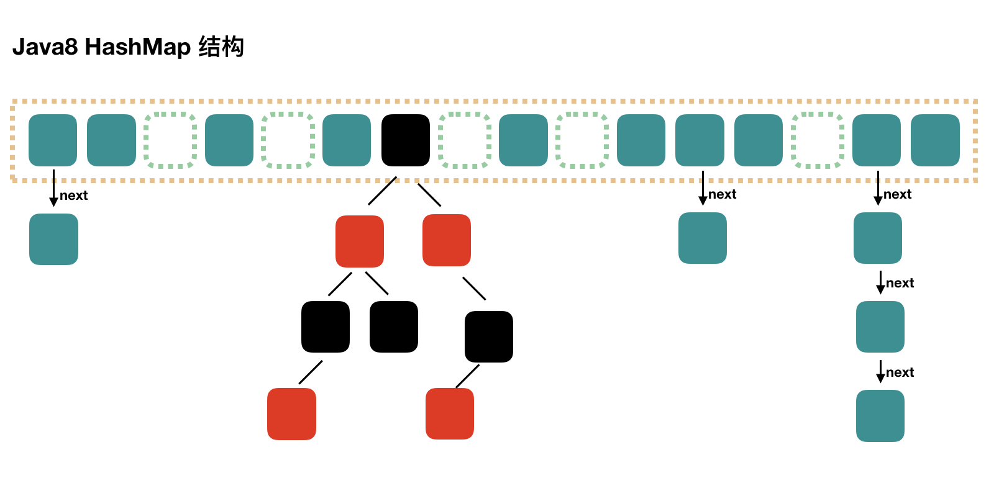

Java8 对 HashMap 进行了一些修改，最大的不同就是利用了红黑树，所以其由 数组+链表+红黑树 组成。根据 Java7 HashMap 的介绍，我们知道，查找的时候，根据 hash 值我们能够快速定位到数组的具体下标，但是之后的话，需要顺着链表一个个比较下去才能找到我们需要的，时间复杂度取决于链表的长度，为 O(n)。为了降低这部分的开销，在 Java8 中，当链表中的元素超过了 8 个以后，会将链表转换为红黑树，在这些位置进行查找的时候可以降低时间复杂度为 O(logN)。


HashMap具有如下特性：

- HashMap 的存取是没有顺序的
- KV 均允许为 NULL
- 多线程情况下该类不安全，可以考虑用 HashTable
- JDk8底层是数组 + 链表 + 红黑树，JDK7底层是数组 + 链表
- 初始容量和装载因子是决定整个类性能的关键点，轻易不要动
- HashMap是**懒汉式**创建的，只有在你put数据时候才会 build
- 单向链表转换为红黑树的时候会先变化为**双向链表**最终转换为**红黑树**，切记双向链表跟红黑树是`共存`的
- 对于传入的两个`key`，会强制性的判别出个高低，目的是为了决定向左还是向右放置数据
- 链表转红黑树后会努力将红黑树的`root`节点和链表的头节点 跟`table[i]`节点融合成一个
- 在删除时候是先判断删除节点红黑树个数是否需要转链表，不转链表就跟`RBT`类似，找个合适的节点来填充已删除的节点
- 红黑树的`root`节点`不一定`跟`table[i]`也就是链表的头节点是同一个，三者同步是靠`MoveRootToFront`实现的。而`HashIterator.remove()`会在调用`removeNode`的时候`movable=false`


### TreeMap(可排序)

TreeMap 实现 SortedMap 接口，能够把它保存的记录根据键排序，默认是按键值的升序排序，也可以指定排序的比较器，当用 Iterator 遍历 TreeMap 时，得到的记录是排过序的。如果使用排序的映射，建议使用 TreeMap。在使用 TreeMap 时，key 必须实现 Comparable 接口或者在构造 TreeMap 传入自定义的Comparator，否则会在运行时抛出java.lang.ClassCastException 类型的异常。


### HashTable(线程安全)

Hashtable 是遗留类，很多映射的常用功能与 HashMap 类似，不同的是它承自 Dictionary 类，并且是线程安全的，任一时间只有一个线程能写 Hashtable，并发性不如 ConcurrentHashMap，因为 ConcurrentHashMap 引入了分段锁。Hashtable 不建议在新代码中使用，不需要线程安全的场合可以用 HashMap 替换，需要线程安全的场合可以用 ConcurrentHashMap 替换。


### LinkedHashMap(记录插入顺序)

LinkedHashMap 是 HashMap 的一个子类，保存了记录的插入顺序，在用 Iterator 遍历LinkedHashMap 时，先得到的记录肯定是先插入的，也可以在构造时带参数，按照访问次序排序。


**如何实现LRUCache？**

LRU（Least Recently Used）**最近最少使用算法**。LruCache就是利用 LinkedHashMap 的一个特性（ `accessOrder＝true`基于访问顺序 ）再加上对 LinkedHashMap 的`数据操作上锁`实现的缓存策略。

- `LruCache`是通过`LinkedHashMap`构造方法的第三个参数的`accessOrder=true`实现了`LinkedHashMap`的数据排序基于访问顺序 （最近访问的数据会在链表尾部），在容量溢出的时候，将链表头部的数据移除，从而实现了LRU数据缓存机制
- 然后在每次 `LruCache.get(K key)` 方法里都会调用`LinkedHashMap.get(Object key)`
- 如上述设置了 `accessOrder=true` 后，每次 `LinkedHashMap.get(Object key)`都会进行 `LinkedHashMap.makeTail(LinkedEntry<K, V> e)`
- LinkedHashMap 是`双向循环链表`，然后每次 `LruCache.get -> LinkedHashMap.get` 的数据就被放到最末尾了
- 在 put 和 `trimToSize` 的方法执行下，如果发生数据量移除，会优先移除掉最前面的数据（因为最新访问的数据在尾部）

- LruCache 在内部的get、put、remove包括 trimToSize 都是安全的（因为都上锁了）
- LruCache 自身并没有释放内存，将LinkedHashMap的数据移除了，如果数据还在别的地方被引用了，还是有泄漏问题，还需要手动释放内存
- 覆写entryRemoved方法能知道 LruCache 数据移除时是否发生了冲突，也可以去手动释放资源
- maxSize 和 sizeOf(K key, V value) 方法的覆写息息相关，必须相同单位。（ 比如 maxSize 是7MB，自定义的 sizeOf 计算每个数据大小的时候必须能算出与MB之间有联系的单位 ）


#### LruCache的唯一构造方法

```java
/**
 * LruCache的构造方法：需要传入最大缓存个数
 */
public LruCache(int maxSize) {

    ...

    this.maxSize = maxSize;
    /*
     * 初始化LinkedHashMap
     * 第一个参数：initialCapacity，初始大小
     * 第二个参数：loadFactor，负载因子=0.75f，即到75%容量的时候就会扩容
     * 第三个参数：①accessOrder=true基于访问顺序排序②accessOrder=false基于插入顺序排序
     */
    this.map = new LinkedHashMap<K, V>(0, 0.75f, true);
}
```


#### LruCache.get(K key)

下述的 get 方法表面并没有看出哪里有实现了 LRU 的缓存策略。主要在 mapValue = map.get(key);里，调用了 LinkedHashMap 的 get 方法，再加上 LruCache 构造里默认设置 LinkedHashMap 的 accessOrder=true。

```java
/**
 * 根据 key 查询缓存，如果存在于缓存或者被 create 方法创建了。
 * 如果值返回了，那么它将被移动到双向循环链表的的尾部。
 * 如果如果没有缓存的值，则返回 null。
 */
public final V get(K key) {

    ...

    V mapValue;
    synchronized (this) {
        // 关键点：LinkedHashMap每次get都会基于访问顺序来重整数据顺序
        mapValue = map.get(key);
        // 计算 命中次数
        if (mapValue != null) {
            hitCount++;
            return mapValue;
        }
        // 计算 丢失次数
        missCount++;
    }

    /*
     * 官方解释：
     * 尝试创建一个值，这可能需要很长时间，并且Map可能在create()返回的值时有所不同。如果在create()执行的时
     * 候，一个冲突的值被添加到Map，我们在Map中删除这个值，释放被创造的值。
     */
    V createdValue = create(key);
    if (createdValue == null) {
        return null;
    }

    /***************************
     * 不覆写create方法走不到下面 *
     ***************************/

    /*
     * 正常情况走不到这里
     * 走到这里的话 说明 实现了自定义的 create(K key) 逻辑
     * 因为默认的 create(K key) 逻辑为null
     */
    synchronized (this) {
        // 记录 create 的次数
        createCount++;
        // 将自定义create创建的值，放入LinkedHashMap中，如果key已经存在，会返回 之前相同key 的值
        mapValue = map.put(key, createdValue);

        // 如果之前存在相同key的value，即有冲突。
        if (mapValue != null) {
            /*
             * 有冲突
             * 所以 撤销 刚才的 操作
             * 将 之前相同key 的值 重新放回去
             */
            map.put(key, mapValue);
        } else {
            // 拿到键值对，计算出在容量中的相对长度，然后加上
            size += safeSizeOf(key, createdValue);
        }
    }

    // 如果上面 判断出了 将要放入的值发生冲突
    if (mapValue != null) {
        /*
         * 刚才create的值被删除了，原来的 之前相同key 的值被重新添加回去了
         * 告诉 自定义 的 entryRemoved 方法
         */
        entryRemoved(false, key, createdValue, mapValue);
        return mapValue;
    } else {
        // 上面 进行了 size += 操作 所以这里要重整长度
        trimToSize(maxSize);
        return createdValue;
    }
}
```


#### LinkedHashMap.get(Object key)

主要看`if (accessOrder)`逻辑即可，如果`accessOrder=true`那么每次get都会执行N次 `makeTail(LinkedEntry<K, V> e)` 。多了一步mainTail动作，把获取的数据，移到双向链表的尾部tail。

```java
/**
 * Returns the value of the mapping with the specified key.
 *
 * @param key the key.
 * @return the value of the mapping with the specified key, or {@code null} if no mapping for the specified key is found.
 */
@Override
public V get(Object key) {
        /*
         * This method is overridden to eliminate the need for a polymorphic
         * invocation in superclass at the expense of code duplication.
         */
        if (key == null) {
            HashMapEntry<K, V> e = entryForNullKey;
            if (e == null)
                return null;
            if (accessOrder)
                makeTail((LinkedEntry<K, V>) e); //把访问的节点迁移到链表的尾部
            return e.value;
        }

        int hash = Collections.secondaryHash(key);
        HashMapEntry<K, V>[] tab = table;
        for (HashMapEntry<K, V> e = tab[hash & (tab.length - 1)]; e != null; e = e.next) { //从数组中获取
            K eKey = e.key;
            if (eKey == key || (e.hash == hash && key.equals(eKey))) {
                if (accessOrder)
                    makeTail((LinkedEntry<K, V>) e); //把访问的节点迁移到链表尾部。
                return e.value;
            }
        }
        return null;
}

/**
  * Relinks the given entry to the tail of the list. Under access ordering,
  * this method is invoked whenever the value of a  pre-existing entry is
  * read by Map.get or modified by Map.put.
  */
private void makeTail(LinkedEntry<K, V> e) {
        // Unlink e 在链表中删除该节点e
        e.prv.nxt = e.nxt;
        e.nxt.prv = e.prv;

        // Relink e as tail 在尾部添加
        LinkedEntry<K, V> header = this.header;
        LinkedEntry<K, V> oldTail = header.prv;
        e.nxt = header;
        e.prv = oldTail;
        oldTail.nxt = header.prv = e;
        modCount++;
}
```


#### LruCache.put(K key, V value)

```java
public final V put(K key, V value) {
    ...
    synchronized (this) {
        ...
        // 拿到键值对，计算出在容量中的相对长度，然后加上
        size += safeSizeOf(key, value);
        ...
    }
	...
    trimToSize(maxSize);
    return previous;
}
```

注意：

- `put` 开始的时候确实是把值放入 `LinkedHashMap` 了，不管超不超过你设定的缓存容量
- 然后根据 `safeSizeOf` 方法计算 此次添加数据的容量是多少，并且加到 `size` 里
- 说到 `safeSizeOf` 就要讲到 `sizeOf(K key, V value)` 会计算出此次添加数据的大小
- 直到 `put` 要结束时，进行了 `trimToSize` 才判断 `size` 是否 大于 `maxSize` 然后进行最近很少访问数据的移除


#### LruCache.trimToSize(int maxSize)

会判断之前 `size` 是否大于 `maxSize` 。是的话，直接跳出后什么也不做。不是的话，证明已经溢出容量了。由 `makeTail` 图已知，最近经常访问的数据在最末尾。拿到一个存放 key 的 Set，然后一直一直从头开始删除，删一个判断是否溢出，直到没有溢出。

```java
public void trimToSize(int maxSize) {
    /*
     * 这是一个死循环，
     * 1.只有 扩容 的情况下能立即跳出
     * 2.非扩容的情况下，map的数据会一个一个删除，直到map里没有值了，就会跳出
     */
    while (true) {
        K key;
        V value;
        synchronized (this) {
            // 在重新调整容量大小前，本身容量就为空的话，会出异常的。
            if (size < 0 || (map.isEmpty() && size != 0)) {
                throw new IllegalStateException(getClass().getName() + ".sizeOf() is reporting inconsistent results!");
            }
            // 如果是 扩容 或者 map为空了，就会中断，因为扩容不会涉及到丢弃数据的情况
            if (size <= maxSize || map.isEmpty()) {
                break;
            }

            Map.Entry<K, V> toEvict = map.entrySet().iterator().next();
            key = toEvict.getKey();
            value = toEvict.getValue();
            map.remove(key);
            // 拿到键值对，计算出在容量中的相对长度，然后减去。
            size -= safeSizeOf(key, value);
            // 添加一次收回次数
            evictionCount++;
        }
        /*
         * 将最后一次删除的最少访问数据回调出去
         */
        entryRemoved(true, key, value, null);
    }
}
```


### ConcurrentHashMap

ConcurrentHashMap是线程安全的哈希表(相当于线程安全的HashMap)；它继承于AbstractMap类，并且实现ConcurrentMap接口。ConcurrentHashMap是通过“锁分段”来实现的，它支持并发。


**Segment** **段**

ConcurrentHashMap 和 HashMap 思路是差不多的，但是因为它支持并发操作，所以要复杂一些。整个ConcurrentHashMap 由一个个 Segment 组成，Segment 代表”部分“或”一段“的意思，所以很多地方都会将其描述为分段锁。注意，行文中，我很多地方用了“槽”来代表一个segment。


**线程安全（Segment继承ReentrantLock加锁）**

简单理解就是，ConcurrentHashMap 是一个 Segment 数组，Segment 通过继承ReentrantLock 来进行加锁，所以每次需要加锁的操作锁住的是一个 segment，这样只要保证每个 Segment 是线程安全的，也就实现了全局的线程安全。

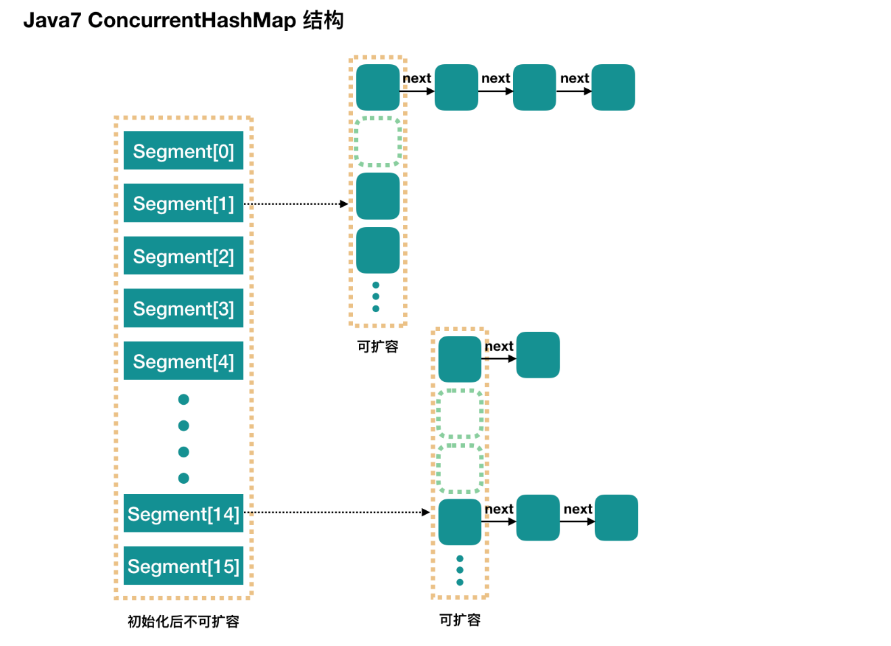


**并行度（默认16）**

concurrencyLevel：并行级别、并发数、Segment 数，怎么翻译不重要，理解它。默认是 16，也就是说ConcurrentHashMap 有 16 个 Segments，所以理论上，这个时候，最多可以同时支持 16 个线程并发写，只要它们的操作分别分布在不同的 Segment 上。这个值可以在初始化的时候设置为其他值，但是一旦初始化以后，它是不可以扩容的。再具体到每个 Segment 内部，其实每个 Segment 很像之前介绍的 HashMap，不过它要保证线程安全，所以处理起来要麻烦些。


**Java8** **实现 （引入了红黑树）**

Java8 对 ConcurrentHashMap 进行了比较大的改动,Java8 也引入了红黑树。

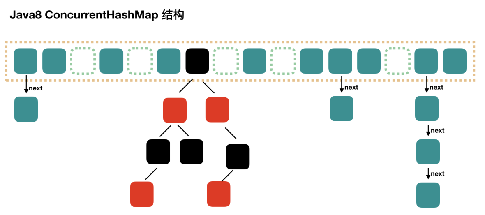


**ConcurrentHashMap并发**

- **减小锁粒度**
- **ConcurrentHashMap 分段锁（Segment）**


**ConcurrentHashMap在1.7和1.8的区别**

- **整体结构**
  - 1.7：`Segment + HashEntry + Unsafe`
  - 1.8：移除Segment，使锁的粒度更小，`Synchronized + CAS + Node + Unsafe`

- **put（）**

  - 1.7：先定位Segment，再定位桶，put全程加锁，没有获取锁的线程提前找桶的位置，并最多自旋64次获取锁，超过则挂起
    1. 定位Segment：先通过key的 `rehash值的高位` 和 `segments数组大小-1` 相与得到在 segments中的位置
    2. 定位桶：然后在通过 `key的rehash值` 和 `table数组大小-1` 相与得到在table中的位置

  - 1.8：由于移除了Segment，可根据 `rehash值` 直接定位到桶，拿到table[i]的 `首节点first`后进行判断：
    1. 如果为 `null` ，通过 `CAS` 的方式把 value put进去
    2. 如果 `非null` ，并且 `first.hash == -1` ，说明其他线程在扩容，参与一起扩容
    3. 如果 `非null` ，并且 `first.hash != -1` ，Synchronized锁住 first节点，判断是链表还是红黑树，遍历插入。

- **get（）**
  - 1.7和1.8基本类似，由于value声明为volatile，保证了修改的可见性，因此不需要加锁

- **resize（）**
  - 1.7：与HashMap的 resize() 没太大区别，都是在 put() 元素时去做的扩容，所以在1.7中的实现是获得了锁之后，在单线程中去做扩容（1.`new个2倍数组`   2.`遍历old数组节点搬去新数组`），避免了HashMap在1.7中扩容时死循环的问题，保证线程安全
  - 1.8：支持并发扩容，HashMap扩容在1.8中由头插改为尾插（为了避免死循环问题），ConcurrentHashmap也是，迁移也是从尾部开始，扩容前在桶的头部放置一个hash值为-1的节点，这样别的线程访问时就能判断是否该桶已经被其他线程处理过了

- **size（）**
  - 1.7：很经典的思路
    1. 先采用不加锁的方式，计算两次，如果两次结果一样，说明是正确的，返回
    2. 如果两次结果不一样，则把所有 segment 锁住，重新计算所有 segment的 `Count` 的和
  - 1.8：由于没有segment的概念，所以只需要用一个 `baseCount` 变量来记录ConcurrentHashMap 当前 `节点的个数`。
    1. 先尝试通过CAS 修改 `baseCount`
    2. 如果多线程竞争激烈，某些线程CAS失败，那就CAS尝试将 `CELLSBUSY` 置1，成功则可以把 `baseCount变化的次数` 暂存到一个数组 `counterCells` 里，后续数组 `counterCells` 的值会加到 `baseCount` 中
    3. 如果 `CELLSBUSY` 置1失败又会反复进行CAS`baseCount` 和 CAS`counterCells`数组


### ConcurrentSkipListMap

ConcurrentSkipListMap是线程安全的有序的哈希表(相当于线程安全的TreeMap)。它继承于AbstractMap类，并且实现ConcurrentNavigableMap接口。ConcurrentSkipListMap是通过“跳表”来实现的，它支持并发。


**数据结构**


ConcurrentSkipListMap是线程安全的有序的哈希表，适用于高并发的场景。ConcurrentSkipListMap和TreeMap，它们虽然都是有序的哈希表。但是，第一，它们的线程安全机制不同，TreeMap是非线程安全的，而ConcurrentSkipListMap是线程安全的。第二，ConcurrentSkipListMap是通过跳表实现的，而TreeMap是通过红黑树实现的。关于跳表(Skip List)，它是平衡树的一种替代的数据结构，但是和红黑树不相同的是，跳表对于树的平衡的实现是基于一种随机化的算法的，这样也就是说跳表的插入和删除的工作是比较简单的。


# Queue

**Queue（队列）是一种特殊的线性表，它只允许在表的前端（front）进行删除操作，只允许在表的后端（rear）进行插入操作。进行插入操作的端称为队尾，进行删除操作的端称为队头。**

每个元素总是从队列的rear端进入队列，然后等待该元素之前的所有元素出队之后，当前元素才能出对，遵循先进先出（FIFO）原则。下面是Queue类的继承关系图：

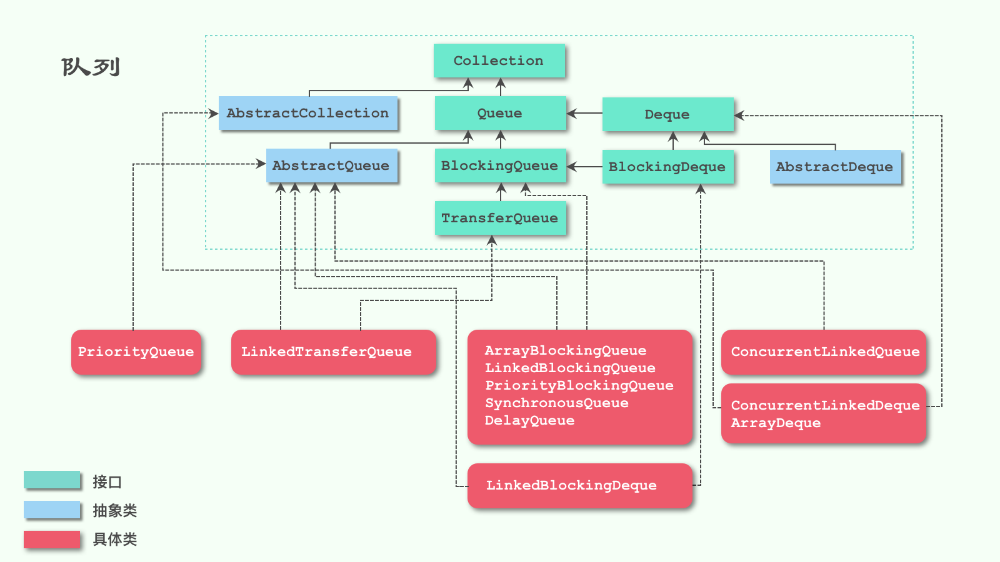

图中我们可以看到，最上层是Collection接口，Queue满足集合类的所有方法：

- **add(E e)：增加元素**
- **remove(Object o)：删除元素**
- **clear()：清除集合中所有元素**
- **size()：集合元素的大小**
- **isEmpty()：集合是否没有元素**
- **contains(Object o)：集合是否包含元素o**


## 队列

### Queue

Queue：队列的上层接口，提供了插入、删除、获取元素这3种类型的方法，而且对每一种类型都提供了两种方式。

**插入方法**

- **add(E e)**：插入元素到队尾，插入成功返回true，没有可用空间抛出异常 IllegalStateException
- **offer(E e)**： 插入元素到队尾，插入成功返回true，否则返回false

add和offer作为插入方法的唯一不同就在于队列满了之后的处理方式。add抛出异常，而offer返回false。


**删除和获取元素方法（和插入方法类似）**

- **remove()**：获取并移除队首的元素，该方法和poll方法的不同之处在于，如果队列为空该方法会抛出异常，而poll不会
- **poll()**：获取并移除队首的元素，如果队列为空，返回null
- **element()**：获取队列首的元素，该方法和peek方法的不同之处在于，如果队列为空该方法会抛出异常，而peek不会
- **peek()**：获取队列首的元素，如果队列为空，返回null

如果队列是空，remove和element方法会抛出异常，而poll和peek返回null。当然，Queue只是单向队列，为了提供更强大的功能，JDK在1.6的时候新增了一个双向队列Deque，用来实现更灵活的队列操作。


### Deque

Deque在Queue的基础上，增加了以下几个方法：

- **addFirst(E e)**：在前端插入元素，异常处理和add一样
- **addLast(E e)**：在后端插入元素，和add一样的效果
- **offerFirst(E e)**：在前端插入元素，异常处理和offer一样
- **offerLast(E e)**：在后端插入元素，和offer一样的效果
- **removeFirst()**：移除前端的一个元素，异常处理和remove一样
- **removeLast()**：移除后端的一个元素，和remove一样的效果
- **pollFirst()**：移除前端的一个元素，和poll一样的效果
- **pollLast()**：移除后端的一个元素，异常处理和poll一样
- **getFirst()**：获取前端的一个元素，和element一样的效果
- **getLast()**：获取后端的一个元素，异常处理和element一样
- **peekFirst()**：获取前端的一个元素，和peek一样的效果
- **peekLast()**：获取后端的一个元素，异常处理和peek一样
- **removeFirstOccurrence(Object o)**：从前端开始移除第一个是o的元素
- **removeLastOccurrence(Object o)**：从后端开始移除第一个是o的元素
- **push(E e)**：和addFirst一样的效果
- **pop()**：和removeFirst一样的效果

其实很多方法的效果都是一样的，只不过名字不同。比如Deque为了实现Stack的语义，定义了push和pop两个方法。


## 阻塞队列

### BlockingQueue

**BlockingQueue（阻塞队列）**，在Queue的基础上实现了阻塞等待的功能。它是JDK 1.5中加入的接口，它是指这样的一个队列：当生产者向队列添加元素但队列已满时，生产者会被阻塞；当消费者从队列移除元素但队列为空时，消费者会被阻塞。

先给出BlockingQueue新增的方法：

- put(E e)：向队尾插入元素。如果队列满了，阻塞等待，直到被中断为止。
- boolean offer(E e, long timeout, TimeUnit unit)：向队尾插入元素。如果队列满了，阻塞等待timeout个时长，如果到了超时时间还没有空间，抛弃该元素。
- take()：获取并移除队首的元素。如果队列为空，阻塞等待，直到被中断为止。
- poll(long timeout, TimeUnit unit)：获取并移除队首的元素。如果队列为空，阻塞等待timeout个时长，如果到了超时时间还没有元素，则返回null。
- remainingCapacity()：返回在无阻塞的理想情况下（不存在内存或资源约束）此队列能接受的元素数量，如果该队列是无界队列，返回Integer.MAX_VALUE。
- drainTo(Collection<? super E> c)：移除此队列中所有可用的元素，并将它们添加到给定 collection 中。
- drainTo(Collection<? super E> c, int maxElements)：最多从此队列中移除给定数量的可用元素，并将这些元素添加到给定 collection 中。

**BlockingQueue**最重要的也就是关于阻塞等待的几个方法，而这几个方法正好可以用来实现**生产-消费的模型**。

从图中我们可以知道实现了BlockingQueue的类有以下几个：

- ArrayBlockingQueue：一个由数组结构组成的有界阻塞队列。
- LinkedBlockingQueue：一个由链表结构组成的有界阻塞队列。
- PriorityBlockingQueue：一个支持优先级排序的无界阻塞队列。
- SynchronousQueue：一个不存储元素的阻塞队列。
- DelayQueue：一个使用优先级队列实现的无界阻塞队列。


#### ArrayBlockingQueue

**ArrayBlockingQueue是一个用数组实现的有界阻塞队列**。此队列按照先进先出（FIFO）的原则对元素进行排序。默认情况下不保证访问者公平的访问队列，所谓公平访问队列是指阻塞的所有生产者线程或消费者线程，当队列可用时，可以按照阻塞的先后顺序访问队列，即先阻塞的生产者线程，可以先往队列里插入元素，先阻塞的消费者线程，可以先从队列里获取元素。通常情况下为了保证公平性会降低吞吐量。

**特性**

- **内部使用循环数组进行存储**
- **内部使用ReentrantLock来保证线程安全**
- **由Condition的await和signal来实现等待唤醒功能**
- **支持对生产者线程和消费者线程进行公平的调度**。默认情况下是不保证公平性的。公平性通常会降低吞吐量，但是减少了可变性和避免了线程饥饿问题


**数据结构 —— 数组**

通常，队列的实现方式有数组和链表两种方式。对于数组这种实现方式来说，我们可以通过维护一个队尾指针，使得在入队的时候可以在O(1)的时间内完成。但是对于出队操作，在删除队头元素之后，必须将数组中的所有元素都往前移动一个位置，这个操作的复杂度达到了O(n)，效果并不是很好。如下图所示：


**数据结构 —— 环型结构**

为了解决这个问题，我们可以使用另外一种逻辑结构来处理数组中各个位置之间的关系。假设现在我们有一个数组A[1…n]，我们可以把它想象成一个环型结构，即A[n]之后是A[1]，相信了解过一致性Hash算法的应该很容易能够理解。如下图所示：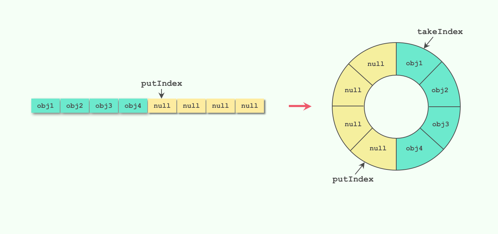

我们可以使用两个指针，分别维护队头和队尾两个位置，使入队和出队操作都可以在O(1)的时间内完成。当然，这个环形结构只是逻辑上的结构，实际的物理结构还是一个普通的数据。


**入队方法**

ArrayBlockingQueue 提供了多种入队操作的实现来满足不同情况下的需求，入队操作有如下几种：

- **boolean add(E e)**：其调用的是父类，即AbstractQueue的add方法，实际上调用的就是offer方法

- **void put(E e)**：在count等于items长度时，一直等待，直到被其他线程唤醒。唤醒后调用enqueue方法放入队列

- **boolean offer(E e)**：offer方法在队列满了的时候返回false，否则调用enqueue方法插入元素，并返回true。

  **enqueue**：方法首先把元素放在items的putIndex位置，接着判断在putIndex+1等于队列的长度时把putIndex设置为0，也就是上面提到的圆环的index操作。最后唤醒等待获取元素的线程。

- **boolean offer(E e, long timeout, TimeUnit unit)**：只是在offer(E e)的基础上增加了超时时间的概念


**出队方法**

ArrayBlockingQueue提供了多种出队操作的实现来满足不同情况下的需求，如下：

- **E poll()**：poll方法是非阻塞方法，如果队列没有元素返回null，否则调用dequeue把队首的元素出队列。

  **dequeue**：会根据takeIndex获取到该位置的元素，并把该位置置为null，接着利用圆环原理，在takeIndex到达列表长度时设置为0，最后唤醒等待元素放入队列的线程。

- **E poll(long timeout, TimeUnit unit)**：该方法是poll()的可配置超时等待方法，和上面的offer一样，使用while循环+Condition的awaitNanos来进行等待，等待时间到后执行dequeue获取元素

- **E take()**：


**获取元素方法**

- **peek()**：这里获取元素时上锁是为了避免脏数据的产生


**删除元素方法**

- **remove(Object o)**：从takeIndex一直遍历到putIndex，直到找到和元素o相同的元素，调用removeAt进行删除。removeAt()：
  - 当removeIndex == takeIndex时就不需要后面的元素整体往前移了，而只需要把takeIndex的指向下一个元素即可（还记得前面说的ArrayBlockingQueue可以类比为圆环吗）
  - 当removeIndex != takeIndex时，通过putIndex将removeIndex后的元素往前移一位


#### LinkedBlockingQueue

**LinkedBlockingQueue是一个用链表实现的有界阻塞队列**。此队列的默认和最大长度为`Integer.MAX_VALUE`，也就是无界队列，所以为了避免队列过大造成机器负载或者内存爆满的情况出现，我们在使用的时候建议手动传一个队列的大小。此队列按照先进先出的原则对元素进行排序。

LinkedBlockingQueue是一个阻塞队列，内部由两个ReentrantLock来实现出入队列的线程安全，由各自的Condition对象的await和signal来实现等待和唤醒功能。


**LinkedBlockingQueue和ArrayBlockingQueue的不同点**

- 队列大小有所不同，ArrayBlockingQueue是有界的初始化必须指定大小，而LinkedBlockingQueue可以是有界的也可以是无界的(Integer.MAX_VALUE)，对于后者而言，当添加速度大于移除速度时，在无界的情况下，可能会造成内存溢出等问题
- 数据存储容器不同，ArrayBlockingQueue采用的是数组作为数据存储容器，而LinkedBlockingQueue采用的则是以Node节点作为连接对象的链表
- 由于ArrayBlockingQueue采用的是数组的存储容器，因此在插入或删除元素时不会产生或销毁任何额外的对象实例，而LinkedBlockingQueue则会生成一个额外的Node对象。这可能在长时间内需要高效并发地处理大批量数据的时，对于GC可能存在较大影响
- 两者的实现队列添加或移除的锁不一样，ArrayBlockingQueue实现的队列中的锁是没有分离的，即添加操作和移除操作采用的同一个ReenterLock锁，而LinkedBlockingQueue实现的队列中的锁是分离的，其添加采用的是putLock，移除采用的则是takeLock，这样能大大提高队列的吞吐量，也意味着在高并发的情况下生产者和消费者可以并行地操作队列中的数据，以此来提高整个队列的并发性能


**入队方法**

LinkedBlockingQueue提供了多种入队操作的实现来满足不同情况下的需求，入队操作有如下几种：

- **void put(E e)**：
  - 队列已满，阻塞等待
  - 队列未满，创建一个node节点放入队列中，如果放完以后队列还有剩余空间，继续唤醒下一个添加线程进行添加。如果放之前队列中没有元素，放完以后要唤醒消费线程进行消费
- **boolean offer(E e)**：offer仅仅对put方法改动了一点点，当队列没有可用元素的时候，不同于put方法的阻塞等待，offer方法直接方法false
- **boolean offer(E e, long timeout, TimeUnit unit)**：该方法只是对offer方法进行了阻塞超时处理，使用了Condition的awaitNanos来进行超时等待。为什么要用while循环？因为awaitNanos方法是可中断的，为了防止在等待过程中线程被中断，这里使用while循环进行等待过程中中断的处理，继续等待剩下需等待的时间


**出队方法**

入队列的方法说完后，我们来说说出队列的方法。LinkedBlockingQueue提供了多种出队操作的实现来满足不同情况下的需求，如下：

- **E take()**：
  - 队列为空，阻塞等待
  - 队列不为空，从队首获取并移除一个元素，如果消费后还有元素在队列中，继续唤醒下一个消费线程进行元素移除。如果放之前队列是满元素的情况，移除完后要唤醒生产线程进行添加元素
- **E poll()**：poll方法去除了take方法中元素为空后阻塞等待
- **E poll(long timeout, TimeUnit unit)**：利用了Condition的awaitNanos方法来进行阻塞等待直至超时


**获取元素方法**

- **peek()**：加锁获取。枷锁后获取到head节点的next节点，如果为空返回null，如果不为空，返回next节点的item值


**删除元素方法**

- **remove(Object o)**：因为remove方法使用两个锁（put锁和take锁）全部上锁，所以其它操作都需要等待它完成，而该方法需要从head节点遍历到尾节点，所以时间复杂度为O(n)


#### PriorityBlockingQueue

**PriorityBlockingQueue是一个支持优先级的无界队列**。默认情况下元素采取自然顺序排列，也可以通过比较器comparator来指定元素的排序规则。元素按照升序排列。


#### SynchronousQueue

**SynchronousQueue是一个不存储元素的阻塞队列**。每一个put操作必须等待一个take操作，否则不能继续添加元素。SynchronousQueue可以看成是一个传球手，负责把生产者线程处理的数据直接传递给消费者线程。队列本身并不存储任何元素，非常适合于传递性场景,比如在一个线程中使用的数据，传递给另外一个线程使用，SynchronousQueue的吞吐量高于LinkedBlockingQueue 和 ArrayBlockingQueue。


#### DelayQueue

**DelayQueue是一个支持延时获取元素的无界阻塞队列**。队列使用PriorityQueue来实现。队列中的元素必须实现Delayed接口，在创建元素时可以指定多久才能从队列中获取当前元素。只有在延迟期满时才能从队列中提取元素。我们可以将DelayQueue运用在以下应用场景：

- 缓存系统的设计：可以用DelayQueue保存缓存元素的有效期，使用一个线程循环查询DelayQueue，一旦能从DelayQueue中获取元素时，表示缓存有效期到了。
- 定时任务调度。使用DelayQueue保存当天将会执行的任务和执行时间，一旦从DelayQueue中获取到任务就开始执行，从比如TimerQueue就是使用DelayQueue实现的。


### BlockingDeque

**BlockingDeque（阻塞双端队列）**在Deque的基础上实现了双端阻塞等待的功能。和第2节说的类似，BlockingDeque也提供了双端队列该有的阻塞等待方法：

- putFirst(E e)：在队首插入元素，如果队列满了，阻塞等待，直到被中断为止。
- putLast(E e)：在队尾插入元素，如果队列满了，阻塞等待，直到被中断为止。
- offerFirst(E e, long timeout, TimeUnit unit)：向队首插入元素。如果队列满了，阻塞等待timeout个时长，如果到了超时时间还没有空间，抛弃该元素。
- offerLast(E e, long timeout, TimeUnit unit)：向队尾插入元素。如果队列满了，阻塞等待timeout个时长，如果到了超时时间还没有空间，抛弃该元素。
- takeFirst()：获取并移除队首的元素。如果队列为空，阻塞等待，直到被中断为止。
- takeLast()：获取并移除队尾的元素。如果队列为空，阻塞等待，直到被中断为止。
- pollFirst(long timeout, TimeUnit unit)：获取并移除队首的元素。如果队列为空，阻塞等待timeout个时长，如果到了超时时间还没有元素，则返回null。
- pollLast(long timeout, TimeUnit unit)：获取并移除队尾的元素。如果队列为空，阻塞等待timeout个时长，如果到了超时时间还没有元素，则返回null。
- removeFirstOccurrence(Object o)：从队首开始移除第一个和o相等的元素。
- removeLastOccurrence(Object o)：从队尾开始移除第一个和o相等的元素。


#### LinkedBlockingDeque

**LinkedBlockingDeque是一个由链表结构组成的双向阻塞队列**，即可以从队列的两端插入和移除元素。双向队列因为多了一个操作队列的入口，在多线程同时入队时，也就减少了一半的竞争。`LinkedBlockingDeque`是可选容量的，在初始化时可以设置容量防止其过度膨胀，如果不设置，默认容量大小为`Integer.MAX_VALUE`。

相比于其它阻塞队列，LinkedBlockingDeque多了addFirst、addLast、peekFirst、peekLast等方法，以first结尾的方法，表示插入、获取获移除双端队列的第一个元素。以last结尾的方法，表示插入、获取获移除双端队列的最后一个元素。


**LinkedBlockingDeque和LinkedBlockingQueue的相同点**

- 基于链表
- 容量可选，不设置的话，就是Int的最大值


**LinkedBlockingDeque和LinkedBlockingQueue的不同点**

- 双端链表和单链表
- 不存在头节点
- 一把锁+两个条件


**入队方法**

LinkedBlockingDeque提供了多种入队操作的实现来满足不同情况下的需求，入队操作有如下几种：

- add(E e)、addFirst(E e)、addLast(E e)
- offer(E e)、offerFirst(E e)、offerLast(E e)
- offer(E e, long timeout, TimeUnit unit)、offerFirst(E e, long timeout, TimeUnit unit)、offerLast(E e, long timeout, TimeUnit unit)
- put(E e)、putFirst(E e)、putLast(E e)


**出队方法**

入队列的方法说完后，我们来说说出队列的方法。LinkedBlockingDeque提供了多种出队操作的实现来满足不同情况下的需求，如下：

- **remove()、removeFirst()、removeLast()**
- **poll()、pollFirst()、pollLast()**
- **take()、takeFirst()、takeLast()**
- **poll(long timeout, TimeUnit unit)、pollFirst(long timeout, TimeUnit unit)、pollLast(long timeout, TimeUnit unit)**


**获取元素方法**

获取元素前加锁，防止并发问题导致数据不一致。利用first和last节点直接可以获得元素。

- **element()**
- **peek()**


**删除元素方法**

删除元素是从头/尾向两边进行遍历比较，故时间复杂度为O(n)，最后调用unlink把要移除元素的prev和next进行关联，把要移除的元素从链中脱离，等待下次GC回收。

- **remove(Object o)**：


### TransferQueue

TransferQueue是JDK 1.7对于并发类库新增加的一个接口，它扩展自BlockingQueue，所以保持着阻塞队列的所有特性。

TransferQueue对比与BlockingQueue更强大的一点是，生产者会一直阻塞直到所添加到队列的元素被某一个消费者所消费（不仅仅是添加到队列里就完事）。新添加的transfer方法用来实现这种约束。顾名思义，阻塞就是发生在元素从一个线程transfer到另一个线程的过程中，它有效地实现了元素在线程之间的传递（以建立Java内存模型中的happens-before关系的方式）。


该接口提供的标准方法：

- tryTransfer(E e)：若当前存在一个正在等待获取的消费者线程（使用take()或者poll()函数），使用该方法会即刻转移/传输对象元素e并立即返回true；**若不存在，则返回false，并且不进入队列。这是一个不阻塞的操作**
- transfer(E e)：若当前存在一个正在等待获取的消费者线程，即立刻移交之；**否则，会插入当前元素e到队列尾部，并且等待进入阻塞状态，到有消费者线程取走该元素**
- tryTransfer(E e, long timeout, TimeUnit unit)：若当前存在一个正在等待获取的消费者线程，会立即传输给它;**否则将插入元素e到队列尾部，并且等待被消费者线程获取消费掉；若在指定的时间内元素e无法被消费者线程获取，则返回false，同时该元素被移除**
- hasWaitingConsumer()：判断是否存在消费者线程
- getWaitingConsumerCount()：获取所有等待获取元素的消费线程数量


#### LinkedTransferQueue

LinkedTransferQueue 是**单向链表结构的无界阻塞队列**。

LinkedTransferQueue(LTQ) 相比 BlockingQueue 更进一步，**生产者会一直阻塞直到所添加到队列的元素被某一个消费者所消费（不仅仅是添加到队列里就完事）**。新添加的 transfer 方法用来实现这种约束。顾名思义，阻塞就是发生在元素从一个线程 transfer 到另一个线程的过程中，它有效地实现了元素在线程之间的传递（以建立 Java 内存模型中的 happens-before 关系的方式）。**Doug Lea 说从功能角度来讲，LinkedTransferQueue 实际上是 ConcurrentLinkedQueue、SynchronousQueue（公平模式）和 LinkedBlockingQueue 的超集。**而且 LinkedTransferQueue 更好用，因为它不仅仅综合了这几个类的功能，同时也提供了更高效的实现。


# Thread

**什么是进程 ？**

进程是**资源分配的最小单位**。（资源包括各种表格、内存空间、磁盘空间） 同一进程中的多条线程将共享该进程中的全部系统资源。

**什么是线程 ？**

线程是**CPU调度的最小单位**。线程只由相关堆栈（系统栈或用户栈）寄存器和线程控制表组成。 而寄存器可被用来存储线程内的局部变量。

**什么是并行和并发 ？**

- **并行运行**：总线程数≤CPU数量×核心数
- **并发运行**：总线程数>CPU数量×核心数（如：有的操作系统CPU线程切换之间用的时间片轮转进程调度算法）


**线程优缺点**

- **优点**
  - 创建一个新线程的代价要比创建一个新进程小的多
  - 线程之间的切换相较于进程之间的切换需要操作系统做的工作很少
  - 线程占用的资源要比进程少很多
  - 能充分利用多处理器的可并行数量
  - 等待慢速IO操作结束以后，程序可以继续执行其他的计算任务
  - 计算（CPU）密集型应用，为了能在多处理器系统上运行，将计算分解到多个线程中实现
  - IO密集型应用，为了提高性能，将IO操作重叠，线程可以等待不同的IO操作

- **缺点**
  - 性能损失
  - 健壮性降低
  - 缺乏访问控制
  - 编程难度提高


## 线程实现方式

**实现线程**只有一种方式：

- **new Thread()**


**实现线程执行内容**有两种方式：

- **继续Thread类**：Thread实现了Runable接口
- **实现Runable接口**：new Thread(new Runable(){……})，本质是通过Thread的run()进行调用触发


更多实现线程执行内容的方式，只需在此基础上进行封装：

- **线程池创建线程**：本质是通过 new Thread() 的方式实现
- **有返回值的Callable创建线程**：需要提交到线程池中执行。本质是通过实例化Thread的方式实现
- **定时器Timer**：本质是继承自 Thread 类实现


**Thread、Runnable和Callable的区别**

- Runnable相对于Thread的优势是：**避免单继承**的局限，适合于**资源共享**场景
- Thread使用JNI调用(native修饰的start0方法)系统函数来完成start，Runnable则由JVM来实现start，Callable也需要调用Thread.start()启动线程
- 一般情况，多线程中优先选择实现Runnable接口
- Callable能返回任务线程执行结果，而Runable不能返回
- Callable的call方法允许抛出异常，而Runable异常只能在run方法内部消化


**Thread.sleep(0)的作用是什么？**

由于Java采用抢占式的线程调度算法，因此可能会出现某条线程常常获取到CPU控制权的情况，为了让某些优先级比较低的线程也能获取到CPU控制权，可以使用Thread.sleep(0)手动触发一次操作系统分配时间片的操作，这也是平衡CPU控制权的一种操作。


**wait()和sleep()的区别？**

- wait()来自Object ，sleep()来自Thread 
- 调用wait()时线程会释放锁，调用sleep()时线程不会释放对象锁（只是暂时让出CPU的执行权）
- wait()只能在同步控制方法或者同步控制块中使用，sleep()可以在任何地方使用
- wait()可以通过notify()或notifyAll()被结束 ，sleep()只能等待休眠时间到期后才结束


## 线程创建方式

- 继承Thread类
- 实现Runnable接口
- ExecutorService、Callable、Future有返回值线程
- 基于线程池的方式


## 线程生命周期

Linux中线程状态一共有5种：

- **初始状态（New）**：对应 Java中的 **NEW** 状态
- **可运行状态（Ready）**：对应 Java中的 **RUNNBALE** 状态
- **运行状态（Running）**：对应 Java中的 **RUNNBALE** 状态
- **等待状态（Waiting）**：该状态在 Java中被划分为了 **BLOCKED**、**WAITING**、**TIMED_WAITING** 三种状态
- **终止状态 （Terminated）**：对应 Java中的 **TERMINATED** 状态


Java中线程状态一共有6种（生命周期）：

- **New（新创建）**：新创建了一个线程对象，但还没有调用start()方法
- **Runnable（可运行）**：Java线程中将就绪（ready）和运行中（running）两种状态笼统的称为“运行”。线程对象创建后，其它线程(比如main线程）调用了该对象的start()方法。该状态的线程位于可运行线程池中，等待被线程调度选中，获取CPU的使用权，此时处于就绪状态（ready）。就绪状态的线程在获得CPU时间片后变为运行中状态（running）
- **Blocked（被阻塞）**：表示线程阻塞于锁
- **Waiting（等待）**：进入该状态的线程需要等待其他线程做出一些特定动作（通知或中断）
- **Timed Waiting（计时等待）**：该状态不同于WAITING，它可以在指定的时间后自行返回
- **Terminated（被终止）**：表示该线程已经执行完毕。线程run()、main() 方法执行结束，或者因异常退出了run()方法，则该线程结束生命周期。死亡的线程不可再次复生。在一个终止的线程上调用start()方法，会抛出java.lang.IllegalThreadStateException异常


如果想要确定线程当前的状态，可以通过 getState() 方法，并且线程在任何时刻只可能处于 1 种状态。线程状态切换：

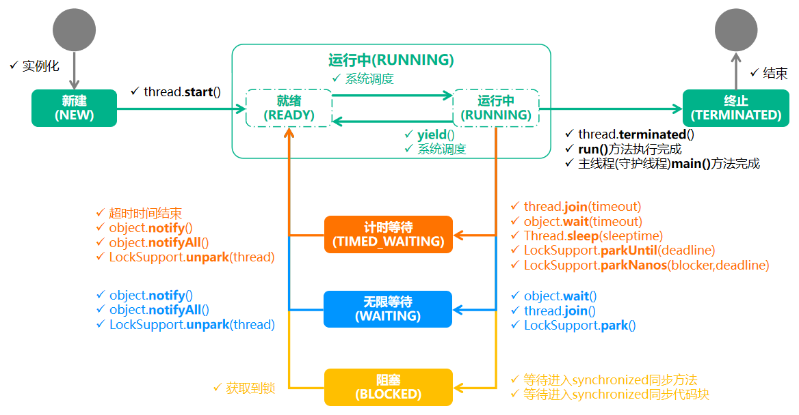


### 新建状态(NEW)


New 表示线程被创建但尚未启动的状态：当我们用 new Thread() 新建一个线程时，如果线程没有开始运行 start() 方法，所以也没有开始执行 run() 方法里面的代码，那么此时它的状态就是 New。而一旦线程调用了 start()，它的状态就会从 New 变成 Runnable，也就是状态转换图中中间的这个大方框里的内容。


### 可运行状态(RUNNABLE)

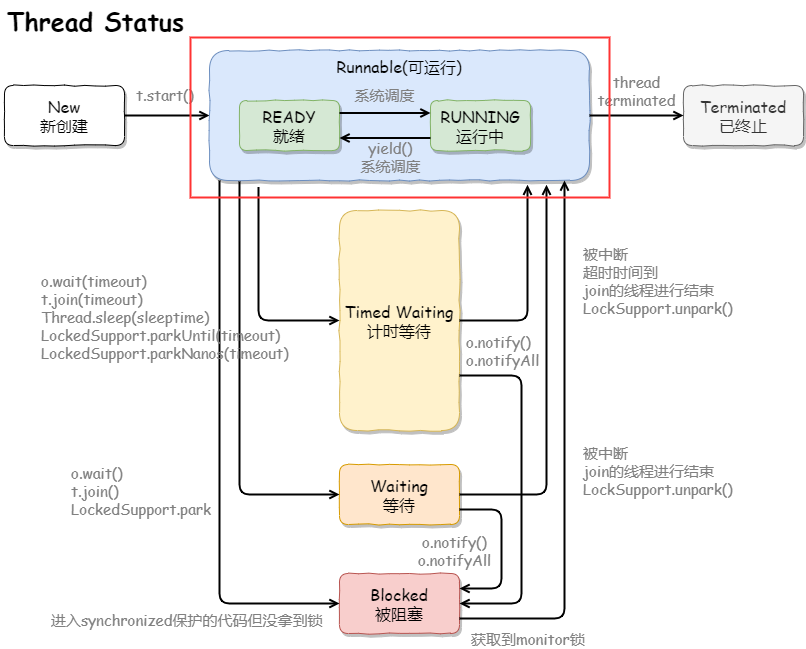

Java 中的 Runable 状态对应操作系统线程状态中的两种状态，分别是 Running 和 Ready，也就是说，Java 中处于 Runnable 状态的线程有可能正在执行，也有可能没有正在执行，正在等待被分配 CPU 资源。

所以，如果一个正在运行的线程是 Runnable 状态，当它运行到任务的一半时，执行该线程的 CPU 被调度去做其他事情，导致该线程暂时不运行，它的状态依然不变，还是 Runnable，因为它有可能随时被调度回来继续执行任务。


### 被阻塞状态(BLOCKED)

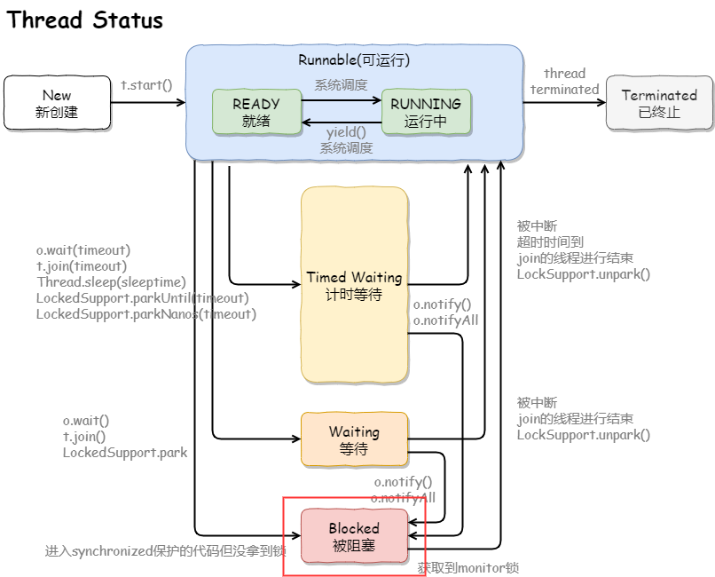

首先来看最简单的 Blocked，从箭头的流转方向可以看出，从 Runnable 状态进入 Blocked 状态只有一种可能，就是进入 synchronized 保护的代码时没有抢到 monitor 锁，无论是进入 synchronized 代码块，还是 synchronized 方法，都是一样。当处于 Blocked 的线程抢到 monitor 锁，就会从 Blocked 状态回到Runnable 状态。


### 等待状态(WAITING)

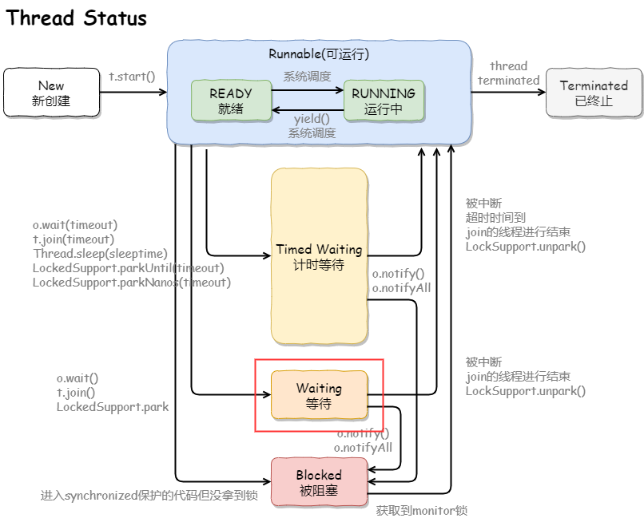

线程进入 Waiting 状态有三种可能性：

- 没有设置 Timeout 参数的 Object.wait() 方法
- 没有设置 Timeout 参数的 Thread.join() 方法
- LockSupport.park() 方法

Blocked 仅仅针对 synchronized monitor 锁，可是在 Java 中还有很多其他的锁，比如 ReentrantLock，如果线程在获取这种锁时没有抢到该锁就会进入 Waiting 状态，因为本质上它执行了 LockSupport.park() 方法，所以会进入 Waiting 状态。同样，Object.wait() 和 Thread.join() 也会让线程进入 Waiting 状态。 

Blocked 与 Waiting 的区别是 Blocked 在等待其他线程释放 monitor 锁，而 Waiting 则是在等待某个条件，比如 join 的线程执行完毕，或者是 notify()/notifyAll() 。


### 计时等待状态(TIMED_WAITING)

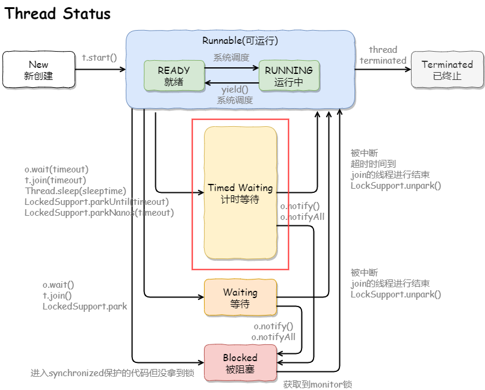

在 Waiting 上面是 Timed Waiting 状态，这两个状态是非常相似的，区别仅在于有没有时间限制，Timed Waiting 会等待超时，由系统自动唤醒，或者在超时前被唤醒信号唤醒。以下情况会让线程进入 Timed Waiting 状态。

- 设置了时间参数的 Thread.sleep(long millis) 方法
- 设置了时间参数的 Object.wait(long timeout) 方法
- 设置了时间参数的 Thread.join(long millis) 方法
- 设置了时间参数的 LockSupport.parkNanos(long nanos) 方法和 LockSupport.parkUntil(long deadline) 方法


### 已终止状态(TERMINATED)

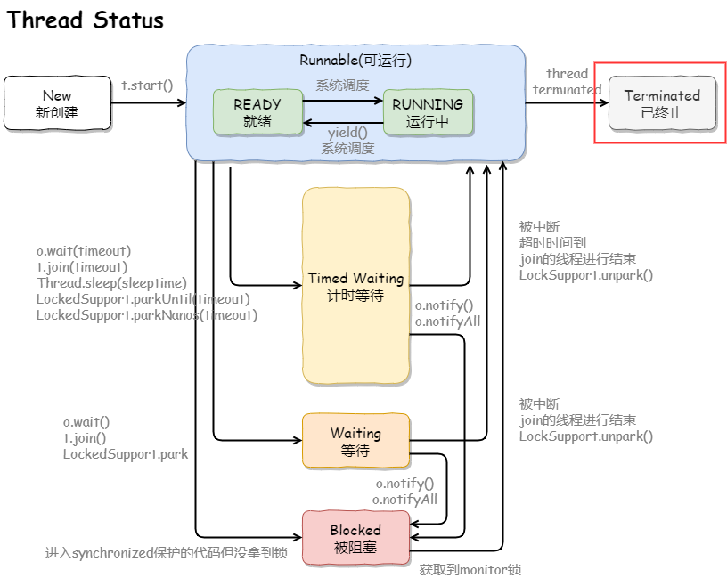

线程会以下面三种方式结束，结束后就是终止状态：

- **正常结束**：run()或 call()方法执行完成，线程正常结束

- **异常结束**：线程抛出一个未捕获的 Exception 或 Error

- **调用** **stop**：直接调用该线程的 stop()方法来结束该线程—该方法通常容易导致死锁，不推荐使用


## JDK线程池

### newCachedThreadPool

创建一个可根据需要创建新线程的线程池，但是在以前构造的线程可用时将重用它们。对于执行很多短期异步任务的程序而言，这些线程池通常可提高程序性能。调用 execute 将重用以前构造的线程（如果线程可用）。如果现有线程没有可用的，则创建一个新线程并添加到池中。终止并从缓存中移除那些已有 60 秒钟未被使用的线程。因此，长时间保持空闲的线程池不会使用任何资源。


### newFixedThreadPool

创建一个可重用固定线程数的线程池，以共享的无界队列方式来运行这些线程。在任意点，在大多数 nThreads 线程会处于处理任务的活动状态。如果在所有线程处于活动状态时提交附加任务，则在有可用线程之前，附加任务将在队列中等待。如果在关闭前的执行期间由于失败而导致任何线程终止，那么一个新线程将代替它执行后续的任务（如果需要）。在某个线程被显式地关闭之前，池中的线程将一直存在。


### newScheduledThreadPool

创建一个线程池，它可安排在给定延迟后运行命令或者定期地执行。


### newSingleThreadExecutor

Executors.newSingleThreadExecutor()返回一个线程池（这个线程池只有一个线程），这个线程池可以在线程死后（或发生异常时）重新启动一个线程来替代原来的线程继续执行下去。


## 线程方法

### 线程等待(wait)

调用该方法的线程进入 WAITING 状态，只有等待另外线程的通知或被中断才会返回，需要注意的是调用 wait()方法后，会释放对象的锁。因此，wait 方法一般用在同步方法或同步代码块中。


### 线程睡眠(sleep)

sleep 导致当前线程休眠，与 wait 方法不同的是 sleep 不会释放当前占有的锁,sleep(long)会导致线程进入 TIMED-WATING 状态，而 wait()方法会导致当前线程进入 WATING 状态。


### 线程让步(yield)

yield 会使当前线程让出 CPU 执行时间片，与其他线程一起重新竞争 CPU 时间片。一般情况下，优先级高的线程有更大的可能性成功竞争得到 CPU 时间片，但这又不是绝对的，有的操作系统对线程优先级并不敏感。


### 线程中(interrupt)

中断一个线程，其本意是给这个线程一个通知信号，会影响这个线程内部的一个中断标识位。这个线程本身并不会因此而改变状态(如阻塞，终止等)。


### 等待其他线程终止(join)

join() 方法，等待其他线程终止，在当前线程中调用一个线程的 join() 方法，则当前线程转为阻塞状态，回到另一个线程结束，当前线程再由阻塞状态变为就绪状态，等待 cpu 的宠幸。


### 线程唤醒(notify)

Object 类中的 notify() 方法，唤醒在此对象监视器上等待的单个线程，如果所有线程都在此对象上等待，则会选择唤醒其中一个线程，选择是任意的，并在对实现做出决定时发生，线程通过调用其中一个 wait() 方法，在对象的监视器上等待，直到当前的线程放弃此对象上的锁定，才能继续执行被唤醒的线程，被唤醒的线程将以常规方式与在该对象上主动同步的其他所有线程进行竞争。类似的方法还有 notifyAll() ，唤醒再次监视器上等待的所有线程。


## 线程安全

线程安全是指当多个线程访问某个类时，该类始终都表现正确行为，则称该类是线程安全的。


**出现线程安全问题的原因？**

在多个线程并发环境下，多个线程共同访问同一共享内存资源时，其中一个线程对资源进行写操作的中途(写⼊入已经开始，但还没结束)，其他线程对这个写了一半的资源进⾏了读操作，或者对这个写了一半的资源进⾏了写操作，导致此资源出现数据错误。


**如何避免线程安全问题？**

- 保证共享资源在同一时间只能由一个线程进行操作(原子性，有序性)
- 将线程操作的结果及时刷新，保证其他线程可以立即获取到修改后的最新数据（可见性）


## 线程同步

多个线程操作一个资源的情况下，导致资源数据前后不一致。这样就需要协调线程的调度，即线程同步。线程同步的方式：

- **同步方法（synchronized ）**
- **同步代码块（synchronized ）**
- **使用特殊域变量（volatile）实现线程同步**
- **使用重入锁（ReentrantLock）实现线程同步**
- **使用局部变量（ThreadLocal）实现线程同步**
- **使用阻塞队列（LinkedBlockingQueue）实现线程同步**
- **使用原子变量（AtomicXxx）实现线程同步**


## 多线程通信

多线程通讯的方式主要包括以下几种：

- **使用volatile关键词：基于共享内存的思想**
- **使用Synchronized+Object类的wait()/notify()/notifyAll()方法**
- **使用JUC工具类CountDownLatch：基于共享变量state实现**
- **使用Lock（ReentrantLock）结合Condition**
- **基于LockSupport实现线程间的阻塞和唤醒**


## 线程协作

### sleep/yield/join

**sleep()**

 - 让当前线程暂停指定的时间（毫秒）
  - wait方法依赖于同步，而sleep方法可以直接调用
  - sleep方法只是暂时让出CPU的执行权，并不释放锁，而wait方法则需要释放锁

**yield()**

 - 暂停当前线程，让出当前CPU的使用权，以便其它线程有机会执行
  - 不能指定暂停的时间，并且也不能保证当前线程马上停止
  - 会让当前线程从运行状态转变为就绪状态
  - yield只能使同优先级或更高优先级的线程有执行的机会

**join()**

 - 等待调用 join 方法的线程执行结束，才执行后面的代码
  - 其调用一定要在 start 方法之后（看源码可知）
  - 作用是父线程等待子线程执行完成后再执行（即将异步执行的线程合并为同步的线程）


### wait/notify/notifyAll

一般需要配合**synchronized**一起使用。**Object**的主要方法如下：

- **wait()**：阻塞当前线程，直到 notify 或者 notifyAll 来唤醒
- **notify()**：只能唤醒一个处于 wait 的线程
- **notifyAll()**：唤醒全部处于 wait 的线程


### await/signal/signalAll

使用显式的 **Lock** 和 **Condition** 对象：

- **await()**：当前线程进入等待状态，直到被通知（signal/signalAll）、中断或超时
- **signal()**：唤醒一个等待在Condition上的线程，将该线程从**等待队列**中转移到**同步队列**中

- **signalAll()**：能够唤醒所有等待在Condition上的线程


## 线程死锁

**造成死锁的原因？**

多个线程竞争共享资源，由于资源被占用、资源不足或进程推进顺序不当等原因造成线程处于永久阻塞状态，从而引发死锁。死锁形成的原因：

- 系统资源不足
- 进程（线程）推进的顺序不恰当
- 资源分配不当


**死锁的解决办法？**

- 让程序每次至多只能获得一个锁（多线程环境中并不现实）
- 设计时考虑清楚锁的顺序，尽量减少嵌套加锁和交互数量
- 设置锁等待时间上限


## 守护线程

守护线程（daemon=true）：当线程只剩下守护线程的时候，JVM就会退出；但是如果还有其它的任意一个用户线程还在，JVM就不会退出。在Java中有两类线程：**User Thread(用户线程)、Daemon Thread(守护线程)** 

- thread.setDaemon(true)必须在thread.start()之前设置，否则会跑出一个IllegalThreadStateException异常
- 在Daemon线程中产生的新线程也是Daemon的
- 不要认为所有的应用都可以分配给Daemon来进行服务，比如读写操作或者计算逻辑


## 常见问题

**sleep与wait区别**

- 来源不同：**wait** 来自**Object**，**sleep** 来自 **Thread**
- 是否释放锁：**wait** 释放锁，**sleep** 不释放
- 使用范围：**wait** 必须在同步代码块中，**sleep** 可以任意使用
- 捕捉异常：**wait** 不需要捕获异常，**sleep** 需捕获异常


**start与run区别**

- start()方法来启动线程，真正实现了多线程运行。这时无需等待 run 方法体代码执行完毕，可以直接继续执行下面的代码
- 通过调用 Thread 类的 start()方法来启动一个线程， 这时此线程是处于就绪状态， 并没有运行
- 方法 run()称为线程体，它包含了要执行的这个线程的内容，线程就进入了运行状态，开始运行 run 函数当中的代码。 Run 方法运行结束， 此线程终止。然后 CPU 再调度其它线程


**yield跟sleep区别**

- **yield** 跟 **sleep** 都能暂停当前线程，都**不会释放锁资源**，**sleep** 可以指定具体休眠的时间，而 **yield** 则依赖 **CPU** 的时间片划分
- **sleep**方法给其他线程运行机会时不考虑线程的优先级，因此会给低优先级的线程以运行的机会。**yield**方法只会给相同优先级或更高优先级的线程以运行的机会
- 调用 **sleep** 方法使线程进入**等待状态**，等待休眠时间达到，而调用我们的 **yield**方法，线程会进入**就绪状态**，也就是**sleep**需要等待设置的时间后才会进行**就绪状态**，而**yield**会立即进入**就绪状态**
- **sleep**方法声明会抛出 **InterruptedException**，而 **yield** 方法没有声明任何异常
- **yield** 不能被中断，而 **sleep** 则可以接受中断
- **sleep**方法比**yield**方法具有更好的移植性(跟操作系统CPU调度相关)


## ThreadLocal

把ThreadLocal看成一个全局Map<Thread, Object>，每个线程获取ThreadLocal变量时，总是**使用Thread自身作为key**。相当于给每个线程都开辟了一个独立的存储空间，**各个线程的ThreadLocal关联的实例互不干扰**。

- ThreadLocal表示线程的"局部变量"，它确保每个线程的ThreadLocal变量都是各自独立的
- ThreadLocal适合在一个线程的处理流程中保持上下文（避免了同一参数在所有方法中传递）
- 使用ThreadLocal要用try ... finally结构，并在finally中清除


ThreadLocal常用的方法

- set：为当前线程设置变量，当前ThreadLocal作为索引
- get：获取当前线程变量，当前ThreadLocal作为索引
- initialValue（钩子方法需要子类实现）：赖加载形式初始化线程本地变量，执行get时，发现线程本地变量为null，就会执行initialValue的内容
- remove：清空当前线程的ThreadLocal索引与映射的元素


### 底层结构

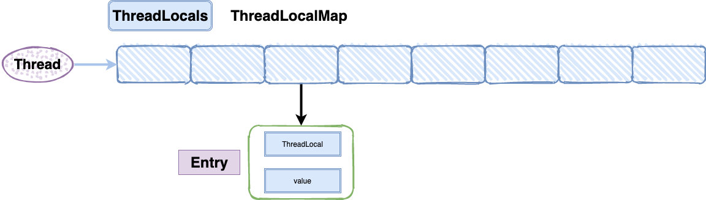


### set流程

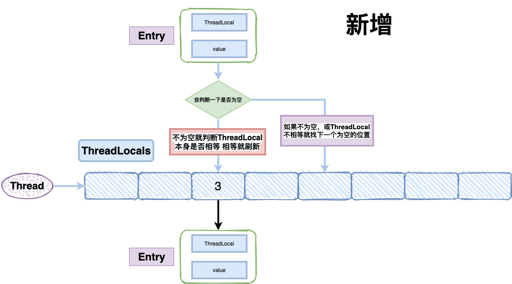

然后会判断一下：如果当前位置是空的，就初始化一个Entry对象放在位置i上；

```java
private void set(ThreadLocal<?> key, Object value) {
    Entry[] tab = table;
    int len = tab.length;
    // 根据ThreadLocal对象的hash值，定位到table中的位置i
    int i = key.threadLocalHashCode & (len - 1);
    for (Entry e = tab[i];
         e != null;
         e = tab[i = nextIndex(i, len)]) {
        ThreadLocal<?> k = e.get();
        
        // 如果位置i不为空，如果这个Entry对象的key正好是即将设置的key，那么就刷新Entry中的value
        if (k == key) {
            e.value = value;
            return;
        }
        
        // 如果当前位置是空的，就初始化一个Entry对象放在位置i上
        if (k == null) {
            replaceStaleEntry(key, value, i);
            return;
        }
        
        // 如果位置i的不为空，而且key不等于entry，那就找下一个空位置，直到为空为止
    }
    
    tab[i] = new Entry(key, value);
    int sz = ++size;
    if (!cleanSomeSlots(i, sz) && sz >= threshold)
        rehash();
}
```


### get流程

在get的时候，也会根据ThreadLocal对象的hash值，定位到table中的位置，然后判断该位置Entry对象中的key是否和get的key一致，如果不一致，就判断下一个位置，set和get如果冲突严重的话，效率还是很低的。

```java
private Entry getEntryAfterMiss(ThreadLocal<?> key, int i, Entry e) {
    Entry[] tab = table;
    int len = tab.length;
    // get的时候一样是根据ThreadLocal获取到table的i值，然后查找数据拿到后会对比key是否相等  if (e != null && e.get() == key)。
    while (e != null) {
        ThreadLocal<?> k = e.get();
        // 相等就直接返回，不相等就继续查找，找到相等位置。
        if (k == key)
            return e;
        if (k == null)
            expungeStaleEntry(i);
        else
            i = nextIndex(i, len);
        e = tab[i];
    }
    return null;
}
```


**如果想共享线程的ThreadLocal数据怎么办？**

使用`InheritableThreadLocal`可以实现多个线程访问ThreadLocal的值，我们在主线程中创建一个`InheritableThreadLocal`的实例，然后在子线程中得到这个`InheritableThreadLocal`实例设置的值。


### 内存泄露

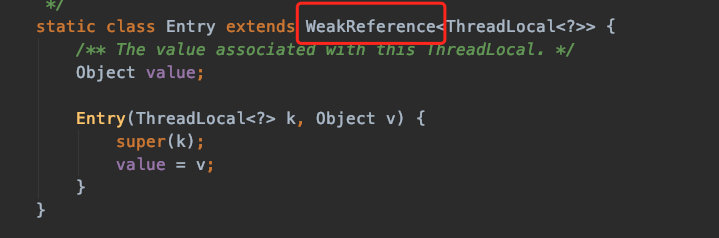

ThreadLocal在保存的时候会把自己当做Key存在ThreadLocalMap中，正常情况应该是key和value都应该被外界强引用才对，但是现在key被设计成WeakReference弱引用了。

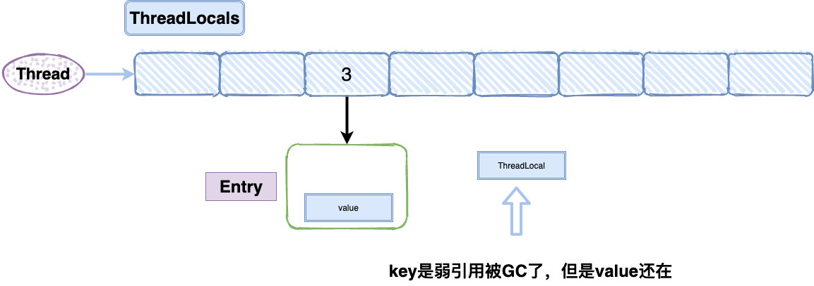

**弱引用**：只具有弱引用的对象拥有更短暂的生命周期，在垃圾回收器线程扫描它所管辖的内存区域的过程中，一旦发现了只具有弱引用的对象，不管当前内存空间足够与否，都会回收它的内存。不过，由于垃圾回收器是一个优先级很低的线程，因此不一定会很快发现那些只具有弱引用的对象。

这就导致了一个问题，ThreadLocal在没有外部强引用时，发生GC时会被回收，如果创建ThreadLocal的线程一直持续运行，那么这个Entry对象中的value就有可能一直得不到回收，发生内存泄露。

**解决**：在finally中remove即可。

**那为什么ThreadLocalMap的key要设计成弱引用？**key不设置成弱引用的话就会造成和entry中value一样内存泄漏的场景。


### InheritableThreadLocal

`InheritableThreadLocal` 是 JDK 本身自带的一种线程传递解决方案。顾名思义，由当前线程创建的线程，将会继承当前线程里 ThreadLocal 保存的值。

`JDK`的`InheritableThreadLocal`类可以完成父线程到子线程的值传递。但对于使用线程池等会池化复用线程的执行组件的情况，线程由线程池创建好，并且线程是池化起来反复使用的；这时父子线程关系的`ThreadLocal`值传递已经没有意义，应用需要的实际上是把 **任务提交给线程池时**的`ThreadLocal`值传递到 **任务执行时**。


### TransmittableThreadLocal

**TransmittableThreadLocal** 是Alibaba开源的、用于解决 **“在使用线程池等会缓存线程的组件情况下传递ThreadLocal”** 问题的 InheritableThreadLocal 扩展。若希望 TransmittableThreadLocal 在线程池与主线程间传递，需配合 TtlRunnable 和 TtlCallable使用。


**使用场景**

- 分布式跟踪系统
- 应用容器或上层框架跨应用代码给下层SDK传递信息
- 日志收集记录系统上下文


## ThreadPoolExecutor

ThreadPoolExecutor是如何运行，如何同时维护线程和执行任务的呢？其运行机制如下图所示：


线程池在内部实际上构建了一个生产者消费者模型，将线程和任务两者解耦，并不直接关联，从而良好的缓冲任务，复用线程。线程池的运行主要分成两部分：任务管理、线程管理。任务管理部分充当生产者的角色，当任务提交后，线程池会判断该任务后续的流转：（1）直接申请线程执行该任务；（2）缓冲到队列中等待线程执行；（3）拒绝该任务。线程管理部分是消费者，它们被统一维护在线程池内，根据任务请求进行线程的分配，当线程执行完任务后则会继续获取新的任务去执行，最终当线程获取不到任务的时候，线程就会被回收。


**线程池（Thread Pool）**

线程池（Thread Pool）是一种基于池化思想管理线程的工具，经常出现在多线程服务器中。

线程过多会带来额外的开销，其中包括创建销毁线程的开销、调度线程的开销等等，同时也降低了计算机的整体性能。线程池维护多个线程，等待监督管理者分配可并发执行的任务。这种做法，一方面避免了处理任务时创建销毁线程开销的代价，另一方面避免了线程数量膨胀导致的过分调度问题，保证了对内核的充分利用。当然，使用线程池可以带来一系列好处：

- **降低资源消耗**：通过池化技术重复利用已创建的线程，降低线程创建和销毁造成的损耗
- **提高响应速度**：任务到达时，无需等待线程创建即可立即执行
- **提高线程的可管理性**：线程是稀缺资源，如果无限制创建，不仅会消耗系统资源，还会因为线程的不合理分布导致资源调度失衡，降低系统的稳定性。使用线程池可以进行统一的分配、调优和监控
- **提供更多更强大的功能**：线程池具备可拓展性，允许开发人员向其中增加更多的功能。比如延时定时线程池ScheduledThreadPoolExecutor，就允许任务延期执行或定期执行


**线程池要解决的两个问题**

- **解决频繁创建和销毁线程所产生的开销**。减少在创建和销毁线程上所花的时间以及系统资源的开销
- **解决无限制创建线程引起系统崩溃**。不使用线程池，可能造成系统创建大量线程而导致消耗完系统内存以及”过度切换”


**多线程优缺点**

- **多线程的优点**
  - 资源利用率更好
  - 程序设计在某些情况下更简单
  - 程序响应更快
- **多线程的缺点**
  - 设计更复杂
  - 上下文切换的开销
  - 增加资源消耗


**线程池类型**

JDK默认提供四种线程池：

- **newCachedThreadPool**：可变尺寸的线程池
- **newFixedThreadPool**：可重用的固定线程数的线程池
- **newScheduledThreadPool**：定时以及周期性执行任务的线程池
- **newSingleThreadExecutor**：单任务的线程池


### 重要参数

- **corePoolSize**（核心线程数，默认值为1）

  - 核心线程会一直存活，即使没有任务需要执行
  - 当线程数＜核心线程数时，即使有线程空闲，线程池也会优先创建新线程处理
  - 设置allowCoreThreadTimeout=true（默认false）时，核心线程会超时关闭

- **maximumPoolSize**（最大线程数，默认值为Integer.MAX_VALUE）

  - 当线程数≥corePoolSize，且任务队列已满时，线程池会创建新线程来处理任务
  - 当线程数=maxPoolSize，且任务队列已满时，线程池会拒绝处理任务而抛出异常

- **keepAliveTime**（线程空闲时间，Single和Fixed默认值为0ms，Cached默认值为60s）

  - 当线程空闲时间达到keepAliveTime时，线程会退出，直到线程数量=corePoolSize
  - 如果allowCoreThreadTimeout=true，则会直到线程数量=0

- **unit**（时间单位）：用于设置keepAliveTime的时间单位

- **workQueue**（任务队列容量，阻塞队列，默认值为Integer.MAX_VALUE）

  - 当核心线程数达到最大时，新任务会放在队列中排队等待执行

- **threadFactory**（ 新建线程工厂）

  - 通常用于线程命名
  - 设置线程守护（daemon）

- **allowCoreThreadTimeout**：允许核心线程超时，默认值为false

- **handler**（任务拒绝处理器，默认值为策略为AbortPolicy）

  以下两种情况会拒绝处理任务：

  - 当线程数已经达到maxPoolSize，切队列已满，会拒绝新任务
  - 当线程池被调用shutdown()后，会等待线程池里的任务执行完毕，再shutdown。如果在调用shutdown()和线程池真正shutdown之间提交任务，会拒绝新任务


### 线程池状态转换

下图为线程池的状态转换过程：
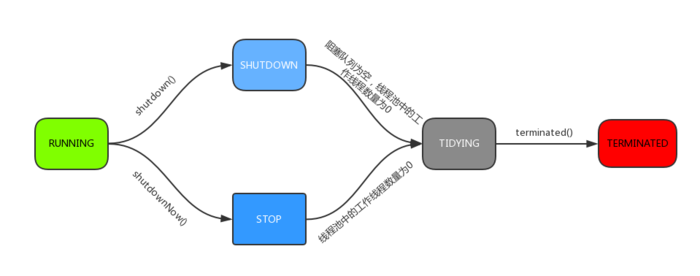

线程池最重要的5种状态：

- **RUNNING**：能接受新提交的任务，并且也能处理阻塞队列中的任务
- **SHUTDOWN**：关闭状态，不再接受新提交的任务，但却可以继续处理阻塞队列中已保存的任务。在线程池处于 RUNNING 状态时，调用 shutdown()方法会使线程池进入到该状态。（finalize() 方法在执行过程中也会调用shutdown()方法进入该状态）
- **STOP**：不能接受新任务，也不处理队列中的任务，会中断正在处理任务的线程。在线程池处于 RUNNING 或 SHUTDOWN 状态时，调用 shutdownNow() 方法会使线程池进入到该状态
- **TIDYING**：如果所有的任务都已终止了，workerCount (有效线程数) 为0，线程池进入该状态后会调用 terminated() 方法进入TERMINATED 状态
- **TERMINATED**：在terminated() 方法执行完后进入该状态，默认terminated()方法中什么也没有做


### execute销毁流程

**execute到线程销毁的整个流程图**


### 线程池的监控

通过线程池提供的参数进行监控。线程池里有一些属性在监控线程池的时候可以使用

- **getTaskCount**：线程池已经执行的和未执行的任务总数
- **getCompletedTaskCount**：线程池已完成的任务数量，该值小于等于taskCount
- **getLargestPoolSize**：线程池曾经创建过的最大线程数量。通过这个数据可以知道线程池是否满过，也就是达到了maximumPoolSize
- **getPoolSize**：线程池当前的线程数量
- **getActiveCount**：当前线程池中正在执行任务的线程数量


### 生命周期

hreadPoolExecutor的运行状态有5种，分别为：


其生命周期转换如下入所示：


### 任务调度


线程池分配线程时，其执行过程如下：

- 首先检测线程池运行状态，如果不是RUNNING，则直接拒绝，线程池要保证在RUNNING的状态下执行任务
- **当线程数＜核心线程数（corePoolSize）**时，每次都创建新线程
- **当线程数 ≥ 核心线程数（corePoolSize）**时
  - **任务队列（queueCapacity）未满**
    - 将任务放入任务队列
  - **任务队列（queueCapacity）已满**
    - **若线程数＜最大线程数（maxPoolSize）**，则创建线程
    - **若线程数 = 最大线程数（maxPoolSize）**，则抛出异常而拒绝任务


### 任务缓冲

任务缓冲模块是线程池能够管理任务的核心部分。线程池的本质是对任务和线程的管理，而做到这一点最关键的思想就是将任务和线程两者解耦，不让两者直接关联，才可以做后续的分配工作。线程池中是以生产者消费者模式，通过一个阻塞队列来实现的。阻塞队列缓存任务，工作线程从阻塞队列中获取任务。使用不同的队列可以实现不一样的任务存取策略。以下是阻塞队列的成员：


### 任务申请

由上文的任务分配部分可知，任务的执行有两种可能：一种是任务直接由新创建的线程执行。另一种是线程从任务队列中获取任务然后执行，执行完任务的空闲线程会再次去从队列中申请任务再去执行。第一种情况仅出现在线程初始创建的时候，第二种是线程获取任务绝大多数的情况。

线程需要从任务缓存模块中不断地取任务执行，帮助线程从阻塞队列中获取任务，实现线程管理模块和任务管理模块之间的通信。这部分策略由getTask方法实现，其执行流程如下图所示：


getTask这部分进行了多次判断，为的是控制线程的数量，使其符合线程池的状态。如果线程池现在不应该持有那么多线程，则会返回null值。工作线程Worker会不断接收新任务去执行，而当工作线程Worker接收不到任务的时候，就会开始被回收。


### 任务拒绝

任务拒绝模块是线程池的保护部分，线程池有一个最大的容量，当线程池的任务缓存队列已满，并且线程池中的线程数目达到maximumPoolSize时，就需要拒绝掉该任务，采取任务拒绝策略，保护线程池。拒绝策略是一个接口，其设计如下：


### 并发类型

**CPU密集型（CPU-bound）**

CPU密集型（又称计算密集型），是指任务需要进行大量复杂的运算，几乎没有阻塞，需要CPU长时间高速运行。在多核CPU时代，我们要让每一个CPU核心都参与计算，将CPU的性能充分利用起来，这样才算是没有浪费服务器配置，如果在非常好的服务器配置上还运行着单线程程序那将是多么重大的浪费。对于计算密集型的应用，完全是靠CPU的核数来工作，所以为了让它的优势完全发挥出来，**避免过多的线程上下文切换**，比较理想方案是：

`线程数 = CPU核数 + 1`

JVM可运行的CPU核数可以通过`Runtime.getRuntime().availableProcessors()`查看。也可设置成CPU核数×2 ，这还是要看JDK的使用版本以及CPU配置（服务器的CPU有超线程）。对于JDK1.8来说，里面增加了一个并行计算，因此计算密集型的较理想：

`线程数 = CPU内核线程数×2`


**IO密集型（IO-bound）**

对于IO密集型的应用，我们现在做的开发大部分都是WEB应用，涉及到大量的网络传输或磁盘读写，线程花费更多的时间在IO阻塞上，而不是CPU运算。如与数据库和缓存之间的交互也涉及到IO，一旦发生IO，线程就会处于等待状态，当IO结束且数据准备好后，线程才会继续执行。因此对于IO密集型的应用，我们可以多设置一些线程池中线程的数量（但不宜过多，因为线程上下文切换是有代价的），这样就能让在等待IO的这段时间内，线程可以去做其它事，提高并发处理效率。对于IO密集型应用：

`线程数=CPU数/(1-阻塞系数)`

 `阻塞系数=线程等待时间/(线程等待时间+CPU处理时间) `

或  `线程数=CPU核数×2 + 1`

这个阻塞系数一般为 **0.8~0.9** 之间，也可以取0.8或者0.9。套用公式，对于双核CPU来说，它比较理想的线程数就是：2÷(1-0.9)=20，当然这都不是绝对的，需要根据实际情况以及实际业务来调整。


### 参数计算 

**目标假设**

- **tasks** ：每秒的任务数假设为**500~1000**
- **taskCost**：每个任务花费时间假设为**0.1s**，则
  - **corePoolSize**=TPS÷平均耗时
  - **1÷taskCost**：表示单个线程每秒的处理能力（处理数量）
- **responseTime**：系统允许容忍的最大响应时间，假设为**1s**
  - **queueCapacity**=corePoolSize÷平均耗时×最大容忍耗时


**参数计算**

- **每秒需要多少个线程处理（corePoolSize） = tasks ÷ (1 ÷ taskCost)**

  ① corePoolSize = tasks ÷ (1 ÷ taskCost) = (500~1000) ÷ (1 ÷ 0.1) = 50~100个线程

  ② 根据2/8原则，如果每秒任务数80%都小于800，那么corePoolSize设置为80即可

- **线程池缓冲队列大小（queueCapacity） = (coreSizePool ÷ taskCost) × responseTime**

  ① queueCapacity = 80÷0.1×1 = 80，即队列里的线程可以等待1s，超过了的需要新开线程来执行

  ② 禁止设置为Integer.MAX_VALUE，否则CPU Load会飙满，耗时会变长，内存也会OOM

- **最大线程数（maximumPoolSize ）= (Max(tasks) - queueCapacity) ÷ (1÷taskCost)**

  ① 计算可得 maximumPoolSize = (1000 - 80) ÷ 10 = 92

- rejectedExecutionHandler：根据具体情况来决定，任务不重要可丢弃，任务重要则利用一些缓冲机制来处理

- keepAliveTime和allowCoreThreadTimeout采用默认通常能满足

- prestartAllCoreThreads：调用线程池的prestartAllCoreThreads方法，可以实现提前创建并启动好所有基本线程

**注意：** 以上都是理想值，实际情况下要根据机器性能来决定。如果在未达到最大线程数的情况机器CPU Load已经满了，则需要通过升级硬件和优化代码，降低taskCost来处理。


# Lock

## synchronized

`synchronized` 是依赖监视器 `Monitor` 实现方法同步或代码块同步的，代码块同步使用的是 `monitorenter` 和 `monitorexit` 指令来实现的：

- monitorenter指令：是在编译后插入到同步代码块的开始位置
- monitorexit指令：是插入到方法结束处和异常处的

任何对象都有一个 Monitor 与之关联，当且一个 Monitor 被持有后，它将处于锁定状态。synchronized是一种 **互斥锁**，它通过字节码指令monitorenter和monitorexist隐式的来使用lock和unlock操作，synchronized 具有 **原子性** 和 **可见性** 。

共享资源代码段又称为**临界区**（`critical section`），保证**临界区互斥**，是指执行**临界区**（`critical section`）的只能有一个线程执行，其他线程阻塞等待，达到排队效果。

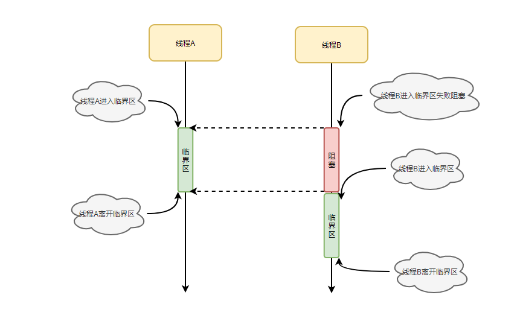


**synchronize缺点**

- 性能较低
- 无法中断一个正在等候获得锁的线程
- 无法通过投票得到锁，如果不想等下去，也就没办法得到锁


**synchronized和lock的区别**

| compare | synchronized             | lock                                      |
| :------ | :----------------------- | :---------------------------------------- |
| 哪层面  | 虚拟机层面               | 代码层面                                  |
| 锁类型  | 可重入、不可中断、非公平 | 可重入、可中断、可公平                    |
| 锁获取  | A线程获取锁，B线程等待   | 可以尝试获取锁，不需要一直等待            |
| 锁释放  | 由JVM 释放锁             | 在finally中手动释放。如不释放，会造成死锁 |
| 锁状态  | 无法判断                 | 可以判断                                  |


### Monitor

在多线程的 JAVA程序中，实现线程之间的同步，就要说说 Monitor。 Monitor是 Java中用以实现线程之间的互斥与协作的主要手段，它可以看成是对象或者 Class的锁。每一个对象都有，也仅有一个 monitor。下面这个图，描述了线程和 Monitor之间关系，以及线程的状态转换图：
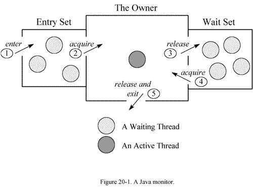

- **进入区(Entrt Set)**：表示线程通过synchronized要求获取对象的锁。如果对象未被锁住，则进入拥有者；否则在进入等待区。一旦对象锁被其他线程释放，立即参与竞争
- **拥有者(The Owner)**：表示某一线程成功竞争到对象锁
- **等待区(Wait Set)** ：表示线程通过对象的wait方法，释放对象的锁，并在等待区等待被唤醒

从图中可以看出，一个 Monitor在某个时刻，只能被一个线程拥有，该线程就是 “Active Thread”，而其它线程都是 “Waiting Thread”，分别在两个队列 “ Entry Set”和 “Wait Set”里面等候。在 “Entry Set”中等待的线程状态是 “Waiting for monitor entry”，而在 “Wait Set”中等待的线程状态是 “in Object.wait()”。 先看 “Entry Set”里面的线程。我们称被 synchronized保护起来的代码段为临界区。当一个线程申请进入临界区时，它就进入了 “Entry Set”队列。


### 使用方式

`Synchronized` 的使用方式有三种：

- **修饰普通函数**。监视器锁（`monitor`）便是对象实例（`this`）
- **修饰静态函数**。视器锁（`monitor`）便是对象的`Class`实例（每个对象只有一个`Class`实例）
- **修饰代码块**。监视器锁（`monitor`）是指定对象实例


**修饰普通函数**

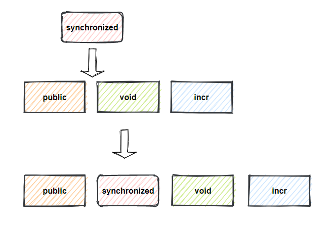

**修饰静态函数**

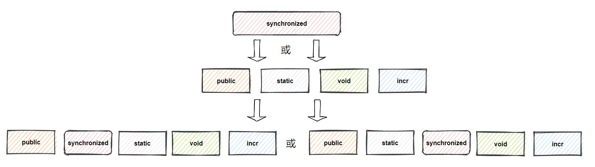

**修饰代码块**

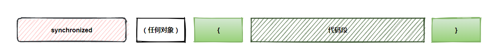


### synchronized原理

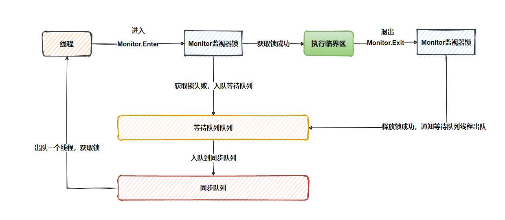


### synchronized优化

`Jdk 1.5`以后对`Synchronized`关键字做了各种的优化，经过优化后`Synchronized`已经变得原来越快了，这也是为什么官方建议使用`Synchronized`的原因，具体的优化点如下：

- **轻量级锁和偏向锁**：引入轻量级锁和偏向锁来减少重量级锁的使用
- **适应性自旋（Adaptive Spinning）**：自旋成功，则下次自旋次数增加；自旋失败，则下次自旋次数减少
- **锁粗化（Lock Coarsening）**：将多次连接在一起的加锁、解锁操作合并为一次，将多个连续锁扩展成一个范围更大的锁
- **锁消除（Lock Elimination）**：锁消除即删除不必要的加锁操作。根据代码逃逸技术，如果判断到一段代码中，堆上的数据不会逃逸出当前线程，那么可以认为这段代码是线程安全的，不必要加锁


### 锁膨胀机制

`Java`中每个对象都拥有对象头，对象头由`Mark World` 、指向类的指针、以及数组长度三部分组成，本文，我们只需要关心`Mark World` 即可，`Mark World` 记录了对象的`HashCode`、分代年龄和锁标志位信息。**Mark World简化结构：**

| 锁状态   | 存储内容                                                | 锁标记 |
| :------- | :------------------------------------------------------ | :----- |
| 无锁     | 对象的hashCode、对象分代年龄、是否是偏向锁（0）         | 01     |
| 偏向锁   | 偏向线程ID、偏向时间戳、对象分代年龄、是否是偏向锁（1） | 01     |
| 轻量级锁 | 指向栈中锁记录的指针                                    | 00     |
| 重量级锁 | 指向互斥量（重量级锁）的指针                            | 10     |

锁的升级变化，体现在锁对象的对象头`Mark World`部分，也就是说`Mark World`的内容会随着锁升级而改变。`Java1.5`以后为了减少获取锁和释放锁带来的性能消耗，引入了**偏向锁**和**轻量级锁**，`Synchronized`的升级顺序是 「**无锁-->偏向锁-->轻量级锁-->重量级锁，只会升级不会降级**」


#### 偏向锁

HotSpot 作者经过研究实践发现，在大多数情况下，锁不存在多线程竞争，总是由同一线程多次获得的，为了让线程获得锁的代价更低，于是就引进了偏向锁。

偏向锁（Biased Locking）指的是，它会偏向于第一个访问锁的线程，如果在运行过程中，同步锁只有一个线程访问，不存在多线程争用的情况，则线程是不需要触发同步的，这种情况下会给线程加一个偏向锁。


**偏向锁执行流程**

当一个线程访问同步代码块并获取锁时，会在对象头的 Mark Word 里存储锁偏向的线程 ID，在线程进入和退出同步块时不再通过 CAS 操作来加锁和解锁，而是检测 Mark Word 里是否存储着指向当前线程的偏向锁，如果 Mark Word 中的线程 ID 和访问的线程 ID 一致，则可以直接进入同步块进行代码执行，如果线程 ID 不同，则使用 CAS 尝试获取锁，如果获取成功则进入同步块执行代码，否则会将锁的状态升级为轻量级锁。具体流程如下：

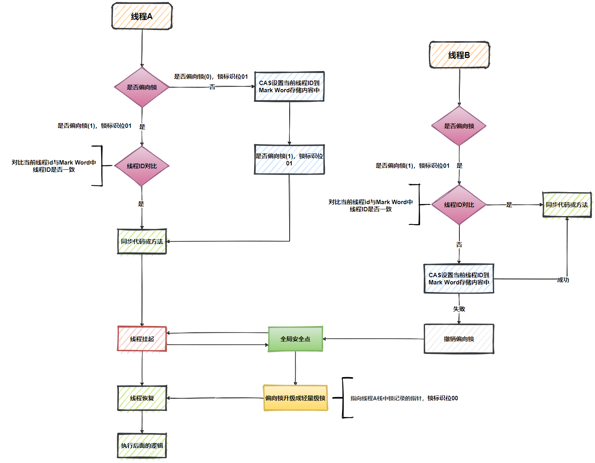


**偏向锁的优点**

偏向锁是为了在无多线程竞争的情况下，尽量减少不必要的锁切换而设计的，因为锁的获取及释放要依赖多次 CAS 原子指令，而偏向锁只需要在置换线程 ID 的时候执行一次 CAS 原子指令即可。


**Mark Word**

在 HotSpot 虚拟机中，对象在内存中存储的布局可以分为以下 3 个区域：

- **对象头（Header）**
- **实例数据（Instance Data）**
- **对齐填充（Padding）**

对象头中又包含了：

- **Mark Word（标记字段）：我们的偏向锁信息就是存储在此区域的**
- **Klass Pointer（Class 对象指针）**

对象在内存中的布局如下：

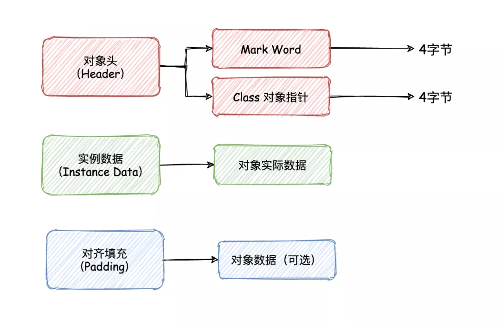

在 JDK 1.6 中默认是开启偏向锁的，可以通过“-XX:-UseBiasedLocking=false”命令来禁用偏向锁。


#### 轻量级锁
**轻量级锁考虑的是竞争锁对象的线程不多，持有锁时间也不长的场景**。因为阻塞线程需要CPU从用户态转到内核态，代价较大，如果刚刚阻塞不久这个锁就被释放了，那这个代价就有点得不偿失，所以干脆不阻塞这个线程，让它自旋一段时间等待锁释放。当前线程持有的锁是偏向锁的时候，被另外的线程所访问，偏向锁就会升级为轻量级锁，其他线程会通过自旋的形式尝试获取锁，不会阻塞，从而提高性能。

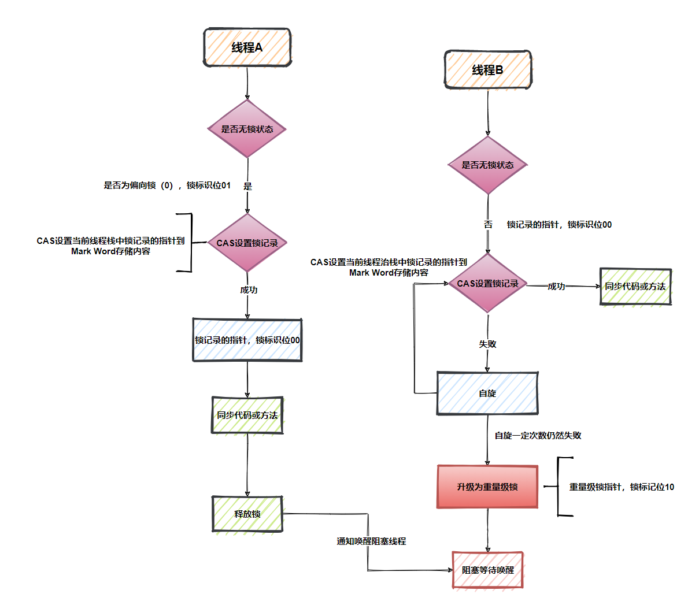

**注意事项**

需要强调一点：**轻量级锁并不是用来代替重量级锁的**，它的本意是在没有多线程竞争的前提下，减少传统的重量级锁使用产生的性能消耗。轻量级锁所适应的场景是线程交替执行同步块的情况，如果同一时间多个线程同时访问时，就会导致轻量级锁膨胀为重量级锁。


#### 重量级锁

轻量级锁膨胀之后，就升级为重量级锁，重量级锁是依赖操作系统的MutexLock（互斥锁）来实现的，需要从用户态转到内核态，这个成本非常高，这就是为什么Java1.6之前Synchronized效率低的原因。

升级为重量级锁时，锁标志位的状态值变为10，此时Mark Word中存储内容的是重量级锁的指针，等待锁的线程都会进入阻塞状态，下面是简化版的锁升级过程。

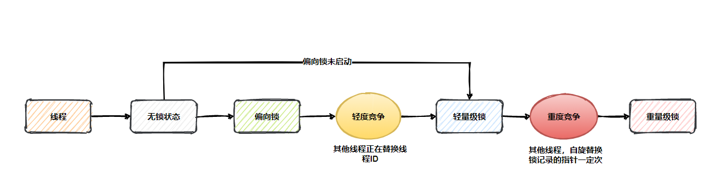


## ReentrantLock

ReentrantLock的底层是借助AbstractQueuedSynchronizer实现，所以其数据结构依附于AbstractQueuedSynchronizer的数据结构，关于AQS的数据结构，在前一篇已经介绍过，不再累赘。

- ReentrantLock是一个可重入的互斥锁，又被称为“独占锁”
- ReentrantLock锁在同一个时间点只能被一个线程锁持有；可重入表示，ReentrantLock锁可以被同一个线程多次获取
- ReentraantLock是通过一个FIFO的等待队列来管理获取该锁所有线程的。在“公平锁”的机制下，线程依次排队获取锁；而“非公平锁”在锁是可获取状态时，不管自己是不是在队列的开头都会获取锁


**ReentrantLock和synchronized比较**

- synchronized是独占锁，加锁和解锁的过程自动进行，易于操作，但不够灵活。ReentrantLock也是独占锁，加锁和解锁的过程需要手动进行，不易操作，但非常灵活
- synchronized可重入，因为加锁和解锁自动进行，不必担心最后是否释放锁；ReentrantLock也可重入，但加锁和解锁需要手动进行，且次数需一样，否则其他线程无法获得锁
- synchronized不可响应中断，一个线程获取不到锁就一直等着；ReentrantLock可以相应中断


## ReentrantReadWriteLock

**数据结构**

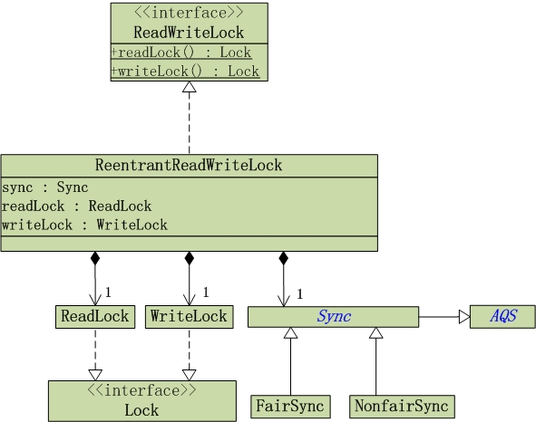

- ReentrantReadWriteLock实现了ReadWriteLock接口。ReadWriteLock是一个读写锁的接口，提供了"获取读锁的readLock()函数" 和 "获取写锁的writeLock()函数"
- ReentrantReadWriteLock中包含：sync对象，读锁readerLock和写锁writerLock。读锁ReadLock和写锁WriteLock都实现了Lock接口。读锁ReadLock和写锁WriteLock中也都分别包含了"Sync对象"，它们的Sync对象和ReentrantReadWriteLock的Sync对象 是一样的，就是通过sync，读锁和写锁实现了对同一个对象的访问
- 和"ReentrantLock"一样，sync是Sync类型；而且，Sync也是一个继承于AQS的抽象类。Sync也包括"公平锁"FairSync和"非公平锁"NonfairSync。sync对象是"FairSync"和"NonfairSync"中的一个，默认是"NonfairSync"


## 锁的状态

- 锁的4种状态：无锁、偏向锁、轻量级锁和重量级锁
- 锁状态只能升级不能降级
- 锁的状态是通过对象监视器在对象头中的字段来表明的


**锁的升级流程**

- **偏向锁：** 指一段同步代码一直被一个线程所访问，那么该线程会自动获取锁，降低获取锁的代价
- **轻量级锁：** 指当锁是偏向锁的时候，被另一个线程所访问，偏向锁就会升级为轻量级锁，其它线程会通过自旋的形式尝试获取锁，不会阻塞，提高性能
- **重量级锁：** 指当锁为轻量级锁的时候，另一个线程虽然是自旋，但自旋不会一直持续下去，当自旋一定次数的时候，还没有获取到锁，就会进入阻塞，该锁膨胀为重量级锁。重量级锁会让其它申请的线程进入阻塞，性能降低


**Java对象头**

Hotspot虚拟机的对象头主要包括两部分数据（synchronized的锁就是存在Java对象头中）：

- **Mark Word（标记字段）**：默认存储对象的HashCode，分代年龄和锁标志位信息。这些信息都是与对象自身定义无关的数据，所以Mark Word被设计成一个非固定的数据结构以便在极小的空间内存存储尽量多的数据。它会根据对象的状态复用自己的存储空间，也就是说在运行期间Mark Word里存储的数据会随着锁标志位的变化而变化
- **Klass Point（类型指针）**：对象指向它的类元数据的指针，虚拟机通过这个指针来确定这个对象是哪个类的实例


**Monitor**

- Monitor可以理解为一个同步工具或一种同步机制
- synchronized通过Monitor来实现线程同步
- Monitor是依赖于底层的操作系统的Mutex Lock（互斥锁）来实现的线程同步
- 每一个Java对象就有一把看不见的锁，称为内部锁或者Monitor锁
- Monitor是线程私有的数据结构，每一个线程都有一个可用monitor record列表，同时还有一个全局的可用列表


**锁状态升级流程**


- **偏向锁**：通过对比Mark Word解决加锁问题，避免执行CAS操作
- **轻量级锁**：通过用CAS操作和自旋来解决加锁问题，避免线程阻塞和唤醒而影响性能
- **重量级锁**：将除了拥有锁的线程以外的线程都阻塞


**优缺点对比**

| 锁       | 优点                                                         | 缺点                                           | 适用场景                           |
| :------- | :----------------------------------------------------------- | :--------------------------------------------- | :--------------------------------- |
| 偏向锁   | 加锁和解锁不需要额外的消耗，和执行非同步方法相比仅存在纳秒级的差距 | 如果线程间存在锁竞争，会带来额外的锁撤销的消耗 | 适用于只有一个线程访问同步块的场景 |
| 轻量级锁 | 竞争的线程不会阻塞，提高了程序的响应速度                     | 如果始终得不到锁竞争的线程，使用自旋会消耗CPU  | 追求响应时间同步块执行速度非常快   |
| 重量级锁 | 线程竞争不使用自旋，不会消耗CPU                              | 线程阻塞，响应时间缓慢                         | 追求吞吐量，同步块执行速度较长     |


### 无锁

- 无锁是指没有对资源进行锁定，所有的线程都能访问并修改同一个资源，但同时只有一个线程能修改成功
- 修改操作在循环内进行，线程会不断的尝试修改共享资源
- CAS即是无锁的实现
- 无锁无法全面代替有锁，但无锁在某些场合下的性能是非常高的


### 偏向锁

指同步代码一直被一个线程所访问，那么该线程会自动获取锁，降低获取锁的代价。适用于只有一个线程访问同步块场景。

- **优点**：加锁和解锁不需要额外的消耗，和执行非同步方法比仅存在纳秒级的差距
- **缺点**：如果线程间存在锁竞争，会带来额外的锁撤销的消耗


### 轻量级锁

指当锁是偏向锁的时候，被另一个线程所访问，偏向锁就会升级为轻量级锁，其它线程会通过自旋的形式尝试获取锁，不会阻塞，提高性能。适用于追求响应时间，同步块执行速度非常快。

- **优点**：竞争的线程不会阻塞，提高了程序的响应速度
- **缺点**：如果始终得不到锁竞争的线程使用自旋会消耗CPU


### 重量级锁

指当锁为轻量级锁的时候，另一个线程虽然是自旋，但自旋不会一直持续下去，当自旋一定次数的时候，还没有获取到锁，就会进入阻塞，该锁膨胀为重量级锁。重量级锁会让其它申请的线程进入阻塞，性能降低。适用于追求吞吐量，同步块执行速度较长。

- **优点**：线程竞争不使用自旋，不会消耗CPU
- **缺点**：线程阻塞，响应时间缓慢


## 自旋锁(SpinLock)

**指当一个线程在获取锁的时候，如果锁已经被其它线程获取，那么该线程将循环等待，然后不断的判断锁是否能够被成功获取，直到获取到锁才会退出循环**。普通自旋锁是指当一个线程尝试获取某个锁时，如果该锁已被其他线程占用，就一直循环检测锁是否被释放，而不是进入线程挂起或睡眠状态。其特点如下：

- 自旋锁适用于锁保护的临界区很小的情况，临界区很小的话，锁占用的时间就很短
- 阻塞或唤醒一个Java线程需要操作系统切换CPU状态来完成，这种状态转换需要耗费处理器时间
- 如果同步代码块中的内容过于简单，状态转换消耗的时间有可能比用户代码执行的时间还要长

.png)

简单代码实现：

```java
public class SpinLock {
   private AtomicReference<Thread> owner = new AtomicReference<Thread>();
   public void lock() {
       Thread currentThread = Thread.currentThread();
       // 如果锁未被占用，则设置当前线程为锁的拥有者
       while (owner.compareAndSet(null, currentThread)) {
       }
   }

   public void unlock() {
       Thread currentThread = Thread.currentThread();
       // 只有锁的拥有者才能释放锁
       owner.compareAndSet(currentThread, null);
   }
}
```

**缺点**

- CAS操作需要硬件的配合
- 保证各个CPU的缓存（L1、L2、L3、跨CPU Socket、主存）的数据一致性，通讯开销很大，在多处理器系统上更严重
- 没法保证公平性，不保证等待进程/线程按照FIFO顺序获得锁


### Ticket Lock

TicketLock即为排队自旋锁。思路：类似银行办业务，先取一个号，然后等待叫号叫到自己。好处：保证FIFO，先取号的肯定先进入。而普通的SpinLock，大家都在转圈，锁释放后谁刚好转到这谁进入。简单的实现：

```java
public class TicketLock {
   private AtomicInteger serviceNum = new AtomicInteger(); // 服务号
   private AtomicInteger ticketNum = new AtomicInteger(); // 排队号

   public int lock() {
       // 首先原子性地获得一个排队号
       int myTicketNum = ticketNum.getAndIncrement();

       // 只要当前服务号不是自己的就不断轮询
       while (serviceNum.get() != myTicketNum) {
       }

       return myTicketNum;
    }

    public void unlock(int myTicket) {
        // 只有当前线程拥有者才能释放锁
        int next = myTicket + 1;
        serviceNum.compareAndSet(myTicket, next);
    }
}
```

**缺点**

Ticket Lock 虽然解决了公平性的问题，但是多处理器系统上，每个进程/线程占用的处理器都在读写同一个变量，每次读写操作都必须在多个处理器缓存之间进行缓存同步，这会导致繁重的系统总线和内存的流量，大大降低系统整体的性能。


### MCS Lock

MCS SpinLock 是一种基于链表的可扩展、高性能、公平的自旋锁，申请线程只在本地变量上自旋，直接前驱负责通知其结束自旋，从而极大地减少了不必要的处理器缓存同步的次数，降低了总线和内存的开销。

```java
public class MCSLock {
    public static class MCSNode {
        MCSNode next;
        boolean isLocked = true; // 默认是在等待锁
    }

    volatile MCSNode queue ;// 指向最后一个申请锁的MCSNode
    private static final AtomicReferenceFieldUpdater<MCSLock, MCSNode> UPDATER = 
        AtomicReferenceFieldUpdater.newUpdater(MCSLock.class, MCSNode. class, "queue" );

    public void lock(MCSNode currentThread) {
        MCSNode predecessor = UPDATER.getAndSet(this, currentThread);// step 1
        if (predecessor != null) {
            predecessor.next = currentThread;// step 2
            while (currentThread.isLocked ) {// step 3
            }
        }
    }

    public void unlock(MCSNode currentThread) {
        if ( UPDATER.get( this ) == currentThread) {// 锁拥有者进行释放锁才有意义
            if (currentThread.next == null) {// 检查是否有人排在自己后面
                if (UPDATER.compareAndSet(this, currentThread, null)) {// step 4
                    // compareAndSet返回true表示确实没有人排在自己后面
                    return;
                } else {
                    // 突然有人排在自己后面了，可能还不知道是谁，下面是等待后续者
                    // 这里之所以要忙等是因为：step 1执行完后，step 2可能还没执行完
                    while (currentThread.next == null) { // step 5
                    }
                }
            }

            currentThread.next.isLocked = false;
            currentThread.next = null;// for GC
        }
    }
}
```


### CLH Lock

CLH（Craig, Landin, and Hagersten  Locks）锁也是一种基于链表的可扩展、高性能、公平的自旋锁，申请线程只在本地变量上自旋，它不断轮询前驱的状态，如果发现前驱释放了锁就结束自旋。

```java
public class CLHLock {
    public static class CLHNode {
        private boolean isLocked = true; // 默认是在等待锁
    }

    @SuppressWarnings("unused" )
    private volatile CLHNode tail ;
    private static final AtomicReferenceFieldUpdater<CLHLock, CLHNode> UPDATER = AtomicReferenceFieldUpdater
                  . newUpdater(CLHLock.class, CLHNode .class , "tail" );

    public void lock(CLHNode currentThread) {
        CLHNode preNode = UPDATER.getAndSet( this, currentThread);
        if(preNode != null) {//已有线程占用了锁，进入自旋
            while(preNode.isLocked ) {
            }
        }
    }

    public void unlock(CLHNode currentThread) {
        // 如果队列里只有当前线程，则释放对当前线程的引用（for GC）。
        if (!UPDATER .compareAndSet(this, currentThread, null)) {
            // 还有后续线程
            currentThread. isLocked = false ;// 改变状态，让后续线程结束自旋
        }
    }
}
```

**CLH优势**

- 公平、FIFO、先来后到的顺序进入锁
- 且没有竞争同一个变量，因为每个线程只要等待自己的前继释放即可

**CLH锁与MCS锁的比较**

- 从代码实现来看，CLH比MCS要简单得多
- 从自旋的条件来看，CLH是在本地变量上自旋，MCS是自旋在其他对象的属性
- 从链表队列来看，CLH的队列是隐式的，CLHNode并不实际持有下一个节点；MCS的队列是物理存在的
- CLH锁释放时只需要改变自己的属性，MCS锁释放则需要改变后继节点的属性


## 常见锁

### 乐观锁/悲观锁

**悲观锁**
当线程去操作数据的时候，总认为别的线程会去修改数据，所以它每次拿数据的时候总会上锁，别的线程去拿数据的时候就会阻塞，比如synchronized。


**乐观锁**
每次去拿数据的时候都认为别人不会修改，更新的时候会判断是别人是否回去更新数据，通过版本来判断，如果数据被修改了就拒绝更新，比如CAS是乐观锁，但严格来说并不是锁，通过原子性来保证数据的同步，比如说数据库的乐观锁，通过版本控制来实现，CAS不会保证线程同步，乐观的认为在数据更新期间没有其他线程影响


**小结**：悲观锁适合写操作多的场景，乐观锁适合读操作多的场景，乐观锁的吞吐量会比悲观锁大。


### 公平锁/非公平锁
**公平锁**
指多个线程按照申请锁的顺序来获取锁，简单来说 如果一个线程组里，能保证每个线程都能拿到锁 比如ReentrantLock(底层是同步队列FIFO: First Input First Output来实现)


**非公平锁**
获取锁的方式是随机获取的，保证不了每个线程都能拿到锁，也就是存在有线程饿死，一直拿不到锁，比如synchronized、ReentrantLock。


**小结**：非公平锁性能高于公平锁，更能重复利用CPU的时间。ReentrantLock中可以通过构造方法指定是否为公平锁，默认为非公平锁！synchronized无法指定为公平锁，一直都是非公平锁。


### 可重入锁/不可重入锁
**可重入锁**
也叫递归锁，在外层使用锁之后，在内层仍然可以使用，并且不发生死锁。一个线程获取锁之后再尝试获取锁时会自动获取锁，可重入锁的优点是避免死锁。


**不可重入锁**
若当前线程执行某个方法已经获取了该锁，那么在方法中尝试再次获取锁时，就会获取不到被阻塞。


**小结**：可重入锁能一定程度的避免死锁 synchronized、ReentrantLock都是可重入锁。


### 独占锁/共享锁
**独享锁**

指锁一次只能被一个线程持有。也叫X锁/排它锁/写锁/独享锁：该锁每一次只能被一个线程所持有，加锁后任何线程试图再次加锁的线程会被阻塞，直到当前线程解锁。例子：如果 线程A 对 data1 加上排他锁后，则其他线程不能再对 data1 加任何类型的锁，获得独享锁的线程即能读数据又能修改数据！


**共享锁**

指锁一次可以被多个线程持有。也叫S锁/读锁，能查看数据，但无法修改和删除数据的一种锁，加锁后其它用户可以并发读取、查询数据，但不能修改，增加，删除数据，该锁可被多个线程所持有，用于资源数据共享！


**小结**：ReentrantLock和synchronized都是独享锁，ReadWriteLock的读锁是共享锁，写锁是独享锁。


### 互斥锁/读写锁
与独享锁/共享锁的概念差不多，是独享锁/共享锁的具体实现。

ReentrantLock和synchronized都是互斥锁，ReadWriteLock是读写锁


### 自旋锁
**自旋锁**

- 一个线程在获取锁的时候，如果锁已经被其它线程获取，那么该线程将循环等待，然后不断的判断锁是否能够被成功获取，直到获取到锁才会退出循环，任何时刻最多只能有一个执行单元获得锁。
- 不会发生线程状态的切换，一直处于用户态，减少了线程上下文切换的消耗，缺点是循环会消耗CPU。


**常见的自旋锁**：TicketLock，CLHLock，MSCLock


## 锁优化

### 偏向锁/轻量级锁

**偏向锁**

大多数情况下锁不仅不存在多线程竞争，而且总是由同一线程多次获得，为了 `让线程获得锁的代价更低` 而引入了偏向锁，让该线程会自动获取锁，减少不必要的CAS操作。

**轻量级锁**

对于轻量级锁，其性能提升依据:“`对于绝大部分锁，在整个生命周期内都是不会存在竞争的`”。轻量级锁的目标：`减少无实际竞争情况下，使用重量级锁产生的性能消耗`，包括系统调用引起的内核态与用户态切换、线程阻塞造成的线程切换等。


### 自旋锁

**背景**

线程的阻塞和唤醒需要CPU从用户态转为核心态，频繁的阻塞和唤醒对CPU来说是一件负担很重的工作，势必会给系统的并发性能带来很大的压力。同时我们发现在许多应用上面，对象锁的锁状态只会持续很短一段时间，为了这一段很短的时间频繁地阻塞和唤醒线程是非常不值得的。所以引入自旋锁。 

**定义** 
自旋锁就是 `让该线程等待（即执行一段无意义的循环为自旋）固定的一段时间`，不会被立即挂起，看持有锁的线程是否会很快释放锁。

**弊端**

自旋可以避免线程切换带来的开销，但它占用了处理器（CPU）的时间。长时间的自旋而不处理任何事，就会浪费资源，所以需要设置自旋等待时间（即自旋次数）。自旋的次数虽然可以通过参数-XX:PreBlockSpin来调整（默认为10次），但固定的自旋次数，`会对部分场景（如只需要自旋一两次就可获得锁）造成浪费`，因此JDK1.6引入了自适应自旋锁。


### 适应性自旋锁

所谓自适应就意味着 `自旋的次数不再是固定的`，它是由前一次在同一个锁上的自旋时间及锁的拥有者的状态来决定。

- **自旋成功，次数增加**：因为虚拟机认为既然上次成功，那么此次自旋也很有可能会再次成功，那么它就会允许自旋等待持续的次数更多
- **自旋失败，次数减少**：如果对于某个锁，很少有自旋能够成功的，那么在以后要获得这个锁的时候自旋的次数会减少甚至省略掉自旋过程，以免浪费处理器资源


### 锁消除

为了保证数据的完整性，我们在进行操作时需要对这部分操作进行同步控制，但是在有些情况下，JVM检测到不可能存在共享数据竞争，这时JVM会对这些同步锁进行锁消除，锁消除的依据是 `逃逸分析` 的数据支持。 

锁消除主要是解决我们使用JDK内置API时存在的 `隐形加锁操作`。如StringBuffer、Vector、HashTable等，StringBuffer的append()方法，Vector的add()方法：

```java
public void vectorTest(){
	Vector<String> vector = new Vector<String>();
	for(int i = 0 ; i < 10 ; i++){
		vector.add(i + "");
	}
	System.out.println(vector);
}
```

在运行这段代码时，JVM可以明显检测到变量vector没有逃逸出方法vectorTest()之外，所以JVM可以大胆地将vector内部的加锁操作消除。


### 锁粗化

在使用同步锁的时候，需要让同步块的作用范围尽可能小，仅在共享数据的实际作用域中才进行同步，这样做的目的是为了使需要同步的操作数量尽可能缩小，如果存在锁竞争，那么等待锁的线程也能尽快拿到锁。 
在大多数情况下，上述观点是正确的。但如果 `一系列的连续加锁解锁操作，可能会导致不必要的性能损耗`，所以引入锁粗化的概念。锁粗化概念比较好理解，就是 `将多个连续的加锁、解锁操作连接在一起，扩展成一个范围更大的锁`。

如上面实例：vector每次add的时候都需要加锁操作，JVM检测到对同一个对象（vector）连续加锁、解锁操作，会合并一个更大范围的加锁、解锁操作，即加锁解锁操作会移到for循环之外。


### 分段锁

分段锁其实是一种锁的设计，并不是具体的一种锁，对于 `ConcurrentHashMap` 而言，其并发的实现就是通过分段锁的形式来实现高效的并发操作。


### 锁细化

- **减少锁的时间**：不需要同步执行的代码，能不放在同步快里面执行就不要放在同步快内，可以让锁尽快释放
- **减少锁的粒度**：将物理上的一个锁，拆成逻辑上的多个锁，增加并行度，从而降低锁竞争。其思想是用空间来换时间


# Throwable


## Error

Error 类是指 java 运行时系统的内部错误和资源耗尽错误。应用程序不会抛出该类对象。如果出现了这样的错误，除了告知用户，剩下的就是尽力使程序安全的终止。


## Exception

### CheckedException

检查异常（CheckedException）。一般是外部错误，这种异常都发生在编译阶段，Java 编译器会强制程序去捕获此类异常，即会出现要求你把这段可能出现异常的程序进行 try catch，该类异常一般包括几个方面：

- 试图在文件尾部读取数据
- 试图打开一个错误格式的 URL 
- 试图根据给定的字符串查找 class 对象，而这个字符串表示的类并不存在


### RuntimeException

运行时异常（RuntimeException）。如 ：NullPointerException 、 ClassCastException ；一个是检查异常CheckedException，如I/O错误导致的IOException、SQLException。 RuntimeException 是那些可能在Java虚拟机正常运行期间抛出的异常的超类。 如果出现 RuntimeException，那么一定是程序员的错。


## 异常处理方式

抛出异常有三种形式：

- throw
- throws
- 系统自动抛异常


**throw 和 throws 的区别**

- throws 用在函数上，后面跟的是异常类，可以跟多个；而 throw 用在函数内，后面跟的是异常对象
- throws 用来声明异常，让调用者只知道该功能可能出现的问题，可以给出预先的处理方式；throw 抛出具体的问题对象，执行到 throw，功能就已经结束了，跳转到调用者，并将具体的问题对象抛给调用者。也就是说 throw 语句独立存在时，下面不要定义其他语句，因为执行不到
- throws 表示出现异常的一种可能性，并不一定会发生这些异常；throw 则是抛出了异常，执行 throw 则一定抛出了某种异常对象
- 两者都是消极处理异常的方式，只是抛出或者可能抛出异常，但是不会由函数去处理异常，真正的处理异常由函数的上层调用处理


# Others

## Annotation


## JAVA内部类

Java 类中不仅可以定义变量和方法，还可以定义类，这样定义在类内部的类就被称为内部类。根据定义的方式不同，内部类分为静态内部类、成员内部类、局部内部类和匿名内部类四种。

### 静态内部类

使用static修饰的内部类我们称之为静态内部类，不过我们更喜欢称之为嵌套内部类。静态内部类与非静态内部类之间存在一个最大的区别，我们知道非静态内部类在编译完成之后会隐含地保存着一个引用，该引用是指向创建它的外围内，但是静态内部类却没有。没有这个引用就意味着：

- 它的创建是不需要依赖于外围类的
- 它不能使用任何外围类的非static成员变量和方法

```java
public class OuterClass {
    private String sex;
    public static String name = "chenssy";
    
    /**
     *静态内部类
     */
    static class InnerClass1{
        /* 在静态内部类中可以存在静态成员 */
        public static String _name1 = "chenssy_static";
        
        public void display(){
            /* 
             * 静态内部类只能访问外围类的静态成员变量和方法
             * 不能访问外围类的非静态成员变量和方法
             */
            System.out.println("OutClass name :" + name);
        }
    }
    
    /**
     * 非静态内部类
     */
    class InnerClass2{
        /* 非静态内部类中不能存在静态成员 */
        public String _name2 = "chenssy_inner";
        /* 非静态内部类中可以调用外围类的任何成员,不管是静态的还是非静态的 */
        public void display(){
            System.out.println("OuterClass name：" + name);
        }
    }
    
    /**
     * @desc 外围类方法
     * @author chenssy
     * @data 2013-10-25
     * @return void
     */
    public void display(){
        /* 外围类访问静态内部类：内部类. */
        System.out.println(InnerClass1._name1);
        /* 静态内部类 可以直接创建实例不需要依赖于外围类 */
        new InnerClass1().display();
        
        /* 非静态内部的创建需要依赖于外围类 */
        OuterClass.InnerClass2 inner2 = new OuterClass().new InnerClass2();
        /* 方位非静态内部类的成员需要使用非静态内部类的实例 */
        System.out.println(inner2._name2);
        inner2.display();
    }
    
    public static void main(String[] args) {
        OuterClass outer = new OuterClass();
        outer.display();
    }
}
```


### 成员内部类

成员内部类也是最普通的内部类，它是外围类的一个成员，所以他是可以无限制的访问外围类的所有 成员属性和方法，尽管是private的，但是外围类要访问内部类的成员属性和方法则需要通过内部类实例来访问。在成员内部类中要注意两点：

- **成员内部类中不能存在任何static的变量和方法**
- **成员内部类是依附于外围类的，所以只有先创建了外围类才能够创建内部类**
- **推荐使用getxxx()来获取成员内部类，尤其是该内部类的构造函数无参数时**

```java
public class OuterClass {
    private String str;
    
    public class InnerClass{
        public void innerDisplay(){
            //使用外围内的属性
            str = "chenssy...";
            System.out.println(str);
            //使用外围内的方法
            outerDisplay();
        }
    }
    
    /* 推荐使用getxxx()来获取成员内部类，尤其是该内部类的构造函数无参数时 */
    public InnerClass getInnerClass(){
        return new InnerClass();
    }
    
    public static void main(String[] args) {
        OuterClass outer = new OuterClass();
        OuterClass.InnerClass inner = outer.getInnerClass();
        inner.innerDisplay();
    }
}
```


### 局部内部类

有这样一种内部类，它是嵌套在方法和作用于内的，对于这个类的使用主要是应用与解决比较复杂的问题，想创建一个类来辅助我们的解决方案，到那时又不希望这个类是公共可用的，所以就产生了局部内部类，局部内部类和成员内部类一样被编译，只是它的作用域发生了改变，它只能在该方法和属性中被使用，出了该方法和属性就会失效。

- 定义在方法里：

  ```java
  public class Parcel5 {
      public Destionation destionation(String str){
          class PDestionation implements Destionation{
              private String label;
              private PDestionation(String whereTo){
                  label = whereTo;
              }
              public String readLabel(){
                  return label;
              }
          }
          return new PDestionation(str);
      }
      
      public static void main(String[] args) {
          Parcel5 parcel5 = new Parcel5();
          Destionation d = parcel5.destionation("chenssy");
      }
  }
  ```

- 定义在作用域内：

  ```java
  public class Parcel6 {
      private void internalTracking(boolean b){
          if(b){
              class TrackingSlip{
                  private String id;
                  TrackingSlip(String s) {
                      id = s;
                  }
                  String getSlip(){
                      return id;
                  }
              }
              TrackingSlip ts = new TrackingSlip("chenssy");
              String string = ts.getSlip();
          }
      }
      
      public void track(){
          internalTracking(true);
      }
      
      public static void main(String[] args) {
          Parcel6 parcel6 = new Parcel6();
          parcel6.track();
      }
  }
  ```


### 匿名内部类

- 匿名内部类是没有访问修饰符的
- new 匿名内部类，这个类首先是要存在的。如果我们将那个InnerClass接口注释掉，就会出现编译出错
- 注意getInnerClass()方法的形参，第一个形参是用final修饰的，而第二个却没有。同时我们也发现第二个形参在匿名内部类中没有使用过，所以当所在方法的形参需要被匿名内部类使用，那么这个形参就必须为final
- 匿名内部类是没有构造方法的。因为它连名字都没有何来构造方法

```java
button2.addActionListener(  
        new ActionListener(){  
                public void actionPerformed(ActionEvent e) {  
                     System.out.println("你按了按钮二");  
                }  
        });
```


## 泛型

### 获取类泛型类型

获取当前类上的泛型类型方式如下：

```java
public class DefaultTargetType<T> {

    private Type type;
    private Class<T> classType;

    @SuppressWarnings("unchecked")
    public DefaultTargetType() {
        Type superClass = getClass().getGenericSuperclass();
        this.type = ((ParameterizedType) superClass).getActualTypeArguments()[0];
        if (this.type instanceof ParameterizedType) {
            this.classType = (Class<T>) ((ParameterizedType) this.type).getRawType();
        } else {
            this.classType = (Class<T>) this.type;
        }
    }
    
}
```

获取到泛型中的类型方式：

```java
Class<List<User>> classType = new DefaultTargetType<List<User>>() {}.getClassType();
```


### 获取接口泛型类型

获取当前类的父类接口上的泛型类型方式如下：

```java
public class DefaultTargetType implements TargetType<T> {

    private Type type;
    private Class<T> classType;

    @SuppressWarnings("unchecked")
    public DefaultTargetType() {
        Type superClass = getClass().getGenericInterfaces()[0];
        this.type = ((ParameterizedType) superClass).getActualTypeArguments()[0];
        if (this.type instanceof ParameterizedType) {
            this.classType = (Class<T>) ((ParameterizedType) this.type).getRawType();
        } else {
            this.classType = (Class<T>) this.type;
        }
    }
    
}
```

获取到泛型中的类型方式：

```java
Class<List<User>> classType = new DefaultTargetType<List<User>>() {}.getClassType();
```


## JAVA复制

### 浅复制

被复制对象的所有变量都含有与原来的对象相同的值，而所有的对其他对象的引用仍然指向原来的对象。换言之，浅复制仅仅复制所考虑的对象，而不复制它所引用的对象。


### 深复制

被复制对象的所有变量都含有与原来的对象相同的值，除去那些引用其他对象的变量。那些引用其他对象的变量将指向被复制过的新对象，而不再是原有的那些被引用的对象。换言之，深复制把要复制的对象所引用的对象都复制了一遍。

