<div style="color:#16b0ff;font-size:50px;font-weight: 900;text-shadow: 5px 5px 10px var(--theme-color);font-family: 'Comic Sans MS';">JVM</div>

<span style="color:#16b0ff;font-size:20px;font-weight: 900;font-family: 'Comic Sans MS';">Introduction</span>：收纳技术相关的JVM知识等总结！

[TOC]

# JVM

## JVM常量池

- **字符串常量池**：存放在堆上，即执行intern方法后存的地方。class文件的静态常量池，如果是字符串，则也会被装到字符串常量池中
- **运行时常量池**：存放在方法区，属于元空间，是类加载后的一些存储区域，大多数是类中 constant_pool 的内容
- **类文件常量池**：也就是constant_pool，这个是概念性的，并没有什么实际存储区域


## JVM内存布局

JVM包含**堆**、**元空间**、**Java虚拟机栈**、**本地方法栈**、**程序计数器**等内存区域，其中**堆**是占用内存最大的，如下图所示：

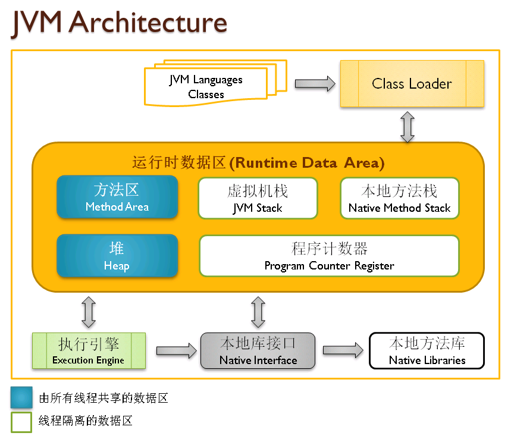


## JAVA内存模型

Java Memory Model (JAVA 内存模型，JMM）描述线程之间如何通过内存(memory)来进行交互。具体说来，JVM中存在一个主存区（Main Memory或Java Heap Memory），对于所有线程进行共享，而每个线程又有自己的工作内存（Working Memory，实际上是一个虚拟的概念），工作内存中保存的是主存中某些变量的拷贝，线程对所有变量的操作并非发生在主存区，而是发生在工作内存中，而线程之间是不能直接相互访问的，变量在程序中的传递，是依赖主存来完成的。具体的如下图所示：

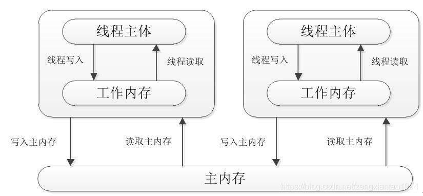

JMM描述了Java程序中各种变量（线程共享变量）的访问规则，以及在JVM中将变量存储到内存中读取出变量这样的底层细节。所有的变量都存储在主内存中，每个线程都有自己独立的工作内存，里面保存该线程使用到的变量的副本（主内存中变量的一份拷贝）。JMM的两条规定：

- 线程对共享变量的所有操作都必须在自己的工作内存中进行，不能直接从主内存中读写
- 不同的线程之间无法直接访问其他线程工作内存中的变量，线程变量值的传递需要通过主内存来完成


## JVM内存模型

JVM试图定义一种统一的内存模型，能将各种底层硬件以及操作系统的内存访问差异进行封装，使Java程序在不同硬件以及操作系统上都能达到相同的并发效果。**它分为工作内存和主内存，线程无法对主存储器直接进行操作，如果一个线程要和另外一个线程通信，那么只能通过主存进行交换**。如下图所示：

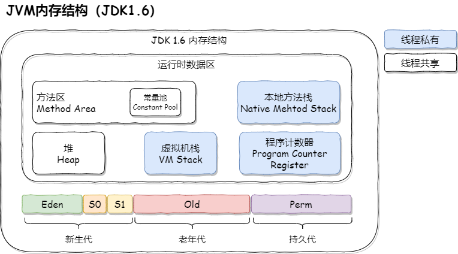

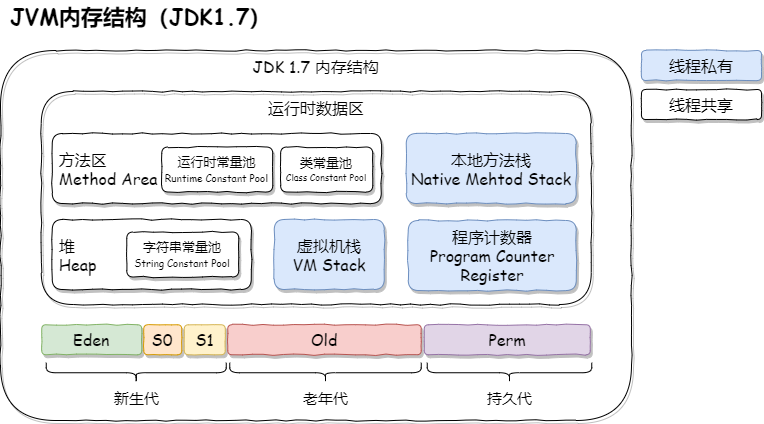

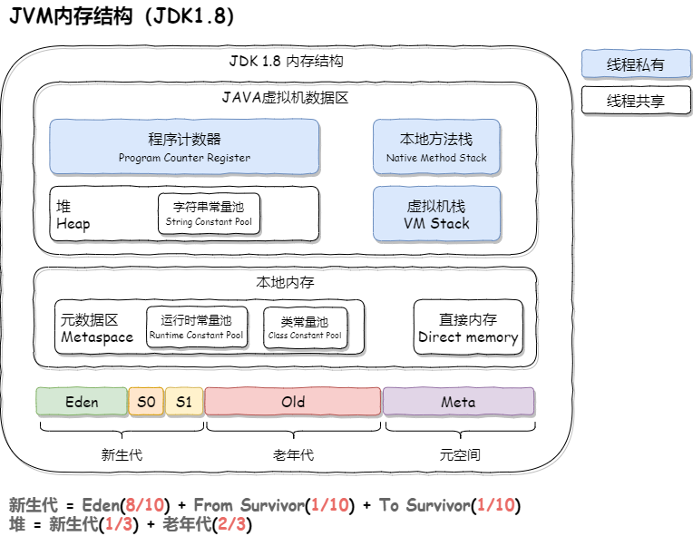

**线程隔离数据区：**

- **程序计数器：** 当前线程所执行字节码的行号指示器
- **虚拟机栈：** 里面的元素叫栈帧，存储局部变量表、操作栈、动态链接、方法出口等，方法被调用到执行完成的过程对应一个栈帧在虚拟机栈中入栈到出栈的过程
- **本地方法栈：** 和虚拟机栈的区别在于虚拟机栈为虚拟机执行Java方法，本地方法栈为虚拟机使用到的本地Native方法服务

**线程共享数据区：**

- **方法区：** 可以描述为堆的一个逻辑部分，或者说使用永久代来实现方法区。存储已被虚拟机加载的类信息、常量、静态变量、即时编译器编译后的代码等数据
- **堆：** 唯一目的就是存放对象的实例，是垃圾回收管理器的主要区域，分为Eden、From/To Survivor空间


### 程序计数器

程序计数器（Program Counter Register）。一块较小的内存空间, 是当前线程所执行的字节码的行号指示器，每条线程都要有一个独立的程序计数器，这类内存也称为“线程私有”的内存。正在执行 java 方法的话，计数器记录的是虚拟机字节码指令的地址（当前指令的地址）。如果还是 Native 方法，则为空。这个内存区域是唯一一个在虚拟机中没有规定任何 OutOfMemoryError 情况的区域。

- 线程私有
- 是一块很小的独立内存空间
- 主要存储当前线程所执行的字节码行号指示器
- 以一种数据结构的形式放置于内存中
- 分支、循环、跳转、异常处理、线程恢复等功能都需要依赖这个计数器来完成

**注意**：此内存区域是唯一一个在Java虚拟机规范中没有规定任何OutOfMemoryError情况的区域。


### JAVA虚拟机栈

JAVA虚拟机栈（Java Virtual Machine Stacks）。是描述java方法执行的内存模型，每个方法在执行的同时都会创建一个栈帧（Stack Frame）用于存储局部变量表、操作数栈、动态链接、方法出口等信息。每一个方法从调用直至执行完成的过程，就对应着一个栈帧在虚拟机栈中入栈到出栈的过程。栈帧（ Frame）是用来存储数据和部分过程结果的数据结构，同时也被用来处理动态链接(Dynamic Linking)、 方法返回值和异常分派（ Dispatch Exception）。栈帧随着方法调用而创建，随着方法结束而销毁——无论方法是正常完成还是异常完成（抛出了在方法内未被捕获的异常）都算作方法结束。

- 线程私有
- JAVA线程创建同时，会自动创建对应的JAVA栈
- JAVA栈包含多个栈帧（运行每个方法，就会自动创建一个栈帧，用于存储局部变量、操作栈和返回值等）

> **相关参数：**
>
> -Xss：设置方法栈的最大值


### 本地方法栈

本地方法栈（Native Method Stacks）。本地方法区和 Java Stack 作用类似, 区别是虚拟机栈为执行 Java 方法服务, 而本地方法栈则为Native 方法服务, 如果一个 VM 实现使用 C-linkage 模型来支持 Native 调用, 那么该栈将会是一个C 栈，但 HotSpot VM 直接就把本地方法栈和虚拟机栈合二为一。

- 线程私有
- 与JAVA栈的作用相似
- 主要为JVM使用本地方法（native）提供支持
- 不是由Java实现的，而是由C实现的

与虚拟机栈一样，本地方法栈区域也会抛出**StackOverflowError**和**OutOfMemoryError**异常：

```java
// 原因：对象不能被分配到堆内存中
Exception in thread "main": java.lang.OutOfMemoryError: Java heap space
// 原因：类或者方法不能被加载到持久代。它可能出现在一个程序加载很多类的时候，比如引用了很多第三方的库
Exception in thread "main": java.lang.OutOfMemoryError: PermGen space
// 原因：创建的数组大于堆内存的空间
Exception in thread "main": java.lang.OutOfMemoryError: Requested array size exceeds VM limit
// 原因：分配本地分配失败。JNI、本地库或者Java虚拟机都会从本地堆中分配内存空间
Exception in thread "main": java.lang.OutOfMemoryError: request <size> bytes for <reason>. Out of swap space?
// 原因：同样是本地方法内存分配失败，只不过是JNI或者本地方法或者Java虚拟机发现
Exception in thread "main": java.lang.OutOfMemoryError: <reason> <stack trace> (Native method)
```


### 方法区

方法区（Method Area）。即我们常说的**永久代(Permanent Generation)**, 用于存储**被 JVM 加载的类信息、常量、静态变量、即时编译器编译后的代码**等数据，HotSpot VM把GC分代收集扩展至方法区, 即使用Java堆的永久代来实现方法区, 这样 HotSpot 的垃圾收集器就可以像管理 Java 堆一样管理这部分内存, 而不必为方法区开发专门的内存管理器(永久带的内存回收的主要目标是针对常量池的回收和类型的卸载, 因此收益一般很小)。运行时常量池（Runtime Constant Pool）是方法区的一部分。Class 文件中除了有类的版本、字段、方法、接口等描述等信息外，还有一项信息是常量池（Constant Pool Table），用于存放编译期生成的各种字面量和符号引用，这部分内容将在类加载后存放到方法区的运行时常量池中。 Java 虚拟机对 Class 文件的每一部分（自然也包括常量池）的格式都有严格的规定，每一个字节用于存储哪种数据都必须符合规范上的要求，这样才会被虚拟机认可、装载和执行。

- 又称之为：**非堆（Non-Heap）**或 **永久区**
- 线程共享
- 主要存储：类的类型信息、**常量池（Runtime Constant Pool）**、字段信息、方法信息、类变量和Class类的引用等
- Java虚拟机规范规定：当方法区无法满足内存分配需求时，将抛出OutOfMemoryError异常

> **相关参数：**
>
> -XX:PermSize：设置Perm区的初始大小
>
> -XX:MaxPermSize：设置Perm区的最大值


### 堆内存

堆内存（JAVA Heap）。是被线程共享的一块内存区域，创建的对象和数组都保存在 Java 堆内存中，也是垃圾收集器进行垃圾收集的最重要的内存区域。由于现代 VM 采用**分代收集算法**, 因此 Java 堆从 GC 的角度还可以细分为: **新生代**(Eden区、From Survivor 区和 To Survivor 区)和老年代。

- 线程共享
- 主要用于存储JAVA实例或对象
- GC发生的主要区域
- 是Java虚拟机所管理的内存中最大的一块
- 当堆中没有内存能完成实例分配，且堆也无法再扩展，则会抛出OutOfMemoryError异常

> **相关参数：**
>
> -Xms：设置堆内存初始大小
>
> -Xmx：设置堆内存最大值
>
> -XX:MaxTenuringThreshold：设置对象在新生代中存活的次数
>
> -XX:PretenureSizeThreshold：设置超过指定大小的大对象直接分配在旧生代中
>
> **新生代相关参数**（注意：当新生代设置得太小时，也可能引发大对象直接分配到旧生代）：
>
> -Xmn：设置新生代内存大小
>
> -XX:SurvivorRatio：设置Eden与Survivor空间的大小比例


## JVM运行时内存

JVM运行时内存又称堆内存(Heap)。Java 堆从 GC 的角度还可以细分为: 新生代(Eden 区、From Survivor 区和 To Survivor 区)和老年代。


当代主流虚拟机（Hotspot VM）的垃圾回收都采用“分代回收”的算法。“分代回收”是基于这样一个事实：对象的生命周期不同，所以针对不同生命周期的对象可以采取不同的回收方式，以便提高回收效率。Hotspot VM将内存划分为不同的物理区，就是“分代”思想的体现。


**一个对象从出生到消亡**


一个对象产生之后首先进行栈上分配，栈上如果分配不下会进入伊甸区，伊甸区经过一次垃圾回收之后进入surivivor区，survivor区在经过一次垃圾回收之后又进入另外一个survivor，与此同时伊甸区的某些对象也跟着进入另外一个survivot，什么时候年龄够了就会进入old区，这是整个对象的一个逻辑上的移动过程。


### 新生代（Young Generation）

**主要是用来存放新生的对象**。一般占据堆的1/3空间。由于频繁创建对象，所以新生代会频繁触发MinorGC进行垃圾回收。新生代又分为 Eden区、ServivorFrom、ServivorTo三个区。

- **Eden区**：Java新对象的出生地（如果新创建的对象占用内存很大，则直接分配到老年代）。当Eden区内存不够的时候就会触发MinorGC，对新生代区进行一次垃圾回收
- **ServivorTo**：保留了一次MinorGC过程中的幸存者
- **ServivorFrom**：上一次GC的幸存者，作为这一次GC的被扫描者


**MinorGC流程**

- **MinorGC采用复制算法**
- 首先把Eden和ServivorFrom区域中存活的对象复制到ServicorTo区域（如果有对象的年龄以及达到了老年的标准，则复制到老年代区），同时把这些对象的年龄+1（如果ServicorTo不够位置了就放到老年区）
- 然后清空Eden和ServicorFrom中的对象
- 最后ServicorTo和ServicorFrom互换，原ServicorTo成为下一次GC时的ServicorFrom区


**为什么 Survivor 分区不能是 0 个？**

如果 Survivor 是 0 的话，也就是说新生代只有一个 Eden 分区，每次垃圾回收之后，存活的对象都会进入老生代，这样老生代的内存空间很快就被占满了，从而触发最耗时的 Full GC ，显然这样的收集器的效率是我们完全不能接受的。

**为什么 Survivor 分区不能是 1 个？**

如果 Survivor 分区是 1 个的话，假设我们把两个区域分为 1:1，那么任何时候都有一半的内存空间是闲置的，显然空间利用率太低不是最佳的方案。

但如果设置内存空间的比例是 8:2 ，只是看起来似乎“很好”，假设新生代的内存为 100 MB（ Survivor 大小为 20 MB ），现在有 70 MB 对象进行垃圾回收之后，剩余活跃的对象为 15 MB 进入 Survivor 区，这个时候新生代可用的内存空间只剩了 5 MB，这样很快又要进行垃圾回收操作，显然这种垃圾回收器最大的问题就在于，需要频繁进行垃圾回收。

**为什么 Survivor 分区是 2 个？**

如果Survivor分区有2个分区，我们就可以把 Eden、From Survivor、To Survivor 分区内存比例设置为 8:1:1 ，那么任何时候新生代内存的利用率都 90% ，这样空间利用率基本是符合预期的。再者就是虚拟机的大部分对象都符合“朝生夕死”的特性，所以每次新对象的产生都在空间占比比较大的Eden区，垃圾回收之后再把存活的对象方法存入Survivor区，如果是 Survivor区存活的对象，那么“年龄”就+1，当年龄增长到15（可通过 -XX:+MaxTenuringThreshold 设定）对象就升级到老生代。


**总结**

根据上面的分析可以得知，当新生代的 Survivor 分区为 2 个的时候，不论是空间利用率还是程序运行的效率都是最优的，所以这也是为什么 Survivor 分区是 2 个的原因了。


### 老年代（Old Generation）

**主要存放应用程序中生命周期长的内存对象**。老年代的对象比较稳定，所以MajorGC不会频繁执行。在进行MajorGC前一般都先进行了一次MinorGC，使得有新生代的对象晋身入老年代，导致空间不够用时才触发。当无法找到足够大的连续空间分配给新创建的较大对象时也会提前触发一次MajorGC进行垃圾回收腾出空间。


**MajorGC流程**

MajorGC采用标记—清除算法。首先扫描一次所有老年代，标记出存活的对象，然后回收没有标记的对象。MajorGC的耗时比较长，因为要扫描再回收。MajorGC会产生内存碎片，为了减少内存损耗，我们一般需要进行合并或者标记出来方便下次直接分配。当老年代也满了装不下的时候，就会抛出OOM（Out of Memory）异常。


### 永久区（Perm Generation）

指内存的永久保存区域，**主要存放元数据**，例如Class、Method的元信息，与垃圾回收要回收的Java对象关系不大。相对于新生代和年老代来说，该区域的划分对垃圾回收影响比较小。GC不会在主程序运行期对永久区域进行清理，所以这也导致了永久代的区域会随着加载的Class的增多而胀满，最终抛出OOM异常。


**JAVA8与元数据**

在Java8中，永久代已经被移除，被一个称为“元数据区”（元空间）的区域所取代。元空间的本质和永久代类似，都是对JVM规范中方法区的实现。不过元空间与永久代之间最大的区别在于：**元空间并不在虚拟机中，而是使用本地内存**。因此，默认情况下，元空间的大小仅受本地内存限制。类的元数据放入Native Memory，字符串池和类的静态变量放入java堆中，这样可以加载多少类的元数据就不再由MaxPermSize控制，而由系统的实际可用空间来控制。


### 内存分配策略

堆内存常见的分配测试如下：

- 对象优先在Eden区分配
- 大对象直接进入老年代
- 长期存活的对象将进入老年代

| **参数**                        | **说明信息**                                                 |
| :------------------------------ | ------------------------------------------------------------ |
| -Xms                            | 初始堆大小。如：-Xms256m                                     |
| -Xmx                            | 最大堆大小。如：-Xmx512m                                     |
| -Xmn                            | 新生代大小。通常为Xmx的1/3或1/4。新生代=Eden+2个Survivor空间。实际可用空间为=Eden+1个Survivor，即 90% |
| -Xss                            | JDK1.5+每个线程堆栈大小为 1M，一般来说如果栈不是很深的话， 1M 是绝对够用了的 |
| -XX:NewRatio                    | 新生代与老年代的比例。如–XX:NewRatio=2，则新生代占整个堆空间的1/3，老年代占2/3 |
| -XX:SurvivorRatio               | 新生代中Eden与Survivor的比值。默认值为 8，即Eden占新生代空间的8/10，另外两个Survivor各占1/10 |
| -XX:PermSize                    | 永久代（方法区）的初始大小                                   |
| -XX:MaxPermSize                 | 永久代（方法区）的最大值                                     |
| -XX:+PrintGCDetails             | 打印GC信息                                                   |
| -XX:+HeapDumpOnOutOfMemoryError | 让虚拟机在发生内存溢出时Dump出当前的内存堆转储快照，以便分析用 |


**参数基本策略**

各分区的大小对GC的性能影响很大。如何将各分区调整到合适的大小，分析活跃数据的大小是很好的切入点。

**活跃数据的大小**：指应用程序稳定运行时长期存活对象在堆中占用的空间大小，即Full GC后堆中老年代占用空间的大小。

可以通过GC日志中Full GC之后老年代数据大小得出，比较准确的方法是在程序稳定后，多次获取GC数据，通过取平均值的方式计算活跃数据的大小。活跃数据和各分区之间的比例关系如下：

| 空间   | 倍数                                    |
| ------ | --------------------------------------- |
| 总大小 | **3-4** 倍活跃数据的大小                |
| 新生代 | **1-1.5** 活跃数据的大小                |
| 老年代 | **2-3** 倍活跃数据的大小                |
| 永久代 | **1.2-1.5** 倍Full GC后的永久代空间占用 |

例如，根据GC日志获得老年代的活跃数据大小为300M，那么各分区大小可以设为：

> 总堆：1200MB = 300MB × 4
>
> 新生代：450MB = 300MB × 1.5
>
> 老年代： 750MB = 1200MB - 450MB

这部分设置仅仅是堆大小的初始值，后面的优化中，可能会调整这些值，具体情况取决于应用程序的特性和需求。


## 引用级别

Java中4种引用的级别和强度由高到低依次为：**强引用→软引用→弱引用→虚引用**

当**垃圾回收器**回收时，某些对象会被回收，某些不会被回收。垃圾回收器会从**根对象**`Object`来**标记**存活的对象，然后将某些不可达的对象和一些引用的对象进行回收。如下所示：

| 引用类型 | 被垃圾回收时间 | 用途               | 生存时间          |
| -------- | -------------- | ------------------ | ----------------- |
| 强引用   | 从来不会       | 对象的一般状态     | JVM停止运行时终止 |
| 软引用   | 当内存不足时   | 对象缓存           | 内存不足时终止    |
| 弱引用   | 正常垃圾回收时 | 对象缓存           | 垃圾回收后终止    |
| 虚引用   | 正常垃圾回收时 | 跟踪对象的垃圾回收 | 垃圾回收后终止    |


### 强引用（StrongReference）

强引用是我们最常见的对象，它属于不可回收资源，垃圾回收器（后面简称GC）绝对不会回收它，即使是内存不足，JVM宁愿抛出 OutOfMemoryError 异常，使程序终止，也不会来回收强引用对象。如果一个对象具有强引用，那**垃圾回收器**绝不会回收它。如下：

```java
Object strongReference = new Object();
```

当**内存空间不足**时，`Java`虚拟机宁愿抛出`OutOfMemoryError`错误，使程序**异常终止**，也不会靠随意**回收**具有**强引用**的**对象**来解决内存不足的问题。 如果强引用对象**不使用时**，需要弱化从而使`GC`能够回收，如下：

```java
strongReference = null;
```

显式地设置`strongReference`对象为`null`，或让其**超出**对象的**生命周期**范围，则`gc`认为该对象**不存在引用**，这时就可以回收这个对象。具体什么时候收集这要取决于`GC`算法。

```java
public void test() {
	Object strongReference = new Object();
	// 省略其他操作
}
```

在一个**方法的内部**有一个**强引用**，这个引用保存在`Java`**栈**中，而真正的引用内容(`Object`)保存在`Java`**堆**中。 当这个**方法运行完成**后，就会退出**方法栈**，则引用对象的**引用数**为`0`，这个对象会被回收。但是如果这个`strongReference`是**全局变量**时，就需要在不用这个对象时赋值为`null`，因为**强引用**不会被垃圾回收。


### 软引用（SoftReference）

如果一个对象只具有**软引用**，则**内存空间充足**时，**垃圾回收器**就**不会**回收它；如果**内存空间不足**了，就会**回收**这些对象的内存。只要垃圾回收器没有回收它，该对象就可以被程序使用。软引用可用来实现内存敏感的高速缓存。

```java
// 强引用
String strongReference = new String("abc");
// 软引用
String str = new String("abc");
SoftReference<String> softReference = new SoftReference<String>(str);
```

**软引用**可以和一个**引用队列**(`ReferenceQueue`)联合使用。如果**软引用**所引用对象被**垃圾回收**，`JAVA`虚拟机就会把这个**软引用**加入到与之关联的**引用队列**中。

```java
ReferenceQueue<String> referenceQueue = new ReferenceQueue<>();
String str = new String("abc");
SoftReference<String> softReference = new SoftReference<>(str, referenceQueue);
```

**注意**：软引用对象是在jvm内存不够时才会被回收，我们调用System.gc()方法只是起通知作用，JVM什么时候扫描回收对象是JVM自己的状态决定的。就算扫描到软引用对象也不一定会回收它，只有内存不够的时候才会回收。

**垃圾收集线程**会在虚拟机抛出`OutOfMemoryError`之前回**收软引用对象**，而**虚拟机**会尽可能优先回收**长时间闲置不用**的**软引用对象**。对那些**刚构建**的或刚使用过的**"较新的"**软对象会被虚拟机尽可能**保留**，这就是引入**引用队列**`ReferenceQueue`的原因。


### 弱引用（WeakReference）

弱引用对象相对软引用对象具有更短暂的生命周期，只要 GC 发现它仅有弱引用，不管内存空间是否充足，都会回收它，不过 GC 是一个优先级很低的线程，因此不一定会很快发现那些仅有弱引用的对象。

**弱引用**与**软引用**的区别在于：只具有**弱引用**的对象拥有**更短暂**的**生命周期**。在垃圾回收器线程扫描它所管辖的内存区域的过程中，一旦发现了只具有**弱引用**的对象，不管当前**内存空间足够与否**，都会**回收**它的内存。不过，由于垃圾回收器是一个**优先级很低的线程**，因此**不一定**会**很快**发现那些只具有**弱引用**的对象。

```java
String str = new String("abc");
WeakReference<String> weakReference = new WeakReference<>(str);
str = null;
```

`JVM`首先将**软引用**中的**对象**引用置为`null`，然后通知**垃圾回收器**进行回收：

```java
str = null;
System.gc();
```

**注意**：如果一个对象是偶尔(很少)的使用，并且希望在使用时随时就能获取到，但又不想影响此对象的垃圾收集，那么你应该用Weak Reference来记住此对象。

下面的代码会让一个**弱引用**再次变为一个**强引用**：

```java
String str = new String("abc");
WeakReference<String> weakReference = new WeakReference<>(str);
// 弱引用转强引用
String strongReference = weakReference.get();
```

同样，**弱引用**可以和一个**引用队列**(`ReferenceQueue`)联合使用，如果**弱引用**所引用的**对象**被**垃圾回收**，`Java`虚拟机就会把这个**弱引用**加入到与之关联的**引用队列**中。


### 虚引用（PhantomReference）

**虚引用**顾名思义，就是**形同虚设**。与其他几种引用都不同，**虚引用**并**不会**决定对象的**生命周期**。如果一个对象**仅持有虚引用**，那么它就和**没有任何引用**一样，在任何时候都可能被垃圾回收器回收。

**应用场景：**

**虚引用**主要用来**跟踪对象**被垃圾回收器**回收**的活动。 **虚引用**与**软引用**和**弱引用**的一个区别在于：

> 虚引用必须和引用队列(ReferenceQueue)联合使用。当垃圾回收器准备回收一个对象时，如果发现它还有虚引用，就会在回收对象的内存之前，把这个虚引用加入到与之关联的引用队列中。

```java
String str = new String("abc");
ReferenceQueue queue = new ReferenceQueue();
// 创建虚引用，要求必须与一个引用队列关联
PhantomReference pr = new PhantomReference(str, queue);
```

程序可以通过判断引用**队列**中是否已经加入了**虚引用**，来了解被引用的对象是否将要进行**垃圾回收**。如果程序发现某个虚引用已经被加入到引用队列，那么就可以在所引用的对象的**内存被回收之前**采取必要的行动。


## OOM

JVM发生OOM的九种场景如下：

**场景一：Java heap space**

> 当堆内存（Heap Space）没有足够空间存放新创建的对象时，就会抛出 `java.lang.OutOfMemoryError:Javaheap space` 错误（根据实际生产经验，可以对程序日志中的 OutOfMemoryError 配置关键字告警，一经发现，立即处理）。
>
> **原因分析**
>
> `Javaheap space` 错误产生的常见原因可以分为以下几类：
>
> - 请求创建一个超大对象，通常是一个大数组
> - 超出预期的访问量/数据量，通常是上游系统请求流量飙升，常见于各类促销/秒杀活动，可以结合业务流量指标排查是否有尖状峰值
> - 过度使用终结器（Finalizer），该对象没有立即被 GC
> - 内存泄漏（Memory Leak），大量对象引用没有释放，JVM 无法对其自动回收，常见于使用了 File 等资源没有回收
>
> **解决方案**
>
> 针对大部分情况，通常只需通过 `-Xmx` 参数调高 JVM 堆内存空间即可。如果仍然没有解决，可参考以下情况做进一步处理：
>
> - 如果是超大对象，可以检查其合理性，比如是否一次性查询了数据库全部结果，而没有做结果数限制
> - 如果是业务峰值压力，可以考虑添加机器资源，或者做限流降级
> - 如果是内存泄漏，需要找到持有的对象，修改代码设计，比如关闭没有释放的连接

**场景二：GC overhead limit exceeded**

> 当 Java 进程花费 98% 以上的时间执行 GC，但只恢复了不到 2% 的内存，且该动作连续重复了 5 次，就会抛出 `java.lang.OutOfMemoryError:GC overhead limit exceeded` 错误。简单地说，就是应用程序已经基本耗尽了所有可用内存， GC 也无法回收。
>
> 此类问题的原因与解决方案跟 `Javaheap space` 非常类似，可以参考上文。

**场景三：Permgen space**

> 该错误表示永久代（Permanent Generation）已用满，通常是因为加载的 class 数目太多或体积太大。
>
> **原因分析**
>
> 永久代存储对象主要包括以下几类：
>
> - 加载/缓存到内存中的 class 定义，包括类的名称，字段，方法和字节码
> - 常量池
> - 对象数组/类型数组所关联的 class
> - JIT 编译器优化后的 class 信息
>
> PermGen 的使用量与加载到内存的 class 的数量/大小正相关。
>
> **解决方案**
>
> 根据 Permgen space 报错的时机，可以采用不同的解决方案，如下所示：
>
> - 程序启动报错，修改 `-XX:MaxPermSize` 启动参数，调大永久代空间
> - 应用重新部署时报错，很可能是没有应用没有重启，导致加载了多份 class 信息，只需重启 JVM 即可解决
> - 运行时报错，应用程序可能会动态创建大量 class，而这些 class 的生命周期很短暂，但是 JVM 默认不会卸载 class，可以设置 `-XX:+CMSClassUnloadingEnabled` 和 `-XX:+UseConcMarkSweepGC` 这两个参数允许 JVM 卸载 class。
>
> 如果上述方法无法解决，可以通过 jmap 命令 dump 内存对象 `jmap-dump:format=b,file=dump.hprof<process-id>` ，然后利用 Eclipse MAT https://www.eclipse.org/mat 功能逐一分析开销最大的 classloader 和重复 class。

**场景四：Metaspace**

> JDK 1.8 使用 Metaspace 替换了永久代（Permanent Generation），该错误表示 Metaspace 已被用满，通常是因为加载的 class 数目太多或体积太大。
>
> 此类问题的原因与解决方法跟 `Permgenspace` 非常类似，可以参考上文。需要特别注意的是调整 Metaspace 空间大小的启动参数为 `-XX:MaxMetaspaceSize`。

**场景五：Unable to create new native thread**

> 每个 Java 线程都需要占用一定的内存空间，当 JVM 向底层操作系统请求创建一个新的 native 线程时，如果没有足够的资源分配就会报此类错误。
>
> **原因分析**
>
> JVM 向 OS 请求创建 native 线程失败，就会抛出 `Unableto createnewnativethread`，常见的原因包括以下几类：
>
> - 线程数超过操作系统最大线程数 ulimit 限制
> - 线程数超过 kernel.pid_max（只能重启）
> - native 内存不足
>
> 该问题发生的常见过程主要包括以下几步：
>
> - JVM 内部的应用程序请求创建一个新的 Java 线程
> - JVM native 方法代理了该次请求，并向操作系统请求创建一个 native 线程
> - 操作系统尝试创建一个新的 native 线程，并为其分配内存
> - 如果操作系统的虚拟内存已耗尽，或是受到 32 位进程的地址空间限制，操作系统就会拒绝本次 native 内存分配
> - JVM 将抛出 `java.lang.OutOfMemoryError:Unableto createnewnativethread`错误
>
> **解决方案**
>
> - 升级配置，为机器提供更多的内存
> - 降低 Java Heap Space 大小
> - 修复应用程序的线程泄漏问题
> - 限制线程池大小
> - 使用 -Xss 参数减少线程栈的大小
> - 调高 OS 层面的线程最大数：执行 `ulimia-a` 查看最大线程数限制，使用 `ulimit-u xxx` 调整最大线程数限制

**场景六：Out of swap space？**

> 该错误表示所有可用的虚拟内存已被耗尽。虚拟内存（Virtual Memory）由物理内存（Physical Memory）和交换空间（Swap Space）两部分组成。当运行时程序请求的虚拟内存溢出时就会报 `Outof swap space?` 错误。
>
> **原因分析**
>
> 该错误出现的常见原因包括以下几类：
>
> - 地址空间不足
> - 物理内存已耗光
> - 应用程序的本地内存泄漏（native leak），例如不断申请本地内存，却不释放
> - 执行 `jmap-histo:live<pid>` 命令，强制执行 Full GC；如果几次执行后内存明显下降，则基本确认为 Direct ByteBuffer 问题
>
> **解决方案**
>
> 根据错误原因可以采取如下解决方案：
>
> - 升级地址空间为 64 bit
> - 使用 Arthas 检查是否为 Inflater/Deflater 解压缩问题，如果是，则显式调用 end 方法
> - Direct ByteBuffer 问题可以通过启动参数 `-XX:MaxDirectMemorySize` 调低阈值
> - 升级服务器配置/隔离部署，避免争用

**场景七：Kill process or sacrifice child**

> 有一种内核作业（Kernel Job）名为 Out of Memory Killer，它会在可用内存极低的情况下“杀死”（kill）某些进程。OOM Killer 会对所有进程进行打分，然后将评分较低的进程“杀死”，具体的评分规则可以参考 Surviving the Linux OOM Killer。不同于其它OOM错误， `Killprocessorsacrifice child` 错误不是由 JVM 层面触发的，而是由操作系统层面触发的。
>
> **原因分析**
>
> 默认情况下，Linux 内核允许进程申请的内存总量大于系统可用内存，通过这种“错峰复用”的方式可以更有效的利用系统资源。然而，这种方式也会无可避免地带来一定的“超卖”风险。例如某些进程持续占用系统内存，然后导致其他进程没有可用内存。此时，系统将自动激活 OOM Killer，寻找评分低的进程，并将其“杀死”，释放内存资源。
>
> **解决方案**
>
> - 升级服务器配置/隔离部署，避免争用
> - OOM Killer 调优

**场景八：Requested array size exceeds VM limit**

> JVM 限制了数组的最大长度，该错误表示程序请求创建的数组超过最大长度限制。JVM 在为数组分配内存前，会检查要分配的数据结构在系统中是否可寻址，通常为 `Integer.MAX_VALUE-2`。
>
> 此类问题比较罕见，通常需要检查代码，确认业务是否需要创建如此大的数组，是否可以拆分为多个块，分批执行。

**场景九：Direct buffer memory**

> Java 允许应用程序通过 Direct ByteBuffer 直接访问堆外内存，许多高性能程序通过 Direct ByteBuffer 结合内存映射文件（Memory Mapped File）实现高速 IO。
>
> **原因分析**
>
> Direct ByteBuffer 的默认大小为 64 MB，一旦使用超出限制，就会抛出 `Directbuffer memory` 错误。
>
> **解决方案**
>
> - Java 只能通过 ByteBuffer.allocateDirect 方法使用 Direct ByteBuffer，因此，可以通过 Arthas 等在线诊断工具拦截该方法进行排查
> - 检查是否直接或间接使用了 NIO，如 netty，jetty 等
> - 通过启动参数 `-XX:MaxDirectMemorySize` 调整 Direct ByteBuffer 的上限值
> - 检查 JVM 参数是否有 `-XX:+DisableExplicitGC` 选项，如果有就去掉，因为该参数会使 `System.gc()` 失效
> - 检查堆外内存使用代码，确认是否存在内存泄漏；或者通过反射调用 `sun.misc.Cleaner` 的 `clean()` 方法来主动释放被 Direct ByteBuffer 持有的内存空间
> - 内存容量确实不足，升级配置

**最佳实践**

> ① OOM发生时输出堆dump：
>
> `-XX:+HeapDumpOnOutOfMemoryError` `-XX:HeapDumpPath=$CATALINA_HOME/logs`
>
> ② OOM发生后的执行动作：
>
> `-XX:OnOutOfMemoryError=$CATALINA_HOME/bin/stop.sh` 
>
> `-XX:OnOutOfMemoryError=$CATALINA_HOME/bin/restart.sh`
>
> OOM之后除了保留堆dump外，根据管理策略选择合适的运行脚本。


# GC

## 寻找垃圾算法

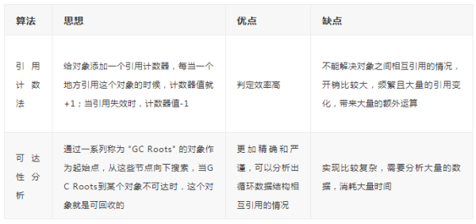

### 引用计数法

引用计数法（Reference Count）会给对象中添加一个引用计数器，每当有一个地方引用它的时候，计数器的值就 +1 ，当引用失效时，计数器值就 -1 ，计数器的值为 0 的对象不可能在被使用，这个时候就可以判定这个对象是垃圾。

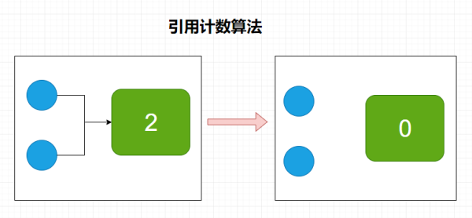

当图中的数值变成0时，这个时候使用引用计数算法就可以判定它是垃圾了，但是引用计数法不能解决一个问题，就是当对象是循环引用的时候，计数器值都不为0，这个时候引用计数器无法通知GC收集器来回收他们，如下图所示：


这个时候就需要使用到我们的根可达算法。


### 可达性分析

根可达算法（Root Searching）的意思是说从根上开始搜索，当一个程序启动后，马上需要的那些个对象就叫做根对象，所谓的根可达算法就是首先找到根对象，然后跟着这根线一直往外找到那些有用的。常见的GC roots如下：

- **线程栈变量：** 线程里面会有线程栈和main栈帧，从这个main() 里面开始的这些对象都是我们的根对象

- **静态变量：** 一个class 它有一个静态的变量，load到内存之后马上就得对静态变量进行初始化，所以静态变量到的对象这个叫做根对象

- **常量池：** 如果你这个class会用到其他的class的那些个类的对象，这些就是根对象

- **JNI：** 如果我们调用了 C和C++ 写的那些本地方法所用到的那些个类或者对象

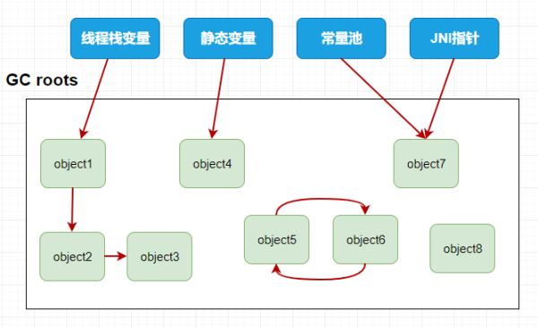

图中的 object5 和object6 虽然他们之间互相引用了，但是从根找不到它，所以就是垃圾，而object8没有任何引用自然而然也是垃圾，其他的Object对象都有可以从根找到的，所以是有用的，不会被垃圾回收掉。


**GC Root**

GC Roots 是一组必须活跃的引用。用通俗的话来说，就是程序接下来通过直接引用或者间接引用，能够访问到的潜在被使用的对象。GC Roots 包括：

- **Java 线程中，当前所有正在被调用的方法的引用类型参数、局部变量、临时值等。也就是与我们栈帧相关的各种引用**
- **所有当前被加载的 Java 类**
- **Java 类的引用类型静态变量**
- **运行时常量池里的引用类型常量（String 或 Class 类型）**
- **JVM 内部数据结构的一些引用，比如 sun.jvm.hotspot.memory.Universe 类**
- **用于同步的监控对象，比如调用了对象的 wait() 方法**
- **JNI handles，包括 global handles 和 local handles**

这些 GC Roots 大体可以分为三大类：

- **活动线程相关的各种引用**
- **类的静态变量的引用**
- **JNI 引用**

有两个注意点：

- **我们这里说的是活跃的引用，而不是对象，对象是不能作为 GC Roots 的**
- **GC 过程是找出所有活对象，并把其余空间认定为“无用”；而不是找出所有死掉的对象，并回收它们占用的空间。所以，哪怕 JVM 的堆非常的大，基于 tracing 的 GC 方式，回收速度也会非常快**


## 清理垃圾算法

清理垃圾算法又叫内存回收算法。

### 标记（Mark）

垃圾回收的第一步，就是找出活跃的对象。根据 GC Roots 遍历所有的可达对象，这个过程，就叫作标记。


如图所示，圆圈代表的是对象。绿色的代表 GC Roots，红色的代表可以追溯到的对象。可以看到标记之后，仍然有多个灰色的圆圈，它们都是被回收的对象。


### 清除（Sweep）

清除阶段就是把未被标记的对象回收掉。


但是这种简单的清除方式，有一个明显的弊端，那就是碎片问题。比如我申请了 1k、2k、3k、4k、5k 的内存。


由于某种原因 ，2k 和 4k 的内存，我不再使用，就需要交给垃圾回收器回收。


这个时候，我应该有足足 6k 的空闲空间。接下来，我打算申请另外一个 5k 的空间，结果系统告诉我内存不足了。系统运行时间越长，这种碎片就越多。在很久之前使用 Windows 系统时，有一个非常有用的功能，就是内存整理和磁盘整理，运行之后有可能会显著提高系统性能。这个出发点是一样的。


### 复制（Copying）

算法.png)

**优点**

- 因为是对整个半区进行内存回收，内存分配时不用考虑内存碎片等情况。实现简单，效率较高

**不足之处**

- 既然要复制，需要提前预留内存空间，有一定的浪费
- 在对象存活率较高时，需要复制的对象较多，效率将会变低


### 整理（Compact）

其实，不用分配一个对等的额外空间，也是可以完成内存的整理工作。可以把内存想象成一个非常大的数组，根据随机的 index 删除了一些数据。那么对整个数组的清理，其实是不需要另外一个数组来进行支持的，使用程序就可以实现。它的主要思路，就是移动所有存活的对象，且按照内存地址顺序依次排列，然后将末端内存地址以后的内存全部回收。


但是需要注意，这只是一个理想状态。对象的引用关系一般都是非常复杂的，我们这里不对具体的算法进行描述。你只需要了解，从效率上来说，一般整理算法是要低于复制算法的。


### 扩展回收算法

目前JVM的垃圾回收器都是对几种朴素算法的发扬光大（没有最优的算法，只有最合适的算法）：

- **复制算法（Copying）**：复制算法是所有算法里面效率最高的，缺点是会造成一定的空间浪费
- **标记-清除（Mark-Sweep）**：效率一般，缺点是会造成内存碎片问题
- **标记-整理（Mark-Compact）**：效率比前两者要差，但没有空间浪费，也消除了内存碎片问题

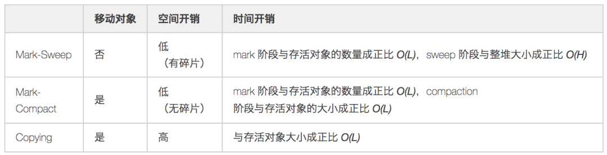


#### 标记清除（Mark-Sweep）

算法.png)

首先从 GC Root 开始遍历对象图，并标记（Mark）所遇到的每个对象，标识出所有要回收的对象。然后回收器检查堆中每一个对象，并将所有未被标记的对象进行回收。

**不足之处**

- 标记、清除的效率都不高
- 清除后产生大量的内存碎片，空间碎片太多会导致在分配大对象时无法找到足够大的连续内存，从而不得不触发另一次垃圾回收动作


#### 标记整理（Mark-Compact）

算法.png)

与标记清除算法类似，但不是在标记完成后对可回收对象进行清理，而是将所有存活的对象向一端移动，然后直接清理掉端边界以外的内存。

**优点**

- 消除了标记清除导致的内存分散问题，也消除了复制算法中内存减半的高额代价

**不足之处**

- 效率低下，需要标记所有存活对象，还要标记所有存活对象的引用地址。效率上低于复制算法


#### 分代收集（Generational Collection）

研究表明大部分对象可以分为两类：

- 大部分对象的生命周期都很短
- 其他对象则很可能会存活很长时间

根据对象存活周期的不同将内存划分为几块。对不同周期的对象采取不同的收集算法：

- **新生代**：每次垃圾收集会有大批对象回收，所以采取复制算法
- **老年代**：对象存活率高，采取标记清理或者标记整理算法


**① 年轻代（Young Generation）**

年轻代使用的垃圾回收算法是复制算法。因为年轻代发生 GC 后，只会有非常少的对象存活，复制这部分对象是非常高效的。但复制算法会造成一定的空间浪费，所以年轻代中间也会分很多区域。


如图所示，年轻代分为：**1个伊甸园空间（Eden ）**，**2个幸存者空间（Survivor ）**。当年轻代中的 Eden 区分配满的时候，就会触发年轻代的 GC（Minor GC）。具体过程如下：

- 在 Eden 区执行了第一次 GC 之后，存活的对象会被移动到其中一个 Survivor 分区（以下简称from）
- Eden 区再次 GC，这时会采用复制算法，将 Eden 和 from 区一起清理。存活的对象会被复制到 to 区，然后只需要清空 from 区就可以了

在这个过程中，总会有1个 Survivor 分区是空置的。Eden、from、to 的默认比例是 8:1:1，所以只会造成 10% 的空间浪费。这个比例，是由参数 **-XX:SurvivorRatio** 进行配置的（默认为 8）。


**② 老年代（Old/Tenured Generation）**

老年代一般使用“**标记-清除**”、“**标记-整理**”算法，因为老年代的对象存活率一般是比较高的，空间又比较大，拷贝起来并不划算，还不如采取就地收集的方式。对象进入老年代的途径如下：

- **提升（Promotion）**

  如果对象够老，会通过“提升”进入老年代

- **分配担保**

  年轻代回收后存活的对象大于10%时，因Survivor空间不够存储，对象就会直接在老年代上分配

- **大对象直接在老年代分配**

  超出某个大小的对象将直接在老年代分配

- **动态对象年龄判定**

  有的垃圾回收算法，并不要求 age 必须达到 15 才能晋升到老年代，它会使用一些动态的计算方法。

  比如，如果幸存区中相同年龄对象大小的和，大于幸存区的一半，大于或等于 age 的对象将会直接进入老年代。


## GC垃圾收集器

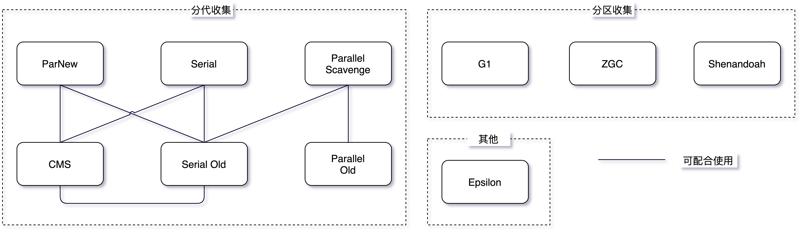

GC垃圾收集器的JVM配置参数：

- **-XX:+UseSerialGC**：年轻代和老年代都用串行收集器
- **-XX:+UseParNewGC**：年轻代使用 ParNew，老年代使用 Serial Old
- **-XX:+UseParallelGC**：年轻代使用 ParallerGC，老年代使用 Serial Old
- **-XX:+UseParallelOldGC**：新生代和老年代都使用并行收集器
- **-XX:+UseConcMarkSweepGC**：表示年轻代使用 ParNew，老年代的用 CMS
- **-XX:+UseG1GC**：使用 G1垃圾回收器
- **-XX:+UseZGC**：使用 ZGC 垃圾回收器


### 年轻代收集器

#### Serial收集器

处理GC的只有一条线程，并且在垃圾回收的过程中暂停一切用户线程。最简单的垃圾回收器，但千万别以为它没有用武之地。因为简单，所以高效，它通常用在客户端应用上。因为客户端应用不会频繁创建很多对象，用户也不会感觉出明显的卡顿。相反，它使用的资源更少，也更轻量级。

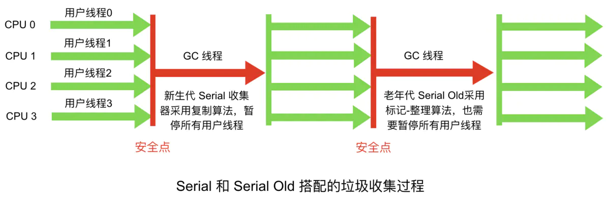


#### ParNew收集器

ParNew是Serial的多线程版本。由多条GC线程并行地进行垃圾清理。清理过程依然要停止用户线程。ParNew 追求“低停顿时间”，与 Serial 唯一区别就是使用了多线程进行垃圾收集，在多 CPU 环境下性能比 Serial 会有一定程度的提升；但线程切换需要额外的开销，因此在单 CPU 环境中表现不如 Serial。


#### Parallel Scavenge收集器

另一个多线程版本的垃圾回收器。它与ParNew的主要区别是：

- **Parallel Scavenge**：追求CPU吞吐量，能够在较短时间完成任务，适合没有交互的后台计算。弱交互强计算
- **ParNew**：追求降低用户停顿时间，适合交互式应用。强交互弱计算


### 老年代收集器

#### Serial Old收集器

与年轻代的 Serial 垃圾收集器对应，都是单线程版本，同样适合客户端使用。年轻代的 Serial，使用复制算法。老年代的 Old Serial，使用标记-整理算法。


#### Parallel Old收集器

Parallel Old 收集器是 Parallel Scavenge 的老年代版本，追求 CPU 吞吐量。

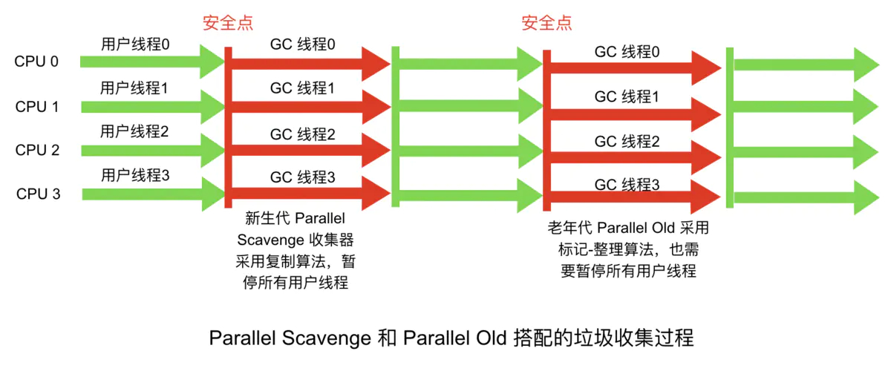


#### CMS收集器

**并发标记清除(Concurrent Mark Sweep,CMS)垃圾回收器**，是一款致力于获取最短停顿时间的收集器，使用多个线程来扫描堆内存并标记可被清除的对象，然后清除标记的对象。在下面两种情形下会暂停工作线程：

- 在老年代中标记引用对象的时候

- 在做垃圾回收的过程中堆内存中有变化发生


对比与并行垃圾回收器，CMS回收器使用更多的CPU来保证更高的吞吐量。如果我们可以有更多的CPU用来提升性能，那么CMS垃圾回收器是比并行回收器更好的选择。使用 `-XX:+UseParNewGCJVM` 参数来开启使用CMS垃圾回收器。


**主要流程如下**：

- 初始标记(CMS initial mark)
- 并发标记(CMS concurrenr mark)
- 重新标记(CMS remark)
- 并发清除(CMS concurrent sweep)


**优点**：

- 并发收集
- 停顿时间最短

**缺点**：

- 并发收集占据一定CPU资源，导致程序GC过程中变慢（吞吐量下降）
- 无法处理浮动垃圾，可能出现”Concurrent Mode Failure“失败而导致另一次Full GC
- 因为基于”标记-清除算法“导致空间碎片过多，可能因此在分配对象时引起另一次GC


**作用内存区域**：老年代

**适用场景**：对停顿时间敏感的场合

**算法类型**：标记-清除


### 新生代和老年代收集

#### G1收集器

**G1垃圾回收器** 应用于大的堆内存空间。它将堆内存空间划分为不同的区域，对各个区域并行地做回收工作。G1在回收内存空间后还立即对空闲空间做整合工作以减少碎片。CMS却是在全部停止(stop the world,STW)时执行内存整合工作。对于不同的区域G1根据垃圾的数量决定优先级。使用 `-XX:UseG1GCJVM` 参数来开启使用G1垃圾回收器。

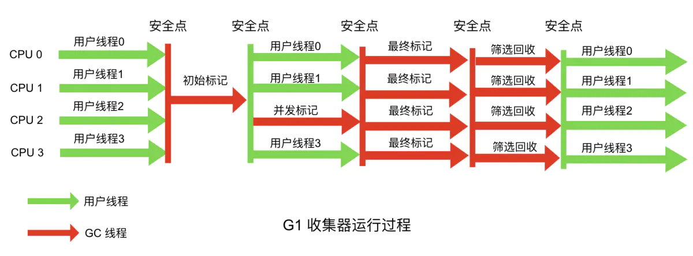

**主要流程如下**：

- 初始标记(Initial Marking)
- 并发标记(Concurrenr Marking)
- 最终标记(Final Marking)
- 筛选回收(Live Data Counting And Evacution)


**优点**：

- 并行与并发，充分发挥多核优势
- 分代收集，所以不需要与其它收集器配合即可工作
- 空间整合，整体来看基于”标记-整理算法“，局部采用”复制算法“都不会产生内存碎片
- 可以指定GC最大停顿时长

**缺点**：

- 需要记忆集来记录新生代和老年代之间的引用关系
- 需要占用大量的内存，可能达到整个堆内存容量的20%甚至更多


**作用内存区域**：跨代

**适用场景**：作为关注停顿时间的场景的收集器备选方案

**算法类型**：整体来看基于”标记-整理算法“，局部采用"复制算法"


#### ZGC收集器

Z Garbage Collector，简称 ZGC，是 JDK 11 中新加入的尚在实验阶段的低延迟垃圾收集器。它和 Shenandoah 同属于超低延迟的垃圾收集器，但在吞吐量上比 Shenandoah 有更优秀的表现，甚至超过了 G1，接近了“吞吐量优先”的 Parallel 收集器组合，可以说近乎实现了“鱼与熊掌兼得”。

与CMS中的ParNew和G1类似，ZGC也采用标记-复制算法，不过ZGC对该算法做了重大改进：ZGC在标记、转移和重定位阶段几乎都是并发的，这是ZGC实现停顿时间小于10ms目标的最关键原因。ZGC垃圾回收周期如下图所示：

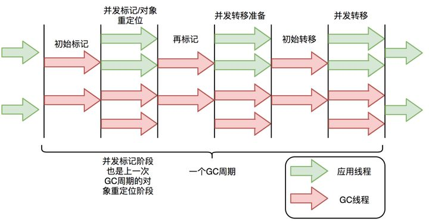

ZGC只有三个STW阶段：**初始标记**，**再标记**，**初始转移**。其中，初始标记和初始转移分别都只需要扫描所有GC Roots，其处理时间和GC Roots的数量成正比，一般情况耗时非常短；再标记阶段STW时间很短，最多1ms，超过1ms则再次进入并发标记阶段。即，ZGC几乎所有暂停都只依赖于GC Roots集合大小，停顿时间不会随着堆的大小或者活跃对象的大小而增加。与ZGC对比，G1的转移阶段完全STW的，且停顿时间随存活对象的大小增加而增加。


**ZGC 的内存布局**

与 Shenandoah 和 G1 一样，ZGC 也采用基于 Region 的堆内存布局，但与它们不同的是， ZGC 的 Region 具有动态性，也就是可以动态创建和销毁，容量大小也是动态的，有大、中、小三类容量:


- 小型 Region (Small Region)：容量固定为 2MB，用于放置小于 256KB 的小对象
- 中型 Region (M edium Region)：容量固定为 32MB，用于放置大于等于 256KB 但小于 4MB 的对象
- 大型 Region (Large Region)：容量不固定，可以动态变化，但必须为 2MB 的整数倍，用于放置 4MB 或以上的大对象。每个大型 Region 中只会存放一个大对象，这也预示着虽然名字叫作“大型 Region”，但它的实际容量完全有可能小于中型 Region，最小容量可低至 4MB

在 JDK 11 及以上版本，可以通过以下参数开启 ZGC：`-XX:+UnlockExperimentalVMOptions -XX:+UseZGC` 。


#### Shenandoah收集器

Shenandoah 与 G1 有很多相似之处，比如都是基于 Region 的内存布局，都有用于存放大对象的 Humongous Region，默认回收策略也是优先处理回收价值最大的 Region。不过也有三个重大的区别：

- Shenandoah支持并发的整理算法，G1整理阶段虽是多线程并行，但无法与用户程序并发执行
- 默认不使用分代收集理论
- 使用连接矩阵 (Connection Matrix)记录跨Region的引用关系，替换掉了G1中的记忆级(Remembered Set)，内存和计算成本更低

Shenandoah 收集器的工作原理相比 G1 要复杂不少，其运行流程示意图如下：

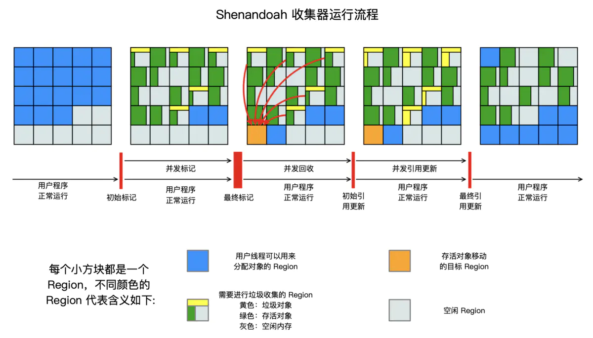

可见Shenandoah的并发程度明显比G1更高，只需要在初始标记、最终标记、初始引用更新和最终引用更新这几个阶段进行短暂的“Stop The World”，其他阶段皆可与用户程序并发执行，其中最重要的并发标记、并发回收和并发引用更新详情如下：

- **并发标记( Concurrent Marking)**
- **并发回收( Concurrent Evacuation)**
- **并发引用更新( Concurrent Update Reference)**

Shenandoah 的高并发度让它实现了超低的停顿时间，但是更高的复杂度也伴随着更高的系统开销，这在一定程度上会影响吞吐量，下图是 Shenandoah 与之前各种收集器在停顿时间维度和系统开销维度上的对比：

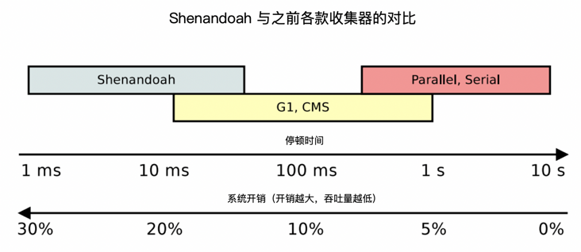

OracleJDK 并不支持 Shenandoah，如果你用的是 OpenJDK 12 或某些支持 Shenandoah 移植版的 JDK 的话，可以通过以下参数开启 Shenandoah：`-XX:+UnlockExperimentalVMOptions -XX:+UseShenandoahGC` 。


## GC日志

### 日志格式

**ParallelGC YoungGC日志**


**ParallelGC FullGC日志**


### 最佳实践

在不同的 JVM 的不垃圾回收器上，看参数默认是什么，不要轻信别人的建议，命令行示例如下：

```shell
java -XX:+PrintFlagsFinal -XX:+UseG1GC  2>&1 | grep UseAdaptiveSizePolicy
```

PrintCommandLineFlags：通过它，你能够查看当前所使用的垃圾回收器和一些默认的值。

```shell
# java -XX:+PrintCommandLineFlags -version
-XX:InitialHeapSize=127905216 -XX:MaxHeapSize=2046483456 -XX:+PrintCommandLineFlags -XX:+UseCompressedClassPointers -XX:+UseCompressedOops -XX:+UseParallelGC
openjdk version "1.8.0_41"
OpenJDK Runtime Environment (build 1.8.0_41-b04)
OpenJDK 64-Bit Server VM (build 25.40-b25, mixed mode)
```


G1垃圾收集器JVM参数最佳实践：

```shell
# 1.基本参数
-server                  # 服务器模式
-Xmx12g                  # 初始堆大小
-Xms12g                  # 最大堆大小
-Xss256k                 # 每个线程的栈内存大小
-XX:+UseG1GC             # 使用 G1 (Garbage First) 垃圾收集器   
-XX:MetaspaceSize=256m   # 元空间初始大小
-XX:MaxMetaspaceSize=1g  # 元空间最大大小
-XX:MaxGCPauseMillis=200 # 每次YGC / MixedGC 的最多停顿时间 (期望最长停顿时间)

# 2.必备参数
-XX:+PrintGCDetails            # 输出详细GC日志
-XX:+PrintGCDateStamps         # 输出GC的时间戳（以日期的形式，如 2013-05-04T21:53:59.234+0800）
-XX:+PrintTenuringDistribution # 打印对象分布：为了分析GC时的晋升情况和晋升导致的高暂停，看对象年龄分布日志
-XX:+PrintHeapAtGC                 # 在进行GC的前后打印出堆的信息
-XX:+PrintReferenceGC              # 打印Reference处理信息:强引用/弱引用/软引用/虚引用/finalize方法万一有问题
-XX:+PrintGCApplicationStoppedTime # 打印STW时间
-XX:+PrintGCApplicationConCurrentTime # 打印GC间隔的服务运行时长

# 3.日志分割参数
-XX:+UseGCLogFileRotation   # 开启日志文件分割
-XX:NumberOfGCLogFiles=14   # 最多分割几个文件，超过之后从头文件开始写
-XX:GCLogFileSize=32M       # 每个文件上限大小，超过就触发分割
-Xloggc:/path/to/gc-%t.log  # GC日志输出的文件路径,使用%t作为日志文件名,即gc-2021-03-29_20-41-47.log
```

CMS垃圾收集器JVM参数最佳实践：

```shell
# 1.基本参数
-server   # 服务器模式
-Xmx4g    # JVM最大允许分配的堆内存，按需分配
-Xms4g    # JVM初始分配的堆内存，一般和Xmx配置成一样以避免每次gc后JVM重新分配内存
-Xmn256m  # 年轻代内存大小，整个JVM内存=年轻代 + 年老代 + 持久代
-Xss512k  # 设置每个线程的堆栈大小
-XX:+DisableExplicitGC                # 忽略手动调用GC, System.gc()的调用就会变成一个空调用，完全不触发GC
-XX:+UseConcMarkSweepGC               # 使用 CMS 垃圾收集器
-XX:+CMSParallelRemarkEnabled         # 降低标记停顿
-XX:+UseCMSCompactAtFullCollection    # 在FULL GC的时候对年老代的压缩
-XX:+UseFastAccessorMethods           # 原始类型的快速优化
-XX:+UseCMSInitiatingOccupancyOnly    # 使用手动定义初始化定义开始CMS收集
-XX:LargePageSizeInBytes=128m         # 内存页的大小
-XX:CMSInitiatingOccupancyFraction=70 # 使用cms作为垃圾回收使用70％后开始CMS收集

# 2.必备参数
-XX:+PrintGCDetails                # 输出详细GC日志
-XX:+PrintGCDateStamps             # 输出GC的时间戳（以日期的形式，如 2013-05-04T21:53:59.234+0800）
-XX:+PrintTenuringDistribution     # 打印对象分布：为分析GC时的晋升情况和晋升导致的高暂停，看对象年龄分布
-XX:+PrintHeapAtGC                 # 在进行GC的前后打印出堆的信息
-XX:+PrintReferenceGC              # 打印Reference处理信息:强引用/弱引用/软引用/虚引用/finalize方法万一有问题
-XX:+PrintGCApplicationStoppedTime # 打印STW时间
-XX:+PrintGCApplicationConCurrentTime # 打印GC间隔的服务运行时长

# 3.日志分割参数
-XX:+UseGCLogFileRotation   # 开启日志文件分割
-XX:NumberOfGCLogFiles=14   # 最多分割几个文件，超过之后从头文件开始写
-XX:GCLogFileSize=32M       # 每个文件上限大小，超过就触发分割
-Xloggc:/path/to/gc-%t.log  # GC日志输出的文件路径,使用%t作为日志文件名,即gc-2021-03-29_20-41-47.log
```


## GC场景

### Full GC场景

**场景一：System.gc()方法的调用**

此方法的调用是建议JVM进行Full GC,虽然只是建议而非一定,但很多情况下它会触发 Full GC,从而增加Full GC的频率,也即增加了间歇性停顿的次数。强烈影响系建议能不使用此方法就别使用，让虚拟机自己去管理它的内存，可通过通过 `-XX:+ DisableExplicitGC` 来禁止RMI调用System.gc()。


**场景二：老年代代空间不足**

- 原因分析：新生代对象转入老年代、创建大对象或数组时，执行FullGC后仍空间不足
- 抛出错误：`Java.lang.OutOfMemoryError: Java heap space`
- 解决办法：
  - 尽量让对象在YoungGC时被回收
  - 让对象在新生代多存活一段时间
  - 不要创建过大的对象或数组


**场景三：永生区空间不足**

- 原因分析：JVM方法区因系统中要加载的类、反射的类和调用的方法较多而可能会被占满
- 抛出错误：`java.lang.OutOfMemoryError: PermGen space`
- 解决办法：
  - 增大老年代空间大小
  - 使用CMS GC


**场景四：CMS GC时出现promotion failed和concurrent mode failure**

- 原因分析：
  - `promotion failed`：是在进行Minor GC时，survivor space放不下、对象只能放入老年代，而此时老年代也放不下造成
   - `concurrent mode failure`：是在执行CMS GC的过程中同时有对象要放入老年代，而此时老年代空间不足造成的
- 抛出错误：GC日志中存在`promotion failed`和`concurrent mode`
- 解决办法：增大幸存区或老年代


**场景五：堆中分配很大的对象**

- 原因分析：创建大对象或长数据时，此对象直接进入老年代，而老年代虽有很大剩余空间，但没有足够的连续空间来存储
- 抛出错误：触发FullGC
- 解决办法：配置-XX:+UseCMSCompactAtFullCollection开关参数，用于享受用完FullGC后额外免费赠送的碎片整理过程，但同时停顿时间不得不变长。可以使用-XX:CMSFullGCsBeforeCompaction参数来指定执行多少次不压缩的FullGC后才执行一次压缩


### CMS GC场景

**场景一：动态扩容引起的空间震荡**

- **现象**

  服务**刚刚启动时 GC 次数较多**，最大空间剩余很多但是依然发生 GC，这种情况我们可以通过观察 GC 日志或者通过监控工具来观察堆的空间变化情况即可。GC Cause 一般为 Allocation Failure，且在 GC 日志中会观察到经历一次 GC ，堆内各个空间的大小会被调整，如下图所示：

  

- **原因**

  在 JVM 的参数中 `-Xms` 和 `-Xmx` 设置的不一致，在初始化时只会初始 `-Xms` 大小的空间存储信息，每当空间不够用时再向操作系统申请，这样的话必然要进行一次 GC。另外，如果空间剩余很多时也会进行缩容操作，JVM 通过 `-XX:MinHeapFreeRatio` 和 `-XX:MaxHeapFreeRatio` 来控制扩容和缩容的比例，调节这两个值也可以控制伸缩的时机。整个伸缩的模型理解可以看这个图，当 committed 的空间大小超过了低水位/高水位的大小，capacity 也会随之调整：

  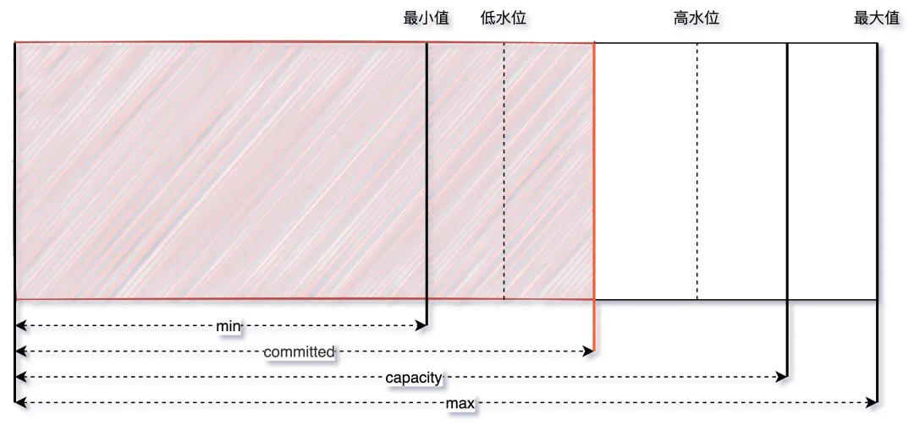

- **策略** 

  观察 CMS GC 触发时间点 Old/MetaSpace 区的 committed 占比是不是一个固定的值，或者像上文提到的观察总的内存使用率也可以。尽量 **将成对出现的空间大小配置参数设置成固定的** ，如 `-Xms` 和 `-Xmx`，`-XX:MaxNewSize` 和 `-XX:NewSize`，`-XX:MetaSpaceSize` 和 `-XX:MaxMetaSpaceSize` 等。


**场景二：显式GC的去与留**

- **现象**

  除了扩容缩容会触发 CMS GC 之外，还有 Old 区达到回收阈值、MetaSpace 空间不足、Young 区晋升失败、大对象担保失败等几种触发条件，如果这些情况都没有发生却触发了 GC ？这种情况有可能是代码中手动调用了 System.gc 方法，此时可以找到 GC 日志中的 GC Cause 确认下。

- **原因**

  **保留 System.gc**：CMS中使用 Foreground Collector 时将会带来非常长的 STW，在应用程序中 System.gc 被频繁调用，那就非常危险。增加 `-XX:+DisableExplicitGC` 参数则可以禁用。**去掉 System.gc**：禁用掉后会带来另一个内存泄漏的问题，为 DirectByteBuffer 分配空间过程中会显式调用 System.gc ，希望通过 Full GC 来强迫已经无用的 DirectByteBuffer 对象释放掉它们关联的 Native Memory，如Netty等。

- **策略**

  无论是保留还是去掉都会有一定的风险点，不过目前互联网中的 RPC 通信会大量使用 NIO，所以建议保留。此外 JVM 还提供了 `-XX:+ExplicitGCInvokesConcurrent` 和 `-XX:+ExplicitGCInvokesConcurrentAndUnloadsClasses` 参数来将 System.gc 的触发类型从 Foreground 改为 Background，同时 Background 也会做 Reference Processing，这样的话就能大幅降低了 STW 开销，同时也不会发生 NIO Direct Memory OOM。


**场景三：MetaSpace区OOM**

- **现象**

  JVM 在启动后或者某个时间点开始， **MetaSpace 的已使用大小在持续增长，同时每次 GC 也无法释放，调大 MetaSpace 空间也无法彻底解决** 。

- **原因**

  在讨论为什么会 OOM 之前，我们先来看一下这个区里面会存什么数据，Java 7 之前字符串常量池被放到了 Perm 区，所有被 intern 的 String 都会被存在这里，由于 String.intern 是不受控的，所以 `-XX:MaxPermSize` 的值也不太好设置，经常会出现 `java.lang.OutOfMemoryError: PermGen space` 异常，所以在 Java 7 之后常量池等字面量（Literal）、类静态变量（Class Static）、符号引用（Symbols Reference）等几项被移到 Heap 中。而 Java 8 之后 PermGen 也被移除，取而代之的是 MetaSpace。由场景一可知，为了避免弹性伸缩带来的额外 GC 消耗，我们会将 `-XX:MetaSpaceSize` 和 `-XX:MaxMetaSpaceSize` 两个值设置为固定的，但这样也会导致在空间不够的时候无法扩容，然后频繁地触发 GC，最终 OOM。所以关键原因是 **ClassLoader不停地在内存中load了新的Class ，一般这种问题都发生在动态类加载等情况上。**

- **策略**

  可以 dump 快照之后通过 JProfiler 或 MAT 观察 Classes 的 Histogram（直方图） 即可，或者直接通过命令即可定位， jcmd 打几次 Histogram 的图，看一下具体是哪个包下的 Class 增加较多就可以定位。如果无法从整体的角度定位，可以添加 `-XX:+TraceClassLoading` 和 `-XX:+TraceClassUnLoading` 参数观察详细的类加载和卸载信息。


**场景四：过早晋升**

- **现象**

  这种场景主要发生在分代的收集器上面，专业的术语称为“Premature Promotion”。90% 的对象朝生夕死，只有在 Young 区经历过几次 GC 的洗礼后才会晋升到 Old 区，每经历一次 GC 对象的 GC Age 就会增长 1，最大通过 `-XX:MaxTenuringThreshold` 来控制。过早晋升一般不会直接影响 GC，总会伴随着浮动垃圾、大对象担保失败等问题，但这些问题不是立刻发生的，我们可以观察以下几种现象来判断是否发生了过早晋升：

  - **分配速率接近于晋升速率** ，对象晋升年龄较小。

    GC 日志中出现“Desired survivor size 107347968 bytes, **new threshold 1(max 6)** ”等信息，说明此时经历过一次 GC 就会放到 Old 区。

  - **Full GC 比较频繁** ，且经历过一次 GC 之后 Old 区的 **变化比例非常大** 。

    如Old区触发回收阈值是80%，经历一次GC之后下降到了10%，这说明Old区70%的对象存活时间其实很短。

    

  过早晋升的危害：

  - Young GC 频繁，总的吞吐量下降
  - Full GC 频繁，可能会有较大停顿

- **原因**

  主要的原因有以下两点：

  - **Young/Eden 区过小**： 过小的直接后果就是 Eden 被装满的时间变短，本应该回收的对象参与了 GC 并晋升，Young GC 采用的是复制算法，由基础篇我们知道 copying 耗时远大于 mark，也就是 Young GC 耗时本质上就是 copy 的时间（CMS 扫描 Card Table 或 G1 扫描 Remember Set 出问题的情况另说），没来及回收的对象增大了回收的代价，所以 Young GC 时间增加，同时又无法快速释放空间，Young GC 次数也跟着增加
  - **分配速率过大**： 可以观察出问题前后 Mutator 的分配速率，如果有明显波动可以尝试观察网卡流量、存储类中间件慢查询日志等信息，看是否有大量数据被加载到内存中

- **策略**

  - 如果是 **Young/Eden 区过小** ，可以在总的 Heap 内存不变的情况下适当增大Young区。一般情况下Old的大小应当为活跃对象的2~3倍左右，考虑到浮动垃圾问题最好在3倍左右，剩下的都可以分给Young区

  - 过早晋升优化来看，原配置为Young 1.2G+Old 2.8G，通过观察CMS GC的情况找到存活对象大概为 300~400M，于是调整Old 1.5G左右，剩下2.5G分给Young 区。仅仅调了一个Young区大小参数（`-Xmn`），整个 JVM 一分钟Young GC从26次降低到了11次，单次时间也没有增加，总的GC时间从1100ms降低到了500ms，CMS GC次数也从40分钟左右一次降低到了7小时30分钟一次：

    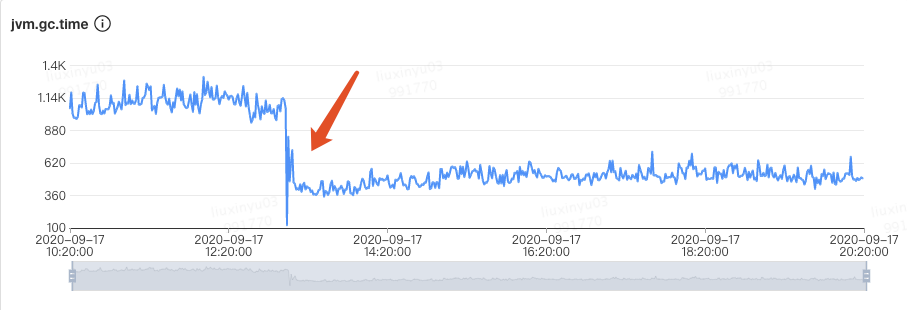

    

    如果是分配速率过大：

    - **偶发较大** ：通过内存分析工具找到问题代码，从业务逻辑上做一些优化
    - **一直较大** ：当前的 Collector 已经不满足 Mutator 的期望了，这种情况要么扩容 Mutator 的 VM，要么调整 GC 收集器类型或加大空间

- **小结**

  过早晋升问题一般不会特别明显，但日积月累之后可能会爆发一波收集器退化之类的问题，所以我们还是要提前避免掉的，可以看看自己系统里面是否有这些现象，如果比较匹配的话，可以尝试优化一下。一行代码优化的 ROI 还是很高的。如果在观察 Old 区前后比例变化的过程中，发现可以回收的比例非常小，如从 80% 只回收到了 60%，说明我们大部分对象都是存活的，Old 区的空间可以适当调大些。


**场景五：CMS Old GC频繁**

- **现象**

  Old 区频繁的做 CMS GC，但是每次耗时不是特别长，整体最大 STW 也在可接受范围内，但由于 GC 太频繁导致吞吐下降比较多。

- **原因**

  这种情况比较常见，基本都是一次 Young GC 完成后，负责处理 CMS GC 的一个后台线程 concurrentMarkSweepThread 会不断地轮询，使用 `shouldConcurrentCollect()` 方法做一次检测，判断是否达到了回收条件。如果达到条件，使用 `collect_in_background()` 启动一次 Background 模式 GC。轮询的判断是使用 `sleepBeforeNextCycle()` 方法，间隔周期为 `-XX:CMSWaitDuration` 决定，默认为 2s。

- **策略**

  处理这种常规内存泄漏问题基本是一个思路，主要步骤如下：

  

  Dump Diff 和 Leak Suspects 比较直观，这里说下其它几个关键点：

  - **内存 Dump**： 使用 jmap、arthas 等 dump 堆进行快照时记得摘掉流量，同时 **分别在 CMS GC 的发生前后分别 dump 一次** 
  - **分析 Top Component**： 要记得按照对象、类、类加载器、包等多个维度观察Histogram，同时使用 outgoing和incoming分析关联的对象，其次Soft Reference和Weak Reference、Finalizer 等也要看一下
  - **分析 Unreachable**： 重点看一下这个，关注下 Shallow 和 Retained 的大小。如下图所示的一次 GC 优化，就根据 Unreachable Objects 发现了 Hystrix 的滑动窗口问题。

  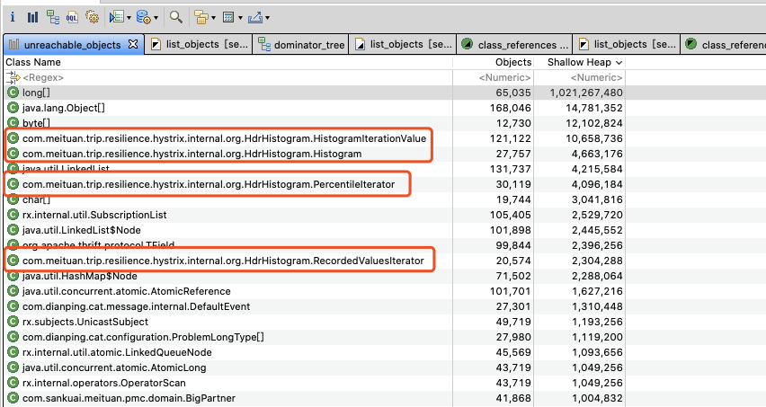

  

**场景六：单次CMS Old GC耗时长**

- **现象**

  CMS GC 单次 STW 最大超过 1000ms，不会频繁发生，如下图所示最长达到了 8000ms。某些场景下会引起“雪崩效应”，这种场景非常危险，我们应该尽量避免出现。

  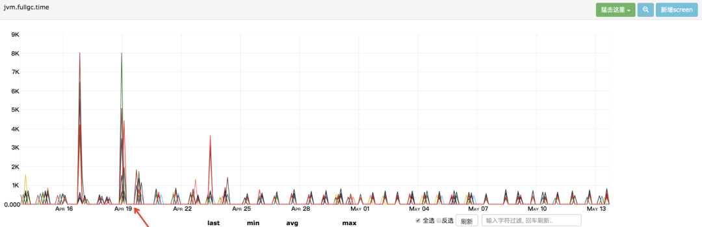

- **原因**

  CMS在回收的过程中，STW的阶段主要是 Init Mark 和 Final Remark 这两个阶段，也是导致CMS Old GC 最多的原因，另外有些情况就是在STW前等待Mutator的线程到达SafePoint也会导致时间过长，但这种情况较少。

- **策略**

  知道了两个 STW 过程执行流程，我们分析解决就比较简单了，由于大部分问题都出在 Final Remark 过程，这里我们也拿这个场景来举例，主要步骤：

  - **【方向】** 观察详细 GC 日志，找到出问题时 Final Remark 日志，分析下 Reference 处理和元数据处理 real 耗时是否正常，详细信息需要通过 `-XX:+PrintReferenceGC` 参数开启。 **基本在日志里面就能定位到大概是哪个方向出了问题，耗时超过 10% 的就需要关注** 。

  ```shell
  2019-02-27T19:55:37.920+0800: 516952.915: [GC (CMS Final Remark) 516952.915: [ParNew516952.939: [SoftReference, 0 refs, 0.0003857 secs]516952.939: [WeakReference, 1362 refs, 0.0002415 secs]516952.940: [FinalReference, 146 refs, 0.0001233 secs]516952.940: [PhantomReference, 0 refs, 57 refs, 0.0002369 secs]516952.940: [JNI Weak Reference, 0.0000662 secs]
  [class unloading, 0.1770490 secs]516953.329: [scrub symbol table, 0.0442567 secs]516953.373: [scrub string table, 0.0036072 secs][1 CMS-remark: 1638504K(2048000K)] 1667558K(4352000K), 0.5269311 secs] [Times: user=1.20 sys=0.03, real=0.53 secs]
  ```

  - **【根因】** 有了具体的方向我们就可以进行深入的分析，一般来说最容易出问题的地方就是 Reference 中的 FinalReference 和元数据信息处理中的 scrub symbol table 两个阶段，想要找到具体问题代码就需要内存分析工具 MAT 或 JProfiler 了，注意要 dump 即将开始 CMS GC 的堆。在用 MAT 等工具前也可以先用命令行看下对象 Histogram，有可能直接就能定位问题。
    - 对 FinalReference 的分析主要观察 `java.lang.ref.Finalizer` 对象的 dominator tree，找到泄漏的来源。经常会出现问题的几个点有 Socket 的 `SocksSocketImpl` 、Jersey 的 `ClientRuntime`、MySQL 的 `ConnectionImpl` 等等
    - scrub symbol table 表示清理元数据符号引用耗时，符号引用是 Java 代码被编译成字节码时，方法在 JVM 中的表现形式，生命周期一般与 Class 一致，当 `_should_unload_classes` 被设置为 true 时在 `CMSCollector::refProcessingWork()` 中与 Class Unload、String Table 一起被处理

  - **【策略】** 知道 GC 耗时的根因就比较好处理了，这种问题不会大面积同时爆发，不过有很多时候单台 STW 的时间会比较长，如果业务影响比较大，及时摘掉流量，具体后续优化策略如下：
    - FinalReference：找到内存来源后通过优化代码的方式来解决，如果短时间无法定位可以增加 `-XX:+ParallelRefProcEnabled` 对 Reference 进行并行处理
    - symbol table：观察 MetaSpace 区的历史使用峰值，以及每次 GC 前后的回收情况，一般没有使用动态类加载或者 DSL 处理等，MetaSpace 的使用率上不会有什么变化，这种情况可以通过 `-XX:-CMSClassUnloadingEnabled` 来避免 MetaSpace 的处理，JDK8 会默认开启 CMSClassUnloadingEnabled，这会使得 CMS 在 CMS-Remark 阶段尝试进行类的卸载

- **小结**

  正常情况进行的 Background CMS GC，出现问题基本都集中在 Reference 和 Class 等元数据处理上，在 Reference 类的问题处理方面，不管是 FinalReference，还是 SoftReference、WeakReference 核心的手段就是找准时机 dump快照，然后用内存分析工具来分析。Class处理方面目前除了关闭类卸载开关，没有太好的方法。在 G1 中同样有 Reference 的问题，可以观察日志中的 Ref Proc，处理方法与 CMS 类似。


**场景七：内存碎片&收集器退化**

- **现象**

  并发的 CMS GC 算法，退化为 Foreground 单线程串行 GC 模式，STW 时间超长，有时会长达十几秒。其中 CMS 收集器退化后单线程串行 GC 算法有两种：

  - 带压缩动作的算法，称为 MSC，上面我们介绍过，使用标记-清理-压缩，单线程全暂停的方式，对整个堆进行垃圾收集，也就是真正意义上的 Full GC，暂停时间要长于普通 CMS
  - 不带压缩动作的算法，收集 Old 区，和普通的 CMS 算法比较相似，暂停时间相对 MSC 算法短一些

- **原因**

  CMS 发生收集器退化主要有以下几种情况：

  - **晋升失败（Promotion Failed）**

  - **增量收集担保失败**

  - **显式 GC**

  - **并发模式失败（Concurrent Mode Failure）**

- **策略**

  分析到具体原因后，我们就可以针对性解决了，具体思路还是从根因出发，具体解决策略：

  - **内存碎片**： 通过配置 `-XX:UseCMSCompactAtFullCollection=true` 来控制 Full GC 的过程中是否进行空间的整理（默认开启，注意是 Full GC，不是普通 CMS GC），以及 `-XX: CMSFullGCsBeforeCompaction=n` 来控制多少次 Full GC 后进行一次压缩
  - **增量收集**： 降低触发 CMS GC 的阈值，即参数 `-XX:CMSInitiatingOccupancyFraction` 的值，让 CMS GC 尽早执行，以保证有足够的连续空间，也减少 Old 区空间的使用大小，另外需要使用 `-XX:+UseCMSInitiatingOccupancyOnly` 来配合使用，不然 JVM 仅在第一次使用设定值，后续则自动调整
  - **浮动垃圾**： 视情况控制每次晋升对象的大小，或者缩短每次 CMS GC 的时间，必要时可调节 NewRatio 的值。另外使用 `-XX:+CMSScavengeBeforeRemark` 在过程中提前触发一次Young GC，防止后续晋升过多对象

- **小结**

  正常情况下触发并发模式的 CMS GC，停顿非常短，对业务影响很小，但 CMS GC 退化后，影响会非常大，建议发现一次后就彻底根治。只要能定位到内存碎片、浮动垃圾、增量收集相关等具体产生原因，还是比较好解决的，关于内存碎片这块，如果 `-XX:CMSFullGCsBeforeCompaction` 的值不好选取的话，可以使用 `-XX:PrintFLSStatistics` 来观察内存碎片率情况，然后再设置具体的值。最后就是在编码的时候也要避免需要连续地址空间的大对象的产生，如过长的字符串，用于存放附件、序列化或反序列化的 byte 数组等，还有就是过早晋升问题尽量在爆发问题前就避免掉。


**场景八：堆外内存OOM**

- **现象**

  内存使用率不断上升，甚至开始使用 SWAP 内存，同时可能出现 GC 时间飙升，线程被 Block 等现象， **通过 top 命令发现 Java 进程的 RES 甚至超过了** `**-Xmx**` **的大小** 。出现这些现象时，基本可确定是出现堆外内存泄漏。

- **原因**

  JVM 的堆外内存泄漏，主要有两种的原因：

  - 通过 `UnSafe#allocateMemory`，`ByteBuffer#allocateDirect` 主动申请了堆外内存而没有释放，常见于 NIO、Netty 等相关组件
  - 代码中有通过 JNI 调用 Native Code 申请的内存没有释放

- **策略**

  **原因一：主动申请未释放**

  **原因二：通过 JNI 调用的 Native Code 申请的内存未释放**


**场景九：JNI引发的GC问题**

- **现象**

  在 GC 日志中，出现 GC Cause 为 GCLocker Initiated GC。

  ```shell
  2020-09-23T16:49:09.727+0800: 504426.742: [GC (GCLocker Initiated GC) 504426.742: [ParNew (promotion failed): 209716K->6042K(1887488K), 0.0843330 secs] 1449487K->1347626K(3984640K), 0.0848963 secs] [Times: user=0.19 sys=0.00, real=0.09 secs]2020-09-23T16:49:09.812+0800: 504426.827: [Full GC (GCLocker Initiated GC) 504426.827: [CMS: 1341583K->419699K(2097152K), 1.8482275 secs] 1347626K->419699K(3984640K), [Metaspace: 297780K->297780K(1329152K)], 1.8490564 secs] [Times: user=1.62 sys=0.20, real=1.85 secs]
  ```

- **原因**

  JNI（Java Native Interface）意为 Java 本地调用，它允许 Java 代码和其他语言写的 Native 代码进行交互。JNI 如果需要获取 JVM 中的 String 或者数组，有两种方式：

  - 拷贝传递
  - 共享引用（指针），性能更高

  由于 Native 代码直接使用了 JVM 堆区的指针，如果这时发生 GC，就会导致数据错误。因此，在发生此类 JNI 调用时，禁止 GC 的发生，同时阻止其他线程进入 JNI 临界区，直到最后一个线程退出临界区时触发一次 GC。

- **策略**

  - 添加 `-XX+PrintJNIGCStalls` 参数，可以打印出发生 JNI 调用时的线程，进一步分析，找到引发问题的 JNI 调用
  - JNI 调用需要谨慎，不一定可以提升性能，反而可能造成 GC 问题
  - 升级 JDK 版本到 14，避免 [JDK-8048556](https://bugs.openjdk.java.net/browse/JDK-8048556) 导致的重复 GC


# JVM性能调优

## 磁盘不足排查

其实，磁盘不足排查算是系统、程序层面的问题排查，并不算是JVM，但是另一方面考虑过来就是，系统磁盘的不足，也会导致JVM的运行异常，所以也把磁盘不足算进来了。并且排查磁盘不足，是比较简单，就是几个命令，然后就是逐层的排查，首先第一个命令就是**df -h**，查询磁盘的状态：

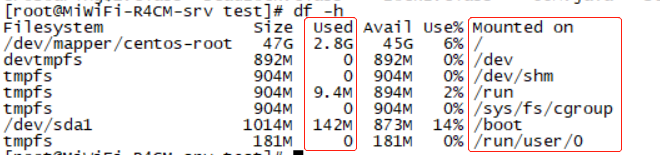 

从上面的显示中其中第一行使用的2.8G最大，然后是挂载在 **/** 目录下，我们直接**cd /**。然后通过执行：

```shell
du -sh *
```

查看各个文件的大小，找到其中最大的，或者说存储量级差不多的并且都非常大的文件，把那些没用的大文件删除就好。

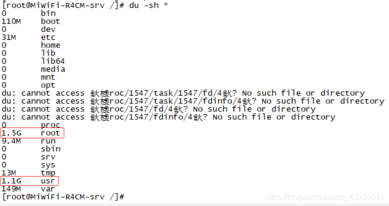 

然后，就是直接cd到对应的目录也是执行：du -sh *，就这样一层一层的执行，找到对应的没用的，然后文件又比较大的，可以直接删除。


## CPU过高排查

然后就是排查CPU的飙高的原因，**CPU飙高的排查都是直接找到对应CPU占比最高的进程，然后找到CPU最高的线程**。

总结一下可能导致CPU标高的原因，可能是**一个GC线程频繁或者锁资源竞争频繁，线程数过多**等原因。

- **GC线程频繁**
- **锁竞争频繁（自旋）**

其中GC线程频繁，有可能是**大对象（对象过多），内存泄漏**等原因导致内存紧张一直在执行GC，但是每次执行的GC回收的垃圾都非常少。

一般CPU紧张，都是线上实施排查，并且一般大厂都会有自己自研的监控平台，我们自己的监控平台，对于我们每台服务器的健康状况（健康分）、服务期内的应用（Mysql、Redis、Mq、Kafka、服务）都会进行实施的监控报警，所以一般都能都在出现问题前将问题解决掉。

在线上之间也提到过可以使用**top**、**jstack**命令排查CPU飙高的问题。这里有一段案例代码如下：

```java
public class CPUSoaring {
        public static void main(String[] args) {

                Thread thread1 = new Thread(new Runnable(){
                        @Override
                        public void run() {
                                for (;;){
                                      System.out.println("I am children-thread1");
                                }
                        }
                },"children-thread1");
                
                 Thread thread2 = new Thread(new Runnable(){
                        @Override
                        public void run() {
                                for (;;){
                                      System.out.println("I am children-thread2");
                                }
                        }
                },"children-thread2");
                
                thread1.start();
                thread2.start();
                System.err.println("I am is main thread!!!!!!!!");
        }
}
```

（1）首先通过**top**命令可以查看到id为**3806**的进程所占的CPU最高：

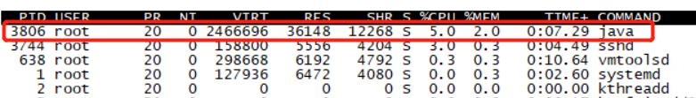

（2）然后通过**top -Hp pid**命令，找到占用CPU最高的线程：

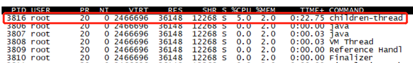

（3）接着通过：**printf '%x\n' tid**命令将线程的tid转换为十六进制：xid：

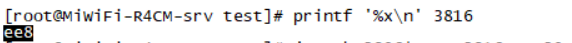

（4）最后通过：**jstack pid|grep xid -A 30**命令就是输出线程的堆栈信息，线程所在的位置：

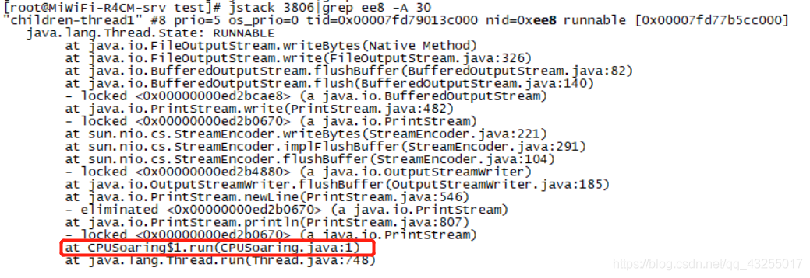

（5）还可以通过**jstack -l pid > 文件名称.txt** 命令将线程堆栈信息输出到文件，线下查看。

这就是一个CPU飙高的排查过程，目的就是要**找到占用CPU最高的线程所在的位置**，然后就是**review**你的代码，定位到问题的所在。使用Arthas的工具排查也是一样的，首先要使用top命令找到占用CPU最高的Java进程，然后使用Arthas进入该进程内，**使用dashboard命令排查占用CPU最高的线程。**，最后通过**thread**命令线程的信息。


## OOM异常排查

OOM的异常排查也比较简单，首先服务上线的时候，要先设置这两个参数：

```shell
-XX:+HeapDumpOnOutOfMemoryError -XX:HeapDumpPath=${目录}
```

指定项目出现OOM异常的时候自动导出堆转储文件，然后通过内存分析工具（**Visual VM**）来进行线下的分析。

首先我们来聊一聊，哪些原因会导致OOM异常，站在JVM的分区的角度：

- **Java堆**
- **方法区**
- **虚拟机栈**
- **本地方法栈**
- **程序计数器**
- **直接内存**

只有**程序计数器**区域不会出现OOM，在Java 8及以上的**元空间**（本地内存）都会出现OOM。

而站在程序代码的角度来看，总结了大概有以下几点原因会导致OOM异常：

- **内存泄露**
- **对象过大、过多**
- **方法过长**
- **过度使用代理框架，生成大量的类信息**

接下来我们屋来看看OOM的排查，出现OOM异常后dump出了堆转储文件，然后打开jdk自带的Visual VM工具，导入堆转储文件，首先我使用的OOM异常代码如下：

```java
import java.util.ArrayList;
import java.util.List;

class OOM {

        static class User{
                private String name;
                private int age;

                public User(String name, int age){
                        this.name = name;
                        this.age = age;
                }
        }

        public static void main(String[] args) throws InterruptedException {
                List<User> list = new ArrayList<>();
                for (int i = 0; i < Integer.MAX_VALUE; i++) {
                        Thread.sleep(1000);
                        User user = new User("zhangsan"+i,i);
                        list.add(user);
                }
        }

}
```

代码很简单，就是往集合里面不断地add对象，带入堆转储文件后，在类和实例那栏就可以看到实例最多的类：

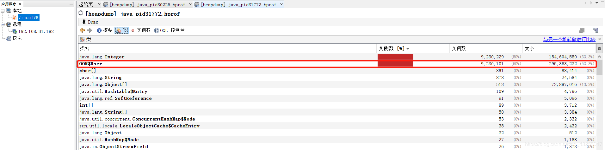

这样就找到导致OOM异常的类，还可以通过下面的方法查看导致OOM异常的线程堆栈信息，找到对应异常的代码段。

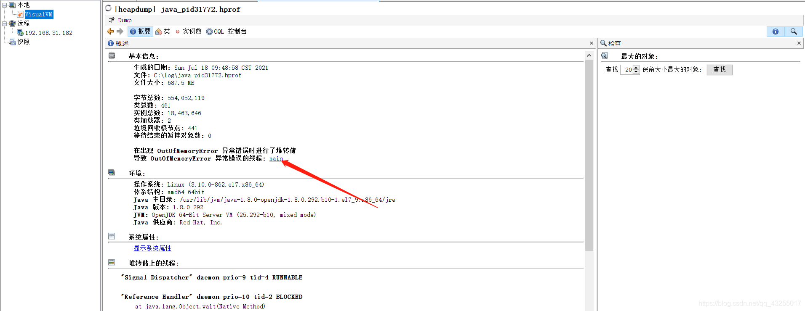

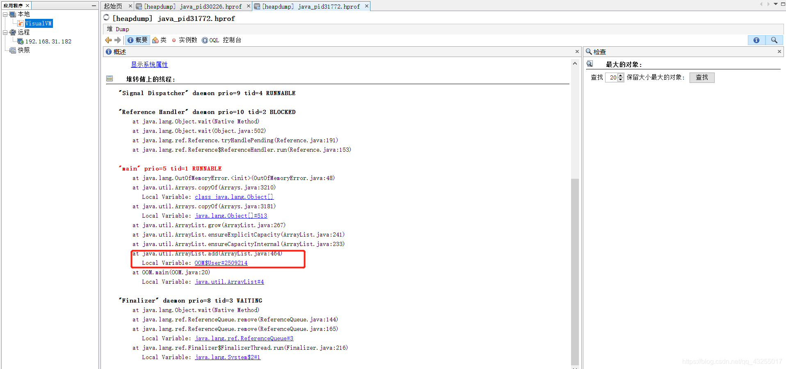

上面的方法是排查已经出现了OOM异常的方法，肯定是防线的最后一步，那么在此之前怎么防止出现OOM异常呢？

一般大厂都会有自己的监控平台，能够实施的**监控测试环境、预览环境、线上实施的服务健康状况（CPU、内存）** 等信息，对于频繁GC，并且GC后内存的回收率很差的，就要引起我们的注意了。

因为一般方法的长度合理，95%以上的对象都是朝生夕死，在**Minor GC**后只剩少量的存活对象，所以在代码层面上应该避免**方法过长、大对象**的现象。

每次自己写完代码，自己检查后，都可以提交给比自己高级别的工程师**review**自己的代码，就能及时的发现代码的问题，基本上代码没问题，百分之九十以上的问题都能避免，这也是大厂注重代码质量，并且时刻**review**代码的习惯。


## 栈溢出

栈溢出异常的排查（包括**虚拟机栈、本地方法栈**）基本和OOM的一场排查是一样的，导出异常的堆栈信息，然后使用mat或者Visual VM工具进行线下分析，找到出现异常的代码或者方法。

当线程请求的栈深度大于虚拟机栈所允许的大小时，就会出现**StackOverflowError**异常，二从代码的角度来看，导致线程请求的深度过大的原因可能有：**方法栈中对象过大，或者过多，方法过长从而导致局部变量表过大，超过了-Xss参数的设置**。


## 死锁排查

死锁的案例演示的代码如下：

```java
public class DeadLock {

	public static Object lock1 = new Object();
	public static Object lock2 = new Object();

	public static void main(String[] args){
		Thread a = new Thread(new Lock1(),"DeadLock1");
		Thread b = new Thread(new Lock2(),"DeadLock2");
		a.start();
		b.start();
	}
}
class Lock1 implements Runnable{
	@Override
	public void run(){
		try{
			while(true){
				synchronized(DeadLock.lock1){
					System.out.println("Waiting for lock2");
					Thread.sleep(3000);
					synchronized(DeadLock.lock2){
						System.out.println("Lock1 acquired lock1 and lock2 ");
					}
				}
			}
		}catch(Exception e){
			e.printStackTrace();
		}
	}
}
class Lock2 implements Runnable{
	@Override
	public void run(){
		try{
			while(true){
				synchronized(DeadLock.lock2){
					System.out.println("Waiting for lock1");
					Thread.sleep(3000);
					synchronized(DeadLock.lock1){
						System.out.println("Lock2 acquired lock1 and lock2");
					}
				}
			}
		}catch(Exception e){
			e.printStackTrace();
		}
	}
}
```

上面的代码非常的简单，就是两个类的实例作为锁资源，然后分别开启两个线程，不同顺序的对锁资源资源进行加锁，并且获取一个锁资源后，等待三秒，是为了让另一个线程有足够的时间获取另一个锁对象。

运行上面的代码后，就会陷入死锁的僵局：

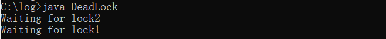

对于死锁的排查，若是在测试环境或者本地，直接就可以使用Visual VM连接到该进程，如下界面就会自动检测到死锁的存在

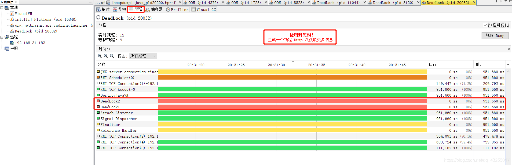

并且查看线程的堆栈信息。就能看到具体的死锁的线程：

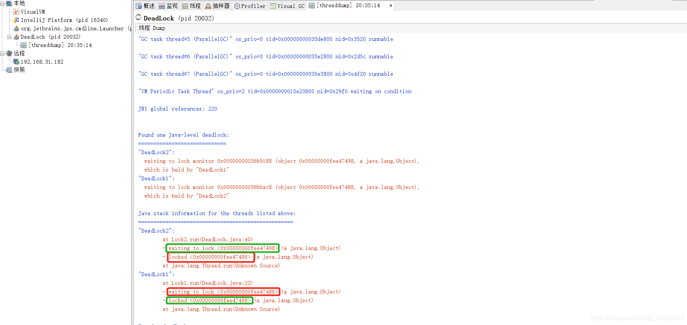

线上的话可以上用Arthas也可以使用原始的命令进行排查，原始命令可以先使用**jps**查看具体的Java进程的ID，然后再通过**jstack ID**查看进程的线程堆栈信息，他也会自动给你提示有死锁的存在：


Arthas工具可以使用**thread**命令排查死锁，要关注的是**BLOCKED**状态的线程，如下图所示：


具体thread的详细参数可以参考如下图所示：

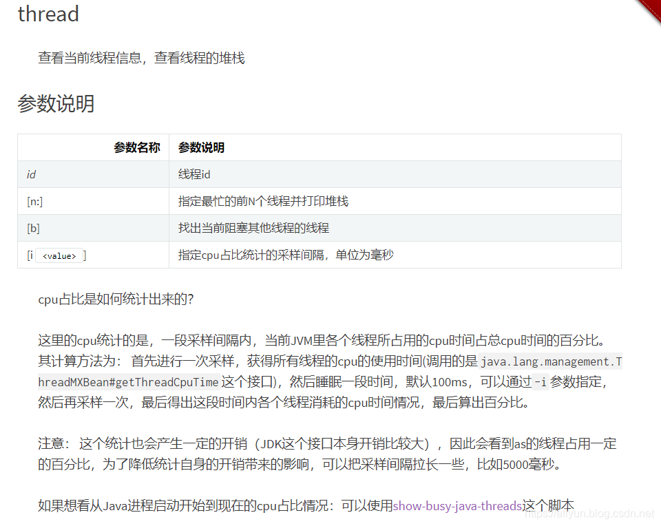


**如何避免死锁**

上面我们聊了如何排查死锁，下面我们来聊一聊如何避免死锁的发生，从上面的案例中可以发现，死锁的发生两个线程同时都持有对方不释放的资源进入僵局。所以，在代码层面，要避免死锁的发生，主要可以从下面的四个方面进行入手：

- **首先避免线程的对于资源的加锁顺序要保持一致**

- **并且要避免同一个线程对多个资源进行资源的争抢**

- **另外的话，对于已经获取到的锁资源，尽量设置失效时间，避免异常，没有释放锁资源，可以使用acquire() 方法加锁时可指定 timeout 参数**

- **最后，就是使用第三方的工具检测死锁，预防线上死锁的发生**

死锁的排查已经说完了，上面的基本就是问题的排查，也可以算是调优的一部分吧，但是对于JVM调优来说，重头戏应该是在**Java堆**，这部分的调优才是重中之重。


## 调优实战

上面说完了调优的目的和调优的指标，那么我们就来实战调优，首先准备我的案例代码，如下：

```java
import java.util.ArrayList;
import java.util.List;

class OOM {

	static class User{
		private String name;
		private int age;

		public User(String name, int age){
			this.name = name;
			this.age = age;
		}

	}

	public static void main(String[] args) throws InterruptedException {
		List<User> list = new ArrayList<>();
		for (int i = 0; i < Integer.MAX_VALUE; i++) {
		     Tread.sleep(1000);
			System.err.println(Thread.currentThread().getName());
			User user = new User("zhangsan"+i,i);
			list.add(user);
		}
	}
}
```

案例代码很简单，就是不断的往一个集合里里面添加对象，首先初次我们启动的命令为：

```shell
java   -XX:+PrintGCDetails -XX:+PrintGCDateStamps -XX:+UseGCLogFileRotation -XX:+PrintHeapAtGC -XX:NumberOfGCLogFiles=5 -XX:GCLogFileSize=50M -Xloggc:./logs/emps-gc-%t.log -XX:+HeapDumpOnOutOfMemoryError -XX:HeapDumpPath=./logs/emps-heap.dump OOM
```

就是纯粹的设置了一些GC的打印日志，然后通过Visual VM来看GC的显示如下：

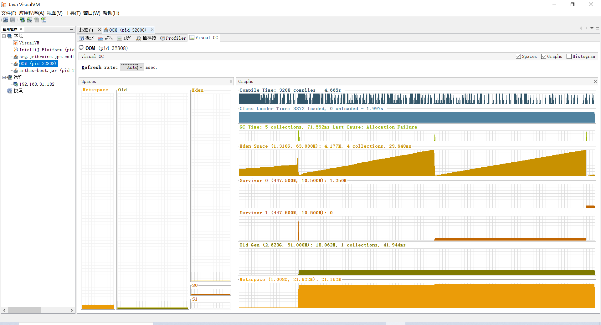

可以看到一段时间后出现4次Minor GC，使用的时间是29.648ms，发生一次Full GC使用的时间是41.944ms。

Minor GC非常频繁，Full GC也是，在短时间内就发生了几次，观察输出的日志发现以及Visual VM的显示来看，都是因为内存没有设置，太小，导致Minor GC频繁。

因此，我们第二次适当的增大Java堆的大小，调优设置的参数为：

```shell
java -Xmx2048m -Xms2048m -Xmn1024m -Xss256k  -XX:+UseConcMarkSweepGC  -XX:+PrintGCDetails -XX:+PrintGCDateStamps -XX:+UseGCLogFileRotation -XX:+PrintHeapAtGC -XX:NumberOfGCLogFiles=5 -XX:GCLogFileSize=50M -Xloggc:./logs/emps-gc-%t.log -XX:+HeapDumpOnOutOfMemoryError -XX:HeapDumpPath=./logs/emps-heap.dump OOM
```

观察一段时间后，结果如下图所示：

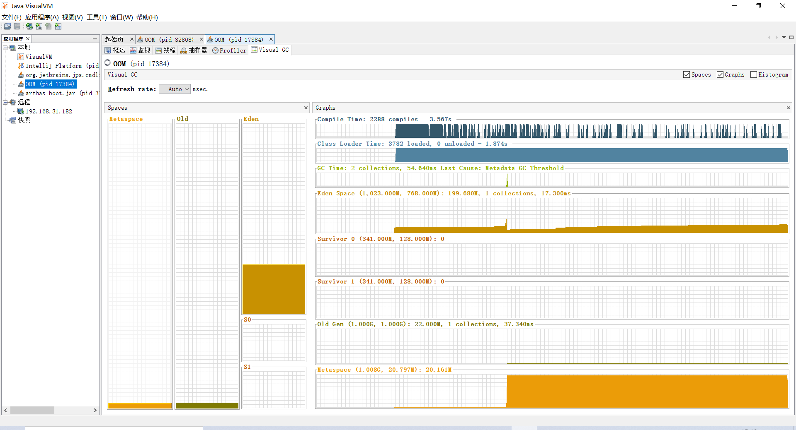

可以发现Minor GC次数明显下降，但是还是发生了Full GC，根据打印的日志来看，是因为元空间的内存不足，看了上面的Visual VM元空间的内存图，也是一样，基本都到顶了：

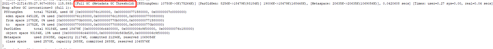

因此第三次对于元空间的区域设置大一些，并且将GC回收器换成是CMS的，设置的参数如下：

```shell
java -Xmx2048m -Xms2048m -Xmn1024m -Xss256k -XX:MetaspaceSize=100m -XX:MaxMetaspaceSize=100m -XX:+UseConcMarkSweepGC  -XX:+PrintGCDetails -XX:+PrintGCDateStamps -XX:+UseGCLogFileRotation -XX:+PrintHeapAtGC -XX:NumberOfGCLogFiles=5 -XX:GCLogFileSize=50M -Xloggc:./logs/emps-gc-%t.log -XX:+HeapDumpOnOutOfMemoryError -XX:HeapDumpPath=./logs/emps-heap.dump OOM
```

观察相同的时间后，Visual VM的显示图如下：

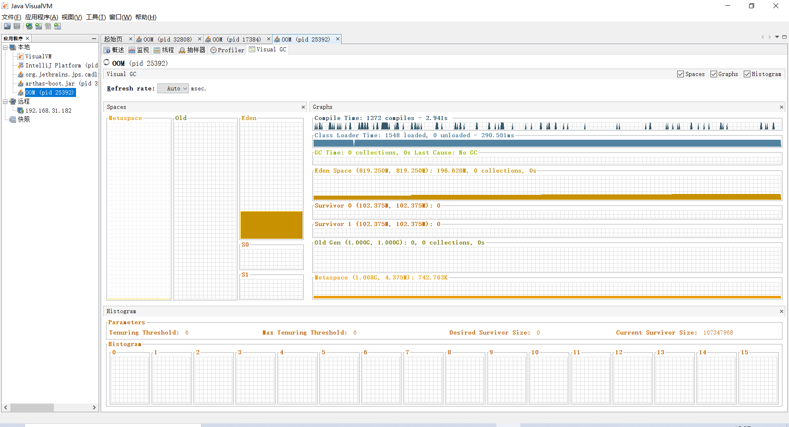

同样的时间，一次Minor GC和Full GC都没有发生，所以这样我觉得也算是已经调优了。

但是调优并不是一味的调大内存，是要在各个区域之间取得平衡，可以适当的调大内存，以及更换GC种类，举个例子，当把上面的案例代码的Thread.sleep(1000)给去掉。

然后再来看Visual VM的图，如下：


可以看到Minor GC也是非常频繁的，因为这段代码本身就是不断的增大内存，直到OOM异常，真正的实际并不会这样，可能当内存增大到一定两级后，就会在一段范围平衡。

当我们将上面的情况，再适当的增大内存，JVM参数如下：

```shell
java -Xmx4048m -Xms4048m -Xmn2024m -XX:SurvivorRatio=7  -Xss256k -XX:MetaspaceSize=300m -XX:MaxMetaspaceSize=100m -XX:+UseConcMarkSweepGC  -XX:+PrintGCDetails -XX:+PrintGCDateStamps -XX:+UseGCLogFileRotation -XX:+PrintHeapAtGC -XX:NumberOfGCLogFiles=5 -XX:GCLogFileSize=50M -Xloggc:./logs/emps-gc-%t.log -XX:+HeapDumpOnOutOfMemoryError -XX:HeapDumpPath=./logs/emps-heap.dump OOM
```

可以看到相同时间内，确实Minor GC减少了，但是时间增大了，因为复制算法，基本都是存活的，复制需要耗费大量的性能和时间：

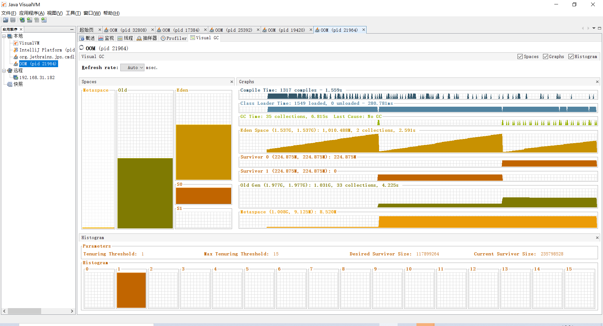

所以，调优要有取舍，取得一个平衡点，性能、状态达到佳就OK了，并没最佳的状态，这就是调优的基本法则，而且调优也是一个细活，所谓慢工出细活，需要耗费大量的时间，慢慢调，不断的做对比。


## 调优参数

### 堆

- -Xms1024m 设置堆的初始大小
- -Xmx1024m 设置堆的最大大小
- -XX:NewSize=1024m 设置年轻代的初始大小
- -XX:MaxNewSize=1024m 设置年轻代的最大值
- -XX:SurvivorRatio=8 Eden和S区的比例
- -XX:NewRatio=4 设置老年代和新生代的比例
- -XX:MaxTenuringThreshold=10 设置晋升老年代的年龄条件


### 栈

- -Xss128k


### 元空间

- -XX:MetasapceSize=200m 设置初始元空间大小
- -XX:MaxMatespaceSize=200m 设置最大元空间大小 默认无限制


### 直接内存

- -XX:MaxDirectMemorySize 设置直接内存的容量，默认与堆最大值一样


### 日志

- -Xloggc:/opt/app/ard-user/ard-user-gc-%t.log   设置日志目录和日志名称
- -XX:+UseGCLogFileRotation           开启滚动生成日志
- -XX:NumberOfGCLogFiles=5            滚动GC日志文件数，默认0，不滚动
- -XX:GCLogFileSize=20M               GC文件滚动大小，需开 UseGCLogFileRotation
- -XX:+PrintGCDetails      开启记录GC日志详细信息（包括GC类型、各个操作使用的时间）,并且在程序运行结束打印出JVM的内存占用情况
- -XX:+ PrintGCDateStamps             记录系统的GC时间
- -XX:+PrintGCCause                   产生GC的原因(默认开启)


### GC

#### Serial垃圾收集器（新生代）开启

- -XX:+UseSerialGC 关闭：
- -XX:-UseSerialGC //新生代使用Serial  老年代则使用SerialOld


#### Parallel Scavenge收集器（新生代）开启

- -XX:+UseParallelOldGC 关闭
- -XX:-UseParallelOldGC  新生代使用功能Parallel Scavenge 老年代将会使用Parallel Old收集器


#### ParallelOl垃圾收集器（老年代）开启

- -XX:+UseParallelGC 关闭
- -XX:-UseParallelGC 新生代使用功能Parallel Scavenge 老年代将会使用Parallel Old收集器


#### ParNew垃圾收集器（新生代）开启

- -XX:+UseParNewGC 关闭
- -XX:-UseParNewGC //新生代使用功能ParNew 老年代则使用功能CMS


#### CMS垃圾收集器（老年代）开启

- -XX:+UseConcMarkSweepGC 关闭
- -XX:-UseConcMarkSweepGC
- -XX:MaxGCPauseMillis  GC停顿时间，垃圾收集器会尝试用各种手段达到这个时间，比如减小年轻代
- -XX:+UseCMSCompactAtFullCollection 用于在CMS收集器不得不进行FullGC时开启内存碎片的合并整理过程，由于这个内存整理必须移动存活对象，（在Shenandoah和ZGC出现前）是无法并发的
- -XX：CMSFullGCsBefore-Compaction 多少次FullGC之后压缩一次，默认值为0，表示每次进入FullGC时都进行碎片整理）
- -XX:CMSInitiatingOccupancyFraction 当老年代使用达到该比例时会触发FullGC，默认是92
- -XX:+UseCMSInitiatingOccupancyOnly 这个参数搭配上面那个用，表示是不是要一直使用上面的比例触发FullGC，如果设置则只会在第一次FullGC的时候使用-XX:CMSInitiatingOccupancyFraction的值，之后会进行自动调整
- -XX:+CMSScavengeBeforeRemark 在FullGC前启动一次MinorGC，目的在于减少老年代对年轻代的引用，降低CMSGC的标记阶段时的开销，一般CMS的GC耗时80%都在标记阶段
- -XX:+CMSParallellnitialMarkEnabled 默认情况下初始标记是单线程的，这个参数可以让他多线程执行，可以减少STW
- -XX:+CMSParallelRemarkEnabled 使用多线程进行重新标记，目的也是为了减少STW


#### G1垃圾收集器开启

- -XX:+UseG1GC 关闭
- -XX:-UseG1GC
- -XX：G1HeapRegionSize 设置每个Region的大小，取值范围为1MB～32MB
- -XX：MaxGCPauseMillis 设置垃圾收集器的停顿时间，默认值是200毫秒，通常把期望停顿时间设置为一两百毫秒或者两三百毫秒会是比较合理的


# JDK Tools

## jps

用于显示当前用户下的所有java进程信息：

```shell
# jps [options] [hostid] 
# q:仅输出VM标识符, m: 输出main method的参数,l:输出完全的包名, v:输出jvm参数
[root@localhost ~]# jps -l
28729 sun.tools.jps.Jps
23789 cn.ms.test.DemoMain
23651 cn.ms.test.TestMain
```


## jstat

用于监视虚拟机运行时状态信息（类装载、内存、垃圾收集、JIT编译等运行数据）：

**-gc**：垃圾回收统计（大小）

```shell
# 每隔2000ms输出<pid>进程的gc情况，一共输出2次
[root@localhost ~]# jstat -gc <pid> 2000 2
# 每隔2s输出<pid>进程的gc情况，每个3条记录就打印隐藏列标题
[root@localhost ~]# jstat -gc -t -h3 <pid> 2s
Timestamp        S0C    S1C    S0U    S1U    ... YGC     YGCT    FGC    FGCT     GCT   
         1021.6 1024.0 1024.0  0.0   1024.0  ...  1    0.012   0      0.000    0.012
         1023.7 1024.0 1024.0  0.0   1024.0  ...  1    0.012   0      0.000    0.012
         1025.7 1024.0 1024.0  0.0   1024.0  ...  1    0.012   0      0.000    0.012
Timestamp        S0C    S1C    S0U    S1U    ... YGC     YGCT    FGC    FGCT     GCT   
         1027.7 1024.0 1024.0  0.0   1024.0  ...  1    0.012   0      0.000    0.012
         1029.7 1024.0 1024.0  0.0   1024.0  ...  1    0.012   0      0.000    0.012
# 结果说明: C即Capacity 总容量，U即Used 已使用的容量
##########################
# S0C：年轻代中第一个survivor（幸存区）的容量 (kb)
# S1C：年轻代中第二个survivor（幸存区）的容量 (kb)
# S0U：年轻代中第一个survivor（幸存区）目前已使用空间 (kb)
# S1U：年轻代中第二个survivor（幸存区）目前已使用空间 (kb)
# EC：年轻代中Eden（伊甸园）的容量 (kb)
# EU：年轻代中Eden（伊甸园）目前已使用空间 (kb)
# OC：Old代的容量 (kb)
# OU：Old代目前已使用空间 (kb)
# PC：Perm(持久代)的容量 (kb)
# PU：Perm(持久代)目前已使用空间 (kb)
# YGC：从应用程序启动到采样时年轻代中gc次数
# YGCT：从应用程序启动到采样时年轻代中gc所用时间(s)
# FGC：从应用程序启动到采样时old代(全gc)gc次数
# FGCT：从应用程序启动到采样时old代(全gc)gc所用时间(s)
# GCT：从应用程序启动到采样时gc用的总时间(s)
```

**-gcutil**：垃圾回收统计（百分比）

```shell
[root@localhost bin]# jstat -gcutil <pid>
  S0     S1     E      O      M     CCS    YGC     YGCT    FGC    FGCT     GCT
  0.00  99.80  16.21  26.18  93.34  90.74      9    0.056     2    0.045    0.102
# 结果说明
##########################
# S0：年轻代中第一个survivor（幸存区）已使用的占当前容量百分比
# S1：年轻代中第二个survivor（幸存区）已使用的占当前容量百分比
# E：年轻代中Eden（伊甸园）已使用的占当前容量百分比
# O：old代已使用的占当前容量百分比
# P：perm代已使用的占当前容量百分比
# YGC：从应用程序启动到采样时年轻代中gc次数
# YGCT：从应用程序启动到采样时年轻代中gc所用时间(s)
# FGC：从应用程序启动到采样时old代(全gc)gc次数
# FGCT：从应用程序启动到采样时old代(全gc)gc所用时间(s)
# GCT：从应用程序启动到采样时gc用的总时间(s)
```

**-gccapacity**：堆内存统计

```shell
[root@localhost ~]# jstat -gccapacity <pid>
 NGCMN    NGCMX     NGC     S0C   S1C       EC      OGCMN      OGCMX       OGC         OC      PGCMN    PGCMX     PGC       PC     YGC    FGC 
 84480.0 1349632.0 913408.0 54272.0 51200.0 502784.0   168448.0  2699264.0   168448.0   168448.0  21504.0  83968.0  51712.0  51712.0      9     0
# 结果说明
##########################
# NGCMN：年轻代(young)中初始化(最小)的大小 (kb)
# NGCMX：年轻代(young)的最大容量 (kb)
# NGC：年轻代(young)中当前的容量 (kb)
# S0C：年轻代中第一个survivor（幸存区）的容量 (kb)
# S1C：年轻代中第二个survivor（幸存区）的容量 (kb)
# EC：年轻代中Eden（伊甸园）的容量 (kb)
# OGCMN：old代中初始化(最小)的大小 (kb)
# OGCMX：old代的最大容量 (kb)
# OGC：old代当前新生成的容量 (kb)
# OC：Old代的容量 (kb)
# PGCMN：perm代中初始化(最小)的大小 (kb)
# PGCMX：perm代的最大容量 (kb)
# PGC：perm代当前新生成的容量 (kb)
# PC：Perm(持久代)的容量 (kb)
# YGC：从应用程序启动到采样时年轻代中gc次数
# GCT：从应用程序启动到采样时gc用的总时间(s)
```

**-gccause**：垃圾收集统计概述（同-gcutil），附加最近两次垃圾回收事件的原因

```shell
[root@localhost ~]# jstat -gccause <pid>
  S0     S1     E      O      P     YGC     YGCT    FGC    FGCT     GCT    LGCC                 GCC       
  0.00  79.23  39.37  39.92  99.74      9    0.198     0    0.000    0.198 Allocation Failure   No GC
# 结果说明
##########################
# LGCC：最近垃圾回收的原因
# GCC：当前垃圾回收的原因
```


## jstack

jstack(Java Stack Trace)主要用于打印线程的堆栈信息，是JDK自带的很强大的线程分析工具，可以帮助我们排查程序运行时的线程状态、死锁状态等。

```shell
# dump出进程<pid>的线程堆栈快照至/data/1.log文件中
jstack -l <pid> >/data/1.log

# 参数说明：
# -F：如果正常执行jstack命令没有响应（比如进程hung住了），可以加上此参数强制执行thread dump
# -m：除了打印Java的方法调用栈之外，还会输出native方法的栈帧
# -l：打印与锁有关的附加信息。使用此参数会导致JVM停止时间变长，在生产环境需慎用
```

jstack dump文件中值得关注的线程状态有：

- **死锁（Deadlock） —— 重点关注**
- 执行中（Runnable）  
- **等待资源（Waiting on condition） —— 重点关注**
  - 等待某个资源或条件发生来唤醒自己。具体需结合jstacktrace来分析，如线程正在sleep，网络读写繁忙而等待
  - 如果大量线程在“waiting on condition”，并且在等待网络资源，可能是网络瓶颈的征兆
- **等待获取监视器（Waiting on monitor entry） —— 重点关注**
  - 如果大量线程在“waiting for monitor entry”，可能是一个全局锁阻塞住了大量线程
- 暂停（Suspended）
- 对象等待中（Object.wait() 或 TIMED_WAITING）
- **阻塞（Blocked） —— 重点关注**
- 停止（Parked）


**注意**：如果某个相同的call stack经常出现， 我们有80%的以上的理由确定这个代码存在性能问题（读网络的部分除外）。


**场景一：分析BLOCKED问题**

```shell
"RMI TCP Connection(267865)-172.16.5.25" daemon prio=10 tid=0x00007fd508371000 nid=0x55ae waiting for monitor entry [0x00007fd4f8684000]
   java.lang.Thread.State: BLOCKED (on object monitor)
at org.apache.log4j.Category.callAppenders(Category.java:201)
- waiting to lock <0x00000000acf4d0c0> (a org.apache.log4j.Logger)
at org.apache.log4j.Category.forcedLog(Category.java:388)
at org.apache.log4j.Category.log(Category.java:853)
at org.apache.commons.logging.impl.Log4JLogger.warn(Log4JLogger.java:234)
at com.tuan.core.common.lang.cache.remote.SpyMemcachedClient.get(SpyMemcachedClient.java:110)
```

- 线程状态是 Blocked，阻塞状态。说明线程等待资源超时
- “ waiting to lock <0x00000000acf4d0c0>”指，线程在等待给这个 0x00000000acf4d0c0 地址上锁（英文可描述为：trying to obtain  0x00000000acf4d0c0 lock）
- 在 dump 日志里查找字符串 0x00000000acf4d0c0，发现有大量线程都在等待给这个地址上锁。如果能在日志里找到谁获得了这个锁（如locked < 0x00000000acf4d0c0 >），就可以顺藤摸瓜了
- “waiting for monitor entry”说明此线程通过 synchronized(obj) {……} 申请进入了临界区，从而进入了下图1中的“Entry Set”队列，但该 obj 对应的 monitor 被其他线程拥有，所以本线程在 Entry Set 队列中等待
- 第一行里，"RMI TCP Connection(267865)-172.16.5.25"是 Thread Name 。tid指Java Thread id。nid指native线程的id。prio是线程优先级。[0x00007fd4f8684000]是线程栈起始地址。


**场景二：分析CPU过高问题**

1.top命令找出最高占用的进程（Shift+P）

2.查看高负载进程下的高负载线程（top -Hp <PID>或ps -mp <PID> -o THREAD,tid,time）

3.找出最高占用的线程并记录thread_id，把线程号进行换算成16进制编号（printf "%X\n" thread_id）

4.（可选）执行查看高负载的线程名称（jstack 16143 | grep 3fb6）

5.导出进程的堆栈日志，找到3fb6 这个线程号（jstack 16143 >/home/16143.log）

6.根据找到的堆栈信息关联到代码进行定位分析即可


## jmap

jmap(Java Memory Map)主要用于打印内存映射。常用命令：

`jmap -dump:live,format=b,file=xxx.hprof <pid> `

**查看JVM堆栈的使用情况**

```powershell
[root@localhost ~]# jmap -heap 7243
Attaching to process ID 27900, please wait...
Debugger attached successfully.
Client compiler detected.
JVM version is 20.45-b01
using thread-local object allocation.
Mark Sweep Compact GC
Heap Configuration: #堆内存初始化配置
   MinHeapFreeRatio = 40     #-XX:MinHeapFreeRatio设置JVM堆最小空闲比率  
   MaxHeapFreeRatio = 70   #-XX:MaxHeapFreeRatio设置JVM堆最大空闲比率  
   MaxHeapSize = 100663296 (96.0MB)   #-XX:MaxHeapSize=设置JVM堆的最大大小
   NewSize = 1048576 (1.0MB)     #-XX:NewSize=设置JVM堆的‘新生代’的默认大小
   MaxNewSize = 4294901760 (4095.9375MB) #-XX:MaxNewSize=设置JVM堆的‘新生代’的最大大小
   OldSize = 4194304 (4.0MB)  #-XX:OldSize=设置JVM堆的‘老生代’的大小
   NewRatio = 2    #-XX:NewRatio=:‘新生代’和‘老生代’的大小比率
   SurvivorRatio = 8  #-XX:SurvivorRatio=设置年轻代中Eden区与Survivor区的大小比值
   PermSize = 12582912 (12.0MB) #-XX:PermSize=<value>:设置JVM堆的‘持久代’的初始大小  
   MaxPermSize = 67108864 (64.0MB) #-XX:MaxPermSize=<value>:设置JVM堆的‘持久代’的最大大小  
Heap Usage:
New Generation (Eden + 1 Survivor Space): #新生代区内存分布，包含伊甸园区+1个Survivor区
   capacity = 30212096 (28.8125MB)
   used = 27103784 (25.848182678222656MB)
   free = 3108312 (2.9643173217773438MB)
   89.71169693092462% used
Eden Space: #Eden区内存分布
   capacity = 26869760 (25.625MB)
   used = 26869760 (25.625MB)
   free = 0 (0.0MB)
   100.0% used
From Space: #其中一个Survivor区的内存分布
   capacity = 3342336 (3.1875MB)
   used = 234024 (0.22318267822265625MB)
   free = 3108312 (2.9643173217773438MB)
   7.001809512867647% used
To Space: #另一个Survivor区的内存分布
   capacity = 3342336 (3.1875MB)
   used = 0 (0.0MB)
   free = 3342336 (3.1875MB)
   0.0% used
PS Old Generation: #当前的Old区内存分布
   capacity = 67108864 (64.0MB)
   used = 67108816 (63.99995422363281MB)
   free = 48 (4.57763671875E-5MB)
   99.99992847442627% used
PS Perm Generation: #当前的 “持久代” 内存分布
   capacity = 14417920 (13.75MB)
   used = 14339216 (13.674942016601562MB)
   free = 78704 (0.0750579833984375MB)
   99.45412375710227% used
```

新生代内存回收就是采用空间换时间方式；如果from区使用率一直是100% 说明程序创建大量的短生命周期的实例，使用jstat统计jvm在内存回收中发生的频率耗时以及是否有full gc，使用这个数据来评估一内存配置参数、gc参数是否合理。

**统计一【jmap -histo】**：统计所有类的实例数量和所占用的内存容量

```powershell
[root@localhost ~]# jmap -histo 7243
 num     #instances         #bytes  class name
----------------------------------------------
   1:          8969       19781168  [B
   2:          1835        2296720  [I
   3:         19735        2050688  [C
   4:          3448         385608  java.lang.Class
   5:          3829         371456  [Ljava.lang.Object;
   6:         14634         351216  java.lang.String
   7:          6695         214240  java.util.concurrent.ConcurrentHashMap$Node
   8:          6257         100112  java.lang.Object
   9:          2155          68960  java.util.HashMap$Node
  10:           723          63624  java.lang.reflect.Method
  11:            49          56368  [Ljava.util.concurrent.ConcurrentHashMap$Node;
  12:           830          46480  java.util.zip.ZipFile$ZipFileInputStream
  13:          1146          45840  java.lang.ref.Finalizer
  ......
```

**统计二【jmap -histo】**：查看对象数最多的对象，并过滤Map关键词，然后按降序排序输出

```shell
[root@localhost ~]# jmap -histo 7243 |grep Map|sort -k 2 -g -r|less
Total         96237       26875560
   7:          6695         214240  java.util.concurrent.ConcurrentHashMap$Node
   9:          2155          68960  java.util.HashMap$Node
  18:           563          27024  java.util.HashMap
  21:           505          20200  java.util.LinkedHashMap$Entry
  16:           337          34880  [Ljava.util.HashMap$Node;
  27:           336          16128  gnu.trove.THashMap
  56:           163           6520  java.util.WeakHashMap$Entry
  60:           127           6096  java.util.WeakHashMap
  38:           127          10144  [Ljava.util.WeakHashMap$Entry;
  53:           126           7056  java.util.LinkedHashMap
......
```


**统计三【jmap -histo】**：统计实例数量最多的前10个类

```shell
[root@localhost ~]# jmap -histo 7243 | sort -n -r -k 2 | head -10
 num     #instances         #bytes  class name
----------------------------------------------
Total         96237       26875560
   3:         19735        2050688  [C
   6:         14634         351216  java.lang.String
   1:          8969       19781168  [B
   7:          6695         214240  java.util.concurrent.ConcurrentHashMap$Node
   8:          6257         100112  java.lang.Object
   5:          3829         371456  [Ljava.lang.Object;
   4:          3448         385608  java.lang.Class
   9:          2155          68960  java.util.HashMap$Node
   2:          1835        2296720  [I
```


**统计四【jmap -histo】**：统计合计容量最多的前10个类

```shell
[root@localhost ~]# jmap -histo 7243 | sort -n -r -k 3 | head -10
 num     #instances         #bytes  class name
----------------------------------------------
Total         96237       26875560
   1:          8969       19781168  [B
   2:          1835        2296720  [I
   3:         19735        2050688  [C
   4:          3448         385608  java.lang.Class
   5:          3829         371456  [Ljava.lang.Object;
   6:         14634         351216  java.lang.String
   7:          6695         214240  java.util.concurrent.ConcurrentHashMap$Node
   8:          6257         100112  java.lang.Object
   9:          2155          68960  java.util.HashMap$Node
```

**dump注意事项**

- 在应用快要发生FGC的时候把堆数据导出来

  ​	老年代或新生代used接近100%时，就表示即将发生GC，也可以再JVM参数中指定触发GC的阈值。

  - 查看快要发生FGC使用命令：jmap -heap < pid >
  - 数据导出：jmap -dump:format=b,file=heap.bin < pid >

- 通过命令查看大对象：jmap -histo < pid >|less


**使用总结**

- 如果程序内存不足或者频繁GC，很有可能存在内存泄露情况，这时候就要借助Java堆Dump查看对象的情况
- 要制作堆Dump可以直接使用jvm自带的jmap命令
- 可以先使用`jmap -heap`命令查看堆的使用情况，看一下各个堆空间的占用情况
- 使用`jmap -histo:[live]`查看堆内存中的对象的情况。如果有大量对象在持续被引用，并没有被释放掉，那就产生了内存泄露，就要结合代码，把不用的对象释放掉
- 也可以使用 `jmap -dump:format=b,file=<fileName>`命令将堆信息保存到一个文件中，再借助jhat命令查看详细内容
- 在内存出现泄露、溢出或者其它前提条件下，建议多dump几次内存，把内存文件进行编号归档，便于后续内存整理分析
- 在用cms gc的情况下，执行jmap -heap有些时候会导致进程变T，因此强烈建议别执行这个命令，如果想获取内存目前每个区域的使用状况，可通过jstat -gc或jstat -gccapacity来拿到


## jhat

jhat（JVM Heap Analysis Tool）命令是与jmap搭配使用，用来分析jmap生成的dump，jhat内置了一个微型的HTTP/HTML服务器，生成dump的分析结果后，可以在浏览器中查看。在此要注意，一般不会直接在服务器上进行分析，因为jhat是一个耗时并且耗费硬件资源的过程，一般把服务器生成的dump文件复制到本地或其他机器上进行分析。

```powershell
# 解析Java堆转储文件,并启动一个 web server
jhat heapDump.dump
```


## jconsole

jconsole(Java Monitoring and Management Console)是一个Java GUI监视工具，可以以图表化的形式显示各种数据，并可通过远程连接监视远程的服务器VM。用java写的GUI程序，用来监控VM，并可监控远程的VM，非常易用，而且功能非常强。命令行里打jconsole，选则进程就可以了。

**第一步**：在远程机的tomcat的catalina.sh中加入配置：

```powershell
JAVA_OPTS="$JAVA_OPTS -Djava.rmi.server.hostname=192.168.202.121 -Dcom.sun.management.jmxremote"
JAVA_OPTS="$JAVA_OPTS -Dcom.sun.management.jmxremote.port=12345"
JAVA_OPTS="$JAVA_OPTS -Dcom.sun.management.jmxremote.authenticate=true"
JAVA_OPTS="$JAVA_OPTS -Dcom.sun.management.jmxremote.ssl=false"
JAVA_OPTS="$JAVA_OPTS -Dcom.sun.management.jmxremote.pwd.file=/usr/lib/jvm/java-1.8.0-openjdk-1.8.0.101-3.b13.el7_2.x86_64/jre/lib/management/jmxremote.password"
```


**第二步**：配置权限文件

```powershell
[root@localhost bin]# cd /usr/lib/jvm/java-1.8.0-openjdk-1.8.0.101-3.b13.el7_2.x86_64/jre/lib/management/
[root@localhost management]# cp jmxremote.password.template jmxremote.password
[root@localhost management]# vi jmxremote.password
```

monitorRole QED
controlRole chenqimiao


**第三步**：配置权限文件为600

```powershell
[root@localhost management]# chmod 600 jmxremote.password jmxremote.access
```

这样基本配置就结束了，下面说两个坑，第一个就是防火墙的问题，要开放指定端口的防火墙，我这里配置的是12345端口，第二个是hostname的问题：

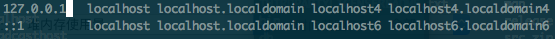

请将127.0.0.1修改为本地真实的IP,我的服务器IP是192.168.202.121：

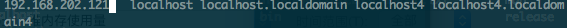

 **第四步**：查看JConsole


## jvisualvm

jvisualvm(JVM Monitoring/Troubleshooting/Profiling Tool)同jconsole都是一个基于图形化界面的、可以查看本地及远程的JAVA GUI监控工具，Jvisualvm同jconsole的使用方式一样，直接在命令行打入Jvisualvm即可启动，不过Jvisualvm相比，界面更美观一些，数据更实时。 jvisualvm的使用VisualVM进行远程连接的配置和JConsole是一摸一样的，最终效果图如下


**Visual GC(监控垃圾回收器)**

Java VisualVM默认没有安装Visual GC插件，需要手动安装，JDK的安装目录的bin目露下双击 jvisualvm.sh，即可打开Java VisualVM，点击菜单栏： **工具->插件** 安装Visual GC，最终效果如下图所示：

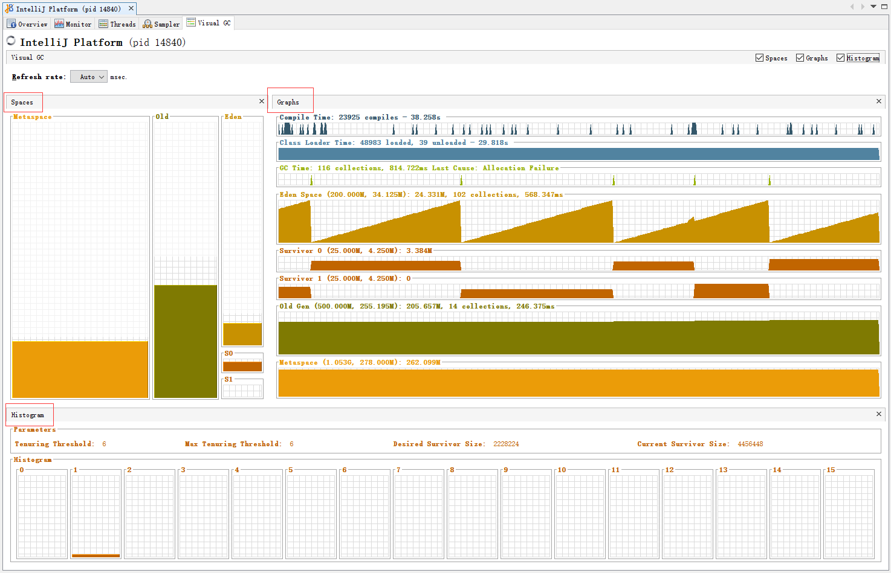


**大dump文件**

从服务器dump堆内存后文件比较大（5.5G左右），加载文件、查看实例对象都很慢，还提示配置xmx大小。表明给VisualVM分配的堆内存不够，找到$JAVA_HOME/lib/visualvm}/etc/visualvm.conf这个文件，修改：

```shell
default_options="-J-Xms24m -J-Xmx192m"
```

再重启VisualVM就行了。


## jmc

jmc（Java Mission Control）是JDK自带的一个图形界面监控工具，监控信息非常全面。JMC打开性能日志后，主要包括**一般信息、内存、代码、线程、I/O、系统、事件** 功能。

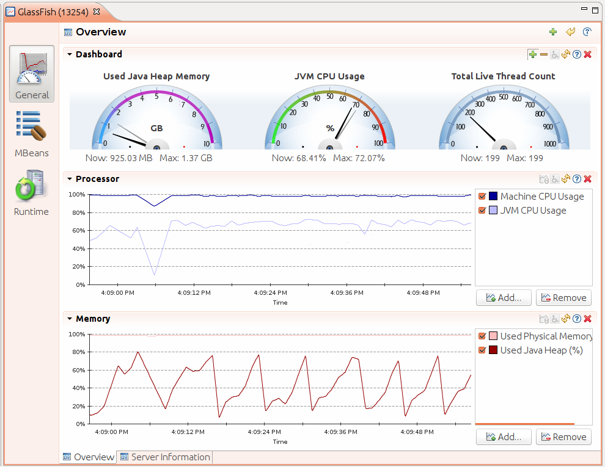

JMC的最主要的特征就是JFR（Java Flight Recorder），是基于JAVA的飞行记录器，JFR的数据是一些列JVM事件的历史纪录，可以用来诊断JVM的性能和操作，收集后的数据可以使用JMC来分析。


### 启动JFR

在商业版本上面，JFR默认是关闭的，可以通过在启动时增加参数 `-XX:+UnlockCommercialFeatures -XX:+FlightRecorder` 来启动应用。启动之后，也只是开启了JFR特性，但是还没有开始进行事件记录。这就要通过GUI和命令行了。

- **通过Java Mission Control启动JFR**

  打开Java Mission Control点击对应的JVM启动即可，事件记录有两种模式（如果选择第2种模式，那么JVM会使用一个循环使用的缓存来存放事件数据）：

  - 记录固定一段时间的事件（比如：1分钟）
  - 持续进行记录

- **通过命令行启动JFR**

  通过在启动的时候，增加参数：`-XX:+FlightRecorderOptions=string` 来启动真正地事件记录，这里的 `string` 可以是以下值（下列参数都可以使用jcmd命令，在JVM运行的时候进行动态调整，[参考地址](https://docs.oracle.com/javase/8/docs/technotes/tools/unix/java.html)）：

  - `name=name`：标识recording的名字（一个进程可以有多个recording存在，它们使用名字来进行区分）
  - `defaultrecording=<ture|false>`：是否启动recording，默认是false，我们要分析，必须要设置为true
  - `setting=paths`：包含JFR配置的文件名字
  - `delay=time`：启动之后，经过多长时间（比如：30s，1h）开始进行recording
  - `duration=time`：做多长时间的recording
  - `filename=path`：recordding记录到那个文件里面
  - `compress=<ture|false>`：是否对recording进行压缩（gzip）,默认为false
  - `maxage=time`：在循环使用的缓存中，事件数据保存的最大时长
  - `maxsize=size`：事件数据缓存的最大大小（比如：1024k，1M）


### 常用JFR命令

- 启动recording

  命令格式：`jcmd process_id JFR.start [options_list]`，其中options_list就是上述的参数值。

- dump出循环缓存中的数据

  命令格式：`jcmd process_id JFR.dump [options_list]`，其中options_list参数的可选值如下：

  - `name=name`：recording的名字
  - `recording=n`：JFR recording的数字（一个标识recording的随机数）
  - `filename=path`：dump文件的保存路径

- 查看进程中所有recording

  命令格式：` jcmd process_id JFR.check [verbose]`，不同recording使用名字进行区分，同时JVM还为它分配一个随机数。

- 停止recording

  命令格式：` jcmd process_id JFR.stop [options_list]`，其中options_list参数的可选值如下：

  - `name=name`：要停止的recording名字
  - `recording=n`：要停止的recording的标识数字
  - `discard=boolean`：如果为true，数据被丢弃，而不是写入下面指定的文件当中
  - `filename=path`：写入数据的文件名称


### 命令启动JFR案例

- **第一步**：创建一个包含了你自己配置的JFR模板文件（`template.jfc`）。运行jmc, 然后Window->Flight Recording Template Manage菜单。准备好档案后，就可以导出文件，并移动到要排查问题的环境中

  

- **第二步**：由于JFR需要JDK的商业证书，这一步需要解锁jdk的商业特性

  ```powershell
  [root@localhost bin]# jcmd 12234 VM.unlock_commercial_features
  12234: Commercial Features already unlocked.
  ```

- **第三步**：最后你就可以启动JFR，命令格式如下：

  ```powershell
  jcmd <PID> JFR.start name=test duration=60s [settings=template.jfc] filename=output.jfr
  ```

  ​	上述命令立即启动JFR并开始使用 `template.jfc`（在 `$JAVA_HOME/jre/lib/jfr` 下有 `default.jfc` 和 `profile.jfc` 模板）的配置收集 `60s` 的JVM信息，输出到 `output.jfr` 中。一旦记录完成之后，就可以复制.jfr文件到你的工作环境使用jmc GUI来分析。它几乎包含了排查jvm问题需要的所有信息，包括堆dump时的异常信息。使用案例如下：

  ```powershell
  [root@localhost bin]# jcmd 12234 JFR.start name=test duration=60s filename=output.jfr
  12234: Started recording 6. The result will be written to: /root/zookeeper-3.4.12/bin/output.jfr
  [root@localhost bin]# ls -l
  -rw-r--r-- 1 root root 298585 6月  29 11:09 output.jfr
  ```


**JFR（Java Flight Recorder）**

- Java Mission Control的最主要的特征就是Java Flight Recorder。正如它的名字所示，JFR的数据是一些列JVM事件的历史纪录，可以用来诊断JVM的性能和操作
- JFR的基本操作就是开启哪些事件（比如：线程由于等待锁而阻塞的事件）。当开启的事件发生了，事件相关的数据会记录到内存或磁盘文件上。记录事件数据的缓存是循环使用的，只有最近发生的事件才能够从缓存中找到，之前的都因为缓存的限制被删除了。Java Mission Control能够对这些事件在界面上进行展示（从JVM的内存中读取或从事件数据文件中读取），我们可以通过这些事件来对JVM的性能进行诊断
- 事件的类型、缓存的大小、事件数据的存储方式等等都是通过JVM参数、Java Mission Control的GUI界面、jcmd命令来控制的。JFR默认是编译进程序的，因为它的开销很小，一般来说对应用的影响小于1%。不过，如果我们增加了事件的数目、修改了记录事件的阈值，都有可能增加JFR的开销


### JFR概况

​	下面对GlassFish web服务器进行JFR记录的例子，在这个服务器上面运行着在第2章介绍的股票servlet。Java Mission Control加载完JFR获取的事件之后，大概是下面这个样子：


我们可以看到，通过上图可以看到：CPU使用率，Heap使用率，JVM信息，System Properties，JFR的记录情况等等。


### JFR内存视图

Java Mission Control 可以看到非常多的信息，下图只显示了一个标签的内容。下图显示了JVM 的内存波动非常频繁，因为新生代经常被清除（有意思的是，head的大小并没有增长）。下面左边的面板显示了最近一段时间的垃圾回收情况，包括：GC的时长和垃圾回收的类型。如果我们点击一个事件，右边的面板会展示这个事件的具体情况，包括：垃圾垃圾回收的各个阶段及其统计信息。从面板的标签可以看到，还有很多其它信息，比如：有多少对象被清除了，花了多长时间；GC算法的配置；分配的对象信息等等。在第5章和第6章中，我们会详细介绍。

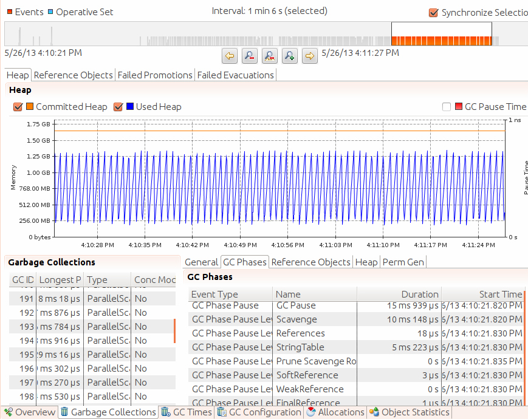


### JFR 代码视图

这张图也有很多tab，可以看到各个包的使用频率和类的使用情况、异常、编译、代码缓存、类加载情况等等：

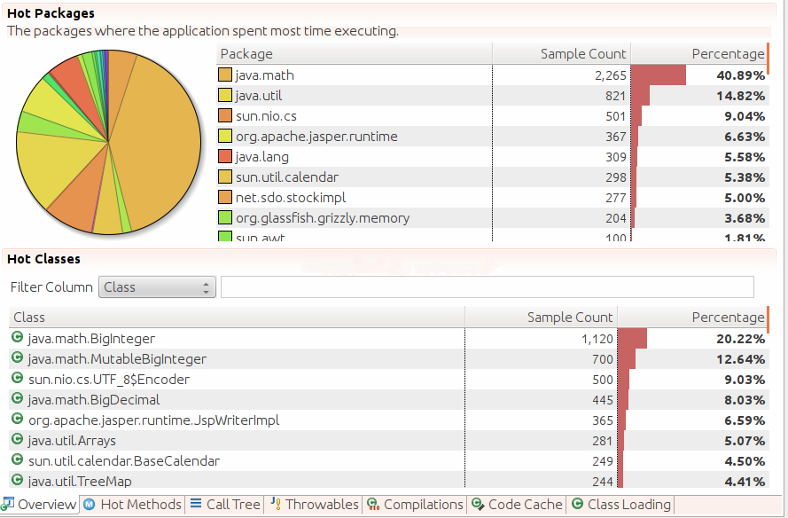


### JFR事件视图

下图显示了事件的概述视图：

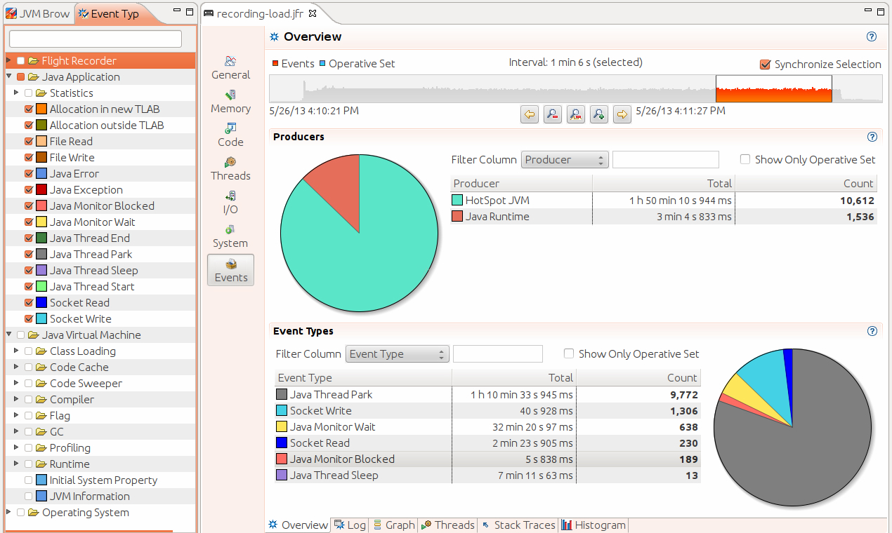


## EclipseMAT

虽然Java虚拟机可以帮我们对内存进行回收，但是其回收的是Java虚拟机不再引用的对象。很多时候我们使用系统的IO流、Cursor、Receiver如果不及时释放，就会导致内存泄漏（OOM）。但是，很多时候内存泄漏的现象不是很明显，比如内部类、Handler相关的使用导致的内存泄漏，或者你使用了第三方library的一些引用，比较消耗资源，但又不是像系统资源那样会引起你足够的注意去手动释放它们。以下通过内存泄漏分析、集合使用率、Hash性能分析和OQL快读定位空集合来使用MAT。


**GC Roots**

JAVA虚拟机通过可达性（Reachability)来判断对象是否存活，基本思想：`以”GC Roots”的对象作为起始点向下搜索，搜索形成的路径称为引用链，当一个对象到GC Roots没有任何引用链相连（即不可达的），则该对象被判定为可以被回收的对象，反之不能被回收`。GC Roots可以是以下任意对象

- 一个在current thread（当前线程）的call stack（调用栈）上的对象（如方法参数和局部变量）
- 线程自身或者system class loader（系统类加载器）加载的类
- native code（本地代码）保留的活动对象


**内存泄漏**

当对象无用了，但仍然可达（未释放），垃圾回收器无法回收。


**Java四种引用类型**

- Strong References（强引用）

  普通的java引用，我们通常new的对象就是：`StringBuffer buffer = new StringBuffer();` 如果一个对象通过一串强引用链可达，那么它就不会被垃圾回收。你肯定不希望自己正在使用的引用被垃圾回收器回收吧。但对于集合中的对象，应在不使用的时候移除掉，否则会占用更多的内存，导致内存泄漏。

- Soft Reference（软引用）

  当对象是Soft Reference可达时，gc会向系统申请更多内存，而不是直接回收它，当内存不足的时候才回收它。因此Soft Reference适合用于构建一些缓存系统，比如图片缓存。

- Weak Reference（弱引用）

  WeakReference不会强制对象保存在内存中。它拥有比较短暂的生命周期，允许你使用垃圾回收器的能力去权衡一个对象的可达性。在垃圾回收器扫描它所管辖的内存区域过程中，一旦gc发现对象是Weak Reference可达，就会把它放到 `Reference Queue` 中，等下次gc时回收它。

  系统为我们提供了WeakHashMap，和HashMap类似，只是其key使用了weak reference。如果WeakHashMap的某个key被垃圾回收器回收，那么entity也会自动被remove。由于WeakReference被GC回收的可能性较大，因此，在使用它之前，你需要通过weakObj.get()去判断目的对象引用是否已经被回收。一旦WeakReference.get()返回null，它指向的对象就会被垃圾回收，那么WeakReference对象就没有用了，意味着你应该进行一些清理。比如在WeakHashMap中要把回收过的key从Map中删除掉，避免无用的的weakReference不断增长。

  ReferenceQueue可以让你很容易地跟踪dead references。WeakReference类的构造函数有一个ReferenceQueue参数，当指向的对象被垃圾回收时，会把WeakReference对象放到ReferenceQueue中。这样，遍历ReferenceQueue可以得到所有回收过的WeakReference。

- Phantom Reference（虚引用）

  其余Soft/Weak Reference区别较大是它的get()方法总是返回null。这意味着你只能用Phantom Reference本身，而得不到它指向的对象。当Weak Reference指向的对象变得弱可达(weakly reachable）时会立即被放到ReferenceQueue中，这在finalization、garbage collection之前发生。理论上，你可以在finalize()方法中使对象“复活”（使一个强引用指向它就行了，gc不会回收它）。但没法复活PhantomReference指向的对象。而PhantomReference是在garbage collection之后被放到ReferenceQueue中的，没法复活。


**MAT视图与概念**

- **Shallow Heap**

  Shallow Size就是对象本身占用内存的大小，不包含其引用的对象内存，实际分析中作用不大。 常规对象（非数组）的Shallow Size由其成员变量的数量和类型决定。数组的Shallow Size有数组元素的类型（对象类型、基本类型）和数组长度决定。案例如下：

```java
public class String {
    public final class String {8 Bytes header
    private char value[]; 4 Bytes
    private int offset; 4 Bytes
    private int count; 4 Bytes
    private int hash = 0; 4 Bytes
	// ......
}
// "Shallow size“ of a String ==24 Bytes12345678
```

Java的对象成员都是些引用。真正的内存都在堆上，看起来是一堆原生的byte[]、char[]、int[]，对象本身的内存都很小。所以我们可以看到以Shallow Heap进行排序的Histogram图中，排在第一位第二位的是byte和char。


- **Retained Heap**

  Retained Heap值的计算方式是将Retained Set中的所有对象大小叠加。或者说，由于X被释放，导致其它所有被释放对象（包括被递归释放的）所占的Heap大小。当X被回收时哪些将被GC回收的对象集合。比如: 

  一个ArrayList持有100000个对象，每一个占用16 bytes，移除这些ArrayList可以释放16×100000+X，X代表ArrayList的Shallow大小。相对于Shallow Heap，Retained Heap可以更精确的反映一个对象实际占用的大小（因为如果该对象释放，Retained Heap都可以被释放）。


- **Histogram**

  可列出每一个类的实例数。支持正则表达式查找，也可以计算出该类所有对象的Retained Size。

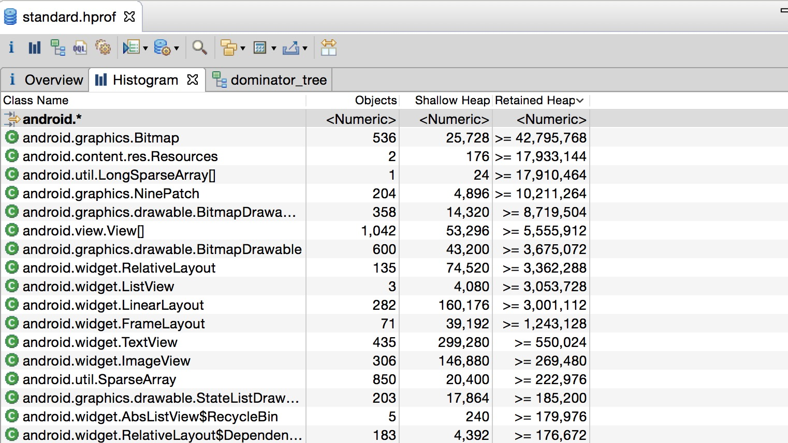


- **Dominator Tree**

  对象之间dominator关系树。如果从GC Root到达Y的的所有path都经过X，那么我们称X dominates Y，或者X是Y的Dominator Dominator Tree由系统中复杂的对象图计算而来。从MAT的dominator tree中可以看到占用内存最大的对象以及每个对象的dominator。 我们也可以右键选择Immediate Dominator”来查看某个对象的dominator。

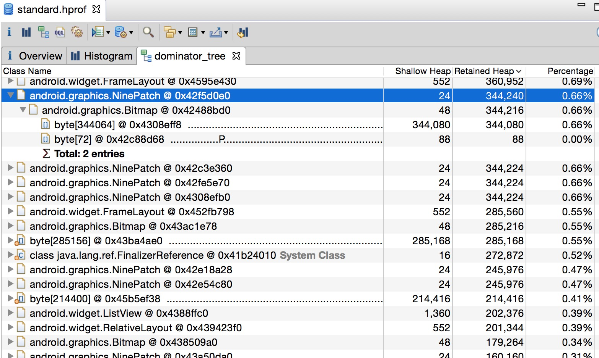


- **Path to GC Roots**

  ​	查看一个对象到RC Roots的引用链通常在排查内存泄漏的时候，我们会选择exclude all phantom/weak/soft etc.references, 
  意思是查看排除虚引用/弱引用/软引用等的引用链，因为被虚引用/弱引用/软引用的对象可以直接被GC给回收，我们要看的就是某个对象否还存在Strong 引用链（在导出HeapDump之前要手动出发GC来保证），如果有，则说明存在内存泄漏，然后再去排查具体引用。

  

  查看当前Object所有引用,被引用的对象：

  - List objects with （以Dominator Tree的方式查看）
    - incoming references 引用到该对象的对象
    - outcoming references 被该对象引用的对象
  - Show objects by class （以class的方式查看）
    - incoming references 引用到该对象的对象
    - outcoming references 被该对象引用的对象


- **OQL(Object Query Language)**

类似SQL查询语言：Classes：Table、Objects：Rows、Fileds：Cols

```mysql
select * from com.example.mat.Listener
# 查找size＝0并且未使用过的ArrayList
select * from java.util.ArrayList where size=0 and modCount=01
# 查找所有的Activity 
select * from instanceof android.app.Activity
```


- **内存快照对比**

方式一：Compare To Another Heap Dump（直接进行比较）


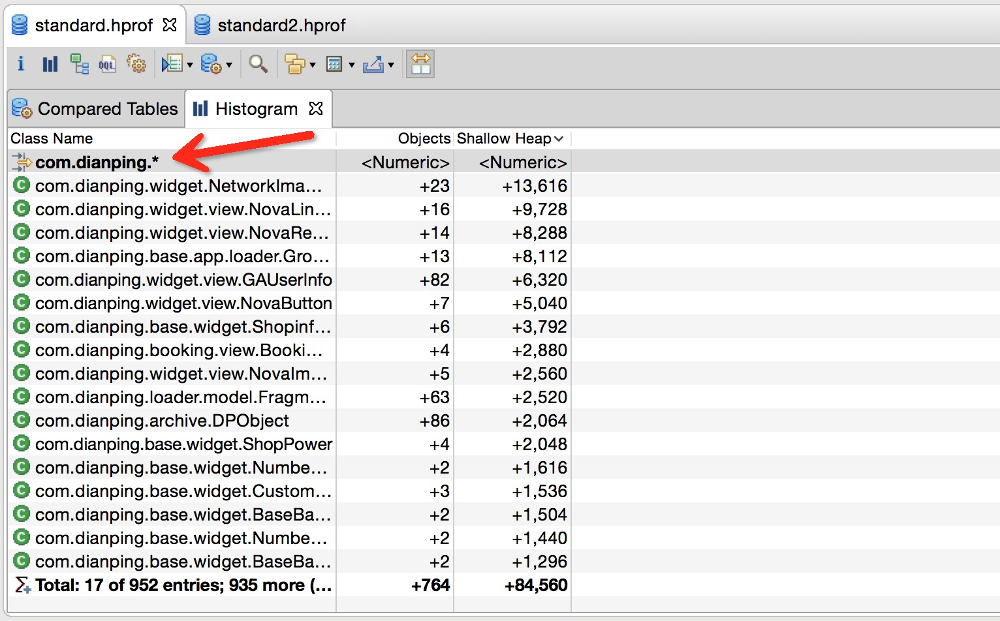


方式二：Compare Baseket（更全面，可以直接给出百分比）


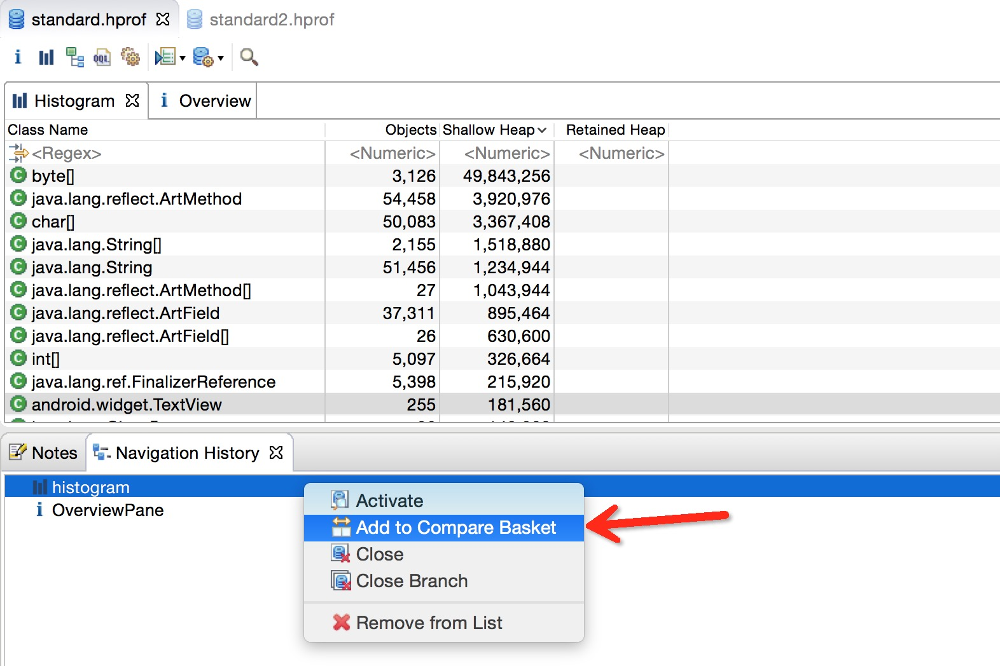


**MAT内存分析实战**

- **实战一：内存泄漏分析**

  查找导致内存泄漏的类。既然环境已经搭好，heap dump也成功倒入，接下来就去分析问题。

  - 查找目标类 
    如果在开发过程中，你的目标很明确，比如就是查找自己负责的服务，那么通过包名或者Class筛选，OQL搜索都可以快速定位到。点击OQL图标，在窗口输入，并按Ctrl + F5或者!按钮执行：

    `select * from instanceof android.app.Activity`

  - Paths to GC Roots：exclude all phantom/weak/soft etc.references 

    查看一个对象到RC Roots是否存在引用链。要将虚引用/弱引用/软引用等排除，因为被虚引用/弱引用/软引用的对象可以直接被GC给回收

  - 分析具体的引用为何没有被释放，并进行修复


**小技巧：**

- 当目的不明确时，可以直接定位到RetainedHeap最大的Object，Select incoming references，查看引用链，定位到可疑的对象然后Path to GC Roots进行引用链分析
- 如果大对象筛选看不出区别，可以试试按照class分组，再寻找可疑对象进行GC引用链分析
- 直接按照包名直接查看GC引用链，可以一次性筛选多个类，但是如下图所示，选项是 Merge Shortest Path to GCRoots，这个选项具体不是很明白，不过也能筛选出存在GC引用链的类，这种方式的准确性还待验证


所以有时候进行MAT分析还是需要一些经验，能够帮你更快更准确的定位。


- **实战二：集合使用率分析**

  集合在开发中会经常使用到，如何选择合适的数据结构的集合，初始容量是多少（太小，可能导致频繁扩容），太大，又会开销跟多内存。当这些问题不是很明确时或者想查看集合的使用情况时，可以通过MAT来进行分析。

  - **筛选目标对象**

    

  - **Show Retained Set（查找当X被回收时那些将被GC回收的对象集合）**

    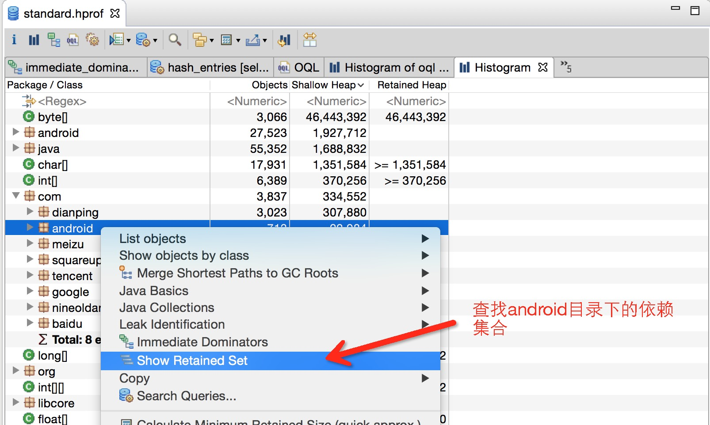

  - **筛选指定的Object（Hash Map，ArrayList）并按照大小进行分组**

    

  - **查看指定类的Immediate dominators**

    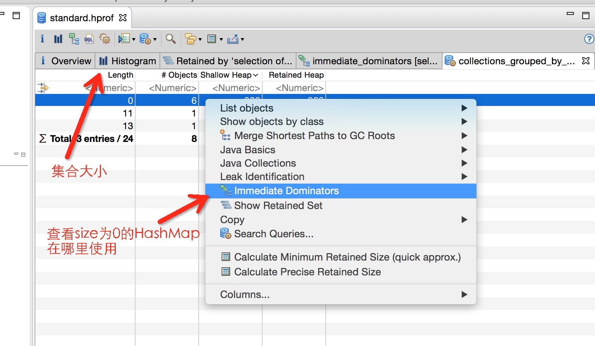


**Collections fill ratio**

这种方式只能查看那些具有预分配内存能力的集合，比如HashMap，ArrayList。计算方式：”size / capacity”


- **实战三：Hash相关性能分析**

  当Hash集合中过多的对象返回相同Hash值的时候，会严重影响性能（Hash算法原理自行搜索），这里来查找导致Hash集合的碰撞率较高的罪魁祸首。

  - **Map Collision Ratio**

    检测每一个HashMap或者HashTable实例并按照碰撞率排序：**碰撞率 = 碰撞的实体/Hash表中所有实体**

    

  - **查看Immediate dominators**

    

    

  - **通过HashEntries查看key value**

    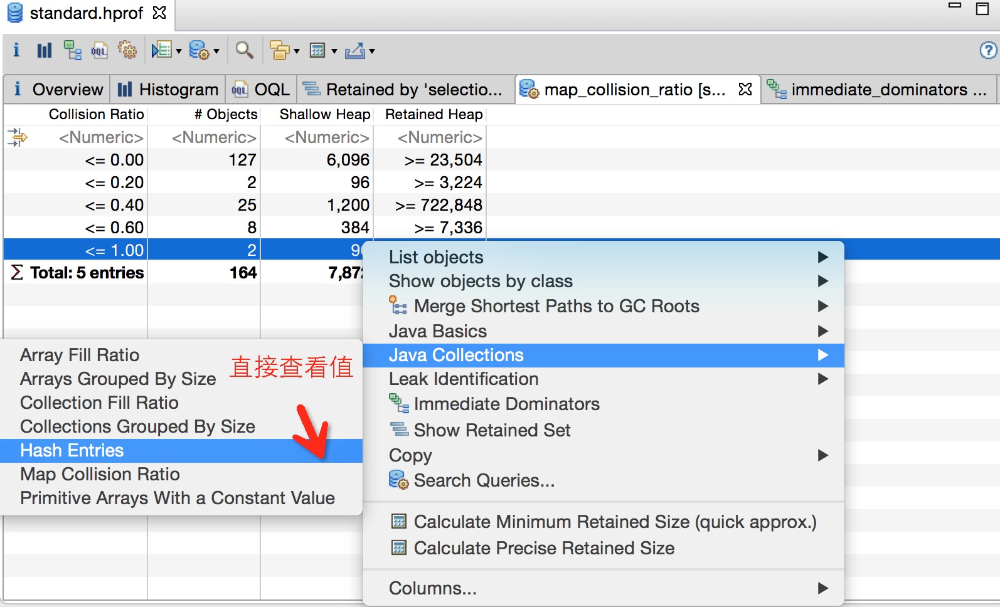

  - **Array等其它集合分析方法类似**


- **实战四：通过OQL快速定位未使用的集合**

  - **通过OQL查询empty并且未修改过的集合：**

    ```mysql
    select * from java.util.ArrayList where size=0 and modCount=01
    select * from java.util.HashMap where size=0 and modCount=0
    select * from java.util.Hashtable where count=0 and modCount=012
    ```

    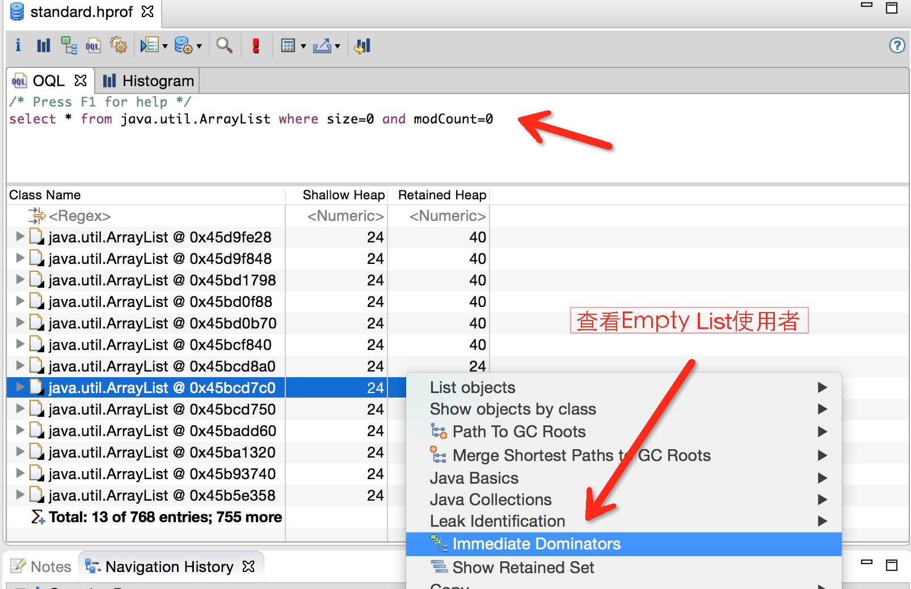

  - **Immediate dominators(查看引用者)**

    

  - **计算空集合的Retained Size值，查看浪费了多少内存**

    


## 🔥火焰图

火焰图是用来分析程序运行瓶颈的工具。火焰图也可以用来分析 Java 应用。

### 环境安装

确认你的机器已经安装了**git、jdk、perl、c++编译器**。

#### 安装Perl

```shell
wget http://www.cpan.org/src/5.0/perl-5.26.1.tar.gz
tar zxvf perl-5.26.1.tar.gz
cd perl-5.26.1
./Configure -de
make
make test
make install
```

wget后面的路径可以按需更改。安装过程比较耗时间，安装完成后可通过**perl -version**查看是否安装成功。


#### C++编译器

```shell
apt-get install g++
```

一般用于编译c++程序，缺少这个编译器进行make编译c++代码时，会报“g++: not found”的错误。


#### clone相关项目

下载下来所需要的两个项目（这里建议放到data目录下）：

```shell
git clone https://github.com/jvm-profiling-tools/async-profiler
git clone https://github.com/brendangregg/FlameGraph
```


#### 编译项目

下载好以后，需要打开async-profiler文件，输入make指令进行编译：

```shell
cd async-profiler
make
```


### 生成文件

#### 生成火焰图数据

可以从 github 上下载 [async-profiler](https://github.com/jvm-profiling-tools/async-profiler) 的压缩包进行相关操作。进入async-profiler项目的目录下，然后输入如下指令：

```shell
./profiler.sh -d 60 -o collapsed -f /tmp/test_01.txt ${pid}
```

上面的-d表示的是持续时长，后面60代表持续采集时间60s，-o表示的是采集规范，这里用的是collapsed，-f后面的路径，表示的是数据采集后生成的数据存放的文件路径（这里放在了/tmp/test_01.txt），${pid}表示的是采集目标进程的pid，回车运行，运行期间阻塞，知道约定时间完成。运行完成后去tmp下看看有没有对应文件。


#### 生成svg文件

上一步产生的文件里的内容，肉眼是很难看懂的，所以现在[FlameGraph](https://github.com/brendangregg/FlameGraph)的作用就体现出来了，它可以读取该文件并生成直观的火焰图，现在进入该项目目录下面，执行如下语句：

```shell
perl flamegraph.pl --colors=java /tmp/test_01.txt > test_01.svg
```

因为是perl文件，这里使用perl指令运行该文件，后面--colors表示着色风格，这里是java，后面的是数据文件的路径，这里是刚刚上面生成的那个文件/tmp/test_01.txt，最后的test_01.svg就是最终生成的火焰图文件存放的路径和文件命名，这里是命名为test_01.svg并保存在当前路径，运行后看到该文件已经存在于当前目录下。


#### 展示火焰图

现在下载下来该文件，使用浏览器打开，效果如下：


### 火焰图案例

生成的[火焰图案例](images/DevOps/火焰图案例.svg)如下：

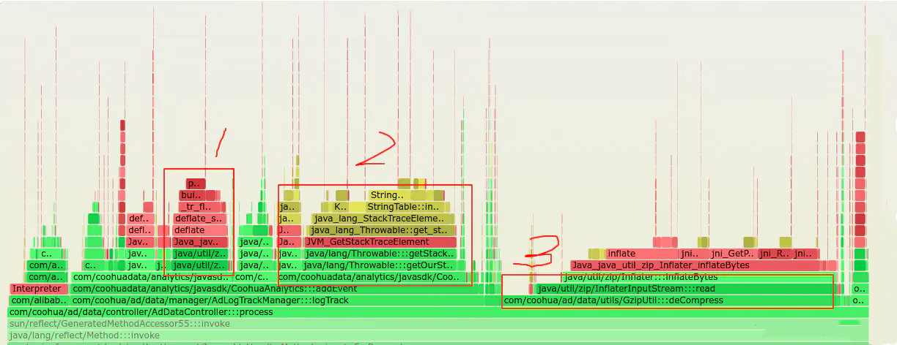

#### 瓶颈点1

CoohuaAnalytics$KafkaConsumer:::send方法中Gzip压缩占比较高。已经定位到方法级别，再看代码就快速很多，直接找到具体位置，找到第一个消耗大户：**Gzip压缩**

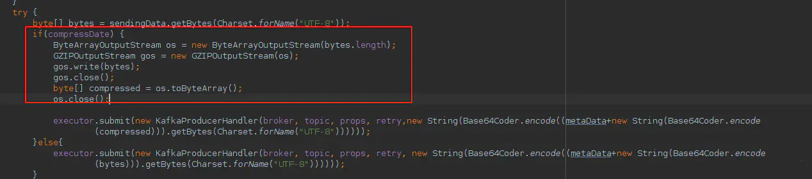


#### 瓶颈点2

展开2这个波峰，查看到这个getOurStackTrace方法占用了大比例的CPU，怀疑代码里面频繁用丢异常的方式获取当前代码栈：

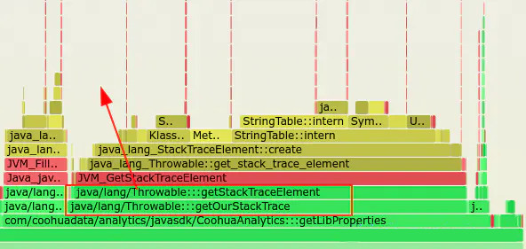

直接看代码：


果然如推断，找到第二个CPU消耗大户：new Exception().getStackTrace()。


#### 瓶颈点3

展开波峰3，可以看到是这个Gzip解压缩：

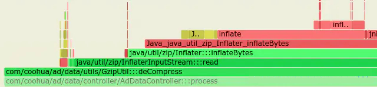

定位到具体的代码，可以看到对每个请求的参数进行了gzip解压缩：

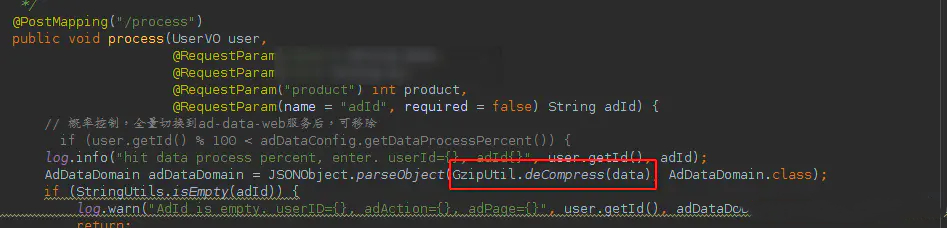

