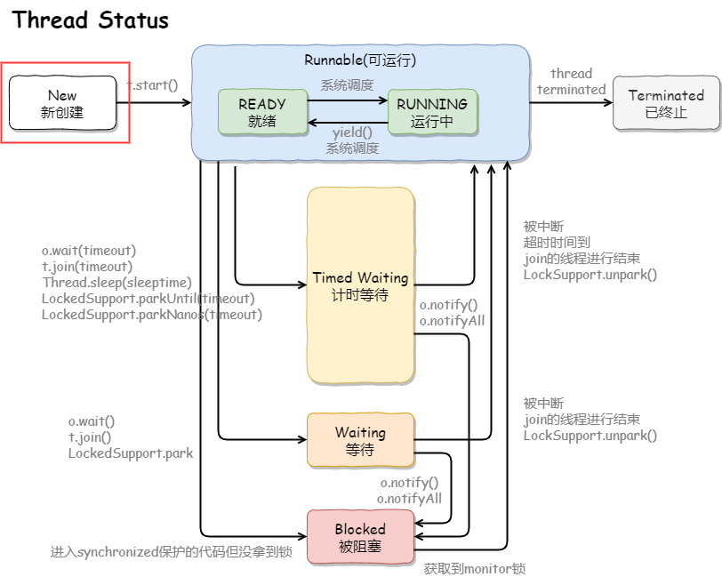
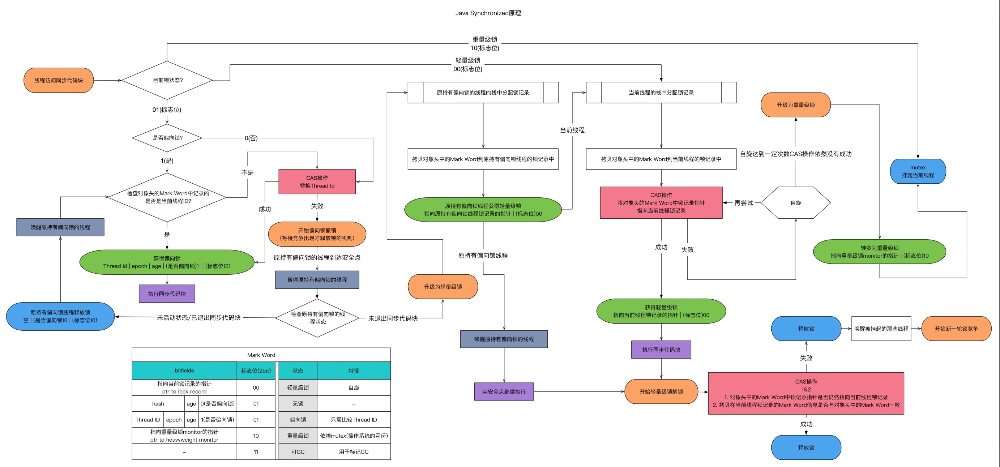
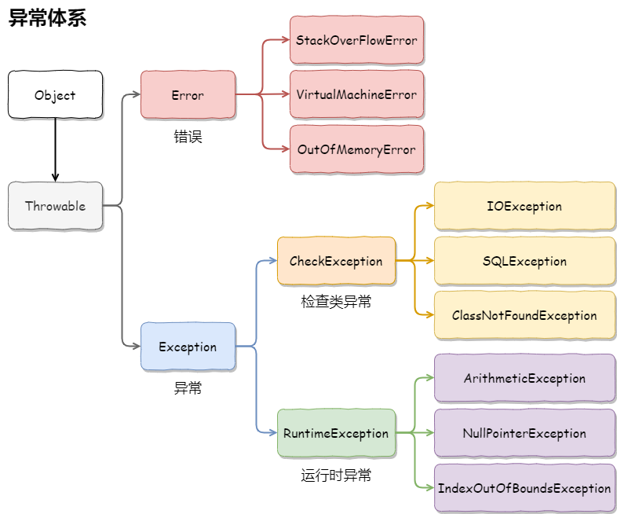
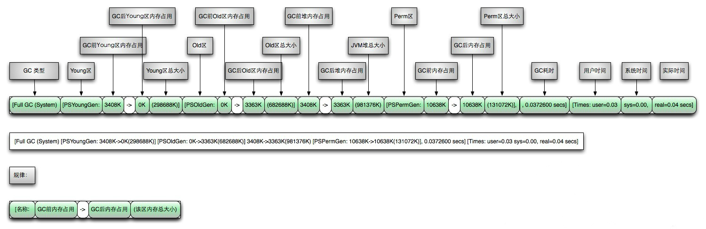
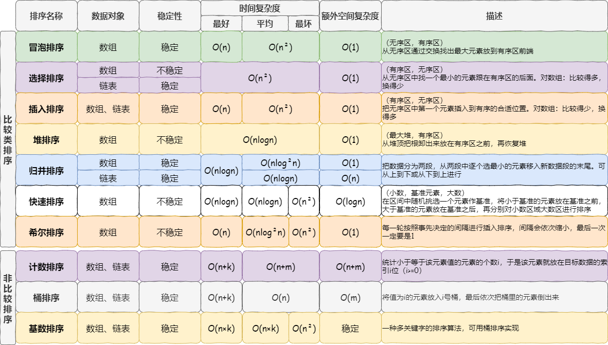
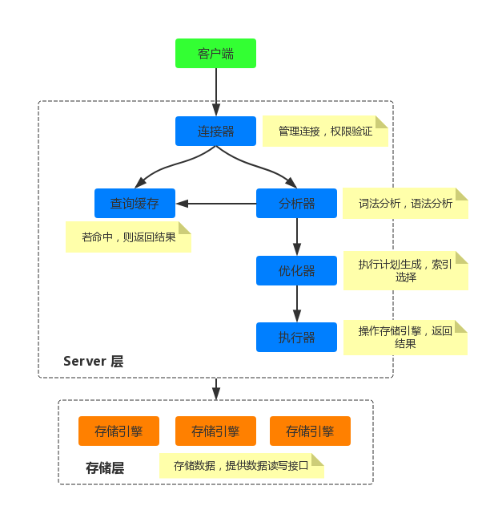
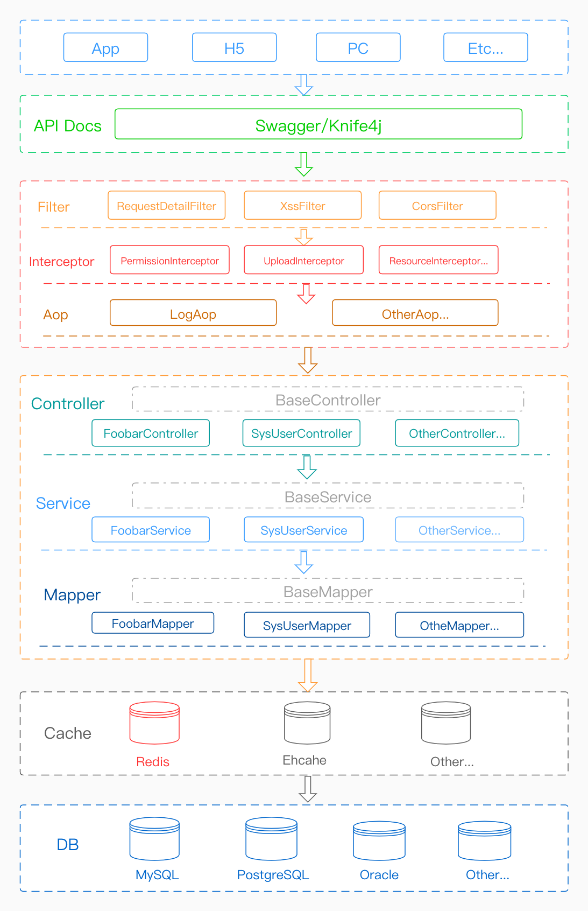
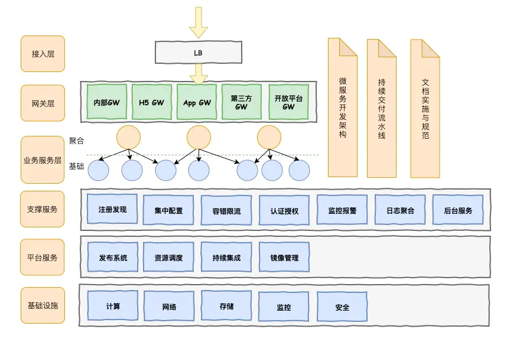
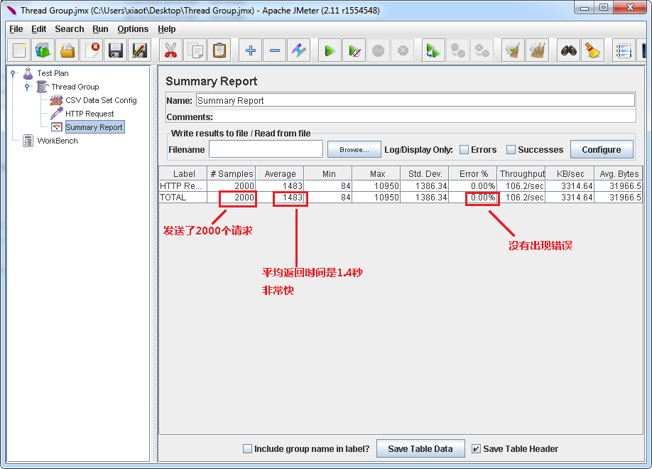
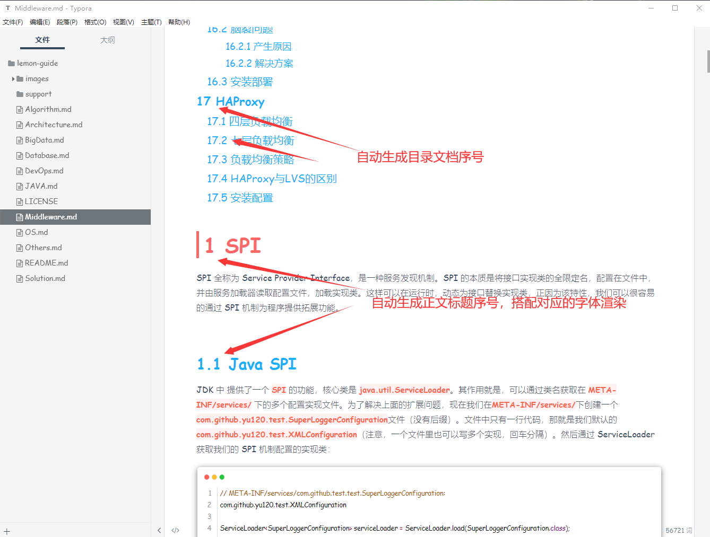

# lemon-guide

收纳了 `操作系统`、`JAVA`、`算法`、`数据库`、`中间件`、`解决方案`、`架构`、`DevOps` 和 `大数据` 等技术栈总结！其内容有来源笔者个人总结的内容，也有来源于互联网各种经典场景或案例的总结（感谢对应的笔者），目的在于把常用的技术内容进行归纳整理记录。

同时提供一个微信交流群：请加笔者个人微信（`echo-lry`），备注拉群，笔者通过后，会发送邀请入群。

用最少的图文来讲解清楚每一个知识点，如果欢迎大家一起加入！

开源地址：
- Gitee：https://gitee.com/yu120/lemon-guide
- Github：https://github.com/yu120/lemon-guide

# [1 OS](OS.md)

## 1.1 TCP

收纳了网络模型、TCP三次握手、TCP四次挥手、TCP优化、常见TCP问题、Socket和TCP主要源码等知识点。

## 1.2 HTTP

收纳了HTTP缓存流程、强制缓存、协商缓存、请求流程、常见请求/响应头参数、状态码、请求方法等知识点。

## 1.3 OS

收纳了常见处理器介绍、虚拟内存、内存分段、内存分页、内存管理、进程和线程等知识点。

# [2 JAVA](JAVA.md)

## 2.1 J.U.C

收纳整理了Unsafe、LockSupport、CAS机制、AQS框架、Condition、volatile、lambda、Striped64、LongAdder、Semaphore、CyclicBarrier、CountDownLatch、CompletableFuture等知识点。

## 2.2 集合

收纳整理了List（ArrayList、LinkedList、Vector、CopyOnWriteArrayList）、Set（HashSet、TreeSet、LinkHashSet、ConcurrentSkipListSet、CopyOnWriteArraySet、ConcurrentSkipListSet）、Map（HashMap、TreeMap、HashTable、LinkHashMap、ConcurrentHashMap、ConcurrentSkipListMap）等知识点。

## 2.3 Queue

收纳整理了BlockingQueue（ArrayBlockingQueue、LinkedBlockingQueue、PriorityBlockingQueue、SynchronousQueue、DelayQueue）、BlockingDeque（LinkedBlockingDeque）、TransferQueue（LinkedTransferQueue）等知识点。

## 2.4 Thread

收纳整理了线程实现方式、四种创建方式、生命周期、四种JDK线程池、常用线程方法、线程安全、线程同步、多线程通信、线程协作、线程死锁、守护线程、ThreadLocal、ThreadPoolExecutor等知识点。

## 2.5 Lock

收纳整理了synchronized、ReentrantLock、ReentrantReadWriteLock、锁状态、自旋锁(SpinLock)、乐观锁/悲观锁、公平锁/非公平锁、可重入锁/不可重入锁、独占锁/共享锁、互斥锁/读写锁、锁优化（状态升级、自旋锁、所消除、锁粗化、分段锁、锁细化）等知识点。

## 2.6 I/O

收纳整理了阻塞/非阻塞IO、同步/异步IO、三种Reactor模式、Proactor模式、select/poll/epoll、BIO(同步阻塞I/O)、NIO(同步非阻塞I/O)、IO多路复用(异步阻塞I/O)、AIO(异步非阻塞I/O)、信号驱动式I/O等知识点。

## 2.7 Classloader

收纳整理了JVM类加载机制、类加载器、双亲委派等知识点。

## 2.8 Throwable

收纳整理了Error、Exception、异常处理方式等知识点。

## 2.9 JVM

收纳整理了JVM常量池、JVM内存布局、JAVA内存模型(JMM)、JVM运行时内存、引用级别、OOM场景等知识点。

## 2.10 GC

收纳整理了2种寻找垃圾算法、4种清理垃圾算法、9种GC垃圾收集器、GC日志格式、GC最佳实践、FullGC场景、CMSGC场景等知识点。

# [3 Algorithm](Algorithm.md)

## 3.1 数据结构

收纳整理了常用数据结构数组(Array)、链表(Linked List)、栈(Stack)、队列(Queue)、双端队列（Deque）、树(Tree)，和高级数据结构优先队列（Priority Queue）、图（Graph）、前缀树（Trie）、线段树（Segment Tree）、树状数组（Fenwick Tree）、散列表(Hash)、二叉堆等知识点。

## 3.2 算法

收纳整理了算法复杂度、4种算法思想，常用查找算法顺序查找、二分查找、插值查找、斐波那契查找，搜索算法深度优先搜索(DFS)、广度优先搜索(BFS)、迪杰斯特拉算法(Dijkstra)、kruskal(克鲁斯卡尔)算法，排序算法冒泡排序（Bubble Sort）、选择排序（Selection Sort）、插入排序（Insertion Sort）、希尔排序（Shell Sort）、归并排序（Merging Sort）、快速排序（Quick Sort）、基数排序（Radix Sort）、堆排序（Heap Sort）、计数排序（Counting Sort）、桶排序（Bucket Sort）等知识点。

## 3.3 设计模式

收纳整理了25种设计模式：简单工厂模式、工厂模式-Factory、抽象工厂模式-Abstract Factory、单例模式-Singleton、建造者模式-Builder、原型模式-Prototype、适配器模式-Adapter、组合模式-Composite、代理模式-Proxy、享元模式-Flywight、门面模式-Facade、桥梁模式-Bridge、修饰模式-Decorator、过滤器模式-Filter、模板方法模式-Template Method、解释器模式-Mediator、责任链模式-Chain of Responsibility、观察者模式-Observer、策略模式-Strategy、命令模式-Command、状态模式-State、访客模式-Visitor、转义模式-Interpreter、迭代器模式-Iterator、备忘录模式-Memento等知识点。

# [4 Database](Database.md)

收纳整理了数据库6种范式、9种连接方式、4种事务隔离级别、索引、SQL优化、存储引擎、MYSQL原理、MYSQL高可用方案等知识点。

## 4.1 数据库范式

收纳整理了第一范式(1NF)、第二范式(2NF)、第三范式(3NF)、巴斯-科德范式（BCNF）、第四范式（4NF）、第五范式（5NF）等知识点。

## 4.2 连接方式

收纳整理了内连接（INNER JOIN）、左连接（LEFT JOIN）、右连接（RIGHT JOIN）、全连接（FULL OUTER JOIN）、LEFT JOIN EXCLUDING INNER JOIN、RIGHT JOIN EXCLUDING INNER JOIN、FULL OUTER JOIN EXCLUDING INNER JOIN、CROSS JOIN、SELF JOIN等知识点。

## 4.3 事务

| 隔离级别                     | 第一类丢失更新 | 第二类丢失更新 | 脏读 | 不可重复读 | 幻读 |
| ---------------------------- | -------------- | -------------- | ---- | ---------- | ---- |
| SERIALIZABLE （串行化）      | ×              | ×              | ×    | ×          | ×    |
| REPEATABLE READ（可重复读）  | ×              | ×              | ×    | ×          | √    |
| READ COMMITTED （读已提交）  | ×              | √              | ×    | √          | √    |
| READ UNCOMMITTED（读未提交） | ×              | √              | √    | √          | √    |

收纳整理了事务特性（ACID），隔离级别Serializable（串行化）、Repeatable Read（可重复读）、Read Committed（读已提交）、Read uncommitted（读未提交）、SpringBoot Transaction等知识点。

## 4.4 索引

收纳整理了索引结构二叉树、红黑树、Hash、B-Tree、B+Tree，索引类型普通索引、复合索引、唯一索引、主键索引、全文索引等知识点。

## 4.5 MYSQL原理

收纳整理了MYSQL架构设计、日志系统、查询过程、全局锁表锁&行锁、复制原理等知识点。

## 4.6 高可用方案

收纳整理了主从或主主半同步复制、双通道复制、MHA+多节点集群、ZooKeeper+Proxy、SAN共享储存、DRBD磁盘复制、MySQL Cluster、Galera、Paxos等知识点。

# [5 Middleware](Middleware.md)

收纳整理了SPI、Redis、RocketMQ、Zookeeper、Netty、RabbitMQ、Dubbo、Nacos、Sentinel、Influxdb、Spring、SpringCloud、MyBatis、Nginx、LVS、Keepalived、HAProxy等知识点。

关键组件：Redis、RocketMQ、MySQL、Zookeeper、Netty、MyBatis

# [6 Solution](Solution.md)

收纳整理了注册中心、API网关、服务编排、服务降级、断路器、链路追踪、幂等机制、分布式ID、分布式限流、分布式缓存、消息队列、分布式事务、分库分表、全链路压测、配置中心、服务框架等知识点。

# [7 Architecture](Architecture.md)

收纳整理了架构演进、架构规范、OAuth2.0、用户体系、权限设计、订单支付、分布式锁、数据脱敏、附近的人、亿级数据统计、短信服务、安全漏洞等知识点。

# [8 DevOps](DevOps.md)

本章节主要总结并收纳了常用的JDK工具、Linux命令、Shell语法、Git命令、测试工具、Docker等。

## 8.1 JDK Tools

- **jps**：用于查看JAVA进程编号
- **jstat**：用于打印GC回收统计信息，便于分析是否出现FGC等情况
- **jstack**：用于dump出指定进程中的线程堆栈快照信息，便于排查应用是否有锁、死锁或排查CPU占比高的线程代码
- **jmap**：用于dump出指定进程中当前内存的快照信息，便于分析内存的内容结构，从而定位内存泄漏等问题
- **jhat**：用于与jmap搭配使用，用来分析jmap生成的dump
- **jconsole**：Java GUI监视工具，可以以图表化的形式显示各种数据，并可通过远程连接监视远程的服务器VM
- **jvisualvm**：一个基于图形化界面的，可以查看本地及远程的JAVA GUI监控工具，可以查看CPU、堆、线程、GC等
- **jmc**：JDK自带图形界面监控工具。JMC打开性能日志后可查看**一般信息、内存、代码、线程、I/O、系统、事件** 功能
- **EclipseMAT**：基于Eclipse内存分析工具，它可以帮助我们查找内存泄漏和减少内存消耗

## 8.2 Linux Command

- **基本命令**：`vi/vim`、`scp`、`tar`、`su`、`df`、`tail`、`grep`、`awk`、`find`、`netstat`、`echo`、`telnet`、`rpm`、`yum`等
- **监控命令**
  - **Memory**：`free`、`vmstat`
  - **CPU**：`top`、`htop`、`sar`
  - **IO**：`iostat`、`pidsta`、`iotop`
  - **Network**：`netstat`、`iftop`、`tcpdump`
  - **Others**：`dstat`、`saidar`、`Glances`
- **瓶颈排查**：定位线上最耗CPU的线程、定位丢包错包情况、查看网络错误、包的重传率等

## 8.3 Shell

收纳了Shell脚本的变量、数组、算术运算、字符串、条件判断、流程控制等基本语法，学完后就可自己写Shell脚本。

## 8.4 Git

收纳了Git相关的常用命令，如：`git clone`、`git add`、`git rm`、`git commit`、`git branch`、`git tag`、`git push`、`git pull`、`git log`、`git remote`、`git fetch`、`git reset`等。

## 8.5 Test Tools

- **AB**：ApacheBench (ab)是 Apache 网站服务器软件附带的工具，专门用来做HTTP接口的性能测试
- **Jmeter**：Apache JMeter是Apache组织开发的基于Java的压力测试工具。用于对软件做压力测试

## 8.6 Docker

Docker常用命令。

## 8.7 Nginx

收纳了Nginx常用配置和应用场景配置案例等知识点。

# [9 BigData](BigData.md)

收纳整理了Hadoop、Flume、Kafka、HBase、HDFS、Apache Storm、Apache Spark、Apache Flink等知识点。

# [10 Others](Others.md)

收纳整理了常用软件（画图工具、数据抓包、SSH、Chrome、代码对比等）、IDEA常见设置图解、常用插件、功能插件、产品经理常用软件、管理总结（时间管理、项目管理、团队管理、知识卡片、演讲能力）等知识点。

## 10.1 自定义主题

最后，还提供了文档中部分图片的原稿文件（support目录下），方便各位使用进行二次加工使用。同时还提供了笔者日常使用的Markdown编辑软件Tyora的一份自定义主题（提供黑暗主题）包（support/lry.css和support/lry-darcula.css），主要实现了Markdown文档自动编号问题，同时渲染了部分效果。效果截图如下：

