<div style="color:#16b0ff;font-size:50px;font-weight: 900;text-shadow: 5px 5px 10px var(--theme-color);font-family: 'Comic Sans MS';">Solution</div>

<span style="color:#16b0ff;font-size:20px;font-weight: 900;font-family: 'Comic Sans MS';">Introduction</span>：收纳技术相关的 `幂等`、`限流`、`降级`、`断路器`、`事务`、`缓存`、`分库分表` 等总结！

[TOC]


# 高可用设计

**什么是高可用？**

在定义什么是高可用，可以先定义下什么是不可用，一个网站的内容最终呈现在用户面前需要经过若干个环节，而其中只要任何一个环节出现了故障，都可能导致网站页面不可访问，这个也就是网站不可用的情况。

参考维基百科，看看维基怎么定义高可用：`系统无中断地执行其功能的能力，代表系统的可用性程度，是进行系统设计时的准则之一`。

这个难点或是重点在于“无中断”，要做到 7 x 24 小时无中断无异常的服务提供。


**为什么需要高可用？**

一套对外提供服务的系统是需要硬件，软件相结合，但是我们的软件会有bug，硬件会慢慢老化，网络总是不稳定，软件会越来越复杂和庞大，除了硬件软件在本质上无法做到“无中断”，外部环境也可能导致服务的中断，例如断电，地震，火灾，光纤被挖掘机挖断，这些影响的程度可能更大。


**高可用的评价纬度**

在业界有一套比较出名的评定网站可用性的指标，常用N个9来量化可用性，可以直接映射到网站正常运行时间的百分比上

| 描述                     | N个9 | 可用性级别 | 年度停机时间 |
| ------------------------ | ---- | ---------- | ------------ |
| 基本可用                 | 2个9 | 99%        | 87.6小时     |
| 较高可用                 | 3个9 | 99%        | 8.8小时      |
| 具备故障自动恢复能力可用 | 4个9 | 99.99%     | 53分钟       |
| 极高可用                 | 5个9 | 99.999%    | 5分钟        |

一般互联网公司也是按照这个指标去界定可用性，不过在执行的过程中也碰到了一些问题，例如，有一些服务的升级或数据迁移明明可以在深夜停机或停服务进行，然而考虑到以后的报告要显示出我们的系统达到了多少个9的高可用，而放弃停服务这种简单的解决方案，例如停机2个小时，就永远也达不到4个9。然而在一些高并发的场合，例如在秒杀或拼团，虽然服务停止了几分钟，但是这个对整个公司业务的影响可能是非常重大的，分分钟丢失的订单可能是一个庞大的数量。所以N个9来量化可用性其实也得考虑业务的情况。


## 服务冗余

### 冗余策略

每一个访问可能都会有多个服务组成而成，每个机器每个服务都可能出现问题，所以第一个考虑到的就是每个服务必须不止一份可以是多份，所谓多份一致的服务就是服务的冗余，这里说的服务泛指了机器的服务，容器的服务，还有微服务本身的服务。

在机器服务层面需要考虑，各个机器间的冗余是否有在物理空间进行隔离冗余 ，例如是否所有机器是否有分别部署在不同机房，如果在同一个机房是否做到了部署在不同的机柜，如果是docker容器是否部署在分别不同的物理机上面。 采取的策略其实也还是根据服务的业务而定，所以需要对服务进行分级评分，从而采取不同的策略，不同的策略安全程度不同，伴随这的成本也是不同，安全等级更高的服务可能还不止考虑不同机房，还需要把各个机房所处的区域考虑进行，例如，两个机房不要处在同一个地震带上等等。

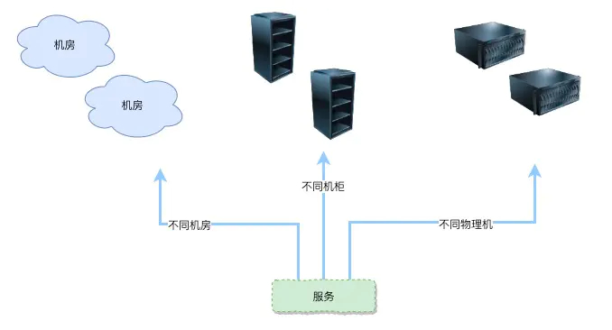


### 无状态化

服务的冗余会要求我们可以随时对服务进行扩容或者缩容，有可能我们会从2台机器变成3台机器，想要对服务进行随时随地的扩缩容，就要求我们的服务是一个无状态化，所谓无状态化就是每个服务的服务内容和数据都是一致的。

例如，从我们的微服务架构来看，我们总共分水平划分了好几个层，正因为我们每个层都做到了无状态，所以在这个水平架构的扩张是非常的简单。假设，我们需要对网关进行扩容，我们只需要增加服务就可以，而不需要去考虑网关是否存储了一个额外的数据。

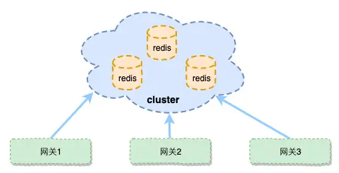

网关不保存任何的session数据，不提供会造成一致性的服务，将不一致的数据进行几种存储，借助更加擅长数据同步的中间件来完成。这个是目前主流的方案，服务本身尽可能提供逻辑的服务，将数据的一致性保证集中式处理，这样就可以把“状态”抽取出来，让网关保持一个“无状态”

这里仅仅是举了网关的例子，在微服务只基本所有的服务，都应该按照这种思路去做，如果服务中有状态，就应该把状态抽取出来，让更加擅长处理数据的组件来处理，而不是在微服务中去兼容有数据的状态。


## 数据存储高可用

之前上面说的服务冗余，可以简单的理解为计算的高可用，计算高可用只需要做到无状态既可简单的扩容缩容，但是对于需要存储数据的系统来说，数据本身就是有状态。

跟存储与计算相比，有一个本质的差别：`将数据从一台机器搬到另一台机器，需要经过线路进行传输`。

网络是不稳定的，特别是跨机房的网络，ping的延时可能是几十几百毫秒，虽然毫秒对于人来说几乎没有什么感觉，但是对于高可用系统来说，就是本质上的不同，这意味着整个系统在某个时间点上，数据肯定是不一致的。按照“数据+逻辑=业务”的公式来看，数据不一致，逻辑一致，最后的业务表现也会不一致。举个例子

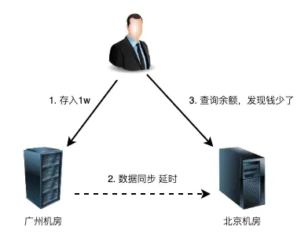

无论是正常情况下的传输延时，还是异常情况下的传输中断，都会导致系统的数据在某个时间点出现不一致，而数据的不一致又会导致业务出现问题，但是如果数据不做冗余，系统的高可用无法保证

> 所以，存储高可用的难点不在于怎么备份数据，而在于如何减少或者规避数据不一致对业务造成的影响

分布式领域中有一个著名的CAP定理，从理论上论证了存储高可用的复杂度，也就是说，存储高可用不可能同时满足“一致性，可用性，分区容错性”，最多只能满足2个，其中分区容错在分布式中是必须的，就意味着，我们在做架构设计时必须结合业务对一致性和可用性进行取舍。

存储高可用方案的本质是将数据复制到多个存储设备中，通过数据冗余的方式来现实高可用，其复杂度主要呈现在数据复制的延迟或中断导致数据的不一致性，我们在设计存储架构时必须考虑到一下几个方面：

- 数据怎么进行复制
- 架构中每个节点的职责是什么
- 数据复制出现延迟怎么处理
- 当架构中节点出现错误怎么保证高可用


### 数据主从复制

主从复制是最常见的也是最简单的存储高可用方案，例如Mysql，redis等等

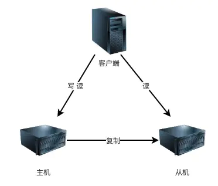

其架构的优点就是简单，主机复制写和读，而从机只负责读操作，在读并发高时候可用扩张从库的数量减低压力，主机出现故障，读操作也可以保证读业务的顺利进行。

缺点就是客户端必须感知主从关系的存在，将不同的操作发送给不同的机器进行处理，而且主从复制中，从机器负责读操作，可能因为主从复制时延大，出现数据不一致性的问题。


### 数据主从切换

刚说了主从切换存在两个问题： 1.主机故障写操作无法进行 2.需要人工将其中一台从机器升级为主机

为了解决这个两个问题，我们可以设计一套主从自动切换的方案，其中设计到对主机的状态检测，切换的决策，数据丢失和冲突的问题。

1.主机状态检测

需要多个检查点来检测主机的机器是否正常，进程是否存在，是否出现超时，是否写操作不可执行，读操作是否不可执行，将其进行汇总，交给切换决策

2.切换决策

确定切换的时间决策，什么情况下从机就应该升级为主机，是进程不存在，是写操作不可这行，连续检测多少失败次就进行切换。应该选择哪一个从节点升级为主节点，一般来说或应该选同步步骤最大的从节点来进行升级。切换是自动切换还是半自动切换，通过报警方式，让人工做一次确认。

3.数据丢失和数据冲突 数据写到主机，还没有复制到从机主机就挂了，这个时候怎么处理，这个也得考虑业务的方式，是要确保CP或AP

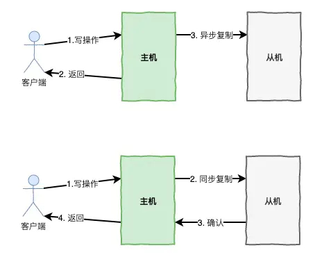

还要考虑一个数据冲突的问题，这个问题在mysql中大部分是由自增主键引起，就算不考虑自增主键会引起数据冲突的问题，其实自增主键还要引起很多的问题，这里不细说，避免使用自增主键。


### 数据分片

上述的数据冗余可以通过数据的复制来进行解决，但是数据的扩张需要通过数据的分片来进行解决（如果在关系型数据库是分表）。

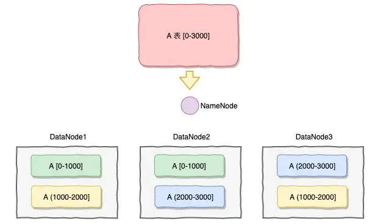

何为数据分片（segment，fragment， shard， partition），就是按照一定的规则，将数据集划分成相互独立、正交的数据子集，然后将数据子集分布到不同的节点上。

HDFS ， mongoDB 的sharding 模式也基本是基于这种分片的模式去实现，我们在设计分片主要考虑到的点是：

- 做数据分片，如何将数据映射到节点
- 数据分片的特征值，即按照数据中的哪一个属性（字段）来分片
- 数据分片的元数据的管理，如何保证元数据服务器的高性能、高可用，如果是一组服务器，如何保证强一致性


## 柔性化/异步化

### 异步化

在每一次调用，时间越长存在超时的风险就越大，逻辑越复杂执行的步骤越多存在失败的风险也就越大，如果在业务允许的情况下，用户调用只给用户必须要的结果，而不是需要同步的结果可以放在另外的地方异步去操作，这就减少了超时的风险也把复杂业务进行拆分减低复杂度。当然异步化的好处是非常多，例如削封解耦等等，这里只是从可用的角度出发。异步化大致有这三种的实现方式：

- 服务端接收到请求后，创建新的线程处理业务逻辑，服务端先回应答给客户端

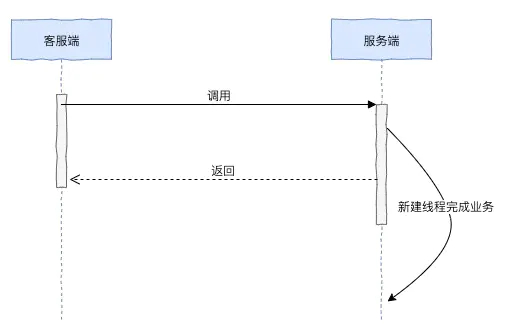

- 服务端接收到请求后，服务端先回应答给客户端，再继续处理业务逻辑

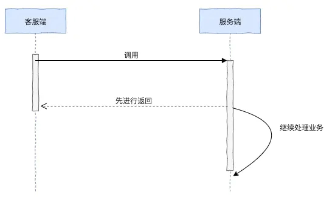

- 服务端接收到请求后，服务端把信息保存在消息队列或者数据库，回应答给客户端，服务端业务处理进程再从消息队列或者数据库上读取信息处理业务逻辑

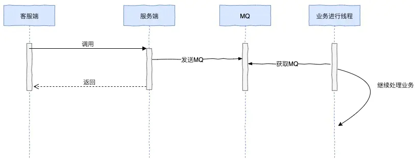


### 柔性化

什么是柔性化，想象一个场景，我们的系统会给每个下单的用户增加他们下单金额对应的积分，当一个用户下单完毕后，我们给他增加积分的服务出现了问题，这个时候，我们是要取消掉这个订单还是先让订单通过，积分的问题通过重新或者报警来处理呢？

所谓的柔性化，就是在我们业务中允许的情况下，做不到给予用户百分百可用的通过降级的手段给到用户尽可能多的服务，而不是非得每次都交出去要么100分或0分的答卷。

怎么去做柔性化，更多其实是对业务的理解和判断，柔性化更多是一种思维，需要对业务场景有深入的了解。

在电商订单的场景中，下单，扣库存，支付是一定要执行的步骤，如果失败则订单失败，但是加积分，发货，售后是可以柔性处理，就算出错也可以通过日志报警让人工去检查，没必要为加积分损失整个下单的可用性


## 兜底/容错

兜底是可能我们经常谈论的是一种降级的方案，方案是用来实施，但是这里兜底可能更多是一种思想，更多的是一种预案，每个操作都可以犯错，我们也可以接受犯错，但是每个犯错我们都必须有一个兜底的预案，这个兜底的预案其实就是我们的容错或者说最大程度避免更大伤害的措施，实际上也是一个不断降级的过程。举个例子：

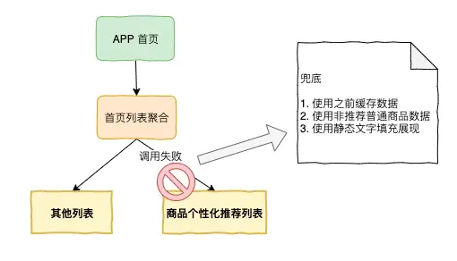

例如我们首页请求的用户个性化推荐商品的接口，发现推荐系统出错，我们不应该去扩大（直接把异常抛给用户）或保持调用接口的错误，而是应该兼容调用接口的错误，做到更加柔性化，这时候可以选择获取之前没有失败接口的缓存数据，如果没有则可以获取通用商品不用个性化推荐，如果也没有可以读取一些静态文字进行展示。

由于我们架构进行了分层，分成APP，网关，业务逻辑层，数据访问层等等，在组织结构也进行了划分，与之对应的是前端组，后端业务逻辑组，甚至有中台组等等。既然有代码和人员架构的划分层级，那么每一层都必须有这样的思想：包容下一层的错误，为上一层提供尽可能无措的服务。举个例子：

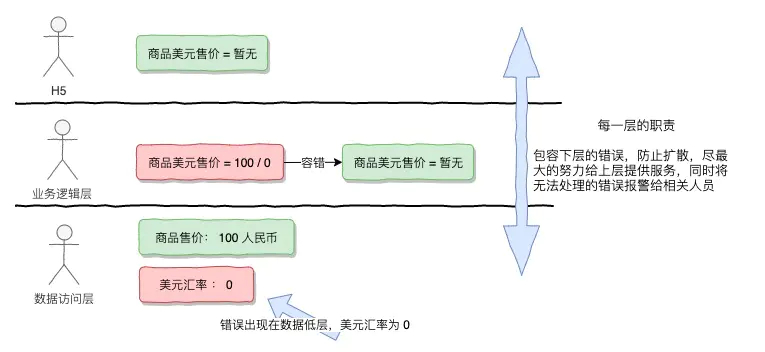

商品的美元售价假设要用商品人民币售价/汇率，这个时候错误发生在低层的数据层，上一层如果直接进行除，肯定就抛出 java.lang.ArithmeticException: / by zero，本着我们对任何一层调用服务都不可信的原则，应该对其进行容错处理，不能让异常扩散，更要保证我们这一层对上一次尽可能的作出最大努力确定的服务。


## 负载均衡

相信负载均衡这个话题基本已经深入每个做微服务开发或设计者的人心，负载均衡的实现有硬件和软件，硬件有F5，A10等机器，软件有LVS，nginx，HAProxy等等，负载均衡的算法有 random ， RoundRobin ， ConsistentHash等等。

### Nginx负载均衡故障转移

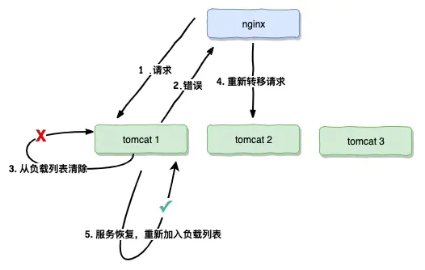

**转移流程**

nginx 根据给定好的负载均衡算法进行调度，当请求到tomcat1，nginx发现tomcat1出现连接错误（节点失效），nginx会根据一定的机制将tomcat1从调用的负载列表中清除，在下一次请求，nginx不会分配请求到有问题的tomcat1上面，会将请求转移到其他的tomcat之上。


**节点失效**

nginx默认判断节点失效是以connect refuse和timeout为标准，在对某个节点进行fails累加，当fails大于max_fails时，该节点失效。


**节点恢复**

当某个节点失败的次数大于max_fails时，但不超过fail_timeout,nginx将不在对该节点进行探测，直到超过失效时间或者所有的节点都失效，nginx会对节点进行重新探测。


### ZK负载均衡故障转移

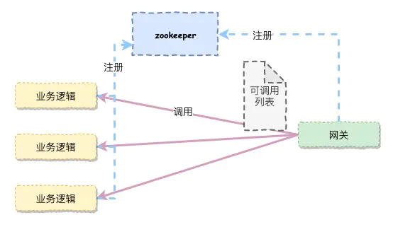

在使用ZK作为注册中心时，故障的发现是由Zk去进行发现，业务逻辑层通过watch的心跳机制将自己注册到zk上，网关对zk进行订阅就可以知道有多少可以调用的列表。当业务逻辑层在重启或者被关闭时就会跟zk断了心跳，zk会更新可调用列表。

使用zk作为负载均衡的协调器，最大的问题是zk对于服务是否可用是基于pingpong的方式，只要服务心跳存在，zk就认为服务是处在于可用状态，但是服务如果处在于假死的状态，zk是无从得知的。这个时候，业务逻辑服务是否真正可用只能够由网关知道。


**幂等设计**

为何会牵出幂等设计的问题，主要是因为负载均衡的failover策略，就是对失败的服务会进行重试，一般来说，如果是读操作的服务，重复执行也不会出问题，但想象一下，如果是一个创建订单减库存的操作，第一次调用也tomcat1超时，再重新调用了tomcat2，这个时候我们都不能确认超时调用的tomcat1是否真的被调用，有可能根本就调用不成功，有可能已经调用成功但是因为某些原因返回超时而已，所以，很大程度这个接口会被调用2次。如果我们没有保证幂等性，就有可能一个订单导致了减少2次的库存。所谓的幂等性，就是得保证在同一个业务中，一个接口被调用了多次，其导致的结果都是一样的。


## 服务限流降级熔断

先来讲讲微服务中限流/熔断的目的是什么，微服务后，系统分布式部署，系统之间通过rpc框架通信，整个系统发生故障的概率随着系统规模的增长而增长，一个小的故障经过链路的传递放大，有可能会造成更大的故障。

限流跟高可用的关系是什么，假定我们的系统最多只能承受500个人的并发访问，但整个时候突然增加到1000个人进来，一下子就把整个系统给压垮了，本来还有500个人能享受到我们系统的服务，突然间变成了所有人都无法得到服务，与其让1000人都不法得到服务，不如就让500个人得到服务，拒绝掉另外500个人。限流是对访问的隔离，是保证了部门系统承受范围内用户的可用性。

熔断跟高可用的关系是什么，上面说了微服务是一个错综复杂的调用链关系，假设 模块A 调用 模块B ， 模块B 又调用了 模块C ， 模块C 调用了 模块D，这个时候，模块D 出了问题出现严重的时延，这个时候，整个调用链就会被 模块D 给拖垮，A 等B，B等C，C等D，而且A B C D的资源被锁死得不到释放，如果流量大的话还容易引起雪崩。熔断，主动丢弃 模块D 的调用，并在功能上作出一些降级才能保证到我们系统的健壮性。 熔断是对模块的隔离，是保证了最大功能的可用性。


## 服务治理

### 服务模块划分

服务模块与服务模块之间有着千丝万缕的关系，但服务模块在业务中各有权重，例如订单模块可能是一家电商公司的重中之重，如果出问题将会直接影响整个公司的营收，而一个后台的查询服务模块可能也重要，但它的重要等级绝对是没有像订单这么重要。所以，在做服务治理时，必须明确各个服务模块的重要等级，这样才能更好的做好监控，分配好资源。这个在各个公司有各个公司的一个标准，例如在电商公司，确定服务的级别可能会更加倾向对用用户请求数和营收相关的作为指标。

| 服务级别 | 服务模块                                               |
| -------- | ------------------------------------------------------ |
| 一级服务 | 支付系统 订单服务 商品服务 用户服务 发布系统 ...       |
| 二级服务 | 消息服务 权限系统 CRM系统 积分系统 BI系统 评论系统 ... |
| 三级服务 | 后台日志系统                                           |

可能真正的划分要比这个更为复杂，必须根据具体业务去定，这个可以从平时服务模块的访问量和流量去预估，往往更重要的模块也会提供更多的资源，所以不仅要对技术架构了如指掌，还要对公司各种业务形态了然于心才可以。

服务分级不仅仅在故障界定起到重要主要，而且决定了服务监控的力度，服务监控在高可用中起到了一个保障的作用，它不仅可以保留服务奔溃的现场以等待日后复盘，更重要的是它可以起到一个先知，先行判断的角色，很多时候可以预先判断危险，防范于未然。


### 服务监控

服务监控是微服务治理的一个重要环节，监控系统的完善程度直接影响到我们微服务质量的好坏，我们的微服务在线上运行的时候有没有一套完善的监控体系能去了解到它的健康情况，对整个系统的可靠性和稳定性是非常重要，可靠性和稳定性是高可用的一个前提保证。

服务的监控更多是对于风险的预判，在出现不可用之间就提前的发现问题，如果系统获取监控报警系统能自我修复则可以将错误消灭在无形，如果系统发现报警无法自我修复则可以通知人员提早进行接入。

一个比较完善的微服务监控体系需要涉及到哪些层次，如下图，大致可以划分为五个层次的监控

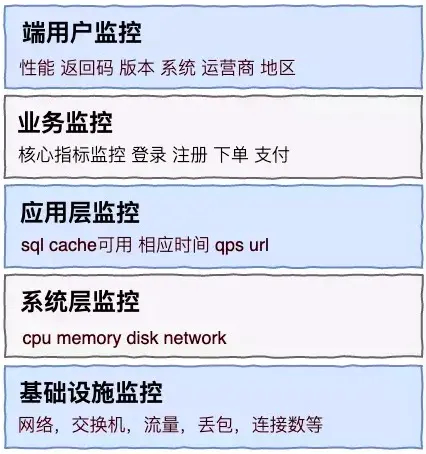

**基础设施监控**

例如网络，交换机，路由器等低层设备，这些设备的可靠性稳定性就直接影响到上层服务应用的稳定性，所以需要对网络的流量，丢包情况，错包情况，连接数等等这些基础设施的核心指标进行监控。


**系统层监控**

涵盖了物理机，虚拟机，操作系统这些都是属于系统级别监控的方面，对几个核心指标监控，如cpu使用率，内存占用率，磁盘IO和网络带宽情况。


**应用层监控**

例如对url访问的性能，访问的调用数，访问的延迟，还有对服务提供性能进行监控，服务的错误率，对sql也需要进行监控，查看是否有慢sql，对与cache来说，需要监控缓存的命中率和性能，每个服务的响应时间和qps等等。


**业务监控**

比方说一个电商网站，需要关注它的用户登录情况，注册情况，下单情况，支付情况，这些直接影响到实际触发的业务交易情况，这个监控可以提供给运营和公司高管他们需需要关注的数据，直接可能对公司战略产生影响。


**端用户体验监控**

用户通过浏览器，客户端打开练到到我们的服务，那么在用户端用户的体验是怎么样，用户端的性能是怎么样，有没有产生错误，这些信息也是需要进行监控并记录下来，如果没有监控，有可能用户的因为某些原因出错或者性能问题造成体验非常的差，而我们并没有感知，这里面包括了，监控用户端的使用性能，返回码，在哪些城市地区他们的使用情况是怎么样，还有运营商的情况，包括电信，联通用户的连接情况。我们需要进一步去知道是否有哪些渠道哪些用户接入的时候存在着问题，包括我们还需要知道客户端使用的操作系统浏览器的版本。


## 解决方案

### 冷备

冷备，通过停止数据库对外服务的能力，通过文件拷贝的方式将数据快速进行备份归档的操作方式。简而言之，冷备，就是复制粘贴，在linux上通过`cp`命令就可以很快完成。可以通过人为操作，或者定时脚本进行。有如下好处：

- 简单
- 快速备份（相对于其他备份方式）
- 快速恢复。只需要将备份文件拷贝回工作目录即完成恢复过程（亦或者修改数据库的配置，直接将备份的目录修改为数据库工作目录）。更甚，通过两次`mv`命令就可瞬间完成恢复。
- 可以按照时间点恢复。比如，几天前发生的拼多多优惠券漏洞被人刷掉很多钱，可以根据前一个时间点进行还原，“挽回损失”。

以上的好处，对于以前的软件来说，是很好的方式。但是对于现如今的很多场景，已经不好用了，因为：

- 服务需要停机。n个9肯定无法做到了。然后，以前我们的停机冷备是在凌晨没有人使用的时候进行，但是现在很多的互联网应用已经是面向全球了，所以，任何时候都是有人在使用的。
- 数据丢失。如果不采取措施，那么在完成了数据恢复后，备份时间点到还原时间内的数据会丢失。传统的做法，是冷备还原以后，通过数据库日志手动恢复数据。比如通过redo日志，更甚者，我还曾经通过业务日志去手动回放请求恢复数据。恢复是极大的体力活，错误率高，恢复时间长。
- 冷备是全量备份。全量备份会造成磁盘空间浪费，以及容量不足的问题，只能通过将备份拷贝到其他移动设备上解决。所以，整个备份过程的时间其实更长了。想象一下每天拷贝几个T的数据到移动硬盘上，需要多少移动硬盘和时间。并且，全量备份是无法定制化的，比如只备份某一些表，是无法做到的。

如何权衡冷备的利弊，是每个业务需要考虑的。


### 双机热备

热备，和冷备比起来，主要的差别是不用停机，一边备份一边提供服务。但还原的时候还是需要停机的。由于我们讨论的是和存储相关的，所以不将共享磁盘的方式看作双机热备。

#### Active/Standby模式

相当于1主1从，主节点对外提供服务，从节点作为backup。通过一些手段将数据从主节点同步到从节点，当故障发生时，将从节点设置为工作节点。数据同步的方式可以是偏软件层面，也可以是偏硬件层面的。偏软件层面的，比如mysql的master/slave方式，通过同步binlog的方式；sqlserver的订阅复制方式。偏硬件层面，通过扇区和磁盘的拦截等镜像技术，将数据拷贝到另外的磁盘。偏硬件的方式，也被叫做数据级灾备；偏软件的，被叫做应用级灾备。后文谈得更多的是应用级灾备。

#### 双机互备

本质上还是Active/Standby，只是互为主从而已。双机互备并不能工作于同一个业务，只是在服务器角度来看，更好的压榨了可用的资源。比如，两个业务分别有库A和B，通过两个机器P和Q进行部署。那么对于A业务，P主Q从，对于B业务，Q主P从。整体上看起来是两个机器互为主备。这种架构下，读写分离是很好的，单写多读，减少冲突又提高了效率。

其他的高可用方案还可以参考各类数据库的多种部署模式，比如mysql的主从、双主多从、MHA；redis的主从，哨兵，cluster等等。


### 同城双活

前面讲到的几种方案，基本都是在一个局域网内进行的。业务发展到后面，有了同城多活的方案。和前面比起来，不信任的粒度从机器转为了机房。这种方案可以解决某个IDC机房整体挂掉的情况（停电，断网等）。

同城双活其实和前文提到的双机热备没有本质的区别，只是“距离”更远了，基本上还是一样（同城专线网速还是很快的）。双机热备提供了灾备能力，双机互备避免了过多的资源浪费。

在程序代码的辅助下，有的业务还可以做到真正的双活，即同一个业务，双主，同时提供读写，只要处理好冲突的问题即可。需要注意的是，并不是所有的业务都能做到。

业界更多采用的是两地三中心的做法。远端的备份机房能更大的提供灾备能力，能更好的抵抗地震，恐袭等情况。双活的机器必须部署到同城，距离更远的城市作为灾备机房。灾备机房是不对外提供服务的，只作为备份使用，发生故障了才切流量到灾备机房；或者是只作为数据备份。原因主要在于：**距离太远，网络延迟太大**。

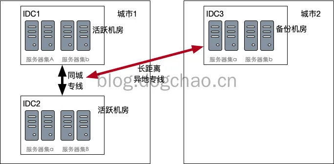

如上图，用户流量通过负载均衡，将服务A的流量发送到IDC1，服务器集A；将服务B的流量发送到IDC2，服务器B；同时，服务器集a和b分别从A和B进行同城专线的数据同步，并且通过长距离的异地专线往IDC3进行同步。当任何一个IDC当机时，将所有流量切到同城的另一个IDC机房，完成了failover。当城市1发生大面积故障时，比如发生地震导致IDC1和2同时停止工作，则数据在IDC3得以保全。同时，如果负载均衡仍然有效，也可以将流量全部转发到IDC3中。不过，此时IDC3机房的距离非常远，网络延迟变得很严重，通常用户的体验的会受到严重影响的。


上图是一种基于Master-Slave模式的两地三中心示意图。城市1中的两个机房作为1主1从，异地机房作为从。也可以采用同城双主+keepalived+vip的方式，或者MHA的方式进行failover。但城市2不能（最好不要）被选择为Master。


### 异地双活

同城双活可以应对大部分的灾备情况，但是碰到大面积停电，或者自然灾害的时候，服务依然会中断。对上面的两地三中心进行改造，在异地也部署前端入口节点和应用，在城市1停止服务后将流量切到城市2，可以在降低用户体验的情况下，进行降级。但用户的体验下降程度非常大。

所以大多数的互联网公司采用了异地双活的方案。

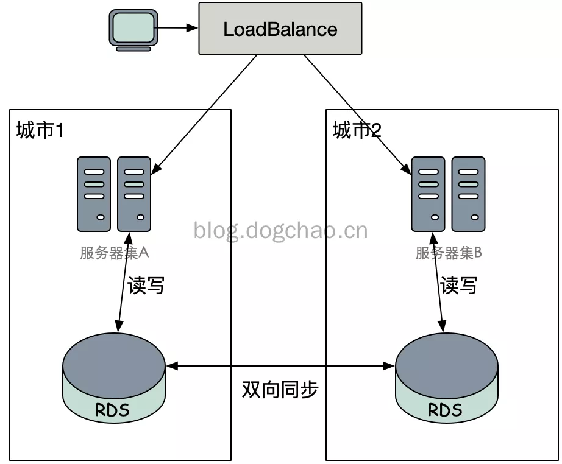

上图是一个简单的异地双活的示意图。流量经过LB后分发到两个城市的服务器集群中，服务器集群只连接本地的数据库集群，只有当本地的所有数据库集群均不能访问，才failover到异地的数据库集群中。

在这种方式下，由于异地网络问题，双向同步需要花费更多的时间。更长的同步时间将会导致更加严重的吞吐量下降，或者出现数据冲突的情况。吞吐量和冲突是两个对立的问题，你需要在其中进行权衡。例如，为了解决冲突，引入分布式锁/分布式事务；为了解决达到更高的吞吐量，利用中间状态、错误重试等手段，达到最终一致性；降低冲突，将数据进行恰当的sharding，尽可能在一个节点中完成整个事务。

对于一些无法接受最终一致性的业务，饿了么采用的是下图的方式：


> 对于个别一致性要求很高的应用，我们提供了一种强一致的方案（Global Zone），Globa Zone是一种跨机房的读写分离机制，所有的写操作被定向到一个 Master 机房进行，以保证一致性，读操作可以在每个机房的 Slave库执行，也可以 bind 到 Master 机房进行，这一切都基于我们的数据库访问层（DAL）完成，业务基本无感知。
>
> 《饿了么异地多活技术实现（一）总体介绍》

也就是说，在这个区域是不能进行双活的。采用主从而不是双写，自然解决了冲突的问题。

实际上，异地双活和异地多活已经很像了，双活的结构更为简单，所以在程序架构上不用做过多的考虑，只需要做传统的限流，failover等操作即可。但其实双活只是一个临时的步骤，最终的目的是切换到多活。因为双活除了有数据冲突上的问题意外，还无法进行横向扩展。


### 异地多活

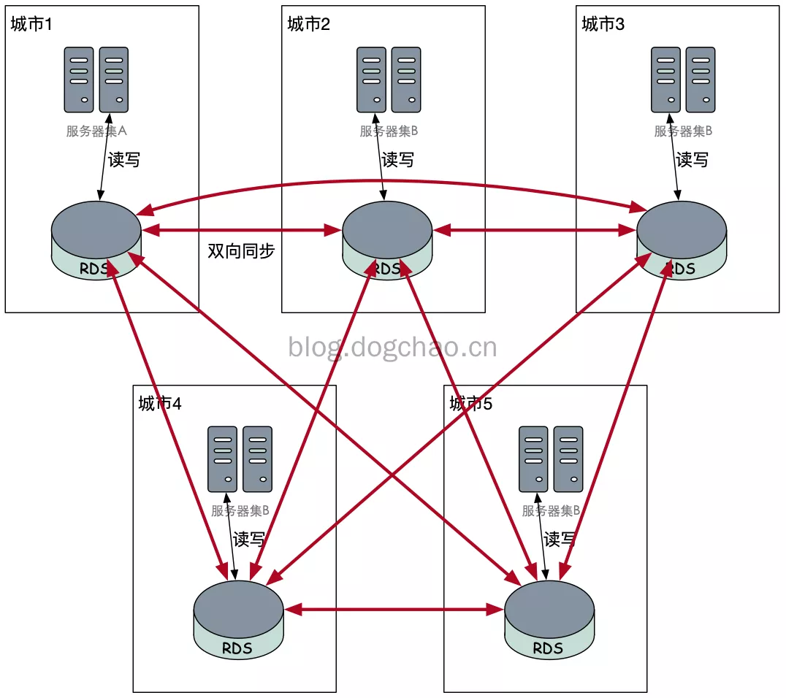

根据异地双活的思路，我们可以画出异地多活的一种示意图。每个节点的出度和入度都是4，在这种情况下，任何节点下线都不会对业务有影响。但是，考虑到距离的问题，一次写操作将带来更大的时间开销。时间开销除了影响用户体验以外，还带来了更多的数据冲突。在严重的数据冲突下，使用分布式锁的代价也更大。这将导致系统的复杂度上升，吞吐量下降。所以上图的方案是无法使用的。

回忆一下我们在解决网状网络拓扑的时候是怎么优化的？引入中间节点，将网状改为星状：

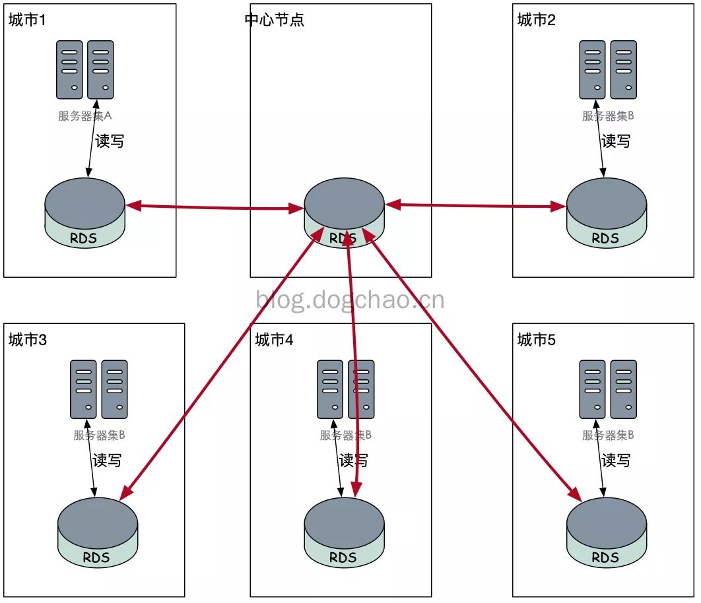

改造为上图后，每个城市下线都不会对数据造成影响。对于原有请求城市的流量，会被重新LoadBalance到新的节点（最好是LB到最近的城市）。为了解决数据安全的问题，我们只需要针对中心节点进行处理即可。但是这样，对于中心城市的要求，比其他城市会更高。比如恢复速度，备份完整性等，这里暂时不展开。我们先假定中心是完全安全的。


# 注册中心

注册中心主要是为分布式服务的**发布与发现**提供一层统一标准化的基础组件，便于使用者直接操作简单接口即可实现服务发布与发现功能。

## 服务注册

服务注册有两种形式：**客户端注册**和**代理注册**。

### 客户端注册

客户端注册是服务自己要负责注册与注销的工作。当服务启动后注册线程向注册中心注册，当服务下线时注销自己。


这种方式缺点是注册注销逻辑与服务的业务逻辑耦合在一起，如果服务使用不同语言开发，那需要适配多套服务注册逻辑。


### 代理注册

代理注册由一个单独的代理服务负责注册与注销。当服务提供者启动后以某种方式通知代理服务，然后代理服务负责向注册中心发起注册工作。

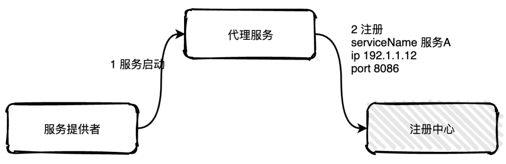

这种方式的缺点是多引用了一个代理服务，并且代理服务要保持高可用状态。


## 服务发现

服务发现也分为客户端发现和代理发现。

### 客户端发现

客户端发现是指客户端负责向注册中心查询可用服务地址，获取到所有的可用实例地址列表后客户端根据**负载均衡**算法选择一个实例发起请求调用。

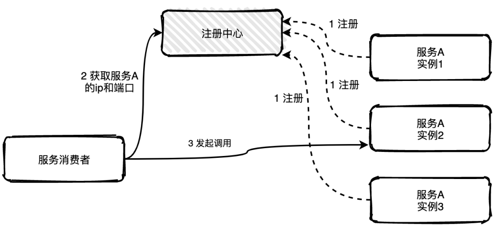

这种方式非常直接，客户端可以控制负载均衡算法。但是缺点也很明显，获取实例地址、负载均衡等逻辑与服务的业务逻辑耦合在一起，如果服务发现或者负载平衡有变化，那么所有的服务都要修改重新上线。


### 代理发现

代理发现是指新增一个路由服务负责服务发现获取可用的实例列表，服务消费者如果需要调用服务A的一个实例可以直接将请求发往路由服务，路由服务根据配置好的负载均衡算法从可用的实例列表中选择一个实例将请求转发过去即可，如果发现实例不可用，路由服务还可以自行重试，服务消费者完全不用感知。

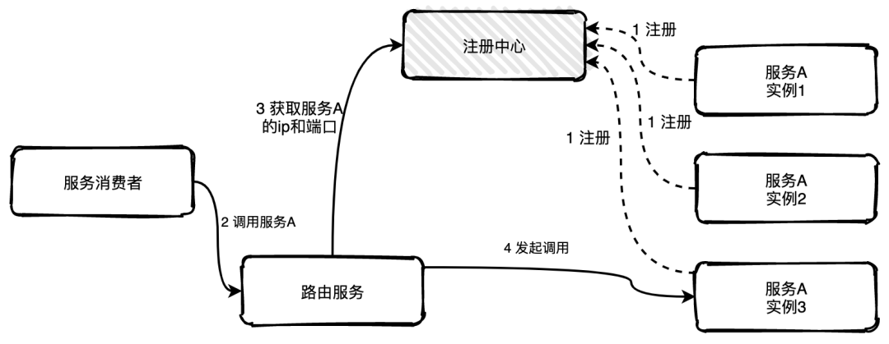


## 心跳机制

如果服务有多个实例，其中一个实例出现宕机，注册中心是可以实时感知到，并且将该实例信息从列表中移出，也称为摘机。如何实现摘机？业界比较常用的方式是通过心跳检测的方式实现，心跳检测有**主动**和**被动**两种方式。

### 被动检测

**被动检测**是指服务主动向注册中心发送心跳消息，时间间隔可自定义，比如配置5秒发送一次，注册中心如果在三个周期内比如说15秒内没有收到实例的心跳消息，就会将该实例从列表中移除。

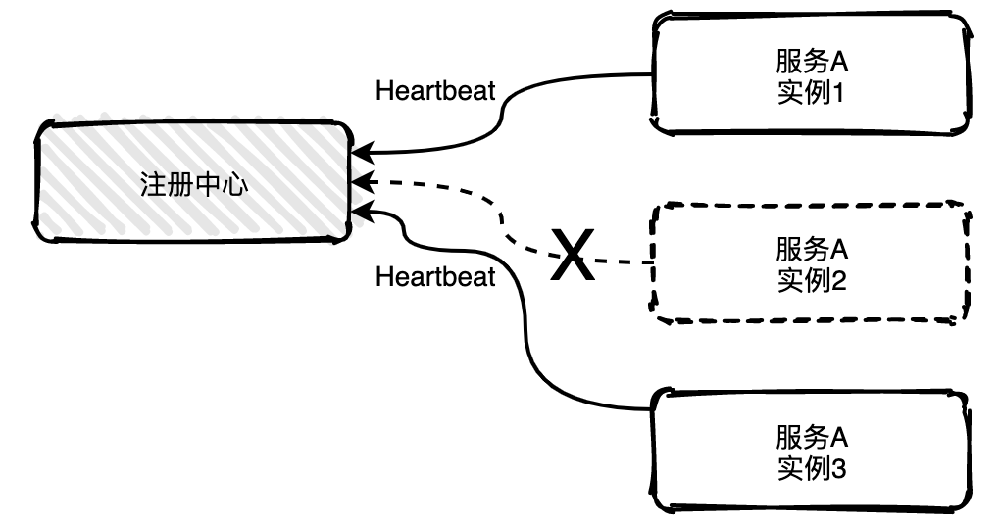

上图中服务A的实例2已经宕机不能主动给注册中心发送心跳消息，15秒之后注册就会将实例2移除掉。


### 主动检测

**主动检测**是注册中心主动发起，每隔几秒中会给所有列表中的服务实例发送心跳检测消息，如果多个周期内未发送成功或未收到回复就会主动移除该实例。

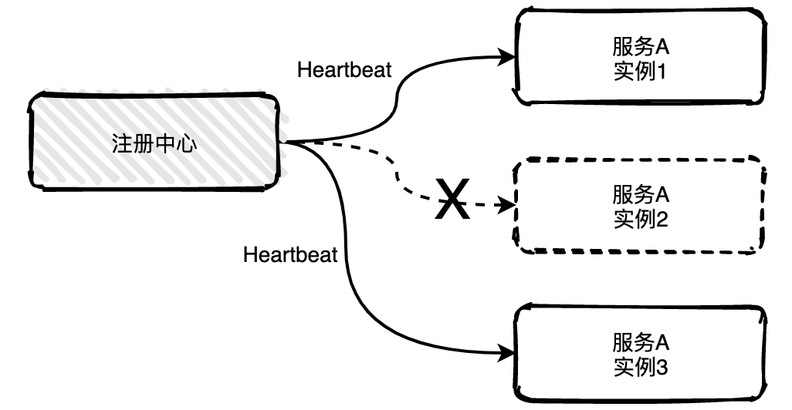


## Dubbo注册中心

### 核心功能

针对使用者，主要关注注册中心的以下五个核心接口，通过以下五个核心接口，可以实现服务的动态发布、动态发现以及优雅下线等操作：

- **注册服务**：将服务提供者的URL暴露至注册中心
- **注销服务**：从注册中心将服务提供者的地址进行摘除
- **订阅服务**：将从注册中心订阅需要消费的URL至本地,当注册中心的服务清单发展变化时,自动通知订阅者
- **退订服务**：取消向注册中心订阅的服务监听者
- **查找服务**：向注册中心查找指定的服务清单列表


### 生产特性

Zookeeper会有一些未知的问题出现，所以需要生产特性来应对各种可能出现的问题，从而提升产品的质量。该类功能针对使用者一般情况是没办法直接感受到，但其发挥的作用就是保障产品的高质量服务：

- **自动重连**：与Zookeeper或Redis的连接断开后，支持自动重新连接
- **自动切换**：与Zookeeper或Redis的连接失败后，支持自动切换
- **自动清理**：Zookeeper或Redis中的数据过期后，支持自动清理（超时自动摘除）
- **自动恢复**：与Zookeeper或Redis自动重连成功后，支持自动恢复（即再次发起注册、订阅或监听动作）
- **自动重试**：失败自动重试（注册、注销、订阅、退订、监听和取消监听失败，无限重试至成功为止）
- **自动缓存**：Client订阅的服务清单会自动离线缓存至JVM本地的文件（变更通知时更新）


## 业界方案

下面结合各个维度对比一下各组件：

| **方案**      | **优点**                                                     | **缺点**                                                     | **访问协议** | **一致性算法** |
| :------------ | :----------------------------------------------------------- | :----------------------------------------------------------- | :----------- | :------------- |
| **Zookeeper** | 1.功能强大，不仅仅只是服务发现；2.提供watcher机制可以实时获取服务提供者的状态；3.广泛使用，dubbo等微服务框架已支持 | 1.没有健康检查；2.需要在服务中引入sdk，集成复杂度高；3.不支持多数据中心 | TCP          | Paxos（CP）    |
| **Consul**    | 1.开箱即用，方便集成；2.带健康检查；3.支持多数据中心；4.提供web管理界面 | 不能实时获取服务变换通知                                     | HTTP/DNS     | Raft（CP）     |
| **Nacos**     | 1.开箱即用，适用于dubbo，spring cloud等；2.AP模型，数据最终一致性；3.注册中心，配置中心二合一(二合一也不一定是优点)，提供控制台管理；4.纯国产，各种有中文文档，久经双十一考验 | 刚刚开源不久，社区热度不够，依然存在bug                      | HTTP/DNS     | CP+AP          |
| **Eureka**    |                                                              |                                                              | HTTP         | AP             |


### Zookeeper

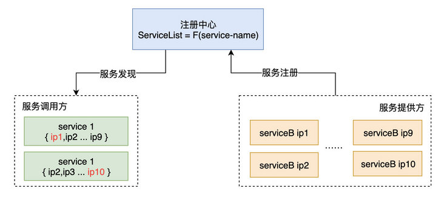


### Consul

Consul是HashiCorp公司推出的开源工，使用Go语言开发，具有开箱即可部署方便的特点。Consul是分布式的、高可用的、 可横向扩展的用于实现分布式系统的服务发现与配置。


**Consul有哪些优势？**

- 服务注册发现：Consul提供了通过DNS或者restful接口的方式来注册服务和发现服务。服务可根据实际情况自行选择
- 健康检查：Consul的Client可以提供任意数量的健康检查，既可以与给定的服务相关联，也可以与本地节点相关联
- 多数据中心：Consul支持多数据中心，这意味着用户不需要担心Consul自身的高可用性问题以及多数据中心带来的扩展接入等问题


**Consul的架构图**

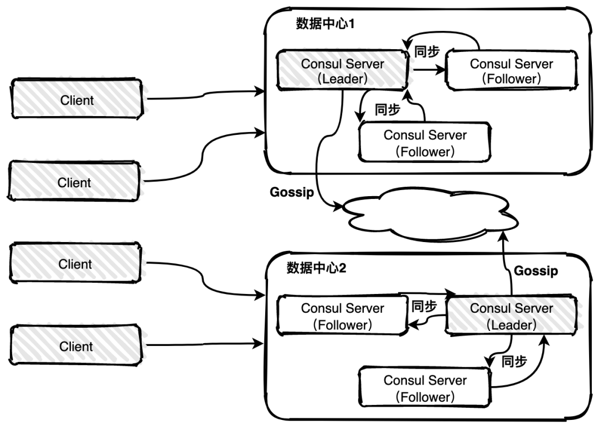

Consul 实现多数据中心依赖于gossip protocol协议。这样做的目的：

- 不需要使用服务器的地址来配置客户端；服务发现是自动完成的
- 健康检查故障的工作不是放在服务器上，而是分布式的


**Consul的使用场景**

Consul的应用场景包括**服务注册发现**、**服务隔离**、**服务配置**等。

- **服务注册发现场景**中consul作为注册中心，服务地址被注册到consul中以后，可以使用consul提供的dns、http接口查询，consul支持health check

- **服务隔离场景**中consul支持以服务为单位设置访问策略，能同时支持经典的平台和新兴的平台，支持tls证书分发，service-to-service加密

- **服务配置场景**中consul提供key-value数据存储功能，并且能将变动迅速地通知出去，借助Consul可以实现配置共享，需要读取配置的服务可以从Consul中读取到准确的配置信息


### Nacos


# API网关

**API网关是什么？**

API网关是随着微服务（Microservice）概念兴起的一种架构模式。原本一个庞大的单体应用（All in one）业务系统被拆分成许多微服务（Microservice）系统进行独立的维护和部署，服务拆分带来的变化是API的规模成倍增长，API的管理难度也在日益增加，使用API网关发布和管理API逐渐成为一种趋势。一般来说，API网关是运行于外部请求与内部服务之间的一个流量入口，实现对外部请求的协议转换、鉴权、流控、参数校验、监控等通用功能。


**为什么要做API网关？**

在没有API网关之前，业务研发人员如果要将内部服务输出为对外的HTTP API接口。通常要搭建一个Web应用，用于完成基础的鉴权、限流、监控日志、参数校验、协议转换等工作，同时需要维护代码逻辑、基础组件的升级，研发效率相对比较低。此外，每个Web应用都需要维护机器、配置、数据库等，资源利用率也非常差。

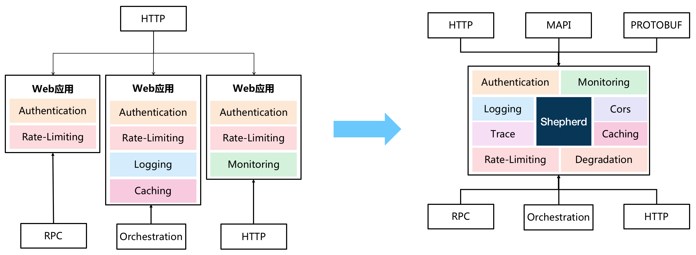


**Tomcat自身问题**

- **缓存太多**。Tomcat用了很多对象池技术，内存有限的情况下，流量一高很容易触发gc

- **内存copy**。Tomcat默认用堆内存，所以数据需要读到堆内，而后端服务是Netty，有堆外内存，需要通过数次copy

- **Tomcat读body是阻塞的**。Tomcat的NIO模型和Reactor模型不一样，读body是Block的
- **Tomcat对链接重用的次数是有限制的**。默认是100次，当达到100次后，Tomcat会通过在响应头里添加Connection:close，让客户端关闭该链接，否则如果再用该链接发送的话，会出现400

**Tomcat Buffer**

Tomcat buffer 的关系图如下：

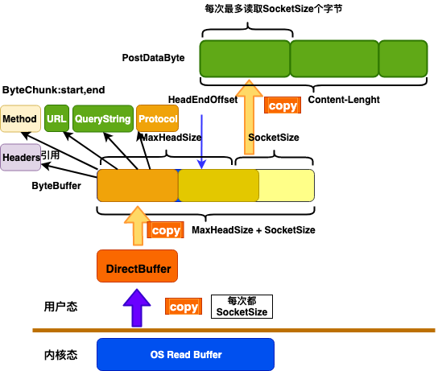

通过上面的图，我们可以看出，Tomcat 对外封装的很好，内部默认的情况下会有三次 copy。


## 基本功能

- **反向代理**：类似于Nginx效果，实现外部HTTP请求反向代理转为内部RPC请求进行转发
- **动态发现**：加入后端微服务中心，实现动态发现后端服务实例
- **负载均衡**：根据后端服务的实例列表进行负载均衡分配
- **服务路由**：可以根据请求URL中的参数进行不同服务的调用路由


## 功能设计

### API发布

使用API网关的控制面，业务研发人员可以轻松的完成API的全生命周期管理，如下图所示：

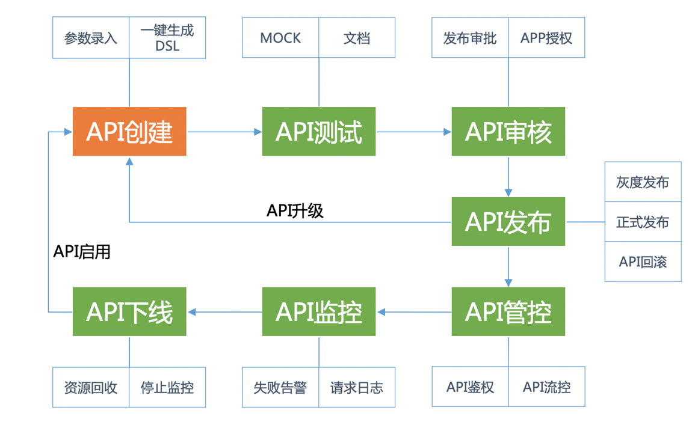

业务研发人员从创建API开始，完成参数录入、DSL脚本生成；接着可以通过文档和MOCK功能进行API测试；API测试完成后，为了保证上线稳定性，管理平台提供了发布审批、灰度上线、版本回滚等一系列安全保证措施；API运行期间会监控API的调用失败情况、记录请求日志，一旦发现异常及时发出告警；最后，对于不再使用的API进行下线操作后，会回收API所占用的各类资源并等待重新启用。整个生命周期，全部通过配置化、流程化的方式，由业务研发人员全自助管理，上手时间基本在10分钟以内，极大地提升了研发效率。


### 配置中心

API网关的配置中心存放API的相关配置信息——使用自定义的DSL（Domain-Specific Language，领域专用语言）来描述，用于向API网关的数据面下发API的路由、规则、组件等配置变更。配置中心的设计上使用统一配置管理服务和本地缓存结合的方式，实现动态配置，不停机发布。API的配置如下图所示：

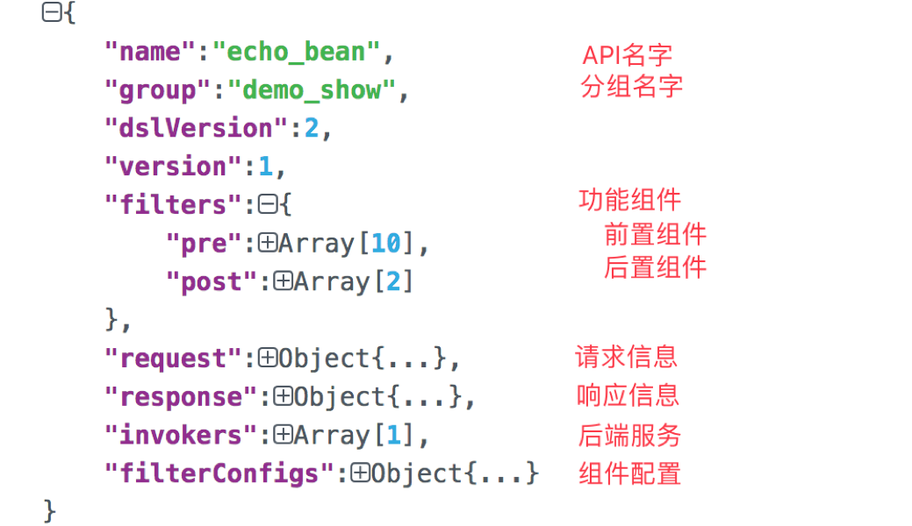

API配置的详细说明

- **Name、Group**：名字、所属分组
- **Request**：请求的域名、路径、参数等信息
- **Response**：响应的结果组装、异常处理、Header、Cookies信息
- **Filters、FilterConfigs**：API使用到的功能组件和配置信息
- **Invokers**：后端服务(RPC/HTTP/Function)的请求规则和编排信息


### API路由

API网关的数据面在感知到API配置后，会在内存中建立请求路径与API配置的路由信息。通常HTTP请求路径上，会包含一些路径变量，考虑到性能问题，没有采用正则匹配的方式，而是设计了两种数据结构来存储。如下图所示：

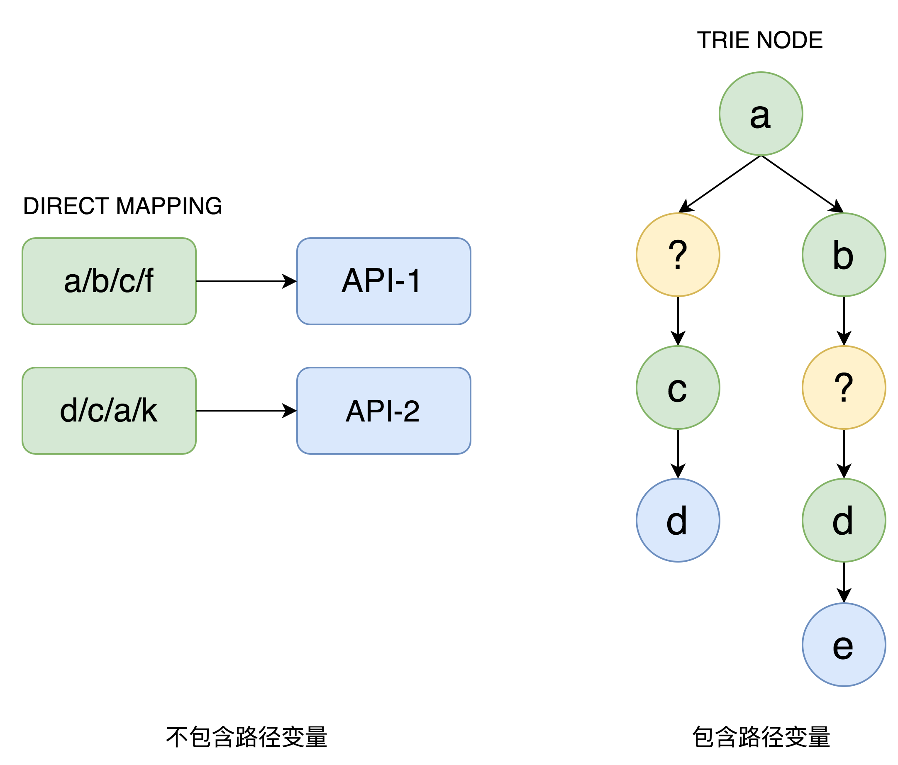

一种是不包含路径变量的直接映射的MAP结构。其中，Key就是完整的域名和路径信息，Value是具体的API配置。

另外一种是包含路径变量的前缀树数据结构。通过前缀匹配的方式，先进行叶子节点精确查找，并将查找节点入栈处理，如果匹配不上，则将栈顶节点出栈，再将同级的变量节点入栈，如果仍然找不到，则继续回溯，直到找到（或没找到）路径节点并退出。


### 功能组件

当请求流量命中API请求路径进入服务端，具体处理逻辑由DSL中配置的一系列功能组件完成。网关提供了丰富的功能组件集成，包括链路追踪、实时监控、访问日志、参数校验、鉴权、限流、熔断降级、灰度分流等，如下图所示：

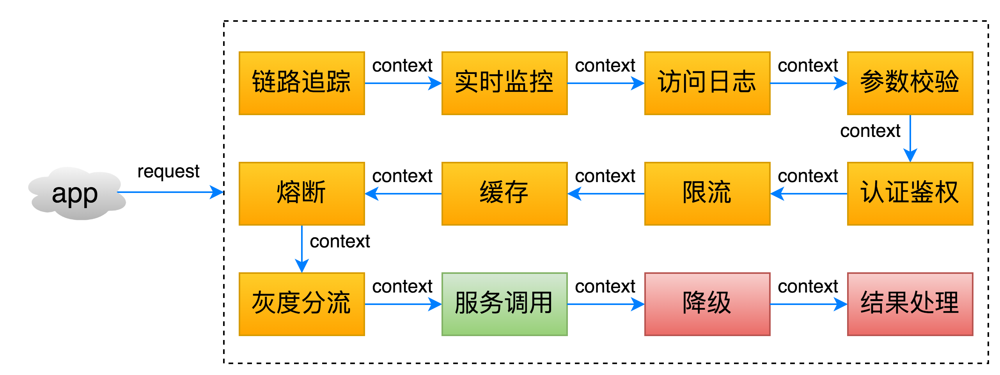


### 协议转换&服务调用

API调用的最后一步，就是协议转换以及服务调用了。网关需要完成的工作包括：获取HTTP请求参数、Context本地参数，拼装后端服务参数，完成HTTP协议到后端服务的协议转换，调用后端服务获取响应结果并转换为HTTP响应结果。

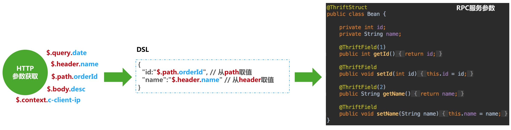

上图以调用后端RPC服务为例，通过JsonPath表达式获取HTTP请求不同部位的参数值，替换RPC请求参数相应部位的Value，生成服务参数DSL，最后借助RPC泛化调用完成本次服务调用。


### 高性能设计

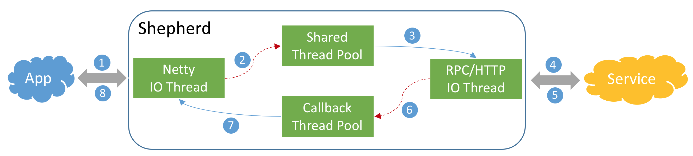


### 稳定性保障

提供了一些常规的稳定性保障手段，来保证自身和后端服务的可用性。如下图所示：

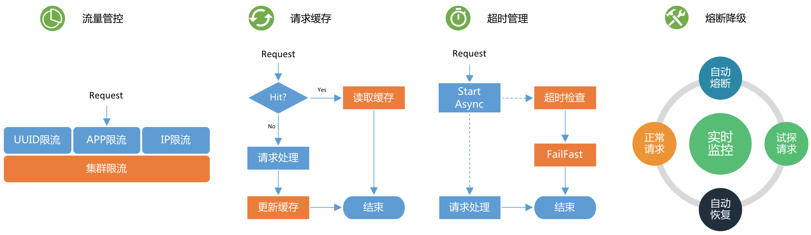

- **流量管控**：从用户自定义UUID限流、App限流、IP限流、集群限流等多个维度提供流量保护
- **请求缓存**：对于一些幂等的、查询频繁的、数据及时性不敏感的请求，业务研发人员可开启请求缓存功能
- **超时管理**：每个API都设置了处理超时时间，对于超时的请求，进行快速失败的处理，避免资源占用
- **熔断降级**：支持熔断降级功能，实时监控请求的统计信息，达到配置的失败阈值后，自动熔断，返回默认值


### 故障自愈

API网关服务端接入了弹性伸缩模块，可根据CPU等指标进行快速扩容、缩容。除此之外，还支持快速摘除问题节点，以及更细粒度的问题组件摘除。

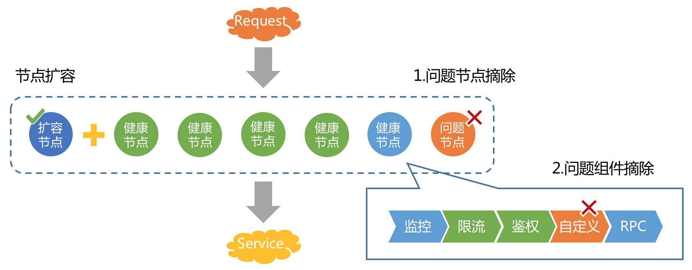


### 可迁移

对于一些已经在对外提供API的Web服务，业务研发人员为了减少运维成本和后续的研发提效，考虑将其迁移到API网关。对于一些非核心API，可以考虑使用灰度发布功能直接迁移。但是对于一些核心API，上面的灰度发布功能是机器级别的，粒度较大，不够灵活，不能很好的支持灰度验证过程。


**解决方案**

API网关为业务研发人员提供了一个灰度SDK，接入SDK的Web服务，可在识别灰度流量后转发到API网关进行验证。灰度哪些API、灰度百分比可以在API网关管理端动态调节，实时生效，业务研发人员还可以通过SPI的方式自定义灰度策略。灰度验证通过后，再把API迁移到API网关，保障迁移过程的稳定性。


**灰度过程**

**灰度前**：在API网关管理平台创建API分组，域名配置为目前使用的域名。在Oceanus上，原域名规则不变。

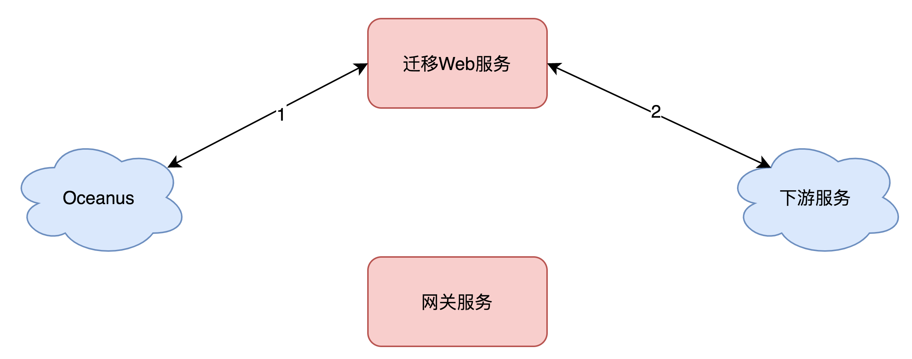

**灰度中**：在API网关管理平台开启灰度功能，灰度SDK将灰度流量转发到网关服务，进行验证。

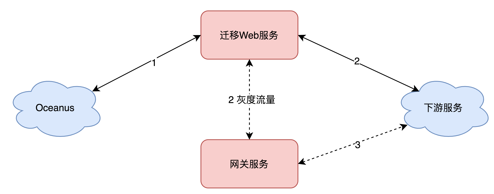

**灰度后**：通过灰度流量验证API网关上的API配置符合预期后再迁移。


### 自动生成DSL

业务研发人员在实际使用网关管理平台时，我们尽量通过图形化的页面配置来减轻DSL的编写负担。但服务参数转换的DSL配置，仍然需要业务研发人员手工编写。一般来说，生成服务参数DSL的流程是：

- 引入服务的接口包依赖
- 拿到服务参数类定义
- 编写Testcase生成JSON模板
- 填写参数映射规则
- 最后手工录入管理平台，发布API

整个过程非常繁琐，且容易出错。如果需要录入的API多达几十上百个，全部由业务研发人员手工录入的效率是非常低下的。


**解决方案**

那么能不能将服务参数DSL的生成过程给自动化呢？ 答案是可以的，业务RD只需在网关录入API文档信息，然后录入服务的Appkey、服务名、方法名信息，API网关管理端会从最新发布的服务框架控制台获取到服务参数的JSON Schema信息，JSON Schema定义了服务参数的类型和结构信息，管理端可根据这些信息，自动生成服务参数的JSON Mock数据。结合API文档的信息，自动替换参数名相同的Value值。 这套DSL自动生成方案，使用过程中对业务透明、标准化，业务方只需升级最新版本服务框架即可使用，极大提升研发效率，目前受到业务研发人员的广泛好评。

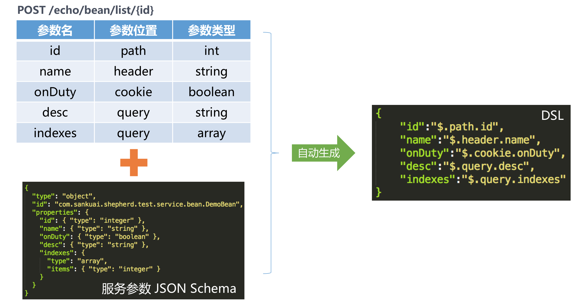


### API操作提效

**快速创建API**

API网关的核心能力是建立在API配置的基础上的，但提供强大功能的同时带来了较高的复杂性，不少业务研发人员吐槽API配置太繁琐，学习成本高。快速创建API的功能应运而生，业务研发人员只需要提供少量的信息就可以创建API。快速创建API的功能当前分为4种类型（后端RPC服务API、后端HTTP服务API、SSO CallBack API、Nest API），未来会根据业务应用场景的不同，提供更多的快速创建API类型。


**批量操作**

业务研发人员在API网关上，需要管理非常多的业务分组，每个业务分组，最多可以有200个API配置，多个API可能有很多相同的配置，如组件配置，错误码配置和跨域配置的。每个API对于相同的配置都要配置一遍，操作重复度很高。因此API网关支持批量操作多个API：勾选多个API后，通过【批量操作】功能可一次性完成多个API配置更新，降低业务重复配置的操作成本。


**API导入导出**

API网关提供在不同研发环境相互导入导出API的能力，业务研发人员在线下测试完成后，只需要使用API导入导出功能，即可将配置导出到线上生产环境，避免重复配置。


### 自定义组件

API网关提供了丰富的系统组件完成鉴权、限流、监控能力，能够满足大部分的业务需求。但仍有一些特殊的业务需求，如自定义验签、自定义结果处理等。API网关通过提供加载自定义组件能力，支持业务完成一些自定义逻辑的扩展。下图是自定义组件实现的一个实例。getName中填写自定义组件申请时的名称，invoke方法中实现自定义组件的业务逻辑，如继续执行、进行页面跳转、直接返回结果、抛出异常等。

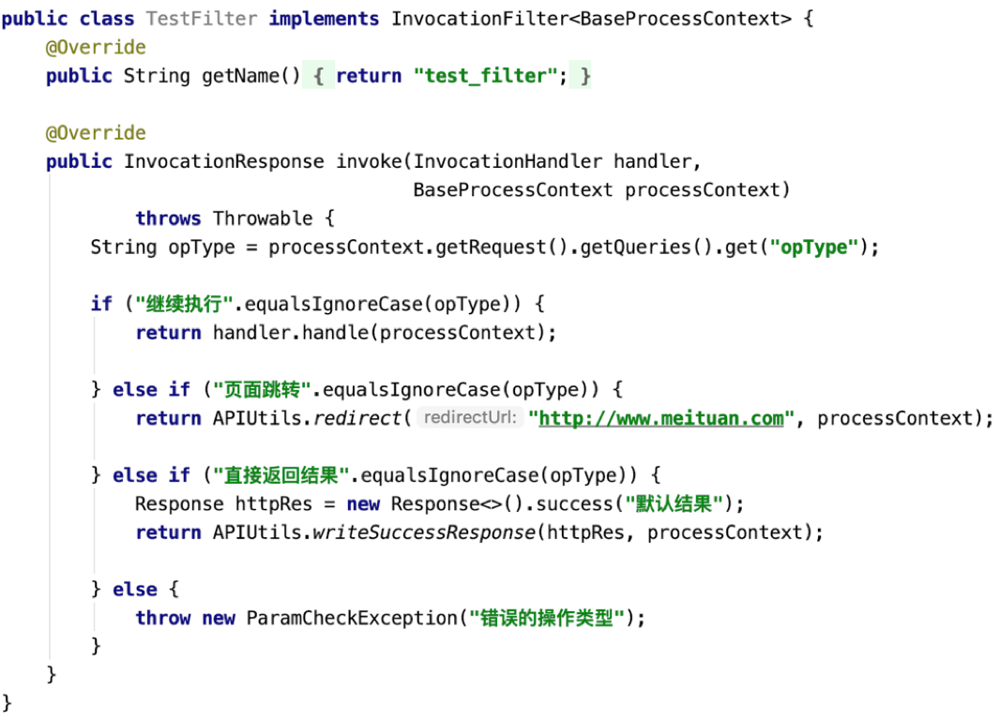


### 服务编排

一般情况下，网关上配置的一个API对应后端一个RPC或者HTTP服务。如果调用端有聚合和编排后端服务的需求，那么有多少后端服务，就必须发起多少次HTTP的请求调用。由此就会带来一些问题，调用端的HTTP请求次数过多，效率低，在调用端聚合服务的逻辑过重。

服务编排的需求应运而生，服务编排是对既有服务进行编排调用，同时对获取的数据进行处理。主要应用在数据聚合场景：一次HTTP请求返回的数据需要调用多个或多次服务（RPC或HTTP）才能获取到完整的结果。

通过独立部署的方式提供服务编排能力，API网关与服务编排服务之间通过RPC进行调用。这样可以解耦API网关与服务编排服务，避免因服务编排能力影响集群上的其他服务，同时多一次RPC调用并不会有明显耗时增加。使用上对业务研发人员也是透明的，非常方便，业务研发人员在管理端配置好服务编排的API，通过配置中心同时下发到API网关服务端和服务编排服务上，即可开始使用服务编排能力。整体的交互架构图如下：

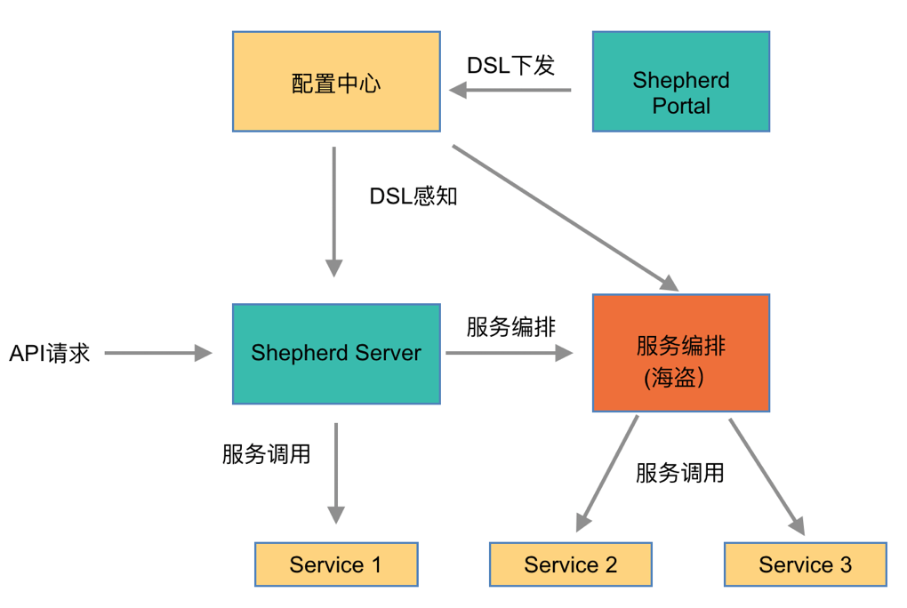


## 流量治理

### API鉴权

请求安全是API网关非常重要的能力，集成了丰富的安全相关的系统组件，包括有基础的请求签名、SSO单点登录、基于SSO鉴权的UAC/UPM访问控制、用户鉴权Passport、商家鉴权EPassport、商家权益鉴权、反爬等等。业务研发人员只需要简单配置，即可使用。


### 黑白名单

### 流量控制

### 熔断器

### 服务降级

### 流量调度

### 流量Copy

### 流量预热


### 集群隔离

API网关按业务线维度进行集群隔离，也支持重要业务独立部署。如下图所示：

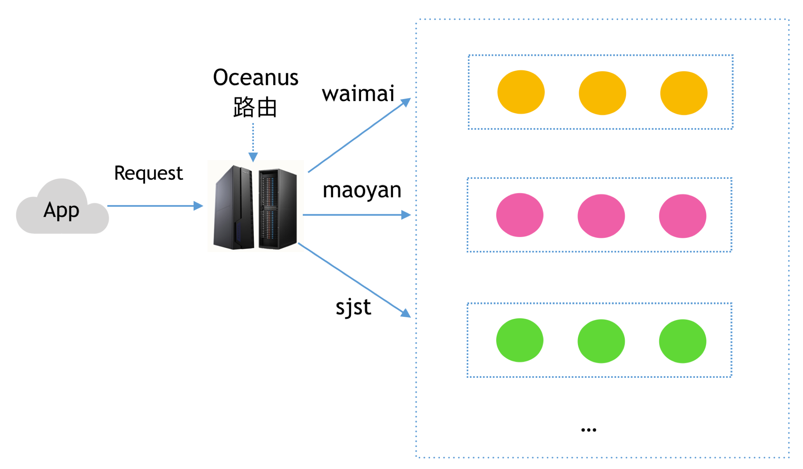


### 请求隔离

服务节点维度，API网关支持请求的快慢线程池隔离。快慢线程池隔离主要用于一些使用了同步阻塞组件的API，例如SSO鉴权、自定义鉴权等，可能导致长时间阻塞共享业务线程池。快慢隔离的原理是统计API请求的处理时间，将请求处理耗时较长，超过容忍阈值的API请求隔离到慢线程池，避免影响其他正常API的调用。除此之外，也支持业务研发人员配置自定义线程池进行隔离。具体的线程隔离模型如下图所示：


### 灰度发布

API网关作为请求入口，往往肩负着请求流量灰度验证的重任。

**灰度场景**

在灰度能力上，支持灰度API自身逻辑，也支持灰度下游服务，也可以同时灰度API自身逻辑和下游服务。如下图所示：

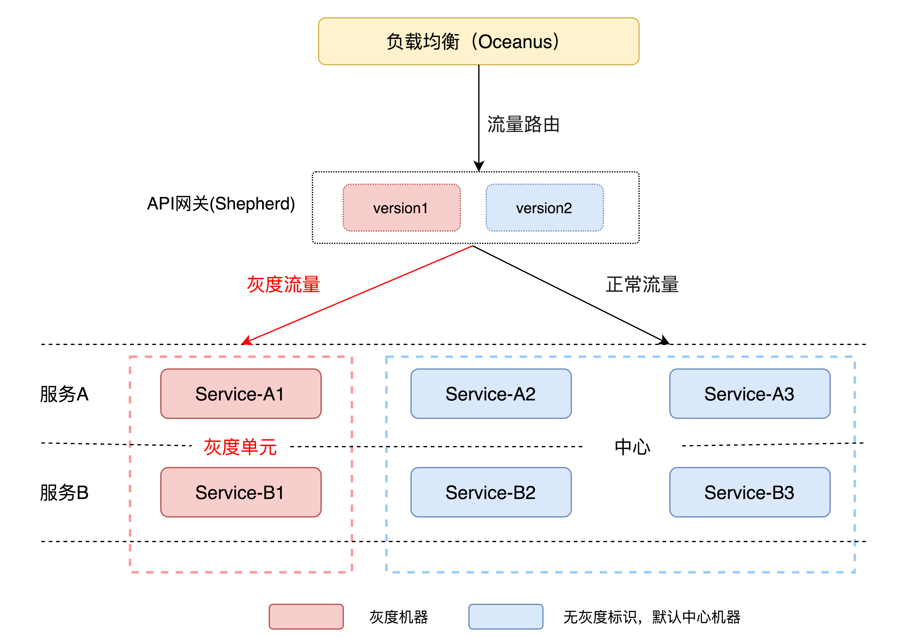

灰度API自身逻辑时，通过将流量分流到不同的API版本实现灰度能力；灰度下游服务时，通过给流量打标，分流到指定的下游灰度单元中。


**灰度策略**

支持丰富的灰度策略，可以按照比例数灰度，也可以按照特定条件灰度。


## 监控告警

### 立体化监控

API网关提供360度的立体化监控，从业务指标、机器指标、JVM指标提供7x24小时的专业守护，如下表：

|      | 监控模块        | 主要功能                                                     |
| :--- | :-------------- | :----------------------------------------------------------- |
| 1    | 统一监控Raptor  | 实时上报请求调用信息、系统指标，负责应用层（JVM）监控、系统层（CPU、IO、网络）监控 |
| 2    | 链路追踪Mtrace  | 负责全链路参数透传、全链路追踪监控                           |
| 3    | 日志监控Logscan | 监控本地日志异常关键字：如5xx状态码、空指针异常等            |
| 4    | 远程日志中心    | API请求日志、Debug日志、组件日志等可上报远程日志中心         |
| 5    | 健康检查Scanner | 对网关节点进行心跳检测和API状态检测，及时发现异常节点和异常API |


### 多维度告警

有了全面的监控体系，自然少不了配套的告警机制，主要的告警能力包括：

|      | 告警类型         | 触发时机                                            |
| :--- | :--------------- | :-------------------------------------------------- |
| 1    | 限流告警         | API请求达到限流规则阈值触发限流告警                 |
| 2    | 请求失败告警     | 鉴权失败、请求超时、后端服务异常等触发请求失败告警  |
| 3    | 组件异常告警     | 自定义组件处理耗时长、失败率高告警                  |
| 4    | API异常告警      | API发布失败、API检查异常时触发API异常告警           |
| 5    | 健康检查失败告警 | API心跳检查失败、网关节点不通时触发健康检查失败告警 |


## 关键设计

### 异步外调

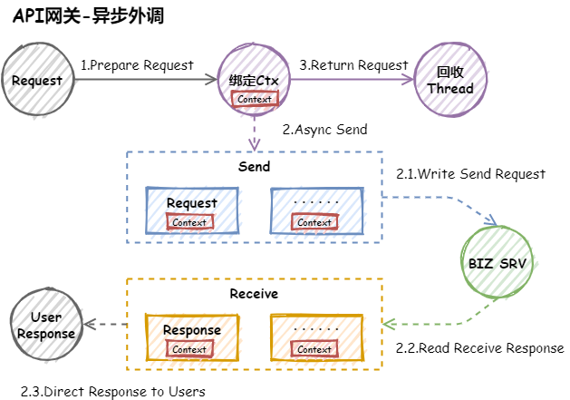

基于Netty实现异步外调主要有两种方式可以实现：

- **方式一：建立全局Map，上线文传递（不参与远程传输）requestId，响应时使用requestId进行映射上游信息**
- **方式二：直接将上游信息包装成Context进行上线文传递（不参与远程传输）**

方式一需要独立维护一个全局映射表，同时需要考虑请求超时和丢失的情况，否则会出现内存不断增长问题。


### 外调链接池化

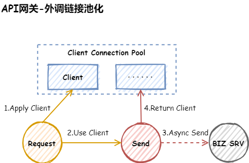

使用Netty实现API网关外调微服务时，因建立连接需要极度消耗资源，所以需要考虑将外调的链接进行池化管理，设计时需要注意以下几点：

- **初始化适当连接（过多过少都不适合）**
- **考虑连接能随流量增减而进行自动扩缩容**
- **取出的连接需要检查是否可用**
- **连接需要考虑双向心跳探测**


### 释放连接

http的链接是独占的，所以在释放的时候要特别小心，一定要等服务端响应完了才能释放，还有就是链接关闭的处理也要小心，总结如下几点：

- Connection:close
- 空闲超时，关闭链接
- 读超时关闭链接
- 写超时，关闭链接
- Fin，Reset


- **写超时**：writeAndFlush包含Netty的encode时间和从队列里把请求发出去即flush的时间。因此后端超时开始需要在真正flush成功后开始计时，这样才最接近服务端超时时间（还有网络往返时间和内核协议栈处理时间）


### 对象池化设计

针对高并发系统，频繁创建对象不仅有分配内存开销，还对gc会造成压力。因此在实现时，会对频繁使用的对象（如线程池的任务task，StringBuffer等）进行重写，减少频繁的申请内存的开销。


### 上下文切换

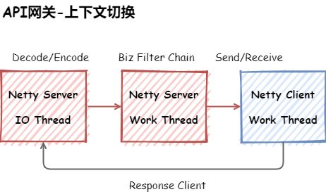

整个网关没有涉及到IO操作，但在IO编解码和业务逻辑都用了异步，是有两个原因

- 防止开发写的代码有阻塞
- 业务逻辑打日志可能会比较多

在突发的情况下，但是我们在push线程时，支持用Netty的IO线程替代，这里做的工作比较少，这里由异步修改为同步后（通过修改配置调整），CPU的上下文切换减少20%，进而提高了整体的吞吐量，就是不能为了异步而异步，Zuul2的设计类似。


### 监控告警

**协议层**

- **攻击性请求**。只发头，不发/发部分body，采样落盘，还原现场，并报警
- **Line or Head or Body过大的请求**。采样落盘，还原现场，并报警


**应用层**

- **耗时监控**。有慢请求，超时请求，以及tp99，tp999等
- **QPS监控和报警**
- **带宽监控和报警**。支持对请求和响应的行、头、body单独监控
- **响应码监控**。特别是400和404
- **链接监控**。对接入端的链接，以及和后端服务的链接，后端服务链接上待发送字节大小也都做了监控
- **失败请求监控**
- **流量抖动报警**。流量抖动要么是出了问题，要么就是出问题的前兆


## 解决方案

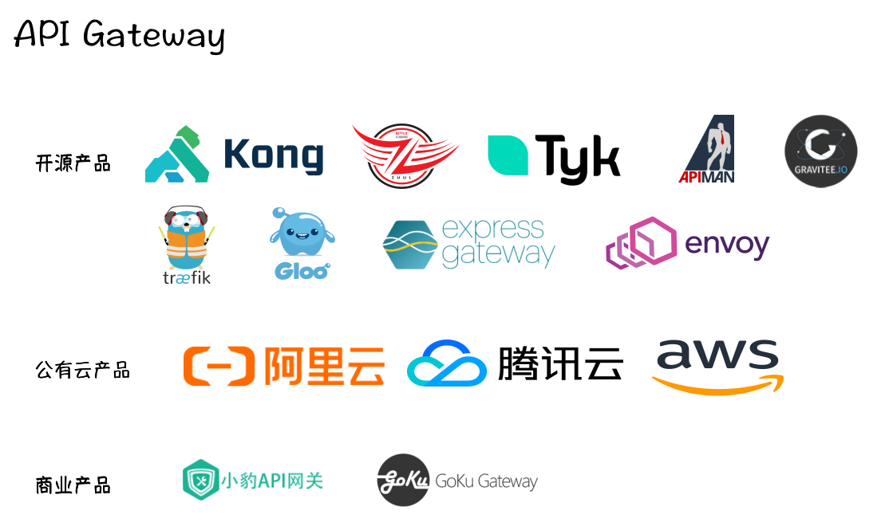

### Shepherd API网关


### Mashape Kong

**访问地址**：https://github.com/Kong/kong

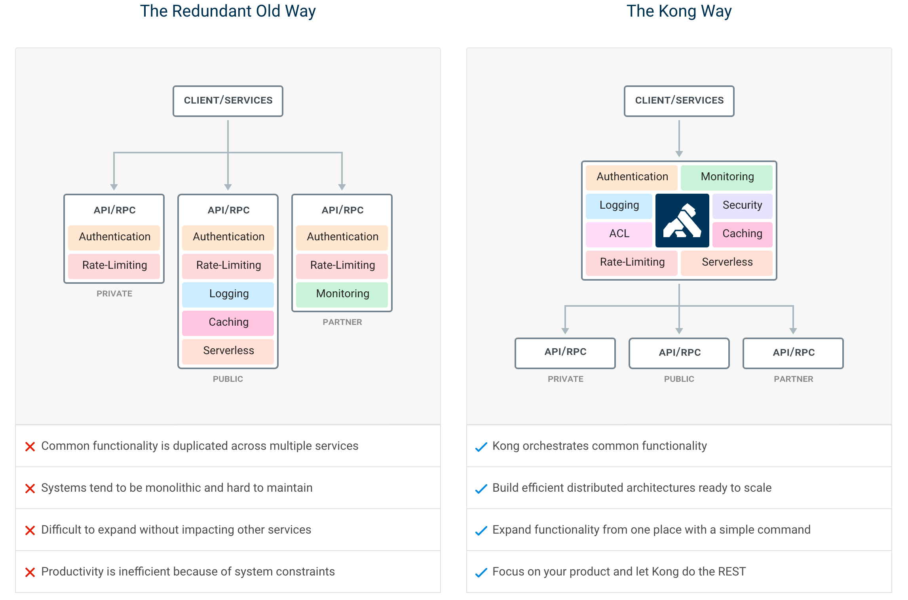


### Soul

**访问地址**：https://github.com/Dromara/soul


### Apiman

**访问地址**：https://apiman.gitbooks.io/apiman-user-guide/user-guide/gateway/policies.html


### Gravitee

**访问地址**：https://docs.gravitee.io/apim_policies_latency.html


### Tyk

**访问地址**：https://tyk.io/docs


### Traefik

**访问地址**：https://traefik.cn

Træfɪk 是一个为了让部署微服务更加便捷而诞生的现代HTTP反向代理、负载均衡工具。 它支持多种后台 (Docker, Swarm, Kubernetes, Marathon, Mesos, Consul, Etcd, Zookeeper, BoltDB, Rest API, file…) 来自动化、动态的应用它的配置文件设置。


**功能特性**

- 它非常快
- 无需安装其他依赖，通过Go语言编写的单一可执行文件
- 支持 Rest API
- 多种后台支持：Docker, Swarm, Kubernetes, Marathon, Mesos, Consul, Etcd, 并且还会更多
- 后台监控, 可以监听后台变化进而自动化应用新的配置文件设置
- 配置文件热更新。无需重启进程
- 正常结束http连接
- 后端断路器
- 轮询，rebalancer 负载均衡
- Rest Metrics
- 支持最小化官方docker 镜像
- 后台支持SSL
- 前台支持SSL（包括SNI）
- 清爽的AngularJS前端页面
- 支持Websocket
- 支持HTTP/2
- 网络错误重试
- 支持Let’s Encrypt (自动更新HTTPS证书)
- 高可用集群模式


### 小豹API网关

**访问地址**：http://www.xbgateway.com

小豹API网关（企业级API网关），统一解决：认证、鉴权、安全、流量管控、缓存、服务路由，协议转换、服务编排、熔断、灰度发布、监控报警等。

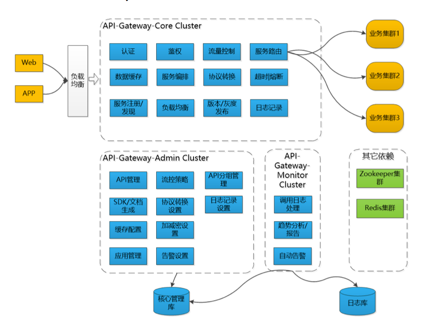


### Others

- Orange：http://orange.sumory.com
- gateway：https://github.com/fagongzi/gateway


# 服务编排

## DSL设计

为了实现服务编排，需要定义一个数据结构来描述服务之间的依赖关系、调用顺序、调用服务的入参和出参等等。之后对获取的结果进行处理，也需要在这个数据结构中具体描述对什么样的数据进行怎么样的处理等等。所以需要定义一套DSL（领域特定语言）来描述整个服务编排的蓝图。


## 架构设计

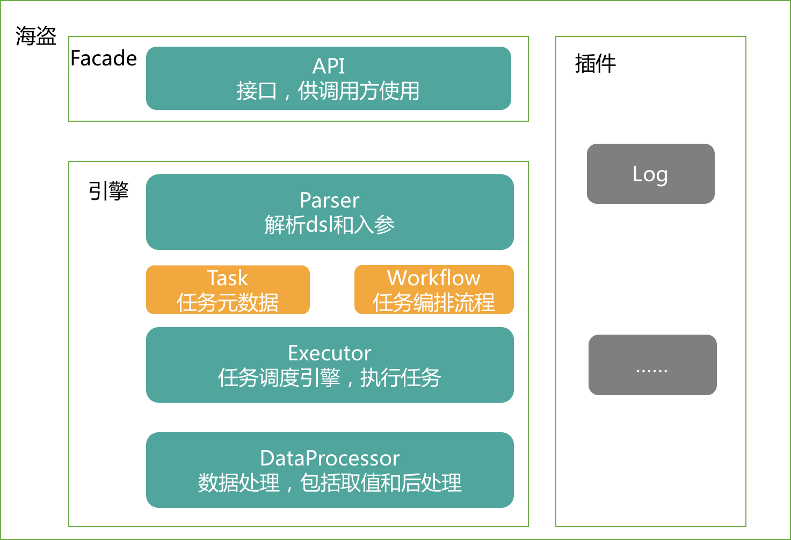

- Facade：对外提供统一接口，供客户端调用
- Parser：对于输入的DSL进行解析，解析成内部流转的数据结构，同时得到所有的task，并且构建task调用逻辑树
- Executor：真实发起调用的模块，目前支持平台内部的RPC和HTTP调用方式，同时对HTTP等其它协议有良好的扩展性
- DataProcessor：数据后处理。这边会把所有接口拿到的数据转换层客服场景这边需要的数据，并且通过设计的一些内部函数，可以支持一些如数据半脱敏等功能
- 组件插件化：对日志等功能实现可插拔，调用方可以自定义这些组件，即插即用


## 主要特点

主要特点如下：

- 采用去中心化设计思路，引擎集成在SDK中。方案通用化，每个需要业务数据的场景都可以通过框架直接调用数据提供方
- 服务编排支持并行和串行调用，使用方可以根据实际场景自己构造服务调用树。通过DSL的方式把之前硬编码组装的逻辑实现了配置化，然后通过框架引擎把能并行调用的服务都执行了并行调用，数据使用方不用再自己处理性能优化
- 使用JSON DSL 描述整个工作蓝图，简单易学
- 支持JSONPath语法对服务返回的结果进行取值
- 支持内置函数和自定义指令（语法参考ftl）对取到的元数据进行处理，得到需要的最终结果
- 编排服务树可视化


# 服务降级

什么是服务降级？当服务器压力剧增的情况下，可以将一些**不重要**或**不紧急**服务**暂停使用**或**延迟使用**，从而释放服务器资源以保证核心服务的正常运作或高效运作。服务降级的设计架构图如下：

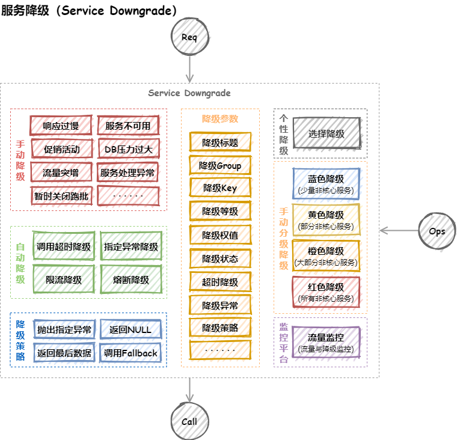

## 使用场景

服务降级主要用于什么场景呢？当整个微服务架构整体的负载超出了预设的上限阈值或即将到来的流量预计将会超过预设的阈值时，为了保证重要或基本的服务能正常运行，我们可以将一些 **不重要** 或 **不紧急** 的服务或任务进行服务的 **延迟使用** 或 **暂停使用**。


## 服务降级要考虑的问题

- 核心和非核心服务
- 是否支持降级，降级策略
- 业务放通的场景，策略


# 断路器

熔断机制是应对雪崩效应的一种微服务链路保护机制。当链路的某个微服务出错不可用或者响应时间太长时，会进行服务的降级，进而熔断该节点微服务的调用，快速返回错误的响应信息。当检测到该节点微服务调用响应正常后，恢复调用链路。服务断路器的设计架构图如下：

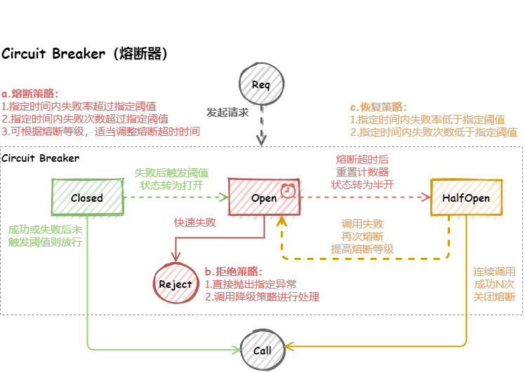


## 断路器状态

服务调用方为每一个调用服务 (调用路径) 维护一个状态机，在这个状态机中有`3`种状态：

- `CLOSED`：默认状态。断路器观察到请求失败比例没有达到阈值，断路器认为被代理服务状态良好
- `OPEN`：断路器观察到请求失败比例已经达到阈值，断路器认为被代理服务故障，打开开关，请求不再到达被代理的服务，而是快速失败
- `HALF OPEN`：断路器打开后，为了能自动恢复对被代理服务的访问，会切换到半开放状态，去尝试请求被代理服务以查看服务是否已经故障恢复。如果成功，会转成`CLOSED`状态，否则转到`OPEN`状态


## 熔断策略

- **指定时间内失败率超过指定阈值**
- **指定时间内失败次数超过指定阈值**
- **可根据熔断等级，适当调整熔断超时时间**


## 恢复策略

- **指定时间内失败率低于指定阈值**
- **指定时间内失败次数低于指定阈值**

## 拒绝策略

- **直接抛出指定异常**
- **调用降级策略进行处理**


## 常见问题

使用断路器需要考虑一些问题：

- 针对不同的异常，定义不同的熔断后处理逻辑
- 设置熔断的时长，超过这个时长后切换到`HALF OPEN`进行重试
- 记录请求失败日志，供监控使用
- 主动重试，比如对于`connection timeout`造成的熔断，可以用异步线程进行网络检测，比如`telenet`，检测到网络畅通时切换到`HALF OPEN`进行重试
- 补偿接口，断路器可以提供补偿接口让运维人员手工关闭
- 重试时，可以使用之前失败的请求进行重试，但一定要注意业务上是否允许这样做


## 使用场景

- 服务故障或者升级时，让客户端快速失败
- 失败处理逻辑容易定义
- 响应耗时较长，客户端设置的`read timeout`会比较长，防止客户端大量重试请求导致的连接、线程资源不能释放


# 链路追踪

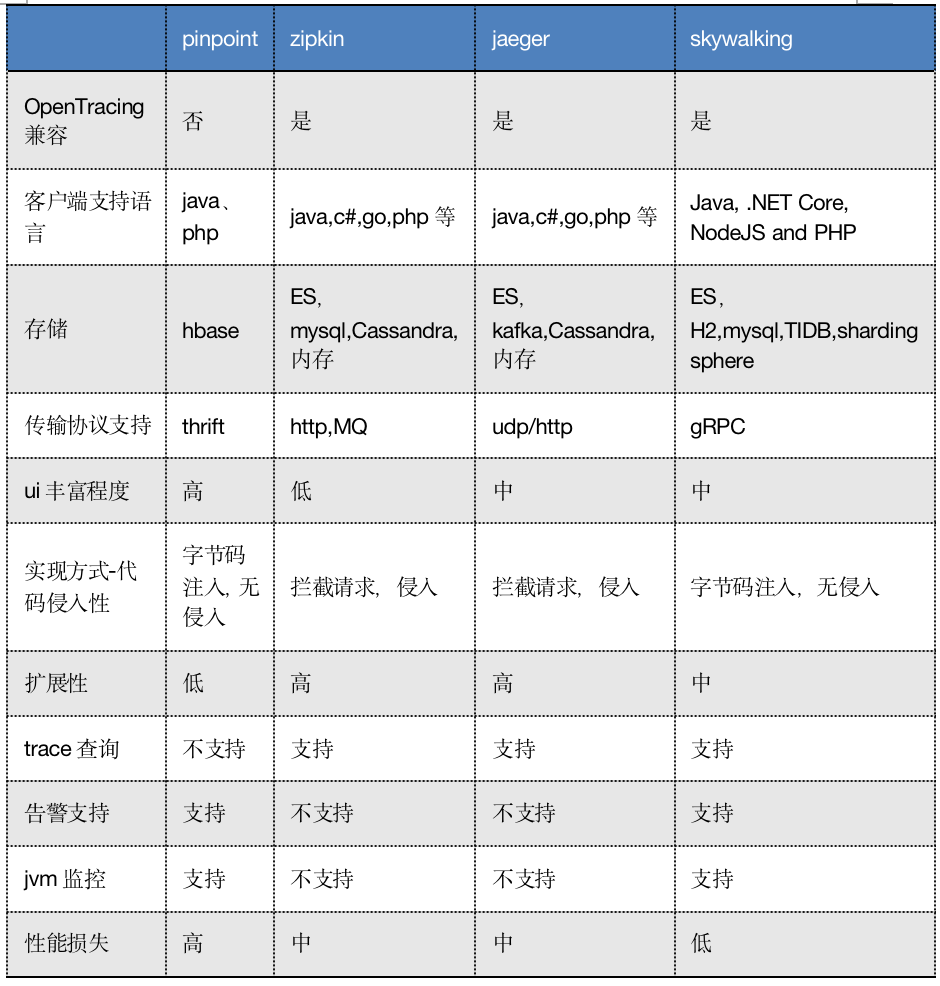

## ThreadContext

`NDC`（Nested Diagnostic Context）和`MDC`（Mapped Diagnostic Context）是`log4j`种非常有用的两个类，它们用于存储应用程序的上下文信息（Context Infomation），从而便于在`log`中使用这些上下文信息。`NDC`采用了一个类似栈的机制来push和pop上下文信息，每一个线程都独立地储存上下文信息。比如说一个servlet就可以针对每一个request创建对应的NDC，储存客户端地址等等信息。`MDC`和`NDC`非常相似，所不同的是`MDC`内部使用了类似map的机制来存储信息，上下文信息也是每个线程独立地储存，所不同的是信息都是以它们的key值存储在”map”中。

NDC和MDC的原理是用了java的ThreadLocal类。可以针对不同线程存储信息。但是今天在log4j2上使用时发现没有找到NDC和MDC。查找官方文档，原来是换成了ThreadContext。

微服务架构中的链路追踪主要是用于快速定位故障点，使用MDC方式来将每一笔交易产生的所有日志都添加上请求ID，从而只需要该ID即可将整个架构中的所有有关日志收集至一出进行分析定位具体问题。

### NDC

NDC采用栈的机制存储上下文，线程独立的，子线程会从父线程拷贝上下文。其调用方法以下：

- 开始调用

  `NDC.push(message);`

- 删除栈顶消息

  `NDC.pop();`

- 清除所有的消息，必须在线程退出前显示的调用，不然会致使内存溢出。

  `NDC.remove();`

- 输出模板，注意是小写的 `[%x]`

  `log4j.appender.stdout.layout.ConversionPattern=[%d{yyyy-MM-dd HH:mm:ssS}] [%x] : %m%n`


### MDC

MDC采用Map的方式存储上下文，线程独立的，子线程会从父线程拷贝上下文。其调用方法以下：

- 保存信息到上下文

  `MDC.put(key, value);`

- 从上下文获取设置的信息

  `MDC.get(key);`

- 清楚上下文中指定的key的信息

  `MDC.remove(key);`

- 清除全部

  `clear();`

- 输出模板，注意是大写 `[%X{key}]`

  `log4j.appender.consoleAppender.layout.ConversionPattern = %-4r [%t] %5p %c %x - %m - %X{key}%n`

在 `log4j 1.x` 中 `MDC` 的使用方式如下：

```java
 @Override
 public void doFilter(ServletRequest request, ServletResponse response, 
     FilterChain chain) throws IOException, ServletException {
     try {
         // 填充数据
         MDC.put(Contents.REQUEST_ID, UUID.randomUUID().toString());
         chain.doFilter(request, response);
     } finally {
         // 请求结束时清除数据，否则会造成内存泄露问题
        MDC.remove(Contents.REQUEST_ID);
    }
}
```


### ThreadContext

在 `log4j 2.x` 中，使用 `ThreadContext` 代替了 `MDC` 和 `NDC`，使用方式如下：

```java
 @Override
 public void doFilter(ServletRequest request, ServletResponse response, 
     FilterChain chain) throws IOException, ServletException {
     try {
         // 填充数据
         ThreadContext.put(Contents.REQUEST_ID, UUID.randomUUID().toString());
         chain.doFilter(request, response);
     } finally {
         // 请求结束时清除数据，否则会造成内存泄露问题
        ThreadContext.remove(Contents.REQUEST_ID);
    }
}
```


### 写日志

- `%X` ：打印Map中的所有信息
- `%X{key}` ：打印指定的信息
- `%x` ：打印堆栈中的所有信息

打印日志的格式案例如下：

```xml
<PatternLayout pattern="%d{HH:mm:ss.SSS} [%t] %-5level %X{REQUEST_ID} %logger{36} - %msg%n" />
```


## ThreadLocal

在全链路跟踪框架中，Trace信息的传递功能是基于ThreadLocal的。但实际业务中可能会使用异步调用，这样就会丢失Trace信息，破坏了链路的完整性。

### InheritableThreadLocal

`InheritableThreadLocal` 是 JDK 本身自带的一种线程传递解决方案。顾名思义，由当前线程创建的线程，将会继承当前线程里 ThreadLocal 保存的值。Thread内部为InheritableThreadLocal开辟了一个单独的ThreadLocalMap。在父线程创建一个子线程的时候，会检查这个ThreadLocalMap是否为空，不为空则会浅拷贝给子线程的ThreadLocalMap。


### TransmittableThreadLocal

Transmittable ThreadLocal是阿里开源的库，继承了InheritableThreadLocal，优化了在使用线程池等会池化复用线程的情况下传递ThreadLocal的使用。简单来说，有个专门的TtlRunnable和TtlCallable包装类，用于读取原Thread的ThreadLocal对象及值并存于Runnable/Callable中，在执行run或者call方法的时候再将存于Runnable/Callable中的ThreadLocal对象和值读取出来，存入调用run或者call的线程中。


## Zipkin

Zipkin 是 Twitter 的一个开源项目，它基于 Google Dapper 实现，它致力于收集服务的定时数据，以解决微服务架构中的延迟问题，包括数据的收集、存储、查找和展现。

### Zipkin基本架构

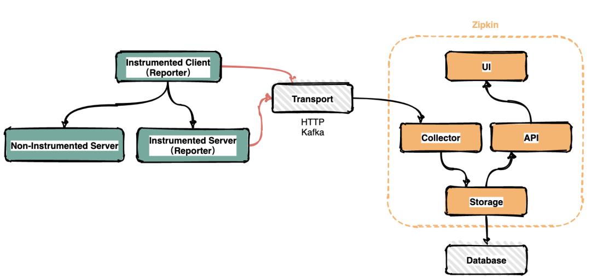


在服务运行的过程中会产生很多链路信息，产生数据的地方可以称之为Reporter。将链路信息通过多种传输方式如HTTP，RPC，kafka消息队列等发送到Zipkin的采集器，Zipkin处理后最终将链路信息保存到存储器中。运维人员通过UI界面调用接口即可查询调用链信息。


### Zipkin核心组件

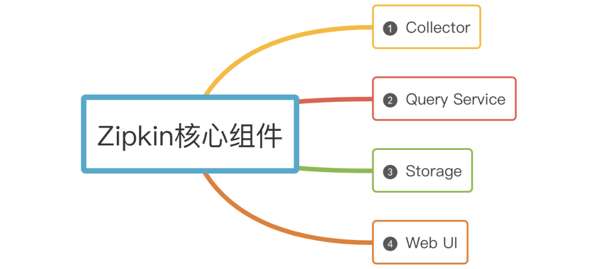

Zipkin有四大核心组件

- **Collector**

  一旦Collector采集线程获取到链路追踪数据，Zipkin就会对其进行验证、存储和索引，并调用存储接口保存数据，以便进行查找。

- **Storage**

  Zipkin Storage最初是为了在Cassandra上存储数据而构建的，因为Cassandra是可伸缩的，具有灵活的模式，并且在Twitter中大量使用。除了Cassandra，还支持支持ElasticSearch和MySQL存储，后续可能会提供第三方扩展。

- **Query Service**

  链路追踪数据被存储和索引之后，webui 可以调用query service查询任意数据帮助运维人员快速定位线上问题。query service提供了简单的json api来查找和检索数据。

- **Web UI**

  Zipkin 提供了基本查询、搜索的web界面，运维人员可以根据具体的调用链信息快速识别线上问题。


# 幂等机制

## 幂等场景

**场景一：前端重复提交**

用户注册，用户创建商品等操作，前端都会提交一些数据给后台服务，后台需要根据用户提交的数据在数据库中创建记录。如果用户不小心多点了几次，后端收到了好几次提交，这时就会在数据库中重复创建了多条记录。这就是接口没有幂等性带来的 bug。


**场景二：黑客拦截重放**

接口请求参数被黑客拦截，然后进行重放。


**场景三：接口超时重试**

对于给第三方调用的接口，有可能会因为网络原因而调用失败，这时，一般在设计的时候会对接口调用加上失败重试的机制。如果第一次调用已经执行了一半时，发生了网络异常。这时再次调用时就会因为脏数据的存在而出现调用异常。


**场景四：消息重复消费**

在使用消息中间件来处理消息队列，且手动 ack 确认消息被正常消费时。如果消费者突然断开连接，那么已经执行了一半的消息会重新放回队列。当消息被其他消费者重新消费时，如果没有幂等性，就会导致消息重复消费时结果异常，如数据库重复数据，数据库数据冲突，资源重复等。


## 解决方案

### Token机制实现

通过token机制实现接口的幂等性,这是一种比较通用性的实现方法。示意图如下：

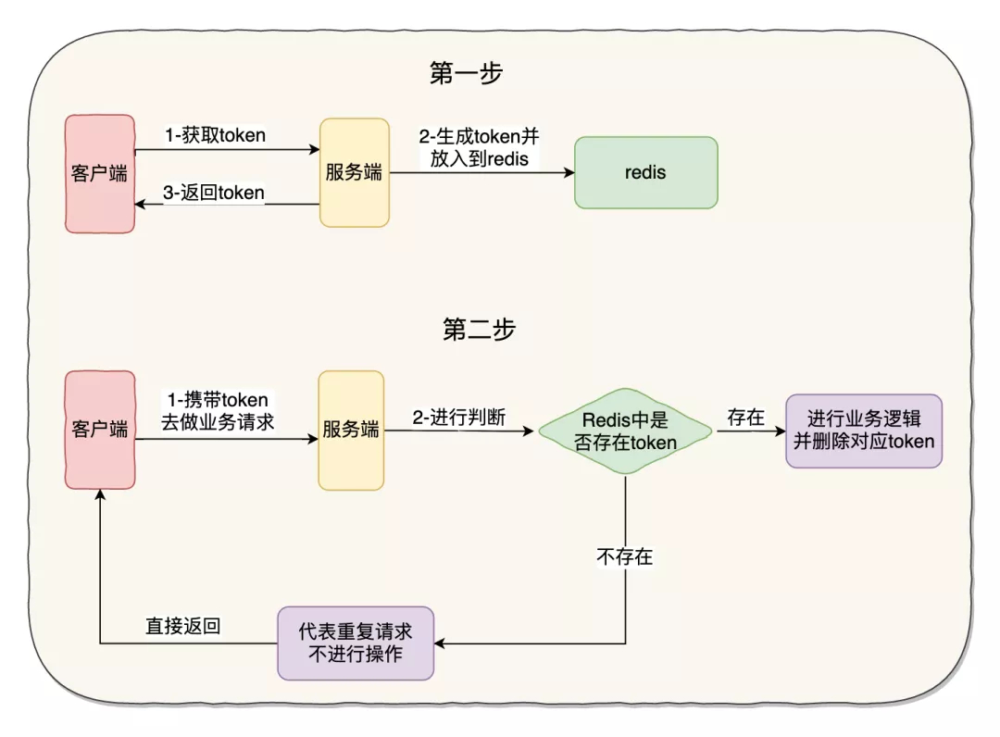

具体流程步骤：

- 客户端会先发送一个请求去获取 token，服务端会生成一个全局唯一的 ID 作为 token 保存在 redis 中，同时把这个 ID 返回给客户端
- 客户端第二次调用业务请求的时候必须携带这个 token
- 服务端会校验这个 token，如果校验成功，则执行业务，并删除 redis 中的 token
- 如果校验失败，说明 redis 中已经没有对应的 token，则表示重复操作，直接返回指定的结果给客户端

注意：

- 对 redis 中是否存在 token 以及删除的代码逻辑建议用 Lua 脚本实现，保证原子性
- 全局唯一 ID 可以考虑用百度的 uid-generator、美团的 Leaf 去生成


### 基于MySQL实现

这种实现方式是利用 mysql 唯一索引的特性。示意图如下：


具体流程步骤：

- 建立一张去重表，其中某个字段需要建立唯一索引
- 客户端去请求服务端，服务端会将这次请求的一些信息插入这张去重表中
- 因为表中某个字段带有唯一索引，如果插入成功，证明表中没有这次请求的信息，则执行后续的业务逻辑
- 如果插入失败，则代表已经执行过当前请求，直接返回


### 基于Redis实现

这种实现方式是基于 SETNX 命令实现的 SETNX key value：将 key 的值设为 value ，当且仅当 key 不存在。若给定的 key 已经存在，则 SETNX 不做任何动作。该命令在设置成功时返回 1，设置失败时返回 0。示意图如下：


具体流程步骤：

- 客户端先请求服务端，会拿到一个能代表这次请求业务的唯一字段
- 将该字段以 SETNX 的方式存入 redis 中，并根据业务设置相应的超时时间
- 如果设置成功，证明这是第一次请求，则执行后续的业务逻辑
- 如果设置失败，则代表已经执行过当前请求，直接返回


### 基于业务参数实现

**第一阶段**：只要客户端请求有唯一的请求编号，那么就能借用Redis做这个去重：只要这个唯一请求编号在Redis存在，证明处理过，那么就认为是重复的。

**第二阶段**：但很多的场景下，请求并不会带这样的唯一编号。先考虑简单的场景，假设请求参数只有一个字段reqParam，我们可以利用以下标识去判断这个请求是否重复：**用户ID:接口名:请求参数** 。

**第三阶段**：但我们的接口通常不是这么简单，参数通常是一个JSON。假设我们把请求参数（JSON）按KEY做升序排序，排序后拼成一个字符串作为KEY值，但这可能非常的长，所以可以考虑对这个字符串求一个MD5作为参数的摘要，以这个摘要去取代reqParam的位置。

```java
String KEY = "user_opt:U="+userId + "M=" + method + "P=" + reqParamMD5;
```

**第四阶段**：上面的问题其实已经是一个很不错的解决方案了，但是实际投入使用的时候可能发现有些问题：某些请求用户短时间内重复的点击了（例如1000毫秒发送了三次请求），但绕过了上面的去重判断（不同的KEY值）。原因是这些请求参数的字段里面，**是带时间字段的**，这个字段标记用户请求的时间，服务端可以借此丢弃掉一些老的请求（例如5秒前）。

**总结**

将业务参数（Query+Body）按KEY（排除时间字段和经纬度字段）做升序排序，排序后将按Query方式逐一拼接成参数字符串，然后将这个字符串进行MD5摘要计算，然后使用以下规则进行KEY值计算：

```java
String KEY = "前缀标识:U=" + <用户唯一标识> + "M=" + <接口唯一标识> + "P=" + <业务参数MD5签名>;
```


# 分布式ID

分布式ID的两大核心需求：

- **全局唯一**
- **趋势有序**
- **高性能**

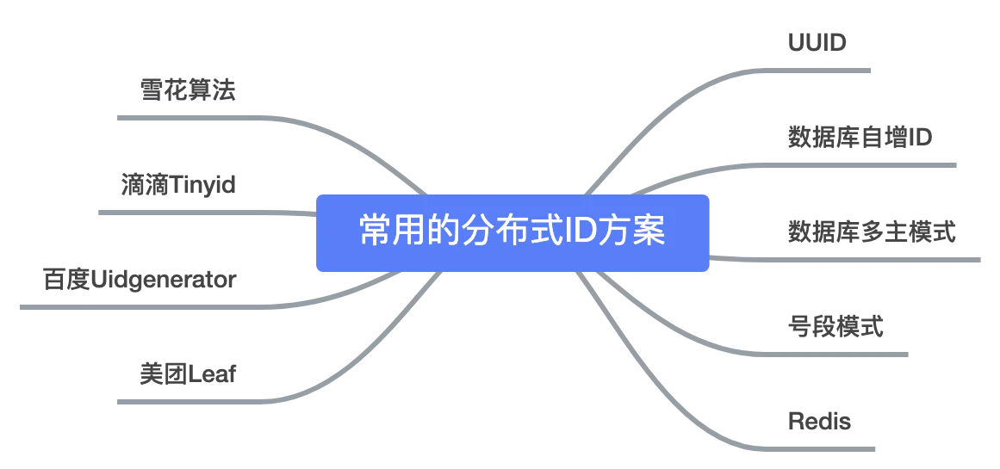


## UUID

基于 `UUID` 实现全球唯一的ID。用作订单号`UUID`这样的字符串没有丝毫的意义，看不出和订单相关的有用信息；而对于数据库来说用作业务`主键ID`，它不仅是太长还是字符串，存储性能差查询也很耗时，所以不推荐用作`分布式ID`。

**优点**

- 生成足够简单，本地生成无网络消耗，具有唯一性

**缺点**

- 无序的字符串，不具备趋势自增特性
- 没有具体的业务含义，看不出和订单相关的有用信息
- 长度过长16 字节128位，36位长度的字符串，存储以及查询对MySQL的性能消耗较大，MySQL官方明确建议主键要尽量越短越好，作为数据库主键 `UUID` 的无序性会导致数据位置频繁变动，严重影响性能

**适用场景**

- 可以用来生成如token令牌一类的场景，足够没辨识度，而且无序可读，长度足够
- 可以用于无纯数字要求、无序自增、无可读性要求的场景


## 数据库自增ID

基于数据库的 `auto_increment` 自增ID完全可以充当 `分布式ID` 。当我们需要一个ID的时候，向表中插入一条记录返回`主键ID`，但这种方式有一个比较致命的缺点，访问量激增时MySQL本身就是系统的瓶颈，用它来实现分布式服务风险比较大，不推荐。相关SQL如下：

```mysql
CREATE DATABASE `SEQ_ID`;
CREATE TABLE SEQID.SEQUENCE_ID (
    id bigint(20) unsigned NOT NULL auto_increment, 
    value char(10) NOT NULL default '',
    PRIMARY KEY (id),
) ENGINE=MyISAM;

insert into SEQUENCE_ID(value)  VALUES ('values');
```

**优点**

- 实现简单，ID单调自增，数值类型查询速度快

**缺点**

- DB单点存在宕机风险，无法扛住高并发场景

**适用场景**

- 小规模的，数据访问量小的业务场景
- 无高并发场景，插入记录可控的场景


## 数据库多主模式

单点数据库方式不可取，那对上述的方式做一些高可用优化，换成主从模式集群。一个主节点挂掉没法用，那就做双主模式集群，也就是两个Mysql实例都能单独的生产自增ID。

**问题**：如果两个MySQL实例的自增ID都从1开始，会生成重复的ID怎么办？

**解决方案**：设置`起始值`和`自增步长`

MySQL_1 配置：

```mysql
set @@auto_increment_offset = 1;     -- 起始值
set @@auto_increment_increment = 2;  -- 步长
-- 自增ID分别为：1、3、5、7、9 ...... 
```

MySQL_2 配置：

```mysql
set @@auto_increment_offset = 2;     -- 起始值
set @@auto_increment_increment = 2;  -- 步长
-- 自增ID分别为：2、4、6、8、10 ......
```

那如果集群后的性能还是扛不住高并发咋办？则进行MySQL扩容增加节点：

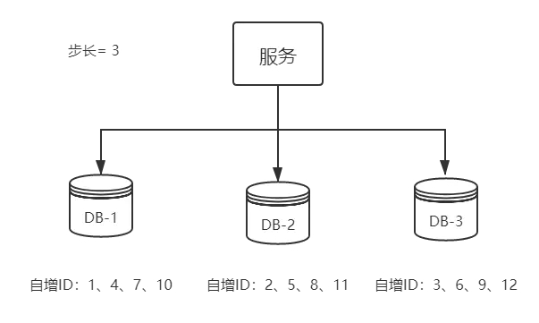

从上图可以看出，水平扩展的数据库集群，有利于解决数据库单点压力的问题，同时为了ID生成特性，将自增步长按照机器数量来设置。增加第三台`MySQL`实例需要人工修改一、二两台`MySQL实例`的起始值和步长，把`第三台机器的ID`起始生成位置设定在比现有`最大自增ID`的位置远一些，但必须在一、二两台`MySQL实例`ID还没有增长到`第三台MySQL实例`的`起始ID`值的时候，否则`自增ID`就要出现重复了，**必要时可能还需要停机修改**。

**优点**

- 解决DB单点问题

**缺点**

- 不利于后续扩容，而且实际上单个数据库自身压力还是大，依旧无法满足高并发场景

**适用场景**

- 数据量不大，数据库不需要扩容的场景

这种方案，除了难以适应大规模分布式和高并发的场景，普通的业务规模还是能够胜任的，所以这种方案还是值得积累。


## 数据库号段模式

号段模式是当下分布式ID生成器的主流实现方式之一，可以理解为从数据库批量的获取自增ID，每次从数据库取出一个号段范围，例如 (1,1000] 代表1000个ID，具体的业务服务将本号段，生成1~1000的自增ID并加载到内存。表结构如下：

```mysql
CREATE TABLE id_generator (
  id int(10) NOT NULL,
  max_id bigint(20) NOT NULL COMMENT '当前最大id',
  step int(20) NOT NULL COMMENT '号段的步长',
  biz_type	int(20) NOT NULL COMMENT '业务类型',
  version int(20) NOT NULL COMMENT '版本号',
  PRIMARY KEY (`id`)
) 
```

biz_type ：代表不同业务类型

max_id ：当前最大的可用id

step ：代表号段的长度

version ：是一个乐观锁，每次都更新version，保证并发时数据的正确性

| id   | biz_type | max_id | step | version |
| ---- | -------- | ------ | ---- | ------- |
| 1    | 101      | 1000   | 2000 | 0       |

等这批号段ID用完，再次向数据库申请新号段，对`max_id`字段做一次`update`操作，`update max_id= max_id + step`，update成功则说明新号段获取成功，新的号段范围是`(max_id ,max_id +step]`。

```mysql
update id_generator set max_id=max_id+${step}, version = version+1 where version=${version} and biz_type=${XXX}
```

由于多业务端可能同时操作，所以采用版本号`version`乐观锁方式更新，这种`分布式ID`生成方式不强依赖于数据库，不会频繁的访问数据库，对数据库的压力小很多。


## Redis模式

`Redis`也同样可以实现，原理就是利用`redis`的 `incr`命令实现ID的原子性自增。

```shell
 # 初始化自增ID为1
127.0.0.1:6379> set seq_id 1
OK

# 增加1，并返回递增后的数值
127.0.0.1:6379> incr seq_id
(integer) 2
```

用`redis`实现需要注意一点，要考虑到`redis`持久化的问题。`redis`有两种持久化方式`RDB`和`AOF`：

- `RDB`：会定时打一个快照进行持久化，假如连续自增但`redis`没及时持久化，而这会`redis`挂掉了，重启`redis`后会出现ID重复的情况
- `AOF`：会对每条写命令进行持久化，即使`Redis`挂掉了也不会出现ID重复的情况，但由于incr命令的特殊性，会导致`Redis`重启恢复的数据时间过长


**优点**

- 有序递增，可读性强
- 能够满足一定性能

**缺点**

- 强依赖于Redis，可能存在单点问题
- 占用宽带，而且需要考虑网络延时等问题带来地性能冲击

**适用场景**

- 对性能要求不是太高，而且规模较小业务较轻的场景，而且Redis的运行情况有一定要求，注意网络问题和单点压力问题，如果是分布式情况，那考虑的问题就更多了，所以一帮情况下这种方式用的比较少

Redis的方案其实可靠性有待考究，毕竟依赖于网络，延时故障或者宕机都可能导致服务不可用，这种风险是不得不考虑在系统设计内的。


## 雪花算法（Snowflake）

雪花算法（Snowflake）是Twitter公司内部分布式项目采用的ID生成算法，开源后广受国内大厂的好评，在该算法影响下各大公司相继开发出各具特色的分布式生成器。

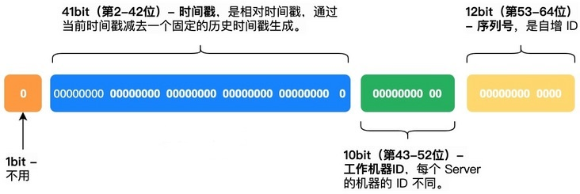

`Snowflake`生成的是Long类型的ID，一个Long类型占8个字节，每个字节占8比特，也就是说一个Long类型占64个比特。Snowflake ID组成结构：`正数位`（占1比特）+ `时间戳`（占41比特）+ `机器ID`（占5比特）+ `数据中心`（占5比特）+ `自增值`（占12比特），总共64比特组成的一个Long类型。

- **第一个bit位（1bit）**：Java中long的最高位是符号位代表正负，正数是0，负数是1，一般生成ID都为正数，所以默认为0
- **时间戳部分（41bit）**：毫秒级的时间，不建议存当前时间戳，而是用（当前时间戳 - 固定开始时间戳）的差值，可以使产生的ID从更小的值开始；41位的时间戳可以使用69年，(1L << 41) / (1000L * 60 * 60 * 24 * 365) = 69年
- **工作机器id（10bit）**：也被叫做`workId`，这个可以灵活配置，机房或者机器号组合都可以
- **序列号部分（12bit）**：自增值支持同一毫秒内同一个节点可以生成4096个ID


**优点**

- 每秒能够生成百万个不同的ID，性能佳
- 时间戳值在高位，中间是固定的机器码，自增的序列在地位，整个ID是趋势递增的
- 能够根据业务场景数据库节点布置灵活挑战bit位划分，灵活度高

**缺点**

- **强依赖于机器时钟**，如果时钟回拨，会导致重复的ID生成，所以一般基于此的算法发现时钟回拨，都会抛异常处理，阻止ID生成，这可能导致服务不可用

**适用场景**

- 雪花算法有很明显的缺点就是时钟依赖，如果确保机器不存在时钟回拨情况的话，那使用这种方式生成分布式ID是可行的，当然小规模系统完全是能够使用的


## 百度（Uid-Generator）

`uid-generator`是基于`Snowflake`算法实现的，与原始的`snowflake`算法不同在于，`uid-generator`支持自`定义时间戳`、`工作机器ID`和 `序列号` 等各部分的位数，而且`uid-generator`中采用用户自定义`workId`的生成策略。

`uid-generator`需要与数据库配合使用，需要新增一个`WORKER_NODE`表。当应用启动时会向数据库表中去插入一条数据，插入成功后返回的自增ID就是该机器的`workId`数据由host，port组成。


**对于`uid-generator` ID组成结构**：

`workId`占用了22个bit位，时间占用了28个bit位，序列化占用了13个bit位。这里的时间单位是秒，而不是毫秒，`workId`也不一样，而且同一应用每次重启就会消费一个`workId`。


## 美团（Leaf）

`Leaf`同时支持号段模式和`snowflake`算法模式，可以切换使用。

### Leaf-segment数据库方案

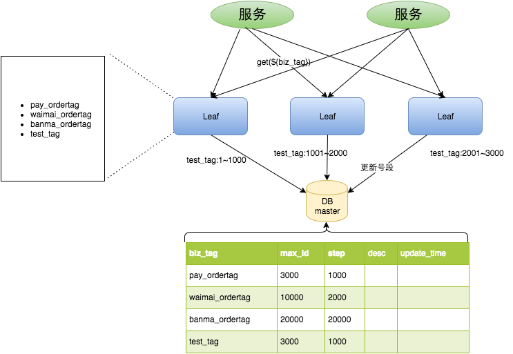

在建一张表`leaf_alloc`：

```mysql
DROP TABLE IF EXISTS `leaf_alloc`;
CREATE TABLE `leaf_alloc` (
  `biz_tag` varchar(128)  NOT NULL DEFAULT '' COMMENT '业务key',
  `max_id` bigint(20) NOT NULL DEFAULT '1' COMMENT '当前已经分配了的最大id',
  `step` int(11) NOT NULL COMMENT '初始步长，也是动态调整的最小步长',
  `description` varchar(256)  DEFAULT NULL COMMENT '业务key的描述',
  `update_time` timestamp NOT NULL DEFAULT CURRENT_TIMESTAMP ON UPDATE CURRENT_TIMESTAMP COMMENT '数据库维护的更新时间',
  PRIMARY KEY (`biz_tag`)
) ENGINE=InnoDB;
```

test_tag在第一台Leaf机器上是1~1000的号段，当这个号段用完时，会去加载另一个长度为step=1000的号段，假设另外两台号段都没有更新，这个时候第一台机器新加载的号段就应该是3001~4000。同时数据库对应的biz_tag这条数据的max_id会从3000被更新成4000，更新号段的SQL语句如下：

```mysql
Begin
UPDATE table SET max_id=max_id+step WHERE biz_tag=xxx
SELECT tag, max_id, step FROM table WHERE biz_tag=xxx
Commit
```

**优点**

- Leaf服务可以很方便的线性扩展，性能完全能够支撑大多数业务场景
- ID号码是趋势递增的8byte的64位数字，满足上述数据库存储的主键要求
- 容灾性高：Leaf服务内部有号段缓存，即使DB宕机，短时间内Leaf仍能正常对外提供服务
- 可以自定义max_id的大小，非常方便业务从原有的ID方式上迁移过来

**缺点**

- ID号码不够随机，能够泄露发号数量的信息，不太安全
- TP999数据波动大，当号段使用完之后还是会hang在更新数据库的I/O上，tg999数据会出现偶尔的尖刺
- DB宕机会造成整个系统不可用


**双buffer优化**

针对第二个缺点是因为在号段用完后才会出现，因此可以在消耗完前提前获取下一个号段，从而解决问题：

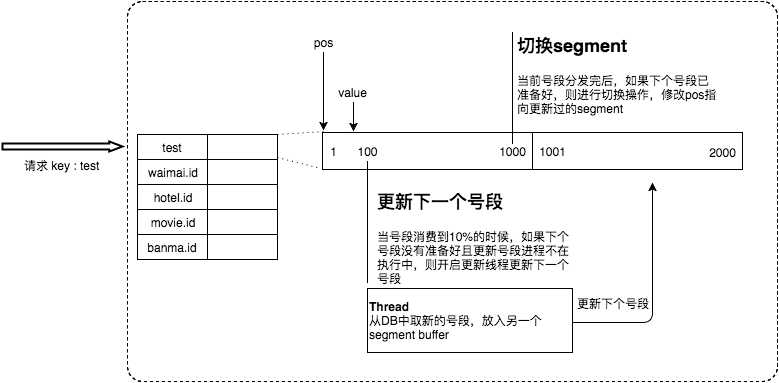

采用双buffer的方式，Leaf服务内部有两个号段缓存区segment。当前号段已下发10%时，如果下一个号段未更新，则另启一个更新线程去更新下一个号段。当前号段全部下发完后，如果下个号段准备好了则切换到下个号段为当前segment接着下发，循环往复：

- 每个biz-tag都有消费速度监控，通常推荐segment长度设置为服务高峰期发号QPS的600倍（10分钟），这样即使DB宕机，Leaf仍能持续发号10-20分钟不受影响
- 每次请求来临时都会判断下个号段的状态，从而更新此号段，所以偶尔的网络抖动不会影响下个号段的更新


**Leaf高可用容灾**

对于第三点“DB可用性”问题，采用一主两从的方式，同时分机房部署，Master和Slave之间采用**半同步方式**同步数据。

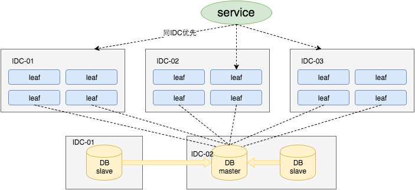


### Leaf-snowflake方案

Leaf-segment方案可以生成趋势递增的ID，同时ID号是可计算的，不适用于订单ID生成场景，比如竞对在两天中午12点分别下单，通过订单id号相减就能大致计算出公司一天的订单量，这个是不能忍受的。面对这一问题，我们提供了 Leaf-snowflake方案。Leaf-snowflake方案完全沿用snowflake方案的bit位设计，即是“1+41+10+12”的方式组装ID号。对于workerID的分配，当服务集群数量较小的情况下，完全可以手动配置。Leaf服务规模较大，动手配置成本太高。所以使用Zookeeper持久顺序节点的特性自动对snowflake节点配置wokerID。Leaf-snowflake是按照下面几个步骤启动的：

- 启动Leaf-snowflake服务，连接Zookeeper，在leaf_forever父节点下检查自己是否已经注册过（是否有该顺序子节点）
- 如果有注册过直接取回自己的workerID（zk顺序节点生成的int类型ID号），启动服务
- 如果没有注册过，就在该父节点下面创建一个持久顺序节点，创建成功后取回顺序号当做自己的workerID号，启动服务

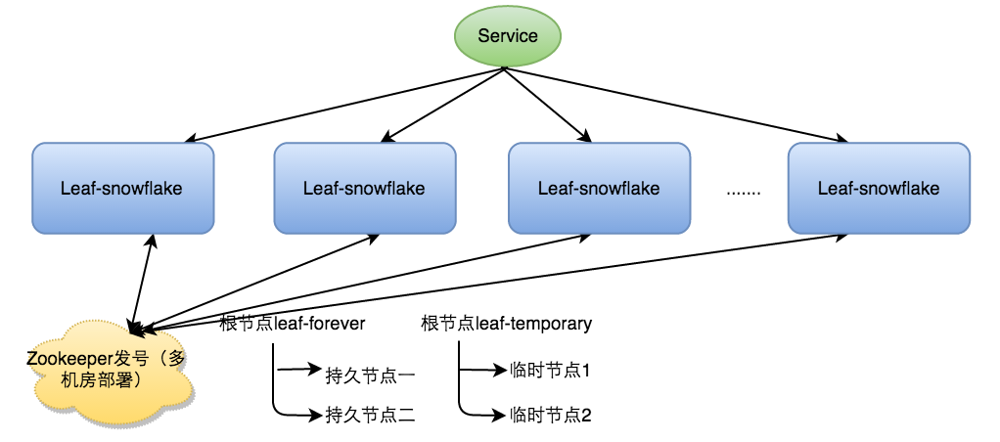


## 滴滴（TinyID）

`Tinyid`是基于号段模式原理实现的与`Leaf`如出一辙，每个服务获取一个号段（1000,2000]、（2000,3000]、（3000,4000]

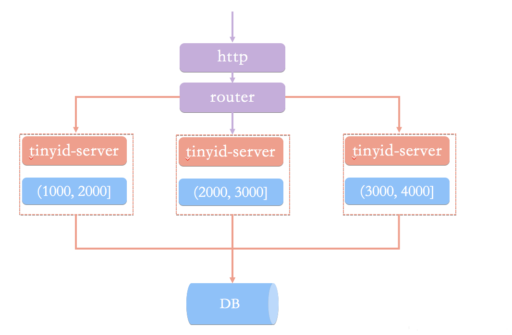

`Tinyid`提供`http`和`tinyid-client`两种方式接入。


### Http方式接入

**第一步**：导入Tinyid源码

```shell
git clone https://github.com/didi/tinyid.git
```

**第二步**：创建数据表

```mysql
-- 建表SQL
CREATE TABLE `tiny_id_info` (
  `id` bigint(20) unsigned NOT NULL AUTO_INCREMENT COMMENT '自增主键',
  `biz_type` varchar(63) NOT NULL DEFAULT '' COMMENT '业务类型，唯一',
  `begin_id` bigint(20) NOT NULL DEFAULT '0' COMMENT '开始id，仅记录初始值，无其他含义。初始化时begin_id和max_id应相同',
  `max_id` bigint(20) NOT NULL DEFAULT '0' COMMENT '当前最大id',
  `step` int(11) DEFAULT '0' COMMENT '步长',
  `delta` int(11) NOT NULL DEFAULT '1' COMMENT '每次id增量',
  `remainder` int(11) NOT NULL DEFAULT '0' COMMENT '余数',
  `create_time` timestamp NOT NULL DEFAULT '2010-01-01 00:00:00' COMMENT '创建时间',
  `update_time` timestamp NOT NULL DEFAULT '2010-01-01 00:00:00' COMMENT '更新时间',
  `version` bigint(20) NOT NULL DEFAULT '0' COMMENT '版本号',
  PRIMARY KEY (`id`),
  UNIQUE KEY `uniq_biz_type` (`biz_type`)
) ENGINE=InnoDB AUTO_INCREMENT=1 DEFAULT CHARSET=utf8 COMMENT 'id信息表';

CREATE TABLE `tiny_id_token` (
  `id` int(11) unsigned NOT NULL AUTO_INCREMENT COMMENT '自增id',
  `token` varchar(255) NOT NULL DEFAULT '' COMMENT 'token',
  `biz_type` varchar(63) NOT NULL DEFAULT '' COMMENT '此token可访问的业务类型标识',
  `remark` varchar(255) NOT NULL DEFAULT '' COMMENT '备注',
  `create_time` timestamp NOT NULL DEFAULT '2010-01-01 00:00:00' COMMENT '创建时间',
  `update_time` timestamp NOT NULL DEFAULT '2010-01-01 00:00:00' COMMENT '更新时间',
  PRIMARY KEY (`id`)
) ENGINE=InnoDB AUTO_INCREMENT=1 DEFAULT CHARSET=utf8 COMMENT 'token信息表';

-- 添加tiny_id_info
INSERT INTO `tiny_id_info` (`id`, `biz_type`, `begin_id`, `max_id`, `step`, `delta`, `remainder`, `create_time`, `update_time`, `version`) VALUES (1, 'test', 1, 1, 100000, 1, 0, '2018-07-21 23:52:58', '2018-07-22 23:19:27', 1);
INSERT INTO `tiny_id_info` (`id`, `biz_type`, `begin_id`, `max_id`, `step`, `delta`, `remainder`, `create_time`, `update_time`, `version`) VALUES(2, 'test_odd', 1, 1, 100000, 2, 1, '2018-07-21 23:52:58', '2018-07-23 00:39:24', 3);

-- 添加tiny_id_token
INSERT INTO `tiny_id_token` (`id`, `token`, `biz_type`, `remark`, `create_time`, `update_time`) VALUES(1, '0f673adf80504e2eaa552f5d791b644c', 'test', '1', '2017-12-14 16:36:46', '2017-12-14 16:36:48');
INSERT INTO `tiny_id_token` (`id`, `token`, `biz_type`, `remark`, `create_time`, `update_time`) VALUES(2, '0f673adf80504e2eaa552f5d791b644c', 'test_odd', '1', '2017-12-14 16:36:46', '2017-12-14 16:36:48');
```

**第三步**：配置数据库

```properties
datasource.tinyid.names=primary
datasource.tinyid.primary.driver-class-name=com.mysql.jdbc.Driver
datasource.tinyid.primary.url=jdbc:mysql://ip:port/databaseName?autoReconnect=true&useUnicode=true&characterEncoding=UTF-8
datasource.tinyid.primary.username=root
datasource.tinyid.primary.password=123456
```

**第四步**：启动`tinyid-server`后测试

```properties
# 获取分布式自增ID
http://localhost:9999/tinyid/id/nextIdSimple?bizType=test&token=0f673adf80504e2eaa552f5d791b644c'
返回结果: 3

# 批量获取分布式自增ID
http://localhost:9999/tinyid/id/nextIdSimple?bizType=test&token=0f673adf80504e2eaa552f5d791b644c&batchSize=10'
返回结果:  4,5,6,7,8,9,10,11,12,13
```


### Java客户端方式接入

**第一步**：引入依赖

```xml
       <dependency>
            <groupId>com.xiaoju.uemc.tinyid</groupId>
            <artifactId>tinyid-client</artifactId>
            <version>${tinyid.version}</version>
        </dependency>
```

**第二步**：配置文件

```properties
tinyid.server =localhost:9999
tinyid.token =0f673adf80504e2eaa552f5d791b644c
```

**第三步**：`test` 、`tinyid.token`是在数据库表中预先插入数据，`test` 是具体业务类型，`tinyid.token`表示可访问的业务类型

```java
// 获取单个分布式自增ID
Long id =  TinyId . nextId( " test " );
// 按需批量分布式自增ID
List< Long > ids =  TinyId . nextId( " test " , 10 );
```


# 分布式锁

**何为分布式锁？**

- 当在分布式模型下，数据只有一份（或有限制），此时需要利用锁的技术控制某一时刻修改数据的进程数
- 用一个状态值表示锁，对锁的占用和释放通过状态值来标识


**分布式锁的特点**

- **互斥性**：和我们本地锁一样互斥性是最基本，但是分布式锁需要保证在不同节点的不同线程的互斥
- **可重入性**：同一个节点上的同一个线程如果获取了锁之后那么也可以再次获取这个锁
- **锁超时**：和本地锁一样支持锁超时，防止死锁
- **高性能和高可用**：加锁和解锁需要高效，同时也需要保证高可用防止分布式锁失效，可以增加降级
- **支持阻塞和非阻塞**：和ReentrantLock一样支持lock和trylock以及tryLock（long timeout）
- **支持公平锁和非公平锁（可选）**：公平锁的意思是按照请求加锁的顺序获得锁，非公平锁就相反是无序的


**三种方案对比**

- **从理解的难易程度角度（从低到高）**：数据库 > 缓存 > Zookeeper
- **从实现的复杂性角度（从低到高）**：Zookeeper >= 缓存 > 数据库
- **从性能角度（从高到低）**：缓存 > Zookeeper >= 数据库
- **从可靠性角度（从高到低）**：Zookeeper > 缓存 > 数据库


## MySQL

### 基于唯一索引(`insert`)实现

**记录锁的乐观锁方案**。基于数据库的实现方式的核心思想是：在数据库中创建一个表，表中包含**方法名**等字段，并在**方法名字段上创建唯一索引**，想要执行某个方法，就使用这个方法名向表中插入数据，成功插入则获取锁，执行完成后删除对应的行数据释放锁。


#### 优缺点

**优点**

- 实现简单、易于理解

**缺点**

- 没有线程唤醒，获取失败就被丢掉了
- 没有超时保护，一旦解锁操作失败，就会导致锁记录一直在数据库中，其他线程无法再获得到锁
- 这把锁强依赖数据库的可用性，数据库是一个单点，一旦数据库挂掉，会导致业务系统不可用
- 并发量大的时候请求量大，获取锁的间隔，如果较小会给系统和数据库造成压力
- 这把锁只能是非阻塞的，因为数据的insert操作，一旦插入失败就会直接报错，没有获得锁的线程并不会进入排队队列，要想再次获得锁就要再次触发获得锁操作
- 这把锁是非重入的，同一个线程在没有释放锁之前无法再次获得该锁，因为数据中数据已经存在了
- 这把锁是非公平锁，所有等待锁的线程凭运气去争夺锁


#### 实现方案

```mysql
DROP TABLE IF EXISTS `method_lock`;
CREATE TABLE `method_lock` (
  `id` int(11) unsigned NOT NULL AUTO_INCREMENT COMMENT '主键',
  `lock_key` varchar(64) NOT NULL DEFAULT '' COMMENT '锁的键值',
  `lock_timeout` datetime NOT NULL DEFAULT NOW() COMMENT '锁的超时时间',
  `remarks` varchar(255) NOT NULL COMMENT '备注信息',
  `update_time` timestamp NOT NULL DEFAULT CURRENT_TIMESTAMP ON UPDATE CURRENT_TIMESTAMP,
  PRIMARY KEY (`id`),
  UNIQUE KEY `uidx_lock_key` (`lock_key`) USING BTREE
) ENGINE=InnoDB AUTO_INCREMENT=3 DEFAULT CHARSET=utf8 COMMENT='锁定中的方法';
```

**① 获取锁**：想要执行某个方法，就使用这个方法名向表中插入数据

```mysql
INSERT INTO method_lock (lock_key, lock_timeout, remarks) VALUES ('methodName', '2021-07-19 18:20:00', '测试的methodName');
```

**② 释放锁**：释放锁的时候就删除记录

```mysql
DELETE FROM method_lock WHERE lock_key ='methodName';
```


#### 问题与解决

- 强依赖数据库可用性，是一个单点（部署双实例）
- 没有失效时间，一旦解锁失败，就会导致死锁（添加定时任务扫描表）
- 一旦插入失败就会直接报错，不会进入排队队列（使用while循环，成功后才返回）
- 是非重入锁，同一线程在没有释放锁之前无法再次获得该锁（添加字段记录机器和线程信息，查询时相同则直接分配）
- 非公平锁（建中间表记录等待锁的线程，根据创建时间排序后进行依次处理）
- 采用唯一索引冲突防重，在大并发情况下有可能会造成锁表现象（采用程序生产主键进行防重）


### 基于表字段版本号实现

**版本号对比更新的乐观锁方案**。一般是通过为数据库表添加一个 `version` 字段来实现读取出数据时，将此版本号一同读出。之后更新时，对此版本号加 `1`，在更新过程中，会对版本号进行比较，如果是一致的，没有发生改变，则会成功执行本次操作；如果版本号不一致，则会更新失败。实际就是个`CAS`过程。


#### 优缺点

**缺点**

- 该方式使原本一次的update操作，必须变为2次操作：select版本号一次、update一次。增加了数据库操作的次数
- 如果业务场景中的一次业务流程中，多个资源都需要用保证数据一致性，那么如果全部使用基于数据库资源表的乐观锁，就要让每个资源都有一张资源表，这个在实际使用场景中肯定是无法满足的。而且这些都基于数据库操作，在高并发的要求下，对数据库连接的开销一定是无法忍受的
- 乐观锁机制往往基于系统中的数据存储逻辑，因此可能会造成脏数据被更新到数据库中


### 基于排他锁(`for update`)实现

**基于排它锁的悲观锁方案**。通过在select语句后增加`for update`来获取锁，数据库会在查询过程中给数据库表增加排他锁。当某条记录被加上排他锁之后，其他线程无法再在该行记录上增加排他锁，我们可以认为获得排它锁的线程即可获得分布式锁。释放锁通过`connection.commit();`操作，提交事务来实现。

#### 优缺点

**优点**

- 实现简单、易于理解

**缺点**

- 排他锁会占用连接，产生连接爆满的问题
- 如果表不大，可能并不会使用行锁
- 同样存在单点问题、并发量问题


#### 实现方案

**建表脚本**

```mysql
CREATE TABLE `methodLock` (
      `id` int(11) unsigned NOT NULL AUTO_INCREMENT COMMENT '主键',
      `lock_key` varchar(64) NOT NULL DEFAULT '' COMMENT '锁的键值',
      `lock_timeout` datetime NOT NULL DEFAULT NOW() COMMENT '锁的超时时间',
      `remarks` varchar(255) NOT NULL COMMENT '备注信息',
      `update_time` timestamp NOT NULL DEFAULT CURRENT_TIMESTAMP ON UPDATE CURRENT_TIMESTAMP,
    PRIMARY KEY ( `id` ),
    UNIQUE KEY `uidx_lock_key` ( `lock_key ` ) USING BTREE 
) ENGINE = INNODB DEFAULT CHARSET = utf8 COMMENT = '锁定中的方法';
```

**加解锁操作**

```java
/**
 * 加锁
 */
public boolean lock() {
        // 开启事务
        connection.setAutoCommit(false);
        // 循环阻塞，等待获取锁
        while (true) {
            // 执行获取锁的sql
            String sql = "select * from methodLock where lock_key = xxx for update";
             // 创建prepareStatement对象，用于执行SQL
            ps = conn.prepareStatement(sql);
            // 获取查询结果集
            int result = ps.executeQuery();
            // 结果非空，加锁成功
            if (result != null) {
                return true;
            }
        }
    
        // 加锁失败
        return false;
}

/**
 * 解锁
 */
public void unlock() {
        // 提交事务，解锁
        connection.commit();
}
```


## Redis

### LUA+SETNX+EXPIRE

先用`setnx`来抢锁，如果抢到之后，再用`expire`给锁设置一个过期时间，防止锁忘记了释放。

- **setnx(key, value)**

  `setnx` 的含义就是 `SET if Not Exists`，该方法是原子的。如果 `key` 不存在，则设置当前 `key` 为 `value` 成功，返回 `1`；如果当前 `key` 已经存在，则设置当前 `key` 失败，返回 `0`。

- **expire(key, seconds)**

  `expire` 设置过期时间，要注意的是 `setnx` 命令不能设置 `key` 的超时时间，只能通过 `expire()` 来对 `key` 设置。


**使用Lua脚本(SETNX+EXPIRE)**

可以使用Lua脚本来保证原子性（包含setnx和expire两条指令），加解锁代码如下：

```java
/**
 * 使用Lua脚本，脚本中使用setnex+expire命令进行加锁操作
 */
public boolean lock(Jedis jedis, String key, String uniqueId, int seconds) {
    String luaScript = "if redis.call('setnx',KEYS[1],ARGV[1]) == 1 then" +
            		    "redis.call('expire',KEYS[1],ARGV[2]) return 1 else return 0 end";
    Object result = jedis.eval(luaScript, Collections.singletonList(key),
            Arrays.asList(uniqueId, String.valueOf(seconds)));
    return result.equals(1L);
}

/**
 * 使用Lua脚本进行解锁操纵，解锁的时候验证value值
 */
public boolean unlock(Jedis jedis, String key, String value) {
    String luaScript = "if redis.call('get',KEYS[1]) == ARGV[1] then " +
           			    "return redis.call('del',KEYS[1]) else return 0 end";
    return jedis.eval(luaScript, Collections.singletonList(key), Collections.singletonList(value)).equals(1L);
}
```


**STW**

如果在写文件过程中，发生了 FullGC，并且其时间跨度较长， 超过了锁超时的时间， 那么分布式就自动释放了。在此过程中，client2 抢到锁，写了文件。client1 的FullGC完成后，也继续写文件，**注意，此时 client1 的并没有占用锁**，此时写入会导致文件数据错乱，发生线程安全问题。这就是STW导致的锁过期问题。STW导致的锁过期问题，如下图所示：

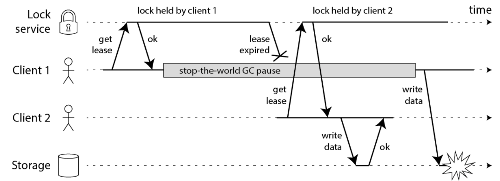

STW导致的锁过期问题，大概的解决方案有：

- **方案一： 模拟CAS乐观锁的方式，增加版本号（如下图中的token）**

  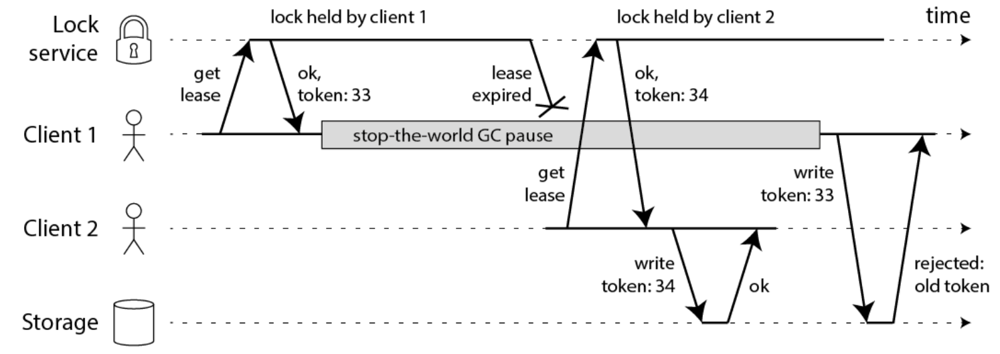

​	此方案如果要实现，需要调整业务逻辑，与之配合，所以会入侵代码。

- **方案二：watch dog自动延期机制**

  客户端1加锁的锁key默认生存时间才30秒，如果超过了30秒，客户端1还想一直持有这把锁，怎么办呢？简单！只要客户端1一旦加锁成功，就会启动一个watch dog看门狗，**它是一个后台线程，会每隔10秒检查一下**，如果客户端1还持有锁key，那么就会不断的延长锁key的生存时间。Redission采用的就是这种方案， 此方案不会入侵业务代码。


### SET-NX-EX

**方案**：`SET key value [EX seconds] [PX milliseconds] [NX|XX]`

- `EX second` ：设置键的过期时间为 `second` 秒。 `SET key value EX second` 效果等同于 `SETEX key second value` 
- `PX millisecond` ：设置键的过期时间为 `millisecond` 毫秒。 `SET key value PX millisecond` 效果等同于 `PSETEX key millisecond value` 
- `NX` ：只在键不存在时，才对键进行设置操作。 `SET key value NX` 效果等同于 `SETNX key value` 
- `XX` ：只在键已经存在时，才对键进行设置操作

客户端执行以上的命令：

- 如果服务器返回 `OK` ，那么这个客户端获得锁
- 如果服务器返回 `NIL` ，那么客户端获取锁失败，可以在稍后再重试


**① 加锁**：使用redis命令 set key value NX EX max-lock-time 实现加锁

```java
Jedis jedis = new Jedis("127.0.0.1", 6379);
private static final String SUCCESS = "OK";

 /**
  * 加锁操作
  * @param key 锁标识
  * @param value 客户端标识
  * @param timeOut 过期时间
  */
 public Boolean lock(String key,String value,Long timeOut){
     String var1 = jedis.set(key,value,"NX","EX",timeOut);
     if(LOCK_SUCCESS.equals(var1)){
         return true;
     }
     return false;
 }
```

- 加锁操作 `jedis.set(key,value,"NX","EX",timeout)`【保证加锁的原子操作】
- `key`是`redis`的`key`值作为锁的标识，`value`在作为客户端的标识，只有`key-value`都比配才有删除锁的权利【保证安全性】
- 通过`timeout`设置过期时间保证不会出现死锁【避免死锁】
- `NX`：只有这个`key`不存才的时候才会进行操作，`if not exists`
- `EX`：设置`key`的过期时间为秒，具体时间由第`5`个参数决定，过期时间设置的合理有效期需要根据业务具体决定，总的原则是任务执行`time*3`


**② 解锁**：使用redis命令 EVAL 实现解锁

```java
Jedis jedis = new Jedis("127.0.0.1", 6379);
private static final String SUCCESS = "OK";

 /**
  * 加锁操作
  * @param key 锁标识
  * @param value 客户端标识
  * @param timeOut 过期时间
  */
 public Boolean lock(String key,String value,Long timeOut){
     String var1 = jedis.set(key,value,"NX","EX",timeOut);
     if(LOCK_SUCCESS.equals(var1)){
         return true;
     }
     return false;
 }
```

- luaScript 这个字符串是个lua脚本，代表的意思是如果根据key拿到的value跟传入的value相同就执行del，否则就返回0【保证安全性】
- jedis.eval(String,list,list);这个命令就是去执行lua脚本，KEYS的集合就是第二个参数，ARGV的集合就是第三参数【保证解锁的原子操作】


**③ 重试**

如果在业务中去拿锁如果没有拿到是应该阻塞着一直等待还是直接返回，这个问题其实可以写一个重试机制，根据重试次数和重试时间做一个循环去拿锁，当然这个重试的次数和时间设多少合适，是需要根据自身业务去衡量的。

```java
/**
 * 重试机制
 * @param key 锁标识
 * @param value 客户端标识
 * @param timeOut 过期时间
 * @param retry 重试次数
 * @param sleepTime 重试间隔时间
 * @return
 */
public Boolean lockRetry(String key,String value,Long timeOut,Integer retry,Long sleepTime){
    Boolean flag = false;
    try {
        for (int i=0;i<retry;i++){
            flag = lock(key,value,timeOut); 
            if(flag){
                break; 
            } 
            Thread.sleep(sleepTime); 
        } 
    }catch (Exception e){ 
        e.printStackTrace(); 
    } 
    return flag; 
}
```

 

### Redisson

Redisson是一个在Redis的基础上实现的Java驻内存数据网格（In-Memory Data Grid）。它不仅提供了一系列的分布式的Java常用对象，还实现了可重入锁（Reentrant Lock）、公平锁（Fair Lock、联锁（MultiLock）、 红锁（RedLock）、 读写锁（ReadWriteLock）等，还提供了许多分布式服务。

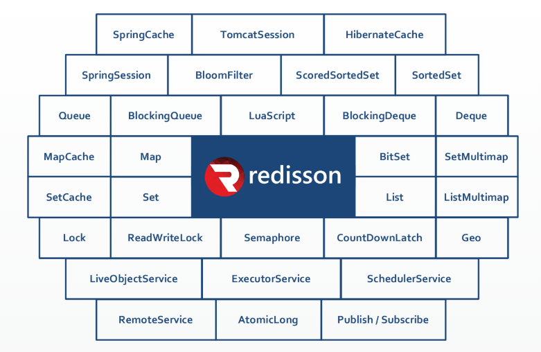

**特性功能**

- 支持 Redis 单节点（single）模式、哨兵（sentinel）模式、主从（Master/Slave）模式以及集群（Redis Cluster）模式
- 程序接口调用方式采用异步执行和异步流执行两种方式
- 数据序列化，Redisson 的对象编码类是用于将对象进行序列化和反序列化，以实现对该对象在 Redis 里的读取和存储
- 单个集合数据分片，在集群模式下，Redisson 为单个 Redis 集合类型提供了自动分片的功能
- 提供多种分布式对象，如：Object Bucket，Bitset，AtomicLong，Bloom Filter 和 HyperLogLog 等
- 提供丰富的分布式集合，如：Map，Multimap，Set，SortedSet，List，Deque，Queue 等
- 分布式锁和同步器的实现，可重入锁（Reentrant Lock），公平锁（Fair Lock），联锁（MultiLock），红锁（Red Lock），信号量（Semaphonre），可过期性信号锁（PermitExpirableSemaphore）等
- 提供先进的分布式服务，如分布式远程服务（Remote Service），分布式实时对象（Live Object）服务，分布式执行服务（Executor Service），分布式调度任务服务（Schedule Service）和分布式映射归纳服务（MapReduce）


**Watch dog**

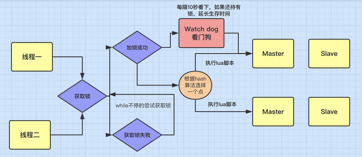

总体的Redisson框架的分布式锁类型大致如下：

- **可重入锁**
- **公平锁**
- **联锁**
- **红锁**
- **读写锁**
- **信号量**
- **可过期信号量**
- **闭锁（/倒数闩）**


**实现方案**

添加依赖

```xml
<!-- 方式一：redisson-java -->
<dependency>	
    <groupId>org.redisson</groupId>	
    <artifactId>redisson</artifactId>	
    <version>3.11.4</version>	
</dependency>

<!-- 方式二：redisson-springboot -->
<dependency>
    <groupId>org.redisson</groupId>
    <artifactId>redisson-spring-boot-starter</artifactId>
    <version>3.11.4</version>
</dependency>
```

定义接口

```java
import org.redisson.api.RLock;
import java.util.concurrent.TimeUnit;

public interface DistributedLocker {

    RLock lock(String lockKey);

    RLock lock(String lockKey, int timeout);

    RLock lock(String lockKey, TimeUnit unit, int timeout);

    boolean tryLock(String lockKey, TimeUnit unit, int waitTime, int leaseTime);

    void unlock(String lockKey);

    void unlock(RLock lock);
    
}
```

实现分布式锁

```java
import org.redisson.api.RLock;
import org.redisson.api.RedissonClient;

import java.util.concurrent.TimeUnit;

public class RedissonDistributedLocker implements DistributedLocker{

    private RedissonClient redissonClient;

    @Override
    public RLock lock(String lockKey) {
        RLock lock = redissonClient.getLock(lockKey);
        lock.lock();
        return lock;
    }

    @Override
    public RLock lock(String lockKey, int leaseTime) {
        RLock lock = redissonClient.getLock(lockKey);
        lock.lock(leaseTime, TimeUnit.SECONDS);
        return lock;
    }

    @Override
    public RLock lock(String lockKey, TimeUnit unit ,int timeout) {
        RLock lock = redissonClient.getLock(lockKey);
        lock.lock(timeout, unit);
        return lock;
    }

    @Override
    public boolean tryLock(String lockKey, TimeUnit unit, int waitTime, int leaseTime) {
        RLock lock = redissonClient.getLock(lockKey);
        try {
            return lock.tryLock(waitTime, leaseTime, unit);
        } catch (InterruptedException e) {
            return false;
        }
    }

    @Override
    public void unlock(String lockKey) {
        RLock lock = redissonClient.getLock(lockKey);
        lock.unlock();
    }

    @Override
    public void unlock(RLock lock) {
        lock.unlock();
    }

    public void setRedissonClient(RedissonClient redissonClient) {
        this.redissonClient = redissonClient;
    }
    
}
```


**高可用的RedLock（红锁）原理**

RedLock算法思想是不能只在一个redis实例上创建锁，应该是在多个redis实例上创建锁，n / 2 + 1，必须在大多数redis节点上都成功创建锁，才能算这个整体的RedLock加锁成功，避免说仅仅在一个redis实例上加锁而带来的问题。


## Zookeeper

### Apache-Curator

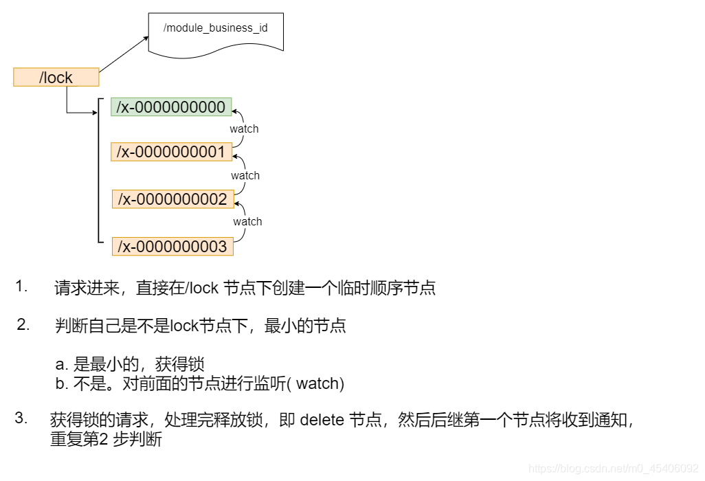

如上借助于临时顺序节点，可以避免同时多个节点的并发竞争锁，缓解了服务端压力。这种实现方式所有加锁请求都进行排队加锁，是公平锁的具体实现。Apache-Curator中提供的常见锁有如下：

- **InterProcessMutex**：就是公平锁的实现。可重入、独占锁
- **InterProcessSemaphoreMutex**：不可重入、独占锁
- **InterProcessReadWriteLock**：读写锁
- **InterProcessSemaphoreV2**：共享信号量
- **InterProcessMultiLock**：多重共享锁 （将多个锁作为单个实体管理的容器）


### 使用案例

```java
import java.util.Arrays;
import java.util.Collection;
import java.util.HashSet;
import java.util.Set;
import java.util.concurrent.TimeUnit;

import org.apache.curator.RetryPolicy;
import org.apache.curator.framework.CuratorFramework;
import org.apache.curator.framework.CuratorFrameworkFactory;
import org.apache.curator.framework.recipes.locks.InterProcessLock;
import org.apache.curator.framework.recipes.locks.InterProcessMultiLock;
import org.apache.curator.framework.recipes.locks.InterProcessMutex;
import org.apache.curator.framework.recipes.locks.InterProcessReadWriteLock;
import org.apache.curator.framework.recipes.locks.InterProcessSemaphoreMutex;
import org.apache.curator.framework.recipes.locks.InterProcessSemaphoreV2;
import org.apache.curator.framework.recipes.locks.Lease;
import org.apache.curator.retry.ExponentialBackoffRetry;
import org.apache.curator.utils.CloseableUtils;
import org.junit.After;
import org.junit.Assert;
import org.junit.Before;
import org.junit.Test;

public class DistributedLockDemo {

	// ZooKeeper 锁节点路径, 分布式锁的相关操作都是在这个节点上进行
	private final String lockPath = "/distributed-lock";
	// ZooKeeper 服务地址, 单机格式为:(127.0.0.1:2181),
	// 集群格式为:(127.0.0.1:2181,127.0.0.1:2182,127.0.0.1:2183)
	private String connectString="127.0.0.1:2181";
	// Curator 客户端重试策略
	private RetryPolicy retry;
	// Curator 客户端对象
	private CuratorFramework client1;
	// client2 用户模拟其他客户端
	private CuratorFramework client2;

	// 初始化资源
	@Before
	public void init() throws Exception {
		// 重试策略
		// 初始休眠时间为 1000ms, 最大重试次数为 3
		retry = new ExponentialBackoffRetry(1000, 3);
		// 创建一个客户端, 60000(ms)为 session 超时时间, 15000(ms)为链接超时时间
		client1 = CuratorFrameworkFactory.newClient(connectString, 60000, 15000, retry);
		client2 = CuratorFrameworkFactory.newClient(connectString, 60000, 15000, retry);
		// 创建会话
		client1.start();
		client2.start();
	}

	// 释放资源
	@After
	public void close() {
		CloseableUtils.closeQuietly(client1);
	}

	/**
	 * InterProcessMutex：可重入、独占锁
	 */
	@Test
	public void sharedReentrantLock() throws Exception {
		// 创建可重入锁
		InterProcessMutex lock1 = new InterProcessMutex(client1, lockPath);
		// lock2 用于模拟其他客户端
		InterProcessMutex lock2 = new InterProcessMutex(client2, lockPath);
		
		// lock1 获取锁
		lock1.acquire();
		try {
			// lock1 第2次获取锁
			lock1.acquire();
			try {
				// lock2 超时获取锁, 因为锁已经被 lock1 客户端占用, 所以lock2获取锁失败, 需要等 lock1 释放
				Assert.assertFalse(lock2.acquire(2, TimeUnit.SECONDS));
			} finally {
				lock1.release();
			}
		} finally {
			// 重入锁获取与释放需要一一对应, 如果获取 2 次, 释放 1 次, 那么该锁依然是被占用, 
			// 如果将下面这行代码注释, 那么会发现下面的 lock2
			// 获取锁失败
			lock1.release();
		}
		
		// 在 lock1 释放后, lock2 能够获取锁
		Assert.assertTrue(lock2.acquire(2, TimeUnit.SECONDS));
		lock2.release();
	}
	
	/**
	 * InterProcessSemaphoreMutex： 不可重入、独占锁
	 */
	@Test
	public void sharedLock() throws Exception {
		InterProcessSemaphoreMutex lock1 = new InterProcessSemaphoreMutex(client1, lockPath);
		// lock2 用于模拟其他客户端
		InterProcessSemaphoreMutex lock2 = new InterProcessSemaphoreMutex(client2, lockPath);

		// 获取锁对象
		lock1.acquire();

		// 测试是否可以重入
		// 因为锁已经被获取, 所以返回 false
		Assert.assertFalse(lock1.acquire(2, TimeUnit.SECONDS));// lock1 返回是false
		Assert.assertFalse(lock2.acquire(2, TimeUnit.SECONDS));// lock2 返回是false

		// lock1 释放锁
		lock1.release();

		// lock2 尝试获取锁成功, 因为锁已经被释放
		Assert.assertTrue(lock2.acquire(2, TimeUnit.SECONDS));// 返回是true
		lock2.release();
		System.out.println("测试结束");
	}

	/**
	 * InterProcessReadWriteLock：读写锁.
	 * 特点：读写锁、可重入
	 */
	@Test
	public void sharedReentrantReadWriteLock() throws Exception {
		// 创建读写锁对象, Curator 以公平锁的方式进行实现
		InterProcessReadWriteLock lock1 = new InterProcessReadWriteLock(client1, lockPath);
		// lock2 用于模拟其他客户端
		InterProcessReadWriteLock lock2 = new InterProcessReadWriteLock(client2, lockPath);
		
		// 使用 lock1 模拟读操作
		// 使用 lock2 模拟写操作
		// 获取读锁(使用 InterProcessMutex 实现, 所以是可以重入的)
		final InterProcessLock readLock = lock1.readLock();
		// 获取写锁(使用 InterProcessMutex 实现, 所以是可以重入的)
		final InterProcessLock writeLock = lock2.writeLock();

		/**
		 * 读写锁测试对象
		 */
		class ReadWriteLockTest {
			// 测试数据变更字段
			private Integer testData = 0;
			private Set<Thread> threadSet = new HashSet<>();

			// 写入数据
			private void write() throws Exception {
				writeLock.acquire();
				try {
					Thread.sleep(10);
					testData++;
					System.out.println("写入数据 \t" + testData);
				} finally {
					writeLock.release();
				}
			}

			// 读取数据
			private void read() throws Exception {
				readLock.acquire();
				try {
					Thread.sleep(10);
					System.out.println("读取数据 \t" + testData);
				} finally {
					readLock.release();
				}
			}

			// 等待线程结束, 防止 test 方法调用完成后, 当前线程直接退出, 导致控制台无法输出信息
			public void waitThread() throws InterruptedException {
				for (Thread thread : threadSet) {
					thread.join();
				}
			}

			// 创建线程方法
			private void createThread(final int type) {
				Thread thread = new Thread(new Runnable() {
					@Override
					public void run() {
						try {
							if (type == 1) {
								write();
							} else {
								read();
							}
						} catch (Exception e) {
							e.printStackTrace();
						}
					}
				});
				threadSet.add(thread);
				thread.start();
			}

			// 测试方法
			public void test() {
				for (int i = 0; i < 5; i++) {
					createThread(1);
				}
				for (int i = 0; i < 5; i++) {
					createThread(2);
				}
			}
		}

		ReadWriteLockTest readWriteLockTest = new ReadWriteLockTest();
		readWriteLockTest.test();
		readWriteLockTest.waitThread();
	}

	/**
	 * InterProcessSemaphoreV2 共享信号量
	 */
	@Test
	public void semaphore() throws Exception {
		// 创建一个信号量, Curator 以公平锁的方式进行实现
		InterProcessSemaphoreV2 semaphore1 = new InterProcessSemaphoreV2(client1, lockPath, 6);
		// semaphore2 用于模拟其他客户端
		InterProcessSemaphoreV2 semaphore2 = new InterProcessSemaphoreV2(client2, lockPath, 6);

		// 获取一个许可
		Lease lease1 = semaphore1.acquire();
		Assert.assertNotNull(lease1);
		// semaphore.getParticipantNodes() 会返回当前参与信号量的节点列表, 俩个客户端所获取的信息相同
		Assert.assertEquals(semaphore1.getParticipantNodes(), semaphore2.getParticipantNodes());

		// 超时获取一个许可
		Lease lease2 = semaphore2.acquire(2, TimeUnit.SECONDS);
		Assert.assertNotNull(lease2);
		Assert.assertEquals(semaphore1.getParticipantNodes(), semaphore2.getParticipantNodes());

		// 获取多个许可, 参数为许可数量
		Collection<Lease> leases = semaphore1.acquire(2);
		Assert.assertTrue(leases.size() == 2);
		Assert.assertEquals(semaphore1.getParticipantNodes(), semaphore2.getParticipantNodes());

		// 超时获取多个许可, 第一个参数为许可数量
		Collection<Lease> leases2 = semaphore2.acquire(2, 2, TimeUnit.SECONDS);
		Assert.assertTrue(leases2.size() == 2);
		Assert.assertEquals(semaphore1.getParticipantNodes(), semaphore2.getParticipantNodes());

		// 目前 semaphore 已经获取 3 个许可, semaphore2 也获取 3 个许可, 加起来为 6 个, 所以他们无法再进行许可获取
		Assert.assertNull(semaphore1.acquire(2, TimeUnit.SECONDS));
		Assert.assertNull(semaphore2.acquire(2, TimeUnit.SECONDS));

		// 释放一个许可
		semaphore1.returnLease(lease1);
		semaphore2.returnLease(lease2);
		// 释放多个许可
		semaphore1.returnAll(leases);
		semaphore2.returnAll(leases2);
	}

	/**
	 * InterProcessMutex ：可重入、独占锁
	 * InterProcessSemaphoreMutex ： 不可重入、独占锁
	 * InterProcessMultiLock： 多重共享锁（将多个锁作为单个实体管理的容器）
	 */
	@Test
	public void multiLock() throws Exception {
		InterProcessMutex mutex = new InterProcessMutex(client1, lockPath);
		InterProcessSemaphoreMutex semaphoreMutex = new InterProcessSemaphoreMutex(client2, lockPath);
		//将上面的两种锁入到其中
		InterProcessMultiLock multiLock = new InterProcessMultiLock(Arrays.asList(mutex, semaphoreMutex));
		// 获取参数集合中的所有锁
		multiLock.acquire();
		// 因为存在一个不可重入锁, 所以整个 multiLock 不可重入
		Assert.assertFalse(multiLock.acquire(2, TimeUnit.SECONDS));
		// mutex 是可重入锁, 所以可以继续获取锁
		Assert.assertTrue(mutex.acquire(2, TimeUnit.SECONDS));
		// semaphoreMutex  是不可重入锁, 所以获取锁失败
		Assert.assertFalse(semaphoreMutex.acquire(2, TimeUnit.SECONDS));
		// 释放参数集合中的所有锁
		multiLock.release();
		// interProcessLock2 中的锁已经释放, 所以可以获取
		Assert.assertTrue(semaphoreMutex.acquire(2, TimeUnit.SECONDS));
	}
}
```


# 分布式限流

当系统的处理能力不能应对外部请求的突增流量时，为了不让系统奔溃，必须采取限流的措施。

**限流目标**：

- 防止被突发流量冲垮
- 防止恶意请求和攻击
- 保证集群服务中心的健康稳定运行（流量整形）
- API经济的细粒度资源量（请求量）控制


## 限流指标

目前主流的限流方法多采用 HPS 作为限流指标。

### TPS

**TPS（Transactions Per Second）是指每秒事务数**。一个事务是指事务内第一个请求发送到接收到最后一个请求的响应的过程，以此来计算使用的时间和完成的事务个数。

> 但是对实操性来说，按照事务来限流并不现实。在分布式系统中完成一笔事务需要多个系统的配合。比如我们在电商系统购物，需要订单、库存、账户、支付等多个服务配合完成，有的服务需要异步返回，这样完成一笔事务花费的时间可能会很长。如果按照TPS来进行限流，时间粒度可能会很大大，很难准确评估系统的响应性能。


### HPS

 **HPS（Hits Per Second）指每秒点击次数（每秒钟服务端收到客户端的请求数量）**。是指在一秒钟的时间内用户对Web页面的链接、提交按钮等点击总和。 它一般和TPS成正比关系，是B/S系统中非常重要的性能指标之一。

> 如果一个请求完成一笔事务，那TPS和HPS是等同的。但在分布式场景下，完成一笔事务可能需要多次请求，所以TPS和HPS指标不能等同看待。


### QPS

**QPS（Queries Per Second）是指每秒查询率**。是一台服务器每秒能够响应的查询次数（数据库中的每秒执行查询sql的次数），显然这个不够全面，不能描述增删改，所以不建议用QPS来作为系统性能指标。

> 如果后台只有一台服务器，那 HPS 和 QPS 是等同的。但是在分布式场景下，每个请求需要多个服务器配合完成响应。


## 限流方案

### 固定窗口计数器(Fixed Window)

固定窗口计数器(Fixed Window)算法的实现思路非常简单，维护一个固定单位时间内的计数器，如果检测到单位时间已经过去就重置计数器为零。计数限首先维护一个计数器，将单位时间段当做一个窗口，计数器记录这个窗口接收请求的次数。

- 当次数少于限流阀值，就允许访问，并且计数器+1
- 当次数大于限流阀值，就拒绝访问
- 当前的时间窗口过去之后，计数器清零

假设单位时间是1秒，限流阀值为3。在单位时间1秒内，每来一个请求,计数器就加1，如果计数器累加的次数超过限流阀值3，后续的请求全部拒绝。等到1s结束后，计数器清0，重新开始计数。如下图：

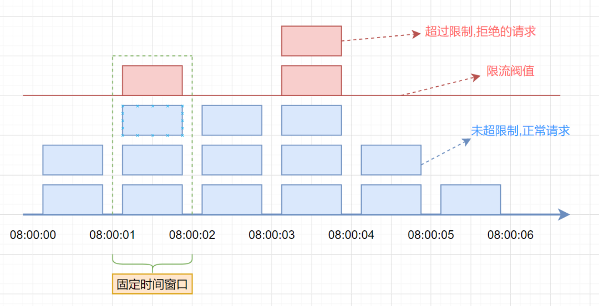

伪代码如下：

```java
    /**
     * 固定窗口时间算法
     * @return
     */
    boolean fixedWindowsTryAcquire() {
        long currentTime = System.currentTimeMillis();  //获取系统当前时间
        if (currentTime - lastRequestTime > windowUnit) {  //检查是否在时间窗口内
            counter = 0;  // 计数器清0
            lastRequestTime = currentTime;  //开启新的时间窗口
        }
        if (counter < threshold) {  // 小于阀值
            counter++;  //计数器加1
            return true;
        }

        return false;
    }
```


**存在问题**

但是，这种算法有一个很明显的**临界问题**：假设限流阀值为5个请求，单位时间窗口是1s,如果我们在单位时间内的前0.8-1s和1-1.2s，分别并发5个请求。虽然都没有超过阀值，但是如果算0.8-1.2s,则并发数高达10，已经**超过单位时间1s不超过5阀值**的定义啦。

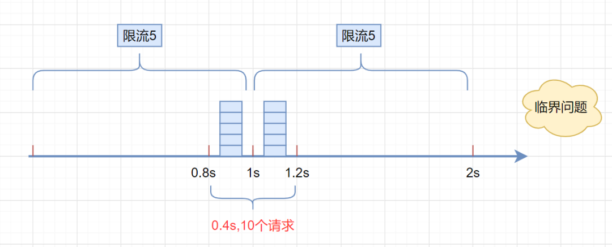


### 滑动窗口计数器(Sliding Window)

滑动窗口计数器(Sliding Window)算法限流解决固定窗口临界值的问题。它将单位时间周期分为n个小周期，分别记录每个小周期内接口的访问次数，并且根据时间滑动删除过期的小周期。

一张图解释滑动窗口算法，如下：

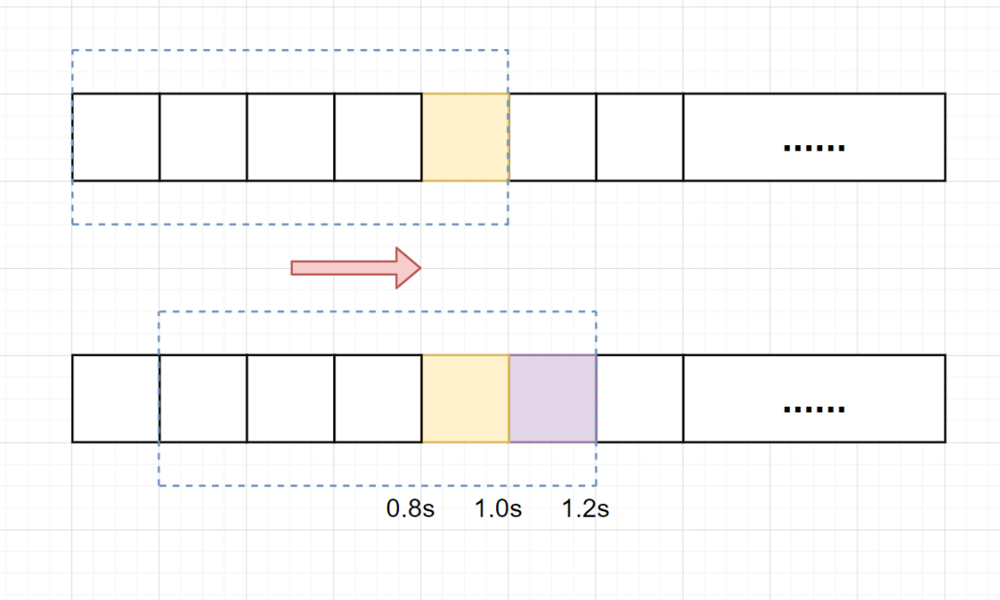

假设单位时间还是1s，滑动窗口算法把它划分为5个小周期，也就是滑动窗口（单位时间）被划分为5个小格子。每格表示0.2s。每过0.2s，时间窗口就会往右滑动一格。然后呢，每个小周期，都有自己独立的计数器，如果请求是0.83s到达的，0.8~1.0s对应的计数器就会加1。

我们来看下滑动窗口是如何解决临界问题的？

假设我们1s内的限流阀值还是5个请求，0.8~1.0s内（比如0.9s的时候）来了5个请求，落在黄色格子里。时间过了1.0s这个点之后，又来5个请求，落在紫色格子里。如果**是固定窗口算法，是不会被限流的**，但是**滑动窗口的话，每过一个小周期，它会右移一个小格**。过了1.0s这个点后，会右移一小格，当前的单位时间段是0.2~1.2s，这个区域的请求已经超过限定的5了，已触发限流啦，实际上，紫色格子的请求都被拒绝啦。

**TIPS:** 当滑动窗口的格子周期划分的越多，那么滑动窗口的滚动就越平滑，限流的统计就会越精确。

滑动窗口算法**伪代码实现**如下：

```java
 /**
     * 单位时间划分的小周期（单位时间是1分钟，10s一个小格子窗口，一共6个格子）
     */
    private int SUB_CYCLE = 10;

    /**
     * 每分钟限流请求数
     */
    private int thresholdPerMin = 100;

    /**
     * 计数器, k-为当前窗口的开始时间值秒，value为当前窗口的计数
     */
    private final TreeMap<Long, Integer> counters = new TreeMap<>();

   /**
     * 滑动窗口时间算法实现
     */
    boolean slidingWindowsTryAcquire() {
        long currentWindowTime = LocalDateTime.now().toEpochSecond(ZoneOffset.UTC) / SUB_CYCLE * SUB_CYCLE; //获取当前时间在哪个小周期窗口
        int currentWindowNum = countCurrentWindow(currentWindowTime); //当前窗口总请求数

        //超过阀值限流
        if (currentWindowNum >= thresholdPerMin) {
            return false;
        }

        //计数器+1
        counters.get(currentWindowTime)++;
        return true;
    }

   /**
    * 统计当前窗口的请求数
    */
    private int countCurrentWindow(long currentWindowTime) {
        //计算窗口开始位置
        long startTime = currentWindowTime - SUB_CYCLE* (60s/SUB_CYCLE-1);
        int count = 0;

        //遍历存储的计数器
        Iterator<Map.Entry<Long, Integer>> iterator = counters.entrySet().iterator();
        while (iterator.hasNext()) {
            Map.Entry<Long, Integer> entry = iterator.next();
            // 删除无效过期的子窗口计数器
            if (entry.getKey() < startTime) {
                iterator.remove();
            } else {
                //累加当前窗口的所有计数器之和
                count =count + entry.getValue();
            }
        }
        return count;
    }
```

滑动窗口算法虽然解决了**固定窗口的临界问题**，但是一旦到达限流后，请求都会直接暴力被拒绝。这样我们会损失一部分请求，这其实对于产品来说，并不太友好。滑动时间窗口的优点是解决了流量计数器算法的缺陷，但是也有 2 个问题：

- 流量超过就必须抛弃或者走降级逻辑
- 对流量控制不够精细，不能限制集中在短时间内的流量，也不能削峰填谷


### 漏桶算法(Leaky Bucket)

如下图所示，水滴持续滴入漏桶中，底部定速流出。如果水滴滴入的速率大于流出的速率，当存水超过桶的大小的时候就会溢出。规则如下：

- 请求来了放入桶中
- 桶内请求量满了拒绝请求
- 服务定速从桶内拿请求处理

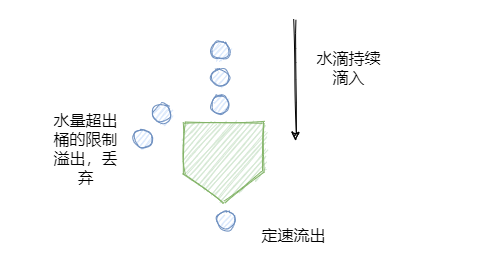

可以看到水滴对应的就是请求。它的特点就是**宽进严出**，无论请求多少，请求的速率有多大，都按照固定的速率流出，对应的就是服务按照固定的速率处理请求。面对突发请求，服务的处理速度和平时是一样的，这其实不是我们想要的，在面对突发流量我们希望在系统平稳的同时，提升用户体验即能更快的处理请求，而不是和正常流量一样，循规蹈矩的处理。而令牌桶在应对突击流量的时候，可以更加的“激进”。

漏桶算法伪代码实现如下：

```java
   /**
     * 每秒处理数（出水率）
     */
    private long rate;

    /**
     *  当前剩余水量
     */
    private long currentWater;

    /**
     * 最后刷新时间
     */
    private long refreshTime;

    /**
     * 桶容量
     */
    private long capacity;

    /**
     * 漏桶算法
     * @return
     */
    boolean leakybucketLimitTryAcquire() {
        long currentTime = System.currentTimeMillis();  //获取系统当前时间
        long outWater = (currentTime - refreshTime) / 1000 * rate; //流出的水量 =(当前时间-上次刷新时间)* 出水率
        long currentWater = Math.max(0, currentWater - outWater); // 当前水量 = 之前的桶内水量-流出的水量
        refreshTime = currentTime; // 刷新时间

        // 当前剩余水量还是小于桶的容量，则请求放行
        if (currentWater < capacity) {
            currentWater++;
            return true;
        }
        
        // 当前剩余水量大于等于桶的容量，限流
        return false;
    }
```


### 令牌桶算法(Token Bucket)

令牌桶和漏桶的原理类似，不过漏桶是**定速地流出**，而令牌桶是**定速地往桶里塞入令牌**，然后请求只有拿到了令牌才能通过，之后再被服务器处理。当然令牌桶的大小也是有限制的，假设桶里的令牌满了之后，定速生成的令牌会丢弃。规则：

- 定速的往桶内放入令牌
- 令牌数量超过桶的限制，丢弃
- 请求来了先向桶内索要令牌，索要成功则通过被处理，反之拒绝

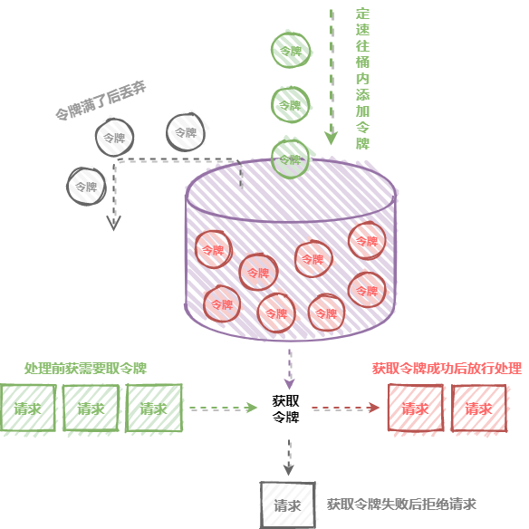

可以看出令牌桶在应对突发流量的时候，桶内假如有 100 个令牌，那么这 100 个令牌可以马上被取走，而不像漏桶那样匀速的消费。所以在**应对突发流量的时候令牌桶表现的更佳**。

令牌桶算法伪代码实现如下：

```java
    /**
     * 每秒处理数（放入令牌数量）
     */
    private long putTokenRate;
    
    /**
     * 最后刷新时间
     */
    private long refreshTime;

    /**
     * 令牌桶容量
     */
    private long capacity;
    
    /**
     * 当前桶内令牌数
     */
    private long currentToken = 0L;

    /**
     * 漏桶算法
     * @return
     */
    boolean tokenBucketTryAcquire() {
        long currentTime = System.currentTimeMillis();  //获取系统当前时间
        long generateToken = (currentTime - refreshTime) / 1000 * putTokenRate; //生成的令牌 =(当前时间-上次刷新时间)* 放入令牌速率
        currentToken = Math.min(capacity, generateToken + currentToken); // 当前令牌数量 = 之前的桶内令牌数量+放入的令牌数量
        refreshTime = currentTime; // 刷新时间
        
        //桶里面还有令牌，请求正常处理
        if (currentToken > 0) {
            currentToken--; //令牌数量-1
            return true;
        }
        
        return false;
    }
```


### 分布式限流

计数器限流的核心是 `INCRBY` 和 `EXPIRE` 指令，测试用例在此，通常，计数器算法容易出现不平滑的情况，瞬间的 qps 有可能超过系统的承载。

```lua
-- 获取调用脚本时传入的第一个 key 值（用作限流的 key）
local key = KEYS[1]
-- 获取调用脚本时传入的第一个参数值（限流大小）
local limit = tonumber(ARGV[1])
-- 获取计数器的限速区间 TTL
local ttl = tonumber(ARGV[2])

-- 获取当前流量大小
local curentLimit = tonumber(redis.call('get', key) or "0")

-- 是否超出限流
if curentLimit + 1 > limit then
    -- 返回 (拒绝)
    return 0
else
    -- 没有超出 value + 1
    redis.call('INCRBY', key, 1)
    -- 如果 key 中保存的并发计数为 0，说明当前是一个新的时间窗口，它的过期时间设置为窗口的过期时间
    if (current_permits == 0) then
	      redis.call('EXPIRE', key, ttl)
	  end
    -- 返回 (放行)
    return 1
end
```

此段 Lua 脚本的逻辑很直观：

- 通过 `KEYS[1]` 获取传入的 key 参数，为某个限流指标的 key
- 通过 `ARGV[1]` 获取传入的 limit 参数，为限流值
- 通过 `ARGV[2]` 获取限流区间 ttl
- 通过 `redis.call`，拿到 key 对应的值（默认为 0），接着与 limit 判断，如果超出表示该被限流；否则，使用 `INCRBY` 增加 1，未限流（需要处理初始化的情况，设置 `TTL`）

不过上面代码是有问题的，如果 key 之前存在且未设置 `TTL`，那么限速逻辑就会永远生效了（触发 limit 值之后），使用时需要注意。


令牌桶算法也是 Guava 中使用的算法，同样采用计算的方式，将时间和 Token 数目联系起来：

```lua
-- key
local key = KEYS[1]
-- 最大存储的令牌数
local max_permits = tonumber(KEYS[2])
-- 每秒钟产生的令牌数
local permits_per_second = tonumber(KEYS[3])
-- 请求的令牌数
local required_permits = tonumber(ARGV[1])

-- 下次请求可以获取令牌的起始时间
local next_free_ticket_micros = tonumber(redis.call('hget', key, 'next_free_ticket_micros') or 0)

-- 当前时间
local time = redis.call('time')
-- time[1] 返回的为秒，time[2] 为 ms
local now_micros = tonumber(time[1]) * 1000000 + tonumber(time[2])

-- 查询获取令牌是否超时（传入参数，单位为 微秒）
if (ARGV[2] ~= nil) then
    -- 获取令牌的超时时间
    local timeout_micros = tonumber(ARGV[2])
    local micros_to_wait = next_free_ticket_micros - now_micros
    if (micros_to_wait> timeout_micros) then
        return micros_to_wait
    end
end

-- 当前存储的令牌数
local stored_permits = tonumber(redis.call('hget', key, 'stored_permits') or 0)
-- 添加令牌的时间间隔（1000000ms 为 1s）
-- 计算生产 1 个令牌需要多少微秒
local stable_interval_micros = 1000000 / permits_per_second

-- 补充令牌
if (now_micros> next_free_ticket_micros) then
    local new_permits = (now_micros - next_free_ticket_micros) / stable_interval_micros
    stored_permits = math.min(max_permits, stored_permits + new_permits)
    -- 补充后，更新下次可以获取令牌的时间
    next_free_ticket_micros = now_micros
end

-- 消耗令牌
local moment_available = next_free_ticket_micros
-- 两种情况：required_permits<=stored_permits 或者 required_permits>stored_permits
local stored_permits_to_spend = math.min(required_permits, stored_permits)
local fresh_permits = required_permits - stored_permits_to_spend;
-- 如果 fresh_permits>0，说明令牌桶的剩余数目不够了，需要等待一段时间
local wait_micros = fresh_permits * stable_interval_micros

-- Redis 提供了 redis.replicate_commands() 函数来实现这一功能，把发生数据变更的命令以事务的方式做持久化和主从复制，从而允许在 Lua 脚本内进行随机写入
redis.replicate_commands()
-- 存储剩余的令牌数：桶中剩余的数目 - 本次申请的数目
redis.call('hset', key, 'stored_permits', stored_permits - stored_permits_to_spend)
redis.call('hset', key, 'next_free_ticket_micros', next_free_ticket_micros + wait_micros)
redis.call('expire', key, 10)

-- 返回需要等待的时间长度
-- 返回为 0（moment_available==now_micros）表示桶中剩余的令牌足够，不需要等待
return moment_available - now_micros
```

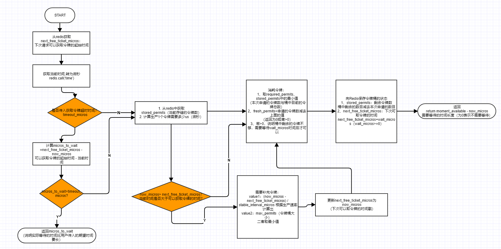


## Nginx限流

### 控制速率(limit_req_zone)

`ngx_http_limit_req_module` 模块提供限制请求处理速率能力，使用`漏桶算法(leaky bucket)`。使用`limit_req_zone` 和`limit_req`两个指令，限制单个IP的请求处理速率。格式：`limit_req_zone key zone rate`

```nginx
http {
    limit_req_zone $binary_remote_addr zone=testRateLimit:10m rate=10r/s;
}
server {
    location /test/ {
		limit_req zone=testRateLimit burst=20 nodelay;
        # 设置(http,server,location)超过限流策略后拒绝请求的响应状态码，默认503
        limit_req_status 555;
        # 设置(http,server,location)限流策略后打印的日志级别：info|notice|warn|error
        limit_req_log_level warn;
        # 设置(http,server,location)启动无过滤模式。启用后不会过滤请求，但仍会记录速率超量的日志，默认为off
        limit_req_dry_run off; 
        proxy_pass http://my_upstream;
    }
    error_page 555 /555json;
    location = /555json  {
        default_type application/json;
        add_header Content-Type 'text/html; charset=utf-8';
        return 200 '{"code": 666, "update":"访问高峰期，请稍后再试"}';
    }
}
```

- **key**：定义限流对象，`$binary_remote_addr` 表示基于 `remote_addr` 来做限流，`binary_` 的目的是压缩内存占用量
- **zone**：定义共享内存区来存储访问信息，`myRateLimit:10m` 表示一个大小为10M，名字为myRateLimit的内存区域。1M能存储16000 IP地址的访问信息，10M可以存储16W IP地址访问信息
- **rate**：设置最大访问速率，`rate=10r/s` 表示每秒最多处理10个请求。Nginx 实际上以毫秒为粒度来跟踪请求信息，因此 10r/s 实际上是限制：每100毫秒处理一个请求。即上一个请求处理完后，后续100毫秒内又有请求到达，将拒绝处理该请求
- **burst**：处理突发流量
  - `burst=20` 表示若同时有21个请求到达，Nginx 会处理第1个请求，剩余20个请求将放入队列，然后每隔100ms从队列中获取一个请求进行处理。若请求数大于21，将拒绝处理多余的请求，直接返回503
  - `burst=20 nodelay` 表示20个请求立马处理，不能延迟。不过即使这20个突发请求立马处理结束，后续来请求也不会立马处理。**burst=20** 相当于缓存队列中占了20个坑，即使请求被处理，这20个位置这只能按100ms一个来释放


### 控制并发连接数(limit_conn_zone)

`ngx_http_limit_conn_module`提供了限制连接数的能力，利用`limit_conn_zone`和`limit_conn`两个指令即可。下面是Nginx官方例子：

```nginx
limit_conn_zone $binary_remote_addr zone=test:10m;
limit_conn_zone $server_name zone=demo:10m;

server {
	# 表示限制单个IP同时最多持有10个连接
    limit_conn test 10;
    # 表示虚拟主机(server) 同时能处理并发连接的总数为100个
    limit_conn demo 100;
    # 设置(http,server,location)超过限流策略后拒绝请求的响应状态码，默认503
    limit_conn_status 555;
    # 设置(http,server,location)限流策略后打印的日志级别：info|notice|warn|error
    limit_conn_log_level warn;
    # 设置(http,server,location)启动无过滤模式。启用后不会过滤请求，但仍会记录速率超量的日志，默认为off
    limit_conn_dry_run off;
    
    error_page 555 /555json;
    location = /555json  {
        default_type application/json;
        add_header Content-Type 'text/html; charset=utf-8';
        return 200 '{"code": 666, "update":"访问高峰期，请稍后再试"}';
    }
}
```

**注意**：只有当 **request header** 被后端server处理后，这个连接才进行计数。


### lua限流

**第一步**：安装说明

环境准备：

```shell
yum install -y gcc gcc-c++ readline-devel pcre-devel openssl-devel tcl perl
```

安装drizzle http://wiki.nginx.org/HttpDrizzleModule：

```shell
cd /usr/local/src/ 
wget http://openresty.org/download/drizzle7-2011.07.21.tar.gz 
tar xzvf drizzle-2011.07.21.tar.gz 
cd drizzle-2011.07.21/ 
./configure --without-server 
make libdrizzle-1.0 
make install-libdrizzle-1.0 
export LD_LIBRARY_PATH=/usr/local/lib:$LD_LIBRARY_PATH
```

安装openresty：

```shell
wget http://openresty.org/download/ngx_openresty-1.7.2.1.tar.gz 
tar xzvf ngx_openresty-1.7.2.1.tar.gz 
cd ngx_openresty-1.7.2.1/ 
./configure --with-http_drizzle_module 
gmake 
gmake install
```

**第二步**：Nginx配置nginx.conf

`/usr/local/openresty/nginx/conf/nginx.conf`：

```nginx
# 添加MySQL配置(drizzle) 
upstream backend { 
    drizzle_server 127.0.0.1:3306 dbname=test user=root password=123456 protocol=mysql; 
    drizzle_keepalive max=200 overflow=ignore mode=single; 
}

server { 
    listen       80; 
    server_name  localhost;

    location / { 
        root   html; 
        index  index.html index.htm; 
    }

    location /lua _test{ 
        default_type text/plain; 
        content_by_lua 'ngx.say("hello, lua")'; 
    }


    location /lua_redis { 
        default_type text/plain; 
        content_by_lua_file /usr/local/lua_test/redis_test.lua; 
    } 

    location /lua_mysql { 
            default_type text/plain; 
            content_by_lua_file /usr/local/lua_test/mysql_test.lua; 
    }


    location @cats-by-name { 
        set_unescape_uri $name $arg_name; 
        set_quote_sql_str $name; 
        drizzle_query 'select * from cats where name=$name'; 
        drizzle_pass backend; 
        rds_json on; 
    }
    location @cats-by-id { 
        set_quote_sql_str $id $arg_id; 
        drizzle_query 'select * from cats where id=$id'; 
        drizzle_pass backend; 
        rds_json on; 
    }
    location = /cats { 
        access_by_lua ' 
            if ngx.var.arg_name then 
                return ngx.exec("@cats-by-name") 
            end

            if ngx.var.arg_id then 
                return ngx.exec("@cats-by-id") 
            end 
        ';

        rds_json_ret 400 "expecting \"name\" or \"id\" query arguments"; 
    }
    # 通过url匹配出name，并编码防止注入，最后以json格式输出结果 
    location ~ '^/mysql/(.*)' { 
        set $name $1; 
        set_quote_sql_str $quote_name $name; 
        set $sql "SELECT * FROM cats WHERE name=$quote_name"; 
        drizzle_query $sql; 
        drizzle_pass backend; 
        rds_json on; 
    }
    # 查看MySQL服务状态 
    location /mysql-status { 
        drizzle_status; 
    } 
} 
```

**第三步**：lua测试脚本

`/usr/local/lua_test/redis_test.lua`：

```lua
local redis = require "resty.redis"
local cache = redis.new()
cache.connect(cache, '127.0.0.1', '6379')
local res = cache:get("foo")
if res==ngx.null then
    ngx.say("This is Null")
    return
end
ngx.say(res)
```

`/usr/local/lua_test/mysql_test.lua`：

```lua
local mysql = require "resty.mysql"
local db, err = mysql:new()
if not db then
    ngx.say("failed to instantiate mysql: ", err)
    return
end

db:set_timeout(1000) -- 1 sec

-- or connect to a unix domain socket file listened
-- by a mysql server:
--     local ok, err, errno, sqlstate =
--           db:connect{
--              path = "/path/to/mysql.sock",
--              database = "ngx_test",
--              user = "ngx_test",
--              password = "ngx_test" }

local ok, err, errno, sqlstate = db:connect{
    host = "127.0.0.1",
    port = 3306,
    database = "test",
    user = "root",
    password = "123456",
    max_packet_size = 1024 * 1024 }

if not ok then
    ngx.say("failed to connect: ", err, ": ", errno, " ", sqlstate)
    return
end

ngx.say("connected to mysql.")

local res, err, errno, sqlstate =
    db:query("drop table if exists cats")
if not res then
    ngx.say("bad result: ", err, ": ", errno, ": ", sqlstate, ".")
    return
end

res, err, errno, sqlstate =
    db:query("create table cats "
             .. "(id serial primary key, "
             .. "name varchar(5))")
if not res then
    ngx.say("bad result: ", err, ": ", errno, ": ", sqlstate, ".")
    return
end

ngx.say("table cats created.")

res, err, errno, sqlstate =
    db:query("insert into cats (name) "
             .. "values (\'Bob\'),(\'\'),(null)")
if not res then
    ngx.say("bad result: ", err, ": ", errno, ": ", sqlstate, ".")
    return
end

ngx.say(res.affected_rows, " rows inserted into table cats ",
        "(last insert id: ", res.insert_id, ")")

-- run a select query, expected about 10 rows in
-- the result set:
res, err, errno, sqlstate =
    db:query("select * from cats order by id asc", 10)
if not res then
    ngx.say("bad result: ", err, ": ", errno, ": ", sqlstate, ".")
    return
end

local cjson = require "cjson"
ngx.say("result: ", cjson.encode(res))

-- put it into the connection pool of size 100,
-- with 10 seconds max idle timeout
local ok, err = db:set_keepalive(10000, 100)
if not ok then
    ngx.say("failed to set keepalive: ", err)
    return
end

-- or just close the connection right away:
-- local ok, err = db:close()
-- if not ok then
--     ngx.say("failed to close: ", err)
--     return
-- end
';
```

**第四步**：验证结果

```shell
$ curl 'http://127.0.0.1/lua_test' 
hello, lua

$ redis-cli set foo 'hello,lua-redis' 
OK 
$ curl 'http://127.0.0.1/lua_redis' 
hello,lua-redis

$ curl 'http://127.0.0.1/lua_mysql' 
connected to mysql. 
table cats created. 
3 rows inserted into table cats (last insert id: 1) 
result: [{"name":"Bob","id":"1"},{"name":"","id":"2"},{"name":null,"id":"3"}]

$ curl 'http://127.0.0.1/cats' 
{"errcode":400,"errstr":"expecting \"name\" or \"id\" query arguments"}

$ curl 'http://127.0.0.1/cats?name=bob' 
[{"id":1,"name":"Bob"}]

$ curl 'http://127.0.0.1/cats?id=2' 
[{"id":2,"name":""}]

$ curl 'http://127.0.0.1/mysql/bob' 
[{"id":1,"name":"Bob"}]

$ curl 'http://127.0.0.1/mysql-status' 
worker process: 32261

upstream backend 
  active connections: 0 
  connection pool capacity: 0 
  servers: 1 
  peers: 1
```


## API经济

**API经济**

API经济是基于API所产生经济活动的总和，在当今发展阶段主要包括API业务，以及通过API进行的业务功能、性能等方面的商业交易。


**借贷机制**

针对两个连续的限流时间窗切换时，如果切换前的时间窗中的请求量已被使用完，则第一个时间窗可以向下一个时间窗预借一小部分的请求量（小于每个时间窗内的资源量，建议运行借贷20%以内的资源）来提前使用，如果该时间窗内预借的资源也消耗完，则触发限流拒绝措施；那么在第二个时间窗内则会少使用被借走的请求量。在预借请求量时，如果当前时间窗”已欠费“（即有被借走的量），则该时间窗不允许向下一个时间窗借贷资源。


# 分布式缓存

## 淘汰算法

### 最不经常使用算法(LFU)

这个缓存算法使用一个计数器来记录条目被访问的频率。通过使用LFU缓存算法，最低访问数的条目首先被移除。这个方法并不经常使用，因为它无法对一个拥有最初高访问率之后长时间没有被访问的条目缓存负责。

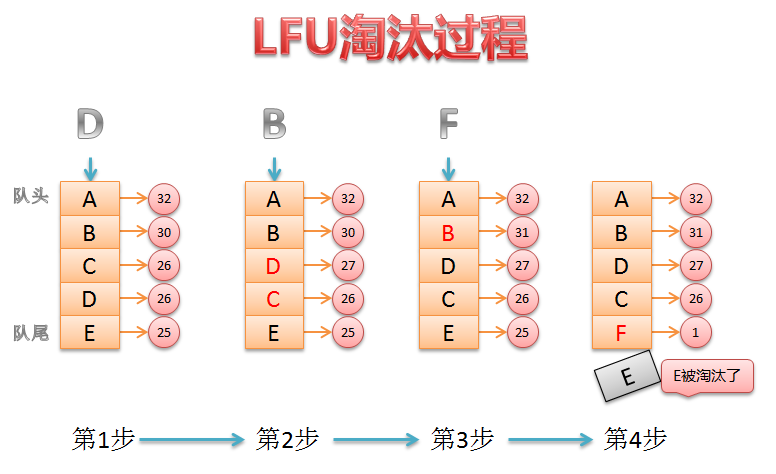


### 最近最少使用算法(LRU)

这个缓存算法将最近使用的条目存放到靠近缓存顶部的位置。当一个新条目被访问时，LRU将它放置到缓存的顶部。当缓存达到极限时，较早之前访问的条目将从缓存底部开始被移除。这里会使用到昂贵的算法，而且它需要记录“年龄位”来精确显示条目是何时被访问的。此外，当一个LRU缓存算法删除某个条目后，“年龄位”将随其他条目发生改变。

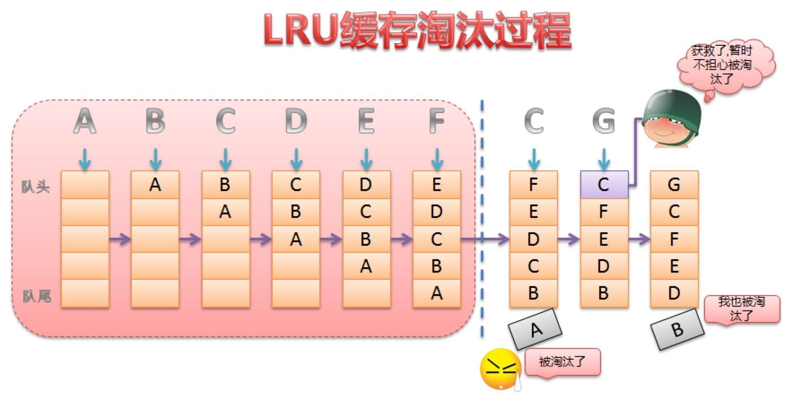

一个缓存被访问后，近期再被访问的可能性很大。可以记录每个缓存记录的最近访问时间，最近未被访问时间最长的数据会被首先淘汰。

优点：实现简单，能适应访问热点
缺点：对偶发的访问敏感，影响命中率
簿记开销：时间 `O(1)`，空间 `O(N)`


### 自适应缓存替换算法(ARC)

在IBM Almaden研究中心开发，这个缓存算法同时跟踪记录LFU和LRU，以及驱逐缓存条目，来获得可用缓存的最佳使用。


### 先进先出算法(FIFO)

FIFO是英文First In First Out 的缩写，是一种先进先出的数据缓存器，他与普通存储器的区别是没有外部读写地址线，这样使用起来非常简单，但缺点就是只能顺序写入数据，顺序的读出数据，其数据地址由内部读写指针自动加1完成，不能像普通存储器那样可以由地址线决定读取或写入某个指定的地址。

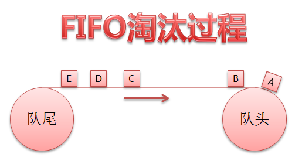

越早进入缓存的数据，其不再被访问的可能性越大。因此在淘汰缓存时，应选择在内存中停留时间最长的缓存记录。使用队列即可实现该策略：

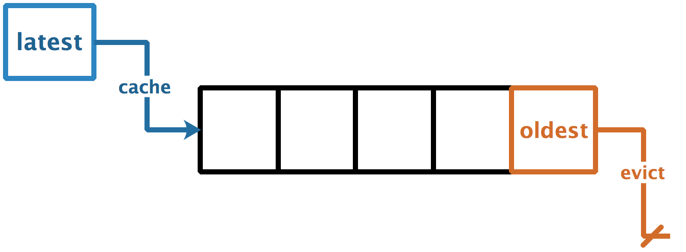

优点：实现简单，适合线性访问的场景
缺点：无法适应特定的访问热点，缓存的命中率差
簿记开销：时间 `O(1)`，空间 `O(N)`


### 最近最常使用算法(MRU)

这个缓存算法最先移除最近最常使用的条目。一个MRU算法擅长处理一个条目越久，越容易被访问的情况。


## 缓存策略

缓存更新的策略主要分为三种：

- **Cache-Aside**：通常会先更新数据库，然后再删除缓存，为了兜底通常还会将数据设置缓存时间
- **Read/Write through**：一般是由一个 Cache Provider 对外提供读写操作，应用程序不用感知操作的是缓存还是数据库
- **Write-Behind**：即延迟写入，Cache Provider 每隔一段时间会批量输入数据库，优点是应用程序写入速度非常快

### Cache-Aside

`Cache-Aside（旁路缓存）`的提出是为了尽可能地解决缓存与数据库的数据不一致问题。

#### Read Cache Aside

`Cache-Aside` 的读请求流程如下：

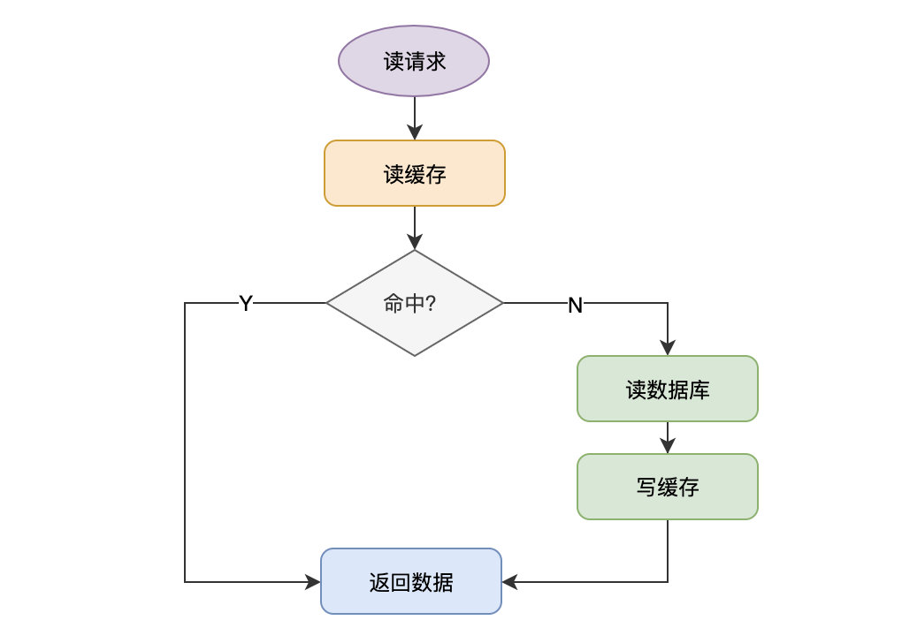

- 读的时候，先读缓存，缓存命中的话，直接返回数据
- 缓存没有命中的话，就去读数据库，从数据库取出数据，放入缓存后，同时返回响应


#### Write Cache Aside

`Cache Aside` 的写请求流程如下：

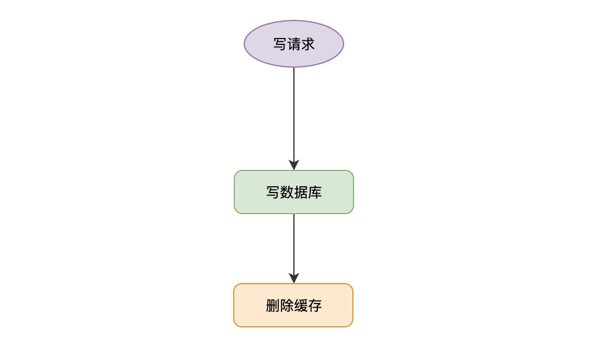

- 更新的时候，先**更新数据库，然后再删除缓存**


### Read/Write-Through

`Read/Write-Through（读写穿透）` 模式中，服务端把缓存作为主要数据存储。应用程序跟数据库缓存交互，都是通过**抽象缓存层**完成的。

#### Read-Through

`Read-Through`的简要流程如下

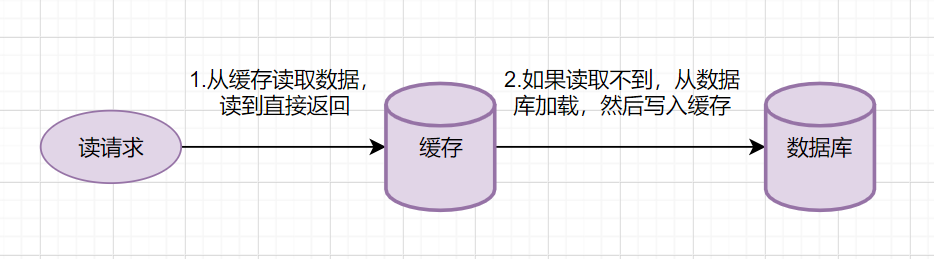

- 从缓存读取数据，读到直接返回
- 如果读取不到的话，从数据库加载，写入缓存后，再返回响应

这个简要流程是不是跟`Cache-Aside`很像呢？其实`Read-Through`就是多了一层`Cache-Provider`而已，流程如下：

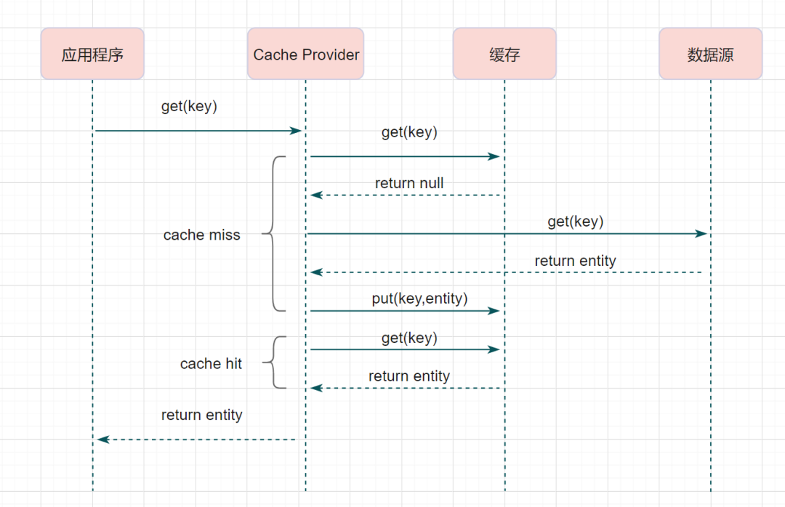

`Read-Through`实际只是在`Cache-Aside`之上进行了一层封装，它会让程序代码变得更简洁，同时也减少数据源上的负载。


#### Write-Through

`Write-Through`模式下，当发生写请求时，也是由**缓存抽象层**完成数据源和缓存数据的更新，流程如下：

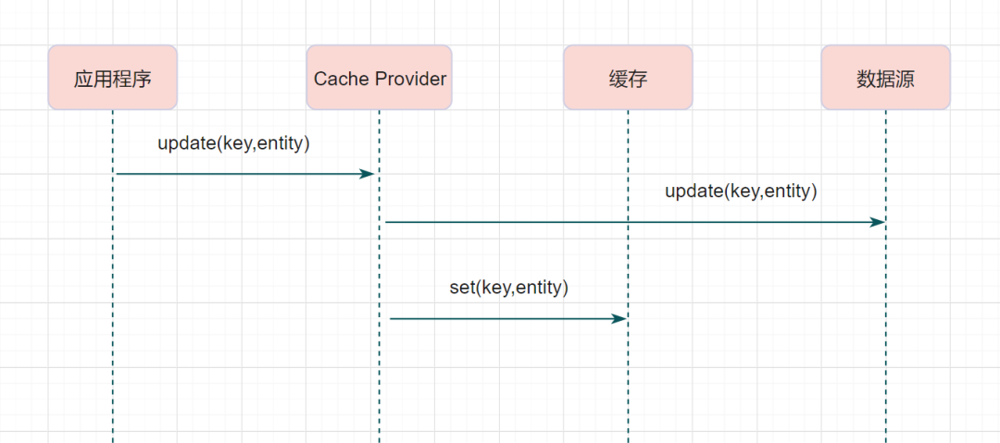


### Write-Behind

`Write-Behind`在一些地方也被成为`Write back`， 简单理解就是：应用程序更新数据时只更新缓存， `Cache Provider`每隔一段时间将数据刷新到数据库中。说白了就是`延迟写入`。

`Write-Behind（异步写入）` 和 `Read/Write-Through` 有相似的地方，都是由`Cache Provider`来负责缓存和数据库的读写。它们又有个很大的不同：`Read/Write-Through`是同步更新缓存和数据的，`Write-Behind`则是只更新缓存，不直接更新数据库，通过**批量异步**的方式来更新数据库。

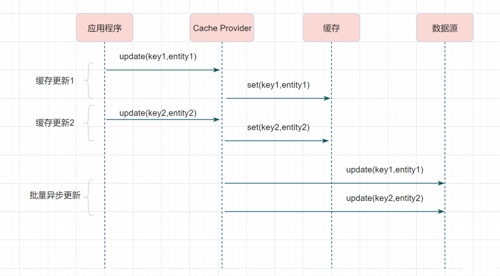

这种方式下，缓存和数据库的一致性不强，**对一致性要求高的系统要谨慎使用**。但是它适合频繁写的场景，MySQL的**InnoDB Buffer Pool机制**就使用到这种模式。如上图，应用程序更新两个数据，Cache Provider 会立即写入缓存中，但是隔一段时间才会批量写入数据库中。优缺点如下：

- **优点**：是数据写入速度非常快，适用于频繁写的场景
- **缺点**：是缓存和数据库不是强一致性，对一致性要求高的系统慎用


## 策略选择

### 删除or更新

操作缓存的时候，到底是删除缓存呢，还是更新缓存？日常开发中，我们一般使用的就是`Cache-Aside`模式。有些小伙伴可能会问， `Cache-Aside`在写入请求的时候，为什么是**删除缓存而不是更新缓存**呢？

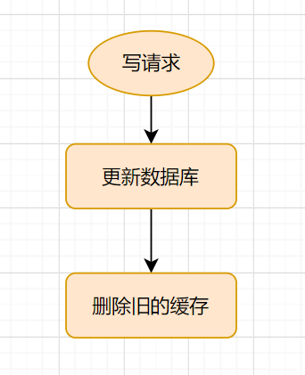

我们在操作缓存的时候，到底应该删除缓存还是更新缓存呢？我们先来看个例子：

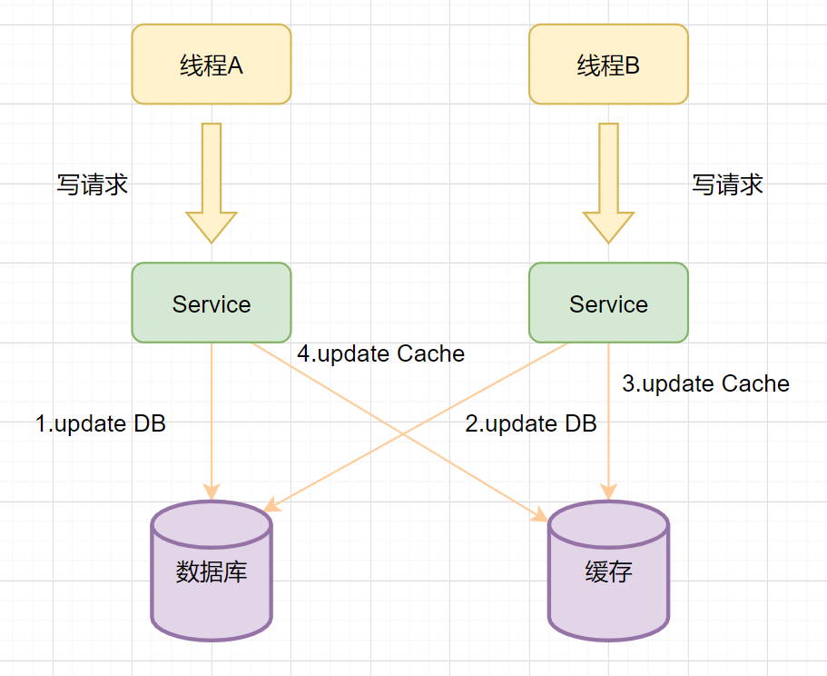

1. 线程A先发起一个写操作，第一步先更新数据库
2. 线程B再发起一个写操作，第二步更新了数据库
3. 由于网络等原因，线程B先更新了缓存
4. 线程A更新缓存

这时候，缓存保存的是A的数据（老数据），数据库保存的是B的数据（新数据），数据**不一致**了，脏数据出现啦。如果是**删除缓存取代更新缓存**则不会出现这个脏数据问题。**更新缓存相对于删除缓存**，还有两点劣势：

- 如果你写入的缓存值，是经过复杂计算才得到的话。更新缓存频率高的话，就浪费性能啦
- 在写数据库场景多，读数据场景少的情况下，数据很多时候还没被读取到，又被更新了，这也浪费了性能呢(实际上，写多的场景，用缓存也不是很划算的)


### 双写顺序

双写的情况下，先操作数据库还是先操作缓存？`Cache-Aside` 缓存模式中，有些小伙伴还是会有疑问，在写请求过来的时候，为什么是**先操作数据库呢**？为什么**不先操作缓存**呢？比如一条数据同时存在数据库、缓存，现在你要更新此数据，不管先更新数据库，还是先更新缓存，这两种方式都有问题。

**方案一：先更新数据库，后更新缓存**

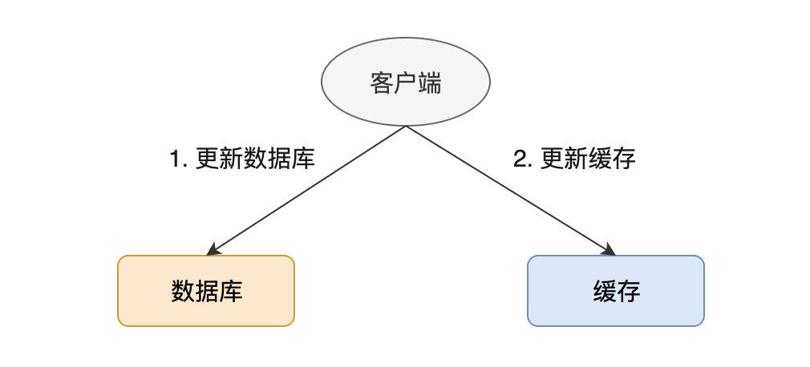

如下案例会造成数据不一致。

A先把数据库更新为 123，由于网络问题，更新缓存的动作慢了。这时，B 去更新数据库了，改为了 456，紧接着把缓存也更新为456。现在A更新缓存的请求到了，把缓存更新为了 123。那么这时数据就不一致了，数据库里是最新的 456，而缓存是 123，是旧数据。因为数据库更新、缓存更新这2个动作不是原子的，在高并发操作时，这2个动作直接会插入其他动作。

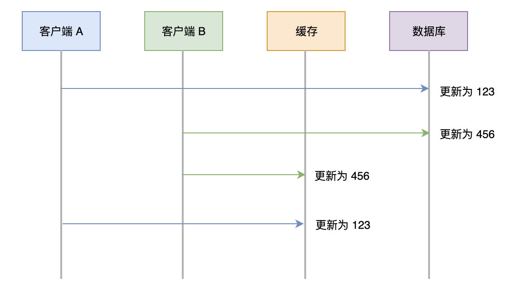


**方案二：先更新缓存，再更新数据库**

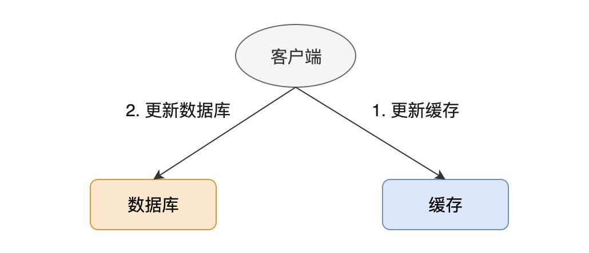

如下案例也同样可能数据不一致。

缓存更新成功，数据为最新的，但数据库更新失败，回滚了，还是旧数据。还是非原子操作的原因。

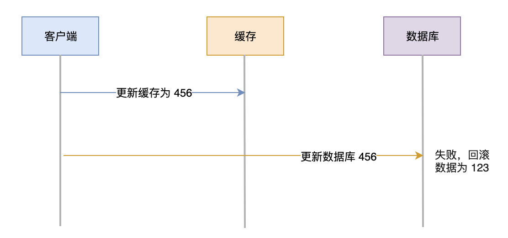

**注意**：先操作数据库再操作缓存，不一样也会导致数据不一致嘛？它俩又不是原子性操作的。这个是**会的**，但是这种方式，一般因为删除缓存失败等原因，才会导致脏数据，这个概率就很低。接下来我们再来分析这种**删除缓存失败**的情况，**如何保证一致性**。


## 缓存问题

### 缓存雪崩

当**大量缓存数据在同一时间过期（失效）或者 Redis 故障宕机**时，如果此时有大量的用户请求，都无法在 Redis 中处理，于是全部请求都直接访问数据库，从而导致数据库的压力骤增，严重的会造成数据库宕机，从而形成一系列连锁反应，造成整个系统崩溃，这就是**缓存雪崩**的问题。


发生缓存雪崩的原因及解决方案：

**① 大量数据同时过期**

- **均匀设置过期时间**：给缓存数据的过期时间加上一个随机数
- **互斥锁**：加个互斥锁，保证同一时间内只有一个请求来构建缓存
- **二级缓存**：每一级缓存的失效时间都不同
- **队列控制**：使用MQ控制读取数据库的请求数据。即发N个消息，单线程消费
- **热点数据缓存永远不过期**
  - **物理不过期**：针对热点key不设置过期时间
  - **逻辑过期**：把过期时间存在key对应的value里，如果发现要过期了，通过一个后台的异步线程进行缓存的构建

**② Redis故障宕机**

- **服务熔断或请求限流机制**：启动服务熔断机制，暂停业务对缓存服务访问，直接返回错误；或启用限流机制
- **构建Redis缓存高可靠集群**：通过主从节点的方式构建Redis缓存高可靠集群
- **开启Redis持久化机制**：一旦重启，能直接从磁盘上自动加载数据恢复内存中的数据


### 缓存击穿

如果缓存中的**某个热点数据过期**了，此时大量的请求访问了该热点数据，就无法从缓存中读取，直接访问数据库，数据库很容易就被高并发的请求冲垮，这就是**缓存击穿**的问题，如秒杀活动。

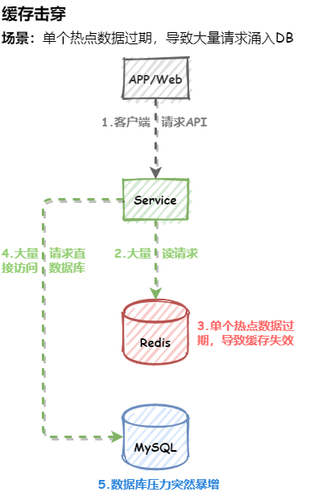

缓存击穿跟缓存雪崩很相似，可以认为缓存击穿是缓存雪崩的一个子集。应对缓存击穿可以采取以下两种方案：

- **互斥锁方案**：保证同一时间只有一个业务线程更新缓存，未能获取互斥锁的请求，要么等待锁释放后重新读取缓存，要么就返回空值或者默认值

- **热点数据缓存永远不过期**

  - **物理不过期**：针对热点key不设置过期时间
  - **逻辑过期**：把过期时间存在key对应的value里，如果发现要过期了，通过一个后台的异步线程进行缓存的构建

  

### 缓存穿透

当用户访问的数据，**既不在缓存中，也不在数据库中**，导致请求在访问缓存时，发现缓存缺失，再去访问数据库时，发现数据库中也没有要访问的数据，没办法构建缓存数据来服务后续的请求。那么当有大量这样的请求到来时，数据库的压力骤增，这就是**缓存穿透**的问题。

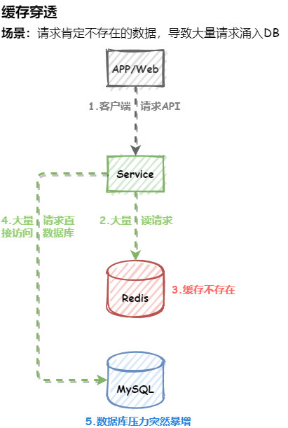

缓存穿透的发生一般有这两种情况：

- **业务误操作**：缓存中的数据和数据库中的数据都被误删除了，所以导致缓存和数据库中都没有数据
- **黑客恶意攻击**：故意大量访问某些读取不存在数据的业务

应对缓存穿透的方案，常见的方案有三种：

- **拦截非法请求**

- **布隆过滤器**：构造一个`BloomFilter`过滤器，初始化全量数据，当接到请求时，在`BloomFilter`中判断这个key是否存在，如果不存在，直接返回即可，无需再查询`缓存和DB`

- **缓存空对象**：查存DB 时，如果数据不存在，预热一个`特殊空值`到缓存中。这样，后续查询都会命中缓存，但是要对特殊值，解析处理

  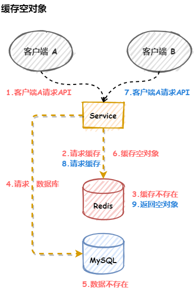


**布隆过滤器工作原理**

布隆过滤器由「**初始值都为 0 的位图数组**」和「 **N 个哈希函数**」两部分组成。当我们在写入数据库数据时，在布隆过滤器里做个标记，这样下次查询数据是否在数据库时，只需要查询布隆过滤器，如果查询到数据没有被标记，说明不在数据库中。布隆过滤器会通过 3 个操作完成标记：

- 第一步：使用 N 个哈希函数分别对数据做哈希计算，得到 N 个哈希值
- 第二步：将第一步得到的 N 个哈希值对位图数组的长度取模，得到每个哈希值在位图数组的对应位置
- 第三步：将每个哈希值在位图数组的对应位置的值设置为 1

举个例子，假设有一个位图数组长度为 8，哈希函数 3 个的布隆过滤器：

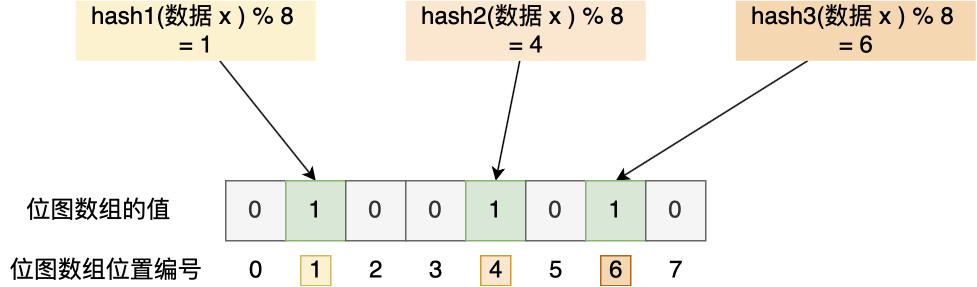

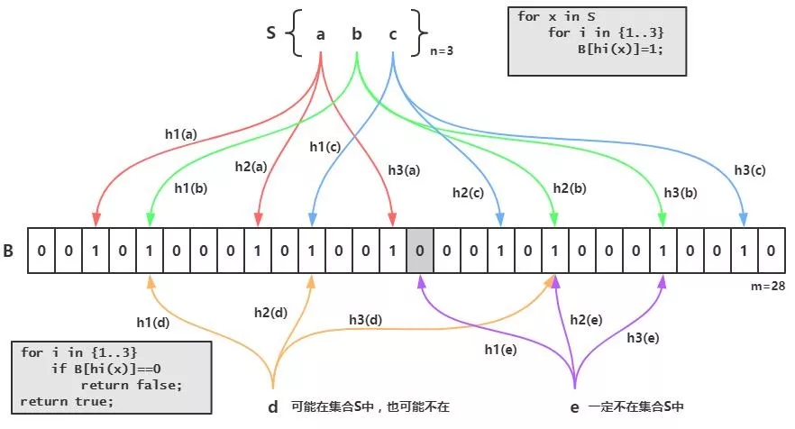


### 缓存预热

缓存预热是指系统上线后，提前将相关的缓存数据加载到缓存系统。避免在用户请求的时候，先查询数据库，然后再将数据缓存的问题，用户直接查询事先被预热的缓存数据。如果不进行预热，那么Redis初始状态数据为空，系统上线初期，对于高并发的流量，都会访问到数据库中， 对数据库造成流量的压力。

**缓存预热思路：**

- **数据量不大的时候**：工程启动的时候进行加载缓存动作
- **数据量大的时候**：设置一个定时任务脚本，进行缓存的刷新
- **数据量太大的时候**：优先保证热点数据进行提前加载到缓存


**缓存预热解决方案：**

- 直接写个缓存刷新页面，上线时手工操作下
- 数据量不大，可以在项目启动的时候自动进行加载
- 定时刷新缓存


### 缓存降级

缓存降级是指当访问量剧增、服务出现问题（如响应时间慢或不响应）或非核心服务影响到核心流程的性能时，仍然需要保证服务还是可用的，即使是有损服务。系统可以根据一些关键数据进行自动降级，也可以配置开关实现人工降级。

**降级的最终目的是保证核心服务可用，即使是有损的**。而且有些服务是无法降级的（如加入购物车、结算）。


**分级降级预案：**

- **一般**：比如有些服务偶尔因为网络抖动或者服务正在上线而超时，可以自动降级
- **警告**：有些服务在一段时间内成功率有波动（如在95~100%之间），可以自动降级或人工降级，并发送告警
- **错误**：比如可用率低于90%，或数据库连接池被打爆，或访问量突然猛增到系统能承受的最大阀值，此时可以根据情况自动降级或者人工降级
- **严重错误**：比如因为特殊原因数据错误了，此时需要紧急人工降级


### 缓存更新

除了缓存服务器自带的缓存失效策略之外（Redis默认的有6中策略可供选择），还可以根据具体的业务需求进行自定义的缓存淘汰。常见的更新策略如下：

- **LRU/LFU/FIFO**：都是属于当**缓存不够用**时采用的更新算法

  适合内存空间有限，数据长期不变动，基本不存在数据一不致性业务。比如一些一经确定就不允许变更的信息。

- **超时剔除**：给缓存数据设置一个过期时间

  适合于能够容忍一定时间内数据不一致性的业务，比如促销活动的描述文案。

- **主动更新**：如果数据源的数据有更新，则主动更新缓存

  对于数据的一致性要求很高，比如交易系统，优惠劵的总张数。


常见数据更新方式有两大类，其余基本都是这两类的变种：

**方式一：先删缓存，再更新数据库**

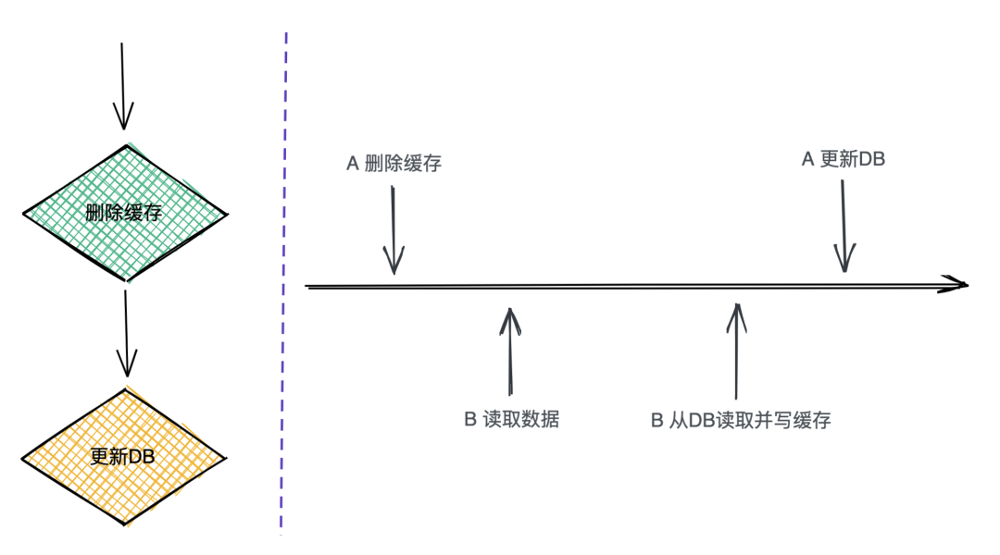

这种做法是遇到数据更新，我们先去删除缓存，然后再去更新DB，如左图。让我们来看一下整个操作的流程：

- A请求需要更新数据，先删除对应的缓存，还未更新DB
- B请求来读取数据
- B请求看到缓存里没有，就去读取DB并将旧数据写入缓存（脏数据）
- A请求更新DB

可以看到B请求将脏数据写入了缓存，如果这是一个读多写少的数据，可能脏数据会存在比较长的时间（要么有后续更新，要么等待缓存过期），这是业务上不能接受的。


**方式二：先更新数据库，再删除缓存**

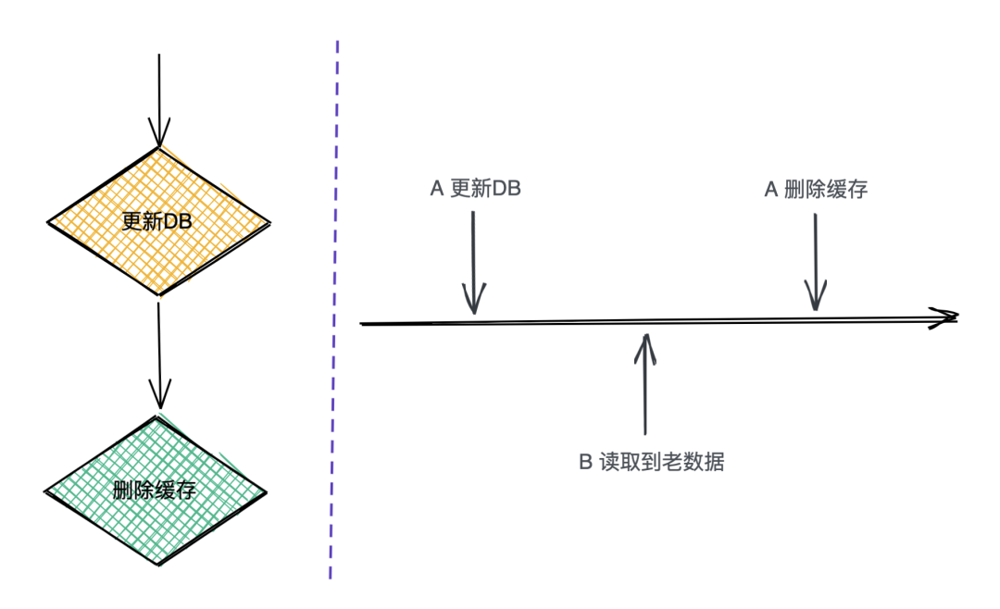

上图的右侧部分可以看到在A更新DB和删除缓存之间B请求会读取到老数据，因为此时A操作还没有完成，并且这种读到老数据的时间是非常短的，可以满足数据最终一致性要求。


**删除缓存而非更新缓存原因**

上图可以看到我们用的是删除缓存，而不是更新缓存，原因如下图：

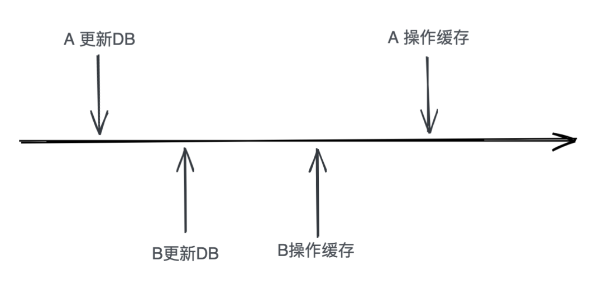

上图我用操作代替了删除或更新，当我们做删除操作时，A先删还是B先删没有关系，因为后续读取请求都会从DB加载出最新数据；但是当我们对缓存做的是更新操作时，就会对A先更新缓存还是B先更新缓存敏感了，如果A后更新，那么缓存里就又存在脏数据了，所以 go-zero 只使用删除缓存的方式。


**缓存更新请求处理流程**

我们来一起看看完整的请求处理流程：

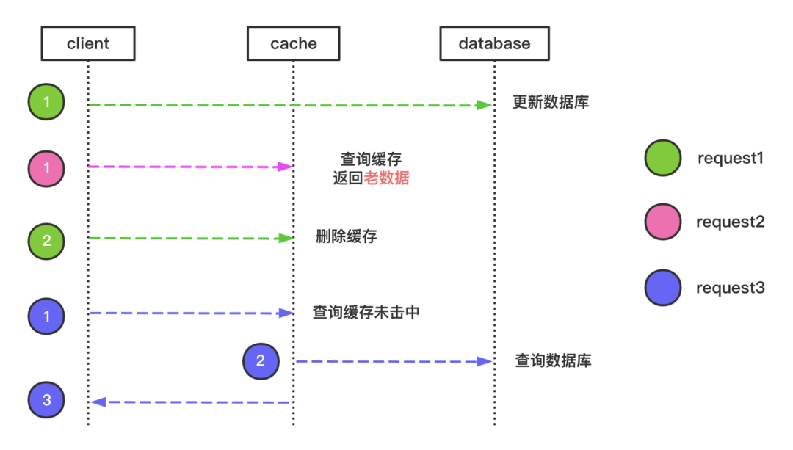

**注意**：不同颜色代表不同请求。

- 请求1更新DB
- 请求2查询同一个数据，返回了老的数据，这个短时间内返回旧数据是可以接受的，满足最终一致性
- 请求1删除缓存
- 请求3再来请求时缓存里没有，就会查询数据库，并回写缓存再返回结果
- 后续的请求就会直接读取缓存了


### 缓存Hot Key

对于突发事件，大量用户同时去访问热点信息，这个突发热点信息所在的缓存节点就很容易出现过载和卡顿现象，甚至 Crash，我们称之为缓存热点。这个在新浪微博经常遇到，某大V明星出轨、结婚、离婚，瞬间引发数百千万的吃瓜群众围观，访问同一个key，流量集中打在一个缓存节点机器，很容易打爆网卡、带宽、CPU的上限，最终导致缓存不可用。

一般使用 **缓存+过期时间** 的策略来加速读写，又保证数据的定期更新，这种模式基本能满足绝大部分需求。但是如果有两个问题同时出现，可能会对应用造成致命的伤害：

- **当前key是一个hot key**。比如热点娱乐新闻，并发量非常大
- **重建缓存不能在短时间完成，可能是一个复杂计算**。例如复杂的SQL、多次IO、多个依赖等

当缓存失效的瞬间，将会有大量线程来重建缓存，造成后端负载加大，甚至让应该崩溃。


**如何发现热key？**

- 预估热key，如秒杀商品，火爆新闻
- 在客户端进行统计
- 可用Proxy，如Codis可以在Proxy端收集
- 利用redis自带命令，monitor，hotkeys。**执行缓慢，不推荐使用**
- 利用流式计算引擎统计访问次数，如Storm、Spark Streaming、Flink


解决方案主要包括以下几种：

- 首先能先找到这个`热key`来，比如通过`Spark`实时流分析，及时发现新的热点key
- 将集中化流量打散，避免一个缓存节点过载。由于只有一个key，我们可以在key的后面拼上`有序编号`，比如`key#01`、`key#02`......`key#10`多个副本，这些加工后的key位于多个缓存节点上。每次请求时，客户端随机访问一个即可

- **本地缓存**

  变更分布式缓存为本地缓存，减少网络开销，提高吞吐量。

- **互斥锁**

  具体做法是只允许一个线程重建缓存，其它线程等待重建缓存的线程执行完，重新从缓存获取数据即可。

  - **方案风险**：重建的时间太长或者并发量太大，将会大量的线程阻塞，同样会加大系统负载

  - **优化方案**：除了重建线程之外，其它线程拿旧值直接返回

    比如Google的Guava Cache的refreshAfterWrite采用的就是这种方案避免雪崩效应。

- **永不过期**

  这种就是缓存更新操作是独立的，可以通过跑定时任务来定期更新，或者变更数据时主动更新。

- **限流熔断**

  以上两种方案都是建立在我们事先知道hot key的情况下，如果事先知道哪些是hot key，其实问题都不是很大。问题是我们不知道的情况，既然hot key的危害是因为有大量的重建请求落到了后端，如果后端自己做了限流，只有部分请求落到了后端, 其它的都打回去了。一个hot key只要有一个重建请求处理成功了,后面的请求都是直接走缓存了，问题就解决了。


### 缓存Big Key

Big Key指数据量大的key，由于其数据大小远大于其它key，导致经过分片之后，某个具体存储这个Big Key的实例内存使用量远大于其他实例，造成内存不足，拖累整个集群的使用。


**常见场景**

- 热门话题下的讨论
- 大V的粉丝列表
- 序列化后的图片
- 没有及时处理的垃圾数据


**大Key影响**

- 大key会大量占用内存，在Redis集群中无法均衡
- Reids性能下降，影响主从复制
- 在主动删除或过期删除时操作时间过长而引起服务阻塞


**如何发现大key**

- redis-cli --bigkeys命令。可以找到某个实例5种数据类型(String、hash、list、set、zset)的最大key。但如果Redis的key比较多，执行该命令会比较慢
- 获取生产Redis的rdb文件，通过rdbtools分析rdb生成csv文件，再导入MySQL或其他数据库中进行分析统计，根据size_in_bytes统计bigkey


**解决方案**

优化big key的原则就是string减少字符串长度，而list、hash、set、zset等则减少成员数：

- string类型的big key，尽量不要存入Redis中，可以使用文档型数据库MongoDB或缓存到CDN上。如果必须用Redis存储，最好单独存储，不要和其他的key一起存储

- 设置一个阈值，当value的长度超过阈值时，对内容启动压缩，降低kv的大小
- 评估`大key`所占的比例，由于很多框架采用`池化技术`，如：Memcache，可以预先分配大对象空间。真正业务请求时，直接拿来即用
- 颗粒划分，将大key拆分为多个小key，独立维护，成本会降低不少
- 大key要设置合理的过期时间，尽量不淘汰那些大key


## 数据一致性

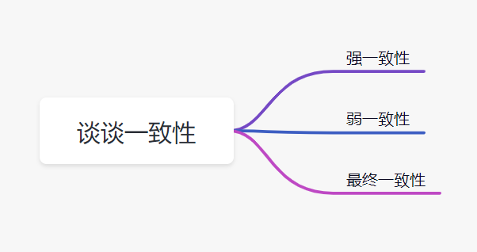

一致性就是数据保持一致，在分布式系统中，可以理解为多个节点中数据的值是一致的。

- **强一致性**：这种一致性级别是最符合用户直觉的，它要求系统写入什么，读出来的也会是什么，用户体验好，但实现起来往往对系统的性能影响大
- **弱一致性**：这种一致性级别约束了系统在写入成功后，不承诺立即可以读到写入的值，也不承诺多久之后数据能够达到一致，但会尽可能地保证到某个时间级别（比如秒级别）后，数据能够达到一致状态
- **最终一致性**：最终一致性是弱一致性的一个特例，系统会保证在一定时间内，能够达到一个数据一致的状态。这里之所以将最终一致性单独提出来，是因为它是弱一致性中非常推崇的一种一致性模型，也是业界在大型分布式系统的数据一致性上比较推崇的模型


数据库和缓存数据如何保持强一致？实际上，没办法做到数据库与缓存**绝对的一致性**。

- 加锁可以吗？并发写期间加锁，任何读操作不写入缓存？
- 缓存及数据库封装CAS乐观锁，更新缓存时通过lua脚本？
- 分布式事务，3PC？TCC？

其实，这是由**CAP理论**决定的。缓存系统适用的场景就是非强一致性的场景，它属于CAP中的AP。**个人觉得，追求绝对一致性的业务场景，不适合引入缓存**。

> CAP理论，指的是在一个分布式系统中， Consistency（一致性）、 Availability（可用性）、Partition tolerance（分区容错性），三者不可得兼。


但是，通过一些方案优化处理，是可以**保证弱一致性，最终一致性**的。有3种方案保证数据库与缓存的一致性：**缓存延时双删、删除缓存重试机制和读取biglog异步删除缓存**。


### 缓存延时双删

有人可能会说，并不一定要先操作数据库呀，采用**缓存延时双删**策略，就可以保证数据的一致性啦。什么是延时双删呢？

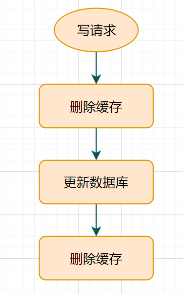

1. 先删除缓存
2. 再更新数据库
3. 休眠一会（比如1秒），再次删除缓存

这个休眠一会，一般多久呢？都是1秒？

> 这个休眠时间 =  读业务逻辑数据的耗时 + 几百毫秒
>
> 为了确保读请求结束，写请求可以删除读请求可能带来的缓存脏数据。

这种方案还算可以，只有休眠那一会（比如就那1秒），可能有脏数据，一般业务也会接受的。但是如果**第二次删除缓存失败**呢？缓存和数据库的数据还是可能不一致，对吧？给Key设置一个自然的expire过期时间，让它自动过期怎样？那业务要接受**过期时间**内，数据的不一致咯？还是有其他更佳方案呢？


### 删除缓存重试机制

不管是**延时双删**还是**Cache-Aside的先操作数据库再删除缓存**，都可能会存在第二步的删除缓存失败，导致的数据不一致问题。可以使用这个方案优化：删除失败就多删除几次呀,保证删除缓存成功就可以了呀~ 所以可以引入**删除缓存重试机制**


1. 写请求更新数据库
2. 缓存因为某些原因，删除失败
3. 把删除失败的key放到消息队列
4. 消费消息队列的消息，获取要删除的key
5. 重试删除缓存操作


### 读取biglog异步删除缓存

重试删除缓存机制还可以吧，就是会造成好多**业务代码入侵**。其实，还可以这样优化：通过数据库的**binlog来异步淘汰key**。

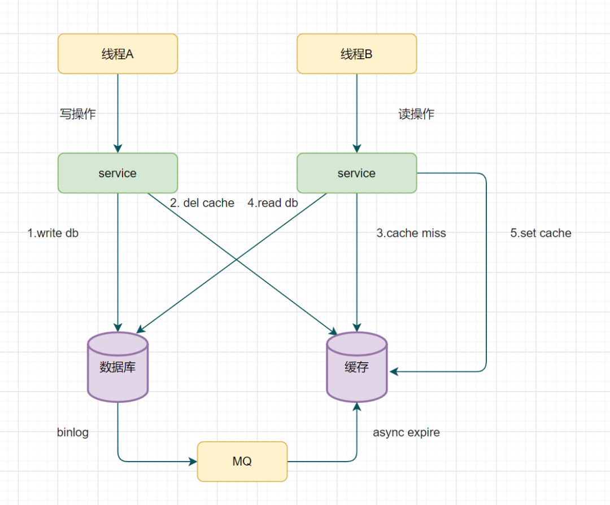

以mysql为例：

- 可以使用阿里的canal将binlog日志采集发送到MQ队列里面
- 然后通过ACK机制确认处理这条更新消息，删除缓存，保证数据缓存一致性


# 消息队列

## 痛点问题

### 总耗时长

有些复杂业务系统，一次用户请求可能会同步调用N个系统接口，需要等待所有的接口都返回了，才能真正的获取执行结果。

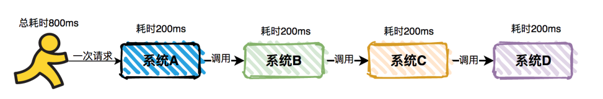

这种同步接口调用的方式`总耗时比较长`，非常影响用户的体验，特别是在网络不稳定的情况下，极容易出现接口超时问题。


### 耦合性高

很多复杂的业务系统，一般都会拆分成多个子系统。我们在这里以用户下单为例，请求会先通过订单系统，然后分别调用：支付系统、库存系统、积分系统 和 物流系统。

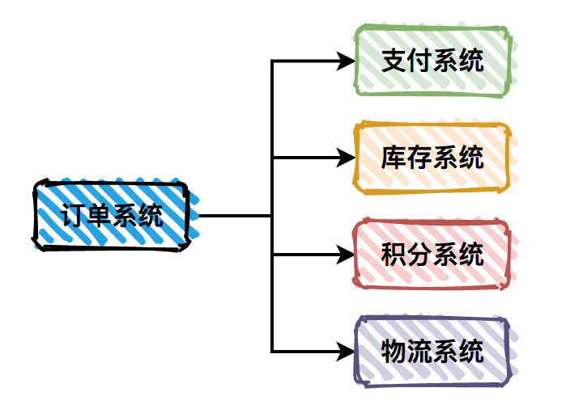

系统之间`耦合性太高`，如果调用的任何一个子系统出现异常，整个请求都会异常，对系统的稳定性非常不利。


### 突发流量

有时候为了吸引用户，我们会搞一些活动，比如秒杀等。

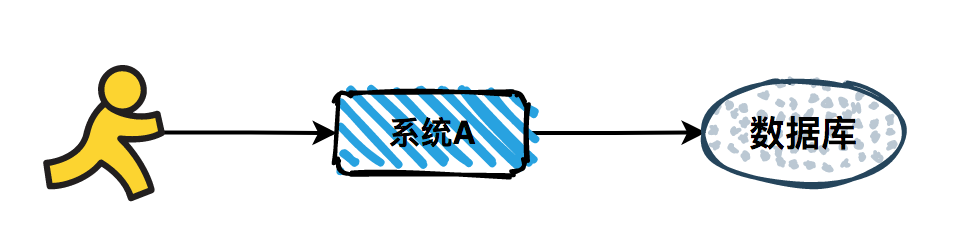

如果用户少还好，不会影响系统的稳定性。但如果用户突增，一时间所有的请求都到数据库，可能会导致数据库无法承受这么大的压力，响应变慢或者直接挂掉。

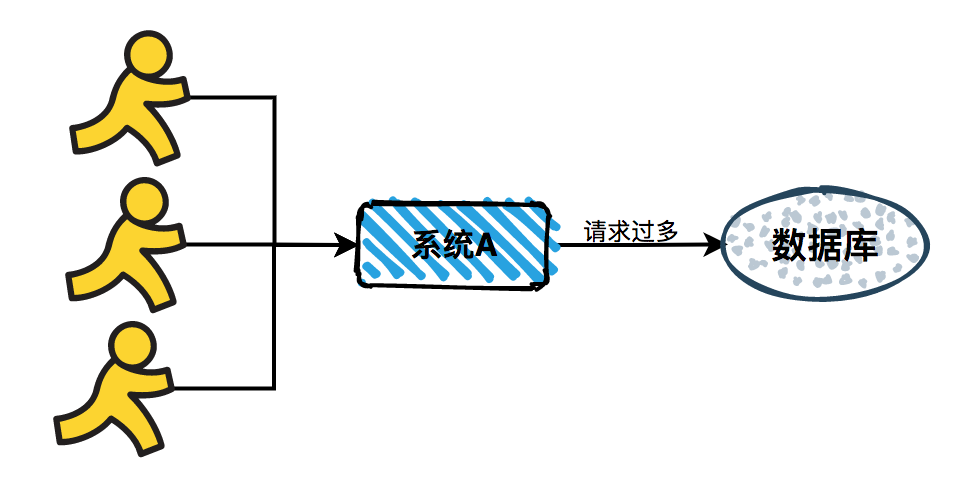

对于这种 `突发流量`，无法保证系统的稳定性。


## 功能特性

对于上面传统模式的三类问题，使用MQ就能轻松解决。

### 异步

同步接口调用导致响应时间长的问题，使用MQ之后，将同步调用改成异步，能够显著减少系统响应时间。

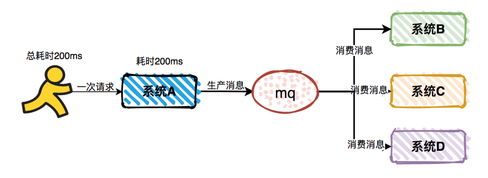

系统A作为消息的生产者，在完成本职工作后，就能直接返回结果了。而无需等待消息消费者的返回，它们最终会独立完成所有的业务功能。这样能避免`总耗时比较长`，从而影响用户的体验的问题。


### 解耦

子系统间耦合性太大的问题，使用MQ之后，我们只需要依赖于MQ，避免了各个子系统间的强依赖问题。

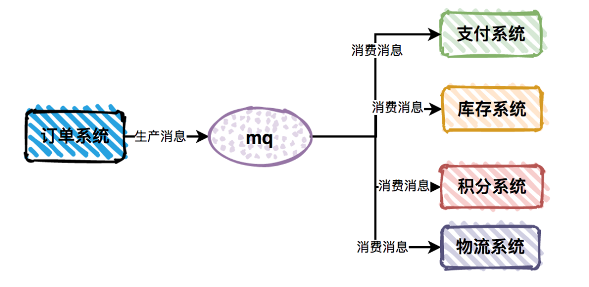

订单系统作为消息生产者，保证它自己没有异常即可，不会受到支付系统等业务子系统的异常影响，并且各个消费者业务子系统之间，也互不影响。这样就把之前复杂的业务子系统的依赖关系，转换为只依赖于MQ的简单依赖，从而显著的降低了系统间的耦合度。


### 消峰

由于突然出现的`突发流量`，导致系统不稳定的问题。使用MQ后，能够起到消峰的作用。

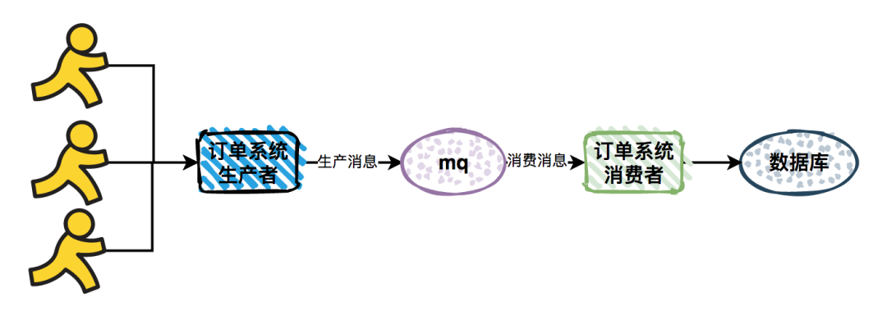

订单系统接收到用户请求之后，将请求直接发送到MQ，然后订单消费者从MQ中消费消息，做写库操作。如果出现`突发流量`的情况，由于消费者的消费能力有限，会按照自己的节奏来消费消息，多的请求不处理，保留在MQ的队列中，不会对系统的稳定性造成影响。


## 引发问题

引入MQ后让我们子系统间耦合性降低了，异步处理机制减少了系统的响应时间，同时能够有效的应对`突发流量`问题，提升系统的稳定性。但是引入MQ同时也会带来一些问题。

### 重复消息

重复消费问题可以说是MQ中普遍存在的问题，不管你用哪种MQ都无法避免。有哪些场景会出现重复的消息呢？

- **消息生产者产生了重复的消息**
- **Kafka和RocketMQ的offset被回调了**
- **消息消费者确认失败**
- **消息消费者确认时超时了**
- **业务系统主动发起重试**


如果重复消息不做正确的处理，会对业务造成很大的影响，产生重复的数据，或者导致数据异常，比如会员系统多开通了一个月的会员。


### 数据一致性

很多时候，如果MQ的消费者业务处理异常的话，就会出现数据一致性问题。比如：一个完整的业务流程是，下单成功之后，送100个积分。下单写库了，但是消息消费者在送积分的时候失败了，就会造成`数据不一致`的情况，即该业务流程的部分数据写库了，另外一部分没有写库。


如果下单和送积分在同一个事务中，要么同时成功，要么同时失败，是不会出现数据一致性问题的。但由于跨系统调用，为了性能考虑，一般不会使用强一致性的方案，而改成达成最终一致性即可。


### 消息丢失

同样消息丢失问题，也是MQ中普遍存在的问题，不管你用哪种MQ都无法避免。有哪些场景会出现消息丢失问题呢？

- **消息生产者发生消息时，由于网络原因，发生到MQ失败了**
- **MQ服务器持久化时，磁盘出现异常**
- **Kafka和RocketMQ的offset被回调时，略过了很多消息**
- **消息消费者刚读取消息，已经ACK确认了，但业务还没处理完，服务就被重启了**

导致消息丢失问题的原因挺多的，`生产者`、`MQ服务器`、`消费者` 都有可能产生问题，在这里就不一一列举了。最终的结果会导致消费者无法正确的处理消息，而导致数据不一致的情况。


### 消息顺序

有些业务数据是有状态的，比如订单有：下单、支付、完成、退货等状态，如果订单数据作为消息体，就会涉及顺序问题了。如果消费者收到同一个订单的两条消息，第一条消息的状态是下单，第二条消息的状态是支付，这是没问题的。但如果第一条消息的状态是支付，第二条消息的状态是下单就会有问题了，没有下单就先支付了？

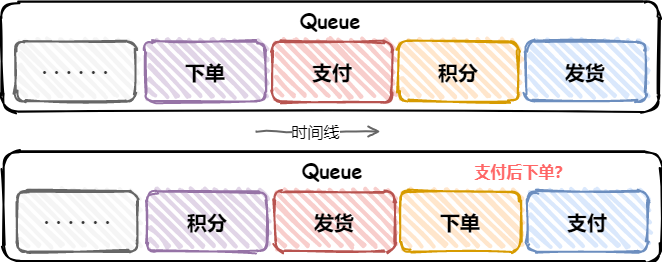

消息顺序问题是一个非常棘手的问题，比如：

- `Kafka`同一个`partition`中能保证顺序，但是不同的`partition`无法保证顺序
- `RabbitMQ`的同一个`queue`能够保证顺序，但是如果多个消费者同一个`queue`也会有顺序问题

如果消费者使用多线程消费消息，也无法保证顺序。如果消费消息时同一个订单的多条消息中，中间的一条消息出现异常情况，顺序将会被打乱。还有如果生产者发送到MQ中的路由规则，跟消费者不一样，也无法保证顺序。


### 消息堆积

如果消息消费者读取消息的速度，能够跟上消息生产者的节奏，那么整套MQ机制就能发挥最大作用。但是很多时候，由于某些批处理，或者其他原因，导致消息消费的速度小于生产的速度。这样会直接导致消息堆积问题，从而影响业务功能。

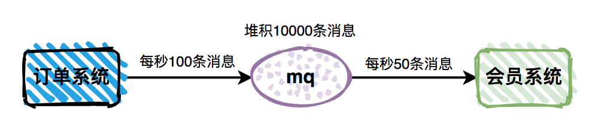

以下单开通会员为例，若消息出现堆积，会导致用户下单后，很久之后才能变成会员，这种情况肯定会引起大量用户投诉。


### 系统复杂度提升

这里说的系统复杂度和系统耦合性是不一样的，比如以前只有：系统A、系统B和系统C 这三个系统，现在引入MQ之后，你除了需要关注前面三个系统之外，还需要关注MQ服务，需要关注的点越多，系统的复杂度越高。

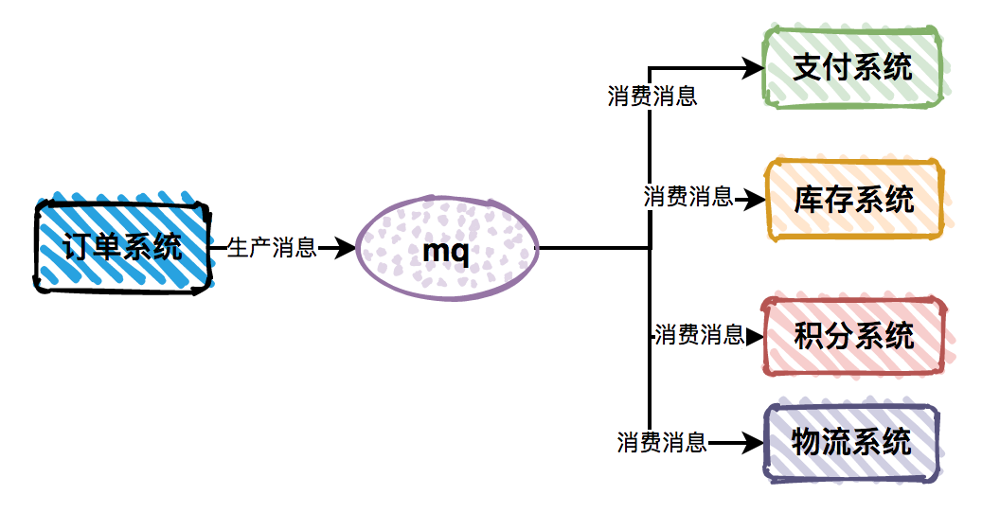

MQ的机制需要：生产者、MQ服务器、消费者。有一定的学习成本，需要额外部署MQ服务器，而且有些MQ比如：RocketMQ，功能非常强大，用法有点复杂，如果使用不好，会出现很多问题。有些问题，不像接口调用那么容易排查，从而导致系统的复杂度提升了。


## 解决引发问题

MQ是一种趋势，总体来说对我们的系统是利大于弊的，那么要如何解决这些问题呢？

### 重复消息问题

不管是由于生产者产生的重复消息，还是由于消费者导致的重复消息，我们都可以在消费者中这个问题。这就要求消费者在做业务处理时，要做幂等设计。在这里推荐增加一张消费消息表，来解决MQ的这类问题。消费消息表中，使用`messageId`做`唯一索引`，在处理业务逻辑之前，先根据messageId查询一下该消息有没有处理过，如果已经处理过了则直接返回成功，如果没有处理过，则继续做业务处理。解决方案：

- **在消费放使用messageId做唯一索引进行幂等处理**
- **在消费方根据业务唯一标识（如订单号、流水号）进行幂等处理 —— 推荐**

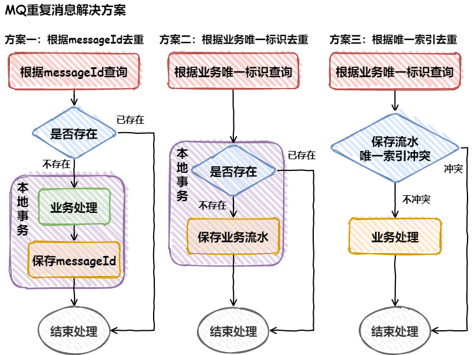


### 数据一致性问题

数据一致性分为强一致性、弱一致性和最终一致性。而MQ为了性能考虑使用的是`最终一致性`，那么必定会出现数据不一致的问题。这类问题大概率是因为消费者读取消息后，业务逻辑处理失败导致的，这时候可以增加`重试机制`。重试分为：`同步重试` 和 `异步重试`。业务处理失败后，可以采用以下三种方式进行重试：

- **同步重试**
  - 立即重试3-5次，若还是失败，则写入`记录表`，人工处理。推荐`消息量小`的场景使用
- **异步重试**
  - 立刻写入`重试表`，使用Job定时重试。推荐在`消息量大`的场景使用
  - 消费失败后，将消息再发至消息队列的同一个Topic中。推荐在`顺序要求不高`的场景

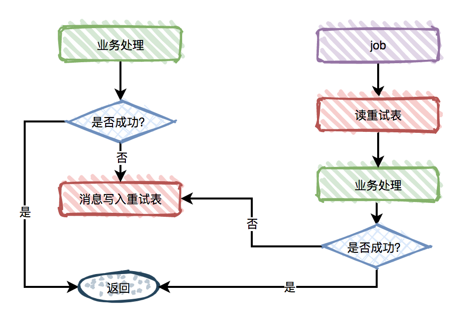

有些消息量比较小的业务场景，可以采用同步重试，在消费消息时如果处理失败，立刻重试3-5次，如何还是失败，则写入到`记录表`中。但如果消息量比较大，则不建议使用这种方式，因为如果出现网络异常，可能会导致大量的消息不断重试，影响消息读取速度，造成`消息堆积`。而消息量比较大的业务场景，建议采用异步重试，在消费者处理失败之后，立刻写入`重试表`，有个`job`专门定时重试。还有一种做法是，如果消费失败，自己给同一个Topic发一条消息，在后面的某个时间点，自己又会消费到那条消息，起到了重试的效果。如果对消息顺序要求不高的场景，可以使用这种方式。


### 消息丢失问题

不管你是否承认有时候消息真的会丢，即使这种概率非常小，也会对业务有影响。生产者、MQ服务器、消费者都有可能会导致消息丢失的问题。

为了解决这个问题，可以增加一张`消息发送表`，当生产者发完消息之后，会往该表中写入一条数据，状态status标记为待确认。如果消费者读取消息之后，调用生产者的api更新该消息的status为已确认。有个Job，每隔一段时间检查一次消息发送表，如果5分钟（这个时间可以根据实际情况来定）后还有状态是待确认的消息，则认为该消息已经丢失了，重新发条消息。

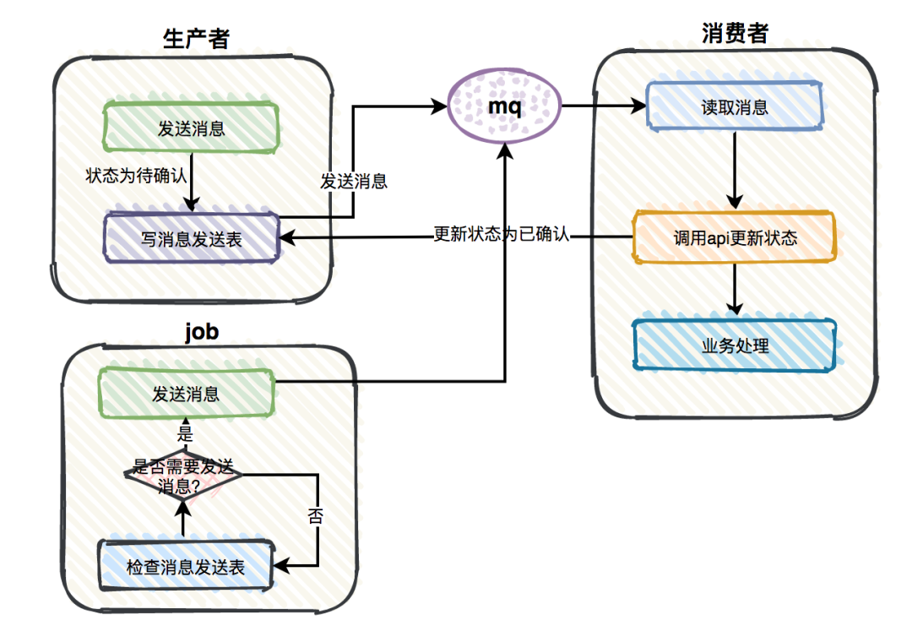

这样不管是由于生产者、MQ服务器、还是消费者导致的消息丢失问题，job都会重新发消息。


### 消息顺序问题

消息顺序问题是非常常见的问题，以`Kafka`消费订单消息为例。订单有：下单、支付、完成、退货等状态，这些状态是有先后顺序的，如果顺序错了会导致业务异常。解决这类问题之前，我们先确认一下，消费者是否真的需要知道中间状态，只知道最终状态行不行？

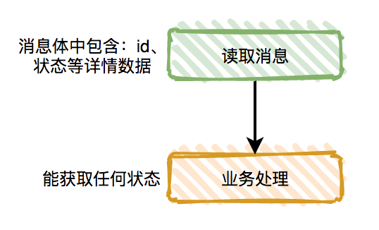

其实很多时候，只需要知道的是最终状态，这时可以把流程优化一下：

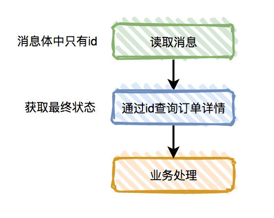

这种方式可以解决大部分的消息顺序问题。但如果真的有需要保证消息顺序的需求。订单号路由到不同的`partition`，同一个订单号的消息，每次到发到同一个`partition`。

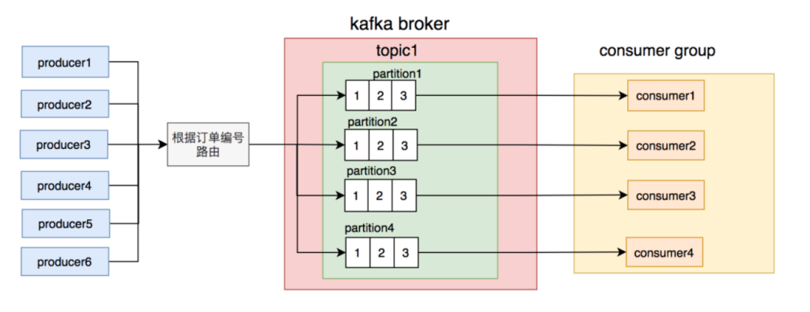


### 消息堆积问题

如果消费者消费消息的速度小于生产者生产消息的速度，将会出现消息堆积问题。那么消息堆积问题该如何解决呢？这个要看消息是否需要保证顺序。如果不需要保证顺序，可以读取消息之后用多线程处理业务逻辑。

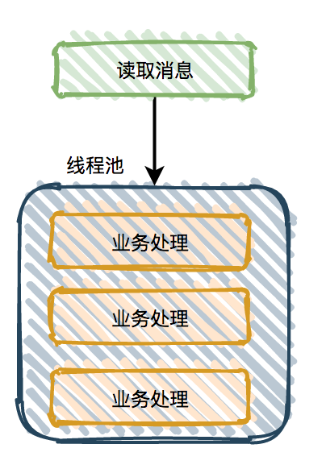

这样就能增加业务逻辑处理速度，解决消息堆积问题。但线程池的核心线程数和最大线程数需要合理配置，不然可能会浪费系统资源。如果需要保证顺序，可以读取消息之后，将消息按照一定规则分发到多个队列中，然后在队列中用单线程处理。

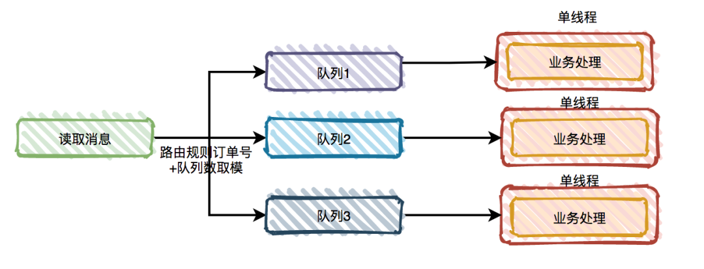

## 使用场景

其实MQ相关的内容还有很多，比如：延迟消息、私信队列、事务问题等等。


### 延迟队列

延迟队列存储的对象肯定是对应的延时消息，所谓”延时消息”是指当消息被发送以后，并不想让消费者立即拿到消息，而是等待指定时间后，消费者才拿到这个消息进行消费。开源RocketMQ 不支持任意时间自定义的延迟消息，仅支持内置预设值的延迟时间间隔的延迟消息。预设值的延迟时间间隔为：1s、 5s、 10s、 30s、 1m、 2m、 3m、 4m、 5m、 6m、 7m、 8m、 9m、 10m、 20m、 30m、 1h、 2h。

如电商中，提交一个订单就可以发送一个延时消息，30m后去检查这个订单的状态，如果还未付款就取消订单释放库存。

```java
 Message msg = new Message("order", "订单001".getBytes());
// 延迟30分钟
msg.setDelayTimeLevel(16);
SendResult sendResult = producer.send(msg);
```


### 死信队列

当一条消息初次消费失败，消息队列 RocketMQ 会自动进行消息重试；达到最大重试次数后，若消费依然失败，则表明消费者在正常情况下无法正确地消费该消息，此时，消息队列 RocketMQ 不会立刻将消息丢弃，而是将其发送到该消费者对应的特殊队列中。在消息队列 RocketMQ 中，这种正常情况下无法被消费的消息称为死信消息（Dead-Letter Message），存储死信消息的特殊队列称为死信队列（Dead-Letter Queue）。

**死信消息**

- 不会再被消费者正常消费
- 有效期与正常消息相同，均为 3 天，3 天后会被自动删除。因此，请在死信消息产生后的 3 天内及时处理

**死信队列**

- 一个死信队列对应一个 Group ID， 而不是对应单个消费者实例
- 如果一个 Group ID 未产生死信消息，消息队列 RocketMQ 不会为其创建相应的死信队列
- 一个死信队列包含了对应 Group ID 产生的所有死信消息，不论该消息属于哪个 Topic


死信队列中的数据需要通过新订阅该topic进行消费。每个topic被消费后，如果消费失败超过次数会进入重试队列、死信队列等。名称会以：

- **%RETRY%消费组名称**
- **%DLQ%消费组名称**


订单失效问题比较麻烦的地方就是如何能够实时获取失效的订单。对于这种问题一般有两种解决方案： 

- **定时任务处理**
  用户下订单后先生成订单信息，然后将该订单加入到定时任务中（30分钟后执行），当到达指定时间后检查订单状态，如果未支付则标识该订单失效。定时去轮询数据库/缓存，看订单的状态。这种方式的问题很明显，当集群部署服务器的时候需要做分布式锁进行协调，而且实时性不高，对数据库会产生压力。

  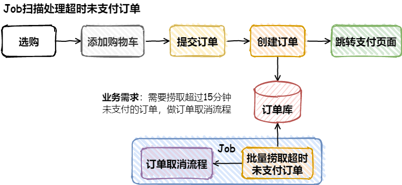
  
- **延时任务处理**
  当用户下订单后，将用户的订单的标识全部发送到延时队列中，30分钟后进去消费队列中被消费，消费时先检查该订单的状态，如果未支付则标识该订单失效。有以下几种延时任务处理方式：

  - **Java自带的DelayedQuene队列**
    这是java本身提供的一种延时队列，如果项目业务复杂性不高可以考虑这种方式。它是使用jvm内存来实现的，停机会丢失数据，扩展性不强。

  - **使用redis监听key的过期来实现**
    当用户下订单后把订单信息设置为redis的key，30分钟失效，程序编写监听redis的key失效，然后处理订单（我也尝试过这种方式）。这种方式最大的弊端就是只能监听一台redis的key失效，集群下将无法实现，也有人监听集群下的每个redis节点的key，但我认为这样做很不合适。如果项目业务复杂性不高，redis单机部署，就可以考虑这种方式。

  - **MQ死信队列实现**
  
    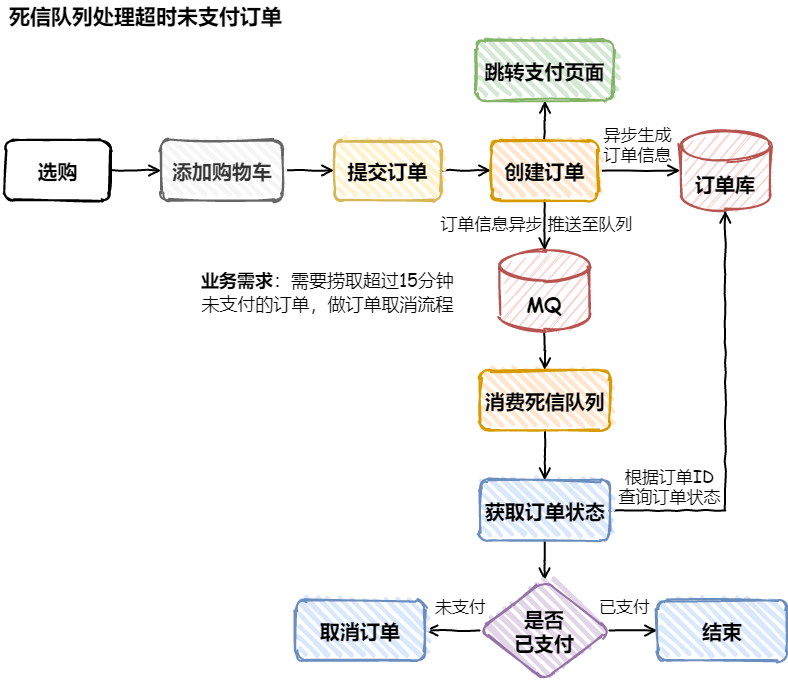


### 事务问题

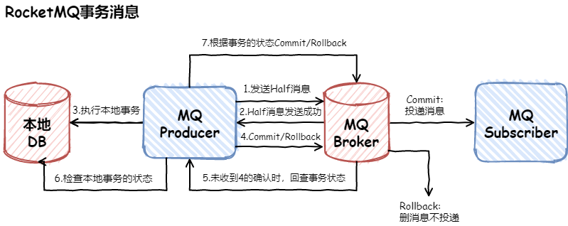


# 分布式事务

**什么是分布式事务？**

分布式事务是指事务的参与者、支持事务的服务器、资源服务器以及事务管理器分别位于不同的分布式系统的不同节点之上。一个大的操作由N多的小的操作共同完成。而这些小的操作又分布在不同的服务上。针对于这些操作，要么全部成功执行，要么全部不执行 。


**TCC**和**可靠消息最终一致性方案**是在生产中最常用。一个要求强一致，一个要求最终一致。**TCC**用于强一致主要用于核心模块，例如交易/订单等。**最终一致方案**一般用于边缘模块例如库存，通过mq去通知，保证最终一致性，也可以业务解耦。


## 分布式理论

### 事务一致性

**可靠程度**：强一致性 > 顺序一致性 > 因果一致性 > 最终一致性 > 弱一致性。

- **强一致性/线性一致性（Linearizability）**：写操作完成后，要求任何读取操作都能读取到最新的值
- **顺序一致性（Sequential Consistency）**：不保证操作的全局时序，但保证每个客户端操作能按顺序被执行
- **因果一致性（Causal Consistency）**：只对并发访问中具有因果关系的操作保证顺序
- **最终一致性（Eventual Consistency）**：不保证在任意时刻任意节点上的同一份数据都是相同的，但是随着时间的迁移，不同节点上的同一份数据总是在向趋同的方向变化
- **弱一致性（Weak Consistency）**：数据更新后，能容忍后续的访问只能访问到部分或者全部访问不到


### ACID特性

`ACID`注重一致性，是传统关系型数据库的设计思路。`ACID`是数据库（MySQL）事务正确执行所必须满足的四个特性：

- **Atomicity（原子性）**：事务中的操作要么都做，要么都不做

- **Consistency（一致性）**：系统必须始终处在强一致状态下

- **Isolation（隔离性）**：一个事务的执行不能被其它事务所干扰

- **Durability（持久性）**：一个已提交的事务对数据库中数据的改变是永久性的


### CAP理论

`CAP`理论的核心思想是任何基于网络的数据共享系统最多只能满足数据一致性（`Consistency`）、可用性（`Availability`）和网络分区容忍（`Partition Tolerance`）三个特性中的两个。

- **一致性（Consistency）**：在分布式系统中的所有数据备份，在同一时刻是否拥有同样的值

- **可用性（Availability）**：在集群中一部分节点故障后，集群整体还能响应客户端的读写请求

- **分区容错性（Partition Tolerance）**：系统中任意信息的丢失或失败不会影响系统的继续运作

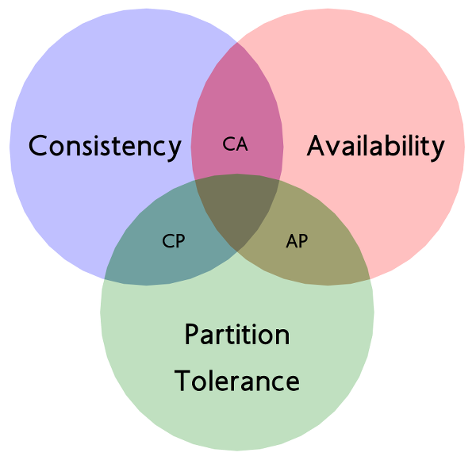

这三个特性只能满足其中两个，牺牲另一个。大部分系统也都是如此：

- **一般来说分布式集群都会保证P优先**。即集群部分节点坏死不影响整个集群的使用，然后再去追求C和A。因为如果放弃P，那不如就直接使用多个传统数据库了。事实上，很多微服务分库分表就是这个道理
- **如果追求强一致性，那么势必会导致可用性下降**。比如在Master-Slave的场景中，Master负责数据写入，然后分发给各个节点，所有节点都写入成功，才算写入，这样保证了强一致性，但是延迟也会随之增加，导致可用性降低


### BASE理论

`BASE`关注高可用性。`BASE`理论是对`CAP`理论的延伸，核心思想是即使无法做到强一致性(`Strong Consistency`，`CAP`的一致性就是强一致性)，但应用可以采用适合的方式达到最终一致性(`Eventual Consitency`)。`BASE`是分别代表：

- **基本可用(Basically Available)**：指分布式系统在出现故障的时候，允许损失部分可用性，即保证核心可用

- **软状态( Soft State)**：指允许系统存在中间状态，而该中间状态不会影响系统整体可用性

- **最终一致性( Eventual Consistency)**：指系统中的所有数据副本经过一定时间后，最终能够达到一致的状态

BASE理论是对CAP中的一致性和可用性进行一个权衡的结果，理论的核心思想就是：我们无法做到强一致，但每个应用都可以根据自身的业务特点，采用适当的方式来使系统达到最终一致性。


## 分一致性算法

### Gossip协议

Gossip 协议，顾名思义，就像流言蜚语一样，利用一种随机、带有传染性的方式，将信息传播到整个网络中，并在一定时间内，使得系统内的所有节点数据一致。根据 Base 理论，如果你需要实现最终一致性，那么就可以通过 Gossip 协议实现这个目标。Gossip协议的核心一共是三块内容：直接邮寄（Direct Mail）、反熵（Anti-entropy）和谣言传播（RumRumor mongering）。

作为一种异步修复、实现最终一致性的协议，反熵在存储组件中应用广泛，比如 Dynamo、InfluxDB、Cassandra，在需要实现最终一致性时，如果节点都是已知的，一般优先考虑反熵。当集群节点是变化的，或者集群节点数比较多时，这时要采用谣言传播的方式，同步更新数据，实现最终一致。


#### 直接邮寄（Direct Mail）

所谓直接邮寄，就是直接发送更新数据，当数据发送失败时，将数据缓存下来，然后重传。比如下图中，节点 A 直接将更新数据发送给了节点 B、D：
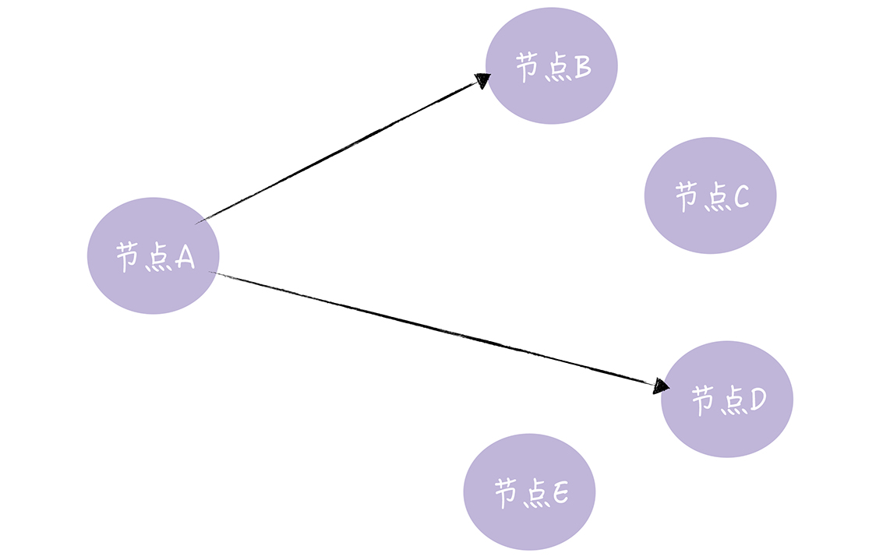

虽然直接邮寄实现起来比较容易，数据同步也很及时，但可能会因为缓存队列满了而丢数据。 也就是说，只采用直接邮寄是无法实现最终一致性的。


#### 反熵（Anti-entropy）

熵，在物理学中是用来度量体系的混乱程度。所以，反熵就是要消除混乱，Gossip协议通过反熵来异步修复节点之间的数据差异，实现最终一致性。反熵的实现，一共有推、拉、推拉三种。 集群中的节点，每隔一段时间就会随机选择某个其他节点，然后交换自己的已有数据来消除两者之间的差异。但是正因为反熵需要节点间两两交换比对数据，所以执行反熵时的通讯成本会很高，不建议在实际场景中频繁执行反熵，应该通过引入Checksum等机制，降低需要对比的数据量和通讯次数。

**推方式**

推方式，就是将自己的所有副本数据，推给对方，修复对方副本中的熵：
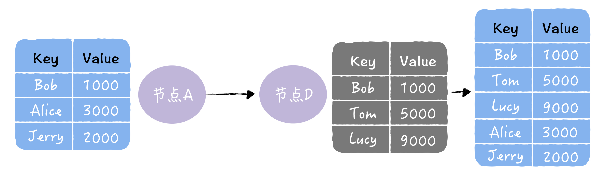


**拉方式**

拉方式，就是拉取对方的所有副本数据，修复自己副本中的熵：


**推拉方式**

推拉方式，就是同时修复自己副本和对方副本中的熵：
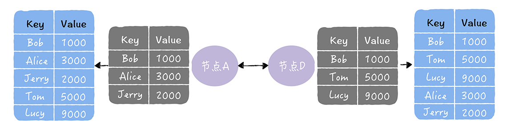

虽然反熵很实用，但是执行反熵时，相关的节点都是已知的，而且节点数量不能太多，如果是一个动态变化或节点数比较多的分布式环境，反熵就不适用了。那么当你面临这个情况要怎样实现最终一致性呢？答案就是谣言传播。


#### 谣言传播（Rumor mongering）

谣言传播，广泛地散播谣言，它指的是当一个节点有了新数据后，这个节点变成活跃状态，并周期性地联系其他节点向其发送新数据，直到所有的节点都存储了该新数据。比如下图中，节点 A 向节点 B、D 发送新数据，节点 B 收到新数据后，变成活跃节点，然后节点 B 向节点 C、D 发送新数据：
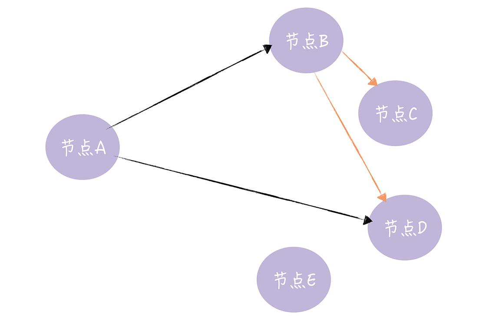

谣言传播非常具有传染性，它适合动态变化的分布式系统。


### Quorum NWR算法

CAP理论中的一致性一般指的是强一致性，也就是说写操作完成后，任何后续访问都能读到更新后的值。而BASE理论中的一致性指的是最终一致性，也就是说写操作完成后， 任何后续访问可能会读到旧数据，但是整个分布式系统的数据最终会达到一致。那么，如果我们的系统现在是最终一致性模型，也就是AP模型，突然有一天因为业务需要，要临时保证节点间的数据强一致性，有没有办法临时做这样的改造呢？一种办法是重新开发一套系统，但显然成本太高了。另一种办法就是本章要介绍的Quorum NWR算法。通过 Quorum NWR，我们可以自定义一致性级别。


**Quorum NWR三要素**

Quorum NWR 中有三个要素：N、W、R，它们是 Quorum NWR 的核心内容，我们就是通过组合这三个要素，实现自定义一致性级别的。


Quorum NWR 是非常实用的一个算法，能有效弥补 AP 型系统缺乏强一致性的痛点，给业务提供了按需选择一致性级别的灵活度。很多开源框架都利用Quorum NWR实现自定义一致性级别，比如Elasticsearch，就支持“any、one、quorum、all”4 种写一致性级别。


#### N（副本数）

N 表示副本数，又叫做复制因子（Replication Factor）。也就是说，N 表示集群中同一份数据有多少个副本。 注意，副本数不等同于节点数。（如果读者对Elasticsearch或Kafka有了解，可以把副本理解成Replica Shard）。比如下图中， DATA-1 有 2 个副本，DATA-2 有 3 个副本，DATA-3 有 1 个副本：

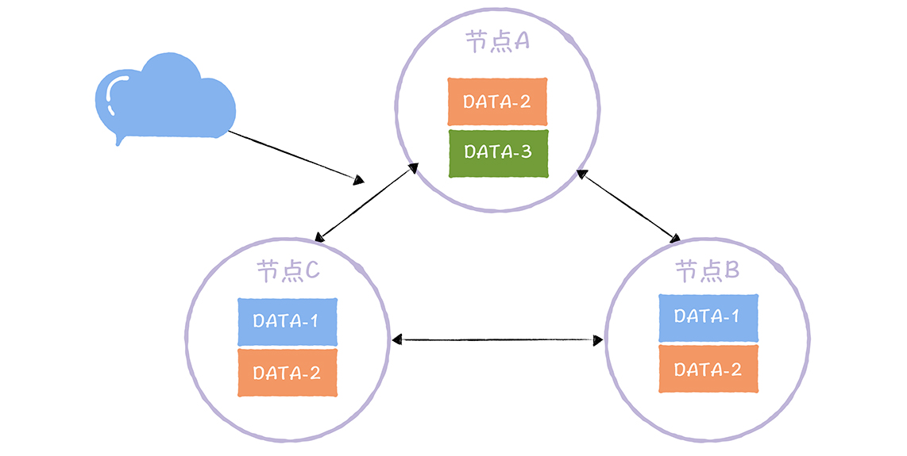

在实现 Quorum NWR 的时候，我们需要实现自定义副本数的功能，比如，用户可以指定 DATA-1 具有 2 个副本，DATA-2 具有 3 个副本，就像上图中的样子。


#### W（ 写一致性级别 ）

W，又称写一致性级别（Write Consistency Level），表示对于客户端的一次写操作，只有成功完成 W 个副本的更新，才算写操作成功。以下图中的DATA-2为例，当它的W=2时，如果客户端对 DATA-2 执行写操作，必须完成它的2 个副本的更新，才算完成了写操作：
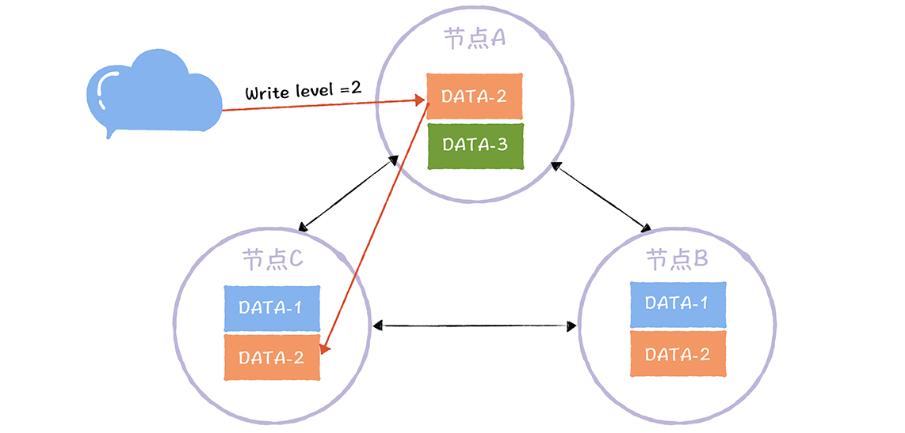


#### R（读一致性级别）

R，又称读一致性级别（Read Consistency Level），表示对于客户端的一次写操作，需要读 R 个副本，然后最终返回最新的那份数据。以下图中的DATA-2为例，当它的R=2时，如果客户端读取DATA-2的数据，需要读取它的2 个副本中的数据，然后返回最新的那份数据：

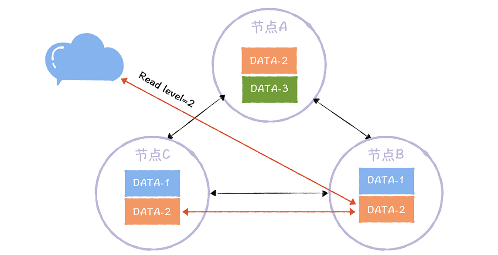

N、W、R 值的不同组合，会产生不同的一致性效果，具体来说，有这么两种效果：

- 当 W + R > N 的时候，对于客户端来讲，整个系统能保证强一致性，一定能返回更新后的那份数据
- 当 W + R <= N 的时候，对于客户端来讲，整个系统只能保证最终一致性，可能会返回旧数据

我这里以DATA-2为例解释下，为什么W+R>N时，一定可以读到最新的数据。首先，DATA-2的N=3，W=2，R=2，那么当写数据时，必然有2个节点要写成功；此时再读数据，即使读到了一个没有写过的节点，由于要读2个节点的值，另一个必然是写成功的节点，所以最终返回给客户端的还是最新的数据。


### PBFT算法

我在《共识问题》一章中提到过，共识算法一共可以分为两大类：拜占庭容错算法（Byzantine Fault Tolerance，BFT）和故障容错算法（Crash Fault Tolerance，CFT）。Leslie Lamport在论文中提出的口信消息解决方案就属于BFT，需要考虑恶意节点的篡改、攻击等问题。但是，口信消息解决方案在现实场景中很难落地。比如，它并不关心这个共识的结果是什么，这会出现一种情况：现在适合进攻，但将军们达成的共识却是撤退。另外，实际场景中，我们往往需要就提议的一系列值（而不是单值）在拜占庭错误发生的时候，也能被达成共识。那应该怎么做呢？一种方案就是本文要讲解的PBFT算法。 PBFT算法，是一种能在实际场景中落地的BFT算法，它在区块链中应用广泛。

Raft 算法完全不适应有人作恶的场景，但PBFT 算法能容忍 (n - 1)/3 个恶意节点 (也可以是故障节点)。另外，相比 PoW 算法，PBFT 的优点是不消耗算力，所以在日常实践中，PBFT 比较适用于相对“可信”的场景中，比如联盟链。

此外，虽然PBFT 算法相比口信消息方案已经有了很大的优化，将消息复杂度从 O(n ^ (f + 1)) 降低为 O(n ^ 2)，能在实际场景中落地并解决共识问题，但 PBFT 还是需要比较多的消息，比如在 13 节点集群中（f 为 4），一次共识协商需要 237 个消息，所以决定了 PBFT 算法适用于中小型分布式系统。


#### oral message的问题

要理解PBFT算法，首先必须要明白口信消息解决方案（A solution with oral message）到底存在哪些问题？这些问题都是后续众多BFT算法在努力改进和解决的，理解了这些问题，能帮助你更好地理解后来的拜占庭容错算法的思想（包括 PBFT 算法）。oral message方案存在一个致命的缺陷：当将军总数为n，叛将数为f时，算法需要递归协商 f+1 轮，消息复杂度为 O(n ^ (f + 1))，消息数量指数级暴增。你可以想象一下，如果叛将数为 64，消息数已经远远超过 int64 所能表示的了，这是无法想象的。


**PBFT算法流程**

PBFT 算法，通过签名（或消息认证码 MAC）约束恶意节点的行为，每个节点都可以通过验证消息签名确认消息的发送来源，一个节点无法伪造另外一个节点的消息。PBFT 算法采用了三阶段协议，基于大多数原则（2f + 1，f表示叛将数）实现共识。另外，与oral message不同的是，PBFT 算法实现的是一系列值的共识，而不是单值的共识。我们先来看看PBFT 算法的流程。为了方便演示，假设一共有A、B、C、D四个节点，那么根据Paxos算法的理论，最多允许存在一个恶意节点（(4-1)/3=1），我们假设B是恶意节点，现在客户端发起了一个提议值（进攻），希望被各节点达成共识：

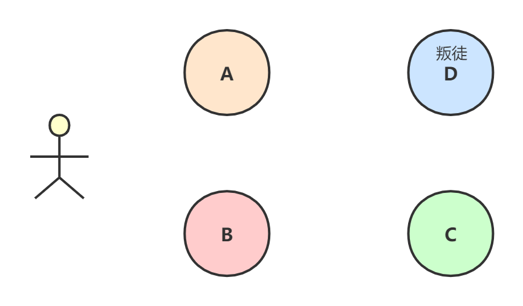

在PBFT算法中，第一个接收到客户端请求的节点，将成为Leader节点，我们假设A节点首先接收了到请求。A接收到客户端请求之后，会执行三阶段协议（Three-phase protocol）。


#### 预准备阶段

首先，A进入预准备（Pre-prepare）阶段，构造包含作战指令的预准备消息，并广播给其他节点（B、C、D）：

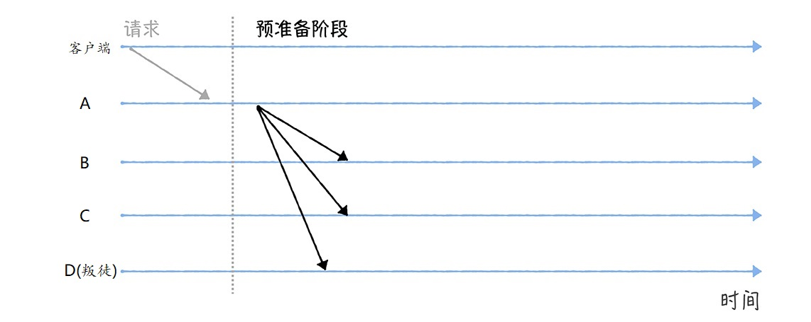


#### 准备阶段

B、C、D收到消息后 ， 不能确认自己接收到指令和其他人的是否相同。比如，D是叛徒，D收到了 2 个指令，然后他给A发送的是其中一个指令，给B、C发送的是另一个指令，这样就会出现无法一致行动的情况。

所以， 接收到预准备消息之后，B、C、D会进入准备（Prepare）阶段，并分别广播包含指令的准备消息给其他节点。这里我们假设叛徒D想通过不发送消息，来干扰共识协商：

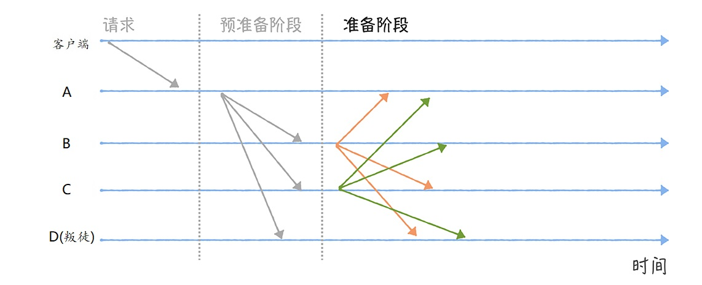


#### 提交阶段

然后，当某个节点收到 2f 个包含相同指令的准备消息后，会进入提交（Commit）阶段（这里的f 为叛徒数， 2f 包括自己）。

> 在这里，思考一个问题：这个时候节点（比如B）可以直接执行指令吗？答案还是不能，因为B不能确认A、C、D是否收到了 2f 个一致的包含相同指令的准备消息。也就是说，B这时无法确认A、C、D是否准备好了执行指令。

进入提交阶段后，各节点分别广播提交消息给其他节点，也就是告诉其他节点：“我已经准备好了，可以执行指令了”：

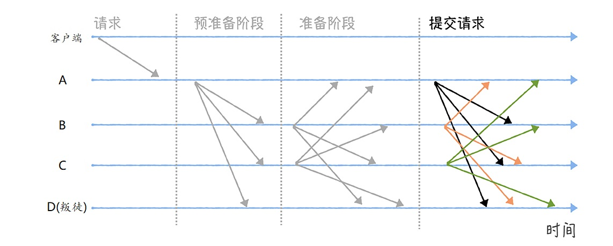


#### 响应

最后，当某个节点收到 2f + 1 个验证通过的提交消息后（其中 f 为叛徒数，包括自己），也就是说，大部分的节点们已经达成共识，这时可以执行指令了，那么该节点将执行客户端的指令，执行完毕后发送执行成功的消息给客户端。

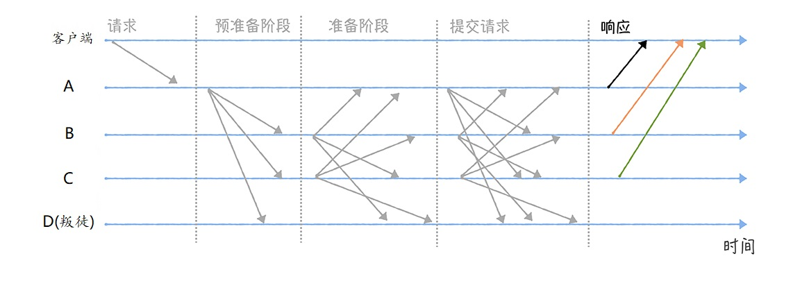

最后，当客户端收到 f+1 个相同的响应（Reply）消息时，说明各个节点已经就指令达成了共识，并执行了指令。

在PBFT算法中，共识是否达成，客户端是会做判断的，如果客户端在指定时间内未收到请求对应的 f + 1 相同响应，就认为集群出故障了，共识未达成，客户端会重新发送请求。PBFT 算法通过视图变更（View Change）的方式，来处理主节点作恶，当发现主节点在作恶时，会以“轮流上岗”方式，推举新的主节点。


### PoW算法

谈起比特币，大家至少都应该有所耳闻吧？比特币是基于区块链实现的，而区块链运行在Internet上，这就存在有人试图作恶的情况。之前提到的口信消息解决方案和PBFT算法，虽然能防止坏人作恶，但只能防止少数，也就是 (n-1)/3 个坏人 (其中 n 为节点数)。可由于很多区块链是在公网环境，可能有坏人不断增加节点数，轻松突破 (n - 1) / 3 的限制。解决上述问题的方法就是PoW算法。PoW算法通过工作量证明（Proof of Work）增加了坏人作恶的成本，以此防止坏人作恶。本章，我就来讲讲PoW算法的原理。

PoW算法，属于拜占庭容错算法中的一种，能容忍一定比例的作恶行为，所以它在相对开放的场景中应用广泛，比如公链、联盟链。而非拜占庭容错算法（比如 Raft）无法对作恶行为进行容错，主要用于封闭、绝对可信的场景中，比如私链、公司内网的 DevOps 环境。


#### 工作量证明

什么是工作量证明 (Proof Of Work，简称PoW) ？你可以这么理解：就是一份证明，用来确认你做过一定量的工作。比如，你的大学毕业证书就是一份工作量证明，证明你通过 4 年的努力完成了相关课程的学习。

那么，回到计算机世界，具体来说就是，客户端需要做一定难度的工作才能得出一个结果，验证方却很容易通过结果来检查出客户端是不是做了相应的工作。

比如小肖去Google面试，说自己的编程能力很强，那么她需要做一定难度的工作（比如做个算法题）。根据做题结果，面试官可以判断她是否适合这个岗位。这就是一个现实版的工作量证明。具体的工作量证明过程，就像下图中的样子：
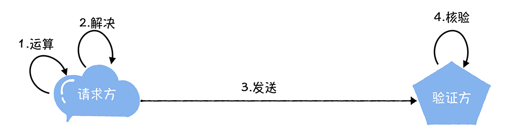

**哈希运算**

既然工作量证明是通过指定的结果，来证明自己做过了一定量的工作。那么在区块链的 PoW 算法中需要做哪些工作呢？答案是哈希运算。哈希运算的核心是哈希函数（Hash Function），也叫散列函数。就是说，你输入一个任意长度的字符串，哈希函数会计算出一个哈希值。比如，我们对任意长度字符串（比如"tutuxiao"）执行 SHA256 哈希运算，就会得到一个 32 字节的哈希值，就像下面的样子：

```java
$ echo -n "tutuxiao" | sha256sum
bb2f0f297fe9d3b8669b6b4cec3bff99b9de596c46af2e4c4a504cfe1372dc52
```

那么我们如何通过哈希运算来证明工作量呢？

举个例子，我们给出的工作量要求是：基于一个基本的字符串（比如"tutuxiao"），在这个字符串后面添加一个整数值，然后对变更后的字符串进行 SHA256 哈希运算，如果运算后得到的哈希值（16 进制形式）是以"0000"开头的，就验证通过；为了达到这个工作量证明的目标，我们需要不停地递增整数值，对得到的新字符串进行 SHA256 哈希运算。按照这个规则，我们需要经过 35024 次计算，才能找到恰好前 4 位为 0 的哈希值：

```java
"tutuxiao0" => 01f28c5df06ef0a575fd0e529be9a6f73b1290794762de014ec84182081e118e
"tutuxiao1" => a2567c06fdb5775cb1e3ce17b72754cf146fcc6da75c8f1d87d7ab6a1b8c4523
...
"tutuxiao35022" =>
8afc85049a9e92fe0b6c98b02b27c09fb869fbfe273d0ab84ad8c5ac17b8627e
"tutuxiao35023" =>
0000ec5927ba10ea45a6822dcc205050ae74ae1ad2d9d41e978e1ec9762dc404
```

通过上面这个示例可以看到，工作量证明就是通过执行哈希运算，经过一段时间的计算后，得到符合条件的哈希值。在实际场景中，我们可以根据场景特点，制定不同的规则，比如，你可以试试分别运行多少次，才能找到恰好前 3 位和前 5 位为 0 的哈希值。


#### 区块链

区块链也是通过 SHA256 执行哈希运算，通过计算出符合指定条件的哈希值，来证明工作量的。因为在区块链中，PoW 算法是基于区块链中的区块信息来进行哈希运算的。区块链的区块，是由区块头、区块体 2 部分组成的：


- 区块头（Block Head）：区块头主要由上一个区块的哈希值、区块体的哈希值、4 字节的随机数（nonce）等组成的，共80 字节固定长度
- 区块体（Block Body）：区块包含的交易数据，其中的第一笔交易是 Coinbase 交易，这是一笔激励矿工的特殊交易

在区块链中，给出的工作量要求是：对区块头执行 SHA256 哈希运算，得到的结果再执行一个哈希运算，计算出的哈希值，只有小于目标值（target），才是有效的。计算出符合条件的哈希值后，矿工就会把这个信息广播给集群中所有其他节点，其他节点验证通过后，会将这个区块加入到自己的区块链中，最终形成一串区块链，就像下图的样子：

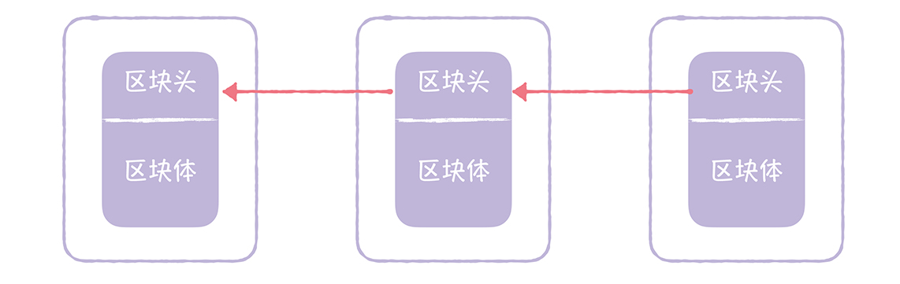

从上面这种工作量证明要求可以看出，算力越强，系统大概率会越先计算出这个哈希值。这也就意味着， 攻击者能挖掘一条比原链更长的攻击链，并将攻击链向全网广播。而按照约定，节点将接受更长的链，也就是攻击链，丢弃原链。就像下图的样子：

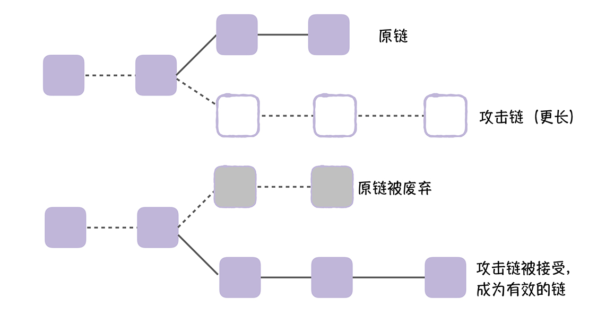

这样的话，按照比特币的区块链约定——“最长链胜出，其它节点在这条链基础上扩展”，那么如果坏人们掌握了 51% 的算力，就通过优势算力实现对最长链的争夺，也就是发起 51% 攻击，实现双花（Double Spending）。

即使攻击者只有 30% 的算力，他也有可能连续计算出多个区块的哈希值，挖掘出更长的攻击链，发动攻击； 另外，即使攻击者拥有 51% 的算力，他也有可能半天无法计算出一个区块的哈希值，也就是攻击失败。也就是说，能否计算出符合条件的哈希值，有一定的概率性，但长久来看，攻击者攻击成功的概率等同于攻击者算力的权重。


## 强一致性算法

**两阶段提交协议**

两阶段提交系统具有完全的C（一致性），很糟糕的A（可用性），很糟糕的P（容错性）。
首先，两阶段提交协议保证了副本间是完全一致的，这也是协议的设计目的。再者，协议在一个节点出现异常时，就无法更新数据，其服务可用性较低。最后，一旦协调者与参与者之间网络分化，无法提供服务。


**Paxos和Raft算法**

Paxos 协议和Raft算法都是强一致性协议。Paxos只有两种情况下服务不可用：一是超过半数的 Proposer 异常，二是出现活锁。前者可以通过增加 Proposer 的个数来 降低由于 Proposer 异常影响服务的概率，后者本身发生的概率就极低。最后，只要能与超过半数的 Proposer 通信就可以完成协议流程，协议本身具有较好的容忍网络分区的能力。


### Paxos协议

二阶段提交还是三阶段提交都无法很好的解决分布式的一致性问题，直到Paxos算法的提出，Paxos协议由Leslie Lamport最早在1990年提出，目前已经成为应用最广的分布式一致性算法。Google Chubby的作者Mike Burrows说过这个世界上只有一种一致性算法，那就是Paxos，其它的算法都是残次品。


**为什么在Paxos运行过程中，半数以内的Acceptor失效都能运行？**

- 如果半数以内的Acceptor失效时 还没确定最终的value，此时，所有Proposer会竞争 提案的权限，最终会有一个提案会 成功提交。之后，会有半过数的Acceptor以这个value提交成功
- 如果半数以内的Acceptor失效时 已确定最终的value，此时，所有Proposer提交前 必须以 最终的value 提交，此值也可以被获取，并不再修改


**如何产生唯一的编号呢？**
在《Paxos made simple》中提到的是让所有的Proposer都从不相交的数据集合中进行选择，例如系统有5个Proposer，则可为每一个Proposer分配一个标识j(0~4)，则每一个proposer每次提出决议的编号可以为5*i + j(i可以用来表示提出议案的次数)。


#### 核心思想

- 引入了多个Acceptor，单个Acceptor就类似2PC中协调者的单点问题，避免故障
- Proposer用更大ProposalID来抢占临时的访问权，可以对比2PC协议，防止其中一个Proposer崩溃宕机产生阻塞问题
- 保证一个N值，只有一个Proposer能进行到第二阶段运行，Proposer按照ProposalID递增的顺序依次运行
- 新ProposalID的proposer比如认同前面提交的Value值，递增的ProposalID的Value是一个继承关系


**容错要求**

- 半数以内的Acceptor失效、任意数量的Proposer 失效，都能运行
- 一旦value值被确定，即使 半数以内的Acceptor失效，此值也可以被获取，并不再修改


#### 节点角色

Paxos 协议中，有三类节点:

- **Proposer（提案者）**

  - Proposer 可以有多个，Proposer 提出议案(value)。所谓 value，在工程中可以是任何操作，例如“修改某个变量的值为某个值”、“设置当前 primary 为某个节点”等等。Paxos 协议中统一将这些操作抽象为 value。
  - 不同的 Proposer 可以提出不同的甚至矛盾的 value，例如某个 Proposer 提议“将变量 X 设置为 1”，另一个 Proposer 提议“将变量 X 设置为 2”，但对同一轮 Paxos 过程，最多只有一个 value 被批准。

- **Acceptor（批准者）**

  - Acceptor 有 N 个，Proposer 提出的 value 必须获得超过半数(N/2+1)的
  - Acceptor 批准后才能通过。Acceptor 之间完全对等独立

- **Learner（学习者）**

  - Learner 学习被批准的 value。所谓学习就是通过读取各个 Proposer 对 value 的选择结果，如果某个 value 被超过半数 Proposer 通过，则 Learner 学习到了这个 value

  - 这里类似 Quorum 议会机制，某个 value 需要获得 W=N/2 + 1 的 Acceptor 批准，Learner 需要至少读取 N/2+1 个 Accpetor，至多读取 N 个 Acceptor 的结果后，能学习到一个通过的 value


#### 选举过程

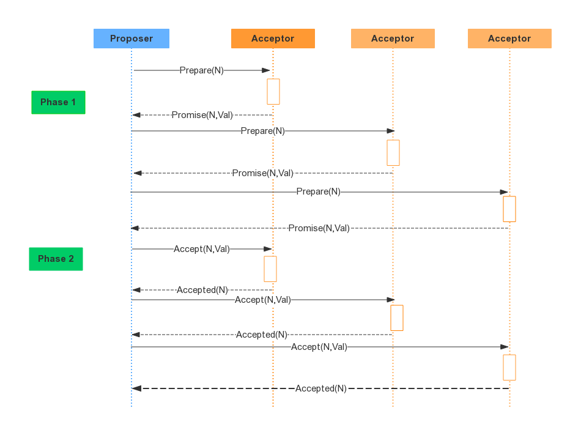

- **Phase 1：准备阶段**
  - **P1a：Proposer 发送 Prepare请求**

    Proposer 生成全局唯一且递增的ProposalID，向 Paxos 集群的所有机器发送 Prepare请求，这里不携带value，只携带N即ProposalID 

  - **P1b：Acceptor 应答 Prepare**

    Acceptor 收到 Prepare请求后，判断收到的ProposalID是否比之前已响应的所有提案的N大。

    - 如果是
      - 在本地持久化 N，可记为Max_N
      - 回复请求，并带上已Accept的提案中N最大的value（若此时还没有已Accept的提案，则返回value为空）
      - 做出承诺：不会Accept任何小于Max_N的提案

    - 如果否，则不回复或回复Error

- **Phase 2：选举阶段**
  - **P2a：Proposer 发送 Accept**
    经过一段时间后，Proposer 收集到一些 Prepare 回复，有下列几种情况：
    - 回复数量 > 一半的Acceptor数量，且所有的回复的value都为空，则Porposer发出accept请求，并带上自己指定的value
    - 回复数量 > 一半的Acceptor数量，且有的回复value不为空，则Porposer发出accept请求，并带上回复中ProposalID最大的value(作为自己的提案内容)
    - 回复数量 ≤ 一半的Acceptor数量，则尝试更新生成更大的ProposalID，再转P1a执行
  - **P2b：Acceptor 应答 Accept**
    Accpetor 收到 Accpet请求 后，判断：
    - 收到的N >= Max_N (一般情况下是 等于)，则回复提交成功，并持久化N和value
    - 收到的N < Max_N，则不回复或者回复提交失败
  - **P2c：Proposer 统计投票**
    经过一段时间后，Proposer 收集到一些 Accept 回复提交成功，有几种情况：
    - 回复数量 > 一半的Acceptor数量，则表示提交value成功。此时，可以发一个广播给所有Proposer、Learner，通知它们已commit的value
    - 回复数量 <= 一半的Acceptor数量，则 尝试 更新生成更大的 ProposalID，再转P1a执行
    - 收到一条提交失败的回复，则尝试更新生成更大的 ProposalID，再转P1a执行


**最后，经过多轮投票后，达到的结果是：**

- 所有Proposer都 提交提案成功了，且提交的value是同一个value
- 过半数的 Acceptor都提交成功了，且提交的是 同一个value


#### 约束条件

Paxos 协议的几个约束：

- P1: 一个Acceptor必须接受(accept)第一次收到的提案
- P2a: 一旦一个具有value v的提案被批准(chosen)，那么之后任何Acceptor 再次接受(accept)的提案必须具有value v
- P2b: 一旦一个具有value v的提案被批准(chosen)，那么以后任何 Proposer 提出的提案必须具有value v
- P2c: 如果一个编号为n的提案具有value v，那么存在一个多数派，要么他们中所有人都没有接受(accept)编号小于n的任何提案，要么他们已经接受(accpet)的所有编号小于n的提案中编号最大的那个提案具有value v


每轮 Paxos 协议分为准备阶段和批准阶段，在这两个阶段 Proposer 和 Acceptor 有各自的处理流程。Proposer与Acceptor之间的交互主要有4类消息通信，如下图：

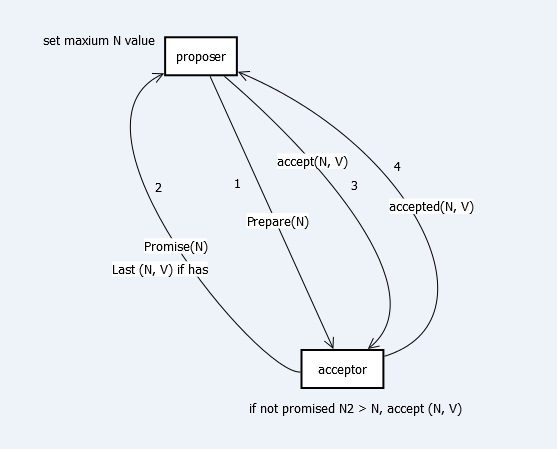

 这4类消息对应于paxos算法的两个阶段4个过程：

- Phase 1
  - proposer向网络内超过半数的acceptor发送prepare消息
  - acceptor正常情况下回复promise消息
- Phase 2
  - 在有足够多acceptor回复promise消息时，proposer发送accept消息
  - 正常情况下acceptor回复accepted消息


### Raft协议

**三种角色**

**Raft是一个用于管理日志一致性的协议**。它将分布式一致性分解为多个子问题：**Leader选举（Leader election）、日志复制（Log replication）、安全性（Safety）、日志压缩（Log compaction）等**。同时，Raft算法使用了更强的假设来减少了需要考虑的状态，使之变的易于理解和实现。**Raft将系统中的角色分为领导者（Leader）、跟从者（Follower）和候选者**（Candidate）：

- **Leader（领导）**：接受客户端请求，并向Follower同步请求日志，当日志同步到大多数节点上后告诉Follower提交日志
- **Follower（群众）**：接受并持久化Leader同步的日志，在Leader告之日志可以提交之后，提交日志
- **Candidate（候选人）**：Leader选举过程中的临时角色

三种状态的转换关系如下：

[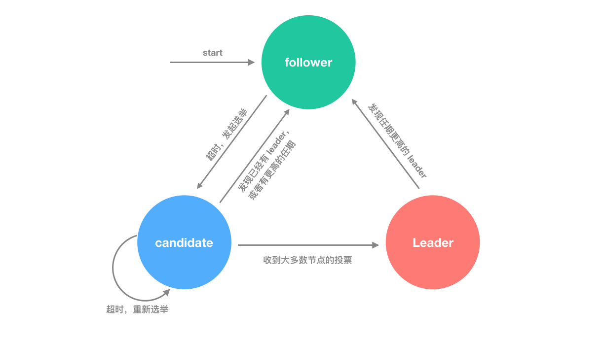](https://shuwoom.com/wp-content/uploads/2018/05/raft_change_user.png)

Raft要求系统在任意时刻最多只有一个Leader，正常工作期间只有Leader和Followers。Raft算法将时间分为一个个的**任期（term）**，每一个term的开始都是Leader选举。在成功选举Leader之后，Leader会在整个term内管理整个集群。如果Leader选举失败，该term就会因为没有Leader而结束。


**Term（任期）**

**Raft 算法将时间划分成为任意不同长度的任期（term）**。任期用连续的数字进行表示。每一个任期的开始都是一次选举（election），一个或多个候选人会试图成为领导人。如果一个候选人赢得了选举，它就会在该任期的剩余时间担任领导人。在某些情况下，选票会被瓜分，有可能没有选出领导人，那么，将会开始另一个任期，并且立刻开始下一次选举。**Raft 算法保证在给定的一个任期最多只有一个领导人**。


**RPC（通信）**

**Raft 算法中服务器节点之间通信使用远程过程调用（RPC）**，并且基本的一致性算法只需要两种类型的 RPC，为了在服务器之间传输快照增加了第三种 RPC。RPC有三种：

- **RequestVote RPC**：候选人在选举期间发起
- **AppendEntries RPC**：领导人发起的一种心跳机制，复制日志也在该命令中完成
- **InstallSnapshot RPC**: 领导者使用该RPC来发送快照给太落后的追随者


#### 选举流程

**① Leader选举过程**

**Raft 使用心跳（heartbeat）触发Leader选举**。当服务器启动时，初始化为Follower。**Leader**向所有**Followers**周期性发送**heartbeat**。如果Follower在选举超时时间内没有收到Leader的heartbeat，就会等待一段随机的时间后发起一次Leader选举。每一个follower都有一个时钟，是一个随机的值，表示的是follower等待成为leader的时间，谁的时钟先跑完，则发起leader选举。Follower将其当前term加一然后转换为Candidate。它首先给自己投票并且给集群中的其他服务器发送 RequestVote RPC。结果有以下三种情况：

- **赢得了多数的选票，成功选举为Leader**
- 收到了Leader的消息，表示有其它服务器已经抢先当选了Leader
- 没有服务器赢得多数的选票，Leader选举失败，等待选举时间**超时后发起下一次选举**

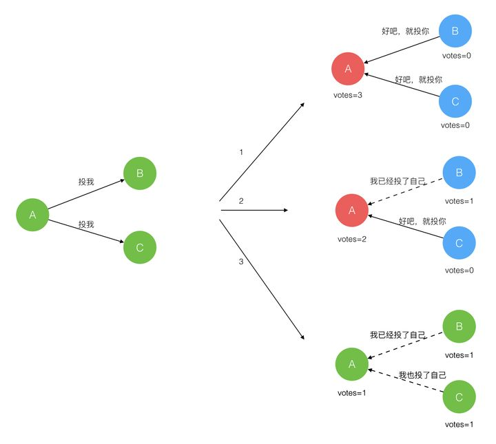


**② Leader选举的限制**

**在Raft协议中，所有的日志条目都只会从Leader节点往Follower节点写入，且Leader节点上的日志只会增加，绝对不会删除或者覆盖**。这意味着Leader节点必须包含所有已经提交的日志，即能被选举为Leader的节点一定需要包含所有的已经提交的日志。因为日志只会从Leader向Follower传输，所以如果被选举出的Leader缺少已经Commit的日志，那么这些已经提交的日志就会丢失，显然这是不符合要求的。这就是Leader选举的限制：**能被选举成为Leader的节点，一定包含了所有已经提交的日志条目**。


#### 日志复制

日志复制的目的是为了保证数据一致性。

- **日志复制的过程**

  Leader选出后，就开始接收客户端的请求。Leader把请求作为日志条目（Log entries）加入到它的日志中，然后并行的向其他服务器发起 AppendEntries RPC复制日志条目。当这条日志被复制到大多数服务器上，Leader将这条日志应用到它的状态机并向客户端返回执行结果。

  - 客户端的每一个请求都包含被复制状态机执行的指令
  - leader把这个指令作为一条新的日志条目添加到日志中，然后并行发起 RPC 给其他的服务器，让他们复制这条信息
  - 假如这条日志被安全的复制，领导人就应用这条日志到自己的状态机中，并返回给客户端
  - 如果follower宕机或者运行缓慢或者丢包，leader会不断的重试，直到所有follower最终都复制了所有的日志条目

  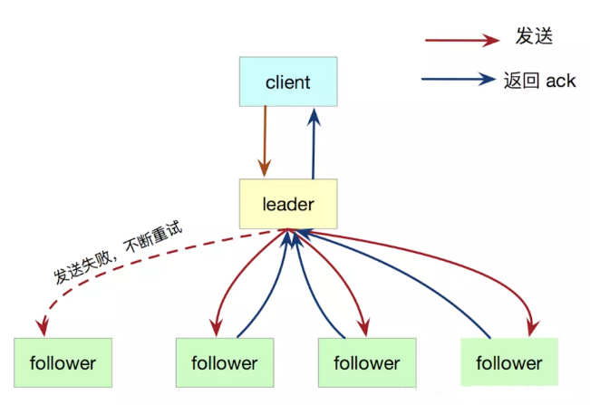
  简而言之，leader选举的过程是：1、增加term号；2、给自己投票；3、重置选举超时计时器；4、发送请求投票的RPC给其它节点。

- **日志的组成**

  日志由有序编号（log index）的日志条目组成**。**每个日志条目包含它被创建时的任期号（term）和用于状态机执行的命令。如果一个日志条目被复制到大多数服务器上，就被认为可以提交（commit）了。
  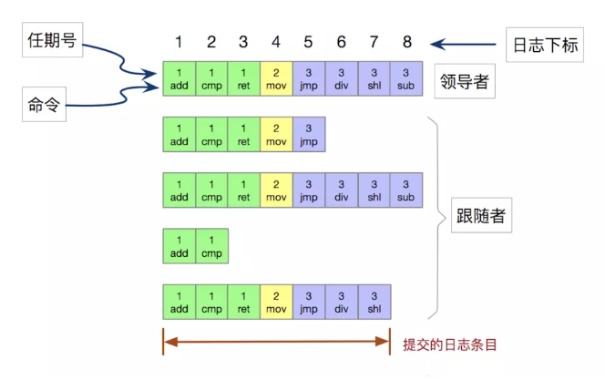

  上图显示，共有 8 条日志，提交了 7 条。提交的日志都将通过状态机持久化到磁盘中，防止宕机。

- **日志的一致性**

  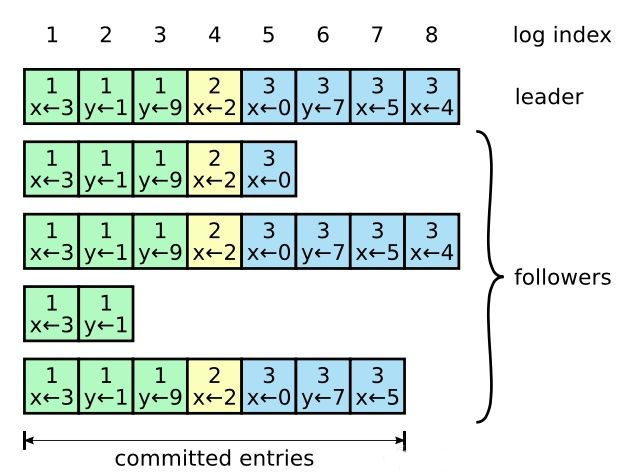

  **① 日志复制的两条保证**

  - 如果不同日志中的两个条目有着**相同的索引和任期号，则它们所存储的命令是相同的**（原因：leader 最多在一个任期里的一个日志索引位置创建一条日志条目，日志条目在日志的位置从来不会改变）
  - 如果不同日志中的两个条目有着**相同的索引和任期号，则它们之前的所有条目都是完全一样的**（原因：**每次 RPC 发送附加日志时**，leader 会把这条日志条目的前面的**日志的下标和任期号一起发送给 follower**，如果 **follower 发现和自己的日志不匹配，那么就拒绝接受这条日志**，这个称之为**一致性检查**）

  **② 日志的不正常情况**

  一般情况下，Leader和Followers的日志保持一致，因此 AppendEntries 一致性检查通常不会失败。然而，Leader崩溃可能会导致日志不一致：**旧的Leader可能没有完全复制完日志中的所有条目**。

  下图阐述了一些Followers可能和新的Leader日志不同的情况。**一个Follower可能会丢失掉Leader上的一些条目，也有可能包含一些Leader没有的条目，也有可能两者都会发生**。丢失的或者多出来的条目可能会持续多个任期。
  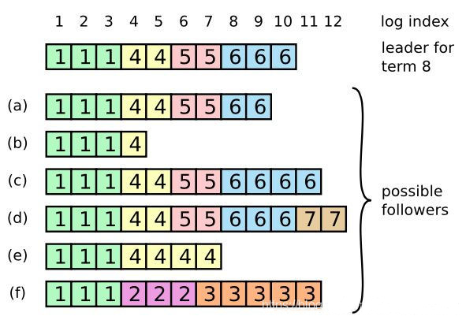

  **③ 如何保证日志的正常复制**

  Leader通过强制Followers复制它的日志来处理日志的不一致，Followers上的不一致的日志会被Leader的日志覆盖。Leader为了使Followers的日志同自己的一致，Leader需要找到Followers同它的日志一致的地方，然后覆盖Followers在该位置之后的条目。

  具体的操作是：**Leader会从后往前试**，每次AppendEntries失败后尝试前一个日志条目，**直到成功找到每个Follower的日志一致位置点（基于上述的两条保证），然后向后逐条覆盖Followers在该位置之后的条目**。

  总结一下就是：**当 leader 和 follower 日志冲突的时候**，leader 将**校验 follower 最后一条日志是否和 leader 匹配**，如果不匹配，**将递减查询，直到匹配，匹配后，删除冲突的日志**。这样就实现了主从日志的一致性。

  

#### 安全性

Raft增加了如下两条限制以保证安全性：

- 拥有**最新的已提交的log entry的Follower才有资格成为leader**
- **Leader只能推进commit index来提交当前term的已经复制到大多数服务器上的日志**，旧term日志的提交要等到提交当前term的日志来间接提交（log index 小于 commit index的日志被间接提交）
  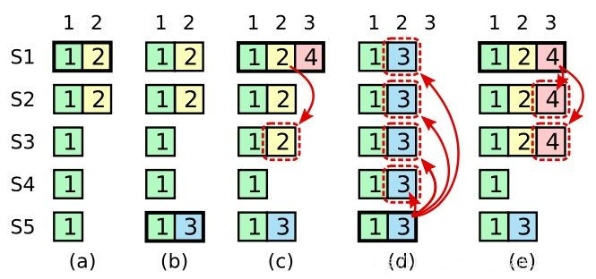


#### 日志压缩

在实际的系统中，**不能让日志无限增长**，否则**系统重启时需要花很长的时间进行回放**，从而影响可用性。Raft采用对整个系统进行snapshot来解决，snapshot之前的日志都可以丢弃（以前的数据已经落盘了）。每个副本独立的对自己的系统状态进行snapshot，并且只能对已经提交的日志记录进行snapshot。

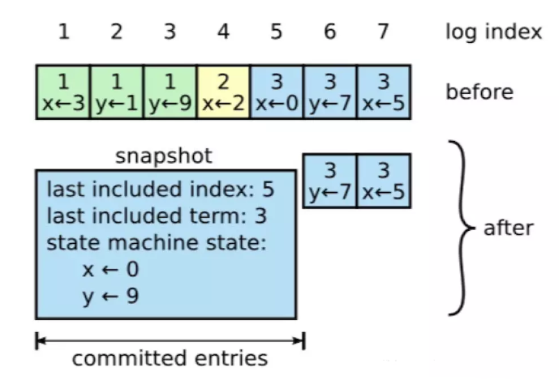

**Snapshot中包含以下内容**：

- **日志元数据，最后一条已提交的 log entry的 log index和term**。这两个值在snapshot之后的第一条log entry的AppendEntries RPC的完整性检查的时候会被用上
- **系统当前状态**


当Leader要发给某个日志落后太多的Follower的log entry被丢弃，Leader会将snapshot发给Follower。或者当新加进一台机器时，也会发送snapshot给它。发送snapshot使用InstalledSnapshot RPC。做snapshot既不要做的太频繁，否则**消耗磁盘带宽**， 也不要做的太不频繁，否则一旦节点重启需要回放大量日志，影响可用性。**推荐当日志达到某个固定的大小做一次snapshot**。做一次snapshot可能耗时过长，会影响正常日志同步。可以通过使用copy-on-write技术避免snapshot过程影响正常日志同步。


#### 成员变更

- **常规处理成员变更存在的问题**

  可能存在这样的一个时间点，两个不同的领导者在同一个任期里都可以被选举成功（双主问题），一个是通过旧的配置，一个通过新的配置。简而言之，成员变更存在的问题是增加或者减少的成员太多了，导致旧成员组和新成员组没有交集，因此出现了双主。

- **解决方案之一阶段成员变更**

  Raft解决方法是每次成员变更只允许增加或删除一个成员（如果要变更多个成员，连续变更多次）。


#### 常见问题

**问题1：Raft分为哪几个部分？**

主要是分为leader选举、日志复制、日志压缩、成员变更等。


**问题2：Raft中任何节点都可以发起选举吗？**

Raft发起选举的情况有如下几种：

- 刚启动时，所有节点都是follower，这个时候发起选举，选出一个leader
- 当leader挂掉后，**时钟最先跑完的follower发起重新选举操作**，选出一个新的leader
- 成员变更的时候会发起选举操作


**问题3：Raft中选举中给候选人投票的前提？**

**Raft确保新当选的Leader包含所有已提交（集群中大多数成员中已提交）的日志条目**。这个保证是在RequestVoteRPC阶段做的，candidate在发送RequestVoteRPC时，会带上自己的**last log entry的term_id和index**，follower在接收到RequestVoteRPC消息时，**如果发现自己的日志比RPC中的更新，就拒绝投票**。日志比较的原则是，如果本地的最后一条log entry的term id更大，则更新，如果term id一样大，则日志更多的更大(index更大)。


**问题4：Raft网络分区下的数据一致性怎么解决？**

发生了网络分区或者网络通信故障，**使得Leader不能访问大多数Follwer了，那么Leader只能正常更新它能访问的那些Follower，而大多数的Follower因为没有了Leader，他们重新选出一个Leader**，然后这个 Leader来接受客户端的请求，如果客户端要求其添加新的日志，这个新的Leader会通知大多数Follower。如果这时网络故障修复 了，那么原先的Leader就变成Follower，在失联阶段这个老Leader的任何更新都不能算commit，都回滚，接受新的Leader的新的更新（递减查询匹配日志）。


**问题5：Raft数据一致性如何实现？**

主要是通过日志复制实现数据一致性，leader将请求指令作为一条新的日志条目添加到日志中，然后发起RPC 给所有的follower，进行日志复制，进而同步数据。


**问题6：Raft的日志有什么特点？**

日志由有序编号（log index）的日志条目组成，每个日志条目包含它被创建时的任期号（term）和用于状态机执行的命令。


**问题7：Raft和Paxos的区别和优缺点？**

- Raft的leader有限制，**拥有最新日志的节点才能成为leader**，multi-paxos中对成为Leader的限制比较低，**任何节点都可以成为leader**
- Raft中Leader在每一个任期都有Term号


**问题8：Raft里面怎么保证数据被commit，leader宕机了会怎样，之前的没提交的数据会怎样？**

leader会通过RPC向follower发出日志复制，等待所有的follower复制完成，这个过程是阻塞的**。**老的leader里面没提交的数据会回滚，然后同步新leader的数据。


**问题9：Raft日志压缩是怎么实现的？增加或删除节点呢？？**

在实际的系统中，**不能让日志无限增长**，否则**系统重启时需要花很长的时间进行回放**，从而影响可用性。Raft采用对整个系统进行snapshot来解决，snapshot之前的日志都可以丢弃（以前的数据已经落盘了）**。**snapshot里面主要记录的是日志元数据，即最后一条已提交的 log entry的 log index和term。


### ZAB协议

ZAB 协议全称Zookeeper Atomic Broadcast（Zookeeper 原子广播协议）。Zookeeper 是一个为分布式应用提供高效且可靠的分布式协调服务。在解决分布式一致性方面，Zookeeper 并没有使用 Paxos ，而是采用了 ZAB 协议。

ZAB 协议定义：**ZAB 协议是为分布式协调服务 Zookeeper 专门设计的一种支持 `崩溃恢复` 和 `原子广播` 协议**。下面我们会重点讲这两个东西。基于该协议，Zookeeper 实现了一种 `主备模式` 的系统架构来保持集群中各个副本之间`数据一致性`。具体如下图所示：

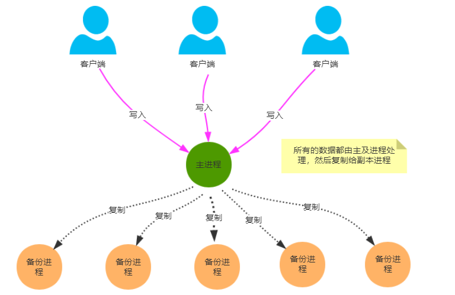

上图显示了 Zookeeper 如何处理集群中的数据。所有客户端写入数据都是写入到 主进程（称为 Leader）中，然后，由 Leader 复制到备份进程（称为 Follower）中。从而保证数据一致性。从设计上看，和 Raft 类似。

那么复制过程又是如何的呢？复制过程类似 2PC，ZAB 只需要 Follower 有一半以上返回 Ack 信息就可以执行提交，大大减小了同步阻塞。也提高了可用性。


#### 消息广播

ZAB 协议的消息广播过程使用的是一个原子广播协议，类似一个 **二阶段提交过程**。对于客户端发送的写请求，全部由 Leader 接收，Leader 将请求封装成一个事务 Proposal，将其发送给所有 Follwer ，然后，根据所有 Follwer 的反馈，如果超过半数成功响应，则执行 commit 操作（先提交自己，再发送 commit 给所有 Follwer）。整个广播流程分为 3 步骤：

**第一步**：将数据都复制到 Follwer 中


**第二步**：等待 Follwer 回应 Ack，最低超过半数即成功

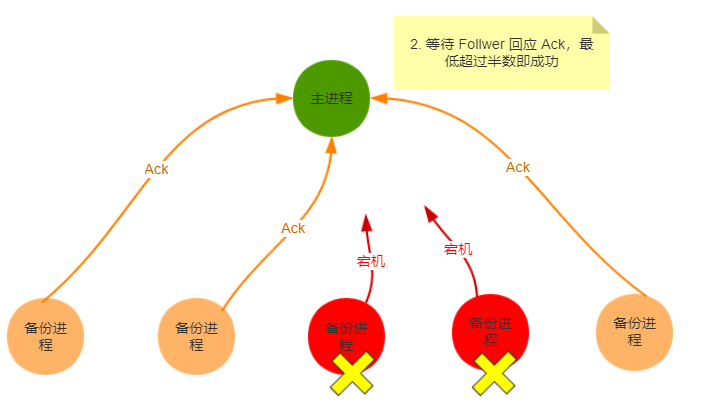

**第三步**：当超过半数成功回应，则执行 commit ，同时提交自己

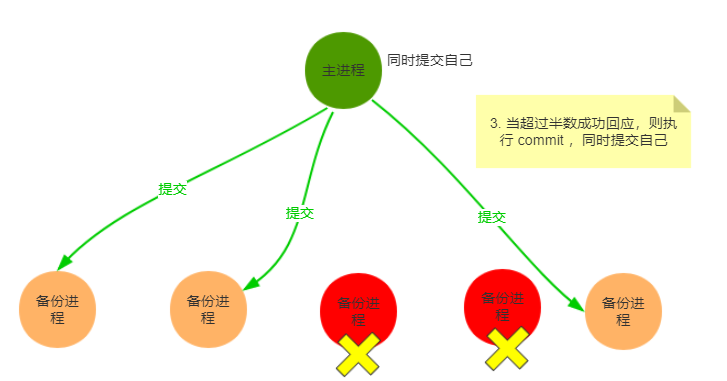

通过以上 3 个步骤，就能够保持集群之间数据的一致性。实际上，在 Leader 和 Follwer 之间还有一个消息队列，用来解耦他们之间的耦合，避免同步，实现异步解耦。还有一些细节：

- Leader 在收到客户端请求之后，会将这个请求封装成一个事务，并给这个事务分配一个全局递增的唯一 ID，称为事务ID（ZXID），ZAB 兮协议需要保证事务的顺序，因此必须将每一个事务按照 ZXID 进行先后排序然后处理
- 在 Leader 和 Follwer 之间还有一个消息队列，用来解耦他们之间的耦合，解除同步阻塞
- zookeeper集群中为保证任何所有进程能够有序的顺序执行，只能是 Leader 服务器接受写请求，即使是 Follower 服务器接受到客户端的请求，也会转发到 Leader 服务器进行处理
- 实际上，这是一种简化版本的 2PC，不能解决单点问题。等会我们会讲述 ZAB 如何解决单点问题（即 Leader 崩溃问题）


#### 崩溃恢复

当Leader崩溃，即进入我们开头所说的崩溃恢复模式（崩溃即：Leader失去与过半Follwer的联系）。ZAB定义了2个原则：

- **ZAB 协议确保那些已经在 Leader 提交的事务最终会被所有服务器提交**
- **ZAB 协议确保丢弃那些只在 Leader 提出/复制，但没有提交的事务**

所以，ZAB 设计了下面这样一个选举算法：**能够确保提交已经被 Leader 提交的事务，同时丢弃已经被跳过的事务。**针对这个要求，如果让 Leader 选举算法能够保证新选举出来的 Leader 服务器拥有集群总所有机器编号（即 ZXID 最大）的事务，那么就能够保证这个新选举出来的 Leader 一定具有所有已经提交的提案。而且这么做有一个好处是：**可以省去 Leader 服务器检查事务的提交和丢弃工作的这一步操作。**


#### 数据同步

当崩溃恢复之后，需要在正式工作之前（接收客户端请求），Leader 服务器首先确认事务是否都已经被过半的 Follwer 提交了，即是否完成了数据同步。目的是为了保持数据一致。当所有的 Follwer 服务器都成功同步之后，Leader 会将这些服务器加入到可用服务器列表中。


**ZXID 生成**

在 ZAB 协议的事务编号 ZXID 设计中，ZXID 是一个 64 位的数字，其中低 32 位可以看作是一个简单的递增的计数器，针对客户端的每一个事务请求，Leader 都会产生一个新的事务 Proposal 并对该计数器进行 + 1 操作。而高 32 位则代表了 Leader服务器上取出本地日志中最大事务Proposal的ZXID，并从该ZXID中解析出对应的epoch值，然后再对这个值加一。

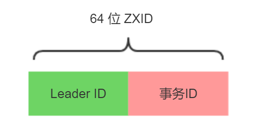

高 32 位代表了每代 Leader 的唯一性，低 32 代表了每代 Leader 中事务的唯一性。同时，也能让 Follwer 通过高 32 位识别不同的 Leader。简化了数据恢复流程。基于这样的策略：当 Follower 链接上 Leader 之后，Leader 服务器会根据自己服务器上最后被提交的 ZXID 和 Follower 上的 ZXID 进行比对，比对结果要么回滚，要么和 Leader 同步。


## 两阶段提交/XA(2PC)

**核心思路**

参与者将操作成功或失败结果通知协调者，再由协调者根据所有参与者反馈情况决定参与者是否要提交操作还是中止操作。

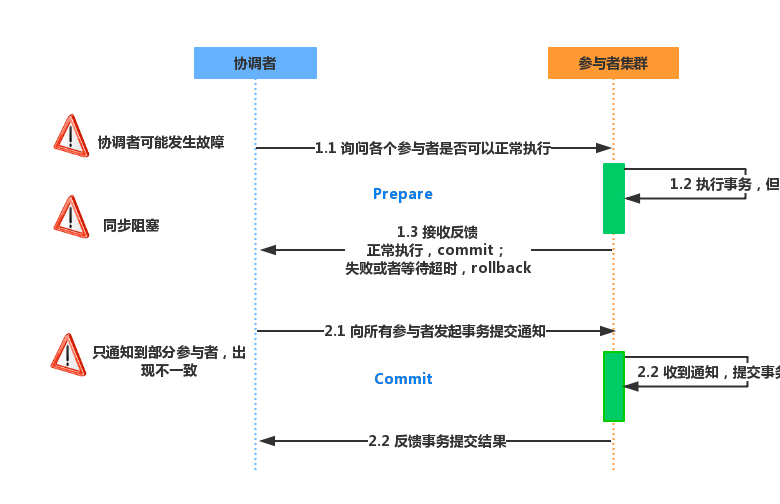

熟悉MySQL的同学对两阶段提交应该颇为熟悉，MySQL的事务就是通过**「日志系统」** 来完成两阶段提交的。两阶段协议可以用于单机集中式系统，由事务管理器协调多个资源管理器；也可以用于分布式系统，**「由一个全局的事务管理器协调各个子系统的局部事务管理器完成两阶段提交」** 。


### 第一阶段：投票阶段

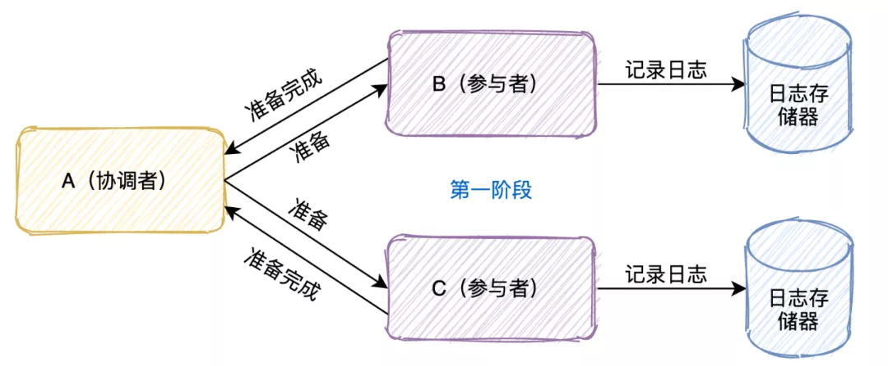

这个协议有 **「两个角色」** ，A节点是事务的协调者，B和C是事务的参与者。事务的提交分成两个阶段：

- 第一个阶段是 **「投票阶段」**
  - 协调者首先将命令 **「写入日志」**
  - **「发一个prepare命令」** 给B和C节点这两个参与者
  - B和C收到消息后，根据自己的实际情况，**「判断自己的实际情况是否可以提交」**
  - 将处理结果 **「记录到日志」** 系统
  - 将结果 **「返回」** 给协调者


###  第二阶段：决定阶段

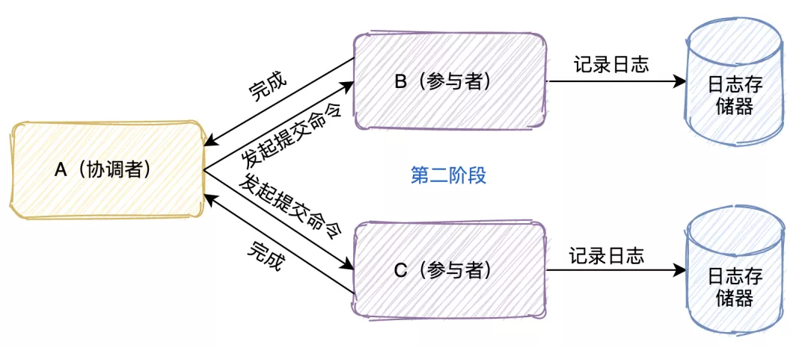

- 第二个阶段是 **「决定阶段」**

  当A节点收到B和C参与者所有的确认消息后

  - **「判断」** 所有协调者 **「是否都可以提交」**
  - 如果可以则 **「写入日志」** 并且发起commit命令
  - 有一个不可以则 **「写入日志」** 并且发起abort命令
  - 参与者收到协调者发起的命令，**「执行命令」**
  - 将执行命令及结果 **「写入日志」**
  - **「返回结果」** 给协调者


### 两阶段提交缺点

- **单点故障**：一旦事务管理器出现故障，整个系统不可用
- **数据不一致**：在阶段二，如果事务管理器只发送了部分 commit 消息，此时网络发生异常，那么只有部分参与者接收到 commit 消息，也就是说只有部分参与者提交了事务，使得系统数据不一致
- **响应时间较长**：整个消息链路是串行的，要等待响应结果，不适合高并发的场景
- **不确定性**：当事务管理器发送 commit 之后，并且此时只有一个参与者收到了 commit，那么当该参与者与事务管理器同时宕机之后，重新选举的事务管理器无法确定该条消息是否提交成功


### 无法解决的问题

当协调者和参与者同时出现故障时，两阶段提交无法保证事务的完整性。如果调者在发出commit消息之后宕机，而唯一接收到commit消息的参与者同时也宕机了。那么即使协调者通过选举协议产生了新的协调者，这条事务的状态也是不确定的，因为没人知道事务是否已经被提交。


## 三阶段提交(3PC)

3PC针对2PC做了改进：

- **引入超时机制**：在2PC中，只有协调者拥有超时机制，3PC同时在协调者和参与者中都引入超时机制
- **在2PC的第一阶段和第二阶段中插入一个准备阶段**：保证了在最后提交阶段之前各参与节点的状态是一致的

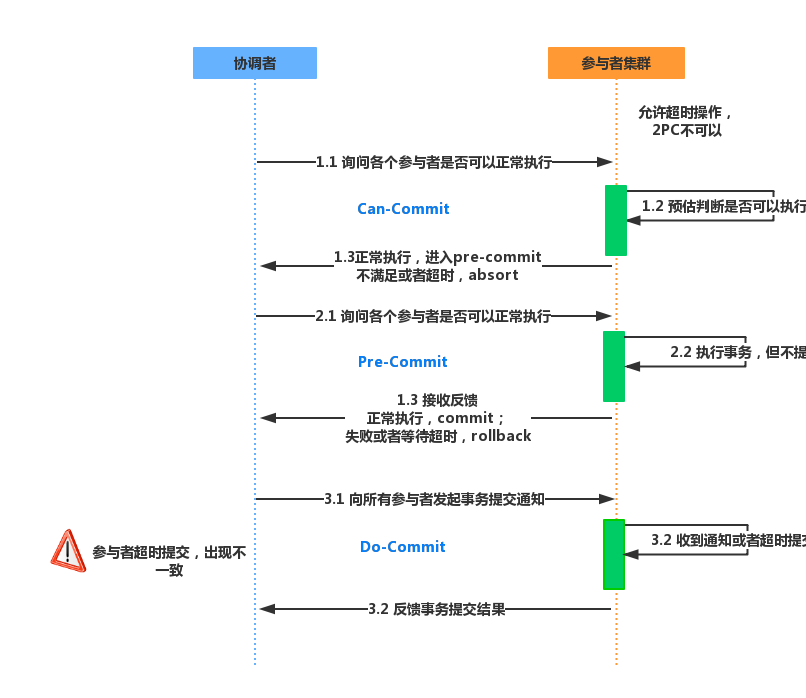

### 第一阶段：CanCommit

协调者向参与者发送事务执行请求CanCommit，参与者如果可以提交就返回YES响应，否则就返回NO响应。


### 第二阶段：PreCommit

协调者根据参与者反馈的结果来决定是否继续执行事务的PreCommit操作，根据协调者反馈的结果，有以下两种可能：

- 假如协调者收到参与者的反馈结果都是YES，那么就会执行PreCommit操作
  - **发送预提交请求**：协调者向参与者发送PreCommit请求，并进入Prepared阶段
  - **事务预提交**：参与者接收到PreCommit请求后，执行事务操作
  - **响应反馈**：事务操作执行成功，则返回ACK响应，然后等待协调者的下一步通知
- 假如有任何一个参与者向协调者发送了NO响应，或者等待超时之后，协调者没有收到参与者的响应，那么就中断事务
  - **发送中断请求**：协调者向所有参与者发送中断请求
  - **中断事务**：参与者收到中断请求之后（或超时之后，仍未收到协调者的请求），执行事务中断操作


### 第三阶段：DoCommit

- **执行提交**
  - **发送提交请求**：协调者收到ACK之后，向所有的参与者发送DoCommit请求
  - **事务提交**：参与者收到DoCommit请求之后，提交事务
  - **响应反馈**：事务提交之后，向协调者发送ACK响应
  - **完成事务**：协调者收到ACK响应之后，完成事务
- **中断事务**
  - 在第二阶段中，协调者没有收到参与者发送的ACK响应，那么就会执行中断事务


## 补偿机制(TCC)

两阶段提交（2PC）和三阶段提交（3PC）并不适用于并发量大的业务场景。TCC事务机制相比于2PC、3PC，不会锁定整个资源，而是通过引入补偿机制，将资源转换为业务逻辑形式，锁的粒度变小。**核心思想**：针对每个操作，都要注册一个与其对应的确认和补偿（撤销）操作。TCC分为三个阶段：

- **Try**：这个阶段对各个服务的资源做检测以及对资源进行锁定或者预留
- **Confirm** ：执行真正的业务操作，不作任何业务检查，只使用Try阶段预留的业务资源，Confirm操作要求具备幂等设计，Confirm失败后需要进行重试
- **Cancel**：如果任何一个服务的业务方法执行出错，那么这里就需要进行补偿，即执行回滚操作，释放Try阶段预留的业务资源 ，Cancel操作要求具备幂等设计，Cancel失败后需要进行重试
  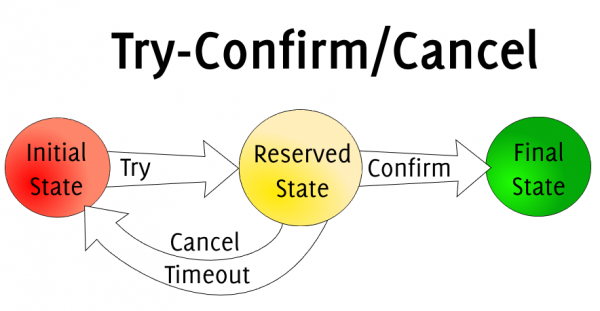

TCC 事务机制相比于上面介绍的2PC，解决了其几个缺点：

- **协调者单点**。由主业务方发起并完成这个业务活动。业务活动管理器也变成多点，引入集群
- **同步阻塞**。引入超时，超时后进行补偿，并且不会锁定整个资源，将资源转换为业务逻辑形式，粒度变小
- **数据一致性**。有了补偿机制之后，由业务活动管理器控制一致性

总之，TCC 就是通过代码人为实现了两阶段提交，不同的业务场景所写的代码都不一样，并且很大程度的**增加**了业务代码的**复杂度**，因此，这种模式并不能很好地被复用。


**TCC案例场景**

TCC将一次事务操作分为三个阶段：Try、Confirm、Cancel，我们通过一个订单/库存的示例来理解。假设我们的分布式系统一共包含4个服务：订单服务、库存服务、积分服务、仓储服务，每个服务有自己的数据库，如下图：
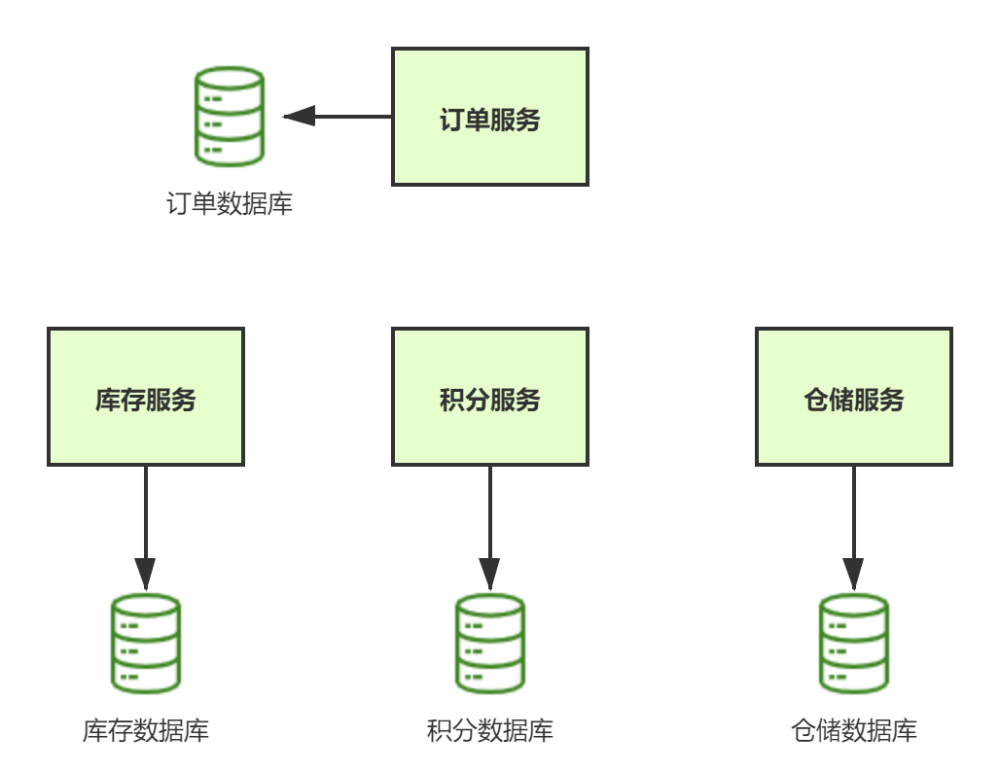

从正常流程上讲，TCC仍是一个两阶段提交协议。但在执行出现问题的时候，有一定的自我修复能力，如果任何一个事务参与者出现了问题，协调者可以通过执行逆操作来取消之前的操作，达到最终的一致状态（比如冲正交易、查询交易）。从TCC的执行流程也可以看出，服务提供方需要提供额外的补偿逻辑，那么原来一个服务接口，引入TCC后可能要改造成3种逻辑：

- **Try**：先是服务调用链路依次执行Try逻辑
- **Confirm**：如果都正常的话，TCC分布式事务框架推进执行Confirm逻辑，完成整个事务
- **Cancel**：如果某个服务的Try逻辑有问题，TCC分布式事务框架感知到之后就会推进执行各个服务的Cancel逻辑，撤销之前执行的各种操作

> 注意：在设计TCC事务时，接口的Cancel和Confirm操作都必须满足幂等设计。


### Try

Try阶段一般用于锁定某个资源，设置一个预备状态或冻结部分数据。对于示例中的每一个服务，Try阶段所做的工作如下：

- 订单服务：先置一个中间状态“UPDATING”，而不是直接设置“支付成功”状态
- 库存服务：先用一个冻结库存字段保存冻结库存数，而不是直接扣掉库存
- 积分服务：预增加会员积分
- 仓储服务：创建销售出库单，但状态是UNKONWN


### Confirm

根据Try阶段的执行情况，Confirm分为两种情况：

- **理想情况下，所有Try全部执行成功，则执行各个服务的Confirm逻辑**
- **部分服务Try执行失败，则执行第三阶段——Cancel**

Confirm阶段一般需要各个服务自己实现Confirm逻辑：

- 订单服务：confirm逻辑可以是将订单的中间状态变更为PAYED-支付成功
- 库存服务：将冻结库存数清零，同时扣减掉真正的库存
- 积分服务：将预增加积分清零，同时增加真实会员积分
- 仓储服务：修改销售出库单的状态为已创建-CREATED
  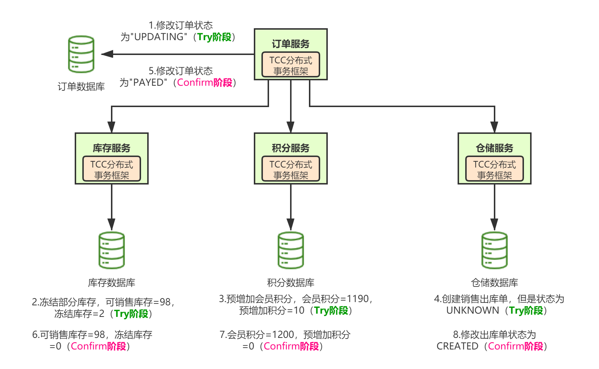

> Confirm阶段的各个服务本身可能出现问题，这时候一般就需要TCC框架了（比如ByteTCC，tcc-transaction，himly），TCC事务框架一般会记录一些分布式事务的活动日志，保存事务运行的各个阶段和状态，从而保证整个分布式事务的最终一致性。


### Cancel

如果Try阶段执行异常，就会执行Cancel阶段。比如：对于订单服务，可以实现的一种Cancel逻辑就是：将订单的状态设置为“CANCELED”；对于库存服务，Cancel逻辑就是：将冻结库存扣减掉，加回到可销售库存里去。
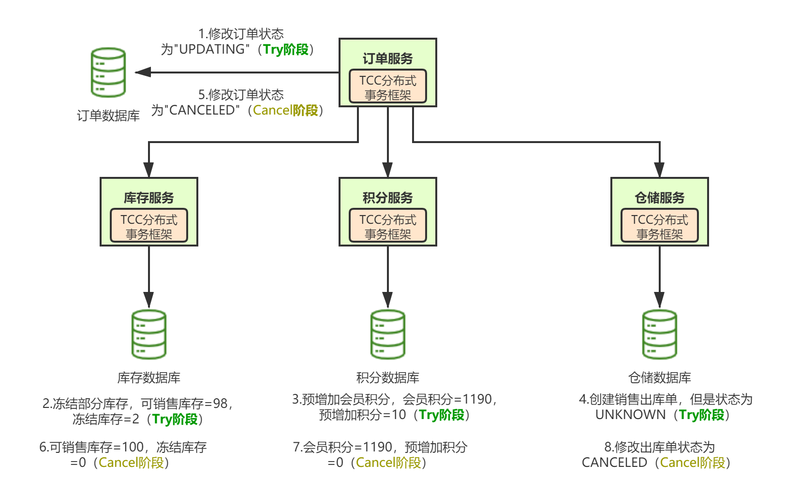

> 许多公司为了简化TCC使用，通常会将一个服务的某个核心接口拆成两个，如库存服务的扣减库存接口，拆成两个子接口：①扣减接口 ②回滚扣减库存接口，由TCC框架来保证当某个接口执行失败后去执行对应的rollback接口。


## 可靠消息最终一致性方案

该方案其实就是在分布式系统当中，把一个业务操作转换成一个消息，然后利用消息来实现事务的最终一致性。

> 比如从A账户向B账户转账的操作，当服务A从A账户扣除完金额后，通过消息中间件向服务B发一个消息，服务B收到这条消息后，进行B账户的金额增加操作。

可靠消息最终一致性方案一般有两种实现方式，原理其实是一样的：

- **基于本地消息表**
- **基于支持分布式事务的消息中间件，如RocketMQ等**


可靠消息最终一致性方案，一般适用于异步的服务调用，比如支付成功后，调用积分服务进行积分累加、调用库存服务进行发货等等。总结一下，可靠消息最终一致性方案其实最基本的思想就两点：

- **通过引入消息中间件，保证生产者对消息的100%可靠投递**
- **通过引入Zookeeper，保证消费者能够对未成功消费的消息进行重新消费（消费者要保证自身接口的幂等性）**


可靠消息最终一致性方案是目前业务主流的分布式事务落地方案，其优缺点主要如下：

- **优点**：消息数据独立存储，降低业务系统与消息系统间的耦合

- **缺点**：一次消息发送需要两次请求，业务服务需要提供消息状态查询的回调接口


一般来讲，99%的分布式接口调用不需要做分布式事务，通过监控（邮件、短信告警）、记录日志，就可以事后快速定位问题，然后就是排查、出解决方案、修复数据。因为用分布式事务一定是有成本的，而且这个成本会比较高，特别是对于一些中小型公司。同时，引入分布式事务后，代码复杂度、开发周期会大幅上升，系统性能和吞吐量会大幅下跌，这就导致系统更加更加脆弱，更容易出bug。当然，如果有资源能够持续投入，分布式事务做好了的话，好处就是可以100%保证数据一致性不会出错。


### 本地消息表

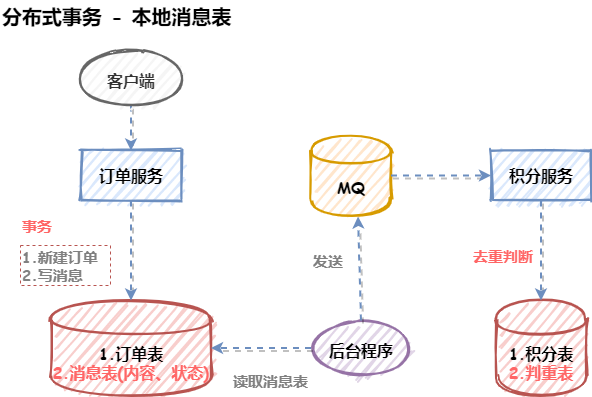

基于本地消息表的分布式事务，是最简便的实现方式，其核心思想是将分布式事务拆分成本地事务进行处理，这种思路是来源于eBay。我们来看下面这张图，基于本地消息服务的分布式事务分为三大部分：

- **可靠消息服务**：存储消息，因为通常通过数据库存储，所以也叫本地消息表
- **生产者（上游服务）**：生产者是接口的调用方，生产消息
- **消费者（下游服务）**：消费者是接口的服务方，消费消息
  

#### 可靠消息服务

可靠消息服务就是一个单独的服务，有自己的数据库，其主要作用就是存储消息（包含接口调用信息，全局唯一的消息编号），消息通常包含以下状态：

- **待确认**：上游服务发送待确认消息
- **已发送**：上游服务发送确认消息
- **已取消（终态**）：上游服务发送取消消息
- **已完成（终态）**：下游服务确认接口执行完成


#### 生产者

服务调用方（消息生产者）需要调用下游接口时，不直接通过RPC之类的方式调用，而是先生成一条消息，其主要步骤如下：

- 生产者调用接口前，先发送一条待确认消息（一般称为half-msg，包含接口调用信息）给可靠消息服务，可靠消息服务会将这条记录存储到自己的数据库（或本地磁盘），状态为【待确认】
- 生产者执行本地事务，本地事务执行成功并提交后，向可靠消息服务发送一条确认消息；如果本地执行失败，则向消息服务发送一条取消消息
- 可靠消息服务如果收到消息后，修改本地数据库中的那条消息记录的状态改为【已发送】或【已取消】。如果是确认消息，则将消息投递到MQ消息队列；（修改消息状态和投递MQ必须在一个事务里，保证要么都成功要么都失败）

> 为了防止出现：生产者的本地事务执行成功，但是发送确认/取消消息超时的情况。可靠消息服务里一般会提供一个后台定时任务，不停的检查消息表中那些【待确认】的消息，然后回调生产者（上游服务）的一个接口，由生产者确认到底是取消这条消息，还是确认并发送这条消息。

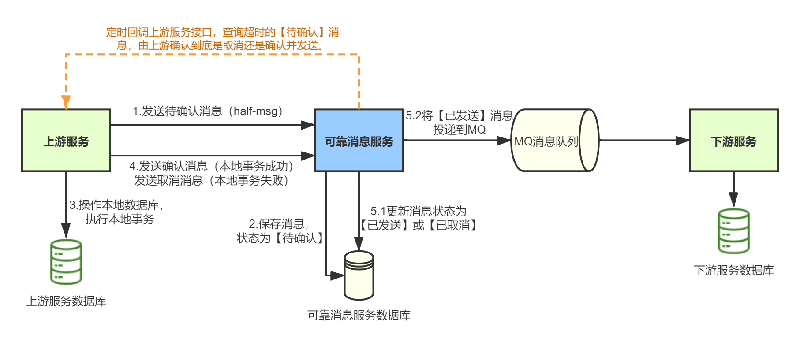

通过上面这套机制，可以保证生产者对消息的100%可靠投递。


#### 消费者

服务提供方（消息消费者），从MQ消费消息，然后执行本地事务。执行成功后，反过来通知可靠消息服务，说自己处理成功了，然后可靠消息服务就会把本地消息表中的消息状态置为最终状态【已完成】 。这里要注意两种情况：

- 消费者消费消息失败，或者消费成功但执行本地事务失败。
  针对这种情况，可靠消息服务可以提供一个后台定时任务，不停的检查消息表中那些【已发送】但始终没有变成【已完成】的消息，然后再次投递到MQ，让下游服务来再次处理。也可以引入zookeeper，由消费者通知zookeeper，生产者监听到zookeeper上节点变化后，进行消息的重新投递
- 如果消息重复投递，消息者的接口逻辑需要实现幂等性，保证多次处理一个消息不会插入重复数据或造成业务数据混乱。
  针对这种情况，消费者可以准备一张消息表，用于判重。消费者消费消息后，需要去本地消息表查看这条消息有没处理成功，如果处理成功直接返回成功


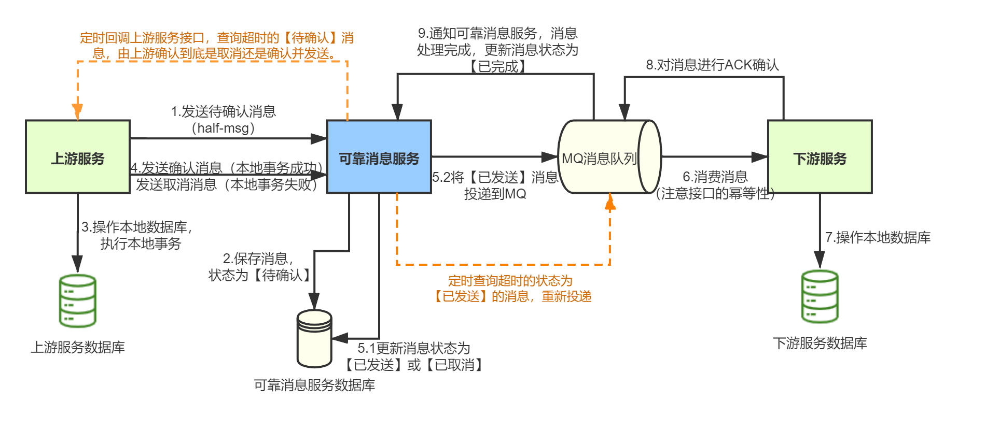

**总结**

这个方案的优点是简单，但最大的问题在于可靠消息服务是严重依赖于数据库的，即通过数据库的消息表来管理事务，不太适合并发量很高的场景。


### 分布式消息中间件

许多开源的消息中间件都支持分布式事务，比如RocketMQ、Kafka。其思想几乎是和本地消息表/服务实一样的，只不过是将可靠消息服务和MQ功能封装在一起，屏蔽了底层细节，从而更方便用户的使用。这种方案有时也叫做可靠消息最终一致性方案。以RocketMQ为例，消息的发送分成2个阶段：**Prepare阶段**和**确认阶段**。
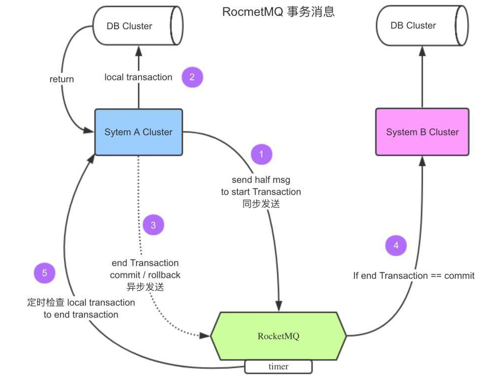

#### prepare阶段

- 生产者发送一个不完整的事务消息——HalfMsg到消息中间件，消息中间件会为这个HalfMsg生成一个全局唯一标识，生产者可以持有标识，以便下一阶段找到这个HalfMsg
- 生产者执行本地事务

> 注意：消费者无法立刻消费HalfMsg，生产者可以对HalfMsg进行Commit或者Rollback来终结事务。只有当Commit了HalfMsg后，消费者才能消费到这条消息。


#### 确认阶段

- 如果生产者执行本地事务成功，就向消息中间件发送一个Commit消息（包含之前HalfMsg的唯一标识），中间件修改HalfMsg的状态为【已提交】，然后通知消费者执行事务
- 如果生产者执行本地事务失败，就向消息中间件发送一个Rollback消息（包含之前HalfMsg的唯一标识），中间件修改HalfMsg的状态为【已取消】

> 消息中间件会定期去向生产者询问，是否可以Commit或者Rollback那些由于错误没有被终结的HalfMsg，以此来结束它们的生命周期，以达成事务最终的一致。之所以需要这个询问机制，是因为生产者可能提交完本地事务，还没来得及对HalfMsg进行Commit或者Rollback，就挂掉了，这样就会处于一种不一致状态。


#### ACK机制

消费者消费完消息后，可能因为自身异常，导致业务执行失败，此时就必须要能够重复消费消息。RocketMQ提供了ACK机制，即RocketMQ只有收到服务消费者的ack message后才认为消费成功。所以，服务消费者可以在自身业务员逻辑执行成功后，向RocketMQ发送ack message，保证消费逻辑执行成功。


### 应用案例

我们最后以一个电子商务支付系统的核心交易链路为示例，来更好的理解下可靠消息最终一致性方案。

**交易链路**

假设我们的系统的核心交易链路如下图。用户支付订单时，首先调用订单服务的对外接口服务，然后开始核心交易链路的调用，依次经过订单业务服务、库存服务、积分服务，全部成功后再通过MQ异步调用仓储服务：
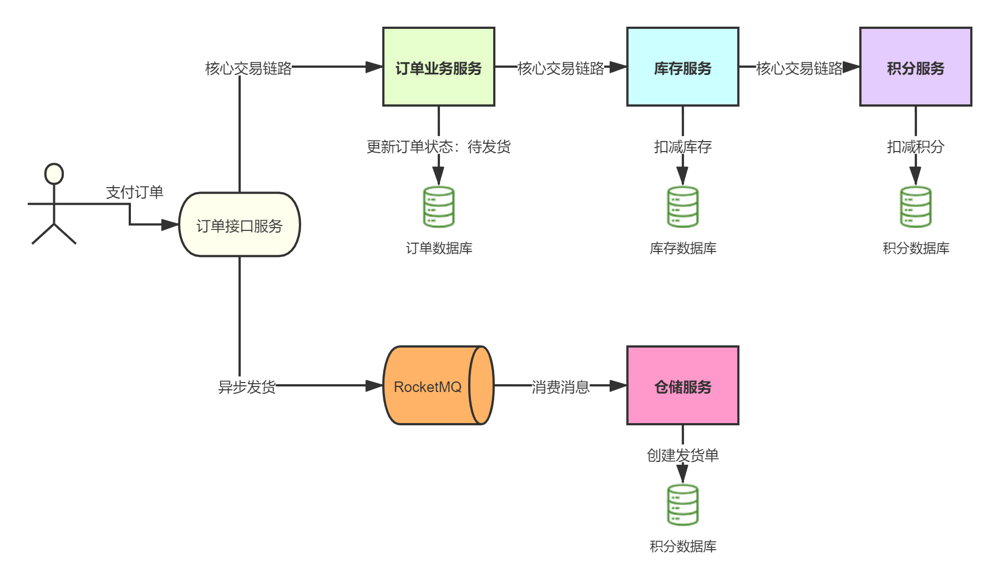

上图中，订单业务服务、库存服务、积分服务都是同步调用的，由于是核心链路，我们可以通过上一章中讲解的TCC分布式事务来保证分布式事务的一致性。而调用仓储服务可以异步执行，所以我们依赖RocketMQ来实现分布式事务。


**事务执行**

接着，我们来看下引入RocketMQ来实现分布式事务后，整个系统的业务执行流程发生了哪些变化，整个流程如下图：
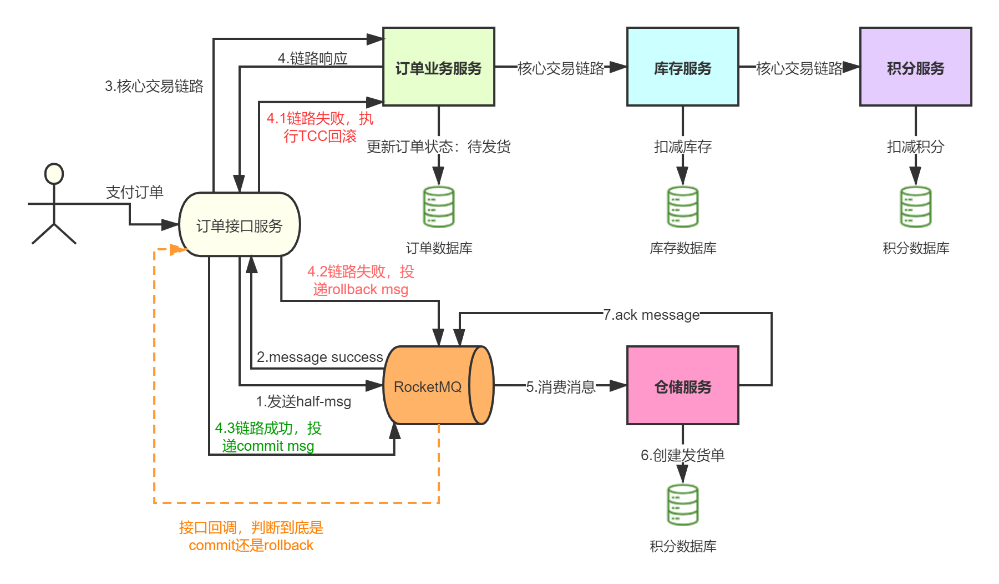

- 当用户针对订单发起支付时，首先订单接口服务先发送一个half-msg消息给RocketMQ，收到RocketMQ的成功响应（注意，此时仓储服务还不能消费消息，因为half-msg还没有确认）
- 然后，订单接口服务调用核心交易链路，如果其中任一服务执行失败，则先执行内部的TCC事务回滚
- 如果订单接口服务收到链路失败的响应，则向MQ投递一个rollback消息，取消之前的half-msg
- 如果订单接口服务收到链路成功的响应，则向MQ投递一个commit消息，确认之前的half-msg，那仓库服务就可消费消息
- 仓储服务消费消息成功并执行完自身的逻辑后，会向RocketMQ投递一个ack message，以确保消费成功

> 注意，如果因为网络原因，导致RocketMQ始终没有收到订单接口服务对half-msg的commit或rollback消息，RocketMQ就会回调订单接口服务的某个接口，以查询该half-msg究竟是进行commit还是rollback。


## 最大努力通知

最大努力通知的方案实现比较简单，适用于一些最终一致性要求较低的业务。执行流程：

- 系统 A 本地事务执行完之后，发送个消息到 MQ
- 这里会有个专门消费 MQ 的服务，这个服务会消费 MQ 并调用系统 B 的接口
- 要是系统 B 执行成功就 ok 了；要是系统 B 执行失败了，那么最大努力通知服务就定时尝试重新调用系统 B, 反复 N 次，最后还是不行就放弃


## Sagas事务模型

Saga事务模型又叫做长时间运行的事务。其核心思想是**「将长事务拆分为多个本地短事务」**，由Saga事务协调器协调，如果正常结束那就正常完成，如果**「某个步骤失败，则根据相反顺序一次调用补偿操作」**。


## Seate

**XA和Seata区别**

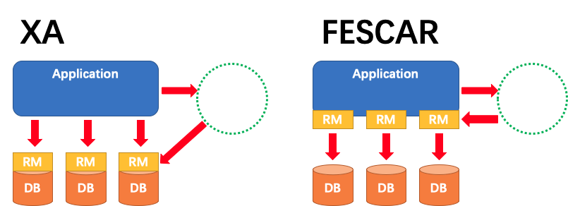


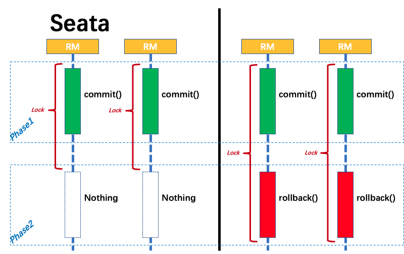

Seata 中有三大模块，分别是 TM、RM 和 TC。 其中 TM 和 RM 是作为 Seata 的客户端与业务系统集成在一起，TC 作为 Seata 的服务端独立部署。


在 Seata 中，分布式事务的执行流程：

- TM 开启分布式事务（TM 向 TC 注册全局事务记录）
- 按业务场景，编排数据库、服务等事务内资源（RM 向 TC 汇报资源准备状态 ）
- TM 结束分布式事务，事务一阶段结束（TM 通知 TC 提交/回滚分布式事务）
- TC 汇总事务信息，决定分布式事务是提交还是回滚
- TC 通知所有 RM 提交/回滚 资源，事务二阶段结束


- Transaction Coordinator(TC)

事务协调器，维护全局事务的运行状态，负责协调并驱动全局事务的提交或回滚。

- Transaction Manager(TM)

控制全局事务的边界，负责开启一个全局事务，并最终发起全局提交或全局回滚的决议。

- Resource Manager(RM)

控制分支事务，负责分支注册、状态汇报，并接收事务协调器的指令，驱动分支（本地）事务的提交和回滚。


Seata 会有 4 种分布式事务解决方案，分别是：AT 模式、TCC 模式、Saga 模式和 XA 模式。

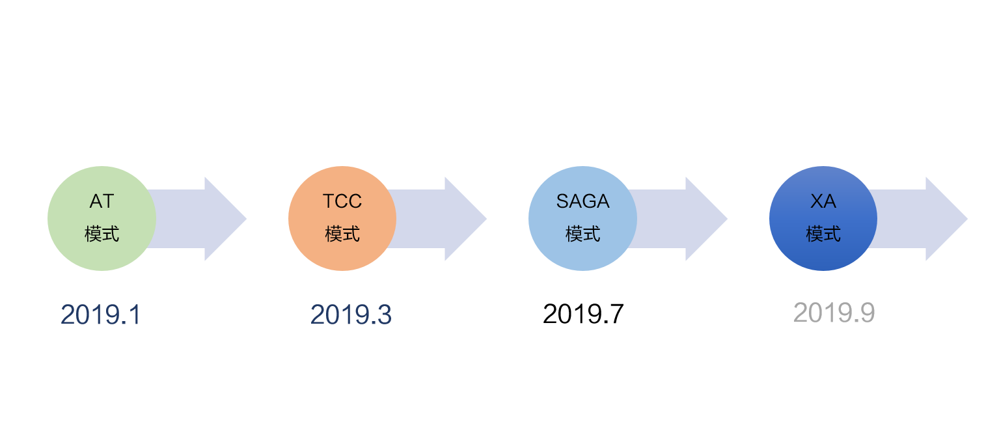


### AT模式

2019年1月，Seata 开源了 AT 模式。AT 模式是一种无侵入的分布式事务解决方案。在 AT 模式下，用户只需关注自己的“业务 SQL”，用户的 “业务 SQL” 作为一阶段，Seata 框架会自动生成事务的二阶段提交和回滚操作。

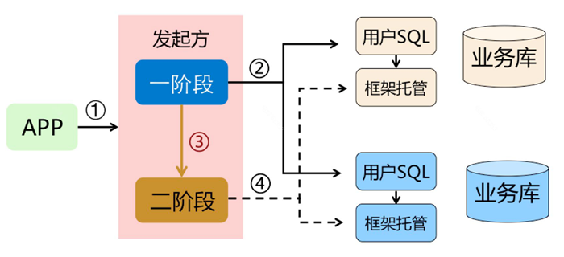

**AT模式如何做到对业务的无侵入 ：**

- **一阶段**

在一阶段，Seata 会拦截“业务 SQL”，首先解析 SQL 语义，找到“业务 SQL”要更新的业务数据，在业务数据被更新前，将其保存成“before image”，然后执行“业务 SQL”更新业务数据，在业务数据更新之后，再将其保存成“after image”，最后生成行锁。以上操作全部在一个数据库事务内完成，这样保证了一阶段操作的原子性。

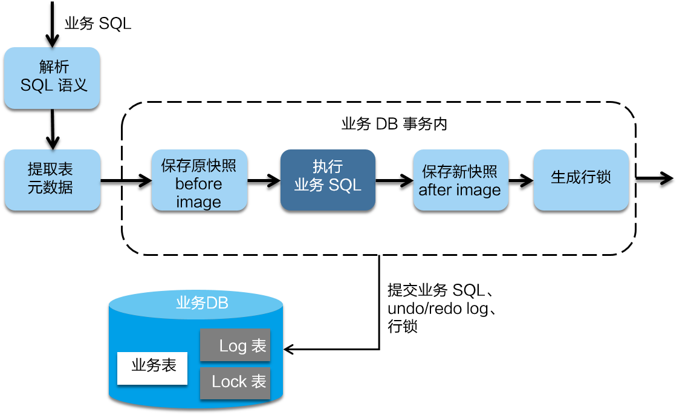

- **二阶段提交**

二阶段如果是提交的话，因为“业务 SQL”在一阶段已经提交至数据库， 所以 Seata 框架只需将一阶段保存的快照数据和行锁删掉，完成数据清理即可。

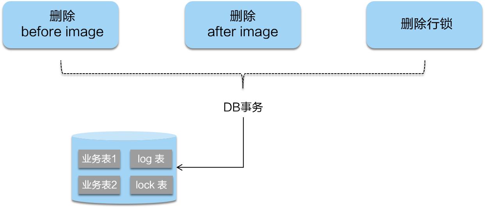

- **二阶段回滚**

二阶段如果是回滚的话，Seata 就需要回滚一阶段已经执行的“业务 SQL”，还原业务数据。回滚方式便是用“before image”还原业务数据；但在还原前要首先要校验脏写，对比“数据库当前业务数据”和 “after image”，如果两份数据完全一致就说明没有脏写，可以还原业务数据，如果不一致就说明有脏写，出现脏写就需要转人工处理。

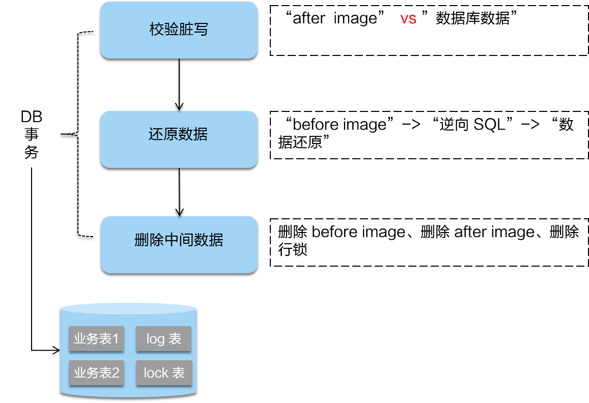

AT 模式的一阶段、二阶段提交和回滚均由 Seata 框架自动生成，用户只需编写“业务 SQL”，便能轻松接入分布式事务，AT 模式是一种对业务无任何侵入的分布式事务解决方案。


### TCC模式

2019 年 3 月份，Seata 开源了 TCC 模式，该模式由蚂蚁金服贡献。TCC 模式需要用户根据自己的业务场景实现 Try、Confirm 和 Cancel 三个操作；事务发起方在一阶段 执行 Try 方式，在二阶段提交执行 Confirm 方法，二阶段回滚执行 Cancel 方法。

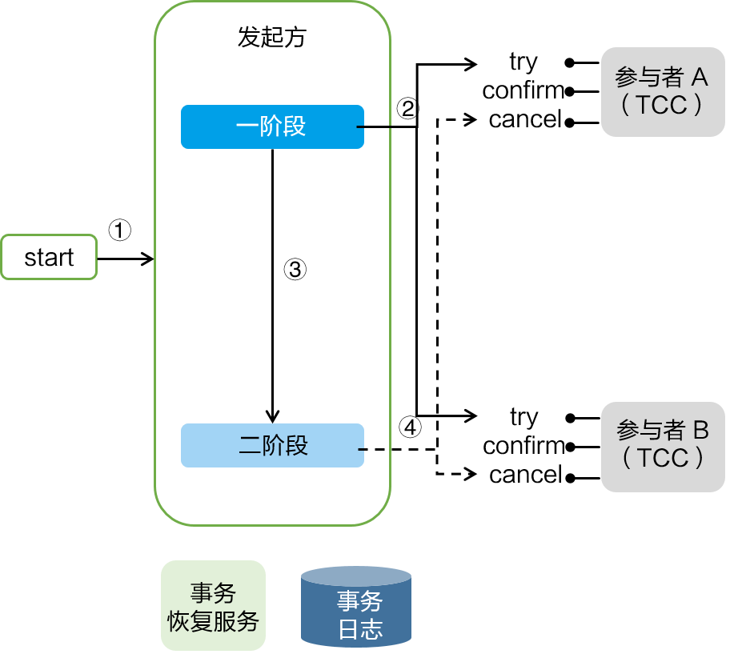

TCC 三个方法描述：

- Try：资源的检测和预留
- Confirm：执行的业务操作提交；要求 Try 成功 Confirm 一定要能成功
- Cancel：预留资源释放


**业务模型分 2 阶段设计：**

用户接入 TCC ，最重要的是考虑如何将自己的业务模型拆成两阶段来实现。

以“扣钱”场景为例，在接入 TCC 前，对 A 账户的扣钱，只需一条更新账户余额的 SQL 便能完成；但是在接入 TCC 之后，用户就需要考虑如何将原来一步就能完成的扣钱操作，拆成两阶段，实现成三个方法，并且保证一阶段 Try  成功的话 二阶段 Confirm 一定能成功。

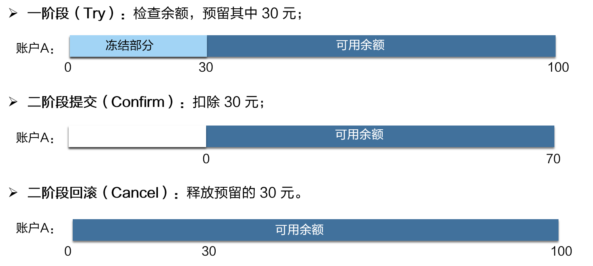

如上图所示，Try 方法作为一阶段准备方法，需要做资源的检查和预留。在扣钱场景下，Try 要做的事情是就是检查账户余额是否充足，预留转账资金，预留的方式就是冻结 A 账户的 转账资金。Try 方法执行之后，账号 A 余额虽然还是 100，但是其中 30 元已经被冻结了，不能被其他事务使用。

二阶段 Confirm 方法执行真正的扣钱操作。Confirm 会使用 Try 阶段冻结的资金，执行账号扣款。Confirm 方法执行之后，账号 A 在一阶段中冻结的 30 元已经被扣除，账号 A 余额变成 70 元 。

如果二阶段是回滚的话，就需要在 Cancel 方法内释放一阶段 Try 冻结的 30 元，使账号 A 的回到初始状态，100 元全部可用。

用户接入 TCC 模式，最重要的事情就是考虑如何将业务模型拆成 2 阶段，实现成 TCC 的 3 个方法，并且保证 Try 成功 Confirm 一定能成功。相对于 AT 模式，TCC 模式对业务代码有一定的侵入性，但是 TCC 模式无 AT 模式的全局行锁，TCC 性能会比 AT 模式高很多。


### Saga模式

Saga 模式是 Seata 即将开源的长事务解决方案，将由蚂蚁金服主要贡献。在 Saga 模式下，分布式事务内有多个参与者，每一个参与者都是一个冲正补偿服务，需要用户根据业务场景实现其正向操作和逆向回滚操作。

分布式事务执行过程中，依次执行各参与者的正向操作，如果所有正向操作均执行成功，那么分布式事务提交。如果任何一个正向操作执行失败，那么分布式事务会去退回去执行前面各参与者的逆向回滚操作，回滚已提交的参与者，使分布式事务回到初始状态。

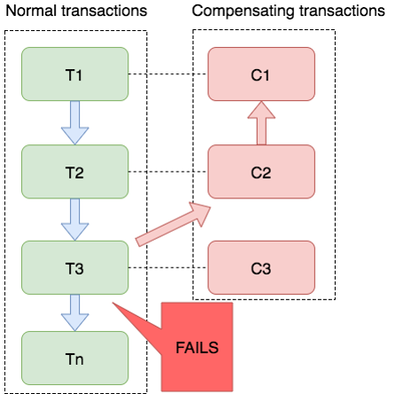

Saga 模式下分布式事务通常是由事件驱动的，各个参与者之间是异步执行的，Saga 模式是一种长事务解决方案。


### XA模式

XA 模式是 Seata 将会开源的另一种无侵入的分布式事务解决方案，任何实现了 XA 协议的数据库都可以作为资源参与到分布式事务中，目前主流数据库，例如 MySql、Oracle、DB2、Oceanbase 等均支持 XA 协议。

XA 协议有一系列的指令，分别对应一阶段和二阶段操作。“xa start”和 “xa end”用于开启和结束XA 事务；“xa prepare” 用于预提交 XA 事务，对应一阶段准备；“xa commit”和“xa rollback”用于提交、回滚 XA 事务，对应二阶段提交和回滚。

在 XA 模式下，每一个 XA 事务都是一个事务参与者。分布式事务开启之后，首先在一阶段执行“xa start”、“业务 SQL”、“xa end”和 “xa prepare” 完成 XA 事务的执行和预提交；二阶段如果提交的话就执行 “xa commit”，如果是回滚则执行“xa rollback”。这样便能保证所有 XA 事务都提交或者都回滚。

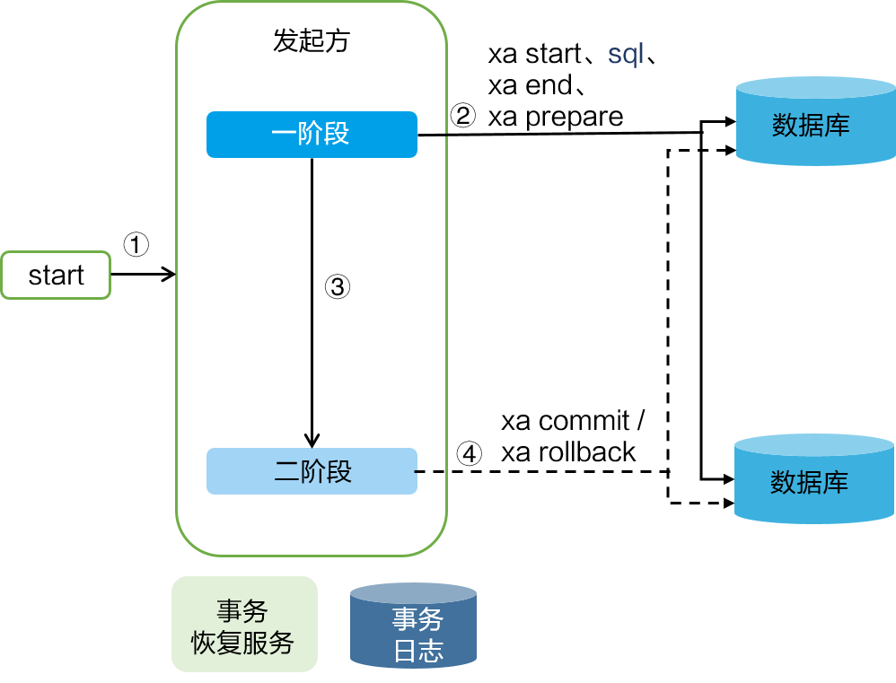

XA 模式下，用户只需关注自己的“业务 SQL”，Seata 框架会自动生成一阶段、二阶段操作；XA 模式的实现如下：

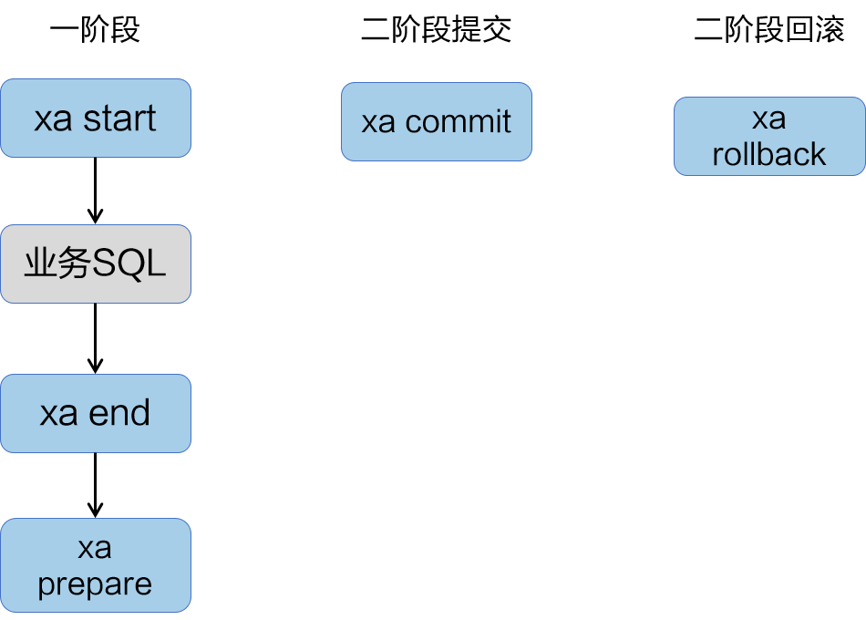

- **一阶段**

在 XA 模式的一阶段，Seata 会拦截“业务 SQL”，在“业务 SQL”之前开启 XA 事务（“xa start”），然后执行“业务 SQL”，结束 XA 事务“xa end”，最后预提交 XA 事务（“xa prepare”），这样便完成 “业务 SQL”的准备操作。

- **二阶段提交**

执行“xa commit”指令，提交 XA 事务，此时“业务 SQL”才算真正的提交至数据库。

- **二阶段回滚**

执行“xa rollback”指令，回滚 XA 事务，完成“业务 SQL”回滚，释放数据库锁资源。

XA 模式下，用户只需关注“业务 SQL”，Seata 会自动生成一阶段、二阶段提交和二阶段回滚操作。XA 模式和 AT 模式一样是一种对业务无侵入性的解决方案；但与 AT 模式不同的是，XA 模式将快照数据和行锁等通过 XA 指令委托给了数据库来完成，这样 XA 模式实现更加轻量化。


### 性能优化

**优化一：同库模式**

通常一个 TM 会产生一笔主事务日志，一个 RM 会产生一条分支事务日志，每个分布式事务由一个 TM 和若干 RM 组成，一个分布式事务总共会有  1+N 条事务日志（N 为 RM 个数）。

在默认情况下，分布式事务执行过程中客户端将事务日志发送给服务端，服务端再将事务日志存储至数据库中，一条事务日志的存储链路会有 2 次 TCP ，分别是“客户端到服务端”和“服务端到数据库”， 我们称这种模式为异库模式。

在异库模式下，分布式事务存储事务日志总共需要 2*（1+N） 次左右的 TCP 通信。在 RM 数量较少的业务场景下，分布式事务性能还能接受，但有些业务场景下 RM 数量较多，此时事务内 TCP 数量也会增多，分布式事务性能急剧下降。

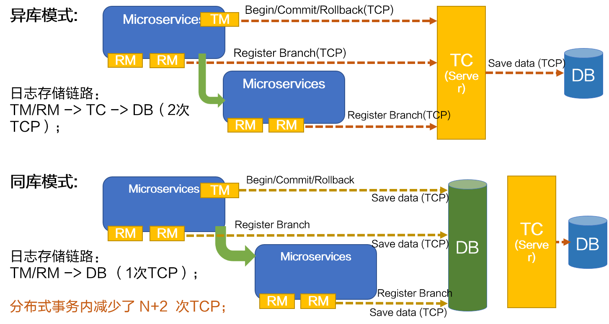

在事务执行过程中，客户端和服务端进行通信的目的是为了存储事务日志。如果客户端在存储事务日志时，绕过服务端直接将事务日志写入数据库（如上图“同库模式”所示），那么一笔事务日志的存储链路就由原来的 2 次 TCP  变成只需访问一次数据库便可，每条事务日志的存储减少了一次 TCP 通信，整个分布式事务就减少了 N+2 次 TCP  请求，分布式事务的性能大幅提升。**我们将客户端直接将事务日志存储至数据库的模式称为同库模式。**


**优化二：二阶段异步执行**

通常情况下，分布式事务发起方会依次执行一阶段和二阶段方法，然后结束分布式事务，返回结果。如果让分布式事务发起方执行完一阶段之后马上结束并返回结果，二阶段交由独立的线程或者进程异步执行，这样分布式事务的二阶段会晚几秒钟或者若干分钟执行，但事务的最终结果不会有任何改变。

二阶段异步执行之后，分布式事务的最终结果不会有任何影响，但是事务发起方要执行的内容减少一半（一阶段和二阶段都执行变成只执行一阶段），直观的用户感受是分布式事务的性能提升了 50%。


## 应用案例

### 订单库存案例

**电商经典模块**

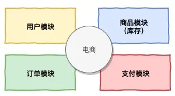

**下单流程图**

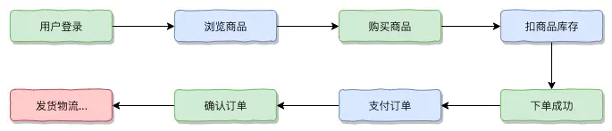

**创建订单和扣件库存场景**

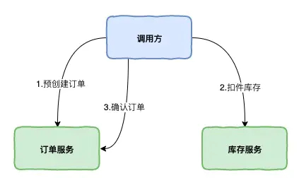

**分布式事务-技术方案**

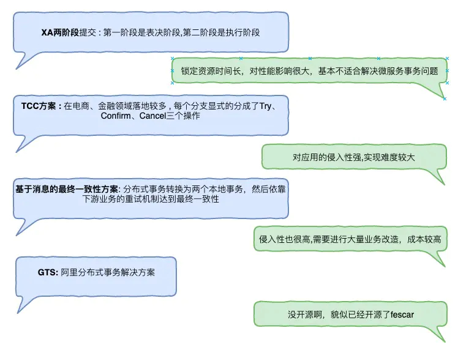


#### MQ消息事务-RocketMQ

先说说MQ的分布式事务，RocketMq在4.3版本已经正式宣布支持分布式事务，在选择Rokcetmq做分布式事务请务必选择4.3以上的版本。

事务消息作为一种异步确保型事务，  将两个事务分支通过 MQ 进行异步解耦，RocketMQ 事务消息的设计流程同样借鉴了两阶段提交理论，整体交互流程如下图所示：


这个时候我们基本可以认为，只有MQ发送方自己的本地事务执行完毕，那么MQ的订阅方必定百分百能够接收到消息，我们再对下单减库存的步骤进行改造。这里涉及到一个异步化的改造，我们理一下如果是同步流程中的各个步骤：

1. 查看商品详情（或购物车）
2. 计算商品价格和目前商品存在库存（生成订单详情）
3. 商品扣库存（调用商品库存服务）
4. 订单确认（生成有效订单）

订单创建完成后，发布一个事件“orderCreate” 到消息队列中，然后由MQ转发给订阅该消息的服务，因为是基于消息事务，我们可以认为订阅该消息的商品模块是百分百能收到这个消息的。

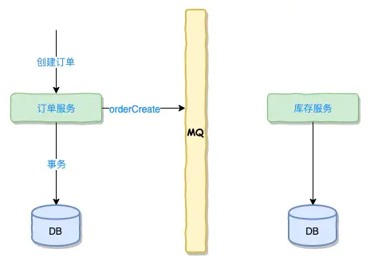

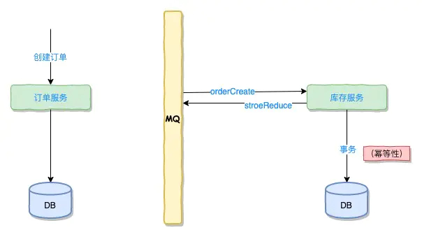

商品服务接受到orderCreate消息后就执行扣减库存的操作，注意⚠️，这里可能会有一些不可抗的因素导致扣减库存失败，无论成功或失败，商品服务都将发送一个扣减库存结果的消息“stroeReduce”到消息队列中，订单服务会订阅扣减库存的结果。订单服务收到消息后有两种可能：

- 如果扣减库存成功，将订单状态改为 “确认订单” ，下单成功
- 如果扣减库存失败，将订单状态改为 “失效订单” ，下单失败

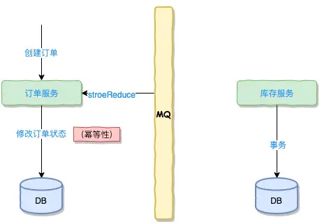

这种模式将确认订单的流程变成异步化，**非常适合在高并发的使用**，但是，切记了，这个需要前端用户体验的一些改变，要配合产品来涉及流程。

上面使用MQ的方式确实是可以完成A和B操作，但是A和B并不是严格一致性，而是最终一致性，我们牺牲掉严格一致性，换来性能的提升，这种很适合在大促高并发场景总使用，但是如果B一直执行不成功，那么一致性也会被破坏，后续应该考虑到更多的兜底方案，方案越细系统就将越复杂。


#### TCC方案

TCC是服务化的二阶段变成模型，每个业务服务都必须实现 try，confirm，calcel三个方法，这三个方式可以对应到SQL事务中Lock，Commit，Rollback。

- try阶段 try只是一个初步的操作，进行初步的确认，它的主要职责是完成所有业务的检查，预留业务资源
- confirm阶段 confirm是在try阶段检查执行完毕后，继续执行的确认操作，必须满足幂等性操作，如果confirm中执行失败，会有事务协调器触发不断的执行，直到满足为止
- cancel是取消执行，在try没通过并释放掉try阶段预留的资源，也必须满足幂等性，跟confirm一样有可能被不断执行

接下来看看，我们的下单扣减库存的流程怎么加入TCC：

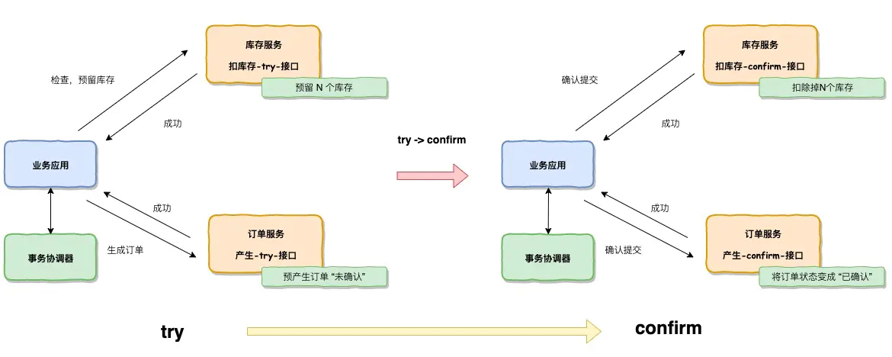

在try的时候，会让库存服务预留n个库存给这个订单使用，让订单服务产生一个“未确认”订单，同时产生这两个预留的资源， 在confirm的时候，会使用在try预留的资源，在TCC事务机制中认为，如果在try阶段能正常预留的资源，那么在confirm一定能完整的提交：

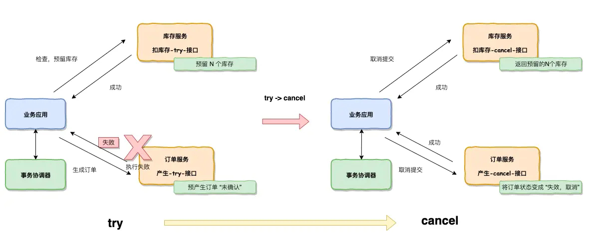

在try的时候，有任务一方为执行失败，则会执行cancel的接口操作，将在try阶段预留的资源进行释放。


### 下单扣减库存

**传统模式**

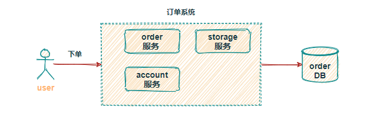

**分库分表**

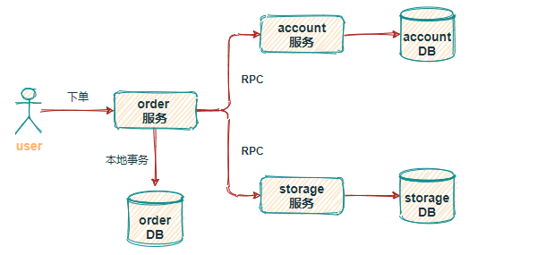

**Seata 优势**

实现分布式事务的方案比较多，常见的比如基于 `XA` 协议的 `2PC`、`3PC`，基于业务层的 `TCC`，还有应用消息队列 + 消息表实现的最终一致性方案，还有今天要说的 `Seata` 中间件，下边看看各个方案的优缺点。


#### 2PC

基于 XA 协议实现的分布式事务，XA 协议中分为两部分：事务管理器和本地资源管理器。其中本地资源管理器往往由数据库实现，比如 Oracle、MYSQL 这些数据库都实现了 XA 接口，而事务管理器则作为一个全局的调度者。

两阶段提交（`2PC`），对业务侵⼊很小，它最⼤的优势就是对使⽤⽅透明，用户可以像使⽤本地事务⼀样使⽤基于 XA 协议的分布式事务，能够严格保障事务 ACID 特性。

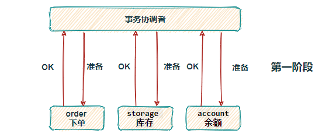

可 `2PC`的缺点也是显而易见，它是一个强一致性的同步阻塞协议，事务执⾏过程中需要将所需资源全部锁定，也就是俗称的 `刚性事务`。所以它比较适⽤于执⾏时间确定的短事务，整体性能比较差。

一旦事务协调者宕机或者发生网络抖动，会让参与者一直处于锁定资源的状态或者只有一部分参与者提交成功，导致数据的不一致。因此，在⾼并发性能⾄上的场景中，基于 XA 协议的分布式事务并不是最佳选择。

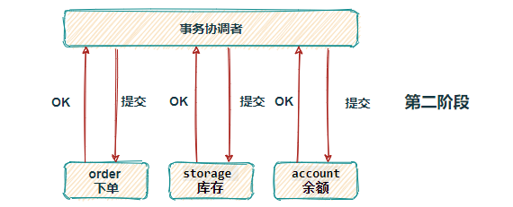


#### 3PC

三段提交（`3PC`）是二阶段提交（`2PC`）的一种改进版本 ，为解决两阶段提交协议的阻塞问题，上边提到两段提交，当协调者崩溃时，参与者不能做出最后的选择，就会一直保持阻塞锁定资源。

`2PC` 中只有协调者有超时机制，`3PC` 在协调者和参与者中都引入了超时机制，协调者出现故障后，参与者就不会一直阻塞。而且在第一阶段和第二阶段中又插入了一个准备阶段（如下图，看着有点啰嗦），保证了在最后提交阶段之前各参与节点的状态是一致的。

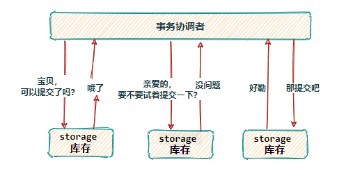

虽然 `3PC` 用超时机制，解决了协调者故障后参与者的阻塞问题，但与此同时却多了一次网络通信，性能上反而变得更差，也不太推荐。


#### TCC

所谓的 `TCC` 编程模式，也是两阶段提交的一个变种，不同的是 `TCC` 为在业务层编写代码实现的两阶段提交。`TCC` 分别指 `Try`、`Confirm`、`Cancel` ，一个业务操作要对应的写这三个方法。

以下单扣库存为例，`Try` 阶段去占库存，`Confirm` 阶段则实际扣库存，如果库存扣减失败 `Cancel` 阶段进行回滚，释放库存。

TCC 不存在资源阻塞的问题，因为每个方法都直接进行事务的提交，一旦出现异常通过则 `Cancel` 来进行回滚补偿，这也就是常说的补偿性事务。

原本一个方法，现在却需要三个方法来支持，可以看到 TCC 对业务的侵入性很强，而且这种模式并不能很好地被复用，会导致开发量激增。还要考虑到网络波动等原因，为保证请求一定送达都会有重试机制，所以考虑到接口的幂等性。


#### 消息事务

消息事务（最终一致性）其实就是基于消息中间件的两阶段提交，将本地事务和发消息放在同一个事务里，保证本地操作和发送消息同时成功。下单扣库存原理图：

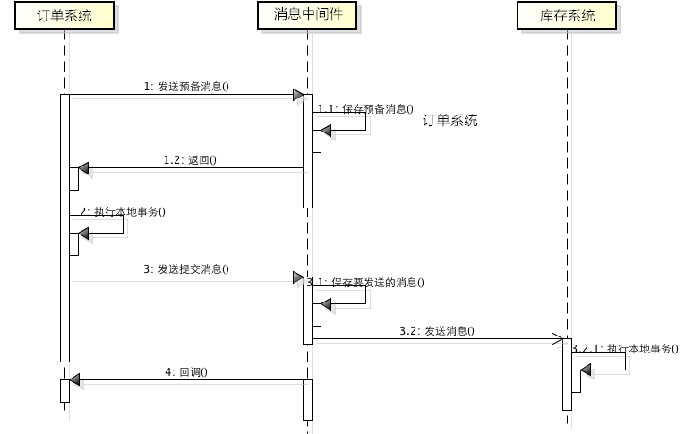

- 订单系统向 `MQ` 发送一条预备扣减库存消息， `MQ` 保存预备消息并返回成功 `ACK`
- 接收到预备消息执行成功 `ACK`，订单系统执行本地下单操作，为防止消息发送成功而本地事务失败，订单系统会实现 `MQ` 的回调接口，其内不断的检查本地事务是否执行成功，如果失败则 `rollback` 回滚预备消息；成功则对消息进行最终 `commit` 提交。
- 库存系统消费扣减库存消息，执行本地事务，如果扣减失败，消息会重新投，一旦超出重试次数，则本地表持久化失败消息，并启动定时任务做补偿。

基于消息中间件的两阶段提交方案，通常用在高并发场景下使用，牺牲数据的强一致性换取性能的大幅提升，不过实现这种方式的成本和复杂度是比较高的，还要看实际业务情况。


#### Seata

`Seata` 也是从两段提交演变而来的一种分布式事务解决方案，提供了 `AT`、`TCC`、`SAGA` 和 `XA` 等事务模式，这里重点介绍 `AT`模式。既然 `Seata` 是两段提交，那我们看看它在每个阶段都做了点啥？下边我们还以下单扣库存、扣余额举例。


先介绍 `Seata` 分布式事务的几种角色：

- `Transaction Coordinator(TC)`:  全局事务协调者，用来协调全局事务和各个分支事务（不同服务）的状态， 驱动全局事务和各个分支事务的回滚或提交
- `Transaction Manager™`:  事务管理者，业务层中用来开启/提交/回滚一个整体事务（在调用服务的方法中用注解开启事务）
- `Resource Manager(RM)`:  资源管理者，一般指业务数据库代表了一个分支事务（`Branch Transaction`），管理分支事务与 `TC` 进行协调注册分支事务并且汇报分支事务的状态，驱动分支事务的提交或回滚

Seata 实现分布式事务，设计了一个关键角色 `UNDO_LOG` （回滚日志记录表），我们在每个应用分布式事务的业务库中创建这张表，这个表的核心作用就是，将业务数据在更新前后的数据镜像组织成回滚日志，备份在 `UNDO_LOG` 表中，以便业务异常能随时回滚。


**第一个阶段**

比如：下边我们更新 `user` 表的 `name` 字段。

```mysql
update user set name = '小富最帅' where name = '程序员内点事'
```

首先 Seata 的 `JDBC` 数据源代理通过对业务 SQL 解析，提取 SQL 的元数据，也就是得到 SQL 的类型（`UPDATE`），表（`user`），条件（`where name = '程序员内点事'`）等相关的信息。

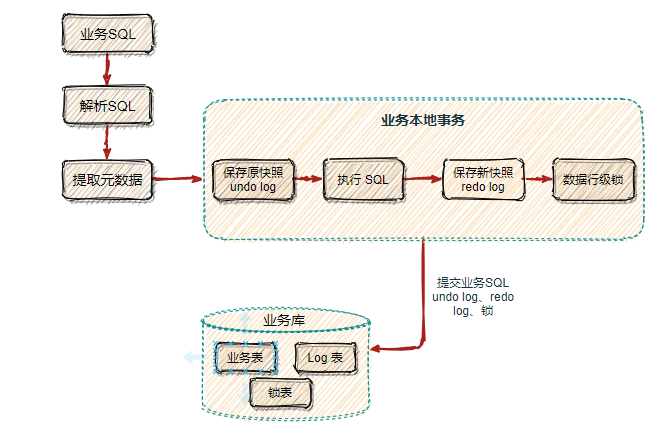

先查询数据前镜像，根据解析得到的条件信息，生成查询语句，定位一条数据。

```mysql
select  name from user where name = '程序员内点事'
```

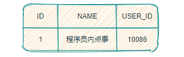

紧接着执行业务 SQL，根据前镜像数据主键查询出后镜像数据

```mysql
select name from user where id = 1
```

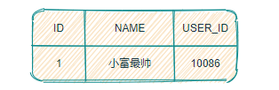

把业务数据在更新前后的数据镜像组织成回滚日志，将业务数据的更新和回滚日志在同一个本地事务中提交，分别插入到业务表和 `UNDO_LOG` 表中。

回滚记录数据格式如下：包括 `afterImage` 前镜像、`beforeImage` 后镜像、 `branchId` 分支事务ID、`xid` 全局事务ID

```json
{
    "branchId":641789253,
    "xid":"xid:xxx",
    "undoItems":[
        {
            "afterImage":{
                "rows":[
                    {
                        "fields":[
                            {
                                "name":"id",
                                "type":4,
                                "value":1
                            }
                        ]
                    }
                ],
                "tableName":"product"
            },
            "beforeImage":{
                "rows":[
                    {
                        "fields":[
                            {
                                "name":"id",
                                "type":4,
                                "value":1
                            }
                        ]
                    }
                ],
                "tableName":"product"
            },
            "sqlType":"UPDATE"
        }
    ]
}
```

这样就可以保证，任何提交的业务数据的更新一定有相应的回滚日志。

在本地事务提交前，各分支事务需向 `全局事务协调者` TC 注册分支 ( `Branch Id`) ，为要修改的记录申请 **全局锁** ，要为这条数据加锁，利用 `SELECT FOR UPDATE` 语句。而如果一直拿不到锁那就需要回滚本地事务。TM 开启事务后会生成全局唯一的 `XID`，会在各个调用的服务间进行传递。

有了这样的机制，本地事务分支（`Branch Transaction`）便可以在全局事务的第一阶段提交，并马上释放本地事务锁定的资源。相比于传统的 `XA` 事务在第二阶段释放资源，`Seata` 降低了锁范围提高效率，即使第二阶段发生异常需要回滚，也可以快速 从`UNDO_LOG` 表中找到对应回滚数据并反解析成 SQL 来达到回滚补偿。

最后本地事务提交，业务数据的更新和前面生成的 UNDO LOG 数据一并提交，并将本地事务提交的结果上报给全局事务协调者 TC。


**第二个阶段**

第二阶段是根据各分支的决议做提交或回滚：

如果决议是全局提交，此时各分支事务已提交并成功，这时 `全局事务协调者（TC）` 会向分支发送第二阶段的请求。收到 TC 的分支提交请求，该请求会被放入一个异步任务队列中，并马上返回提交成功结果给 TC。异步队列中会异步和批量地根据 `Branch ID` 查找并删除相应 `UNDO LOG` 回滚记录。

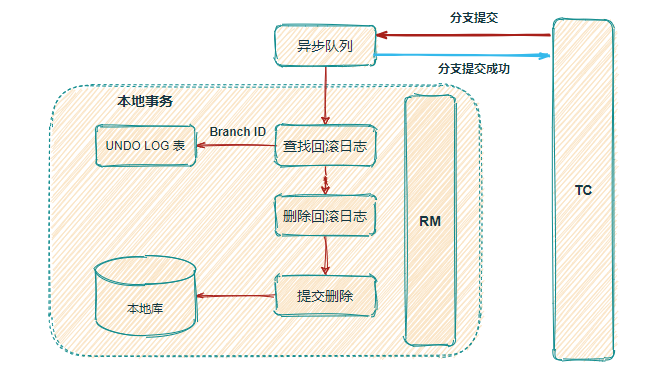

如果决议是全局回滚，过程比全局提交麻烦一点，`RM` 服务方收到 `TC` 全局协调者发来的回滚请求，通过 `XID` 和 `Branch ID` 找到相应的回滚日志记录，通过回滚记录生成反向的更新 SQL 并执行，以完成分支的回滚。

注意：这里删除回滚日志记录操作，一定是在本地业务事务执行之后

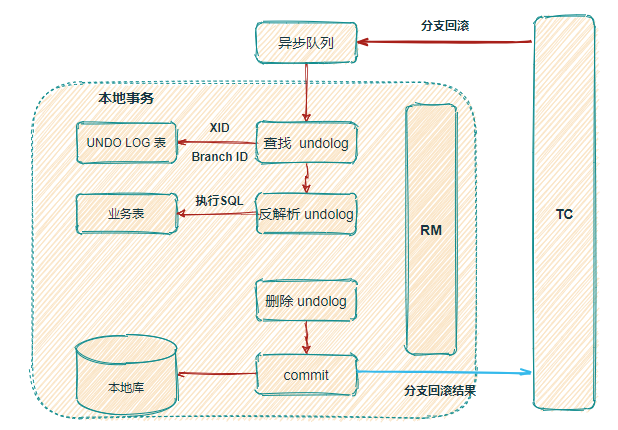

上边说了几种分布式事务各自的优缺点，下边实践一下分布式事务中间 Seata 感受一下。


### Seata 实践

Seata 是一个需独立部署的中间件，所以先搭 Seata Server，这里以最新的 `seata-server-1.4.0` 版本为例，下载地址：`https://seata.io/en-us/blog/download.html`。解压后的文件我们只需要关心 `\seata\conf` 目录下的 `file.conf` 和  `registry.conf` 文件。


#### Seata Server

**file.conf**

`file.conf` 文件用于配置持久化事务日志的模式，目前提供 `file`、`db`、`redis` 三种方式。

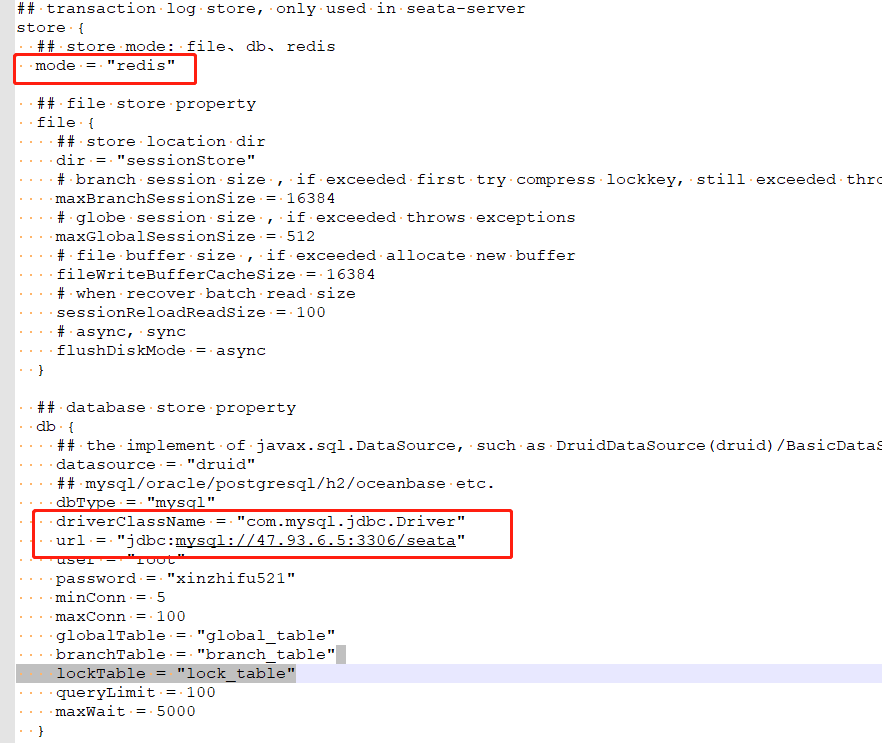

**注意**：在选择 `db` 方式后，需要在对应数据库创建 `globalTable`（持久化全局事务）、`branchTable`（持久化各提交分支的事务）、 `lockTable`（持久化各分支锁定资源事务）三张表。

```mysql
-- the table to store GlobalSession data
-- 持久化全局事务
CREATE TABLE IF NOT EXISTS `global_table`
(
    `xid`                       VARCHAR(128) NOT NULL,
    `transaction_id`            BIGINT,
    `status`                    TINYINT      NOT NULL,
    `application_id`            VARCHAR(32),
    `transaction_service_group` VARCHAR(32),
    `transaction_name`          VARCHAR(128),
    `timeout`                   INT,
    `begin_time`                BIGINT,
    `application_data`          VARCHAR(2000),
    `gmt_create`                DATETIME,
    `gmt_modified`              DATETIME,
    PRIMARY KEY (`xid`),
    KEY `idx_gmt_modified_status` (`gmt_modified`, `status`),
    KEY `idx_transaction_id` (`transaction_id`)
) ENGINE = InnoDB
  DEFAULT CHARSET = utf8;

-- the table to store BranchSession data
-- 持久化各提交分支的事务
CREATE TABLE IF NOT EXISTS `branch_table`
(
    `branch_id`         BIGINT       NOT NULL,
    `xid`               VARCHAR(128) NOT NULL,
    `transaction_id`    BIGINT,
    `resource_group_id` VARCHAR(32),
    `resource_id`       VARCHAR(256),
    `branch_type`       VARCHAR(8),
    `status`            TINYINT,
    `client_id`         VARCHAR(64),
    `application_data`  VARCHAR(2000),
    `gmt_create`        DATETIME(6),
    `gmt_modified`      DATETIME(6),
    PRIMARY KEY (`branch_id`),
    KEY `idx_xid` (`xid`)
) ENGINE = InnoDB
  DEFAULT CHARSET = utf8;

-- the table to store lock data
-- 持久化每个分支锁表事务
CREATE TABLE IF NOT EXISTS `lock_table`
(
    `row_key`        VARCHAR(128) NOT NULL,
    `xid`            VARCHAR(96),
    `transaction_id` BIGINT,
    `branch_id`      BIGINT       NOT NULL,
    `resource_id`    VARCHAR(256),
    `table_name`     VARCHAR(32),
    `pk`             VARCHAR(36),
    `gmt_create`     DATETIME,
    `gmt_modified`   DATETIME,
    PRIMARY KEY (`row_key`),
    KEY `idx_branch_id` (`branch_id`)
) ENGINE = InnoDB
  DEFAULT CHARSET = utf8;
```


**registry.conf**

`registry.conf` 文件设置 注册中心 和 配置中心：

目前注册中心支持 `nacos` 、`eureka`、`redis`、`zk`、`consul`、`etcd3`、`sofa` 七种，这里我使用的 `eureka`作为注册中心 ；配置中心支持 `nacos` 、`apollo`、`zk`、`consul`、`etcd3` 五种方式。

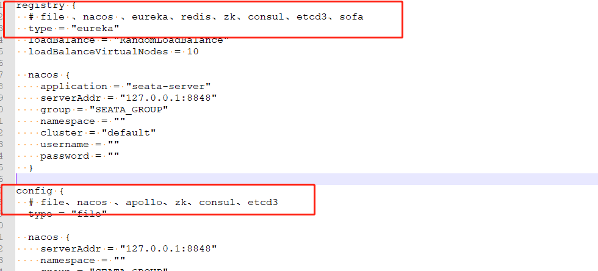

配置完以后在 `\seata\bin` 目录下启动 `seata-server` 即可，到这 `Seata` 的服务端就搭建好了。


#### Seata Client

`Seata Server` 环境搭建完，接下来我们新建三个服务 `order-server`（下单服务）、`storage-server`（扣减库存服务）、`account-server`（账户金额服务），分别服务注册到 `eureka`。

每个服务的大体核心配置如下：

```yaml
spring:
    application:
        name: storage-server
    cloud:
        alibaba:
            seata:
                tx-service-group: my_test_tx_group
    datasource:
        driver-class-name: com.mysql.jdbc.Driver
        url: jdbc:mysql://47.93.6.1:3306/seat-storage
        username: root
        password: root

# eureka 注册中心
eureka:
    client:
        serviceUrl:
            defaultZone: http://${eureka.instance.hostname}:8761/eureka/
    instance:
        hostname: 47.93.6.5
        prefer-ip-address: true
```

业务大致流程：用户发起下单请求，本地 order 订单服务创建订单记录，并通过 `RPC` 远程调用 `storage` 扣减库存服务和 `account` 扣账户余额服务，只有三个服务同时执行成功，才是一个完整的下单流程。如果某个服执行失败，则其他服务全部回滚。Seata 对业务代码的侵入性非常小，代码中使用只需用 `@GlobalTransactional` 注解开启一个全局事务即可。

```java
@Override
@GlobalTransactional(name = "create-order", rollbackFor = Exception.class)
public void create(Order order) {

    String xid = RootContext.getXID();

    LOGGER.info("------->交易开始");
    //本地方法
    orderDao.create(order);

    //远程方法 扣减库存
    storageApi.decrease(order.getProductId(), order.getCount());

    //远程方法 扣减账户余额
    LOGGER.info("------->扣减账户开始order中");
    accountApi.decrease(order.getUserId(), order.getMoney());
    LOGGER.info("------->扣减账户结束order中");

    LOGGER.info("------->交易结束");
    LOGGER.info("全局事务 xid： {}", xid);
}
```

前边说过 Seata AT 模式实现分布式事务，必须在相关的业务库中创建 `undo_log` 表来存数据回滚日志，表结构如下：

```mysql
-- for AT mode you must to init this sql for you business database. the seata server not need it.
CREATE TABLE IF NOT EXISTS `undo_log`
(
    `id`            BIGINT(20)   NOT NULL AUTO_INCREMENT COMMENT 'increment id',
    `branch_id`     BIGINT(20)   NOT NULL COMMENT 'branch transaction id',
    `xid`           VARCHAR(100) NOT NULL COMMENT 'global transaction id',
    `context`       VARCHAR(128) NOT NULL COMMENT 'undo_log context,such as serialization',
    `rollback_info` LONGBLOB     NOT NULL COMMENT 'rollback info',
    `log_status`    INT(11)      NOT NULL COMMENT '0:normal status,1:defense status',
    `log_created`   DATETIME     NOT NULL COMMENT 'create datetime',
    `log_modified`  DATETIME     NOT NULL COMMENT 'modify datetime',
    PRIMARY KEY (`id`),
    UNIQUE KEY `ux_undo_log` (`xid`, `branch_id`)
) ENGINE = InnoDB
  AUTO_INCREMENT = 1
  DEFAULT CHARSET = utf8 COMMENT ='AT transaction mode undo table';
```


#### 测试Seata

项目中的服务调用过程如下图：

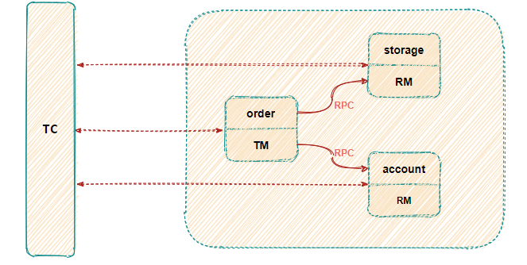

启动各个服务后，我们直接请求下单接口看看效果，只要 `order` 订单表创建记录成功，`storage` 库存表 `used` 字段数量递增、`account` 余额表 `used` 字段数量递增则表示下单流程成功。

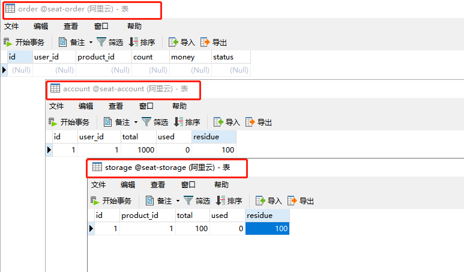

请求后正向流程是没问题的，数据和预想的一样

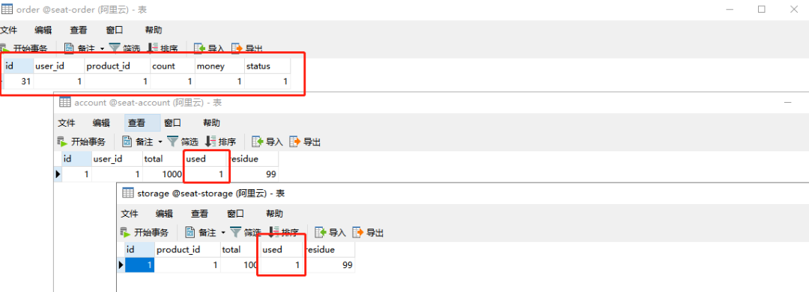而且发现 `TM` 事务管理者 `order-server` 服务的控制台也打印出了两阶段提交的日志

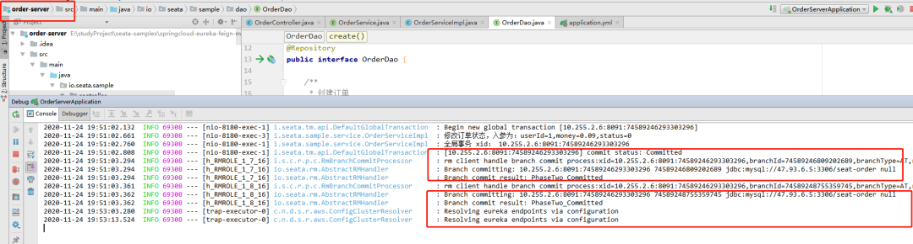那么再看看如果其中一个服务异常，会正常回滚呢？在 `account-server` 服务中模拟超时异常，看能否实现全局事务回滚。

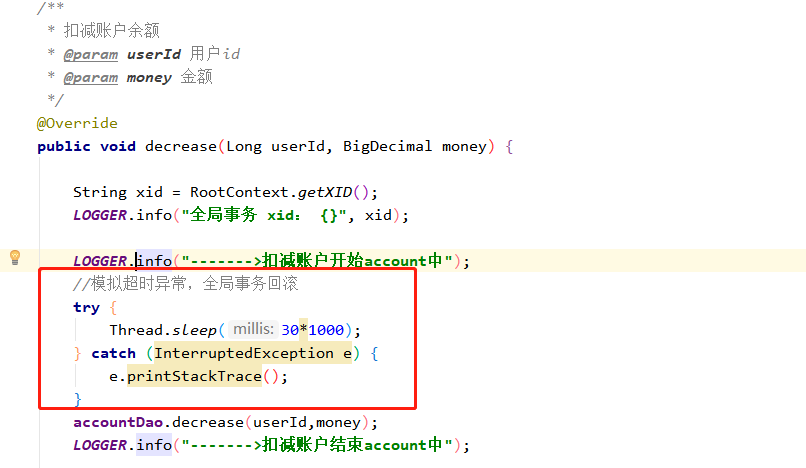

发现数据全没执行成功，说明全局事务回滚也成功了

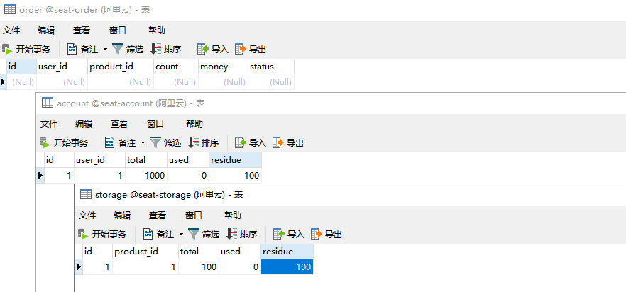

那看一下 `undo_log` 回滚记录表的变化情况，由于 `Seata` 删除回滚日志的速度很快，所以要想在表中看见回滚日志，必须要在某一个服务上打断点才看的更明显。

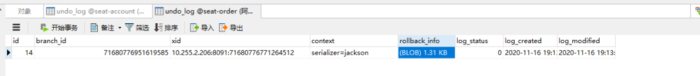


**总结**

上边简单介绍了 `2PC`、`3PC`、`TCC`、`MQ`、`Seata` 这五种分布式事务解决方案，还详细的实践了 `Seata` 中间件。但不管我们选哪一种方案，在项目中应用都要谨慎再谨慎，除特定的数据强一致性场景外，能不用尽量就不要用，因为无论它们性能如何优越，一旦项目套上分布式事务，整体效率会几倍的下降，在高并发情况下弊端尤为明显。


# 分库分表

随着公司业务快速发展，数据库中的数据量猛增，访问性能也变慢了，优化迫在眉睫。原因在于关系型数据库本身比较容易成为系统瓶颈，单机存储容量、连接数、处理能力都有限。当单表的数据量达到 **1000W** 或 **100G** 以后，由于查询维度较多，即使添加从库、优化索引，做很多操作时性能仍下降严重。解决上述问题通常有以下两种方案：

- **通过提升服务器硬件能力来提高数据处理能力，比如增加存储容量 、CPU 等，这种方案成本很高，并且如果瓶颈在 MySQL 本身那么提高硬件也是有很的**

- **把数据分散在不同的数据库中，使得单一数据库的数据量变小来缓解单一数据库的性能问题，从而达到提升数据库性能的目的**


**解决方案**

- **垂直分表：** 可以把一个宽表的字段按访问频次、是否是大字段的原则拆分为多个表，这样既能使业务清晰，还能提升部分性能。拆分后，尽量从业务角度避免联查，否则性能方面将得不偿失

- **垂直分库：** 可以把多个表按业务耦合松紧归类，分别存放在不同的库，这些库可以分布在不同服务器，从而使访问压力被多服务器负载，大大提升性能，同时能提高整体架构的业务清晰度，不同的业务库可根据自身情况定制优化方案。但是它需要解决跨库带来的所有复杂问题

- **水平分库：** 可以把一个表的数据(按数据行)分到多个不同的库，每个库只有这个表的部分数据，这些库可以分布在不同服务器，从而使访问压力被多服务器负载，大大提升性能。它不仅需要解决跨库带来的所有复杂问题，还要解决数据路由的问题

- **水平分表：** 可以把一个表的数据(按数据行)分到多个同一个数据库的多张表中，每个表只有这个表的部分数据，这样做能小幅提升性能，它仅仅作为水平分库的一个补充优化

一般来说，在系统设计阶段就应该根据业务耦合松紧来确定垂直分库，垂直分表方案，在数据量及访问压力不是特别大的情况，首先考虑缓存、读写分离、索引技术等方案。若数据量极大，且持续增长，再考虑水平分库水平分表方案。


**拆分目的**

- **垂直拆分：业务数据解耦**

- **水平拆分：解决容量和性能压力**


**分库分表前的问题**

- 用户请求量太大
  - 因为单服务器TPS，内存，IO都是有限的
  - **解决方法**：分散请求到多个服务器上； 其实用户请求和执行一个sql查询是本质是一样的，都是请求一个资源，只是用户请求还会经过网关，路由，http服务器等

- 单库太大
  - 单个数据库处理能力有限；单库所在服务器上磁盘空间不足；单库上操作的IO瓶颈
  - **解决方法**：切分成更多更小的库

- 单表太大
  - CRUD都成问题；索引膨胀，查询超时
  - **解决方法**：切分成多个数据集更小的表


## 垂直拆分

### 垂直分表

**垂直分表：将一个表按照字段分成多表，每个表存储其中一部分字段。**

我们拿网上商城举例：用户在浏览商品列表时，通常只会快速浏览商品名称、商品图片、商品价格等其他字段信息，这些字段数据访问频次较高。当只有对某商品感兴趣时才会查看该商品的详细描述。因此，商品信息中商品描述字段访问频次较低，且该字段存储占用空间较大，访问单个数据 IO 时间较长。

由于这两种数据的访问频次的不同，我们可以将商品信息表分成如下 2 张表：

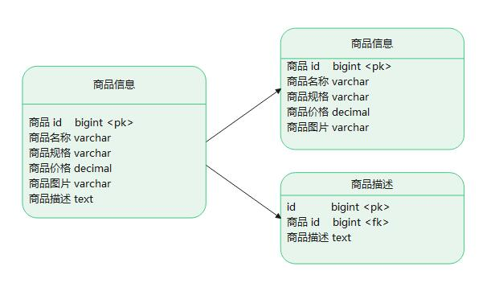

**优化提升：**

1. 为了避免 IO 争抢并减少锁表的几率，查看详情的用户与商品信息浏览互不影响
2. 充分发挥热门数据的操作效率，商品信息的操作的高效率不会被商品描述的低效率所拖累

**拆分原则：**

1. 把不常用的字段单独放在一张表
2. 把text，blob等大字段拆分出来放在附表中
3. 经常组合查询的列放在一张表中


### 垂直分库

**垂直分库：按照业务将表进行分类，分布到不同数据库上面，每个库可以放在不同服务器上，它的核心理念是专库专用。**

通过垂直分表性能得到了一定程度的提升，但是还没有达到要求，并且磁盘空间也快不够了，因为数据还是始终限制在一台服务器，库内垂直分表只解决了单一表数据量过大的问题，但没有将表分布到不同的服务器上，因此每个表还是竞争同一个物理机的CPU、内存、网络IO、磁盘。

继续拿商城举例：一个商城系统通常都包含用户信息表和商品信息表，这两张表在业务上是独立的，因此我们可以将它们拆开分到2个不同的库中。

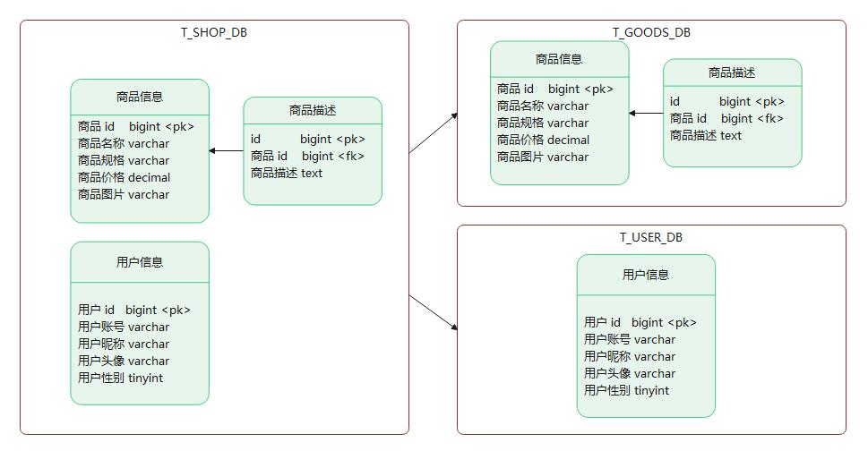

**优化提升：**

1. 解决业务层面的耦合，业务清晰
2. 能对不同业务的数据进行分级管理、维护、监控、扩展等
3. 高并发场景下，垂直分库一定程度的提升IO、数据库连接数、降低单机硬件资源的瓶颈


## 水平拆分

### 水平分库

**水平分库：把同一个表的数据按一定规则拆到不同的数据库中，每个库可以放在不同的服务器上。**

经过垂直分库后，数据库性能问题得到一定程度的解决，但是随着业务量的增长，单库存储数据已经超出预估。单台服务器已经无法支撑。此时该如何优化？垂直拆分已达到极限，只能从水平维度拆分。

继续拿商城举例：我们要查询某个商品信息时，需要分析这条商品信息的ID。如果ID为双数，将此操作映射至DB_1(商品库1)。如果店铺ID为单数，将操作映射至DB_2(商品库2)。此操作要访问数据库名称的表达式为DB_[商品信息ID % 2 + 1]。


**优化提升：**

1. 解决了单库大数据，高并发的性能瓶颈
2. 提高了系统的稳定性及可用性


### 水平分表

**水平分表：在同一个数据库内，把同一个表的数据按一定规则拆到多个表中。**

即便水平分库，随着业务的增长还是会出现单表数量大导致查询效率下降的问题。

按照水平分库的思路，我们可以对单表进行水平拆分：

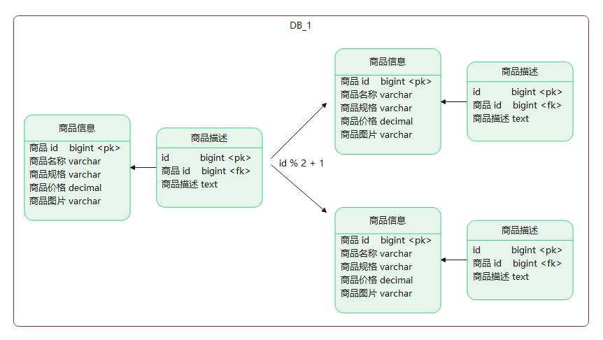

**优化提升：**

1. 优化单一表数据量过大而产生的性能问题
2. 避免IO争抢并减少锁表的几率


### 切分规则

#### Hash取模

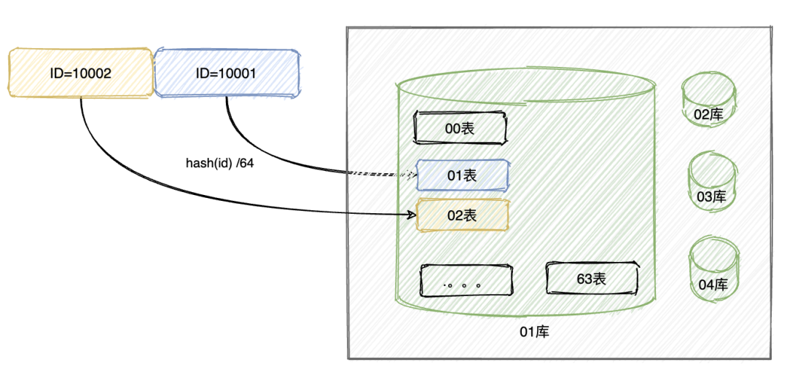

1. **优点**：经过 hash 取模之后，分到库和分到表中的数据，都是均衡的，所以，不会出现资源倾斜的问题
2. **缺点**：若后续遇到业务暴增，没有在我们预估范围内，则要涉及到数据迁移，那就需要重新hash , 迁移数据，修改路由等


#### Range划分

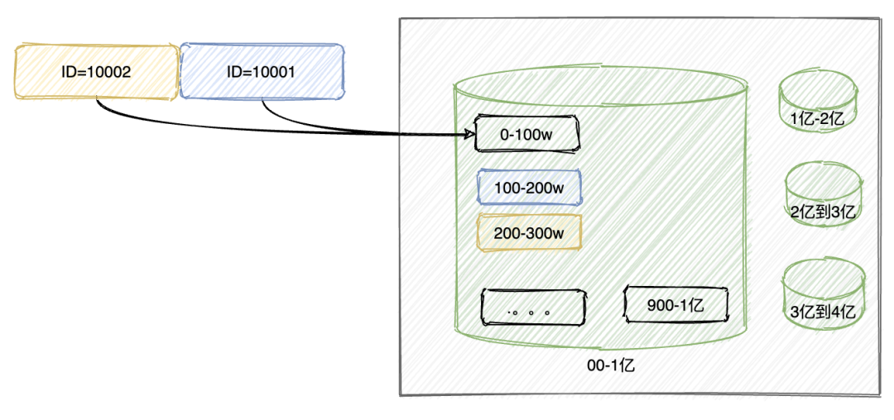

简单说，就是把数据划分范围，挨个存储，存满一个再存另一个。

1. **优点**：不需要数据迁移，后续数据即时增长很多也没问题
2. **缺点**：数据倾斜严重，比如上图，很长一段时间，都会只用到 1 个库，几个表


#### 一致性Hash

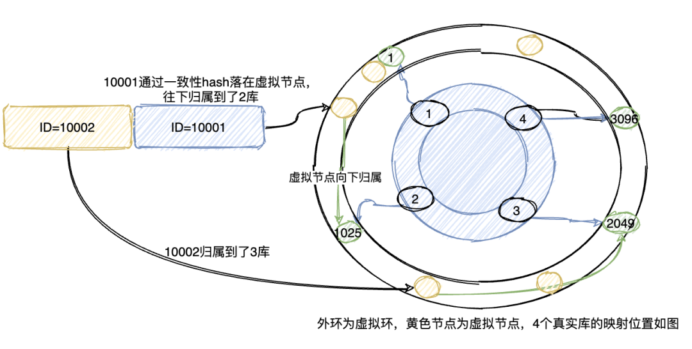

一致性 hash 环的节点一般按 2^32-1 来算，但是一般如果业务 ID 足够均衡，则可以降一些节点，如 4096 等等，4 个库的话，则均衡的分布在图上的位置，而数据通过 hash 计算，对应到外环的虚拟节点，然后归属于真实的库，对于表也可以同样处理。或者，直接把表节点部署在外环上，直接将数据归属于表。

1. **优点**：更加均匀，并且在需要扩容时，数据迁移的量级更小，只需要迁移 1/N 的数据即可
2. **缺点**：路由算法要复杂，但是对于能得到的好处，这点复杂度就可以忽略了


#### 地理区域划分

比如按照华东，华南，华北这样来区分业务，七牛云应该就是如此。


#### 时间范围划分

按照时间切分，就是将6个月前，甚至一年前的数据切出去放到另外的一张表，因为随着时间流逝，这些表的数据 被查询的概率变小，所以没必要和“热数据”放在一起，这个也是“冷热数据分离”。


## 面临问题

### 分布式事务问题

使用分布式事务中间件解决，具体是通过最终一致性还是强一致性分布式事务，看业务需求。


### 跨节点关联查询Join问题

切分之前，我们可以通过Join来完成。而切分之后，数据可能分布在不同的节点上，此时Join带来的问题就比较麻烦了，考虑到性能，尽量避免使用Join查询。解决这个问题的一些方法：

- **全局表**

  全局表，也可看做是 "**数据字典表**"，就是系统中所有模块都可能依赖的一些表，为了避免跨库Join查询，可以将 **这类表在每个数据库中都保存一份**。这些数据通常很少会进行修改，所以也不担心一致性的问题。

- **字段冗余**

  **利用空间换时间，为了性能而避免join查询**。例：订单表保存userId时候,也将userName冗余保存一份，这样查询订单详情时就不需要再去查询"买家user表"了。

- **数据组装**

  **在系统层面，分两次查询**。第一次查询的结果集中找出关联数据id，然后根据id发起第二次请求得到关联数据。最后将获得到的数据进行字段拼装。


### 跨节点分页、排序函数问题

跨节点多库进行查询时，会出现Limit分页、Order by排序等问题。分页需要按照指定字段进行排序，当排序字段就是分片字段时，通过分片规则就比较容易定位到指定的分片；当排序字段非分片字段时，就变得比较复杂了。需要先在不同的分片节点中将数据进行排序并返回，然后将不同分片返回的结果集进行汇总和再次排序，最终返回给用户。


### 全局主键避重问题

如果都用`主键自增`肯定不合理，如果用`UUID`那么无法做到根据主键排序，所以我们可以考虑通过`雪花ID`来作为数据库的主键，有关雪花ID可以参考我之前写的博客：静态内部类单例模式实现雪花算法。


### 数据迁移问题

采用`双写的方式`，修改代码，所有涉及到分库分表的表的增、删、改的代码，都要对新库进行增删改。同时，再有一个数据抽取服务，不断地从老库抽数据，往新库写，边写边按时间比较数据是不是最新的。


### 公共表

参数表、数据字典表等都是数据量较小，变动少的公共表，属于高频联合查询的依赖表。分库分表后，我们需要将这类表在每个数据库都保存一份，所有对公共表的更新操作都同时发送到所有分库执行。


## ShardingSphere

Apache ShardingSphere 是一套开源的分布式数据库解决方案组成的生态圈，它由 JDBC、Proxy 和 Sidecar（规划中）这 3 款既能够独立部署，又支持混合部署配合使用的产品组成。 它们均提供标准化的数据水平扩展、分布式事务和分布式治理等功能，可适用于如 Java 同构、异构语言、云原生等各种多样化的应用场景。

Apache ShardingSphere 旨在充分合理地在分布式的场景下利用关系型数据库的计算和存储能力，而并非实现一个全新的关系型数据库。 关系型数据库当今依然占有巨大市场份额，是企业核心系统的基石，未来也难于撼动，我们更加注重在原有基础上提供增量，而非颠覆。

Apache ShardingSphere 5.x 版本开始致力于可插拔架构，项目的功能组件能够灵活的以可插拔的方式进行扩展。 目前，数据分片、读写分离、数据加密、影子库压测等功能，以及对 MySQL、PostgreSQL、SQLServer、Oracle 等 SQL 与协议的支持，均通过插件的方式织入项目。 开发者能够像使用积木一样定制属于自己的独特系统。Apache ShardingSphere 目前已提供数十个 SPI 作为系统的扩展点，而且仍在不断增加中。


|            | ShardingSphere-JDBC | ShardingSphere-Proxy | ShardingSphere-Sidecar |
| :--------- | :------------------ | :------------------- | ---------------------- |
| 数据库     | 任意                | MySQL/PostgreSQL     | MySQL/PostgreSQL       |
| 连接消耗数 | 高                  | 低                   | 高                     |
| 异构语言   | 仅 Java             | 任意                 | 任意                   |
| 性能       | 损耗低              | 损耗略高             | 损耗低                 |
| 无中心化   | 是                  | 否                   | 是                     |
| 静态入口   | 无                  | 有                   | 无                     |


### ShardingSphere-JDBC

定位为轻量级 Java 框架，在 Java 的 JDBC 层提供的额外服务。 它使用客户端直连数据库，以 jar 包形式提供服务，无需额外部署和依赖，可理解为增强版的 JDBC 驱动，完全兼容 JDBC 和各种 ORM 框架。

- 适用于任何基于 JDBC 的 ORM 框架，如：JPA, Hibernate, Mybatis, Spring JDBC Template 或直接使用 JDBC
- 支持任何第三方的数据库连接池，如：DBCP, C3P0, BoneCP, Druid, HikariCP 等
- 支持任意实现 JDBC 规范的数据库，目前支持 MySQL，Oracle，SQLServer，PostgreSQL 以及任何遵循 SQL92 标准的数据库


1. 引入 maven 依赖

   ```xml
   <dependency>
       <groupId>org.apache.shardingsphere</groupId>
       <artifactId>shardingsphere-jdbc-core</artifactId>
       <version>${latest.release.version}</version>
   </dependency>
   ```

2. 规则配置

   ShardingSphere-JDBC 可以通过 `Java`，`YAML`，`Spring 命名空间`和 `Spring Boot Starter` 这 4 种方式进行配置，开发者可根据场景选择适合的配置方式。 详情请参见[配置手册](https://shardingsphere.apache.org/document/current/cn/user-manual/shardingsphere-jdbc/configuration/)。

3. 创建数据源

   通过 `ShardingSphereDataSourceFactory` 工厂和规则配置对象获取 `ShardingSphereDataSource`。 该对象实现自 JDBC 的标准 DataSource 接口，可用于原生 JDBC 开发，或使用 JPA, MyBatis 等 ORM 类库。

   ```java
   DataSource dataSource = ShardingSphereDataSourceFactory.createDataSource(dataSourceMap, configurations, properties);
   ```


### ShardingSphere-Proxy

定位为透明化的数据库代理端，提供封装了数据库二进制协议的服务端版本，用于完成对异构语言的支持。 目前提供 MySQL 和 PostgreSQL 版本，它可以使用任何兼容 MySQL/PostgreSQL 协议的访问客户端(如：MySQL Command Client, MySQL Workbench, Navicat 等)操作数据，对 DBA 更加友好。

- 向应用程序完全透明，可直接当做 MySQL/PostgreSQL 使用
- 适用于任何兼容 MySQL/PostgreSQL 协议的的客户端


1. 规则配置
   - 编辑`%SHARDINGSPHERE_PROXY_HOME%/conf/config-xxx.yaml`。详情请参见[配置手册](https://shardingsphere.apache.org/document/current/cn/user-manual/shardingsphere-proxy/configuration/)
   - 编辑`%SHARDINGSPHERE_PROXY_HOME%/conf/server.yaml`。详情请参见[配置手册](https://shardingsphere.apache.org/document/current/cn/user-manual/shardingsphere-proxy/configuration/)

2. 引入依赖

   如果后端连接 PostgreSQL 数据库，不需要引入额外依赖。如果后端连接 MySQL 数据库，请下载 `mysql-connector-java-5.1.47.jar`，并将其放入 `%SHARDINGSPHERE_PROXY_HOME%/lib` 目录。

3. 启动服务

   - 使用默认配置项

     ```shell
     sh %SHARDINGSPHERE_PROXY_HOME%/bin/start.sh
     ```

     默认启动端口为 `3307`，默认配置文件目录为：`%SHARDINGSPHERE_PROXY_HOME%/conf/`。

   - 自定义端口和配置文件目录

     ```shell
     sh %SHARDINGSPHERE_PROXY_HOME%/bin/start.sh ${proxy_port} ${proxy_conf_directory}
     ```

4. 使用ShardingSphere-Proxy

   执行 MySQL 或 PostgreSQL的客户端命令直接操作 ShardingSphere-Proxy 即可。以 MySQL 举例：

   ```shell
   mysql -u${proxy_username} -p${proxy_password} -h${proxy_host} -P${proxy_port}
   ```


### ShardingSphere-Sidecar(TODO)

定位为 Kubernetes 的云原生数据库代理，以 Sidecar 的形式代理所有对数据库的访问。 通过无中心、零侵入的方案提供与数据库交互的啮合层，即 `Database Mesh`，又可称数据库网格。

Database Mesh 的关注重点在于如何将分布式的数据访问应用与数据库有机串联起来，它更加关注的是交互，是将杂乱无章的应用与数据库之间的交互进行有效地梳理。 使用 Database Mesh，访问数据库的应用和数据库终将形成一个巨大的网格体系，应用和数据库只需在网格体系中对号入座即可，它们都是被啮合层所治理的对象。


1. 规则配置

   编辑`%SHARDINGSPHERE_SCALING_HOME%/conf/server.yaml`。详情请参见[使用手册](https://shardingsphere.apache.org/document/current/cn/user-manual/shardingsphere-scaling/usage/)。

2. 引入依赖

   如果后端连接 PostgreSQL 数据库，不需要引入额外依赖。如果后端连接 MySQL 数据库，请下载 `mysql-connector-java-5.1.47.jar`，并将其放入 `%SHARDINGSPHERE_SCALING_HOME%/lib` 目录。

3. 启动服务

   ```shell
   sh %SHARDINGSPHERE_SCALING_HOME%/bin/start.sh
   ```

4. 任务管理

   通过相应的 HTTP 接口管理迁移任务。详情参见[使用手册](https://shardingsphere.apache.org/document/current/cn/user-manual/shardingsphere-scaling/usage/)。


### 混合架构

ShardingSphere-JDBC 采用无中心化架构，适用于 Java 开发的高性能的轻量级 OLTP 应用；ShardingSphere-Proxy 提供静态入口以及异构语言的支持，适用于 OLAP 应用以及对分片数据库进行管理和运维的场景。

Apache ShardingSphere 是多接入端共同组成的生态圈。 通过混合使用 ShardingSphere-JDBC 和 ShardingSphere-Proxy，并采用同一注册中心统一配置分片策略，能够灵活的搭建适用于各种场景的应用系统，使得架构师更加自由地调整适合与当前业务的最佳系统架构。


**功能列表**

- 数据分片
  - 分库 & 分表
  - 读写分离
  - 分片策略定制化
  - 无中心化分布式主键

- 分布式事务
  - 标准化事务接口
  - XA 强一致事务
  - 柔性事务

- 数据库治理
  - 分布式治理
  - 弹性伸缩
  - 可视化链路追踪
  - 数据加密


# 全链路压测

## 达达全链路压测探索与实战

### 业界全链路压测

达达原压测方案是: 搭建一套跟线上 1:1 的压测环境, 在这套环境中进行压测, 此方案技术难度低, 实现简单, 但弊端也明显: 人力及机器成本随着生产环境规模的变大而变大; 于是我们调研了业界主流的 【流量打标】方案, 该方案原理是: 在请求的流量(HTTP,RPC,MQ)上打标，所打的标示随着请求在各个服务之间流转, 从而使得压测流量与线上流量隔离，在数据隔离这块:

- DB 层: 使用 影子库/影子表 隔离数据
- Cache 层: 使用 影子缓存 隔离数据
- MQ 层: 使用 影子队列 隔离数据

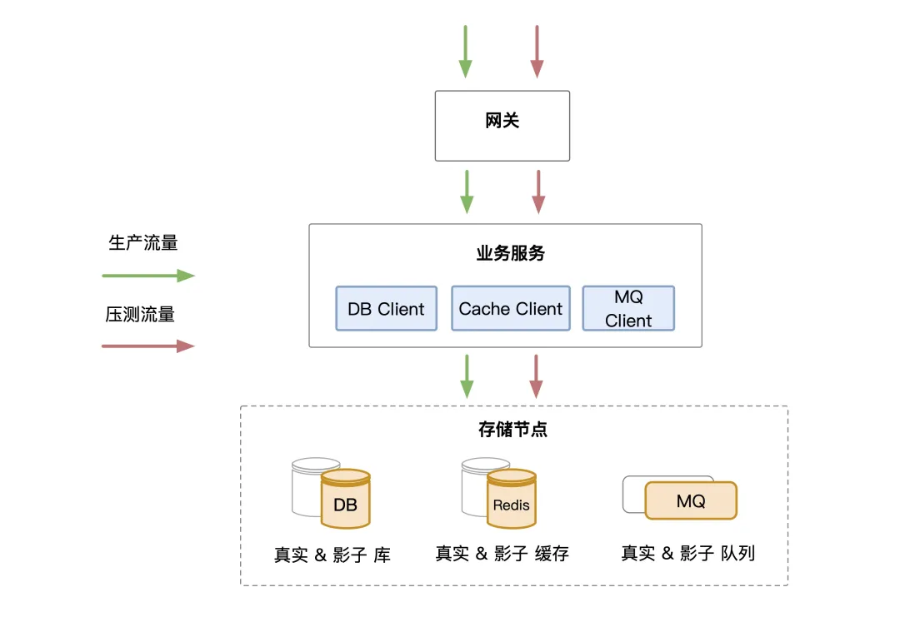

但这个方案适用于中间件统一的场景;而达达内部使用了各种类型的中间件, 比如 ORM 就有 Mybatis, Hiberante, JPA, 版本也不一致; 并且存在大量异构程序, 有 Java 的, 有Python 的; 若要实现【流量打标】方案, 势必会有大量业务改造, 因此我们放弃此方案。


### 达达全链路压测

在分析自身架构特点后, 我们在 2019年一季度研发了基于【机器打标】的压测方案 (数据使用 影子DB&Redis&MQ 隔离)。


以下是实现此方案的流程:

- **机器抽象化**: 所有 DB&Redis&ES 机器抽象成一个一个节点; 节点信息如下图
- **机器信息注册到注册中心**: 所有节点信息注册到注册中心
- **服务接入链路治理SDK**: 所有服务接入 "链路治理SDK", "链路治理SDK" 具有根据链路路由请求的能力

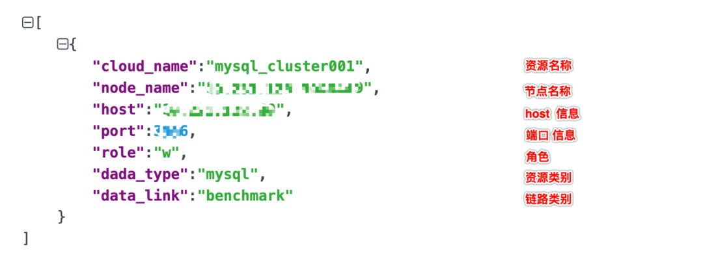

节点信息说明:

- **cloud_name**: 资源名称, 全局唯一, 一个资源可包含多个节点, 比如 mysql_cluster001 就可以包含一个主节点, 多个从节点
- **node_name**: 节点名称, 全局唯一, 通常使用 host+port
- **host**: host 信息
- **port**: 端口信息
- **role**: 角色, w: 写节点, r: 读节点
- **dada_type**: 资源类别, 有 mysql, redis, es 等
- **data_link**: 链路类别, 有 benchmark(压测), base(生产)

方案中最重要的是 "链路治理SDK", 它的职责是: 根据链路类别路由请求流量; 如下图所示: 

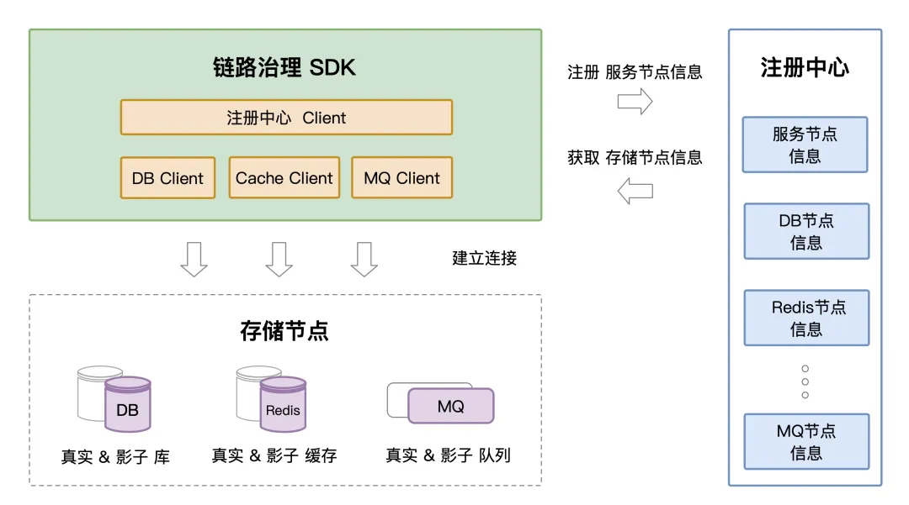

它的启动流程如下: 

1. 注册服务节点信息
2. 根据本机的链路类别, 获取对应链路的存储节点信息
3. 根据存储节点信息, 建立起 DB,Redis, MQ 连接

最终线上环境, 在机器维度形成两条链路, 处理生产流量的生产链路和处理压测流量的压测链路。


**方案比较**

下图是对【流量打标】【机器打标】的比较, 两种方案都有优缺点, 达达从安全及系统改造成本出发, 最终选择了【机器打标】方案。


### 压测平台

原压测方案使用 jmeter 进行压测, jmeter 属于老牌压测工具, 稳定性高且支持分布式; 但在压测场景复杂时，使用不够灵活; 达达的压测多数为复杂场景压测, 所以放弃原方案, 转而基于 jmeter 内核开发自己的压测平台; 以下是压测平台的整体架构:

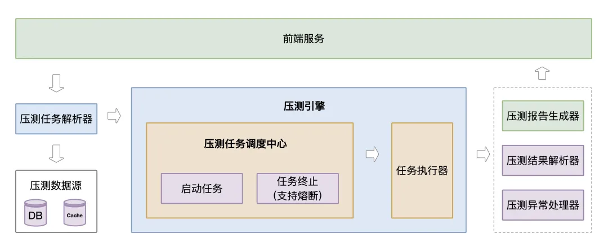

主要由以下几个核心模块构成:

- **前端服务**: 提供 压测任务填写, 压测任务启动/停止, 压测结果展示等功能。
- **压测任务解析器**: 主要负责压测任务的解析, 存储。
- **压测引擎**: 负责将压测任务调度到执行器上执行 (定时执行 & 立即执行)。
- **压测结果处理器**: 负责对压测接口返回值解析, 统计, 异常处理, 并生成报表。

新压测平台的优势在于: 具有可视化的操作界面, 压测结果实时动态产出; 研发人员在压测平台配置 "发压性能参数", "造数据脚本" 就能直接执行。

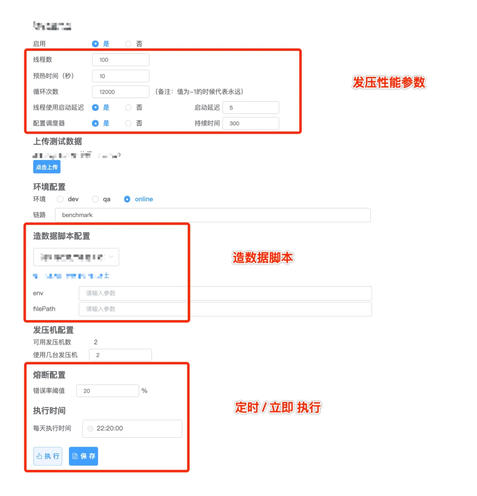

压测引擎在施压时, 对应压测结果 (TPS&响应&错误率) 会实时展示到前端界面。

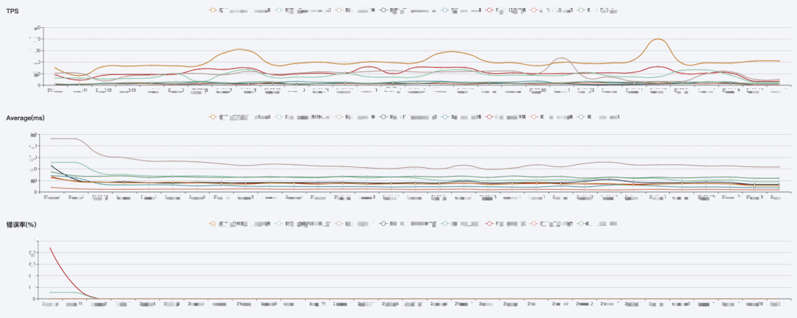


### 全链路压测落地

整个全链路压测的落地分成: 压测前, 压测中, 压测后:


其中 **压测前** 有三个关键点: 压测链路梳理, 优化预案设定, 精细化压测模型。


#### 链路梳理

链路的梳理非常重要, 它决定着压测链路需要部署哪些服务, 压测时哪些服务需要被关注。

以前达达通过人肉的方式梳理链路, 但是这种方案效率低, 不准确, 工作量大, 且当生产环境链路变更时, 我们不能即时感知到; 后面引入 APM(PinPoint), APM 有梳理链路的功能。

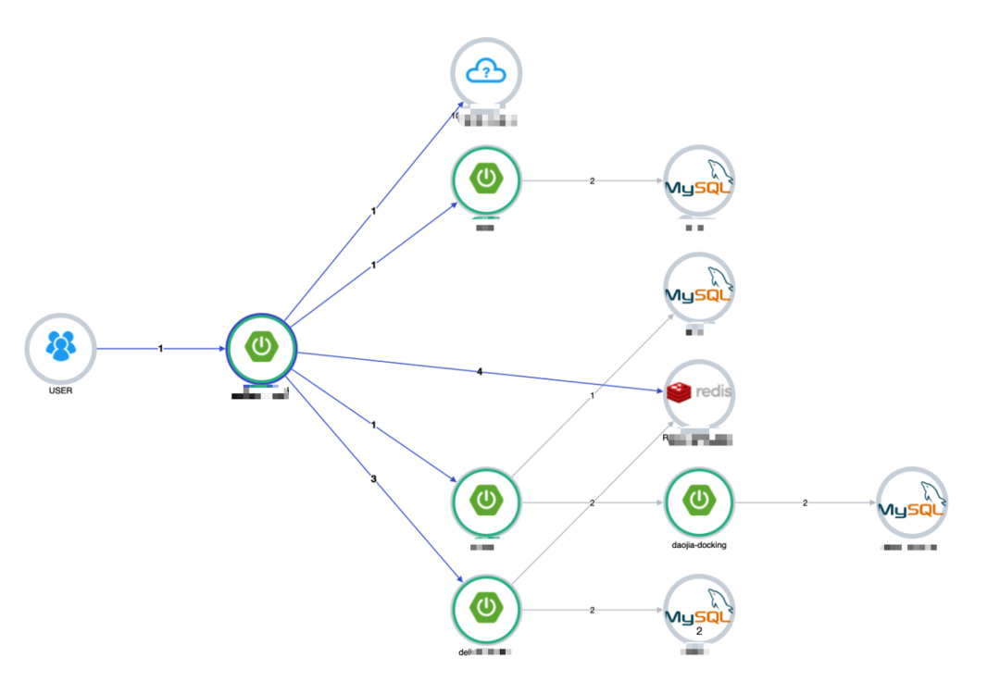

但此方案还是没解决: "实时感知链路变更" 的问题; 为此我们在开发环境拉了条链路, 定时发请求以检测是否链路通畅; 若链路依赖有变化, 我们就能立刻知道。


#### 优化预案设定

俗话说: 不打无准备之战, 压测就是为了提前发现高负载时系统可能出现的性能隐患, 那如何解决性能隐患呢? 通常在压测之前我们会准备一些性能优化预案, 常用预案如下:

- **线程池/连接池 打满**: 扩容线程池大小(服务CPU未超过阈值时) / 扩容业务服务
- **Mysql 主从延迟**: Mysql BinLog 调优 -> 升级机器配置 -> 垂直拆库 -> 水平拆库
- **Redis 带宽打满**: 带宽自动扩容
- **MQ 消息堆积**: 扩容消费消息的服务方

因过去几年的业务的发展, 导致生产环境数据库单表单库的数据量一直在增长, 达达物流系统多次碰到 **Mysql 主从延迟** ; 目前最常用的优化方案是 "Mysql BinLog 调优", 此方案主要调优以下两个参数:

- **binlog_group_commit_sync_delay**: 表示事务提交后, 等待多少时间, binlog 再同步到磁盘, 默认0, 表示不等待(单位微秒)
- **binlog_group_commit_sync_no_delay_count**: 表示等待多少事务提交后, binlog 再同步到磁盘

但此调优方案也有弊端: 参数调优后, 接口响应会有一定提升(如下图); 所以调优时需考虑业务能否容忍接口响应的上升。

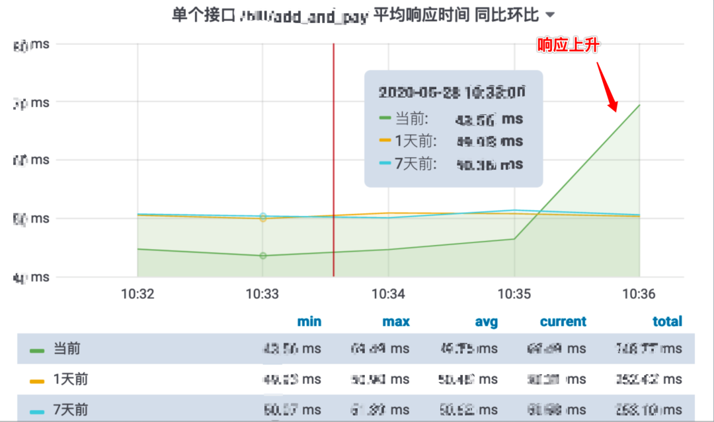


#### 精细化压测模型构建

随着业务的发展, 压测模型也在不断演进迭代中; 从一开始 "使用虚拟骑士, 单一按照接口TPS目标值压测" 到现在 "模拟生产活跃骑士, 引入时间&空间因素 构建压测模型", 模型越发精准。模型分成两类:

- **数据模型**: 骑士数据, 商户数据, 订单数据。
- **流量模型**: 订单下发, 配送履约。

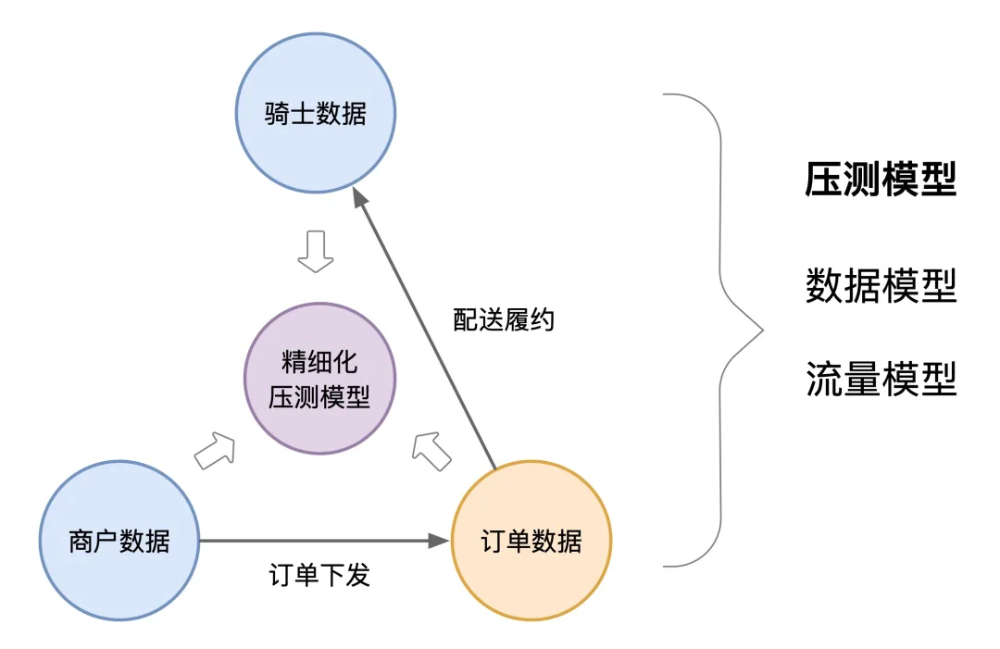


**数据模型** 

 把生产上活跃骑士&商户&订单导入影子库, 对这批数据进行清洗, 去除敏感信息(手机号, 地址信息等), 用这些数据进行压测; 此方案简单且能最真实的还原生产环境。


**流量模型**

业界常用 【流量回放】方案, 将大促时生产环境的流量存储下来, 然后在压测环境进行回放。

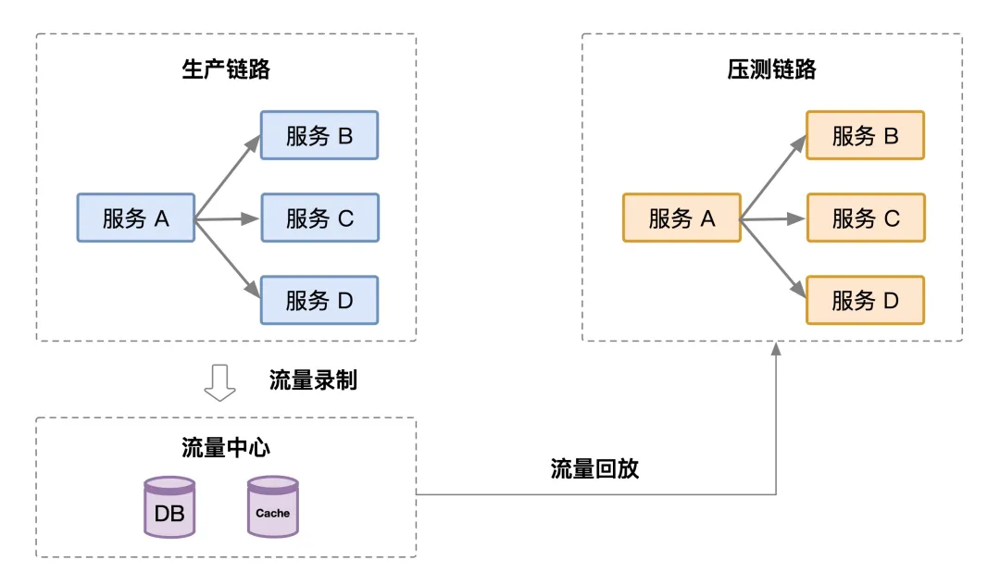

此方案适用于读接口的压测, 但是达达的业务场景复杂, 主流程接口多写少读; 所以直接使用此方案肯定不行。

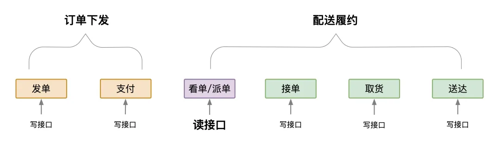

鉴于不能直接使用【流量回放】, 达达选择了【人工构造流量】。影响构造流量真实性主要有两大因素: 时间, 空间。


**时间**

在时间上, 达达一天有三个高峰期: 早&午&晚高峰, 每个高峰期 各个接口处于不同状态:

- **早高峰**: 发单, 接单, 订单详情 的请求量处于高峰, 其他接口请求量一般。
- **午&晚高峰**: 订单详情, 取货, 完成 的请求量处于高峰, 其他接口请求量一般。

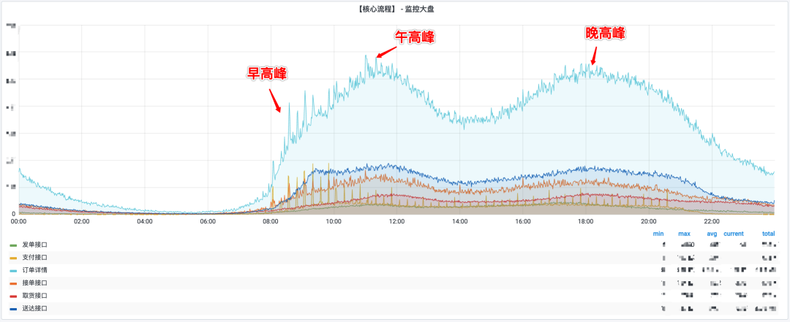

所以压测时, 达达根据业务接口三个高峰期的特点, 设计两个压测场景(午高峰与晚高峰接口状态类似, 合并成一个压测场景), 进行压测。


**空间**

在空间上, 订单与骑士不均匀分布在各地, 有些区域人多单少, 有些区域人少单多, 而对系统影响最大的是人多单多的热点区域。


达达有个 **查看周围X公里订单** 的接口, 这个接口的性能跟 热点区域的个数, 每个热点区域内的单量, 每个热点区域内的运力 关系比较大; 为了搞清这几点, 我们分析大促时生产的流量, 根据 geohash 把全国划分成一个个正方形区域, 统计每个正方形区域内的订单及运力; 最后再在压测环境还原并放大。

然后就是 **压测中**, 主要有这几块: 接口验证, 压测预热, 压测实施, 性能指标观察, 性能问题记录。其中压测预热非常重要, 它决定了压测结果的准确性。


#### 压测预热

早期每次压测得到的接口响应都比生产环境慢一点, 后面发现: 生产环境的部分数据是热数据, 而压测环境全是冷数据, 这导致压测刚开始进行时, 接口响应偏高, 等过了一分钟后, 响应逐渐降低并趋于平稳; 后面引入压测预热, 使得压测环境的数据, 部分是热数据, 部分是冷数据, 以达到跟生产环境数据一致的效果。

最后就是 **压测后**; 压测后主要是: 压测报告的生成, 性能隐患定位与优化, 系统容量预估, 压测复盘。下面说一下压测复盘。


#### 压测复盘

每次的大促复盘, 都能找到下次压测优化的方向; 复盘中最重要的是: 比较 生产与压测环境的 接口TPS&响应,中间件核心指标; 通过这些数据的比较来验证并优化 压测模型。


#### 总结与收益

全链路压测从 2019年一季度立项, 已经历了 4次大促压测考验, 并且完成了目标; 而在全链路压测实施的过程中, 我们认为有三大关键:

- **流量的隔离**: 基于【流量打标】, 达达研发出【机器打标】的隔离方案, 使得压测流量与生产流量完全隔离。 
- **数据的隔离**: 基于安全考虑, 达达选择 影子库, 影子缓存, 影子队列, 从而实现生产与压测数据的彻底隔离; 得益于这一点, 压测的实施在白天/晚上随时可进行。
- **精细化压测模型构建**: 压测模型是否跟生产环境相近, 直接影响了压测结果的准确性; 我们参考生产环境大促高峰期的流量, 从时间&空间维度分析, 制作出与大促时相近的压测流量, 从而保证数据模型的真实性。

整个项目的收益也非常明显, 具体从以下两方面分别来看:

- **稳定性**: 目前连续两年大促, 全链路压测每次都能挖掘出10 多项性能隐患, 从而保障了大促的平稳度过。
- **效率**: 相比原先搭建一套独立压测环境的方案, 现在的方案在机器成本上降低 40%, 人效上提升 65%。

当然此方案还有待提升的点, 比如 成本问题; 目前从安全角度出发, 达达通过影子库/缓存实现数据的隔离, 但影子库相比影子表方案机器成本高, 那如何在 安全与成本之间找到平衡, 是压测优化的方向; 另外, 除了挖掘系统隐患点, 全链路压测能否给 "智能运力调度" "运力的合理配置" 提出更多建议, 这也是我们思考的。


# 配置中心

产品功能特点比较：

| 功能点       | Spring Cloud Config                                    | Apollo                                    | Nacos                                |
| ------------ | ------------------------------------------------------ | ----------------------------------------- | ------------------------------------ |
| 开源时间     | 2014.9                                                 | 2016.5                                    | 2018.6                               |
| 配置实时推送 | 支持（Spring Cloud Bus）                               | 支持（HTTP长轮询1S内）                    | 支持（HTTP长轮询1S内）               |
| 版本管理     | 支持（Git）                                            | 支持                                      | 支持                                 |
| 配置回滚     | 支持（Git）                                            | 支持                                      | 支持                                 |
| 灰度发布     | 支持                                                   | 支持                                      | 待支持                               |
| 权限管理     | 支持                                                   | 支持                                      | 待支持                               |
| 多集群       | 支持                                                   | 支持                                      | 支持                                 |
| 多环境       | 支持                                                   | 支持                                      | 支持                                 |
| 监听查询     | 支持                                                   | 支持                                      | 支持                                 |
| 多语言       | 只支持java                                             | Go、C++、java、Python、PHP、.net、OpenAPI | Python、Java、Node.js、OpenAPI       |
| 单机部署     | Config-server+Git+Spring Cloud Bus（支持配置实时推送） | Apollo-quikstart+MySQL                    | Nacos单节点                          |
| 分布式部署   | Config-server+Git+MQ（部署复杂）                       | Config+Admin+Portal+MySQL（部署复杂）     | Nacos+MySQL（部署简单）              |
| 配置格式校验 | 不支持                                                 | 支持                                      | 支持                                 |
| 通信协议     | HTTP和AMQP                                             | HTTP                                      | HTTP                                 |
| 数据一致性   | Git保证数据一致性，Config-server从Git读数据            | 数据库模拟消息队列，Apollo定时读消息      | HTTP异步通知                         |
| 单机读       | 7（限流所致）                                          | 9000                                      | 15000                                |
| 单机写       | 5（限流所致）                                          | 1100                                      | 1800                                 |
| 3节点读      | 21（限流所致）                                         | 27000                                     | 45000                                |
| 3节点写      | 5（限流所致）                                          | 3300                                      | 5600                                 |
| 文档         | 详细                                                   | 详细                                      | 有待完善（目前只有java开发相关文档） |


## Apollo

## Nacos

## Spring Cloud Config


# 服务框架


## 注册中心

包括注册服务、订阅服务、服务变更通知、服务心跳发送等功能。Server端会在系统初始化时通过register模块注册服务，Client端在系统初始化时会通过register模块订阅到具体提供服务的Server列表，当Server 列表发生变更时也由register模块通知Client。

### Redis

### Zookeeper

### Nacos


## 集群容错/高可用策略

### 失效切换(Failover Cluster)

失败自动切换，当出现失败，重试其它服务器。


### 快速失败(Failfast Cluster)

快速失败，只发起一次调用，失败立即报错。通常用于非幂等性的写操作，比如新增记录。


### 失败安全(Failsafe Cluster)

失败安全，出现异常时，直接忽略。通常用于写入审计日志等操作。


### 失败自动恢复(Failback Cluster)

失败自动恢复，后台记录失败请求，定时重发。通常用于消息通知操作。


### 并行调用(Forking Cluster)

并行调用多个服务器，只要一个成功即返回。通常用于实时性要求较高的读操作，但需要浪费更多服务资源。


### 广播调用(Broadcast Cluster)

广播调用所有提供者，逐个调用，任意一台报错则报错。通常用于通知所有提供者更新缓存或日志等本地资源信息。


## 负载均衡

### Random LoadBalance

- **随机**，按权重设置随机概率。
- 在一个截面上碰撞的概率高，但调用量越大分布越均匀，而且按概率使用权重后也比较均匀，有利于动态调整提供者权重。


### RoundRobin LoadBalance

- **轮询**，按公约后的权重设置轮询比率。
- 存在慢的提供者累积请求的问题，比如：第二台机器很慢，但没挂，当请求调到第二台时就卡在那，久而久之，所有请求都卡在调到第二台上。


### LeastActive LoadBalance

- **最少活跃调用数**，相同活跃数的随机，活跃数指调用前后计数差。
- 使慢的提供者收到更少请求，因为越慢的提供者的调用前后计数差会越大。


### ConsistentHash LoadBalance

- **一致性 Hash**，相同参数的请求总是发到同一提供者。
- 当某一台提供者挂时，原本发往该提供者的请求，基于虚拟节点，平摊到其它提供者，不会引起剧烈变动。


## Filter

### AccessLogFilter


### AccessLimitFilter


### TraceFilter


### TimeoutFilter

用在provider侧，对超时的服务调用，打一个警告日志。


### MonitorFilter

在consumer,provider侧将服务的耗时，并发数等送给监控服务。


### CompatibleFilter

兼容适配器，能对结果返回值做一些类型转换，注入基本类型到装箱类型的互转，复合类型到序列化值的转换(依赖你配置的序列化类型)等。


### ExceptionFilter

在provider端，对调用异常进行选择性进行包装。非受检异常直接抛出，jdk的异常直接抛出，异常类与接口类在一个jar包内的直接抛出，是服务接口方法自己声明的要throw的异常直接抛出。其余包装成受检异常放到RpcResult中返回。


## 服务路由


